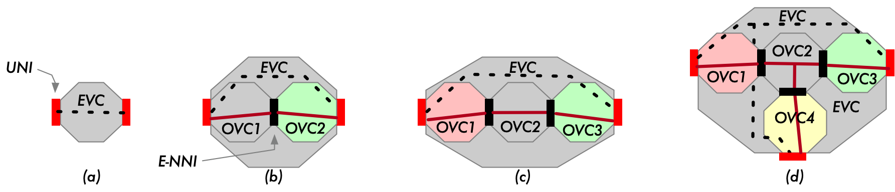
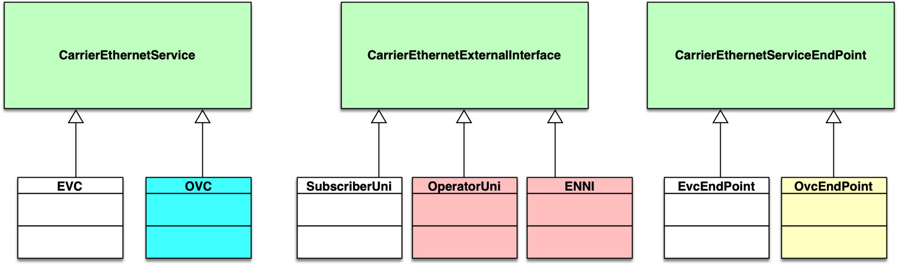

 <strong>Working Draft   MEF W106, v0.8</strong> 

 

 <strong>LSO Sonata Product Specification —  Access E-Line Requirements</strong> 

 <strong>July 2020</strong> 

 

 <strong>This draft represents MEF work in progress and is subject to change.</strong> 

Disclaimer
© MEF Forum 2020. All Rights Reserved.
 
The information in this publication is freely available for reproduction and use by any recipient and is believed to be accurate as of its publication date. Such information is subject to change without notice and MEF Forum (MEF) is not responsible for any errors. MEF does not assume responsibility to update or correct any information in this publication. No representation or warranty, expressed or implied, is made by MEF concerning the completeness, accuracy, or applicability of any information contained herein and no liability of any kind shall be assumed by MEF as a result of reliance upon such information.
The information contained herein is intended to be used without modification by the recipient or user of this document. MEF is not responsible or liable for any modifications to this document made by any other party.

The receipt or any use of this document or its contents does not in any way create, by implication or otherwise:

1. any express or implied license or right to or under any patent, copyright, trademark or trade secret rights held or claimed by any MEF member which are or may be associated with the ideas, techniques, concepts or expressions contained herein; nor
2. any warranty or representation that any MEF members will announce any product(s) and/or service(s) related thereto, or if such announcements are made, that such announced product(s) and/or service(s) embody any or all of the ideas, technologies, or concepts contained herein; nor
3. any form of relationship between any MEF member and the recipient or user of this document.

Implementation or use of specific MEF standards, specifications, or recommendations will be voluntary. This document is provided “as is” with no warranties whatsoever, express of implied, including without limitation, any warranties of merchantability, non-infringement, accuracy, completeness or fitness for any particular purpose. MEF and its members disclaim all liability, including liability for infringement of any proprietary rights, relating to use of information in this document.

 <strong>Table of Contents</strong> 

<!---Table Of Contents Here--->
- [1. List of Contributing Members](#1-list-of-contributing-members)
- [2. Abstract and Introduction](#2-abstract-and-introduction)
- [3. Terminology and Abbreviations](#3-terminology-and-abbreviations)
- [4. Overview of LSO-Sonata](#4-overview-of-lso-sonata)
- [5. Overview of Access E-Line Services](#5-overview-of-access-e-line-services)
  - [5.1. EVCs](#51-evcs)
  - [5.2. OVCs](#52-ovcs)
  - [5.3. Access E-Line](#53-access-e-line)
  - [5.4. Roles](#54-roles)
- [6. Data Model Design Principles](#6-data-model-design-principles)
- [7. Information Model for Access E-Line Product API](#7-information-model-for-access-e-line-product-api)
  - [7.1. Overview](#71-overview)
  - [7.2. Organization of Service Attributes](#72-organization-of-service-attributes)
- [8. Data Models for Access E-Line Product](#8-data-models-for-access-e-line-product)
  - [8.1. Technology Neutral](#81-technology-neutral)
  - [8.2. Organization and Structure of the JSON Schema](#82-organization-and-structure-of-the-json-schema)
    - [8.2.1. High Level Schema Structure](#821-high-level-schema-structure)
    - [8.2.2. Special Cases](#822-special-cases)
      - [8.2.2.1. OVC End Point Service Attributes](#8221-ovc-end-point-service-attributes)
      - [8.2.2.2. ENNI Service Attributes](#8222-enni-service-attributes)
- [9. Relationship Between Entities](#9-relationship-between-entities)
- [10. Access E-Line Service Attributes](#10-access-e-line-service-attributes)
  - [OVC Service Attributes (*ovc*)](#ovc-service-attributes-ovc)
  - [OVC End Point Service Attributes (*objOvcEP*)](#ovc-end-point-service-attributes-objovcep)
  - [Operator UNI Service Attributes (*operatorUNI*)](#operator-uni-service-attributes-operatoruni)
  - [ENNI (*enni*)](#enni-enni)
  - [ENNI Service Attributes (*objEnniService*)](#enni-service-attributes-objenniservice)
  - [ENNI Common Attributes (*objEnniCommon*)](#enni-common-attributes-objennicommon)
  - [Operator Multilateral Attributes (*objOperatorMultilateral*)](#operator-multilateral-attributes-objoperatormultilateral)
- [11. Common Objects](#11-common-objects)
  - [Bandwidth Profile (*objBWP*)](#bandwidth-profile-objbwp)
  - [Envelope (*objEnvelope*)](#envelope-objenvelope)
  - [COS Bandwidth Profile (*objCosBWP*)](#cos-bandwidth-profile-objcosbwp)
  - [VLAN Map (*objVlanMap*)](#vlan-map-objvlanmap)
  - [Conversation To Aggregation Link Map (*objConvToAggLink*)](#conversation-to-aggregation-link-map-objconvtoagglink)
  - [VLAN Range List (*objVlanRangeList*)](#vlan-range-list-objvlanrangelist)
  - [VLAN Range (*objVlanRange*)](#vlan-range-objvlanrange)
  - [L2CP Identifier (*objL2cpIdentifer*)](#l2cp-identifier-objl2cpidentifer)
  - [L2CP Protocol Identifier (*objL2cpProtocolIdentifier*)](#l2cp-protocol-identifier-objl2cpprotocolidentifier)
  - [EtherType (*objEtherType*)](#ethertype-objethertype)
  - [LLC Field (*objLLC*)](#llc-field-objllc)
  - [EtherTypeSubType (*objEtherTypeSubType*)](#ethertypesubtype-objethertypesubtype)
  - [Link Depth (*objLinkDepth*)](#link-depth-objlinkdepth)
  - [MEP Specification (*objMEPspec*)](#mep-specification-objmepspec)
  - [SA Limit (*objSaLimit*)](#sa-limit-objsalimit)
  - [CoS From OVC EP (*objCosFromOvcEp*)](#cos-from-ovc-ep-objcosfromovcep)
  - [CoS From S-Tag PCP (*objCosFromStagPcp*)](#cos-from-s-tag-pcp-objcosfromstagpcp)
  - [CoS From C-Tag PCP (*objCosFromCtagPcp*)](#cos-from-c-tag-pcp-objcosfromctagpcp)
  - [CoS From DSCP (*objCosFromDscp*)](#cos-from-dscp-objcosfromdscp)
  - [CoS to PCP List (*objCosPCPList*)](#cos-to-pcp-list-objcospcplist)
  - [CoS to PCP Map Entry (*objCosPcpMapEntry*)](#cos-to-pcp-map-entry-objcospcpmapentry)
  - [CoS to L2CP (*objCosL2cp*)](#cos-to-l2cp-objcosl2cp)
  - [CoS to DSCP Map (*objCosDscpMap*)](#cos-to-dscp-map-objcosdscpmap)
  - [CoS to DSCP Map Entry (*objCosDscpMapEntry*)](#cos-to-dscp-map-entry-objcosdscpmapentry)
  - [List of DSCP Values (*objDscpValues*)](#list-of-dscp-values-objdscpvalues)
  - [OVC Egress Map Items (*objOvcEgressMapItems*)](#ovc-egress-map-items-objovcegressmapitems)
  - [CNPCP List (*objCnPcpList*)](#cnpcp-list-objcnpcplist)
  - [CCDEI List (*objCcDeiList*)](#ccdei-list-objccdeilist)
  - [CCPCP List (*objCcPcpList*)](#ccpcp-list-objccpcplist)
  - [CNPCP (*objCnPcp*)](#cnpcp-objcnpcp)
  - [CCDEI (*objCcDei*)](#ccdei-objccdei)
  - [CCPCP (*objCcPcp*)](#ccpcp-objccpcp)
  - [SLS (*objSLS*)](#sls-objsls)
  - [Constant DISABLED (*objDisabled*)](#constant-disabled-objdisabled)
  - [Constant ALL (*objAll*)](#constant-all-objall)
- [12. Service Attributes Not Included](#12-service-attributes-not-included)
- [13. References](#13-references)

# 1. List of Contributing Members

The following members of the MEF participated in the development of this document and have requested to be included in this list.

# 2. Abstract and Introduction

This MEF Standard consisting of this Develop Guide and its associated software artifacts (JSON Schemas) defines and describes the product-specific payload for the LSO-Sonata API for the Access E-Line product. The document starts with an overview of LSO-Sonata and the Access E-Line Carrier Ethernet service. It then provides a basic information model for the MEF Carrier Ethernet Service Attributes including a table of all of the Service Attributes supported by the Access E-Line payload along the the characteristics of each. The final sections describe the Data Model in both a technology-independent way and a technology-specific way focused on JSON. The JSON model, itself, is an independent software artifact.

This document can be thought of as a "user's guide" for the API. MEF Services are described by a set of Service Attributes, specific information that is agreed between the provider and the user of the service, that describes some aspect of the service behavior or capability. The document the describes the Service Attributes for OVC-Based services (of which Access E-Line is one) is [MEF 26.2](https://wiki.mef.net/display/CESG/MEF+26.2+-+ENNI+and+Operator+Service+Attributes). That document specifies 72 Service Attributes to describe the various components that compose an OVC-based service. This document defines an API that includes 52 of those Service Attributes.

The following sections provide background on Lifecycle Services Orchestration and Access E-Line services. This is followed by an abbreviated information model that describes how the Service Attributes of MEF Carrier Ethernet Services are organized. A technology-independent overview of the data model is presented followed by an overview of the actual JSON Schemas. After this are tables of the Service Attributes that include the Service Attribute Name, JSON Name, description, the reference to the MEF standard and section, data type, and, when appropriate, validation notes that describe relationships between the various Service Attributes.

# 3. Terminology and Abbreviations

This section defines the terms used in this document. In many cases, the normative definitions to terms are found in other documents. In these cases, the third column is used to provide the reference that is controlling, in other MEF or external documents. If the reference includes an asterisk (*), the definition has been adapted from the original.   

<TABLE style="border:solid; border-width:1px; border-color:#aaaaaa; padding:4px;border-collapse: collapse; ">
<TR style="background-color:lightsalmon"><TD style="width:25%; text-align:center"><strong>Term</strong></TD><TD style="width:50%; text-align:center"><strong>Definition</strong></TD><td style="width:20%; text-align:center"><strong>Reference</strong></TD></TR>
<TR style="border-width: 1px; border-style: solid; border-color: grey">
<TD>Access E-Line</TD>
<TD>An E-Access Service based on a point-to-point OVC.</TD>
<TD style="text-align:center"><a href="https://wiki.mef.net/display/CESG/MEF+51.1+-+OVC+Services">MEF 51.1 <a></TD></TR>

<TR style="border-width: 1px; border-style: solid; border-color: grey">
<TD>Business Applications</TD>
<TD>The Service Provider functionality supporting Business Management Layer functionality (e.g., product catalog, ordering, billing, relationship management, etc.)</TD>
<TD style="text-align:center"><a href="https://wiki.mef.net/display/CESG/MEF+55+-+LSO+Reference+Architecture">MEF 55</a></TD></TR>

<TR style="border-width: 1px; border-style: solid; border-color: grey">
<TD>BUS</TD>
<TD>See <i>Business Applications</i></TD>
<TD style="text-align:center"><a href="https://wiki.mef.net/display/CESG/MEF+55+-+LSO+Reference+Architecture">MEF 55</a></TD></TR>

<TR style="border-width: 1px; border-style: solid; border-color: grey">
<TD>Business Functions</TD>
<TD>In the context of this document Business Functions refer to <em>Preorder Qualification (POQ)</em>, <em>Order</em>, <em>Quote</em>, and <em>Inventory</em>.</TD>
<TD style="text-align:center">This Document</TD></TR>

<TR style="border-width: 1px; border-style: solid; border-color: grey">
<TD>Buyer</TD>
<TD>A Customer or a Service Provider who is buying from a Partner. For the purposes of this document, a Buyer is the Service Provider who is ordering from a Partner (aka, Seller</TD>
<TD style="text-align:center"><a href="https://wiki.mef.net/display/CESG/MEF+57.1+-+Ethernet+Ordering+Business+Requirements+and+Use+Cases">MEF 57.1</a></TD></TR>

<TR style="border-width: 1px; border-style: solid; border-color: grey">
<TD>E-Access Service</TD>
<TD>An Operator Ethernet Service that associates at least one OVC End Point that is at a UNI and at least one OVC End Point that is at an ENNI.</TD>
<TD style="text-align:center"><a href="https://wiki.mef.net/display/CESG/MEF+51.1+-+OVC+Services">MEF 51.1 </a></TD></TR>

<TR style="border-width: 1px; border-style: solid; border-color: grey">
<TD>ENNI</TD>
<TD>A reference point representing the boundary between two Operator Carrier Ethernet Networks that are operated as separate administrative domains.</TD>
<TD style="text-align:center"><a href="https://wiki.mef.net/display/CESG/MEF+26.2+-+ENNI+and+Operator+Service+Attributes">MEF 26.2</a></TD></TR>

<TR style="border-width: 1px; border-style: solid; border-color: grey">
<TD>Ethernet Service Provider</TD>
<TD>An organization that provides to a Subscriber a connectivity service that carries Ethernet Frames irrespective of the underlying technology and that is specified using Service Attributes as defined in a MEF Standard.</TD>
<TD style="text-align:center"><a href="https://wiki.mef.net/display/CESG/MEF+10.4+-+Subscriber+Ethernet+Service+Attributes">MEF 10.4  *</a></TD></TR>

<TR style="border-width: 1px; border-style: solid; border-color: grey">
<TD>Ethernet UNI</TD>
<TD>The demarcation point between the responsibility of the Ethernet Service Provider and the Ethernet Service Subscriber (cf. Operator UNI)</TD>
<TD style="text-align:center"><a href="https://wiki.mef.net/display/CESG/MEF+10.4+-+Subscriber+Ethernet+Service+Attributes">MEF 10.4 </a></TD></TR>

<TR style="border-width: 1px; border-style: solid; border-color: grey">
<TD>EVC</TD>
<TD>An association of EVC End Points</TD>
<TD style="text-align:center"><a href="https://wiki.mef.net/display/CESG/MEF+10.4+-+Subscriber+Ethernet+Service+Attributes">MEF 10.4 </a></TD></TR>

<TR style="border-width: 1px; border-style: solid; border-color: grey">
<TD>EVC End Point</TD>
<TD>A construct at a (Ethernet) UNI that selects a subset of the Service Frames that pass over the UNI.</TD>
<TD style="text-align:center"><a href="https://wiki.mef.net/display/CESG/MEF+10.4+-+Subscriber+Ethernet+Service+Attributes">MEF 10.4 </a></TD></TR>

<TR style="border-width: 1px; border-style: solid; border-color: grey">
<TD>External Interface</TD>
<TD>Either a UNI or an ENNI.</TD>
<TD style="text-align:center"><a href="https://wiki.mef.net/display/CESG/MEF+4+-+MEN+Architecture+Framework">MEF 4</a></TD></TR>

<TR style="border-width: 1px; border-style: solid; border-color: grey">
<TD>Inventory</TD>
<TD>See <i>Product Inventory</i></TD>
<TD style="text-align:center">xxx</TD></TR>

<TR style="border-width: 1px; border-style: solid; border-color: grey">
<TD>Operator UNI</TD>
<TD>A UNI associated associated by an OVC End Point (cf. Ethernet UNI)</TD>
<TD style="text-align:center"><a href="https://wiki.mef.net/display/CESG/MEF+26.2+-+ENNI+and+Operator+Service+Attributes">MEF 26.2</a></TD></TR>

<TR style="border-width: 1px; border-style: solid; border-color: grey">
<TD>Order</TD>
<TD>xxx</TD>
<TD style="text-align:center">xxx</TD></TR>

<TR style="border-width: 1px; border-style: solid; border-color: grey">
<TD>Order Item</TD>
<TD>An orderable item that has its own action and lifecycle and is part of an Order. It can relate to the other items within the same Order.</TD>
<TD style="text-align:center"><a href="https://wiki.mef.net/display/CESG/MEF+57.1+-+Ethernet+Ordering+Business+Requirements+and+Use+Cases">MEF 57.1</a></TD></TR>

<TR style="border-width: 1px; border-style: solid; border-color: grey">
<TD>Operator Virtual Connection</TD>
<TD>An association of OVC End Points</TD>
<TD style="text-align:center"><a href="https://wiki.mef.net/display/CESG/MEF+26.2+-+ENNI+and+Operator+Service+Attributes">MEF 26.2</a></TD></TR>

<TR style="border-width: 1px; border-style: solid; border-color: grey">
<TD>OVC</TD>
<TD>See <i>Operator Virtual Connection</i></TD>
<TD style="text-align:center"><a href="https://wiki.mef.net/display/CESG/MEF+26.2+-+ENNI+and+Operator+Service+Attributes">MEF 26.2</a></TD></TR>

<TR style="border-width: 1px; border-style: solid; border-color: grey">
<TD>OVC End Point</TD>
<TD>An association of an OVC with a specific External Interface, i.e., Operator UNI or ENNI.</TD>
<TD style="text-align:center"><a href="https://wiki.mef.net/display/CESG/MEF+26.2+-+ENNI+and+Operator+Service+Attributes">MEF 26.2</a></TD></TR>

<TR style="border-width: 1px; border-style: solid; border-color: grey">
<TD>Partner</TD>
<TD>An organization providing Products and Services to the Service Provider in order to allow the Service Provider to instantiate and manage Service Components external to the Service Provider domain.</TD>
<TD style="text-align:center"><a href="https://wiki.mef.net/display/CESG/MEF+55+-+LSO+Reference+Architecture">MEF 55</a></TD></TR>

<TR style="border-width: 1px; border-style: solid; border-color: grey">
<TD>Product Inventory</TD>
<TD>The inventory managed by the seller resulting from Product Order completion.</TD>
<TD style="text-align:center"><a href="https://wiki.mef.net/display/CESG/MEF+81+-+LSO+Product+Inventory+Requirements+and+Use+Cases">MEF 81</a></TD></TR>

<TR style="border-width: 1px; border-style: solid; border-color: grey">
<TD>POQ</TD>
<TD>See *Product Offering Qualification*</TD>
<TD style="text-align:center"><a href="https://wiki.mef.net/display/CESG/MEF+79+-+LSO+Product+Serviceability+Requirements+and+Use+Cases">MEF 79</a></TD></TR>

<TR style="border-width: 1px; border-style: solid; border-color: grey">
<TD>Product Offering Qualification</TD>
<TD>One or more Product Offering Qualification Items formulated into a requirement made by a Buyer to a Seller.</TD>
<TD style="text-align:center"><a href="https://wiki.mef.net/display/CESG/MEF+79+-+LSO+Product+Serviceability+Requirements+and+Use+Cases">MEF 79</a></TD></TR>

<TR style="border-width: 1px; border-style: solid; border-color: grey">
<TD>Product Offering Qualification Item</TD>
<TD>An individual article included in a POQ that describes a Product of a particular type (Product Offering).  The objective is to determine if it is feasible for the Seller to deliver this item as described and for the Seller to inform the Buyer of the estimated time interval to complete this delivery. </TD>
<TD style="text-align:center"><a href="https://wiki.mef.net/display/CESG/MEF+79+-+LSO+Product+Serviceability+Requirements+and+Use+Cases">MEF 79</a></TD></TR>

<TR style="border-width: 1px; border-style: solid; border-color: grey">
<TD>Quote</TD>
<TD>xxx</TD>
<TD style="text-align:center">xxx</TD></TR>

<TR style="border-width: 1px; border-style: solid; border-color: grey">
<TD>Seller</TD>
<TD>A Service Provider or a Partner who is providing service to a Buyer. For the purposes of this document, a Seller is the Partner document who is providing the product to the Buyer.</TD>
<TD style="text-align:center"><a href="https://wiki.mef.net/display/CESG/MEF+57.1+-+Ethernet+Ordering+Business+Requirements+and+Use+Cases">MEF 57.1</a></TD></TR>

<TR style="border-width: 1px; border-style: solid; border-color: grey">
<TD>Service Attribute</TD>
<TD>Specific information that is agreed between the provider and the user of the service, that describes some aspect of the service behavior or capability.</TD>
<TD style="text-align:center"><a href="https://wiki.mef.net/display/CESG/MEF+10.4+-+Subscriber+Ethernet+Service+Attributes">MEF 10.4</a></TD></TR>

<TR style="border-width: 1px; border-style: solid; border-color: grey">
<TD>Service Provider</TD>
<TD>In the context of this document, a Service Provider is an Ethernet Service Provider.</TD>
<TD style="text-align:center">This Document</TD></TR>

<TR style="border-width: 1px; border-style: solid; border-color: grey">
<TD>Sonata</TD>
<TD> The Management Interface Reference Point supporting the management and operations interactions (e.g., ordering, billing, trouble management, etc.) between two network providers (e.g., Service Provider Domain and Partner Domain). For example, the Service Provider Business Applications may use Sonata to place an order to a Partner provider for an access service that is needed as a part of an end-to-end Connectivity Service. Since cross domain interactions are supported, additional security considerations need to be addressed on this Management Interface Reference Point.</TD>
<TD style="text-align:center"><a href="https://wiki.mef.net/display/CESG/MEF+55+-+LSO+Reference+Architecture">MEF 55</a></TD></TR>

<TR style="border-width: 1px; border-style: solid; border-color: grey">
<TD>Subscriber</TD>
<TD>In the context of this document, the end-user of an Ethernet Service.</TD>
<TD style="text-align:center"><a href="https://wiki.mef.net/display/CESG/MEF+10.4+-+Subscriber+Ethernet+Service+Attributes">MEF 10.4  *</a></TD></TR>

<TR style="border-width: 1px; border-style: solid; border-color: grey">
<TD>UNI</TD>
<TD>An Ethernet UNI or an Operator UNI depending on context</TD>
<TD style="text-align:center"><a href="https://wiki.mef.net/display/CESG/MEF+26.2+-+ENNI+and+Operator+Service+Attributes">MEF 26.2</a></TD></TR>

</TABLE>

# 4. Overview of LSO-Sonata

[MEF 55](https://wiki.mef.net/display/CESG/MEF+55+-+LSO+Reference+Architecture) describes the Reference Architecture for Lifecycle Service Orchestration (LSO) of MEF-defined connectivity services. MEF 55 defines seven LSO Reference Points that are abstract interconnection points between different domains - either within the service provider domain (intra-domain) or between service provider and other business entities (inter-domain). One of these LSO Reference Points is LSO Sonata which defines the abstract boundary point between a service provider and another operator which can provide wholesale (offnet) connectivity services to the service provider. It is at this boundary point - LSO Sonata - that the service provider and the partner operator access each other's Business Functionalities. Examples of inter-provider Business Functionalities include address qualification, product offering qualification, quotes, ordering, trouble ticketing, and billing/settlement. (Note that not all these have LSO Sonata APIs available yet).

|  |
|:--:|
| *LSO Reference Architecture* |

The mutual access to Business Functionalities is automated via APIs at LSO Sonata which are standardized by MEF as LSO Sonata APIs, and which are made available by MEF in a series of releases of the LSO Sonata SDK.

The LSO Sonata APIs comprise two parts - one is the product-agnostic Business Functionality, or Basic API Structure, and the second is the product-specific payload, or Information Payload, as shown in following [diagram](#T_M_Forum_Envelope).

|  |
|:--:|
| <i>TM-Forum API Envelope</i> |

This document defines the product-specific payload, shown as Data Model in the figure above, specifically for a MEF 3.0 Access E-Line service as defined in [MEF 51.1](https://wiki.mef.net/display/CESG/MEF+51.1+-+OVC+Services).

# 5. Overview of Access E-Line Services

## 5.1. EVCs

A Subscriber Ethernet Service is built on an Ethernet Virtual Connection (EVC) which is an association of Subscriber Ethernet UNIs (actually it is an association of EVC End Points, however each EVC EP is associated with a UNI, so externally the EVC looks like an association of UNIs). EVCs and their Service Attributes are described in [MEF 10.4](https://wiki.mef.net/display/CESG/MEF+10.4+-+Subscriber+Ethernet+Service+Attributes). There are three types of EVCs: point-to-point, multipoint-to-multipoint, and rooted-multipoint. [MEF 6.3](https://wiki.mef.net/display/CESG/MEF+6.3+-+EVC+Ethernet+Services+Definitions) defines three types of EVC services based on EVC type: E-Line (Ethernet Private Line and Ethernet Virtual Private Line), E-LAN (Ethernet Private LAN and Ethernet Virtual Private LAN), and E-Tree (Ethernet Private Tree and Ethernet Virtual Private Tree), respectively.

EVCs are sold to a Subscriber by an Ethernet Service Provider. In most cases, the Ethernet Service Provider is also a Network Operator that is provided some or all of the network resources for the EVC. If all of the UNIs in an EVC are accessible on the Service Provider's network, then the SP can deliver the EVC without having to coordinate with other Network Operators. This is discussed in a later section of the document.

## 5.2. OVCs

If one or more of the UNIs associated by an EVC is not accessible to the Ethernet Service Provider's network, the Service Provide must purchase access to the UNI or UNIs from a Network Operator that does have access. In this case, the EVC is composed of a set of Operator Virtual Connections (OVCs) where each OVC represents the part of the EVC that is provided by one Network Operator. OVCs and their Service Attributes are described in [MEF 26.2](https://wiki.mef.net/display/CESG/MEF+26.2+-+ENNI+and+Operator+Service+Attributes). As with EVCs, there are three types of OVCs: point-to-point, multipoint-to-multipoint, and rooted multipoint.

The Network Operators connect to each other at ENNIs and each OVC delivers Ethernet Frames between the various External Interfaces, UNIs and ENNIs, within the Network Operator's footprint. So, whereas an EVC associates a set of UNIs, an OVC associates one or more E-NNIs and zero or more UNIs.

[MEF 51.1](https://wiki.mef.net/display/CESG/MEF+51.1+-+OVC+Services) describes a set of OVC-based Services. It describes three generic service types, O-LINE, O-LAN, and O-TREE, based on the three types of OVCs. In MEF 51.1, an OVC that contains at least one UNI is referred to as an *access OVC* and an OVC that contains only ENNIs is referred to as a *transit* OVC. MEF 51.1 also defines some specific service types. An O-LINE service that includes one UNI is an Access E-Line Service and an O-LINE service that includes only ENNIs is a Transit E-Line Service. Similarly, there are Access E-LAN and Transit E-LAN Services.

## 5.3. Access E-Line

As noted above, an Access E-Line Service is a point-to-point OVC-based service. Since an OVC must associated at least one ENNI, and an Access OVC must associated at least one UNI, an Access E-Line service connects exactly one UNI to exactly one ENNI. The Access E-Line service can be used to deliver E-Line, E-LAN, and E-Tree EVCs. The following [diagram](#AEL) shows some of the possibilities.

|  |
|:--:|
| *OVCs and Access E-Line Services* |

In the diagram, in cases (a), (b), and \(c\), Ethernet Service Provider *Gray* is delivering E-Line EVCs to the subscriber. In case (d) they are delivering an E-LAN EVC with three UNIs. In case (a) the E-Line service (EVC) is delivered entirely by Service Provider *Gray* on its own network since both UNIs are accessible to it. In case (b) the right hand UNI is not accessible on *Gray*'s network, so *Gray* purchases OVC2 from Network Operator *Green* in order to reach it. OVC2 is an access OVC and it is a point-to-point OVC so it is an **Access E-Line Service**. OVC1 is also, technically an **Access E-Line**. Case (c) is a bit more complex. SP *Gray* does not have access to either UNI. It purchases an Access E-Line from Operator *Red* (OVC1) and another one from Operator *Green* (OVC3) and provides a transit OVC (Transit E-Line) between them. In case (d), Service Provider Gray (again) does not have access to any of the UNIs so it purchases three **Access E-Line Services**, OVC1 from *Red*, OVC3 from *Green*, and OVC4 from *Yellow*, and ties them together with OVC2, a Transit E-LAN service.

In cases (b), \(c\), and (d), Service Provider *Gray* is buying **Access E-Line Services** from other Network Operators. The LSO-Sonata API with the Access E-Line payload as described in this specification allows the Business Functions associated with purchasing these services (POQ, Quote, Order, and Inventory) to be performed programmatically.

## 5.4. Roles
<!---2-xxx--->

Carrier Ethernet Services are carried over Carrier Ethernet Networks operated by Network Operators. These are real live networks with wires and fiber and switches, etc. An EVC Service Provider purchases OVCs from Network Operators in order to compose the EVC. Frequently, the EVC Service Provider is one of the Network Operators. This is the case in the diagram above for Service Provider / Network Operator *Gray*.

But it doesn't have to be that way. There is no reason that a third party organization--a systems integrator or unrelated Service Provider--could not purchase OVCs from other Network Operators and sell an EVC to the Subscriber, for example as shown with Service Provider *Blue* in the left-hand diagram below.

|  |
|:--:|
| Service Providers and Network Operators |     

But now that Network Operators *Gray* and *Green* have decided to allow a third party to buy OVCs in their networks and, in effect, buy access to the ENNI between them, why just one? Why not allow Service Provider *Yellow* to do the same thing, as shown in the right hand picture? (And, of course, Service Provider *Yellow* might actually be *Gray*).

This topic is relevant to this document because the Attributes associated with the ENNI are partitioned into groups based on which organizations need to agree on which attributes. This is discussed later in the document.

# 6. Data Model Design Principles

The design for the API Schema is based on a number of assumptions

1. The requirements for which attributes are necessary at POQ, Quote and Order time differ (each should still be a subset, mathematically speaking, of the successive steps).  If the same set of attributes, again mathematically speaking, are needed across POQ, Quote and Order, then the number of use-cases goes down significantly.

2. The requirements for which attributes are allowed when changing an Access E-Line are different from when “installing” one. (general principle)

3. We won’t support qualifying, quoting for, or ordering an E-NNI.  This will be a process that sits outside the “Sonata flow”, but we do need to be able to retrieve it from the inventory so you can reference it in the Access E-Line order (or qualification or quote).

4. UNIs can’t be changed once ordered.  There may be a requirement to move them, but this to me is an installation (UNI at new location) and a disconnect (UNI at previous location), as there is often a requirement for a smooth transition with minimum downtime.

These assumptions are shown graphically in the following table.

<TABLE style="border:solid; border-width:1px; border-color:#aaaaaa; padding:4px; width:900px; border-collapse:collapse">
<TR style="background-color:lightsalmon"><TD style="width:250px; text-align:center"><strong>Business Function</strong></TD><TD style="width:250px; text-align:center"><strong>Operation</strong></TD><td style="width:140px; text-align:center"><strong>UNI</strong></TD>
<td style="width:140px; text-align:center"><strong>OVC</strong></TD>
<td style="width:140px; text-align:center"><strong>ENNI</strong></TD>
</TR>
<TR style="background-color:#bbbbbb"><TD rowspan="2" style="vertical-align:middle">POQ</TD><TD>Install</TD><TD style="text-align:center">X</TD><TD style="text-align:center">X</TD><TD style="text-align:center">-</TD></TR>
<TR style="background-color:#bbbbbb"><TD>Change</TD><TD style="text-align:center">-</TD><TD style="text-align:center">X</TD><TD style="text-align:center">-</TD></TR>

<TR style="background-color:#dddddd"><TD rowspan="2" style="vertical-align:middle">Quote</TD><TD>Install</TD><TD style="text-align:center">X</TD><TD style="text-align:center">X</TD><TD style="text-align:center">-</TD></TR>
<TR style="background-color:#dddddd"><TD>Change</TD><TD style="text-align:center">-</TD><TD style="text-align:center">X</TD><TD style="text-align:center">-</TD></TR>

<TR style="background-color:#bbbbbb"><TD rowspan="2" style="vertical-align:middle">Order</TD><TD>Install</TD><TD style="text-align:center">X</TD><TD style="text-align:center">X</TD><TD style="text-align:center">-</TD></TR>
<TR style="background-color:#bbbbbb"><TD>Change</TD><TD style="text-align:center">-</TD><TD style="text-align:center">X</TD><TD style="text-align:center">-</TD></TR>

<TR style="background-color:#dddddd"><TD rowspan="1" style="vertical-align:middle">Inventory</TD><TD>Retrieve</TD><TD style="text-align:center">X</TD><TD style="text-align:center">X</TD><TD style="text-align:center">X</TD></TR>

</TABLE>

# 7. Information Model for Access E-Line Product API

## 7.1. Overview

Carrier Ethernet Services are composed of three primary classes of objects: the Virtual Connection (EVC or OVC), the External Interfaces (EIs, UNI and ENNI), and the Service End Points.

Subscriber UNIs and Operator UNIs are coincident but represent agreements between different parties: the Ethernet Service Provider and the Subscriber in the first case, and the Ethernet Service Provider and a Network Operator in the second. Therefore they are represented by a different set of Service Attributes.

The function that logically connects the EVC or OVC to each External Interface is the Service End Point (EVC End Point or OVC End Point). Although an abstract element, the End Point can be thought of as the container for the EVC or OVC Service Attributes that can vary independently at each External Interface. For example, the OVC Type (is the OVC point-point or multipoint?) is an OVC Service Attribute, it is invariant at all points in the OVC. However, which VLAN(s) to map to the service or how much bandwidth to allow into the service are attributes of the OVC that can be different at each UNI, and these Service Attributes are encapsulated in the OVC (or EVC) End Point.

All of these elements are shown in the following diagram.

|  |
|:--:|
| *Components of an EVC and OVC* |

In this diagram, the EVC Service Provider (green octagon) is building the EVC on two OVCs, one that it is providing itself to reach UNI 2 (yellow octagon) and an Access E-Line Service that it is buying from another Network Operator (blue octagon). In reality, the OVC across the yellow octagon is likely also an Access E-Line service, but since there is no buyer/seller (the Service Provider is providing it to itself), there aren't parties to agree on Service Attribute values.

## 7.2. Organization of Service Attributes

Access E-Line is an OVC Service that provides access to a single UNI from a single ENNI. Therefore, the primary components of Access E-Line are the OVC, the Operator UNI, the ENNI, and two OVC End Points, one at the UNI and one at the ENNI (as shown in the blue octagon in the diagram).

Access E-Line configuration is based on the Service Attributes documented in [MEF 26.2](https://wiki.mef.net/display/CESG/MEF+26.2+-+ENNI+and+Operator+Service+Attributes). The MEF Services Model (MSM) for Carrier Ethernet described in MEF 7.4 defines three superclasses for all EVC and OVC services, the Service (Virtual Connection), the External Interface, and the Service End Point. These superclasses are shown in green in the following diagram along with their sub-classes. The sub-classes relevant to Access E-Line are shown in the color boxes.

|  |
|:--:|
| *Carrier Ethernet Superclasses* |

In the context of an Access E-Line Service, and the Service Attributes in [MEF 26.2](https://wiki.mef.net/display/CESG/MEF+26.2+-+ENNI+and+Operator+Service+Attributes), these components are organized as follows (the colors in the following diagram are intended to match the colors in the previous diagram):

|  |
|:--:|
| *Access E-Line Information Model* |

# 8. Data Models for Access E-Line Product

## 8.1. Technology Neutral

The Sonata API is based on the TM-Forum API format approach with a product-agnostic envelope and a product-specific payload. The structure of the API has three parts.

|  |
|:--:|
| *API Hierarchy/Structure*

This specification covers the Product Specific payload (red) for one product, Access E-Line. The Product/Service-agnostic envelope (green) is documented separately for each Business Function. 

- Pre-order Qualification (PoQ) is documented in [MEF 79](https://wiki.mef.net/display/CESG/MEF+79+-+LSO+Product+Serviceability+Requirements+and+Use+Cases)
- Quote is documented in [MEF 80](https://wiki.mef.net/display/CESG/MEF+80+-+LSO+Product+Quotation+Requirements+and+Use+Cases+-+Draft+Standard)
- Order is documented in MEF 57.2 (in development)
- Inventory is documented in [MEF 81](https://wiki.mef.net/display/CESG/MEF+81+-+LSO+Product+Inventory+Requirements+and+Use+Cases)

The Access E-Line product has three order items, the OVC (including the OVC End Points), the OperatorUNI, and the ENNI. This is shown in the following diagram.

|  |
|:--:|
| *Order Items in API Context* |

Each of the three order items associated with Access E-Line, OVC, OperatorUNI, and ENNI is described by a Payload Schema for each of the Business Functions. The result is for Access E-Line there are twelve separate schemas {4 Business Functions} x {3 order items}.

## 8.2. Organization and Structure of the JSON Schema

### 8.2.1. High Level Schema Structure

The six groups of Attributes listed in section 11 are split into the three order-item schema as follows:

 

<TABLE style="width: 900px; border:solid; border-width:1px; border-color:#aaaaaa; padding:4px">
<TR style="background-color:lightsalmon"><TD style="width:300px; text-align:center"><strong>OVC</strong></TD><TD style="width:300px; text-align:center"><strong>Operator UNI</strong></TD><td style="width:300px; text-align:center"><strong>ENNI</strong></td></TR>
<TR><td style="text-align:left">OVC Service Attributes</td><td style="text-align:center">OperatorUNI Service Attributes</td><TD style="text-align:center">ENNI Service Attributes</TD></TR>
<TR><td style="text-align:left">OVC End Point Service Attributes</td><td style="text-align:center">&nbsp;</td><TD style="text-align:center">ENNI Common Attributes</TD></TR>
<TR><td style="text-align:left">&nbsp;</td><td style="text-align:center">&nbsp;</td><TD style="text-align:center">ENNI Multilateral Attributes</TD></TR>
</TABLE>

 

Each order-item (OVC, UNI, ENNI) has a JSON Schema for each Business Function. The schema differences between Business Functions (e.g., between Order and Quote) fall into two categories:

1. Inclusion - i.e., some Service Attributes may be included for some Business Functions and have no relevance for other Business Functions and are therefore not included in the schema for those Business Functions.

2. Required/optional - Some of the properties for some Service Attributes and for some referenced objects may be *required* for some Business Functions and not for others and this is reflected in the schema for validation purposes.

The important thing to note is that there is no difference in the definition of the Service Attribute and objects themselves. If a property is defined as a 'list of 3 strings' or a reference to object *bwp* for one Business Function, it is defined that way for all Business Functions (where the attribute is included).

The first part of each schema contains the Service Attributes for the order-item. The *description* for each Service Attribute includes the Service Attribute Name and the reference for the Service Attributes (almost always from [MEF 26.2](https://wiki.mef.net/display/CESG/MEF+26.2+-+ENNI+and+Operator+Service+Attributes)). 

This is followed by a *definitions* section that contains all of the objects referenced by the Service Attributes. These are all named *objXXX* and are listed in section 12, below. Following is an example of the OVC schema.

|  |
|:--:|
| Example Schema Structure |

### 8.2.2. Special Cases

There are two special cases for how some of the [MEF 26.2](https://wiki.mef.net/display/CESG/MEF+26.2+-+ENNI+and+Operator+Service+Attributes) Service Attributes are included in the schemas: OVC End Point Service Attributes, and ENNI-related Service Attributes.

#### 8.2.2.1. OVC End Point Service Attributes

OVC End Points are not separately orderable items. They are part of the OVC. The OVC End Points are the repositories for OVC Service Attributes that can be different at each External Interface (UNI or ENNI) whereas the OVC Service Attributes have the same value at every point in the OVC. The Access E-Line OVC schema includes two properties at the end of the OVC Service Attributes, ***uniEP*** and ***enniEP*** each of which is an OVC End Point object. So, the OVC End Point Service Attributes are specified in the *definitions* section and referred to by the OVCs. This is shown in the [Example Schema Structure diagram above](#codepix).
    
Access E-Line allows this simplified coding since it has exactly two End Points and one of them must be at a UNI and the other must be at an ENNI. In the general case of a service that allows an arbitrary number of End Points (e.g., a multipoint service) or where the external interface types are not predetermined, the OVC properties would likely include an array of OVC Endpoints rather than the two pre-defined End Points.

Note that one of the OVC End Point Service Attributes is OVC End Point Type which can be "UNI" or "ENNI". Since this information is implicit in the property name (***uniEP*** and ***enniEP***), this Service Attribute is not included in the schema for Access E-Line, but likely would be included for other OVC-based services.

#### 8.2.2.2. ENNI Service Attributes

As noted in the table above, there are actually three different groups of ENNI Service Attributes:

- ENNI Service Attributes
- ENNI Common Attributes
- ENNI Multilateral Attributes

The difference between these three sets is the organizations that are parties to the agreement. As discussed earlier, the ENNI is an interface between two Network Operators, and one or more EVC Service Providers can have services running across the ENNI.

The first set of Attributes are the *ENNI Common Attributes*. These represent the agreement between the two Network Operators about the implementation of the ENNI itself. These are not directly relevant to any Service Provider using the ENNI, although the agreed on values can affect which OVCs can use the ENNI (e.g., a 1Gbps ENNI can't be used for a service that requires 3Gbps). So these Service Attributes only show up in the Inventory Schema.

The *ENNI Service Attributes* represent the agreement between the Service Provider and the Network Operator. Of the three groups, this is the set that is most relevant to the schemas.

The *ENNI Multilateral Attributes* are the attributes that have to be agreed on by both Network Operators and all of the Service Providers.

Because there are three sets of independent Service Attributes (i.e., there is no implied hierarchy), the ENNI schema is coded as references to these sets of Service Attributes which are included in the *defintions* section (like with the OVC EP described in the previous section). So the ENNI Schema is defined as:

    "enniService":      {"$ref:" #/definitions/objEnniService}
    "enniCommon":       {"$ref:" #/definitions/objEnniCommon} //inventory only
    "enniMultilateral": {"$ref:" #/definitions/objEnniMultilateral}

# 9. Relationship Between Entities

This section describes the constraints and relationships between the three primary Order Items (Access E-Line OVC, OperatorUNI, and ENNI).

The use case for Access E-Line described above is based on purchasing the Access E-Line OVC and a new or existing Operator UNI. The ENNI used for the OVC in this model is an existing ENNI.

The Access E-Line Service is an OVC-based Service. The Service, itself is the OVC (with appropriate Service Attribute values), but it depends on two other products, an ENNI and an Operator UNI. This is noted in the following table. Specification of the UNI and the ENNI are mandatory at Install of the service, neither of them can be part of a Change order.

The final column notes that during POQ and Quote, a specific UNI must be specified, but multiple ENNIs might be candidates for use. Another way to think about this is that at POQ and Quote, the Access E-Line service is between *one specific UNI* and *one of, possibly, several ENNIs*.

<TABLE style="border:solid; border-width:1px; border-color:#aaaaaa; padding:4px; width:900px">
<TR style="background-color:lightsalmon"><TD style="width:250px">&nbsp;</TD>
<TD style="width:200px; text-align:center"><strong>Product Relationship Role</strong></TD>
<td style="width:150px; text-align:center"><strong>Install</strong></td>
<td style="width:125px; text-align:center"><strong>Change</strong></td>
<td style="width:125px; text-align:center"><strong>Product Specification</strong></td>
<td style="width:125px; text-align:center"><strong>Allowed at POQ and Quote?</strong></td>
</TR>
<tr>
<td><b>Access E-Line</b></td>
<td style="text-align:center">ENNI_REFERENCE</td>
<td style="text-align:center">Mandatory</td>
<td style="text-align:center">Not Allowed</td>
<td style="text-align:center">ENNI</td>
<td style="text-align:center">Yes</td>
</tr>

<tr>
<td><b>Access E-Line</b></td>
<td style="text-align:center">UNI_REFERENCE</td>
<td style="text-align:center">Mandatory</td>
<td style="text-align:center">Not Allowed</td>
<td style="text-align:center">OperatorUNI</td>
<td style="text-align:center">No</td>
</tr>
</table>

The Operator UNI is usually ordered with the Access E-Line Service. The Operator UNI is associated with a specific Install Location and, as noted above, it is required at Install and once a UNI is associated with the Service it cannot be changed. This is captured in the following table.

<TABLE style="border:solid; border-width:1px; border-color:#aaaaaa; padding:4px; width:900px">
<TR style="background-color:lightsalmon"><TD style="width:250px">&nbsp;</TD><TD style="width:250px; text-align:center"><strong>Place Relationship Role</strong></TD><td style="width:200px; text-align:center"><strong>Install</strong></td><td style="width:200px; text-align:center"><strong>Change</strong></td></TR>

<tr>
<td><b>Operator UNI</b></td>
<td style="text-align:center">INSTALL_LOCATION</td>
<td style="text-align:center">Mandatory</td>
<td style="text-align:center">Not Allowed</td>
</tr>
</table>

# 10. Access E-Line Service Attributes

The Service Attributes are listed in groups:

- OVC Service Attributes
- OVC End Point Service Attributes
- Operator UNI Service Attributes
- ENNI Service Attributes in 3 sub-groups

The following sections enumerate the Service Attributes. For each Service Attribute, the first line includes the Service Attribute name, the JSON Name, and the argument type and allowed values. The second line contains a description and reference. The third line contains usage information, i.e., which Business Functions (POQ, Quote, Order, Inventory) include the Service Attribute in its payload, and if so, whether it is optional or required. Some entries include additional coding and validation notes when the value of the field depends on (or in some cases is depended on) by another field.

Note that the "special cases" discussed above, the OVC End Point Service Attibutes and the three groups of ENNI Service Attributes are included in this section even through they are included in the schemas as referenced objects (which are described in the following section.)

Not all [MEF 26.2](https://wiki.mef.net/display/CESG/MEF+26.2+-+ENNI+and+Operator+Service+Attributes) Service Attributes are included in the API payload. 51 of the 72 Service Attributes are included. The 21 Service Attributes that are not included are also listed [below](#notincluded).Some Service Attributes are not included because they are included in the Product Independent information portion of the API (e.g., many of the Identifiers) and some Service Attributes are not included because they are constants (i.e., can only have one possible value) either because they are defined that way (e.g., the ENNI Frame Format Service Attribute must be "802.3-2012", so why bother including it).

Conversely, there are a few Services included in the schemas that are not included in [MEF 26.2](https://wiki.mef.net/display/CESG/MEF+26.2+-+ENNI+and+Operator+Service+Attributes). Specifically, the OVC, OperatorUNI, and ENNI Common  include a "orderItem" Service Attribute as the first attribute. This is a constant that indicates whether the schema is for a UNI, an OVC, or an ENNI. In addition, OperatorUNI and ENNI include a Connector Type Service Attribute. This is not in [MEF 26.2](https://wiki.mef.net/display/CESG/MEF+26.2+-+ENNI+and+Operator+Service+Attributes) but it should be considered for a future update.

## OVC Service Attributes (*ovc*)
<em>OVC Service Attributes control the behavior observable at and between External Interfaces to the Carrier Ethernet Network (CEN). The behaviors are achieved by the Network Operator and the Operator's client (the Service Provider in this case) agreeing on the value for each of the Service Attributes.</em> 
<TABLE style="width: 900px; border-color:#aaaaaa; border-width:3px; padding:3px; border-collapse:collapse; border-style:solid; font-family: verdana; font-size: 80% ">
<TR style="background-color:lightsalmon;"> <TD style="width: 300px; border-color:grey; border-width:3px; text-align:left"><strong>Attribute Name</strong></TD> <TD style="width: 300px; border-color:grey; border-width:3px; text-align:center"><strong>JSON Name</strong></TD> <TD style="width: 300px; border-color:grey; border-width:3px; text-align:center"><strong>Argument Type</strong></TD></TR>
<TR style="border-width:1px; padding:2px; background-color:ivory; border-style:solid;">
<TD style="text-align: left;"><B>OVC Maximum Frame Size</B></TD> <TD style="text-align: center;"><code><B><I>maximumFrameSize</I></B></code></TD> <TD style="text-align: left;">Integer [Minimum: 1526]</TD></TR>
<TR style= "background-color:ivory; border-width:1px; border-style:solid;"> <TD colspan=3><B>Description:</B> The max length in bytes allowed in a frame mapped to an OVC EP associated by the OVC. This must be at least 1526 (1518+C-tag+S-tag) - MEF 26.2 §12.6</TD></TR>
<TR style= "background-color:ivory; border-width:1px; border-style:solid;"> <TD colspan=3><B>Usage:</B> POQ: Optional&nbsp;&nbsp;&nbsp;&nbsp;Quote: Optional&nbsp;&nbsp;&nbsp;&nbsp;Order: Optional&nbsp;&nbsp;&nbsp;&nbsp;Inventory: Required&nbsp;&nbsp;&nbsp;&nbsp;</TD></TR>
<TR style= "background-color:ivory; border-width:1px; border-style:solid;"> <TD colspan=3><B>Validation/Coding Notes:</B> This should be validated against the <b>operatorMultilateral.maximumFrameSizeMultilateral</b> (this OVC Attribute must be ≤). This should also be validated against the <b>operatorUNI.maximumServiceFrameSize</b> which must be 4 less than this or smaller.</TD></TR>
<TR style="border-width:1px; padding:2px; background-color:bisque; border-style:solid;">
<TD style="text-align: left;"><B>OVC CE-VLAN ID Preservation</B></TD> <TD style="text-align: center;"><code><B><I>ceVlanIdPreservation</I></B></code></TD> <TD style="text-align: left;">Enum  ["PRESERVE", "STRIP", "RETAIN"]</TD></TR>
<TR style= "background-color:bisque; border-width:1px; border-style:solid;"> <TD colspan=3><B>Description:</B> Determines whether the C-tag in the Ingress Frame is Stripped or Preserved in the Egress Frame. Per MEF 51.1, the SP {b}must{/b} support PRESERVE and {b}should{/b} support STRIP. - MEF 26.2 §12.7</TD></TR>
<TR style= "background-color:bisque; border-width:1px; border-style:solid;"> <TD colspan=3><B>Usage:</B> POQ: Optional&nbsp;&nbsp;&nbsp;&nbsp;Quote: Optional&nbsp;&nbsp;&nbsp;&nbsp;Order: Optional&nbsp;&nbsp;&nbsp;&nbsp;Inventory: Required&nbsp;&nbsp;&nbsp;&nbsp;</TD></TR>
<TR style="border-width:1px; padding:2px; background-color:ivory; border-style:solid;">
<TD style="text-align: left;"><B>OVC CE-VLAN PCP Preservation</B></TD> <TD style="text-align: center;"><code><B><I>cTagPcpPreservation</I></B></code></TD> <TD style="text-align: left;">Enum  ["ENABLED", "DISABLED"]</TD></TR>
<TR style= "background-color:ivory; border-width:1px; border-style:solid;"> <TD colspan=3><B>Description:</B> If ENABLED, then the value of the C-tag PCP field is preserved from Ingress to Egress. Per MEF 51.1, the SP {b}must{/b} support ENABLE and {b}should{/b} support DISABLE. - MEF 26.2 §12.8</TD></TR>
<TR style= "background-color:ivory; border-width:1px; border-style:solid;"> <TD colspan=3><B>Usage:</B> POQ: Optional&nbsp;&nbsp;&nbsp;&nbsp;Quote: Optional&nbsp;&nbsp;&nbsp;&nbsp;Order: Optional&nbsp;&nbsp;&nbsp;&nbsp;Inventory: Required&nbsp;&nbsp;&nbsp;&nbsp;</TD></TR>
<TR style="border-width:1px; padding:2px; background-color:bisque; border-style:solid;">
<TD style="text-align: left;"><B>OVC CE-VLAN DEI Preservation</B></TD> <TD style="text-align: center;"><code><B><I>cTagDeiPreservation</I></B></code></TD> <TD style="text-align: left;">Enum  ["ENABLED", "DISABLED"]</TD></TR>
<TR style= "background-color:bisque; border-width:1px; border-style:solid;"> <TD colspan=3><B>Description:</B> If ENABLED, then the value of the C-Tag DEI field is preserved from Ingress to Egress. Per MEF 51.1, the SP {b}must{/b} support ENABLE and {b}should{/b} support DISABLE. - MEF 26.2 §12.9</TD></TR>
<TR style= "background-color:bisque; border-width:1px; border-style:solid;"> <TD colspan=3><B>Usage:</B> POQ: Optional&nbsp;&nbsp;&nbsp;&nbsp;Quote: Optional&nbsp;&nbsp;&nbsp;&nbsp;Order: Optional&nbsp;&nbsp;&nbsp;&nbsp;Inventory: Required&nbsp;&nbsp;&nbsp;&nbsp;</TD></TR>
<TR style="border-width:1px; padding:2px; background-color:ivory; border-style:solid;">
<TD style="text-align: left;"><B>OVC List of Class of Service Names</B></TD> <TD style="text-align: center;"><code><B><I>listOfClassOfServiceNames</I></B></code></TD> <TD style="text-align: left;">List of [1...8] Unique Strings </TD></TR>
<TR style= "background-color:ivory; border-width:1px; border-style:solid;"> <TD colspan=3><B>Description:</B> List of Class of Service Names supported by the OVC. - MEF 26.2 §12.12</TD></TR>
<TR style= "background-color:ivory; border-width:1px; border-style:solid;"> <TD colspan=3><B>Usage:</B> POQ: Optional&nbsp;&nbsp;&nbsp;&nbsp;Quote: Optional&nbsp;&nbsp;&nbsp;&nbsp;Order: Optional&nbsp;&nbsp;&nbsp;&nbsp;Inventory: Required&nbsp;&nbsp;&nbsp;&nbsp;</TD></TR>
<TR style="border-width:1px; padding:2px; background-color:bisque; border-style:solid;">
<TD style="text-align: left;"><B>OVC Service Level Specification</B></TD> <TD style="text-align: center;"><code><B><I>carrierEthernetSls</I></B></code></TD> <TD style="text-align: left;">Object objSLS (The Service Level Specification that includes the Performance Metrics and Objectives.)</TD></TR>
<TR style= "background-color:bisque; border-width:1px; border-style:solid;"> <TD colspan=3><B>Description:</B> Technical details of the service level in terms of Performance Objectives, agreed between the Service Provider and the Subscriber as part of the Service Level Agreement. A given SLS might contain 0,1 or more Performance Objectives for each Performance Metric.  - MEF 26.2 §12.13</TD></TR>
<TR style= "background-color:bisque; border-width:1px; border-style:solid;"> <TD colspan=3><B>Usage:</B> POQ: Optional&nbsp;&nbsp;&nbsp;&nbsp;Quote: Optional&nbsp;&nbsp;&nbsp;&nbsp;Order: Optional&nbsp;&nbsp;&nbsp;&nbsp;Inventory: Required&nbsp;&nbsp;&nbsp;&nbsp;</TD></TR>
<TR style="border-width:1px; padding:2px; background-color:ivory; border-style:solid;">
<TD style="text-align: left;"><B>OVC Available MEG Level</B></TD> <TD style="text-align: center;"><code><B><I>availableMegLevel</I></B></code></TD> <TD style="text-align: left;">Number [Minimum: 0   Maximum: 6]</TD></TR>
<TR style= "background-color:ivory; border-width:1px; border-style:solid;"> <TD colspan=3><B>Description:</B> The lowest MEG Level available for the Service Provider use. MEF 26.2 allows this to be None or 0-7. MEF 51.1 constrains it to 0-6 for Access E-Line. - MEF 26.2 §12.15</TD></TR>
<TR style= "background-color:ivory; border-width:1px; border-style:solid;"> <TD colspan=3><B>Usage:</B> POQ: Optional&nbsp;&nbsp;&nbsp;&nbsp;Quote: Optional&nbsp;&nbsp;&nbsp;&nbsp;Order: Optional&nbsp;&nbsp;&nbsp;&nbsp;Inventory: Required&nbsp;&nbsp;&nbsp;&nbsp;</TD></TR>
<TR style="border-width:1px; padding:2px; background-color:bisque; border-style:solid;">
<TD style="text-align: left;"><B>OVC L2CP Address Set</B></TD> <TD style="text-align: center;"><code><B><I>l2cpAddressSet</I></B></code></TD> <TD style="text-align: left;">Enum  ["CTA", "CTB", "CTB2"]</TD></TR>
<TR style= "background-color:bisque; border-width:1px; border-style:solid;"> <TD colspan=3><B>Description:</B> The subset of the Bridge Reserved Addresses that are Peered or Discarded (i.e. not Passed). The value CTB or CTB2 must be used for port-based (private) services and CTA for vlan-based (virtual private) services. - MEF 45 §8.1 and MEF 26.2 §12.16</TD></TR>
<TR style= "background-color:bisque; border-width:1px; border-style:solid;"> <TD colspan=3><B>Usage:</B> POQ: Optional&nbsp;&nbsp;&nbsp;&nbsp;Quote: Optional&nbsp;&nbsp;&nbsp;&nbsp;Order: Optional&nbsp;&nbsp;&nbsp;&nbsp;Inventory: Required&nbsp;&nbsp;&nbsp;&nbsp;</TD></TR>
<TR style= "background-color:bisque; border-width:1px; border-style:solid;"> <TD colspan=3><B>Validation/Coding Notes:</B> If <b>uniEP.ovcEndPointMap</b>  does not include all C-tags (i.e. 1-4094) or "ALL"  this must be "CTA" otherwise it must be "CTB" or "CTB2"</TD></TR>
<TR style="border-width:1px; padding:2px; background-color:ivory; border-style:solid;">
<TD style="text-align: left;"><B>UNI OVC End Point</B></TD> <TD style="text-align: center;"><code><B><I>uniEP</I></B></code></TD> <TD style="text-align: left;">Object objOvcEP (An OVC End Point is a logical entity at a given External Interface that is associated with a distinct set of frames passing over that External Interface. The OVC End Point is actually one of the Common Objects, but it is listed directly after the OVC because it is an integral component of the OVC.)</TD></TR>
<TR style= "background-color:ivory; border-width:1px; border-style:solid;"> <TD colspan=3><B>Description:</B> The OVC EP object for the OVC EP at the UNI - MEF 26.2 §16</TD></TR>
<TR style= "background-color:ivory; border-width:1px; border-style:solid;"> <TD colspan=3><B>Usage:</B> POQ: Required&nbsp;&nbsp;&nbsp;&nbsp;Quote: Required&nbsp;&nbsp;&nbsp;&nbsp;Order: Required&nbsp;&nbsp;&nbsp;&nbsp;Inventory: Required&nbsp;&nbsp;&nbsp;&nbsp;</TD></TR>
<TR style="border-width:1px; padding:2px; background-color:bisque; border-style:solid;">
<TD style="text-align: left;"><B>ENNI OVC End Point</B></TD> <TD style="text-align: center;"><code><B><I>enniEP</I></B></code></TD> <TD style="text-align: left;">Object objOvcEP (An OVC End Point is a logical entity at a given External Interface that is associated with a distinct set of frames passing over that External Interface. The OVC End Point is actually one of the Common Objects, but it is listed directly after the OVC because it is an integral component of the OVC.)</TD></TR>
<TR style= "background-color:bisque; border-width:1px; border-style:solid;"> <TD colspan=3><B>Description:</B> The OVC EP object for the OVC EP at the ENNI - MEF 26.2 §16</TD></TR>
<TR style= "background-color:bisque; border-width:1px; border-style:solid;"> <TD colspan=3><B>Usage:</B> POQ: Required&nbsp;&nbsp;&nbsp;&nbsp;Quote: Required&nbsp;&nbsp;&nbsp;&nbsp;Order: Required&nbsp;&nbsp;&nbsp;&nbsp;Inventory: Required&nbsp;&nbsp;&nbsp;&nbsp;</TD></TR>
</TABLE>

## OVC End Point Service Attributes (*objOvcEP*)
<em>An OVC End Point is a logical entity at a given External Interface that is associated with a distinct set of frames passing over that External Interface. The OVC End Point is actually one of the Common Objects, but it is listed directly after the OVC because it is an integral component of the OVC.</em> 
<TABLE style="width: 900px; border-color:#aaaaaa; border-width:3px; padding:3px; border-collapse:collapse; border-style:solid; font-family: verdana; font-size: 80% ">
<TR style="background-color:lightsalmon;"> <TD style="width: 300px; border-color:grey; border-width:3px; text-align:left"><strong>Attribute Name</strong></TD> <TD style="width: 300px; border-color:grey; border-width:3px; text-align:center"><strong>JSON Name</strong></TD> <TD style="width: 300px; border-color:grey; border-width:3px; text-align:center"><strong>Argument Type</strong></TD></TR>
<TR style="border-width:1px; padding:2px; background-color:ivory; border-style:solid;">
<TD style="text-align: left;"><B>OVC End Point Map</B></TD> <TD style="text-align: center;"><code><B><I>ovcEndPointMap</I></B></code></TD> <TD style="text-align: left;">Object objVlanMap (Used to specify which C-VLANs or S-VLANs are mapped to an Interface. It is either {ALL} (for port-based service) or a {list of VLAN ranges})</TD></TR>
<TR style= "background-color:ivory; border-width:1px; border-style:solid;"> <TD colspan=3><B>Description:</B> The information that determines which EI Frames are mapped to the OVC End Point - MEF 26.2 §16.5</TD></TR>
<TR style= "background-color:ivory; border-width:1px; border-style:solid;"> <TD colspan=3><B>Usage:</B> POQ: Optional&nbsp;&nbsp;&nbsp;&nbsp;Quote: Optional&nbsp;&nbsp;&nbsp;&nbsp;Order: Required&nbsp;&nbsp;&nbsp;&nbsp;Inventory: Required&nbsp;&nbsp;&nbsp;&nbsp;</TD></TR>
<TR style= "background-color:ivory; border-width:1px; border-style:solid;"> <TD colspan=3><B>Validation/Coding Notes:</B> At the ENNI this list should contain a single value (and not All).</TD></TR>
<TR style="border-width:1px; padding:2px; background-color:bisque; border-style:solid;">
<TD style="text-align: left;"><B>OVC End Point Class of Service Identifier</B></TD> <TD style="text-align: center;"><code><B><I>ingressClassOfServiceMap</I></B></code></TD> <TD style="text-align: left;">Object objCosFromOvcEp or objCosFromStagPcp or objCosFromCtagPcp or objCosFromDscp</TD></TR>
<TR style= "background-color:bisque; border-width:1px; border-style:solid;"> <TD colspan=3><B>Description:</B> Describes the way to identify class of service in an ingress frame. Value is 3-tuple {F, M, P} where F indicates a protocol field, M indicates each possible value to a CoS Name and P is a map of L2CP Protocols to CoS Name. - MEF 26.2 §16.6</TD></TR>
<TR style= "background-color:bisque; border-width:1px; border-style:solid;"> <TD colspan=3><B>Usage:</B> POQ: Optional&nbsp;&nbsp;&nbsp;&nbsp;Quote: Optional&nbsp;&nbsp;&nbsp;&nbsp;Order: Optional&nbsp;&nbsp;&nbsp;&nbsp;Inventory: Required&nbsp;&nbsp;&nbsp;&nbsp;</TD></TR>
<TR style= "background-color:bisque; border-width:1px; border-style:solid;"> <TD colspan=3><B>Validation/Coding Notes:</B> Per MEF 51.1,  at UNI EP this must be EP, C tag PCP, or DSCP. At ENNI EP this must be S-tag PCP</TD></TR>
<TR style="border-width:1px; padding:2px; background-color:ivory; border-style:solid;">
<TD style="text-align: left;"><B>OVC End Point Egress Map</B></TD> <TD style="text-align: center;"><code><B><I>egressMap</I></B></code></TD> <TD style="text-align: left;">Object objOvcEgressMapItems (This object allows specification of the various ways to fill in the OVC Egress Map.)</TD></TR>
<TR style= "background-color:ivory; border-width:1px; border-style:solid;"> <TD colspan=3><B>Description:</B> A set of mappings that determine the content of the S-Tag or C-Tag of an egress EI Frame. Three forms for S-Tag at ENNI { CN--}S-Tag PCP, CC--}S-Tag DEI,CC--}S-Tag} and three forms for C-Tag at UNI {CN--}C-Tag PCP, CC--}C-Tag DEI, and CC--}C-Tag PCP} - MEF 26.2 §16.8</TD></TR>
<TR style= "background-color:ivory; border-width:1px; border-style:solid;"> <TD colspan=3><B>Usage:</B> POQ: Optional&nbsp;&nbsp;&nbsp;&nbsp;Quote: Optional&nbsp;&nbsp;&nbsp;&nbsp;Order: Optional&nbsp;&nbsp;&nbsp;&nbsp;Inventory: Required&nbsp;&nbsp;&nbsp;&nbsp;</TD></TR>
<TR style= "background-color:ivory; border-width:1px; border-style:solid;"> <TD colspan=3><B>Validation/Coding Notes:</B> <ol><li>At the UNI EP this maps into the C-tag PCP/DEI and at the ENNI EP this maps into the S-tag PCP/DEI.</li>
<li>The Egress Map specification can be one of the following depending on other aspects of the OVC:
<ul><li>Empty</li><li>CN-->PCP only</li><li>CC-->DEI only</li><li>CC-->PCP only</li><li>CN-->PCP and CC-->DEI</li></ul></ol></TD></TR>
<TR style="border-width:1px; padding:2px; background-color:bisque; border-style:solid;">
<TD style="text-align: left;"><B>Ingress Bandwidth Profile per OVC End Point</B></TD> <TD style="text-align: center;"><code><B><I>ingressBandwidthProfilePerEndPoint</I></B></code></TD> <TD style="text-align: left;">Object objBWP or objDisabled</TD></TR>
<TR style= "background-color:bisque; border-width:1px; border-style:solid;"> <TD colspan=3><B>Description:</B> This bandwidth profile is used to police at Ingress the entire OVC (i.e., all Classes of Service combined). Value is DISABLED or a Bandwidth Profile. - MEF 26.2 §16.10</TD></TR>
<TR style= "background-color:bisque; border-width:1px; border-style:solid;"> <TD colspan=3><B>Usage:</B> POQ: Optional&nbsp;&nbsp;&nbsp;&nbsp;Quote: Optional&nbsp;&nbsp;&nbsp;&nbsp;Order: Optional&nbsp;&nbsp;&nbsp;&nbsp;Inventory: Required&nbsp;&nbsp;&nbsp;&nbsp;</TD></TR>
<TR style= "background-color:bisque; border-width:1px; border-style:solid;"> <TD colspan=3><B>Validation/Coding Notes:</B> Per MEF 51.1 this should be Disabled at ENNI. Ensure that <b>enniEP.ingressBandwidthProfilePerEndPoint</b> is <i>Disabled</i>. Allowed at UNI EP.</TD></TR>
<TR style="border-width:1px; padding:2px; background-color:ivory; border-style:solid;">
<TD style="text-align: left;"><B>Ingress Bandwidth Profile per Class of Service Name</B></TD> <TD style="text-align: center;"><code><B><I>ingressBandwidthProfilePerClassOfServiceName</I></B></code></TD> <TD style="text-align: left;">List of [0...8] Objects objCosBWP (2-tuple {CoS Name, Bandwidth Profile}. A list of these is used in the OVC End Point Service Attribute: Ingress Bandwidth Profile per Class of Service Name.)</TD></TR>
<TR style= "background-color:ivory; border-width:1px; border-style:solid;"> <TD colspan=3><B>Description:</B> This bandwidth profile is used to police at Ingress each CoS in an OVC individually. List of 2-tuples {cos, bwp}. - MEF 26.2 §16.12</TD></TR>
<TR style= "background-color:ivory; border-width:1px; border-style:solid;"> <TD colspan=3><B>Usage:</B> POQ: Optional&nbsp;&nbsp;&nbsp;&nbsp;Quote: Optional&nbsp;&nbsp;&nbsp;&nbsp;Order: Optional&nbsp;&nbsp;&nbsp;&nbsp;Inventory: Required&nbsp;&nbsp;&nbsp;&nbsp;</TD></TR>
<TR style= "background-color:ivory; border-width:1px; border-style:solid;"> <TD colspan=3><B>Validation/Coding Notes:</B> The number of items in the list must not exceed the number of items in <b>ovc.listOfClassOfServiceNames</b>. Each Class of Service name in the first element of the 2-tuple must be in <b>ovc.listOfClassOfServiceNames</b></TD></TR>
<TR style="border-width:1px; padding:2px; background-color:bisque; border-style:solid;">
<TD style="text-align: left;"><B>OVC End Point Aggregation Link Depth</B></TD> <TD style="text-align: center;"><code><B><I>aggregationLinkDepth</I></B></code></TD> <TD style="text-align: left;">Object objLinkDepth (A 2-tuple {SVID, Depth} that indicates at the ENNI how many LAG links can be used by the SVID. It indicates the level of resiliency to use for the SVID at the ENNI.)</TD></TR>
<TR style= "background-color:bisque; border-width:1px; border-style:solid;"> <TD colspan=3><B>Description:</B> A 2-tuple {SVID, Depth} that indicates at the ENNI how many LAG links can be used by the SVID. It indicates the level of resiliency to use for the SVID at the ENNI. - MEF 26.2 §16.14</TD></TR>
<TR style= "background-color:bisque; border-width:1px; border-style:solid;"> <TD colspan=3><B>Usage:</B> POQ: Optional&nbsp;&nbsp;&nbsp;&nbsp;Quote: Optional&nbsp;&nbsp;&nbsp;&nbsp;Order: Optional&nbsp;&nbsp;&nbsp;&nbsp;Inventory: Required&nbsp;&nbsp;&nbsp;&nbsp;</TD></TR>
<TR style= "background-color:bisque; border-width:1px; border-style:solid;"> <TD colspan=3><B>Validation/Coding Notes:</B>  
(1) Ensure that this is not included in uniOvcEP. (2) in enniOvcEP ensure that the second element of the 2-tuple is not greater than <b>enniCommon.numberOfLinks</b>.

(2) The <b>enniCommon.portconversation</b> must be configured to enable the depth specified by this attribute.</TD></TR>
<TR style="border-width:1px; padding:2px; background-color:ivory; border-style:solid;">
<TD style="text-align: left;"><B>OVC End Point Source MAC Address Limit</B></TD> <TD style="text-align: center;"><code><B><I>sourceAddressMacLimit</I></B></code></TD> <TD style="text-align: left;">Object objSaLimit (2-tuple to encode the Source Address limit and time interval)</TD></TR>
<TR style= "background-color:ivory; border-width:1px; border-style:solid;"> <TD colspan=3><B>Description:</B> This attribute limits the number of source MAC Addresses that can be used in ingress EI Frames mapped to the OVC End Point over a time interval. Value is either Disabled or the pair {N,t} where N is an integer greater than or equal to 1 and t is a time duration. - MEF 26.2 §16.15</TD></TR>
<TR style= "background-color:ivory; border-width:1px; border-style:solid;"> <TD colspan=3><B>Usage:</B> POQ: Optional&nbsp;&nbsp;&nbsp;&nbsp;Quote: Optional&nbsp;&nbsp;&nbsp;&nbsp;Order: Optional&nbsp;&nbsp;&nbsp;&nbsp;Inventory: Required&nbsp;&nbsp;&nbsp;&nbsp;</TD></TR>
<TR style="border-width:1px; padding:2px; background-color:bisque; border-style:solid;">
<TD style="text-align: left;"><B>OVC End Point MIP</B></TD> <TD style="text-align: center;"><code><B><I>megIntermediatePoint</I></B></code></TD> <TD style="text-align: left;">Enum  ["ENABLED", "DISABLED"]</TD></TR>
<TR style= "background-color:bisque; border-width:1px; border-style:solid;"> <TD colspan=3><B>Description:</B> Indicates whether a MIP is instantiated at the OVC End Point. When the value is Enabled, several parameter values, including the MEG Level, need to be determined as described in MEF 30.1.  - MEF 26.2 §16.16</TD></TR>
<TR style= "background-color:bisque; border-width:1px; border-style:solid;"> <TD colspan=3><B>Usage:</B> POQ: Optional&nbsp;&nbsp;&nbsp;&nbsp;Quote: Optional&nbsp;&nbsp;&nbsp;&nbsp;Order: Optional&nbsp;&nbsp;&nbsp;&nbsp;Inventory: Required&nbsp;&nbsp;&nbsp;&nbsp;</TD></TR>
<TR style="border-width:1px; padding:2px; background-color:ivory; border-style:solid;">
<TD style="text-align: left;"><B>OVC End Point Maintenance End Point List</B></TD> <TD style="text-align: center;"><code><B><I>maintenanceEndPointList</I></B></code></TD> <TD style="text-align: left;">List of [0...7] Objects objMEPspec (A 2-tuple for a MEP at an interface containing MEG level and direction)</TD></TR>
<TR style= "background-color:ivory; border-width:1px; border-style:solid;"> <TD colspan=3><B>Description:</B> A list of the MEPs instantiated at this OVC EP and the direction of each MEP, List of 2-tuples {l, d} where l is MEG level and d is direction (Up/Down) - MEF 26.2 §16.17</TD></TR>
<TR style= "background-color:ivory; border-width:1px; border-style:solid;"> <TD colspan=3><B>Usage:</B> POQ: Optional&nbsp;&nbsp;&nbsp;&nbsp;Quote: Optional&nbsp;&nbsp;&nbsp;&nbsp;Order: Optional&nbsp;&nbsp;&nbsp;&nbsp;Inventory: Required&nbsp;&nbsp;&nbsp;&nbsp;</TD></TR>
<TR style= "background-color:ivory; border-width:1px; border-style:solid;"> <TD colspan=3><B>Validation/Coding Notes:</B> Verify that each MEG level appears at most once in the list.</TD></TR>
</TABLE>

## Operator UNI Service Attributes (*operatorUNI*)
<em>The Operator UNI Service Attributes values are agreed to by the SP/SO and the Operator.</em> 
<TABLE style="width: 900px; border-color:#aaaaaa; border-width:3px; padding:3px; border-collapse:collapse; border-style:solid; font-family: verdana; font-size: 80% ">
<TR style="background-color:lightsalmon;"> <TD style="width: 300px; border-color:grey; border-width:3px; text-align:left"><strong>Attribute Name</strong></TD> <TD style="width: 300px; border-color:grey; border-width:3px; text-align:center"><strong>JSON Name</strong></TD> <TD style="width: 300px; border-color:grey; border-width:3px; text-align:center"><strong>Argument Type</strong></TD></TR>
<TR style="border-width:1px; padding:2px; background-color:bisque; border-style:solid;">
<TD style="text-align: left;"><B>Operator UNI Physical Layer</B></TD> <TD style="text-align: center;"><code><B><I>physicalLayer</I></B></code></TD> <TD style="text-align: left;">List of [1...8] Strings [Pattern: 8023PHY: [0-9]+[G]?BASE-[A-Z0-9]{1,2}$ ]</TD></TR>
<TR style= "background-color:bisque; border-width:1px; border-style:solid;"> <TD colspan=3><B>Description:</B> The physical layer of each of the links supporting the Operator UNI - MEF 26.2 §14.2</TD></TR>
<TR style= "background-color:bisque; border-width:1px; border-style:solid;"> <TD colspan=3><B>Usage:</B> POQ: Required&nbsp;&nbsp;&nbsp;&nbsp;Quote: Required&nbsp;&nbsp;&nbsp;&nbsp;Order: Required&nbsp;&nbsp;&nbsp;&nbsp;Inventory: Required&nbsp;&nbsp;&nbsp;&nbsp;</TD></TR>
<TR style= "background-color:bisque; border-width:1px; border-style:solid;"> <TD colspan=3><B>Validation/Coding Notes:</B> The length of this list must equal <b>operatorUNI.numberOfLinks</b></TD></TR>
<TR style="border-width:1px; padding:2px; background-color:ivory; border-style:solid;">
<TD style="text-align: left;"><B>Operator UNI Connector Type</B></TD> <TD style="text-align: center;"><code><B><I>connectorType</I></B></code></TD> <TD style="text-align: left;">List of [1...8] Enums  ["SC", "LC", "RJ45", "OTHER"]</TD></TR>
<TR style= "background-color:ivory; border-width:1px; border-style:solid;"> <TD colspan=3><B>Description:</B> The type of connector used at the UNI for each physical link. The order of items in this list must be the same as the order of items in operatorUNI.physicalLayer - No reference. Should be in a future rev of MEF 26.x</TD></TR>
<TR style= "background-color:ivory; border-width:1px; border-style:solid;"> <TD colspan=3><B>Usage:</B> POQ: Required&nbsp;&nbsp;&nbsp;&nbsp;Quote: Required&nbsp;&nbsp;&nbsp;&nbsp;Order: Required&nbsp;&nbsp;&nbsp;&nbsp;Inventory: Required&nbsp;&nbsp;&nbsp;&nbsp;</TD></TR>
<TR style= "background-color:ivory; border-width:1px; border-style:solid;"> <TD colspan=3><B>Validation/Coding Notes:</B> The length of this list must equal <b>operatorUNI.numberOfLinks</b></TD></TR>
<TR style="border-width:1px; padding:2px; background-color:bisque; border-style:solid;">
<TD style="text-align: left;"><B>Operator UNI Synchronous Mode</B></TD> <TD style="text-align: center;"><code><B><I>synchronousMode</I></B></code></TD> <TD style="text-align: left;">Enum  ["ENABLED", "DISABLED"]</TD></TR>
<TR style= "background-color:bisque; border-width:1px; border-style:solid;"> <TD colspan=3><B>Description:</B> Indicates link can be used as a frequency synchronization reference - MEF 26.2 §14.3</TD></TR>
<TR style= "background-color:bisque; border-width:1px; border-style:solid;"> <TD colspan=3><B>Usage:</B> POQ: Optional&nbsp;&nbsp;&nbsp;&nbsp;Quote: Optional&nbsp;&nbsp;&nbsp;&nbsp;Order: Required&nbsp;&nbsp;&nbsp;&nbsp;Inventory: Required&nbsp;&nbsp;&nbsp;&nbsp;</TD></TR>
<TR style="border-width:1px; padding:2px; background-color:ivory; border-style:solid;">
<TD style="text-align: left;"><B>Operator UNI Number of Links</B></TD> <TD style="text-align: center;"><code><B><I>numberOfLinks</I></B></code></TD> <TD style="text-align: left;">Number [Minimum: 1   Maximum: 8]</TD></TR>
<TR style= "background-color:ivory; border-width:1px; border-style:solid;"> <TD colspan=3><B>Description:</B> The number of physical links at the UNI - MEF 26.2 §14.4</TD></TR>
<TR style= "background-color:ivory; border-width:1px; border-style:solid;"> <TD colspan=3><B>Usage:</B> POQ: Optional&nbsp;&nbsp;&nbsp;&nbsp;Quote: Optional&nbsp;&nbsp;&nbsp;&nbsp;Order: Optional&nbsp;&nbsp;&nbsp;&nbsp;Inventory: Required&nbsp;&nbsp;&nbsp;&nbsp;</TD></TR>
<TR style= "background-color:ivory; border-width:1px; border-style:solid;"> <TD colspan=3><B>Validation/Coding Notes:</B> <b>operatorUNI.physicalLayer</b> and <b>operatorUNI.linkAggregation</b> are validated against this attribute.</TD></TR>
<TR style="border-width:1px; padding:2px; background-color:bisque; border-style:solid;">
<TD style="text-align: left;"><B>Operator UNI Link Aggregation</B></TD> <TD style="text-align: center;"><code><B><I>linkAggregation</I></B></code></TD> <TD style="text-align: left;">Enum  ["NONE", "2_LINK_ACTIVE_STANDBY", "ALL_ACTIVE", "OTHER"]</TD></TR>
<TR style= "background-color:bisque; border-width:1px; border-style:solid;"> <TD colspan=3><B>Description:</B> The method for protection, if any, against a physical link failure. - MEF 26.2 §14.5</TD></TR>
<TR style= "background-color:bisque; border-width:1px; border-style:solid;"> <TD colspan=3><B>Usage:</B> POQ: Optional&nbsp;&nbsp;&nbsp;&nbsp;Quote: Optional&nbsp;&nbsp;&nbsp;&nbsp;Order: Optional&nbsp;&nbsp;&nbsp;&nbsp;Inventory: Required&nbsp;&nbsp;&nbsp;&nbsp;</TD></TR>
<TR style= "background-color:bisque; border-width:1px; border-style:solid;"> <TD colspan=3><B>Validation/Coding Notes:</B> This needs to be validated against x=<b>operatorUNI.numberOfLinks</b>. If x=1 this must be "NONE". If x=2 this can be any of the allowed values other than "NONE". If x>2, this must be "ALL_ACTIVE" or "NONE"</TD></TR>
<TR style="border-width:1px; padding:2px; background-color:ivory; border-style:solid;">
<TD style="text-align: left;"><B>Operator UNI Port Conversation ID to Aggregation Link Map</B></TD> <TD style="text-align: center;"><code><B><I>portConversation</I></B></code></TD> <TD style="text-align: left;">Object objConvToAggLink (2-tuple {x,y} where x is a VLAN or range of VLANs and y is a list of Link Aggregation Links. This is used in the Port Conversation to Aggregation Link Map for the Operator UNI and ENNI.)</TD></TR>
<TR style= "background-color:ivory; border-width:1px; border-style:solid;"> <TD colspan=3><B>Description:</B> A mapping of Port Conversations (VLAN IDs) to an ordered list of Aggregation Links. - MEF 26.2 §14.6 and 802.1AX-2014 § 6.6.2.1</TD></TR>
<TR style= "background-color:ivory; border-width:1px; border-style:solid;"> <TD colspan=3><B>Usage:</B> POQ: Optional&nbsp;&nbsp;&nbsp;&nbsp;Quote: Optional&nbsp;&nbsp;&nbsp;&nbsp;Order: Optional&nbsp;&nbsp;&nbsp;&nbsp;Inventory: Required&nbsp;&nbsp;&nbsp;&nbsp;</TD></TR>
<TR style= "background-color:ivory; border-width:1px; border-style:solid;"> <TD colspan=3><B>Validation/Coding Notes:</B> The list should not exist unless operatorUNI.linkAggregation=ALL_ACTIVE. If the list does exist, the value of the second element of the ConvToAggLink object should contain a list of values in the range <b>1...operatorUNI.numberOfLinks<b>.</TD></TR>
<TR style="border-width:1px; padding:2px; background-color:bisque; border-style:solid;">
<TD style="text-align: left;"><B>Operator UNI Maximum Service Frame Size</B></TD> <TD style="text-align: center;"><code><B><I>maximumServiceFrameSize</I></B></code></TD> <TD style="text-align: left;">Number [Minimum: 1522]</TD></TR>
<TR style= "background-color:bisque; border-width:1px; border-style:solid;"> <TD colspan=3><B>Description:</B> The maximum length Service Frame in bytes that can be reliably processed - MEF 26.2 §14.8</TD></TR>
<TR style= "background-color:bisque; border-width:1px; border-style:solid;"> <TD colspan=3><B>Usage:</B> POQ: Optional&nbsp;&nbsp;&nbsp;&nbsp;Quote: Optional&nbsp;&nbsp;&nbsp;&nbsp;Order: Required&nbsp;&nbsp;&nbsp;&nbsp;Inventory: Required&nbsp;&nbsp;&nbsp;&nbsp;</TD></TR>
<TR style= "background-color:bisque; border-width:1px; border-style:solid;"> <TD colspan=3><B>Validation/Coding Notes:</B> <b>ovc.maximumFrameSize</b> cannot be more than 4 bytes greater than this attribute.</TD></TR>
<TR style="border-width:1px; padding:2px; background-color:ivory; border-style:solid;">
<TD style="text-align: left;"><B>Operator UNI Default CE-VLAN ID</B></TD> <TD style="text-align: center;"><code><B><I>defaultCeVlanId</I></B></code></TD> <TD style="text-align: left;">Integer [Minimum: 1   Maximum: 4094]</TD></TR>
<TR style= "background-color:ivory; border-width:1px; border-style:solid;"> <TD colspan=3><B>Description:</B> An integer that is the CE-VLAN ID value assigned to Untagged Service Frames and Priority Tagged Service Frames. - MEF 26.2 §14.9</TD></TR>
<TR style= "background-color:ivory; border-width:1px; border-style:solid;"> <TD colspan=3><B>Usage:</B> POQ: Optional&nbsp;&nbsp;&nbsp;&nbsp;Quote: Optional&nbsp;&nbsp;&nbsp;&nbsp;Order: Optional&nbsp;&nbsp;&nbsp;&nbsp;Inventory: Required&nbsp;&nbsp;&nbsp;&nbsp;</TD></TR>
<TR style="border-width:1px; padding:2px; background-color:bisque; border-style:solid;">
<TD style="text-align: left;"><B>Operator UNI Maximum Number of OVC End Points</B></TD> <TD style="text-align: center;"><code><B><I>maximumNumberOfOvcEndPoints</I></B></code></TD> <TD style="text-align: left;">Integer [Minimum: 1   Maximum: 4094]</TD></TR>
<TR style= "background-color:bisque; border-width:1px; border-style:solid;"> <TD colspan=3><B>Description:</B> Maximum number of OVC End Points that the Operator CEN can support at the UNI - MEF 26.2 §14.10</TD></TR>
<TR style= "background-color:bisque; border-width:1px; border-style:solid;"> <TD colspan=3><B>Usage:</B> POQ: Optional&nbsp;&nbsp;&nbsp;&nbsp;Quote: Optional&nbsp;&nbsp;&nbsp;&nbsp;Order: Optional&nbsp;&nbsp;&nbsp;&nbsp;Inventory: Required&nbsp;&nbsp;&nbsp;&nbsp;</TD></TR>
<TR style="border-width:1px; padding:2px; background-color:ivory; border-style:solid;">
<TD style="text-align: left;"><B>Operator UNI Maximum Number of CE-VLAN IDs per OVC End Point</B></TD> <TD style="text-align: center;"><code><B><I>maximumNumberOfCeVlanIdsPerOvcEndPoint</I></B></code></TD> <TD style="text-align: left;">Integer [Minimum: 1   Maximum: 4094]</TD></TR>
<TR style= "background-color:ivory; border-width:1px; border-style:solid;"> <TD colspan=3><B>Description:</B> Maximum number of CE-VLAN ID values that can be mapped to an OVC End Point by the Operator CEN at the UNI - MEF 26.2 §14.11</TD></TR>
<TR style= "background-color:ivory; border-width:1px; border-style:solid;"> <TD colspan=3><B>Usage:</B> POQ: Optional&nbsp;&nbsp;&nbsp;&nbsp;Quote: Optional&nbsp;&nbsp;&nbsp;&nbsp;Order: Optional&nbsp;&nbsp;&nbsp;&nbsp;Inventory: Required&nbsp;&nbsp;&nbsp;&nbsp;</TD></TR>
<TR style="border-width:1px; padding:2px; background-color:bisque; border-style:solid;">
<TD style="text-align: left;"><B>Operator UNI Ingress Bandwidth Profile per UNI</B></TD> <TD style="text-align: center;"><code><B><I>ingressBandwidthProfile</I></B></code></TD> <TD style="text-align: left;">Object objBWP or objDisabled</TD></TR>
<TR style= "background-color:bisque; border-width:1px; border-style:solid;"> <TD colspan=3><B>Description:</B> A single Bandwidth Profile that covers all OVCs at the UNI. The value is either Disabled or a BWP. If not Disabled then there is no token sharing at the Operator UNI. - MEF 26.2 §14.12</TD></TR>
<TR style= "background-color:bisque; border-width:1px; border-style:solid;"> <TD colspan=3><B>Usage:</B> POQ: Optional&nbsp;&nbsp;&nbsp;&nbsp;Quote: Optional&nbsp;&nbsp;&nbsp;&nbsp;Order: Optional&nbsp;&nbsp;&nbsp;&nbsp;Inventory: Required&nbsp;&nbsp;&nbsp;&nbsp;</TD></TR>
<TR style="border-width:1px; padding:2px; background-color:ivory; border-style:solid;">
<TD style="text-align: left;"><B>Operator UNI Egress Bandwidth Profile per UNI</B></TD> <TD style="text-align: center;"><code><B><I>egressBandwidthProfile</I></B></code></TD> <TD style="text-align: left;">Object objBWP or objDisabled</TD></TR>
<TR style= "background-color:ivory; border-width:1px; border-style:solid;"> <TD colspan=3><B>Description:</B> A single Bandwidth Profile that covers all OVCs at the UNI. The value is either Disabled or a BWP. - MEF 26.2 §14.13</TD></TR>
<TR style= "background-color:ivory; border-width:1px; border-style:solid;"> <TD colspan=3><B>Usage:</B> POQ: Optional&nbsp;&nbsp;&nbsp;&nbsp;Quote: Optional&nbsp;&nbsp;&nbsp;&nbsp;Order: Optional&nbsp;&nbsp;&nbsp;&nbsp;Inventory: Required&nbsp;&nbsp;&nbsp;&nbsp;</TD></TR>
<TR style="border-width:1px; padding:2px; background-color:bisque; border-style:solid;">
<TD style="text-align: left;"><B>Operator UNI Link OAM</B></TD> <TD style="text-align: center;"><code><B><I>linkOAM</I></B></code></TD> <TD style="text-align: left;">Enum  ["ENABLED", "DISABLED"]</TD></TR>
<TR style= "background-color:bisque; border-width:1px; border-style:solid;"> <TD colspan=3><B>Description:</B> Indications whether Link OAM (802.3 clause 57.x) is run on the the UNI link(s) - MEF 26.2 §14.14</TD></TR>
<TR style= "background-color:bisque; border-width:1px; border-style:solid;"> <TD colspan=3><B>Usage:</B> POQ: Optional&nbsp;&nbsp;&nbsp;&nbsp;Quote: Optional&nbsp;&nbsp;&nbsp;&nbsp;Order: Optional&nbsp;&nbsp;&nbsp;&nbsp;Inventory: Required&nbsp;&nbsp;&nbsp;&nbsp;</TD></TR>
<TR style="border-width:1px; padding:2px; background-color:ivory; border-style:solid;">
<TD style="text-align: left;"><B>Operator UNI MEG</B></TD> <TD style="text-align: center;"><code><B><I>meg</I></B></code></TD> <TD style="text-align: left;">Enum  ["ENABLED", "DISABLED"]</TD></TR>
<TR style= "background-color:ivory; border-width:1px; border-style:solid;"> <TD colspan=3><B>Description:</B> Indicates if the Service Provider has instantiated a MEG End Point (MEP) at the UNI Maintenance Entity Group (MEG) Level. - MEF 26.2 §14.15</TD></TR>
<TR style= "background-color:ivory; border-width:1px; border-style:solid;"> <TD colspan=3><B>Usage:</B> POQ: Optional&nbsp;&nbsp;&nbsp;&nbsp;Quote: Optional&nbsp;&nbsp;&nbsp;&nbsp;Order: Optional&nbsp;&nbsp;&nbsp;&nbsp;Inventory: Required&nbsp;&nbsp;&nbsp;&nbsp;</TD></TR>
<TR style="border-width:1px; padding:2px; background-color:bisque; border-style:solid;">
<TD style="text-align: left;"><B>Operator UNI LAG Link MEG</B></TD> <TD style="text-align: center;"><code><B><I>lagLinkMeg</I></B></code></TD> <TD style="text-align: left;">Enum  ["ENABLED", "DISABLED"]</TD></TR>
<TR style= "background-color:bisque; border-width:1px; border-style:solid;"> <TD colspan=3><B>Description:</B> If Enabled the Service Provider MUST operate the LAG Link MEG on each link in the UNI. - MEF 26.2 §14.16</TD></TR>
<TR style= "background-color:bisque; border-width:1px; border-style:solid;"> <TD colspan=3><B>Usage:</B> POQ: Optional&nbsp;&nbsp;&nbsp;&nbsp;Quote: Optional&nbsp;&nbsp;&nbsp;&nbsp;Order: Optional&nbsp;&nbsp;&nbsp;&nbsp;Inventory: Required&nbsp;&nbsp;&nbsp;&nbsp;</TD></TR>
<TR style= "background-color:bisque; border-width:1px; border-style:solid;"> <TD colspan=3><B>Validation/Coding Notes:</B> Should not be Enabled if <b>operatorUNI.numberOfLinks = 1</b></TD></TR>
<TR style="border-width:1px; padding:2px; background-color:ivory; border-style:solid;">
<TD style="text-align: left;"><B>Operator UNI Token Share</B></TD> <TD style="text-align: center;"><code><B><I>tokenShare</I></B></code></TD> <TD style="text-align: left;">Enum  ["ENABLED", "DISABLED"]</TD></TR>
<TR style= "background-color:ivory; border-width:1px; border-style:solid;"> <TD colspan=3><B>Description:</B> An indication of support of mapping moe than 1 Bandwidth Profile Flow to an Envelope at the UNI - MEF 26.2 §14.18</TD></TR>
<TR style= "background-color:ivory; border-width:1px; border-style:solid;"> <TD colspan=3><B>Usage:</B> POQ: Optional&nbsp;&nbsp;&nbsp;&nbsp;Quote: Optional&nbsp;&nbsp;&nbsp;&nbsp;Order: Optional&nbsp;&nbsp;&nbsp;&nbsp;Inventory: Required&nbsp;&nbsp;&nbsp;&nbsp;</TD></TR>
<TR style= "background-color:ivory; border-width:1px; border-style:solid;"> <TD colspan=3><B>Validation/Coding Notes:</B> if <b>operatorUNI.ingressBandwidthProfile</b> is a BWP this should be DISABLED.</TD></TR>
<TR style="border-width:1px; padding:2px; background-color:bisque; border-style:solid;">
<TD style="text-align: left;"><B>Operator UNI Envelopes</B></TD> <TD style="text-align: center;"><code><B><I>envelopes</I></B></code></TD> <TD style="text-align: left;">List of [0...] Objects objEnvelope (Bandwidth Profiles are organized into Envelopes. Multiple Bandwidth Profiles in an envelope can share bandwidth resources. Each Envelope has a name and a flag (CF0) that indicates whether unused green tokens are discarded or converted to yellow tokens.)</TD></TR>
<TR style= "background-color:bisque; border-width:1px; border-style:solid;"> <TD colspan=3><B>Description:</B> The Envelope Name and Envelope CF0 values to which Bandwidth Profile Flows can be mapped. Value is list of {envelopename, CF0} - MEF 26.2 §14.19</TD></TR>
<TR style= "background-color:bisque; border-width:1px; border-style:solid;"> <TD colspan=3><B>Usage:</B> POQ: Optional&nbsp;&nbsp;&nbsp;&nbsp;Quote: Optional&nbsp;&nbsp;&nbsp;&nbsp;Order: Optional&nbsp;&nbsp;&nbsp;&nbsp;Inventory: Required&nbsp;&nbsp;&nbsp;&nbsp;</TD></TR>
<TR style= "background-color:bisque; border-width:1px; border-style:solid;"> <TD colspan=3><B>Validation/Coding Notes:</B> if <b>operatorUNI.ingressBandwidthProfile</b> is a BWP this should be 1</TD></TR>
<TR style="border-width:1px; padding:2px; background-color:ivory; border-style:solid;">
<TD style="text-align: left;"><B>Operator UNI L2CP Address Set</B></TD> <TD style="text-align: center;"><code><B><I>l2cpAddressSet</I></B></code></TD> <TD style="text-align: left;">Enum  ["CTA", "CTB", "CTB2"]</TD></TR>
<TR style= "background-color:ivory; border-width:1px; border-style:solid;"> <TD colspan=3><B>Description:</B> L2CP Address Set applied to UNI - MEF 26.2 §14.20</TD></TR>
<TR style= "background-color:ivory; border-width:1px; border-style:solid;"> <TD colspan=3><B>Usage:</B> POQ: Optional&nbsp;&nbsp;&nbsp;&nbsp;Quote: Optional&nbsp;&nbsp;&nbsp;&nbsp;Order: Optional&nbsp;&nbsp;&nbsp;&nbsp;Inventory: Required&nbsp;&nbsp;&nbsp;&nbsp;</TD></TR>
<TR style="border-width:1px; padding:2px; background-color:bisque; border-style:solid;">
<TD style="text-align: left;"><B>Operator UNI L2CP Peering</B></TD> <TD style="text-align: center;"><code><B><I>l2cpPeering</I></B></code></TD> <TD style="text-align: left;">List of [0...] Objects objL2cpIdentifer (This describes an L2CP as a MAC Address and Protocol Identifier as described in MEF 45.1 section 8.2.)</TD></TR>
<TR style= "background-color:bisque; border-width:1px; border-style:solid;"> <TD colspan=3><B>Description:</B> L2CP Peering Service Attribute defined in MEF 45.1 specifies which protocols, if any, are peered at the UNI. The L2CP Peering service attribute value must be an empty list, or a list of entries identifying protocols to be Peered where each entry consists of {Destination Address, Protocol Identifier} or {Destination Address, Protocol Identifier, Link Identifier}.  - MEF 26.2 §14.21</TD></TR>
<TR style= "background-color:bisque; border-width:1px; border-style:solid;"> <TD colspan=3><B>Usage:</B> POQ: Optional&nbsp;&nbsp;&nbsp;&nbsp;Quote: Optional&nbsp;&nbsp;&nbsp;&nbsp;Order: Optional&nbsp;&nbsp;&nbsp;&nbsp;Inventory: Required&nbsp;&nbsp;&nbsp;&nbsp;</TD></TR>
</TABLE>

## ENNI (*enni*)
<em>Top level that refers to the three groups of ENNI attributes</em> 
<TABLE style="width: 900px; border-color:#aaaaaa; border-width:3px; padding:3px; border-collapse:collapse; border-style:solid; font-family: verdana; font-size: 80% ">
<TR style="background-color:lightsalmon;"> <TD style="width: 300px; border-color:grey; border-width:3px; text-align:left"><strong>Attribute Name</strong></TD> <TD style="width: 300px; border-color:grey; border-width:3px; text-align:center"><strong>JSON Name</strong></TD> <TD style="width: 300px; border-color:grey; border-width:3px; text-align:center"><strong>Argument Type</strong></TD></TR>
<TR style="border-width:1px; padding:2px; background-color:ivory; border-style:solid;">
<TD style="text-align: left;"><B>ENNI Service Attributes</B></TD> <TD style="text-align: center;"><code><B><I>enniService</I></B></code></TD> <TD style="text-align: left;">Object objEnniService (For each instance of an ENNI, there are multiple sets of ENNI Service Attributes. The value for each ENNI Service Attribute in a set for an Operator CEN is specific to a SP/SO that is using the ENNI per Section 8.11. Each such value is agreed to by the SP/SO and the Operator.)</TD></TR>
<TR style= "background-color:ivory; border-width:1px; border-style:solid;"> <TD colspan=3><B>Description:</B> This is a reference to the ENNI Service Attributes - MEF 26.2 §13</TD></TR>
<TR style= "background-color:ivory; border-width:1px; border-style:solid;"> <TD colspan=3><B>Usage:</B> POQ: Required&nbsp;&nbsp;&nbsp;&nbsp;Quote: Required&nbsp;&nbsp;&nbsp;&nbsp;Order: Required&nbsp;&nbsp;&nbsp;&nbsp;Inventory: Required&nbsp;&nbsp;&nbsp;&nbsp;</TD></TR>
<TR style="border-width:1px; padding:2px; background-color:bisque; border-style:solid;">
<TD style="text-align: left;"><B>ENNI Common Attributes</B></TD> <TD style="text-align: center;"><code><B><I>enniCommon</I></B></code></TD> <TD style="text-align: left;">Object objEnniCommon (Technical details that need to be agreed to by Operators in order for their CENs to be interconnected to form an ENNI)</TD></TR>
<TR style= "background-color:bisque; border-width:1px; border-style:solid;"> <TD colspan=3><B>Description:</B> This is a reference to the ENNI Common Attributes - MEF 26.2 §9</TD></TR>
<TR style= "background-color:bisque; border-width:1px; border-style:solid;"> <TD colspan=3><B>Usage:</B> POQ: Not Included&nbsp;&nbsp;&nbsp;&nbsp;Quote: Not Included&nbsp;&nbsp;&nbsp;&nbsp;Order: Not Included&nbsp;&nbsp;&nbsp;&nbsp;Inventory: Required&nbsp;&nbsp;&nbsp;&nbsp;</TD></TR>
<TR style="border-width:1px; padding:2px; background-color:ivory; border-style:solid;">
<TD style="text-align: left;"><B>Operator Multilateral</B></TD> <TD style="text-align: center;"><code><B><I>enniMultilateral</I></B></code></TD> <TD style="text-align: left;">Object objOperatorMultilateral (An Operator Multilateral Attribute is a behavior of a single Operator CEN at an ENNI that is externally visible to a Service Provider or Super Operator using that CEN and ENNI and/or to peer Operators operating CENs on the other side of the ENNI. An Operator Multilateral Attribute has the same value for all Service Providers or Super Operators using that CEN and ENNI to whom the behavior is externally visible.)</TD></TR>
<TR style= "background-color:ivory; border-width:1px; border-style:solid;"> <TD colspan=3><B>Description:</B> This is a reference to the Operator Multilateral Attributes - MEF 26.2 §10</TD></TR>
<TR style= "background-color:ivory; border-width:1px; border-style:solid;"> <TD colspan=3><B>Usage:</B> POQ: Required&nbsp;&nbsp;&nbsp;&nbsp;Quote: Required&nbsp;&nbsp;&nbsp;&nbsp;Order: Required&nbsp;&nbsp;&nbsp;&nbsp;Inventory: Required&nbsp;&nbsp;&nbsp;&nbsp;</TD></TR>
</TABLE>

## ENNI Service Attributes (*objEnniService*)
<em>For each instance of an ENNI, there are multiple sets of ENNI Service Attributes. The value for each ENNI Service Attribute in a set for an Operator CEN is specific to a SP/SO that is using the ENNI per Section 8.11. Each such value is agreed to by the SP/SO and the Operator.</em> 
<TABLE style="width: 900px; border-color:#aaaaaa; border-width:3px; padding:3px; border-collapse:collapse; border-style:solid; font-family: verdana; font-size: 80% ">
<TR style="background-color:lightsalmon;"> <TD style="width: 300px; border-color:grey; border-width:3px; text-align:left"><strong>Attribute Name</strong></TD> <TD style="width: 300px; border-color:grey; border-width:3px; text-align:center"><strong>JSON Name</strong></TD> <TD style="width: 300px; border-color:grey; border-width:3px; text-align:center"><strong>Argument Type</strong></TD></TR>
<TR style="border-width:1px; padding:2px; background-color:bisque; border-style:solid;">
<TD style="text-align: left;"><B>S-VLAN ID Control</B></TD> <TD style="text-align: center;"><code><B><I>sVlanIdControl</I></B></code></TD> <TD style="text-align: left;">Enum  ["FULL", "PARTIAL"]</TD></TR>
<TR style= "background-color:bisque; border-width:1px; border-style:solid;"> <TD colspan=3><B>Description:</B> The value of the S-VLAN ID Control Service Attribute is Full or Partial. When the value is Full, the Operator can support only a single SP/SO at the ENNI. - MEF 26.2 §13.2</TD></TR>
<TR style= "background-color:bisque; border-width:1px; border-style:solid;"> <TD colspan=3><B>Usage:</B> POQ: Optional&nbsp;&nbsp;&nbsp;&nbsp;Quote: Optional&nbsp;&nbsp;&nbsp;&nbsp;Order: Optional&nbsp;&nbsp;&nbsp;&nbsp;Inventory: Required&nbsp;&nbsp;&nbsp;&nbsp;</TD></TR>
<TR style="border-width:1px; padding:2px; background-color:ivory; border-style:solid;">
<TD style="text-align: left;"><B>Maximum Number of OVCs</B></TD> <TD style="text-align: center;"><code><B><I>maximumNumberOfOvcs</I></B></code></TD> <TD style="text-align: left;">Integer [Minimum: 1   Maximum: 4095]</TD></TR>
<TR style= "background-color:ivory; border-width:1px; border-style:solid;"> <TD colspan=3><B>Description:</B> The value of the Maximum Number of OVCs Service Attribute is a strictly positive integer. It provides an upper bound on the number of OVCs that the Operator will support at the ENNI for the SP/SO.  - MEF 26.2 §13.3</TD></TR>
<TR style= "background-color:ivory; border-width:1px; border-style:solid;"> <TD colspan=3><B>Usage:</B> POQ: Optional&nbsp;&nbsp;&nbsp;&nbsp;Quote: Optional&nbsp;&nbsp;&nbsp;&nbsp;Order: Optional&nbsp;&nbsp;&nbsp;&nbsp;Inventory: Required&nbsp;&nbsp;&nbsp;&nbsp;</TD></TR>
<TR style="border-width:1px; padding:2px; background-color:bisque; border-style:solid;">
<TD style="text-align: left;"><B>Maximum Number of OVC End Points per OVC</B></TD> <TD style="text-align: center;"><code><B><I>maximumNumberOfOvcEndPointsPerOvc</I></B></code></TD> <TD style="text-align: left;">Integer [Minimum: 1   Maximum: 4094]</TD></TR>
<TR style= "background-color:bisque; border-width:1px; border-style:solid;"> <TD colspan=3><B>Description:</B> Usually each OVC has a single End Point at the ENNI but with hairpin switching an OVC can have multiple. This Service Attribute sets the limit on the number of End Points an OVC can have at the ENNI. This <b>must</b> be 1 for Access E-Line. - MEF 26.2 §13.4</TD></TR>
<TR style= "background-color:bisque; border-width:1px; border-style:solid;"> <TD colspan=3><B>Usage:</B> POQ: Not Included&nbsp;&nbsp;&nbsp;&nbsp;Quote: Not Included&nbsp;&nbsp;&nbsp;&nbsp;Order: Not Included&nbsp;&nbsp;&nbsp;&nbsp;Inventory: Required&nbsp;&nbsp;&nbsp;&nbsp;</TD></TR>
<TR style="border-width:1px; padding:2px; background-color:ivory; border-style:solid;">
<TD style="text-align: left;"><B>ENNI Token Share</B></TD> <TD style="text-align: center;"><code><B><I>enniTokenShare</I></B></code></TD> <TD style="text-align: left;">Enum  ["ENABLED", "DISABLED"]</TD></TR>
<TR style= "background-color:ivory; border-width:1px; border-style:solid;"> <TD colspan=3><B>Description:</B> Enables or disables token sharing at the ENNI (multiple BWPs per envelope). - MEF 26.2 §13.5</TD></TR>
<TR style= "background-color:ivory; border-width:1px; border-style:solid;"> <TD colspan=3><B>Usage:</B> POQ: Optional&nbsp;&nbsp;&nbsp;&nbsp;Quote: Optional&nbsp;&nbsp;&nbsp;&nbsp;Order: Optional&nbsp;&nbsp;&nbsp;&nbsp;Inventory: Required&nbsp;&nbsp;&nbsp;&nbsp;</TD></TR>
<TR style="border-width:1px; padding:2px; background-color:bisque; border-style:solid;">
<TD style="text-align: left;"><B>ENNI Envelopes</B></TD> <TD style="text-align: center;"><code><B><I>enniEnvelopes</I></B></code></TD> <TD style="text-align: left;">List of [1...] Objects objEnvelope (Bandwidth Profiles are organized into Envelopes. Multiple Bandwidth Profiles in an envelope can share bandwidth resources. Each Envelope has a name and a flag (CF0) that indicates whether unused green tokens are discarded or converted to yellow tokens.)</TD></TR>
<TR style= "background-color:bisque; border-width:1px; border-style:solid;"> <TD colspan=3><B>Description:</B> The value of the ENNI Envelopes Service Attribute is a list of pairs of the form {x,y} where x is an Envelope ID value and y is the Envelope Coupling Flag (CF0)value. - MEF 26.2 §13.6</TD></TR>
<TR style= "background-color:bisque; border-width:1px; border-style:solid;"> <TD colspan=3><B>Usage:</B> POQ: Optional&nbsp;&nbsp;&nbsp;&nbsp;Quote: Optional&nbsp;&nbsp;&nbsp;&nbsp;Order: Optional&nbsp;&nbsp;&nbsp;&nbsp;Inventory: Required&nbsp;&nbsp;&nbsp;&nbsp;</TD></TR>
</TABLE>

## ENNI Common Attributes (*objEnniCommon*)
<em>Technical details that need to be agreed to by Operators in order for their CENs to be interconnected to form an ENNI</em> 
<TABLE style="width: 900px; border-color:#aaaaaa; border-width:3px; padding:3px; border-collapse:collapse; border-style:solid; font-family: verdana; font-size: 80% ">
<TR style="background-color:lightsalmon;"> <TD style="width: 300px; border-color:grey; border-width:3px; text-align:left"><strong>Attribute Name</strong></TD> <TD style="width: 300px; border-color:grey; border-width:3px; text-align:center"><strong>JSON Name</strong></TD> <TD style="width: 300px; border-color:grey; border-width:3px; text-align:center"><strong>Argument Type</strong></TD></TR>
<TR style="border-width:1px; padding:2px; background-color:ivory; border-style:solid;">
<TD style="text-align: left;"><B>ENNI Peering Identifier Common Attribute</B></TD> <TD style="text-align: center;"><code><B><I>peeringIdentifier</I></B></code></TD> <TD style="text-align: left;">String [Max Length: 45 ]</TD></TR>
<TR style= "background-color:ivory; border-width:1px; border-style:solid;"> <TD colspan=3><B>Description:</B> An identifier for the ENNI intended for operations purposes by the interconnecting Operators at the ENNI. - MEF 26.2 §9.1</TD></TR>
<TR style= "background-color:ivory; border-width:1px; border-style:solid;"> <TD colspan=3><B>Usage:</B> POQ: Not Included&nbsp;&nbsp;&nbsp;&nbsp;Quote: Not Included&nbsp;&nbsp;&nbsp;&nbsp;Order: Not Included&nbsp;&nbsp;&nbsp;&nbsp;Inventory: Required&nbsp;&nbsp;&nbsp;&nbsp;</TD></TR>
<TR style="border-width:1px; padding:2px; background-color:bisque; border-style:solid;">
<TD style="text-align: left;"><B>ENNI Physical Layer Common Attribute</B></TD> <TD style="text-align: center;"><code><B><I>physicalLayer</I></B></code></TD> <TD style="text-align: left;">List of [1...8] Strings [Pattern: 8023PHY: [0-9]+[G]?BASE-[A-Z0-9]{1,2}$ ]</TD></TR>
<TR style= "background-color:bisque; border-width:1px; border-style:solid;"> <TD colspan=3><B>Description:</B> The physical layer of each of the links supporting the ENNI. - MEF 26.2 §9.2</TD></TR>
<TR style= "background-color:bisque; border-width:1px; border-style:solid;"> <TD colspan=3><B>Usage:</B> POQ: Not Included&nbsp;&nbsp;&nbsp;&nbsp;Quote: Not Included&nbsp;&nbsp;&nbsp;&nbsp;Order: Not Included&nbsp;&nbsp;&nbsp;&nbsp;Inventory: Required&nbsp;&nbsp;&nbsp;&nbsp;</TD></TR>
<TR style= "background-color:bisque; border-width:1px; border-style:solid;"> <TD colspan=3><B>Validation/Coding Notes:</B> The length of this list must be equal to <b>enniCommon.numberOfLinks</b></TD></TR>
<TR style="border-width:1px; padding:2px; background-color:ivory; border-style:solid;">
<TD style="text-align: left;"><B>ENNI Connector Type</B></TD> <TD style="text-align: center;"><code><B><I>connectorType</I></B></code></TD> <TD style="text-align: left;">List of [1...8] Enums  ["SC", "LC", "RJ45", "OTHER"]</TD></TR>
<TR style= "background-color:ivory; border-width:1px; border-style:solid;"> <TD colspan=3><B>Description:</B> The type of connector used at the ENNI for each physical link.  - No reference. Should be in a future rev of MEF 26.x</TD></TR>
<TR style= "background-color:ivory; border-width:1px; border-style:solid;"> <TD colspan=3><B>Usage:</B> POQ: Not Included&nbsp;&nbsp;&nbsp;&nbsp;Quote: Not Included&nbsp;&nbsp;&nbsp;&nbsp;Order: Not Included&nbsp;&nbsp;&nbsp;&nbsp;Inventory: Required&nbsp;&nbsp;&nbsp;&nbsp;</TD></TR>
<TR style= "background-color:ivory; border-width:1px; border-style:solid;"> <TD colspan=3><B>Validation/Coding Notes:</B> The length of this list must be equal to <b>enniCommon.numberOfLinks</b>. The order of items in this list must be the same as the order of items in <b>enniCommon.physicalLayer</b>.</TD></TR>
<TR style="border-width:1px; padding:2px; background-color:bisque; border-style:solid;">
<TD style="text-align: left;"><B>ENNI Number of Links Common Attribute</B></TD> <TD style="text-align: center;"><code><B><I>numberOfLinks</I></B></code></TD> <TD style="text-align: left;">Integer [Minimum: 1   Maximum: 8]</TD></TR>
<TR style= "background-color:bisque; border-width:1px; border-style:solid;"> <TD colspan=3><B>Description:</B> The number of physical links in the ENNI. - MEF 26.2 §9.4</TD></TR>
<TR style= "background-color:bisque; border-width:1px; border-style:solid;"> <TD colspan=3><B>Usage:</B> POQ: Not Included&nbsp;&nbsp;&nbsp;&nbsp;Quote: Not Included&nbsp;&nbsp;&nbsp;&nbsp;Order: Not Included&nbsp;&nbsp;&nbsp;&nbsp;Inventory: Required&nbsp;&nbsp;&nbsp;&nbsp;</TD></TR>
<TR style= "background-color:bisque; border-width:1px; border-style:solid;"> <TD colspan=3><B>Validation/Coding Notes:</B> <b>enniCommon.physicalLayer</b>, <b>enniCommon.connectorType</b>and <b>enniCommon.linkAggregation</b> are validated against this attribute.</TD></TR>
<TR style="border-width:1px; padding:2px; background-color:ivory; border-style:solid;">
<TD style="text-align: left;"><B>ENNI Link Aggregation Common Attribute</B></TD> <TD style="text-align: center;"><code><B><I>linkAggregation</I></B></code></TD> <TD style="text-align: left;">Enum  ["NONE", "2_LINK_ACTIVE_STANDBY", "ALL_ACTIVE", "OTHER"]</TD></TR>
<TR style= "background-color:ivory; border-width:1px; border-style:solid;"> <TD colspan=3><B>Description:</B> If the ENNI is composed of multiple physical links this Service Attribute indicates how they are combined using Link Aggregation. - MEF 26.2 §9.5</TD></TR>
<TR style= "background-color:ivory; border-width:1px; border-style:solid;"> <TD colspan=3><B>Usage:</B> POQ: Not Included&nbsp;&nbsp;&nbsp;&nbsp;Quote: Not Included&nbsp;&nbsp;&nbsp;&nbsp;Order: Not Included&nbsp;&nbsp;&nbsp;&nbsp;Inventory: Required&nbsp;&nbsp;&nbsp;&nbsp;</TD></TR>
<TR style= "background-color:ivory; border-width:1px; border-style:solid;"> <TD colspan=3><B>Validation/Coding Notes:</B> This needs to be validated against x=<b>enniCommon.numberOfLinks</b>. If x=1 this must be "NONE". If x=2 this can be any of the allowed values other than "NONE". If x>2, this must be "ALL_ACTIVE" or "NONE".</TD></TR>
<TR style="border-width:1px; padding:2px; background-color:bisque; border-style:solid;">
<TD style="text-align: left;"><B>ENNI Port Conversation ID to Aggregation Link Map Common Attribute</B></TD> <TD style="text-align: center;"><code><B><I>portConversation</I></B></code></TD> <TD style="text-align: left;">Object objConvToAggLink (2-tuple {x,y} where x is a VLAN or range of VLANs and y is a list of Link Aggregation Links. This is used in the Port Conversation to Aggregation Link Map for the Operator UNI and ENNI.)</TD></TR>
<TR style= "background-color:bisque; border-width:1px; border-style:solid;"> <TD colspan=3><B>Description:</B> The ENNI Port Conversation ID to Aggregation Link Map Common Attribute is applicable only when the ENNI Link Aggregation Common Attribute has the value of ALL_ACTIVE. - MEF 26.2 §9.6</TD></TR>
<TR style= "background-color:bisque; border-width:1px; border-style:solid;"> <TD colspan=3><B>Usage:</B> POQ: Not Included&nbsp;&nbsp;&nbsp;&nbsp;Quote: Not Included&nbsp;&nbsp;&nbsp;&nbsp;Order: Not Included&nbsp;&nbsp;&nbsp;&nbsp;Inventory: Required&nbsp;&nbsp;&nbsp;&nbsp;</TD></TR>
<TR style= "background-color:bisque; border-width:1px; border-style:solid;"> <TD colspan=3><B>Validation/Coding Notes:</B> This attribute needs to be verified against
<b>enniEP.aggregationLinkDepth<b>. The level of resiliency specified for the S-VLAN ID (Port Conversation ID) has to match the <b>aggregationLinkDepth</b> specified for the OVC (ENNI OVC EP)</TD></TR>
<TR style="border-width:1px; padding:2px; background-color:ivory; border-style:solid;">
<TD style="text-align: left;"><B>ENNI MEG Common Attribute</B></TD> <TD style="text-align: center;"><code><B><I>meg</I></B></code></TD> <TD style="text-align: left;">Enum  ["ENABLED", "DISABLED"]</TD></TR>
<TR style= "background-color:ivory; border-width:1px; border-style:solid;"> <TD colspan=3><B>Description:</B> Is a Down ENNI MEG MEP Enabled at the ENNI as described in MEF 30.1? - MEF 26.2 §9.7</TD></TR>
<TR style= "background-color:ivory; border-width:1px; border-style:solid;"> <TD colspan=3><B>Usage:</B> POQ: Not Included&nbsp;&nbsp;&nbsp;&nbsp;Quote: Not Included&nbsp;&nbsp;&nbsp;&nbsp;Order: Not Included&nbsp;&nbsp;&nbsp;&nbsp;Inventory: Required&nbsp;&nbsp;&nbsp;&nbsp;</TD></TR>
<TR style="border-width:1px; padding:2px; background-color:bisque; border-style:solid;">
<TD style="text-align: left;"><B>ENNI LAG Link MEG Common Attribute</B></TD> <TD style="text-align: center;"><code><B><I>lagLinkMeg</I></B></code></TD> <TD style="text-align: left;">Enum  ["ENABLED", "DISABLED"]</TD></TR>
<TR style= "background-color:bisque; border-width:1px; border-style:solid;"> <TD colspan=3><B>Description:</B> If Enabled the Service Provider MUST operate the LAG Link MEG on each link in the ENNI. - MEF 26.2 §9.8</TD></TR>
<TR style= "background-color:bisque; border-width:1px; border-style:solid;"> <TD colspan=3><B>Usage:</B> POQ: Not Included&nbsp;&nbsp;&nbsp;&nbsp;Quote: Not Included&nbsp;&nbsp;&nbsp;&nbsp;Order: Not Included&nbsp;&nbsp;&nbsp;&nbsp;Inventory: Required&nbsp;&nbsp;&nbsp;&nbsp;</TD></TR>
<TR style="border-width:1px; padding:2px; background-color:ivory; border-style:solid;">
<TD style="text-align: left;"><B>ENNI Link OAM Common Attribute</B></TD> <TD style="text-align: center;"><code><B><I>linkOAM</I></B></code></TD> <TD style="text-align: left;">Enum  ["ENABLED", "DISABLED"]</TD></TR>
<TR style= "background-color:ivory; border-width:1px; border-style:solid;"> <TD colspan=3><B>Description:</B> Indicates whether Link OAM as described in Clause 57 of IEEE Std. 802.3 is supported on the ENNI. - MEF 26.2 §9.9</TD></TR>
<TR style= "background-color:ivory; border-width:1px; border-style:solid;"> <TD colspan=3><B>Usage:</B> POQ: Not Included&nbsp;&nbsp;&nbsp;&nbsp;Quote: Not Included&nbsp;&nbsp;&nbsp;&nbsp;Order: Not Included&nbsp;&nbsp;&nbsp;&nbsp;Inventory: Required&nbsp;&nbsp;&nbsp;&nbsp;</TD></TR>
</TABLE>

## Operator Multilateral Attributes (*objOperatorMultilateral*)
<em>An Operator Multilateral Attribute is a behavior of a single Operator CEN at an ENNI that is externally visible to a Service Provider or Super Operator using that CEN and ENNI and/or to peer Operators operating CENs on the other side of the ENNI. An Operator Multilateral Attribute has the same value for all Service Providers or Super Operators using that CEN and ENNI to whom the behavior is externally visible.</em> 
<TABLE style="width: 900px; border-color:#aaaaaa; border-width:3px; padding:3px; border-collapse:collapse; border-style:solid; font-family: verdana; font-size: 80% ">
<TR style="background-color:lightsalmon;"> <TD style="width: 300px; border-color:grey; border-width:3px; text-align:left"><strong>Attribute Name</strong></TD> <TD style="width: 300px; border-color:grey; border-width:3px; text-align:center"><strong>JSON Name</strong></TD> <TD style="width: 300px; border-color:grey; border-width:3px; text-align:center"><strong>Argument Type</strong></TD></TR>
<TR style="border-width:1px; padding:2px; background-color:bisque; border-style:solid;">
<TD style="text-align: left;"><B>ENNI L2CP Peering Multilateral Attribute</B></TD> <TD style="text-align: center;"><code><B><I>l2cpPeering</I></B></code></TD> <TD style="text-align: left;">List of [0...] Objects objL2cpIdentifer (This describes an L2CP as a MAC Address and Protocol Identifier as described in MEF 45.1 section 8.2.)</TD></TR>
<TR style= "background-color:bisque; border-width:1px; border-style:solid;"> <TD colspan=3><B>Description:</B> A list of Layer 2 Control Protocols that will be Peered by a protocol entity at an ENNI:  an empty list, or a list of entries identifying protocols to be Peered where each entry consists of {Destination Address, Protocol Identifier} or {Destination Address, Protocol Identifier, Link Identifier} - MEF 26.2 §10.1 and  MEF 45 §8.2</TD></TR>
<TR style= "background-color:bisque; border-width:1px; border-style:solid;"> <TD colspan=3><B>Usage:</B> POQ: Not Included&nbsp;&nbsp;&nbsp;&nbsp;Quote: Not Included&nbsp;&nbsp;&nbsp;&nbsp;Order: Not Included&nbsp;&nbsp;&nbsp;&nbsp;Inventory: Required&nbsp;&nbsp;&nbsp;&nbsp;</TD></TR>
<TR style="border-width:1px; padding:2px; background-color:ivory; border-style:solid;">
<TD style="text-align: left;"><B>ENNI Tagged L2CP Frame Processing Multilateral Attribute</B></TD> <TD style="text-align: center;"><code><B><I>taggedL2cpFrameProcessing</I></B></code></TD> <TD style="text-align: left;">Enum  ["802_1_COMPLIANT", "802_1_NON_COMPLIANT"]</TD></TR>
<TR style= "background-color:ivory; border-width:1px; border-style:solid;"> <TD colspan=3><B>Description:</B> Reflects the capability of the ENNI to process S-VLAN-tagged L2CP Frames in an 802.1 compliant manner. The allowed values are “802.1 compliant” or “802.1 non-compliant”. - MEF 26.2 §10.2 and MEF 45 §8.3</TD></TR>
<TR style= "background-color:ivory; border-width:1px; border-style:solid;"> <TD colspan=3><B>Usage:</B> POQ: Not Included&nbsp;&nbsp;&nbsp;&nbsp;Quote: Not Included&nbsp;&nbsp;&nbsp;&nbsp;Order: Not Included&nbsp;&nbsp;&nbsp;&nbsp;Inventory: Required&nbsp;&nbsp;&nbsp;&nbsp;</TD></TR>
<TR style="border-width:1px; padding:2px; background-color:bisque; border-style:solid;">
<TD style="text-align: left;"><B>ENNI Maximum Frame Size Multilateral Attribute</B></TD> <TD style="text-align: center;"><code><B><I>maximumFrameSizeMultilateral</I></B></code></TD> <TD style="text-align: left;">Integer [Minimum: 1526]</TD></TR>
<TR style= "background-color:bisque; border-width:1px; border-style:solid;"> <TD colspan=3><B>Description:</B> The maximum length ENNI Frame in bytes that can be reliably processed.  - MEF 26.2 §10.3</TD></TR>
<TR style= "background-color:bisque; border-width:1px; border-style:solid;"> <TD colspan=3><B>Usage:</B> POQ: Not Included&nbsp;&nbsp;&nbsp;&nbsp;Quote: Not Included&nbsp;&nbsp;&nbsp;&nbsp;Order: Not Included&nbsp;&nbsp;&nbsp;&nbsp;Inventory: Required&nbsp;&nbsp;&nbsp;&nbsp;</TD></TR>
<TR style= "background-color:bisque; border-width:1px; border-style:solid;"> <TD colspan=3><B>Validation/Coding Notes:</B> This must be at least 1526 (1518+C-tag+S-tag).</TD></TR>
</TABLE>

# 11. Common Objects

## Bandwidth Profile (*objBWP*)
<em>The MEF Bandwidth Profile 11-tuple as described in MEF 10.4 section 12.1.2. (MEF 10.4 actually defines a 10-tuple where Envelope Name and Rank are a single attribute).</em> 
<TABLE style="width: 900px; border-color:#aaaaaa; border-width:3px; padding:3px; border-collapse:collapse; border-style:solid; font-family: verdana; font-size: 80% ">
<TR style="background-color:lightsalmon;"> <TD style="width: 300px; border-color:grey; border-width:3px; text-align:left"><strong>Attribute Name</strong></TD> <TD style="width: 300px; border-color:grey; border-width:3px; text-align:center"><strong>JSON Name</strong></TD> <TD style="width: 300px; border-color:grey; border-width:3px; text-align:center"><strong>Argument Type</strong></TD></TR>
<TR style="border-width:1px; padding:2px; background-color:ivory; border-style:solid;">
<TD style="text-align: left;"><B>Committed Information Rate</B></TD> <TD style="text-align: center;"><code><B><I>cir</I></B></code></TD> <TD style="text-align: left;">Integer [Minimum: 0]</TD></TR>
<TR style= "background-color:ivory; border-width:1px; border-style:solid;"> <TD colspan=2><B>Description:</B> The Committed Information Rate for the BWP</TD><TD style="text-align:right">&nbsp;&nbsp;&nbsp;<strong>[Optional Field]</strong></TD></TR>
<TR style="border-width:1px; padding:2px; background-color:bisque; border-style:solid;">
<TD style="text-align: left;"><B>The Maximum Committed Information Rate</B></TD> <TD style="text-align: center;"><code><B><I>cirmax</I></B></code></TD> <TD style="text-align: left;">Integer [Minimum: 0]</TD></TR>
<TR style= "background-color:bisque; border-width:1px; border-style:solid;"> <TD colspan=2><B>Description:</B> The Maximum Committed Information Rate for the BWP</TD><TD style="text-align:right">&nbsp;&nbsp;&nbsp;<strong>[Optional Field]</strong></TD></TR>
<TR style="border-width:1px; padding:2px; background-color:ivory; border-style:solid;">
<TD style="text-align: left;"><B>Committed Burst Size</B></TD> <TD style="text-align: center;"><code><B><I>cbs</I></B></code></TD> <TD style="text-align: left;">Integer [Minimum: 4000]</TD></TR>
<TR style= "background-color:ivory; border-width:1px; border-style:solid;"> <TD colspan=2><B>Description:</B> The depth in bytes of the Committed Token Bucket</TD><TD style="text-align:right">&nbsp;&nbsp;&nbsp;<strong>[Optional Field]</strong></TD></TR>
<TR style="border-width:1px; padding:2px; background-color:bisque; border-style:solid;">
<TD style="text-align: left;"><B>Excess Information Rate</B></TD> <TD style="text-align: center;"><code><B><I>eir</I></B></code></TD> <TD style="text-align: left;">Integer [Minimum: 0]</TD></TR>
<TR style= "background-color:bisque; border-width:1px; border-style:solid;"> <TD colspan=2><B>Description:</B> The Excess Information Rate for the Bandwidth Profile</TD><TD style="text-align:right">&nbsp;&nbsp;&nbsp;<strong>[Optional Field]</strong></TD></TR>
<TR style="border-width:1px; padding:2px; background-color:ivory; border-style:solid;">
<TD style="text-align: left;"><B>Maximum Excess Information Rate</B></TD> <TD style="text-align: center;"><code><B><I>eirmax</I></B></code></TD> <TD style="text-align: left;">Integer [Minimum: 0]</TD></TR>
<TR style= "background-color:ivory; border-width:1px; border-style:solid;"> <TD colspan=2><B>Description:</B> The Maximum Excess Information Rate for the Bandwidth Profile</TD><TD style="text-align:right">&nbsp;&nbsp;&nbsp;<strong>[Optional Field]</strong></TD></TR>
<TR style="border-width:1px; padding:2px; background-color:bisque; border-style:solid;">
<TD style="text-align: left;"><B>Excess Burst Size</B></TD> <TD style="text-align: center;"><code><B><I>ebs</I></B></code></TD> <TD style="text-align: left;">Integer [Minimum: 4000]</TD></TR>
<TR style= "background-color:bisque; border-width:1px; border-style:solid;"> <TD colspan=2><B>Description:</B> The depth in bytes of the Excess Token Bucket</TD><TD style="text-align:right">&nbsp;&nbsp;&nbsp;<strong>[Optional Field]</strong></TD></TR>
<TR style="border-width:1px; padding:2px; background-color:ivory; border-style:solid;">
<TD style="text-align: left;"><B>Coupling Flag</B></TD> <TD style="text-align: center;"><code><B><I>cf</I></B></code></TD> <TD style="text-align: left;">Number [Minimum: 0   Maximum: 1]</TD></TR>
<TR style= "background-color:ivory; border-width:1px; border-style:solid;"> <TD colspan=2><B>Description:</B> Do overflow tokens at this level flow down to the next committed bucket or to the corresponding excess bucket?</TD><TD style="text-align:right">&nbsp;&nbsp;&nbsp;<strong>[Optional Field]</strong></TD></TR>
<TR style="border-width:1px; padding:2px; background-color:bisque; border-style:solid;">
<TD style="text-align: left;"><B>Color Mode</B></TD> <TD style="text-align: center;"><code><B><I>cm</I></B></code></TD> <TD style="text-align: left;">Enum  ["COLOR_BLIND", "COLOR_AWARE"]</TD></TR>
<TR style= "background-color:bisque; border-width:1px; border-style:solid;"> <TD colspan=2><B>Description:</B> Does the policer consider the color marking in the incoming frame?</TD><TD style="text-align:right">&nbsp;&nbsp;&nbsp;<strong>[Required Field]</strong></TD></TR>
<TR style="border-width:1px; padding:2px; background-color:ivory; border-style:solid;">
<TD style="text-align: left;"><B>Envelope Name</B></TD> <TD style="text-align: center;"><code><B><I>envelopeName</I></B></code></TD> <TD style="text-align: left;">String [Max Length: 45 ]</TD></TR>
<TR style= "background-color:ivory; border-width:1px; border-style:solid;"> <TD colspan=2><B>Description:</B> The name of the envelope that this Bandwidth Profile resides in.</TD><TD style="text-align:right">&nbsp;&nbsp;&nbsp;<strong>[Required Field]</strong></TD></TR>
<TR style="border-width:1px; padding:2px; background-color:bisque; border-style:solid;">
<TD style="text-align: left;"><B>Envelope Rank</B></TD> <TD style="text-align: center;"><code><B><I>envelopeRank</I></B></code></TD> <TD style="text-align: left;">Integer [Minimum: 1]</TD></TR>
<TR style= "background-color:bisque; border-width:1px; border-style:solid;"> <TD colspan=2><B>Description:</B> The rank in the envelope of this BWP</TD><TD style="text-align:right">&nbsp;&nbsp;&nbsp;<strong>[Required Field]</strong></TD></TR>
<TR style="border-width:1px; padding:2px; background-color:ivory; border-style:solid;">
<TD style="text-align: left;"><B>Offset Field</B></TD> <TD style="text-align: center;"><code><B><I>offset</I></B></code></TD> <TD style="text-align: left;">Integer </TD></TR>
<TR style= "background-color:ivory; border-width:1px; border-style:solid;"> <TD colspan=2><B>Description:</B> A number of bytes (positive or negative) to include in the Bandwidth Profile calculation to account for headers.</TD><TD style="text-align:right">&nbsp;&nbsp;&nbsp;<strong>[Optional Field]</strong></TD></TR>
</TABLE>

## Envelope (*objEnvelope*)
<em>Bandwidth Profiles are organized into Envelopes. Multiple Bandwidth Profiles in an envelope can share bandwidth resources. Each Envelope has a name and a flag (CF0) that indicates whether unused green tokens are discarded or converted to yellow tokens.</em> 
<TABLE style="width: 900px; border-color:#aaaaaa; border-width:3px; padding:3px; border-collapse:collapse; border-style:solid; font-family: verdana; font-size: 80% ">
<TR style="background-color:lightsalmon;"> <TD style="width: 300px; border-color:grey; border-width:3px; text-align:left"><strong>Attribute Name</strong></TD> <TD style="width: 300px; border-color:grey; border-width:3px; text-align:center"><strong>JSON Name</strong></TD> <TD style="width: 300px; border-color:grey; border-width:3px; text-align:center"><strong>Argument Type</strong></TD></TR>
<TR style="border-width:1px; padding:2px; background-color:bisque; border-style:solid;">
<TD style="text-align: left;"><B>Envelope Name</B></TD> <TD style="text-align: center;"><code><B><I>name</I></B></code></TD> <TD style="text-align: left;">String [Max Length: 45 ]</TD></TR>
<TR style= "background-color:bisque; border-width:1px; border-style:solid;"> <TD colspan=2><B>Description:</B> The name of the Envelope</TD><TD style="text-align:right">&nbsp;&nbsp;&nbsp;<strong>[Required Field]</strong></TD></TR>
<TR style="border-width:1px; padding:2px; background-color:ivory; border-style:solid;">
<TD style="text-align: left;"><B>Envelope CF0</B></TD> <TD style="text-align: center;"><code><B><I>cf0</I></B></code></TD> <TD style="text-align: left;">Integer [Minimum: 0   Maximum: 1]</TD></TR>
<TR style= "background-color:ivory; border-width:1px; border-style:solid;"> <TD colspan=2><B>Description:</B> Envelope Coupling Flag indicates how unused tokens at the lowest level are handled.</TD><TD style="text-align:right">&nbsp;&nbsp;&nbsp;<strong>[Required Field]</strong></TD></TR>
</TABLE>

## COS Bandwidth Profile (*objCosBWP*)
<em>2-tuple {CoS Name, Bandwidth Profile}. A list of these is used in the OVC End Point Service Attribute: Ingress Bandwidth Profile per Class of Service Name.</em> 
<TABLE style="width: 900px; border-color:#aaaaaa; border-width:3px; padding:3px; border-collapse:collapse; border-style:solid; font-family: verdana; font-size: 80% ">
<TR style="background-color:lightsalmon;"> <TD style="width: 300px; border-color:grey; border-width:3px; text-align:left"><strong>Attribute Name</strong></TD> <TD style="width: 300px; border-color:grey; border-width:3px; text-align:center"><strong>JSON Name</strong></TD> <TD style="width: 300px; border-color:grey; border-width:3px; text-align:center"><strong>Argument Type</strong></TD></TR>
<TR style="border-width:1px; padding:2px; background-color:bisque; border-style:solid;">
<TD style="text-align: left;"><B>CoS Name</B></TD> <TD style="text-align: center;"><code><B><I>cosName</I></B></code></TD> <TD style="text-align: left;">String </TD></TR>
<TR style= "background-color:bisque; border-width:1px; border-style:solid;"> <TD colspan=2><B>Description:</B> The Name of the Class of Service that this BWP is applied to.</TD><TD style="text-align:right">&nbsp;&nbsp;&nbsp;<strong>[Required Field]</strong></TD></TR>
<TR style="border-width:1px; padding:2px; background-color:ivory; border-style:solid;">
<TD style="text-align: left;"><B>CoS Bandwidth Profile</B></TD> <TD style="text-align: center;"><code><B><I>cosBWP</I></B></code></TD> <TD style="text-align: left;">Object objBWP or objDisabled</TD></TR>
<TR style= "background-color:ivory; border-width:1px; border-style:solid;"> <TD colspan=2><B>Description:</B> The Bandwidth Profile (or DISABLED)</TD><TD style="text-align:right">&nbsp;&nbsp;&nbsp;<strong>[Required Field]</strong></TD></TR>
</TABLE>

## VLAN Map (*objVlanMap*)
<em>Used to specify which C-VLANs or S-VLANs are mapped to an Interface. It is either {ALL} (for port-based service) or a {list of VLAN ranges}</em> 
<TABLE style="width: 900px; border-color:#aaaaaa; border-width:3px; padding:3px; border-collapse:collapse; border-style:solid; font-family: verdana; font-size: 80% ">
<TR style="background-color:lightsalmon;"> <TD style="width: 300px; border-color:grey; border-width:3px; text-align:left"><strong>Attribute Name</strong></TD> <TD style="width: 300px; border-color:grey; border-width:3px; text-align:center"><strong>JSON Name</strong></TD> <TD style="width: 300px; border-color:grey; border-width:3px; text-align:center"><strong>Argument Type</strong></TD></TR>
<TR style="border-width:1px; padding:2px; background-color:bisque; border-style:solid;">
<TD style="text-align: left;"><B>VLAN Map</B></TD> <TD style="text-align: center;"><code><B><I>vlanMap</I></B></code></TD> <TD style="text-align: left;">Object objVlanRangeList or objAll</TD></TR>
<TR style= "background-color:bisque; border-width:1px; border-style:solid;"> <TD colspan=2><B>Description:</B> Either ALL for a port-based service or a list of VLAN Ranges</TD><TD style="text-align:right">&nbsp;&nbsp;&nbsp;<strong>[Required Field]</strong></TD></TR>
</TABLE>

## Conversation To Aggregation Link Map (*objConvToAggLink*)
<em>2-tuple {x,y} where x is a VLAN or range of VLANs and y is a list of Link Aggregation Links. This is used in the Port Conversation to Aggregation Link Map for the Operator UNI and ENNI.</em> 
<TABLE style="width: 900px; border-color:#aaaaaa; border-width:3px; padding:3px; border-collapse:collapse; border-style:solid; font-family: verdana; font-size: 80% ">
<TR style="background-color:lightsalmon;"> <TD style="width: 300px; border-color:grey; border-width:3px; text-align:left"><strong>Attribute Name</strong></TD> <TD style="width: 300px; border-color:grey; border-width:3px; text-align:center"><strong>JSON Name</strong></TD> <TD style="width: 300px; border-color:grey; border-width:3px; text-align:center"><strong>Argument Type</strong></TD></TR>
<TR style="border-width:1px; padding:2px; background-color:ivory; border-style:solid;">
<TD style="text-align: left;"><B>VLAN Range</B></TD> <TD style="text-align: center;"><code><B><I>vlans</I></B></code></TD> <TD style="text-align: left;">Object objVlanRange (A range of VLANs allowing three forms: x, x → x, and x → y)</TD></TR>
<TR style= "background-color:ivory; border-width:1px; border-style:solid;"> <TD colspan=2><B>Description:</B> This is a single VLAN or Range of VLANs - 802.1AX-2014 §6.6.2.1</TD><TD style="text-align:right">&nbsp;&nbsp;&nbsp;<strong>[Required Field]</strong></TD></TR>
<TR style="border-width:1px; padding:2px; background-color:bisque; border-style:solid;">
<TD style="text-align: left;"><B>Aggregation Link List</B></TD> <TD style="text-align: center;"><code><B><I>aggLinkList</I></B></code></TD> <TD style="text-align: left;">List of [1...8] Unique Integers [Minimum: 1   Maximum: 8]</TD></TR>
<TR style= "background-color:bisque; border-width:1px; border-style:solid;"> <TD colspan=2><B>Description:</B> An ordered list of Aggregation Links - 802.1AX-2014 §6.6.2.1</TD><TD style="text-align:right">&nbsp;&nbsp;&nbsp;<strong>[Required Field]</strong></TD></TR>
</TABLE>

## VLAN Range List (*objVlanRangeList*)
<em>A list of {VLAN Ranges} used in the VLAN Map</em> 
<TABLE style="width: 900px; border-color:#aaaaaa; border-width:3px; padding:3px; border-collapse:collapse; border-style:solid; font-family: verdana; font-size: 80% ">
<TR style="background-color:lightsalmon;"> <TD style="width: 300px; border-color:grey; border-width:3px; text-align:left"><strong>Attribute Name</strong></TD> <TD style="width: 300px; border-color:grey; border-width:3px; text-align:center"><strong>JSON Name</strong></TD> <TD style="width: 300px; border-color:grey; border-width:3px; text-align:center"><strong>Argument Type</strong></TD></TR>
<TR style="border-width:1px; padding:2px; background-color:ivory; border-style:solid;">
<TD style="text-align: left;"><B>VLAN Range List</B></TD> <TD style="text-align: center;"><code><B><I>vlanRangeList</I></B></code></TD> <TD style="text-align: left;">List of [1...] Objects objVlanRange (A range of VLANs allowing three forms: x, x → x, and x → y)</TD></TR>
<TR style= "background-color:ivory; border-width:1px; border-style:solid;"> <TD colspan=2><B>Description:</B> A list of VLAN ranges</TD><TD style="text-align:right">&nbsp;&nbsp;&nbsp;<strong>[Required Field]</strong></TD></TR>
</TABLE>

## VLAN Range (*objVlanRange*)
<em>A range of VLANs allowing three forms: x, x → x, and x → y</em> 
<TABLE style="width: 900px; border-color:#aaaaaa; border-width:3px; padding:3px; border-collapse:collapse; border-style:solid; font-family: verdana; font-size: 80% ">
<TR style="background-color:lightsalmon;"> <TD style="width: 300px; border-color:grey; border-width:3px; text-align:left"><strong>Attribute Name</strong></TD> <TD style="width: 300px; border-color:grey; border-width:3px; text-align:center"><strong>JSON Name</strong></TD> <TD style="width: 300px; border-color:grey; border-width:3px; text-align:center"><strong>Argument Type</strong></TD></TR>
<TR style="border-width:1px; padding:2px; background-color:bisque; border-style:solid;">
<TD style="text-align: left;"><B>Start VLAN</B></TD> <TD style="text-align: center;"><code><B><I>start</I></B></code></TD> <TD style="text-align: left;">Integer [Minimum: 1   Maximum: 4094]</TD></TR>
<TR style= "background-color:bisque; border-width:1px; border-style:solid;"> <TD colspan=2><B>Description:</B> The starting VLAN of the range or the only VLAN</TD><TD style="text-align:right">&nbsp;&nbsp;&nbsp;<strong>[Required Field]</strong></TD></TR>
<TR style="border-width:1px; padding:2px; background-color:ivory; border-style:solid;">
<TD style="text-align: left;"><B>End VLAN</B></TD> <TD style="text-align: center;"><code><B><I>end</I></B></code></TD> <TD style="text-align: left;">Integer [Minimum: 1   Maximum: 4094]</TD></TR>
<TR style= "background-color:ivory; border-width:1px; border-style:solid;"> <TD colspan=2><B>Description:</B> The final VLAN in the range</TD><TD style="text-align:right">&nbsp;&nbsp;&nbsp;<strong>[Optional Field]</strong></TD></TR>
</TABLE>

## L2CP Identifier (*objL2cpIdentifer*)
<em>This describes an L2CP as a MAC Address and Protocol Identifier as described in MEF 45.1 section 8.2.</em> 
<TABLE style="width: 900px; border-color:#aaaaaa; border-width:3px; padding:3px; border-collapse:collapse; border-style:solid; font-family: verdana; font-size: 80% ">
<TR style="background-color:lightsalmon;"> <TD style="width: 300px; border-color:grey; border-width:3px; text-align:left"><strong>Attribute Name</strong></TD> <TD style="width: 300px; border-color:grey; border-width:3px; text-align:center"><strong>JSON Name</strong></TD> <TD style="width: 300px; border-color:grey; border-width:3px; text-align:center"><strong>Argument Type</strong></TD></TR>
<TR style="border-width:1px; padding:2px; background-color:bisque; border-style:solid;">
<TD style="text-align: left;"><B>MAC Address</B></TD> <TD style="text-align: center;"><code><B><I>macAddr</I></B></code></TD> <TD style="text-align: left;">String [Pattern: macAddr: [0-9a-f][0-9a-f]([-][0-9a-f][0-9a-f]){5} ]</TD></TR>
<TR style= "background-color:bisque; border-width:1px; border-style:solid;"> <TD colspan=2><B>Description:</B> The MAC Address of the L2CP to be peered.</TD><TD style="text-align:right">&nbsp;&nbsp;&nbsp;<strong>[Required Field]</strong></TD></TR>
<TR style="border-width:1px; padding:2px; background-color:ivory; border-style:solid;">
<TD style="text-align: left;"><B>Protocol Identifer</B></TD> <TD style="text-align: center;"><code><B><I>protocolIdentifier</I></B></code></TD> <TD style="text-align: left;">Object objL2cpProtocolIdentifier (This is one of:  EtherType (four hex digits), (2) LLC (2 hex digits), or (3) EtherType/Subtype (4 hex digits and 2 hex digits))</TD></TR>
<TR style= "background-color:ivory; border-width:1px; border-style:solid;"> <TD colspan=2><B>Description:</B> The protocol identifier field for identifying L2CP Protocols to Peer.</TD><TD style="text-align:right">&nbsp;&nbsp;&nbsp;<strong>[Required Field]</strong></TD></TR>
</TABLE>

## L2CP Protocol Identifier (*objL2cpProtocolIdentifier*)
<em>This is one of:  EtherType (four hex digits), (2) LLC (2 hex digits), or (3) EtherType/Subtype (4 hex digits and 2 hex digits)</em> 
<TABLE style="width: 900px; border-color:#aaaaaa; border-width:3px; padding:3px; border-collapse:collapse; border-style:solid; font-family: verdana; font-size: 80% ">
<TR style="background-color:lightsalmon;"> <TD style="width: 300px; border-color:grey; border-width:3px; text-align:left"><strong>Attribute Name</strong></TD> <TD style="width: 300px; border-color:grey; border-width:3px; text-align:center"><strong>JSON Name</strong></TD> <TD style="width: 300px; border-color:grey; border-width:3px; text-align:center"><strong>Argument Type</strong></TD></TR>
<TR style="border-width:1px; padding:2px; background-color:bisque; border-style:solid;">
<TD style="text-align: left;"><B>Protocol Identifier</B></TD> <TD style="text-align: center;"><code><B><I>protoID</I></B></code></TD> <TD style="text-align: left;">Object objEtherType or objLLC or objEtherTypeSubType</TD></TR>
<TR style= "background-color:bisque; border-width:1px; border-style:solid;"> <TD colspan=2><B>Description:</B> The EtherType or LLC Address or EtherType/SubType</TD><TD style="text-align:right">&nbsp;&nbsp;&nbsp;<strong>[Required Field]</strong></TD></TR>
</TABLE>

## EtherType (*objEtherType*)
<em>4 hex digits, 0xDDDD</em> 
<TABLE style="width: 900px; border-color:#aaaaaa; border-width:3px; padding:3px; border-collapse:collapse; border-style:solid; font-family: verdana; font-size: 80% ">
<TR style="background-color:lightsalmon;"> <TD style="width: 300px; border-color:grey; border-width:3px; text-align:left"><strong>Attribute Name</strong></TD> <TD style="width: 300px; border-color:grey; border-width:3px; text-align:center"><strong>JSON Name</strong></TD> <TD style="width: 300px; border-color:grey; border-width:3px; text-align:center"><strong>Argument Type</strong></TD></TR>
<TR style="border-width:1px; padding:2px; background-color:ivory; border-style:solid;">
<TD style="text-align: left;"><B>EtherType Field</B></TD> <TD style="text-align: center;"><code><B><I>etherType</I></B></code></TD> <TD style="text-align: left;">String [Pattern: fourhexdigits: [0][x][0-9a-f]{4} ]</TD></TR>
<TR style= "background-color:ivory; border-width:1px; border-style:solid;"> <TD colspan=2><B>Description:</B> 4 hex digits 0xDDDD</TD><TD style="text-align:right">&nbsp;&nbsp;&nbsp;<strong>[Required Field]</strong></TD></TR>
</TABLE>

## LLC Field (*objLLC*)
<em>2 hex digits, 0xDD</em> 
<TABLE style="width: 900px; border-color:#aaaaaa; border-width:3px; padding:3px; border-collapse:collapse; border-style:solid; font-family: verdana; font-size: 80% ">
<TR style="background-color:lightsalmon;"> <TD style="width: 300px; border-color:grey; border-width:3px; text-align:left"><strong>Attribute Name</strong></TD> <TD style="width: 300px; border-color:grey; border-width:3px; text-align:center"><strong>JSON Name</strong></TD> <TD style="width: 300px; border-color:grey; border-width:3px; text-align:center"><strong>Argument Type</strong></TD></TR>
<TR style="border-width:1px; padding:2px; background-color:bisque; border-style:solid;">
<TD style="text-align: left;"><B>LLC Field</B></TD> <TD style="text-align: center;"><code><B><I>llc</I></B></code></TD> <TD style="text-align: left;">String [Pattern: twohexdigits: [0][x][0-9a-f]{2} ]</TD></TR>
<TR style= "background-color:bisque; border-width:1px; border-style:solid;"> <TD colspan=2><B>Description:</B> 2 hex digits 0xDD</TD><TD style="text-align:right">&nbsp;&nbsp;&nbsp;<strong>[Required Field]</strong></TD></TR>
</TABLE>

## EtherTypeSubType (*objEtherTypeSubType*)
<em>This is a two-tuple consisting of an Ethernet Type 0xDDDD and a SubType 0xDD</em> 
<TABLE style="width: 900px; border-color:#aaaaaa; border-width:3px; padding:3px; border-collapse:collapse; border-style:solid; font-family: verdana; font-size: 80% ">
<TR style="background-color:lightsalmon;"> <TD style="width: 300px; border-color:grey; border-width:3px; text-align:left"><strong>Attribute Name</strong></TD> <TD style="width: 300px; border-color:grey; border-width:3px; text-align:center"><strong>JSON Name</strong></TD> <TD style="width: 300px; border-color:grey; border-width:3px; text-align:center"><strong>Argument Type</strong></TD></TR>
<TR style="border-width:1px; padding:2px; background-color:ivory; border-style:solid;">
<TD style="text-align: left;"><B>EtherType</B></TD> <TD style="text-align: center;"><code><B><I>etherType</I></B></code></TD> <TD style="text-align: left;">String [Pattern: fourhexdigits: [0][x][0-9a-f]{4} ]</TD></TR>
<TR style= "background-color:ivory; border-width:1px; border-style:solid;"> <TD colspan=2><B>Description:</B> An Ethertype 0xFFFF</TD><TD style="text-align:right">&nbsp;&nbsp;&nbsp;<strong>[Required Field]</strong></TD></TR>
<TR style="border-width:1px; padding:2px; background-color:bisque; border-style:solid;">
<TD style="text-align: left;"><B>SubType</B></TD> <TD style="text-align: center;"><code><B><I>subType</I></B></code></TD> <TD style="text-align: left;">String [Pattern: twohexdigits: [0][x][0-9a-f]{2} ]</TD></TR>
<TR style= "background-color:bisque; border-width:1px; border-style:solid;"> <TD colspan=2><B>Description:</B> An EtherType SubType 0xDD</TD><TD style="text-align:right">&nbsp;&nbsp;&nbsp;<strong>[Required Field]</strong></TD></TR>
</TABLE>

## Link Depth (*objLinkDepth*)
<em>A 2-tuple {SVID, Depth} that indicates at the ENNI how many LAG links can be used by the SVID. It indicates the level of resiliency to use for the SVID at the ENNI.</em> 
<TABLE style="width: 900px; border-color:#aaaaaa; border-width:3px; padding:3px; border-collapse:collapse; border-style:solid; font-family: verdana; font-size: 80% ">
<TR style="background-color:lightsalmon;"> <TD style="width: 300px; border-color:grey; border-width:3px; text-align:left"><strong>Attribute Name</strong></TD> <TD style="width: 300px; border-color:grey; border-width:3px; text-align:center"><strong>JSON Name</strong></TD> <TD style="width: 300px; border-color:grey; border-width:3px; text-align:center"><strong>Argument Type</strong></TD></TR>
<TR style="border-width:1px; padding:2px; background-color:ivory; border-style:solid;">
<TD style="text-align: left;"><B>vlanID</B></TD> <TD style="text-align: center;"><code><B><I>vlanID</I></B></code></TD> <TD style="text-align: left;">Integer [Minimum: 1   Maximum: 4094]</TD></TR>
<TR style= "background-color:ivory; border-width:1px; border-style:solid;"> <TD colspan=2><B>Description:</B> The VLAN ID</TD><TD style="text-align:right">&nbsp;&nbsp;&nbsp;<strong>[Required Field]</strong></TD></TR>
<TR style="border-width:1px; padding:2px; background-color:bisque; border-style:solid;">
<TD style="text-align: left;"><B>linkDepth</B></TD> <TD style="text-align: center;"><code><B><I>lagDepth</I></B></code></TD> <TD style="text-align: left;">Integer [Minimum: 1   Maximum: 8]</TD></TR>
<TR style= "background-color:bisque; border-width:1px; border-style:solid;"> <TD colspan=2><B>Description:</B> The number of Link Aggreation links available to the VLAN</TD><TD style="text-align:right">&nbsp;&nbsp;&nbsp;<strong>[Required Field]</strong></TD></TR>
</TABLE>

## MEP Specification (*objMEPspec*)
<em>A 2-tuple for a MEP at an interface containing MEG level and direction</em> 
<TABLE style="width: 900px; border-color:#aaaaaa; border-width:3px; padding:3px; border-collapse:collapse; border-style:solid; font-family: verdana; font-size: 80% ">
<TR style="background-color:lightsalmon;"> <TD style="width: 300px; border-color:grey; border-width:3px; text-align:left"><strong>Attribute Name</strong></TD> <TD style="width: 300px; border-color:grey; border-width:3px; text-align:center"><strong>JSON Name</strong></TD> <TD style="width: 300px; border-color:grey; border-width:3px; text-align:center"><strong>Argument Type</strong></TD></TR>
<TR style="border-width:1px; padding:2px; background-color:ivory; border-style:solid;">
<TD style="text-align: left;"><B>MEG Level</B></TD> <TD style="text-align: center;"><code><B><I>megLevel</I></B></code></TD> <TD style="text-align: left;">Integer [Minimum: 0   Maximum: 7]</TD></TR>
<TR style= "background-color:ivory; border-width:1px; border-style:solid;"> <TD colspan=2><B>Description:</B> The MEG level</TD><TD style="text-align:right">&nbsp;&nbsp;&nbsp;<strong>[Required Field]</strong></TD></TR>
<TR style="border-width:1px; padding:2px; background-color:bisque; border-style:solid;">
<TD style="text-align: left;"><B>MEP Direction</B></TD> <TD style="text-align: center;"><code><B><I>mepDirection</I></B></code></TD> <TD style="text-align: left;">Enum  ["UP", "DOWN"]</TD></TR>
<TR style= "background-color:bisque; border-width:1px; border-style:solid;"> <TD colspan=2><B>Description:</B> Indicates whether this is an Up MEP or Down MEP</TD><TD style="text-align:right">&nbsp;&nbsp;&nbsp;<strong>[Required Field]</strong></TD></TR>
</TABLE>

## SA Limit (*objSaLimit*)
<em>2-tuple to encode the Source Address limit and time interval</em> 
<TABLE style="width: 900px; border-color:#aaaaaa; border-width:3px; padding:3px; border-collapse:collapse; border-style:solid; font-family: verdana; font-size: 80% ">
<TR style="background-color:lightsalmon;"> <TD style="width: 300px; border-color:grey; border-width:3px; text-align:left"><strong>Attribute Name</strong></TD> <TD style="width: 300px; border-color:grey; border-width:3px; text-align:center"><strong>JSON Name</strong></TD> <TD style="width: 300px; border-color:grey; border-width:3px; text-align:center"><strong>Argument Type</strong></TD></TR>
<TR style="border-width:1px; padding:2px; background-color:ivory; border-style:solid;">
<TD style="text-align: left;"><B>Number of Addresses</B></TD> <TD style="text-align: center;"><code><B><I>numAddr</I></B></code></TD> <TD style="text-align: left;">Integer </TD></TR>
<TR style= "background-color:ivory; border-width:1px; border-style:solid;"> <TD colspan=2><B>Description:</B> The number of MAC source addresses that can be learned in the time interval.</TD><TD style="text-align:right">&nbsp;&nbsp;&nbsp;<strong>[Required Field]</strong></TD></TR>
<TR style="border-width:1px; padding:2px; background-color:bisque; border-style:solid;">
<TD style="text-align: left;"><B>Time Interval</B></TD> <TD style="text-align: center;"><code><B><I>interval</I></B></code></TD> <TD style="text-align: left;">Integer [Minimum: 1]</TD></TR>
<TR style= "background-color:bisque; border-width:1px; border-style:solid;"> <TD colspan=2><B>Description:</B> The time interval in seconds over which the source address limit is evaluated</TD><TD style="text-align:right">&nbsp;&nbsp;&nbsp;<strong>[Required Field]</strong></TD></TR>
</TABLE>

## CoS From OVC EP (*objCosFromOvcEp*)
<em>Ingress CoS is specified as {F,M,P}. This is when F=OVC_EP. </em> 
<TABLE style="width: 900px; border-color:#aaaaaa; border-width:3px; padding:3px; border-collapse:collapse; border-style:solid; font-family: verdana; font-size: 80% ">
<TR style="background-color:lightsalmon;"> <TD style="width: 300px; border-color:grey; border-width:3px; text-align:left"><strong>Attribute Name</strong></TD> <TD style="width: 300px; border-color:grey; border-width:3px; text-align:center"><strong>JSON Name</strong></TD> <TD style="width: 300px; border-color:grey; border-width:3px; text-align:center"><strong>Argument Type</strong></TD></TR>
<TR style="border-width:1px; padding:2px; background-color:ivory; border-style:solid;">
<TD style="text-align: left;"><B>CoS Field</B></TD> <TD style="text-align: center;"><code><B><I>field_F</I></B></code></TD> <TD style="text-align: left;">Const "OVC_EP"</TD></TR>
<TR style= "background-color:ivory; border-width:1px; border-style:solid;"> <TD colspan=2><B>Description:</B> The field that indicates CoS = OVC EP.</TD><TD style="text-align:right">&nbsp;&nbsp;&nbsp;<strong>[Required Field]</strong></TD></TR>
<TR style="border-width:1px; padding:2px; background-color:bisque; border-style:solid;">
<TD style="text-align: left;"><B>CoS Map</B></TD> <TD style="text-align: center;"><code><B><I>map_M</I></B></code></TD> <TD style="text-align: left;">String </TD></TR>
<TR style= "background-color:bisque; border-width:1px; border-style:solid;"> <TD colspan=2><B>Description:</B> The single CoS at this OVC EP</TD><TD style="text-align:right">&nbsp;&nbsp;&nbsp;<strong>[Required Field]</strong></TD></TR>
<TR style="border-width:1px; padding:2px; background-color:ivory; border-style:solid;">
<TD style="text-align: left;"><B>CoS L2CP</B></TD> <TD style="text-align: center;"><code><B><I>l2cp_P</I></B></code></TD> <TD style="text-align: left;">Object objCosL2cp (2-tuple {L2CP Ident, CoS Name})</TD></TR>
<TR style= "background-color:ivory; border-width:1px; border-style:solid;"> <TD colspan=2><B>Description:</B> This specifies the CoS for L2CPs carried over the OVC.</TD><TD style="text-align:right">&nbsp;&nbsp;&nbsp;<strong>[Required Field]</strong></TD></TR>
</TABLE>

## CoS From S-Tag PCP (*objCosFromStagPcp*)
<em>Ingress CoS is specified as {F,M,P}. This is when F=S_TAG_PCP. </em> 
<TABLE style="width: 900px; border-color:#aaaaaa; border-width:3px; padding:3px; border-collapse:collapse; border-style:solid; font-family: verdana; font-size: 80% ">
<TR style="background-color:lightsalmon;"> <TD style="width: 300px; border-color:grey; border-width:3px; text-align:left"><strong>Attribute Name</strong></TD> <TD style="width: 300px; border-color:grey; border-width:3px; text-align:center"><strong>JSON Name</strong></TD> <TD style="width: 300px; border-color:grey; border-width:3px; text-align:center"><strong>Argument Type</strong></TD></TR>
<TR style="border-width:1px; padding:2px; background-color:bisque; border-style:solid;">
<TD style="text-align: left;"><B>CoS Field</B></TD> <TD style="text-align: center;"><code><B><I>field_F</I></B></code></TD> <TD style="text-align: left;">Const "S_TAG_PCP"</TD></TR>
<TR style= "background-color:bisque; border-width:1px; border-style:solid;"> <TD colspan=2><B>Description:</B> The Field that indicates CoS is S-Tag PCP.</TD><TD style="text-align:right">&nbsp;&nbsp;&nbsp;<strong>[Required Field]</strong></TD></TR>
<TR style="border-width:1px; padding:2px; background-color:ivory; border-style:solid;">
<TD style="text-align: left;"><B>CoS Map</B></TD> <TD style="text-align: center;"><code><B><I>map_M</I></B></code></TD> <TD style="text-align: left;">Object objCosPCPList (A list of 8 2-tuples {PCP value, CoS Name or DISCARD}. A PCP value of 0 is used for Untagged Frame. This is consistent with D11 in MEF 26.2.)</TD></TR>
<TR style= "background-color:ivory; border-width:1px; border-style:solid;"> <TD colspan=2><B>Description:</B> A list of 8 PCP values and their associated CoS Names</TD><TD style="text-align:right">&nbsp;&nbsp;&nbsp;<strong>[Required Field]</strong></TD></TR>
<TR style="border-width:1px; padding:2px; background-color:bisque; border-style:solid;">
<TD style="text-align: left;"><B>CoS L2CP</B></TD> <TD style="text-align: center;"><code><B><I>l2cp_P</I></B></code></TD> <TD style="text-align: left;">Object objCosL2cp (2-tuple {L2CP Ident, CoS Name})</TD></TR>
<TR style= "background-color:bisque; border-width:1px; border-style:solid;"> <TD colspan=2><B>Description:</B> This specifies the CoS for L2CPs carried over the OVC.</TD><TD style="text-align:right">&nbsp;&nbsp;&nbsp;<strong>[Required Field]</strong></TD></TR>
</TABLE>

## CoS From C-Tag PCP (*objCosFromCtagPcp*)
<em>Ingress CoS is specified as {F,M,P}. This is when F=C_TAG_PCP. </em> 
<TABLE style="width: 900px; border-color:#aaaaaa; border-width:3px; padding:3px; border-collapse:collapse; border-style:solid; font-family: verdana; font-size: 80% ">
<TR style="background-color:lightsalmon;"> <TD style="width: 300px; border-color:grey; border-width:3px; text-align:left"><strong>Attribute Name</strong></TD> <TD style="width: 300px; border-color:grey; border-width:3px; text-align:center"><strong>JSON Name</strong></TD> <TD style="width: 300px; border-color:grey; border-width:3px; text-align:center"><strong>Argument Type</strong></TD></TR>
<TR style="border-width:1px; padding:2px; background-color:ivory; border-style:solid;">
<TD style="text-align: left;"><B>CoS Field</B></TD> <TD style="text-align: center;"><code><B><I>field_F</I></B></code></TD> <TD style="text-align: left;">Const "C_TAG_PCP"</TD></TR>
<TR style= "background-color:ivory; border-width:1px; border-style:solid;"> <TD colspan=2><B>Description:</B> The Field that indicates CoS is C-Tag PCP.</TD><TD style="text-align:right">&nbsp;&nbsp;&nbsp;<strong>[Required Field]</strong></TD></TR>
<TR style="border-width:1px; padding:2px; background-color:bisque; border-style:solid;">
<TD style="text-align: left;"><B>CoS Map</B></TD> <TD style="text-align: center;"><code><B><I>map_M</I></B></code></TD> <TD style="text-align: left;">Object objCosPCPList (A list of 8 2-tuples {PCP value, CoS Name or DISCARD}. A PCP value of 0 is used for Untagged Frame. This is consistent with D11 in MEF 26.2.)</TD></TR>
<TR style= "background-color:bisque; border-width:1px; border-style:solid;"> <TD colspan=2><B>Description:</B> A list of 8 PCP values and their associated CoS Names</TD><TD style="text-align:right">&nbsp;&nbsp;&nbsp;<strong>[Required Field]</strong></TD></TR>
<TR style="border-width:1px; padding:2px; background-color:ivory; border-style:solid;">
<TD style="text-align: left;"><B>CoS L2CP</B></TD> <TD style="text-align: center;"><code><B><I>l2cp_P</I></B></code></TD> <TD style="text-align: left;">Object objCosL2cp (2-tuple {L2CP Ident, CoS Name})</TD></TR>
<TR style= "background-color:ivory; border-width:1px; border-style:solid;"> <TD colspan=2><B>Description:</B> This specifies the CoS for L2CPs carried over the OVC.</TD><TD style="text-align:right">&nbsp;&nbsp;&nbsp;<strong>[Required Field]</strong></TD></TR>
</TABLE>

## CoS From DSCP (*objCosFromDscp*)
<em>Ingress CoS is specified as {F,M,P}. This is when F=DSCP. </em> 
<TABLE style="width: 900px; border-color:#aaaaaa; border-width:3px; padding:3px; border-collapse:collapse; border-style:solid; font-family: verdana; font-size: 80% ">
<TR style="background-color:lightsalmon;"> <TD style="width: 300px; border-color:grey; border-width:3px; text-align:left"><strong>Attribute Name</strong></TD> <TD style="width: 300px; border-color:grey; border-width:3px; text-align:center"><strong>JSON Name</strong></TD> <TD style="width: 300px; border-color:grey; border-width:3px; text-align:center"><strong>Argument Type</strong></TD></TR>
<TR style="border-width:1px; padding:2px; background-color:bisque; border-style:solid;">
<TD style="text-align: left;"><B>CoS Field</B></TD> <TD style="text-align: center;"><code><B><I>field_F</I></B></code></TD> <TD style="text-align: left;">Const "DSCP"</TD></TR>
<TR style= "background-color:bisque; border-width:1px; border-style:solid;"> <TD colspan=2><B>Description:</B> The Field that indicates CoS is DSCP.</TD><TD style="text-align:right">&nbsp;&nbsp;&nbsp;<strong>[Required Field]</strong></TD></TR>
<TR style="border-width:1px; padding:2px; background-color:ivory; border-style:solid;">
<TD style="text-align: left;"><B>CoS Map</B></TD> <TD style="text-align: center;"><code><B><I>map_M</I></B></code></TD> <TD style="text-align: left;">Object objCosDscpMap (This is a list of CoS to DSCP Map Entries followed by items for Not an IP Packet and All Other Values.)</TD></TR>
<TR style= "background-color:ivory; border-width:1px; border-style:solid;"> <TD colspan=2><B>Description:</B> This maps CoS values to a list of DSCP values for each of IPv4 and IPv6 and also to non-IP packets.</TD><TD style="text-align:right">&nbsp;&nbsp;&nbsp;<strong>[Required Field]</strong></TD></TR>
<TR style="border-width:1px; padding:2px; background-color:bisque; border-style:solid;">
<TD style="text-align: left;"><B>CoS L2CP</B></TD> <TD style="text-align: center;"><code><B><I>l2cp_P</I></B></code></TD> <TD style="text-align: left;">Object objCosL2cp (2-tuple {L2CP Ident, CoS Name})</TD></TR>
<TR style= "background-color:bisque; border-width:1px; border-style:solid;"> <TD colspan=2><B>Description:</B> This specifies the CoS for L2CPs carried over the OVC.</TD><TD style="text-align:right">&nbsp;&nbsp;&nbsp;<strong>[Required Field]</strong></TD></TR>
</TABLE>

## CoS to PCP List (*objCosPCPList*)
<em>A list of 8 2-tuples {PCP value, CoS Name or DISCARD}. A PCP value of 0 is used for Untagged Frame. This is consistent with D11 in MEF 26.2.</em> 
<TABLE style="width: 900px; border-color:#aaaaaa; border-width:3px; padding:3px; border-collapse:collapse; border-style:solid; font-family: verdana; font-size: 80% ">
<TR style="background-color:lightsalmon;"> <TD style="width: 300px; border-color:grey; border-width:3px; text-align:left"><strong>Attribute Name</strong></TD> <TD style="width: 300px; border-color:grey; border-width:3px; text-align:center"><strong>JSON Name</strong></TD> <TD style="width: 300px; border-color:grey; border-width:3px; text-align:center"><strong>Argument Type</strong></TD></TR>
<TR style="border-width:1px; padding:2px; background-color:ivory; border-style:solid;">
<TD style="text-align: left;"><B>CoS to PCP List</B></TD> <TD style="text-align: center;"><code><B><I>cosPCPList</I></B></code></TD> <TD style="text-align: left;">List of [8...8] Objects objCosPcpMapEntry (2-tuple {PCP, CoSName} that maps a CoS Name or DISCARD to a PCP. )</TD></TR>
<TR style= "background-color:ivory; border-width:1px; border-style:solid;"> <TD colspan=2><B>Description:</B> List of 8 CoS Name to PCP values</TD><TD style="text-align:right">&nbsp;&nbsp;&nbsp;<strong>[Required Field]</strong></TD></TR>
</TABLE>

## CoS to PCP Map Entry (*objCosPcpMapEntry*)
<em>2-tuple {PCP, CoSName} that maps a CoS Name or DISCARD to a PCP. </em> 
<TABLE style="width: 900px; border-color:#aaaaaa; border-width:3px; padding:3px; border-collapse:collapse; border-style:solid; font-family: verdana; font-size: 80% ">
<TR style="background-color:lightsalmon;"> <TD style="width: 300px; border-color:grey; border-width:3px; text-align:left"><strong>Attribute Name</strong></TD> <TD style="width: 300px; border-color:grey; border-width:3px; text-align:center"><strong>JSON Name</strong></TD> <TD style="width: 300px; border-color:grey; border-width:3px; text-align:center"><strong>Argument Type</strong></TD></TR>
<TR style="border-width:1px; padding:2px; background-color:bisque; border-style:solid;">
<TD style="text-align: left;"><B>PCP Value</B></TD> <TD style="text-align: center;"><code><B><I>pcpVal</I></B></code></TD> <TD style="text-align: left;">Integer [Minimum: 0   Maximum: 7]</TD></TR>
<TR style= "background-color:bisque; border-width:1px; border-style:solid;"> <TD colspan=2><B>Description:</B> A value 0 to 7</TD><TD style="text-align:right">&nbsp;&nbsp;&nbsp;<strong>[Required Field]</strong></TD></TR>
<TR style="border-width:1px; padding:2px; background-color:ivory; border-style:solid;">
<TD style="text-align: left;"><B>CoS Name</B></TD> <TD style="text-align: center;"><code><B><I>pcpCosName</I></B></code></TD> <TD style="text-align: left;">String </TD></TR>
<TR style= "background-color:ivory; border-width:1px; border-style:solid;"> <TD colspan=2><B>Description:</B> A CoS Name or DISCARD</TD><TD style="text-align:right">&nbsp;&nbsp;&nbsp;<strong>[Required Field]</strong></TD></TR>
</TABLE>

## CoS to L2CP (*objCosL2cp*)
<em>2-tuple {L2CP Ident, CoS Name}</em> 
<TABLE style="width: 900px; border-color:#aaaaaa; border-width:3px; padding:3px; border-collapse:collapse; border-style:solid; font-family: verdana; font-size: 80% ">
<TR style="background-color:lightsalmon;"> <TD style="width: 300px; border-color:grey; border-width:3px; text-align:left"><strong>Attribute Name</strong></TD> <TD style="width: 300px; border-color:grey; border-width:3px; text-align:center"><strong>JSON Name</strong></TD> <TD style="width: 300px; border-color:grey; border-width:3px; text-align:center"><strong>Argument Type</strong></TD></TR>
<TR style="border-width:1px; padding:2px; background-color:bisque; border-style:solid;">
<TD style="text-align: left;"><B>L2CP Identifier</B></TD> <TD style="text-align: center;"><code><B><I>l2cpIdentifier</I></B></code></TD> <TD style="text-align: left;">Object objL2cpProtocolIdentifier (This is one of:  EtherType (four hex digits), (2) LLC (2 hex digits), or (3) EtherType/Subtype (4 hex digits and 2 hex digits))</TD></TR>
<TR style= "background-color:bisque; border-width:1px; border-style:solid;"> <TD colspan=2><B>Description:</B> Protocol Identifier - MEF 45.1 §8.2</TD><TD style="text-align:right">&nbsp;&nbsp;&nbsp;<strong>[Required Field]</strong></TD></TR>
<TR style="border-width:1px; padding:2px; background-color:ivory; border-style:solid;">
<TD style="text-align: left;"><B>L2CP CoS Name</B></TD> <TD style="text-align: center;"><code><B><I>l2cpCosName</I></B></code></TD> <TD style="text-align: left;">String </TD></TR>
<TR style= "background-color:ivory; border-width:1px; border-style:solid;"> <TD colspan=2><B>Description:</B> CoS Name String to associate with the L2CP</TD><TD style="text-align:right">&nbsp;&nbsp;&nbsp;<strong>[Required Field]</strong></TD></TR>
</TABLE>

## CoS to DSCP Map (*objCosDscpMap*)
<em>This is a list of CoS to DSCP Map Entries followed by items for Not an IP Packet and All Other Values.</em> 
<TABLE style="width: 900px; border-color:#aaaaaa; border-width:3px; padding:3px; border-collapse:collapse; border-style:solid; font-family: verdana; font-size: 80% ">
<TR style="background-color:lightsalmon;"> <TD style="width: 300px; border-color:grey; border-width:3px; text-align:left"><strong>Attribute Name</strong></TD> <TD style="width: 300px; border-color:grey; border-width:3px; text-align:center"><strong>JSON Name</strong></TD> <TD style="width: 300px; border-color:grey; border-width:3px; text-align:center"><strong>Argument Type</strong></TD></TR>
<TR style="border-width:1px; padding:2px; background-color:bisque; border-style:solid;">
<TD style="text-align: left;"><B>DSCP Value to CoS List</B></TD> <TD style="text-align: center;"><code><B><I>dscpValueCoSList</I></B></code></TD> <TD style="text-align: left;">List of [1...] Objects objCosDscpMapEntry (This is a 3-tuple {ipv4list, ipv6list, cosName})</TD></TR>
<TR style= "background-color:bisque; border-width:1px; border-style:solid;"> <TD colspan=2><B>Description:</B> This is a list of DSCP to CoS Map Entries: {ipv4DSCPs, ipv6DSCPs, CoSName}</TD><TD style="text-align:right">&nbsp;&nbsp;&nbsp;<strong>[Optional Field]</strong></TD></TR>
<TR style="border-width:1px; padding:2px; background-color:ivory; border-style:solid;">
<TD style="text-align: left;"><B>CoS for Other IPv4</B></TD> <TD style="text-align: center;"><code><B><I>otherIPv4</I></B></code></TD> <TD style="text-align: left;">String </TD></TR>
<TR style= "background-color:ivory; border-width:1px; border-style:solid;"> <TD colspan=2><B>Description:</B> This is the CoS value for IPv4 packets with DSCP values other than those listed.</TD><TD style="text-align:right">&nbsp;&nbsp;&nbsp;<strong>[Optional Field]</strong></TD></TR>
<TR style="border-width:1px; padding:2px; background-color:bisque; border-style:solid;">
<TD style="text-align: left;"><B>CoS for Other IPv6</B></TD> <TD style="text-align: center;"><code><B><I>otherIPv6</I></B></code></TD> <TD style="text-align: left;">String </TD></TR>
<TR style= "background-color:bisque; border-width:1px; border-style:solid;"> <TD colspan=2><B>Description:</B> This is the CoS value for IPv6 packets with DSCP values other than those listed.</TD><TD style="text-align:right">&nbsp;&nbsp;&nbsp;<strong>[Optional Field]</strong></TD></TR>
<TR style="border-width:1px; padding:2px; background-color:ivory; border-style:solid;">
<TD style="text-align: left;"><B>CoS for Not IP Packet</B></TD> <TD style="text-align: center;"><code><B><I>notIP</I></B></code></TD> <TD style="text-align: left;">String </TD></TR>
<TR style= "background-color:ivory; border-width:1px; border-style:solid;"> <TD colspan=2><B>Description:</B> This is the CoS value for packets that are not IP packets when CoS is determined from DSCP</TD><TD style="text-align:right">&nbsp;&nbsp;&nbsp;<strong>[Optional Field]</strong></TD></TR>
</TABLE>

## CoS to DSCP Map Entry (*objCosDscpMapEntry*)
<em>This is a 3-tuple {ipv4list, ipv6list, cosName}</em> 
<TABLE style="width: 900px; border-color:#aaaaaa; border-width:3px; padding:3px; border-collapse:collapse; border-style:solid; font-family: verdana; font-size: 80% ">
<TR style="background-color:lightsalmon;"> <TD style="width: 300px; border-color:grey; border-width:3px; text-align:left"><strong>Attribute Name</strong></TD> <TD style="width: 300px; border-color:grey; border-width:3px; text-align:center"><strong>JSON Name</strong></TD> <TD style="width: 300px; border-color:grey; border-width:3px; text-align:center"><strong>Argument Type</strong></TD></TR>
<TR style="border-width:1px; padding:2px; background-color:bisque; border-style:solid;">
<TD style="text-align: left;"><B>IPv4 List of DSCPs</B></TD> <TD style="text-align: center;"><code><B><I>ipv4List</I></B></code></TD> <TD style="text-align: left;">Object objDscpValues (A list of 6 bit values)</TD></TR>
<TR style= "background-color:bisque; border-width:1px; border-style:solid;"> <TD colspan=2><B>Description:</B> List of IPv4 DSCP values</TD><TD style="text-align:right">&nbsp;&nbsp;&nbsp;<strong>[Optional Field]</strong></TD></TR>
<TR style="border-width:1px; padding:2px; background-color:ivory; border-style:solid;">
<TD style="text-align: left;"><B>IPv6 List of DSCPs</B></TD> <TD style="text-align: center;"><code><B><I>ipv6List</I></B></code></TD> <TD style="text-align: left;">Object objDscpValues (A list of 6 bit values)</TD></TR>
<TR style= "background-color:ivory; border-width:1px; border-style:solid;"> <TD colspan=2><B>Description:</B> </TD><TD style="text-align:right">&nbsp;&nbsp;&nbsp;<strong>[Optional Field]</strong></TD></TR>
<TR style="border-width:1px; padding:2px; background-color:bisque; border-style:solid;">
<TD style="text-align: left;"><B>Class of Service Name</B></TD> <TD style="text-align: center;"><code><B><I>cosName</I></B></code></TD> <TD style="text-align: left;">String </TD></TR>
<TR style= "background-color:bisque; border-width:1px; border-style:solid;"> <TD colspan=2><B>Description:</B> </TD><TD style="text-align:right">&nbsp;&nbsp;&nbsp;<strong>[Required Field]</strong></TD></TR>
</TABLE>

## List of DSCP Values (*objDscpValues*)
<em>A list of 6 bit values</em> 
<TABLE style="width: 900px; border-color:#aaaaaa; border-width:3px; padding:3px; border-collapse:collapse; border-style:solid; font-family: verdana; font-size: 80% ">
<TR style="background-color:lightsalmon;"> <TD style="width: 300px; border-color:grey; border-width:3px; text-align:left"><strong>Attribute Name</strong></TD> <TD style="width: 300px; border-color:grey; border-width:3px; text-align:center"><strong>JSON Name</strong></TD> <TD style="width: 300px; border-color:grey; border-width:3px; text-align:center"><strong>Argument Type</strong></TD></TR>
<TR style="border-width:1px; padding:2px; background-color:ivory; border-style:solid;">
<TD style="text-align: left;"><B>List of DSCP Values</B></TD> <TD style="text-align: center;"><code><B><I>dscpValues</I></B></code></TD> <TD style="text-align: left;">List of [1...] Unique Integers [Minimum: 0   Maximum: 63]</TD></TR>
<TR style= "background-color:ivory; border-width:1px; border-style:solid;"> <TD colspan=2><B>Description:</B> A list of unique 6-bit (0-63) values</TD><TD style="text-align:right">&nbsp;&nbsp;&nbsp;<strong>[Optional Field]</strong></TD></TR>
</TABLE>

## OVC Egress Map Items (*objOvcEgressMapItems*)
<em>This object allows specification of the various ways to fill in the OVC Egress Map.</em> 
<TABLE style="width: 900px; border-color:#aaaaaa; border-width:3px; padding:3px; border-collapse:collapse; border-style:solid; font-family: verdana; font-size: 80% ">
<TR style="background-color:lightsalmon;"> <TD style="width: 300px; border-color:grey; border-width:3px; text-align:left"><strong>Attribute Name</strong></TD> <TD style="width: 300px; border-color:grey; border-width:3px; text-align:center"><strong>JSON Name</strong></TD> <TD style="width: 300px; border-color:grey; border-width:3px; text-align:center"><strong>Argument Type</strong></TD></TR>
<TR style="border-width:1px; padding:2px; background-color:bisque; border-style:solid;">
<TD style="text-align: left;"><B>CN → PCP</B></TD> <TD style="text-align: center;"><code><B><I>cnpcp</I></B></code></TD> <TD style="text-align: left;">List of [0...1] Objects objCnPcpList (This is a list of 1...n CNPCP Objects. One for each Class of Service.)</TD></TR>
<TR style= "background-color:bisque; border-width:1px; border-style:solid;"> <TD colspan=2><B>Description:</B> This allows specification of either 0 or 1 mappings of a list of Class of Service name into PCP.</TD><TD style="text-align:right">&nbsp;&nbsp;&nbsp;<strong>[Optional Field]</strong></TD></TR>
<TR style="border-width:1px; padding:2px; background-color:ivory; border-style:solid;">
<TD style="text-align: left;"><B>CC → DEI</B></TD> <TD style="text-align: center;"><code><B><I>ccdei</I></B></code></TD> <TD style="text-align: left;">List of [0...1] Objects objCcDeiList (This is a list of 1...n CCDEI Objects. One for each Class of Service.)</TD></TR>
<TR style= "background-color:ivory; border-width:1px; border-style:solid;"> <TD colspan=2><B>Description:</B> This allows specification of either 0 or 1 mappings of a list of Class of Service names/color into DEI.</TD><TD style="text-align:right">&nbsp;&nbsp;&nbsp;<strong>[Optional Field]</strong></TD></TR>
<TR style="border-width:1px; padding:2px; background-color:bisque; border-style:solid;">
<TD style="text-align: left;"><B>CC → PCP</B></TD> <TD style="text-align: center;"><code><B><I>ccpcp</I></B></code></TD> <TD style="text-align: left;">List of [0...1] Objects objCcPcpList (This is a list of 1...n CCPCP Objects. One for each Class of Service.)</TD></TR>
<TR style= "background-color:bisque; border-width:1px; border-style:solid;"> <TD colspan=2><B>Description:</B> This allows specification of either 0 or 1 mappings of a list of Class of Service name/DEI into PCP.</TD><TD style="text-align:right">&nbsp;&nbsp;&nbsp;<strong>[Optional Field]</strong></TD></TR>
</TABLE>

## CNPCP List (*objCnPcpList*)
<em>This is a list of 1...n CNPCP Objects. One for each Class of Service.</em> 
<TABLE style="width: 900px; border-color:#aaaaaa; border-width:3px; padding:3px; border-collapse:collapse; border-style:solid; font-family: verdana; font-size: 80% ">
<TR style="background-color:lightsalmon;"> <TD style="width: 300px; border-color:grey; border-width:3px; text-align:left"><strong>Attribute Name</strong></TD> <TD style="width: 300px; border-color:grey; border-width:3px; text-align:center"><strong>JSON Name</strong></TD> <TD style="width: 300px; border-color:grey; border-width:3px; text-align:center"><strong>Argument Type</strong></TD></TR>
<TR style="border-width:1px; padding:2px; background-color:ivory; border-style:solid;">
<TD style="text-align: left;"><B>List of CNPCPs</B></TD> <TD style="text-align: center;"><code><B><I>cnPcpList</I></B></code></TD> <TD style="text-align: left;">List of [1...] Unique Objects objCnPcp (One of the possible values for the OVC Egress Map. This indicates that the Class of Service is mapped to the PCP field of the Egress Frame. Note that the Enums used for the PCP values include DISCARD as a value.)</TD></TR>
<TR style= "background-color:ivory; border-width:1px; border-style:solid;"> <TD colspan=2><B>Description:</B> If the OVC Egress Map includes CN → PCP, there must be an entry in the list for each Class of Service Name in the OVC List of Class of Service Names.</TD><TD style="text-align:right">&nbsp;&nbsp;&nbsp;<strong>[Required Field]</strong></TD></TR>
</TABLE>

## CCDEI List (*objCcDeiList*)
<em>This is a list of 1...n CCDEI Objects. One for each Class of Service.</em> 
<TABLE style="width: 900px; border-color:#aaaaaa; border-width:3px; padding:3px; border-collapse:collapse; border-style:solid; font-family: verdana; font-size: 80% ">
<TR style="background-color:lightsalmon;"> <TD style="width: 300px; border-color:grey; border-width:3px; text-align:left"><strong>Attribute Name</strong></TD> <TD style="width: 300px; border-color:grey; border-width:3px; text-align:center"><strong>JSON Name</strong></TD> <TD style="width: 300px; border-color:grey; border-width:3px; text-align:center"><strong>Argument Type</strong></TD></TR>
<TR style="border-width:1px; padding:2px; background-color:bisque; border-style:solid;">
<TD style="text-align: left;"><B>List of CCDEIs</B></TD> <TD style="text-align: center;"><code><B><I>ccDeiList</I></B></code></TD> <TD style="text-align: left;">List of [1...] Unique Objects objCcDei (One of the possible values for the OVC Egress Map. This indicates that the Color is mapped to the DEI field of the Egress Frame. Note that the Enums used for the DEI values include DISCARD as a value.)</TD></TR>
<TR style= "background-color:bisque; border-width:1px; border-style:solid;"> <TD colspan=2><B>Description:</B> If the OVC Egress Map includes CC → DEI, there must be an entry in the list for each Class of Service Name in the OVC List of Class of Service Names.</TD><TD style="text-align:right">&nbsp;&nbsp;&nbsp;<strong>[Required Field]</strong></TD></TR>
</TABLE>

## CCPCP List (*objCcPcpList*)
<em>This is a list of 1...n CCPCP Objects. One for each Class of Service.</em> 
<TABLE style="width: 900px; border-color:#aaaaaa; border-width:3px; padding:3px; border-collapse:collapse; border-style:solid; font-family: verdana; font-size: 80% ">
<TR style="background-color:lightsalmon;"> <TD style="width: 300px; border-color:grey; border-width:3px; text-align:left"><strong>Attribute Name</strong></TD> <TD style="width: 300px; border-color:grey; border-width:3px; text-align:center"><strong>JSON Name</strong></TD> <TD style="width: 300px; border-color:grey; border-width:3px; text-align:center"><strong>Argument Type</strong></TD></TR>
<TR style="border-width:1px; padding:2px; background-color:ivory; border-style:solid;">
<TD style="text-align: left;"><B>List of CCPCPs</B></TD> <TD style="text-align: center;"><code><B><I>ccPcpList</I></B></code></TD> <TD style="text-align: left;">List of [1...] Unique Objects objCcPcp (One of the possible values for the OVC Egress Map. This indicates that the Class of Service and Color are mapped to the PCP field of the Egress Frame. Note that the Enums used for the PCP values include DISCARD as a value.)</TD></TR>
<TR style= "background-color:ivory; border-width:1px; border-style:solid;"> <TD colspan=2><B>Description:</B> If the OVC Egress Map includes CC → PCP, there must be an entry in the list for each Class of Service Name in the OVC List of Class of Service Names.</TD><TD style="text-align:right">&nbsp;&nbsp;&nbsp;<strong>[Required Field]</strong></TD></TR>
</TABLE>

## CNPCP (*objCnPcp*)
<em>One of the possible values for the OVC Egress Map. This indicates that the Class of Service is mapped to the PCP field of the Egress Frame. Note that the Enums used for the PCP values include DISCARD as a value.</em> 
<TABLE style="width: 900px; border-color:#aaaaaa; border-width:3px; padding:3px; border-collapse:collapse; border-style:solid; font-family: verdana; font-size: 80% ">
<TR style="background-color:lightsalmon;"> <TD style="width: 300px; border-color:grey; border-width:3px; text-align:left"><strong>Attribute Name</strong></TD> <TD style="width: 300px; border-color:grey; border-width:3px; text-align:center"><strong>JSON Name</strong></TD> <TD style="width: 300px; border-color:grey; border-width:3px; text-align:center"><strong>Argument Type</strong></TD></TR>
<TR style="border-width:1px; padding:2px; background-color:bisque; border-style:solid;">
<TD style="text-align: left;"><B>Class of Service</B></TD> <TD style="text-align: center;"><code><B><I>cosname</I></B></code></TD> <TD style="text-align: left;">String </TD></TR>
<TR style= "background-color:bisque; border-width:1px; border-style:solid;"> <TD colspan=2><B>Description:</B> A class of service name from the OVC List of Class of Service Names Service Attribute</TD><TD style="text-align:right">&nbsp;&nbsp;&nbsp;<strong>[Required Field]</strong></TD></TR>
<TR style="border-width:1px; padding:2px; background-color:ivory; border-style:solid;">
<TD style="text-align: left;"><B>PCP Value</B></TD> <TD style="text-align: center;"><code><B><I>pcp</I></B></code></TD> <TD style="text-align: left;">Enum  ["0", "1", "2", "3", "4", "5", "6", "7", "DISCARD"]</TD></TR>
<TR style= "background-color:ivory; border-width:1px; border-style:solid;"> <TD colspan=2><B>Description:</B> A PCP value (0-7) or DISCARD</TD><TD style="text-align:right">&nbsp;&nbsp;&nbsp;<strong>[Required Field]</strong></TD></TR>
</TABLE>

## CCDEI (*objCcDei*)
<em>One of the possible values for the OVC Egress Map. This indicates that the Color is mapped to the DEI field of the Egress Frame. Note that the Enums used for the DEI values include DISCARD as a value.</em> 
<TABLE style="width: 900px; border-color:#aaaaaa; border-width:3px; padding:3px; border-collapse:collapse; border-style:solid; font-family: verdana; font-size: 80% ">
<TR style="background-color:lightsalmon;"> <TD style="width: 300px; border-color:grey; border-width:3px; text-align:left"><strong>Attribute Name</strong></TD> <TD style="width: 300px; border-color:grey; border-width:3px; text-align:center"><strong>JSON Name</strong></TD> <TD style="width: 300px; border-color:grey; border-width:3px; text-align:center"><strong>Argument Type</strong></TD></TR>
<TR style="border-width:1px; padding:2px; background-color:bisque; border-style:solid;">
<TD style="text-align: left;"><B>Class of Service</B></TD> <TD style="text-align: center;"><code><B><I>cosname</I></B></code></TD> <TD style="text-align: left;">String </TD></TR>
<TR style= "background-color:bisque; border-width:1px; border-style:solid;"> <TD colspan=2><B>Description:</B> A class of service name from the OVC List of Class of Service Names Service Attribute</TD><TD style="text-align:right">&nbsp;&nbsp;&nbsp;<strong>[Required Field]</strong></TD></TR>
<TR style="border-width:1px; padding:2px; background-color:ivory; border-style:solid;">
<TD style="text-align: left;"><B>DEI Value for Green</B></TD> <TD style="text-align: center;"><code><B><I>deigreen</I></B></code></TD> <TD style="text-align: left;">Enum  ["0", "1", "DISCARD"]</TD></TR>
<TR style= "background-color:ivory; border-width:1px; border-style:solid;"> <TD colspan=2><B>Description:</B> A DEI value (0 or 1 or DISCARD) to use for Green frames</TD><TD style="text-align:right">&nbsp;&nbsp;&nbsp;<strong>[Required Field]</strong></TD></TR>
<TR style="border-width:1px; padding:2px; background-color:bisque; border-style:solid;">
<TD style="text-align: left;"><B>DEI Value for Yellow</B></TD> <TD style="text-align: center;"><code><B><I>deiyellow</I></B></code></TD> <TD style="text-align: left;">Enum  ["0", "1", "DISCARD"]</TD></TR>
<TR style= "background-color:bisque; border-width:1px; border-style:solid;"> <TD colspan=2><B>Description:</B> A DEI value (0 or 1 or DISCARD) to use for Yellow frames</TD><TD style="text-align:right">&nbsp;&nbsp;&nbsp;<strong>[Required Field]</strong></TD></TR>
</TABLE>

## CCPCP (*objCcPcp*)
<em>One of the possible values for the OVC Egress Map. This indicates that the Class of Service and Color are mapped to the PCP field of the Egress Frame. Note that the Enums used for the PCP values include DISCARD as a value.</em> 
<TABLE style="width: 900px; border-color:#aaaaaa; border-width:3px; padding:3px; border-collapse:collapse; border-style:solid; font-family: verdana; font-size: 80% ">
<TR style="background-color:lightsalmon;"> <TD style="width: 300px; border-color:grey; border-width:3px; text-align:left"><strong>Attribute Name</strong></TD> <TD style="width: 300px; border-color:grey; border-width:3px; text-align:center"><strong>JSON Name</strong></TD> <TD style="width: 300px; border-color:grey; border-width:3px; text-align:center"><strong>Argument Type</strong></TD></TR>
<TR style="border-width:1px; padding:2px; background-color:ivory; border-style:solid;">
<TD style="text-align: left;"><B>Class of Service</B></TD> <TD style="text-align: center;"><code><B><I>cosname</I></B></code></TD> <TD style="text-align: left;">String </TD></TR>
<TR style= "background-color:ivory; border-width:1px; border-style:solid;"> <TD colspan=2><B>Description:</B> A class of service name from the OVC List of Class of Service Names Service Attribute</TD><TD style="text-align:right">&nbsp;&nbsp;&nbsp;<strong>[Required Field]</strong></TD></TR>
<TR style="border-width:1px; padding:2px; background-color:bisque; border-style:solid;">
<TD style="text-align: left;"><B>PCP Value for Green</B></TD> <TD style="text-align: center;"><code><B><I>pcpgreen</I></B></code></TD> <TD style="text-align: left;">Enum  ["0", "1", "2", "3", "4", "5", "6", "7", "DISCARD"]</TD></TR>
<TR style= "background-color:bisque; border-width:1px; border-style:solid;"> <TD colspan=2><B>Description:</B> A PCP value (0-7) or DISCARD to use for Green frames</TD><TD style="text-align:right">&nbsp;&nbsp;&nbsp;<strong>[Required Field]</strong></TD></TR>
<TR style="border-width:1px; padding:2px; background-color:ivory; border-style:solid;">
<TD style="text-align: left;"><B>PCP Value for Yellow</B></TD> <TD style="text-align: center;"><code><B><I>pcpyellow</I></B></code></TD> <TD style="text-align: left;">Enum  ["0", "1", "2", "3", "4", "5", "6", "7", "DISCARD"]</TD></TR>
<TR style= "background-color:ivory; border-width:1px; border-style:solid;"> <TD colspan=2><B>Description:</B> A PCP value (0-7) or DISCARD to use for Yellow frames</TD><TD style="text-align:right">&nbsp;&nbsp;&nbsp;<strong>[Required Field]</strong></TD></TR>
</TABLE>

## SLS (*objSLS*)
<em>The Service Level Specification that includes the Performance Metrics and Objectives.</em> 
<TABLE style="width: 900px; border-color:#aaaaaa; border-width:3px; padding:3px; border-collapse:collapse; border-style:solid; font-family: verdana; font-size: 80% ">
<TR style="background-color:lightsalmon;"> <TD style="width: 300px; border-color:grey; border-width:3px; text-align:left"><strong>Attribute Name</strong></TD> <TD style="width: 300px; border-color:grey; border-width:3px; text-align:center"><strong>JSON Name</strong></TD> <TD style="width: 300px; border-color:grey; border-width:3px; text-align:center"><strong>Argument Type</strong></TD></TR>
</TABLE>

## Constant DISABLED (*objDisabled*)
<em>An object that includes a single property, the constant DISABLED</em> 
<TABLE style="width: 900px; border-color:#aaaaaa; border-width:3px; padding:3px; border-collapse:collapse; border-style:solid; font-family: verdana; font-size: 80% ">
<TR style="background-color:lightsalmon;"> <TD style="width: 300px; border-color:grey; border-width:3px; text-align:left"><strong>Attribute Name</strong></TD> <TD style="width: 300px; border-color:grey; border-width:3px; text-align:center"><strong>JSON Name</strong></TD> <TD style="width: 300px; border-color:grey; border-width:3px; text-align:center"><strong>Argument Type</strong></TD></TR>
<TR style="border-width:1px; padding:2px; background-color:bisque; border-style:solid;">
<TD style="text-align: left;"><B>Constant Disabled</B></TD> <TD style="text-align: center;"><code><B><I>constantDisabled</I></B></code></TD> <TD style="text-align: left;">Const "DISABLED"</TD></TR>
<TR style= "background-color:bisque; border-width:1px; border-style:solid;"> <TD colspan=2><B>Description:</B> </TD><TD style="text-align:right">&nbsp;&nbsp;&nbsp;<strong>[Required Field]</strong></TD></TR>
</TABLE>

## Constant ALL (*objAll*)
<em>An object that includes a single property, the constant ALL</em> 
<TABLE style="width: 900px; border-color:#aaaaaa; border-width:3px; padding:3px; border-collapse:collapse; border-style:solid; font-family: verdana; font-size: 80% ">
<TR style="background-color:lightsalmon;"> <TD style="width: 300px; border-color:grey; border-width:3px; text-align:left"><strong>Attribute Name</strong></TD> <TD style="width: 300px; border-color:grey; border-width:3px; text-align:center"><strong>JSON Name</strong></TD> <TD style="width: 300px; border-color:grey; border-width:3px; text-align:center"><strong>Argument Type</strong></TD></TR>
<TR style="border-width:1px; padding:2px; background-color:ivory; border-style:solid;">
<TD style="text-align: left;"><B>Constant All</B></TD> <TD style="text-align: center;"><code><B><I>constantAll</I></B></code></TD> <TD style="text-align: left;">Const "ALL"</TD></TR>
<TR style= "background-color:ivory; border-width:1px; border-style:solid;"> <TD colspan=2><B>Description:</B> </TD><TD style="text-align:right">&nbsp;&nbsp;&nbsp;<strong>[Required Field]</strong></TD></TR>
</TABLE>

<!---End of Common Objects--->

# 12. Service Attributes Not Included

There are 21 Services Attributes from [MEF 26.2](https://wiki.mef.net/display/CESG/MEF+26.2+-+ENNI+and+Operator+Service+Attributes) that are not included in the API. The two primary reasons for not including them is:

1. They are part of the product agnostic envelope (i.e., many of the Identifiers), and

2. The Service Attribute has a single constant value for Access E-Line. There is no benefit to including these in the API since the only possible use would be to validate that they are correct. There is no information to be gleaned if they are correct.

These Service Attributes are listed in the following table.

<TABLE style="border:solid; border-width:1px; border-color:#aaaaaa; padding:4px;border-collapse: collapse; ">
<TR style="background-color:lightsalmon"><TD style="width:25%; text-align:center"><strong>Group</strong></TD><TD style="width:25%; text-align:center"><strong>Service Attribute</strong></TD><td style="width:50%; text-align:center"><strong>Discussion</strong></TD></TR>
 <tr>
  <td>OVC Service Attribute</td>
  <td>OVC Identifier</td>
  <td>Identifiers for Order Items are not needed since they are in the product-agnostic envelope.</td>
   </tr>
 <tr>
  <td>OVC Service Attribute</td>
  <td>OVC Type</td>
  <td>Not needed for Access E-Line. Only value allowed for Access E-Line is point-to-point</td>
   </tr>
 <tr>
  <td>OVC Service Attribute</td>
  <td>OVC End Point List</td>
  <td>This is a list of OVC End Point IDs. This is not needed since the OVC End Points are included in the OVC definition.</td>
   </tr>
 <tr>
  <td>OVC Service Attribute</td>
  <td>Maximum Number of UNI OVC End Points</td>
  <td>Not needed since it must be &quot;1&quot; for Access E-Line</td>
   </tr>
 <tr>
  <td>OVC Service Attribute</td>
  <td>Maximum Number of ENNI OVC End Points</td>
  <td>Not needed since it must be &quot;1&quot; for Access E-Line</td>
   </tr>
 <tr>
  <td>OVC Service Attribute</td>
  <td>OVC S-VLAN PCP Preservation</td>
  <td>Not needed because there is only one ENNI in the service.</td>
   </tr>
 <tr>
  <td>OVC Service Attribute</td>
  <td>OVC S-VLAN DEI Preservation</td>
  <td>Not needed because there is only one ENNI in the service.</td>
   </tr>
 <tr>
  <td>OVC Service Attribute</td>
  <td>OVC Frame Delivery</td>
  <td>MEF 51.1 specifies that all of them must be &quot;Deliver Unconditionally&quot; so this is not needed in the payload.</td>
   </tr>
 <tr>
  <td>OVC End Point Service Attributes</td>
  <td>OVC End Point Identifier</td>
  <td>The OVC Endpoints are part of the OVC structure so their identifiers are not required.</td>
 </tr>
 <tr>
  <td>OVC End Point Service Attributes</td>
  <td>OVC End Point Type</td>
  <td>This indicates whether the End Point is at a UNI or an ENNI. For Access E-Line this information is embedded in the OVC Property containing the End Point  (uniEP and enniEP)</td>
 </tr>
 <tr>
  <td>OVC End Point Service Attributes</td>
  <td>OVC End Point External Interface Identifier</td>
  <td>For Access E-Line there is only one UNI and one ENNI and their respective EPs are unambiguous so this is not needed. For other OVC-based services it will be.</td>
 </tr>
 <tr>
  <td>OVC End Point Service Attributes</td>
  <td>OVC End Point Role</td>
  <td>This is always ROOT for Access E-Line at both the UNI and the ENNI, so not needed.</td>
 </tr>
 <tr>
  <td>OVC End Point Service Attributes</td>
  <td>OVC End Point Color Identifier</td>
  <td>Per MEF 51.1, F should be S-tag DEI at ENNI and C-tag DEI at UNI and in both cases 0=Green and 1=Yellow.</td>
 </tr>
 <tr>
  <td>OVC End Point Service Attributes</td>
  <td>OVC End Point Egress Equivalence Class Identifier</td>
  <td></td>
 </tr>
 <tr>
  <td>OVC End Point Service Attributes</td>
  <td>Egress Bandwidth Profile per OVC End Point</td>
  <td>This is not needed for Access E-Line -- never need Egress BWP on P-to-P service.</td>
 </tr>
 <tr>
  <td>OVC End Point Service Attributes</td>
  <td>Egress Bandwidth Profile per Egress Equivalence Class Name Service Attribute</td>
  <td>This is not needed for Access E-Line</td>
 </tr>
 <tr>
  <td>Operator UNI Service Attributes</td>
  <td>Operator UNI Identifier</td>
  <td>Identifiers for Order Items are not needed since they are in the product-agnostic envelope.</td>
   </tr>
 <tr>
  <td>Operator UNI Service Attributes</td>
  <td>Operator UNI Service Frame Format</td>
  <td>Not needed, only a single value allowed: &quot;802.3-2012&quot;</td>
   </tr>
 <tr>
  <td>Operator UNI Service Attributes</td>
  <td>Operator UNI E-LMI</td>
  <td>Not included since MEF 10.4 no longer includes and E-LMI attribute.</td>
   </tr>
 <tr>
  <td>ENNI Service Attributes</td>
  <td>Operator ENNI Identifier</td>
  <td>Identifiers for Order Items are not needed since they are in the product-agnostic envelope.</td>
   </tr>
 <tr>
  <td>ENNI Common Attributes</td>
  <td>ENNI Frame Format Common Attribute</td>
  <td>Not Needed: Each ENNI-N MUST comply with the Ethernet Media Access Control standards specified in Clauses 3 and 4 of IEEE Std 802.3-2012 [4].</td>

</table>

# 13. References

IEEE Std 802.1AX-2014, *Link Aggregation*, December 2014

IEEE Std 802.3-2012, *IEEE Standard for Ethernet*, August 2012

[MEF 4](https://wiki.mef.net/display/CESG/MEF+4+-+MEN+Architecture+Framework), *Metro Ethernet Network Architecture - Part 1: Generic Framework*, May 2004

[MEF 6.3](https://wiki.mef.net/display/CESG/MEF+6.3+-+EVC+Ethernet+Services+Definitions), *Subscriber Ethernet Services Definitions*, November 2019

[MEF 7.4](), *Carrier Ethernet Services Information Model*, under development

[MEF 10.4](https://wiki.mef.net/display/CESG/MEF+10.4+-+Subscriber+Ethernet+Service+Attributes), *Subscriber Ethernet Service Attributes*, December 2018

[MEF 26.2](https://wiki.mef.net/display/CESG/MEF+26.2+-+ENNI), *External Network Network Interfaces (ENNI) and Operator Service Attributes*, August 2016

[MEF 45.1](https://wiki.mef.net/display/CESG/MEF+45.1+-+Layer+2+Control+Protocols+in+Ethernet+Services), *Layer 2 Control Protocols in Ethernet Services*, December 2018

[MEF 51.1](https://wiki.mef.net/display/CESG/MEF+51.1+-+OVC+Services), *Operator Ethernet Service Definitions*, December 2018

[MEF 55](https://wiki.mef.net/display/CESG/MEF+55+-+LSO+Reference+Architecture), *Lifecycle Service Orchestration (LSO): Reference Architecture and Framework*, March 2016

[MEF 57.1](https://wiki.mef.net/display/CESG/MEF+57.1+-+Ethernet+Ordering+Business+Requirements+and+Use+Cases), *Ethernet Ordering Technical Specification, Business Requirements and Use Cases*, December 2018

[MEF 57.2] In progress

[MEF 79](https://wiki.mef.net/display/CESG/MEF+79+-+LSO+Product+Serviceability+Requirements+and+Use+Cases), *Address, Service Site, and Product Offering Qualification Management, Requirements and Use Cases*, November 2019 

[MEF 80](https://wiki.mef.net/display/CESG/MEF+80+-+LSO+Product+Quotation+Requirements+and+Use+Cases+-+Draft+Standard), *Quote Management, Requirements and Use Cases - Draft Standard*, December, 2019

[MEF 81](https://wiki.mef.net/display/CESG/MEF+81+-+LSO+Product+Inventory+Requirements+and+Use+Cases), *Product Inventory Management, Requirements and Use Cases*, November 2019