# Working Draft MEF W115 v0.2<!-- omit in toc -->

# **LSO Sonata Quote Management API - Developer Guide** <!-- omit in toc -->

## **August 2020** <!-- omit in toc -->

<p style="color:red;font-weight:bold; font-size:18pt">This draft represents MEF work in progress and is subject to change.</p>

**Disclaimer**

© MEF Forum 2020. All Rights Reserved.

The information in this publication is freely available for reproduction and use
by any recipient and is believed to be accurate as of its publication date. Such
information is subject to change without notice and MEF Forum (MEF) is not
responsible for any errors. MEF does not assume responsibility to update or
correct any information in this publication. No representation or warranty,
expressed or implied, is made by MEF concerning the completeness, accuracy, or
applicability of any information contained herein and no liability of any kind
shall be assumed by MEF as a result of reliance upon such information.

The information contained herein is intended to be used without modification by
the recipient or user of this document. MEF is not responsible or liable for any
modifications to this document made by any other party.

The receipt or any use of this document or its contents does not in any way
create, by implication or otherwise:

- (a) any express or implied license or right to or under any patent, copyright,
  trademark or trade secret rights held or claimed by any MEF member which are
  or may be associated with the ideas, techniques, concepts or expressions
  contained herein; nor

- (b) any warranty or representation that any MEF member will announce any
  product(s) and/or service(s) related thereto, or if such announcements are
  made, that such announced product(s) and/or service(s) embody any or all of
  the ideas, technologies, or concepts contained herein; nor

- (c) any form of relationship between any MEF member and the recipient or user
  of this document.

Implementation or use of specific MEF standards, specifications or
recommendations will be voluntary, and no Member shall be obliged to implement
them by virtue of participation in MEF Forum. MEF is a non-profit international
organization to enable the development and worldwide adoption of agile, assured
and orchestrated network services. MEF does not, expressly or otherwise, endorse
or promote any specific products or services.

**Copyright**

© MEF Forum 2020. Any reproduction of this document, or any portion thereof,
shall contain the following statement: "Reproduced with permission of MEF
Forum." No user of this document is authorized to modify any of the information
contained herein.

**Table of Contents**

<!-- code_chunk_output -->

- [List of Contributing Members](#list-of-contributing-members)
- [1. Abstract](#1-abstract)
- [2. Terminology and Abbreviations](#2-terminology-and-abbreviations)
- [3. Compliance Levels](#3-compliance-levels)
- [4. Introduction](#4-introduction)
  - [4.1. Description](#41-description)
  - [4.2. Conventions in the Document](#42-conventions-in-the-document)
  - [4.3. Relation to Other Documents](#43-relation-to-other-documents)
  - [4.4. Approach](#44-approach)
  - [4.5. High-Level Flow](#45-high-level-flow)
- [5. API Description](#5-api-description)
  - [5.1. High-level use cases](#51-high-level-use-cases)
  - [5.2. API Endpoint and Operation Description](#52-api-endpoint-and-operation-description)
    - [5.2.1. Seller side API Endpoints](#521-seller-side-api-endpoints)
    - [5.2.2. Buyer side API Endpoints](#522-buyer-side-api-endpoints)
    - [5.2.3. Specifying the Buyer ID and the Seller ID](#523-specifying-the-buyer-id-and-the-seller-id)
  - [5.3. API Resource Schema summary](#53-api-resource-schema-summary)
    - [5.3.1. Key Entities - Create Request](#531-key-entities---create-request)
    - [5.3.2. Key Entities - Response](#532-key-entities---response)
    - [5.3.3. Integration of Product Specifications into Quote Management API](#533-integration-of-product-specifications-into-quote-management-api)
  - [5.4. Model Structural Validation](#54-model-structural-validation)
  - [5.5. Security Considerations](#55-security-considerations)
- [6. API Interactions and Flows](#6-api-interactions-and-flows)
  - [6.1. Sample Product Specification](#61-sample-product-specification)
  - [6.2. Use case 1: Create Quote Request](#62-use-case-1-create-quote-request)
    - [6.2.1. Use case 1a: Create Quote Request, Immediate Quote Response](#621-use-case-1a-create-quote-request-immediate-quote-response)
    - [6.2.2. Use case 1b: Create Quote Request, Deferred Quote Response, Deferred Response Provided](#622-use-case-1b-create-quote-request-deferred-quote-response-deferred-response-provided)
    - [6.2.3. Use case 1c: Create Quote Request, Deferred Quote Response, Immediate Response Provided](#623-use-case-1c-create-quote-request-deferred-quote-response-immediate-response-provided)
    - [6.2.4. Buyer's Quote Request](#624-buyers-quote-request)
    - [6.2.5. Seller's Response to a Create Quote Request](#625-sellers-response-to-a-create-quote-request)
    - [6.2.7. Quote Item Specification Details](#627-quote-item-specification-details)
    - [6.2.8. Specifying Place Details](#628-specifying-place-details)
  - [6.3. Use Case 2: Retrieve Quote List](#63-use-case-2-retrieve-quote-list)
  - [6.4. Use Case 3: Retrieve Quote by Quote Identifier](#64-use-case-3-retrieve-quote-by-quote-identifier)
  - [6.5. Use case 4: Cancel Quote by Quote Identifier](#65-use-case-4-cancel-quote-by-quote-identifier)
  - [6.6. Use case 5: Reject Quote by Quote Identifier](#66-use-case-5-reject-quote-by-quote-identifier)
  - [6.7. Use case 6: Register for Quote Notifications](#67-use-case-6-register-for-quote-notifications)
  - [6.8. Use case 7: Send Quote Notification](#68-use-case-7-send-quote-notification)
- [7. API Details](#7-api-details)
  - [7.1. API patterns](#71-api-patterns)
    - [7.1.1. Indicating errors](#711-indicating-errors)
    - [7.1.2. Response pagination](#712-response-pagination)
  - [7.2. Management API Data model](#72-management-api-data-model)
    - [7.2.1. Quote](#721-quote)
    - [7.2.2. Quote Item](#722-quote-item)
    - [7.2.3. Product representation](#723-product-representation)
    - [7.2.4. Place representation](#724-place-representation)
    - [7.2.5. Notification registration](#725-notification-registration)
    - [7.2.6. Type QuoteOperationData](#726-type-quoteoperationdata)
    - [7.2.7. Common](#727-common)
  - [7.3. Notification API Data model](#73-notification-api-data-model)
    - [7.3.1. Type Event](#731-type-event)
    - [7.3.2. Type QuoteEvent](#732-type-quoteevent)
    - [7.3.3. `enum` QuoteEventType](#733-enum-quoteeventtype)
- [8. References](#8-references)

<!-- /code_chunk_output -->

# List of Contributing Members

The following members of the MEF participated in the development of this
document and have requested to be included in this list.

| Member |
| ------ |
|        |
|        |
|        |

**Table 1: Contributing Members**

# 1. Abstract

This standard is intended to assist implementation of the Quote functionality
defined for the LSO Sonata Interface Reference Point (IRP), for which
requirements and use cases are defined in MEF 80 _Quote Management Requirements
and Use Cases_ [[mef80](#8-references)]. This standard consists of this document
and complementary API definitions for Quote Management and Quote Notification.

This standard normatively incorporates the following files by reference as if
they were part of this document, from the GitHub repository

https://github.com/MEF-GIT/MEF-LSO-Sonata-SDK

- `api/quote/v6/quoteManagement.api.yaml`
- `api/quote/v6/quoteNotification.api.yaml`

# 2. Terminology and Abbreviations

This section defines the terms used in this document. In many cases, the
normative definitions of terms are found in other documents. In these cases, the
third column is used to provide the reference that is controlling, in other MEF
or external documents.

<table>
<tr>
  <th>Term</th>
  <th>Description</th>
  <th>Reference</th>
</tr>
<tr>
  <td>API</td>
  <td>Application Programming Interface. In this document, API is used synonymously with REST API.</td>
  <td>This document</td>
</tr>

<tr>
  <td>Budgetary Quote</td>
  <td>A quote that is provided quickly and with very little analysis such that the Buyer can get an idea of how much the requested Product Offering could cost.  Any charges specified are subject to change.</td>
  <td><a href="#8-references">[mef80]</td>
</tr>

<tr>
  <td>Buyer</td>
  <td>In the context of this document, denotes the organization acting as the customer in a transaction over a Sonata Interface (Service Provider <-> Partner).</td>
  <td><a href="#8-references">[mefw113]</td>
</tr>

<tr>
  <td>Completion State</td>
  <td>A state of the Quote to which the Buyer moves the Quote at the moment of completing the calculation of the quote. One of: </br>approved.orderable, </br>approved.orderableAlternate, </br>cancelled, </br>approved.answered, </br>cancelled.unableToProvide, </br>cancelled.insufficientInformationProvided
  </td>
  <td>This document</td>
</tr>

<tr>
  <td>Deferred Quote Response</td>
  <td>A Seller’s response to a Buyer’s Create Quote Request whereby the Seller immediately acknowledges that the Create Quote Request was received and, over time, sends notifications to update the Buyer on the status and results of the Create Quote Request (assuming the Buyer has subscribed to receive the notifications). The Buyer can also poll the Seller for the Quote details which also includes the status of the Quote. A Deferred Quote Response may take some time for the Seller to fulfill.</td>
  <td><a href="#8-references">[mef80]</td>
</tr>

<tr>
  <td>Firm Quote</td>
  <td>A quote provided to the Buyer based on a complete pre-order analysis. All Monthly Recurring Charges and Non-Recurring Charges specified on a Firm Quote are committed. A Firm Quote may expire at some date specified by the Seller.  </td>
  <td><a href="#8-references">[mef80]</td>
</tr>

<tr>
  <td>Firm – Subject to Feasibility Check Quote</td>
  <td>A quote that is provided to the Buyer based on some, but not a complete, pre-order analysis.  At this stage, the Seller may not be willing to perform any further work on the quote and requests that the Buyer use the Firm – Subject to Feasibility Check Quote to proceed to the Order process. Ordering is possible based on the Firm – Subject to Feasibility Check Quote with some stipulations as to how the cost identified during delivery is addressed. The Monthly Recurring Charges specified in the Quote Response are final. Non-Recurring Charges specified in the Quote Response are subject to change.
</td>
  <td><a href="#8-references">[mef80]</td>
</tr>

<tr>
  <td>Immediate Quote Response</td>
  <td>A Seller’s response to the Buyer’s Create Quote Request, whereby the Seller responds immediately with the results of the Create Quote Request or indicates that the request cannot be processed. The maximum time to provide an Immediate Quote Response is for further study but is expected to be less than 30 seconds..</td>
  <td><a href="#8-references">[mef80]</td>
</tr>

<tr>
  <td>OpenAPI 2.0</td>
  <td>RESTful API Documentation Specification for machine-readable interface files for describing, producing, consuming, and visualizing RESTful web services.</td>
  <td><a href="#8-references">[oas-v2]</a></td>
</tr>
<tr>
  <td>Requesting Entity</td>
  <td>The business organization that is acting on behalf of one or more Buyers. In the most common case, the Requesting Entity represents only one Buyer and these terms are then synonymous.</td>
  <td><a href="#8-references">[mef79]</a></td>
</tr>
<tr>
  <td>Responding Entity</td>
  <td>The business organization that is acting on behalf of one or more Sellers. In the most common case, the Responding Entity represents only one Seller and these terms are then synonymous.</td>
  <td><a href="#8-references">[mef79]</a></td>
</tr>
<tr>
  <td>REST API </td>
  <td>Representational State Transfer. REST provides a set of architectural constraints that, when applied as a whole, emphasizes scalability of component interactions, generality of interfaces, independent deployment of components, and intermediary components to reduce interaction latency, enforce security, and encapsulate legacy systems.</td>
  <td><a href="#8-references">[rest]</a> </td>
</tr>

<tr>
  <td>Seller</td>
  <td>In the context of this document, denotes the organization acting as the supplier in a transaction over a Sonata Interface (Service Provider <-> Partner).</td>
  <td><a href="#8-references">[mefw113]</td>
</tr>

</table>

# 3. Compliance Levels

The key words **"MUST"**, **"MUST NOT"**, **"REQUIRED"**, **"SHALL"**, **"SHALL
NOT"**, **"SHOULD"**, **"SHOULD NOT"**, **"RECOMMENDED"**, **"NOT
RECOMMENDED"**, **"MAY"**, and **"OPTIONAL"** in this document are to be
interpreted as described in BCP 14 (RFC 2119 [[rfc2119](#8-references)], RFC
8174 [[rfc8174](#8-references)]) when, and only when, they appear in all
capitals, as shown here. All key words must be in bold text.

Items that are **REQUIRED** (contain the words **MUST** or **MUST NOT**) are
labeled as **[Rx]** for required. Items that are **RECOMMENDED** (contain the
words **SHOULD** or **SHOULD NOT**) are labeled as **[Dx]** for desirable. Items
that are **OPTIONAL** (contain the words MAY or OPTIONAL) are labeled as
**[Ox]** for optional.

# 4. Introduction

This standard specification document describes the Application Programming
Interface (API) for Product Quote Management functionality of the LSO Sonata
Interface Reference Point (IRP) as defined in the MEF 55 _Lifecycle Service
Orchestration (LSO): Reference Architecture and Framework_
[[mef55](#8-references)]. The LSO Reference Architecture is shown in Figure 1
with the Sonata IRP highlighted.


**Figure 1. The LSO Reference Architecture**

The Sonata IRP defines pre-ordering and ordering functionalities that allow an
automated exchange of information between business applications of the Service
Provider (Buyer) and Partner (Seller) Domains. Those are:

- Address Validation
- Site Retrieval
- Product Offering Qualification
- Product Quote
- Product Inventory
- Product Ordering
- Trouble Ticketing
- Billing

The business requirements and use cases for Quote Management are defined in MEF
80 _Quote Management Requirements and Use Cases_ [[mef80](#8-references)]. This
document refers to the CfC#8 version, September 2020.

This document focuses on implementation aspects of Quote functionality and is
structured as follows:

- [Chapter 4](#4-introduction) provides an introduction to Quote Management and
  its description in a broader context of Sonata and Sonata SDK.
- [Chapter 5](#5-api-description) gives an overview of endpoints, resource model
  and design patterns.
- Use cases and flows are presented in
  [Chapter 6](#6-api-interactions-and-flows).
- And finally, [Chapter 7](#7-api-details) complements previous sections with a
  detailed API description.

## 4.1. Description

The Quote Management API allows the Buyer to request a quote for the
installation of one or more of the Seller’s Product Offerings or for an action
to be performed on an existing Product. Product Offerings are defined in MEF 79
_Address, Service Site, and Product Offering Qualification Management,
Requirements and Use Cases_ [[mef79](#8-references)]

The API payloads exchanged between the Buyer and the Seller consist of
product-independent and product-specific parts. The product-independent part is
technically defined in this standard. The product-specific part is defined in
the product specification standard of the concerned product. Both standards must
be used in combination to validate the correctness of the payloads.
[Section 5.3](#53-integrating-product-specifications-into-payload) explains how
to use product specifications as the Quote API payloads.

This document contains examples of Access E-Line Product as specified by
_Developer Guide for Access E-Line Products_ [[mefw106](#8-references)]. These
sample product specification definitions are used to construct API payload
examples that illustrate API usage. Product specifications are defined using
JsonSchema (draft 7) standard [[js](#8-references)], whereas Quote API is
defined using OpenAPI 2.0 standard. [[oas-v2](#8-references)] (will be migrated
to OpenAPI 3.0 [[oas-v3](#8-references)] with all Sonata APIs for the next
release). The payloads exchanged through Sonata Quote endpoints must comply with
the Product specification schema as well as with MEF 80 [[mef80](#8-references)]
requirements for Quote Management.

## 4.2. Conventions in the Document

Code samples are formatted using code blocks. When notation `<< some text >>` is
used in the payload sample it indicates that a comment is provided instead of an
example value and it might not comply with the OpenAPI definition.  
Model definitions are formatted as in-line code (e.g. `Quote`). In UML figures
the default cardinality of associations is `0..1`. In UML sequence diagrams
`{{variable}}` notation is used to indicate a variable to be substituted with a
correct value.

## 4.3. Relation to Other Documents

The requirements and use cases for Quote Management are defined in MEF 80
[[mef80](#8-references)]. The API definition builds on _TMF648 Quote Management
API REST Specification R19.0.1_ [[tmf648](#8-references)]. Quote Use Cases must
support the use of any of MEF product specifications, in particular, the ones
defined for the _LSO Sonata Product Specification - Access E-Line Requirements_
in MEF W106 [[mefw106](#8-references)].

## 4.4. Approach

As presented in Figure 2. the Sonata API framework consists of three structural
components:

- Generic API framework
- Product-independent information (Function-specific information and
  Function-specific operations)
- Product-specific information (MEF product specification data model)


**Figure 2. Sonata API framework**

The essential concept behind the framework is to decouple the common structure,
information and operations from the specific product information content.  
Firstly, the Generic API Framework defines a set of design rules and patterns
that are applied across all Sonata API suites throughout all LSO Interface
Reference Points' APIs.  
Secondly, the product-independent information of the framework focuses on a
model of a particular Sonata functionality and is agnostic to any of the product
specifications. For example, this standard is describing the Quote model and
operations that allow performing quoting of any product that is aligned with
either MEF or custom product specifications.  
Finally, the product-specific information part of the framework focuses on MEF
product specifications that define business-relevant attributes and requirements
for trading MEF subscriber and MEF operator services.

This Developer Guide is not defining MEF product specifications but can be used
in combination with any product specifications defined by or compliant with MEF.

## 4.5. High-Level Flow

Quote management is part of a broader End-to-End Sonata flow. Figure 3. below
shows a high-level diagram to get a good understanding of the whole process and
Quote Management's position within it.

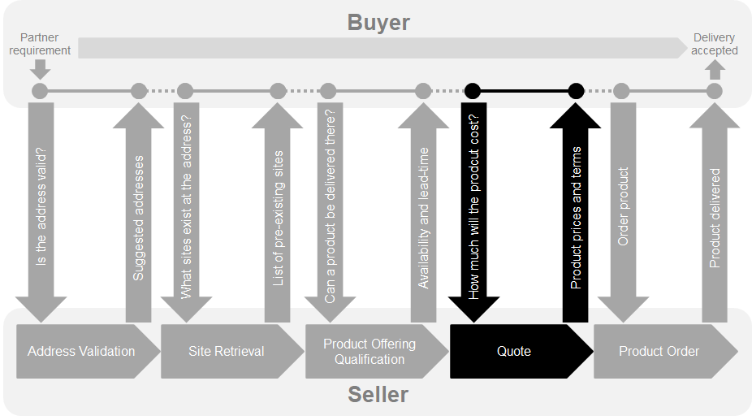

**Figure 3. Sonata End-to-End Flow**

- Address Validation
  - Allows the Buyer to retrieve address information from the Seller, including
    exact formats, for addresses known to the Seller.
- Site Retrieval
  - Allows the Buyer to retrieve Service Site information including exact
    formats for Service Sites known to the Seller.
- Product Offering Qualification (POQ)
  - Allows the Buyer to determine whether it is feasible for the Seller to
    deliver a particular Product with a given configuration to a particular
    address.
- Quoting
  - Supports the inter-carrier Product Quote process over the Sonata interface.
- Product Ordering
  - Supports the inter-carrier Product Ordering process over the Sonata
    interface.

# 5. API Description

This section presents the API structure and design patterns. It starts with the
high-level use cases diagram. Then it describes the REST endpoints with use case
mapping. Next, it gives an overview of the API resource model and explanation of
the design pattern that is used to combine product-agnostic and product-specific
parts of API payloads. Finally, payload validation and API security aspects are
discussed.

## 5.1. High-level use cases

Figure 4 presents a high-level use case diagram as specified in MEF 80
[[mef80](#8-references)] in section 7.2. This picture aims to help understand
the endpoint mapping. Use cases are described extensively in
[chapter 6](#6-api-interactions-and-flows)

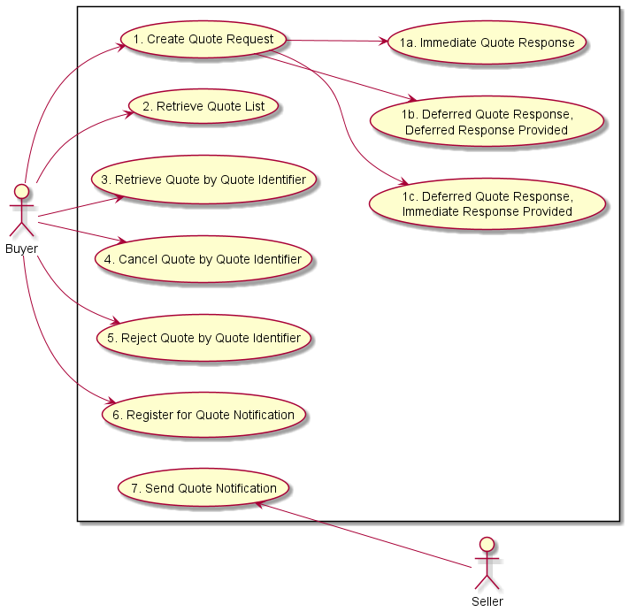

**Figure 4: Use cases**

## 5.2. API Endpoint and Operation Description

### 5.2.1. Seller side API Endpoints

**BasePath**: `https://{{server}}:{{port}}/mefApi/sonata/quoteManagement/v6/`

The following API endpoints are implemented by the Seller and allow the Buyer to
send Quote requests, retrieve existing Quotes or Quote details, and manage
notification registrations. The endpoints and corresponding data model are
defined in `api/quote/v6/quoteManagement.api.yaml`.

| API endpoint         | Description                                                                                                                                           | MEF 80 Use Case mapping                                                                                                                                                                                                                                      |
| -------------------- | ----------------------------------------------------------------------------------------------------------------------------------------------------- | ------------------------------------------------------------------------------------------------------------------------------------------------------------------------------------------------------------------------------------------------------------ |
| `POST /quote`        | A request initiated by the Buyer to _create_ new `Quote` and start the quotation process on the Seller's side.                                        | UC 1: Create Quote Request <br>UC 1a: Create Quote Request, Immediate Quote Response<br>UC 1b: Create Quote Request, Deferred Quote Response, Deferred Response Provided<br>UC 1c: Create Quote Request Deferred Quote Response, Immediate Response Provided |
| `GET /quote`         | A request initiated by the Buyer to retrieve a list of `Quotes` from the Seller based on filter criteria provided as _`query`_ parameters.            | UC 2: Retrieve Quote List                                                                                                                                                                                                                                    |
| `GET /quote/{{id}}`  | A request initiated by the Buyer to retrieve full details of a specific `Quote` based on _`id`_ provided as _`path`_ parameter                        | UC 3: Retrieve Quote by Quote Identifier                                                                                                                                                                                                                     |
| `POST /cancelQuote`  | A request initiated by the Buyer to _cancel_ existing `Quote`. The `Quote.id` is provided in the message body.                                        | UC 4: Cancel Quote by Quote Identifier                                                                                                                                                                                                                       |
| `POST /rejectQuote`  | A request initiated by the Buyer to _reject_ existing `Quote`. The `Quote.id` is provided in the message body.                                        | UC 5: Reject Quote by Quote Identifier                                                                                                                                                                                                                       |
| `POST /hub`          | A request initiated by the Buyer to instruct the Seller to send notifications of `Quote` create or state change, and `QuoteItem` state change events. | UC 6: Register for Quote Notifications                                                                                                                                                                                                                       |
| `DELETE /hub/{{id}}` | A request initiated by the Buyer to instruct the Seller to stop sending notifications.                                                                | UC 6: Register for Quote Notification                                                                                                                                                                                                                        |

**Table 2. Seller side API endpoints**

### 5.2.2. Buyer side API Endpoints

**BasePath**: `https://{{server}}:{{port}}/mefApi/sonata/quoteNotification/v6/`

The following API Endpoints are used by the Seller to post `Quote` notifications
to registered listeners. The endpoints and corresponding data model are defined
in `api/quote/v6/quoteNotification.api.yaml`

| API Endpoint                               | Description                                                                         | MEF 80 Use Case Mapping       |
| ------------------------------------------ | ----------------------------------------------------------------------------------- | ----------------------------- |
| `POST /listener/quoteCreateEvent`          | A request initiated by the Seller to notify the Buyer on `Quote` instance creation. | UC 7: Send Quote Notification |
| `POST /listener/quoteStateChangeEvent`     | A request initiated by the Seller to notify the buyer on `Quote` state change.      | UC 7: Send Quote Notification |
| `POST /listener/quoteItemStateChangeEvent` | A request initiated by the Seller to notify the Buyer on `QuoteItem` state change.  | UC 7: Send Quote Notification |

**Table 3. Buyer side API endpoints**

### 5.2.3. Specifying the Buyer ID and the Seller ID

A business entity willing to represent multiple Buyers or multiple Sellers must
follow requirements of MEF 79 [[mef79](#8-references)] chapter 8.8, which
states:

> For requests of all types, there is a business entity that is initiating an
> Operation (called a Requesting Entity) and a business entity that is
> responding to this request (called the Responding Entity). In the simplest
> case, the Requesting Entity is the Buyer and the Responding Entity is the
> Seller. However, in some cases, the Requesting Entity may represent more than
> one Buyer and similarly, the Responding Entity may represent more than one
> Seller.
>
> While it is outside the scope of this specification, it is assumed that the
> Requesting Entity and the Responding Entity are aware of each other and can
> authenticate requests initiated by the other party. It is further assumed that
> both the Buying Entity and the Requesting Entity know:
>
> a) the list of Buyers the Requesting Entity represents when interacting with
> this Responding Entity;and  
> b) the list of Sellers that this Responding Entity represents to this
> Requesting Entity.

In the API the `buyerId` and `sellerId` are represented as query parameters in
each operation defined in `productOfferingQualificationManagement.api.yaml` and
as a specialized event (`PoqEvent`) attributes as described in
`productOfferingQualificationNotification.api.yaml`.

[RXXX] If the Requesting Entity has the authority to represent more than one
Buyer the request **MUST** include `buyerId` query parameter that identifies the
Buyer being represented [MEF79 R80]

[RXXX] If the Requesting Entity represents precisely one Buyer with the
Responding Entity, the request **MUST NOT** specify the `buyerId` [MEF79 R81]

[RXXX] If the Responding Entity represents more than one Seller to this Buyer
the request **MUST** include `sellerId` query parameter that identifies the
Seller with whom this request is associated [MEF79 R82]

[RXXX] If the Responding Entity represents precisely one Seller to this Buyer,
the request **MUST NOT** specify the `sellerId` [MEF79 R83]

[RXXX] If `buyerId` or `sellerId` attributes were specified in the request same
attributes **MUST**

## 5.3. API Resource Schema summary

This subchapter describes the most important entities from the resource model
which can be found in the API specification. Each entity is a simple or composed
type (with the use of `allOf` keyword for data types composition). A simple type
defines a set of properties that might be of an object, primitive, or reference
type.

[R_XXX] If an entity is used in the request or response payload, all properties
marked as required **MUST** be provided.

[Section 6](#6-api-interactions-and-flows) provides examples of data model and
API usage. For a detailed description and complete definition of the data model,
please refer to [API Details](#7-api-details) chapter.

### 5.3.1. Key Entities - Create Request

Figure 5 presents the most important parts of the data model used during the
Quote Request (`POST /quote`) that is sent by a Buyer (see
[Section 5.1.1](#511-seller-side-endpoints) for details). The model of the
request message is a subset of the `Quote` model and contains only attributes
that can (or must) be set by the Buyer. The Seller then enriches the entity in
the response with additional information.

[R XXX] `Quote_Create` is the root entity of a quote request. It **MUST**
contain one or more `QuoteItem_Create` **[MEF80 R12]**.

**_Note:_** `Quote_Create` and `QuoteItem_Create` are entities used by the Buyer
to make a request. `Quote` and `QuoteItem` are entities used by Seller to
provide a response. The resquest entities have a subset of attributes of the
response entities. Thus for visibility of these shared attribues `Quote_Common`
and `QuoteItem_Common` have been introduced. Thought, these are not to be used
directly in the exchange.

A `QuoteItem_Create` defines details of the product(s) being subject of
quotation (in `MEFProductRefOrValue` structure) and allows for the definition of
additional information like related parties (`RelatedContactInformation`) or
relations to other items (`QuoteItemRelationship`).

`MEFProductRefOrValue` allows for the introduction of MEF product-specific
properties to the Quote payload. The extension mechanism is described in details
in
[Section 5.2.3](#523-integration-of-product-specifications-into-product-offering-qualification-management-api).
`MEFProductRefOrValue` may be also used to specify relations to places (using
specializations of `RelatePlaceOrValue`) and/or to a product that exists in the
Seller's inventory (using `ProductRelationship`).

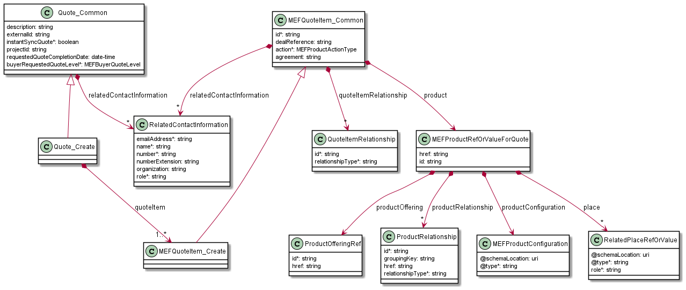

**Figure 5: Key Entities - Create Request**

### 5.3.2. Key Entities - Response

Figure 6 shows the most important data model parts used to provide a response to
a Buyer's Create Quote (`POST /quote`) or to retrieve a `Quote` by identifier
(`GET /quote/{{id}}`) request. Please note that the model differs only with the
number of attributes for `Quote` and `QuoteItem` entities.

[R_XXX] Any attribute set by the Buyer in the request **MUST NOT** be modified
by the Seller in the response.

`Quote` is the root entity of a response and it contains on or more
`QuoteItems`. For `Quote` and each of the `QuoteItems`, the Seller provides the
state and, if applicable, the final quotation (`QuotePrice`) to a particular
item from Buyer's request.

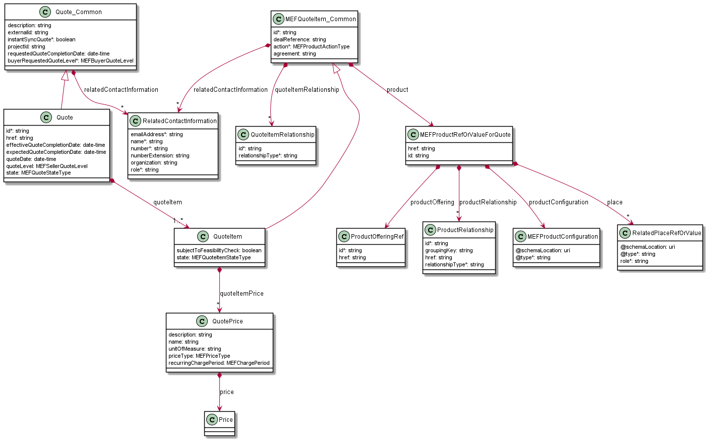

**Figure 6: Key Entities - Response**

### 5.3.3. Integration of Product Specifications into Quote Management API

Product specifications are defined using JsonSchema (draft 7) format and are
integrated into the `Quote` payload using TMF extension pattern.

Product-specific attributes are introduced via the `MEFProductRefOrValue`
(defined by the Buyer). This entity has the `productConfiguration` attribute of
type `MEFProductConfiguration` which is used as an extension point for
product-specific attributes.

[R_XXX] `MEFProductConfiguration` entity is an extension point that **MUST** be
used to integrate product specifications' properties into a request/response
payload.

[R_XXX] The `@type` property of `MEFProductConfiguration` **MUST** be used to
specify the type of the extending entity.

[R XXX] `MEFProductConfiguration` **MUST** be provided in the payload in case an
item `action` is set to `add` or `modify`. **[MEF80 R19], [MEF80 R27]**

[R XXX] `MEFProductConfiguration` **MUST NOT** be provided in the payload in
case an item `action` is set to `delete`. **[MEF80 R30]**

This pattern is demonstrated in several examples in
[Section 6](#6-api-interaction--flows).

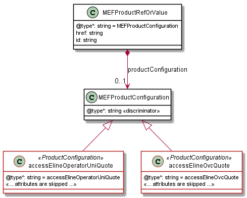

**Figure 7. The Extension Pattern with Sample Product Specific Extensions**

Figure 7. presents two MEF `<<ProductConfigurations>>` that represent Access
E-Line Operator UNI and OVC products. When these products are used as a Quote
payload the `@type` of `MEFProductConfiguration` takes
`"urn:mef:lso:spec:sonata:AccessElineOvc:1.0.0:quote"` or
`"urn:mef:lso:spec:sonata:OperatorUNI:1.0.0:quote"` value to indicate which
product specification should be used to interpret a set of product-specific
properties included in the payload. An example of a product definition inside
the `QuoteItem` is presented in
[Section 6.3.3.1](#6331-quote-item-structure-for-add-action).

The _Quote_ suffix after the product type name comes from the approach that the
product schemas may differ depending on the Sonata Interface function they are
used with.

## 5.4. Model Structural Validation

The structure of the HTTP payloads exchanged via Quote API endpoints is defined
using:

- OpenAPI version 2.0 for product-agnostic part of the payload
  - **_Note_**: It will be migrated to OAS 3.0 together with all Sonata APIs for
    the next release
- JsonSchema (draft 7) for product-specific part of the payload

[R_XXX] Implementations **MUST** use payloads that conform to these definitions.

[R_XXX] A product specification may define additional consistency rules and
requirements that **MUST** be respected by implementations. These are defined
for:

- required relation type, multiplicity to other items in the same quote request
- required relation type, multiplicity to entities in the Seller's product
  inventory
- related contact information roles that are to be defined at the item level
- relations to places (locations) and their roles that are to be defined at the
  item level **[MEF80 R20]**, **[MEF80 R21]**,

## 5.5. Security Considerations

There must be an authentication mechanism whereby a Seller can be assured who a
Buyer is and vice-versa. There must also be authorization mechanisms in place to
control what a particular Buyer or Seller is allowed to do and what information
may be obtained. However, the definition of the exact security mechanism is
outside the scope of this document.

# 6. API Interactions and Flows

This section provides a detailed insight into the API functionality, use cases,
and flows. It starts with Table 4 presenting a list and short description of all
business use cases then presents the variants of ent-to-end interaction flows,
and in following subchapters describes the API usage flow and examples for each
of the use cases.

| Use Case # | Use Case Name                                                             | Use Case Description                                                                                                                                                                                  |
| ---------- | ------------------------------------------------------------------------- | ----------------------------------------------------------------------------------------------------------------------------------------------------------------------------------------------------- |
| 1          | Create Quote Request                                                      | The Buyer requests a Product Quote from the Seller using one of the sub-Use Cases below.                                                                                                              |
| 1a         | Create Quote Request, Immediate Quote Response                            | The Buyer requests a Product Quote from the Seller and requests an Immediate Quote Response.                                                                                                          |
| 1b         | Create Quote Request, Deferred Quote Response, Deferred Response Provided | The Buyer requests a Product Quote from the Seller and does not request an Immediate Quote Response. The Seller provides a Deferred Quote Response.                                                   |
| 1c         | Create Quote Request Deferred Quote Response, Immediate Response Provided | The Buyer requests a Product Quote from the Seller and does not request an Immediate Quote Response. The Seller provides an Immediate Quote Response.                                                 |
| 2          | Retrieve Quote List                                                       | The Buyer requests a list of Product Quotes from the Seller based on Product Quote filter criteria.                                                                                                   |
| 3          | Retrieve Quote by Quote Identifier                                        | The Buyer requests detailed information related to a single Product Quote based on a Quote Identifier.                                                                                                |
| 4          | Cancel Quote by Quote Identifier                                          | The Buyer requests to Cancel a Product Quote.                                                                                                                                                         |
| 5          | Reject Quote by Quote Identifier                                          | The Buyer requests to Reject a Product Quote.                                                                                                                                                         |
| 6          | Register for Quote Notifications                                          | A request initiated by the Buyer to instruct the Seller to send notifications of Quote state changes in the event the Seller uses the Deferred Response pattern to respond to a Create Quote Request. |
| 7          | Send Quote Notification                                                   | Seller sends Notifications to the Buyer                                                                                                                                                               |

**Table 4. Use cases description**

The detailed business requirements of each of the use cases are described in
sections 7.2 and 8 of MEF 80 [[mef80](#8-references)].

## 6.1. Sample Product Specification

The Sonata SDK contains product specification definitions, from which UNI and
Access E-Line (OVC) are used in the payload samples in this section.

The product specification data model definitions are available as JsonSchema
(version `draft 7`) documents. Figure 8. and 9 depict simplified UML views on
these data models in which:

- the mandatory attributes are marked with `*`,
- the mandatory relations have a cardinality of `1` or `1..*`,
- some relations and attributes are omitte.

The detailed Access E-line product specification description is provided in MEF
W106 [[mefw106](#8-references)].

Red color on the figures below highlights the model of Access E-Line.

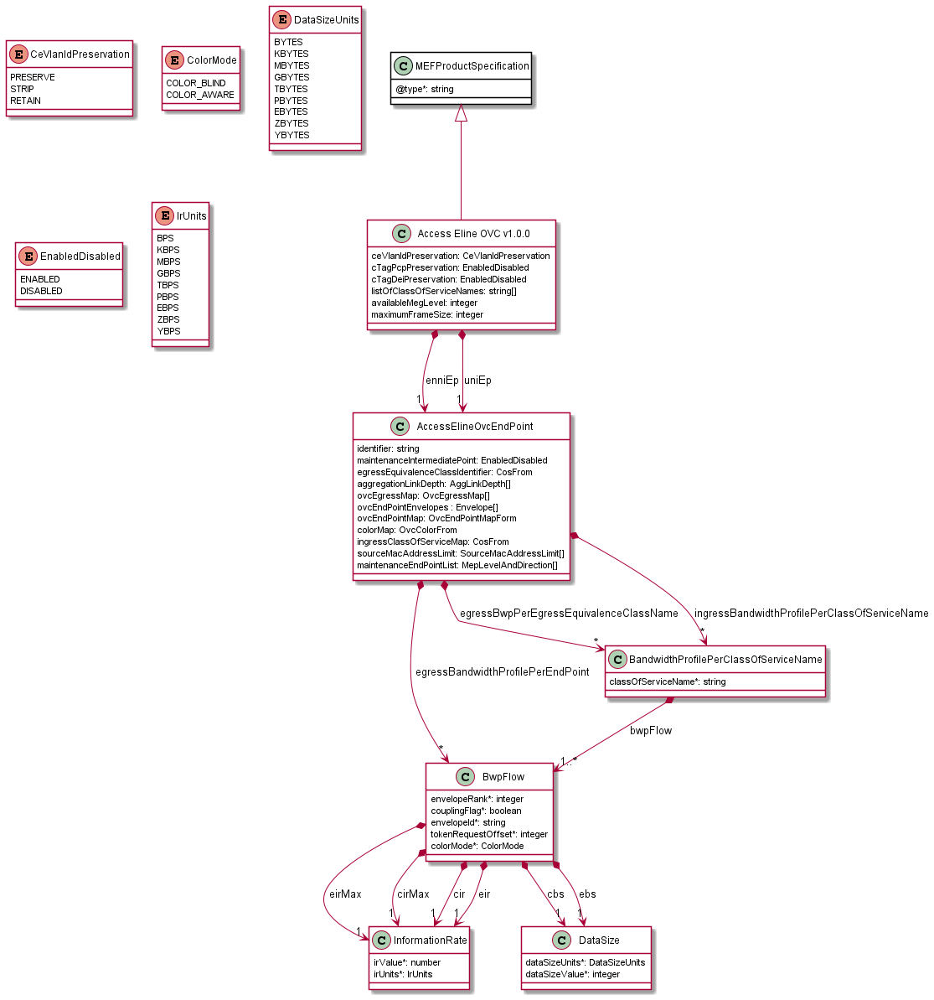

**Figure 8. A simplified view on Access E-Line product specification data
model**

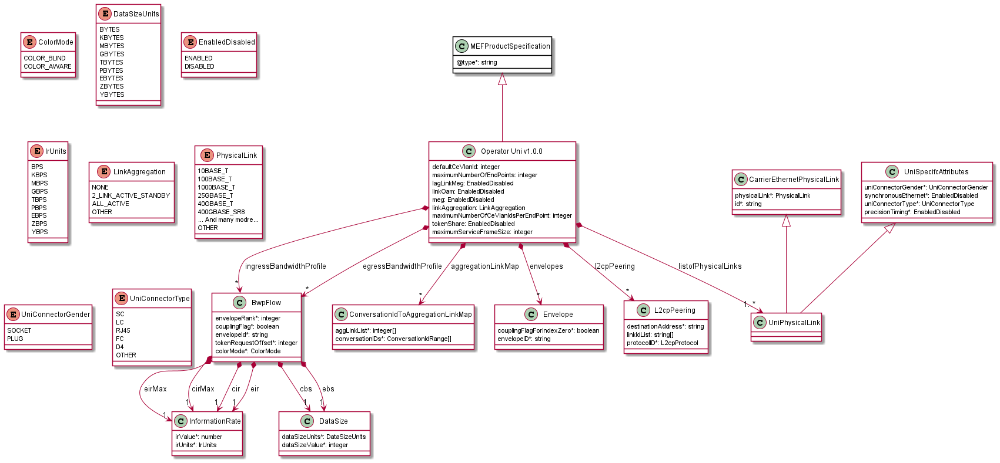

**Figure 9. A simplified view on UNI product specification data model**

Product specifications define several attribute-related and envelope-related
requirements. For example (as of MEF 106):

- the `modify` action cannot be used for operator UNI products
- an Access E-Line product defines two mandatory product relationship roles, one
  with the operator ENNI (`ENNI_REFERENCE`) and a second with the operator UNI
  (`UNI_REFERENCE`) for `add` action. First must be realized as a product
  relationship (relation to product existing in Seller's Inventory), second
  might be realized as a quote item (being part of the quotation) or product
  relationship
- product relationships cannot be specified in the case of `modify` or `delete`
  actions
- an operator UNI product defines a place relationship (`INSTALL_LOCATION`) that
  must be specified for `add` action
- place relationships cannot be specified in the case of `modify` or `delete`
  actions

In case, some of these requirements are violated the Seller returns an error
response to the Buyer that indicates specific functional errors. These errors
are listed in the response body (a list of `Error422` entries) for HTTP `422`
response.

## 6.2. Use case 1: Create Quote Request

There are two possible types of interaction: immediate and deferred, Their
details are describes in following subchapters.

### 6.2.1. Use case 1a: Create Quote Request, Immediate Quote Response

An immediate quote response can be requested by a Buyer using a mandatory
`instantSyncQuote` flag set to `true`. If the Buyer's Create Quote request is
not valid, the appropriate error code and description are returned in case the
request doesn't pass the initial validation. In case of successful processing,
the Seller responds with a `Quote` in state `approved.orderable`,
`approved.answered` or `approved.orderableAlternate` to indicate success or
`cancelled.insufficientInformationProvided`, `cancelled.unableToProvide` to
indicate that the Buyer did not provide enough information or the Seller is not
able to provide the answer for any other reason.


**Figure 10. Use case 1a: Create Quote Request, Immediate Quote Response**

### 6.2.2. Use case 1b: Create Quote Request, Deferred Quote Response, Deferred Response Provided

A deferred quotation can be requested by using `instantSyncQuote` flag set to
`false`. The Seller responds with `Quote` (state `inProgress` and `Quote.id`
specified) and starts processing the request asynchronously. When the Buyer has
registered for quote notifications, the Seller will send a quote notification to
the Buyer for each quote change the Buyer has registered for.

The Buyer may choose between two possible patterns in order to get details on
the progress of his quote:

- polling the `Quote` using the identifier specified by Seller in the response
  until the completion state is reached.
- use of notification mechanism - the Buyer registers for notifications
  providing a callback endpoint. Then the Buyer sends the Quote request. Seller
  sends notifications on Quote creation and subsequent changes until the
  terminal state is reached.

[R XXX] The Seller **MUST** support either Use Case 1a or 1b. **[MEF80 R11]**

[O XXX] The Seller **MAY** support Quote Notifications. **[MEF80 O14]**

[MEF80 CR4<O1 XXX] The Seller **MUST** be able to send Quote Notifications to
Buyers for both Immediate Quote Responses and Deferred Quote Notifications.
**[MEF80 CR4<O14]**

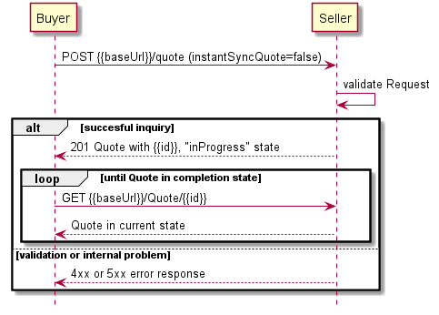

**Figure 11. Use case 1b: Create Quote Request, Deferred Quote Response,
Deferred Response Provided - Polling pattern**

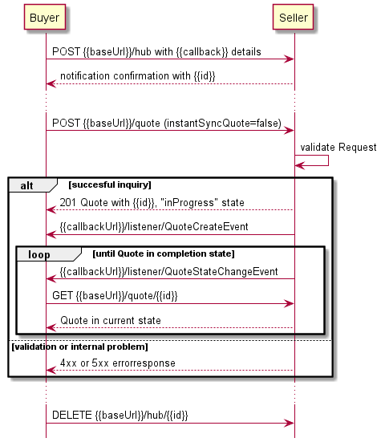

**Figure 12. Use case 1b: Create Quote Request, Deferred Quote Response,
Deferred Response Provided - Notification pattern**

### 6.2.3. Use case 1c: Create Quote Request, Deferred Quote Response, Immediate Response Provided

In this scenario, the Buyer does not request an Immediate Quote Response
(`instantSyncQuote=false`), but the Seller is able to provide an Immediate Quote
and does so, including a `Quote` in one of the completion states.

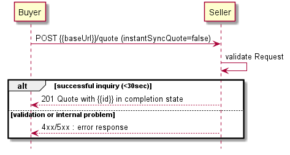

**Figure 13. Use case 1c: Create Quote Request Deferred Quote Response,
Immediate Response Provided**

Figure 13. presents the case where the Buyer didn't register for Quote
Notifications.  
Figure 14. presents the interaction between Buyer and Seller when the Buyer
registered for all Quote Notifications. Please note that in this case before
sending an immediate response the Seller will also send a `QuoteCreateEvent` and
a `QuoteStateChangeEvent`.

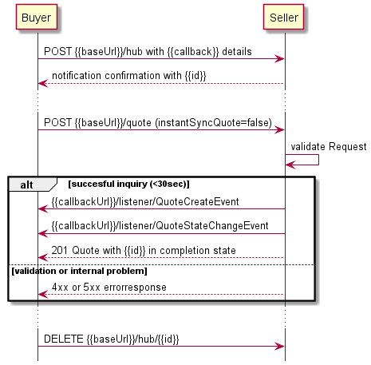

**Figure 14. Use case 1c: Create Quote Request Deferred Quote Response,
Immediate Response Provided, with Notifications**

### 6.2.4. Buyer's Quote Request

To send a Quote Request the Buyer uses the `createQuote` operation from the API:
`POST /quote`. The Create Quote Request model is common for Use Cases 1a, 1b,
and 1c.  
For clarity, some of the Quote payload's attributes might be omitted to improve
examples' readability.  
The full list of attributes is available in [Section 7](#7-api-details) and in
the API specification which is an integral part of this standard.

**`Quote` Create**

```json
{
  "instantSyncQuote": false,
  "buyerRequestedQuoteLevel": "firm",
  "requestedQuoteCompletionDate": "2020-08-10T16:45:39.368Z",
  "description": "Buyer defined description ",
  "externalId": "<< buyer Understandable External Id >>",
  "projectId": "<< buyer Understandable Project Id >>",
  "quoteItem": [
    {
      "id": "<<identifier unique within the Quote>>",
      "action": "<< action type, one of `add`, `modify`, `delete`>>",
      "product": { << product specific attributes and configuration, see 6.3.3 >>
      },
      "productOfferingQualificationItem": {
        "id": "<<id of the POQItem within referenced POQ>>",
        "alternateProductProposalId": "<< when choosing an alternate proposal>>",
        "productOfferingQualificationId": "<< id of the POQ >>"
      },
      "quoteItemRelationship": [ << item level relationships >>
      ],
      "relatedContactInformation": [ << required related contact information entries >>
      ]
    }
  ],
  "relatedContactInformation": [
    {
      "emailAddress": "john.example@example.com",
      "name": "John Example",
      "number": "12-345-6789",
      "numberExtension": "1234",
      "role": "buyerContact"
    }
  ]
}
```

The Buyer **MUST** specify:

- [R XXX] `buyerRequestedQuoteLevel` - to inform whether `budgetary` or `firm`
  quotation level is required **[MEF80 R13]**. Please refer to the glossary for
  more details.
- [R XXX] `instantSyncQuote` - to request the _Immediate_ (`true`) or _Deferred_
  (`false`) response **[MEF80 R13]**.
- [R XXX] at least one `quoteItem` **[MEF80 R13]**.
- [R XXX] if `instantSyncQuote=false` the `relatedContactInformation[]` with an
  item of `role="buyerContact"` to specify the required
  `Buyer Contact Information` **[MEF80 R16]**.
- [R XXX] if `instantSyncQuote=false` the `requestedQuoteCompletionDate`
  **[MEF80 R17]** to set the deadline for the Seller to provide the pricing. If
  `instantSyncQuote=true`, this is ignored by the Seller **[MEF80 R18]**.

  **_Note_**: [O XXX] The Seller **MAY** decide to make the
  `productOfferingQualificationItem` mandatory for a Buyer Create Quote request.
  **[MEF80 O4]**

For every `QuoteItem` the Buyer **MUST** specify:

- [R XXX] `id` - to identify `quoteItem` locally within a `Quote`. For example a
  sequence number (01, 02, 03...) **[MEF80 R14]**
- [R XXX] `action` - to specify what kind of operation on a product is to be
  quoted **[MEF80 R14]**

  **_Note_**: The values correspond to `orderItem.action` that will be set
  during ordering of quoted product(s).

- [R XXX] `product` - a relation to an instance of a product or product
  configuration **[MEF80 R13]**
- [R XXX] if `instantSyncQuote=false` the `relatedContactInformation[]` with an
  item of `role="technicalContact"` to specify the required
  `Quote Item Technical Contact Information` **[MEF80 R15]**.
- if `instantSyncQuote=false` and the Quote Item requires a location,
  `relatedContactInformation[]` with an item of `role="locationContact"` to
  specify the required `Quote Item Location Contact Information` **[MEF80
  R22]**.

[R XXX] The `QuoteItem` content **MUST** follow the product specification
related requirements when specifying values for `relatedContactInformation` and
`quoteItemRelationship` attributes.

### 6.2.5. Seller's Response to a Create Quote Request

The following snippet presents the Seller's immediate response. It has the same
structure as in the retrieve by identifier operation.

```json
{
  "id": "00000000-0000-0000-0000-000000000123",
  "href" : "{{baseUrl}}/quote/00000000-0000-0000-0000-000000000123",
  "state" : "approved.orderable",
  "effectiveQuoteCompletionDate": "2020-08-10T16:45:20.421Z",
  "expectedQuoteCompletionDate": "2020-08-10T16:45:39.421Z",
  "quoteDate": "2020-08-10T16:40:33.422Z",
  "quoteLevel": "<< based on the lowest Seller Quote Item Level >>",
  "instantSyncQuote": << as provided by the Buyer >>,
  "buyerRequestedQuoteLevel": "<< as provided by the Buyer >>",
  "requestedQuoteCompletionDate": "<< as provided by the Buyer >>",
  "externalId": "<< as provided by the Buyer >>",
  "projectId":  "<< as provided by the Buyer >>",
  "stateChange" : [ {
      "changeDate" : "2020-08-10T16:45:39.422Z",
      "state" : "approved.orderable"
    }, {
      "changeDate" : "2020-08-10T16:42:39.422Z",
      "state" : "inProgress.draft"
    }, {
      "changeDate" : "2020-08-10T16:40:39.422Z",
      "state" : "inProgress"
    } ],
  "quoteItem": [
    {
      "state": "approved.orderable",
      "subjectToFeasibilityCheck": false,
      "id": "<< as provided by the Buyer >>",
      "action": "<< as provided by the Buyer >>",
      "product": { << as provided by the Buyer >> },
      "productOfferingQualificationItem": { << as provided by the Buyer >> },
      "quoteItemRelationship": [ << as provided by the Buyer >> ],
      "relatedContactInformation": [ << might be appended with contact information definitions specific to the Seller >> ],
      "quoteItemPrice": [
        {
          "name": "Monthly Plan 25",
          "priceType": "recurring",
          "recurringChargePeriod": "month",
          "price": {
            "taxRate": 16,
            "dutyFreeAmount": {
              "unit": "EUR",
              "value": 25,
            },
            "taxIncludedAmount": {
              "unit": "EUR",
              "value": 29,
            },
          },
        }
      ],
    }
  ],
  "relatedContactInformation": [
    {
      "emailAddress": "john.example@example.com",
      "name": "John Example",
      "number": "12-345-6789",
      "role": "buyerContact"
    },
    {
      "emailAddress": "kate.example@example.com",
      "name": "Kate Example",
      "number": "12-345-67890",
      "role": "sellerContact"
    }
  ]
  "validFor": {
    "endDateTime": "2020-08-17T16:45:39.422Z",
  }
}
```

[R XXX] As mentioned earlier, the Seller **MUST NOT** change the values of
attributes specified by the Buyer **[MEF80 R35]**. These attributes are
indicated above with an appropriate comment: `<< as provided by the Buyer >>`.

In response, the Seller **MUST** provide:

- [R XXX] `id` **[MEF80 R34]**,
- [R XXX] `state` - one of the states **[MEF80 R61]**, **[MEF80 R73]** ,
- [R XXX] _Seller Contact Information_ by adding a relatedContactInformation
  with `role=sellerContact` **[MEF80 R40]**,
- [R XXX] `quoteItem.state` **[MEF80 R43]**,
- [R XXX] if the `quoteItem.state=cancelled.insufficientInformationProvided`,
  then specify the `terminationError` attribute **[MEF80 R52]**,
- if Seller provides a successful response with `Quote` in completion state:
  - [R XXX] when the Buyer request a `budgetary` level, the Seller **MUST**
    respond with `quoteLevel=budgetary`.**[MEF80 R39]**,
  - [R XXX] when the Buyer request a `firm` level, the Seller **MUST** respond
    with `quoteLevel` equal to `firm` or `firmSubjectToFeasibilityCheck`
    **[MEF80 R37]**,
  - [R XXX] if the `quoteLevel` is `firmSubjectToFeasibilityCheck`, the Seller
    **MUST** specify the `SubjectToFeasibilityCheck` attribute in their response
    for each `QuoteItem` **[MEF80 R44]**,
  - `stateChange` - to specify the history of the `Quote's` state transitions.

The Seller might append related contact information if required, either at item
or Quote level but cannot modify related contact information provided by the
Buyer.

### 6.2.7. Quote Item Specification Details

This section provides examples of how the `quoteItem` should look like depending
on the desired `action`.

#### 6.2.7.1. Quote Item Structure for `add` Action

When requesting a new Product (`action=add`) the Buyer needs to provide all of
its configurations. The example below shows a request for Access E-Line product
(type `urn:mef:lso:spec:sonata:AccessElineOvc:1.0.0:quote`).

```json
{
  <<Quote attributes...>>
  "quoteItem": [
    {
      "id": "item-001",
      "action": "add",
      ...
      "product": {
        "@type": "MEFProductRefOrValue",
        "productConfiguration": {
          "@type": "urn:mef:lso:spec:sonata:AccessElineOvc:1.0.0:quote",
          "enniEp": {
            "ingressBandwidthProfilePerClassOfServiceName": [
                {
                    "classOfServiceName": "silver",
                    "bwpFlow": [
                        {
                            "envelopeRank": 1,
                            "couplingFlag": false,
                            "envelopeName": "defaultENNI",
                            "tokenRequestedOffset": 0,
                            "colorMode": "COLOR_BLIND",
                            "cir": {
                                "irValue": 20,
                                "irUnits": "MBPS"
                            },
                            "cbs": {
                                "dataSizeValue": 50,
                                "dataSizeUnits": "KBYTES"
                            },
                            "eir": {
                                "irValue": 0,
                                "irUnits": "BPS"
                            },
                            "ebs": {
                                "dataSizeValue": 0,
                                "dataSizeUnits": "BYTES"
                            },
                            "cirMax": {
                                "irValue": 20,
                                "irUnits": "MBPS"
                            },
                            "eirMax": {
                                "irValue": 0,
                                "irUnits": "BPS"
                            },
                        }
                    ]
                }
            ]
          },
          "maximumFrameSize": 1522,
          "uniEp": {
            "ingressBandwidthProfilePerClassOfServiceName": [
                {
                    "classOfServiceName": "silver",
                    "bwpFlow": [
                        {
                            "envelopeRank": 1,
                            "couplingFlag": false,
                            "envelopeName": "defaultUNI",
                            "tokenRequestedOffset": 0,
                            "colorMode": "COLOR_BLIND",
                            "cir": {
                                "irValue": 20,
                                "irUnits": "MBPS"
                            },
                            "cbs": {
                                "dataSizeValue": 50,
                                "dataSizeUnits": "KBYTES"
                            },
                            "eir": {
                                "irValue": 0,
                                "irUnits": "BPS"
                            },
                            "ebs": {
                                "dataSizeValue": 0,
                                "dataSizeUnits": "BYTES"
                            },
                            "cirMax": {
                                "irValue": 20,
                                "irUnits": "MBPS"
                            },
                            "eirMax": {
                                "irValue": 0,
                                "irUnits": "BPS"
                            },
                        }
                    ]
                }
            ]
          }
        },
        "productOffering": {
          "id": "000073"
        },
        "productRelationship": [
          {
            "relationshipType": "ENNI_REFERENCE",
            "id": "00000000-0000-000a-0000-000000000001"
          }
        ]
      },
      "quoteItemRelationship": [
        {
          "relationshipType": "UNI_REFERENCE",
          "id": "item-002"
        }
      ],
      "relatedContactInformation": [
        {
          "number": "1-234-567-890",
          "emailAddress": "john@example.com",
          "role": "buyerContact",
          "name": "John Example"
        }
      ]
    },
    {
      "id": "item-002",
      "action": "add"
      <<Quote Item with UNI Product configuration that the E-Line OVC refers to>>
    }
  ]
}
```

- [R XXX] `MEFProductConfiguration` **MUST** be provided in the payload in case
  an item `action` is set to `add` **[MEF80 R19]**.
- [R XXX] `productOffering` - **MUST** be provided in the payload in case an
  item action (`QuoteItem.action`) is set to `add` **[MEF80 R19]**, The Buyer
  **MUST NOT** specify the `product.id` in the request when `action=add`. It is
  the Seller who assigns this id **[MEF80 R25]**.

The Access E-Line product specification is identified as
`00000000-0000-0000-0000-0000000007e3` in the Seller's catalog.

An Access E-Line product specification defines two mandatory relationship types
that have to be specified in case of quoting an `add` action: `ENNI_REFERENCE`
and `UNI_REFERENCE`.  
The reference to an operator UNI product might use another Quote item or an
existing product from the Seller's inventory. This example assumes that UNI
product is another item of the request with a unique identifier `item-002`. This
Access E-Line product references to an existing ENNI product which is uniquely
identified with id `00000000-0000-000a-0000-000000000001` in the Seller's
inventory.

The place is not provided as Access E-Line product specification does not allow
for a place description to be part of the request. Values for some of the
available product attributes are provided under `productConfiguration` node.
This example uses only a tiny subset of available Access E-Line attributes. It
aims to explain the Product definition and relation patterns, not to focus on
the product configurations themselves.

This specification describes the structure and requirements defined for this
product with which the payload should be validated. Product specification is a
subject of MEF standardisation. It is published as a dedicated MEF standard. It
is build of:

- the JSON Schemas for technical specifications. Those can be found in the SDK
  in the `\spec\` directory.
- a document with a textual description of the product and a list of the
  requirements (not all of them can be technically included in the JSON schema).
  Such documents can be found in the `\doc\product\` directory of the SDK
  package.

The product offering is a business representation of a product specification
version offered by the Seller for purchase. Product offering associates
commercial attributes to a product specification. The product offering model is
not part of the standardisation and is up to the Seller to define their
offering.

Both product specifications and product offerings are not negotiated and
exchanged within Sonata. They are agreed between the Buyer and the Seller during
the onboarding process. After that, they are only referenced as in the example
above.

#### 6.2.7.2. Quote Item Structure for `modify` Action

The following example shows a request for a quotation of an existing Access
E-Line Product modification (`action=modify`). In particular, changes to `cir`
(Committed Information Rate) and `cbs` (Committed Burst Size) values for `ENNI`
and `UNI` bandwidth profiles are introduced.  
The Access E-Line product exists in Seller's inventory and is identified as
`01494079-6c79-4a25-83f7-48284196d44d`.

[R XXX] The change request must specify a reference (provide `id`) to an
existing product which is a subject of this quotation. **[MEF80 R26]**

Please also note, that in the `add` case, a reference to the UNI product used
the `quoteItemRelationship` pointing to another `quoteItem` in the same Quote
Request. This is because the UNI was not existing at that moment and was also a
part of the quotation. In the case of quoting the update of an existing Access
E-Line, the UNI is also existing and it must be referenced with the use of
`productRelationship`. This example assumes that the UNI product is available in
Seller's Inventory with the `id="00000000-0000-000a-0000-000000000098"`.

There is no possibility to send an update to single attributes. The Buyer must
send a full set of `productConfiguration` attributes that represent the desired
state, even if some of them do not change.  
If Seller does not allow for some of the attributes to change an appropriate
error response must be returned to the Buyer.

```json
{
  <<Quote attributes...>>
  "quoteItem": [
    {
      "id": "item-001",
      "action": "modify",
      ...
      "product": {
        "id" : "01494079-6c79-4a25-83f7-48284196d44d",
        "@type" : "MEFProductRefOrValue",
        "productConfiguration": {
          "@type": "urn:mef:lso:spec:sonata:AccessElineOvc:1.0.0:quote",
          "enniEp": {
            "ingressBandwidthProfilePerClassOfServiceName": [
                {
                    "classOfServiceName": "silver",
                    "bwpFlow": [
                        {
                            "envelopeRank": 1,
                            "couplingFlag": false,
                            "envelopeName": "defaultENNI",
                            "tokenRequestedOffset": 0,
                            "colorMode": "COLOR_BLIND",
                            "cir": {
                                "irValue": 40,
                                "irUnits": "MBPS"
                            },
                            "cbs": {
                                "dataSizeValue": 100,
                                "dataSizeUnits": "KBYTES"

                            },
                            "eir": {
                                "irValue": 0,
                                "irUnits": "BPS"
                            },
                            "ebs": {
                                "dataSizeValue": 0,
                                "dataSizeUnits": "BYTES"

                            },
                            "cirMax": {
                                "irValue": 40,
                                "irUnits": "MBPS"
                            },
                            "eirMax": {
                                "irValue": 0,
                                "irUnits": "BPS"
                            },
                        }
                    ]
                }
            ]
          },
          "maximumFrameSize": 1522,
          "uniEp": {
            "ingressBandwidthProfilePerClassOfServiceName": [
                {
                    "classOfServiceName": "silver",
                    "bwpFlow": [
                        {
                            "envelopeRank": 1,
                            "couplingFlag": false,
                            "envelopeName": "defaultUNI",
                            "tokenRequestedOffset": 0,
                            "colorMode": "COLOR_BLIND",
                            "cir": {
                                "irValue": 40,
                                "irUnits": "MBPS"
                            },
                            "cbs": {
                                "dataSizeValue": 100,
                                "dataSizeUnits": "KBYTES"

                            },
                            "eir": {
                                "irValue": 0,
                                "irUnits": "BPS"
                            },
                            "ebs": {
                                "dataSizeValue": 0,
                                "dataSizeUnits": "BYTES"

                            },
                            "cirMax": {
                                "irValue": 40,
                                "irUnits": "MBPS"
                            },
                            "eirMax": {
                                "irValue": 0,
                                "irUnits": "BPS"
                            },
                        }
                    ]
                }
            ]
          }
        },
        "productOffering": {
          "id": "000073"
        },
        "productRelationship": [
          {
            "relationshipType": "ENNI_REFERENCE",
            "id": "00000000-0000-000a-0000-000000000001"
          },
          {
            "relationshipType": "UNI_REFERENCE",
            "id": "00000000-0000-000a-0000-000000000098"
          }
        ]
      },
      "relatedContactInformation": [
        {
          "number": "1-234-567-890",
          "emailAddress": "john@example.com",
          "role": "buyerContact",
          "name": "John Example"
        }
      ]
    }
  ]
}
```

#### 6.3.3.3. Quote Item Structure for `delete` Action

The example below represents a single Quote request for deletion
(`action=delete`) of an existing Access E-Line product (type
`urn:mef:lso:spec:sonata:AccessElineOvc:1.0.0:quote`).

```json
{
  <<Quote attributes...>>
  "quoteItem": [
    {
      "id": "item-001",
      "action": "delete",
      "product": {
        "id" : "01494079-6c79-4a25-83f7-48284196d44d"
      }
    }
  ]
}
```

Product instance identifier (`01494079-6c79-4a25-83f7-48284196d44d`) is
mandatory **[MEF80 R28]** and (apart from `@type`) the only allowed attribute in
the `delete` request **[MEF80 R30]**.

### 6.2.8. Specifying Place Details

Some product specifications may define requirements concerning place definition
in case `add` or `modify` action is used. For example, an Operator UNI product
specification requires an `INSTALL_LOCATION` place definition in case of `add`
action.

There are different formats in which place information may be provided:
geographic point (`MEFGeographicPoint`), fielded (`FieldedAddress`), formatted
(`FormattedAddress`), geographic address identifier
(`GeographicAddressIdentifier`), geographic site reference
(`GeographicSiteRef`), and a geographic address reference
(`GeographicAddressRef`). The first four of them can be used to provide a full
place description by value. The site and address reference allow specifying the
place information as a reference to previously validated address or site
available through Seller's Addressing and Site API endpoints, which definition
is provided in the SDK:

- `api/serviceability/address/v6/geographicAddressManagement.api.yaml`
- `api/serviceability/address/v6/geographicSiteManagement.api.yaml`

To distinguish between place types the `@type` discriminator is used. Examples
of different place specification formats are provided below.

#### 6.2.8.1. Fielded Address

```json
{
  "@type": "FieldedAddress",
  "streetNr": "20",
  "streetNrSuffix": "14",
  "streetName": "Edmunda Wasilewskiego",
  "city": "Kraków",
  "stateOrProvince": "Lesser Poland",
  "postcode": "30-305",
  "country": "Poland",
  "geographicSubAddress": {
    "levelType": "floor",
    "levelNumber": "4"
  },
  "role": "INSTALL_LOCATION"
}
```

Fielded address example of a place specification. The type discriminator has the
value `FieldedAddress`. A subset of available attributes is used to describe the
place. The fielded address has an optional `geographicSubAddress` structure that
defines several attributes that can be used in case precise address information
has to be provided. In the example above, a floor in the building at the given
address is specified using this structure. The role of the place is assigned
according to the requirements of the Operator UNI product specification.

#### 6.2.8.2. Formatted Address

```json
{
  "@type": "FormattedAddress",
  "addrLine1": "Edmunda Wasilewskiego 20/14",
  "addrLine2": "Floor 4",
  "city": "Kraków",
  "stateOrProvince": "Lesser Poland",
  "postcode": "30-305",
  "country": "Poland",
  "role": "INSTALL_LOCATION"
}
```

Place information in a form of formatted address. The type discriminator has the
value `FormattedAddress`. This example contains the same information as the
previous `FieldedAddress` example.

#### 6.2.8.3. Geographic Point

```json
{
  "@type": "MEFGeographicPoint",
  "spatialRef": "EPSG:4326 WGS 84",
  "geographicPoint": {
    "x": "50.048868",
    "y": "19.929523"
  },
  "role": "INSTALL_LOCATION"
}
```

Place information in a form of geographic point. `spatialRef` determines the
standard that has to be used to interpret coordinates provided in required `x`
(latitude), `y` (longitude), and optional `z` (elevation) values.

This type allows only providing a point. It cannot carry more detailed
information like the floor number from previous examples.

#### 6.2.8.4. Geographic Address Identifier

```json
{
  "@type": "GeographicAddressIdentifier",
  "externalReferenceType": "CLLI",
  "externalReferenceId": "PLTXCL01",
  "role": "INSTALL_LOCATION"
}
```

The Geographic Address Identifier represents a unique identifier controlled by a
generally accepted independent administrative authority that specifies a fixed
geographical location. The example above is a place that represents a CLLI
(Common Language Location Identifier) identifier which is commonly used to refer
locations in North America for network equipment installations.

#### 6.2.8.5. Geographic Site Reference

```json
{
  "@type": "GeographicSiteRef",
  "id": "18d3bb74-997a-4a62-8198-84250766765a",
  "role": "INSTALL_LOCATION"
}
```

`GeographicSiteRef` type is used to specify a `GeographicSite` by reference in
the POQ request. In the above example a `GeographicSite` identified as
`18d3bb74-997a-4a62-8198-84250766765a` in the Sellers Service Site API is used.

#### 6.2.8.6. Geographic Address Reference

```json
{
  "@type": "GeographicAddressRef",
  "id": "8198bb74-18d3-9ef0-4913-66765a842507",
  "role": "INSTALL_LOCATION"
}
```

`GeographicAddressRef` type is used to specify a `GeographicAddress` by
reference in the POQ request. In the above example a `GeographicAddress`
identified as `8198bb74-18d3-9ef0-4913-66765a842507` in the Sellers Service Site
API is used.

## 6.3. Use Case 2: Retrieve Quote List

The Buyer can retrieve a list of `Quotes` by using a `GET /quote` operation with
desired filtering criteria.

The [[mef80](#8-references)] specifies the possible filtering criteria, those
are **[MEF80 O11], [MEF80 O12]**:

- `state`
- `quoteLevel`
- `externalId`
- `projectId`
- `quoteDate.gt`
- `quoteDate.lt`
- `requestedQuoteCompletionDate.gt`
- `requestedQuoteCompletionDate.lt`
- `expectedQuoteCompletionDate.gt`
- `expectedQuoteCompletionDate.lt`
- `effectiveQuoteCompletionDate.gt`
- `effectiveQuoteCompletionDate.lt`

The Buyer may also ask for pagination with the use of the `offset` and `limit`
parameters. The filtering and pagination attributes must be specified in URI
query format [rfc3986](#8-references). Section
[7.1.2.](#712-response-pagination) provides details about implementation of
pagination mechanism.

```
https://serverRoot/mefApi/sonata/quoteManagement/v6/quote?state=approved.orderable&quoteLevel=firm
```

The example above shows a Buyer's request to get all `Quotes` that are in
`approved.orderable` state and with `firm` level. The correct response (HTTP
code `200`) contains a list of `Quote_Find` objects matching the criteria in the
response body. To get more details (e.g. the item level information), The Buyer
has to query a specific `Quote` by id.

The [[mef80](#8-references)] specifies the subset of attributes that the Seller
must put into the `Quote_Find` object in the response **[MEF80 R79]**:

- `id`
- `effectiveQuoteCompletionDate`
- `expectedQuoteCompletionDate`
- `externalId`
- `projectId`
- `quoteDate`
- `quoteLevel`
- `requestedQuoteCompletionDate`
- `state`
- `stateChange`

In case no items are matching the criteria an empty list is returned.

Below you can find a response with 2 matching items:

```json
[
  {
    "id": "00000000-0000-0000-0000-000000000123",
    "effectiveQuoteCompletionDate": "2020-08-10T16:45:20.421Z",
    "expectedQuoteCompletionDate": "2020-08-10T16:45:39.421Z",
    "externalId": "BuyerId-00112233",
    "projectId": "Project-ABCDEF",
    "quoteDate": "2020-08-10T16:40:33.422Z",
    "quoteLevel": "firm",
    "requestedQuoteCompletionDate": "2020-08-10T16:45:39.368Z",
    "state": "approved.orderable",
    "stateChange": [
      {
        "changeDate": "2020-08-10T16:45:39.422Z",
        "state": "approved.orderable"
      },
      {
        "changeDate": "2020-08-10T16:42:39.422Z",
        "state": "inProgress.draft"
      },
      {
        "changeDate": "2020-08-10T16:40:39.422Z",
        "state": "inProgress"
      }
    ]
  },
  {
    "id": "00000000-1212-3434-0000-987600000abc",
    "effectiveQuoteCompletionDate": "2020-09-112T08:25:20.421Z",
    "expectedQuoteCompletionDate": "2020-09-112T08:25:39.421Z",
    "externalId": "BuyerId-99887766",
    "projectId": "Project-ZYX",
    "quoteDate": "2020-09-112T08:20:33.422Z",
    "quoteLevel": "firm",
    "requestedQuoteCompletionDate": "2020-09-112T08:25:39.368Z",
    "state": "approved.orderable",
    "stateChange": [
      {
        "changeDate": "2020-09-112T08:25:39.422Z",
        "state": "approved.orderable"
      },
      {
        "changeDate": "2020-09-112T08:20:39.422Z",
        "state": "inProgress"
      }
    ]
  }
]
```

## 6.4. Use Case 3: Retrieve Quote by Quote Identifier

The Buyer can get detailed information about the Quote from the Seller by using
a `GET /quote/{{id}}` operation. In case `id` does not allow to find a `Quote`
in Seller's Inventory, an error response `404` must be returned. The payload
returned in the response includes all the attributes Buyer has provided while
sending a Quote request. The attributes provided by the Seller depend on the
status of the `Quote` and may require some time to be set.

[R XXX] If `quoteLevel=firm` then the response must specify attributes as shown
in Table 5 **[MEF80 R84]**.

E - Echoed (repeated without change)  
M - Mandatory

|                                                                      | accepted               | cancelled              | rejected.expired       | inProgress             | inProgress.draft       | cancelled.insufficientInformationProvided | approved.orderable     | approved.orderableAlternate | rejected               | cancelled.unableToProvide |
| -------------------------------------------------------------------- | ---------------------- | ---------------------- | ---------------------- | ---------------------- | ---------------------- | ----------------------------------------- | ---------------------- | --------------------------- | ---------------------- | ------------------------- |
| id                                                                   | M                      | M                      | M                      | M                      | M                      | M                                         | M                      | M                           | M                      | M                         |
| externalId                                                           | E                      | E                      | E                      | E                      | E                      | E                                         | E                      | E                           | E                      | E                         |
| projectId                                                            | E                      | E                      | E                      | E                      | E                      | E                                         | E                      | E                           | E                      | E                         |
| sescription                                                          | E                      | E                      | E                      | E                      | E                      | E                                         | E                      | E                           | E                      | E                         |
| state                                                                | M                      | M                      | M                      | M                      | M                      | M                                         | M                      | M                           | M                      | M                         |
| quoteDate                                                            | M                      | M                      | M                      | M                      | M                      | M                                         | M                      | M                           | M                      | M                         |
| stateChange                                                          | M                      | M                      | M                      | M                      | M                      | M                                         | M                      | M                           | M                      | M                         |
| expectedQuoteCompletionDate                                          |                        |                        |                        | M                      | M                      |                                           |                        |                             |                        |                           |
| validFor                                                             |                        |                        |                        |                        |                        |                                           | M                      | M                           |                        |                           |
| effectiveQuoteCompletionDate                                         |                        | M                      |                        | M                      | M                      | M                                         | M                      | M                           |                        | M                         |
| buyerRequestedQuoteLevel                                             | E                      | E                      | E                      | E                      | E                      | E                                         | E                      | E                           | E                      | E                         |
| quoteLevel                                                           | M                      | M                      | M                      | M                      | M                      | M                                         | M                      | M                           | M                      | M                         |
| instantSyncQuote                                                     | E                      | E                      | E                      | E                      | E                      | E                                         | E                      | E                           | E                      | E                         |
| requestedQuoteCompletionDate                                         | E                      | E                      | E                      | E                      | E                      | E                                         | E                      | E                           | E                      | E                         |
| note                                                                 | E - Buyer / M - Seller | E - Buyer / M - Seller | E - Buyer / M - Seller | E - Buyer / M - Seller | E - Buyer / M - Seller | E - Buyer / M - Seller                    | E - Buyer / M - Seller | E - Buyer / M - Seller      | E - Buyer / M - Seller | E - Buyer / M - Seller    |
| relatedContactInformation (role=buyerContactInformation)             | E                      | E                      | E                      | E                      | E                      | E                                         | E                      | E                           | E                      | E                         |
| relatedContactInformation (role=sellerrContactInformation)           | M                      | M                      | M                      | M                      | M                      | M                                         | M                      | M                           | M                      | M                         |
| quoteItem.id                                                         | E                      | E                      | E                      | E                      | E                      | E                                         | E                      | E                           | E                      | E                         |
| quoteItem.action                                                     | E                      | E                      | E                      | E                      | E                      | E                                         | E                      | E                           | E                      | E                         |
| quoteItem.requestedQuoteItemTerm                                     | E                      | E                      | E                      | E                      | E                      | E                                         | E                      | E                           | E                      | E                         |
| quoteItem.requestedQuoteItemInstallationInterval                     | E                      | E                      | E                      | E                      | E                      | E                                         | E                      | E                           | E                      | E                         |
| quoteItem.product.id                                                 | E                      | E                      | E                      | E                      | E                      | E                                         | E                      | E                           | E                      | E                         |
| quoteItem.product.productOffering                                    | E                      | E                      | E                      | E                      | E                      | E                                         | E                      | E                           | E                      | E                         |
| quoteItem.product.productConfiguration                               | E                      | E                      | E                      | E                      | E                      | E                                         | E                      | E                           | E                      | E                         |
| quoteItem.subjectToFeasibilityCheck                                  | M                      |                        | M                      |                        | M                      |                                           | M                      | M                           | M                      |                           |
| quoteItem.product.place                                              | E                      | E                      | E                      | E                      | E                      | E                                         | E                      | E                           | E                      | E                         |
| quoteItem.relatedContactInformation (role=quoteItemLocationContact)  | E                      | E                      | E                      | E                      | E                      | E                                         | E                      | E                           | E                      | E                         |
| quoteItem.relatedContactInformation (role=quoteItemTechnicalContact) | E                      | E                      | E                      | E                      | E                      | E                                         | E                      | E                           | E                      | E                         |
| quoteItem.quoteItemRelationship                                      | E                      | E                      | E                      | E                      | E                      | E                                         | E                      | E                           | E                      | E                         |
| quoteItem.product.productRelationship                                | E                      | E                      | E                      | E                      | E                      | E                                         | E                      | E                           | E                      | E                         |
| quoteItem.note                                                       | E - Buyer / M - Seller | E - Buyer / M - Seller | E - Buyer / M - Seller | E - Buyer / M - Seller | E - Buyer / M - Seller | E - Buyer / M - Seller                    | E - Buyer / M - Seller | E - Buyer / M - Seller      | E - Buyer / M - Seller | E - Buyer / M - Seller    |
| quoteItem.agreement                                                  | E                      | E                      | E                      | E                      | E                      | E                                         | E                      | E                           | E                      | E                         |
| quoteItem.productOfferingQualificationItem                           | E                      | E                      | E                      | E                      | E                      | E                                         | E                      | E                           | E                      | E                         |
| quoteItem.state                                                      | M                      | M                      | M                      | M                      | M                      | M                                         | M                      | M                           | M                      | M                         |
| quoteItem.Price                                                      | M                      |                        | M                      |                        | M                      |                                           | M                      | M                           | M                      |                           |
| quoteItem.quoteItemTerm                                              | M                      |                        | M                      |                        | M                      |                                           | M                      | M                           | M                      |                           |
| quoteItem.dealReference                                              | E                      | E                      | E                      | E                      | E                      | E                                         | E                      | E                           | E                      | E                         |
| quoteItem.quoteItemInstallationInterval                              | M                      |                        | M                      |                        | M                      |                                           | M                      | M                           | M                      |                           |
| quoteItem.terminationError                                           |                        |                        |                        |                        |                        |                                           |                        |                             |                        | M                         |

**Table 5. Seller Response to Query by ID, FIRM Quote Level**

[R XXX] If `quoteLevel=budgetary` then the response must specify attributes as
shown in Table 6 **[MEF80 R85]**.

E - Echoed (repeated without change)  
M - Mandatory

|                                                                     | approved.answered      | cancelled                        | rejected.expired       | inProgress                              | cancelled.insufficientInformationProvided | cancelled.unableToProvide |
| ------------------------------------------------------------------- | ---------------------- | -------------------------------- | ---------------------- | --------------------------------------- | ----------------------------------------- | ------------------------- | --- | ----------------------- | --- | --- | --- | --- | --- | --- | --- |
| id                                                                  | M                      | M                                | M                      | M                                       | M                                         | M                         |
| externalId                                                          | E                      | E                                | E                      | E                                       | E                                         | E                         |
| projectId                                                           | E                      | E                                | E                      | E                                       | E                                         | E                         |
| sescription                                                         | E                      | E                                | E                      | E                                       | E                                         | E                         |
| state                                                               | M                      | M                                | M                      | M                                       | M                                         | M                         |
| quoteDate                                                           | M                      | M                                | M                      | M                                       | M                                         | M                         |
| stateChange                                                         | M                      | M                                | M                      | M                                       | M                                         | M                         |
| expectedQuoteCompletionDate                                         |                        |                                  |                        | M                                       |                                           |                           |
| validFor                                                            | NA                     | NA                               | NA                     | NA                                      | NA                                        | NA                        |
| effectiveQuoteCompletionDate                                        |                        | M                                |                        | M                                       | M                                         | M                         |
| buyerRequestedQuoteLevel                                            | E                      | E                                | E                      | E                                       | E                                         | E                         |
| quoteLevel                                                          | M                      | M                                | M                      | M                                       | M                                         | M                         |
| instantSyncQuote                                                    | E                      | E                                | E                      | E                                       | E                                         | E                         |
| requestedQuoteCompletionDate                                        | E                      | E                                | E                      | E                                       | E                                         | E                         |
| note                                                                | E - Buyer / M - Seller | E - Buyer / M - Seller           | E - Buyer / M - Seller | E - Buyer / M - Seller                  | E - Buyer / M - Seller                    | E - Buyer / M - Seller    |
| relatedContactInformation (role=buyerContactInformation)            | E                      | E                                | E                      | E                                       | E                                         | E                         |
| relatedContactInformation (role=sellerContactInformation)           | M                      | M                                | M                      | M                                       | M                                         | M                         |     |
| quoteItem.id                                                        | E                      | E                                | E                      | E                                       | E                                         | E                         |     
| quoteItem.action        | E   | E   | E   | E   | E   | | E                                                                   |                        
| quoteItem.requestedQuoteItemTerm | E                      | E                                       | E                                         | E                         | E   | E                       |     |
| quoteItem.requestedQuoteItemInstallationInterval                    | E                      | E                                | E                      | E                                       | E                                         | E                         |     |
| quoteItem.product.id                                                | E                      | E                                | E                      | E                                       | E                                         | E                         |     |
| quoteItem.product.productOffering                                   | E                      | E                                | E                      | E                                       | E                                         | E                         |     |
| quoteItem.product.productConfiguration                              | E                      | E                                | E                      | E                                       | E                                         | E                         |     |
| quoteItem.subjectToFeasibilityCheck                                 | NA                     | NA                               | NA                     | NA                                      | NA                                        | NA                        |     |
| quoteItem.product.place                                             | E                      | E                                | E                      | E                                       | E                                         | E                         |     |
| quoteItem.relatedContactInformation (role=quoteItemLocationContact) | E                      | E                                | E                      | | E                                                                   | E                      | E                                |                        | quoteItem.relatedContactInformation     |
| (role=quoteItemTechnicalContact)                                    | E                      | E                                | E                      | E                                       | E                                         | E                         |     |
| quoteItem.quoteItemRelationship                                     | E                      | E                                | E                      | E                                       | E                                         | E                         |     |
| quoteItem.product.productRelationship                               | E                      | E                                | E                      | E                                       | E                                         | E                         |     | quoteItem.note          | | E - Buyer / M - Seller                                              | E - Buyer / M - Seller | E - Buyer / M - Seller           | E -                    | | Buyer / M - Seller                                                  | E - Buyer / M - Seller | E - Buyer / M - Seller           |                        |
| quoteItem.agreement                                                 | E                      | E                                | E                      | E                                       | E                                         | E                         |     |
| quoteItem.productOfferingQualificationItem                          | E                      | E                                | E                      | E                                       | E                                         | E                         |     |
| quoteItem.state                                                     | M                      | M                                | M                      | M                                       | M                                         | M                         | 
| quoteItem.Price         | M   |     | M   |     |     |     |     |
| quoteItem.quoteItemTerm                                             | M                      |                                  | M                      |                                         |                                           |                           |     
| quoteItem.dealReference | E   | E   | E   | | E                                                                   | E                      | E                                |                        | quoteItem.quoteItemInstallationInterval | M                                         |                           | M   |                         |     |     |     |
| quoteItem.terminationError                                          |                        |                                  |                        |                                         |                                           | M                         |

**Table 6. Seller Response to Query by ID, BUDGETARY Quote Level**

In the example below, the `Quote` is in the `approved.orderable` state. [R XXX]
This is only possible if all items are also in the `approved.orderable` state as
well **[MEF80 R65], [MEF80 R75]**. The Seller's response to an inquiry is valid
for one week (`validFor.endDateTime`). The `stateChange` lists the history of
the `Quote` state.

```json
{
  "id": "00000000-0000-0000-0000-000000000123",
  "href" : "{{baseUrl}}/quote/00000000-0000-0000-0000-000000000123",
  "state" : "approved.orderable",
  "quoteLevel": "firm",
  "instantSyncQuote": false,
  "buyerRequestedQuoteLevel": "firm",
  "effectiveQuoteCompletionDate": "2020-08-10T16:45:20.421Z",
  "quoteDate": "2020-08-10T16:40:33.422Z",
  "validFor": {
    "endDateTime": "2020-08-17T16:45:39.422Z",
  },
  "quoteItem": [ {
    "state": "approved.orderable",
    "subjectToFeasibilityCheck": false,
    "id": "item-001",
    "action": "add",
    << some attributes are omitted >>
    },
    {
    "state": "approved.orderable",
    "subjectToFeasibilityCheck": false,
    "id": "item-002",
    "action": "add",
    << some attributes are omitted >>
    }
  ],
  "stateChange" : [ {
    "changeDate" : "2020-08-10T16:45:39.422Z",
    "state" : "approved.orderable"
  }, {
    "changeDate" : "2020-08-10T16:42:39.422Z",
    "state" : "inProgress.draft"
  }, {
    "changeDate" : "2020-08-10T16:40:39.422Z",
    "state" : "inProgress"
  } ],
    "relatedContactInformation
": [
    {
      "emailAddress": "john.example@example.com",
      "name": "John Example",
      "number": "12-345-6789",
      "role": "buyerContact"
    },
    {
      "emailAddress": "kate.example@example.com",
      "name": "Kate Example",
      "number": "12-345-67890",
      "role": "sellerContact"
    }
  ]
}
```

## 6.5. Use case 4: Cancel Quote by Quote Identifier

The Buyer may decide to cancel a Quote Request that is in progress (`inProgress`
or `inProgress.draft` states). A `cancelQuote` operation from the
`POST /cancelQuote` endpoint must be used to do so.

[R XXX] The Seller **MUST** provide the ability for a Buyer to cancel a `Quote`
when the `Quote` is in the `inProgress` or `inProgress.draft` state. **[MEF80
R1]**.

The message body contains only two attributes:

- `quoteId` - mandatory one to point which `Quote` must be cancelled
- `reason` - to optionally specify the cause of the cancellation.

```json
{
  "quoteId": "00000000-0000-0000-0000-000000000123",
  "reason": "My requirements have changed I do not need this Quote to finish processing."
}
```

The Seller responds with the same body. No `id` is added. The cancellation
request does not create any trackable object in the Seller's system that can be
further tracked or monitored by the Buyer. The Seller is obliged to process such
a request and cancel the `Quote`.

The reason for having a separate `POST` endpoint for operation on the `Quote`,
even when it is not technically required, is keeping the pattern consistency
with Ordering API, where operations like `amendOrder` or `cancelOrder` are
long-lasting processes that can be tracked by the Buyer and might not
necessarily end up with success.

Figure 15. presents an example of the Cancel use case flow:

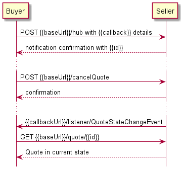

**Figure 15. Use case 4, 5: Cancel or Reject Quote by Quote Identifier**

## 6.6. Use case 5: Reject Quote by Quote Identifier

The Buyer may also decide to reject a `Quote` provided by the Seller
(`approved.orderable` or `approved.orderableAlternate` states). A `rejectQuote`
operation from the `POST /rejectQuote` endpoint must be used to do so.

[R XXX] The Seller **MUST** provide the ability for a Buyer to reject a `Quote `
when the `Quote` is in the `approved.orderable` or `approved.orderableAlternate`
state. **[MEF80 R2]**.

The Reject Request has the same body and the rules of usage as the Cancel
Request mentioned in the section above.

## 6.7. Use case 6: Register for Quote Notifications

The Seller communicates with the Buyer with Notifications provided that:

- both Seller and Buyer support `Quote` notification mechanism
- Buyer has registered to receive `Quote` notifications from the Seller

To register for notifications the Buyer uses the `registerListener` operation
from the API: `POST /hub`. The request model contains only 2 attributes:

- `callback` - mandatory, to provide the callback address the events will be
  notified to,
- `query` - optional, to narrow the required types of event.

The usage of a combination of these attributes fulfills the **[MEF80 R92],
[MEF80 R93]**, and **[MEF80 R94]** requirements.

By using a simple request:

```json
{
  "callback": "http://buyer.com/listenerEndpoint"
}
```

The Buyer subscribes for notification of all types of events. Those are:

- `quoteCreateEvent`
- `quoteStateChangeEvent`
- `quoteItemStateChangeEvent`

If the Buyer wishes to receive only notification of a certain type, a `query`
may be added:

```json
{
  "callback": "http://buyer.com/listenerEndpoint",
  "query": "eventType=quoteStateChangeEvent"
}
```

If the Buyer wishes to subscribe to 2 different types of events, there are 2
possible syntax variants [[tmf630](#8-references)]:

- `eventType=quoteStateChangeEvent,quoteItemStateChangeEvent` or
- `eventType=quoteStateChangeEvent; eventType=quoteItemStateChangeEvent`

The Seller responds to the subscription request adding the 'id' to the message
body.

```json
{
  "id": "00000000-0000-0000-0000-000000000678",
  "callback": "http://buyer.com/listenerEndpoint",
  "query": "eventType=quoteStateChangeEvent"
}
```

## 6.8. Use case 7: Send Quote Notification

[R XXX] If the Seller supports Quote Notifications, they **MUST** send them to
Buyers who have registered for Quote Notifications **[MEF80 CR4<O14]** in both
deferred and immediate response flows.

[R XXX] The Seller **MUST** send Quote Notifications to Buyers who have
registered for Quote Notifications **[MEF80 CR7<O14]**.

[R XXX] The Seller **MUST NOT** send Quote Notifications to Buyers who have not
registered for Quote Notifications **[MEF80 CR6<O14]** .

Seller sends notifications about `Quote` create, state, or `QuoteItem` state
change events. Quote create event might look like:

```json
{
  "eventId": "event-001",
  "eventType": "quoteCreateEvent",
  "eventTime": "2020-08-10T16:40:37.422Z0",
  "event": {
    "id": "00000000-0000-0000-0000-000000000123"
  }
}
```

An event triggered by the state change of the `QuoteItem` must additionally
contain the relative `QuoteItem` identifier:

```json
{
  "eventId": "event-002",
  "eventType": "quoteItemStateChangeEvent",
  "eventTime": "2020-08-10T16:45:37.422Z0",
  "event": {
    "id": "00000000-0000-0000-0000-000000000123",
    "quoteItemId": "item-002"
  }
}
```

**_Note_**: the body of the event carries only the Quote `id`. The Buyer needs
to query it later by `id` to get details.

To stop receiving events, the Buyer has to use the `unregisterListener`
operation from the `DELETE /hub/{id}` endpoint. The `id` is the identifier
received from the Seller during the listener registration.

The flow of this use case is presented in Figure 16.

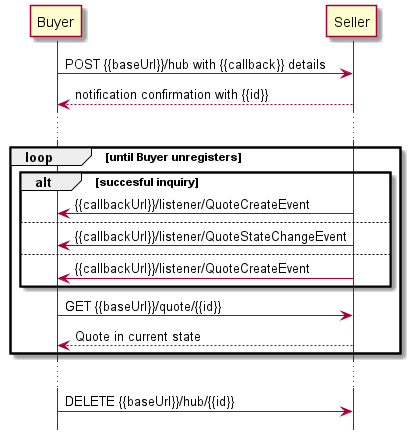

**Figure 16. Use case 6, 7: Register and Send Notifications**

Notifications are sent to:

- `http://buyer.com/listenerEndpoint/mefApi/sonata/quoteNotification/v6/listener/quoteCreateEvent`
  in case of `quoteCreateEvent`
- `http://buyer.com/listenerEndpoint/mefApi/sonata/quoteNotification/v6/listener/quoteStateChangeEvent`
  in case of `quoteStateChangeEvent`
- `http://buyer.com/listenerEndpoint/mefApi/sonata/quoteNotification/v6/listener/quoteItemStateChangeEvent`
  in case of `quoteItemStateChangeEvent`

# 7. API Details

## 7.1. API patterns

### 7.1.1. Indicating errors

Erroneous situations are indicated by appropriate HTTP responses. An error
response is indicated by HTTP status 4xx (for client errors) or 5xx (for server
errors) and appropriate response payload. The Quote API uses the error responses
as depicted and described below.

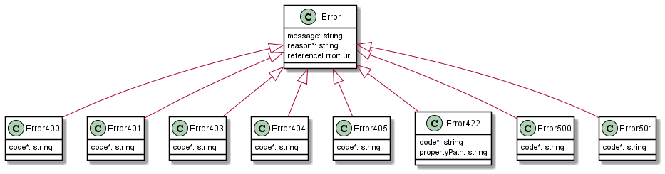

**Figure 17. Data model types to represent an erroneous response**

#### 7.1.1.1. Type Error

**Description:** Standard Class used to describe API response error NOT intended
to be used directly. It **MUST** be used via specialization which defines a
`code` property.

<table id="T_Error">
    <thead style="font-weight:bold;">
        <tr>
            <td>Name</td>
            <td>Type</td>
            <td>Description</td>
        </tr>
    </thead>
    <tbody>
        <tr>
            <td>message</td>
            <td>string</td>
            <td>Text that provides more details and corrective actions related to the error. This can be shown to a client user.</td>
        </tr><tr>
            <td>reason*</td>
            <td>string</td>
            <td>Text that explains the reason for the error. This can be shown to a client user.</td>
        </tr><tr>
            <td>referenceError</td>
            <td>uri</td>
            <td>URL pointing to documentation describing the error</td>
        </tr><tr>
            <td>status</td>
            <td>string</td>
            <td>Http error code extension like 400-2 for example</td>
        </tr>
    </tbody>
</table>

#### 7.1.1.2. Type Error400

**Description:** Bad Request

Inherits from:

- <a href="#T_Error">Error</a>

<table id="T_Error400">
    <thead style="font-weight:bold;">
        <tr>
            <td>Name</td>
            <td>Type</td>
            <td>Description</td>
        </tr>
    </thead>
    <tbody>
        <tr>
            <td>code*</td>
            <td>string</td>
            <td>One of the error codes listed below</td>
        </tr>
    </tbody>
</table>

Supported error codes:

<table>
    <thead style="font-weight:bold;">
        <tr>
            <td>Value</td>
            <td>Description</td>
        </tr>
    </thead>
    <tbody>
        <tr>
            <td>missingQueryParameter</td>
            <td>Missing query-string parameter</td>
        </tr>
        <tr>
            <td>missingQueryValue</td>
            <td>Invalid query-string parameter value</td>
        </tr>
        <tr>
            <td>invalidQuery</td>
            <td>Query constructed in an invalid way</td>
        </tr>
        <tr>
            <td>invalidBody</td>
            <td>Invalid body</td>
        </tr>
    </tbody>
</table>

#### 7.1.1.3. Type Error401

**Description:** Unauthorized

Inherits from:

- <a href="#T_Error">Error</a>

<table id="T_Error401">
    <thead style="font-weight:bold;">
        <tr>
            <td>Name</td>
            <td>Type</td>
            <td>Description</td>
        </tr>
    </thead>
    <tbody>
        <tr>
            <td>code*</td>
            <td>string</td>
            <td>One of the error codes listed below</td>
        </tr>
    </tbody>
</table>

Supported error codes:

<table>
    <thead style="font-weight:bold;">
        <tr>
            <td>Value</td>
            <td>Description</td>
        </tr>
    </thead>
    <tbody>
        <tr>
            <td>missingCredentials</td>
            <td>Missing credentials</td>
        </tr>
        <tr>
            <td>invalidCredentials</td>
            <td>Invalid or expired credentials</td>
        </tr>
    </tbody>
</table>

#### 7.1.1.4. Type Error403

**Description:** Forbidden

Inherits from:

- <a href="#T_Error">Error</a>

<table id="T_Error403">
    <thead style="font-weight:bold;">
        <tr>
            <td>Name</td>
            <td>Type</td>
            <td>Description</td>
        </tr>
    </thead>
    <tbody>
        <tr>
            <td>code*</td>
            <td>string</td>
            <td>One of the error codes listed below</td>
        </tr>
    </tbody>
</table>

Supported error codes:

<table>
    <thead style="font-weight:bold;">
        <tr>
            <td>Value</td>
            <td>Description</td>
        </tr>
    </thead>
    <tbody>
        <tr>
            <td>accessDenied</td>
            <td>Access denied</td>
        </tr>
        <tr>
            <td>forbiddenRequester</td>
            <td>Forbidden requester</td>
        </tr>
        <tr>
            <td>tooManyUsers</td>
            <td>Too many users</td>
        </tr>
    </tbody>
</table>

#### 7.1.1.5. Type Error404

**Description:** Resource for the requested path not found

Inherits from:

- <a href="#T_Error">Error</a>

<table id="T_Error404">
    <thead style="font-weight:bold;">
        <tr>
            <td>Name</td>
            <td>Type</td>
            <td>Description</td>
        </tr>
    </thead>
    <tbody>
        <tr>
            <td>code*</td>
            <td>string</td>
            <td>notFound: Resource not found</td>
        </tr>
    </tbody>
</table>

#### 7.1.1.6. Type Error408

**Description:** Request Time-out

Inherits from:

- <a href="#T_Error">Error</a>

<table id="T_Error408">
    <thead style="font-weight:bold;">
        <tr>
            <td>Name</td>
            <td>Type</td>
            <td>Description</td>
        </tr>
    </thead>
    <tbody>
        <tr>
            <td>code*</td>
            <td>string</td>
            <td>timeOut: Request Time-out</td>
        </tr>
    </tbody>
</table>

#### 7.1.1.7. Type Error422

**Description:** Unprocessable entity due to a business validation problem.

The response for HTTP status `422` is a list of elements that are structured
using `Error422` data type. Each list item describes a business validation
problem.

Inherits from:

- <a href="#T_Error">Error</a>

<table id="T_Error422">
    <thead style="font-weight:bold;">
        <tr>
            <td>Name</td>
            <td>Type</td>
            <td>Description</td>
        </tr>
    </thead>
    <tbody>
        <tr>
            <td>code*</td>
            <td>string</td>
            <td>One of the error codes listed below</td>
        </tr>
        <tr>
            <td>propertyPath</td>
            <td>string</td>
            <td>
                A pointer to a particular property of the payload that caused the validation issue. 
                Defined using JsonPath format (https://goessner.net/articles/JsonPath/).
            </td>
        </tr>
    </tbody>
</table>

Supported error codes:

<table>
    <thead style="font-weight:bold;">
        <tr>
            <td>Value</td>
            <td>Description</td>
        </tr>
    </thead>
    <tbody>
        <tr>
            <td>referenceNotFound</td>
            <td>The object referenced by the property cannot be identified in the Seller system</td>
        </tr>
        <tr>
            <td>missingProperty</td>
            <td>The property the Seller has expected is not present in the payload</td>
        </tr>
        <tr>
            <td>invalidValue</td>
            <td>The property has an incorrect value</td>
        </tr>
        <tr>
            <td>invalidFormat</td>
            <td>The property value provided does not comply with expected value format</td>
        </tr>
        <tr>
            <td>unexpectedProperty</td>
            <td>An additional property, not expected by the Seller, has been provided</td>
        </tr>
        <tr>
            <td>otherIssue</td>
            <td>Other problem was identified - detailed information provided in a <code>reason</code> property</td>
        </tr>
    </tbody>
</table>

#### 7.1.1.8. Type Error500

**Description:** Internal Server Error

Inherits from:

- <a href="#T_Error">Error</a>

<table id="T_Error500">
    <thead style="font-weight:bold;">
        <tr>
            <td>Name</td>
            <td>Type</td>
            <td>Description</td>
        </tr>
    </thead>
    <tbody>
        <tr>
            <td>code*</td>
            <td>string</td>
            <td>internalError: Internal server error</td>
        </tr>
    </tbody>
</table>

#### 7.1.1.9. Type Error501

**Description:** Not Implemented

Inherits from:

- <a href="#T_Error">Error</a>

<table id="T_Error501">
    <thead style="font-weight:bold;">
        <tr>
            <td>Name</td>
            <td>Type</td>
            <td>Description</td>
        </tr>
    </thead>
    <tbody>
        <tr>
            <td>code*</td>
            <td>string</td>
            <td>notImplemented: Method not supported by the server</td>
        </tr>
    </tbody>
</table>

### 7.1.2. Response pagination

A response to retrieve a list of results (e.g.
`GET /productOfferingQualification`) can be paginated. The Buyer can specify
following query attributes related to pagination:

- `limit` - number of expected list items
- `offset` - offset of the first element in the result list

The Seller returns a list of elements that comply with the requested `limit`. If
the requested `limit` is higher than the supported list size the smaller list
result is returned. In that case, the size of the result is returned in the
header attribute `X-Result-Count`. The Seller can indicate that there are
additional results available using:

- `X-Total-Count` header attribute with the total number of available results
- `X-Pagination-Throttled` header set to `true`

[R XXX] Seller **MUST** use either `X-Total-Count` or `X-Pagination-Throttled`
to indicate that the page was truncated and additional results are available.

## 7.2. Management API Data model

Figure 18 presents the whole Quote Management data model The data types,
requirements related to them and mapping to MEF 80 specifications are discussed
later in this section.

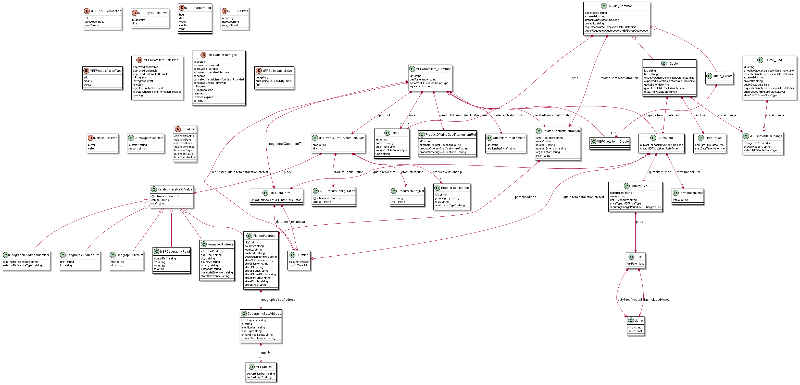

**Figure 18. Quote Management Data Model**

### 7.2.1. Quote

#### 7.2.1.1 Type Quote_Common

**Description:** Quote can be used to negotiate service and product acquisition
or modification between a customer and a service provider. Quote contains a list
of quote items, a reference to customer, a list of productOfferings, and
attached prices and conditions.

<table id="T_Quote_Common">
    <thead style="font-weight:bold;">
        <tr>
            <td>Name</td>
            <td>Type</td>
            <td>Description</td>
            <td>MEF 80</td>
        </tr>
    </thead>
    <tbody>
        <tr>
            <td>description</td>
            <td>string</td>
            <td>Description of the quote</td>
            <td>Description</td>
        </tr><tr>
            <td>externalId</td>
            <td>string</td>
            <td>ID given by the consumer and only understandable by him (to facilitate his searches afterward)</td>
            <td>Buyer Quote Identifier</td>
        </tr><tr>
            <td>instantSyncQuote*</td>
            <td>boolean</td>
            <td>An indicator which when the value is "true" means that requester expects to get quoting result immediately in the response. If the indicator is true then the response code of 200 indicates the operation is successful otherwise a task is created with a response 201. </td>
            <td>Immediate Quote Response</td>
        </tr><tr>
            <td>projectId</td>
            <td>string</td>
            <td>This value MAY be assigned by the Buyer/Seller to identify a project the serviceability request is associated with.</td>
            <td>Project Identifier</td>
        </tr><tr>
            <td>requestedQuoteCompletionDate</td>
            <td>date-time</td>
            <td>This is requested date - from quote requester - to get a complete response for this quote</td>
            <td>Requested Quote Completion Date</td>
        </tr><tr>
            <td>buyerRequestedQuoteLevel*</td>
            <td><a href="#T_MEFBuyerQuoteLevel">MEFBuyerQuoteLevel</a></td>
            <td></td>
            <td>Buyer Requested Quote Level</td>
        </tr><tr>
            <td>note</td>
            <td><a href="#T_Note">Note</a>[]</td>
            <td>Free form text associated with the quote</td>
            <td>Note</td>
        </tr><tr>
            <td>relatedContactInformation</td>
            <td><a href="#T_RelatedContactInformation">RelatedContactInformation</a>[]</td>
            <td> Party playing a role for this qualification. If `instantSyncQuote=false`<br> 
          then the Buyer MUST specify Buyer Contact Information ('role=buyerContactInformation'). <br>
          The Seller MUST always specify Seller Contact Information ('role=sellerContactInformation') </td>
            <td>Buyer Contact Information (role=buyerContactInformation), Seller Contact Information (role=sellerContactInformation)</td>
        </tr>
    </tbody>
</table>

#### 7.2.1.2. Type Quote_Create

**Description:** Quote can be used to negotiate service and product acquisition
or modification between a customer and a service provider. Quote contains a list
of quote items, a reference to the customer, a list of productOffering, and
attached prices and conditions.

This type MUST be used by the Buyer in the request.

Inherits from:

- <a href="#T_Quote_Common">Quote_Common</a>

<table id="T_Quote_Create">
    <thead style="font-weight:bold;">
        <tr>
            <td>Name</td>
            <td>Type</td>
            <td>Description</td>
            <td>MEF 80</td>
        </tr>
    </thead>
    <tbody>
        <tr>
            <td>quoteItem*</td>
            <td><a href="#T_MEFQuoteItem_Create">MEFQuoteItem_Create</a>[]</td>
            <td>An item of the quote - it is used to describe an operation on a product to be quoted</td>
            <td>Quote Item</td>
        </tr>
    </tbody>
</table>

[R XXX] If `instantSyncQuote=false` the
`relatedContactInformation" list **MUST** contain an entry that represents Buyer Contact Information. The role for this entry **MUST** be `buyerContactInformation`.
[MEF80 R16].

#### 7.2.1.3. Type Quote

**Description:** Quote can be used to negotiate service and product acquisition
or modification between a customer and a service provider. Quote contain list of
quote items, a reference to customer, a list of productOffering and attached
prices and conditions.

This type MUST be used by the Seller in the response.

Inherits from:

- <a href="#T_Quote_Common">Quote_Common</a>

<table id="T_Quote">
    <thead style="font-weight:bold;">
        <tr>
            <td>Name</td>
            <td>Type</td>
            <td>Description</td>
            <td>MEF 80</td>
        </tr>
    </thead>
    <tbody>
        <tr>
            <td>id</td>
            <td>string</td>
            <td>Unique identifier - attributed by quoting system</td>
            <td>Seller Quote Identifier</td>
        </tr><tr>
            <td>href</td>
            <td>string</td>
            <td>Hyperlink representing this resource Hyperlink MAY be used when providing response by the Seller
</td>
            <td>Not represented in MEF 80</td>
        </tr><tr>
            <td>effectiveQuoteCompletionDate</td>
            <td>date-time</td>
            <td>Date when the quote has been completed and moved to one of completion states.</td>
            <td>Quote Completion Date</td>
        </tr><tr>
            <td>expectedQuoteCompletionDate</td>
            <td>date-time</td>
            <td>This is expected date - from quote supplier - to be able to send back  a response for this quote</td>
            <td>Expected Quote Completion Date</td>
        </tr><tr>
            <td>quoteDate</td>
            <td>date-time</td>
            <td>Date and time when the quote was created</td>
            <td>Quote Request Date</td>
        </tr><tr>
            <td>quoteItem*</td>
            <td><a href="#T_QuoteItem">QuoteItem</a>[]</td>
            <td>An item of the quote - it is used to describe an operation on a product to be quoted</td>
            <td>Quote Item</td>
        </tr><tr>
            <td>quoteLevel</td>
            <td><a href="#T_MEFSellerQuoteLevel">MEFSellerQuoteLevel</a></td>
            <td>An indication of whether the Seller’s Quote Response is Budgetary, Firm – Subject to Feasibility Check, or Firm. The Seller Quote Level is provided by the Seller when responding to a Quote request. This represents the lowest Quote Item Level of all Quote Items included in the Quote.</td>
            <td>Seller Quote Level</td>
        </tr><tr>
            <td>state</td>
            <td><a href="#T_MEFQuoteStateType">MEFQuoteStateType</a></td>
            <td></td>
            <td>Quote State</td>
        </tr><tr>
            <td>stateChange</td>
            <td><a href="#T_MEFQuoteStateChange">MEFQuoteStateChange</a>[]</td>
            <td>State change for the Quote</td>
            <td>Quote IN_PROGRESS Date,<br>Quote IN_PROGRESS_DRAFT Date,<br>Quote Completion State Date,<br>Quote CANCELLED Date,<br>Quote REJECTED,<br>Date Quote EXPIRED Date</td>
        </tr><tr>
            <td>validFor</td>
            <td><a href="#T_TimePeriod">TimePeriod</a></td>
            <td></td>
            <td>Valid Until Date</td>
        </tr>
    </tbody>
</table>

[R XXX] Each item in `quoteItem` list **MUST** correspond to an item from
`Quote_Create` **[MEF80 R36]**, **[MEF80 R41]**.

[R XXX] If `instantSyncQuote=false` the
`relatedContactInformation" list **MUST** contain an entry that represents Seller Contact Information. The role for this entry **MUST** be `sellerContactInformation`.
[MEF80 R40].

#### 7.2.1.4. `enum` MEFQuoteStateType

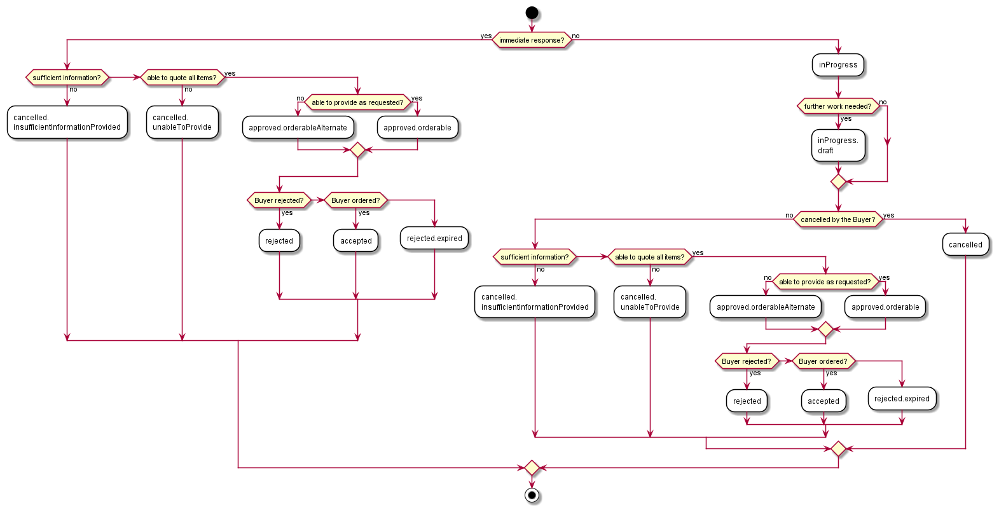

**Figure 19. Quote firm flow activity diagram**

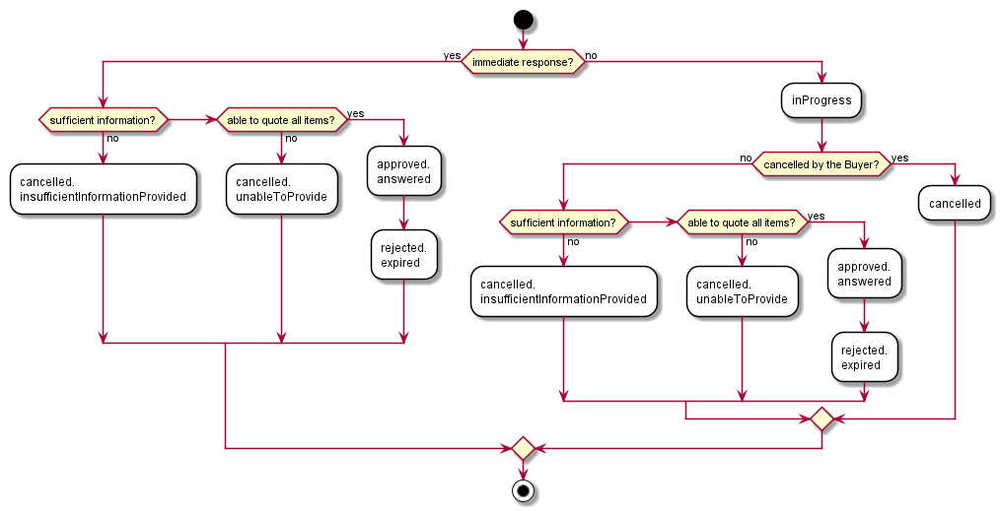

**Figure 20. Quote budgetary flow activity diagram**

If a Quote request does not pass an initial validation the appropriate error
response is returned to the Buyer. In case a Quote request failed business rules
validation the HTTP response code is `422` and a list of validation problems is
returned. Otherwise, the Quote is processed and given an `id`.

Following tables present the possible combinations of Quote and QuoteItem
states, as described in MEF 80 [[mef80](#8-references)]:

| Quote State\Quote Items State             | rejected | inProgress | inProgress.draft | rejected.insufficientInformationProvided | approved.orderableAlternate | approved.orderable | rejected.unableToProvide |
| ----------------------------------------- | -------- | ---------- | ---------------- | ---------------------------------------- | --------------------------- | ------------------ | ------------------------ |
| accepted                                  |          |            |                  |                                          | X                           | X                  |                          |
| cancelled                                 | X        |            |                  |                                          |                             |                    |                          |
| rejected.expired                          |          |            |                  |                                          | X                           | X                  |                          |
| inProgress                                |          | X          | X                |                                          | X                           | X                  |                          |
| inProgress.draft                          |          |            | X                |                                          | X                           | X                  |                          |
| cancelled.insufficientInformationProvided | X        |            |                  | X                                        |                             |                    |                          |
| approved.orderableAlternate               |          |            |                  |                                          | X                           | X                  |                          |
| approved.orderable                        |          |            |                  |                                          |                             | X                  |                          |
| rejected                                  |          |            |                  |                                          | X                           | X                  |                          |
| cancelled.unableToProvide                 | X        |            |                  |                                          |                             |                    | X                        |

**Table 5 – Allowable Quote Item States per Quote State for FIRM Quote Level**

| Quote State\Quote Items State             | rejected | approved.answered | inProgress | rejected.insufficientInformationProvided | rejected.unableToProvide |
| ----------------------------------------- | -------- | ----------------- | ---------- | ---------------------------------------- | ------------------------ |
| approved.answered                         |          | X                 |            | X                                        | X                        |
| cancelled                                 | X        |                   |            |                                          |                          |
| rejected.expired                          |          | X                 |            | X                                        | X                        |
| inProgress                                |          | X                 | X          |                                          |                          |
| cancelled.insufficientInformationProvided | X        |                   |            | X                                        |                          |
| cancelled.unableToProvide                 | X        |                   |            |                                          | X                        |

**Table 6 – Allowable Quote Item States per Quote State for BUDGETARY
QuoteLevel**

**Description:** Possible values for the status of a Quote. Following mapping
has been used between `MEFQuoteStateType` and MEF 80:

<table id="T_MEFQuoteStateType">
    <thead style="font-weight:bold;">
        <tr>
            <td>Value</td>
            <td>MEF 80</td>
            <td>Description</td>
        </tr>
    </thead>
    <tbody>
        <tr>
            <td>accepted</td>
            <td>ACCEPTED</td>
            <td>The accepted state is set by the Seller. It is triggered by a product order. All Quote Items must be in an approved.orderable or approved.orderableAlternate state. In that case, the Quote moves from the approved.orderableAlternate state to the accepted state.</td>
        </tr><tr>
            <td>approved.orderable</td>
            <td>ORDERABLE</td>
            <td>The approved.orderable state is where the quote has been internally approved by the Seller and is ready for the Buyer to review. All Quote Items must also be in an approved.orderable state. An Immediate Response can move from Start to approved.orderable state without going through the inProgress state.</td>
        </tr><tr>
            <td>approved.answered</td>
            <td>ANSWERED</td>
            <td>The approved.answered state is applied when a Buyer Requested Quote Level is BUDGETARY, and the Seller has provided a Quote to answer the Buyer’s Quote Request.  When the Quote Request is in the BUDGETARY state, all Quote Items must be in a terminal state.</td>
        </tr><tr>
            <td>approved.orderableAlternate</td>
            <td>ORDERABLE_ALTERNATE</td>
            <td>This state is set by the Seller when they have provided a Quote and have either decided that they will not perform any further work on the quote or the Seller’s Quote contains a Quote Item Installation Interval and Quote Item Installation Interval Value that are > the Requested Quote Item Installation Interval and Requested Quote Item Installation Interval Value. Quote items are in the approved.orderableAlternate or approved.orderable state. From approved.orderable or approved.orderableAlternate the quote can move to the rejected, rejected.expired, or accepted states.</td>
        </tr><tr>
            <td>cancelled</td>
            <td>CANCELLED</td>
            <td>A quote can only be cancelled when it is in an inProgress state or an inProgress.draft state. The cancelled state is when the quote process is stopped by a Buyer through an explicit Cancel Request.  Quote items might be in an inProgress, inProgress.draft, or approved.orderable state. Any Quote Items in an inProgress state are moved to an rejected state.  The Seller moves the Quote Request to the cancelled state upon the receipt of a Cancel Request from the Buyer.</td>
        </tr><tr>
            <td>cancelled.insufficientInformationProvided</td>
            <td>INSUFFICIENT_INFORMATION_PROVIDED</td>
            <td>This state is set by the Seller when they do not have sufficient information for one or more Quote Items to respond to the Buyer’s Quote Request.  The Quote Request moves to cancelled.insufficientInformationProvided when one Quote Item is in an rejected.insufficientInformationProvided state. Any Quote Items in an inProgress state are moved to an rejected state.  When a quote is in the cancelled.insufficientInformationProvided state, some Quote Items might be in the approved.orderable state.  An Instantaneous Response can move from Start to the cancelled.insufficientInformationProvided state without going through the inProgress state.</td>
        </tr><tr>
            <td>cancelled.unableToProvide</td>
            <td>UNABLE_TO_PROVIDE</td>
            <td>This state is set by the Seller when they are not able to provide a Quote. The Seller may be unable to provide a Quote because they are unable to provide one or more Quote Items or because they are unable to provide a Price for a Quote Request with a Firm Quote Level. The Quote Request moves to cancelled.unableToProvide when one Quote Item is in an cancelled.unableToProvide state. Any Quote Items in an inProgress state are moved to an rejected state. When a quote is in the cancelled.unableToProvide state, some Quote Items might be in the approved.orderable state.  An Immediate Response can move from Start to the cancelled.unableToProvide state without going through the inProgress state.</td>
        </tr><tr>
            <td>inProgress</td>
            <td>IN_PROGRESS</td>
            <td>The inProgress state is when the quote is currently in the hands of the Seller to build it according to the Buyer’s requirements.  The pricing and expected completion date should be updatable in this state. At least one Quote Item is in an inProgress state. No Quote Items may be in an rejected.unableToProvide or rejected.insufficientInformationProvided state.  </td>
        </tr><tr>
            <td>inProgress.draft</td>
            <td>IN_PROGRESS_DRAFT</td>
            <td>The inProgress.draft state is when the Seller has provided a Quote in answer to the Buyer’s request. The Seller is continuing to work on the quote and the quote cannot be referenced in an order in this state. At least one Quote Item is in an inProgress.draft state. No Quote Items are in an ejected.unableToProvide or rejected.insufficientInformationProvided state.</td>
        </tr><tr>
            <td>rejected</td>
            <td>REJECTED</td>
            <td>The rejected state is used when the Buyer does not wish to progress with the quotation. The Buyer requests the state of the quote to rejected through a Reject Request.  In order for a Buyer to actually reject the quote, all Quote Items must be in an approved.orderable or approved.orderableAlternate state.  The Seller moves the Quote Request to rejected state.</td>
        </tr><tr>
            <td>rejected.expired</td>
            <td>EXPIRED</td>
            <td>This state is set by the Seller from an approved.orderable state or approved.orderableAlternate state to indicate that the Valid Until date for the quote has passed and quote will no longer be honored. All the Quote Items must be in an approved.orderable state or approved.orderableAlternate state</td>
        </tr><tr>
            <td>pending</td>
            <td>Not represented in MEF 80</td>
            <td>Present for compliance with TMF. Not used by MEF</td>
        </tr>
    </tbody>
</table>

#### 7.2.1.5. `enum` MEFBuyerQuoteLevel

**Description:** An indication of whether the Buyer’s Quote Request is for a
Budgetary or Firm Quote Level. Set by the Buyer. Buyer Requested Quote Level
contains the possible values and may be set by the Buyer on the Request. All
Quote Items in a Quote have the same Quote Level.

<table id="T_MEFBuyerQuoteLevel">
    <thead style="font-weight:bold;">
        <tr>
            <td>Value</td>
            <td>MEF 80</td>
            <td>Description</td>
        </tr>
    </thead>
    <tbody>
        <tr>
            <td>budgetary</td>
            <td>BUDGETARY</td>
            <td>A quote that is provided quickly and with very little analysis such that the Buyer can get an idea of how much the requested Product Offering could cost. Any charges specified are subject to change.</td>
        </tr><tr>
            <td>firm</td>
            <td>FIRM</td>
            <td>A quote provided to the Buyer based on a complete pre-order analysis analysis. All Monthly Recurring Charges and Non-Recurring Charges specified on a Firm Quote are committed. A Firm Quote may expire at some date specified by the Seller</td>
        </tr>
    </tbody>
</table>

#### 7.2.1.6. `enum` MEFSellerQuoteLevel

**Description:** An indication of whether the Seller’s Quote Response is
Budgetary, Firm – Subject to Feasibility Check, or Firm. The Seller Quote Level
is provided by the Seller when responding to a Quote request. This represents
the lowest Quote Item Level of all Quote Items included in the Quote.

<table id="T_MEFSellerQuoteLevel">
    <thead style="font-weight:bold;">
        <tr>
            <td>Value</td>
            <td>MEF 80</td>
            <td>Description</td>
        </tr>
    </thead>
    <tbody>
        <tr>
            <td>budgetary</td>
            <td>BUDGETARY</td>
            <td>A quote that is provided quickly and with very little analysis such that the Buyer can get an idea of how much the requested Product Offering could cost.  Any charges specified are subject to change.</td>
        </tr><tr>
            <td>firmSubjectToFeasibilityCheck</td>
            <td>FIRM_SUBJECT_TO_FEASIBILITY_CHECK</td>
            <td>A quote that is provided to the Buyer based on some, but not a complete, pre-order analysis.  At this stage, the Seller may not be willing to perform any further work on the quote and requests that the Buyer use the Firm – Subject to Feasibility Check Quote to proceed to the Order process. Ordering is possible based on the Firm – Subject to Feasibility Check Quote with some stipulations as to how cost identified during delivery is addressed. The Monthly Recurring Charges specified in the Quote Response are final. Non-Recurring Charges specified in the Quote Response are subject to change.</td>
        </tr><tr>
            <td>firm</td>
            <td>FIRM</td>
            <td>A quote provided to the Buyer based on a complete pre-order analysis analysis.  All Monthly Recurring Charges and Non-Recurring Charges specified on a Firm Quote are committed.  A Firm Quote may ex-pire at some date specified by the Seller</td>
        </tr>
    </tbody>
</table>

#### 7.2.1.7. Type MEFQuoteStateChange

This list works as a history for a `Quote` instance.

**Description:** Holds the reached state, reasons and associated date the Quote
state changed, populated by the Seller.

<table id="T_MEFQuoteStateChange">
    <thead style="font-weight:bold;">
        <tr>
            <td>Name</td>
            <td>Type</td>
            <td>Description</td>
            <td>MEF 80</td>
        </tr>
    </thead>
    <tbody>
        <tr>
            <td>changeDate*</td>
            <td>date-time</td>
            <td>The date on when the state was reached</td>
            <td>Not represented in MEF 80</td>
        </tr><tr>
            <td>changeReason</td>
            <td>string</td>
            <td>Additional comment related to state change</td>
            <td>Not represented in MEF 80</td>
        </tr><tr>
            <td>state*</td>
            <td><a href="#T_MEFQuoteStateType">MEFQuoteStateType</a></td>
            <td>A state reached at the change date</td>
            <td>Not represented in MEF 80</td>
        </tr>
    </tbody>
</table>

### 7.2.2. Quote Item

#### 7.2.2.1 Type MEFQuoteItem_Common

**Description:** A quote items describe an action to be performed on a
productOffering or a product in order to get pricing elements and condition.

<table id="T_MEFQuoteItem_Common">
    <thead style="font-weight:bold;">
        <tr>
            <td>Name</td>
            <td>Type</td>
            <td>Description</td>
            <td>MEF 80</td>
        </tr>
    </thead>
    <tbody>
        <tr>
            <td>id*</td>
            <td>string</td>
            <td>Identifier of the quote item (generally it is a sequence number 01, 02, 03, ...)</td>
            <td>Quote Item Reference Number</td>
        </tr><tr>
            <td>dealReference</td>
            <td>string</td>
            <td>A pre-agreed pricing modifier reference that the Seller is offering to the Buyer which will impact the price.</td>
            <td>Quote Item Deal Reference</td>
        </tr><tr>
            <td>action*</td>
            <td><a href="#T_MEFProductActionType">MEFProductActionType</a></td>
            <td>Action to be performed on the Product that the Quote Item refers to. This corresponds to the Order Item Action when an associated product is ordered.</td>
            <td>Quote Item Product Action</td>
        </tr><tr>
            <td>agreement</td>
            <td>string</td>
            <td>Name of the agreement. The name is unique be-tween the Buyer and the Seller.</td>
            <td>Agreement</td>
        </tr><tr>
            <td>note</td>
            <td><a href="#T_Note">Note</a>[]</td>
            <td>Free form text associated with the quote item</td>
            <td>Note</td>
        </tr><tr>
            <td>product</td>
            <td><a href="#T_MEFProductRefOrValue">MEFProductRefOrValue</a></td>
            <td>The Buyer’s existing Product for which the quote is being requested.</td>
            <td>Product Identifier,<br>Product Specific Attributes</td>
        </tr><tr>
            <td>productOfferingQualificationItem</td>
            <td><a href="#T_ProductOfferingQualificationItemRef">ProductOfferingQualificationItemRef</a></td>
            <td>The Product Offering Qualification Item associated to this Quote Item.</td>
            <td>POQ Item</td>
        </tr><tr>
            <td>quoteItemRelationship</td>
            <td><a href="#T_QuoteItemRelationship">QuoteItemRelationship</a>[]</td>
            <td>A relationship from item within a quote</td>
            <td>Quote Item Relationship</td>
        </tr><tr>
            <td>relatedContactInformation</td>
            <td><a href="#T_RelatedContactInformation">RelatedContactInformation</a>[]</td>
            <td>Contact information of an individual or organization playing a role for this Quote.<br>
            If <code>instantSyncQuote=false</code> then Quote Item Technical Contact (role=quoteItemTechnicalContact) MUST be specified.<br>
            If <code>instantSyncQuote=false</code> and the Quote Item requires a location,
          the Buyer MUST provide the Quote Item Location Contact Information <code>role=quoteItemLocationContact</code>.</td>
            <td>Quote Item Location Contact (role=quoteItemLocationContact),<br>Quote Item Technical Contact (role=quoteItemTechnicalContact)</td>
        </tr><tr>
            <td>requestedQuoteItemInstallationInterval</td>
            <td><a href="#T_Duration">Duration</a></td>
            <td>The installation interval requested by the Buyer.</td>
            <td>Requested Quote Item Installation Interval</td>
        </tr><tr>
            <td>requestedQuoteItemTerm</td>
            <td><a href="#T_MEFItemTerm">MEFItemTerm</a></td>
            <td>The terms of the Quote Item</td>
            <td>Requested Quote Item Term</td>
        </tr>
    </tbody>
</table>

#### 7.2.2.2. Type MEFQuoteItem_Create

**Description:** A quote items describe an action to be performed on a
productOffering or a product in order to get pricing elements and condition.

The modeling pattern introduces the `Common` supertype to aggregate attributes
that are common to both `QuoteItem` and `QuoteItem_Create`. It this case the
Create type has a subset of attributes of the response type and does not
introduce any new, thus the `Create` type has an empty definition.

Inherits from:

- <a href="#T_MEFQuoteItem_Common">MEFQuoteItem_Common</a>

[R XXX] If `instantSyncQuote=false` the `relatedContactInformation` list
**MUST** contain an entry that represents Quote Item Technical Contact
Information. The role for this entry **MUST** be `quoteItemTechnicalContact`.
[MEF80 R15].

[R XXX] If `instantSyncQuote=false` and the Quote Item requires a location, the
Buyer MUST provide the Quote Item Location Contact Information
`role=quoteItemLocationContact`. [MEF80 R22]

#### 7.2.2.3. Type QuoteItem

**Description:** A quote items describe an action to be performed on a
productOffering or a product in order to get pricing elements and condition.

<table id="T_QuoteItem">
    <thead style="font-weight:bold;">
        <tr>
            <td>Name</td>
            <td>Type</td>
            <td>Description</td>
            <td>MEF 80</td>
        </tr>
    </thead>
    <tbody>
        <tr>
            <td>quoteItemInstallationInterval</td>
            <td><a href="#T_Duration">Duration</a></td>
            <td>The installation interval requested by the Buyer.</td>
            <td>Quote Item Installation Interval</td>
        </tr><tr>
            <td>quoteItemPrice</td>
            <td><a href="#T_QuotePrice">QuotePrice</a>[]</td>
            <td>Price for this quote item</td>
            <td>Quote Item Price</td>
        </tr><tr>
            <td>quoteItemTerm</td>
            <td><a href="#T_MEFItemTerm">MEFItemTerm</a></td>
            <td>Quote Item Term</td>
            <td>Quote Item Term</td>
        </tr><tr>
            <td>subjectToFeasibilityCheck</td>
            <td>boolean</td>
            <td>For a Firm Quote Level indicates if the pricing requires a Feasibility Check. The Seller indicates if the Quote Item requires a Feasibility Check. This is not used for a Budgetary Quote Level</td>
            <td>Subject to Feasibility Check</td>
        </tr><tr>
            <td>state</td>
            <td><a href="#T_MEFQuoteItemStateType">MEFQuoteItemStateType</a></td>
            <td>The state of the Quote Item</td>
            <td>Quote Item State</td>
        </tr><tr>
            <td>terminationError</td>
            <td><a href="#T_TerminationError">TerminationError</a>[]</td>
            <td>When the Seller cannot process the Quote Item Request, the Seller returns a text-based list of reasons here.<br>
            If the <code>QuoteItem.state=rejected.insufficientInformationProvided</code>, the Seller MUST specify the <code>terminationError</code> attribute.</td>
            <td>Quote Item Termination Error</td>
        </tr>
    </tbody>
</table>

[R XXX] If the `QuoteItem.state=rejected.insufficientInformationProvided`, the
Seller MUST specify the `terminationError` attribute. [MEF80 R52]

#### 7.2.2.4. `enum` MEFProductActionType

**Description:** Action to be performed on the Product that the Quote Item
refers to. This corresponds to the Order Item Action when an associated product
is ordered.

Mapping to MEF 80:

<table id="T_MEFProductActionType">
    <thead style="font-weight:bold;">
        <tr>
            <td>Value</td>
            <td>MEF 80</td>
        </tr>
    </thead>
    <tbody>
        <tr>
            <td>add</td>
            <td>INSTALL</td>
        </tr><tr>
            <td>modify</td>
            <td>CHANGE</td>
        </tr><tr>
            <td>delete</td>
            <td>DISCONNECT</td>
        </tr>
    </tbody>
</table>

#### 7.2.2.5.`enum` MEFQuoteItemStateType

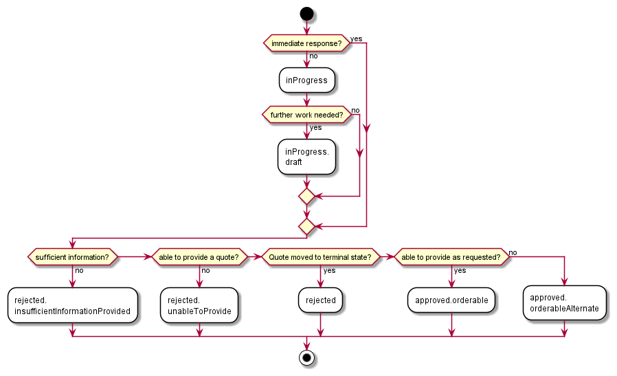

**Figure 21. Quote Item firm quote flow activity**

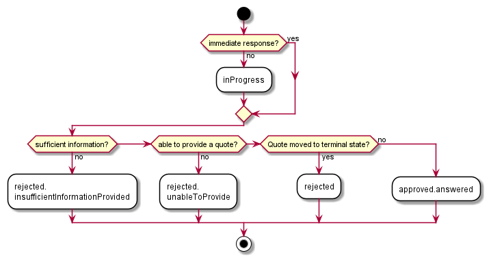

**Figure 22. Quote Item budgetary quote flow activity**

**Description:** Possible values for the status of a QuoteItem. Following
mapping has been used between `MEFQuoteItemStateType` and MEF 80:

<table id="T_MEFQuoteItemStateType">
    <thead style="font-weight:bold;">
        <tr>
            <td>Value</td>
            <td>MEF 80</td>
            <td>Description</td>
        </tr>
    </thead>
    <tbody>
        <tr>
            <td>approved.answered</td>
            <td>ANSWERED</td>
            <td>The ANSWERED state is applied when a Buyer Requested Quote Level is BUDGETARY, and the Seller has provided a Quote in answer to the Buyer’s Quote Request.</td>
        </tr><tr>
            <td>approved.orderable</td>
            <td>ORDERABLE</td>
            <td>The approved.orderable state is where the Quote Item has been internally approved by the Seller. An Instantaneous Response can move from Start to approved.orderable state without going through the inProgress state.</td>
        </tr><tr>
            <td>approved.orderableAlternate</td>
            <td>ORDERABLE_ALTERNATE </td>
            <td>This state is set by the Seller when they have provided inProgress.draft quote Quote response for this Quote Item and have either decided that they will not perform any further work on the Quote or the Seller’s response Quote contains a Quote Item Installation Interval and Quote Item Installation Interval Value that are greater than the Requested Quote Item Installation Interval and Requested Quote Item Installation Interval Value.</td>
        </tr><tr>
            <td>inProgress</td>
            <td>IN_PROGRESS</td>
            <td>The inProgress state is applied when the Quote Item is currently in the hands of the Seller to build it regarding Buyer requirements. The Quote Item is under construction.</td>
        </tr><tr>
            <td>inProgress.draft</td>
            <td>IN_PROGRESS_DRAFT</td>
            <td>The inProgress.draft state is applied to a Buyer Requested Quote Level is FIRM and the Seller is providing a response Quote in answer to the Buyer’s request for this Quote Item the response Quote may be subject to revision.</td>
        </tr><tr>
            <td>rejected</td>
            <td>ABANDONED</td>
            <td>The rejected state is applied to Quote Items that are in an inProgress state when the quote is moved to a terminal state.</td>
        </tr><tr>
            <td>rejected.unableToProvide</td>
            <td>UNABLE_TO_PROVIDE</td>
            <td>The UNABLE_TO_PROVIDE state is set on a Quote Item when the Seller cannot provide a quote for this item.  The Seller may be unable to provide the Quote Item because they are unable to provide the requested Quote Item. An Instantaneous Response can move from Start to the rejected.unableToProvide state without going through the inProgress state.</td>
        </tr><tr>
            <td>rejected.insufficientInformationProvided</td>
            <td>INSUFFICIENT_INFORMATION_PROVIDED</td>
            <td>This state is set by the Seller when they do not have sufficient information for the Quote Item to respond to the Buyer’s Quote Request. An Immediate Quote Response can move from Start to the rejected.insufficientInformationProvided state without going through the inProgress state. A Deferred Quote Response can move from Start to rejected.insufficientInformationProvided or can move from inProgress or inProgress.draft to rejected.insufficientInformationProvided if the Seller deter-mines that to provide a different Seller Quote Level they do not have all the information required.</td>
        </tr><tr>
            <td>pending</td>
            <td>Not represented in MEF 80</td>
            <td>present for compliance with TMF. Not used by MEF</td>
        </tr>
    </tbody>
</table>

#### 7.2.2.6. Type ProductOfferingQualificationItemRef

**Description:** It's a productOfferingQualificationItem that has been executed
previously.

<table id="T_ProductOfferingQualificationItemRef">
    <thead style="font-weight:bold;">
        <tr>
            <td>Name</td>
            <td>Type</td>
            <td>Description</td>
            <td>MEF 80</td>
        </tr>
    </thead>
    <tbody>
        <tr>
            <td>id*</td>
            <td>string</td>
            <td>Id of an item of a product offering qualification</td>
            <td>POQ Item Identifier</td>
        </tr><tr>
            <td>alternateProductProposalId</td>
            <td>string</td>
            <td>A unique identifier for this Alternate Product Proposal assigned by the Seller.</td>
            <td>Alternate Product Proposal Identifier</td>
        </tr><tr>
            <td>productOfferingQualificationHref</td>
            <td>string</td>
            <td>Reference of the related entity.</td>
            <td>Not represented in MEF 80</td>
        </tr><tr>
            <td>productOfferingQualificationId*</td>
            <td>string</td>
            <td>Unique identifier of a related entity.</td>
            <td>POQ Identifier</td>
        </tr>
    </tbody>
</table>

#### 7.2.2.7. Type ProductOfferingRef

**Description:** The identifier of the Product Offering the Buyer wants to have
a quote on from the Seller for ordering a new product.

<table id="T_ProductOfferingRef">
    <thead style="font-weight:bold;">
        <tr>
            <td>Name</td>
            <td>Type</td>
            <td>Description</td>
            <td>MEF 80</td>
        </tr>
    </thead>
    <tbody>
        <tr>
            <td>id*</td>
            <td>string</td>
            <td>unique identifier</td>
            <td>Quote.Product Offering Identifier</td>
        </tr><tr>
            <td>href</td>
            <td>string</td>
            <td>Hyperlink to a Product Offering in Sellers catalog. In case Seller is not providing a catalog capabilities this field is not used. The catalog API definition is provided by the Seller to Buyer during onboarding Hyperlink MAY be used when providing response by the Seller Hyperlink MUST be ignored by the Seller in case it is provided by the Buyer in a requestHyperlink reference</td>
            <td>Not represented in MEF 80</td>
        </tr>
    </tbody>
</table>

#### 7.2.2.8. Type QuoteItemRelationship

**Description:** Used to describe relationship between quote items. These
relationship could have an impact on pricing and conditions

<table id="T_QuoteItemRelationship">
    <thead style="font-weight:bold;">
        <tr>
            <td>Name</td>
            <td>Type</td>
            <td>Description</td>
            <td>MEF 80</td>
        </tr>
    </thead>
    <tbody>
        <tr>
            <td>id*</td>
            <td>string</td>
            <td>ID of the related quote item (must be in the same quote)</td>
            <td>Quote Item Relationship Identifier</td>
        </tr><tr>
            <td>relationshipType*</td>
            <td>string</td>
            <td>Relationship type as relies on, bundles, etc... MEF: Specifies the nature of relationship to the related Quote Items.  The nature of required relationships vary for Products of different types.  For example, a UNI or ENNI Product may not have any relationships, but an Access E-Line may have two mandatory relationships (related to the UNI on one end and the ENNI on the other).  More complex Products such as multipoint IP or Firewall Products may have more complex relationships.  As a result, the allowed and mandatory Relationship Nature values are defined in the Product Specification.</td>
            <td>Quote Item Relationship Nature</td>
        </tr>
    </tbody>
</table>

#### 7.2.2.9. Type MEFItemTerm

**Description:** The terms of the Quote Item. Used to describe a term (also
known as commitment) for a Quote Item. Each Quote Item in a Quote Request could
have a different Requested Quote Item Term. The Buyer specifies the longest term
that they would accept. The Buyer may be willing to accept a shorter term. If
the Seller responds with a term longer than the Buyer’s request, it is treated
as an alternate response.

<table id="T_MEFItemTerm">
    <thead style="font-weight:bold;">
        <tr>
            <td>Name</td>
            <td>Type</td>
            <td>Description</td>
            <td>MEF 80</td>
        </tr>
    </thead>
    <tbody>
        <tr>
            <td>duration</td>
            <td><a href="#T_Duration">Duration</a></td>
            <td>Duration of the term</td>
            <td>Quote Item Term Duration</td>
        </tr><tr>
            <td>rollInterval</td>
            <td><a href="#T_Duration">Duration</a></td>
            <td>The recurring period that the Buyer must pay to the end of upon disconnecting the Product after the original term has expired.</td>
            <td>Roll Interval</td>
        </tr><tr>
            <td>sellerEndOfTermAction</td>
            <td><a href="#T_MEFEndOfTermAction">MEFEndOfTermAction</a></td>
            <td>The action the Seller will take once the term expires.</td>
            <td>Seller End of Term Action</td>
        </tr>
    </tbody>
</table>

#### 7.2.2.10. `enum` MEFEndOfTermAction

**Description:** The action the Seller will take once the term expires.

<table id="T_MEFEndOfTermAction">
    <thead style="font-weight:bold;">
        <tr>
            <td>Value</td>
            <td>MEF 80</td>
        </tr>
    </thead>
    <tbody>
        <tr>
            <td>roll</td>
            <td>ROLL</td>
        </tr><tr>
            <td>autoDisconnect</td>
            <td>AUTO_DISCONNECT</td>
        </tr><tr>
            <td>autoRenew</td>
            <td>AUTO_RENEW</td>
        </tr>
    </tbody>
</table>

#### 7.2.2.11. Type QuotePrice

Table 7 shows the combination of attributes that MUST be provided for each Price
Type **[MEF80 R56]**.

| `priceType`    | `recurringChargePeriod` | `unitOfMeasure` | `price.dutyFreeAmount` | Comments                                                 |
| -------------- | ----------------------- | --------------- | ---------------------- | -------------------------------------------------------- |
| `recurring`    | X                       |                 | X                      |                                                          |
| `nonRecurring` |                         |                 | X                      |                                                          |
| `usageBased `  |                         | X               | X                      | `price.dutyFreeAmount` is the charge per `unitOfMeasure` |

**Table 7. Price Type Required Information**

**Description:** Description of price and discount awarded

<table id="T_QuotePrice">
    <thead style="font-weight:bold;">
        <tr>
            <td>Name</td>
            <td>Type</td>
            <td>Description</td>
            <td>MEF 80</td>
        </tr>
    </thead>
    <tbody>
        <tr>
            <td>description</td>
            <td>string</td>
            <td>Description of the quote/quote item price</td>
            <td>Quote Item Price Description</td>
        </tr><tr>
            <td>name</td>
            <td>string</td>
            <td>Name of the quote /quote item price</td>
            <td>Quote Item Price Name</td>
        </tr><tr>
            <td>unitOfMeasure</td>
            <td>string</td>
            <td>Unit of Measure if price depending on it (Gb, SMS volume, etc..) MEF: if Quote Item Price Type = USAGE_BASED.</td>
            <td>Quote Item Price Unit Of Measure</td>
        </tr><tr>
            <td>price</td>
            <td><a href="#T_Price">Price</a></td>
            <td>The associated price.</td>
            <td>Quote Item Price</td>
        </tr><tr>
            <td>priceType</td>
            <td><a href="#T_MEFPriceType">MEFPriceType</a></td>
            <td>Indicates if the price is for recurring, non-recurring, or usage based charges.</td>
            <td>Quote Item Price Type</td>
        </tr><tr>
            <td>recurringChargePeriod</td>
            <td><a href="#T_MEFChargePeriod">MEFChargePeriod</a></td>
            <td>Used for a recurring charge to indicate period  </td>
            <td>Quote Item Price Recurring Charge Period</td>
        </tr><tr>
            <td>@type</td>
            <td>string</td>
            <td>When sub-classing, this defines the sub-class entity name</td>
            <td></td>
        </tr>
    </tbody>
</table>

#### 7.2.2.12. Type Price

**Description:** Provides all amounts (tax included, duty free, tax rate), used
currency and percentage to apply for Price Alteration.

<table id="T_Price">
    <thead style="font-weight:bold;">
        <tr>
            <td>Name</td>
            <td>Type</td>
            <td>Description</td>
            <td>MEF 80</td>
        </tr>
    </thead>
    <tbody>
        <tr>
            <td>taxRate</td>
            <td>float</td>
            <td>Tax rate</td>
            <td>Price Tax Rate. Unit: [%]. E.g. value 16 stand for 16% tax.</td>
        </tr><tr>
            <td>dutyFreeAmount</td>
            <td><a href="#T_Money">Money</a></td>
            <td>All taxes excluded amount (expressed in the given currency).</td>
            <td>Price Duty Free Amount</td>
        </tr><tr>
            <td>taxIncludedAmount</td>
            <td><a href="#T_Money">Money</a></td>
            <td>All taxes included amount (expressed in the given currency).</td>
            <td>Price Tax Included Amount</td>
        </tr>
    </tbody>
</table>

#### 7.2.2.13. `enum` MEFPriceType

**Description:** Indicates if the price is for recurring or non-recurring
charges.

<table id="T_MEFPriceType">
    <thead style="font-weight:bold;">
        <tr>
            <td>Value</td>
            <td>MEF 80</td>
        </tr>
    </thead>
    <tbody>
        <tr>
            <td>recurring</td>
            <td>RECURRING</td>
        </tr><tr>
            <td>nonRecurring</td>
            <td>NON_RECURRING</td>
            <td></td>
        </tr><tr>
            <td>usageBased</td>
            <td>USAGE_BASED</td>
        </tr>
    </tbody>
</table>

#### 7.2.2.14. `enum` MEFChargePeriod

**Description:** Used for a recurring charge to indicate a period.

<table id="T_MEFChargePeriod">
    <thead style="font-weight:bold;">
        <tr>
            <td>Value</td>
            <td>MEF 80</td>
        </tr>
    </thead>
    <tbody>
        <tr>
            <td>hour</td>
            <td>HOUR</td>
        </tr><tr>
            <td>day</td>
            <td>DAY</td>
        </tr><tr>
            <td>week</td>
            <td>WEEK</td>
        </tr><tr>
            <td>month</td>
            <td>MONTH</td>
        </tr><tr>
            <td>year</td>
            <td>YEAR</td>
        </tr>
    </tbody>
</table>

### 7.2.3. Product representation

#### 7.2.3.1. Type MEFProductRefOrValue

**Description:** One or more services sold to a Buyer by a Seller. A particular
Product Offering defines the technical and commercial attributes and behaviors
of a Product.

<table id="T_MEFProductRefOrValue">
    <thead style="font-weight:bold;">
        <tr>
            <td>Name</td>
            <td>Type</td>
            <td>Description</td>
            <td>MEF 80</td>
        </tr>
    </thead>
    <tbody>
        <tr>
            <td>href</td>
            <td>string</td>
            <td>Hyperlink to the product in Seller&#x27;s inventory that is the quotation&#x27;s subject.
Hyperlink MAY be used by the Seller in response.
Hyperlink MUST be ignored by the Seller in case it is provided by the Buyer in a request.
</td>
            <td>Not represented in MEF 80</td>
        </tr><tr>
            <td>id</td>
            <td>string</td>
            <td>The unique identifier of an in-service Product that is the quotation&#x27;s subject.
This attribute MUST be populated if an item &#x60;action&#x60; is either &#x60;modify&#x60; or &#x60;delete&#x60;.
This attribute MUST NOT be populated if an item &#x60;action&#x60; is &#x60;add&#x60;.
</td>
            <td>Product Identifier</td>
        </tr><tr>
            <td>place</td>
            <td><a href="#T_RelatedPlaceRefOrValue">RelatedPlaceRefOrValue</a>[]</td>
            <td>A list of places that are related to the Product. For example an installation location</td>
            <td>Quote Item Location and Quote Item Location Type</td>
        </tr><tr>
            <td>productConfiguration</td>
            <td><a href="#T_MEFProductConfiguration">MEFProductConfiguration</a></td>
            <td>Technical attributes for the Product that would be delivered to fulfill the Quote Item</td>
            <td>Product Specific Attributes</td>
        </tr><tr>
            <td>productOffering</td>
            <td><a href="#T_ProductOfferingRef">ProductOfferingRef</a></td>
            <td>The identifier of the Product Offering the buyer wants to have a quote on from the Seller for ordering a new product.</td>
            <td>Product Offering Identifier</td>
        </tr><tr>
            <td>productRelationship</td>
            <td><a href="#T_ProductRelationship">ProductRelationship</a>[]</td>
            <td>A list of references to existing products that are related to the Product that would be delivered to fulfill the Quote Item
</td>
            <td>Product Relationships</td>
        </tr>
    </tbody>
</table>

The definition of `place` and `productRelationship` must comply with specific
requirements of the Product Specification being used, referred by
`productOffering`.

#### 7.2.3.2. Type MEFProductConfiguration

**Description:** MEFProductConfiguration is used as an extension point for MEF
specific product/service payload. The `@type` attribute is used as a
discriminator.

<table id="T_MEFProductConfiguration">
    <thead style="font-weight:bold;">
        <tr>
            <td>Name</td>
            <td>Type</td>
            <td>Description</td>
            <td>MEF 80</td>
        </tr>
    </thead>
    <tbody>
        <tr>
            <td>@schemaLocation</td>
            <td>uri</td>
            <td>A URI to the JSON schema file that defines the Product
          Specification for the product that is the subject of the Request.</td>
            <td>Not represented in MEF 80</td>
        </tr><tr>
            <td>@type*</td>
            <td>string</td>
            <td>The name of the type, defined in the JSON schema specified above, for the product that is the subject of the Request.
          The named type must be a subclass of MEFProductConfiguration.</td>
            <td>Not represented in MEF 80</td>
        </tr>
    </tbody>
</table>

#### 7.2.3.3. Type ProductRelationship

**Description:** Indicates a relationship between products.

<table id="T_ProductRelationship">
    <thead style="font-weight:bold;">
        <tr>
            <td>Name</td>
            <td>Type</td>
            <td>Description</td>
            <td>MEF 80</td>
        </tr>
    </thead>
    <tbody>
        <tr>
            <td>id*</td>
            <td>string</td>
            <td>unique identifier of a Product that is referenced</td>
            <td>Product Relationship Identifier</td>
        </tr><tr>
            <td>groupingKey</td>
            <td>string</td>
            <td>Related Product Identifier list is constructed from product ids having the same groupingKey and relationshipType.</td>
            <td>Not represented in MEF 80</td>
        </tr><tr>
            <td>href</td>
            <td>string</td>
            <td>Hyperlink to the product in Seller&#x27;s inventory that is referenced Hyperlink MAY be used when providing response by the Seller Hyperlink MUST be ignored by the Seller in case it is provided by the Buyer in a request</td>
            <td>Not represented in MEF 80</td>
        </tr><tr>
            <td>relationshipType*</td>
            <td>string</td>
            <td>One of the relationship types defined in the Product Specification. For example: &quot;relies on&quot;
</td>
            <td>Product Relation-ship Nature</td>
        </tr>
    </tbody>
</table>

MEF 80 allows for providing a list of related product identifiers within a
single Product Relationship. This can be later used while processing the request
as defined in the Product Specification. The `groupingKey` attribute is used to
achieve this behavior in the API by marking the list of `ProductRelationships`
within a `product` with a common key.

[R XXX] The Product Identifier from relationships having the same `groupingKey`
and `relationshipType` **MUST** be treated as a list of identifiers.

### 7.2.4. Place representation

There are several formats in which place information can be introduced to the
Quote request.

[R XXX] `GeographicAddressRef` or `GeographicSiteRef` **MUST** be used to
provide place information by reference. This method is referred to as "Known
Address ID method" in MEF 79 Sn 8.9.3.1.

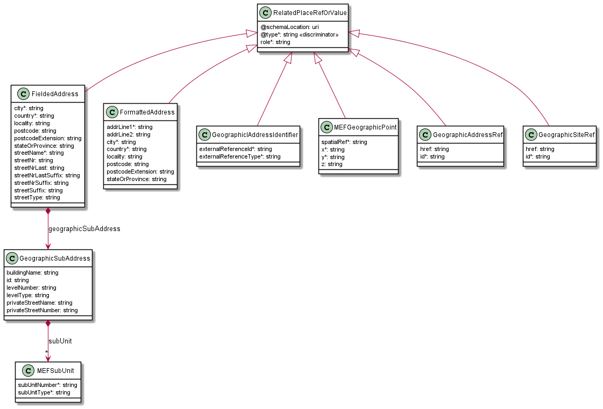

**Figure 23. Data model types representing a place**

#### 7.2.4.2. Type RelatedPlaceRefOrValue

**Description:** Definition of a place. For example, a place where the Quotation
must be done.

This standard defines a number of specializations (place representations) of a
place type.

<table id="T_RelatedPlaceRefOrValue">
    <thead style="font-weight:bold;">
        <tr>
            <td>Name</td>
            <td>Type</td>
            <td>Description</td>
            <td>MEF 80</td>
        </tr>
    </thead>
    <tbody>
        <tr>
            <td>@schemaLocation</td>
            <td>uri</td>
            <td>
                A URI to a JSON-Schema file that defines additional attributes and relationships. May be used to define additional related place types. 
                The usage of this attribute must be agreed between Buyer and Seller.
            </td>
            <td>Not represented in MEF 80</td>
        </tr><tr>
            <td>@type*</td>
            <td>string</td>
            <td>This filed is used as a discriminator and is used between different place representations.
            This type might discriminate for an additional related place as defined in <code>@schemaLocation</code>.
</td>
            <td>Not represented in MEF 80</td>
        </tr><tr>
            <td>role*</td>
            <td>string</td>
            <td>Role of this place</td>
            <td>RelatedPlaceRefOrValue</td>
        </tr>
    </tbody>
</table>

#### 7.2.4.2. Type FieldedAddress

**Description:** A type of Address that has a discrete attribute and value for
each type of boundary or identifier down to the lowest level of detail. For
example "street number" is one attribute, "street name" is another attribute,
etc.

Inherits from:

- <a href="#T_RelatedPlaceRefOrValue">RelatedPlaceRefOrValue</a>

<table id="T_FieldedAddress">
    <thead style="font-weight:bold;">
        <tr>
            <td>Name</td>
            <td>Type</td>
            <td>Description</td>
            <td>MEF 80</td>
        </tr>
    </thead>
    <tbody>
        <tr>
            <td>city*</td>
            <td>string</td>
            <td>The city that the address is in</td>
            <td>City</td>
        </tr><tr>
            <td>country*</td>
            <td>string</td>
            <td>Country that the address is in</td>
            <td>Country</td>
        </tr><tr>
            <td>geographicSubAddress</td>
            <td><a href="#T_GeographicSubAddress">GeographicSubAddress</a></td>
            <td></td>
            <td></td>
        </tr><tr>
            <td>locality</td>
            <td>string</td>
            <td>The locality that the address is in</td>
            <td>Locality</td>
        </tr><tr>
            <td>postcode</td>
            <td>string</td>
            <td>Descriptor for a postal delivery area, used to speed and simplify the delivery of mail (also known as zip code)</td>
            <td>Postal Code</td>
        </tr><tr>
            <td>postcodeExtension</td>
            <td>string</td>
            <td>An extension of a postal code. E.g. the part following the dash in an american urban property address</td>
            <td>Postal Code Extension</td>
        </tr><tr>
            <td>stateOrProvince</td>
            <td>string</td>
            <td>The State or Province that the address is in</td>
            <td>State Or Province</td>
        </tr><tr>
            <td>streetName*</td>
            <td>string</td>
            <td>Name of the street or other street type</td>
            <td>Street Name</td>
        </tr><tr>
            <td>streetNr</td>
            <td>string</td>
            <td>Number identifying a specific property on a public street. It may be combined with streetNrLast for ranged addresses.</td>
            <td>Street Number</td>
        </tr><tr>
            <td>streetNrLast</td>
            <td>string</td>
            <td>Last number in a range of street numbers allocated to a property</td>
            <td>Street Number Last</td>
        </tr><tr>
            <td>streetNrLastSuffix</td>
            <td>string</td>
            <td>Last street number suffix for a ranged address</td>
            <td>Street Number Suffix Last</td>
        </tr><tr>
            <td>streetNrSuffix</td>
            <td>string</td>
            <td>The first street number suffix</td>
            <td>Street Number Suffix</td>
        </tr><tr>
            <td>streetSuffix</td>
            <td>string</td>
            <td>A modifier denoting a relative direction</td>
            <td>Street Suffix</td>
        </tr><tr>
            <td>streetType</td>
            <td>string</td>
            <td>Alley, avenue, boulevard, brae, crescent, drive, highway, lane, terrace, parade, place, tarn, way, wharf</td>
            <td>Street Type</td>
        </tr>
    </tbody>
</table>

#### 7.2.4.3. Type FormattedAddress

**Description:** A type of Address that has discrete fields for each type of
boundary or identifier with the exception of the street and more specific
location details, which are combined into a maximum of two strings based on
local postal addressing conventions.

Inherits from:

- <a href="#T_RelatedPlaceRefOrValue">RelatedPlaceRefOrValue</a>

<table id="T_FormattedAddress">
    <thead style="font-weight:bold;">
        <tr>
            <td>Name</td>
            <td>Type</td>
            <td>Description</td>
            <td>MEF 80</td>
        </tr>
    </thead>
    <tbody>
        <tr>
            <td>addrLine1*</td>
            <td>string</td>
            <td>The first address line in a formatted address</td>
            <td>Address Line 1</td>
        </tr><tr>
            <td>addrLine2</td>
            <td>string</td>
            <td>The second address line in a formatted address</td>
            <td>Address Line 2</td>
        </tr><tr>
            <td>city*</td>
            <td>string</td>
            <td>The city that the address is in</td>
            <td>City</td>
        </tr><tr>
            <td>country*</td>
            <td>string</td>
            <td>Country that the address is in</td>
            <td>Country</td>
        </tr><tr>
            <td>locality</td>
            <td>string</td>
            <td>An area of defined or undefined boundaries within a local authority or other legislatively defined area, usually rural or semi-rural in nature</td>
            <td>Locality</td>
        </tr><tr>
            <td>postcode</td>
            <td>string</td>
            <td>Descriptor for a postal delivery area, used to speed and simplify the delivery of mail (also known as ZIP code)</td>
            <td>Postal Code</td>
        </tr><tr>
            <td>postcodeExtension</td>
            <td>string</td>
            <td>An extension of a postal code. E.g. the part following the dash in an US urban property address</td>
            <td>Postal Code Extension</td>
        </tr><tr>
            <td>stateOrProvince</td>
            <td>string</td>
            <td>The State or Province that the address is in</td>
            <td>State Or Province</td>
        </tr>
    </tbody>
</table>

#### 7.2.4.4. Type MEFGeographicPoint

**Description:** A MEFGeographicPoint defines a geographic point through
coordinates. Reference: MEF 79 (Sn 8.9.5)

Inherits from:

- <a href="#T_RelatedPlaceRefOrValue">RelatedPlaceRefOrValue</a>

<table id="T_MEFGeographicPoint">
    <thead style="font-weight:bold;">
        <tr>
            <td>Name</td>
            <td>Type</td>
            <td>Description</td>
            <td>MEF 79</td>
        </tr>
    </thead>
    <tbody>
        <tr>
            <td>spatialRef*</td>
            <td>string</td>
            <td>The spatial reference system used to determine the coordinates (e.g. &quot;WGS84&quot;). The system used and the value of this field are to be agreed during the onboarding process.</td>
            <td>Spatial Reference</td>
        </tr><tr>
            <td>x*</td>
            <td>string</td>
            <td>The latitude expressed in the format specified by the <code>spacialRef</code></td>
            <td>Latitude</td>
        </tr><tr>
            <td>y*</td>
            <td>string</td>
            <td>The longitude expressed in the format specified by the <code>spacialRef</code></td>
            <td>Longitude</td>
        </tr><tr>
            <td>z</td>
            <td>string</td>
            <td>The elevation expressed in the format specified by the <code>spacialRef</code></td>
            <td>Elevation</td>
        </tr>
    </tbody>
</table>

[R XXX] `MEFGeographicPoint` **MUST** be used to specify Geographic Point.

[R XXX] The `spatialRef` value that can be used **MUST** be agreed between Buyer
and Seller

#### 7.2.4.5. Type GeographicSubAddress

**Description:** Additional fields used to specify an address, as detailed as
possible.

<table id="T_GeographicSubAddress">
    <thead style="font-weight:bold;">
        <tr>
            <td>Name</td>
            <td>Type</td>
            <td>Description</td>
            <td>MEF 80</td>
        </tr>
    </thead>
    <tbody>
        <tr>
            <td>buildingName</td>
            <td>string</td>
            <td>Allows for buildings that have well-known names</td>
            <td>Building Name</td>
        </tr><tr>
            <td>id</td>
            <td>string</td>
            <td>Unique Identifier of the subAddress</td>
            <td>Not represented in MEF 80</td>
        </tr><tr>
            <td>levelNumber</td>
            <td>string</td>
            <td>Used where a level type may be repeated e.g. BASEMENT 1, BASEMENT 2</td>
            <td>Level Number</td>
        </tr><tr>
            <td>levelType</td>
            <td>string</td>
            <td>Describes level types within a building</td>
            <td>Level Type</td>
        </tr><tr>
            <td>privateStreetName</td>
            <td>string</td>
            <td>Private streets internal to a property (e.g. a university) may have internal names that are not recorded by the land title office
</td>
            <td>Private Street Name</td>
        </tr><tr>
            <td>privateStreetNumber</td>
            <td>string</td>
            <td>Private streets numbers internal to a private street</td>
            <td>Private Street Number</td>
        </tr><tr>
            <td>subUnit</td>
            <td><a href="#T_MEFSubUnit">MEFSubUnit</a>[]</td>
            <td>Representation of a MEFSubUnit
It is used for describing subunit within a subaddress  e.g.BERTH, FLAT, PIER, SUITE, SHOP, TOWER, UNIT, WHARF.</td>
            <td>Not represented in MEF 80</td>
        </tr>
    </tbody>
</table>

#### 7.2.4.6. Type GeographicAddressRef

**Description:** A reference to a Geographic Address resource available through
Sonata Address Validation API.

Inherits from:

- <a href="#T_RelatedPlaceRefOrValue">RelatedPlaceRefOrValue</a>

<table id="T_GeographicAddressRef">
    <thead style="font-weight:bold;">
        <tr>
            <td>Name</td>
            <td>Type</td>
            <td>Description</td>
            <td>MEF 79</td>
        </tr>
    </thead>
    <tbody>
        <tr>
            <td>href</td>
            <td>string</td>
            <td>Hyperlink to the referenced place
Hyperlink MAY be used by the Seller in responses  
Hyperlink MUST be ignored by the Seller in case it is provided by the Buyer in a request
</td>
            <td>Not represented in MEF 79</td>
        </tr><tr>
            <td>id*</td>
            <td>string</td>
            <td>Identifier of the referenced Geographic Address. This identifier is assigned during a successful address validation request (Sonata Geographic Address Management API)</td>
            <td> Fielded | Formatted | Geographic Address Identifier | Georaphic Point Identifier</td>
        </tr>
    </tbody>
</table>

#### 7.2.4.7. Type GeographicSiteRef

**Description:**A reference to a Geographic Site resource available through
Sonata Service Site API.

Inherits from:

- <a href="#T_RelatedPlaceRefOrValue">RelatedPlaceRefOrValue</a>

<table id="T_GeographicSiteRef">
    <thead style="font-weight:bold;">
        <tr>
            <td>Name</td>
            <td>Type</td>
            <td>Description</td>
            <td>MEF 80</td>
        </tr>
    </thead>
    <tbody>
        <tr>
            <td>href</td>
            <td>string</td>
            <td>Hyperlink to the referenced place
Hyperlink MAY be used by the Seller in responses  
Hyperlink MUST be ignored by the Seller in case it is provided by the Buyer in a request
</td>
            <td>Not represented in MEF 79</td>
        </tr><tr>
            <td>id*</td>
            <td>string</td>
            <td>Identifier of the referenced Geographic Site.</td>
            <td>Site Identifier</td>
        </tr>
    </tbody>
</table>

#### 7.2.4.8. Type GeographicAddressIdentifier

**Description:** A unique identifier controlled by a generally accepted
independent administrative authority that specifies a fixed geographical
location. Reference: MEF 79 (Sn 8.9.4)

Inherits from:

- <a href="#T_RelatedPlaceRefOrValue">RelatedPlaceRefOrValue</a>

<table id="T_GeographicAddressIdentifier">
    <thead style="font-weight:bold;">
        <tr>
            <td>Name</td>
            <td>Type</td>
            <td>Description</td>
            <td>MEF 80</td>
        </tr>
    </thead>
    <tbody>
        <tr>
            <td>externalReferenceId*</td>
            <td>string</td>
            <td>A reference to an address by id</td>
            <td>Geographic Address Identifier ID</td>
        </tr><tr>
            <td>externalReferenceType*</td>
            <td>string</td>
             <td>Uniquely identifies the authority that specifies the addresses reference and/or its type (if the authority specifies more than one type of address). The value(s) to be used are to be agreed during the onboarding. For North American providers this would normally be CLLI (Common Language Location Identifier) code.</td>
            <td>Administrative Authority</td>
        </tr>
    </tbody>
</table>

#### 7.2.4.9. Type MEFSubUnit

**Description:** A Sub Unit type

<table id="T_MEFSubUnit">
    <thead style="font-weight:bold;">
        <tr>
            <td>Name</td>
            <td>Type</td>
            <td>Description</td>
            <td>MEF 80</td>
        </tr>
    </thead>
    <tbody>
        <tr>
            <td>subUnitNumber*</td>
            <td>string</td>
            <td>The discriminator used for the subunit, often just a simple number but may also be a range.</td>
            <td>Sub Unit Name</td>
        </tr><tr>
            <td>subUnitType*</td>
            <td>string</td>
            <td>The type of subunit e.g.BERTH, FLAT, PIER, SUITE, SHOP, TOWER, UNIT, WHARF.</td>
            <td>Sub Unit Type</td>
        </tr>
    </tbody>
</table>

### 7.2.5. Notification registration

Notification registration and management are done through `/hub` API endpoint.
The below sections describe data models related to this endpoint.

#### 7.2.5.1. Type EventSubscriptionInput

The `query` attribute is used to constrain the notification types that the Buyer
is willing to receive to the callback endpoint. The `query` formatting complies
to RCF3986 [rfc3986](#8-references) and [tmf630](#8-references). Every attribute
defined in Event model (from notification API) can be used in the `query`.
Example:

```
    "query":"eventType=quoteCreateEvent"
```

If the Buyer wishes to subscribe to 2 different types of events, there are 2
possible syntax variants:

- `eventType=quoteStateChangeEvent,quoteItemStateChangeEvent` or
- `eventType=quoteStateChangeEvent; eventType=quoteItemStateChangeEvent`

**Description:** Sets the communication endpoint address the service instance
must use to deliver notification information

<table id="T_EventSubscriptionInput">
    <thead style="font-weight:bold;">
        <tr>
            <td>Name</td>
            <td>Type</td>
            <td>Description</td>
            <td>MEF 80</td>
        </tr>
    </thead>
    <tbody>
        <tr>
            <td>callback*</td>
            <td>string</td>
            <td>This callback value MUST be set to *host* property from Buyer Quote Notification API This property is appended with an appropriate base path and notification resource path to construct an URL to which notification is sent.</td>
            <td>Notification Target Information</td>
        </tr><tr>
            <td>query</td>
            <td>string</td>
            <td>This attribute is used to define notification registration constraints.</td>
            <td>List of Notification Types, Action</td>
        </tr>
    </tbody>
</table>

#### 7.2.5.2. Type EventSubscription

**Description:** Sets the communication endpoint address the service instance
must use to deliver notification information

<table id="T_EventSubscription">
    <thead style="font-weight:bold;">
        <tr>
            <td>Name</td>
            <td>Type</td>
            <td>Description</td>
            <td>MEF 80</td>
        </tr>
    </thead>
    <tbody>
        <tr>
            <td>id*</td>
            <td>string</td>
            <td>An identifier of the event subscription assigned by the Seller when resource is created.</td>
            <td>Not represented in MEF 80</td>
        </tr><tr>
            <td>callback*</td>
            <td>string</td>
            <td>The value provided by the Buyer in &#x60;EventSubscriptionInput&#x60; during notification registration</td>
            <td>Notification Target Information</td>
        </tr><tr>
            <td>query</td>
            <td>string</td>
            <td>This attribute is used to define notification registration constraints.</td>
            <td>List of Notification Types, Action</td>
        </tr>
    </tbody>
</table>

### 7.2.6. Type QuoteOperationData

The `QuoteOperationData` is a common type for Cancel or Reject requests that can
be sent by using `/cancelQuote` or `/rejectQuote` endpoints.

**Description:** Request for operation on an existing Quote (cancellation or
rejection)

<table id="T_QuoteOperationData">
    <thead style="font-weight:bold;">
        <tr>
            <td>Name</td>
            <td>Type</td>
            <td>Description</td>
            <td>MEF 80</td>
        </tr>
    </thead>
    <tbody>
        <tr>
            <td>quoteId*</td>
            <td>string</td>
            <td>Unique (within the Seller quoting domain) identifier for the quote, as attributed by the Seller.</td>
            <td>Seller Quote Identifier</td>
        </tr><tr>
            <td>reason</td>
            <td>string</td>
            <td>Allows the Buyer to specify a reason for the Cancel or Reject Quote Request.</td>
            <td>Reason</td>
        </tr>
    </tbody>
</table>

### 7.2.7. Common

#### 7.2.7.1. Type Duration

**Description:** A time interval in a given unit of time

<table id="T_Duration">
    <thead style="font-weight:bold;">
        <tr>
            <td>Name</td>
            <td>Type</td>
            <td>Description</td>
        </tr>
    </thead>
    <tbody>
        <tr>
            <td>amount</td>
            <td>integer</td>
            <td>Time interval (number of seconds, minutes, hours, etc.)</td>
        </tr><tr>
            <td>units</td>
            <td><a href="#T_TimeUnit">TimeUnit</a></td>
            <td></td>
        </tr>
    </tbody>
</table>

#### 7.2.7.2. Type Money

**Description:** A base / value business entity used to represent money

<table id="T_Money">
    <thead style="font-weight:bold;">
        <tr>
            <td>Name</td>
            <td>Type</td>
            <td>Description</td>
            <td>MEF 80</td>
        </tr>
    </thead>
    <tbody>
        <tr>
            <td>unit</td>
            <td>string</td>
            <td>Currency (ISO4217 norm uses 3 letters to define the currency)</td>
            <td></td>
        </tr><tr>
            <td>value</td>
            <td>float</td>
            <td>A positive floating point number</td>
            <td></td>
        </tr>
    </tbody>
</table>

#### 7.2.7.3. Type Note

**Description:** Extra information about a given entity

<table id="T_Note">
    <thead style="font-weight:bold;">
        <tr>
            <td>Name</td>
            <td>Type</td>
            <td>Description</td>
            <td>MEF 80</td>
        </tr>
    </thead>
    <tbody>
        <tr>
            <td>id*</td>
            <td>string</td>
            <td>Identifier of the note within its containing entity (may or may not be globally unique, depending on provider implementation)</td>
            <td>Not represented in MEF 80</td>
        </tr><tr>
            <td>author*</td>
            <td>string</td>
            <td>Author of the note</td>
            <td>Note Author</td>
        </tr><tr>
            <td>date*</td>
            <td>date-time</td>
            <td>Date of the note</td>
            <td>Note Date</td>
        </tr><tr>
            <td>source*</td>
            <td><a href="#T_NoteSourceType">NoteSourceType</a></td>
            <td>Indicates if the note is from Buyer or Seller</td>
            <td>Note source</td>
        </tr><tr>
            <td>text*</td>
            <td>string</td>
            <td>Text of the note</td>
            <td>Note Text</td>
        </tr>
    </tbody>
</table>

#### 7.2.7.4. `enum` NoteSourceType

**Description:** Indicates if the note is from Buyer or Seller.

<table id="T_NoteSourceType">
    <thead style="font-weight:bold;">
        <tr>
            <td>Value</td>
            <td>MEF 80</td>
        </tr>
    </thead>
    <tbody>
        <tr>
            <td>buyer</td>
            <td>BUYER</td>
        </tr><tr>
            <td>seller</td>
            <td>SELLER</td>
        </tr>
    </tbody>
</table>

#### 7.2.7.5. Type RelatedContactInformation

**Description:** Contact data for a person or organization that is involved in a
given context. It is specified by the Seller (e.g. Seller Contact Information)
or by the Buyer.

Reference: MEF 80 (Sn 8.1.9)

<table id="T_RelatedContactInformation">
    <thead style="font-weight:bold;">
        <tr>
            <td>Name</td>
            <td>Type</td>
            <td>Description</td>
            <td>MEF 79</td>
        </tr>
    </thead>
    <tbody>
        <tr>
            <td>emailAddress*</td>
            <td>string</td>
            <td>Email address</td>
            <td>Contact email Address</td>
        </tr><tr>
            <td>name*</td>
            <td>string</td>
            <td>Name of the contact</td>
            <td>Contact Name</td>
        </tr><tr>
            <td>number*</td>
            <td>string</td>
            <td>Phone number</td>
            <td>Contract Phone Number</td>
        </tr><tr>
            <td>numberExtension</td>
            <td>string</td>
            <td>Phone number extension</td>
            <td>Contract Phone Number Extension</td>
        </tr><tr>
            <td>organization</td>
            <td>string</td>
            <td>The organization or company that the contact belongs to</td>
            <td>Contact Organization</td>
        </tr><tr>
            <td>role*</td>
            <td>string</td>
            <td>The role of the particular contact in the request</td>
            <td>Not represented in MEF 80</td>
        </tr><tr>
            <td>postalAddress</td>
            <td><a href="#T_FieldedAddress">FieldedAddress</a></td>
            <td></td>
            <td>Contact Postal Address</td>
        </tr>
    </tbody>
</table>

The related contact information can be defined at a Quote or a Quote Item level.
In both cases, it is allowed to provide a list of party role information. The
`role` attribute is used to provide a reason the particular party information is
used. It can result from MEF 80 requirements (e.g. Seller Contact Information)
or from the Product Specification requirements.

The rule for mapping a represented attribute value to a `role` is to use the
_lowerCamelCase_ pattern e.g.

- Seller Contact Information: `role=sellerContactInformation`
- Buyer Contact Information: `role=buyerContactInformation`
- Quote Item Location Contact: `role=quoteItemLocationContact`
- Quote Item Technical Contact: `role=quoteItemTechnicalContact`

#### 7.2.7.6. Type TerminationError

**Description:** This indicates an error that caused an Item to be terminated.

<table id="T_TerminationError">
    <thead style="font-weight:bold;">
        <tr>
            <td>Name</td>
            <td>Type</td>
            <td>Description</td>
            <td>MEF 80</td>
        </tr>
    </thead>
    <tbody>
        <tr>
            <td>id</td>
            <td>string</td>
            <td>Unique identifier of the termination error</td>
            <td>Not represented in MEF 80</td>
        </tr><tr>
            <td>value</td>
            <td>string</td>
            <td>Value (text) for the termination error</td>
            <td>Termination Error</td>
        </tr>
    </tbody>
</table>

#### 7.2.7.7. Type TimePeriod

**Description:** A period of time, either as a deadline (endDateTime only) a
startDateTime only, or both

<table id="T_TimePeriod">
    <thead style="font-weight:bold;">
        <tr>
            <td>Name</td>
            <td>Type</td>
            <td>Description</td>
            <td>MEF 80</td>
        </tr>
    </thead>
    <tbody>
        <tr>
            <td>endDateTime</td>
            <td>date-time</td>
            <td>End of the time period, using IETC-RFC-3339 format</td>
            <td>Quote.Valid Until Date</td>
        </tr><tr>
            <td>startDateTime</td>
            <td>date-time</td>
            <td>Start of the time period, using IETC-RFC-3339 format. If you define a start, you must also define an end</td>
            <td>Not represented in MEF 80</td>
        </tr><tr>
            <td>@type</td>
            <td>string</td>
            <td>When sub-classing, this defines the sub-class entity name</td>
            <td>Not represented in MEF 80</td>
        </tr>
    </tbody>
</table>

#### 7.2.7.8. `enum` TimeUnit

**Description:** Represents a unit of time.

<table id="T_TimeUnit">
    <thead style="font-weight:bold;">
        <tr>
            <td>Value</td>
            <td>MEF 80</td>
        </tr>
    </thead>
    <tbody>
        <tr>
            <td>calendarMonths</td>
            <td>CALENDAR_MONTHS</td>
            <td></td>
        </tr><tr>
            <td>calendarDays</td>
            <td>CALENDAR_DAYS</td>
            <td></td>
        </tr><tr>
            <td>calendarHours</td>
            <td>CALENDAR_HOURS</td>
            <td></td>
        </tr><tr>
            <td>calendarMinutes</td>
            <td>CALENDAR_MINUTES</td>
            <td></td>
        </tr><tr>
            <td>businessDays</td>
            <td>BUSINESS_DAYS</td>
            <td></td>
        </tr><tr>
            <td>businessHours</td>
            <td>BUSINESS_HOURS</td>
            <td></td>
        </tr><tr>
            <td>businessMinutes</td>
            <td>BUSINESS_MINUTES</td>
            <td></td>
        </tr>
    </tbody>
</table>

## 7.3. Notification API Data model

Figure 24 presents the Quote Notification data model. The data types,
requirements related to them, and mapping to MEF 80 are discussed later in this
section.

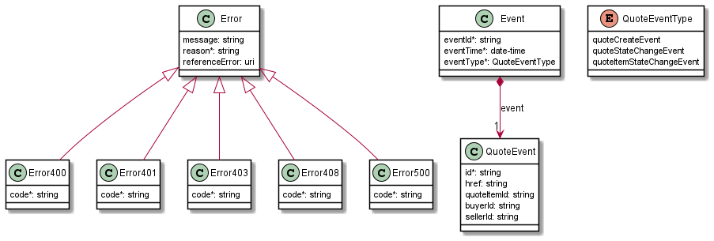

**Figure 24. Quote Notification Data Model**

The Quote Management data model is used to construct requests and responses of
the API endpoints described in [Section 5.1.2](#512-buyer-side-api-endpoints).

### 7.3.1. Type Event

**Description:** Event class is used to describe information structure used for
notification.

<table id="T_Event">
    <thead style="font-weight:bold;">
        <tr>
            <td>Name</td>
            <td>Type</td>
            <td>Description</td>
            <td>MEF 80</td>
        </tr>
    </thead>
    <tbody>
        <tr>
            <td>eventId*</td>
            <td>string</td>
            <td>Id of the event</td>
            <td>Not represented in MEF 80</td>
        </tr><tr>
            <td>eventTime*</td>
            <td>date-time</td>
            <td>Datetime when the event occurred</td>
            <td>Not represented in MEF 80</td>
        </tr><tr>
            <td>eventType*</td>
            <td><a href="#T_QuoteEventType">QuoteEventType</a></td>
            <td>Event Type</td>
            <td>Notification Type</td>
        </tr><tr>
            <td>event*</td>
            <td><a href="#T_QuoteEvent">QuoteEvent</a></td>
            <td>Event data</td>
            <td>Not represented in MEF 80</td>
        </tr>
    </tbody>
</table>

### 7.3.2. Type QuoteEvent

**Description:** The identifier of the Quote and/or Quote Item being subject of
this event.

<table id="T_QuoteEvent">
    <thead style="font-weight:bold;">
        <tr>
            <td>Name</td>
            <td>Type</td>
            <td>Description</td>
            <td>MEF 80</td>
        </tr>
    </thead>
    <tbody>
        <tr>
            <td>id*</td>
            <td>string</td>
            <td>ID of the Quote attributed by quoting system</td>
            <td>Seller Quote Identifier</td>
        </tr><tr>
            <td>href</td>
            <td>string</td>
            <td>Hyperlink to access the quote</td>
            <td>Not represented in MEF 80</td>
        </tr><tr>
            <td>quoteItemId</td>
            <td>string</td>
            <td>ID of the Quote Item (within the Quote) which state change triggered the event</td>
            <td>Quote Item Identifier</td>
        </tr>
    </tbody>
</table>

### 7.3.3. `enum` QuoteEventType

**Description:** Type of the Event

<table id="T_QuoteEventType">
    <thead style="font-weight:bold;">
        <tr>
            <td>Value</td>
            <td>MEF 80</td>
        </tr>
    </thead>
    <tbody>
        <tr>
            <td>quoteCreateEvent</td>
            <td>CREATE</td>
        </tr><tr>
            <td>quoteStateChangeEvent</td>
            <td>QUOTE_STATE_CHANGE</td>
        </tr><tr>
            <td>quoteItemStateChangeEvent</td>
            <td>QUOTE_ITEM_STATE_CHANGE</td>
        </tr>
    </tbody>
</table>

# 8. References

- [oas-v2] [Open API 2.0](http://spec.openapis.org/oas/v2.0), September 2014
- [OAS-v3] [Open API 3.0](http://spec.openapis.org/oas/v3.0.3.html), February
  2020
- [js]
  [JsonSchema specifications](https://json-schema.org/specification-links.html)
- [rest]
  [Chapter 5: Representational State Transfer (REST)](http://www.ics.uci.edu/~fielding/pubs/dissertation/rest_arch_style.htm)
  Fielding, Roy Thomas, Architectural Styles and the Design of Network-based
  Software Architectures (Ph.D.).
- [mef55]
  [MEF 55](http://www.mef.net/resources/technical-specifications/download?id=44&fileid=file1)
  Lifecycle Service Orchestration (LSO): Reference Architecture and Framework,
  March 2016
- [mef79]
  [MEF 79](http://www.mef.net/resources/technical-specifications/download?id=129&fileid=file1),
  Address, Service Site, and Product Offering Qualification Management,
  Requirements and Use Cases, November 2019
- [mef80]
  [MEF 80](https://www.mef.net/wp-content/uploads/2020/11/MEF-80-Draft-R5.pdf),
  Quote Management Requirements and Use Cases, November 2020, Draft R5
- [mefw106]
  [MEF W106](https://wiki.mef.net/download/attachments/106599684/MEF%20W106%20wd%201.4C.pdf?api=v2)
  LSO Sonata Product Specification – Access E-Line Product Requirements, December
  2020, CfC#1 reviewed
- [mefw113]
  [MEF W113 0.15](https://wiki.mef.net/download/attachments/106625017/L74053_001_MEF%20W113%20WD%20%231_Arndt.docx?version=1&modificationDate=1595452765000&api=v2)
  Trouble Ticketing Business Requirements and Use Cases, July 2020, CfC#1
- [tmf630]
  [TMF 630](https://www.tmforum.org/resources/how-to-guide/tmf630-api-design-guidelines-4-0/)
  TMF630 QAPI Design Guidelines 4.0.1
- [tmf648]
  [TMF 648](https://www.tmforum.org/resources/specification/tmf648-quote-management-api-rest-specification-r19-0-0/)
  TMF648 Quote Management API REST Specification R19.0.1
