# Working Draft MEF W87 - LSO Sonata Product Offering Qualification API - Developer Guide, July 2020  <!-- omit in toc --> 

<p style="color:red;font-weight:bold; font-size:18pt">This draft represents MEF work in progress and is subject to change.</p>

**Disclaimer**

The information in this publication is freely available for reproduction and use by any recipient and is believed to be accurate as of its publication date. Such information is subject to change without notice and MEF Forum (MEF) is not responsible for any errors. MEF does not assume responsibility to update or correct any information in this publication. No representation or warranty, expressed or implied, is made by MEF concerning the completeness, accuracy, or applicability of any information contained herein and no liability of any kind shall be assumed by MEF as a result of reliance upon such information.

The information contained herein is intended to be used without modification by the recipient or user of this document. MEF is not responsible or liable for any modifications to this document made by any other party.

The receipt or any use of this document or its contents does not in any way create, by implication or otherwise:

- any express or implied license or right to or under any patent, copyright, trademark or trade secret rights held or claimed by any MEF member company which are or may be associated with the ideas, techniques, concepts or expressions contained herein; nor

- any warranty or representation that any MEF member companies will announce any product(s) and/or service(s) related thereto, or if such announcements are made, that such announced product(s) and/or service(s) embody any or all of the ideas, technologies, or concepts contained herein; nor

- any form of relationship between any MEF member companies and the recipient or user of this document.

Implementation or use of specific MEF standards or recommendations and MEF specifications will be voluntary, and no company shall be obliged to implement them by virtue of participation in the MEF Forum. The MEF is a non-profit international organization accelerating industry cooperation on Ethernet technology. The MEF does not, expressly or otherwise, endorse or promote any specific products or services.

© MEF Forum 2019. All Rights Reserved.

**Copyright**
 © MEF Forum 2019. Any reproduction of this document, or any portion thereof, shall contain the following statement: "Reproduced with permission of MEF Forum." No user of this document is authorized to modify any of the information contained herein.

# Table of Contents  <!-- omit in toc -->
<!-- code_chunk_output -->
- [List of Contributing Members](#list-of-contributing-members)
- [1. Abstract](#1-abstract)
- [2. Terminology and Abbreviations](#2-terminology-and-abbreviations)
- [3. Compliance Levels](#3-compliance-levels)
- [4. Introduction](#4-introduction)
  - [4.1. Description](#41-description)
  - [4.3. Relation to Other Documents](#43-relation-to-other-documents)
  - [4.4. Approach](#44-approach)
- [5. API Description](#5-api-description)
  - [5.1. Resource/endpoint Description](#51-resourceendpoint-description)
  - [5.2. Data Model - Key Entities](#52-data-model---key-entities)
  - [5.3. Model Structural Validation](#53-model-structural-validation)
  - [5.4. Security Considerations](#54-security-considerations)
- [6. API Interaction & Flows](#6-api-interaction--flows)
  - [6.1. Sample Product Specification](#61-sample-product-specification)
  - [6.2. Interaction Patterns](#62-interaction-patterns)
  - [6.3 Sending Product Offering Qualification Request](#63-sending-product-offering-qualification-request)
- [7. API Details](#7-api-details)
  - [7.1. API patterns](#71-api-patterns)
  - [7.2. Management API Data model](#72-management-api-data-model)
- [8. References](#8-references)

<!-- /code_chunk_output -->

# List of Contributing Members

The following members of the MEF participated in the development of this document and have requested to be included in this list.

| Member |
|----------------|
|                |
|                |
|                |

# 1. Abstract

This standard is intended to assist implementation of the Product Offering Qualification (POQ) function defined for the LSO Sonata Interface Reference Point (IRP), for which requirements and use cases are defined in MEF 79 [[mef79](#8-references)]. This standard consists of this document and complementary API definitions for Product Offering Qualification Management and Notification.

This Draft Standard normatively incorporates the following files by reference as if they were part of this document, from GitHub repository https://github.com/MEF-GIT/MEF-LSO-Sonata-SDK-extended at release "`<<TBD>>`" (commit ID: `<TBD>`):
* `api/serviceability/offeringQualification/v5/productOfferingQualificationManagement.api.yaml`
* `api/serviceability/offeringQualification/v5/productOfferingQualificationNotification.api.yaml`

# 2. Terminology and Abbreviations

This section defines the terms used in this document. In many cases, the normative definitions to terms are found in other documents. In these cases, the third column is used to provide the reference that is controlling, in other MEF or external documents.
<table>
<tr>
  <th>Term</th>
  <th>Description</th>
  <th>Reference</th>
</tr>

<tr>
  <td>API</td>
  <td>Application Programming Interface. In this document, API is used synonymously with REST API.</td>
  <td>This document</td>
</tr>

<tr>
  <td>Deferred Response</td>
  <td>A Seller’s response to a Buyer’s request whereby the Seller immediately acknowledges that the request was received, and, over time, sends notifications to update the Buyer on the status and results of the request (assuming the Buyer has subscribed to receive the notifications). The Buyer can also poll the Seller for the results and status associated with the request.</td>
  <td><a href="#8-references">[mef79]</a> </td>
</tr>

<tr>
  <td>Immediate Response</td>
  <td>A Seller’s response to the Buyer whereby the Seller responds immediately with the results of the request or indicates that the request cannot be processed. The maximum time to provide an Immediate Response is for further study, but is expected to be less than 30 seconds. </td>
  <td><a href="#8-references">[mef79]</a> </td>
</tr>

<tr>
  <td>OpenAPI 2.0</td>
  <td>RESTful API Documentation Specification for machine-readable interface files for describing, producing, consuming, and visualizing RESTful web services. Specification description is available [online](https://github.com/OAI/OpenAPI-Specification/blob/master/versions/2.0.md)</td>
  <td><a href="#8-references">[oas-v2]</a></td>
</tr>

<tr>
  <td>POQ</td>
  <td>Product Offering Qualification</td>
  <td><a href="#8-references">[mef79]</a> </td>
</tr>

<tr>
  <td>POQ Item</td>
  <td>Product Offering Qualification Item</td>
  <td><a href="#8-references">[mef79]</a> </td>
</tr>

<tr>
  <td>Product Offering Qualification</td>
  <td>One or more POQ Items formulated into a request made by a Buyer to a Seller.</td>
  <td><a href="#8-references">[mef79]</a> </td>
</tr>

<tr>
  <td>POQ Item</td>
  <td>An individual article included in a POQ that describes a Product of a particular type. The objective is to determine if it is feasible for the Seller to deliver this item as described and for the Seller to inform the Buyer of the estimated time interval to complete this delivery.</td>
  <td><a href="#8-references">[mef79]</a> </td>
</tr>

</table>

# 3. Compliance Levels

The key words **"MUST"**, **"MUST NOT"**, **"REQUIRED"**, **"SHALL"**, **"SHALL NOT"**, **"SHOULD"**, **"SHOULD NOT"**, **"RECOMMENDED"**, **"NOT RECOMMENDED"**, **"MAY"**, and **"OPTIONAL"** in this document are to be interpreted as described in BCP 14 (RFC 2119 [[rfc2119](#8-references)], RFC 8174 [[rfc8174](#8-references)]) when, and only when, they appear in all capitals, as shown here. All key words must be in bold text.

Items that are **REQUIRED** (contain the words **MUST** or **MUST NOT**) are labeled as **[Rx]** for required. Items that are **RECOMMENDED** (contain the words **SHOULD** or **SHOULD NOT**) are labeled as **[Dx]** for desirable. Items that are **OPTIONAL** (contain the words MAY or OPTIONAL) are labeled as **[Ox]** for optional.

# 4. Introduction

This standard specification document describes the Application Programming Interface (API) for Product Offering Qualification functionality of the LSO Sonata Interface Reference Point (IRP) as defined in the MEF LSO Reference Architecture [[mef55](#8-references)]. The LSO Reference Architecture is shown in Figure 1 with the Sonata IRP highlighted.


**Figure 1. The LSO Reference Architecture**

The Sonata IRP defines pre-ordering and ordering operations that allow an automated exchange of information between business applications of the Service Provider (Buyer) and Partner (Seller) Domains.
Product Offering Qualification is one of the pre-ordering functionalities for which business requirements and use cases are described in *Address, Service Site, and Product Offering Qualification Management Requirements and Use Cases* (MEF 79) [[mef79](#8-references)].
This document focuses on implementation aspects of POQ functionality and is structured as follows:
[Section 4](#4-introduction) gives a technical introduction to POQ functionality; [Section 5](#5-api-description) provides an overview for the operations, data-models and design patterns of API definition;
[Section 6](#6-api-interaction--flows) focuses on API interactions with help of end to end sequence diagrams and usage examples; [Section 7](#7-api-details) complements Section 5 with an in-depth API description.

## 4.1. Description

The Product Offering Qualification (POQ) API allows a Buyer to check whether the Seller is able to deliver a product or set of products from among their product offerings at the geographic address or a service site specified by the Buyer; or modify a previously purchased product.

The API payloads exchanged between a Buyer and the Seller during the POQ execution consist of product-independent and product-specific parts. The product-independent part is technically defined in this standard. The product-specific part is defined in the product specifications of the concerned product.
Both definition types must be used in combination to validate the correctness of the payloads. [Section 5.2.1](#521-integrating-product-specifications-into-poq-payload) explains how to use product-specific definitions with POQ API definition.

The current version ``<<exact version TBD>>`` of the SDK contains two examples of non-standard product definitions describing UNI and Access E-Line.
These sample product specification definitions are used to construct API payloads examples that illustrate API usage in [Section 6](#6-api-interaction--flows).

Product specifications are defined using JsonSchema (draft 7) definitions [[js](#8-references)], whereas POQ API is defined using OpenAPI 2.0 standard.
The payloads exchanged through Sonata POQ endpoints must comply with these definitions as well as with MEF 79 requirements for POQ functionality and with product specifications that are in use.

### 4.2. Conventions in the Document

Code samples are formatted using code blocks. When notation `<< some text >>` is used in the payload sample it indicates that a comment is provided instead of example value and it might not comply with the OpenAPI definition.
Model definitions are formatted as in-line code (e.g. `ProductOfferingQualification`). In UML figures the default cardinality of associations is `0..1`. In UML sequence diagram `{{variable}}` notation is used to indicates a variable to be substituted with a correct value.

## 4.3. Relation to Other Documents

The requirements and use cases for POQ functionality are defined in MEF 79 [[mef79](#8-references)] and MEF 79.0.1 [[mef79.0.1](#8-references)]. The API definition builds on TMF 679 version 19.0.1. [[tmf679](#8-references)]. POQ functions must allow using any MEF product specifications, in particular the ones defined for the Access E-Line Product Specification in MEF W106 [[mefw106](#8-references)].

## 4.4. Approach

As presented in Figure 2. the Sonata API framework consists of three structural components:

- Generic API framework
- Product-independent information (operations and data model)
- Product-specific information (MEF product specification data model)

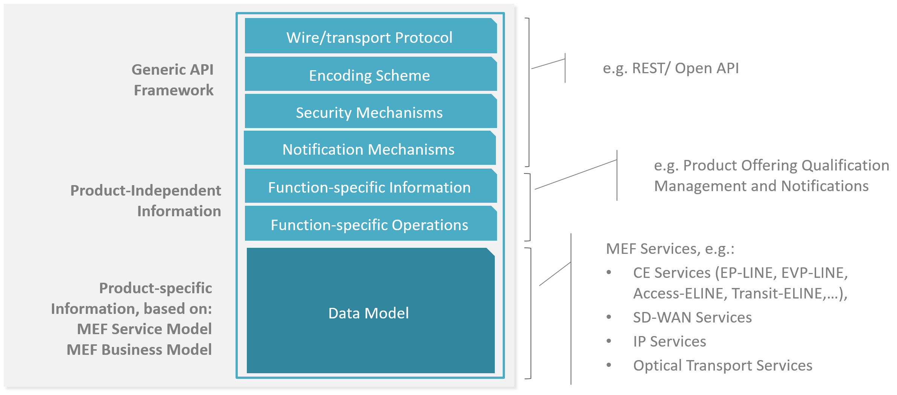
**Figure 2. Sonata API framework**

The essential concept behind the framework is to decouple the common structure, information and operations from the specific product information content.
Firstly, the Generic API Framework defines a set of design rules and patterns that are applied across Sonata APIs suite or throughout all LSO Interface Reference Points' APIs.
Secondly, the product-independent part of the framework focuses on a model of a particular Sonata functionality and is agnostic to any of product specifications.
For example, this standard is describing Product Offering Qualification model and operations that allow performing qualifications of any product that is aligned with one of MEF or custom product specifications.
Finally, product-specific information part of the framework focuses on MEF product specifications that define business-relevant attributes and requirements for trading MEF subscriber and MEF operator ethernet services.
This standard is not defining these specifications however can be used along with any product specification defined by MEF.

# 5. API Description

This section discusses the API structure and design patterns. It starts with a description of available REST endpoints. Then, an overview of the API data model is given
together with the description of the extension design pattern that is used to combine product-agnostic and product-specific parts of API payloads. Finally, payload validation and API security aspects are discussed.

## 5.1. Resource/endpoint Description

### 5.1.1. Seller Side Endpoints

**Base URL** `https://{{server}}:{{port}}/api/productOfferingQualification/v5`

The following API endpoints are implemented by the Seller and allow the Buyer to send POQ requests, retrieve existing POQs or POQ details, and manage notification registrations.
The endpoints and corresponding data model are defined in `api/serviceability/offeringQualification/v4/MEF_api_productOfferingQualificationManagement_4.0.0.yaml`.

| API endpoint | Description | MEF 79 Use case Mapping |
| --- | --- | --- |
| `POST /productOfferingQualification`   | A request initiated by the Buyer to determine whether the Seller can feasibly deliver a particular Product (or Products) to a specific set of geographic locations | UC 6: Create Product Offering Qualification|
| `GET /productOfferingQualification` | A request initiated by the Buyer to retrieve a list of POQs (in any state) from the Seller based on a set of POQ filter criteria. | UC 7: Retrieve POQ List |
| `GET /productOfferingQualification/{{id}}` | A request initiated by the Buyer to retrieve full details of a single Product Offering Qualification based on a POQ identifier. | UC 8: Retrieve POQ by Identifier |
| `POST /hub` | A request initiated by the Buyer to instruct the Seller to start sending notifications of POQ state changes. It is used in case Seller uses the Deferred Response pattern to respond to a Create Product Offering Qualification request. | UC 5: Register for POQ Notifications | UC 5: Register for POQ Notifications |
| `DELETE /hub/{{id}}` | A request initiated by the Buyer to instruct the Seller to stop sending notifications of POQ state changes. It is used in case Seller uses the Deferred Response pattern to respond to a Create Product Offering Qualification request. | UC 5: Register for POQ Notifications | UC 5: Register for POQ Notifications |

### 5.1.2. Buyer Side Endpoints

**Base URL** `https://{{server}}:{{port}}/api/mef/productOfferingQualificationNotification/v5`

The following API endpoints are implemented by the Buyer and are used by the Seller to send POQ related notifications.
The endpoints and corresponding data model are defined in `api/serviceability/offeringQualification/v4/MEF_api_productOfferingQualificationNotification_4.0.0.yaml`

| API endpoint | Description | MEF 79 Use case Mapping |
| --- | --- | --- |
| `POST /listener/poqCreateEvent` | A request initiated by the Seller to notify Buyer on POQ creation | UC 9: Notify of POQ State Change |
| `POST /listener/poqStateChangeEvent` | A request initiated by the Seller to notify Buyer on POQ state change | UC 9: Notify of POQ State Change |

## 5.2. Data Model - Key Entities

Sections below describe the most important entities (aka data types) from the data model which can be found in the API specification (definitions section).
Each entity is a simple or composed type (using `allOf` keyword for data types composition). A simple type defines a set of properties that might be of an object, primitive or reference type.

[R_XXX] If an entity is used in the request or response payload all properties marked as required MUST be provided.

The detailed description of the data types is provided in [Section 7](#7-api-details) and the OpenAPI definition.
The examples that illustrate the usage of the data model are included in [Section 6](#6-api-interaction--flows).

### 5.2.1 Request View on Key Entities

Figure 3 depicts a view on the data model that is used in the Product Offering Qualification request (`POST /productOfferingQualification` that is sent by a Buyer (see [Section 5.1.1](#511-seller-side-endpoints) for details).

`ProductOfferingQualification_Create` is the root entity of a product offering qualification request. It contains one or more `ProductOfferingQualificationItem_Create`.
An item (`ProductOfferingQualificationItem_Create`) defines an item inquiry details (in `MEFProductRefOrValue` structure) and allows for the definition of related parties (`RelatedPartyValue`) or relations to other items (`QualificationItemRelationship`).
`MEFProductRefOrValue` allows for the introduction of MEF product-specific properties to the POQ payload. The extension mechanism is described in detail in [Section 5.2.3](#523-integration-of-product-specifications-into-product-offering-qualification-management-api).
Also, a `MEFProductRefOrValue` may be used to specify relations to places (using specializations of `RelatePlaceOrValue`) or/and to a product that exists in the Seller's inventory (using `ProductRelationship`).

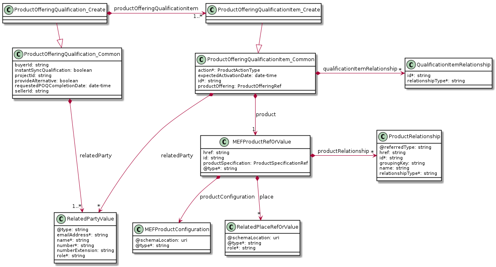

**Figure 3. The POQ Management API Data model - request view on key entities**

### 5.2.2 Response/Inventory View on Key Entities

Figure 4 depicts a view on the data model that is used to provide an immediate response to a Buyer or to retrieve POQ by an identifier (`GET /productOfferingQualification/{{id}}`).

`ProductOfferingQualification` is the root entity of a product offering qualification response and it is managed by the Seller.
`ProductOfferingQualification` extends `ProductOfferingQualification_Common` which represents Buyer's request with a number of attributes, i.e. unique identifier or state information.

[R_XXX] The properties provided in the requests by the Buyer MUST NOT be modified by the Seller.

`ProductOfferingQualification` contains one or more items (`ProductOfferingQualificationItem`). For each item, the Seller provides the processing state and if applicable the final response to a particular item from Buyer's request.

[R_XXX] In case of a successful response (`status` equals to `done`) the Seller MUST provide serviceability confidence level and if applicable might provide an alternate product proposal (`AlternateProductOfferingProposal`).

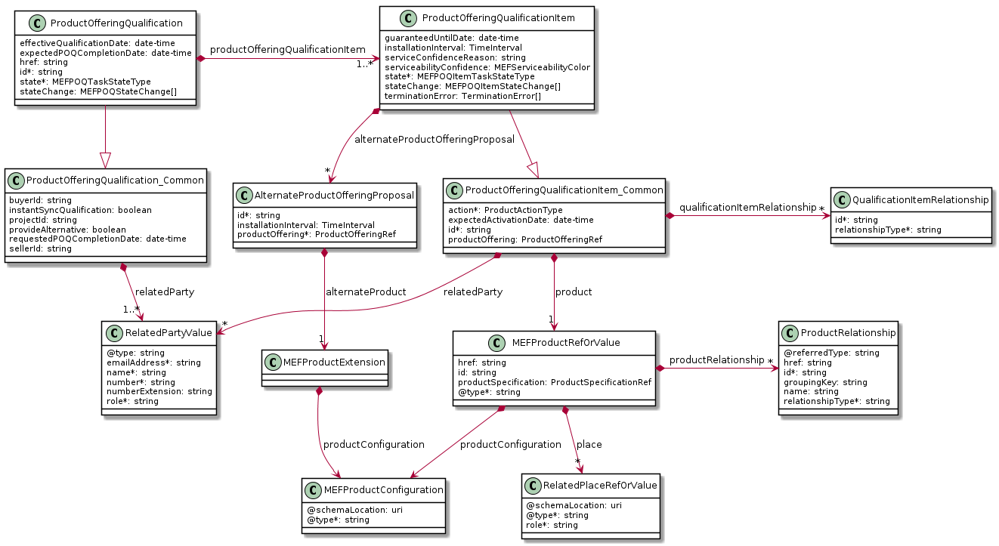

**Figure 4. The POQ Management API Data model - response/inventory view on key entities**

### 5.2.3. Integration of Product Specifications into Product Offering Qualification Management API

Product specifications are defined using JSON schema (version 4 or greater) format and are integrated into a POQ payload using TMF extension pattern.

Product-specific attributes can be introduced into `MEFProductRefOrValue` (defined by the Buyer) or into `AlternateProductOfferingProposal` (may be defined by the Seller while responding to POQ) using `MEFProductExtension`.
Each of these types introduces the `productConfiguration` attribute of type `MEFProductConfiguration` which is used as an extension point for product-specific attributes.

[R_XXX] `MEFProductConfiguration` entity is an extension point that MUST be used to integrate product specifications' properties into a request/response payload.

[R_XXX] The `@type` property of `MEFProductConfiguration` MUST be used to indicate the type of the extending entity.

[R_XXX] Product-specific properties MUST be provided in the payload in case an item action type (`ProductActionType`) is set to `add` or `change`.

[R_XXX] Product-specific properties MUST NOT be provided in the payload in case an item action type (`ProductActionType`) is set to `remove`.

This pattern is illustrated in several examples in [Section 6](#6-api-interaction--flows).

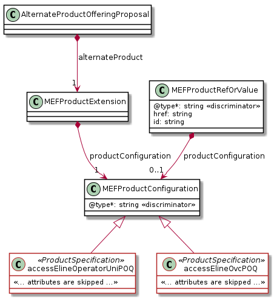

**Figure 5. The Extension Pattern with Sample Product Specific Extensions**

Figure 5. depicts two MEF `<<ProductSpecifications>>` that represent Access E-Line and Operator UNI products. When these products are used in POQ payload the `@type` of `MEFProductConfiguration` takes
`"accessElineOperatorUniPOQ"` or `"accessElineOvcPOQ"` value to indicate which product specification should be used to interpret a set of product-specific properties included in the payload.

## 5.3. Model Structural Validation

Structure of the HTTP payloads exchanged via POQ API endpoints is defined using:

- OpenAPI version 2.0 for product-agnostic part of the payload
- JsonSchema version 4 (or above) for product-specific part of the payload
  
[R_XXX] Implementations MUST use payloads that conform to these definitions.

[R_XXX] A product specification may define additional consistency rules 
and requirements that MUST be respected by implementations. These are defined for:

- relations to other items in the same product offering qualification request (e.g. required relation type, multiplicity)
- relations to entities from the inventory managed by the Seller
- party roles that are to be defined at an item level
- relations to places (locations) that are to be defined at an item level

## 5.4. Security Considerations

There must be an authentication mechanism whereby a Seller can be assured who a Buyer is and vice-versa.
There must also be authorization mechanisms in place to control what a particular Buyer or Seller is allowed to do and what information may be obtained.
However, the definition of the exact security mechanism is outside the scope of this document.

# 6. API Interaction & Flows

The following section discusses the most important aspects of end to end interactions that result in completed product qualification inquiries.
It starts with a description of product specifications which are used in the the the remainder of the section in example payloads.
Then the end-to-end flows are presented for the immediate and deferred interaction patterns.
Next, the structure of the POQ request and responses is described.
This part highlights different variants of POQ interactions related to item action types, place definitions, and alternative responses. 
Finally, the mechanism of notifications is briefly discussed.

## 6.1. Sample Product Specification

The Sonata SDK contains draft product specification definitions, from which UNI and Access E-Line are used in the payload samples in this section.
The product specification data model definitions are available as JsonSchema (version `draft-04`) documents.
Figure 5. and Figure 6 depict simplified UML views on these data models in which:

 - the mandatory attributes are denoted with `*`, 
 - the mandatory relations have a cardinality of `1` or `1..*`,
 - some relations and attributes are omitted,
 - the types marked with `<<Virtual>>` annotation are used to model `oneOf` composition feature of JsonSchema specification.

The detailed Access E-line product specification description is provided in MEF W106 [[mefw106](#8-references)].

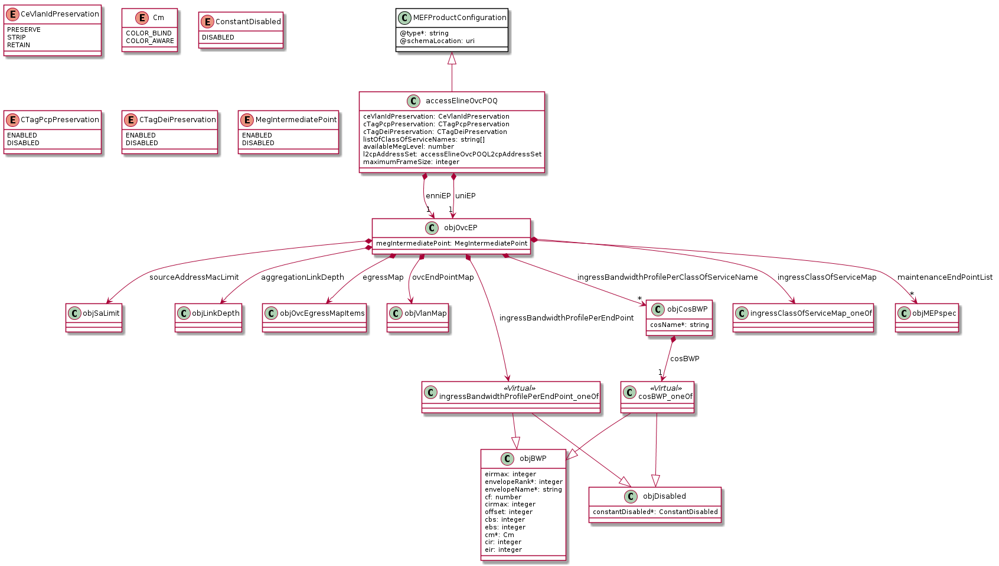

**Figure 5. A simplified view on Access E-Line product specification data model**

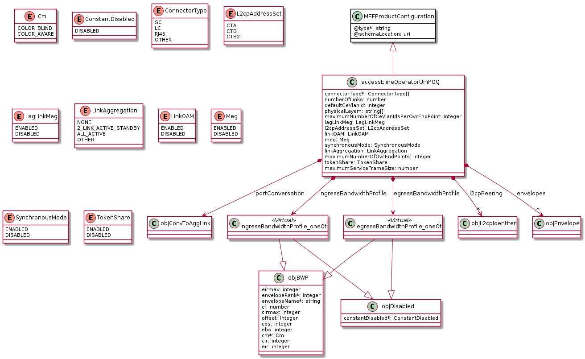

**Figure 6. A simplified view on UNI product specification data model**

Product specifications define a number of attribute-related and envelope-related requirements. Sample  envelope related requirements:

- the `modify` action  cannot be used for operator UNI products
- an Access E-Line product defines two mandatory product relationship roles to ENNI (`ENNI_REFERENCE`) and operator UNI (`UNI_REFERENCE`) for `add` action. First must be realized as a product relationship, second might be realized as item or product relationship
- product relationships cannot be specified in case of `modify` or `delete` actions
- an operator UNI product defines a place relationship (`INSTALL_LOCATION`) that must be specified  for `add` action
- place relationships cannot be specified in case of `modify` or `delete` actions

In case, some of these requirements are violated the Seller is returning an error response to the Buyer which indicates specific functional errors.
These errors are listed in the response body (a list of `Error422` entries) for HTTP `422` response.

## 6.2. Interaction Patterns

To complete POQ inquiry three interaction patterns can be used depending on Buyer/Seller side capabilities.

### 6.2.1. Immediate Qualification

Immediate qualification can be requested by a Buyer using `instantSyncQualification` flag set to `true`.
In case of successful processing,  Seller will respond with POQ in state `done` (indicating success) or `terminatedWithError`(indicating that Buyer not provided enough information).
Otherwise, the appropriate error code and description are returned in case payload doesn't pass initial validation.
Please note that `done.unableToProvide` state is not supported in the immediate qualification case.
The Seller can provide an immediate answer even when `instantSyncQualification` flag set to `false`.
The Seller MUST support the immediate qualification interaction pattern [MEF79 R2].

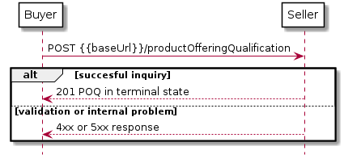

**Figure 7. Immediate qualification**

### 6.2.2. Deferred Qualification with Polling

Deferred qualification can be requested by a Buyer using `instantSyncQualification` flag set to `false`.
The Seller responds with intermediate POQ (state `inProgress`) and starts processing the request asynchronously.
The Buyer is polling the POQ status until the final response is reached using the identifier specified by Seller in response.

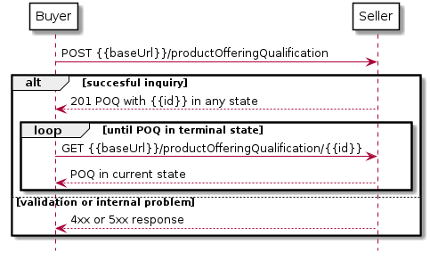

**Figure 8. Deferred qualification with polling**

### 6.2.3. Deferred Qualification with Notifications

In this variant of the deferred interaction pattern notifications mechanism is used.
First Buyer registers for notification providing callback endpoint.
Then Buyer requests for qualification. Seller sends notifications on POQ creation and subsequent changes
until the final response is reached.

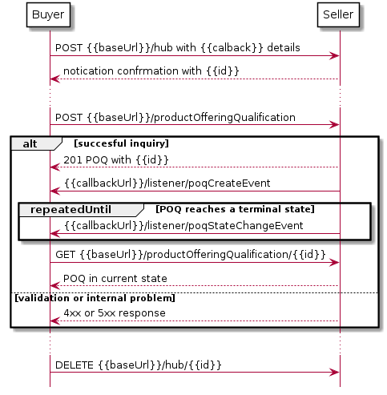

**Figure 9. Deferred qualification with notifications**

## 6.3 Sending Product Offering Qualification Request

To send a POQ request a Buyer should use createProductOfferingQualification (`POST {{baseUrl}}/productOfferingQualification`)  from API specification which represents UC6 from MEF79.
In the remainder of this section, some of the POQ payloads attributes might be omitted
to simplify examples' content.
The full list of attributes is available in [Section 7](#7-api-details) and in API specification
which is an integral part of this standard.

### 6.3.1. Buyer POQ Request

The most typical Buyer attributes used in a request are listened below.

```json
{
  "provideAlternative" : false,
  "requestedPOQCompletionDate" : "2020-08-29T07:03:36.2640125Z",
  "instantSyncQualification" : false,
  "projectId" : "buyerAssignedID-0001",
  "relatedParty" : [],
  "productOfferingQualificationItem" : [ {
    "id" : "<< some identifier >>",
    "action" : "<< action type, one of `add`, `modify`, `delete`>>",
    "product": { << product specific attributes and configuration >> },
    "relatedParty": [ << required related party entries >> ],
    "qualificationItemRelationship": [ << item level relationships >> ]
  }
  ],
  "buyerId" : "<< go to Section 7 for details >>",
  "sellerId" : "<< go to Section 7 for details >>"
}
```

A Buyer must specify at least a single POQ item, and decide whether to request immediate or deferred response (using `instantSyncQualification` flag).
The Buyer might request an alternative proposal (`provideAlternative`) in case an exact answer is not possible.

For each item, a Buyer must specify `id`, `action`, and `product`.
Also, the Buyer must follow product specification related requirements when specifying values
for `relatedParty` and `qualificationItemRelationship` attributes.
The following sections describe how the item description structure varies depending on the `action` being requested.

### 6.3.2. Seller's Response to POQ Request

The Seller immediate response and retrieve by identifier operation response has the same structure, which is:

```json
{
  "id" : "<< unique identifier >>",
  "href" : "{{baseUrl}}/productOfferingQualification/<< unique identifier >>",
  "state" : "<< current state of the POQ >>",
  "stateChange": [ << state change log >>],
  "expectedPOQCompletionDate" : "2020-08-06T18:45:33.228518Z",
  "provideAlternative" : << as provided by the Buyer >>,
  "requestedPOQCompletionDate" : "<< as provided by the Buyer >>",
  "instantSyncQualification" : << as provided by the Buyer >>,
  "projectId" : << as provided by the Buyer >>,
  "relatedParty" : [<< might be appended with party definitions specific to the Seller >>],
  "productOfferingQualificationItem" : [ {
    "state" : "<< current state >>",
    "stateChange": [ << state change log >> ],
    "serviceabilityConfidence": "<< provided in case state is `done` >>",
    "guaranteedUntilDate": "<< provided in case state is `done` >>",
    "id" : "<< as provided by the Buyer >>",
    "installationInterval" : { << provided in `done` state >> },
    "action" : "<< as provided by the Buyer >>",
    "product": { << as provided by the Buyer >> },
    "productOffering": { << product offering reference >> }
    "relatedParty": [ << might be appended with party definitions specific to the Seller >> ],
    "qualificationItemRelationship": [ << as provided by the Buyer >> ],
    "alternateProductOfferingProposal": [ << provided in case exact response cannot be given, and `provideAlternative` is true >>],
    "terminationError": [<< look into Section 7 for details >>]
  }
  ],
  "buyerId" : "<< look into Section 7 for details >>",
  "sellerId" : "<< look into Section 7 for details >>"
}
```

The Seller must not change the values of attributes specified by the Buyer. These attributes are indicated above with an appropriate comment.
The Seller might append related party information, if required, either at item or POQ level but cannot modify related party information provided by the Buyer.
The Seller is supposed to provide additional attributes that allow for unique identification or defines the current status of the item or final response.

### 6.3.3. POQ Item Specification Details

Each POQ request sent by Buyer MUST include at least one item. 
In the remainder of the section examples of POQ item definitions for different `action` types are given.

#### 6.3.3.1. POQ Item Structure for `add` Action

The example below represents a single POQ request item to evaluate the installation of a new (action `add`)
Access E-Line product (type `accessElineOvcPOQ`).
A Buyer is sending all mandatory attributes as well as a subset of optional attributes that are relevant for this inquiry.

```json {.line-numbers}
{
    "product" : {
      "productSpecification" : {
        "@referredType" : "AccessElineOvcPOQ",
        "id" : "00000000-0000-0000-0000-0000000007e3"
      },
      "productOffering": {
          "id": "000073"
      }
      "@type" : "MEFProductRefOrValue",
      "productConfiguration" : {
        "@type" : "accessElineOvcPOQ",
        "enniEP" : {
          "ingressBandwidthProfilePerEndPoint" : {
            "@type" : "ObjBWP",
            "envelopeRank" : 1,
            "envelopeName" : "defaultENNI",
            "cm" : "COLOR_BLIND",
            "cir" : 2000000,
            "cbs": 20480
          }
        },
        "maximumFrameSize" : 1500,
        "uniEP" : {
          "ingressBandwidthProfilePerEndPoint" : {
            "@type" : "ObjBWP",
            "envelopeRank" : 1,
            "envelopeName" : "defaultUNI",
            "cm" : "COLOR_BLIND",
            "cir" : 2000000,
            "cbs": 20480
          }
        }
      },
      "productRelationship" : [ {
        "relationshipType" : "ENNI_REFERENCE",
        "id" : "00000000-0000-000a-0000-000000000001"
      } ]
    },
    "qualificationItemRelationship" : [ {
      "relationshipType" : "UNI_REFERENCE",
      "id" : "item-001"
    } ],
    "action" : "add",
    "id" : "item-002",
    "relatedParty" : [ {
      "number" : "1-430-358-5262",
      "emailAddress" : "john@mef.net",
      "role" : "technical team",
      "name" : "John Doe"
    } ]
  }
  ```

The Access E-Line product specification is identified as `00000000-0000-0000-0000-0000000007e3` in the Seller's catalog.
This specification describes the structure and requirements defined for this product which should be validated.
An Access E-Line product specification defines two mandatory relationship types that have to be specified in case of an `add` action qualification: `ENNI_REFERENCE` and `UNI_REFERENCE`.
The reference to an operator UNI product might use another POQ item or an existing product from the Seller's inventory.
This example assumes that UNI product is another item of the POQ request with unique identifier `item-001`.
This Access E-Line product reference to an existing ENNI product which is uniquely
identified with id `00000000-0000-000a-0000-000000000001` in the Seller's inventory.

The place is not provided as Access E-Line product specification does not allow for a place description to be part of the request. Values for some of the available product attributes are provided under `productConfiguration` node. This example uses a tiny subset of available Access E-Line attributes.

#### 6.3.3.2. POQ Item Structure for `modify` Action

The example below represents a single POQ request item to evaluate a modification of an existing (action `modify`)  Access E-Line product (type `accessElineOvcPOQ`).
The change request must specify a reference to an existing product which is a subject of this qualification.
A Buyer is sending a full set of `productConfiguration` attributes that are relevant for the inquiry, including attributes that are to modify as well as these which should remain unchanged.
If Seller does not allow for some of the attributes to change an appropriate error response must be returned to Buyer.
The error indication message can be returned in an immediate response with HTTP `442` code or as a `terminationError` associated with an item.

```json {.line-numbers}
{
    "product" : {
      "@type" : "MEFProductRefOrValue",
      "id" : "01494079-6c79-4a25-83f7-48284196d44d",
      "productConfiguration" : {
        "@type" : "accessElineOvcPOQ",
        "enniEP" : {
          "ingressBandwidthProfilePerEndPoint" : {
            "@type" : "ObjBWP",
            "envelopeRank" : 1,
            "envelopeName" : "defaultENNI",
            "cm" : "COLOR_BLIND",
            "cir" : 2000000,
            "cbs": 20480
          }
        },
        "maximumFrameSize" : 1500,
        "uniEP" : {
          "ingressBandwidthProfilePerEndPoint" : {
            "@type" : "ObjBWP",
            "envelopeRank" : 1,
            "envelopeName" : "defaultUNI",
            "cm" : "COLOR_BLIND",
            "cir" : 2000000,
            "cbs": 20480
          }
        }
      }
    },
    "action" : "modify",
    "id" : "1",
    "relatedParty" : [ {
      "number" : "1-430-358-5262",
      "emailAddress" : "john@mef.net",
      "role" : "technical team",
      "name" : "John Doe"
    } ]
  }
```

The above example represents a qualification request for an Access E-Line product change.
In particular, changes to `cir` (Committed Information Rate) values for `ENNI` and `UNI` bandwidth profiles are qualified.
The Access E-Line product exists in Seller's inventory and is identified as `01494079-6c79-4a25-83f7-48284196d44d`.

#### 6.3.3.3. POQ Item Structure for `delete` Action

The example below represents a single POQ request item to evaluate a disconnect of an existing (action `delete`)  Access E-Line product (type `accessElineOvcPOQ`).

```json
{
  "id" : "item-001",
  "action" : "remove",
  "product" : {
    "@type" : "MEFProductRefOrValue",
    "id" : "01494079-6c79-4a25-83f7-48284196d44d"
  }
}
```

Product instance identifier (`01494079-6c79-4a25-83f7-48284196d44d`) is the only allowed attribute in the disconnect evaluation request.

### 6.3.4. Specifying Place Details

Some product specifications may define requirements concerning place definition in case `add` or `modify` action is used.
For example, the specification of a place in case of Access E-Line product is not allowed.
Operator UNI product specification requires an `INSTALL_LOCATION` place definition in case of `add` action.

There are five different formats in which place information may be provided:
geographic location (`MEFGeographicLocation`), fielded (`FieldedAddress`),
formatted (`FormattedAddress`), global address(`GlobalAddressId`), and a place reference (`PlaceRef`).
For of them can be used to provide a full place description in POQ or POQ item. The place reference allows specifying
the place information as a reference to previously validated address or site available through Sellers addressing API endpoint.
To distinguish between place types the `@type` discriminator is used.
Examples of different place specification formats are provided below.

#### 6.3.4.1. Fielded Address

```json
{
  "@type" : "FieldedAddress",
  "streetNr" : "20",
  "streetNrSuffix" : "14",
  "streetName" : "Edmunda Wasilewskiego",
  "city" : "Kraków",
  "stateOrProvince" : "Lesser Poland",
  "postcode" : "30-305",
  "country" : "Poland",
  "geographicSubAddress" : {
    "levelType" : "floor",
    "levelNumber" : "4"
  },
  "role" : "INSTALL_LOCATION"
}
```

Fielded address example of a place specification.  The type discriminator has value `FieldedAddress`.
A subset of available attributes is used to describe the place. The fielded address has an optional `geographicSubAddress` structure that
defines several attributes that can be used in case precise address information has to be provided.
In the above example, a floor in the building at the given address is specified using this structure.
The role of the place is assigned according to the requirements of the Operator UNI product specification.

#### 6.3.4.2. Formatted Address

```json
{
  "@type" : "FormattedAddress",
  "addrLine1" : "Edmunda Wasilewskiego 20/14",
  "city" : "Kraków",
  "stateOrProvince" : "Lesser Poland",
  "postcode" : "30-305",
  "country" : "Poland",
  "role" : "INSTALL_LOCATION"
}
```

Place information in a form of formatted address. The type discriminator has value `FormattedAddress`.
This example contains the same information as FieldedAddress example provided above, however, the detailed flor information is omitted.
The second address line (`addrLine2`) could be used to specify that information.

#### 6.3.4.3. Geographic Location

```json
{
  "@type" : "MEFGeographicLocation",
  "spatialRef" : "EPSG:4326 WGS 84",
  "geographicPoint" : {
    "x" : "50.048868",
    "y" : "19.929523"
  },
  "role" : "INSTALL_LOCATION"
}
```

Place information in a form of geographic location. `spatialRef` determines the standard
that has to be used to interpret coordinates provided in  `x` (latitude) and `y` (longitude) values.

#### 6.3.4.4. Global Address

```json
{
  "@type" : "GlobalAddressId",
  "externalReferenceType" : "CLLI",
  "externalReferenceId" : "PLTXCL01",
  "role" : "INSTALL_LOCATION"
}
```

The Global Address represents a globally unique identifier controlled by a generally accepted independent administrative authority that specifies a fixed geographical location.
The example above is a place that represents a CLLI (Common Language Location Identifier) identifier which is commonly used to refer locations in North America for network equipment installations.

#### 6.3.4.5. Place Reference

```json
{
  "@type" : "PlaceRef",
  "id" : "18d3bb74-997a-4a62-8198-84250766765a",
  "@referredType" : "FieldedAddress",
  "role" : "INSTALL_LOCATION"
}
```

`PlaceRef` type is used to specify an address by reference in the POQ request. In the above example a place identified as `18d3bb74-997a-4a62-8198-84250766765a` in the Sellers addressing API is used.
The `@referredType` conveys information that the referenced address is of type `FieldedAddress`.

### 6.3.5. Retrieving POQ information

#### 6.3.5.1. Retrieving POQ by identifier

POQ information can be retrieved from the Seller using GET `/productOfferingQualification/{{id}}` operation. 
The correct payload returned in the response includes all the attributes Buyer has provided while sending POQ request.
In case `id` does not identify a POQ that belongs to the Buyer an error response `404` must be returned.
A correct response includes at least POQ unique `id` and up-to-date `state` assigned to POQ and all its items.

POQ can be in an intermediate (`inProgress`) or one of the final states (`done`, `done.unableToProvide` , or `terminatedWithError`).
Details about POQ structure and allowed POQ states are provided in [API details section](#72-management-api-data-model).

```json
{
  "id" : "00000000-0000-0000-0000-000000000b01",
  "href" : "{{baseUrl}}/productOfferingQualification/00000000-0000-0000-0000-000000000b01",
  "state" : "done",
   << some attributes are omitted >>
  "productOfferingQualificationItem" : [ {
    "id" : "item-001",
    "state" : "done",
    "action" : "add",
    "serviceabilityConfidence" : "green",
    "guaranteedUntilDate" : "2020-12-23T12:00:00+02:00",
    << some attributes are omitted >>
    "stateChange" : [ {
    "changeDate" : "2020-08-23T21:13:31.2503312+02:00",
    "state" : "accepted"
    }, {
      "changeDate" : "2020-08-23T21:13:32.2502222+02:00",
      "state" : "inProgress"
    }, {
      "changeDate" : "2020-08-23T21:28:49.12+02:00",
      "state" : "done"
    } ]
  } ],
  "stateChange" : [ {
    "changeDate" : "2020-08-23T21:13:31.2503312+02:00",
    "state" : "accepted"
  }, {
    "changeDate" : "2020-08-23T21:13:32.2502222+02:00",
    "state" : "inProgress"
  }, {
    "changeDate" : "2020-08-23T21:28:50.2503333+02:00",
    "state" : "done"
  } ]
}
```

In the above example, some of the attributes initially specified by the Buyer are removed from the payload to make the example more concise.
The POQ is in a `done` final state. This is only possible if all items are in the `done` state as well. The Seller response to an inquiry represented by id `item-001`.
is positive (serviceability confidence is `green`) and valid almost end of 2020 (`guaranteedUntilDate`).
In the state transition history (`stateChange`)  all transitions for an item and POQ are listed. As listed in history the processing of the POQ request was almost instantaneous - completion under 20 seconds.

### 6.3.6. Alternative Product Proposals

The Buyer may be interested in an alternative response in case the Seller is not able to qualify an exact product.
In that case, Seller may respond with a non-empty list of alternatives for each item with a confidence level assigned to either `yellow` or `red`.

For example, a Buyer is requesting with an option for an alternative response:

```json

{
  "provideAlternative" : true,
  "requestedPOQCompletionDate" : "2020-08-12T18:45:33.228518Z",
  "instantSyncQualification" : false,
...
```

As the Seller is not able to deliver the exact product, a single alternative is returned:

```json
{
  "id" : "00000000-0000-0000-0000-000000000b01",
  "href" : "{{baseUrl}}/productOfferingQualification/00000000-0000-0000-0000-000000000b01",
  << some attributes are omitted >>
  "productOfferingQualificationItem" : [{
    "action" : "add",
    "id" : "item-001",
    "product" : {
      "productConfiguration" : {
        "@type" : "accessElineOvcPOQ",
        "enniEP" : {
          "ingressBandwidthProfilePerEndPoint" : {
            "@type" : "ObjBWP",
            "envelopeRank" : 1,
            "envelopeName" : "defaultENNI",
            "cbs" : 204800,
            "cm" : "COLOR_BLIND",
            "cir" : 2000000
          }
        },
        << some attributes are omitted >>
      },
      "productOffering": {
          "id": "000073"
      }
      << some attributes are omitted >>
    },
    "serviceabilityConfidence" : "red",
    "alternateProductOffering": {
          "id": "000099"
      }
    "alternateProductOfferingProposal" : [ {
      "installationInterval" : {
        "amount" : 10,
        "timeUnit" : "days"
      },
      "id" : "alternative-01",
      "alternateProduct" : {
        "productConfiguration" : {
          "@type" : "accessElineOvcPOQ",
          "enniEP" : {
            "ingressBandwidthProfilePerEndPoint" : {
              "@type" : "ObjBWP",
              "envelopeRank" : 1,
              "envelopeName" : "defaultENNI",
              "cbs" : 15360,
              "cm" : "COLOR_BLIND",
              "cir" : 1500000
            }
          },
          << some attributes are omitted >>
        }
      }
    } ],
    << some attributes are omitted >>
    "state" : "done"
  } ],
  << some attributes are omitted >>
}

```

The Seller is not able (`serviceabilityConfidence` is `red`) to deliver an Access E-Line service with `cir` set to 2 Mbps.
However, there is an option for a service with `cir` of 1,5 Mbps. This response is returned as `alternative-01`.
The installation interval for the alternative offering is 10 days.

### 6.3.7. Notifications

Notifications are sent from Seller to Buyer in case:

- Seller and Buyer support notification mechanism
- Buyer has registered to receive notifications from the Seller
- Deferred communication pattern is used (as described in [Section 6.2.3.](#623-deferred-qualification-with-notifications))

To register for notifications Buyer can either register for all POQ notifications:

```json
{
  "callback" : "http://buyer.co/listenerEndpoint"
}
```

or be more selective using `query` attribute:

```json
 {
  "callback" : "http://buyer.co/listenerEndpoint",
  "query" : "eventType=poqCreateEvent"
}
```

Seller sends notifications about POQ create and update events. Example of POQ create event might look like:

```json
{
 "eventId" : "event-001",
 "eventType" : "poqCreateEvent",
 "eventTime" : "2020-08-07T01:07:42.7030052+01:00",
 "event" : {
 "id" : "00000000-0000-0000-0000-000000000b01"
 }
}
```

Notifications are sent to:
- `http://buyer.co/listenerEndpoint/mefApi/sonata/productOfferingQualificationNotification/v5/listener/poqCreateEvent` in case of `poqCreateEvent`
- `http://buyer.co/listenerEndpoint/mefApi/sonata/productOfferingQualificationNotification/v5/listener/poqStateChangeEvent` in case of `poqStateChangeEvent`

# 7. API Details

## 7.1. API patterns

### 7.1.1. Indicating errors

Erroneous situations are indicated by appropriate HTTP responses.
An error response is indicated by HTTP status 4xx (for client errors) or 5xx (for server errors) and appropriate response payload.
The POQ API uses the error responses depicted and described below.

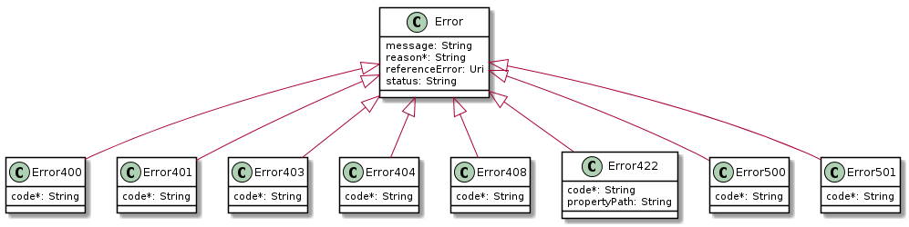

**Figure 7. Data model types to represent an erroneous response**

#### 7.1.1.1. Type Error

**Description:** Standard Class used to describe API response error
Not intended to be used directly. It MUST be used via specialization which defines a `code` property.

<table id="T_Error">
    <thead style="font-weight:bold;">
        <tr>
            <td>Name</td>
            <td>Type</td>
            <td>Description</td>
        </tr>
    </thead>
    <tbody>
        <tr>
            <td>message</td>
            <td>string</td>
            <td>Text that provides more details and corrective actions related to the error. This can be shown to a client user.</td>
        </tr><tr>
            <td>reason*</td>
            <td>string</td>
            <td>Text that explains the reason for the error. This can be shown to a client user.</td>
        </tr><tr>
            <td>referenceError</td>
            <td>uri</td>
            <td>URL pointing to documentation describing the error</td>
        </tr><tr>
            <td>status</td>
            <td>string</td>
            <td>Http error code extension like 400-2 for example</td>
        </tr>
    </tbody>
</table>

#### 7.1.1.2. Type Error400

**Description:** Bad Request

Inherits from:
- <a href="#T_Error">Error</a>

<table id="T_Error400">
    <thead style="font-weight:bold;">
        <tr>
            <td>Name</td>
            <td>Type</td>
            <td>Description</td>
        </tr>
    </thead>
    <tbody>
        <tr>
            <td>code*</td>
            <td>string</td>
            <td>One of the error codes listed below</td>
        </tr>
    </tbody>
</table>

Supported error codes:

<table>
    <thead style="font-weight:bold;">
        <tr>
            <td>Value</td>
            <td>Description</td>
        </tr>
    </thead>
    <tbody>
        <tr>
            <td>missingQueryParameter</td>
            <td>Missing query-string parameter</td>
        </tr>
        <tr>
            <td>missingQueryValue</td>
            <td>Invalid query-string parameter value</td>
        </tr>
        <tr>
            <td>invalidQuery</td>
            <td>Query constructed in an invalid way</td>
        </tr>
        <tr>
            <td>invalidBody</td>
            <td>Invalid body</td>
        </tr>
    </tbody>
</table>

#### 7.1.1.3. Type Error401

**Description:** Unauthorized

Inherits from:
- <a href="#T_Error">Error</a>

<table id="T_Error401">
    <thead style="font-weight:bold;">
        <tr>
            <td>Name</td>
            <td>Type</td>
            <td>Description</td>
        </tr>
    </thead>
    <tbody>
        <tr>
            <td>code*</td>
            <td>string</td>
            <td>One of the error codes listed below</td>
        </tr>
    </tbody>
</table>

Supported error codes:

<table>
    <thead style="font-weight:bold;">
        <tr>
            <td>Value</td>
            <td>Description</td>
        </tr>
    </thead>
    <tbody>
        <tr>
            <td>missingCredentials</td>
            <td>Missing credentials</td>
        </tr>
        <tr>
            <td>invalidCredentials</td>
            <td>Invalid or expired credentials</td>
        </tr>
    </tbody>
</table>

#### 7.1.1.4. Type Error403

**Description:** Forbidden

Inherits from:
- <a href="#T_Error">Error</a>

<table id="T_Error403">
    <thead style="font-weight:bold;">
        <tr>
            <td>Name</td>
            <td>Type</td>
            <td>Description</td>
        </tr>
    </thead>
    <tbody>
        <tr>
            <td>code*</td>
            <td>string</td>
            <td>One of the error codes listed below</td>
        </tr>
    </tbody>
</table>

Supported error codes:

<table>
    <thead style="font-weight:bold;">
        <tr>
            <td>Value</td>
            <td>Description</td>
        </tr>
    </thead>
    <tbody>
        <tr>
            <td>accessDenied</td>
            <td>Access denied</td>
        </tr>
        <tr>
            <td>forbiddenRequester</td>
            <td>Forbidden requester</td>
        </tr>
        <tr>
            <td>tooManyUsers</td>
            <td>Too many users</td>
        </tr>
    </tbody>
</table>

#### 7.1.1.5. Type Error404

**Description:** Resource for the requested path not found

Inherits from:
- <a href="#T_Error">Error</a>

<table id="T_Error404">
    <thead style="font-weight:bold;">
        <tr>
            <td>Name</td>
            <td>Type</td>
            <td>Description</td>
        </tr>
    </thead>
    <tbody>
        <tr>
            <td>code*</td>
            <td>string</td>
            <td>notFound: Resource not found</td>
        </tr>
    </tbody>
</table>

#### 7.1.1.6. Type Error408

**Description:** Request Time-out

Inherits from:
- <a href="#T_Error">Error</a>

<table id="T_Error408">
    <thead style="font-weight:bold;">
        <tr>
            <td>Name</td>
            <td>Type</td>
            <td>Description</td>
        </tr>
    </thead>
    <tbody>
        <tr>
            <td>code*</td>
            <td>string</td>
            <td>timeOut: Request Time-out</td>
        </tr>
    </tbody>
</table>

#### 7.1.1.7. Type Error422

**Description:** Unprocessable entity due to a business validation problem.

The response for HTTP status `422` is a list of elements which are structured using `Error422` data type.
Each list item describes a business validation problem.

Inherits from:
- <a href="#T_Error">Error</a>

<table id="T_Error422">
    <thead style="font-weight:bold;">
        <tr>
            <td>Name</td>
            <td>Type</td>
            <td>Description</td>
        </tr>
    </thead>
    <tbody>
        <tr>
            <td>code*</td>
            <td>string</td>
            <td>One of the error codes listed below</td>
        </tr>
        <tr>
            <td>propertyPath</td>
            <td>string</td>
            <td>
                A pointer to a particular property of the payload that caused the validation issue. 
                Defined using JsonPath format (https://goessner.net/articles/JsonPath/).
            </td>
        </tr>
    </tbody>
</table>

Supported error codes:

<table>
    <thead style="font-weight:bold;">
        <tr>
            <td>Value</td>
            <td>Description</td>
        </tr>
    </thead>
    <tbody>
        <tr>
            <td>referenceNotFound</td>
            <td>The object referenced by the property cannot be identified in the Seller system</td>
        </tr>
        <tr>
            <td>missingProperty</td>
            <td>The property the Seller has expected is not present in the payload</td>
        </tr>
        <tr>
            <td>invalidValue</td>
            <td>The property has an incorrect value</td>
        </tr>
        <tr>
            <td>invalidFormat</td>
            <td>The property value provided does not comply with expected value format</td>
        </tr>
        <tr>
            <td>unexpectedProperty</td>
            <td>An additional property, not expected by the Seller, has been provided</td>
        </tr>
        <tr>
            <td>otherIssue</td>
            <td>Other problem was identified - detailed information provided in a <code>reason</code> property</td>
        </tr>
    </tbody>
</table>

#### 7.1.1.8. Type Error500

**Description:** Internal Server Error

Inherits from:
- <a href="#T_Error">Error</a>

<table id="T_Error500">
    <thead style="font-weight:bold;">
        <tr>
            <td>Name</td>
            <td>Type</td>
            <td>Description</td>
        </tr>
    </thead>
    <tbody>
        <tr>
            <td>code*</td>
            <td>string</td>
            <td>internalError: Internal server error</td>
        </tr>
    </tbody>
</table>

#### 7.1.1.9. Type Error501

**Description:** Not Implemented

Inherits from:
- <a href="#T_Error">Error</a>

<table id="T_Error501">
    <thead style="font-weight:bold;">
        <tr>
            <td>Name</td>
            <td>Type</td>
            <td>Description</td>
        </tr>
    </thead>
    <tbody>
        <tr>
            <td>code*</td>
            <td>string</td>
            <td>notImplemented: Method not supported by the server</td>
        </tr>
    </tbody>
</table>

### 7.1.2. Response pagination

A response to retrieve a list of results  (e.g. `GET /productOfferingQualification`) can be paginated. 
The Buyer can specify following query attributes related to pagination:

- `limit` - number of expected list items
- `offset` - offset of the first element in the result list

The Seller returns a list of elements that comply with the requested `limit`.
If the requested `limit` is higher than the supported list size 
the smaller list result is returned. In that case, the size of the result
is returned in the header attribute `X-Result-Count`. 
The Seller can indicate that there are additional results available in two ways:

- using `X-Total-Count` header attribute with the total number of available results
- using `X-Pagination-Throttled` set to `true`

## 7.2. Management API Data model

[MEF79 R1] A Buyer MUST be able to initiate Use Cases 1 through 4 and 6 through 8
described in Table 3.

[MEF79 R25] When making a POQ notification request, the Buyer MUST specify the Return
Address Information and Action attributes shown in Table 18.

### 7.2.1 Product Offering Qualification

#### 7.2.1.1. Type ProductOfferingQualification_Common

**Description:** Defines a set of POQ attributes that might be used by the Buyer and cannot be modified by the Seller.

The `relatedParty` entries provided by the Buyer cannot be changed by the Seller,
however the Seller might append related party information to that list.

<table id="T_ProductOfferingQualification_Common">
    <thead style="font-weight:bold;">
        <tr>
            <td>Name</td>
            <td>Type</td>
            <td>Description</td>
            <td>MEF 79</td>
        </tr>
    </thead>
    <tbody>
        <tr>
            <td>buyerId</td>
            <td>string</td>
            <td>The unique identifier of the organization that is acting as the customer in this transaction. 
            MUST be specified in the POQ request only when the requester represents more than one Buyer.<br/>
            Reference: MEF 79 (Sn 8.8)
</td>
            <td>Buyer ID</td>
        </tr><tr>
            <td>instantSyncQualification</td>
            <td>boolean</td>
            <td>
                If this flag is set to Yes, Buyer requests to have an instant qualification to be provided in operation POST response<br />
            </td>
            <td>Immediate Response Only</td>
        </tr><tr>
            <td>projectId</td>
            <td>string</td>
            <td>This value MAY be assigned by the Buyer/Seller to identify a project the serviceability request is associated with.</td>
            <td>Project Identifier</td>
        </tr><tr>
            <td>provideAlternative</td>
            <td>boolean</td>
            <td>Allows the Buyer to indicate if he is willing to get an alternate proposal if requested product not available.
</td>
            <td>Provide Alternate</td>
        </tr><tr>
            <td>relatedParty*</td>
            <td><a href="#T_RelatedPartyValue">RelatedPartyValue</a>[]</td>
            <td>Party playing a role for this qualification (as requester for example)</td>
            <td>Allows for specifiying Buyer and Seller Contact Information</td>
        </tr><tr>
            <td>requestedPOQCompletionDate</td>
            <td>date-time</td>
            <td>The latest date a the POQ completion is expected.</td>
            <td>Expected Response Date</td>
        </tr><tr>
            <td>sellerId</td>
            <td>string</td>
            <td>The unique identifier of the organization that is acting as the supplier in this transaction.  
            MUST be specified in the POQ request only when the responding entity represents more than one Seller.
Reference: MEF 79 (Sn 8.8)
</td>
            <td>Seller ID</td>
        </tr>
    </tbody>
</table>

#### 7.2.1.2. Type ProductOfferingQualification_Create

**Description:** This type describes POQ attributes provided by the Buyer in a POQ request.
These attributes are described in MEF 79 Section 8.4.1.

Inherits from:
- <a href="#T_ProductOfferingQualification_Common">ProductOfferingQualification_Common</a>

<table id="T_ProductOfferingQualification_Create">
    <thead style="font-weight:bold;">
        <tr>
            <td>Name</td>
            <td>Type</td>
            <td>Description</td>
            <td>MEF 79</td>
        </tr>
    </thead>
    <tbody>
        <tr>
            <td>productOfferingQualificationItem*</td>
            <td><a href="#T_ProductOfferingQualificationItem_Create">ProductOfferingQualificationItem_Create</a>[]</td>
            <td>A non-empty list of POQ items</td>
            <td>Product Offering Qualification Items</td>
        </tr>
    </tbody>
</table>

[R XXX] Related party list MUST contain an entry that represents Buyer Contact Information [MEF79 R27]. The role for this entry MUST be `buyerContactInformation`.

#### 7.2.1.3. Type ProductOfferingQualification

**Description:** Represents a response to the Buyer POQ inquiry.
This type defines a set of attributes that are assigned by the Seller while processing the request.
A POQ response is a combination of attributes defined here with common attributes that are sent in the request.
This type is used in response to an immediate request and POQ retrieval by an identifier.

Inherits from:
- <a href="#T_ProductOfferingQualification_Common">ProductOfferingQualification_Common</a>

<table id="T_ProductOfferingQualification">
    <thead style="font-weight:bold;">
        <tr>
            <td>Name</td>
            <td>Type</td>
            <td>Description</td>
            <td>MEF 79</td>
        </tr>
    </thead>
    <tbody>
        <tr>
            <td>effectiveQualificationDate</td>
            <td>date-time</td>
            <td>Effective date the Seller provides qualification result.</td>
            <td>NOT REPRESENTED IN MEF 79</td>
        </tr><tr>
            <td>expectedPOQCompletionDate</td>
            <td>date-time</td>
            <td>The date the Seller is expected to provide a qualification result.</td>
            <td>NOT REPRESENTED IN MEF 79</td>
        </tr><tr>
            <td>href</td>
            <td>string</td>
            <td>Hyperlink representing this POQ resource
Hyperlink MAY be used by the Seller in responses  
</td>
            <td>NOT REPRESENTED IN MEF 79</td>
        </tr><tr>
            <td>id*</td>
            <td>string</td>
            <td>The Serviceability Request's unique identifier assigned by the Seller.</td>
            <td>POQ Identifier</td>
        </tr><tr>
            <td>productOfferingQualificationItem*</td>
            <td><a href="#T_ProductOfferingQualificationItem">ProductOfferingQualificationItem</a>[]</td>
            <td>One or more of Product Offering Qualification Items</td>
            <td>Product Offering Qualification Items</td>
        </tr><tr>
            <td>state*</td>
            <td><a href="#T_MEFPOQTaskStateType">MEFPOQTaskStateType</a></td>
            <td>The state that represents the qualification status</td>
            <td>POQ State</td>
        </tr><tr>
            <td>stateChange</td>
            <td><a href="#T_MEFPOQStateChange">MEFPOQStateChange</a>[]</td>
            <td>A log of all state transitions for the POQ.  If the log is used the most recent item's state must be in sync with <code>state</code> property value
</td>
            <td>NOT REPRESENTED IN MEF 79</td>
        </tr>
    </tbody>
</table>

[R XXX] Each item in `productOfferingQualificationItem` list MUST corresponds to an item from `ProductOfferingQualification_Create` [MEF79 R50].

[R XXX] Related party list MUST contain an entry that represents Seller Contact Information [MEF79 R48]. The `role` for this entry MUST be `sellerContactInformation`.

#### 7.2.1.4. `enum` MEFPOQTaskStateType

**Description:** These values represent the valid states through which the product offering qualification can transition.

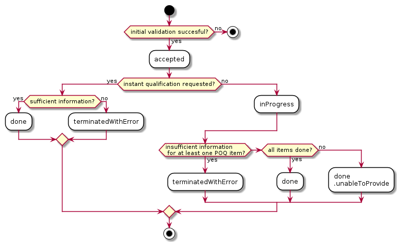

If a POQ request does not pass an initial validation the appropriate error response is returned to the Buyer.
In case a POQ request failed business rules validation the HTTP response code is `422` and a list of validation problems is returned.
Otherwise, the POQ  is assigned a unique identifier and `accepted` state.
POQ moves to `inProgress` state in case  a Buyer did not request an instant qualification.
POQ reaches `done` state if all elements are in `done` state as well.
If an evaluation of any items concludes in state `terminatedWithError` the POQ reaches `terminatedWithError` state.
The `terminatedWithError` state is reached also when there is some other information is missing in POQ request send by the Buyer.
If the POQ is processed asynchronously it can reach `done.unableToProvide` if the Seller is not able to complete
all items qualificaction by the deadline specified by the Buyer (`requestedPOQCompletionDate`).

[R XXX] The state of the POQ is `done` only if *all* items are in `done` state [MEF79 R46].

[R XXX] The state of the POQ is `terminatedWithError` only if *at least one* item is in `terminatedWithError` state [MEF79 R47].

**Figure 8. POQ Activity Diagram**

The following mapping has been used between `ProductOfferingQualificationStateType` and MEF 79 (Sn 9.1):

<table id="T_MEFPOQTaskStateType">
    <thead style="font-weight:bold;">
        <tr>
            <td>Value</td>
            <td>MEF 79</td>
            <td>Description</td>
        </tr>
    </thead>
    <tbody>
        <tr>
            <td>accepted</td>
            <td></td>
            <td>NOT REPRESENTED IN MEF 79. The state is assigned when POQ is accepted by the Seller and assigned an identifier</td>
        </tr><tr>
            <td>terminatedWithError</td>
            <td>INSUFFICIENT_INFORMATION_PROVIDED</td>
            <td>
                This state is achieved when a well-formed
                POQ request has been received, but there
                is insufficient information to complete the POQ
            </td>
        </tr><tr>
            <td>inProgress</td>
            <td>IN_PROGRESS</td>
            <td></td>
        </tr><tr>
            <td>done.unableToProvide</td>
            <td>UNABLE_TO_PROVIDE</td>
            <td>
                This state is set when the Seller is unable
                to provide a Product Offering Qualification
                in the timeframe required by the Buyer.
            </td>
        </tr><tr>
            <td>done</td>
            <td>READY</td>
            <td>Reached when all items are in `done` state</td>
        </tr>
    </tbody>
</table>

#### 7.2.1.5. Type MEFPOQStateChange

**Description:** Holds the reached state, reasons, and associated date the POQ state changed, populated by the Seller.
<table id="T_MEFPOQStateChange">
    <thead style="font-weight:bold;">
        <tr>
            <td>Name</td>
            <td>Type</td>
            <td>Description</td>
            <td>MEF 79</td>
        </tr>
    </thead>
    <tbody>
        <tr>
            <td>changeDate*</td>
            <td>date-time</td>
            <td>The date on when the state was reached</td>
            <td>NOT REPRESENTED IN MEF 79</td>
        </tr><tr>
            <td>changeReason</td>
            <td>string</td>
            <td>Additional comment related to state change</td>
            <td>NOT REPRESENTED IN MEF 79</td>
        </tr><tr>
            <td>state*</td>
            <td><a href="#T_MEFPOQStateChange">MEFPOQStateChange</a></td>
            <td>A state reached at change date</td>
            <td>NOT REPRESENTED IN MEF 79</td>
        </tr>
    </tbody>
</table>

#### 7.2.1.6. Type ProductOfferingQualification_Find

**Description:** This data type represents a single list item for the response of `GET /productOfferingQualification` operation. 

Reference: MEF 79 (Sn 8.6)

<table id="T_ProductOfferingQualification_Find">
    <thead style="font-weight:bold;">
        <tr>
            <td>Name</td>
            <td>Type</td>
            <td>Description</td>
            <td>MEF 79</td>
        </tr>
    </thead>
    <tbody>
        <tr>
            <td>id*</td>
            <td>string</td>
            <td>The POQ Request&#x27;s unique identifier.</td>
            <td>POQ Identifier</td>
        </tr><tr>
            <td>projectId</td>
            <td>string</td>
            <td>This value MAY be assigned by the Buyer/Seller to identify a project the serviceability request is associated with.</td>
            <td>Project Identifier</td>
        </tr><tr>
            <td>requestedPOQCompletionDate*</td>
            <td>date</td>
            <td>The latest date a the POQ completion is expected.</td>
            <td>Requested Response Date</td>
        </tr><tr>
            <td>state*</td>
            <td><a href="#T_MEFPOQTaskStateType">MEFPOQTaskStateType</a></td>
            <td>Current state of the POQ</td>
            <td>POQ State</td>
        </tr>
    </tbody>
</table> 

### 7.2.2. Product Offering Qualification Item

#### 7.2.2.1. Type ProductOfferingQualificationItem_Common

**Description:** Common attributes shared between a POQ Item request and response. These attributes are provided by the Buyer and must not be modified by the Seller.

The `relatedParty` entries provided by the Buyer cannot be changed by the Seller, however, the Seller might append related party information to that list.

<table id="T_ProductOfferingQualificationItem_Common">
    <thead style="font-weight:bold;">
        <tr>
            <td>Name</td>
            <td>Type</td>
            <td>Description</td>
            <td>MEF 79</td>
        </tr>
    </thead>
    <tbody>
        <tr>
            <td>action*</td>
            <td><a href="#T_ProductActionType">ProductActionType</a></td>
            <td></td>
            <td>POQ Activity</td>
        </tr><tr>
            <td>expectedActivationDate</td>
            <td>date-time</td>
            <td>Date when the requester look for productOfferingQualification activation</td>
            <td>NOT REPRESENTED IN MEF 79</td>
        </tr><tr>
            <td>id*</td>
            <td>string</td>
            <td>Id of this POQ item which is unique within the POQ.</td>
            <td>Product Offering Qualification Item Identifier</td>
        </tr><tr>
            <td>product*</td>
            <td><a href="#T_MEFProductRefOrValue">MEFProductRefOrValue</a></td>
            <td></td>
            <td>Related to Product Specific Attributes, Product Relationships</td>
        </tr><tr>
            <td>productOffering</td>
            <td><a href="#T_ProductOfferingRef">ProductOfferingRef</a></td>
            <td></td>
            <td>Product Offering Identifier</td>
        </tr><tr>
            <td>qualificationItemRelationship</td>
            <td><a href="#T_QualificationItemRelationship">QualificationItemRelationship</a>[]</td>
            <td>A list of other POQ items in this POQ that are related to the current item</td>
            <td>POQ Item Relationships</td>
        </tr><tr>
            <td>relatedParty</td>
            <td><a href="#T_RelatedPartyValue">RelatedPartyValue</a>[]</td>
            <td>Party playing a role for this qualification (as requester for example)</td>
            <td>Related to POQ Item Location Contact</td>
        </tr>
    </tbody>
</table>

#### 7.2.2.2. `enum` ProductActionType

**Description:** Action to be performed on the Product Item. The action types are described in MEF 79 (Sn 8.4.1.1) as *POQ Activity*

<table id="T_ProductActionType">
    <thead style="font-weight:bold;">
        <tr>
            <td>Value</td>
            <td>MEF 79</td>
            <td>Description</td>
        </tr>
    </thead>
    <tbody>
        <tr>
            <td>add</td>
            <td>INSTALL</td>
            <td>POQ item being evaluated is a new product</td>
        </tr><tr>
            <td>modify</td>
            <td>CHANGE</td>
            <td>POQ item being evaluated describes a change to an existing product</td>
        </tr><tr>
            <td>delete</td>
            <td>DISCONNECT</td>
            <td>POQ item is an evaluation of the feasibility of disconnecting of an existing product</td>
        </tr>
    </tbody>
</table>

[R XXX] If item's `action` attribute is `add` the Buyer MUST NOT specify `product.id` attribute value [MEF79 R30] of an item.

[R XXX] If item's `action` attribute is `add` the Buyer MUST specify `productOffering` and `product.productConfiguration` attributes [MEF79 R31] on an item.

[R XXX] If item's `action` attribute is `modify` or `delete` the Buyer MUST specify `product.id` attribute value [MEF79 R32] on an item.

[R XXX] If item's `action` attribute is `delete` the Buyer MUST NOT specify values for attributes other than `product.id` [MEF79 R33] on an item.

[R XXX] If item's `action` attribute is `modify` the Buyer MUST specify all required values for `product.productConfiguration` attribute [MEF79 R34] on an item.

#### 7.2.2.3. Type ProductOfferingRef

**Description:** A reference to a Product Offering offered by the Seller to the Buyer. A Product Offering contains the commercial and technical details of a Product sold by a particular Seller. A Product Offering defines all of the commercial terms and, through association with a particular Product Specification, defines all the technical attributes and behaviors of the Product. A Product Offering may constrain the allowable set of configurable technical attributes and/or behaviors specified in the associated Product Specification.
Defined in MEF 79 Section 8.4.1.1

<table id="T_ProductOfferingRef">
    <thead style="font-weight:bold;">
        <tr>
            <td>Name</td>
            <td>Type</td>
            <td>Description</td>
            <td>MEF 79</td>
        </tr>
    </thead>
    <tbody>
        <tr>
            <td>@referredType</td>
            <td>string</td>
            <td>The actual type of the target instance when needed for disambiguation.</td>
            <td>NOT REPRESENTED IN MEF 79</td>
        </tr><tr>
            <td>href</td>
            <td>string</td>
            <td>Hyperlink to a Product Offering in Sellers catalog.
In case Seller is not providing a catalog this attribute is not used.
The catalog API definition is provided by the Seller to the Buyer during onboarding.
Hyperlink MAY be used by the Seller in responses  .
Hyperlink MUST be ignored by the Seller in case it is provided by the Buyer in a request.
</td>
            <td>Product Offering Identifier</td>
        </tr><tr>
            <td>id*</td>
            <td>string</td>
            <td>id of a Product Offering.</td>
            <td>Product Offering Identifier</td>
        </tr><tr>
            <td>name</td>
            <td>string</td>
            <td>Human-friendly name of the referenced offering</td>
            <td>NOT REPRESENTED IN MEF 79</td>
        </tr>
    </tbody>
</table>

#### 7.2.2.4. Type QualificationItemRelationship

**Description:** A relationship from an item to another item in the same POQ request.

Reference: MEF 79.0.1 (Sn 8)

<table id="T_QualificationItemRelationship">
    <thead style="font-weight:bold;">
        <tr>
            <td>Name</td>
            <td>Type</td>
            <td>Description</td>
            <td>MEF 79</td>
        </tr>
    </thead>
    <tbody>
        <tr>
            <td>id*</td>
            <td>string</td>
            <td>An identifier of the targeted POQ item within the same POQ request</td>
            <td>Related POQ Item Identifier</td>
        </tr><tr>
            <td>relationshipType*</td>
            <td>string</td>
            <td>One of the relationship types defined in the Product Specification. For example: "UNI_REFERENCE".
</td>
            <td>Relationship Nature</td>
        </tr>
    </tbody>
</table>

#### 7.2.2.5. Type ProductOfferingQualificationItem_Create

<div id="T_ProductOfferingQualificationItem_Create"></div>

**Description:** This structure serves as a request for a product offering qualification item.
A product qualification item is an individual article included in a POQ that describes a Product of a particular type (Product Offering) being delivered to the geographic address  or a service site specified by the Buyer.
The objective is to determine if it is feasible for the Seller to deliver this item as described and for the Seller to inform the Buyer of the estimated time interval to complete this delivery.

Reference: MEF 79 (Sn 8.4.1.1)

Inherits from:
- <a href="#T_ProductOfferingQualificationItem_Common">ProductOfferingQualificationItem_Common</a>

#### 7.2.2.6. Type ProductOfferingQualificationItem

**Description:** An individual article included in a POQ that describes a Product of a particular type (Product Offering) being delivered to a specific geographical location.
The objective is to determine if it is feasible for the Seller to deliver this item as described and for the Seller to inform the Buyer of the estimated time interval to complete this delivery.
Reference: MEF 79 (Sn 8.4.3.1)

Inherits from:
- <a href="#T_ProductOfferingQualificationItem_Common">ProductOfferingQualificationItem_Common</a>

<table id="T_ProductOfferingQualificationItem">
    <thead style="font-weight:bold;">
        <tr>
            <td>Name</td>
            <td>Type</td>
            <td>Description</td>
            <td>MEF 79</td>
        </tr>
    </thead>
    <tbody>
        <tr>
            <td>alternateProductOfferingProposal</td>
            <td><a href="#T_AlternateProductOfferingProposal">AlternateProductOfferingProposal</a>[]</td>
            <td></td>
            <td></td>
        </tr><tr>
            <td>guaranteedUntilDate</td>
            <td>date-time</td>
            <td>Date until the Seller is guaranteed the qualification result.</td>
            <td>Guaranteed Until Date</td>
        </tr><tr>
            <td>installationInterval</td>
            <td><a href="#T_TimeInterval">TimeInterval</a></td>
            <td>
                The estimated minimum interval that the Seller requires in their standard process to complete
                the delivery of this Product from the time the order is placed and any precedents have been completed.
            </td>
            <td>Installation Interval (Value + Unit)</td>
        </tr><tr>
            <td>serviceConfidenceReason</td>
            <td>string</td>
            <td>A description of the reason a particular color is being provided. This may include specific standard reason codes and descriptions.</td>
            <td>NOT REPRESENTED IN MEF 79</td>
        </tr><tr>
            <td>serviceabilityConfidence</td>
            <td><a href="#T_MEFServiceabilityColor">MEFServiceabilityColor</a></td>
            <td>The level of confidence of the Seller to be able to service the request.</td>
            <td>POQ Confidence Level</td>
        </tr><tr>
            <td>state*</td>
            <td><a href="#T_MEFPOQItemTaskStateType">MEFPOQItemTaskStateType</a></td>
            <td>Current state of an item</td>
            <td>POQ Item State</td>
        </tr><tr>
            <td>stateChange</td>
            <td><a href="#T_MEFPOQItemStateChange">MEFPOQItemStateChange</a>[]</td>
            <td>A log of all state transitions for the POQ.  If the log is used the most recent item's state must be in sync with <code>state</code> property value
</td>
            <td>NOT REPRESENTED IN MEF 79</td>
        </tr><tr>
            <td>terminationError</td>
            <td><a href="#T_TerminationError">TerminationError</a>[]</td>
            <td>A list of text-based reasons on why the request cannot be processed.</td>
            <td>Termination Error</td>
        </tr>
    </tbody>
</table>

[R XXX] When item state is `done` the Seller MUST provide values for `guaranteedUntilDate`, `installationInterval` [MEF79 R56], `serviceabilityConfidence` [MEF79 R55] attributes.
        These values MUST NOT be provided for other states [MEF79 R53].

[R XXX] When item state is `terminatedWithError` the Seller MUST provide value for `terminationError` attribute.

#### 7.2.2.7. `enum` MEFServiceabilityColor

**Description:** A color that indicates Seller's confidence to service the request.

The following mapping between `ServiceabilityColor` and POQ Confidence Level (MEF 79 (Table 25)):
<table id="T_MEFServiceabilityColor">
    <thead style="font-weight:bold;">
        <tr>
            <td>Value</td>
            <td>MEF 79</td>
            <td>Description</td>
        </tr>
    </thead>
    <tbody>
        <tr>
            <td>green</td>
            <td>GREEN</td>
            <td>The Seller has high confidence that this Product can be delivered</td>
        </tr><tr>
            <td>yellow</td>
            <td>YELLOW</td>
            <td>The Seller believes they can deliver the Product but is not highly confident</td>
        </tr><tr>
            <td>red</td>
            <td>RED</td>
            <td>The Seller cannot deliver the Product as specified</td>
        </tr>
    </tbody>
</table>

#### 7.2.2.8. `enum` MEFPOQItemTaskStateType

**Description:** Defines all possible POQ Item states.

Figure 9. depicts an activity diagram for a POQ Item lifecycle.

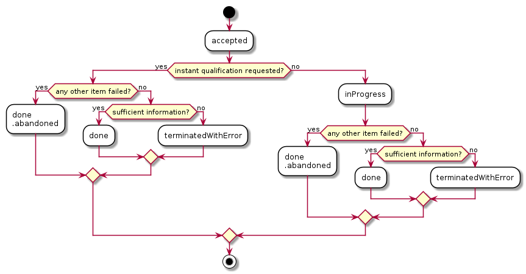

**Figure 9. POQ Item Activity Diagram**

The `accepted` is an inititial state of an item. The item reaches `inProgress` if a Buyer did not request instant qualification.
If there is any other item that reached `terminatedWithError` state the currently processed item is abandoned (`done.abandoned`).
If the Seller was able succesfully complete the processing of the item
the `done` state is assigned. Otherwise, `terminatedWithError` state is assigned.

The following mapping has been used between `ProductOfferingQualificationItemStateType` and MEF 79 (Sn 9.2):

<table id="T_MEFPOQItemTaskStateType">
    <thead style="font-weight:bold;">
        <tr>
            <td>Value</td>
            <td>MEF 79</td>
            <td>Description</td>
        </tr>
    </thead>
    <tbody>
        <tr>
            <td>accepted</td>
            <td></td>
            <td>NOT REPRESENTED IN MEF 79. The state is assigned when POQ is accepted by the Seller and assigned an identifier</td>
        </tr>
        <tr>
            <td>inProgress</td>
            <td>IN_PROGRESS</td>
            <td>the Seller is working on a POQ item response and the answer is not ready yet</td>
        </tr>
        <tr>
            <td>terminatedWithError</td>
            <td>INSUFFICIENT_INFORMATION_PROVIDED</td>
            <td>The information provided by the Buyer is insufficient for the Seller to provide POQ Item response</td>
        </tr>
        <tr>
            <td>done.abandoned</td>
            <td>DONE.ABANDONED</td>
            <td> 
                Applied to a POQ Item in case the final state is not reached 
                and any other POQ Item moved to the final state other than <code>done</code>
            </td>
        </tr>
        <tr>
            <td>done</td>
            <td>READY</td>
            <td>POQ Item response is complete. This state does not imply that Seller is able to deliver requested item
            </td>
        </tr>
    </tbody>
</table>

#### 7.2.2.9. Type MEFPOQItemStateChange

**Description:** Holds the reached state, reasons, and associated date the POQ state changed, populated by the Seller.
<table id="T_MEFPOQItemStateChange">
    <thead style="font-weight:bold;">
        <tr>
            <td>Name</td>
            <td>Type</td>
            <td>Description</td>
            <td>MEF 79</td>
        </tr>
    </thead>
    <tbody>
        <tr>
            <td>changeDate*</td>
            <td>date-time</td>
            <td>The date on when the state was reached</td>
            <td>NOT REPRESENTED IN MEF 79</td>
        </tr><tr>
            <td>changeReason</td>
            <td>string</td>
            <td>Additional comment related to state change</td>
            <td>NOT REPRESENTED IN MEF 79</td>
        </tr><tr>
            <td>state*</td>
            <td><a href="#T_MEFPOQItemTaskStateType">MEFPOQItemTaskStateType</a></td>
            <td>The state which was reached at change date</td>
            <td>NOT REPRESENTED IN MEF 79</td>
        </tr>
    </tbody>
</table>

#### 7.2.2.10. Type TerminationError

**Description:** Termination error may be provided if seller is unable to perform qualification Reference: MEF 79 (Sn 8.4.3.1)
<table id="T_TerminationError">
    <thead style="font-weight:bold;">
        <tr>
            <td>Name</td>
            <td>Type</td>
            <td>Description</td>
            <td>MEF 79</td>
        </tr>
    </thead>
    <tbody>
        <tr>
            <td>id</td>
            <td>string</td>
            <td>Id of the termination error</td>
            <td>NOT REPRESENTED IN MEF 79</td>
        </tr><tr>
            <td>value</td>
            <td>string</td>
            <td>Value (text) for the termination error</td>
            <td>Termination Error</td>
        </tr>
    </tbody>
</table>

### 7.2.3. Product representation

#### 7.2.3.1. Type MEFProductRefOrValue

**Description:** One or more services sold to a Buyer by a Seller. A particular Product Offering defines the technical and commercial attributes and behaviors of a Product. Product-related properties are described in MEF 79 Section 8.4.1.1

<table id="T_MEFProductRefOrValue">
    <thead style="font-weight:bold;">
        <tr>
            <td>Name</td>
            <td>Type</td>
            <td>Description</td>
            <td>MEF 79</td>
        </tr>
    </thead>
    <tbody>
        <tr>
            <td>href</td>
            <td>string</td>
            <td>Hyperlink to the product in Seller&#x27;s inventory that is the qualification&#x27;s subject.
Hyperlink MAY be used by the Seller in responses  .
Hyperlink MUST be ignored by the Seller in case it is provided by the Buyer in a request.
</td>
            <td>NOT REPRESENTED IN MEF 79</td>
        </tr><tr>
            <td>id</td>
            <td>string</td>
            <td>The unique identifier of an in-service Product that is the qualification&#x27;s subject.
This attribute MUST be populated if an item &#x60;action&#x60; is either &#x60;modify&#x60; or &#x60;delete&#x60;.
This attribute MUST NOT be populated if an item &#x60;action&#x60; is &#x60;add&#x60;.
</td>
            <td>Product Identifier</td>
        </tr><tr>
            <td>place</td>
            <td><a href="#T_RelatedPlaceRefOrValue">RelatedPlaceRefOrValue</a>[]</td>
            <td>A list of locations that are related to the Product. For example an installation location</td>
            <td>POQ Item Location and POQ Item Location Type</td>
        </tr><tr>
            <td>productConfiguration</td>
            <td><a href="#T_MEFProductConfiguration">MEFProductConfiguration</a></td>
            <td>Technical attributes for the Product that would be delivered to fulfill the POQ Item</td>
            <td>Product Specific Attributes</td>
        </tr><tr>
            <td>productRelationship</td>
            <td><a href="#T_ProductRelationship">ProductRelationship</a>[]</td>
            <td>A list of references to existing products that are related to the Product that would be delivered to fulfill the POQ Item
</td>
            <td>Product Relationships</td>
        </tr><tr>
            <td>productSpecification</td>
            <td><a href="#T_ProductSpecificationRef">ProductSpecificationRef</a></td>
            <td>A reference to a Product Specification used in the POQ item containing a product</td>
            <td>NOT REPRESENTED IN MEF 79</td>
        </tr><tr>
            <td>@type*</td>
            <td>string</td>
            <td>Should take a value of <code>MEFProductRefOrValue</code> to conform to DCS rules.</td>
            <td>NOT REPRESENTED IN MEF 79</td>
        </tr>
    </tbody>
</table>

Definition of `place` and `productRelationship` must comply with specific requirements of the Product Specification being used.
To indicate which Product Specification is used a Buyer may use a `productSpecification` attribute.
This attribute is useful in case some sort of Catalog APIs is used between the Buyer and the Seller.
Please note that currently, catalog API is not part of Sonata IPR definition.
If this attribute is used it should represent the same Product Specification as `@type` attribute of `productConfiguration`.
It should be also compatible with the `productOffering` reference if used at the item level. 

#### 7.2.3.2. Type MEFProductConfiguration

**Description:** MEFProductConfiguration is used as an extension point for MEF specific product/service payload. The `@type` attribute is used as a discriminator.
<table id="T_MEFProductConfiguration">
    <thead style="font-weight:bold;">
        <tr>
            <td>Name</td>
            <td>Type</td>
            <td>Description</td>
            <td>MEF 79</td>
        </tr>
    </thead>
    <tbody>
        <tr>
            <td>@schemaLocation</td>
            <td>uri</td>
            <td>A URI to a JSON-Schema file that defines additional attributes and relationships</td>
            <td>NOT REPRESENTED IN MEF 79</td>
        </tr><tr>
            <td>@type*</td>
            <td>string</td>
            <td>When sub-classing, this defines the sub-class Extensible name</td>
            <td>NOT REPRESENTED IN MEF 79</td>
        </tr>
    </tbody>
</table>


#### 7.2.3.3. Type ProductRelationship

**Description:** A relationship from an item to a product in Seller's repository that was previously purchased by the Buyer.

Reference: MEF 79.0.1

<table id="T_ProductRelationship">
    <thead style="font-weight:bold;">
        <tr>
            <td>Name</td>
            <td>Type</td>
            <td>Description</td>
            <td>MEF 79</td>
        </tr>
    </thead>
    <tbody>
        <tr>
            <td>@referredType</td>
            <td>string</td>
            <td>The actual type of the target instance when needed for disambiguation.</td>
            <td>NOT REPRESENTED IN MEF 79</td>
        </tr><tr>
            <td>href</td>
            <td>string</td>
            <td>Hyperlink to the product in Seller's inventory that is referenced Hyperlink MAY be used by the Seller in responses   Hyperlink MUST be ignored by the Seller in case it is provided by the Buyer in a request
</td>
            <td>NOT REPRESENTED IN MEF 79</td>
        </tr><tr>
            <td>id*</td>
            <td>string</td>
            <td>An unique identifier of a Product that is referenced</td>
            <td>Related Product Identifier</td>
        </tr><tr>
            <td>groupingKey</td>
            <td>string</td>
            <td>Related Product Identifier list is constructed from product ids having the same groupingKey and relationshipType.<br />
Reference: MEF 79.0.1 (Sn 7)
</td>
            <td>supports Related Product Identifier</td>
        </tr><tr>
            <td>name</td>
            <td>string</td>
            <td>Human-friendly name of the referenced product</td>
            <td>NOT REPRESENTED IN MEF 79</td>
        </tr><tr>
            <td>relationshipType*</td>
            <td>string</td>
            <td>One of the relationship types defined in the Product Specification. For example: "UNI_REFERENCE".</td>
            <td>Relationship Nature</td>
        </tr>
    </tbody>
</table>

MEF 79.0.1 allows for providing multiple relate product identifiers. This can be later used while processing the request as defined in the Product Specification.
The `groupingKey` attribute is to achieve this behavior in the APIs. 

[R XXX] The Product Identifier from relationships having the same `groupingKey` and `relationshipType` MUST be treated as a list of identifiers.

#### 7.2.3.4. Type AlternateProductOfferingProposal

**Description:** Alternate Product Proposals represent other Products and solutions that the Seller is proposing to meet the needs of the Buyer.
Reference: MEF 79 (Sn 8.4.3.2)

<table id="T_AlternateProductOfferingProposal">
    <thead style="font-weight:bold;">
        <tr>
            <td>Name</td>
            <td>Type</td>
            <td>Description</td>
            <td>MEF 79</td>
        </tr>
    </thead>
    <tbody>
        <tr>
            <td>alternateProduct*</td>
            <td><a href="#T_MEFProductExtension">MEFProductExtension</a></td>
            <td></td>
            <td>related to Product Specific Attributes</td>
        </tr><tr>
            <td>alternateProductOffering*</td>
            <td><a href="#T_ProductOfferingRef">ProductOfferingRef</a></td>
            <td></td>
            <td>Product Offering Identifier</td>
        </tr><tr>
            <td>id*</td>
            <td>string</td>
            <td>Identifier of the Product Offering Qualification alternate proposal.</td>
            <td>Alternate Product Proposal Identifier</td>
        </tr><tr>
            <td>installationInterval*</td>
            <td><a href="#T_TimeInterval">TimeInterval</a></td>
            <td></td>
            <td>Installation Interval Value and Installation Interval Unit</td>
        </tr>
    </tbody>
</table>

#### 7.2.3.5. Type MEFProductExtension

**Description:** One or more services sold to a Buyer by a Seller. A particular Product Offering defines the technical and commercial attributes and behaviors of a Product. 
Product-related properties are described in MEF 79 Section 8.4.1.1

<table id="T_MEFProductExtension">
    <thead style="font-weight:bold;">
        <tr>
            <td>Name</td>
            <td>Type</td>
            <td>Description</td>
            <td>MEF 79</td>
        </tr>
    </thead>
    <tbody>
        <tr>
            <td>productConfiguration</td>
            <td><a href="#T_MEFProductConfiguration">MEFProductConfiguration</a></td>
            <td>Technical attributes for the Product that would be delivered to fulfill the POQ Item</td>
            <td>Product Specific Attributes</td>
        </tr>
    </tbody>
</table>

#### 7.2.3.6. Type ProductSpecificationRef

**Description:** A reference to a structured set of well-defined technical attributes and/or behaviors
that are used to construct a Product Offering for sale to a market.

This data type is not represented in MEF 79.

<table id="T_ProductSpecificationRef">
    <thead style="font-weight:bold;">
        <tr>
            <td>Name</td>
            <td>Type</td>
            <td>Description</td>
            <td>MEF 79</td>
        </tr>
    </thead>
    <tbody>
        <tr>
            <td>@referredType</td>
            <td>string</td>
            <td>The actual type of the target instance when needed for disambiguation.</td>
            <td>NOT REPRESENTED IN MEF 79</td>
        </tr><tr>
            <td>href</td>
            <td>string</td>
            <td>Hyperlink to a Product Specification in Sellers catalog. In case Seller is not providing a catalog capability this attribute is not used.  The catalog API definition is provided by the Seller to Buyer during onboarding. Hyperlink MAY be used by the Seller in responses   Hyperlink MUST be ignored by the Seller in case it is provided by the Buyer in a request
</td>
            <td>NOT REPRESENTED IN MEF 79</td>
        </tr><tr>
            <td>id*</td>
            <td>string</td>
            <td>Unique identifier of the product specification</td>
            <td>NOT REPRESENTED IN MEF 79</td>
        </tr><tr>
            <td>name</td>
            <td>string</td>
            <td>Human-friendly name of the referenced specification</td>
            <td>NOT REPRESENTED IN MEF 79</td>
        </tr>
    </tbody>
</table>

### 7.2.4. Place representation

There are five formats in which place information can be introduced to the POQ request.

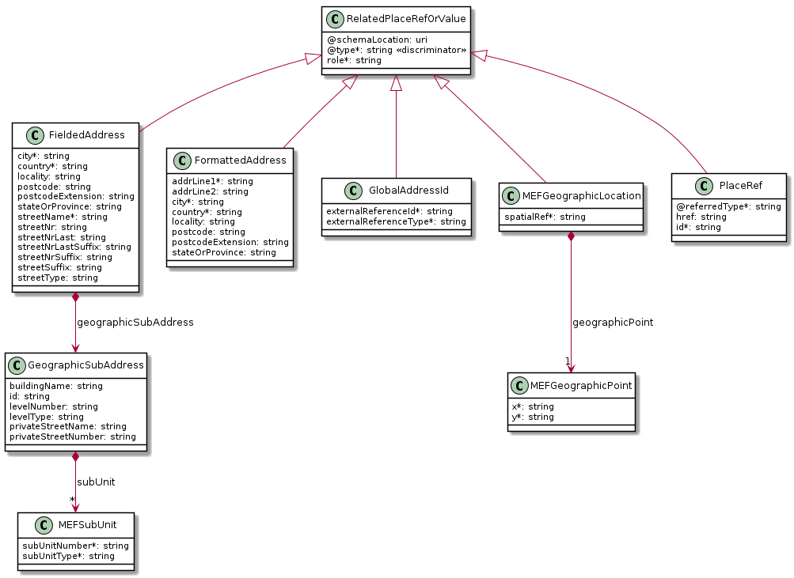

**Figure 10. Data model types representing a place**


The `PlaceRef` format is used to provide place information as a reference
to a previously validation address [MEF 79 D2].


#### 7.2.4.1. Type FieldedAddress

**Description:** A type of Address that has a discrete attribute and value for each type of boundary or identifier down to the lowest level of detail. For example "street number" is one attribute, "street name" is another attribute, etc. Reference: MEF 79 (Sn 8.9.2.1)

Inherits from:
- <a href="#T_RelatedPlaceRefOrValue">RelatedPlaceRefOrValue</a>

<table id="T_FieldedAddress">
    <thead style="font-weight:bold;">
        <tr>
            <td>Name</td>
            <td>Type</td>
            <td>Description</td>
            <td>MEF 79</td>
        </tr>
    </thead>
    <tbody>
        <tr>
            <td>city*</td>
            <td>string</td>
            <td>The city that the address is in</td>
            <td>City</td>
        </tr><tr>
            <td>country*</td>
            <td>string</td>
            <td>Country that the address is in</td>
            <td>Country</td>
        </tr><tr>
            <td>geographicSubAddress</td>
            <td><a href="#T_GeographicSubAddress">GeographicSubAddress</a></td>
            <td></td>
            <td></td>
        </tr><tr>
            <td>locality</td>
            <td>string</td>
            <td>The locality that the address is in</td>
            <td>Locality</td>
        </tr><tr>
            <td>postcode</td>
            <td>string</td>
            <td>Descriptor for a postal delivery area, used to speed and simplify the delivery of mail (also known as zip code) MEF 79 defines it as required however as in certain countries it is not used we make it optional in API.</td>
            <td>Postal Code</td>
        </tr><tr>
            <td>postcodeExtension</td>
            <td>string</td>
            <td>An extension of a postal code. E.g. the part following the dash in an american urban property address</td>
            <td>Postal Code Extension</td>
        </tr><tr>
            <td>stateOrProvince</td>
            <td>string</td>
            <td>The State or Province that the address is in</td>
            <td>State Or Province</td>
        </tr><tr>
            <td>streetName*</td>
            <td>string</td>
            <td>Name of the street or other street type</td>
            <td>Street Name</td>
        </tr><tr>
            <td>streetNr</td>
            <td>string</td>
            <td>Number identifying a specific property on a public street. It may be combined with streetNrLast for ranged addresses. MEF 79 defines it as required however as in certain countries it is not used we make it optional in API.</td>
            <td>Street Number</td>
        </tr><tr>
            <td>streetNrLast</td>
            <td>string</td>
            <td>Last number in a range of street numbers allocated to a property</td>
            <td>Street Number Last</td>
        </tr><tr>
            <td>streetNrLastSuffix</td>
            <td>string</td>
            <td>Last street number suffix for a ranged address</td>
            <td>Street Number Suffix Last</td>
        </tr><tr>
            <td>streetNrSuffix</td>
            <td>string</td>
            <td>The first street number suffix</td>
            <td>Street Number Suffix</td>
        </tr><tr>
            <td>streetSuffix</td>
            <td>string</td>
            <td>A modifier denoting a relative direction</td>
            <td>Street Suffix</td>
        </tr><tr>
            <td>streetType</td>
            <td>string</td>
            <td>Alley, avenue, boulevard, brae, crescent, drive, highway, lane, terrace, parade, place, tarn, way, wharf</td>
            <td>Street Type</td>
        </tr>
    </tbody>
</table>

#### 7.2.4.2. Type FormattedAddress

**Description:** A type of Address that has discrete fields for each type of boundary or identifier with the exception of the street and more specific location details, which are combined into a maximum of two strings based on local postal addressing conventions. Reference: MEF 79 (Sn 8.9.3)

Inherits from:
- <a href="#T_RelatedPlaceRefOrValue">RelatedPlaceRefOrValue</a>

<table id="T_FormattedAddress">
    <thead style="font-weight:bold;">
        <tr>
            <td>Name</td>
            <td>Type</td>
            <td>Description</td>
            <td>MEF 79</td>
        </tr>
    </thead>
    <tbody>
        <tr>
            <td>addrLine1*</td>
            <td>string</td>
            <td>The first address line in a formatted address</td>
            <td>Address Line 1</td>
        </tr><tr>
            <td>addrLine2</td>
            <td>string</td>
            <td>The second address line in a formatted address</td>
            <td>Address Line 2</td>
        </tr><tr>
            <td>city*</td>
            <td>string</td>
            <td>The city that the address is in</td>
            <td>City</td>
        </tr><tr>
            <td>country*</td>
            <td>string</td>
            <td>Country that the address is in</td>
            <td>Country</td>
        </tr><tr>
            <td>locality</td>
            <td>string</td>
            <td>An area of defined or undefined boundaries within a local authority or other legislatively defined area, usually rural or semi-rural in nature</td>
            <td>Locality</td>
        </tr><tr>
            <td>postcode</td>
            <td>string</td>
            <td>Descriptor for a postal delivery area, used to speed and simplify the delivery of mail (also known as ZIP code)</td>
            <td>Postal Code</td>
        </tr><tr>
            <td>postcodeExtension</td>
            <td>string</td>
            <td>An extension of a postal code. E.g. the part following the dash in an US urban property address</td>
            <td>Postal Code Extension</td>
        </tr><tr>
            <td>stateOrProvince</td>
            <td>string</td>
            <td>The State or Province that the address is in</td>
            <td>State Or Province</td>
        </tr>
    </tbody>
</table>

#### 7.2.4.3. Type MEFGeographicLocation

**Description:** A set of coordinates (typically including latitude and longitude) that describes a particular location on earth. 

Reference: MEF 79 (Sn 8.9.5)

Inherits from:
- <a href="#T_RelatedPlaceRefOrValue">RelatedPlaceRefOrValue</a>

<table id="T_MEFGeographicLocation">
    <thead style="font-weight:bold;">
        <tr>
            <td>Name</td>
            <td>Type</td>
            <td>Description</td>
            <td>MEF 79</td>
        </tr>
    </thead>
    <tbody>
        <tr>
            <td>geographicPoint*</td>
            <td><a href="#T_MEFGeographicPoint">MEFGeographicPoint</a></td>
            <td>Longitude and latitude value</td>
            <td>Spatial Reference</td>
        </tr><tr>
            <td>spatialRef*</td>
            <td>string</td>
            <td>The spatial reference system used to determine the coordinates</td>
            <td>Spatial Reference</td>
        </tr>
    </tbody>
</table>

[R XXX] The `spatialRef` value that can be used MUST be agreed between Buyer and Seller

#### 7.2.4.4. Type MEFGeographicPoint

**Description:** A MEFGeographicPoint defines a geographic point through coordinates.
<table id="T_MEFGeographicPoint">
    <thead style="font-weight:bold;">
        <tr>
            <td>Name</td>
            <td>Type</td>
            <td>Description</td>
            <td>MEF 79</td>
        </tr>
    </thead>
    <tbody>
        <tr>
            <td>x*</td>
            <td>string</td>
            <td>The latitude expressed in the format specified by the <code>spacialRef</code></td>
            <td>Latitude</td>
        </tr><tr>
            <td>y*</td>
            <td>string</td>
            <td>The longitude expressed in the format specified by the <code>spacialRef</code></td>
            <td>Longitude</td>
        </tr>
    </tbody>
</table>

#### 7.2.4.5. Type GeographicSubAddress

**Description:** Additional fields used to specify an address, as detailed as possible.
<table id="T_GeographicSubAddress">
    <thead style="font-weight:bold;">
        <tr>
            <td>Name</td>
            <td>Type</td>
            <td>Description</td>
            <td>MEF 79</td>
        </tr>
    </thead>
    <tbody>
        <tr>
            <td>buildingName</td>
            <td>string</td>
            <td>Allows for buildings that have well-known names</td>
            <td>Building Name</td>
        </tr><tr>
            <td>id</td>
            <td>string</td>
            <td>Unique Identifier of the subAddress</td>
            <td>NOT REPRESENTED IN MEF 79</td>
        </tr><tr>
            <td>levelNumber</td>
            <td>string</td>
            <td>Used where a level type may be repeated e.g. BASEMENT 1, BASEMENT 2</td>
            <td>Level Number</td>
        </tr><tr>
            <td>levelType</td>
            <td>string</td>
            <td>Describes level types within a building</td>
            <td>Level Type</td>
        </tr><tr>
            <td>privateStreetName</td>
            <td>string</td>
            <td>Private streets internal to a property (e.g. a university) may have internal names that are not recorded by the land title office
</td>
            <td>Private Street Name</td>
        </tr><tr>
            <td>privateStreetNumber</td>
            <td>string</td>
            <td>Private streets numbers internal to a private street</td>
            <td>Private Street Number</td>
        </tr><tr>
            <td>subUnit</td>
            <td><a href="#T_MEFSubUnit">MEFSubUnit</a>[]</td>
            <td>Representation of a MEFSubUnit
It is used for describing subunit within a subaddress  e.g.BERTH, FLAT, PIER, SUITE, SHOP, TOWER, UNIT, WHARF.</td>
            <td></td>
        </tr>
    </tbody>
</table>

#### 7.2.4.6. Type PlaceRef

**Description:** A reference to a place resource available through Sonata addressing validation API.
This type should be use to represent Service Site Identifier from MEF 79 (Table 21).


Inherits from:
- <a href="#T_RelatedPlaceRefOrValue">RelatedPlaceRefOrValue</a>

<table id="T_PlaceRef">
    <thead style="font-weight:bold;">
        <tr>
            <td>Name</td>
            <td>Type</td>
            <td>Description</td>
            <td>MEF 79</td>
        </tr>
    </thead>
    <tbody>
        <tr>
            <td>@referredType*</td>
            <td>string</td>
            <td>The actual type of the target instance when needed for disambiguation.</td>
            <td></td>
        </tr><tr>
            <td>href</td>
            <td>string</td>
            <td>Hyperlink to the referenced place
Hyperlink MAY be used by the Seller in responses  
Hyperlink MUST be ignored by the Seller in case it is provided by the Buyer in a request
</td>
            <td>NOT REPRESENTED IN MEF79</td>
        </tr><tr>
            <td>id*</td>
            <td>string</td>
            <td>Identifier of the referenced place. This identifier is assigned during a successful address validation request (Sonata Geographic Address Management API)</td>
            <td>Formatted | Fielded Address Identifier</td>
        </tr>
    </tbody>
</table>

#### 7.2.4.7. Type GlobalAddressId

**Description:** A globally unique identifier controlled by a generally accepted independent administrative authority that specifies a fixed geographical location. Reference: MEF 79 (Sn 8.9.4)

Inherits from:
- <a href="#T_RelatedPlaceRefOrValue">RelatedPlaceRefOrValue</a>

<table id="T_GlobalAddressId">
    <thead style="font-weight:bold;">
        <tr>
            <td>Name</td>
            <td>Type</td>
            <td>Description</td>
            <td>MEF 79</td>
        </tr>
    </thead>
    <tbody>
        <tr>
            <td>externalReferenceId*</td>
            <td>string</td>
            <td>A reference to an address by id; this would include such things as CLLI (Common Language Location Identifier) code</td>
            <td>Global Address Reference ID</td>
        </tr><tr>
            <td>externalReferenceType*</td>
            <td>string</td>
            <td>The type of the reference. For North American providers this would normally be CLLI (Common Language Location Identifier) code</td>
            <td>Administrative Authority</td>
        </tr>
    </tbody>
</table>

#### 7.2.4.8. Type RelatedPlaceRefOrValue

**Description:** Definition of a place.
For example, a place where the product offering qualification must be done.

This standard defines a number of specializations (place representations) of a place type.
<table id="T_RelatedPlaceRefOrValue">
    <thead style="font-weight:bold;">
        <tr>
            <td>Name</td>
            <td>Type</td>
            <td>Description</td>
            <td>MEF 79</td>
        </tr>
    </thead>
    <tbody>
        <tr>
            <td>@schemaLocation</td>
            <td>uri</td>
            <td>
                A URI to a JSON-Schema file that defines additional attributes and relationships. May be used to define additional related place types. 
                The usage of this attribute must be agreed between Buyer and Seller.
            </td>
            <td>NOT REPRESENTED IN MEF 79</td>
        </tr><tr>
            <td>@type*</td>
            <td>string</td>
            <td>This filed is used as a discriminator and is used between different place representations.
            This type might discriminate for an additional related place as defined in <code>@schemaLocation</code>.
</td>
            <td>NOT REPRESENTED IN MEF 79</td>
        </tr><tr>
            <td>role*</td>
            <td>string</td>
            <td>Role of this place</td>
            <td>RelatedPlaceRefOrValue</td>
        </tr>
    </tbody>
</table>

#### 7.2.4.9. Type MEFSubUnit

**Description:** A Sub Unit type

Reference: MEF 79 (Sn 8.9.2)

<table id="T_MEFSubUnit">
    <thead style="font-weight:bold;">
        <tr>
            <td>Name</td>
            <td>Type</td>
            <td>Description</td>
            <td>MEF 79</td>
        </tr>
    </thead>
    <tbody>
        <tr>
            <td>subUnitNumber*</td>
            <td>string</td>
            <td>The discriminator used for the subunit, often just a simple number but may also be a range.</td>
            <td>Sub Unit Name</td>
        </tr><tr>
            <td>subUnitType*</td>
            <td>string</td>
            <td>The type of subunit e.g.BERTH, FLAT, PIER, SUITE, SHOP, TOWER, UNIT, WHARF.</td>
            <td>Sub Unit Type</td>
        </tr>
    </tbody>
</table>

### 7.2.6. Notification registration

Notification registration and management are done through `/hub` API endpoint.
The below sections describe data models related to this endpoint.

#### 7.2.6.1. Type EventSubscriptionInput

**Description:** This resource is used to define  a notification subscription.
<table id="T_EventSubscriptionInput">
    <thead style="font-weight:bold;">
        <tr>
            <td>Name</td>
            <td>Type</td>
            <td>Description</td>
        </tr>
    </thead>
    <tbody>
        <tr>
            <td>callback*</td>
            <td>string</td>
            <td>
                This callback value MUST be set to *host* property from Buyer ProductOfferingQualification Notification API.
                This property is appended with an appropriate base path and notification resource path to construct  an URL to which notification is sent.
            </td>
        </tr><tr>
            <td>query</td>
            <td>string</td>
            <td>
                This attribute is used to define notification registration constraints. 
            </td>
        </tr>
    </tbody>
</table>

The query attribute might be used to constrain the notifications that a Buyer is willing to receive to the callback endpoint.
The `query` formatting complies to RCF3986 [rfc3986](#8-references). Every attribute defined in Event model (from notification API)
can be used in the `query`.
Example:

```
    "query":"eventType=poqCreateEvent"
```

#### 7.2.6.2. Type EventSubscription

**Description:** This resource is used to manage the notification subscription.
Reference: MEF 79 (Sn 8.3)

<table id="T_EventSubscription">
    <thead style="font-weight:bold;">
        <tr>
            <td>Name</td>
            <td>Type</td>
            <td>Description</td>
        </tr>
    </thead>
    <tbody>
        <tr>
            <td>callback*</td>
            <td>string</td>
            <td>The value provided by the Buyer in `EventSubscriptionInput` during notification registration</td>
        </tr><tr>
            <td>id*</td>
            <td>string</td>
            <td>An identifier of the even subscription assigned by the Seller when resource is created</td>
        </tr><tr>
            <td>query</td>
            <td>string</td>
            <td>The value provided by the Buyer in `EventSubscriptionInput` during notification registration</td>
        </tr>
    </tbody>
</table>

### 7.2.7. Common

#### 7.2.7.1. Type RelatedPartyValue

**Description:** An entity or organization that is involved in the product offering qualification. It may be the Buyer, the Seller, or other related party Reference: MEF 79 (Sn 8.11)
<table id="T_RelatedPartyValue">
    <thead style="font-weight:bold;">
        <tr>
            <td>Name</td>
            <td>Type</td>
            <td>Description</td>
            <td>MEF 79</td>
        </tr>
    </thead>
    <tbody>
        <tr>
            <td>@type</td>
            <td>string</td>
            <td>An indicator of whether a role is an individual or organizational. If not specified assumed individual
</td>
            <td>NOT REPRESENTED IN MEF 79</td>
        </tr><tr>
            <td>emailAddress*</td>
            <td>string</td>
            <td>Party email address</td>
            <td>Contact email Address</td>
        </tr><tr>
            <td>name*</td>
            <td>string</td>
            <td>Name of the party</td>
            <td>Contact Name</td>
        </tr><tr>
            <td>number*</td>
            <td>string</td>
            <td>Party phone number</td>
            <td>Contract Phone Number</td>
        </tr><tr>
            <td>numberExtension</td>
            <td>string</td>
            <td>Party phone number extension</td>
            <td>Contract Phone Number Extension</td>
        </tr><tr>
            <td>role*</td>
            <td>string</td>
            <td>The role of the particular related party in the request</td>
            <td>NOT REPRESENTED IN MEF 79</td>
        </tr>
    </tbody>
</table>

The related party can be defined at a POQ or a POQ Item level. In both cases, it is allowed to provide a list of party role information.
The `role` attribute is used to provide a reason the particular party information is used. It can result from MEF 79 requirements
(e.g. Seller Contact Information) or from the Product Specification requirements.

#### 7.2.7.2. Type TimeInterval

**Description:** A time interval (e.g. 3 hours, or 10 business days)
Reference: MEF 79 (Sn 8.4.3.1)

<table id="T_TimeInterval">
    <thead style="font-weight:bold;">
        <tr>
            <td>Name</td>
            <td>Type</td>
            <td>Description</td>
            <td>MEF 79</td>
        </tr>
    </thead>
    <tbody>
        <tr>
            <td>amount*</td>
            <td>integer</td>
            <td>An interval value</td>
            <td>Installation Interval Value</td>
        </tr><tr>
            <td>timeUnit*</td>
            <td><a href="#T_TimeUnit">TimeUnit</a></td>
            <td>An interval value type</td>
            <td>Installation Interval Value</td>
        </tr>
    </tbody>
</table>

#### 7.2.7.3. `enum` TimeUnit

**Description:** Represents a unit of time.
Reference: MEF 79 (Sn 8.4.3.1/8.4.3.2)


<table id="T_TimeUnit">
    <thead style="font-weight:bold;">
        <tr>
            <td>Value</td>
            <td>MEF 79</td>
        </tr>
    </thead>
    <tbody>
        <tr>
            <td>calendarDays</td>
            <td>CALENDAR_DAYS</td>
        </tr><tr>
            <td>calendarHours</td>
            <td>CALENDAR_HOURS</td>
        </tr><tr>
            <td>calendarMinutes</td>
            <td>CALENDAR_MINUTES</td>
        </tr><tr>
            <td>businessDays</td>
            <td>BUSINESS_DAYS</td>
        </tr><tr>
            <td>businessHours</td>
            <td>BUSINESS_HOURS</td>
        </tr><tr>
            <td>businessMinutes</td>
            <td>BUSINESS_MINUTES</td>
        </tr>
    </tbody>
</table>


# 8. References

* [oas-v2] [Open API 2.0] (http://spec.openapis.org/oas/v2.0), September 2014
* [js] [JsonSchema specifications](https://json-schema.org/specification-links.html)
* [mef55] [MEF 55](http://www.mef.net/resources/technical-specifications/download?id=44&fileid=file1) Lifecycle Service Orchestration (LSO): Reference Architecture and Framework, March 2016
* [mef79] [MEF 79](http://www.mef.net/resources/technical-specifications/download?id=129&fileid=file1), Address, Service Site, and Product Offering Qualification Management, Requirements and Use Cases, November 2019
* [mef79.0.1] [MEF 79.0.1](https://wiki.mef.net/download/attachments/106609126/MEF%20W79.0.1%20LB.pdf?api=v2), Amendment to MEF 79: Address, Service Site, and Product Offering Qualification Management, Requirements and Use Cases, July 2020
* [mefw106] [MEF W106 v.0.6](https://wiki.mef.net/download/attachments/106599684/ael%20developer%20guide%20wd%200.6.pdf?api=v2) Developer Guide for Access E-Line Products, July 2020
* [tmf679] [TMF 679 version 19.0.1](https://www.tmforum.org/resources/specification/tmf679-product-offering-qualification-api-rest-specification-r19-0-0/).
* [rfc2119]  [RFC 2119] (https://tools.ietf.org/html/rfc2119), Key words for use in RFCs to Indicate Requirement Levels, March 1997
* [rfc8174] [RFC 8174] (https://tools.ietf.org/html/rfc8174), Ambiguity of Uppercase vs Lowercase in RFC 2119 Key Words, May 2017
* [rfc3986] [RFC 3986] (https://tools.ietf.org/html/rfc3986#section-3) Uniform Resource Identifier (URI): Generic Syntax, January 2005