<style>
img
{
  display:block;
  float:none;
  margin-left:auto;
  margin-right:auto;
}
</style>


<div style="font-weight:bold; font-size:33pt; font-family:Sansation;  text-align:center;">
Letter Ballot
</br>
MEF W160
</br>
</br>
LSO Cantata and LSO Sonata Product Offering Availability and Pricing Discovery API - Developer Guide
</br>
</br>
January 2025
</br>
<p style="color:red;font-weight:bold; font-size:18pt">EXPORT CONTROL: This document contains technical data. The download, export, re-export or disclosure of the technical data contained in this document may be restricted by applicable U.S. or foreign export laws, regulations and rules and/or applicable U.S. or foreign sanctions ("Export Control Laws or Sanctions"). You agree that you are solely responsible for determining whether any Export Control Laws or Sanctions may apply to your download, export, reexport or disclosure of this document, and for obtaining (if available) any required U.S. or foreign export or reexport licenses and/or other required authorizations.
</div>
<div class="page"/>

**Disclaimer**

© MEF Forum 2025. All Rights Reserved.

The information in this publication is freely available for reproduction and use
by any recipient and is believed to be accurate as of its publication date. Such
information is subject to change without notice and MEF Forum (MEF) is not
responsible for any errors. MEF does not assume responsibility to update or
correct any information in this publication. No representation or warranty,
expressed or implied, is made by MEF concerning the completeness, accuracy, or
applicability of any information contained herein and no liability of any kind
shall be assumed by MEF as a result of reliance upon such information.

The information contained herein is intended to be used without modification by
the recipient or user of this document. MEF is not responsible or liable for any
modifications to this document made by any other party.

The receipt or any use of this document or its contents does not in any way
create, by implication or otherwise:

- (a) any express or implied license or right to or under any patent, copyright,
  trademark or trade secret rights held or claimed by any MEF member which are
  or may be associated with the ideas, techniques, concepts or expressions
  contained herein; nor

- (b) any warranty or representation that any MEF member will announce any
  product(s) and/or service(s) related thereto, or if such announcements are
  made, that such announced product(s) and/or service(s) embody any or all of
  the ideas, technologies, or concepts contained herein; nor

- (c) any form of relationship between any MEF member and the recipient or user
  of this document.

Implementation or use of specific MEF standards, specifications or
recommendations will be voluntary, and no Member shall be obliged to implement
them by virtue of participation in MEF Forum. MEF is a non-profit international
organization to enable the development and worldwide adoption of agile, assured
and orchestrated network services. MEF does not, expressly or otherwise, endorse
or promote any specific products or services.

**Copyright**

© MEF Forum 2025. Any reproduction of this document, or any portion thereof,
shall contain the following statement: "Reproduced with permission of MEF
Forum." No user of this document is authorized to modify any of the information
contained herein.

<div class="page"/>

**Table of Contents**

- [List of Contributing Members](#list-of-contributing-members)
- [1. Abstract](#1-abstract)
- [2. Terminology and Abbreviations](#2-terminology-and-abbreviations)
- [3. Compliance Levels](#3-compliance-levels)
- [4. Introduction](#4-introduction)
  - [4.1. Description](#41-description)
  - [4.2. Conventions in the Document](#42-conventions-in-the-document)
  - [4.3. Relation to Other Documents](#43-relation-to-other-documents)
  - [4.4. Approach](#44-approach)
  - [4.5. High-Level Flow](#45-high-level-flow)
- [5. API Description](#5-api-description)
  - [5.1. High-level use cases](#51-high-level-use-cases)
  - [5.2. API Endpoint and Operation Description](#52-api-endpoint-and-operation-description)
  - [5.3. Specifying the Buyer ID and the Seller ID](#53-specifying-the-buyer-id-and-the-seller-id)
  - [5.4. Integration of Product Specifications into the API](#54-integration-of-product-specifications-into-the-api)
  - [5.5. Sample Product Specification](#55-sample-product-specification)
  - [5.6. Model Structural Validation](#56-model-structural-validation)
  - [5.7. Security Considerations](#57-security-considerations)
- [6. API Interaction \& Flows](#6-api-interaction--flows)
  - [6.1. Use case 1: Retrieve Product Offering Availability](#61-use-case-1-retrieve-product-offering-availability)
    - [6.1.1. Request](#611-request)
    - [6.1.2. Response](#612-response)
  - [6.2. Use case 2: Retrieve Pricing for a Product Offering Configuration](#62-use-case-2-retrieve-pricing-for-a-product-offering-configuration)
    - [6.2.1. Request](#621-request)
    - [6.2.2. Response](#622-response)
- [7. API Details](#7-api-details)
  - [7.1. API patterns](#71-api-patterns)
    - [7.1.1. Indicating errors](#711-indicating-errors)
      - [7.1.1.1. Type Error](#7111-type-error)
      - [7.1.1.2. Type Error400](#7112-type-error400)
      - [7.1.1.3. `enum` Error400Code](#7113-enum-error400code)
      - [7.1.1.4. Type Error401](#7114-type-error401)
      - [7.1.1.5. `enum` Error401Code](#7115-enum-error401code)
      - [7.1.1.6. Type Error403](#7116-type-error403)
      - [7.1.1.7. `enum` Error403Code](#7117-enum-error403code)
      - [7.1.1.8. Type Error422](#7118-type-error422)
      - [7.1.1.9. `enum` Error422Code](#7119-enum-error422code)
      - [7.1.1.10. Type Error500](#71110-type-error500)
  - [7.2. API Data model](#72-api-data-model)
    - [7.2.1. Product Offering Availability](#721-product-offering-availability)
      - [7.2.1.1. Type ProductOfferingAvailability\_Request](#7211-type-productofferingavailability_request)
      - [7.2.1.2. Type ProductOfferingAvailability](#7212-type-productofferingavailability)
      - [7.2.1.3. Type ProductOfferingConfiguration](#7213-type-productofferingconfiguration)
      - [7.2.1.4. Type ProductOfferingRef](#7214-type-productofferingref)
      - [7.2.1.5. Type MEFProductConfiguration](#7215-type-mefproductconfiguration)
      - [7.2.1.6. Type ProductSpecificationRef](#7216-type-productspecificationref)
    - [7.2.2. Pricing Discovery](#722-pricing-discovery)
      - [7.2.2.1. Type PricingDiscovery\_Request](#7221-type-pricingdiscovery_request)
      - [7.2.2.2. Type PricingDiscovery](#7222-type-pricingdiscovery)
      - [7.2.2.3. Type PricingAndTerm](#7223-type-pricingandterm)
      - [7.2.2.4. Type QuotePrice](#7224-type-quoteprice)
      - [7.2.2.6. Type MEFItemTerm](#7226-type-mefitemterm)
      - [7.2.2.7. `enum` MEFEndOfTermAction](#7227-enum-mefendoftermaction)
      - [7.2.2.8. `enum` MEFPriceType](#7228-enum-mefpricetype)
      - [7.2.2.9. Type Money](#7229-type-money)
      - [7.2.2.10. Type Price](#72210-type-price)
    - [7.2.3. Place representation](#723-place-representation)
      - [7.2.3.1. Type RelatedPlaceRefWithSubUnit](#7231-type-relatedplacerefwithsubunit)
      - [7.2.3.2. Type PlaceRef](#7232-type-placeref)
      - [7.2.3.3. Type GeographicAddressRef](#7233-type-geographicaddressref)
      - [7.2.3.4. Type GeographicSiteRef](#7234-type-geographicsiteref)
      - [7.2.3.5. Type SubUnit](#7235-type-subunit)
    - [7.2.4. Common Types](#724-common-types)
      - [7.2.4.1. Type Duration](#7241-type-duration)
      - [7.2.4.2. `enum` ProductActionAddModifyType](#7242-enum-productactionaddmodifytype)
      - [7.2.4.3. Type ProductRef](#7243-type-productref)
      - [7.2.4.4. Type ProductRelationship](#7244-type-productrelationship)
      - [7.2.4.5. `enum` TimeUnit](#7245-enum-timeunit)
- [8. References](#8-references)
- [Appendix A Acknowledgments](#appendix-a-acknowledgments)

<div class="page"/>

# List of Contributing Members

The following members of the MEF participated in the development of this
document and have requested to be included in this list.

| Member                   |
| ------------------------ |
| Amartus                  |
| Colt Technology Services |
| Proximus                 |

**Table 1. Contributing Members**

<div class="page"/>

# 1. Abstract

This standard is intended to assist implementation of the Product Offering
Availability and Pricing Discovery functionality defined for the LSO Cantata and
LSO Sonata Interface Reference Points (IRPs), for which requirements and use
cases are defined in MEF 110 _Product Offering Availability and Pricing
Discovery - Business Requirements and Use Cases_ [[MEF 110](#8-references)].
This standard consists of this document and complementary API definitions.

This standard normatively incorporates the following files by reference as if
they were part of this document, from the GitHub repository:

<https://github.com/MEF-GIT/MEF-LSO-Sonata-SDK>

commit id:
[2ed9d8dddcb2e7919b1eba4652fb553e485cb84c](https://github.com/MEF-GIT/MEF-LSO-Sonata-SDK/commit/2ed9d8dddcb2e7919b1eba4652fb553e485cb84c)

- [`productApi/availabilityAndPricingDiscovery/productOfferingAvailabilityAndPricingDiscovery.api.yaml`](https://raw.githubusercontent.com/MEF-GIT/MEF-LSO-Sonata-SDK/2ed9d8dddcb2e7919b1eba4652fb553e485cb84c/productApi/availabilityAndPricingDiscovery/productOfferingAvailabilityAndPricingDiscovery.api.yaml)

<https://github.com/MEF-GIT/MEF-LSO-Cantata-SDK>

commit id:
[39d87ccbe6e9f3383b3f8d8aaa121103a70e8fb0](https://github.com/MEF-GIT/MEF-LSO-Cantata-SDK/commit/39d87ccbe6e9f3383b3f8d8aaa121103a70e8fb0)

- [`productApi/availabilityAndPricingDiscovery/productOfferingAvailabilityAndPricingDiscovery.api.yaml`](https://raw.githubusercontent.com/MEF-GIT/MEF-LSO-Cantata-SDK/39d87ccbe6e9f3383b3f8d8aaa121103a70e8fb0/productApi/availabilityAndPricingDiscovery/productOfferingAvailabilityAndPricingDiscovery.api.yaml)

<div class="page"/>

# 2. Terminology and Abbreviations

This document does not define any new terms or definitions. All of them are
defined in the standards referenced below and are included in this document by
reference:

- [[MEF 110](#8-references)]
- [[MEF 55.1](#8-references)]
- [[MEF 55.1.1](#8-references)]
- [[MEF 80](#8-references)]
- [[MEF 150](#8-references)]

<div class="page"/>

# 3. Compliance Levels

The key words **"MUST"**, **"MUST NOT"**, **"REQUIRED"**, **"SHALL"**, **"SHALL
NOT"**, **"SHOULD"**, **"SHOULD NOT"**, **"RECOMMENDED"**, **"NOT
RECOMMENDED"**, **"MAY"**, and **"OPTIONAL"** in this document are to be
interpreted as described in BCP 14 ([[RFC2119](#8-references)],
[[RFC8174](#8-references)]) when, and only when, they appear in all capitals, as
shown here. All key words must be in bold text.

Items that are **REQUIRED** (contain the words **MUST** or **MUST NOT**) are
labeled as **[Rx]** for required. Items that are **RECOMMENDED** (contain the
words **SHOULD** or **SHOULD NOT**) are labeled as **[Dx]** for desirable. Items
that are **OPTIONAL** (contain the words MAY or OPTIONAL) are labeled as
**[Ox]** for optional.

A paragraph preceded by **[CRa]<** specifies a conditional mandatory requirement
that **MUST** be followed if the condition(s) following the "<" have been met.
For example, **"[CR1]<[D38]"** indicates that Conditional Mandatory Requirement
1 must be followed if Desirable Requirement 38 has been met. A paragraph
preceded by **[CDb]<** specifies a Conditional Desirable Requirement that
**SHOULD** be followed if the condition(s) following the "<" have been met. A
paragraph preceded by **[COc]<**specifies a Conditional Optional Requirement
that **MAY** be followed if the condition(s) following the "<" have been met.

<div class="page"/>

# 4. Introduction

This standard specification document describes the Application Programming
Interface (API) for Product Offering Availability and Pricing Discovery
functionality of the LSO Cantata Interface Reference Point (IRP) and Sonata IRP
as defined in the MEF 55.1 _Lifecycle Service Orchestration (LSO): Reference
Architecture and Framework_ [[MEF55.1](#8-references)]. The LSO Reference
Architecture is shown in Figure 1 with both IRPs highlighted.


**Figure 1. The LSO Reference Architecture**

This document is structured as follows:

- [Chapter 4](#4-introduction) provides an introduction to Product Offering
  Availability and Pricing Discovery and its description in a broader context of
  Cantata and Sonata
- [Chapter 5](#5-api-description) gives an overview of endpoints, resource model
  and design patterns.
- Use cases and flows are presented in
  [Chapter 6](#6-api-interactions-and-flows).
- And finally, [Chapter 7](#7-api-details) complements previous sections with a
  detailed resource model description.

## 4.1. Description

As specified in [[MEF110](#8-references)]:

Product Offering Availability Discovery is a way for the Buyer to specify a
Product Specification and Delivery Context to the Seller in order to receive
from the Seller a list of zero or more Product Offering Configurations.

Pricing Discovery allows the Buyer to receive from the Seller a list of one or
more Pricing and term information for the Product Configuration and Delivery
Context specified by the Buyer.

Product Offering Availability and Pricing Discovery are intended for use by a
Buyer who has already determined that they will use a particular Seller for
products at a particular location/UNI and are only wanting to know exactly what
products and configurations are available there, and what pricing structures are
available for those products. Product Offering Availability and Pricing
Discovery are not intended to be used to determine whether the Seller can
provide products meeting the Buyers needs at that location/UNI in the first
place (i.e. the assumption is that they can) - since it is not possible to
retrieve complete information about, for example, the total cost of a set of
related products before ordering some of them. The Quote mechanism defined in
[[MEF80](#8-references)] is more appropriate for that type of use.

As with any other interaction between a Buyer and Seller, several prerequisites
must be fulfilled. This is done during onboarding and includes, but is not
limited to the following:

- Any elements of the Buyer that are opaque to End Customers, such as ENNIs are
  in place and are available for use.
- The period of time after which auto-renewal occurs and in which the Buyer can
  disconnect the Product without penalty is agreed to by the Buyer and Seller.
- The pricing framework has been agreed to by the Buyer and Seller.
- If `businessHours` and `businessDays` are used as values for the `TimeUnit`
  attribute, the Buyer and Seller must agree to their definition
- The Seller's right to reuse a `productOfferingConfigurationIdentifier` for
  different Delivery Contexts is agreed to by the Buyer and Seller.
- The `productConfiguration` attributes that are returned in the Seller's
  response to a Product Offering Availability Discovery request are agreed.
- Any referenced pre-requisite Products are in place and are in the correct
  Administrative or Operational state to be referenced.

Details of how onboarding happens, and the agreements and data exchange that
happens through the onboarding process, are outside the scope of this document.

The `productConfiguration` attributes that are returned by the Seller could be
different when the Action is `add` versus `modify`.

Delivery Context is a set of related Products and Places that are associated
with a Product. The possible and/or required relations are defined in each of
the Product Specification Standards. For example, the Delivery Context of a UNI
would be the physical location at which it is installed, whereas the Delivery
Context for an Access E-Line would be the UNI and ENNI that it connects.

## 4.2. Conventions in the Document

- Code samples are formatted using code blocks. When notation `<< some text >>`
  is used in the payload sample it indicates that a comment is provided instead
  of an example value and it might not comply with the OpenAPI definition.
- Model definitions are formatted as in-line code (e.g.
  `ProductOfferingAvailability`).
- In UML diagrams the default cardinality of associations is `0..1`. Other
  cardinality markers are compliant with the UML standard.
- In the API details tables and UML diagrams required attributes are marked with
  a `*` next to their names.
- In UML sequence diagrams `{{variable}}` notation is used to indicate a
  variable to be substituted with a correct value.

## 4.3. Relation to Other Documents

The requirements and use cases for Product Offering Availability and Pricing
Discovery functionality are defined in MEF 110 [[MEF110](#8-references)].

## 4.4. Approach

As presented in Figure 2. both LSO Cantata and LSO Sonata API frameworks consist
of three structural components:

- Generic API framework
- Product-independent information (Function-specific information and
  Function-specific operations)
- Product-specific information (MEF product specification data model)


**Figure 2. Cantata and Sonata API framework**

The essential concept behind the framework is to decouple the common structure,
information, and operations from the specific product information content.  
Firstly, the Generic API Framework defines a set of design rules and patterns
that are applied across all Cantata or Sonata APIs.  
Secondly, the product-independent information of the framework focuses on a
model of a particular Cantata or Sonata functionality and is agnostic to any of
the product specifications.  
Finally, the product-specific information part of the framework focuses on MEF
product specifications that define business-relevant attributes and requirements
for trading MEF subscriber and MEF operator services.

## 4.5. High-Level Flow

Product Offering Availability and Pricing Discovery is part of a broader Cantata
and Sonata End-to-End flow. Figure 3. below shows a high-level diagram to get a
good understanding of the whole process.

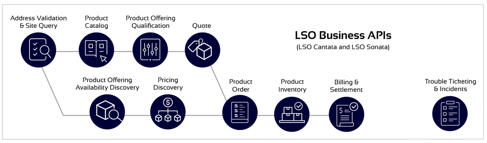

**Figure 3. Cantata and Sonata End-to-End Function Flow**

- Address Validation:
  - Allows the Buyer to retrieve address information from the Seller, including
    exact formats, for addresses known to the Seller.
- Site Retrieval:
  - Allows the Buyer to retrieve Service Site information including exact
    formats for Service Sites known to the Seller.
- Product Catalog:
  - Allows the Buyer to retrieve Product Categories and Product Offering
    information, including specification details from a Seller's Product
    Catalog.
- Product Offering Qualification (POQ):
  - Allows the Buyer to check whether the Seller can deliver a product or set of
    products from among their product offerings at the geographic address or a
    service site specified by the Buyer; or modify a previously purchased
    product.
- Quote:
  - Allows the Buyer to submit a request to find out how much the installation
    of an instance of a Product Offering, an update to an existing Product, or a
    disconnect of an existing Product will cost.
- Product Order:
  - Allows the Buyer to request the Seller to initiate and complete the
    fulfillment process of an installation of a Product Offering, an update to
    an existing Product, or a disconnect of an existing Product at the address
    defined by the Buyer.
- Product Inventory:
  - Allows the Buyer to retrieve information about existing Product instances
    from Seller's Product Inventory.
- Billing:
  - Allows the Seller to generate the document to the Buyer relating to charges
    associated with Products provided by the Seller to the Buyer.
- Trouble Ticketing:
  - Allows the Buyer to create, retrieve, and update Trouble Tickets as well as
    receive notifications about Incidents' and Trouble Tickets' updates. This
    allows for managing issues and situations that are not part of the normal
    operations of the Product provided by the Seller.

Product Offering Availability and Pricing Discovery APIs are drawn as a fork to
standard POQ and Quote as they implement the same functionality but in a
slightly different approach. The discrepancies will be explained in detail in
further sections.

<div class="page"/>

# 5. API Description

This section discusses the API structure and design patterns. It starts with the
high-level use cases diagram and then it describes the REST endpoints with use
case mapping.

## 5.1. High-level use cases

Figure 4 presents a high-level use case diagram as specified in MEF 110
[[MEF110](#8-references)]. This picture aims to help understand endpoint
mapping. Use cases are described extensively in
[chapter 6](#6-api-interactions-and-flows)

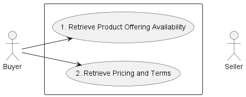

**Figure 4. High-level use cases**

## 5.2. API Endpoint and Operation Description

**Base URL for Cantata**:

`https://{{serverBase}}:{{port}}{{?/seller_prefix}}/mefApi/cantata/productOfferingAvailabilityAndPricingDiscovery/v4/`

**Base URL for Sonata**:

`https://{{serverBase}}:{{port}}{{?/seller_prefix}}/mefApi/sonata/productOfferingAvailabilityAndPricingDiscovery/v4/`

**_Note:_** All examples will include only the Sonata version of the Base Path.

Table 2 lists the API endpoints with mapping to business use cases:

| API endpoint                        | Description                                                                                                                            | MEF 110 Use case mapping                     |
| ----------------------------------- | -------------------------------------------------------------------------------------------------------------------------------------- | -------------------------------------------- |
| `POST /productOfferingAvailability` | A request initiated by the Buyer to receive a list of zero or more Product Offering Configurations                                     | UC 1: Retrieve Product Offering Availability |
| `POST /pricingDiscovery`            | A request initiated by the Buyer to receive a list of one or more pricing and terms information for the Product Offering Configuration | UC 2: Retrieve Pricing and Terms             |

**Table 2. Seller side endpoints.**

**[R1]** The Buyer implementation **MUST** be able to use all REST methods that
are listed in Table 2. [MEF110 R1], [MEF110 R2], [MEF110 R24], [MEF110 R25]

## 5.3. Specifying the Buyer ID and the Seller ID

A business Entity willing to represent multiple Buyers or multiple Sellers must
follow requirements of [[MEF 150](#8-references)] chapter 8.8, which states:

> For requests of all types, there is a business Entity that initiates an
> Operation (called a Requesting Entity) and a business Entity that is
> responding to this request (called the Responding Entity). In the simplest
> case, the Requesting Entity is the Buyer and the Responding Entity is the
> Seller. However, in some cases, the Requesting Entity may represent more than
> one Buyer and similarly, the Responding Entity may represent more than one
> Seller.


**Figure 5. Buyer ID and Seller ID Examples**

> As shown in Figure 5, if a Requesting Entity representing a single Buyer is
> doing business with a Responding Entity representing a single Seller, Buyer
> and Seller IDs are not required to be passed between the two Entities. If a
> Requesting Entity representing more than one Buyer is doing business with a
> Responding Entity representing a single Seller, the Buyer ID is required to be
> passed between the two Entities. If a Requesting Entity representing a single
> Buyer is doing business with a Responding Entity representing multiple
> Sellers, the Seller ID is required to be passed between the two Entities. If a
> Requesting Entity representing multiple Buyers is doing business with a
> Responding Entity representing multiple Sellers, both the Buyer ID and the
> Seller ID are required to be passed between the Entities.

> While it is outside the scope of this specification, it is assumed that the
> Requesting Entity and the Responding Entity are aware of each other and can
> authenticate requests initiated by the other party. It is further assumed that
> the Buying Entity knows:
>
> - the list of Buyers the Requesting Entity represents when interacting with
>   this Responding Entity; and
> - the list of Sellers that this Responding Entity represents to this
>   Requesting Entity.
>
> It is also assumed that the Responding Entity knows:
>
> - the list of Sellers that this Responding Entity represents to this
>   Requesting Entity and
> - the list of Buyers the Requesting Entity represents when interacting with
>   this Respond-ing Entity.

In the API the `buyerId` and `sellerId` are represented as optional query
parameters in each operation defined.

**[R2]** If the Requesting Entity has the authority to represent more than one
Buyer the request **MUST** include `buyerId` that identifies the Buyer being
represented [MEF150 R62]

**[R3]** If the Responding Entity represents more than one Seller to this Buyer
the request **MUST** include `sellerId` that identifies the Seller with whom
this request is associated [MEF150 R63]

## 5.4. Integration of Product Specifications into the API

Product specification schemas are defined and provided using JsonSchema
(draft 7) format and are integrated into the API using the extension pattern.

The extension hosting type in the API data model is `MEFProductConfiguration`.
The `@type` attribute of that type must be set to a value that uniquely
identifies the product specification. A unique identifier for MEF standard
product specifications is in URN format and is assigned by MEF. This identifier
is provided as root schema `$id` and in product specification documentation. Use
of non-MEF standard product definitions is allowed. In such a case the schema
identifier must be agreed upon between the Buyer and the Seller.

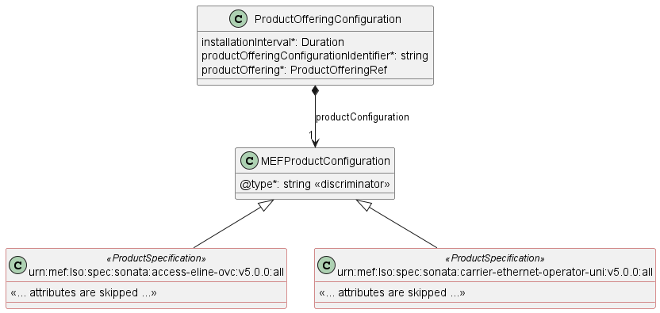

**Figure 6. The Extension Pattern**

Figure 6 presents two MEF `<<ProductSpecifications>>` that represent Access
E-Line OVC and Carrier Ethernet Operator UNI products. When these products are
used as a Product Offering Availability or Pricing Discovery payload the `@type`
of `MEFProductConfiguration` takes
`"urn:mef:lso:spec:sonata:access-eline-ovc:v5.0.0:all"` or
`"urn:mef:lso:spec:sonata:carrier-ethernet-operator-uni:v5.0.0:all"` value to
indicate which product specification schema must be used to interpret a set of
product-specific attributes included in the payload. An example of a product
definition inside the `productConfiguration` is presented in
[Section 6.1.2](#612-response).

The _all_ suffix after the product type name in the URN indicates that the
schema can be used in the context of all APIs (POQ, Quote, Order, or Inventory).

The example below shows a header of a Product Specification schema, which is
referring to the Access E-Line OVC, where
`"$id": urn:mef:lso:spec:sonata:access-eline-ovc:v5.0.0:all` is the
abovementioned URN:

```yaml
'$schema': http://json-schema.org/draft-07/schema#
'$id': urn:mef:lso:spec:sonata:access-eline-ovc:v5.0.0:all
title: MEF LSO Sonata - Access Eline OVC Product Schema
```

Product specifications are provided as Json schemas without the
`MEFProductConfiguration` context.

Product-specific attributes are introduced via the
`ProductOfferingConfiguration`. This entity has the `productConfiguration`
attribute of type `MEFProductConfiguration` which is used as an extension point
for product-specific attributes.

Implementations might choose to integrate selected product specifications into
the data model during development. In such a case an integrated data model is
built and product specifications are in an inheritance relationship with
`MEFProductConfiguration` as described in the OAS specification. This pattern is
called **Static Binding**. The SDK is additionally shipped with a set of API
definitions that statically bind all product-related APIs (POQ, Quote, Order,
Inventory) with all corresponding product specifications available in the
release. The snippet below presents an example of a static binding of the
envelope API with two product specifications. This is a subset of one yaml file
describing the API. Some attributes and their descriptions are truncated for
readability.

```yaml
MEFProductConfiguration:
  description:
    MEFProductConfiguration is used as an extension point for MEF-specific
    product/service payload. The `@type` attribute is used as a discriminator
  discriminator:
    mapping:
      urn:mef:lso:spec:sonata:access-eline-ovc:v5.0.0:all: '#/components/schemas/AccessElineOvc'
      urn:mef:lso:spec:sonata:carrier-ethernet-operator-uni:v5.0.0:all: '#/components/schemas/CarrierEthernetOperatorUni'
    propertyName: '@type'
  properties:
    '@type':
      description:
        The name of the type, defined in the JSON schema specified above, for
        the product that is the subject of the Request. The named type must be
        a subclass of MEFProductConfiguration.
      type: string
AccessElineOvc:
  allOf:
    - $ref: '#/components/schemas/MEFProductConfiguration'
    - $ref: '#/components/schemas/AccessElineOvcCommon'
    - type: object
      properties:
        uniEp:
          $ref: '#/components/schemas/AccessElineOvcEndPoint'
          description:
            MEF 26.2 sec. 16 - The OVC EP object for the OVC EP at the UNI. The
            UNI OVC End Point must be included in the Access E-Line Product.
        enniEp:
          $ref: '#/components/schemas/AccessElineOvcEndPoint'
          description:
            MEF 26.2 sec. 16 - The OVC EP object for the OVC EP at the ENNI.
            The ENNI OVC End Point must be included in the Access E-Line
            Product.
CarrierEthernetOperatorUni:
      allOf:
        - $ref: '#/components/schemas/MEFProductConfiguration'
        - properties:
            listOfPhysicalLinks:
              type: array
              items:
                $ref: '#/components/schemas/UniPhysicalLink'
              minItems: 1
              uniqueItems: true
            linkAggregation:
              $ref: '#/components/schemas/LinkAggType'
            aggregationLinkMap:
              type: array
              items:
                $ref: '#/components/schemas/ConversationIdToAggregationLinkMap'
              minItems: 0
              uniqueItems: true
            maximumServiceFrameSize:
              type: integer
              minimum: 1522
            ...
```

Alternatively, implementations might choose not to build an integrated model and
choose a different mechanism allowing runtime validation of product-specific
fragments of the payload. The system can validate a given product against a new
schema without redeployment. This pattern is called **Dynamic Binding.**

Regardless of the chosen implementation pattern, the HTTP payload is exactly the
same. Both implementation approaches must conform to the requirements specified
below.

**[R4]** `MEFProductConfiguration` type is an extension point that **MUST** be
used to integrate product specifications' properties into a request/response
payload.

**[R5]** The `@type` property of `MEFProductConfiguration` **MUST** be used to
specify the type of the extending entity.

**[R6]** Product attributes specified in the payload must conform to the product
specification specified in the `@type` property.

## 5.5. Sample Product Specification

The Sonata SDK contains product specification definitions, from which Access
E-Line [[MEF 106](#8-references)] is used in the payload samples in this
section. They are located in the SDK at:

`\productSchema\carrierEthernet\operatorEthernet\accessEline\accessElineOvc.yaml`
`\productSchema\carrierEthernet\operatorEthernet\carrierEthernetOperatorUni\carrierEthernetOperatorUni.yaml`

The product specification data model definitions are available as JsonSchema
(version `draft 7`) documents. Figures 7 and 8 present an instance diagram of
OVC and UNI products with simplified configuration. This document aims to
explain the pattern of exchanging product-specific attributes, not to explain
the particular product itself.

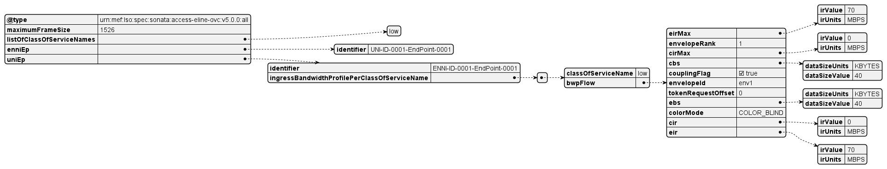

**Figure 7. Access E-Line OVC Product Shortened Configuration Example**

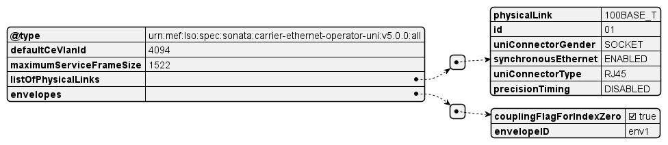

**Figure 8. Operator Carrier Ethernet UNI Product Shortened Configuration
Example**

Product specifications define several product-related and envelope-related
requirements. For example:

- for an Access E-Line OVS product two mandatory relationship roles must be
  specified, one with the operator ENNI (`CONNECTS_TO_ENNI`) and a second with
  the operator UNI (`CONNECTS_TO_UNI`).
- in the case of a `modify` action, product relationships must have the same
  value as in the `add` action. They must not be changed
- for an operator UNI product a place relationship (`INSTALL_LOCATION`) must be
  specified
- in the case of a `modify` action, place relationships must have the same value
  as in the `add` action. They must not be changed

Figure 9 presents the Access E-Line product required relations. The Access
E-Line OVC has two product relationships:

- towards ENNI - `CONNECTS_TO_ENNI`
- towards UNI - `CONNECTS_TO_UNI`

The UNI product has one place relationship pointing to `INSTALL_LOCATION`.

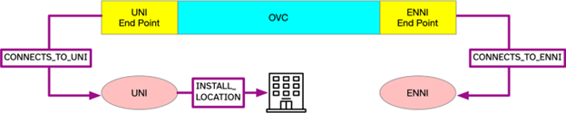

**Figure 9. Operator Carrier Ethernet UNI Product Shortened Configuration
Example**

In case, some of these requirements are violated the Seller returns an error
response to the Buyer that indicates specific functional errors. These errors
are listed in the response body (a list of `Error422` entries) for HTTP `422`
response.

## 5.6. Model Structural Validation

The structure of the HTTP payloadsis defined using:

- OpenAPI version 3.0 for product-agnostic part of the payload
- JsonSchema (draft 7) for product-specific part of the payload

**[R7]** Implementations **MUST** use payloads that conform to these
definitions.

**[R8]** The Buyer and the Seller **MUST NOT** use any operation, entity or
attribute that is not explicitly defined or allowed by this standard.

**[R9]** A product specification may define additional consistency rules and
requirements that **MUST** be respected by implementations.

These are defined for:

- required relation type, multiplicity to other items in the same quote request
- required relation type, multiplicity to entities in the Seller's product
  inventory
- related contact information roles that are to be defined at the item level
- relations to places (locations) and their roles that are to be defined at the
  item level

## 5.7. Security Considerations

There must be an authentication mechanism whereby a Seller can be assured who a
Buyer is and vice-versa. There must also be authorization mechanisms in place to
control what a particular Buyer or Seller is allowed to do and what information
may be obtained. However, the definition of the exact security mechanism and
configuration is outside the scope of this document. Security considerations are
standardized by _LSO API Security Profile_ [[MEF 128.1](#8-references)].

<div class="page"/>

# 6. API Interaction & Flows

This section provides a detailed insight into the API functionality, use cases,
and flows. First, it presents a list of business use cases and then provides
examples with a comprehensive explanation of all usage aspects.

| Use Case # | Use Case Name                          | Use Case Description                                                                                                                                                                                                                                                                                                                                                                                                                                                         |
| ---------- | -------------------------------------- | ---------------------------------------------------------------------------------------------------------------------------------------------------------------------------------------------------------------------------------------------------------------------------------------------------------------------------------------------------------------------------------------------------------------------------------------------------------------------------- |
| 1          | Retrieve Product Offering Availability | The Buyer requests a list of available Product Offering Configurations from the Seller for a specific Product Specification within the specified Delivery Context. The Seller responds to the Buyer with a list of Product Configurations meeting the Buyer's criteria and the Installation Interval for each of these. Each Product Configuration has a unique identifier that is passed to the Buyer by the Seller. This identifier is used to Retrieve Pricing and Terms. |
| 2          | Retrieve Pricing and Terms             | The Buyer requests a list of Pricing and Terms from the Seller for a specific Product Configuration Identifier within a specific Delivery Context. The Seller responds to the Buyer with a list of Pricing and Terms.                                                                                                                                                                                                                                                        |

**Table 3. Use cases description**

The detailed business requirements of each of the use cases are described in
section 8 of [[MEF110](#8-references)].

## 6.1. Use case 1: Retrieve Product Offering Availability

To send a Retrieve Product Offering Availability request the Buyer uses the
`POST /productOfferingAvailability`. The retrieve operation is performed with a
`POST` operation to allow passing complex data structure of the Delivery Context
as a request payload.

The flow is a simple request-response pattern, as presented in Figure 10:

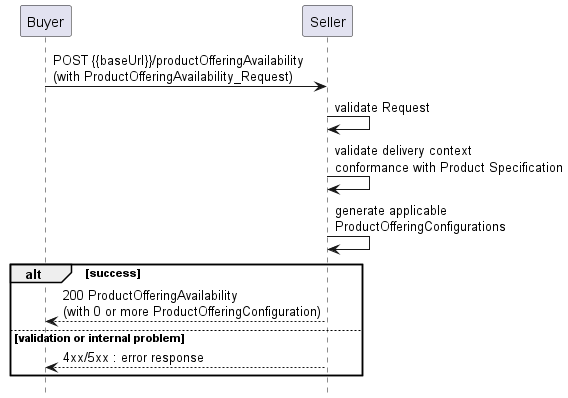

**Figure 10. Use Case 1 Flow**

This use case is similar to one defined in Product Offering Qualification
[[MEF 87](#8-references)] but is optimized for more effective discovery of
available product configurations. The Buyer provides only the Product
Specification and the Delivery Context and receives a list of available product
configurations in the response. In MEF 87 the Buyer provides one product
configuration and receives the Seller's response only for this one specific set
of attributes (if matched with available configurations). This led to many
failed requests until the Buyer got to know the possible configuration available
in the given delivery context.

For more details please refer to [[MEF 110](#8-references)], section 9.1.

Figure 11 presents the model of Use Case 1. The request uses
`ProductOfferingAvailability_Request` as the root object and the response is
provided with the use of `ProductOfferingAvailability`.

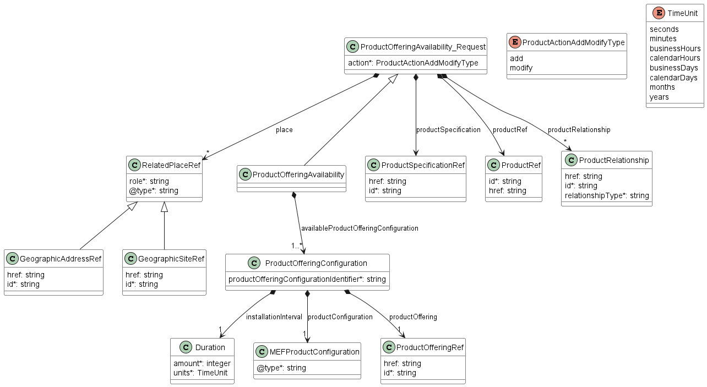

**Figure 11. Use Case 1 Product Offering Availability Model**

### 6.1.1. Request

The question that the Buyer asks with this request is "What
`availableProductOfferingConfiguration` of product of given
`productSpecification` can you provide me with given delivery context?".

The context can be provided by:

- `place` - a reference to a Geographic Address or Site where the product is to
  be installed. This applies to location-oriented products, e.g. Operator UNI.
- `productRelationship` - relation to an existing product to which the product
  being asked for references, e.g. Access E-Line OVC pointing to UNI and ENNI
  products.
- `productRef` - in case of modification request a reference to an existing
  product that is to be updated. In this case, there is no need to provide
  additional context.

The following snippet shows the body of a Product Offering Availability check
request:

`ProductOfferingAvailability_Request:`

```json
{
  "action": "add",
  "productSpecification": {
    "id": "urn:mef:lso:spec:sonata:access-eline-ovc:v5.0.0:all"
  },
  "productRelationship": [
    {
      "id": "UNI-ID-0001",
      "relationshipType": "CONNECTS_TO_UNI"
    },
    {
      "id": "ENNI-ID-0001",
      "relationshipType": "CONNECTS_TO_ENNI"
    }
  ]
}
```

The request is very simple and has only three parameters:

- `action` - to state if the Buyer is interested to `add` or `modify` a product.
- `productSpecification`: to point to product specification that is of Buyer's
  interest. For the sake of example, the `id` in the example is the `urn` as
  defined by MEF standard describing the Access E-Line. In practice, this is an
  identifier as presented by the Seller in the Product Catalog.
- `productRelationship` - to provide the delivery context. As shown in Figure 9
  Access E-Line requires 2 product relationships. Other products may require
  providing place relationship (e.g. UNI)

An example of a request for a Product that requires providing a relationship to
a place (e.g. Operaton UNI) is presented in the following snippet:

`ProductOfferingAvailability_Request:`

```json
{
  "action": "add",
  "productSpecification": {
    "id": "urn:mef:lso:spec:sonata:carrier-ethernet-operator-uni:v5.0.0:all"
  },
  "place": [
    {
      "place": {
        "@type": "GeographicAddressRef",
        "id": "GeographicAddressId-0005"
      },
      "role": "INSTALL_LOCATION"
    }
  ]
}
```

**[R10]** If `action=add`, the request **MUST** provide `productSpecification`.
[MEF110 R3]

**[R11]** If `action=add`, the request **MUST NOT** provide `productRef`.
[MEF110 R7]

**[R12]** If `action=add` and the Product Specification defines mandatory place
relations, the request **MUST** provide them (and only them) accordingly in the
`place` attribute. [MEF110 R5], [MEF110 R9]

**[R13]** When specifying the `place`, the Buyer **MUST** provide following
attributes: [MEF110 R48]

- `place`
- `role`

**[R14]** When specifying the `place`, with `GeographicSiteRef` the Buyer **MUST
NOT** additionally provide `subUnit` to describe exactly where the Buyer wants
the Product to be installed.

**[R15]** If `action=add` and the Product Specification defines mandatory
product relations, the request **MUST** provide them (and only them) accordingly
in the `productRelationship` attribute. [MEF110 R6], [MEF110 R8]

There may be cases, as explicitly allowed or defined in the Product
Specification where a Buyer cannot precisely state which installed Product a
newly installed Product will be related to because the Buyer will determine this
at the time of submitting the Product Order. The Buyer can include a list of
candidate installed Products to be validated against. An example is the ENNI for
an Access E-Line Product where the Buyer may, for example, include a list of
ENNIs between the Buyer and Seller as related Products. The Products in the list
would be expected to comply with a business rule agreed to by the Buyer and
Seller (e.g. ENNIs that are all live and all in the same Geographic Area as
defined by the Seller). In such cases multiple `productRelationships` with the
same `role` are provided by the Buyer, as in the following example. When this
happens, it is at the Seller's discretion to choose the item on the list which
is used to fulfil the request.

```json
{
  "action": "add",
  "productSpecification": {
    "id": "urn:mef:lso:spec:sonata:access-eline-ovc:v5.0.0:all"
  },
  "productRelationship": [
    {
      "id": "UNI-ID-0001",
      "relationshipType": "CONNECTS_TO_UNI"
    },
    {
      "id": "ENNI-ID-0001",
      "relationshipType": "CONNECTS_TO_ENNI"
    },
    {
      "id": "ENNI-ID-0002",
      "relationshipType": "CONNECTS_TO_ENNI"
    },
    {
      "id": "ENNI-ID-0003",
      "relationshipType": "CONNECTS_TO_ENNI"
    }
  ]
}
```

**[R16]** If `action=modify`, the request **MUST** provide `productRef`. [MEF110
R4]

**[R17]** If `action=modify`, the request **MUST NOT** provide following
attributes: [MEF110 R10]

- `place`
- `productRelationship`
- `productSpecification`

### 6.1.2. Response

The Seller performs necessary checks for the request's correctness and
compliance with provided Product Specifications and provides a response.

An example of a response to an example of a request is presented in the
following snippet.

```json
{
  "action": "add",
  "productSpecification": {
    "id": "urn:mef:lso:spec:sonata:access-eline-ovc:v5.0.0:all"
  },
  "productRelationship": [
    {
      "id": "UNI-ID-0001",
      "relationshipType": "CONNECTS_TO_UNI"
    },
    {
      "id": "ENNI-ID-0001",
      "relationshipType": "CONNECTS_TO_ENNI"
    }
  ],
  "availableProductOfferingConfiguration": [
    {
      "productOffering": {
        "id": "Access E-Line OVC - Low Class of Service"
      },
      "productOfferingConfigurationIdentifier": "POC-ID-0001",
      "productConfiguration": {
        "@type": "urn:mef:lso:spec:sonata:access-eline-ovc:v5.0.0:all",
        "maximumFrameSize": 1526,
        "listOfClassOfServiceNames": ["low"],
        "enniEp": {
          "identifier": "ENNI-ID-0001-EndPoint-0001"
        },
        "uniEp": {
          "identifier": "UNI-ID-0001-EndPoint-0001",
          "ingressBandwidthProfilePerClassOfServiceName": [
            {
              "classOfServiceName": "low",
              "bwpFlow": {
                "cir": {
                  "irValue": 0,
                  "irUnits": "MBPS"
                },
                "cirMax": {
                  "irValue": 0,
                  "irUnits": "MBPS"
                },
                "eir": {
                  "irValue": 70,
                  "irUnits": "MBPS"
                },
                "eirMax": {
                  "irValue": 70,
                  "irUnits": "MBPS"
                }
              }
            }
          ]
        }
      },
      "installationInterval": {
        "amount": 0,
        "units": "minutes"
      }
    },
    {
      "productOffering": {
        "id": "Access E-Line OVC - High Class of Service"
      },
      "productOfferingConfigurationIdentifier": "POC-ID-0002",
      "productConfiguration": {
        "@type": "urn:mef:lso:spec:sonata:access-eline-ovc:v5.0.0:all",
        "maximumFrameSize": 1526,
        "listOfClassOfServiceNames": ["high"],
        "enniEp": {
          "identifier": "ENNI-ID-0001-EndPoint-0001"
        },
        "uniEp": {
          "identifier": "UNI-ID-0001-EndPoint-0001",
          "ingressBandwidthProfilePerClassOfServiceName": [
            {
              "classOfServiceName": "high",
              "bwpFlow": {
                "cir": {
                  "irValue": 200,
                  "irUnits": "MBPS"
                },
                "cirMax": {
                  "irValue": 200,
                  "irUnits": "MBPS"
                },
                "eir": {
                  "irValue": 0,
                  "irUnits": "MBPS"
                },
                "eirMax": {
                  "irValue": 0,
                  "irUnits": "MBPS"
                }
              }
            }
          ]
        }
      },
      "installationInterval": {
        "amount": 3,
        "units": "minutes"
      }
    },
    {
      "productOffering": {
        "id": "Access E-Line OVC - High Class of Service"
      },
      "productOfferingConfigurationIdentifier": "POC-ID-0003",
      "productConfiguration": {
        "@type": "urn:mef:lso:spec:sonata:access-eline-ovc:v5.0.0:all",
        "maximumFrameSize": 1526,
        "listOfClassOfServiceNames": ["high"],
        "enniEp": {
          "identifier": "ENNI-ID-0001-EndPoint-0001"
        },
        "uniEp": {
          "identifier": "UNI-ID-0001-EndPoint-0001",
          "ingressBandwidthProfilePerClassOfServiceName": [
            {
              "classOfServiceName": "high",
              "bwpFlow": {
                "cir": {
                  "irValue": 1,
                  "irUnits": "GBPS"
                },
                "cirMax": {
                  "irValue": 1,
                  "irUnits": "GBPS"
                },
                "eir": {
                  "irValue": 0,
                  "irUnits": "MBPS"
                },
                "eirMax": {
                  "irValue": 0,
                  "irUnits": "MBPS"
                }
              }
            }
          ]
        }
      },
      "installationInterval": {
        "amount": 3,
        "units": "minutes"
      }
    }
  ]
}
```

Figure 12 presents the general structure of the response. It echoes back the
Buyer's request and provides a list of `availableProductOfferingConfiguration`.
For better readability the details of `productConfigurations` are
`"<<skipped>>"` and will be presented on further figures.

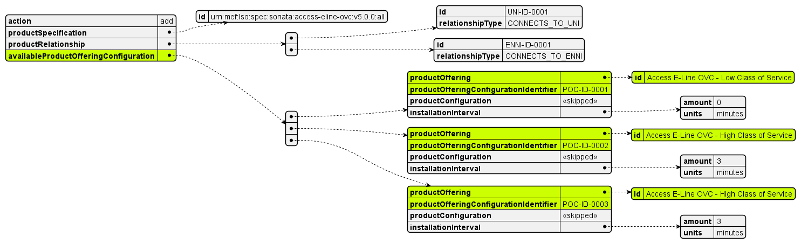

**Figure 12. Use Case 1 Response structure**

In this example, for given Delivery Context and Product Specification there are
3 `availableProductOfferingConfiguration`: 1 for
`Access E-Line OVC - Low Class of Service` Product Offering and with real time
delivery (`installationInterval.amount=0`), and 2 for
`Access E-Line OVC - High Class of Service` Product Offering with 2 different
bandwidth configurations. Each has its own distinct
`productOfferingConfigurationIdentifier`.

**_Note:_** The `productOfferingConfigurationIdentifier` identifies only the
Product Specific Attributes values as provided in the `productConfiguration`
attribute. It does not identify the action or the delivery context. This allows
to ask for Pricing Discovery of the same `productConfiguration` in different
delivery contexts.

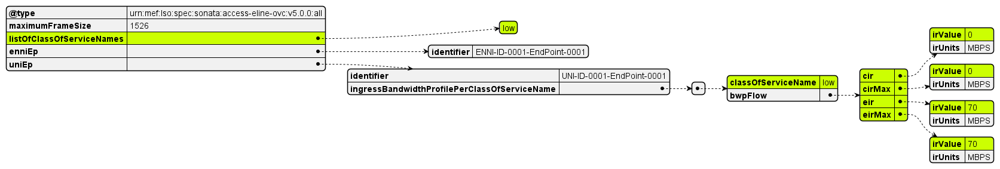

**Figure 13. UC1 Response Product Configuration 1**


**Figure 14. UC1 Response Product Configuration 2**

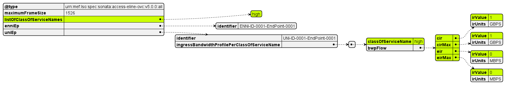

**Figure 15. UC1 Response Product Configuration 3**

Figures 13, 14, and 15 present details of product configurations and highlight
differences between them. The first one has a `low` class of service and has
`eir` and `eirMax` attributes set to `70 MBPS`. This means it offers a
best-effort bandwidth of a maximum 70 MBPS. The latter have a `high` class of
service. The second one has the `cir` and `cirMax` set to `200 MBPS` thus
offering a guaranteed bandwidth of `200 MBPS`, while the third one offers
`1GBPS` of guaranteed bandwidth.

**[R18]** The Seller **MUST** echo back the attributes of the Buyer's Product
Offering Availability request. [MEF110 R12]

**[R19]** The Seller **MUST NOT** return a response that contains
`productOfferingConfigurations` that differ only by `installationInterval` (in
which all other attributes are the same). [MEF110 R13]

In other words - the Seller is expected to provide only the shortest possible
`installationInterval` per given `productConfiguration`.

**[R20]** If the request is successful, the response given by the Seller
**MUST** include a list of zero or more `availableProductOfferingConfiguration`.
[MEF110 R14]

**[R21]** If the request is unsuccessful or fails validation, the Seller
**MUST** return an `Error` response with the appropriate Error Code. [MEF110
R15], [MEF110 R16]

**[R22]** For each returned `ProductOfferingConfiguration` the Seller **MUST**
include following attributes: [MEF110 R17], [MEF110 R18], [MEF110 R21], [MEF110
R20]

- `installationInterval`
- `productOffering`
- `productConfiguration`
- `productOfferingConfigurationIdentifier`

**[R23]** Every returned `productOfferingConfigurationIdentifier` **MUST**
uniquely identify a `ProductOfferingConfiguration` within the Seller. [MEF110
R17]

**[R24]** Every returned `productOfferingConfigurationIdentifier` **MUST** be
valid for Pricing Discovery request for a period of at least 15 minutes. [MEF110
R23]

**[R25]** Every returned `productConfiguration` **MUST** contain only attributes
specified by Product Specification and agreed to by the Buyer and Seller during
the onboarding. [MEF110 R19], [MEF110 R20]

## 6.2. Use case 2: Retrieve Pricing for a Product Offering Configuration

This Use Case allows the Buyer to perform a Pricing Discovery (ask for Pricing
and Terms) for a specific Product Configuration identified by
`productOfferingConfigurationIdentifier` (most probably) obtained in the
previous Use Case.

This can be done with the use of the `POST /pricingDiscovery` operation. The
retrieve operation is performed with a `POST` operation to allow passing the
complex data structure of the Delivery Context as a request payload.

The flow is a simple request-response pattern, as presented in Figure 16:

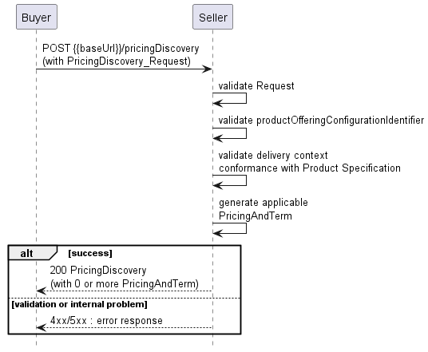

**Figure 16. Pricing Discovery Flow**

This use case is similar to one defined in Quote API [[MEF 115](#8-references)]
but is optimized for more effective discovery of available pricing and terms.
The Buyer provides only the `productOfferingConfigurationIdentifier` and the
Delivery Context and receives a list of available pricings and terms in the
response. In MEF 115 the Buyer provides one full product configuration (by
value) and term and receives the Seller's response only for this one specific
combination (if matched with available configurations). This requires a request
per each term, assuming the Buyer knows exactly what are the available terms, or
a set of tries until the Buyer discovers all available terms.

Figure 17 presents the model of Use Case 1. The request uses
`PricingDiscovery_Request` as the root object and the response is provided with
use of `PricingDiscovery`.

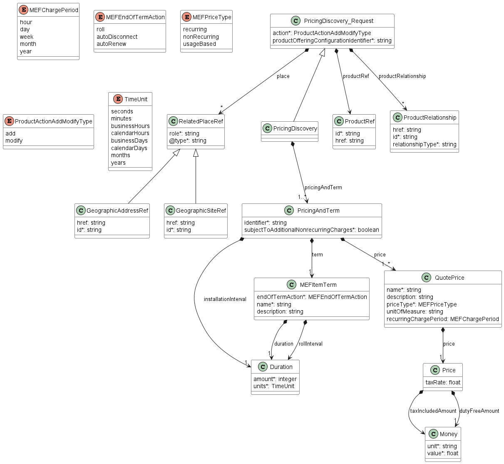

**Figure 17. Use Case 2 Pricing Discovery Model**

### 6.2.1. Request

The question that the Buyer asks with this request is "What `PricingAndTerms`
for a `productOfferingConfigurationIdentifier` can you provide me with given
delivery context?".

The rules of providing the delivery context are the same as described in Use
Case 1.

The following snippet shows the body of a Price Discovery request:

`PriceDiscovery_Request:`

```json
{
  "action": "add",
  "productRelationship": [
    {
      "id": "UNI-ID-0001",
      "relationshipType": "CONNECTS_TO_UNI"
    },
    {
      "id": "ENNI-ID-0001",
      "relationshipType": "CONNECTS_TO_ENNI"
    }
  ],
  "productOfferingConfigurationIdentifier": "POC-ID-0002"
}
```

The request is very simple and has only three parameters:

- `action` - to state if the Buyer wishes to `add` or `modify` a product.
- `productOfferingConfigurationIdentifier`- to refer to Product Offering
  Configuration that the Buyer is willing to price
- `productRelationship` - to provide the delivery context. As shown on Figure 9
  Access E-Line requires 2 product relationships. Other products may require
  providing place relationship (e.g. UNI)

**[R26]** The request **MUST** provide: [MEF110 R26], [MEF110 R28]

- `productOfferingConfigurationIdentifier`
- `action`

**[R27]** If `action=add` and the Product Specification (derived from
`productOfferingConfigurationIdentifier`) defines mandatory place relations, the
request **MUST** provide them (and only them) accordingly in the `place`
attribute. [MEF110 R26], [MEF110 R30]

**[R28]** If `action=add` and the Product Specification (derived from
`productOfferingConfigurationIdentifier`) defines mandatory product relations,
the request **MUST** provide them (and only them) accordingly in the
`productRelationship` attribute. [MEF110 R26], [MEF110 R31]

**[R29]** If `action=add`, the request **MUST NOT** provide `productRef`.
[MEF110 R27]

**[R30]** If `action=modify`, the request **MUST** additionaly provide
`productRef`. [MEF110 R28]

**[R31]** If `action=modify`, the request **MUST NOT** provide: [MEF110 R29]

- `place`
- `productRelationship`

### 6.2.2. Response

The Seller performs necessary checks for the request's correctness, compliance
with provided Product Specification, and
`productOfferingConfigurationIdentifier` validity and then provides a response.

An example of a response to an example of a request is presented in the
following snippet:

```json
{
  "action": "add",
  "productRelationship": [
    {
      "id": "UNI-ID-0001",
      "relationshipType": "CONNECTS_TO_UNI"
    },
    {
      "id": "ENNI-ID-0001",
      "relationshipType": "CONNECTS_TO_ENNI"
    }
  ],
  "productOfferingConfigurationIdentifier": "POC-ID-0002",
  "pricingAndTerm": [
    {
      "term": {
        "duration": {
          "amount": 12,
          "units": "months"
        },
        "endOfTermAction": "roll",
        "name": "1-year term",
        "rollInterval": {
          "amount": 1,
          "units": "months"
        }
      },
      "validFor": {
        "startDateTime": "2023-06-02T12:24:48.687Z",
        "endDateTime": "2023-06-09T12:24:48.687Z"
      },
      "subjectToAdditionalNonrecurringCharges": false,
      "price": [
        {
          "price": {
            "taxRate": 10,
            "taxIncludedAmount": {
              "unit": "EUR",
              "value": 110
            },
            "dutyFreeAmount": {
              "unit": "EUR",
              "value": 100
            }
          },
          "name": "Monthly price for a 1-year subscription",
          "priceType": "recurring",
          "recurringChargePeriod": {
            "amount": 1,
            "units": "calendarMonths"
          }
        }
      ],
      "firm": true,
      "installationInterval": {
        "amount": 3,
        "units": "minutes"
      }
    },
    {
      "term": {
        "duration": {
          "amount": 36,
          "units": "months"
        },
        "endOfTermAction": "roll",
        "name": "3-year term",
        "rollInterval": {
          "amount": 1,
          "units": "months"
        }
      },
      "validFor": {
        "startDateTime": "2023-06-02T12:24:48.687Z",
        "endDateTime": "2023-06-09T12:24:48.687Z"
      },
      "subjectToAdditionalNonrecurringCharges": false,
      "price": [
        {
          "price": {
            "taxRate": 10,
            "taxIncludedAmount": {
              "unit": "EUR",
              "value": 88
            },
            "dutyFreeAmount": {
              "unit": "EUR",
              "value": 80
            }
          },
          "name": "Monthly price for a 3-year subscription",
          "priceType": "recurring",
          "recurringChargePeriod": {
            "amount": 1,
            "units": "calendarMonths"
          }
        }
      ],
      "firm": true,
      "installationInterval": {
        "amount": 3,
        "units": "minutes"
      }
    }
  ]
}
```

Figure 18 presents the Seller's response. It echoes back the Buyer's request and
provides a list of `pricingAndTerm`. In this example in the given Delivery
Context and `productOfferingConfigurationIdentifier` the Seller has two possible
`PricingAndTerm`. Differences between them are highlighted. The first one is for
a 1-year contract with a 110 EUR monthly rate, the other is for a 3-year
contract with a 88 EUR monthly rate. Each has its own distinct `identifier`.

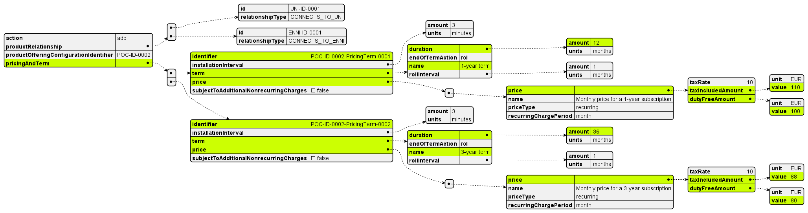

**Figure 18. Use Case 2 Response**

**[R32]** If the request is unsuccessful or fails validation, the Seller
**MUST** return an `Error` response with the appropriate Error Code. [MEF110
R35]

**[R33]** If the `productOfferingConfigurationIdentifier` has expired, the
Seller **MUST** return an error. [MEF110 R33]

**[R34]** The Seller **MUST** echo back the attributes of the Buyer's Pricing
Discovery request. [MEF110 R34]

**[R35]** If the request is successful, the response given by the Seller
**MUST** include a list of zero or more `pricingAndTerm` items. [MEF110 R36]

**[R36]** For each returned `PricingAndTerm` the Seller **MUST** include
following attributes: [MEF110 R39]

- `identifier`
- `term`
- `price`
- `subjectToAdditionalNonrecurringCharges`
- `installationInterval`

**[R37]** When providing `MEFItemTerm`, following attributes **MUST** be
included: [MEF110 R39]

- `duration`
- `endOfTermAction`

**[R38]** Once assigned `PricingAndTerm.identifier` **MUST** be be unique within
the Seller's system. [MEF110 R45]

**[R39]** `PricingAndTerm` provided by the Seller **MUST** be valid for at least
15 minutes. [MEF110 R42]

**[R40]** If the `installationInterval` is 0 (immediate) the
`subjectToAdditionalNonrecurringCharges` **MUST** be set to `false`. [MEF110
R43]

The `subjectToAdditionalNonrecurringCharges` attribute is used to indicate
additional construction costs or other one-time costs that are not known may be
added during fulfillment. This is managed through the Charge Process in the
Product Order Process.

If the `subjectToAdditionalNonrecurringCharges` attribute value is `false`, then
this is equivalent to the Firm value in MEF 115, which means that all specified
monthly recurring Charges and non-recurring Charges are committed. If the
`subjectToAdditionalNonrecurringCharges` attribute value of the flag is `true`,
then this is equivalent to the Subject to Feasibility Check value in MEF 115 and
states that provided monthly recurring charges are final but non-recurring
charges are subject to change during fulfillment.

**[R41]** If the `term.endOfTermAction` is set to `roll` the Seller **MUST**
provide the `term.rollInterval` attribute. [MEF110 R40]

**[R42]** If the `term.endOfTermAction` is set to `autoDisconnect` or
`autoRenew` the Seller **MUST NOT** provide the `term.rollInterval` attribute.
[MEF110 R41]

**[R43]** If a Seller has returned multiple
`productOfferingConfigurationIdentifiers` to the Buyer in different Product
Offering Availability responses that refer to the same `productConfiguration`
values, then the Seller **MUST** return the same response to a Pricing Discovery
request for a given delivery context that contains any of those
`productOfferingConfigurationIdentifiers` that are within their validity period.
[MEF110 R38]

[R43] means that a Retrieve Pricing and Terms request for a given Delivery
Context and a given `productConfiguration` values always returns the same result
regardless of which `productOfferingConfigurationIdentifier` is used to refer to
that `ProductOfferingConfiguration`. In particular, this is the case even if the
`productOfferingConfigurationIdentifier` was originally returned to the Buyer in
an Availability Discovery response for a different Delivery Context.

The following requirements apply to every item returned in the `price` list of
the response.

**[R44]** The Seller **MUST** provide at least one `price` item of
`priceType=recurring` if a recurring charge applies. [MEF80 R55]

**[R45]** For each provided `price` item (`QuotePrice`) the Seller **MUST**
include the following attributes: [MEF80 R55]

- `name`
- `priceType`
- `price`

**[R46]** The `recurringChargePeriod` **MUST** only be provided if the
`priceType` is `recurring`. [MEF80 R56]

**[R47]** The `unitOfMeasure` **MUST** only be provided if the `priceType` is
`usageBased`. [MEF80 R57]

Table 4 shows the combination of attributes that must be provided for each
`priceType`:

| `priceType`    | `recurringChargePeriod` | `unitOfMeasure` | `price.dutyFreeAmount` | Comments                                                 |
| -------------- | ----------------------- | --------------- | ---------------------- | -------------------------------------------------------- |
| `recurring`    | X                       |                 | X                      |                                                          |
| `nonRecurring` |                         |                 | X                      |                                                          |
| `usageBased`   |                         | X               | X                      | `price.dutyFreeAmount` is the charge per `unitOfMeasure` |

**Table 4. Price Type Required Information**

<div class="page"/>

# 7. API Details

## 7.1. API patterns

### 7.1.1. Indicating errors

Erroneous situations are indicated by appropriate HTTP responses. An error
response is indicated by HTTP status 4xx (for client errors) or 5xx (for server
errors) and appropriate response payload. The Product Order API uses the error
responses as depicted and described below.

Implementations can use HTTP error codes not specified in this standard in
compliance with rules defined in RFC 7231 [[RFC7231](#8-references)]. In such a
case, the error message body structure might be aligned with the `Error`.

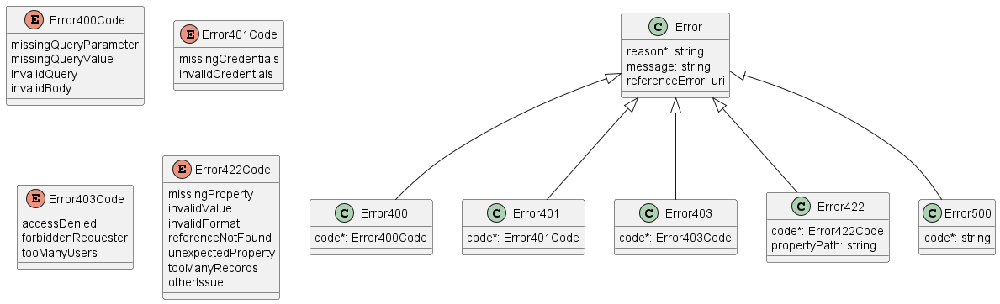

**Figure 19. Data model types to represent an erroneous response**

#### 7.1.1.1. Type Error

**Description:** Standard Class used to describe API response error Not intended
to be used directly. The `code` in the HTTP header is used as a discriminator
for the type of error returned in runtime.

<table id="T_Error">
    <thead style="font-weight:bold;">
        <tr>
            <td>Name</td>
            <td>Type</td>
            <td>Description</td>
        </tr>
    </thead>
    <tbody>
        <tr>
            <td>reason*</td>
            <td>string<br/><span style="font-size:10px;font-style:italic">maxLength = 255</span></td>
            <td>Text that explains the reason for the error. This can be shown to a client user.</td>
        </tr><tr>
            <td>message</td>
            <td>string</td>
            <td>Text that provides mode details and corrective actions related to the error. This can be shown to a client user.</td>
        </tr><tr>
            <td>referenceError</td>
            <td>uri<br/><span style="font-size:10px;font-style:italic">format = uri</span></td>
            <td>URL pointing to documentation describing the error</td>
        </tr>
    </tbody>
</table>

#### 7.1.1.2. Type Error400

**Description:** Bad Request.
(https://tools.ietf.org/html/rfc7231#section-6.5.1)

Inherits from:

- <a href="#T_Error">Error</a>

<table id="T_Error400">
    <thead style="font-weight:bold;">
        <tr>
            <td>Name</td>
            <td>Type</td>
            <td>Description</td>
        </tr>
    </thead>
    <tbody>
        <tr>
            <td>code*</td>
            <td><a href="#T_Error400Code">Error400Code</a></td>
            <td>One of the following error codes:</br>
- missingQueryParameter: The URI is missing a required query-string parameter</br>
- missingQueryValue: The URI is missing a required query-string parameter value</br>
- invalidQuery: The query section of the URI is invalid.</br>
- invalidBody: The request has an invalid body</td>
        </tr>
    </tbody>
</table>

#### 7.1.1.3. `enum` Error400Code

**Description:** One of the following error codes:

- missingQueryParameter: The URI is missing a required query-string parameter
- missingQueryValue: The URI is missing a required query-string parameter value
- invalidQuery: The query section of the URI is invalid.
- invalidBody: The request has an invalid body

#### 7.1.1.4. Type Error401

**Description:** Unauthorized. (https://tools.ietf.org/html/rfc7235#section-3.1)

Inherits from:

- <a href="#T_Error">Error</a>

<table id="T_Error401">
    <thead style="font-weight:bold;">
        <tr>
            <td>Name</td>
            <td>Type</td>
            <td>Description</td>
        </tr>
    </thead>
    <tbody>
        <tr>
            <td>code*</td>
            <td><a href="#T_Error401Code">Error401Code</a></td>
            <td>One of the following error codes:</br>
- missingCredentials: No credentials provided.</br>
- invalidCredentials: Provided credentials are invalid or expired</td>
        </tr>
    </tbody>
</table>

#### 7.1.1.5. `enum` Error401Code

**Description:** One of the following error codes:

- missingCredentials: No credentials provided.
- invalidCredentials: Provided credentials are invalid or expired

#### 7.1.1.6. Type Error403

**Description:** Forbidden. This code indicates that the server understood the
request but refuses to authorize it.
(https://tools.ietf.org/html/rfc7231#section-6.5.3)

Inherits from:

- <a href="#T_Error">Error</a>

<table id="T_Error403">
    <thead style="font-weight:bold;">
        <tr>
            <td>Name</td>
            <td>Type</td>
            <td>Description</td>
        </tr>
    </thead>
    <tbody>
        <tr>
            <td>code*</td>
            <td><a href="#T_Error403Code">Error403Code</a></td>
            <td>This code indicates that the server understood
the request but refuses to authorize it because
of one of the following error codes:</br>
- accessDenied: Access denied</br>
- forbiddenRequester: Forbidden requester</br>
- tooManyUsers: Too many users</td>
        </tr>
    </tbody>
</table>

#### 7.1.1.7. `enum` Error403Code

**Description:** This code indicates that the server understood the request but
refuses to authorize it because of one of the following error codes:

- accessDenied: Access denied
- forbiddenRequester: Forbidden requester
- tooManyUsers: Too many users

#### 7.1.1.8. Type Error422

**Description:** Unprocessable entity due to a business validation problem.
(https://tools.ietf.org/html/rfc4918#section-11.2)

Inherits from:

- <a href="#T_Error">Error</a>

<table id="T_Error422">
    <thead style="font-weight:bold;">
        <tr>
            <td>Name</td>
            <td>Type</td>
            <td>Description</td>
        </tr>
    </thead>
    <tbody>
        <tr>
            <td>code*</td>
            <td><a href="#T_Error422Code">Error422Code</a></td>
            <td>One of the following error codes:</br>
  - missingProperty: The property the Seller has expected is not present in the payload</br>
  - invalidValue: The property has an incorrect value</br>
  - invalidFormat: The property value does not comply with the expected value format</br>
  - referenceNotFound: The object referenced by the property cannot be identified in the Seller system</br>
  - unexpectedProperty: Additional property, not expected by the Seller has been provided</br>
  - tooManyRecords: the number of records to be provided in the response exceeds the Seller&#x27;s threshold.</br>
  - otherIssue: Other problem was identified (detailed information provided in a reason)</br>
</td>
        </tr><tr>
            <td>propertyPath</td>
            <td>string</td>
            <td>A pointer to a particular property of the payload that caused the validation issue. It is highly recommended that this property should be used.
Defined using JavaScript Object Notation (JSON) Pointer (https://tools.ietf.org/html/rfc6901).
</td>
        </tr>
    </tbody>
</table>

#### 7.1.1.9. `enum` Error422Code

**Description:** One of the following error codes:

- missingProperty: The property the Seller has expected is not present in the
  payload
- invalidValue: The property has an incorrect value
- invalidFormat: The property value does not comply with the expected value
  format
- referenceNotFound: The object referenced by the property cannot be identified
  in the Seller system
- unexpectedProperty: Additional property, not expected by the Seller has been
  provided
- tooManyRecords: the number of records to be provided in the response exceeds
  the Seller's threshold.
- otherIssue: Other problem was identified (detailed information provided in a
  reason)

#### 7.1.1.10. Type Error500

**Description:** Internal Server Error.
(https://tools.ietf.org/html/rfc7231#section-6.6.1)

Inherits from:

- <a href="#T_Error">Error</a>

<table id="T_Error500">
    <thead style="font-weight:bold;">
        <tr>
            <td>Name</td>
            <td>Type</td>
            <td>Description</td>
        </tr>
    </thead>
    <tbody>
        <tr>
            <td>code*</td>
            <td>string</td>
            <td>The following error code:</br>
- internalError: Internal server error - the server encountered an unexpected condition that prevented it from fulfilling the request.</td>
        </tr>
    </tbody>
</table>

## 7.2. API Data model

### 7.2.1. Product Offering Availability

#### 7.2.1.1. Type ProductOfferingAvailability_Request

**Description:** Product Offering Availability Request allows the Buyer to
provide the action, delivery context, and Product Specification to ask the
Seller to provide a list of available Product Offering Configurations.

<table id="T_ProductOfferingAvailability_Request" style="width:100%">
    <thead style="font-weight:bold">
        <tr>
            <td>Name</td>
            <td style="width:15%">Type</td>
            <td>M/O</td>
            <td>Description</td>
            <td>MEF 110</td>
        </tr>
    </thead>
    <tbody>
        <tr>
        <td>action</td>
            <td><a href="#T_ProductActionAddModifyType">ProductActionAddModifyType</a></td>
            <td>M</td>
            <td>The action to be performed by the Seller to fulfill any Product Order that results from this interaction.</td>
            <td>Action</td>
        </tr><tr>
        <td>productSpecification</td>
            <td><a href="#T_ProductSpecificationRef">ProductSpecificationRef</a></td>
            <td>O</td>
            <td>A reference to a Product Specification used to describe the Product. This MUST be provided when the &#x60;action&#x60; is &#x60;add&#x60;. It MUST NOT be provided when the &#x60;action&#x60; &#x3D; &#x60;modify&#x60;</td>
            <td>Product Specification Identifier</td>
        </tr><tr>
        <td>productRef</td>
            <td><a href="#T_ProductRef">ProductRef</a></td>
            <td>O</td>
            <td>A reference to a Product in the Product Inventory. It MUST NOT be provided when the &#x60;action&#x60; &#x3D; &#x60;add&#x60;. It MUST be provided when the &#x60;action&#x60; &#x3D; &#x60;modify&#x60;.
</td>
            <td>Product Identifier</td>
        </tr><tr>
        <td>productRelationship</td>
            <td><a href="#T_ProductRelationship">ProductRelationship</a>[]</td>
            <td>O</td>
            <td>A list of Product Relationships as defined by the Product Specification. It MUST be provided when the &#x60;action&#x60; &#x3D; &#x60;add&#x60;. It MUST NOT be provided when the &#x60;action&#x60; &#x3D; &#x60;modify&#x60;</td>
            <td>Product Relationships</td>
        </tr><tr>
        <td>place</td>
            <td><a href="#T_RelatedPlaceRefWithSubUnit">RelatedPlaceRefWithSubUnit</a>[]</td>
            <td>O</td>
            <td>A list of Geographic Addresses or Sites and their roles in relation to the Product. It MUST be provided when the &#x60;action&#x60; &#x3D; &#x60;add&#x60;. It MUST NOT be provided when the &#x60;action&#x60; &#x3D; &#x60;modify&#x60;</td>
            <td>Place Relationships</td>
        </tr>
    </tbody>
</table>

#### 7.2.1.2. Type ProductOfferingAvailability

**Description:** Product Offering Availability allows the Seller to provide a
list of Product Offering Configurations matching action, delivery context and
Product Specification provided by the Buyer

Inherits from:

- <a href="#T_ProductOfferingAvailability_Request">ProductOfferingAvailability_Request</a>

<table id="T_ProductOfferingAvailability" style="width:100%">
    <thead style="font-weight:bold">
        <tr>
            <td>Name</td>
            <td style="width:15%">Type</td>
            <td>M/O</td>
            <td>Description</td>
            <td>MEF 110</td>
        </tr>
    </thead>
    <tbody>
        <tr>
        <td>availableProductOfferingConfiguration</td>
            <td><a href="#T_ProductOfferingConfiguration">ProductOfferingConfiguration</a>[]<br/><span style="font-size:10px;font-style:italic">minItems = 0</span></td>
            <td>M</td>
            <td>The list of available Product Offering Configurations</td>
            <td>Available Product Offering Configurations</td>
        </tr>
    </tbody>
</table>

#### 7.2.1.3. Type ProductOfferingConfiguration

**Description:** Allows the Seller to provide detailed information of the
Product Configuration matching Buyer's Product Offering Availability Request.

<table id="T_ProductOfferingConfiguration" style="width:100%">
    <thead style="font-weight:bold">
        <tr>
            <td>Name</td>
            <td style="width:15%">Type</td>
            <td>M/O</td>
            <td>Description</td>
            <td>MEF 110</td>
        </tr>
    </thead>
    <tbody>
        <tr>
        <td>productOffering</td>
            <td><a href="#T_ProductOfferingRef">ProductOfferingRef</a></td>
            <td>M</td>
            <td>The identifier of the Product Offering for which this Product Configurationn is valid.
</td>
            <td>Product Offering Identifier</td>
        </tr><tr>
        <td>productConfiguration</td>
            <td><a href="#T_MEFProductConfiguration">MEFProductConfiguration</a></td>
            <td>M</td>
            <td>The set of technical attributes for the Product Offering that make this configuration unique. This essentially specifies the values for attributes defined in the Product Offering.</td>
            <td>Product Specific Attributes</td>
        </tr><tr>
        <td>productOfferingConfigurationIdentifier</td>
            <td>string</td>
            <td>M</td>
            <td>An identifier of the returned &#x60;productConfiguration&#x60; that can be used in the next step for Pricing Discovery
</td>
            <td>Product Offering Configuration Identifier</td>
        </tr><tr>
        <td>installationInterval</td>
            <td><a href="#T_Duration">Duration</a></td>
            <td>M</td>
            <td>The indicative duration (&gt;&#x3D;0) for the delivery of the configuration in the specified Delivery Context. The shortest possible interval is specified by the Seller. It is not considered a commitment by the Seller.
</td>
            <td>Installation Interval</td>
        </tr>
    </tbody>
</table>

#### 7.2.1.4. Type ProductOfferingRef

**Description:** A reference to a Product Offering offered by the Seller to the
Buyer.

<table id="T_ProductOfferingRef" style="width:100%">
    <thead style="font-weight:bold">
        <tr>
            <td>Name</td>
            <td style="width:15%">Type</td>
            <td>M/O</td>
            <td>Description</td>
            <td>MEF 110</td>
        </tr>
    </thead>
    <tbody>
        <tr>
        <td>href</td>
            <td>string</td>
            <td>O</td>
            <td>Hyperlink to a Product Offering in the Seller catalog. In case the Seller is not providing a catalog API this field is not used. The catalog is provided by the Seller to the Buyer during onboarding. Hyperlink MAY be used by the Seller in responses   Hyperlink MUST be ignored by the Seller in case it is provided by the Buyer in a request.
</td>
            <td>Not represented in MEF 110</td>
        </tr><tr>
        <td>id</td>
            <td>string</td>
            <td>M</td>
            <td>id of a Product Offering. It is assigned by the Seller. The Buyer and the Seller exchange information about offerings&#x27; ids during the onboarding process.</td>
            <td>Product Offering Identifier</td>
        </tr>
    </tbody>
</table>

#### 7.2.1.5. Type MEFProductConfiguration

**Description:** MEFProductConfiguration is used as an extension point for MEF
specific product/service payload. The `@type` attribute is used as a
discriminator

<table id="T_MEFProductConfiguration" style="width:100%">
    <thead style="font-weight:bold">
        <tr>
            <td>Name</td>
            <td style="width:15%">Type</td>
            <td>M/O</td>
            <td>Description</td>
            <td>MEF 110</td>
        </tr>
    </thead>
    <tbody>
        <tr>
        <td>@type</td>
            <td>string</td>
            <td>M</td>
            <td>The name of the type that uniquely identifies the type of the product that is the subject of the POQ Request. In the case of MEF product this is the URN provided in the Product Specification.</td>
            <td>Not represented in MEF 110</td>
        </tr>
    </tbody>
</table>

#### 7.2.1.6. Type ProductSpecificationRef

**Description:** A reference to a structured set of well-defined technical
attributes and/or behaviors that are used to construct a Product Offering for
sale to a market.

<table id="T_ProductSpecificationRef" style="width:100%">
    <thead style="font-weight:bold">
        <tr>
            <td>Name</td>
            <td style="width:15%">Type</td>
            <td>M/O</td>
            <td>Description</td>
            <td>MEF 110</td>
        </tr>
    </thead>
    <tbody>
        <tr>
        <td>href</td>
            <td>string</td>
            <td>O</td>
            <td>Hyperlink to a Product Specification in the seller&#x27;s catalog. In case Seller is not providing a catalog API this field is not used. The catalog is provided by the Seller to the Buyer during onboarding. Hyperlink MAY be used by the Seller in responses. Hyperlink MUST be ignored by the Seller in case it is provided by the Buyer in a request.
</td>
            <td>Not represented in MEF 110</td>
        </tr><tr>
        <td>id</td>
            <td>string</td>
            <td>M</td>
            <td>Unique identifier of the Product Specification</td>
            <td>Product Specification Identifier</td>
        </tr>
    </tbody>
</table>

### 7.2.2. Pricing Discovery

#### 7.2.2.1. Type PricingDiscovery_Request

**Description:** A set of attributes common to PricingDiscovery_Request and
PricingDiscovery

<table id="T_PricingDiscovery_Request" style="width:100%">
    <thead style="font-weight:bold">
        <tr>
            <td>Name</td>
            <td style="width:15%">Type</td>
            <td>M/O</td>
            <td>Description</td>
            <td>MEF 110</td>
        </tr>
    </thead>
    <tbody>
        <tr>
        <td>action</td>
            <td><a href="#T_ProductActionAddModifyType">ProductActionAddModifyType</a></td>
            <td>M</td>
            <td>The action to be performed by the Seller to fulfill any Order that results from this interaction.</td>
            <td>Action</td>
        </tr><tr>
        <td>productOfferingConfigurationIdentifier</td>
            <td>string</td>
            <td>M</td>
            <td>The identifier for the Product Offering Configuration that the Pricing Discovery is being requested for.
</td>
            <td>Product Offering Configuration Identifier</td>
        </tr><tr>
        <td>productRef</td>
            <td><a href="#T_ProductRef">ProductRef</a></td>
            <td>O</td>
            <td>A reference to a Product in the Product Inventory. It MUST NOT be provided when the &#x60;action&#x60; &#x3D; &#x60;add&#x60;. It MUST be provided when the &#x60;action&#x60; &#x3D; &#x60;modify&#x60;.</td>
            <td>Product Identifier</td>
        </tr><tr>
        <td>productRelationship</td>
            <td><a href="#T_ProductRelationship">ProductRelationship</a>[]</td>
            <td>O</td>
            <td>A list of Product Relationships as defined by the Product Specification. It MUST be provided when the &#x60;action&#x60; &#x3D; &#x60;add&#x60;. It MUST NOT be provided when the &#x60;action&#x60; &#x3D; &#x60;modify&#x60;</td>
            <td>Product Relationships</td>
        </tr><tr>
        <td>place</td>
            <td><a href="#T_RelatedPlaceRefWithSubUnit">RelatedPlaceRefWithSubUnit</a>[]</td>
            <td>O</td>
            <td>A list of Geographic Addresses or Sites and their roles with relation to the Product. It MUST be provided when the &#x60;action&#x60; &#x3D; &#x60;add&#x60;. It MUST NOT be provided when the &#x60;action&#x60; &#x3D; &#x60;modify&#x60;</td>
            <td>Place Relationships</td>
        </tr>
    </tbody>
</table>

#### 7.2.2.2. Type PricingDiscovery

**Description:** PricingDiscovery allows the Seller to provide the list of
Pricing and Terms matching action, delivery context, and Product Configuration
Identifier provided by the Buyer

Inherits from:

- <a href="#T_PricingDiscovery_Request">PricingDiscovery_Request</a>

<table id="T_PricingDiscovery" style="width:100%">
    <thead style="font-weight:bold">
        <tr>
            <td>Name</td>
            <td style="width:15%">Type</td>
            <td>M/O</td>
            <td>Description</td>
            <td>MEF 110</td>
        </tr>
    </thead>
    <tbody>
        <tr>
        <td>pricingAndTerm</td>
            <td><a href="#T_PricingAndTerm">PricingAndTerm</a>[]</td>
            <td>M</td>
            <td>A set of contract terms and corresponding prices available for a given Product Configuration considering the Delivery Context.</td>
            <td>Product Offering Configuration Pricing and Terms</td>
        </tr>
    </tbody>
</table>

#### 7.2.2.3. Type PricingAndTerm

**Description:** An option for price and term available to a Buyer for a Product
Configuration with a specific Delivery Context

<table id="T_PricingAndTerm" style="width:100%">
    <thead style="font-weight:bold">
        <tr>
            <td>Name</td>
            <td style="width:15%">Type</td>
            <td>M/O</td>
            <td>Description</td>
            <td>MEF 110</td>
        </tr>
    </thead>
    <tbody>
        <tr>
        <td>identifier</td>
            <td>string</td>
            <td>M</td>
            <td>The identifier of the Pricing and Term.</td>
            <td>Product Offering Configuration Pricing and Term Identifier</td>
        </tr><tr>
        <td>installationInterval</td>
            <td><a href="#T_Duration">Duration</a></td>
            <td>M</td>
            <td>The indicative duration &gt;&#x3D;0 for the delivery of the configuration in the specified Delivery Context when manual work is required. The shortest interval is specified by the Seller. It is not considered a commitment by the Seller. A value of 0 indicates immediate installation.
</td>
            <td>Installation Interval</td>
        </tr><tr>
        <td>term</td>
            <td><a href="#T_MEFItemTerm">MEFItemTerm</a></td>
            <td>M</td>
            <td>The minimum length of the commitment for this PricingAndTerm for the given &#x60;productOfferingConfigurationIdentifier&#x60; within the requested Delivery Context.</td>
            <td>Term</td>
        </tr><tr>
        <td>price</td>
            <td><a href="#T_QuotePrice">QuotePrice</a>[]<br/><span style="font-size:10px;font-style:italic">minItems = 1</span></td>
            <td>M</td>
            <td>The prices that apply to this PricingAndTerm for the given Product Offering Configuration within the requested Delivery Context.</td>
            <td>Prices</td>
        </tr><tr>
        <td>subjectToAdditionalNonrecurringCharges</td>
            <td>boolean</td>
            <td>M</td>
            <td>An indicator to inform the Buyer that additional non-recurring charges may be added during fulfillment.</td>
            <td>Subject to Additional Non-recurring Charges</td>
        </tr>
    </tbody>
</table>

#### 7.2.2.4. Type QuotePrice

**Description:** Description of price and discount awarded

<table id="T_QuotePrice" style="width:100%">
    <thead style="font-weight:bold">
        <tr>
            <td>Name</td>
            <td style="width:15%">Type</td>
            <td>M/O</td>
            <td>Description</td>
            <td>MEF 110</td>
        </tr>
    </thead>
    <tbody>
        <tr>
        <td>unitOfMeasure</td>
            <td>string</td>
            <td>O</td>
            <td>Unit of Measure if price depending on it (Gb, SMS volume, etc..) MEF: if Quote Item Price Type equals usageBased</td>
            <td>Quote Item Price Unit of Measure</td>
        </tr><tr>
        <td>price</td>
            <td><a href="#T_Price">Price</a></td>
            <td>M</td>
            <td>The associated price</td>
            <td>Quote Item Price Amount</td>
        </tr><tr>
        <td>name</td>
            <td>string</td>
            <td>M</td>
            <td>Name of the quote/quote item price</td>
            <td>Quote Item Price Name</td>
        </tr><tr>
        <td>priceType</td>
            <td><a href="#T_MEFPriceType">MEFPriceType</a></td>
            <td>M</td>
            <td>Indicates if the price is for recurring, non-recurring, or usage based charges</td>
            <td>Quote Item Price Type</td>
        </tr><tr>
        <td>description</td>
            <td>string</td>
            <td>O</td>
            <td>Description of the quote/quote item price</td>
            <td>Quote Item Price Description</td>
        </tr><tr>
        <td>recurringChargePeriod</td>
            <td><a href="#T_Duration">Duration</a></td>
            <td>O</td>
            <td>Used for a recurring charge to indicate a period</td>
            <td>Quote Item Price Recurring Charge Period</td>
        </tr>
    </tbody>
</table>

#### 7.2.2.6. Type MEFItemTerm

**Description:** Describes a term

<table id="T_MEFItemTerm" style="width:100%">
    <thead style="font-weight:bold">
        <tr>
            <td>Name</td>
            <td style="width:15%">Type</td>
            <td>M/O</td>
            <td>Description</td>
            <td>MEF 110</td>
        </tr>
    </thead>
    <tbody>
        <tr>
        <td>name</td>
            <td>string</td>
            <td>M</td>
            <td>Name of the term</td>
            <td>Not represented in MEF 110</td>
        </tr><tr>
        <td>description</td>
            <td>string</td>
            <td>O</td>
            <td>Description of the term</td>
            <td>Description</td>
        </tr><tr>
        <td>duration</td>
            <td><a href="#T_Duration">Duration</a></td>
            <td>M</td>
            <td>Duration of the term</td>
            <td>Duration</td>
        </tr><tr>
        <td>endOfTermAction</td>
            <td><a href="#T_MEFEndOfTermAction">MEFEndOfTermAction</a></td>
            <td>M</td>
            <td>The action the Seller will take once the term expires.</td>
            <td>End of Term Action</td>
        </tr><tr>
        <td>rollInterval</td>
            <td><a href="#T_Duration">Duration</a></td>
            <td>O</td>
            <td>The period that the Buyer is required to commit to pay in a recurring fashion at the end of the term to extend the term. If &#x60;endOfTermAction&#x60; is equal to &#x60;roll&#x60; then &#x60;rollInterval&#x60; MUST be specified. If &#x60;endOfTermAction&#x60; is equal to &#x60;autoRenew&#x60; or &#x60;autoDisconnect&#x60;, then &#x60;rollInterval&#x60; MUST NOT be specified.</td>
            <td>Roll Interval</td>
        </tr>
    </tbody>
</table>

#### 7.2.2.7. `enum` MEFEndOfTermAction

**Description:** The action that needs to be taken by the Seller once the term
expires.

| Value          | Description                                                                                                           |
| -------------- | --------------------------------------------------------------------------------------------------------------------- |
| roll           | The Product's contract will continue on a rolling basis once the contract's current term expires                      |
| autoDisconnect | The Product will automatically be disconnected (and contract terminated) by the Seller once the contract term expires |
| autoRenew      | The Product's contract will be renewed for another term equivalent to the original contract term.                     |

#### 7.2.2.8. `enum` MEFPriceType

**Description:** Indicates if the price is for recurring or non-recurring
charges.

<table id="T_MEFPriceType">
    <thead style="font-weight:bold;">
        <tr>
            <td>Value</td>
        </tr>
    </thead>
    <tbody>
        <tr>
            <td>recurring</td>
        </tr><tr>
            <td>nonRecurring</td>
        </tr><tr>
            <td>usageBased</td>
        </tr>
    </tbody>
</table>

#### 7.2.2.9. Type Money

**Description:** A base/value business entity used to represent money

<table id="T_Money" style="width:100%">
    <thead style="font-weight:bold">
        <tr>
            <td>Name</td>
            <td style="width:15%">Type</td>
            <td>M/O</td>
            <td>Description</td>
            <td>MEF 110</td>
        </tr>
    </thead>
    <tbody>
        <tr>
        <td>unit</td>
            <td>string</td>
            <td>M</td>
            <td>Currency (ISO4217 norm uses 3 letters to define the currency)</td>
            <td>Currency</td>
        </tr><tr>
        <td>value</td>
            <td>float<br/><span style="font-size:10px;font-style:italic">format = float</span></td>
            <td>M</td>
            <td>A positive floating point number</td>
            <td>Value</td>
        </tr>
    </tbody>
</table>

#### 7.2.2.10. Type Price

**Description:** Provides all amounts (tax included, duty-free, tax rate), used
currency and percentage to apply for Price Alteration.

<table id="T_Price" style="width:100%">
    <thead style="font-weight:bold">
        <tr>
            <td>Name</td>
            <td style="width:15%">Type</td>
            <td>M/O</td>
            <td>Description</td>
            <td>MEF 110</td>
        </tr>
    </thead>
    <tbody>
        <tr>
        <td>taxRate</td>
            <td>float<br/><span style="font-size:10px;font-style:italic">format = float</span></td>
            <td>O</td>
            <td>Price Tax Rate. Unit: [%]. E.g. value 16 stand for 16% tax.</td>
            <td>Price Tax Rate</td>
        </tr><tr>
        <td>taxIncludedAmount</td>
            <td><a href="#T_Money">Money</a></td>
            <td>O</td>
            <td>All taxes included amount (expressed in the given currency)</td>
            <td>Price Tax Included Amount</td>
        </tr><tr>
        <td>dutyFreeAmount</td>
            <td><a href="#T_Money">Money</a></td>
            <td>M</td>
            <td>All taxes excluded amount (expressed in the given currency)</td>
            <td>Price Duty Free Amount</td>
        </tr>
    </tbody>
</table>

### 7.2.3. Place representation

#### 7.2.3.1. Type RelatedPlaceRefWithSubUnit

**Description:** Allows pointing to a place by referring to a GeographicAddress,
GeographicSite.

<table id="T_RelatedPlaceRefWithSubUnit" style="width:100%">
    <thead style="font-weight:bold">
        <tr>
            <td>Name</td>
            <td style="width:15%">Type</td>
            <td>M/O</td>
            <td>Description</td>
            <td>MEF 110</td>
        </tr>
    </thead>
    <tbody>
        <tr>
        <td>place</td>
            <td><a href="#T_PlaceRef">PlaceRef</a></td>
            <td>M</td>
            <td>A place described by reference to Geographic Address or Geographic
            Site.</td>
            <td>Place</td>
        </tr>Place<tr>
        <td>role</td>
            <td>string</td>
            <td>M</td>
            <td>Role of this place. The values that can be specified here are described by Product Specification (e.g. &quot;INSTALL_LOCATION&quot;).</td>
            <td>Role</td>
        </tr><tr>
        <td>subUnit</td>
            <td><a href="#T_SubUnit">SubUnit</a>[]</td>
            <td>O</td>
            <td>A list of zero or more sub units included within the boundary of the &#x60;place&#x60; for this POQ Item. This is a list to allow complex sub-unit information such as SUITE 42 ROOM A. It MUST only be used together with GeographicAddressRef</td>
            <td>Sub Units</td>
        </tr>
    </tbody>
</table>

#### 7.2.3.2. Type PlaceRef

**Description:** A place described by reference to Geographic Address or
Geographic Site.

#### 7.2.3.3. Type GeographicAddressRef

**Description:** A reference to a Geographic Address resource available through
Address Validation API.

<table id="T_GeographicAddressRef" style="width:100%">
    <thead style="font-weight:bold">
        <tr>
            <td>Name</td>
            <td style="width:15%">Type</td>
            <td>M/O</td>
            <td>Description</td>
            <td>MEF 110</td>
        </tr>
    </thead>
    <tbody>
        <tr>
        <td>href</td>
            <td>string</td>
            <td>O</td>
            <td>Hyperlink to the referenced Address. Hyperlink MAY be used by the Seller in responses. Hyperlink MUST be ignored by the Seller in case it is provided by the Buyer in a request.
</td>
            <td>Not represented in MEF 110</td>
        </tr><tr>
        <td>id</td>
            <td>string</td>
            <td>M</td>
            <td>Identifier of the referenced Geographic Address. This identifier is assigned during a successful address validation request (Geographic Address Management API)</td>
            <td>Place</td>
        </tr><tr>
        <td>@type</td>
            <td>string</td>
            <td>M</td>
            <td>Used to unambiguously designate the class type when using &#x60;oneOf&#x60;</td>
            <td>Place Type</td>
        </tr>
    </tbody>
</table>

#### 7.2.3.4. Type GeographicSiteRef

**Description:** A reference to a Geographic Site resource available through
Service Site API

<table id="T_GeographicSiteRef" style="width:100%">
    <thead style="font-weight:bold">
        <tr>
            <td>Name</td>
            <td style="width:15%">Type</td>
            <td>M/O</td>
            <td>Description</td>
            <td>MEF 110</td>
        </tr>
    </thead>
    <tbody>
        <tr>
        <td>href</td>
            <td>string</td>
            <td>O</td>
            <td>Hyperlink to the referenced Site. Hyperlink MAY be used by the Seller in responses. Hyperlink MUST be ignored by the Seller in case it is provided by the Buyer in a request.
</td>
            <td>Not represented in MEF 110</td>
        </tr><tr>
        <td>id</td>
            <td>string</td>
            <td>M</td>
            <td>Identifier of the referenced Geographic Site.</td>
            <td>Place</td>
        </tr><tr>
        <td>@type</td>
            <td>string</td>
            <td>M</td>
            <td>Used to unambiguously designate the class type when using &#x60;oneOf&#x60;</td>
            <td>Place Type</td>
        </tr>
    </tbody>
</table>

#### 7.2.3.5. Type SubUnit

**Description:** Allows for sub unit identification

<table id="T_SubUnit" style="width:100%">
    <thead style="font-weight:bold">
        <tr>
            <td>Name</td>
            <td style="width:15%">Type</td>
            <td>M/O</td>
            <td>Description</td>
            <td>MEF 110</td>
        </tr>
    </thead>
    <tbody>
        <tr>
        <td>subUnitNumber</td>
            <td>string</td>
            <td>M</td>
            <td>The discriminator used for the subunit, often just a simple number but may also be a range.</td>
            <td>Sub Unit Name</td>
        </tr><tr>
        <td>subUnitType</td>
            <td>string</td>
            <td>M</td>
            <td>The type of subunit e.g. BERTH, FLAT, PIER, SUITE, SHOP, TOWER, UNIT, WHARF.</td>
            <td>Sub Unit Type</td>
        </tr>
    </tbody>
</table>

### 7.2.4. Common Types

#### 7.2.4.1. Type Duration

**Description:** A Duration in a given unit of time e.g. 3 hours, or 5 days.

<table id="T_Duration" style="width:100%">
    <thead style="font-weight:bold">
        <tr>
            <td>Name</td>
            <td style="width:15%">Type</td>
            <td>M/O</td>
            <td>Description</td>
            <td>MEF 110</td>
        </tr>
    </thead>
    <tbody>
        <tr>
        <td>amount</td>
            <td>integer<br/><span style="font-size:10px;font-style:italic">minimum = 0</span></td>
            <td>M</td>
            <td>Duration (number of seconds, minutes, hours, etc.)</td>
            <td>Amount</td>
        </tr><tr>
        <td>units</td>
            <td><a href="#T_TimeUnit">TimeUnit</a></td>
            <td>M</td>
            <td>Time unit enumerated</td>
            <td>Units</td>
        </tr>
    </tbody>
</table>

#### 7.2.4.2. `enum` ProductActionAddModifyType

**Description:** Action to be performed on the Product.

The following mapping has been used between `ProductActionType` and MEF 110:

| ProductActionType | MEF 110 |
| ----------------- | ------- |
| add               | INSTALL |
| modify            | CHANGE  |

#### 7.2.4.3. Type ProductRef

**Description:** A reference to a Product in the Product Inventory

<table id="T_ProductRef" style="width:100%">
    <thead style="font-weight:bold">
        <tr>
            <td>Name</td>
            <td style="width:15%">Type</td>
            <td>M/O</td>
            <td>Description</td>
            <td>MEF 110</td>
        </tr>
    </thead>
    <tbody>
        <tr>
        <td>id</td>
            <td>string</td>
            <td>M</td>
            <td>Unique identifier of a Product</td>
            <td>Product Identifier</td>
        </tr><tr>
        <td>href</td>
            <td>string</td>
            <td>O</td>
            <td>Hyperlink to a Product instance in Sellers Product Inventory. Hyperlink MAY be used by the Seller in responses. Hyperlink MUST be ignored by the Seller in case it is provided by the Buyer in a request.</td>
            <td>Not represented in MEF 110</td>
        </tr>
    </tbody>
</table>

#### 7.2.4.4. Type ProductRelationship

**Description:** A relationship to an existing Product. The requirements for
usage for given Product are described in the Product Specification.

<table id="T_ProductRelationship" style="width:100%">
    <thead style="font-weight:bold">
        <tr>
            <td>Name</td>
            <td style="width:15%">Type</td>
            <td>M/O</td>
            <td>Description</td>
            <td>MEF 110</td>
        </tr>
    </thead>
    <tbody>
        <tr>
        <td>href</td>
            <td>string</td>
            <td>O</td>
            <td>Hyperlink to the product in Seller&#x27;s inventory that is referenced Hyperlink MAY be used when providing a response by the Seller Hyperlink MUST be ignored by the Seller in case it is provided by the Buyer in a request</td>
            <td>Not represented in MEF 110</td>
        </tr><tr>
        <td>id</td>
            <td>string</td>
            <td>M</td>
            <td>Unique identifier of the related Product</td>
            <td>Related Product Identifier</td>
        </tr><tr>
        <td>relationshipType</td>
            <td>string</td>
            <td>M</td>
            <td>Specifies the type (nature) of the relationship to the related Product. The nature of required relationships varies for Products of different types. For example, a UNI or ENNI Product may not have any relationships, but an Access E-Line may have two mandatory relationships (related to the UNI on one end and the ENNI on the other). More complex Products such as multipoint IP or Firewall Products may have more complex relationships. As a result, the allowed and mandatory &#x60;relationshipType&#x60; values are defined in the Product Specification.
</td>
            <td>Relationship Nature</td>
        </tr>
    </tbody>
</table>

#### 7.2.4.5. `enum` TimeUnit

**Description:** Represents a unit of time.

<table id="T_TimeUnit">
    <thead style="font-weight:bold;">
        <tr>
            <td>Value</td>
            <td>MEF 110</td>
        </tr>
    </thead>
    <tbody>
        <tr>
            <td>seconds</td>
            <td>SECONDS</td>
        </tr><tr>
            <td>minutes</td>
            <td>MINUTES</td>
        </tr><tr>
            <td>businessHours</td>
            <td>BUSINESS_HOURS</td>
        </tr><tr>
            <td>calendarHours</td>
            <td>CALENDAR_HOURS</td>
        </tr><tr>
            <td>businessDays</td>
            <td>BUSINESS_DAYS</td>
        </tr><tr>
            <td>calendarDays</td>
            <td>CALENDAR_DAYS</td>
        </tr><tr>
            <td>months</td>
            <td>MONTHS</td>
        </tr><tr>
            <td>years</td>
            <td>YEARS</td>
        </tr>
    </tbody>
</table>

<div class="page"/>

# 8. References

- [MEF 55.1](https://www.mef.net/wp-content/uploads/2021/02/MEF-55.1.pdf),
  Lifecycle Service Orchestration (LSO): Reference Architecture and Framework,
  February 2021
- [MEF 55.1.1](https://www.mef.net/wp-content/uploads/MEF-55.1.1.pdf), Amendment
  to MEF 55.1: Reference Architecture and Framework - Terminology, June 2023
- [MEF 80](https://www.mef.net/wp-content/uploads/MEF-80.pdf), Quote Management
  Requirements and Use Cases, July 2021
- [MEF 87](https://www.mef.net/wp-content/uploads/MEF-87.pdf), LSO Cantata and
  LSO Sonata Product Offering Qualification API - Developer Guide, May 2022
- [MEF 106](https://www.mef.net/wp-content/uploads/MEF-106.pdf), LSO Sonata
  Access E-Line Product Schemas and Developer Guide, February 2023
- [MEF 110](https://www.mef.net/wp-content/uploads/MEF-110.pdf), Product
  Offering Availability and Pricing Discovery - Business Requirements and Use
  Cases, January 2025
- [MEF 115](https://www.mef.net/wp-content/uploads/MEF-115.pdf), LSO Cantata and
  LSO Sonata Quote Management API - Developer Guide, May 2022
- [MEF 128.1](https://www.mef.net/wp-content/uploads/MEF-128.1.pdf), LSO API
  Security Profile, April 2024
- [MEF 150](https://www.mef.net/wp-content/uploads/MEF-150.pdf), Installation
  Place and Service Site Management Business Requirements and Use Cases, January
  2025
- [RFC 2119](https://tools.ietf.org/html/rfc2119), Key words for use in RFCs to
  Indicate Requirement Levels, March 1997
- [RFC 3986](https://tools.ietf.org/html/rfc3986#section-3), Uniform Resource
  Identifier (URI): Generic Syntax, January 2005
- [RFC 7231](https://tools.ietf.org/html/rfc7231), Hypertext Transfer Protocol
  (HTTP/1.1): Semantics and Content, June 2014
  https://tools.ietf.org/html/rfc7231
- [RFC 8174](https://tools.ietf.org/html/rfc8174), Ambiguity of Uppercase vs
  Lowercase in RFC 2119 Key Words, May 2017

# Appendix A Acknowledgments

Mike **BENCHECK**

Pankaj **BODADE**

Michał **ŁĄCZYŃSKI**

Jack **PUGACZEWSKI**

Patrick **ROOSEN**

Fahim **SABIR**
