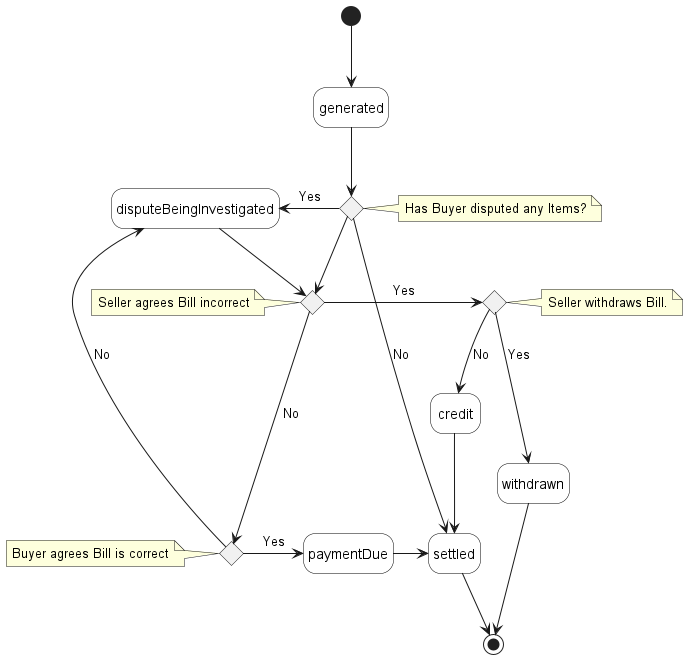

<style>
img
{
  display:block;
  float:none;
  margin-left:auto;
  margin-right:auto;
}
</style>


<div style="font-weight:bold; font-size:33pt; font-family: Sansation;  text-align:center">
MEF Standard
</br>
</br>
MEF 141
</br></br>
LSO Cantata and LSO Sonata Billing Management API - Developer Guide
</br>
</br>
October 2023
</br>
</div>

<div class="page"/>

**Disclaimer**

© MEF Forum 2023. All Rights Reserved.

The information in this publication is freely available for reproduction and
use by any recipient and is believed to be accurate as of its publication date.
Such information is subject to change without notice and MEF Forum (MEF) is not
responsible for any errors. MEF does not assume responsibility to update or
correct any information in this publication. No representation or warranty,
expressed or implied, is made by MEF concerning the completeness, accuracy, or
applicability of any information contained herein and no liability of any kind
shall be assumed by MEF as a result of reliance upon such information.

The information contained herein is intended to be used without modification by
the recipient or user of this document. MEF is not responsible or liable for
any modifications to this document made by any other party.

The receipt or any use of this document or its contents does not in any way
create, by implication or otherwise:

- (a) any express or implied license or right to or under any patent,
  copyright, trademark or trade secret rights held or claimed by any MEF member
  which are or may be associated with the ideas, techniques, concepts or
  expressions contained herein; nor

- (b) any warranty or representation that any MEF member will announce any
  product(s) and/or service(s) related thereto, or if such announcements are
  made, that such announced product(s) and/or service(s) embody any or all of
  the ideas, technologies, or concepts contained herein; nor

- (c) any form of relationship between any MEF member and the recipient or user
  of this document.

Implementation or use of specific MEF standards, specifications or
recommendations will be voluntary, and no Member shall be obliged to implement
them by virtue of participation in MEF Forum. MEF is a non-profit international
organization to enable the development and worldwide adoption of agile, assured
and orchestrated network services. MEF does not, expressly or otherwise,
endorse or promote any specific products or services.

EXPORT CONTROL: This document contains technical data. The download, export,
reexport or disclosure of the technical data contained in this document may be
restricted by applicable U.S. or foreign export laws, regulations and rules
and/or applicable U.S. or foreign sanctions ("Export Control Laws or
Sanctions"). You agree that you are solely responsible for determining whether
any Export Control Laws or Sanctions may apply to your download, export,
reexport or disclosure of this document, and for obtaining (if available) any
required U.S. or foreign export or reexport licenses and/or other required
authorizations.

**Copyright**

© MEF Forum 2023. Any reproduction of this document, or any portion thereof,
shall contain the following statement: "Reproduced with permission of MEF
Forum." No user of this document is authorized to modify any of the information
contained herein.

<div class="page"/>

**Table of Contents**

<!-- code_chunk_output -->

- [List of Contributing Members](#list-of-contributing-members)
- [1. Abstract](#1-abstract)
- [2. Terminology and Abbreviations](#2-terminology-and-abbreviations)
- [3. Compliance Levels](#3-compliance-levels)
- [4. Introduction](#4-introduction)
  - [4.1. Conventions in the Document](#41-conventions-in-the-document)
  - [4.2. Relation to Other Documents](#42-relation-to-other-documents)
  - [4.3. Approach](#43-approach)
  - [4.4. High-Level Flow](#44-high-level-flow)
- [5. API Description](#5-api-description)
  - [5.1. High-Level Use Cases](#51-high-level-use-cases)
  - [5.2. API Endpoint and Operation Description](#52-api-endpoint-and-operation-description)
    - [5.2.1. Seller-side API Endpoints](#521-seller-side-api-endpoints)
    - [5.2.2. Buyer-side API Endpoints](#522-buyer-side-api-endpoints)
  - [5.3. Specifying the Buyer ID and the Seller ID](#53-specifying-the-buyer-id-and-the-seller-id)
  - [5.4. Model Structural Validation](#54-model-structural-validation)
  - [5.5. Security Considerations](#55-security-considerations)
- [6. API Interactions and Flows](#6-api-interactions-and-flows)
  - [6.1. Use Case 1: Register for Invoice Notifications](#61-use-case-1-register-for-invoice-notifications)
  - [6.2. Use Case 2: Send Invoice Notification](#62-use-case-2-send-invoice-notification)
  - [6.3. Use Case 3: Retrieve Invoice List](#63-use-case-3-retrieve-invoice-list)
  - [6.4. Use Case 4: Retrieve Invoice by Identifier](#64-use-case-4-retrieve-invoice-by-identifier)
    - [6.4.1. CustomerBill - Lifecycle](#641-customerbill---lifecycle)
  - [6.5. Use Case 5: Retrieve Invoice Line Item by Identifier](#65-use-case-5-retrieve-invoice-line-item-by-identifier)
    - [6.5.1. CustomerBillItem - Lifecycle](#651-customerbillitem---lifecycle)
  - [6.6. Use Case 5: Retrieve Printable Invoice](#66-use-case-5-retrieve-printable-invoice)
- [7. API Details](#7-api-details)
  - [7.1. API patterns](#71-api-patterns)
    - [7.1.1. Indicating errors](#711-indicating-errors)
      - [7.1.1.1. Type Error](#7111-type-error)
      - [7.1.1.2. Type Error400](#7112-type-error400)
      - [7.1.1.3. `enum` Error400Code](#7113-enum-error400code)
      - [7.1.1.4. Type Error401](#7114-type-error401)
      - [7.1.1.5. `enum` Error401Code](#7115-enum-error401code)
      - [7.1.1.6. Type Error403](#7116-type-error403)
      - [7.1.1.7. `enum` Error403Code](#7117-enum-error403code)
      - [7.1.1.8. Type Error404](#7118-type-error404)
      - [7.1.1.9. Type Error408](#7119-type-error408)
      - [7.1.1.10. Type Error500](#71110-type-error500)
      - [7.1.1.11. Type Error501](#71111-type-error501)
    - [7.1.2. Response pagination](#712-response-pagination)
  - [7.2. Management API Data model](#72-management-api-data-model)
    - [7.2.1. Billing](#721-billing)
      - [7.2.1.1. Type CustomerBill](#7211-type-customerbill)
      - [7.2.1.2. Type CustomerBill\_Find](#7212-type-customerbill_find)
      - [7.2.1.3. Type CustomerBillItem](#7213-type-customerbillitem)
      - [7.2.1.4. `enum` CustomerBillCategory](#7214-enum-customerbillcategory)
      - [7.2.1.5. Type CustomerBillItemFee](#7215-type-customerbillitemfee)
      - [7.2.1.6. `enum` CustomerBillItemFeeCategory](#7216-enum-customerbillitemfeecategory)
      - [7.2.1.7. Type CustomerBillItemRef](#7217-type-customerbillitemref)
      - [7.2.1.8. `enum` CustomerBillItemStateType](#7218-enum-customerbillitemstatetype)
      - [7.2.1.9. Type CustomerBillItemTax](#7219-type-customerbillitemtax)
      - [7.2.1.10. `enum` CustomerBillItemTaxCategory](#72110-enum-customerbillitemtaxcategory)
      - [7.2.1.11. `enum` CustomerBillRunType](#72111-enum-customerbillruntype)
      - [7.2.1.12. `enum` CustomerBillStateType](#72112-enum-customerbillstatetype)
      - [7.2.1.13. Type FinancialAccountRef](#72113-type-financialaccountref)
      - [7.2.1.14. `enum` MEFPriceType](#72114-enum-mefpricetype)
      - [7.2.1.15. Type MEFProductOrderItemRef](#72115-type-mefproductorderitemref)
      - [7.2.1.16. Type PaymentItem](#72116-type-paymentitem)
    - [7.2.2. Common](#722-common)
      - [7.2.2.1. Type AppliedPayment](#7221-type-appliedpayment)
      - [7.2.2.2. Type AttachmentURL](#7222-type-attachmenturl)
      - [7.2.2.3. Type BillingAccountRef](#7223-type-billingaccountref)
      - [7.2.2.4. Type FinancialAccountRef](#7224-type-financialaccountref)
      - [7.2.2.5. Type FieldedAddress](#7225-type-fieldedaddress)
      - [7.2.2.6. Type GeographicSubAddress](#7226-type-geographicsubaddress)
      - [7.2.2.7. Type MEFSubUnit](#7227-type-mefsubunit)
      - [7.2.2.8. Type Money](#7228-type-money)
      - [7.2.2.9. `enum` PaymentMethod](#7229-enum-paymentmethod)
      - [7.2.2.10. Type ProductRef](#72210-type-productref)
      - [7.2.2.11. Type RelatedContactInformation](#72211-type-relatedcontactinformation)
      - [7.2.2.12. Type TaxItem](#72212-type-taxitem)
      - [7.2.2.13. Type TimePeriod](#72213-type-timeperiod)
    - [7.2.3. Notification registration](#723-notification-registration)
      - [7.2.3.1. Type EventSubscription](#7231-type-eventsubscription)
      - [7.2.3.2. Type EventSubscriptionInput](#7232-type-eventsubscriptioninput)
  - [7.3. Notification API Data Model](#73-notification-api-data-model)
    - [7.3.1. Common Notification](#731-common-notification)
      - [7.3.1.1. Type Event](#7311-type-event)
    - [7.3.2. Billing Notification](#732-billing-notification)
      - [7.3.2.1. Type CustomerBillEvent](#7321-type-customerbillevent)
      - [7.3.2.2. Type CustomerBillEventPayload](#7322-type-customerbilleventpayload)
      - [7.3.2.3. `enum` CustomerBillEventType](#7323-enum-customerbilleventtype)
- [8. References](#8-references)
- [Appendix A Acknowledgments](#appendix-a-acknowledgments)

<!-- /code_chunk_output -->

<div class="page"/>

# List of Contributing Members

The following members of the MEF participated in the development of this
document and have requested to be included in this list.

| Member   |
| -------- |
| Amartus  |
| Lumen    |
| Proximus |
| TELUS    |

**Table 1. Contributing Members**

<div class="page"/>

# 1. Abstract

This standard is intended to assist implementation of the Billing functionality
defined for the LSO Cantata and LSO Sonata Interface Reference Points (IRPs),
for which requirements and use cases are defined in MEF 134 _Billing and
Invoice Business Requirements and Use Cases_ [[MEF134](#8-references)]. This
standard consists of this document and complementary API definitions for:

- Billing Management and Billing Notification.

This standard normatively incorporates the following files by reference as if
they were part of this document from the GitHub repository

[MEF-LSO-Sonata-SDK](https://github.com/MEF-GIT/MEF-LSO-Sonata-SDK)

commit id:
[50b79f2771226d45f8fafea4870af5a9e826c158](https://github.com/MEF-GIT/MEF-LSO-Sonata-SDK/tree/50b79f2771226d45f8fafea4870af5a9e826c158)

- [`productApi/billing/billingManagement.api.yaml`](https://github.com/MEF-GIT/MEF-LSO-Sonata-SDK/blob/50b79f2771226d45f8fafea4870af5a9e826c158/productApi/billing/billingManagement.api.yaml)
- [`productApi/billing/billingNotification.api.yaml`](https://github.com/MEF-GIT/MEF-LSO-Sonata-SDK/blob/50b79f2771226d45f8fafea4870af5a9e826c158/productApi/billing/billingNotification.api.yaml)

[MEF-LSO-Cantata-SDK](https://github.com/MEF-GIT/MEF-LSO-Cantata-SDK)

commit id:
[ab20e040f3f22fa7a1bb91b64b99673c60d34200](https://github.com/MEF-GIT/MEF-LSO-Cantata-SDK/tree/ab20e040f3f22fa7a1bb91b64b99673c60d34200)

- [`productApi/billing/billingManagement.api.yaml`](https://github.com/MEF-GIT/MEF-LSO-Cantata-SDK/blob/ab20e040f3f22fa7a1bb91b64b99673c60d34200/productApi/billing/billingManagement.api.yaml)
- [`productApi/billing/billingNotification.api.yaml`](https://github.com/MEF-GIT/MEF-LSO-Cantata-SDK/blob/ab20e040f3f22fa7a1bb91b64b99673c60d34200/productApi/billing/billingNotification.api.yaml)

The Billing API is defined using OpenAPI 3.0 [[OAS-V3](#8-references)]

<div class="page"/>

# 2. Terminology and Abbreviations

This section defines the terms used in this document. In many cases, the
normative definitions of terms are found in other documents. In these cases,
the third column is used to provide the reference that is controlling, in other
MEF or external documents.

In addition, terms defined in the standards referenced below are included in
this document by reference and are not repeated in Table 2:

- MEF 55.1 [[MEF55.1](#8-references)]
- MEF 79 [[MEF79](#8-references)]
- MEF 80 [[MEF80](#8-references)]

<table>
<tr>
  <th>Term</th>
  <th>Description</th>
  <th>Reference</th>
</tr>
<tr>
  <td>Application Program Interface (API)</td>
  <td>In the context of LSO, API describes one of the Management Interface Reference Points based on the requirements specified in an Interface Profile, along with a data model, the protocol that defines operations on the data and the encoding format used to encode data according to the data model. In this document, API is used synonymously with REST API</td>
  <td><a href="#8-references">[MEF55.1]</td>
</tr>
<tr>
  <td>Bill</td>
  <td>A legal document generated by the Seller to the Buyer relating to charges associated to Products provided by the Seller to the Buyer.</td>
  <td><a href="#8-references">[MEF134]</td>
</tr>
<tr>
  <td>Buyer</td>
  <td>In the context of this document, denotes the organization or individual acting as the customer in a transaction over a Cantata (Customer <-> Service Provider) or Sonata (Service Provider <-> Partner) Interface</td>
  <td>This document; adapted from <a href="#8-references">[MEF80]</td>
</tr>
<tr>
  <td>Bill Item</td>
  <td>One or more rows in a Bill that represent charges associated with a Product instance.</td>
  <td><a href="#8-references">[MEF134]</td>
</tr>
<tr>
  <td>Invoice</td>
  <td>A legal document generated by the Seller to the Buyer relating to charges associated to Products provided by the Seller to the Buyer.  Within this document, an Invoice term is referred to as Bill</td>
  <td><a href="#8-references">[MEF134]</td>
</tr>
<tr>
  <td>Notification</td>
  <td>A message sent from the Seller to the Buyer to inform about an event that has occurred in regard to a specific instance of Billing</td>
  <td><a href="#8-references">[MEF134]</a></td>
</tr>
<tr>
  <td>Printable Bill</td>
  <td>An Bill that is in a format that can be printed and reviewed by a human.</td>
  <td><a href="#8-references">[MEF134]</a></td>
</tr>
<tr>
  <td>REST API</td>
  <td>Representational State Transfer. REST provides a set of architectural constraints that, when applied as a whole, emphasizes the scalability of component interactions, the generality of interfaces, the independent deployment of components, and intermediary components to reduce interaction latency, enforce security, and encapsulate legacy systems.</td>
  <td><a href="#8-references">[REST]</a> </td>
</tr>
<tr>
  <td>Seller</td>
  <td>In the context of this document, denotes the organization acting as the supplier in a transaction over a Cantata (Customer <-> Service Provider) or Sonata (Service Provider <-> Partner) Interface</td>
  <td>This document; adapted from <a href="#8-references">[MEF80]</td>
</tr>
</table>

**Table 2. Terminology**

<div class="page"/>

# 3. Compliance Levels

The key words **"MUST"**, **"MUST NOT"**, **"REQUIRED"**, **"SHALL"**, **"SHALL
NOT"**, **"SHOULD"**, **"SHOULD NOT"**, **"RECOMMENDED"**, **"NOT
RECOMMENDED"**, **"MAY"**, and **"OPTIONAL"** in this document are to be
interpreted as described in BCP 14 (RFC 2119 [[RFC2119](#8-references)], RFC
8174 [[RFC8174](#8-references)]) when, and only when, they appear in all
capitals, as shown here. All key words must be in bold text.

Items that are **REQUIRED** (contain the words **MUST** or **MUST NOT**) are
labeled as **[Rx]** for required. Items that are **RECOMMENDED** (contain the
words **SHOULD** or **SHOULD NOT**) are labeled as **[Dx]** for desirable.
Items that are **OPTIONAL** (contain the words MAY or OPTIONAL) are labeled as
**[Ox]** for optional.

A paragraph preceded by **[CRa]<** specifies a conditional mandatory
requirement that **MUST** be followed if the condition(s) following the "<"
have been met. For example, **"[CR1]<[D38]"** indicates that Conditional
Mandatory Requirement 1 must be followed if Desirable Requirement 38 has been
met. A paragraph preceded by **[CDb]<** specifies a Conditional Desirable
Requirement that **SHOULD** be followed if the condition(s) following the "<"
have been met. A paragraph preceded by **[COc]<** specifies a Conditional
Optional Requirement that **MAY** be followed if the condition(s) following the
"<" have been met.

<div class="page"/>

# 4. Introduction

The Billing API allows the Buyer to search or retrieve Bills as well as receive
notifications.

This standard specification document describes the Application Programming
Interface (API) for Billing functionality of the LSO Cantata and LSO Sonata
Interface Reference Point (IRP) as defined in the _MEF 55.1 Lifecycle Service
Orchestration (LSO): Reference Architecture and Framework_
[[MEF55.1](#8-references)]. The LSO Reference Architecture is shown in Figure 1
with both IRPs highlighted.


**Figure 1. The LSO Reference Architecture**

Cantata and Sonata IRPs define functionalities that allow an automated exchange
of information between business applications of the Buyer (Customer or Service
Provider) and Seller (Service Provider or Partner) Domains. Those are:

- Product Catalog
- Address Validation
- Site Retrieval
- Product Offering Qualification
- Product Quote
- Product Inventory
- Product Ordering
- Trouble Ticketing
- Billing
- Appointment
- WorkOrder

This API and Developer Guide implements requirements and use cases for Billing
as defined in MEF W134 _Billing and Invoice Business Requirements and Use
Cases_ [[MEF134](#8-references)].

This document is structured as follows:

- [Chapter 4](#4-introduction) provides an introduction to Billing description
  in a broader context of Cantata and Sonata and their corresponding SDKs.
- [Chapter 5](#5-api-description) gives an overview of endpoints, resource
  models, and design patterns.
- Use Cases and flows are presented in
  [Chapter 6](#6-api-interactions-and-flows).
- And finally, [Chapter 7](#7-api-details) complements previous sections with a
  detailed API description.

## 4.1. Conventions in the Document

- Code samples are formatted using code blocks. When notation `<< some text >>`
  is used in the payload sample it indicates that a comment is provided instead
  of an example value and it might not comply with the OpenAPI definition.
- Model definitions are formatted as in-line code (e.g. `Billing`).
- In UML diagrams the default cardinality of associations is `0..1`. Other
  cardinality markers are compliant with the UML standard.
- In the API details tables and UML diagrams required attributes are marked
  with a `*` next to their names.
- In UML sequence diagrams `{{variable}}` notation is used to indicate a
  variable to be substituted with a correct value.

## 4.2. Relation to Other Documents

This API implements the Billing requirements and use cases that are defined in
[[MEF134](#8-references)]. The API definition builds on _TMF678 Customer Bill
Management API User Guide v4.0.1_ [[TMF678](#8-references)]. In the context of
naming, the terms Invoice and Bill are used alternatively. The Invoice term
appears in [[MEF134](#8-references)] document, the Bill term is used in the
context of this document and the API to reuse the terms of TMF 678 API.

## 4.3. Approach

As presented in Figure 2 both Cantata and Sonata API frameworks consist of
three structural components:

- Generic API framework
- Product-independent information (Function-specific information and
  Function-specific operations)
- Product-specific information (MEF product specification data model)


**Figure 2. Cantata and Sonata API framework**

The essential concept behind the framework is to decouple the common structure,
information and operations from the specific product information content.

Firstly, the Generic API Framework defines a set of design rules and patterns
that are applied across all Cantata or Sonata APIs.

Secondly, the product-independent information of the framework focuses on a
model of a particular Cantata or Sonata functionality and is agnostic to any of
the product specifications.

Finally, the product-specific information part of the framework focuses on MEF
product specifications that define business-relevant attributes and
requirements for trading MEF subscriber and MEF operator services.

The Billing is product-agnostic and is not intended to carry any
product-specific payloads. It only references products from the inventory by
`id`. It operates using the Generic API Framework and the Function-specific
Information and Operations.

## 4.4. High-Level Flow

The Billing is part of a broader Cantata and Sonata End-to-End flow. Figure 3.
below shows a high-level diagram to get a good understanding of the whole
process and the Billing position within it.


**Figure 3. Cantata and Sonata End-to-End Function Flow**

- Address Validation:
  - Allows the Buyer to retrieve address information from the Seller, including
    exact formats, for addresses known to the Seller.
- Site Retrieval:
  - Allows the Buyer to retrieve Geographic Site information including exact
    formats for Geographic Sites known to the Seller.
- Product Offering Qualification (POQ):
  - Allows the Buyer to check whether the Seller can deliver a product or set
    of products from among their product offerings at the geographic address or
    a Geographic Site specified by the Buyer; or modify a previously purchased
    product.
- Quote:
  - Allows the Buyer to submit a request to find out how much the installation
    of an instance of a Product Offering, an update to an existing Product, or
    a disconnect of an existing Product will cost.
- Product Order:
  - Allows the Buyer to request the Seller to initiate and complete the
    fulfillment process of an installation of a Product Offering, an update to
    an existing Product, or a disconnect of an existing Product at the address
    defined by the Buyer.
- Product Inventory:
  - Allows the Buyer to retrieve information about existing Product instances
    from Seller's Product Inventory.
- Billing:
  - Allows the Seller to generate the document to the Buyer relating to charges
    associated with Products provided by the Seller to the Buyer.
- Trouble Ticketing:
  - Allows the Buyer to create, retrieve, and update Trouble Tickets as well as
    receive notifications about Incidents' and Trouble Tickets' updates. This
    allows managing issues and situations for a Product provided by the Seller.
- The Appointment and WorkOrder:
  - Allows the Buyer to create, retrieve, and update Appointment and WorkOrder
    as well as receive notifications about Appointment and WorkOrder' updates.

    <div class="page"/>

# 5. API Description

This section presents the API structure and design patterns. It starts with the
high-level use cases diagram. Then it describes the REST endpoints with use
case mapping. Next, it gives an overview of the API resource model.

## 5.1. High-Level Use Cases

Figure 4 presents a high-level use case diagram as specified in MEF 134
[[MEF134](#8-references)] in section 7. This picture aims to help understand
the endpoint mapping. Use Cases are described extensively in
[chapter 6](#6-api-interactions-and-flows).


**Figure 4. Use Cases**

## 5.2. API Endpoint and Operation Description

### 5.2.1. Seller-side API Endpoints

**Base URL for Cantata**:
`https://{serverBase}/mefApi/cantata/customerBillManagement/v2/`

**Base URL for Sonata**:
`https://{serverBase}/mefApi/sonata/customerBillManagement/v2/`

The following API endpoints are implemented by the Seller and allow the Buyer
to retrieve Customer Biils and register for Notifications. The endpoints and
corresponding data model are defined in:

`/productApi/billing/billingManagement.api.yaml`

| API endpoint         | Description                                                | MEF 134 Use Case mapping                 |
| -------------------- | ---------------------------------------------------------- | ---------------------------------------- |
| `POST /hub`          | Buyer is able to register for Customer Bill Notifications. | UC 1: Register for Invoice Notifications |
| `GET /hub/{{id}}`    | Buyer is able to register for Customer Bill Notifications. | UC 1. Register for Invoice Notifications |
| `DELETE /hub/{{id}}` | Buyer is able to register for Customer Bill Notifications. | UC 1. Register for Invoice Notifications |

**Table 3. Seller side optional API endpoints**

**[O1]** The Buyer implementation **MAY** support API endpoints listed in
Table 3. [MEF134 R2]

| API endpoint                   | Description                                                                     | MEF 134 Use Case mapping               |
| ------------------------------ | ------------------------------------------------------------------------------- | -------------------------------------- |
| `GET /customerBill`            | The Buyer is able to retrieve a list of Customer Bills.                         | UC 3: Retrieve Invoice List            |
| `GET /customerBill/{{id}}`     | The Buyer is able to retrieve a specific Customer Bill based on the identifier. | UC 4: Retrieve Invoice by Identifier   |
| `GET /customerBillItem/{{id}}` | The Buyer is able to retrieve a specific Invoice based on the Identifier.       | UC 5: Retrieve Line Item by Identifier |

**Table 4. Seller side mandatory API endpoints**

**[R1]** The implementation **MUST** support API endpoints listed in Table 4.

### 5.2.2. Buyer-side API Endpoints

**Base URL for Cantata**:
`https://{serverBase}/mefApi/cantata/customerBillNotification/v2/`

**Base URL for Sonata**:
`https://{serverBase}/mefApi/sonata/customerBillNotification/v2/`

The following API endpoints are implemented by the Buyer and allow the Seller
to send Notifications. The endpoints and corresponding data model are defined
in:

`/productApi/billing/billingNotification.api.yaml`.

| API endpoint                                  | Description                             | MEF 134 Use Case mapping            |
| --------------------------------------------- | --------------------------------------- | ----------------------------------- |
| `POST /listener/customerBillCreateEvent`      | Seller sends a Notification to a Buyer. | UC 2. Generate Invoice Notification |
| `POST /listener/customerBillStateChangeEvent` | Seller sends a Notification to a Buyer. | UC 2. Generate Invoice Notification |

**Table 5. Buyer-side optional Billing API endpoints**

**[O2]** The Buyer implementation **MAY** support API endpoints listed in
Table 5. [MEF134 R2]

## 5.3. Specifying the Buyer ID and the Seller ID

A business entity willing to represent multiple Buyers or multiple Sellers must
follow requirements of MEF 79 [[MEF79](#8-references)] chapter 8.8, which
states:

> For requests of all types, there is a business entity that is initiating an
> Operation (called a Requesting Entity) and a business entity that is
> responding to this request (called the Responding Entity). In the simplest
> case, the Requesting Entity is the Buyer and the Responding Entity is the
> Seller. However, in some cases, the Requesting Entity may represent more than
> one Buyer and similarly, the Responding Entity may represent more than one
> Seller.
>
> While it is outside the scope of this specification, it is assumed that the
> Requesting Entity and the Responding Entity are aware of each other and can
> authenticate requests initiated by the other party. It is further assumed
> that both the Buying Entity and the Requesting Entity know:
>
> a) the list of Buyers the Requesting Entity represents when interacting with
> this Responding Entity; and  
> b) the list of Sellers that this Responding Entity represents to this
> Requesting Entity.

In the API the `buyerId` and `sellerId` are represented as query parameters in
each operation defined in `billingManagement.api.yaml` and as attributes of
events as described in `billingNotification.api.yaml`.

**[R2]** If the Requesting Entity has the authority to represent more than one
Buyer the request **MUST** include the `buyerId` query parameter that
identifies the Buyer being represented. [MEF79 R80]

**[R3]** If the Requesting Entity represents precisely one Buyer with the
Responding Entity, the request **MUST NOT** specify the `buyerId`. [MEF79 R81]

**[R4]** If the Responding Entity represents more than one Seller to this Buyer
the request **MUST** include the `sellerId` query parameter that identifies the
Seller with whom this request is associated. [MEF79 R82]

**[R5]** If the Responding Entity represents precisely one Seller to this
Buyer, the request **MUST NOT** specify the `sellerId`. [MEF79 R83]

**[R6]** If `buyerId` or `sellerId` attributes were specified in the request
same attributes **MUST** be used in the notification payload.

## 5.4. Model Structural Validation

The structure of the HTTP payloads exchanged via the Billing API endpoints is
defined using OpenAPI version 3.0.

**[R7]** Implementations **MUST** use payloads that conform to these
definitions.

## 5.5. Security Considerations

There must be an authentication mechanism whereby a Seller can be assured who a
Buyer is and vice-versa. There must also be authorization mechanisms in place
to control what a particular Buyer or Seller is allowed to do and what
information may be obtained. However, the definition of the exact security
mechanism and configuration is outside the scope of this document. The LSO
Security mechanisms are defined by MEF 128 _LSO API Security Profiles_
[[MEF128](#8-references)].

<div class="page"/>

# 6. API Interactions and Flows

This section provides a detailed insight into the API functionality, use cases,
and flows. It starts with Figure 5 and Table 6, presenting a list and short
description of all business use cases then presents the variants of end-to-end
interaction flows, and the following subchapters describe the API usage flow
and examples for each of the use cases.

Figure 5 presents an example of an end-to-end flow:


**Figure 5. End-to-End API Flows**

- (1,2) The Seller creates a `CustomerBill` and `CustomerBillItem`in the
  `generated` state.
- (3) The Seller sends a `customerBillCreateEvent` with an `id`.
- (4,5) The Buyer requests detailed information about the `CustomerBill` based
  on `id`.
- (6,7) The Buyer requests detailed information about all of `CustomerBillItem`
  based on the list of `ids` from `CustomerBill`.
- (8) The Buyer pays the bill and `CustomerBillItem` changes state to
  `settled`.
- (9,10) If all of the `CustomerBillItem` are `settled` then `CustomerBill`
  changes the state to `settled`.
- (11) The Seller sends a `customerBillStateChangeEvent`.
- (12,13) The Buyer requests detailed information about the `CustomerBill`
  based on `id`.

| Use Case # | Use Case Name                                    | Use Case Description                                                                                                |
| ---------- | ------------------------------------------------ | ------------------------------------------------------------------------------------------------------------------- |
| 1          | Register for Invoice Notification                | Buyer is able to register for Invoice Notifications.                                                                |
| 2          | Generate Invoice Notifications                   | Seller sends an Invoice Notification to a Buyer.                                                                    |
| 3          | Retrieve Invoice List                            | The Buyer is able to retrieve a list of Invoices.                                                                   |
| 4          | Retrieve Invoice by Invoice Identifier           | The Buyer is able to retrieve a specific Invoice based on the Invoice Identifier of the Invoice.                    |
| 5          | Retrieve Invoice Line Item by Invoice Identifier | The Buyer is able to retrieve one or more specific Line Items in an Invoice.                                        |
| 6          | Retrieve Printable Invoice                       | The Buyer is able to retrieve a specific Invoice in a printable format using the Invoice Identifier of the Invoice. |

**Table 6. Use Cases description**

The detailed business requirements of each of the use cases are described in
section 7 of MEF 134 [[MEF134](#8-references)].

## 6.1. Use Case 1: Register for Invoice Notifications

To register for notifications the Buyer uses the `registerListener` operation
from the API: `POST /hub`.

- `callback` - mandatory, to provide the callback address the events will be
  notified to,
- `query` - optional, to provide the required types of event.

**[R8]** The Seller **MUST** support all of `CustomerBillEventType`: [MEF134
R1]

- `customerBillCreateEvent`
- `customerBillStateChangeEvent`

**[R9]** The Buyer's request **MUST** provide the `callback` attribute. [MEF134
R1]

By using a simple request:

```json
{
  "callback": "https://buyer.com/listenerEndpoint"
}
```

The Buyer subscribes for notification of all types of events.

If the Buyer wishes to receive only notification of a certain type, a `query`
must be added:

```json
{
  "callback": "https://buyer.com/listenerEndpoint",
  "query": "eventType=customerBillCreateEvent"
}
```

If the Buyer wishes to subscribe to different types of events, there are 2
possible syntax variants [[TMF630](#8-references)]:

```
eventType=customerBillCreateEvent,customerBillStateChangeEvent
```

or

```
eventType=customerBillCreateEvent&eventType=customerBillStateChangeEvent
```

The `query` formatting complies with RCF3986 [RFC3986](#8-references).
According to it, every attribute defined in the Event model (from the
notification API) can be used in the `query`. However, this standard requires
only `eventType` attribute to be supported.

**[R10]** If the Seller does not support notifications, they **MUST** return an
error message to a Buyer's request to register for notifications that indicates
that notifications are not supported (`Error501`). [MEF134 R2]

**[R11]** `eventType` is the only attribute that the Seller **MUST** support in
the query.

The Seller responds to the subscription request by adding the `id` of the
subscription to the message that must be further used for unsubscribing.

```json
{
  "id": "00000000-0000-0000-0000-000000000678",
  "callback": "https://buyer.com/listenerEndpoint",
  "query": "eventType=customerBillCreateEvent"
}
```

Example of a final address that the Notifications will be sent to (for Sonata,
`customerBillCreateEvent`):

- `https://buyer.com/listenerEndpoint/mefApi/sonata/customerBillManagement/v2/listener/customerBillCreateEvent`

## 6.2. Use Case 2: Send Invoice Notification

Notifications are used to asynchronously inform the Buyer about the respective
objects and attributes changes. The next notification must be sent when the
state changes compared to the previously sent one.

**[R12]** The event sent by the Seller **MUST** contain following attributes:
[MEF134 R3]

- `eventId`
- `eventType`
- `eventTime`
- `event.id`

**[R13]** The `customerBillCreateEvent` **MUST** be sent when a `CustomerBill`
is created. [MEF134 R4]

**[R14]** The Seller **MUST** send Customer Bill Notifications to a Buyer who
has registered for the Customer Bill Notification Type.

**[R15]** The Seller **MUST NOT** send Customer Bill Notifications for
Notification Type to a Buyer who has not registered for the Customer Bill
Notification Type.

The Buyer acknowledges the Notification received from the Seller.

**[O3]** If the Seller fails to receive an acknowledgment from the Buyer
repeatedly, the Seller **MAY** make the target address as bad and stop sending
notifications. [MEF134 O1]

Figure 6 shows all entities involved in the Notification use cases.


**Figure 6. Use Case 2. Billing Notification Data Model**

The following snippet presents an example of `customerBillCreateEvent`

```json
{
  "eventId": "event-001",
  "eventType": "customerBillCreateEvent",
  "eventTime": "2023-05-09T15:56:08.559Z",
  "event": {
    "id": "00000000-4444-5555-6666-000000000987"
  }
}
```

**_Note_**: The body of the event carries only the source object's `id`. The
Buyer needs to query it later by `id` to get details.

To stop receiving events, the Buyer has to use the `unregisterListener`
operation from the `DELETE /hub/{id}` endpoint. The `id` is the identifier
received from the Seller during the listener registration.

Table 7 presents the mapping between the API Notification types' names and the
ones in MEF 134. The inconsistencies are caused by using the TMF event types as
the base for this API.

| API name                       | MEF 134 name |
| ------------------------------ | ------------ |
| `customerBillCreateEvent`      | Created      |
| `customerBillStateChangeEvent` | State Change |

**Table 7. Customer Bill event types**

## 6.3. Use Case 3: Retrieve Invoice List

The Buyer can get detailed information about the Bill from the Seller by using
a `GET /customerBill` operation.

**[R16]** The Buyer request **MUST** contain zero or more of the following
query parameters: [MEF134 R5]

- `billingAccount.id`
- `billingPeriod.startDateTime.lt`
- `billingPeriod.startDateTime.gt`
- `billingPeriod.endDateTime.lt`
- `billingPeriod.endDateTime.gt`
- `category`
- `state`

The Seller receives this request and returns a response.

**[R17]** The Seller response **MUST** include the following for each entry in
the list: [MEF134 R6]

- `id`
- `billNo`
- `billingAccount`
- `billingPeriod`
- `category`.
- `state`

The example below shows a response for use case 3.

```json
[
  {
    "id": "CB-123",
    "billingAccount": {
      "id": "00000000-1111-0000-0000-000000000001"
    },
    "billNo": "780123456",
    "billingPeriod": {
      "startDateTime": "2022-10-01T08:00:00.297Z",
      "endDateTime": "2022-10-31T08:00:00.297Z"
    },
    "category": "normal",
    "state": "generated"
  }
]
```

**[R18]** If no `CustomerBill` matches the criteria provided by the Buyer, the
Seller **MUST** return a positive response with an empty list. [MEF134 R7]

The Buyer may also ask for pagination with the use of the `offset` and `limit`
parameters. The filtering and pagination attributes must be specified in URI
query format [RFC3986](#8-references). Section
[7.1.2.](#712-response-pagination) provides details about the implementation of
the pagination mechanism.

```
https://serverRoot/mefApi/sonata/customerBillManagement/v2/customerBill?state=generated&limit=10&offset=0
```

The example above shows a Buyer's request to get all Bills that are in the
`generated` state. Additionally, the Buyer asks only for a first (`offset=0`)
pack of 10 results (`limit=0`) to be returned. The correct response (HTTP code
`200`) in the response body contains a list of `CustomerBill_Find` objects
matching the criteria. To get more details (e.g. the item level information),
the Buyer has to query a specific `CustomerBill` by `id`.

## 6.4. Use Case 4: Retrieve Invoice by Identifier

The Buyer can get detailed information about the Bill from the Seller by using
a `GET /customerBill/{{id}}` operation.

The Seller receives this request and returns a response.

**[R19]** The Seller response **MUST** include all of the attributes for the
returned `CustomerBill`. [MEF134 R9]

- `id`
- `amountDue`
- `appliedPayment`
- `billingAccount`
- `billCycle`
- `billDate`
- `billDocument`
- `billNo`
- `billingPeriod`
- `category`
- `credits`
- `customerBillItem`
- `discounts`
- `fees`
- `financialAccount`
- `lastUpdate`
- `paymentDueDate`
- `runType`
- `relatedContactInformation`
- `remainingAmount`
- `state`
- `taxExcludedAmount`
- `taxIncludedAmount`
- `taxItem`

The example below shows a response for use case 4.

```json
[
  {
    "id": "CB-123",
    "amountDue": {<< The total amount of money that needs to be paid by Buyer, with all taxes, fees, and credits applied. >>
      "unit": "EUR",
      "value": 120.0
    },
    "appliedPayment": [],<<No payments made yet>
    "billingAccount": {<<The Buyer Billing Account that is unique within the Seller and is assigned by the Seller>>
      "id": "00000000-1111-0000-0000-000000000001"
    },
    "billCycle": "BC-1234",<<The Bill cycle as set by the Seller>>
    "billDate": "2022-09-31T10:30:00.846Z",<<The date when the Bill was issued.>>
    "billDocument": {<<URL pointing to PDF file, which is used by the Buyer to receive the Bill>>
      "url": "https://example.com/documents/00000000-0000-1111-2222-000000001111"
    },
    "billNo": "780123456",<<A number assigned to the Bill by the Seller>>
    "billingPeriod": {<<The time, when service will be delivered.>>
      "startDateTime": "2022-10-01T08:00:00.297Z",
      "endDateTime": "2022-10-31T08:00:00.297Z"
    },
    "category": "normal",<<The category of Bill>>
    "customerBillItem": [<<A reference to one or more Bill Items.>>
      {
        "id": "ABR123"
      },
      {
        "id": "ABR124"
      }
    ],
    "credits": { <<Amount of credits included>>
      "unit": "EUR",
      "value": 0.0
    },
    "discounts": {<<Amount of discounts included>>
      "unit": "EUR",
      "value": 0.0
    },
    "fees": {<<Amount of fees included>>
      "unit": "EUR",
      "value": 10.0
    },
    "financialAccount": {<<A Financial Account within the Seller.>>
      "id": "23-0000-0000-3324-3332-3334"
    },
    "lastUpdate": "2022-09-31T10:30:00.846Z",<<The date when the Bill was last modified e.g. date of changing the state of Bill>>
    "paymentDueDate": "2022-10-31T08:00:00.846Z",<<Final payment date.>>
    "runType": "onCycle",<<The Bill cycle as set by the Seller>>
    "relatedContactInformation": [<<Detailed contact information about Buyer. >>
      {
        "emailAddress": "john.example@example.com",
        "name": "John Example",
        "number": "+12-345-678-90",
        "organization": "Buyer Example Co.",
        "role": "buyerBillingContact"
      }
    ],
    "remainingAmount": {<<An amount of money that still requires payment e. g. from the previous Bill Period.>>
      "unit": "EUR",
      "value": 120.0
    },
    "state": "generated",<<The state of the Bill>>
    "taxExcludedAmount": {<<The amount of money due without taxes being calculated >>
      "unit": "EUR",
      "value": 100.0
    },
    "taxIncludedAmount": {<<The amount of money due with taxes being calculated for the current Invoicing Cycle.>>
      "unit": "EUR",
      "value": 120.0
    },
    "taxItem": [<<The tax items including category, rate, and amount for this Bill.>>
      {
        "taxCategory": "VAT",
        "taxRate": 20.0,
        "taxAmount": {
          "unit": "EUR",
          "value": 20.0
        }
      }
    ]
  }
]
```

1. This example describes the case when Bill is in a `generated` state. It
   means that the Buyer needs to pay it.
2. The `appliedPayment` is an empty list and the `remainingAmount` value is
   "120", which is equal to `amountDue`.
3. When the Buyer pays the full bill amount, the `CustomerBill` will change the
   state to `settled`.
4. A record describing the received payment is added to the `appliedPayment`
   list. The received `appliedAmount` (120) is deducted from `remainingAmount`.

```json
[
  {
    "id": "CB-123",
    "amountDue": {<< Does not change - it is the total amount>>
      "unit": "EUR",
      "value": 120.0
    },
    "appliedPayment": [ <<Now reflecting received payemtns>>
      {
        "appliedAmount": {<<The amount of money that was received from the Buyer and applied to the Bill as payment without additional fees.>>
          "unit": "EUR",
          "value": 120.0
        },
        "payment": {
          "id": "PAY-9876",
          "amount": {<<The amount of money received from Buyer.>>
            "unit": "EUR",
            "value": 120.0
          },
          "paymentMethod": "electronic",<<The specific method of payment.  >>
          "paymentDate": "2022-10-25T09:00:00.846Z"<<The Date the payment was received by the Seller.>
        }
      }
    ],
    "billingAccount": {
      "id": "00000000-1111-0000-0000-000000000001"
    },
    "billCycle": "BC-1234",
    "billDate": "2022-09-31T10:30:00.846Z",
    "billDocument": {
      "url": "https://example.com/documents/00000000-0000-1111-2222-000000001111"
    },
    "billNo": "780123456",
    "billingPeriod": {
      "startDateTime": "2022-10-01T08:00:00.297Z",
      "endDateTime": "2022-10-31T08:00:00.297Z"
    },
    "category": "normal",
    "customerBillItem": [
      {
        "id": "ABR123"
      },
      {
        "id": "ABR124"
      }
    ],
    "credits": {
      "unit": "EUR",
      "value": 0.0
    },
    "discounts": {
      "unit": "EUR",
      "value": 0.0
    },
    "fees": {
      "unit": "EUR",
      "value": 10.0
    },
    "financialAccount": {
      "id": "23-0000-0000-3324-3332-3334"
    },
    "lastUpdate": "2022-10-25T09:00:00.846Z",<<Changed to date of receiving the payment due to state change>>
    "paymentDueDate": "2022-10-31T08:00:00.846Z",
    "runType": "onCycle",
    "relatedContactInformation": [
      {
        "emailAddress": "john.example@example.com",
        "name": "John Example",
        "number": "+12-345-678-90",
        "organization": "Buyer Example Co.",
        "role": "buyerBillingContact"
      }
    ],
    "remainingAmount": {<<Now 0.0 as the payments were received>>
      "unit": "EUR",
      "value": 0.0
    },
    "state": "settled",<<Settled - all payments received>
    "taxExcludedAmount": {
      "unit": "EUR",
      "value": 100.0
    },
    "taxIncludedAmount": {
      "unit": "EUR",
      "value": 130.0
    },
    "taxItem": [
      {
        "taxCategory": "VAT",
        "taxRate": 20.0,
        "taxAmount": {
          "unit": "EUR",
          "value": 20.0
        }
      }
    ]
  }
]
```

### 6.4.1. CustomerBill - Lifecycle

Figure 7 presents the CustomerBill state machine:


**Figure 7. CustomerBill State Machine**

1. A `CustomerBill` has been `generated` based on the completion of a
   CustomerBill Cycle and a `CustomerBill` Notification has been sent to the
   Buyer.
2. In the `paymentDue` state, the Seller has completed their dispute process
   and they are expecting payment from the Buyer.
3. In a `settled` state a `CustomerBill` for which all payment due has been
   received or for which payment is due.

Table 8 presents the mapping between the API `state` names (aligned with TMF)
and the MEF 134 naming, together with the states' descriptions.

| state        | MEF 134 name | Description                                                                                                                                               |
| ------------ | ------------ | --------------------------------------------------------------------------------------------------------------------------------------------------------- |
| `generated`  | GENERATED    | An `CustomerBill` that has been `generated` based on the completion of a CustomerBill Cycle and a `CustomerBill` Notification has been sent to the Buyer. |
| `paymentDue` | PAYMENT_DUE  | The Seller has completed their dispute process and they are expecting payment from the Buyer.                                                             |
| `settled`    | SETTLED      | A `CustomerBill` for which all payment due has been received or for which payment is due.                                                                 |

**Table 8. Customer Bill states**

**[R20]** A CustomerBill API implementation **MUST** support the states and
transitions shown in Figure 7. [MEF134 R19]

## 6.5. Use Case 5: Retrieve Invoice Line Item by Identifier

The Buyer can get detailed information about the Bill from the Seller by using
a `GET /customerBillItem/{{id}}` operation.

The Seller receives this request and returns a response.

**[R21]** The Seller response **MUST** include the attributes for the returned
`CustomerBillItem`: [MEF134 R10], [MEF134 R11], [MEF134 R13]

- `id`
- `appliedTax`
- `appliedFee`
- `description`
- `periodCoverage`
- `product` or `productOrderItem`
- `productName`
- `state`
- `taxExcludedAmount`
- `type`
- `unit`
- `unitRate`
- `unitQuantity`

**[R22]** If the bill item relates to an instance of a Product then the
`product` reference **MUST** be provided. [MEF134 R10]

**[R23]** If the bill item relates to a Product Order Item then the
`productOrderItem` reference **MUST** be provided. [MEF134 R11]

The first example shows below a response of one `customerBillItem` in use
case 5. This example shows the `customerBillItem` attributes before payment.

```json
[
  {
    "id": "ABR123",<<The Bill Item identifier.>>
    "appliedTax": [<<Taxes associated with the Bill Item>>
      {
        "category": "country",
        "rate": 20, <<The rate at which the Tax is calculated>>
        "description": "Country Tax",
        "amount": { <<The amount of money of the Tax. e. g. 20% of 50 gives 10 >>
          "unit": "EUR",
          "value": 10.0
        }
      }
    ],
    "appliedFee": [<<Fees associated with the Bill Item>>
      {
        "category": "recurring",
        "rate": 10,<<The rate at which the Fee is calculated>>
        "description": "Recurring Fee",
        "amount": {
          "unit": "EUR",<<The amount of money of the Fee. e. g. 10% of 70 gives 14 >>
          "value": 5.0
        }
      }
    ],
    "customerBillItemType": "recurring",
    "description": "Subscriber Operator charge",<<A text description of the charge.>>
    "periodCoverage": {<<The time, when service related to Bill Item will be delivered>>
      "startDateTime": "2022-10-01T08:00:00.297Z",
      "endDateTime": "2022-10-31T08:00:00.297Z"
    },
    "product": {<<The identifier of the Product that is the subject of the Bill Item.>>
      "id": "EVLAN1345"
    },
    "productOrderItem": {
      "productOrderId": "00000000-5555-0000-0000-000000000022",
      "productOrderItemId": "item-001"
    },

    "productName": "Elan_connectivity", <<The name of the Product that is the subject of the Line Item.>>
    "state": "generated",
    "taxExcludedAmount": { <<The amount of money  of the charge before taxes and fees are calculated and applied, e.g. net.>>
      "unit": "EUR",
      "value": 50
    },
    "unit": "month",
    "unitRate": { <<The rate per unit for the Bill determined during or after the Billing Process.>>
      "unit": "EUR",
      "value": 65
    },
    "unitQuantity": 1 <<The number of units.>>
  }
]
```

The second example shows below a response of another one `customerBillItem` in
use case 5. This example shows the `customerBillItem` attributes after payment.

```json
[
  {
    "id": "ABR124",
    "appliedTax": [
      {
        "category": "country",
        "rate": 20,
        "description": "Country Tax",
        "amount": {
          "unit": "EUR",
          "value": 10.0
        }
      }
    ],
    "appliedFee": [
      {
        "category": "recurring",
        "rate": 10,
        "description": "Recurring Fee",
        "amount": {
          "unit": "EUR",
          "value": 5.0
        }
      }
    ],
    "customerBillItemType": "recurring",
    "description": "Subscriber Operator charge",
    "periodCoverage": {
      "startDateTime": "2022-10-01T08:00:00.297Z",
      "endDateTime": "2022-10-31T08:00:00.297Z"
    },
    "product": {
      "id": "ELAN1345"
    },
    "productOrderItem": {
      "productOrderId": "00000000-5555-0000-0000-000000000001",
      "productOrderItemId": "item-002"
    },

    "productName": "Evlan_connectivity",
    "state": "settled",
    "taxExcludedAmount": {
      "unit": "EUR",
      "value": 50
    },
    "unit": "month",
    "unitRate": {
      "unit": "EUR",
      "value": 65
    },
    "unitQuantity": 1
  }
]
```

After payment, the `customerBillItem` changes the states to `settled`.

### 6.5.1. CustomerBillItem - Lifecycle

Figure 8 presents the `CustomerBillItem` state machine:



**Figure 8. CustomerBillItem State Machine**

1. The Seller has agreed with the Buyer that the disputed charges are in error
   and has provided a `credit` for the amount in error.
2. A Buyer has disputed charges included in a `CustomerBill` and those charges
   are in the `disputeBeingInvestigated` process. Disputes cannot exit the
   `disputeBeingInvestigated` process until the Dispute is resolved.
3. A `CustomerBill` that has been `generated` based on the completion of a
   Billing Cycle and a `CustomerBill` Notification have been sent to the Buyer.
4. In the `paymentDue` state, the Seller has completed their dispute process
   and they are expecting payment from the Buyer.
5. The `settled` state means that a `CustomerBill` for which all payments due
   has been received or payment is due for the `CustomerBillItem`.
6. A Seller has agreed with the Buyer that disputed charges are in error and
   has `withdrawn` the CustomerBill.

Table 9 presents the mapping between the API `state` names and the MEF 134
naming, together with states' descriptions.

| state                      | MEF 134 name               | Description                                                                                                                                                                             |
| -------------------------- | -------------------------- | --------------------------------------------------------------------------------------------------------------------------------------------------------------------------------------- |
| `credit`                   | CREDIT                     | The Seller has agreed with the Buyer that the disputed charges are in error and has provided a credit for the amount in error.                                                          |
| `disputeBeingInvestigated` | DISPUTE_BEING_INVESTIGATED | A Buyer has disputed charges included in a `CustomerBill` and those charges are in the Sellers Dispute Process. Disputes cannot exit the dispute process until the Dispute is resolved. |
| `generated`                | GENERATED                  | A `CustomerBill` that has been created based on the completion of a Billing Cycle and a `CustomerBill` Notification has been sent to the Buyer.                                         |
| `paymentDue`               | PAYMENT_DUE                | The Seller has completed their dispute process and they are expecting payment from the Buyer.                                                                                           |
| `settled`                  | SETTLED                    | A `CustomerBill` for which all payment due has been received or payment is due for the CustomerBillItem.                                                                                |
| `withdrawn`                | WITHDRAWN                  | A Seller has agreed with the Buyer that disputed charges are in error and has withdrawn the CustomerBill.                                                                               |

**Table 9. Customer Bill Item states**

**[R24]** A CustomerBill API implementation **MUST** support the states and
transitions shown in Figure 8. [MEF134 R20]

The interaction between `CustomerBillItem` and `CustomerBill` states is shown
in Figure 9:


**Figure 9. Interaction between CustomerBillItem and CustomerBill States
Machine**

**[R25]** A CustomerBill API implementation **MUST** support logic shown in
Figure 9. [MEF134 R21]

## 6.6. Use Case 5: Retrieve Printable Invoice

**[R26]** If a printable document is agreed upon by the Buyer and Seller, then
the Seller **MUST** provide a valid URL in `CustomerBill.billDocument`. [MEF134
R17]

Whether the link point to a pre-generated file or the file is generated
dynamically upon request is up the Seller's discretion.

**[R27]** The Buyer **MUST** use the `billDocument` provided by the Seller to
retrieve the Printable CustomerBill. [MEF134 R18]

**[R28]** The printable `CustomerBill` **MUST** be in a PDF format. [MEF134
R15]

**[R29]** The printable version of `CustomerBill` **MUST** contain all
attributes of `CustomerBill` and `CustomerBillItems`. [MEF134 R16]

<div class="page"/>

# 7. API Details

## 7.1. API patterns

### 7.1.1. Indicating errors

Erroneous situations are indicated by appropriate HTTP responses. An error
response is indicated by HTTP status 4xx (for client errors) or 5xx (for server
errors) and appropriate response payload. The Product Order API uses the error
responses as depicted and described below.

Implementations can use HTTP error codes not specified in this standard in
compliance with rules defined in RFC 7231 [[RFC7231](#8-references)]. In such a
case, the error message body structure might be aligned with the `Error`.


**Figure 10. Data model types to represent an erroneous response**

#### 7.1.1.1. Type Error

**Description:** Standard Class used to describe API response error Not
intended to be used directly. The `code` in the HTTP header is used as a
discriminator for the type of error returned in runtime.

<table id="T_Error">
    <thead style="font-weight:bold;">
        <tr>
            <td>Name</td>
            <td>Type</td>
            <td>Description</td>
        </tr>
    </thead>
    <tbody>
        <tr>
            <td>message</td>
            <td>string</td>
            <td>Text that provides mode details and corrective actions related to the error. This can be shown to a client user.</td>
        </tr><tr>
            <td>reason*</td>
            <td>string<br/><span style="font-size:10px;font-style:italic">maxLength = 255</span></td>
            <td>Text that explains the reason for the error. This can be shown to a client user.</td>
        </tr><tr>
            <td>referenceError</td>
            <td>uri<br/><span style="font-size:10px;font-style:italic">format = uri</span></td>
            <td>URL pointing to documentation describing the error</td>
        </tr>
    </tbody>
</table>

#### 7.1.1.2. Type Error400

**Description:** Bad Request.
(https://tools.ietf.org/html/rfc7231#section-6.5.1)

Inherits from:

- <a href="#T_Error">Error</a>

<table id="T_Error400">
    <thead style="font-weight:bold;">
        <tr>
            <td>Name</td>
            <td>Type</td>
            <td>Description</td>
        </tr>
    </thead>
    <tbody>
        <tr>
            <td>code*</td>
            <td><a href="#T_Error400Code">Error400Code</a></td>
            <td>One of the following error codes:
- missingQueryParameter: The URI is missing a required query-string parameter
- missingQueryValue: The URI is missing a required query-string parameter value
- invalidQuery: The query section of the URI is invalid.
- invalidBody: The request has an invalid body</td>
        </tr>
    </tbody>
</table>

#### 7.1.1.3. `enum` Error400Code

**Description:** One of the following error codes:

- missingQueryParameter: The URI is missing a required query-string parameter
- missingQueryValue: The URI is missing a required query-string parameter value
- invalidQuery: The query section of the URI is invalid.
- invalidBody: The request has an invalid body

#### 7.1.1.4. Type Error401

**Description:** Unauthorized.
(https://tools.ietf.org/html/rfc7235#section-3.1)

Inherits from:

- <a href="#T_Error">Error</a>

<table id="T_Error401">
    <thead style="font-weight:bold;">
        <tr>
            <td>Name</td>
            <td>Type</td>
            <td>Description</td>
        </tr>
    </thead>
    <tbody>
        <tr>
            <td>code*</td>
            <td><a href="#T_Error401Code">Error401Code</a></td>
            <td>One of the following error codes:
- missingCredentials: No credentials provided.
- invalidCredentials: Provided credentials are invalid or expired</td>
        </tr>
    </tbody>
</table>

#### 7.1.1.5. `enum` Error401Code

**Description:** One of the following error codes:

- missingCredentials: No credentials provided.
- invalidCredentials: Provided credentials are invalid or expired

#### 7.1.1.6. Type Error403

**Description:** Forbidden. This code indicates that the server understood the
request but refuses to authorize it.
(https://tools.ietf.org/html/rfc7231#section-6.5.3)

Inherits from:

- <a href="#T_Error">Error</a>

<table id="T_Error403">
    <thead style="font-weight:bold;">
        <tr>
            <td>Name</td>
            <td>Type</td>
            <td>Description</td>
        </tr>
    </thead>
    <tbody>
        <tr>
            <td>code*</td>
            <td><a href="#T_Error403Code">Error403Code</a></td>
            <td>This code indicates that the server understood
the request but refuses to authorize it because
of one of the following error codes:
- accessDenied: Access denied
- forbiddenRequester: Forbidden requester
- tooManyUsers: Too many users</td>
        </tr>
    </tbody>
</table>

#### 7.1.1.7. `enum` Error403Code

**Description:** This code indicates that the server understood the request but
refuses to authorize it because of one of the following error codes:

- accessDenied: Access denied
- forbiddenRequester: Forbidden requester
- tooManyUsers: Too many users

#### 7.1.1.8. Type Error404

**Description:** Resource for the requested path not found.
(https://tools.ietf.org/html/rfc7231#section-6.5.4)

Inherits from:

- <a href="#T_Error">Error</a>

<table id="T_Error404">
    <thead style="font-weight:bold;">
        <tr>
            <td>Name</td>
            <td>Type</td>
            <td>Description</td>
        </tr>
    </thead>
    <tbody>
        <tr>
            <td>code*</td>
            <td>string</td>
            <td>The following error code:
- notFound: A current representation of the target resource not found</td>
        </tr>
    </tbody>
</table>

#### 7.1.1.9. Type Error408

**Description:** Request Time-out
(https://tools.ietf.org/html/rfc7231#section-6.5.7)

Inherits from:

- <a href="#T_Error">Error</a>

<table id="T_Error408">
    <thead style="font-weight:bold;">
        <tr>
            <td>Name</td>
            <td>Type</td>
            <td>Description</td>
        </tr>
    </thead>
    <tbody>
        <tr>
            <td>code*</td>
            <td>string</td>
            <td>List of supported error codes:
- timeOut: Request Time-out - indicates that the server did not receive a complete request message within the time that it was prepared to wait.</td>
        </tr>
    </tbody>
</table>

#### 7.1.1.10. Type Error500

**Description:** Internal Server Error.
(https://tools.ietf.org/html/rfc7231#section-6.6.1)

Inherits from:

- <a href="#T_Error">Error</a>

<table id="T_Error500">
    <thead style="font-weight:bold;">
        <tr>
            <td>Name</td>
            <td>Type</td>
            <td>Description</td>
        </tr>
    </thead>
    <tbody>
        <tr>
            <td>code*</td>
            <td>string</td>
            <td>The following error code:
- internalError: Internal server error - the server encountered an unexpected condition that prevented it from fulfilling the request.</td>
        </tr>
    </tbody>
</table>

#### 7.1.1.11. Type Error501

**Description:** Not Implemented. Used in case Seller is not supporting an
optional operation (https://tools.ietf.org/html/rfc7231#section-6.6.2)

Inherits from:

- <a href="#T_Error">Error</a>

<table id="T_Error501">
    <thead style="font-weight:bold;">
        <tr>
            <td>Name</td>
            <td>Type</td>
            <td>Description</td>
        </tr>
    </thead>
    <tbody>
        <tr>
            <td>code*</td>
            <td>string</td>
            <td>The following error code:
- notImplemented: Method not supported by the server</td>
        </tr>
    </tbody>
</table>

### 7.1.2. Response pagination

A response to retrieve a list of results (e.g.
`GET /productOfferingQualification`) can be paginated. The Buyer can specify
following query attributes related to pagination:

- `limit` - number of expected list items
- `offset` - offset of the first element in the result list

The Seller returns a list of elements that comply with the requested `limit`.
If the requested `limit` is higher than the supported list size the smaller
list result is returned. In that case, the size of the result is returned in
the header attribute `X-Result-Count`. The Seller can indicate that there are
additional results available using:

- `X-Total-Count` header attribute with the total number of available results
- `X-Pagination-Throttled` header set to `true`

**[R30]** Seller **MUST** use either `X-Total-Count` or
`X-Pagination-Throttled` to indicate that the page was truncated and additional
results are available.

## 7.2. Management API Data model

Figure 11 presents the whole Billing Management data model the data types,
requirements related to them and mapping to MEF 134 specifications are
discussed later in this section.


**Figure 11. Billing Management Data Model**

### 7.2.1. Billing

#### 7.2.1.1. Type CustomerBill

**Description:** A legal document generated by the Seller to the Buyer relating
to charges associated to Products provided by the Seller to the Buyer.

<table id="T_CustomerBill" style="width:100%">
    <thead style="font-weight:bold">
        <tr>
            <td>Name</td>
            <td style="width:15%">Type</td>
            <td>M/O</td>
            <td>Description</td>
            <td>MEF 134</td>
        </tr>
    </thead>
    <tbody>
        <tr>
        <td>id</td>
            <td>string</td>
            <td>M</td>
            <td>An identifier assigned to the Bill by the Seller.</td>
            <td>Invoice Identifier</td>
        </tr><tr>
        <td>href</td>
            <td>string</td>
            <td>O</td>
            <td>Bill&#x27;s unique reference.</td>
            <td>Not represented in MEF 134</td>
        </tr><tr>
        <td>amountDue</td>
            <td><a href="#T_Money">Money</a></td>
            <td>M</td>
            <td>The total amount of money with all taxes, fees, and credits applied that is due.</td>
            <td>Amount Due</td>
        </tr><tr>
        <td>appliedPayment</td>
            <td><a href="#T_AppliedPayment">AppliedPayment</a>[]</td>
            <td>M</td>
            <td>A list of details of a payment that has been received from the Buyer.</td>
            <td>Applied Payment</td>
        </tr><tr>
        <td>billingAccount</td>
            <td><a href="#T_BillingAccountRef">BillingAccountRef</a></td>
            <td>M</td>
            <td>An identifier for the Billing Account that is unique within the Seller and is assigned by the Seller.</td>
            <td>Invoicing Account</td>
        </tr><tr>
        <td>billCycle</td>
            <td>string</td>
            <td>M</td>
            <td>The identifier of the Billing Cycle iteration.</td>
            <td>Invoicing Cycle Identifier</td>
        </tr><tr>
        <td>billDate</td>
            <td>date-time<br/><span style="font-size:10px;font-style:italic">format = date-time</span></td>
            <td>M</td>
            <td>Date the Bill was issued.</td>
            <td>Invoice Date</td>
        </tr><tr>
        <td>billDocument</td>
            <td><a href="#T_AttachmentURL">AttachmentURL</a></td>
            <td>M</td>
            <td>URL pointing to PDF file containing printable version of the Customer Bill.</td>
            <td>Bill Document</td>
        </tr><tr>
        <td>billNo</td>
            <td>string</td>
            <td>M</td>
            <td>A number assigned to the Bill by the Seller.</td>
            <td>Invoice Number</td>
        </tr><tr>
        <td>billingPeriod</td>
            <td><a href="#T_TimePeriod">TimePeriod</a></td>
            <td>M</td>
            <td>The Start and Stop Dates of the Billing Period.</td>
            <td>Invoicing Period</td>
        </tr><tr>
        <td>category</td>
            <td><a href="#T_CustomerBillCategory">CustomerBillCategory</a></td>
            <td>M</td>
            <td>The type of Bill. One of the following:
- normal
- duplicate
- trial
</td>
            <td>Invoice Category</td>
        </tr><tr>
        <td>credits</td>
            <td><a href="#T_Money">Money</a></td>
            <td>M</td>
            <td>Amount of credits included.</td>
            <td>Creadits</td>
        </tr><tr>
        <td>customerBillItem</td>
            <td><a href="#T_CustomerBillItemRef">CustomerBillItemRef</a>[]</td>
            <td>M</td>
            <td>A reference to the Bill Items for this Bill.</td>
            <td>Invoice Line Item</td>
        </tr><tr>
        <td>discounts</td>
            <td><a href="#T_Money">Money</a></td>
            <td>M</td>
            <td>Amount of discounts included.</td>
            <td>Discounts</td>
        </tr><tr>
        <td>fees</td>
            <td><a href="#T_Money">Money</a></td>
            <td>M</td>
            <td>Amount of fees included.</td>
            <td>Fees</td>
        </tr><tr>
        <td>financialAccount</td>
            <td><a href="#T_FinancialAccountRef">FinancialAccountRef</a></td>
            <td>M</td>
            <td>A Financial Account within the Seller.</td>
            <td>Financial Account</td>
        </tr><tr>
        <td>lastUpdate</td>
            <td>date-time<br/><span style="font-size:10px;font-style:italic">format = date-time</span></td>
            <td>M</td>
            <td>The date when the Bill was last modified.</td>
            <td>Last Update Date</td>
        </tr><tr>
        <td>paymentDueDate</td>
            <td>date-time<br/><span style="font-size:10px;font-style:italic">format = date-time</span></td>
            <td>M</td>
            <td>The date by which payment of the Amount Due must be received by the Seller.</td>
            <td>Payment Due Date</td>
        </tr><tr>
        <td>runType</td>
            <td><a href="#T_CustomerBillRunType">CustomerBillRunType</a></td>
            <td>M</td>
            <td>The Billing cycle as set by the Seller.</td>
            <td>Run Type</td>
        </tr><tr>
        <td>relatedContactInformation</td>
            <td><a href="#T_RelatedContactInformation">RelatedContactInformation</a>[]</td>
            <td>M</td>
            <td>A party related to this Bill.</td>
            <td>Related Contact Information</td>
        </tr><tr>
        <td>remainingAmount</td>
            <td><a href="#T_Money">Money</a></td>
            <td>M</td>
            <td>An amount of money that still requires payment.</td>
            <td>Remaining Amount</td>
        </tr><tr>
        <td>state</td>
            <td><a href="#T_CustomerBillStateType">CustomerBillStateType</a></td>
            <td>M</td>
            <td>The state of the Bill.</td>
            <td>Invoice State</td>
        </tr><tr>
        <td>taxExcludedAmount</td>
            <td><a href="#T_Money">Money</a></td>
            <td>M</td>
            <td>The amount of money due without taxes being calculated for the current Billing Cycle.</td>
            <td>Tax Excluded Amount</td>
        </tr><tr>
        <td>taxIncludedAmount</td>
            <td><a href="#T_Money">Money</a></td>
            <td>M</td>
            <td>The amount of money due with taxes being calculated for the current Billing Cycle.</td>
            <td>Tax Included Amount</td>
        </tr><tr>
        <td>taxItem</td>
            <td><a href="#T_TaxItem">TaxItem</a>[]</td>
            <td>M</td>
            <td>A tax item is created for each tax rate and tax type used in the bill.</td>
            <td>Tax Items</td>
        </tr>
    </tbody>
</table>

#### 7.2.1.2. Type CustomerBill_Find

**Description:** A legal document generated by the Seller to the Buyer relating
to charges associated to Products provided by the Seller to the Buyer.

<table id="T_CustomerBill_Find" style="width:100%">
    <thead style="font-weight:bold">
        <tr>
            <td>Name</td>
            <td style="width:15%">Type</td>
            <td>M/O</td>
            <td>Description</td>
            <td>MEF 134</td>
        </tr>
    </thead>
    <tbody>
        <tr>
        <td>id</td>
            <td>string</td>
            <td>M</td>
            <td>An identifier assigned to the Bill by the Seller.</td>
            <td>Invoice Identifier</td>
        </tr><tr>
        <td>billingAccount</td>
            <td><a href="#T_BillingAccountRef">BillingAccountRef</a></td>
            <td>O</td>
            <td>An identifier for the Billing Account that is unique within the Seller and is assigned by the Seller.</td>
            <td>Invoicing Account</td>
        </tr><tr>
        <td>billNo</td>
            <td>string</td>
            <td>M</td>
            <td>A number assigned to the Bill by the Seller.</td>
            <td>Invoice Number</td>
        </tr><tr>
        <td>billingPeriod</td>
            <td><a href="#T_TimePeriod">TimePeriod</a></td>
            <td>O</td>
            <td>The Start and Stop Dates of the Billing Period.</td>
            <td>Invoicing Period</td>
        </tr><tr>
        <td>category</td>
            <td><a href="#T_CustomerBillCategory">CustomerBillCategory</a></td>
            <td>M</td>
            <td>The type of Bill. One of the following:
- normal
- duplicate
- trial
</td>
            <td>Invoice Category</td>
        </tr><tr>
        <td>state</td>
            <td><a href="#T_CustomerBillStateType">CustomerBillStateType</a></td>
            <td>M</td>
            <td>The state of the Bill.</td>
            <td>Invoice State</td>
        </tr>
    </tbody>
</table>

#### 7.2.1.3. Type CustomerBillItem

**Description:** One or more rows in a Bill that represent charges associated
with a Product instance.

<table id="T_CustomerBillItem" style="width:100%">
    <thead style="font-weight:bold">
        <tr>
            <td>Name</td>
            <td style="width:15%">Type</td>
            <td>M/O</td>
            <td>Description</td>
            <td>MEF 134</td>
        </tr>
    </thead>
    <tbody>
        <tr>
        <td>id</td>
            <td>string</td>
            <td>M</td>
            <td>The CustomerBillItem identifier.</td>
            <td>Item Identifier</td>
        </tr><tr>
        <td>href</td>
            <td>string</td>
            <td>O</td>
            <td>Reference of the CustomerBillItem.</td>
            <td>Not represented in MEF 134</td>
        </tr><tr>
        <td>appliedTax</td>
            <td><a href="#T_CustomerBillItemTax">CustomerBillItemTax</a>[]</td>
            <td>M</td>
            <td>Taxes associated with the Bill Item.</td>
            <td>List of Taxes</td>
        </tr><tr>
        <td>appliedFee</td>
            <td><a href="#T_CustomerBillItemFee">CustomerBillItemFee</a>[]</td>
            <td>M</td>
            <td></td>
            <td>List of Fees</td>
        </tr><tr>
        <td>customerBillItemType</td>
            <td><a href="#T_MEFPriceType">MEFPriceType</a></td>
            <td>M</td>
            <td>The type of charge related to the Bill Item.</td>
            <td>Charge Type</td>
        </tr><tr>
        <td>description</td>
            <td>string</td>
            <td>M</td>
            <td>A text description of the charge.</td>
            <td>Charge Description</td>
        </tr><tr>
        <td>periodCoverage</td>
            <td><a href="#T_TimePeriod">TimePeriod</a></td>
            <td>M</td>
            <td>The start and end dates of Billing for the Bill Item.</td>
            <td>Invoicing Start Date
Invoicing End Date</td>
        </tr><tr>
        <td>product</td>
            <td><a href="#T_ProductRef">ProductRef</a></td>
            <td>M</td>
            <td>The reference to the Product that is the subject of the Item.</td>
            <td>Product Identifier</td>
        </tr><tr>
        <td>productOrderItem</td>
            <td><a href="#T_MEFProductOrderItemRef">MEFProductOrderItemRef</a></td>
            <td>M</td>
            <td>Identifier of the POI with reference to the Product Order.</td>
            <td>Product Order Identifier
Product Order Item Reference Identifier </td>
        </tr><tr>
        <td>productName</td>
            <td>string</td>
            <td>M</td>
            <td>The name of the Product that is the subject of the Bill Item.</td>
            <td>Product Name</td>
        </tr><tr>
        <td>state</td>
            <td><a href="#T_CustomerBillItemStateType">CustomerBillItemStateType</a></td>
            <td>M</td>
            <td>The state of the Bill Item.</td>
            <td>Invoice Line Item State</td>
        </tr><tr>
        <td>taxExcludedAmount</td>
            <td><a href="#T_Money">Money</a></td>
            <td>M</td>
            <td>The amount of money of the charge before taxes and fees are calculated and applied</td>
            <td>Duty Free Amount</td>
        </tr><tr>
        <td>unit</td>
            <td>string</td>
            <td>M</td>
            <td>The rate per unit for the Bill determined during or after the Billing Process.</td>
            <td>Not represented in MEF 134</td>
        </tr><tr>
        <td>unitRate</td>
            <td><a href="#T_Money">Money</a></td>
            <td>M</td>
            <td>The rate per unit for the Bill determined during or after the Billing Process.</td>
            <td>Unit Rate</td>
        </tr><tr>
        <td>unitQuantity</td>
            <td>number</td>
            <td>M</td>
            <td>The number of units.</td>
            <td>Unit Quantity</td>
        </tr>
    </tbody>
</table>

#### 7.2.1.4. `enum` CustomerBillCategory

**Description:** The type of Bill.

| Value       | MEF 134   | Description                                                                                                                                                                    |
| ----------- | --------- | ------------------------------------------------------------------------------------------------------------------------------------------------------------------------------ |
| `normal`    | NORMAL    | An Bill for the Billing Cycle                                                                                                                                                  |
| `duplicate` | DUPLICATE | A copy of an Bill that has been provided                                                                                                                                       |
| `trial`     | TRIAL     | An Bill that is sent by the Seller to the Buyer for test Billing purposes to assist in assuring that their Billing implementations are compatible. The Trial Bill is not paid. |

#### 7.2.1.5. Type CustomerBillItemFee

**Description:** Fees associated with the Bill Item.

<table id="T_CustomerBillItemFee" style="width:100%">
    <thead style="font-weight:bold">
        <tr>
            <td>Name</td>
            <td style="width:15%">Type</td>
            <td>M/O</td>
            <td>Description</td>
            <td>MEF 134</td>
        </tr>
    </thead>
    <tbody>
        <tr>
        <td>category</td>
            <td><a href="#T_CustomerBillItemFeeCategory">CustomerBillItemFeeCategory</a></td>
            <td>O</td>
            <td>The category of the Fee. One of the following: - recurring - nonRecurring - other</td>
            <td>Fee Category</td>
        </tr><tr>
        <td>description</td>
            <td>string</td>
            <td>O</td>
            <td>A description of the type of Fee.</td>
            <td>Fee Description</td>
        </tr><tr>
        <td>rate</td>
            <td>float<br/><span style="font-size:10px;font-style:italic">format = float</span></td>
            <td>O</td>
            <td>The rate at which the Fee is calculated.</td>
            <td>Fee Rate</td>
        </tr><tr>
        <td>amount</td>
            <td><a href="#T_Money">Money</a></td>
            <td>O</td>
            <td>The amount of money of the Fee.</td>
            <td>Fee Amount</td>
        </tr>
    </tbody>
</table>

#### 7.2.1.6. `enum` CustomerBillItemFeeCategory

**Description:** The category of the Fee. One of the following:

- recurring
- nonRecurring
- other

#### 7.2.1.7. Type CustomerBillItemRef

**Description:** A reference to a Customer Bill resource.

<table id="T_CustomerBillItemRef" style="width:100%">
    <thead style="font-weight:bold">
        <tr>
            <td>Name</td>
            <td style="width:15%">Type</td>
            <td>M/O</td>
            <td>Description</td>
            <td>MEF 134</td>
        </tr>
    </thead>
    <tbody>
        <tr>
        <td>href</td>
            <td>string</td>
            <td>O</td>
            <td>Hyperlink to the referenced Customer Bill.
</td>
            <td>Not represented in MEF 134</td>
        </tr><tr>
        <td>id</td>
            <td>string</td>
            <td>M</td>
            <td>Identifier of the referenced Customer Bill.</td>
            <td>Item Identifier</td>
        </tr>
    </tbody>
</table>

#### 7.2.1.8. `enum` CustomerBillItemStateType

**Description:** The state of the Bill Item.

| state                      | MEF 134 name               | Description                                                                                                                                                                   |
| -------------------------- | -------------------------- | ----------------------------------------------------------------------------------------------------------------------------------------------------------------------------- |
| `credit`                   | CREDIT                     | The Seller has agreed with the Buyer that disputed charges are in error and has provided a credit for the amount in error.                                                    |
| `disputeBeingInvestigated` | DISPUTE_BEING_INVESTIGATED | A Buyer has disputed charges included in a Bill and those charges are in the Sellers Dispute Process. Disputes cannot exit the dispute process until the Dispute is resolved. |
| `generated`                | GENERATED                  | A Bill that has been created based on the completion of a Billing Cycle and a Bill Notification has been sent to the Buyer.                                                   |
| `paymentDue`               | PAYMENT_DUE                | The Seller has completed their dispute process and they are expecting payment from the Buyer.                                                                                 |
| `settled`                  | SETTLED                    | A Bill for which all payment due has been received or for which payment is due.                                                                                               |
| `withdrawn`                | WITHDRAWN                  | A Seller has agreed with the Buyer that disputed charges are in error and has withdrawn the Bill.                                                                             |

#### 7.2.1.9. Type CustomerBillItemTax

**Description:** The applied billing tax rate represents the taxes applied
billing rate it refers to. It is calculated during the billing process.

<table id="T_CustomerBillItemTax" style="width:100%">
    <thead style="font-weight:bold">
        <tr>
            <td>Name</td>
            <td style="width:15%">Type</td>
            <td>M/O</td>
            <td>Description</td>
            <td>MEF 134</td>
        </tr>
    </thead>
    <tbody>
        <tr>
        <td>category</td>
            <td><a href="#T_CustomerBillItemTaxCategory">CustomerBillItemTaxCategory</a></td>
            <td>O</td>
            <td>The category of the Tax.</td>
            <td>Tax Category</td>
        </tr><tr>
        <td>description</td>
            <td>string</td>
            <td>O</td>
            <td>A description of the type of Tax.</td>
            <td>Tax Description</td>
        </tr><tr>
        <td>rate</td>
            <td>float<br/><span style="font-size:10px;font-style:italic">format = float</span></td>
            <td>O</td>
            <td>The rate at which the Tax is calculated.</td>
            <td>Tax Rate</td>
        </tr><tr>
        <td>amount</td>
            <td><a href="#T_Money">Money</a></td>
            <td>O</td>
            <td>The amount of money of the Tax.</td>
            <td>Tax Amount</td>
        </tr>
    </tbody>
</table>

#### 7.2.1.10. `enum` CustomerBillItemTaxCategory

**Description:** The category of the Tax. One of the following:

- country
- state
- county
- city
- other

#### 7.2.1.11. `enum` CustomerBillRunType

**Description:** The Billing cycle as set by the Seller.

| Value      | MEF 134   | Description                                                                                                 |
| ---------- | --------- | ----------------------------------------------------------------------------------------------------------- |
| `onCycle`  | On_Cycle  | Bill created as a result of the normal Invoicing Cycle                                                      |
| `offCycle` | Off_Cycle | Bill created outside the normal Invoicing Cycle. This may be based on a Buyer request or for other reasons. |

#### 7.2.1.12. `enum` CustomerBillStateType

**Description:** The state of the Bill.

| state        | MEF 134 name | Description                                                                                                                   |
| ------------ | ------------ | ----------------------------------------------------------------------------------------------------------------------------- |
| `generated`  | GENERATED    | A Bill that has been created based on the completion of an Billing Cycle and an Bill Notification has been sent to the Buyer. |
| `paymentDue` | PAYMENT_DUE  | The Seller has completed their dispute process and they are expecting payment from the Buyer                                  |
| `settled`    | SETTLED      | A Bill for which all payment due has been received or for which payment is due.                                               |

#### 7.2.1.13. Type FinancialAccountRef

**Description:** A Financial Account within the Seller.

<table id="T_FinancialAccountRef" style="width:100%">
    <thead style="font-weight:bold">
        <tr>
            <td>Name</td>
            <td style="width:15%">Type</td>
            <td>M/O</td>
            <td>Description</td>
            <td>MEF 134</td>
        </tr>
    </thead>
    <tbody>
        <tr>
        <td>id</td>
            <td>string</td>
            <td>M</td>
            <td>An identifier for the Financial Account that is unique within the Seller and is assigned by the Seller.</td>
            <td>Identifier</td>
        </tr><tr>
        <td>href</td>
            <td>string</td>
            <td>O</td>
            <td>Unique reference of the account</td>
            <td>Not represented in MEF 134</td>
        </tr><tr>
        <td>name</td>
            <td>string</td>
            <td>O</td>
            <td>The name of the Financial Account.</td>
            <td>Name</td>
        </tr><tr>
        <td>type</td>
            <td>string</td>
            <td>O</td>
            <td>The type of the Financial Account.</td>
            <td>Type</td>
        </tr>
    </tbody>
</table>

#### 7.2.1.14. `enum` MEFPriceType

**Description:** The type of charge related to the Bill Item.

<table id="T_MEFPriceType">
    <thead style="font-weight:bold;">
        <tr>
            <td>Value</td>
            <td>MEF 134</td>
        </tr>
    </thead>
    <tbody>
        <tr>
            <td>recurring</td>
            <td>Recurring</td>
        </tr><tr>
            <td>nonRecurring</td>
            <td>Non-recurring</td>
        </tr><tr>
            <td>usageBased</td>
            <td>Usage-based</td>
        </tr>
    </tbody>
</table>

#### 7.2.1.15. Type MEFProductOrderItemRef

**Description:** It's a ProductOrder item

<table id="T_MEFProductOrderItemRef" style="width:100%">
    <thead style="font-weight:bold">
        <tr>
            <td>Name</td>
            <td style="width:15%">Type</td>
            <td>M/O</td>
            <td>Description</td>
            <td>MEF 134</td>
        </tr>
    </thead>
    <tbody>
        <tr>
        <td>productOrderHref</td>
            <td>string</td>
            <td>O</td>
            <td>Reference of the related ProductOrder.</td>
            <td>Not represented in MEF 134</td>
        </tr><tr>
        <td>productOrderId</td>
            <td>string</td>
            <td>M</td>
            <td>Unique identifier of a ProductOrder.</td>
            <td>Product Order Identifier</td>
        </tr><tr>
        <td>productOrderItemId</td>
            <td>string</td>
            <td>M</td>
            <td>Id of an Item within the Product Order</td>
            <td>Product Order Item Reference Identifier</td>
        </tr>
    </tbody>
</table>

#### 7.2.1.16. Type PaymentItem

**Description:** A payment that has been received.

<table id="T_PaymentItem" style="width:100%">
    <thead style="font-weight:bold">
        <tr>
            <td>Name</td>
            <td style="width:15%">Type</td>
            <td>M/O</td>
            <td>Description</td>
            <td>MEF 134</td>
        </tr>
    </thead>
    <tbody>
        <tr>
        <td>id</td>
            <td>string</td>
            <td>M</td>
            <td>An identifier for the payment that is unique within the Buyer Billing Account and is assigned by the Seller.</td>
            <td>Payment Identifier</td>
        </tr><tr>
        <td>amount</td>
            <td><a href="#T_Money">Money</a></td>
            <td>O</td>
            <td>The amount of money received.</td>
            <td>Amount</td>
        </tr><tr>
        <td>paymentMethod</td>
            <td><a href="#T_PaymentMethod">PaymentMethod</a></td>
            <td>O</td>
            <td>The specific means of payment.</td>
            <td>Payment Method</td>
        </tr><tr>
        <td>paymentDate</td>
            <td>date-time<br/><span style="font-size:10px;font-style:italic">format = date-time</span></td>
            <td>O</td>
            <td>The Date the payment was received.</td>
            <td>Payment Date</td>
        </tr>
    </tbody>
</table>

### 7.2.2. Common

Types described in this subsection are shared among two or more Cantata and
Sonata APIs.

#### 7.2.2.1. Type AppliedPayment

**Description:** A list of details of a payment that has been received from the
Buyer.

<table id="T_AppliedPayment" style="width:100%">
    <thead style="font-weight:bold">
        <tr>
            <td>Name</td>
            <td style="width:15%">Type</td>
            <td>M/O</td>
            <td>Description</td>
            <td>MEF 134</td>
        </tr>
    </thead>
    <tbody>
        <tr>
        <td>appliedAmount</td>
            <td><a href="#T_Money">Money</a></td>
            <td>O</td>
            <td>The amount of money that was received from the Buyer and applied to the Bill as payment.</td>
            <td>Applied Amount</td>
        </tr><tr>
        <td>payment</td>
            <td><a href="#T_PaymentItem">PaymentItem</a></td>
            <td>O</td>
            <td>A list of payment items that have been received.</td>
            <td>Payment Item</td>
        </tr>
    </tbody>
</table>

#### 7.2.2.2. Type AttachmentURL

**Description:** The URL pointing to an Attachment for download.

<table id="T_AttachmentURL" style="width:100%">
    <thead style="font-weight:bold">
        <tr>
            <td>Name</td>
            <td style="width:15%">Type</td>
            <td>M/O</td>
            <td>Description</td>
            <td>MEF 134</td>
        </tr>
    </thead>
    <tbody>
        <tr>
        <td>url</td>
            <td>string</td>
            <td>O</td>
            <td>The URL pointing to an Attachment for download.</td>
            <td>Bill Document</td>
        </tr>
    </tbody>
</table>

#### 7.2.2.3. Type BillingAccountRef

**Description:** An identifier for the Billing Account that is unique within
the Seller

<table id="T_BillingAccountRef" style="width:100%">
    <thead style="font-weight:bold">
        <tr>
            <td>Name</td>
            <td style="width:15%">Type</td>
            <td>M/O</td>
            <td>Description</td>
            <td>MEF 134</td>
        </tr>
    </thead>
    <tbody>
        <tr>
        <td>id</td>
            <td>string</td>
            <td>M</td>
            <td>Unique-Identifier</td>
            <td>Invoicing Account Identifier</td>
        </tr>
    </tbody>
</table>

#### 7.2.2.4. Type FinancialAccountRef

**Description:** A Financial Account within the Seller.

<table id="T_FinancialAccountRef" style="width:100%">
    <thead style="font-weight:bold">
        <tr>
            <td>Name</td>
            <td style="width:15%">Type</td>
            <td>M/O</td>
            <td>Description</td>
            <td>MEF 134</td>
        </tr>
    </thead>
    <tbody>
        <tr>
        <td>id</td>
            <td>string</td>
            <td>M</td>
            <td>An identifier for the Financial Account that is unique within the Seller and is assigned by the Seller.</td>
            <td>Identifier</td>
        </tr><tr>
        <td>href</td>
            <td>string</td>
            <td>O</td>
            <td>Unique reference of the account</td>
            <td>Not represented in MEF 134</td>
        </tr><tr>
        <td>name</td>
            <td>string</td>
            <td>O</td>
            <td>The name of the Financial Account.</td>
            <td>Name</td>
        </tr><tr>
        <td>type</td>
            <td>string</td>
            <td>O</td>
            <td>The type of the Financial Account.</td>
            <td>Type</td>
        </tr>
    </tbody>
</table>

#### 7.2.2.5. Type FieldedAddress

**Description:** A type of Address that has a discrete field and value for each
type of boundary or identifier down to the lowest level of detail. For example
"street number" is one field, "street name" is another field, etc. Reference:
MEF 79 (Sn 8.9.2)

<table id="T_FieldedAddress" style="width:100%">
    <thead style="font-weight:bold">
        <tr>
            <td>Name</td>
            <td style="width:15%">Type</td>
            <td>M/O</td>
            <td>Description</td>
            <td>MEF 134</td>
        </tr>
    </thead>
    <tbody>
        <tr>
        <td>city</td>
            <td>string</td>
            <td>M</td>
            <td>The city that the address is in</td>
            <td>City</td>
        </tr><tr>
        <td>country</td>
            <td>string</td>
            <td>M</td>
            <td>Country that the address is in</td>
            <td>Country</td>
        </tr><tr>
        <td>geographicSubAddress</td>
            <td><a href="#T_GeographicSubAddress">GeographicSubAddress</a></td>
            <td>O</td>
            <td>Additional fields used to specify an address, as detailed as possible.</td>
            <td>Not represented in MEF 134</td>
        </tr><tr>
        <td>locality</td>
            <td>string</td>
            <td>O</td>
            <td>The locality that the address is in</td>
            <td>Locality</td>
        </tr><tr>
        <td>postcode</td>
            <td>string</td>
            <td>O</td>
            <td>Descriptor for a postal delivery area, used to speed and simplify the delivery of mail (also known as zip code)</td>
            <td>Postal Code</td>
        </tr><tr>
        <td>postcodeExtension</td>
            <td>string</td>
            <td>O</td>
            <td>An extension of a postal code. E.g. the part following the dash in a US urban property address</td>
            <td>Postal Code Extension</td>
        </tr><tr>
        <td>stateOrProvince</td>
            <td>string</td>
            <td>O</td>
            <td>The State or Province that the address is in</td>
            <td>State Or Province</td>
        </tr><tr>
        <td>streetName</td>
            <td>string</td>
            <td>M</td>
            <td>Name of the street or other street type</td>
            <td>Street Name</td>
        </tr><tr>
        <td>streetNr</td>
            <td>string</td>
            <td>O</td>
            <td>Number identifying a specific property on a public street. It may be combined with streetNrLast for ranged addresses. MEF 79 defines it as required however as in certain countries it is not used we make it optional in API.</td>
            <td>Street Number</td>
        </tr><tr>
        <td>streetNrLast</td>
            <td>string</td>
            <td>O</td>
            <td>Last number in a range of street numbers allocated to a property</td>
            <td>Street Number Last</td>
        </tr><tr>
        <td>streetNrLastSuffix</td>
            <td>string</td>
            <td>O</td>
            <td>Last street number suffix for a ranged address</td>
            <td>Street Number Suffix Last</td>
        </tr><tr>
        <td>streetNrSuffix</td>
            <td>string</td>
            <td>O</td>
            <td>The first street number suffix</td>
            <td>Street Number Suffix</td>
        </tr><tr>
        <td>streetSuffix</td>
            <td>string</td>
            <td>O</td>
            <td>A modifier denoting a relative direction</td>
            <td>Street Suffix</td>
        </tr><tr>
        <td>streetType</td>
            <td>string</td>
            <td>O</td>
            <td>The type of street (e.g., alley, avenue, boulevard, brae, crescent, drive, highway, lane, terrace, parade, place, tarn, way, wharf)</td>
            <td>Street Type</td>
        </tr>
    </tbody>
</table>

#### 7.2.2.6. Type GeographicSubAddress

**Description:** Additional fields used to specify an address, as detailed as
possible.

<table id="T_GeographicSubAddress" style="width:100%">
    <thead style="font-weight:bold">
        <tr>
            <td>Name</td>
            <td style="width:15%">Type</td>
            <td>M/O</td>
            <td>Description</td>
            <td>MEF 134</td>
        </tr>
    </thead>
    <tbody>
        <tr>
        <td>buildingName</td>
            <td>string</td>
            <td>O</td>
            <td>Allows for identification of places that require building name  as part of addressing information
</td>
            <td>Building Name</td>
        </tr><tr>
        <td>levelNumber</td>
            <td>string</td>
            <td>O</td>
            <td>Used where a level type may be repeated e.g. BASEMENT 1, BASEMENT 2</td>
            <td>Level Number</td>
        </tr><tr>
        <td>levelType</td>
            <td>string</td>
            <td>O</td>
            <td>Describes level types within a building</td>
            <td>Level Type</td>
        </tr><tr>
        <td>privateStreetName</td>
            <td>string</td>
            <td>O</td>
            <td>&quot;Private streets internal to a property (e.g. a university) may have internal names that are not recorded by the land title office</td>
            <td>Private Street Name</td>
        </tr><tr>
        <td>privateStreetNumber</td>
            <td>string</td>
            <td>O</td>
            <td>Private streets numbers internal to a private street</td>
            <td>Private Street Number</td>
        </tr><tr>
        <td>subUnit</td>
            <td><a href="#T_MEFSubUnit">MEFSubUnit</a>[]</td>
            <td>O</td>
            <td>Representation of a MEFSubUnit It is used for describing subunit within a subaddress  e.g.BERTH, FLAT, PIER, SUITE, SHOP, TOWER, UNIT, WHARF.</td>
            <td>Not represented in MEF 134</td>
        </tr>
    </tbody>
</table>

#### 7.2.2.7. Type MEFSubUnit

**Description:** Allows for sub unit identification

<table id="T_MEFSubUnit" style="width:100%">
    <thead style="font-weight:bold">
        <tr>
            <td>Name</td>
            <td style="width:15%">Type</td>
            <td>M/O</td>
            <td>Description</td>
            <td>MEF 134</td>
        </tr>
    </thead>
    <tbody>
        <tr>
        <td>subUnitNumber</td>
            <td>string</td>
            <td>M</td>
            <td>The discriminator used for the subunit, often just a simple number but may also be a range.</td>
            <td>Sub Unit Name</td>
        </tr><tr>
        <td>subUnitType</td>
            <td>string</td>
            <td>M</td>
            <td>The type of subunit e.g.BERTH, FLAT, PIER, SUITE, SHOP, TOWER, UNIT, WHARF.</td>
            <td>Sub Unit Type</td>
        </tr>
    </tbody>
</table>

#### 7.2.2.8. Type Money

**Description:** A base value business entity used to represent money

<table id="T_Money" style="width:100%">
    <thead style="font-weight:bold">
        <tr>
            <td>Name</td>
            <td style="width:15%">Type</td>
            <td>M/O</td>
            <td>Description</td>
            <td>MEF 134</td>
        </tr>
    </thead>
    <tbody>
        <tr>
        <td>unit</td>
            <td>string</td>
            <td>M</td>
            <td>Currency (ISO4217 norm uses 3 letters to define the currency)</td>
            <td>Currency</td>
        </tr><tr>
        <td>value</td>
            <td>float<br/><span style="font-size:10px;font-style:italic">format = float</span></td>
            <td>M</td>
            <td>A positive floating point number</td>
            <td>Value</td>
        </tr>
    </tbody>
</table>

#### 7.2.2.9. `enum` PaymentMethod

**Description:** The specific means of payment.

<table id="T_PaymentMethod">
    <thead style="font-weight:bold;">
        <tr>
            <td>Value</td>
            <td>MEF 134</td>
        </tr>
    </thead>
    <tbody>
        <tr>
            <td>check</td>
            <td>Check</td>
        </tr><tr>
            <td>wireTransfer</td>
            <td>Wire Transfer</td>
        </tr><tr>
            <td>electronic</td>
            <td>Electronic</td>
        </tr><tr>
            <td>cash</td>
            <td>Cash</td>
        </tr><tr>
            <td>other</td>
            <td>Other</td>
        </tr>
    </tbody>
</table>

#### 7.2.2.10. Type ProductRef

**Description:**

<table id="T_ProductRef" style="width:100%">
    <thead style="font-weight:bold">
        <tr>
            <td>Name</td>
            <td style="width:15%">Type</td>
            <td>M/O</td>
            <td>Description</td>
            <td>MEF 134</td>
        </tr>
    </thead>
    <tbody>
        <tr>
        <td>id</td>
            <td>string</td>
            <td>M</td>
            <td>Unique identifier of a related entity.</td>
            <td>Product Identifier</td>
        </tr><tr>
        <td>href</td>
            <td>string</td>
            <td>O</td>
            <td>Reference of the related entity.</td>
            <td>Not represented in MEF 134</td>
        </tr>
    </tbody>
</table>

#### 7.2.2.11. Type RelatedContactInformation

**Description:** A party related to this Bill.

<table id="T_RelatedContactInformation" style="width:100%">
    <thead style="font-weight:bold">
        <tr>
            <td>Name</td>
            <td style="width:15%">Type</td>
            <td>M/O</td>
            <td>Description</td>
            <td>MEF 134</td>
        </tr>
    </thead>
    <tbody>
        <tr>
        <td>emailAddress</td>
            <td>string</td>
            <td>M</td>
            <td>Email address</td>
            <td>Contact email Address</td>
        </tr><tr>
        <td>name</td>
            <td>string</td>
            <td>M</td>
            <td>Name of the contact</td>
            <td>Contact Name</td>
        </tr><tr>
        <td>number</td>
            <td>string</td>
            <td>M</td>
            <td>Phone number</td>
            <td>Contract Phone Number</td>
        </tr><tr>
        <td>numberExtension</td>
            <td>string</td>
            <td>O</td>
            <td>Phone number extension</td>
            <td>Contract Phone Number Extension</td>
        </tr><tr>
        <td>organization</td>
            <td>string</td>
            <td>O</td>
            <td>The organization or company that the contact belongs to</td>
            <td>Contact Organization</td>
        </tr><tr>
        <td>postalAddress</td>
            <td><a href="#T_FieldedAddress">FieldedAddress</a></td>
            <td>O</td>
            <td>Identifies the postal address of the person or office to be contacted.</td>
            <td>Contact Postal Address</td>
        </tr><tr>
        <td>role</td>
            <td>string</td>
            <td>M</td>
            <td>A role the party plays in a given context.</td>
            <td>Not represented in MEF 134</td>
        </tr>
    </tbody>
</table>

#### 7.2.2.12. Type TaxItem

**Description:** A tax item is created for each tax rate and tax type used in
the bill.

<table id="T_TaxItem" style="width:100%">
    <thead style="font-weight:bold">
        <tr>
            <td>Name</td>
            <td style="width:15%">Type</td>
            <td>M/O</td>
            <td>Description</td>
            <td>MEF 134</td>
        </tr>
    </thead>
    <tbody>
        <tr>
        <td>taxCategory</td>
            <td>string</td>
            <td>O</td>
            <td>The Tax Category for this tax item.</td>
            <td>Tax Category</td>
        </tr><tr>
        <td>taxRate</td>
            <td>float<br/><span style="font-size:10px;font-style:italic">format = float</span></td>
            <td>O</td>
            <td>The Tax Rate for this Tax Item.</td>
            <td>Tax Rate</td>
        </tr><tr>
        <td>taxAmount</td>
            <td><a href="#T_Money">Money</a></td>
            <td>O</td>
            <td>The amount of money calculated for this Tax Item.</td>
            <td>Tax Amount</td>
        </tr>
    </tbody>
</table>

#### 7.2.2.13. Type TimePeriod

**Description:** A period of time, either as a deadline (endDateTime only) a
startDateTime only, or both

<table id="T_TimePeriod" style="width:100%">
    <thead style="font-weight:bold">
        <tr>
            <td>Name</td>
            <td style="width:15%">Type</td>
            <td>M/O</td>
            <td>Description</td>
            <td>MEF 134</td>
        </tr>
    </thead>
    <tbody>
        <tr>
        <td>endDateTime</td>
            <td>date-time<br/><span style="font-size:10px;font-style:italic">format = date-time</span></td>
            <td>O</td>
            <td>The date the Billing Period ended.</td>
            <td>End Date</td>
        </tr><tr>
        <td>startDateTime</td>
            <td>date-time<br/><span style="font-size:10px;font-style:italic">format = date-time</span></td>
            <td>O</td>
            <td>The date the Billing Period started.</td>
            <td>Start Date</td>
        </tr>
    </tbody>
</table>

### 7.2.3. Notification registration

Notification registration and management are done through `/hub` API endpoint.
The below sections describe data models related to this endpoint.

#### 7.2.3.1. Type EventSubscription

**Description:** Sets the communication endpoint address the service instance
must use to deliver notification information

<table id="T_EventSubscription" style="width:100%">
    <thead style="font-weight:bold">
        <tr>
            <td>Name</td>
            <td style="width:15%">Type</td>
            <td>M/O</td>
            <td>Description</td>
            <td>MEF 134</td>
        </tr>
    </thead>
    <tbody>
        <tr>
        <td>id</td>
            <td>string</td>
            <td>M</td>
            <td>Id of the listener</td>
            <td>Not represented in MEF 134</td>
        </tr><tr>
        <td>callback</td>
            <td>string</td>
            <td>M</td>
            <td>The callback being registered.</td>
            <td>Return Address Information</td>
        </tr><tr>
        <td>query</td>
            <td>string</td>
            <td>O</td>
            <td>additional data to be passed</td>
            <td>Notification Type</td>
        </tr>
    </tbody>
</table>

#### 7.2.3.2. Type EventSubscriptionInput

**Description:** Sets the communication endpoint address the service instance
must use to deliver notification information

<table id="T_EventSubscriptionInput" style="width:100%">
    <thead style="font-weight:bold">
        <tr>
            <td>Name</td>
            <td style="width:15%">Type</td>
            <td>M/O</td>
            <td>Description</td>
            <td>MEF 134</td>
        </tr>
    </thead>
    <tbody>
        <tr>
        <td>callback</td>
            <td>string</td>
            <td>M</td>
            <td>This callback value must be set to *host* property from Buyer Notification API (billingNotification.api.yaml). This property is appended with the base path and notification resource path specified in that API to construct an URL to which notification is sent. E.g. for &quot;callback&quot;: &quot;http://buyer.com/listenerEndpoint&quot;, the state change event notification will be sent to: &#x60;http://buyer.com/listenerEndpoint/mefApi/sonata/customerBillManagement/v2/listener/troubleTicketStatusChangeEvent&#x60;</td>
            <td>Return Address Information</td>
        </tr><tr>
        <td>query</td>
            <td>string</td>
            <td>O</td>
            <td>This attribute is used to define to which type of events to register to. Example: &quot;query&quot;:&quot;eventType &#x3D; customerBillCreateEvent&quot;. To subscribe for more than one event type, put the values separated by comma: &#x60;eventType&#x3D;customerBillCreateEvent,customerBillStateChangeEvent&#x60;. The possible values are enumerated by the &#x27;CustomerBillEventType&#x27; in billingNotification.api.yaml. An empty query is treated as specifying no filters - ending in  subscription for all event types.</td>
            <td>Notification Type</td>
        </tr>
    </tbody>
</table>

## 7.3. Notification API Data Model

### 7.3.1. Common Notification

#### 7.3.1.1. Type Event

**Description:** Event class is used to describe information structure used for
notification.

<table id="T_Event" style="width:100%">
    <thead style="font-weight:bold">
        <tr>
            <td>Name</td>
            <td style="width:15%">Type</td>
            <td>M/O</td>
            <td>Description</td>
            <td>MEF 134</td>
        </tr>
    </thead>
    <tbody>
        <tr>
        <td>eventId</td>
            <td>string</td>
            <td>M</td>
            <td>Id of the event</td>
            <td>Not represented in MEF 134</td>
        </tr><tr>
        <td>eventTime</td>
            <td>date-time<br/><span style="font-size:10px;font-style:italic">format = date-time</span></td>
            <td>M</td>
            <td>Date time when the event occurred</td>
            <td>Not represented in MEF 134</td>
        </tr>
    </tbody>
</table>

### 7.3.2. Billing Notification

Figure 12 presents the Billing Notification data model the data types,
requirements related to them and mapping to MEF 134 specifications are
discussed later in this section.


**Figure 12. Billing Notification Data Model**

#### 7.3.2.1. Type CustomerBillEvent

**Description:**

Inherits from:

- <a href="#T_Event">Event</a>

<table id="T_CustomerBillEvent" style="width:100%">
    <thead style="font-weight:bold">
        <tr>
            <td>Name</td>
            <td style="width:15%">Type</td>
            <td>M/O</td>
            <td>Description</td>
            <td>MEF 134</td>
        </tr>
    </thead>
    <tbody>
        <tr>
        <td>eventType</td>
            <td><a href="#T_CustomerBillEventType">CustomerBillEventType</a></td>
            <td>M</td>
            <td>Indicates the type of the event.
</td>
            <td>Notification Type</td>
        </tr><tr>
        <td>event</td>
            <td><a href="#T_CustomerBillEventPayload">CustomerBillEventPayload</a></td>
            <td>M</td>
            <td>A reference to the object that is source of the notification.
</td>
            <td>Not represented in MEF 134</td>
        </tr>
    </tbody>
</table>

#### 7.3.2.2. Type CustomerBillEventPayload

**Description:** The identifier of the Bill being subject of this event.

<table id="T_CustomerBillEventPayload" style="width:100%">
    <thead style="font-weight:bold">
        <tr>
            <td>Name</td>
            <td style="width:15%">Type</td>
            <td>M/O</td>
            <td>Description</td>
            <td>MEF 134</td>
        </tr>
    </thead>
    <tbody>
        <tr>
        <td>sellerId</td>
            <td>string</td>
            <td>O</td>
            <td>The unique identifier of the organization that is acting as the Seller. MUST be specified in the request only when requester entity represents more than one Seller.</td>
            <td>Not represented in MEF 134</td>
        </tr><tr>
        <td>id</td>
            <td>string</td>
            <td>M</td>
            <td>ID of the Bill attributed by quoting system</td>
            <td>Not represented in MEF 134</td>
        </tr><tr>
        <td>href</td>
            <td>string</td>
            <td>O</td>
            <td>Hyperlink to access the Bill</td>
            <td>Not represented in MEF 134</td>
        </tr><tr>
        <td>buyerId</td>
            <td>string</td>
            <td>O</td>
            <td>The unique identifier of the organization that is acting as the a Buyer. MUST be specified in the request only when the responding represents more than one Buyer.</td>
            <td>Not represented in MEF 134</td>
        </tr>
    </tbody>
</table>

#### 7.3.2.3. `enum` CustomerBillEventType

**Description:** Type of the Bill Event

<table id="T_CustomerBillEventType">
    <thead style="font-weight:bold;">
        <tr>
            <td>Value</td>
            <td>MEF 134</td>
        </tr>
    </thead>
    <tbody>
        <tr>
            <td>customerBillCreateEvent</td>
            <td>Created</td>
        </tr><tr>
            <td>customerBillStateChangeEvent</td>
            <td>State Change</td>
        </tr>
    </tbody>
</table>

# 8. References

- [OAS-v3](http://spec.openapis.org/oas/v3.0.3.html), February
  2020
- [MEF55.1](https://www.mef.net/wp-content/uploads/2021/02/MEF-55.1.pdf),
  Lifecycle Service Orchestration (LSO): Reference Architecture and Framework,
  February 2021
- [MEF79](https://www.mef.net/wp-content/uploads/2019/11/MEF-79.pdf)),
  Address, Service Site, and Product Offering Qualification Management,
  Requirements and Use Cases, November 2019
- [MEF80](https://www.mef.net/wp-content/uploads/MEF-80.pdf), Quote
  Management Requirements and Use Cases, July 2021
- [MEF134](https://www.mef.net/wp-content/uploads/MEF-134.pdf),
  Billing and Invoice Business Requirements and Use Cases, February 2023
- [REST](http://www.ics.uci.edu/~fielding/pubs/dissertation/rest_arch_style.htm)
  Fielding, Roy Thomas, Architectural Styles and the Design of Network-based
  Software Architectures (Ph.D.).
- [RFC2119](https://tools.ietf.org/html/rfc2119), Key words for use
  in RFCs to Indicate Requirement Levels, March 1997
- [RFC3986](https://tools.ietf.org/html/rfc3986#section-3), Uniform
  Resource Identifier (URI): Generic Syntax, January 2005
- [RFC8174](https://tools.ietf.org/html/rfc8174), Ambiguity of
  Uppercase vs Lowercase in RFC 2119 Key Words, May 2017
- [TMF630](https://www.tmforum.org/resources/specification/tmf630-rest-api-design-guidelines-4-2-0/),
  TMF630 API Design Guidelines 4.2.0
- [TMF678](https://www.tmforum.org/resources/specification/tmf678-customer-bill-management-api-user-guide-v4-0-0/),
  TMF678 Customer Bill Management API User Guide v4.0.1

# Appendix A Acknowledgments

The following contributors participated in the development of this document and
have requested to be included in this list.

Mike **BENCHECK**

Michał **ŁĄCZYŃSKI**

Marcin **NATURALNY**

Jack **PUGACZEWSKI**

Patrick **ROOSEN**

Rick **ZWIEP**
