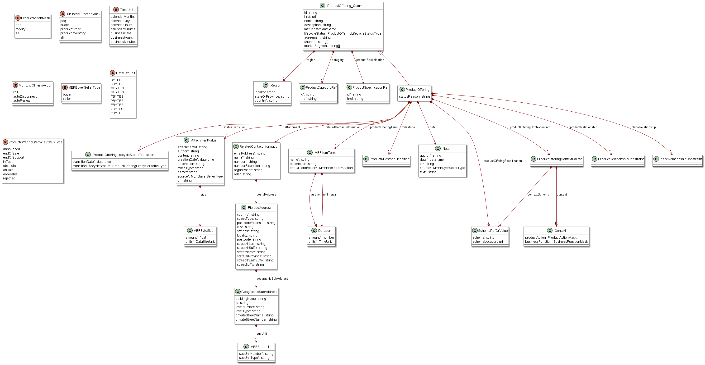
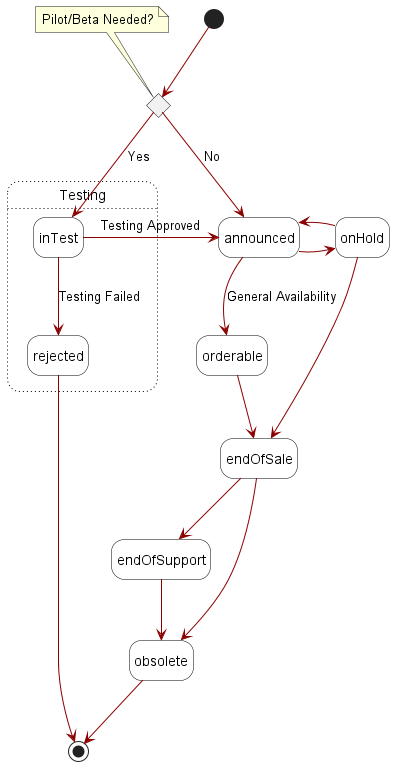
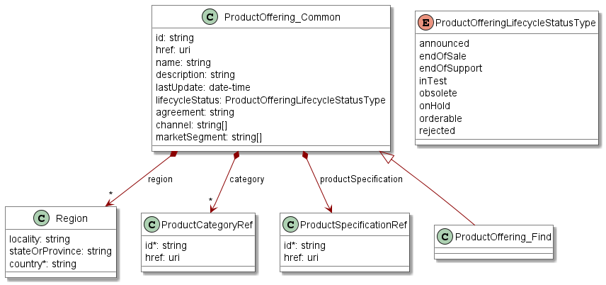
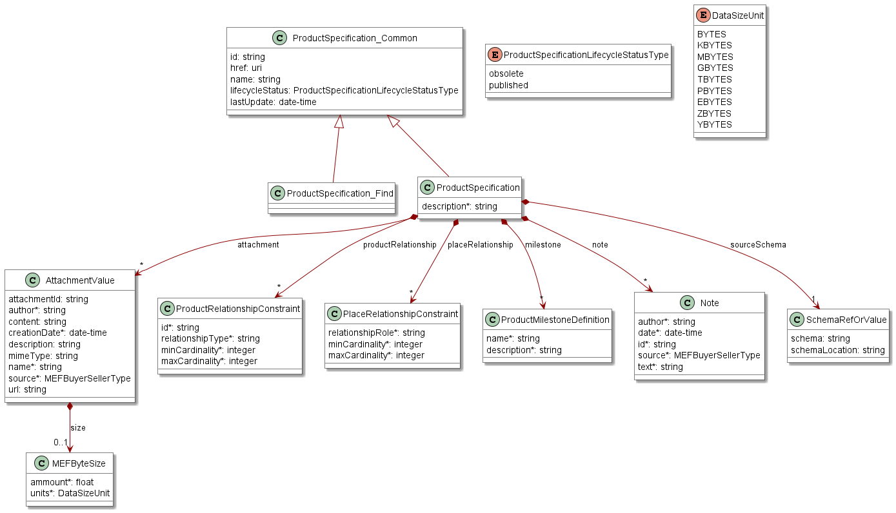
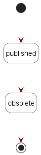

<style>
img
{
  display:block;
  float:none;
  margin-left:auto;
  margin-right:auto;
}
</style>


<div style="font-weight:bold; font-size:33pt; font-family: Sansation;  text-align:center">
Working Draft
</br>
MEF W142 v0.2
</br>
</br>
LSO Cantata and LSO Sonata Product Catalog API - Developer Guide
</br>
</br>
<p style="color:red;font-weight:bold; font-size:18pt">This draft represents MEF work in progress and is subject to change.</p>
</br>
</br>
December 2023
<p style="color:red;font-weight:bold; font-size:18pt">EXPORT CONTROL: This document contains technical data. The download, export, re-export or disclosure of the technical data contained in this document may be restricted by applicable U.S. or foreign export laws, regulations and rules and/or applicable U.S. or foreign sanctions ("Export Control Laws or Sanctions"). You agree that you are solely responsible for determining whether any Export Control Laws or Sanctions may apply to your download, export, reexport or disclosure of this document, and for obtaining (if available) any required U.S. or foreign export or reexport licenses and/or other required authorizations.
</p>
</div>

<div class="page"/>

**Disclaimer**

© MEF Forum 2023. All Rights Reserved.

The information in this publication is freely available for reproduction and
use by any recipient and is believed to be accurate as of its publication date.
Such information is subject to change without notice and MEF Forum (MEF) is not
responsible for any errors. MEF does not assume responsibility to update or
correct any information in this publication. No representation or warranty,
expressed or implied, is made by MEF concerning the completeness, accuracy, or
applicability of any information contained herein and no liability of any kind
shall be assumed by MEF as a result of reliance upon such information.

The information contained herein is intended to be used without modification by
the recipient or user of this document. MEF is not responsible or liable for
any modifications to this document made by any other party.

The receipt or any use of this document or its contents does not in any way
create, by implication or otherwise:

- (a) any express or implied license or right to or under any patent,
  copyright, trademark or trade secret rights held or claimed by any MEF member
  which are or may be associated with the ideas, techniques, concepts or
  expressions contained herein; nor

- (b) any warranty or representation that any MEF member will announce any
  product(s) and/or service(s) related thereto, or if such announcements are
  made, that such announced product(s) and/or service(s) embody any or all of
  the ideas, technologies, or concepts contained herein; nor

- (c) any form of relationship between any MEF member and the recipient or user
  of this document.

Implementation or use of specific MEF standards, specifications or
recommendations will be voluntary, and no Member shall be obliged to implement
them by virtue of participation in MEF Forum. MEF is a non-profit international
organization to enable the development and worldwide adoption of agile, assured
and orchestrated network services. MEF does not, expressly or otherwise,
endorse or promote any specific products or services.

**Copyright**

© MEF Forum 2023. Any reproduction of this document, or any portion thereof,
shall contain the following statement: "Reproduced with permission of MEF
Forum." No user of this document is authorized to modify any of the information
contained herein.

<div class="page"/>

**Table of Contents**

<!-- code_chunk_output -->

- [List of Contributing Members](#list-of-contributing-members)
- [1. Abstract](#1-abstract)
- [2. Terminology and Abbreviations](#2-terminology-and-abbreviations)
- [3. Compliance Levels](#3-compliance-levels)
- [4. Introduction](#4-introduction)
  - [4.1. Conventions in the Document](#41-conventions-in-the-document)
  - [4.2. Relation to Other Documents](#42-relation-to-other-documents)
  - [4.3. Approach](#43-approach)
  - [4.4. General concept](#44-general-concept)
    - [4.4.1. General concept introduction](#441-general-concept-introduction)
    - [4.4.2 JSON Subschema](#442-json-subschema)
    - [4.4.3 Product Specification and Product Offering Schemas](#443-product-specification-and-product-offering-schemas)
  - [4.5. High-Level Flow](#45-high-level-flow)
- [5. API Description](#5-api-description)
  - [5.1. High-level use cases](#51-high-level-use-cases)
  - [5.2. API Endpoint and Operation Description](#52-api-endpoint-and-operation-description)
    - [5.2.1. Seller side API Endpoints](#521-seller-side-api-endpoints)
    - [5.2.2. Buyer side API Endpoints](#522-buyer-side-api-endpoints)
  - [5.3. Specifying the Buyer ID and the Seller ID](#53-specifying-the-buyer-id-and-the-seller-id)
  - [5.4. Model Structural Validation](#54-model-structural-validation)
  - [5.5. Security Considerations](#55-security-considerations)
- [6. API Interactions and Flows](#6-api-interactions-and-flows)
  - [6.1. Product Category Use Cases](#61-product-category-use-cases)
  - [6.1.1 Product Category - Model](#611-product-category---model)
    - [6.1.3 Use case 1: Retrieve Product Category List](#613-use-case-1-retrieve-product-category-list)
      - [6.1.3.1 Interaction flow](#6131-interaction-flow)
      - [6.1.3.2. Retrieve Product Category List - Request](#6132-retrieve-product-category-list---request)
      - [6.1.3.3. Retrieve Product Category List - Response](#6133-retrieve-product-category-list---response)
    - [6.1.4 Use case 2: Retrieve Product Category by Identifier](#614-use-case-2-retrieve-product-category-by-identifier)
      - [6.1.4.1 Interaction flow](#6141-interaction-flow)
      - [6.1.4.2. Retrieve Product Category by Identifier - Request](#6142-retrieve-product-category-by-identifier---request)
      - [6.1.4.3. Retrieve Product Category by Identifier - Response](#6143-retrieve-product-category-by-identifier---response)
  - [6.2. Product Offering Use Cases](#62-product-offering-use-cases)
    - [6.2.1 Product Offering - Model](#621-product-offering---model)
      - [6.2.1.1 Introduction to the model](#6211-introduction-to-the-model)
      - [6.2.1.2 Product Offering Specification Schema](#6212-product-offering-specification-schema)
      - [6.2.1.3 Product Offering Contextual Info](#6213-product-offering-contextual-info)
    - [6.2.2 Product Offering - Lifecycle](#622-product-offering---lifecycle)
    - [6.2.3 Use case 3: Retrieve Product Offering List](#623-use-case-3-retrieve-product-offering-list)
      - [6.2.3.1 Interaction flow](#6231-interaction-flow)
      - [6.2.3.2. Retrieve Product Offering List - Request](#6232-retrieve-product-offering-list---request)
      - [6.2.3.3. Retrieve Product Offering List - Response](#6233-retrieve-product-offering-list---response)
    - [6.2.4 Use case 4: Retrieve Product Offering by Identifier](#624-use-case-4-retrieve-product-offering-by-identifier)
      - [6.2.4.1 Interaction flow](#6241-interaction-flow)
      - [6.2.4.2. Retrieve Product Offering by Identifier - Request](#6242-retrieve-product-offering-by-identifier---request)
      - [6.2.4.3. Retrieve Product Offering by Identifier - Response](#6243-retrieve-product-offering-by-identifier---response)
  - [6.3. Product Specification Use Cases](#63-product-specification-use-cases)
    - [6.3.1 Product Specification - Model](#631-product-specification---model)
    - [6.3.2 Product Specification - Lifecycle](#632-product-specification---lifecycle)
    - [6.3.3 Use case 5: Retrieve Product Specification List](#633-use-case-5-retrieve-product-specification-list)
      - [6.3.3.1 Interaction flow](#6331-interaction-flow)
      - [6.3.3.2. Retrieve Product Specification List - Request](#6332-retrieve-product-specification-list---request)
      - [6.3.3.3. Retrieve Product Specification List - Response](#6333-retrieve-product-specification-list---response)
    - [6.3.4 Use case 6: Retrieve Product Specification by Identifier](#634-use-case-6-retrieve-product-specification-by-identifier)
      - [6.3.4.1 Interaction flow](#6341-interaction-flow)
      - [6.3.4.2. Retrieve Product Specification by Identifier - Request](#6342-retrieve-product-specification-by-identifier---request)
      - [6.3.4.3. Retrieve Product Specification by Identifier - Response](#6343-retrieve-product-specification-by-identifier---response)
  - [6.4. Use case 7: Register for Event Notifications](#64-use-case-7-register-for-event-notifications)
    - [6.4.1. Register for Event Notifications - Request](#641-register-for-event-notifications---request)
    - [6.4.2. Register for Event Notifications - Response](#642-register-for-event-notifications---response)
    - [6.4.3. Unregister from Event Notifications - Request](#643-unregister-from-event-notifications---request)
    - [6.4.4. Unregister for Event Notifications - Response](#644-unregister-for-event-notifications---response)
  - [6.5. Use case 8: Send Event Notification](#65-use-case-8-send-event-notification)
- [7. API Details](#7-api-details)
  - [7.1. API patterns](#71-api-patterns)
    - [7.1.1. Indicating errors](#711-indicating-errors)
      - [7.1.1.1. Type Error](#7111-type-error)
      - [7.1.1.2. Type Error400](#7112-type-error400)
      - [7.1.1.3. `enum` Error400Code](#7113-enum-error400code)
      - [7.1.1.4. Type Error401](#7114-type-error401)
      - [7.1.1.5. `enum` Error401Code](#7115-enum-error401code)
      - [7.1.1.6. Type Error403](#7116-type-error403)
      - [7.1.1.7. `enum` Error403Code](#7117-enum-error403code)
      - [7.1.1.8. Type Error404](#7118-type-error404)
      - [7.1.1.9. Type Error500](#7119-type-error500)
      - [7.1.1.10. Type Error501](#71110-type-error501)
    - [7.1.2. Response pagination](#712-response-pagination)
  - [7.2. API Data model](#72-api-data-model)
    - [7.2.1. Product Category](#721-product-category)
      - [7.2.1.1. Type ProductCategory](#7211-type-productcategory)
      - [7.2.1.2. Type ProductOfferingRef](#7212-type-productofferingref)
    - [7.2.2. Product Offering](#722-product-offering)
      - [7.2.2.1. Type ProductOffering\_Common](#7221-type-productoffering_common)
      - [7.2.2.2. Type ProductOffering](#7222-type-productoffering)
      - [7.2.2.3. Type ProductOffering\_Find](#7223-type-productoffering_find)
      - [7.2.2.4. `enum` ProductOfferingLifecycleStatusType](#7224-enum-productofferinglifecyclestatustype)
      - [7.2.2.5. Type ProductOfferingLifecycleStatusTransition](#7225-type-productofferinglifecyclestatustransition)
      - [7.2.2.6. Type ProductSpecificationRef](#7226-type-productspecificationref)
      - [7.2.2.7. Type MEFItemTerm](#7227-type-mefitemterm)
      - [7.2.2.8. `enum` MEFEndOfTermAction](#7228-enum-mefendoftermaction)
      - [7.2.2.9. Type ProductOfferingContextualInfo](#7229-type-productofferingcontextualinfo)
      - [7.2.2.10. Type Context](#72210-type-context)
      - [7.2.2.11. `enum` ProductActionMask](#72211-enum-productactionmask)
      - [7.2.2.12. `enum` BusinessFunctionMask](#72212-enum-businessfunctionmask)
      - [7.2.2.13. Type Region](#72213-type-region)
    - [7.2.3. Product Specification](#723-product-specification)
      - [7.2.3.1. Type ProductSpecification\_Common](#7231-type-productspecification_common)
      - [7.2.3.2. Type ProductSpecification](#7232-type-productspecification)
      - [7.2.3.3. Type ProductSpecification\_Find](#7233-type-productspecification_find)
      - [7.2.3.4. `enum` ProductSpecificationLifecycleStatusType](#7234-enum-productspecificationlifecyclestatustype)
    - [7.2.4. Common types](#724-common-types)
      - [7.2.4.1. Type AttachmentValue](#7241-type-attachmentvalue)
      - [7.2.4.2. `enum` DataSizeUnit](#7242-enum-datasizeunit)
      - [7.2.4.3. Type Duration](#7243-type-duration)
      - [7.2.4.4. Type FieldedAddress](#7244-type-fieldedaddress)
      - [7.2.4.5. Type GeographicSubAddress](#7245-type-geographicsubaddress)
      - [7.2.4.6. `enum` MEFBuyerSellerType](#7246-enum-mefbuyersellertype)
      - [7.2.4.7. Type MEFByteSize](#7247-type-mefbytesize)
      - [7.2.4.8. Type MEFSubUnit](#7248-type-mefsubunit)
      - [7.2.4.9. Type Note](#7249-type-note)
      - [7.2.3.10. Type PlaceRelationshipConstraint](#72310-type-placerelationshipconstraint)
      - [7.2.1.11. Type ProductCategoryRef](#72111-type-productcategoryref)
      - [7.2.1.12. Type ProductMilestoneDefinition](#72112-type-productmilestonedefinition)
      - [7.2.3.13. Type ProductRelationshipConstraint](#72313-type-productrelationshipconstraint)
      - [7.2.4.14. Type RelatedContactInformation](#72414-type-relatedcontactinformation)
      - [7.2.4.15. Type SchemaRefOrValue](#72415-type-schemareforvalue)
      - [7.2.4.16. `enum` TimeUnit](#72416-enum-timeunit)
    - [7.2.5. Notification Registration](#725-notification-registration)
      - [7.2.8.1. Type EventSubscriptionInput](#7281-type-eventsubscriptioninput)
      - [7.2.8.2. Type EventSubscription](#7282-type-eventsubscription)
  - [7.3. Notification API Data model](#73-notification-api-data-model)
    - [7.3.1. Type Event](#731-type-event)
    - [7.3.2. Type ProductCategoryEvent](#732-type-productcategoryevent)
    - [7.3.3. Type ProductCategoryEventPayload](#733-type-productcategoryeventpayload)
    - [7.3.4. `enum` ProductCategoryEventType](#734-enum-productcategoryeventtype)
    - [7.3.5. Type ProductOfferingEvent](#735-type-productofferingevent)
    - [7.3.6. Type ProductOfferingEventPayload](#736-type-productofferingeventpayload)
    - [7.3.7. `enum` ProductOfferingEventType](#737-enum-productofferingeventtype)
    - [7.3.8. Type ProductSpecificationEvent](#738-type-productspecificationevent)
    - [7.3.9. Type ProductSpecificationEventPayload](#739-type-productspecificationeventpayload)
    - [7.3.10. `enum` ProductSpecificationEventType](#7310-enum-productspecificationeventtype)
- [8. References](#8-references)

<!-- /code_chunk_output -->

<div class="page"/>

# List of Contributing Members

The following members of the MEF participated in the development of this
document and have requested to be included in this list.

| Member |
| ------ |
|        |
|        |
|        |

**Table 1. Contributing Members**

<div class="page"/>

# 1. Abstract

This standard is intended to assist implementation of the Product Catalog
functionality defined for the LSO Cantata and LSO Sonata Interface Reference
Points (IRPs), for which requirements and use cases are defined in MEF 127
_Product Catalog Requirements and Use Cases_ [[MEF127](#8-references)]. This
standard consists of this document and complementary API definitions for
Product Catalog Querying and Product Catalog Notifications.

This standard normatively incorporates the following files by reference as if
they were part of this document, from the GitHub repository:

<https://github.com/MEF-GIT/MEF-LSO-Sonata-SDK>

- `productApi/catalog/productCatalog.api.yaml`
- `productApi/catalog/productCatalogNotification.api.yaml`

<https://github.com/MEF-GIT/MEF-LSO-Cantata-SDK>

- `productApi/catalog/productCatalog.api.yaml`
- `productApi/catalog/productCatalogNotification.api.yaml`

The Product Catalog API is defined using OpenAPI 3.0 [[OAS-V3](#8-references)]

<div class="page"/>

# 2. Terminology and Abbreviations

This section defines the terms used in this document. In many cases, the
normative definitions of terms are found in other documents. In these cases,
the third column is used to provide the reference that is controlling, in other
MEF or external documents.

In addition, terms defined in the standards referenced below are included in
this document by reference and are not repeated in the table below:

- MEF 55.1.1 Lifecycle Service Orchestration (LSO): Reference Architecture and
  Framework [[MEF 55.1.1](#8-references)]
- MEF 57.2 Product Order Management Requirements and Use Cases
  [[MEF57.2](#8-references)]
- MEF 127 Product Catalog Requirements and Use Cases [[MEF127](#8-references)]
- MEF 79 Address, Service Site, and Product Offering Qualification Management,
  Requirements and Use Cases, November 2019 [[MEF79](#8-references)]

<table>

<tr>
  <th>Term</th>
  <th>Description</th>
  <th>Reference</th>
</tr>
<tr>
  <td>JSON subschema</td>
  <td>
    JSON schema A is called the subschema of schema B when every JSON that is valid against schema A is valid against schema B.
  </td>
  <td>This document
  </td>
</tr>
</table>

**Table 2. Terminology**

<div class="page"/>

# 3. Compliance Levels

The key words **"MUST"**, **"MUST NOT"**, **"REQUIRED"**, **"SHALL"**, **"SHALL
NOT"**, **"SHOULD"**, **"SHOULD NOT"**, **"RECOMMENDED"**, **"NOT
RECOMMENDED"**, **"MAY"**, and **"OPTIONAL"** in this document are to be
interpreted as described in BCP 14 (RFC 2119 [[RFC2119](#8-references)], RFC
8174 [[RFC8174](#8-references)]) when, and only when, they appear in all
capitals, as shown here. All key words must be in bold text.

Items that are **REQUIRED** (contain the words **MUST** or **MUST NOT**) are
labeled as **[Rx]** for required. Items that are **RECOMMENDED** (contain the
words **SHOULD** or **SHOULD NOT**) are labeled as **[Dx]** for desirable.
Items that are **OPTIONAL** (contain the words MAY or OPTIONAL) are labeled as
**[Ox]** for optional.

A paragraph preceded by **[CRa]<** specifies a conditional mandatory
requirement that **MUST** be followed if the condition(s) following the "<"
have been met. For example, **"[CR1]<[D38]"** indicates that Conditional
Mandatory Requirement 1 must be followed if Desirable Requirement 38 has been
met. A paragraph preceded by **[CDb]<** specifies a Conditional Desirable
Requirement that **SHOULD** be followed if the condition(s) following the "<"
have been met. A paragraph preceded by **[COc]<**specifies a Conditional
Optional Requirement that **MAY** be followed if the condition(s) following the
"<" have been met.

<div class="page"/>

# 4. Introduction

The Product Catalog API allows the Buyer to retrieve Product Specifications,
Product Offerings, and Product Categories they are assigned to. The API defines
notifications related to the lifecycle of these entities. This allows the
establishment of commercial synchronization between the Seller and potential
Buyers by the possibility of zero-touch introduction of the new Product
Specifications and Product Offerings to the market.

This standard specifies the Application Programming Interface (API) for the
Product Catalog functionality of the LSO Cantata IRP and LSO Sonata IRP as
defined in the _MEF 55.1 Lifecycle Service Orchestration (LSO): Reference
Architecture and Framework_ [[MEF55.1](#8-references)]. The LSO Reference
Architecture is shown in Figure 1 with both IRPs highlighted.


**Figure 1. The LSO Reference Architecture**

Cantata and Sonata IRPs define pre-ordering and ordering functionalities that
allow an automated exchange of information between business applications of the
Buyer (Customer or Service Provider) and Seller (Service Provider or Partner)
Domains. Those are:

- Product Catalog
- Address Validation
- Site Retrieval
- Product Offering Qualification
- Product Quote
- Product Inventory
- Product Ordering
- Trouble Ticketing
- Billing

The business requirements and use cases for the Product Catalog are defined in
MEF 127 _Product Catalog Requirements and Use Cases_ [[MEF127](#8-references)].

**_Note:_** [[TMF620](#8-references)] Product Catalog API covers use cases
related to Product Catalog management as well. Whereas the goal of this API
(specified in this document) is to allow the publishing of Product Offerings
and Product Specifications and onboarding of them (between the Buyer and
Seller) in a fast and efficient way (inter-carrier read-only API ).

This document is structured as follows:

- [Chapter 4](#4-introduction) provides an introduction to the Product Catalog
  and its description in a broader context of Cantata and Sonata and their
  corresponding SDKs.
- [Chapter 5](#5-api-description) gives an overview of endpoints, resource
  model and design patterns.
- Use cases and flows are presented in
  [Chapter 6](#6-api-interactions-and-flows).
- And finally, [Chapter 7](#7-api-details) complements previous sections with a
  detailed API description.

## 4.1. Conventions in the Document

- Code samples are formatted using code blocks. When notation `<< some text >>`
  is used in the payload sample it indicates that a comment is provided instead
  of an example value and it might not comply with the OpenAPI definition.
- Model definitions are formatted as in-line code (e.g. `ProductOffering`).
- In UML diagrams the default cardinality of associations is `0..1`. Other
  cardinality markers are compliant with the UML standard.
- In the API details tables and UML diagrams required attributes are marked
  with a `*` next to their names.
- In UML sequence diagrams `` notation is used to indicate a variable to be
  substituted with a correct value.

## 4.2. Relation to Other Documents

This API implements the Product Catalog related requirements and use cases that
are defined in MEF 127 [[MEF127](#8-references)]. The API definition builds on
_TMF620 Product Catalog API REST Specification 4.1.0_
[[TMF620](#8-references)].

## 4.3. Approach

As presented in Figure 2, both Cantata and Sonata API frameworks consist of
three structural components:

- Generic API framework
- Product-independent information (Function-specific information and
  Function-specific operations)
- Product-specific information (MEF product specification data model)


**Figure 2. Cantata and Sonata API framework**

The essential concept behind the framework is to decouple the common structure,
information and operations from the specific product information content.  
Firstly, the Generic API Framework defines a set of design rules and patterns
that are applied across all Cantata or Sonata APIs.  
Secondly, the product-independent information of the framework focuses on a
model of a particular Cantata or Sonata functionality and is agnostic to any of
the product specifications.  
Finally, the product-specific information part of the framework focuses on MEF
product specifications that define business-relevant attributes and
requirements for supporting MEF subscriber and MEF operator services.

In this framework, the Product Catalog is a Seller provided repository that
hosts Product-specific definitions. Every product-related operation starts with
the Product Catalog, firstly by specifying the product, then by publishing the
Product Offerings and Product Specifications to chosen Buyers.

## 4.4. General concept

### 4.4.1. General concept introduction

Product Catalog introduces three key Product Catalog Element types: Product
Specification, Product Offering, and Product Category. The Product Catalog
modeling starts with the introduction of the Product Specification type which
defines the Product's attributes (with their types, cardinalities, and
allowable values) and relationships that define how the Product may be related
to other Products. Once Product Specifications are defined in the Product
Catalog, they may be made available by the Seller for marketing purposes.
Because terms and conditions which define where and how a Product is available
on the market are usually organized by different business processes, the
Product Offering element type has been defined in the Product Catalog. Product
Offering element type may further constrain attributes' values and
cardinalities of the relations to define the desired offer.

In short, Product Specification is the definition of the Product, and Product
Offering is the commercial realization of the Product Specification in the
market by the Seller.

A given Product Specification may be exposed on the market by multiple
different Product Offerings. To better structure and organize the Product
Catalog, Product Categories have been introduced to allow the grouping of
related Product Offerings. To make the categorizing more flexible, it is
allowed to group Product Categories within a parent Product Category as well.

### 4.4.2 JSON Subschema

JSON Subschema term has been introduced to allow defining specialization of
particular JSON Schema. Specialization should be understood as narrowing the
set of JSONs that are valid against the given JSON Schema.

JSON Subschema definition is formalized as:

> JSON schema A is called the subschema of schema B when every JSON that is
> valid against schema A is valid against schema B.

The rules that are used to constrain or restrict the JSON Schema are described
in the chapter
[[Product Offering Specification Schema](#6212-product-offering-specification-schema)].

Let's consider illustrative JSON Schema as an example (this is the reduced JSON
Schema of AccessElineOvc for illustrative purposes):

```json
{
  "$schema": "http://json-schema.org/draft-07/schema#",
  "$id": "https://mef.com/product.schema.json",
  "title": "AccessELineOvc",
  "type": "object",
  "properties": {
    "maximumFrameSize": {
      "type": "integer",
      "minimum": 1526
    },
    "ceVlanIdPreservation": {
      "type": "string",
      "enum": ["PRESERVE", "STRIP", "RETAIN"]
    }
  }
}
```

JSON Subschema of the schema above could be constructed as:

```json
{
  "$schema": "http://json-schema.org/draft-07/schema#",
  "$id": "https://mef.com/product.schema.json",
  "title": "AccessELineOvc",
  "type": "object",
  "properties": {
    "maximumFrameSize": {
      "type": "integer",
      "minimum": 1526
    },
    "ceVlanIdPreservation": {
      "type": "string",
      "enum": ["PRESERVE", "STRIP"]
    }
  },
  "required": ["maximumFrameSize"]
}
```

Considering two following JSON payloads:

- Payload A:

```json
{
  "maximumFrameSize": 1526,
  "ceVlanIdPreservation": "STRIP"
}
```

- Payload B:

```json
{
  "maximumFrameSize": 1526,
  "ceVlanIdPreservation": "RETAIN"
}
```

we see that Payload A is compliant with both schemas, while Payload B is valid
only against the first schema. Since the second schema is more restrictive, it
is considered a subschema of the first schema.

### 4.4.3 Product Specification and Product Offering Schemas

The chapters above introduced the Product Specification as the Product Catalog
Element type which defines the attributes of the Product. Those attributes are
organized as [[JSON Schema](#8-references)] which is called the
`Source Schema`.

Product Offering is introduced as the second key Product Catalog Element type
which exposes the Product Specification to the market and may constrain the
Product Specification attributes defined in the `Source Schema` which produces
another more restrictive JSON Schema specific for the Product Offering called
the `Intermediate Schema`. This Intermediate Schema is the JSON Subschema of
the `Source Schema`.

Additionally, it may be required to constrain the `Intermediate Schema` in the
context of a particular Business Function and Product Action (e.g. some
attributes may not be relevant for the Product Offering Qualification business
function or the `modify` Product Action). As such, it is possible to define
such cases in the `Contextual Schema` for every combination of Business
Function and Product Action context. This Contextual Schema is the JSON
Subschema of the `Intermediate Schema`.

The JSON Subschema is still a JSON Schema.

Summarizing, three types of schemas may be defined in the Product Catalog:

- `Source Schema` which is the definition of the Product Specification (e.g.
  MEF Standard),
- `Intermediate Schema` which is the constrained usage of the `Source Schema`
  for a given Product Offering
  [[Intermediate Schema](#6212-product-offering-specification-schema)],
- `Contextual Schema` which defines the contextual usage of the
  `Intermediate Schema` in the given context of Business Function and Product
  Action [[Contextual Schema](#6213-product-offering-contextual-info)].

The below diagram depicts the above summary in graphical form.


**Figure 3. Relationship between Source Schema, Intermediate Schema and
Contextual Schema**

## 4.5. High-Level Flow

The Product Catalog is part of a broader Cantata and Sonata End-to-End flow.
Figure 4 shows a high-level diagram to get a good understanding of the whole
process and Product Catalog's position within it.


**Figure 4. Cantata and Sonata End-to-End Function Flow**

- Product Catalog:
  - Allows the Buyer to retrieve Product Offerings and Product Specifications
    describing the Products available for ordering from the Seller's Product
    Catalog.
- Address Validation:
  - Allows the Buyer to retrieve address information from the Seller, including
    exact formats, for addresses known to the Seller.
- Site Retrieval:
  - Allows the Buyer to retrieve Geographic Site information including exact
    formats for Geographic Sites known to the Seller.
- Product Offering Qualification (POQ):
  - Allows the Buyer to check whether the Seller can deliver a product or set
    of products from among their product offerings at the geographic address or
    a Geographic Site specified by the Buyer; or modify a previously purchased
    product.
- Quote:
  - Allows the Buyer to submit a request to find out how much the installation
    of an instance of a Product Offering, an update to an existing Product, or
    a disconnect of an existing Product will cost.
- Product Order:
  - Allows the Buyer to request the Seller to initiate and complete the
    fulfillment process of an installation of a Product Offering, an update to
    an existing Product, or a disconnect of an existing Product at the address
    defined by the Buyer.
- Product Inventory:
  - Allows the Buyer to retrieve the information about the existing Product
    instances from Seller's Product Inventory.
- Trouble Ticketing:
  - Allows the Buyer to create, retrieve, and update Trouble Tickets as well as
    receive notifications about Incidents' and Trouble Tickets' updates. This
    allows managing issues and situations for a Product provided by the Seller.
- Billing:
  - Allows the Buyer to retrieve the Billing (Invoice) information, download it
    as a document, and receive notifications of document creation.

<div class="page"/>

# 5. API Description

This section presents the API structure and design patterns. It starts with the
high-level use cases diagram. Then it describes the REST endpoints with use
case mapping. Next, it gives an overview of the API resource model.

## 5.1. High-level use cases

Figure 5 presents a high-level use case diagram as specified in MEF 127
[[MEF127](#8-references)] in section 8. This picture aims to help understand
the endpoint mapping for the supported use cases. Use cases are described
extensively in [chapter 6](#6-api-interactions-and-flows).


**Figure 5. Use cases**

## 5.2. API Endpoint and Operation Description

### 5.2.1. Seller side API Endpoints

**Base URL for Cantata**:
`https://{{serverBase}}:{{port}}{{?/seller_prefix}}/mefApi/cantata/productCatalog/v2/`

**Base URL for Sonata**:
`https://{{serverBase}}:{{port}}{{?/seller_prefix}}/mefApi/sonata/productCatalog/v2/`

The following API endpoints are implemented by the Seller and allow the Buyer
to retrieve Product Categories, Product Offerings, and Product Specifications
as well as register for Notifications. The endpoints and corresponding data
model are defined in

`productApi/productCatalog/productCatalog.api.yaml`.

| API endpoint                       | Description                                                                                                                                                                      | MEF 127 Use Case mapping                           |
| ---------------------------------- | -------------------------------------------------------------------------------------------------------------------------------------------------------------------------------- | -------------------------------------------------- |
| `GET /productCategory`             | The Buyer requests a list of Product Categories from the Seller based on a set of specified filter criteria. The Seller returns a summarized list of Product Categories.         | UC 1: Retrieve Product Category List               |
| `GET /productCategory/{{id}}`      | The Buyer requests detailed information about a single Product Category based on a Product Category Identifier.                                                                  | UC 2: Retrieve Product Category by Identifier      |
| `GET /productOffering`             | The Buyer requests a list of Product Offerings from the Seller based on a set of specified filter criteria. The Seller returns a summarized list of Product Offerings.           | UC 3: Retrieve Product Offering List               |
| `GET /productOffering/{{id}}`      | The Buyer requests detailed information about a single Product Offering based on a Product Offering Identifier.                                                                  | UC 4: Retrieve Product Offering by Identifier      |
| `GET /productSpecification`        | The Buyer requests a list of Product Specifications from the Seller based on a set of specified filter criteria. The Seller returns a summarized list of Product Specifications. | UC 5: Retrieve Product Specification List          |
| `GET /productSpecification/{{id}}` | The Buyer requests detailed information about a single Product Specification based on a Product Specification Identifier.                                                        | UC 6: Retrieve Product Specification by Identifier |

**Table 3. Seller side mandatory API endpoints**

**[R1]** The Seller **MUST** implement all API endpoints listed in Table 3.
[MEF127 R16]

| API endpoint      | Description                                                                                                          | MEF 127 Use Case mapping                         |
| ----------------- | -------------------------------------------------------------------------------------------------------------------- | ------------------------------------------------ |
| `POST /hub`       | The Buyer requests to subscribe to Product Catalog notifications.                                                    | UC 7: Register for Product Catalog Notifications |
| `GET /hub/{{id}}` | A request initiated by the Buyer to retrieve the details of the notification subscription with the given Identifier. | UC 7: Register for Product Catalog Notifications |
| `DELETE /hub/`    | A request initiated by the Buyer to instruct the Seller to stop sending notifications.                               | UC 7: Register for Product Catalog Notifications |

**Table 4. Seller side optional API endpoints**

**[O1]** The Seller **MAY** implement API endpoints listed in Table 4. [MEF127
O3]

**[CR1]<[O1]** If any of the endpoints defined in Table 4 is implemented, then
all of the endpoints listed in Table 4 **MUST** be implemented

### 5.2.2. Buyer side API Endpoints

**Base URL for Cantata**:
`https://:/mefApi/cantata/productCatalogNotification/v2/`

**Base URL for Sonata**:
`https://:/mefApi/cantata/productCatalogNotification/v2/`

The following API Endpoints are used by the Seller to post notifications to
registered listeners. The endpoints and corresponding data model are defined in

`productApi/catalog/productCatalogNotification.api.yaml`

| API Endpoint                                                   | Description                                                                                                    | MEF 127 Use Case Mapping                 |
| -------------------------------------------------------------- | -------------------------------------------------------------------------------------------------------------- | ---------------------------------------- |
| `POST /listener/productCategoryCreateEvent`                    | A request initiated by the Seller to notify the Buyer on new `ProductCategory` creation.                       | UC 08: Send Product Catalog Notification |
| `POST /listener/productCategoryAttributeValueChangeEvent`      | A request initiated by the Seller to notify the Buyer of `ProductCategory` attribute value change.             | UC 08: Send Product Catalog Notification |
| `POST /listener/productCategoryStatusChangeEvent`              | A request initiated by the Seller to notify the Buyer on `ProductCategory.lifecycleStatus` status change.      | UC 08: Send Product Catalog Notification |
| `POST /listener/productOfferingCreateEvent`                    | A request initiated by the Seller to notify the Buyer of new `ProductOffering` creation.                       | UC 08: Send Product Catalog Notification |
| `POST /listener/productOfferingAttributeValueChangeEvent`      | A request initiated by the Seller to notify the Buyer of `ProductOffering` attribute value change.             | UC 08: Send Product Catalog Notification |
| `POST /listener/productOfferingStatusChangeEvent`              | A request initiated by the Seller to notify the Buyer on `ProductOffering.lifecycleStatus` status change.      | UC 08: Send Product Catalog Notification |
| `POST /listener/productSpecificationCreateEvent`               | A request initiated by the Seller to notify the Buyer on new `ProductSpecification` creation.                  | UC 08: Send Product Catalog Notification |
| `POST /listener/productSpecificationAttributeValueChangeEvent` | A request initiated by the Seller to notify the Buyer of `ProductSpecification` attribute value change.        | UC 08: Send Product Catalog Notification |
| `POST /listener/productSpecificationStatusChangeEvent`         | A request initiated by the Seller to notify the Buyer on `ProductSpecification.lifecycleStatus` status change. | UC 08: Send Product Catalog Notification |

**Table 5. Buyer side optional API endpoints**

**[O2]** The Buyer **MAY** support API endpoints listed in Table 5. [MEF127 O3]

## 5.3. Specifying the Buyer ID and the Seller ID

A business entity willing to represent multiple Buyers or multiple Sellers must
follow requirements of MEF 79 [[MEF79](#8-references)] chapter 8.8, which
states:

> For requests of all types, there is a business entity that is initiating an
> Operation (called a Requesting Entity) and a business entity that is
> responding to this request (called the Responding Entity). In the simplest
> case, the Requesting Entity is the Buyer and the Responding Entity is the
> Seller. However, in some cases, the Requesting Entity may represent more than
> one Buyer and similarly, the Responding Entity may represent more than one
> Seller.
>
> While it is outside the scope of this specification, it is assumed that the
> Requesting Entity and the Responding Entity are aware of each other and can
> authenticate requests initiated by the other party. It is further assumed
> that both the Buying Entity and the Requesting Entity know:
>
> a) the list of Buyers the Requesting Entity represents when interacting with
> this Responding Entity; and  
> b) the list of Sellers that this Responding Entity represents to this
> Requesting Entity.

In the API the `buyerId` and `sellerId` are represented as query parameters in
each operation defined in `productCatalog.api.yaml` and as attributes of events
as described in `productCatalogNotification.api.yaml`.

**[R2]** If the Requesting Entity has the authority to represent more than one
Buyer the request **MUST** include `buyerId` query parameter that identifies
the Buyer being represented [MEF79 R80]

**[R3]** If the Requesting Entity represents precisely one Buyer with the
Responding Entity, the request **MUST NOT** specify the `buyerId` [MEF79 R81]

**[R4]** If the Responding Entity represents more than one Seller to this Buyer
the request **MUST** include `sellerId` query parameter that identifies the
Seller with whom this request is associated [MEF79 R82]

**[R5]** If the Responding Entity represents precisely one Seller to this
Buyer, the request **MUST NOT** specify the `sellerId` [MEF79 R83]

**[R6]** If `buyerId` or `sellerId` attributes were specified in the request
same attributes **MUST** be used in the notification payload.

## 5.4. Model Structural Validation

The structure of the HTTP payloads exchanged via Product Catalog API endpoints
is defined using OpenAPI version 3.0.

**[R7]** Implementations **MUST** use payloads that conform to these
definitions.

## 5.5. Security Considerations

There must be an authentication mechanism whereby a Seller can be assured who a
Buyer is and vice-versa. There must also be authorization mechanisms in place
to control what a particular Buyer or Seller is allowed to do and what
information may be obtained. However, the definition of the exact security
mechanism and configuration is outside the scope of this document. It is
specified by a separate MEF Project ([[MEF128](#8-references)]).

<div class="page"/>

# 6. API Interactions and Flows

This section provides a detailed insight into the API functionality, use cases,
and flows. It starts with Table 6 presenting a list and short description of
all business use cases then presents the variants of end-to-end interaction
flows, and in the following subchapters describes the API usage flow and
examples for each of the use cases.

Table 6 lists the use cases supported by Product Catalog API (use case numbers
as in MEF 127 for mapping):

| Use Case # | Use Case Name                                                      | Use Case Description                                                                                                                                                              |     |
| ---------- | ------------------------------------------------------------------ | --------------------------------------------------------------------------------------------------------------------------------------------------------------------------------- | --- |
| 1          | Retrieve Product Category List                                     | The Buyer requests a list of Product Categories from the Seller based on a set of specified filter criteria. The Seller returns a summarized list of Product Categories.          |     |
| 2          | Retrieve Product Category by Product Category Identifier           | The Buyer requests detailed information about a single Product Category based on a Product Category Identifier.                                                                   |     |
| 3          | Retrieve Product Offering List                                     | The Buyers requests a list of Product Offerings from the Seller based on a set of specified filter criteria. The Seller returns a summarized list of Product Offering.            |     |
| 4          | Retrieve Product Category by Product Offering Identifier           | The Buyer requests detailed information about a single Product Offering based on a Product Offering Identifier.                                                                   |     |
| 5          | Retrieve Product Specification List                                | The Buyers requests a list of Product Specifications from the Seller based on a set of specified filter criteria. The Seller returns a summarized list of Product Specifications. |     |
| 6          | Retrieve Product Specification by Product Specification Identifier | The Buyer requests detailed information about a single Product Specification based on a Product Specification Identifier.                                                         |     |
| 7          | Register for Event Notifications                                   | The Buyer requests to subscribe to Product Categories, Product Offerings and Product Specifications Notifications.                                                                |     |
| 8          | Send Event Notification                                            | Send Event Notification The Seller sends a notification regarding a Product Category, Product Offering, or Product Specification to the Buyer.                                    |     |

**Table 6. Use cases description**

Figure 6 presents an example of the flow of `ProductOffering` lifecycle and
possible related requests.


**Figure 6. Exemplary API flow for Product Offering**

Registration for events is optional, so all sequences on the diagram related to
notification exchange were framed as optional, so as the below description of
the sequence diagram.

- _(optional)_ The Buyer registers the listener by sending the request (1) with
  specified `eventType` as `productOfferingCreateEvent`,
  `productOfferingStatusChangeEvent`, and
  `productOfferingAttributeValueChangeEvent`.
- _(optional)_ (2) The Seller responds with success.
- The Seller publishes new `ProductOffering` with `lifecycleStatus=announced`
  (3).
- _(optional)_ What causes sending notification to the Buyer (4-5) with the
  type `productOfferingCreateEvent`.
- The Seller decides to make the previously created offering available for
  ordering by changing `lifecycleStatus` to `orderable` (6).
- _(optional)_ What causes sending notification to the Buyer (7-8) with type
  the `productOfferingStatusChangeEvent`.
- The Buyer decides to ask for offerings available for ordering by sending a
  request (9) providing in query parameters required `lifecycleStatus` as
  `orderable`.
- (10) The Seller responds with the list of `orderable` offerings.
- (11) The Buyer asks for details of the retrieved offering by sending a
  request (12) with the specified `identifier` of the offering.
- (13) The Seller responds with detailed offering information.
- The Seller decides to end selling previously published offering by changing
  `lifecycleStatus` to `endOfSale` (14).
- _(optional)_ What causes sending notification to the Buyer (15-16) with the
  type `productOfferingStatusChangeEvent`.
- The Buyer asks again for offerings available for ordering by sending a
  request (17) providing in query parameters required `lifecycleStatus` as
  `orderable`.
- Because there is no offering that is available for sale, the Seller responds
  with an empty list (18).

The detailed business requirements of each of the use cases are described in
section 8 of MEF 127 [[MEF127](#8-references)].

## 6.1. Product Category Use Cases

## 6.1.1 Product Category - Model

Product Categories are designed to be used for grouping related Product
Offerings into logical containers (e.g. grouping Product Offerings delivered
via Fiber medium).


**Figure 7. Product Category Model**

**[R8]** After a Product Category has been created, the `id` **MUST NOT** be
modified. [MEF127 R22]

**[R9]** In the case of a change of any attribute except `subCategory`, the
Seller **MUST** set the `lastUpdate` attribute with the date of the most recent
modification. [MEF127 R21]

**[R10]** If a `ProductCategory` has a parent category, then its `id` **MUST**
be in the `subCategory` list of the referenced Product Category. [MEF127 R17]

**[R11]]** If a Product Category A is specified in the `subCategory` list of
Product Category B, then the `id` of Product Category B **MUST** be included in
the `parentCategory` attribute of Product Category A. [MEF127 R19]

**[R12]** If a Product Category has no parent Category, then its `id` **MUST
NOT** be in the `subCategory` list for any Product Category. [MEF127 R18]

**[R13]** The `productOffering` attribute **MUST** contain all Product
Offerings that reference this Product Category. [MEF127 R20]

### 6.1.3 Use case 1: Retrieve Product Category List

#### 6.1.3.1 Interaction flow

The flow of this use case is very simple and is described in Figure 8.


**Figure 8. Use Case 1 - Retrieve Product Category List**

The Buyer wants to retrieve the list of Product Categories that match the given
filtering criteria. Later on, the result may be used to query Product Offerings
by category.

#### 6.1.3.2. Retrieve Product Category List - Request

**[O3]** The Buyer **MAY** retrieve the list of Product Categories by using a
`GET /productCategory` operation with desired filtering criteria. The
attributes that are available to be used are [MEF127 O4]:

- `name`
- `lastUpdate.gt`
- `lastUpdate.lt`
- `parentCategory.id`

The Buyer may also ask for pagination with the use of the `offset` and `limit`
parameters. The filtering and pagination attributes must be specified in URI
query format [RFC3986](#8-references). Section
[7.1.2.](#712-response-pagination) provides details about the implementation of
pagination mechanism.

```url
https://serverRoot/mefApi/sonata/productCatalog/v2/category?lastUpdate.gt=2023-01-01T00:00:00.000Z&limit=10&offset=0
```

The example above shows a Buyer's request to get the first ten Product
Categories that were updated since the beginning of 2023. The correct response
(HTTP code `200`) in the response body contains a list of `ProductCategory`
objects matching the criteria. To get more details (e.g. the list of Product
Offerings in the given Product Category), the Buyer has to query a specific
`ProductCategory` by `id`.

#### 6.1.3.3. Retrieve Product Category List - Response

The snippet below presents an example of the Retrieve Product Category List
response:

**Retrieve `ProductCategory` List Response**

Headers:

```json
X-Result-Count=1
X-Total-Count=1
X-Pagination-Throttled=false
```

Body:

```json
[
  {
    "id": "productCategory-2",
    "href": "http://mef.com:8080/mefApi/sonata/productCatalog/v2/category/productCategory-2",
    "name": "Access E-Lines Product Offerings",
    "description": "This category groups are available Access E-Line Product Offerings",
    "lastUpdate": "2023-01-19T16:33:20.324Z",
    "parentCategory": {
      "id": "productCategory-1",
      "href": "http://mef.com:8080/mefApi/sonata/productCatalog/v2/category/productCategory-1"
    },
    "productOffering": [
      {
        "id": "productOffering-1",
        "href": "http://mef.com:8080/mefApi/sonata/productCatalog/v2/productOffering/productOffering-1"
      },
      {
        "id": "productOffering-2",
        "href": "http://mef.com:8080/mefApi/sonata/productCatalog/v2/productOffering/productOffering-2"
      }
    ]
  }
]
```

**[R14]** The Seller **MUST** provide all attributes of `ProductCategory` (if
they are set in the system) [MEF127 R23], [MEF127 24]:

**[R15]** In case no items matching the criteria are found, the Seller **MUST**
return a valid response with an empty list. [MEF127 R26]

The full list of attributes is available in [Section 7](#7-api-details) and in
the API specification which is an integral part of this standard.

### 6.1.4 Use case 2: Retrieve Product Category by Identifier

#### 6.1.4.1 Interaction flow

The flow of this use case is very simple and is described in Figure 9.


**Figure 9. Use Case 2 - Retrieve Product Category by Identifier**

The Buyer wants to retrieve detailed information about a single Product
Category with a given `id`.

#### 6.1.4.2. Retrieve Product Category by Identifier - Request

**[R16]** The Buyer must provide the `id` of the Product Category in the query.
[MEF127 R27]

```url
https://mef.com:8080/mefApi/sonata/productCatalog/v2/category/productCategory-2
```

The example above shows a Buyer's request to get the Product Category with `id`
equal to `productCategory-2`. The correct response (HTTP code `200`) in the
response body contains a single `ProductCategory` object matching the given
`id`.

#### 6.1.4.3. Retrieve Product Category by Identifier - Response

The snippet below presents an example of the Retrieve Product Category
Response:

**Retrieve `ProductCategory` by Identifier Response**

```json
{
  "id": "productCategory-2",
  "href": "http://mef.com:8080/mefApi/sonata/productCatalog/v2/category/productCategory-2",
  "name": "Access E-Lines Product Offerings",
  "description": "This category groups are available Access E-Line Product Offerings",
  "lastUpdate": "2023-01-19T16:33:20.324Z",
  "parentCategory": {
    "id": "productCategory-1",
    "href": "http://mef.com:8080/mefApi/sonata/productCatalog/v2/category/productCategory-1"
  },
  "productOffering": [
    {
      "id": "productOffering-1",
      "href": "http://mef.com:8080/mefApi/sonata/productCatalog/v2/productOffering/productOffering-1"
    },
    {
      "id": "productOffering-2",
      "href": "http://mef.com:8080/mefApi/sonata/productCatalog/v2/productOffering/productOffering-2"
    }
  ]
}
```

**[R17]** The Seller **MUST** put the all `ProductCategory` attributes that are
set in the Seller's system: [MEF127 R28], [MEF127 R29]:

- `id`
- `name`
- `description`
- `lastUpdate`

The full list of attributes is available in [Section 7](#7-api-details) and in
the API specification which is an integral part of this standard.

## 6.2. Product Offering Use Cases

### 6.2.1 Product Offering - Model

#### 6.2.1.1 Introduction to the model

Figure 10 presents the data model of the Product Offering. The model of the
retrieve list response (`ProductOffering_Find`) is a subset of the
`ProductOffering` model and contains only those attributes that can (or must)
be returned by the Seller. For visibility of these differences, the
`ProductOffering_Common` has been introduced. Though, it is not to be used
directly in the response to any endpoint.

The full list of attributes is available in [Section 7](#7-api-details) and in
the API specification which is an integral part of this standard.



**Figure 10. Product Offering Model**

**[R18]** Once the Product Offering is in `lifecycleStatus=announced`, the
Seller **MUST NOT** update the following Product Offering attributes: [MEF127
R32], [MEF127 R34]

- `id`
- `productOfferingTerm`
- `productSpecification`
- `productOfferingSpecification`
- `productRelationship`
- `placeRelationship`
- `productOfferingContextualInfo`

Product Offerings are designed to be used for exposing the particular Product
Specification to the market, therefore Product Specification related attributes
must not change.

**[R19]** Because attributes defined in [R18] are not allowed to be changed,
the Seller **MUST** create a new `ProductOffering` (with a new `id`) to
introduce a new version that modifies those attributes. [MEF127 R32]

It's at the Seller's discretion to transition the older version of Product
Offering to a `lifecycleStatus` that prevents using that offering for ordering.

**[R20]** In the case of any of `ProductOffering` attributes has changed, the
Seller **MUST** update the `lastUpdate` attribute with the date of the
modification occurred. [MEF127 R31]

**[R21]** The Seller **MUST** update the `statusReason` attribute whenever the
`lifecycleStatus` attribute is changed.

**[R22]** The following attributes of `statusTransition` entities **MUST** be
set [MEF127 R35]:

- `transitionDate`
- `transitionLifecycleStatus`

**[D1]** Whenever the `transitionDate` has passed but the transition has not
taken place, then the Seller **SHOULD** update the `transitionDate` with the
new anticipated date of transition.

**[R23]** When the planned transition took place, then the Seller **MUST NOT**
remove the corresponding record from the `statusTransition` list.

The `statusTransition` records are used for historical log purposes.

**[R24]** The `country` attribute **MUST** be set when specyfying a `region`
[MEF127 R36]

**[R25]** The following attributes of `productOfferingTerm` **MUST** be set
[MEF127 R38]:

- `name`
- `duration`
- `endOfTermAction`

**[R26]** If the `productOfferingTerm.endOfTermAction` is set to `roll` then
attribute `productOfferingTerm.rollInternal` **MUST** be set. [MEF127 R39]

**ProductRelationshipConstraint**

**[R27]** A `ProductRelationshipConstraint` **MUST** contain the following
attributes: [MEF127 R40]

- `id`
- `relationshipType`
- `minCardinality`
- `maxCardinality`

**[R28]** The `minCardinality` **MUST** be greater than or equal to the
`minCardinality` of the respective `productRelationship` it attempts to
restrict (of the Product Offering's Specification for the specified `id` and
`relationshipType`). [MEF127 R41]

**[R29]** If provided, the `maxCardinality` **MUST** be less than or equal to
the `maxCardinality` of the respective `productRelationship` it attempts to
restrict (of the Product Offering's Specification for the specified `id` and
`relationshipType`). [MEF127 R42]

**[R30]** `maxCardinality` **MUST** be greater than or equal to the
`minCardinality`.

**PlaceRelationshipConstraint**

**[R31]** A `PlaceRelationshipConstraint` **MUST** contain the following
attributes: [MEF127 R43]

- `relationshipRole`
- `minCardinality`
- `maxCardinality`

**[R32]** The `minCardinality` **MUST** be greater than or equal to the
`minCardinality` of the respective `placeRelationship` it attempts to restrict
(of the Product Offering's Specification for the specified `relationshipRole`).
[MEF127 R44]

**[R33]** If provided, the `maxCardinality` **MUST** be less than or equal to
the `maxCardinality` of the respective `placeRelationship` it attempts to
restrict (of the Product Offering's Specification for the specified
`relationshipRole`). [MEF127 R45]

**[R34]** `maxCardinality` **MUST** be either `-1` or greater than or equal to
the `minCardinality`.

#### 6.2.1.2 Product Offering Specification Schema

The concept of subschema was introduced to allow defining the Product
Specification schema in the context of a particular Product Offering which is
expressed as the `productOfferingSpecification` attribute. The `JSON subschema`
term is introduced in [[Chapter 2](#2-terminology-and-abbreviations)] of this
document.

Per the Product Schemas Specification (e.g. MEF 106, MEF 125), all
Product-Specific Attributes are defined as optional. Some of them are defined
as enumerations, some of them should satisfy the given regular expression, etc.
For Product Offering purposes the Seller and Buyer may agree to restrict some
of the Product-Specific Attributes as mandatory, optional or fixed (especially
for particular business functions and product actions), the set of enumerated
values may be constrained, etc. Subschema was introduced in the Product Catalog
to express such constraints in an unambiguous form.

The table below defines the list of changes that can be applied to the schema
and the rules for expressing them:

| The change on attribute          | How to express in schema                        | Reference requirement                    | Remarks                  |
| -------------------------------- | ----------------------------------------------- | ---------------------------------------- | ------------------------ |
| Make required                    | Add attribute name to `required` array.         | [MEF127 R5], [MEF127 R6]                 |                          |
| Make not applicable              | Remove from the schema.                         | [MEF127 R10], [MEF127 R11], [MEF127 R13] |                          |
| Fix the value                    | Set fixed value as `const`.                     | [MEF127 R10], [MEF127 R14]               |
| Fix the already enumerated value | Remove `enum` array, set fixed value as `const` | [MEF127 R10], [MEF127 R14]               |                          |
| Apply enumeration                | Set enumerated values as `enum` array.          | --not covered--                          |
| Narrow existing enumeration      | Set narrowed enumerations as `enum` array.      | --not covered--                          |                          |
| Set default value                | Set default value as `default`.                 | [MEF127 R3],[MEF127 R8]                  | If it's not set already. |

**Table 7. Schema modification rules**

**[R35]** The Seller **MUST** respect the rules defined in Table 7 for the
`productOfferingSpecification` schema. [MEF127 R1], [MEF127 R2], [MEF127 R3]

**[R36]** The Seller **MUST** apply the agreed default value for an Optional
Product-Specific Attribute if a value is not included by the Buyer in the
corresponding API request. [MEF127 R8]

Let's consider the following JSON Schema of Product Specification
`AccessElineOvc` as the schema that will be used to construct
`productOfferingSpecification` JSON Subschema (the below schema is a subset of
the `AccessElineOvc` schema for readability purposes):

```json
{
    "$schema": "http://json-schema.org/draft-07/schema#",
    "allOf": [
        {
            "$ref": "#/definitions/AccessElineOvcCommon"
        },
        {
            "type": "object",
            "properties": {
                "uniEp": {
                    "$ref": "#/definitions/AccessElineOvcEndPoint",
                    "description": "MEF 26.2 sec. 16 - The OVC EP object for the OVC EP at the UNI. The UNI OVC End Point must be included in the Access E-Line Product."
                },
                "enniEp": {
                    "$ref": "#/definitions/AccessElineOvcEndPoint",
                    "description": "MEF 26.2 sec. 16 - The OVC EP object for the OVC EP at the ENNI. The ENNI OVC End Point must be included in the Access E-Line Product."
                }
            },
            "required": [
                "enniEp",
                "uniEp"
            ]
        }
    ],
    "definitions": {
        "AccessElineOvcCommon": {
            "type": "object",
            "description": "..",
            "properties": {
                "maximumFrameSize": {
                    "type": "integer",
                    "minimum": 1526,
                    "description": "..."
                },
                "ceVlanIdPreservation": {
                    "type": "string",
                    "enum": [
                        "PRESERVE",
                        "STRIP",
                        "RETAIN"
                    ],
                    "description": "..."
                },
                "cTagPcpPreservation": {
                    "$ref": "#/definitions/EnabledDisabled",
                    "description": "..."
                },
                "cTagDeiPreservation": {
                    "$ref": "#/definitions/EnabledDisabled",
                    "description": "..."
                },
                "listOfClassOfServiceNames": {
                    "type": "array",
                    "items": {
                        "type": "string"
                    },
                    "minItems": 1,
                    "uniqueItems": true,
                    "description": "..."
                },
                "carrierEthernetSls": {
                    "type": "array",
                    "items": {
                        "$ref": "#/definitions/CarrierEthernetSls"
                    },
                    "maxItems": 1,
                    "minItems": 0,
                    "uniqueItems": true,
                    "description": "..."
                },
                "frameDisposition": {
                    "$ref": "#/definitions/FrameDisposition",
                    "description": "..."
                },
                "availableMegLevel": {
                    "$ref": "#/definitions/AvailableMegList",
                    "description": "..."
                },
                "ovcL2cpAddressSet": {
                    "$ref": "#/definitions/L2cpAddressSet",
                    "description": "..."
                }
            }
        },
        ... // the rest of the schema
    }
}
```

For example, a Seller wants to define a Product Offering of the
`AccessElineOvc` with the following constraints:

- class of service is constrained to `Excellence`,
- attribute `maximumFrameSize` is fixed to `9100`,
- attribute `ceVlanIdPreservation` is forbidden to be used,
- attributes `cTagPcpPreservation`, `frameDisposition` are mandatory

The constraints above may be expressed as the JSON Subschema of the Product
Specification `AccessElineOvc` i.e. `productOfferingSpecification` JSON Schema:

```json
{
    "$schema": "http://json-schema.org/draft-07/schema#",
    "allOf": [
        {
            "$ref": "#/definitions/AccessElineOvcCommon"
        },
        {
            "type": "object",
            "properties": {
                "uniEp": {
                    "$ref": "#/definitions/AccessElineOvcEndPoint",
                    "description": "MEF 26.2 sec. 16 - The OVC EP object for the OVC EP at the UNI. The UNI OVC End Point must be included in the Access E-Line Product."
                },
                "enniEp": {
                    "$ref": "#/definitions/AccessElineOvcEndPoint",
                    "description": "MEF 26.2 sec. 16 - The OVC EP object for the OVC EP at the ENNI. The ENNI OVC End Point must be included in the Access E-Line Product."
                }
            },
            "required": [
                "enniEp",
                "uniEp"
            ]
        }
    ],
    "definitions": {
        "AccessElineOvcCommon": {
            "type": "object",
            "description": "..",
            "properties": {
                "maximumFrameSize": {
                    "type": "integer",
                    "minimum": 1526,
                    "const": 9100,
                    "description": "..."
                },
                "cTagPcpPreservation": {
                    "$ref": "#/definitions/EnabledDisabled",
                    "description": "..."
                },
                "cTagDeiPreservation": {
                    "$ref": "#/definitions/EnabledDisabled",
                    "description": "..."
                },
                "listOfClassOfServiceNames": {
                    "type": "array",
                    "items": {
                        "type": "string"
                    },
                    "minItems": 1,
                    "uniqueItems": true,
                    "description": "...",
                    "const": "Excellence"
                },
                "carrierEthernetSls": {
                    "type": "array",
                    "items": {
                        "$ref": "#/definitions/CarrierEthernetSls"
                    },
                    "maxItems": 1,
                    "minItems": 0,
                    "uniqueItems": true,
                    "description": "..."
                },
                "frameDisposition": {
                    "$ref": "#/definitions/FrameDisposition",
                    "description": "..."
                },
                "availableMegLevel": {
                    "$ref": "#/definitions/AvailableMegList",
                    "description": "..."
                },
                "ovcL2cpAddressSet": {
                    "$ref": "#/definitions/L2cpAddressSet",
                    "description": "..."
                }
            },
            "required": ["cTagPcpPreservation","frameDisposition"]
        },
        ... // the rest of the schema
    }
}
```

**[R37]** Attribute `productOfferingSpecification` **MUST** be the subschema of
the `sourceSchema` of `ProductSpecification`.

#### 6.2.1.3 Product Offering Contextual Info

The Product Offering Contextual Info was introduced to express how the
`productOfferingSpecification` JSON Schema should be constrained for the
Product-Specific Attributes for every combination of Business Functions and
Product Actions.

It's driven by the business need to simplify the API and not require providing
attributes that are fixed or not required for particular Business Functions and
Product Actions.

For better understanding, the below examples show potential use cases:

- an attribute is not required during the Product Order Qualification, because
  it does not impact the result. However, this attribute is required by the
  Product Ordering function,
- an attribute must not be changed during the modification of the existing
  product.

The Product Offering Contextual Info is expressed as a pair:

- `contextSchema` which is a JSON Schema,
- `context` which is a `businessFunction` and `productAction` pair.

Notice that `contextSchema` is JSON Subschema of `sourceSchema` as well as a
JSON Subschema of `productOfferingSpecification` schema.

**[R38]** The following attributes of `productOfferingContextualInfo` **MUST**
be set [MEF127 R46]:

- `contextSchema`
- `context.businessFunction`

**[R39]** `productOfferingContextualInfo` **MUST** provide the
`context.productAction` attribute when `context.businessFunction` is not
`productInventory`. [MEF127 R47]:

**[R40]** For each `productOfferingContextualInfo`, attribute `contextSchema`
**MUST** be the subschema of the `sourceSchema` of the corresponding Product
Specification.

**[R41]** For each `productOfferingContextualInfo`, attribute `contextSchema`
**MUST** be the subschema of the `productOfferingSpecification` of the
corresponding Product Offering (if present).

**[R42]** The Seller **MUST** respect the rules defined in Table 7 for each
`contextSchema` schema.

Continuing the example from
[[Chapter 6.2.1.2](#6212-product-offering-specification-schema)], the Product
Offering Qualification would be constrained as follows::

- attribute `cTagDeiPreservation` becomes required,
- attributes `availableMegLevel`, `ovcL2cpAddressSet`, `carrierEthernetSls`,
  `cTagDeiPreservation`, `cTagPcpPreservation` are not applicable and
- for all other cases `productOfferingSpecification` JSON Schema should be
  applied.

The snippet below presents the above use case for the Product Offering
Qualification Contextual Info.

For the clarity of the example the embedded schemas (i.e. `contextSchema`
attributes) were replaced with references that are placed below this example.
Additionally, the embedded schemas are presented in easy-to-read form
(unescaped).

```json
{
    ...
    "productOfferingContextualInfo":
    [
        {
            "contextSchema": {
                // "#context-schema-1"
            },
            "context":
            {
                "productAction": "all",
                "businessFunction": "all"
            }
        },
        {
            "contextSchema": {
                // "#context-schema-2"
            },
            "context":
            {
                "productAction": "all",
                "businessFunction": "poq"
            }
        }
    ]
    ...
}
```

The above example presents the list of the `productOfferingContextualInfo` that
specifies that `#context-schema-1` should be used for any combination of
`businessFunction` and `productAction` except the case when
`businessFunction=poq`, in which case `#context-schema-2` should be used
instead.

Embedded schemas:

- `#context-schema-1`

```json
{
    "$schema": "http://json-schema.org/draft-07/schema#",
    "allOf": [
        {
            "$ref": "#/definitions/AccessElineOvcCommon"
        },
        {
            "type": "object",
            "properties": {
                "uniEp": {
                    "$ref": "#/definitions/AccessElineOvcEndPoint",
                    "description": "MEF 26.2 sec. 16 - The OVC EP object for the OVC EP at the UNI. The UNI OVC End Point must be included in the Access E-Line Product."
                },
                "enniEp": {
                    "$ref": "#/definitions/AccessElineOvcEndPoint",
                    "description": "MEF 26.2 sec. 16 - The OVC EP object for the OVC EP at the ENNI. The ENNI OVC End Point must be included in the Access E-Line Product."
                }
            },
            "required": [
                "enniEp",
                "uniEp"
            ]
        }
    ],
    "definitions": {
        "AccessElineOvcCommon": {
            "type": "object",
            "description": "..",
            "properties": {
                "maximumFrameSize": {
                    "type": "integer",
                    "minimum": 1526,
                    "const": 9100,
                    "description": "..."
                },
                "cTagPcpPreservation": {
                    "$ref": "#/definitions/EnabledDisabled",
                    "description": "..."
                },
                "cTagDeiPreservation": {
                    "$ref": "#/definitions/EnabledDisabled",
                    "description": "..."
                },
                "listOfClassOfServiceNames": {
                    "type": "array",
                    "items": {
                        "type": "string"
                    },
                    "minItems": 1,
                    "uniqueItems": true,
                    "description": "...",
                    "const": "Excellence"
                },
                "carrierEthernetSls": {
                    "type": "array",
                    "items": {
                        "$ref": "#/definitions/CarrierEthernetSls"
                    },
                    "maxItems": 1,
                    "minItems": 0,
                    "uniqueItems": true,
                    "description": "..."
                },
                "frameDisposition": {
                    "$ref": "#/definitions/FrameDisposition",
                    "description": "..."
                },
                "availableMegLevel": {
                    "$ref": "#/definitions/AvailableMegList",
                    "description": "..."
                },
                "ovcL2cpAddressSet": {
                    "$ref": "#/definitions/L2cpAddressSet",
                    "description": "..."
                }
            },
            "required": ["cTagPcpPreservation","frameDisposition"]
        },
        ... // the rest of the schema
    }
}
```

Schema `#context-schema-1` is equal to the `productOfferingSpecification`
schema. That means that for every use case (except `businessFunction=poq`) the
schema is unchanged.

- `#context-schema-2`

```json
{
    "$schema": "http://json-schema.org/draft-07/schema#",
    "allOf": [
        {
            "$ref": "#/definitions/AccessElineOvcCommon"
        },
        {
            "type": "object",
            "properties": {
                "uniEp": {
                    "$ref": "#/definitions/AccessElineOvcEndPoint",
                    "description": "MEF 26.2 sec. 16 - The OVC EP object for the OVC EP at the UNI. The UNI OVC End Point must be included in the Access E-Line Product."
                },
                "enniEp": {
                    "$ref": "#/definitions/AccessElineOvcEndPoint",
                    "description": "MEF 26.2 sec. 16 - The OVC EP object for the OVC EP at the ENNI. The ENNI OVC End Point must be included in the Access E-Line Product."
                }
            },
            "required": [
                "enniEp",
                "uniEp"
            ]
        }
    ],
    "definitions": {
        "AccessElineOvcCommon": {
            "type": "object",
            "description": "..",
            "properties": {
                "maximumFrameSize": {
                    "type": "integer",
                    "minimum": 1526,
                    "const": 9100,
                    "description": "..."
                },
                "listOfClassOfServiceNames": {
                    "type": "array",
                    "items": {
                        "type": "string"
                    },
                    "minItems": 1,
                    "uniqueItems": true,
                    "description": "...",
                    "const": "Excellence"
                },
                "frameDisposition": {
                    "$ref": "#/definitions/FrameDisposition",
                    "description": "..."
                },
                "cTagDeiPreservation": {
                    "$ref": "#/definitions/EnabledDisabled",
                    "description": "..."
                },
                "cTagPcpPreservation": {
                    "$ref": "#/definitions/EnabledDisabled",
                    "description": "..."
                }
            },
            "required": ["cTagPcpPreservation", "frameDisposition", "cTagDeiPreservation"]
        },
        ... // the rest of the schema
    }
}
```

The above example is the realization of [D2].

Schema `#context-schema-2` is modified according to the example described
above. The below list summarizes the modifications applied to the
`productOfferingSpecification` schema that results with `#context-schema-2`:

- attribute `cTagDeiPreservation` is required and, therefore is added to the
  `required` array,
- attributes `availableMegLevel`, `ovcL2cpAddressSet`, `carrierEthernetSls`,
  `cTagPcpPreservation` are not applicable, therefore were removed from the
  schema

**[R43]** If the `productOfferingContextualInfo` includes an entry for one
Business Function or Product Action, then the Seller **MUST** provide a
`productOfferingContextualInfo` entry in this list for every combination of
Business Function and Product Action. [MEF127 R33]

It doesn't mean that all possible combinations must be listed explicitly.
Wildcards are recommended to be used, when feasible, to cover the whole group
of possibilities, as is shown in the example above.

**[D2]** The Seller **SHOULD** use the `productAction=all`,
`businessAction=all` wildcards to cover as many use cases as feasible and
extend the `productOfferingContextualInfo` by adding specific use cases as
required.

**[R44]** When the Buyer sends the request for any combination of
`businessFunction` and `productAction`, the request's Product Payload **MUST**
be valid against the schema defined in the corresponding
`productOfferingContextualInfo` attribute of referred `ProductOffering`.

**[R45]** The Buyer and the Seller **MUST** agree on whether the Buyer can
include in an API request Product-Specific Attributes that have been classified
as Fixed. [MEF127 R10]

**[R46]** If the Buyer and Seller agree that Product-Specific Attributes
classified as Fixed cannot be included in the API request, the Buyer and Seller
**MUST** agree on whether the Seller includes Product-Specific Attributes
classified as Fixed in the corresponding API responses. [MEF127 R11]

**[R47]** If the Buyer and Seller agree that Product-Specific Attributes
classified as Fixed cannot be included in an API request, the Seller **MUST**
reject an API request from the Buyer if it includes a Product-Specific
Attribute that has been classified as Fixed for the Business Function (POQ,
Quote, Order), Product Action (add, modify), and Product Offering. [MEF127 R12]

**[R48]** If the Buyer and Seller agree that Product-Specific Attributes
classified as Fixed cannot be included in an API request, and if a
Product-Specific Attribute is classified to be Fixed for Inventory for a
Product Offering, then the Seller **MUST NOT** include a value for the
attribute in the corresponding API response. [MEF127 R13]

**[R49]** If the Buyer and Seller agree that Product-Specific Attributes
classified as Fixed can be included in an API request, the Seller **MUST**
reject an API request from the Buyer if it includes a Product-Specific
Attribute that has been classified as Fixed for the Business Function (POQ,
Quote, Order), Product Action (add, modify), and Product Offering and includes
a value that is different than the agreed-on fixed value. [MEF127 R14]

**[R50]** If the Buyer and Seller agree that Product-Specific Attributes
classified as Fixed can be included in API request, and if a Product-Specific
Attribute is agreed to be Fixed for Inventory for a Product Offering, then the
Seller **MUST** include a value for the Product-Specific attribute in the
Inventory API response. [MEF127 R15]

### 6.2.2 Product Offering - Lifecycle

Figure 11 presents the Product Offering state machine:


**Figure 11. Product Offering State Machine**

The Product Offering State Machine is simpler than the one proposed by TMF
[[TMF620](#8-references)] because it focuses on exposing Product Offerings and
the states that are relevant to the Buyers, not the whole Product Offering
Management lifecycle, some of which is only relevant and internal to the
Seller. The specific states are managed by the Seller.

**[O4]** The Seller **MAY** decide for agreed upon Buyers being part of beta
test process to expose the Product Offerings in `inTest` state.

Table 8 presents the mapping between API `lifecycleStatus` values (aligned with
TMF) and MEF 127 naming together with states' descriptions.

| lifecycleStatus | MEF 127 name   | Description                                                                                                                                                                                                                                                                                                                                                                                                                                                |
| --------------- | -------------- | ---------------------------------------------------------------------------------------------------------------------------------------------------------------------------------------------------------------------------------------------------------------------------------------------------------------------------------------------------------------------------------------------------------------------------------------------------------- |
| `announced`     | ANNOUNCED      | A Product Offering has been defined in the Product Catalog for marketing purposes but is not yet available for ordering.                                                                                                                                                                                                                                                                                                                                   |
| `endOfSale`     | END_OF_SALE    | A new Product based on the Product Offering cannot be ordered by any Buyers, but Products may still be in use and may be changed or disconnected, and receive support.                                                                                                                                                                                                                                                                                     |
| `endOfSupport`  | END_OF_SUPPORT | A Product Offering is no longer possible to Install new or Change any existing Products based on the Product Offering. The Buyer can still use Products based on the Product Offering as is without any support from the Seller (the only allowed action is `remove`).                                                                                                                                                                                     |
| `obsolete`      | OBSOLETE       | The Product Offering is only available in the Product Catalog for historical documentation reasons. No actions are allowed on Products based on these Product Offerings. A Product Offering that is `obsolete` may be removed at the Seller's discretion from the Product Catalog. This is a final state.                                                                                                                                                  |
| `onHold`        | ON_HOLD        | The Seller decides to stop Buyers from ordering new Products based on the Product Offering (for example, due to supply constraints, product recall, legal reasons, etc.). The Product Offering can transition to either `orderable` when the constraints are lifted and the Buyer can order new Products again, or to `endOfSale`, if the Seller decides to stop offering Products based on the Product Offering. This is an intermediate temporary state. |
| `orderable`     | ORDERABLE      | The Buyer can order new Products, and change or disconnect any active Products based on the Product Offering.                                                                                                                                                                                                                                                                                                                                              |
| `inTest`        | PILOT_BETA     | A Product Offering can only be used by a Buyer during a limited period for beta testing or during the pilot of a Product. Normally, only a limited set of Buyers will be given access to a Product Offering in this state.                                                                                                                                                                                                                                 |
| `rejected`      | REJECTED       | When the pilot testing period is ended by the Seller, they may decide whether the Product Offering becomes available for ordering; otherwise, the Product Offering transitions to the `rejected` state. This is a final state.                                                                                                                                                                                                                             |

**Table 8. Product Offering lifecycle statuses**

**[R51]** The Seller **MUST** support all statuses for Product Offering and the
associated state transitions as shown in Table 8 and Figure 11. [MEF127 R80].

It is at the Seller's discretion whether the `inTest` and `rejected` states
will be used.

**[D3]** The Seller **SHOULD** add a `note` describing the reasons for the
condition when a Product Offering transitions to the `onHold` state. [MEF127
D1]

**[R52]** The Seller **MUST NOT** remove a Product Offering from the Product
Catalog unless the state is `rejected` or `obsolete`. [MEF127 R81]

Removing obsoleted Product Offerings is at the Seller's discretion. There may
be a value in keeping them in the Ptoduct Catalog for an extended period so the
Buyer may reference them for historical reasons.

### 6.2.3 Use case 3: Retrieve Product Offering List

#### 6.2.3.1 Interaction flow

The flow of this use case is very simple and is described in Figure 12.


**Figure 12. Use Case 3 - Retrieve Product Offering List**

#### 6.2.3.2. Retrieve Product Offering List - Request

**[O5]** The Buyer **MAY** retrieve the list of Product Offerings by using a
`GET /productOffering` operation with desired filtering criteria. The
attributes that are available to be used are: [MEF127 O5]

- `name`
- `lastUpdate.gt`
- `lastUpdate.lt`
- `lifecycleStatus`
- `agreement`
- `channel`
- `marketSegment`
- `region.country`
- `category.id`
- `productSpecification.id`

The Buyer may also ask for pagination with the use of the `offset` and `limit`
parameters. The filtering and pagination attributes must be specified in URI
query format [RFC3986](#8-references). Section
[7.1.2.](#712-response-pagination) provides details about the implementation of
pagination mechanism.

Attributes `marketSegment` and `channel` are collections of primitive types (in
this particular case `List<String>`). For implementation purposes, the strategy
of querying interpretation is settled as:

- Requesting Entity may provide any number of desired values in filtering
  criteria provided as query parameters ([RFC3986](#8-references) with the
  standard limitation of URIs length) respecting the following notation:

```url
?marketSegment=Wholesale&marketSegment=Federal&...
```

- Provided values are interpreted as the alternatives,
- Resource is matched if any of the provided values match any value from the
  collection.

**[R53]** If the Buyer provides more than one value in filtering criteria for
the array type attributes, then the Seller **MUST** return all Product
Offerings whose corresponding attributes contain any of the provided values.

Regarding [R53], if the Buyer provides e.g.
`marketSegment=Federal&marketSegment=Financial` then the Seller uses that
values as alternatives i.e. result matches if at least one of the provided
values is contained by the Product Offering's `marketSegment` list.

```url
http://mef.com:8080/mefApi/sonata/productCatalog/v2/productOffering?lifecycleStatus=orderable&marketSegment=Federal&marketSegment=Financial&limit=10&offset=0
```

The example above shows a Buyer's request to get the first ten Product
Offerings that are in `orderable` status and are available for the `Federal` or
`Financial` markets. The correct response (HTTP code `200`) in the response
body contains a list of `ProductOffering_Find` objects matching the criteria.
To get more details (e.g. the list of 'Product Offering Terms'), the Buyer has
to query a specific `ProductOffering` by `id`.

#### 6.2.3.3. Retrieve Product Offering List - Response

The snippet below presents an example of the Retrieve Product Offering Lis
response:

**Retrieve `ProductOffering` List Response**

Headers:

```json
X-Result-Count=1
X-Total-Count=1
X-Pagination-Throttled=false
```

Body:

```json
[
  {
    "id": "productOffering-1",
    "href": "http://mef.com:8080/mefApi/sonata/productCatalog/v2/productOffering/productOffering-1",
    "name": "Access E-line OVC Basic",
    "lastUpdate": "2023-01-19T16:33:20.324Z",
    "lifecycleStatus": "orderable",
    "agreement": "Official agreement no 4",
    "channel": ["DirectSales", "Distribution"],
    "marketSegment": ["Federal", "Financial"],
    "region": [
      {
        "stateOrProvince": "Malopolskie",
        "country": "Poland"
      }
    ],
    "category": [
      {
        "id": "productCategory-2",
        "href": "http://mef.com:8080/mefApi/sonata/productCatalog/v2/category/productCategory-2"
      }
    ],
    "productSpecification": {
      "id": "productSpecification-1",
      "href": "http://mef.com:8080/mefApi/sonata/productCatalog/v2/productSpecification/productSpecification-1"
    }
  },
  {
    "id": "productOffering-2",
    "href": "http://mef.com:8080/mefApi/sonata/productCatalog/v2/productOffering/productOffering-2",
    "name": "Access E-line OVC Excellence",
    "lastUpdate": "2023-01-19T16:33:20.324Z",
    "lifecycleStatus": "orderable",
    "agreement": "string",
    "channel": ["DirectSales"],
    "marketSegment": ["Federal"],
    "region": [
      {
        "stateOrProvince": "Malopolskie",
        "country": "Poland"
      }
    ],
    "category": [
      {
        "id": "productCategory-2",
        "href": "http://mef.com:8080/mefApi/sonata/productCatalog/v2/category/productCategory-2"
      }
    ],
    "productSpecification": {
      "id": "productSpecification-1",
      "href": "http://mef.com:8080/mefApi/sonata/productCatalog/v2/productSpecification/productSpecification-1"
    }
  }
]
```

**[R54]** When the Buyer queries by `category.id` attribute, then the Seller
**MUST** include every Product Offering that is a direct or indirect member of
this category. [MEF127 R55]

An indirect member of a given category is any member that is present in the
`subcategory` list of that category. This rule applies recursively.

For example, Assume that Category C is the subcategory of Category B and
Category B is the subcategory of Category A. Then a Product Offering that is
categorized by Category C is:

- a direct member of Category C,
- an indirect member of Category B (because Category C is a subcategory of
  Category B),
- an indirect member of Category A (because Category C is a subcategory of
  Category A by recursiveness).

**[R55]** The Seller **MUST** put the following attributes into the
`ProductOffering_Find` object in the response: [MEF127 R48]

- `id`
- `name`
- `lastUpdate`
- `lifecycleStatus`
- `agreement`
- `channel`
- `marketSegment`
- `region`
- `category`
- `productSpecification`

**[R56]** The Seller response **MUST** include every Product Offering where the
`channel` filter criteria match one of the Product Offering's `channel` or the
Product Offering's `channel` is an empty list [MEF127 R49], [MEF17 R50]

**[R57]** The Seller response **MUST** include every Product Offering where the
`marketSegment` filter criteria match one of the Product Offering's
`marketSegment` or the Product Offering's `marketSegment` is an empty list.
[MEF127 R51], [MEF127 R52]

**[R58]** The Seller response **MUST** include every Product Offering where the
`region.country` filter criteria match one of the Product Offering's
`region.country` or the Product Offering's `region` is an empty list. [MEF127
R53], [MEF127 R54]

**[R59]** If case no items matching the criteria are found, the Seller **MUST**
return a valid (HTTP code `200`) response with an empty list. [MEF127 R57]

The full list of attributes is available in [Section 7](#7-api-details) and in
the API specification which is an integral part of this standard.

**_Note:_** The Product Offering model for this use case is the subset of the
model from the chapter [[6.2.1](#621-product-offering---model)].


**Figure 13. Use Case 3 - Product Offering Find Model**

### 6.2.4 Use case 4: Retrieve Product Offering by Identifier

#### 6.2.4.1 Interaction flow

The flow of this use case is very simple and is described in Figure 14.

 **Figure 14. Use
Case 4 - Retrieve Product Offering by Identifier**

The Buyer wants to retrieve detailed information about a single Product
Offering with the given `id`.

#### 6.2.4.2. Retrieve Product Offering by Identifier - Request

**[R60]** The Buyer must provide the `id` of the Product Offering that
originates from the Seller. [MEF127 R58]

```url
http://mef.com:8080/mefApi/sonata/productCatalog/v2/productOffering/productOffering-1
```

The example above shows a Buyer's request to get the Product Category with `id`
equal to `productOffering-1`. The correct response (HTTP code `200`) in the
response body contains a single `ProductOffering` object matching the given
`id`.

#### 6.2.4.3. Retrieve Product Offering by Identifier - Response

The snippet below presents an example of the Retrieve Product Offering Request
(the schemas were not provided intentionally due to the example's clarity):

**Retrieve `ProductOffering` by Identifier Response**

```json
{
    "id": "productOffering-1",
    "href": "http://mef.com:8080/mefApi/sonata/productCatalog/v2/productOffering/productOffering-1",
    "name": "Access E-line OVC Basic",
    "lastUpdate": "2023-01-19T16:33:20.324Z",
    "lifecycleStatus": "orderable",
    "agreement": "Official agreement no 4",
    "channel": [
        "DirectSales",
        "Distribution"
    ],
    "marketSegment": [
        "Federal",
        "Financial"
    ],
    "region": [
        {
            "stateOrProvince": "Malopolskie",
            "country": "Poland"
        }
    ],
    "category": [
        {
            "id": "productCategory-2",
            "href": "http://mef.com:8080/mefApi/sonata/productCatalog/v2/category/productCategory-2"
        }
    ],
    "statusTransition": [
        {
            "transitionDate": "2024-01-19T16:33:20.324Z",
            "transitionLifecycleStatus": "obsolete"
        }
    ],
    "statusReason": "Ready to be used for ordering.",
    "attachment": [
        {
            "attachmentId": "4e5b3701-47f8-47a7-bcf8-d3d740b4cd60",
            "author": "John Doe",
            "creationDate": "2023-01-19T16:33:20.324Z",
            "description": "Signed contract",
            "mimeType": "application/pdf",
            "name": "Customers contract",
            "size": {
                "amount": 105.0,
                "units": "KBYTES"
            },
            "source": "buyer",
            "url": "http://some-domain.com/attachment/file/4e5b3701-47f8-47a7-bcf8-d3d740b4cd60"
        }
    ],
    "productOfferingTerm": [
        {
            "description": "Basic Term",
            "duration": {
                "amount": 12,
                "units": "calendarMonths"
            },
            "endOfTermAction": "roll",
            "name": "Basic",
            "rollInterval": {
                "amount": 6,
                "units": "calendarMonths"
            }
        }
    ],
    "note": [
        {
            "author": "John Doe",
            "date": "2023-01-19T16:33:20.324Z",
            "id": "43072c06-34ac-4713-b0b1-371cb7479400",
            "source": "buyer",
            "text": "Lorem ipsum"
        }
    ],
    "productSpecification": {
        "id": "productSpecification-1",
        "href": "http://mef.com:8080/mefApi/sonata/productCatalog/v2/productSpecification/productSpecification-1"
    },
    "productOfferingContextualInfo":
    [
        {
            "contextSchema": {
                // here should be the schema
            }
            "context":
            {
                "productAction": "all",
                "businessFunction": "all"
            }
        }
    ]
}
```

**[R61]** The Seller **MUST** put the following attributes into the
`ProductOffering` object in the response: [MEF127 R59]

- `id`
- `name`
- `description`
- `lastUpdate`
- `lifecycleStatus`
- `productSpecification`

**[R62]** The Seller response **MUST** include every other of the remaining
attributes of the `ProductOffering` if they are set. [MEF127 R60]

**[R63]** The Seller response **MUST** include exactly one of the
`productOfferingSpecification` attributes:

- `schema`
- `schemaLocation`

**[R64]** The Seller response **MUST** include exactly one of the
`contextSchema` attributes:

- `schema`
- `schemaLocation`

Attributes `schema` and `schemaLocation` are modeled as mutually exclusive to
avoid the dualistic representation of `contextSchema`.

**[R65]** If the `attachment` is provided, either the `attachment.url` or
(`attachment.content` and `attachment.mimeType`) **MUST** be specified.

**[R66]** For Product Offerings, the Seller **MUST** set the respective
`source=seller` attribute when adding any item to one of the following lists:
`note`, `attachment`.

The source of the notes is always the Seller (`note[?].source=seller`) because
API doesn't allow for any modifications that could be initiated by the Buyer.

**_Note:_** The Product Offering model for this use case is the full set of the
model from the chapter [[6.2.1](#621-product-offering---model)]. To see the
model go to the mentioned chapter.

The full list of attributes is available in [Section 7](#7-api-details) and in
the API specification which is an integral part of this standard.

## 6.3. Product Specification Use Cases

### 6.3.1 Product Specification - Model

Figure 15 presents the data model of the Product Specification. The model of
the retrieve list response (`ProductSpecification_Find`) is a subset of the
`ProductSpecification` model and contains only those attributes that can (or
must) be returned by the Seller. For visibility of these differences the
`ProductSpecification_Common` has been introduced. However, it is not to be
used directly in the response of any endpoint.

The full list of attributes is available in [Section 7](#7-api-details) and in
the API specification which is an integral part of this standard.


**Figure 15. Product Specification Model**

**[R67]** After a `ProductSpecification` has been created, the following
attributes **MUST NOT** be modified: [MEF127 R63]

- `id`
- `productRelationship`
- `placeRelationship`
- `sourceSchema`

**[R68]** In the case of a change of any attribute of `ProductSpecification`,
the Seller **MUST** set the `lastUpdate` to reflect the most recent date the
modification occurred. [MEF127 R62]

**[R69]** A `ProductMilestoneDefinition` **MUST** contain the following
attributes: [MEF127 R66]

- `name`
- `description`

**ProductRelationshipConstraint**

**[R70]** A `ProductRelationshipConstraint` **MUST** contain the following
attributes: [MEF127 R64]

- `id`
- `relationshipType`
- `minCardinality`
- `maxCardinality`

**[R71]** `maxCardinality` **MUST** be either `-1` or greater than or equal to
the `minCardinality`.

**PlaceRelationshipConstraint**

**[R72]** A `PlaceRelationshipConstraint` **MUST** contain the following
attributes: [MEF127 R65]

- `relationshipRole`
- `minCardinality`
- `maxCardinality`

**[R73]** `maxCardinality` **MUST** be greater than or equal to the
`minCardinality`.

Product Specifications are designed to be used for the decoration of the
Product Schema (represented by `sourceSchema`) by the business attributes to
publish them for commercial usage. Related `sourceSchema` defines the JSON
schema ([JSONSchema](#8-references)) of a prospective Product instance. At the
very beginning, by definition all attributes in the `sourceSchema` are optional
and during integration between the Buyer and Seller must be negotiated and
defined in `ProductOffering` as `productOfferingSpecification` and
`productOfferingContextualInfo` attributes.

### 6.3.2 Product Specification - Lifecycle

Figure 16 presents the Product Specification state machine:


**Figure 16. Product Specification State Machine**

The Product Specification State Machine is consistent with the State Machine of
Product Offering and it is a simplification of the one proposed by TMF
[[TMF620](#8-references)] because it focuses on exposing Product Specification
to the Buyers, not the whole Product Specifications Management. The specific
states and notifications are managed by the Seller.

Table 9 presents the mapping between API `lifecycleStatus` values and MEF127
naming together with the state's description.

| Name        | MEF 127 Name | Description                                                                                                                                                                                                                                                                                                                                                                                                  |
| ----------- | ------------ | ------------------------------------------------------------------------------------------------------------------------------------------------------------------------------------------------------------------------------------------------------------------------------------------------------------------------------------------------------------------------------------------------------------ |
| `obsolete`  | OBSOLETE     | After a Product Offering orThe Product Specification is only available in the Product Catalog for historical documentation reasons. There are no active Products on the Seller's Network based on the Product Specification. A Product Specification that is no longer available it transitions to `obsolete` and may be removed at the Seller's discretion from the Product Catalog. This is a final state. |
| `published` | PUBLISHED    | A Product Specification has been defined in the Product Catalog. Product Offerings based on the Product Specification may be available for ordering.                                                                                                                                                                                                                                                         |

**Table 9. Product Specification lifecycle statuses**

**[R74]** The Seller **MUST** support all lifecycle statuses for Product
Specification and the associated state transitions [MEF127 R82].

**[O6]** The Seller **MAY** update the Product Specification (see chapter
[[6.3.1](#631-product-specification---model)] to find updatable attributes)
when the Product Specification `lifecycleStatus` is not final i.e. `rejected`

**[R75]** A Product Specification **MUST NOT** be set to the `obsolete` state
unless all associated Product Offerings are in the `obsolete` or `rejected`
state. [MEF127 R83]

**[R76]** The Seller **MUST NOT** remove a Product Specification from the
Product Catalog unless the state is `obsolete`. [MEF127 R84]

**[R77]** When the Seller is removing the `obsolete` Product Specifications,
then the Seller **MUST** remove all related Product Offerings too.

Removing obsoleted Product Specifications is at the Seller's discretion.
Nevertheless, it must be consulted with the Buyer for the reasons why the Buyer
still uses their definitions for historical purposes.

### 6.3.3 Use case 5: Retrieve Product Specification List

#### 6.3.3.1 Interaction flow

The flow of this use case is very simple and is described in Figure 17.

 **Figure 17.
Use Case 5 - Retrieve Product Specification List**

#### 6.3.3.2. Retrieve Product Specification List - Request

**[O7]** The Buyer **MAY** retrieve the list of Product Specifications by using
a `GET /productSpecification` operation with desired filtering criteria. The
attributes that are available to be used are: [MEF127 O6]:

- `name`
- `lastUpdate.gt`
- `lastUpdate.lt`
- `lifecycleStatus`

The Buyer may also ask for pagination with the use of the `offset` and `limit`
parameters. The filtering and pagination attributes must be specified in URI
query format [RFC3986](#8-references). Section
[7.1.2.](#712-response-pagination) provides details about the implementation of
pagination mechanism.

```url
http://mef.com:8080/mefApi/sonata/productCatalog/v2/productSpecification?lifecycleStatus=published&limit=3&offset=8
```

The example above shows a Buyer's request to omit the first seven and get the
next two Product Specifications that are in `published` status. The correct
response (HTTP code `200`) in the response body contains a list of
`ProductSpecification_Find` objects matching the criteria. To get more details
(e.g. `sourceSchema`), the Buyer has to query a specific `ProductSpecification`
by `id`.

#### 6.3.3.3. Retrieve Product Specification List - Response

The snippet below presents an example of the Retrieve Product Specification
List response:

**Retrieve `ProductSpecification` List Response**

Headers:

```json
X-Result-Count=2
X-Total-Count=10
X-Pagination-Throttled=true
```

Body:

```json
[
  {
    "id": "productSpecification-11",
    "href": "http://mef.com:8080/mefApi/sonata/productCatalog/v2/productSpecification/productSpecification-11",
    "name": "Ethernet Virtual Private Tree EVC",
    "lifecycleStatus": "published",
    "lastUpdate": "2023-01-19T16:30:51.626Z"
  },
  {
    "id": "productSpecification-9",
    "href": "http://mef.com:8080/mefApi/sonata/productCatalog/v2/productSpecification/productSpecification-9",
    "name": "Ethernet Private Tree EVC EP",
    "lifecycleStatus": "published",
    "lastUpdate": "2023-01-19T16:30:51.626Z"
  }
]
```

**[R78]** The Seller **MUST** put the following attributes into the
`ProductSpecification_Find` object in the response: [MEF127 R67]

- `id`
- `name`
- `lastUpdate`
- `lifecycleStatus`

**[R79]** If case no items matching the criteria are found, the Seller **MUST**
return a valid response with an empty list. [MEF127 R69]

The full list of attributes is available in [Section 7](#7-api-details) and in
the API specification which is an integral part of this standard.

**_Note:_** The Product Specification model for this use case is the subset of
the model from the chapter [[6.3.1](#631-product-specification---model)].


**Figure 18. Use Case 5 - Product Specification Find Model**

### 6.3.4 Use case 6: Retrieve Product Specification by Identifier

#### 6.3.4.1 Interaction flow

The flow of this use case is very simple and is described in Figure 19.


**Figure 19. Use Case 6 - Retrieve Product Specification by Identifier**

The Buyer wants to retrieve detailed information about a single Product
Specification with a given `id`.

#### 6.3.4.2. Retrieve Product Specification by Identifier - Request

**[R80]** The Buyer must provide the `id` of the Product Specification that
originates from the Seller. [MEF127 R70]

```url
http://127.0.0.1:8080/mefApi/sonata/productCatalog/v2/productSpecification/productSpecification-9
```

The example above shows a Buyer's request to get the Product Specification with
`id` equal to `productSpecification-9`. The correct response (HTTP code `200`)
in the response body contains a single `ProductSpecification` object matching
the given `id`.

#### 6.3.4.3. Retrieve Product Specification by Identifier - Response

The snippet below presents an example of the Retrieve Product Specification
Request (the schemas were not provided intentionally due to the example's
clarity):

**Retrieve `ProductSpecification` by Identifier Response**

```json
{
  "id": "productSpecification-9",
  "href": "http://mef.com:8080/mefApi/sonata/productCatalog/v2/productSpecification/productSpecification-9",
  "name": "Ethernet Private Tree EVC EP",
  "lifecycleStatus": "published",
  "lastUpdate": "2023-01-19T16:30:51.626Z",
  "description": "EP TREE EVC EP",
  "attachment": [
    {
      "attachmentId": "4e5b3701-47f8-47a7-bcf8-d3d740b4cd60",
      "author": "John Doe",
      "creationDate": "2023-01-19T16:33:20.324Z",
      "description": "EP TREE EVC doc",
      "mimeType": "application/pdf",
      "name": "Technical documentation",
      "size": {
        "amount": 1050.0,
        "units": "KBYTES"
      },
      "source": "buyer",
      "url": "https://lso.mef.net/lso-payload-catalog/ep-tree-ep-product-payload"
    }
  ],
  "note": [
    {
      "author": "John Doe",
      "date": "2023-01-19T16:33:20.324Z",
      "id": "43072c06-34ac-4713-b0b1-371cb7479400",
      "source": "buyer",
      "text": "Lorem ipsum"
    }
  ],
  "sourceSchema": {
    "schemaLocation": "http://mef.com:8081/publisher/v2/schema/6346d966-0a9c-4dfe-88f2-86b0e995a8a9"
  },
  "placeRelationship": [],
  "productRelationship": [
    {
      "id": "productSpecification-10",
      "relationshipType": "ROOT_ENDPOINT_OF_EVC",
      "minCardinality": 0,
      "maxCardinality": 1
    },
    {
      "id": "productSpecification-10",
      "relationshipType": "LEAF_ENDPOINT_OF_EVC",
      "minCardinality": 0,
      "maxCardinality": 1
    },
    {
      "id": "productSpecification-6",
      "relationshipType": "CONNECTS_TO_UNI",
      "minCardinality": 1,
      "maxCardinality": 1
    }
  ]
}
```

**[R81]** The Seller **MUST** put the following attributes into the
`ProductSpecification` object in the response: [MEF127 R71]

- `id`
- `name`
- `description`
- `lastUpdate`
- `lifecycleStatus`
- `sourceSchema`

**[R82]** The Seller response **MUST** include the remaining optional
attributes in the `ProductSpecification` if they are set: [MEF127 R72]

The full list of attributes is available in [Section 7](#7-api-details) and in
the API specification which is an integral part of this standard.

**[R83]** If the `attachment` is provided, either the `attachment.url` or
(`attachment.content` and `attachment.mimeType`) **MUST** be specified.

**[R84]** For Product Specifications, the Seller **MUST** set the respective
`source=seller` attribute when adding any item to one of the following lists:
`note`, `attachment`. [MEF113 R13]

The source of the notes is always the Seller (`note[?].source=seller`) because
API doesn't allow for any modifications that could be initiated by the Buyer.

**_Note:_** The Product Specification model for this use case is the full set
of the model from the chapter [[6.3.1](#631-product-specification---model)]. To
see the model go to the mentioned chapter.

**[R85]** The Seller response **MUST** include exactly one of the
`sourceSchema` attributes:

- `schema`
- `schemaLocation`

Attributes `schema` and `schemaLocation` are modeled as mutually exclusive to
avoid the dual nature of `sourceSchema` representation.

## 6.4. Use case 7: Register for Event Notifications

It's in the Seller's and Buyer's discretion to decide if registration for Event
Notifications is supported.

**[CR2]<[O1]** If the Seller supports the Register for Product Catalog
Notification Use Case, the Seller **MUST** support all of the Notification
Types. [MEF127 C01]

### 6.4.1. Register for Event Notifications - Request

To register for notifications the Buyer uses the `registerListener` operation
from the API: `POST /hub`. The request model contains only 2 attributes:

- `callback` - mandatory, to provide the callback address the events will be
  notified to,
- `query` - optional, to provide the required types of event.

**[R86]** The Buyer request **MUST** contain the following attributes [MEF127
R74]:

- `callback`

By using a simple request:

```json
{
  "callback": "https://buyer.mef.com/listenerEndpoint"
}
```

The Buyer subscribes for notification of all types of events.

If the Buyer wishes to receive only notification of a certain type, a `query`
must be added:

```json
{
  "callback": "https://buyer.mef.com/listenerEndpoint",
  "query": "evenType=productOfferingCreateEvent,productOfferingStatusChangeEvent"
}
```

If the Buyer wishes to subscribe to 2 different types of events, there are 2
possible syntax variants [[TMF630](#8-references)]:

```
eventType=productOfferingCreateEvent,productOfferingStatusChangeEvent
```

or

```
eventType=productOfferingCreateEvent&eventType=productOfferingStatusChangeEvent
```

The `query` formatting complies with RCF3986 [RFC3986](#8-references).
According to it, every attribute defined in the Event model (from notification
API) can be used in the `query`. However, this standard requires only
`eventType` attribute to be supported.

**[R87]** `eventType` is the only attribute that the Seller **MUST** support in
the query.

**[R88]** If the Seller does not support notifications, they **MUST** return an
error message to the Buyer indicating that notifications are not supported.
[MEF127 R75]

### 6.4.2. Register for Event Notifications - Response

The Seller responds to the subscription request by adding the `id` of the
subscription to the message that must be further used for unsubscribing.

```json
{
  "callback": "https://buyer.mef.com/listenerEndpoint",
  "id": "1659bc83-d334-4de4-aa60-0818e4060ae1",
  "query": "eventType=productOfferingCreateEvent&eventType=productOfferingStatusChangeEvent"
}
```

Example of a final address that the Notifications will be sent to (for Sonata,
`productOfferingCreateEvent`):

- `https://buyer.mef.com/listenerEndpoint/mefApi/sonata/productCatalogNotifications/v2/listener/productOfferingCreateEvent`

### 6.4.3. Unregister from Event Notifications - Request

To stop receiving events, the Buyer has to use the `unregisterListener`
operation from the `DELETE /hub/{id}` endpoint. The `id` is the identifier
received from the Seller during the listener registration.

**[R89]** The Buyer must provide the `id` of the registered `EventSubscription`
that originates from the Seller. [MEF127 R74]

The example below shows an exemplary unregister call sent by the Buyer to the
Seller:

```url
http://mef.com:8080/mefApi/sonata/productCatalog/v2/hub/1659bc83-d334-4de4-aa60-0818e4060ae1
```

### 6.4.4. Unregister for Event Notifications - Response

**[R90]** In the successful scenario the Seller **MUST** respond with an empty
body and HTTP code `204`. [MEF127 R75]

The Buyer can unregister only the whole `EventSubscription`, regardless of the
provided `query`. In the case when the Buyer e.g. resigns from specific types
of events (or changes the callback address), the previous `EventSubscription`
that includes undesired notification types that need to be removed and replaced
by the new `EventSubscription` with adjusted `query` attribute.

**_Note:_** The above note concludes that the Buyer cannot update the existing
`EventSubscription`. Every kind of update is done by subscription replacement.

## 6.5. Use case 8: Send Event Notification

Notifications are used to asynchronously inform the Buyer about the respective
objects and attributes changes.

**[R91]** The Seller **MUST** send Notifications for `eventType`s to Buyers who
have registered for them. [MEF127 R77], [MEF127 C02], [MEF127 C03], [MEF127
C04]

**[R92]** The Seller **MUST NOT** send Notifications for `eventType`s to Buyers
who have not registered for them.

**[O8]** If the Seller fails to receive an acknowledgment from the Buyer
repeatedly then Seller **MAY** mark related `EventSubscription` as corrupted
and stop sending notifications. [MEF127 O7]

**[CR3]<[O8]** If the Seller marked related `EventSubscription` as corrupted
then unsent notifications **MUST** be stored as dead letters for resending
purposes.

It's at the Buyer and Seller's discretion how to inform the Buyer that the
listener is out of service and how to uncheck corrupted `EventSubscription`
when the listener is claimed.

Figure 20 shows all entities involved in the Notification use cases.


**Figure 20. Use Case 8. Notification Data Model**

The following snippet presents an example of `productOfferingCreateEvent`

```json
{
  "eventId": "f97ec7b4-050d-44b6-91d1-771ad4151695",
  "eventTime": "2023-03-06T15:58:51.968Z",
  "eventType": "productOfferingCreateEvent",
  "event": {
    "id": "b1e4ce38-2328-4d10-8801-f277fbed891d"
  }
}
```

The body of the event carries only the source object's `id`. The Buyer needs to
query it later by `id` to get details.

The Seller is always the author of any change in the Product Catalog. This
implies that each kind of event that is sent by the Seller is triggered by the
Seller activities. This is because all the endpoints of the Product Catalog API
published to the Buyer are used only for query purposes.

The table below presents the mapping between the API Notification types' names
and the ones in MEF 127 together with event descriptions. The inconsistencies
are caused by the API naming convention and using the TMF's
[[TMF620](#8-references)] event types as the base for this API.

| API name                                        | MEF 127 name                       | Description                                                                            |
| ----------------------------------------------- | ---------------------------------- | -------------------------------------------------------------------------------------- |
| `categoryCreateEvent`                           | PRODUCT_CATEGORY_CREATE            | The Seller has published a new Product Category to the Buyers.                         |
| `categoryAttributeValueChangeEvent`             | PRODUCT_CATEGORY_UPDATE            | The Seller settable attributes for a Product Category were updated by the Seller.      |
| `categoryStatusChangeEvent`                     | PRODUCT_CATEGORY_STATE_CHANGE      | A Product Category `status` was changed by the Seller.                                 |
| `productOfferingCreateEvent`                    | PRODUCT_OFFERING_CREATE            | The Seller has published a new Product Offering to the Buyers.                         |
| `productOfferingAttributeValueChangeEvent`      | PRODUCT_OFFERING_UPDATE            | The Seller settable attributes for a Product Offering were updated by the Seller.      |
| `productOfferingStatusChangeEvent`              | PRODUCT_OFFERING_STATE_CHANGE      | A Product Offering `status` was changed by the Seller.                                 |
| `productSpecificationCreateEvent`               | PRODUCT_SPECIFICATION_CREATE       | The Seller has published a new Product Specification to the Buyers.                    |
| `productSpecificationAttributeValueChangeEvent` | PRODUCT_SPECIFICATION_UPDATE       | The Seller settable attributes for a Product Specification were updated by the Seller. |
| `productSpecificationStatusChangeEvent`         | PRODUCT_SPECIFICATION_STATE_CHANGE | A Product Specification `status` was changed by the Seller.                            |

**Table 10. Notification types mapping**

**[R93]** The Seller **MUST** send Product Catalog Notifications for `inTest`
or `rejected` states only to Buyers that have been included in beta testing or
during the pilot of a Product based on prior agreement between the Buyer and
Seller. [MEF127 R79]

<div class="page"/>

# 7. API Details

## 7.1. API patterns

### 7.1.1. Indicating errors

Erroneous situations are indicated by appropriate HTTP responses. An error
response is indicated by HTTP status 4xx (for client errors) or 5xx (for server
errors) and appropriate response payload. The Product Order API uses the error
responses as depicted and described below.

Implementations can use HTTP error codes not specified in this standard in
compliance with rules defined in RFC 7231 [[RFC7231](#8-references)]. In such a
case, the error message body structure might be aligned with the `Error`.

 **Figure 21. Data model
types to represent an erroneous response**

#### 7.1.1.1. Type Error

**Description:** Standard Class used to describe API response error Not
intended to be used directly. The `code` in the HTTP header is used as a
discriminator for the type of error returned in runtime.

<table id="T_Error">
    <thead style="font-weight:bold;">
        <tr>
            <td>Name</td>
            <td>Type</td>
            <td>Description</td>
        </tr>
    </thead>
    <tbody>
        <tr>
            <td>reason*</td>
            <td>string<br/><span style="font-size:10px;font-style:italic">maxLength = 255</span></td>
            <td>Text that explains the reason for the error. This can be shown to a client user.</td>
        </tr><tr>
            <td>message</td>
            <td>string</td>
            <td>Text that provides mode details and corrective actions related to the error. This can be shown to a client user.</td>
        </tr><tr>
            <td>referenceError</td>
            <td>uri<br/><span style="font-size:10px;font-style:italic">format = uri</span></td>
            <td>URL pointing to documentation describing the error</td>
        </tr>
    </tbody>
</table>

#### 7.1.1.2. Type Error400

**Description:** Bad Request.
(https://tools.ietf.org/html/rfc7231#section-6.5.1)

Inherits from:

- <a href="#T_Error">Error</a>

<table id="T_Error400">
    <thead style="font-weight:bold;">
        <tr>
            <td>Name</td>
            <td>Type</td>
            <td>Description</td>
        </tr>
    </thead>
    <tbody>
        <tr>
            <td>code*</td>
            <td><a href="#T_Error400Code">Error400Code</a></td>
            <td>One of the following error codes:

- missingQueryParameter: The URI is missing a required query-string parameter
- missingQueryValue: The URI is missing a required query-string parameter value
- invalidQuery: The query section of the URI is invalid.
- invalidBody: The request has an invalid body</td> </tr> </tbody>
</table>

#### 7.1.1.3. `enum` Error400Code

**Description:** One of the following error codes:

- missingQueryParameter: The URI is missing a required query-string parameter
- missingQueryValue: The URI is missing a required query-string parameter value
- invalidQuery: The query section of the URI is invalid.
- invalidBody: The request has an invalid body

#### 7.1.1.4. Type Error401

**Description:** Unauthorized.
(https://tools.ietf.org/html/rfc7235#section-3.1)

Inherits from:

- <a href="#T_Error">Error</a>

<table id="T_Error401">
    <thead style="font-weight:bold;">
        <tr>
            <td>Name</td>
            <td>Type</td>
            <td>Description</td>
        </tr>
    </thead>
    <tbody>
        <tr>
            <td>code*</td>
            <td><a href="#T_Error401Code">Error401Code</a></td>
            <td>One of the following error codes:

- missingCredentials: No credentials provided.
- invalidCredentials: Provided credentials are invalid or expired</td> </tr>
</tbody>
</table>

#### 7.1.1.5. `enum` Error401Code

**Description:** One of the following error codes:

- missingCredentials: No credentials provided.
- invalidCredentials: Provided credentials are invalid or expired

#### 7.1.1.6. Type Error403

**Description:** Forbidden. This code indicates that the server understood the
request but refuses to authorize it.
(https://tools.ietf.org/html/rfc7231#section-6.5.3)

Inherits from:

- <a href="#T_Error">Error</a>

<table id="T_Error403">
    <thead style="font-weight:bold;">
        <tr>
            <td>Name</td>
            <td>Type</td>
            <td>Description</td>
        </tr>
    </thead>
    <tbody>
        <tr>
            <td>code*</td>
            <td><a href="#T_Error403Code">Error403Code</a></td>
            <td>This code indicates that the server understood
the request but refuses to authorize it because
of one of the following error codes:

- accessDenied: Access denied
- forbiddenRequester: Forbidden requester
- tooManyUsers: Too many users</td> </tr> </tbody>
</table>

#### 7.1.1.7. `enum` Error403Code

**Description:** This code indicates that the server understood the request but
refuses to authorize it because of one of the following error codes:

- accessDenied: Access denied
- forbiddenRequester: Forbidden requester
- tooManyUsers: Too many users

#### 7.1.1.8. Type Error404

**Description:** Resource for the requested path not found.
(https://tools.ietf.org/html/rfc7231#section-6.5.4)

Inherits from:

- <a href="#T_Error">Error</a>

<table id="T_Error404">
    <thead style="font-weight:bold;">
        <tr>
            <td>Name</td>
            <td>Type</td>
            <td>Description</td>
        </tr>
    </thead>
    <tbody>
        <tr>
            <td>code*</td>
            <td>string</td>
            <td>The following error code:
- notFound: A current representation for the target resource not found</td>
        </tr>
    </tbody>
</table>

#### 7.1.1.9. Type Error500

**Description:** Internal Server Error.
(https://tools.ietf.org/html/rfc7231#section-6.6.1)

Inherits from:

- <a href="#T_Error">Error</a>

<table id="T_Error500">
    <thead style="font-weight:bold;">
        <tr>
            <td>Name</td>
            <td>Type</td>
            <td>Description</td>
        </tr>
    </thead>
    <tbody>
        <tr>
            <td>code*</td>
            <td>string</td>
            <td>The following error code:

- internalError: Internal server error - the server encountered an unexpected
condition that prevented it from fulfilling the request.</td> </tr> </tbody>
</table>

#### 7.1.1.10. Type Error501

**Description:** Not Implemented. Used in case Seller is not supporting an
optional operation (https://tools.ietf.org/html/rfc7231#section-6.6.2)

Inherits from:

- <a href="#T_Error">Error</a>

<table id="T_Error501">
    <thead style="font-weight:bold;">
        <tr>
            <td>Name</td>
            <td>Type</td>
            <td>Description</td>
        </tr>
    </thead>
    <tbody>
        <tr>
            <td>code*</td>
            <td>string</td>
            <td>The following error code:
            
- notImplemented: Method not supported by the server</td>
        </tr>
    </tbody>
</table>

### 7.1.2. Response pagination

A response to retrieve a list of results (e.g. `GET /productOffering`) can be
paginated. The Buyer can specify the following query attributes related to
pagination:

- `limit` - number of expected list items
- `offset` - offset of the first element in the result list

The Seller returns a list of elements that comply with the requested `limit`.
If the requested `limit` is higher than the supported list size the smaller
list result is returned. In that case, the size of the result is returned in
the header attribute `X-Result-Count`. The Seller can indicate that there are
additional results available using:

- `X-Total-Count` header attribute with the total number of available results
- `X-Pagination-Throttled` header set to `true`

## 7.2. API Data model

Figure 22 presents the whole Product Catalog data model. The data types,
requirements related to them and mapping to MEF 127 specification are discussed
later in this section.


**Figure 22. Product Catalog Data Model**

### 7.2.1. Product Category

#### 7.2.1.1. Type ProductCategory

**Description:** The Product Category is a grouping of Product Offerings in
logical containers defined by the Seller. A Product Category may contain other
(sub)Product Categories and/or Product Offerings.

<table id="T_ProductCategory" style="width:100%">
    <thead style="font-weight:bold">
        <tr>
            <td>Name</td>
            <td style="width:15%">Type</td>
            <td>M/O</td>
            <td>Description</td>
            <td>MEF 127</td>
        </tr>
    </thead>
    <tbody>
        <tr>
        <td>id</td>
            <td>string</td>
            <td>M</td>
            <td>Unique identifier (within the Seller domain) for the Product Category.</td>
            <td>Product Category Identifier</td>
        </tr><tr>
        <td>href</td>
            <td>uri<br/><span style="font-size:10px;font-style:italic">format = uri</span></td>
            <td>O</td>
            <td>Reference of the Product Category</td>
            <td>Not represented in MEF 127</td>
        </tr><tr>
        <td>name</td>
            <td>string</td>
            <td>M</td>
            <td>The name (unique within the Seller domain) of the Product Category</td>
            <td>Product Category Name</td>
        </tr><tr>
        <td>description</td>
            <td>string</td>
            <td>M</td>
            <td>Description of the Product Category</td>
            <td>Product Category Description</td>
        </tr><tr>
        <td>lastUpdate</td>
            <td>string<br/><span style="font-size:10px;font-style:italic">format = date-time</span></td>
            <td>M</td>
            <td>The date and time the Product Category was created or most recently updated.</td>
            <td>Product Category Last Update</td>
        </tr><tr>
        <td>parentCategory</td>
            <td><a href="#T_ProductCategoryRef">ProductCategoryRef</a></td>
            <td>O</td>
            <td>Identifier referencing the parent Product Category of this Product Category.</td>
            <td>Parent Category</td>
        </tr><tr>
        <td>subCategory</td>
            <td><a href="#T_ProductCategoryRef">ProductCategoryRef</a>[]</td>
            <td>O</td>
            <td>A list of references to Product Category, to which this Product Category is a parent of.</td>
            <td>Sub Categories</td>
        </tr><tr>
        <td>productOffering</td>
            <td><a href="#T_ProductOfferingRef">ProductOfferingRef</a>[]</td>
            <td>O</td>
            <td>A list of references to Product Offering grouped within this Category</td>
            <td>Product Offerings</td>
        </tr>
    </tbody>
</table>

#### 7.2.1.2. Type ProductOfferingRef

**Description:** ProductOffering reference. A product offering represents
entities that are orderable from the provider of the catalog.

<table id="T_ProductOfferingRef" style="width:100%">
    <thead style="font-weight:bold">
        <tr>
            <td>Name</td>
            <td style="width:15%">Type</td>
            <td>M/O</td>
            <td>Description</td>
            <td>MEF 127</td>
        </tr>
    </thead>
    <tbody>
        <tr>
        <td>id</td>
            <td>string</td>
            <td>M</td>
            <td>Unique (within the Seller domain) identifier for the Product Offering.</td>
            <td>Not represented in MEF 127</td>
        </tr><tr>
        <td>href</td>
            <td>uri<br/><span style="font-size:10px;font-style:italic">format = uri</span></td>
            <td>O</td>
            <td>Hyperlink to access the Product Offering</td>
            <td>Not represented in MEF 127</td>
        </tr>
    </tbody>
</table>

### 7.2.2. Product Offering

#### 7.2.2.1. Type ProductOffering_Common

**Description:** The Product Offering represents the Products orderable from a
Seller's Product Catalog.

<table id="T_ProductOffering_Common" style="width:100%">
    <thead style="font-weight:bold">
        <tr>
            <td>Name</td>
            <td style="width:15%">Type</td>
            <td>M/O</td>
            <td>Description</td>
            <td>MEF 127</td>
        </tr>
    </thead>
    <tbody>
        <tr>
        <td>id</td>
            <td>string</td>
            <td>O</td>
            <td>Unique identifier (within the Seller domain) for the Product Offering. Note - The Seller must create a new Product Offering Identifier for every new version of a Product Offering. The Seller may choose to incorporate the version information as part of the Offering Identifier.</td>
            <td>Product Offering Identifier</td>
        </tr><tr>
        <td>href</td>
            <td>uri<br/><span style="font-size:10px;font-style:italic">format = uri</span></td>
            <td>O</td>
            <td>Hyperlink reference to the Product Offering</td>
            <td>Not represented in MEF 127</td>
        </tr><tr>
        <td>name</td>
            <td>string</td>
            <td>O</td>
            <td>The commercial name of the Product Offering</td>
            <td>Product Offering Name</td>
        </tr><tr>
        <td>description</td>
            <td>string</td>
            <td>O</td>
            <td>Description of the Product Offering</td>
            <td>Product Offering Description</td>
        </tr><tr>
        <td>lastUpdate</td>
            <td>string<br/><span style="font-size:10px;font-style:italic">format = date-time</span></td>
            <td>O</td>
            <td>The date and time the Product Offering was created or most recently updated.</td>
            <td>Product Offering Last Update</td>
        </tr><tr>
        <td>lifecycleStatus</td>
            <td><a href="#T_ProductOfferingLifecycleStatusType">ProductOfferingLifecycleStatusType</a></td>
            <td>O</td>
            <td>The current lifecycle status of the Product Offering.</td>
            <td>Product Offering State</td>
        </tr><tr>
        <td>agreement</td>
            <td>string</td>
            <td>O</td>
            <td>The name of the Seller&#x27;s standard offer arrangement (such as a framework agreement). The name is unique within the Seller domain. This should be the name of the Seller&#x27;s standard offer arrangement or framework agreement for this category of Product Offering (e.g., Commercial, Federal or Regulated) as used by the Seller in their official communication of the Product.</td>
            <td>Standard Framework Agreement</td>
        </tr><tr>
        <td>channel</td>
            <td>string[]</td>
            <td>O</td>
            <td>A list of names defined by the Seller which identify the different methods by which the Product Offering is made available to the Buyer for ordering. The different Sales Channels should be specified in the Standard Frame-work Agreement or provided during the onboarding process. For example: Reseller, Distribution, Direct Sales. Note: If Sales Chan-nels is an empty list, it implies that the Product Offering is available in all Seller supported Sales Channels.
</td>
            <td>Sales Channels</td>
        </tr><tr>
        <td>marketSegment</td>
            <td>string[]</td>
            <td>O</td>
            <td>The names of the market segments targeted for the Product Offering.
The set of market segment names should be specified in the Agreement
or provided during the onboarding process. For example: wholesale,
federal, financial. Note: If marketSegment is an empty list,
it implies that the Product Offering is available in all Seller
supported market segments
</td>
            <td>Market Segments</td>
        </tr><tr>
        <td>region</td>
            <td><a href="#T_Region">Region</a>[]</td>
            <td>O</td>
            <td>Areas where the products are offered by the Seller to potential Buyers.
Note: If region is an empty list, it implies that the Product Offering
is available in all Seller supported Regions.
</td>
            <td>Regions</td>
        </tr><tr>
        <td>category</td>
            <td><a href="#T_ProductCategoryRef">ProductCategoryRef</a>[]</td>
            <td>O</td>
            <td>A list of 0 or more Product Category Identifiers, with each referring to a Product Category in which this Product Offering is grouped together with other Product Offerings.</td>
            <td>Product Offering Product Categories</td>
        </tr><tr>
        <td>productSpecification</td>
            <td><a href="#T_ProductSpecificationRef">ProductSpecificationRef</a></td>
            <td>O</td>
            <td>A Product Specification Reference to the detailed description of the specifications and attributes defining all of the Product Offering characteristics.</td>
            <td>Product Specification</td>
        </tr>
    </tbody>
</table>

#### 7.2.2.2. Type ProductOffering

**Description:** Represents entities that are orderable from the provider of
the catalog, this resource included all available information of Product
Offering

Inherits from:

- <a href="#T_ProductOffering_Common">ProductOffering_Common</a>

<table id="T_ProductOffering" style="width:100%">
    <thead style="font-weight:bold">
        <tr>
            <td>Name</td>
            <td style="width:15%">Type</td>
            <td>M/O</td>
            <td>Description</td>
            <td>MEF 127</td>
        </tr>
    </thead>
    <tbody>
        <tr>
        <td>statusTransition</td>
            <td><a href="#T_ProductOfferingLifecycleStatusTransition">ProductOfferingLifecycleStatusTransition</a>[]</td>
            <td>O</td>
            <td>The list of Product Offering Status transitions, including the date they are expected to occur or have occured</td>
            <td>Product Offering State Transitions</td>
        </tr><tr>
        <td>statusReason</td>
            <td>string</td>
            <td>O</td>
            <td>Provides complementary information on the reason why the &#x60;lifecycleStatus&#x60;&#x60; is set to a particular value.</td>
            <td>Product Offering State Reason</td>
        </tr><tr>
        <td>attachment</td>
            <td><a href="#T_AttachmentValue">AttachmentValue</a>[]</td>
            <td>O</td>
            <td>Complements the Product Offering description with presentation, video, pictures, etc.</td>
            <td>Attachments</td>
        </tr><tr>
        <td>relatedContactInformation</td>
            <td><a href="#T_RelatedContactInformation">RelatedContactInformation</a></td>
            <td>O</td>
            <td>Defines the contact info and role for the related contact of a Product Offering.</td>
            <td>Related Contacts</td>
        </tr><tr>
        <td>productOfferingTerm</td>
            <td><a href="#T_MEFItemTerm">MEFItemTerm</a>[]</td>
            <td>O</td>
            <td>Commitment durations under which a Product Offering is available to Buyers. For instance, a Product Offering can be made available with multiple commitment periods of 1, 2 or 3 year terms.</td>
            <td>Product Offering Terms</td>
        </tr><tr>
        <td>milestone</td>
            <td><a href="#T_ProductMilestoneDefinition">ProductMilestoneDefinition</a>[]</td>
            <td>O</td>
            <td>Allows constraining the milestones for the Product Offering.</td>
            <td>Product Offering Milestones</td>
        </tr><tr>
        <td>note</td>
            <td><a href="#T_Note">Note</a>[]</td>
            <td>O</td>
            <td>A set of comments for additional information.
</td>
            <td>Product Offering Notes</td>
        </tr><tr>
        <td>productOfferingSpecification</td>
            <td><a href="#T_SchemaRefOrValue">SchemaRefOrValue</a></td>
            <td>O</td>
            <td>A reference to or value of a subschema of the Source Product Specification that restricts the possible values of the Product-Specific Attributes, relationships, and milestones to define the Product Offering.</td>
            <td>Product Offering Specification</td>
        </tr><tr>
        <td>productOfferingContextualInfo</td>
            <td><a href="#T_ProductOfferingContextualInfo">ProductOfferingContextualInfo</a>[]</td>
            <td>O</td>
            <td>Defines additional constraints on the Product Offering Specification for the Product-Specific Attributes of a Product Offering for each Business Function and Product Action.</td>
            <td>Product Offering Contextual Information</td>
        </tr><tr>
        <td>productRelationship</td>
            <td><a href="#T_ProductRelationshipConstraint">ProductRelationshipConstraint</a>[]</td>
            <td>O</td>
            <td>Allows constraining the relationships between related Product Specifications. As an example, an Access E-Line OVC references Operator UNI and ENNI Product Offerings. Note: this effectively constrains the relationship between related Product Offerings (since the relationship is inherited from the Product Specification).</td>
            <td>Product Offering Product Relationships</td>
        </tr><tr>
        <td>placeRelationship</td>
            <td><a href="#T_PlaceRelationshipConstraint">PlaceRelationshipConstraint</a>[]</td>
            <td>O</td>
            <td>Allows constraining the Place relationships for the Product Offering.</td>
            <td>Product Offering Place Relationships</td>
        </tr>
    </tbody>
</table>

#### 7.2.2.3. Type ProductOffering_Find

**Description:** Represents entities that are orderable from the provider of
the catalog, this resource includes pricing information.

Inherits from:

- <a href="#T_ProductOffering_Common">ProductOffering_Common</a>

#### 7.2.2.4. `enum` ProductOfferingLifecycleStatusType

**Description:**

| Name         | MEF 127 Name   | Description                                                                                                                                                                                                                                  |
| ------------ | -------------- | -------------------------------------------------------------------------------------------------------------------------------------------------------------------------------------------------------------------------------------------- |
| announced    | ANNOUNCED      | A Product Offering has been defined in the Product Catalog for marketing purposes, but is not yet available for ordering.                                                                                                                    |
| endOfSale    | END_OF_SALE    | The Product Offering or Product Specification cannot be Installed by any new or existing Buyers, but Buyers may still have Products in use and may modify or delete it, and receive support.                                                 |
| endOfSupport | END_OF_SUPPORT | When a Product Offering or Product Specification in the `endOfSale` state is no longer supported, the status transitions to `endOfSupport`. Any existing products can no longer be modified, with the only Order action allowed is `delete`. |
| inTest       | PILOT_BETA     | When a Product Offering or Product Specification starts Pilot/Beta testing, it starts in the `pilotBeta` state .                                                                                                                             |
| obsolete     | OBSOLETE       | After a Product Offering or Product Specification that is no longer available it transitions to `obsolete` and may be removed at the Seller's discretion from the Product Catalog. This is a final state.                                    |
| onHold       | ON_HOLD        | A Product Offering or Product Specification that has been `orderable`, but is currently not available for Buyers due to supply constraints, product recall or other issues preventing it to be offered.                                      |
| orderable    | ORDERABLE      | A new Product Offering or Product Specification is in the `orderable` state when it is available for ordering by Buyers.                                                                                                                     |
| rejected     | REJECTED       | When PILOT_BETA testing fails the Product Offering or Product Specification transitions to the `rejected` state. This is a final state.                                                                                                      |

#### 7.2.2.5. Type ProductOfferingLifecycleStatusTransition

**Description:** The Date and Time that the next Product Offering Status
transition is planned to occur, or have accured.

<table id="T_ProductOfferingLifecycleStatusTransition" style="width:100%">
    <thead style="font-weight:bold">
        <tr>
            <td>Name</td>
            <td style="width:15%">Type</td>
            <td>M/O</td>
            <td>Description</td>
            <td>MEF 127</td>
        </tr>
    </thead>
    <tbody>
        <tr>
        <td>transitionDate</td>
            <td>string<br/><span style="font-size:10px;font-style:italic">format = date-time</span></td>
            <td>M</td>
            <td>The Date and Time that the Transition Product Offering State is planned to occur or has occurred.</td>
            <td>Transition Date</td>
        </tr><tr>
        <td>transitionLifecycleStatus</td>
            <td><a href="#T_ProductOfferingLifecycleStatusType">ProductOfferingLifecycleStatusType</a></td>
            <td>M</td>
            <td>The status of the Product Offering on the Transition Date.</td>
            <td>Transition Product Offering State</td>
        </tr>
    </tbody>
</table>

#### 7.2.2.6. Type ProductSpecificationRef

**Description:** Product Specification reference.

<table id="T_ProductSpecificationRef" style="width:100%">
    <thead style="font-weight:bold">
        <tr>
            <td>Name</td>
            <td style="width:15%">Type</td>
            <td>M/O</td>
            <td>Description</td>
            <td>MEF 127</td>
        </tr>
    </thead>
    <tbody>
        <tr>
        <td>id</td>
            <td>string</td>
            <td>M</td>
            <td>Unique (within the Seller domain) identifier for the Product Specification.</td>
            <td>Not represented in MEF 127</td>
        </tr><tr>
        <td>href</td>
            <td>uri<br/><span style="font-size:10px;font-style:italic">format = uri</span></td>
            <td>O</td>
            <td>Hyperlink to access the Product Specification</td>
            <td>Not represented in MEF 127</td>
        </tr>
    </tbody>
</table>

#### 7.2.2.7. Type MEFItemTerm

**Description:** The definition of the Term.

<table id="T_MEFItemTerm" style="width:100%">
    <thead style="font-weight:bold">
        <tr>
            <td>Name</td>
            <td style="width:15%">Type</td>
            <td>M/O</td>
            <td>Description</td>
            <td>MEF 127</td>
        </tr>
    </thead>
    <tbody>
        <tr>
        <td>name</td>
            <td>string</td>
            <td>M</td>
            <td>Name of the term</td>
            <td>Name</td>
        </tr><tr>
        <td>description</td>
            <td>string</td>
            <td>O</td>
            <td>Description of the term</td>
            <td>Description</td>
        </tr><tr>
        <td>duration</td>
            <td><a href="#T_Duration">Duration</a></td>
            <td>M</td>
            <td>Duration of the term</td>
            <td>Duration</td>
        </tr><tr>
        <td>endOfTermAction</td>
            <td><a href="#T_MEFEndOfTermAction">MEFEndOfTermAction</a></td>
            <td>M</td>
            <td>The action that needs to be taken by the Seller once the term expires</td>
            <td>End Of Term Action</td>
        </tr><tr>
        <td>rollInterval</td>
            <td><a href="#T_Duration">Duration</a></td>
            <td>O</td>
            <td>The recurring period that the Buyer is willing to pay for the Product after the original term has expired.</td>
            <td>Roll Interval</td>
        </tr>
    </tbody>
</table>

#### 7.2.2.8. `enum` MEFEndOfTermAction

**Description:** The action the Seller will take once the term expires. Roll
indicates that the Product's contract will continue on a rolling basis for the
duration of the Roll Interval at the end of the Term.  
Auto-disconnect indicates that the Product will be disconnected at the end of
the Term. Auto-renew indicates that the Product's contract will be
automatically renewed for the Term Duration at the end of the Term.

<table id="T_MEFEndOfTermAction">
    <thead style="font-weight:bold;">
        <tr>
            <td>Value</td>
            <td>MEF 127</td>
        </tr>
    </thead>
    <tbody>
        <tr>
            <td>roll</td>
            <td>ROLL</td>
        </tr><tr>
            <td>autoDisconnect</td>
            <td>AUTO_DISCONNECT</td>
        </tr><tr>
            <td>autoRenew</td>
            <td>AUTO_RENEW</td>
        </tr>
    </tbody>
</table>

#### 7.2.2.9. Type ProductOfferingContextualInfo

**Description:** Used for the cases when the schema must be differentiated per
the defined Context, where Context is built as pair - a Business Function (e.g.
Quote) and Product Action (e.g. add). Those product schemas are created by
applying the constraints to Product Schemas defined in the Product
Specification. If provided, Contextual info MUST cover every possible
combination of Product Actions and Business Functions (if there are no
differences per function of per action then use wildcard - 'all' - and reuse
the value of Product Offering Specification attribute).

<table id="T_ProductOfferingContextualInfo" style="width:100%">
    <thead style="font-weight:bold">
        <tr>
            <td>Name</td>
            <td style="width:15%">Type</td>
            <td>M/O</td>
            <td>Description</td>
            <td>MEF 127</td>
        </tr>
    </thead>
    <tbody>
        <tr>
        <td>contextSchema</td>
            <td><a href="#T_SchemaRefOrValue">SchemaRefOrValue</a></td>
            <td>M</td>
            <td>Product Schema that is defined for the given Context. Schema MUST be compliant with JSON scheme standard.</td>
            <td>Product Offering Contextual Target Schema</td>
        </tr><tr>
        <td>context</td>
            <td><a href="#T_Context">Context</a></td>
            <td>M</td>
            <td>Context that is defined as a two-dimensional vector of Business Function and Product Action.</td>
            <td>Not represented in MEF 127</td>
        </tr>
    </tbody>
</table>

#### 7.2.2.10. Type Context

**Description:** Context that is defined as a two-dimensional vector of
Business Function and Product Action.

<table id="T_Context" style="width:100%">
    <thead style="font-weight:bold">
        <tr>
            <td>Name</td>
            <td style="width:15%">Type</td>
            <td>M/O</td>
            <td>Description</td>
            <td>MEF 127</td>
        </tr>
    </thead>
    <tbody>
        <tr>
        <td>productAction</td>
            <td><a href="#T_ProductActionMask">ProductActionMask</a></td>
            <td>O</td>
            <td>Defines Product Action to which the given context applies.</td>
            <td>Product Action</td>
        </tr><tr>
        <td>businessFunction</td>
            <td><a href="#T_BusinessFunctionMask">BusinessFunctionMask</a></td>
            <td>O</td>
            <td>Defines Business Function to which the given context applies.</td>
            <td>Business Function</td>
        </tr>
    </tbody>
</table>

#### 7.2.2.11. `enum` ProductActionMask

**Description:** Action that could be applied to the Product (or future
product) during the execution of the Business Function. Value 'all' is the
wildcard - stands for any action.

<table id="T_ProductActionMask">
    <thead style="font-weight:bold;">
        <tr>
            <td>Value</td>
            <td>MEF 127</td>
        </tr>
    </thead>
    <tbody>
        <tr>
            <td>add</td>
            <td>INSTALL</td>
        </tr><tr>
            <td>modify</td>
            <td>CHANGE</td>
        </tr><tr>
            <td>all</td>
            <td>ALL</td>
        </tr>
    </tbody>
</table>

#### 7.2.2.12. `enum` BusinessFunctionMask

**Description:** Business Function that could be executed for the given Product
accordingly to LSO Cantata/Sonata IRPs. Value 'all' is the wildcard - stands
for any action.

<table id="T_BusinessFunctionMask">
    <thead style="font-weight:bold;">
        <tr>
            <td>Value</td>
            <td>MEF 127</td>
        </tr>
    </thead>
    <tbody>
        <tr>
            <td>poq</td>
            <td>POQ</td>
        </tr><tr>
            <td>quote</td>
            <td>QUOTE</td>
        </tr><tr>
            <td>productOrder</td>
            <td>PRODUCT_ORDER</td>
        </tr><tr>
            <td>productInventory</td>
            <td>PRODUCT_INVENTORY</td>
        </tr><tr>
            <td>all</td>
            <td>ALL</td>
        </tr>
    </tbody>
</table>

#### 7.2.2.13. Type Region

**Description:** Specifies a region

<table id="T_Region" style="width:100%">
    <thead style="font-weight:bold">
        <tr>
            <td>Name</td>
            <td style="width:15%">Type</td>
            <td>M/O</td>
            <td>Description</td>
            <td>MEF 127</td>
        </tr>
    </thead>
    <tbody>
        <tr>
        <td>locality</td>
            <td>string</td>
            <td>O</td>
            <td>An area of defined or undefined present boundaries within a local authority or other legislatively defined area, usually rural or semi-rural in nature. Should only be specified by a Seller for a Product Offering that is not available Country wide</td>
            <td>Locality</td>
        </tr><tr>
        <td>stateOrProvince</td>
            <td>string</td>
            <td>O</td>
            <td>The State or Province the region is located. Should only be specified by a Seller for a Product Offering that not available Country wide.</td>
            <td>State Or Province</td>
        </tr><tr>
        <td>country</td>
            <td>string</td>
            <td>M</td>
            <td>The Country the region is located. MUST use the ISO 3166 two letter codes.</td>
            <td>Country</td>
        </tr>
    </tbody>
</table>

### 7.2.3. Product Specification

#### 7.2.3.1. Type ProductSpecification_Common

**Description:** Is the basis for all Production Specification representations.

<table id="T_ProductSpecification_Common" style="width:100%">
    <thead style="font-weight:bold">
        <tr>
            <td>Name</td>
            <td style="width:15%">Type</td>
            <td>M/O</td>
            <td>Description</td>
            <td>MEF 127</td>
        </tr>
    </thead>
    <tbody>
        <tr>
        <td>id</td>
            <td>string</td>
            <td>O</td>
            <td>Unique identifier for the Product Specification. For MEF standardized products, this should be the MEF assigned URN.</td>
            <td>Product Specification Identifier</td>
        </tr><tr>
        <td>href</td>
            <td>uri<br/><span style="font-size:10px;font-style:italic">format = uri</span></td>
            <td>O</td>
            <td>Reference of the Product Specification</td>
            <td>Not represented in MEF 127</td>
        </tr><tr>
        <td>name</td>
            <td>string</td>
            <td>O</td>
            <td>Name of the Product Specification</td>
            <td>Product Specification Name</td>
        </tr><tr>
        <td>lifecycleStatus</td>
            <td><a href="#T_ProductSpecificationLifecycleStatusType">ProductSpecificationLifecycleStatusType</a></td>
            <td>O</td>
            <td>The current lifecycle status of the Product Specification.</td>
            <td>Product Specification State</td>
        </tr><tr>
        <td>lastUpdate</td>
            <td>string<br/><span style="font-size:10px;font-style:italic">format = date-time</span></td>
            <td>O</td>
            <td>The date and time an attribute within this Product Specification was created or most recently updated.</td>
            <td>Product Specification Last Update</td>
        </tr>
    </tbody>
</table>

#### 7.2.3.2. Type ProductSpecification

**Description:** Is a detailed description of a tangible or intangible object
made available externally in the form of a ProductOffering to customers or
other parties playing a party role.

Inherits from:

- <a href="#T_ProductSpecification_Common">ProductSpecification_Common</a>

<table id="T_ProductSpecification" style="width:100%">
    <thead style="font-weight:bold">
        <tr>
            <td>Name</td>
            <td style="width:15%">Type</td>
            <td>M/O</td>
            <td>Description</td>
            <td>MEF 127</td>
        </tr>
    </thead>
    <tbody>
        <tr>
        <td>description</td>
            <td>string</td>
            <td>M</td>
            <td>Description of the Product Specification.</td>
            <td>Product Specification Description</td>
        </tr><tr>
        <td>attachment</td>
            <td><a href="#T_AttachmentValue">AttachmentValue</a>[]</td>
            <td>O</td>
            <td>Complements the Product Offering description with presentation, video, pictures, etc.</td>
            <td>Product Specification Attachments</td>
        </tr><tr>
        <td>productRelationship</td>
            <td><a href="#T_ProductRelationshipConstraint">ProductRelationshipConstraint</a>[]</td>
            <td>O</td>
            <td>Specifies the relationships with their names between Products described by related Product Specifications. As an example, an Access E-Line OVC references an Operator UNI and ENNI Product Specifications.</td>
            <td>Product Specification Product Relationships</td>
        </tr><tr>
        <td>placeRelationship</td>
            <td><a href="#T_PlaceRelationshipConstraint">PlaceRelationshipConstraint</a>[]</td>
            <td>O</td>
            <td>Specifies the relationships with their names between Product described by this Product Specifications and Place(s).</td>
            <td>Product Specification Place Relationships</td>
        </tr><tr>
        <td>milestone</td>
            <td><a href="#T_ProductMilestoneDefinition">ProductMilestoneDefinition</a>[]</td>
            <td>O</td>
            <td>Specifies the different stages of the Product Ordering.</td>
            <td>Product Specification Milestones</td>
        </tr><tr>
        <td>note</td>
            <td><a href="#T_Note">Note</a>[]</td>
            <td>O</td>
            <td>A set of comments for additional information.
</td>
            <td>Product Specification Notes</td>
        </tr><tr>
        <td>sourceSchema</td>
            <td><a href="#T_SchemaRefOrValue">SchemaRefOrValue</a></td>
            <td>M</td>
            <td>A reference to or value of the schemaProduct Schema as included in the Product Specification.</td>
            <td>Source Product Specification Schema</td>
        </tr>
    </tbody>
</table>

#### 7.2.3.3. Type ProductSpecification_Find

**Description:** Is a lightweight version of the Product Specification object
used in Get List use case.

Inherits from:

- <a href="#T_ProductSpecification_Common">ProductSpecification_Common</a>

#### 7.2.3.4. `enum` ProductSpecificationLifecycleStatusType

**Description:**

| Name      | MEF 127 Name | Description                                                                                                                                                                                                                                                                                                                                                                                                  |
| --------- | ------------ | ------------------------------------------------------------------------------------------------------------------------------------------------------------------------------------------------------------------------------------------------------------------------------------------------------------------------------------------------------------------------------------------------------------ |
| obsolete  | OBSOLETE     | After a Product Offering orThe Product Specification is only available in the Product Catalog for historical documentation reasons. There are no active Products on the Seller's Network based on the Product Specification. A Product Specification that is no longer available it transitions to `obsolete` and may be removed at the Seller's discretion from the Product Catalog. This is a final state. |
| published | PUBLISHED    | A Product Specification has been defined in the Product Catalog. Product Offerings based on the Product Specification may be available for ordering.                                                                                                                                                                                                                                                         |

### 7.2.4. Common types

This chapter includes common types that are shared between Product Category,
Product Offering, or Product Specification types.

#### 7.2.4.1. Type AttachmentValue

**Description:** Complements the description of an element (for instance a
product) through video, pictures...

<table id="T_AttachmentValue" style="width:100%">
    <thead style="font-weight:bold">
        <tr>
            <td>Name</td>
            <td style="width:15%">Type</td>
            <td>M/O</td>
            <td>Description</td>
            <td>MEF 127</td>
        </tr>
    </thead>
    <tbody>
        <tr>
        <td>attachmentId</td>
            <td>string</td>
            <td>O</td>
            <td>locally unique identifier to distinguish items from the Attachment list.</td>
            <td>Not represented in MEF 127</td>
        </tr><tr>
        <td>author</td>
            <td>string</td>
            <td>M</td>
            <td>The name of the person or organization who added the Attachment.</td>
            <td>Attachment Author</td>
        </tr><tr>
        <td>content</td>
            <td>string</td>
            <td>O</td>
            <td>The actual contents of the attachment object, if embedded, encoded as base64. Either url or (content and mimeType) attributes MUST be provided during creation.</td>
            <td>Content</td>
        </tr><tr>
        <td>creationDate</td>
            <td>string<br/><span style="font-size:10px;font-style:italic">format = date-time</span></td>
            <td>M</td>
            <td>The date the Attachment was added.</td>
            <td>Attachment Date</td>
        </tr><tr>
        <td>description</td>
            <td>string</td>
            <td>O</td>
            <td>A narrative text describing the content of the attachment</td>
            <td>Description</td>
        </tr><tr>
        <td>mimeType</td>
            <td>string</td>
            <td>O</td>
            <td>Attachment mime type such as extension file for video, picture and document</td>
            <td>Mime Type</td>
        </tr><tr>
        <td>name</td>
            <td>string</td>
            <td>M</td>
            <td>The name of the attachment</td>
            <td>Attachment Name</td>
        </tr><tr>
        <td>size</td>
            <td><a href="#T_MEFByteSize">MEFByteSize</a></td>
            <td>O</td>
            <td>The size of the attachment.</td>
            <td>Size</td>
        </tr><tr>
        <td>source</td>
            <td><a href="#T_MEFBuyerSellerType">MEFBuyerSellerType</a></td>
            <td>M</td>
            <td>Indicates if the attachment was added by the Buyer or the Seller.</td>
            <td>Attachment Source</td>
        </tr><tr>
        <td>url</td>
            <td>string</td>
            <td>O</td>
            <td>URL where the attachment is located. Either url or (content and mimeType) attributes MUST be provided during creation.</td>
            <td>URL</td>
        </tr>
    </tbody>
</table>

#### 7.2.4.2. `enum` DataSizeUnit

**Description:** The unit of measure in the data size.

<table id="T_DataSizeUnit">
    <thead style="font-weight:bold;">
        <tr>
            <td>Value</td>
        </tr>
    </thead>
    <tbody>
        <tr>
            <td>BYTES</td>
        </tr><tr>
            <td>KBYTES</td>
        </tr><tr>
            <td>MBYTES</td>
        </tr><tr>
            <td>GBYTES</td>
        </tr><tr>
            <td>TBYTES</td>
        </tr><tr>
            <td>PBYTES</td>
        </tr><tr>
            <td>EBYTES</td>
        </tr><tr>
            <td>ZBYTES</td>
        </tr><tr>
            <td>YBYTES</td>
        </tr>
    </tbody>
</table>

#### 7.2.4.3. Type Duration

**Description:** A Duration in a given unit of time e.g. 3 hours, or 5 days.

<table id="T_Duration" style="width:100%">
    <thead style="font-weight:bold">
        <tr>
            <td>Name</td>
            <td style="width:15%">Type</td>
            <td>M/O</td>
            <td>Description</td>
            <td>MEF 127</td>
        </tr>
    </thead>
    <tbody>
        <tr>
        <td>amount</td>
            <td>integer</td>
            <td>M</td>
            <td>Duration (number of seconds, minutes, hours, etc.)</td>
            <td>Value</td>
        </tr><tr>
        <td>units</td>
            <td><a href="#T_TimeUnit">TimeUnit</a></td>
            <td>M</td>
            <td>Time unit type</td>
            <td>Unit</td>
        </tr>
    </tbody>
</table>

#### 7.2.4.4. Type FieldedAddress

**Description:** A type of Address that has a discrete field and value for each
type of boundary or identifier down to the lowest level of detail. For example
"street number" is one field, "street name" is another field, etc. Reference:
MEF 79 (Sn 8.9.2)

<table id="T_FieldedAddress" style="width:100%">
    <thead style="font-weight:bold">
        <tr>
            <td>Name</td>
            <td style="width:15%">Type</td>
            <td>M/O</td>
            <td>Description</td>
            <td>MEF 127</td>
        </tr>
    </thead>
    <tbody>
        <tr>
        <td>country</td>
            <td>string</td>
            <td>M</td>
            <td>Country that the address is in</td>
            <td>Country</td>
        </tr><tr>
        <td>streetType</td>
            <td>string</td>
            <td>O</td>
            <td>The type of street (e.g., alley, avenue, boulevard, brae, crescent, drive, highway, lane, terrace, parade, place, tarn, way, wharf)</td>
            <td>Street Type</td>
        </tr><tr>
        <td>postcodeExtension</td>
            <td>string</td>
            <td>O</td>
            <td>An extension of a postal code. E.g. the part following the dash in a US urban property address</td>
            <td>Postal Code Extension</td>
        </tr><tr>
        <td>city</td>
            <td>string</td>
            <td>M</td>
            <td>The city that the address is in</td>
            <td>City</td>
        </tr><tr>
        <td>streetNr</td>
            <td>string</td>
            <td>O</td>
            <td>Number identifying a specific property on a public street. It may be combined with streetNrLast for ranged addresses. MEF 79 defines it as required however as in certain countries it is not used we make it optional in API.</td>
            <td>Street Number</td>
        </tr><tr>
        <td>locality</td>
            <td>string</td>
            <td>O</td>
            <td>The locality that the address is in</td>
            <td>Locality</td>
        </tr><tr>
        <td>postcode</td>
            <td>string</td>
            <td>O</td>
            <td>Descriptor for a postal delivery area, used to speed and simplify the delivery of mail (also known as zip code)</td>
            <td>Postal Code</td>
        </tr><tr>
        <td>streetNrLast</td>
            <td>string</td>
            <td>O</td>
            <td>Last number in a range of street numbers allocated to a property</td>
            <td>Street Number Last</td>
        </tr><tr>
        <td>streetNrSuffix</td>
            <td>string</td>
            <td>O</td>
            <td>The first street number suffix</td>
            <td>Street Number Suffix</td>
        </tr><tr>
        <td>streetName</td>
            <td>string</td>
            <td>M</td>
            <td>Name of the street or other street type</td>
            <td>Street Name</td>
        </tr><tr>
        <td>stateOrProvince</td>
            <td>string</td>
            <td>O</td>
            <td>The State or Province that the address is in</td>
            <td>State Or Province</td>
        </tr><tr>
        <td>streetNrLastSuffix</td>
            <td>string</td>
            <td>O</td>
            <td>Last street number suffix for a ranged address</td>
            <td>Street Number Last Suffix</td>
        </tr><tr>
        <td>geographicSubAddress</td>
            <td><a href="#T_GeographicSubAddress">GeographicSubAddress</a></td>
            <td>O</td>
            <td>Additional fields used to specify an address, as detailed as possible.</td>
            <td>Not represented in MEF 127</td>
        </tr><tr>
        <td>streetSuffix</td>
            <td>string</td>
            <td>O</td>
            <td>A modifier denoting a relative direction</td>
            <td>Street Suffix</td>
        </tr>
    </tbody>
</table>

#### 7.2.4.5. Type GeographicSubAddress

**Description:** Additional fields used to specify an address, as detailed as
possible.

<table id="T_GeographicSubAddress" style="width:100%">
    <thead style="font-weight:bold">
        <tr>
            <td>Name</td>
            <td style="width:15%">Type</td>
            <td>M/O</td>
            <td>Description</td>
            <td>MEF 127</td>
        </tr>
    </thead>
    <tbody>
        <tr>
        <td>buildingName</td>
            <td>string</td>
            <td>O</td>
            <td>Allows for identification of places that require building name  as part of addressing information
</td>
            <td>Building Name</td>
        </tr><tr>
        <td>id</td>
            <td>string</td>
            <td>O</td>
            <td>Unique Identifier of the subAddress</td>
            <td>Not represented in MEF 127</td>
        </tr><tr>
        <td>levelNumber</td>
            <td>string</td>
            <td>O</td>
            <td>Used where a level type may be repeated e.g. BASEMENT 1, BASEMENT 2</td>
            <td>Level Number</td>
        </tr><tr>
        <td>levelType</td>
            <td>string</td>
            <td>O</td>
            <td>Describes level types within a building</td>
            <td>Level Type</td>
        </tr><tr>
        <td>privateStreetName</td>
            <td>string</td>
            <td>O</td>
            <td>&quot;Private streets internal to a property (e.g. a university) may have internal names that are not recorded by the land title office</td>
            <td>Private Street Name</td>
        </tr><tr>
        <td>privateStreetNumber</td>
            <td>string</td>
            <td>O</td>
            <td>Private streets numbers internal to a private street</td>
            <td>Private Street Number</td>
        </tr><tr>
        <td>subUnit</td>
            <td><a href="#T_MEFSubUnit">MEFSubUnit</a>[]</td>
            <td>O</td>
            <td>Representation of a MEFSubUnit It is used for describing subunit within a subaddress  e.g.BERTH, FLAT, PIER, SUITE, SHOP, TOWER, UNIT, WHARF.</td>
            <td>Not represented in MEF 127</td>
        </tr>
    </tbody>
</table>

#### 7.2.4.6. `enum` MEFBuyerSellerType

**Description:** An enumeration with buyer and seller values.

<table id="T_MEFBuyerSellerType">
    <thead style="font-weight:bold;">
        <tr>
            <td>Value</td>
        </tr>
    </thead>
    <tbody>
        <tr>
            <td>buyer</td>
        </tr><tr>
            <td>seller</td>
        </tr>
    </tbody>
</table>

#### 7.2.4.7. Type MEFByteSize

**Description:** A size represented by value and Byte units

<table id="T_MEFByteSize" style="width:100%">
    <thead style="font-weight:bold">
        <tr>
            <td>Name</td>
            <td style="width:15%">Type</td>
            <td>M/O</td>
            <td>Description</td>
            <td>MEF 127</td>
        </tr>
    </thead>
    <tbody>
        <tr>
        <td>amount</td>
            <td>float<br/><span style="font-size:10px;font-style:italic">default = 1<br/>format = float</span></td>
            <td>M</td>
            <td>Numeric value in a given unit</td>
            <td>Value</td>
        </tr><tr>
        <td>units</td>
            <td><a href="#T_DataSizeUnit">DataSizeUnit</a></td>
            <td>M</td>
            <td>Byte Unit</td>
            <td>Unit</td>
        </tr>
    </tbody>
</table>

#### 7.2.4.8. Type MEFSubUnit

**Description:** Allows for sub unit identification

<table id="T_MEFSubUnit" style="width:100%">
    <thead style="font-weight:bold">
        <tr>
            <td>Name</td>
            <td style="width:15%">Type</td>
            <td>M/O</td>
            <td>Description</td>
            <td>MEF 127</td>
        </tr>
    </thead>
    <tbody>
        <tr>
        <td>subUnitNumber</td>
            <td>string</td>
            <td>M</td>
            <td>The discriminator used for the subunit, often just a simple number but may also be a range.</td>
            <td>Sub Unit Number</td>
        </tr><tr>
        <td>subUnitType</td>
            <td>string</td>
            <td>M</td>
            <td>The type of subunit e.g.BERTH, FLAT, PIER, SUITE, SHOP, TOWER, UNIT, WHARF.</td>
            <td>Sub Unit Type</td>
        </tr>
    </tbody>
</table>

#### 7.2.4.9. Type Note

**Description:** Extra information about a given entity. Only useful in
processes involving human interaction. Not applicable for the automated
process.

<table id="T_Note" style="width:100%">
    <thead style="font-weight:bold">
        <tr>
            <td>Name</td>
            <td style="width:15%">Type</td>
            <td>M/O</td>
            <td>Description</td>
            <td>MEF 127</td>
        </tr>
    </thead>
    <tbody>
        <tr>
        <td>author</td>
            <td>string</td>
            <td>M</td>
            <td>Author of the note</td>
            <td>Note Author</td>
        </tr><tr>
        <td>date</td>
            <td>string<br/><span style="font-size:10px;font-style:italic">format = date-time</span></td>
            <td>M</td>
            <td>Date the Note was created</td>
            <td>Note Date</td>
        </tr><tr>
        <td>id</td>
            <td>string</td>
            <td>M</td>
            <td>Identifier of the note within its containing entity (may or may not be globally unique, depending on provider implementation)</td>
            <td>Not represented in MEF 127</td>
        </tr><tr>
        <td>source</td>
            <td><a href="#T_MEFBuyerSellerType">MEFBuyerSellerType</a></td>
            <td>M</td>
            <td>Indicates if the note is from Buyer or Seller</td>
            <td>Note Source</td>
        </tr><tr>
        <td>text</td>
            <td>string</td>
            <td>M</td>
            <td>Text of the note</td>
            <td>Note Text</td>
        </tr>
    </tbody>
</table>

#### 7.2.3.10. Type PlaceRelationshipConstraint

**Description:** Allows definition and constraining of PlaceRelationship that
can be specified for the ordered Product.

<table id="T_PlaceRelationshipConstraint" style="width:100%">
    <thead style="font-weight:bold">
        <tr>
            <td>Name</td>
            <td style="width:15%">Type</td>
            <td>M/O</td>
            <td>Description</td>
            <td>MEF 127</td>
        </tr>
    </thead>
    <tbody>
        <tr>
        <td>relationshipRole</td>
            <td>string</td>
            <td>M</td>
            <td>Specifies the nature of the relationship between the Product Offering and Place. This must be one of the roles as defined in the related Product Specification. For example, &#x60;INSTALL_LOCATION&#x60;.</td>
            <td>Place Relationship Role</td>
        </tr><tr>
        <td>minCardinality</td>
            <td>integer<br/><span style="font-size:10px;font-style:italic">minimum = 0</span></td>
            <td>M</td>
            <td>The minimum required number of PlaceRelationships of given relationshipRole that must configured for ordered Product. For example, as specified in the &#x27;Relationship Between Entities&#x27; Section of MEF 106.</td>
            <td>Min Cardinality</td>
        </tr><tr>
        <td>maxCardinality</td>
            <td>integer<br/><span style="font-size:10px;font-style:italic">minimum = -1</span></td>
            <td>M</td>
            <td>The maximum required number of PlaceRelationships of given relationshipRole that must configured for ordered Product. For example, as specified in the &#x27;Relationship Between Entities&#x27; Section of MEF 106. &#x60;-1&#x60; stands for infinity i.e. any number of instances of the given type could be related to the considered instance.</td>
            <td>Max Cardinality</td>
        </tr>
    </tbody>
</table>

#### 7.2.1.11. Type ProductCategoryRef

**Description:** Represents the reference to Category

<table id="T_ProductCategoryRef" style="width:100%">
    <thead style="font-weight:bold">
        <tr>
            <td>Name</td>
            <td style="width:15%">Type</td>
            <td>M/O</td>
            <td>Description</td>
            <td>MEF 127</td>
        </tr>
    </thead>
    <tbody>
        <tr>
        <td>id</td>
            <td>string</td>
            <td>M</td>
            <td>Unique (within the Seller domain) identifier for the Category</td>
            <td>Product Category Identifier</td>
        </tr><tr>
        <td>href</td>
            <td>uri<br/><span style="font-size:10px;font-style:italic">format = uri</span></td>
            <td>O</td>
            <td>Hyperlink to access the Category</td>
            <td>Not represented in MEF 127</td>
        </tr>
    </tbody>
</table>

#### 7.2.1.12. Type ProductMilestoneDefinition

**Description:** Allows specifying the different stages of the Product
provisioning process.

<table id="T_ProductMilestoneDefinition" style="width:100%">
    <thead style="font-weight:bold">
        <tr>
            <td>Name</td>
            <td style="width:15%">Type</td>
            <td>M/O</td>
            <td>Description</td>
            <td>MEF 127</td>
        </tr>
    </thead>
    <tbody>
        <tr>
        <td>name</td>
            <td>string</td>
            <td>M</td>
            <td>The unique identifier of the milestone (as specified e.g. in the corresponding MEF Product Specification).</td>
            <td>Milestone Name</td>
        </tr><tr>
        <td>description</td>
            <td>string</td>
            <td>M</td>
            <td>The explanation of what the milestone represents and when it occurs.</td>
            <td>Milestone Description</td>
        </tr>
    </tbody>
</table>

#### 7.2.3.13. Type ProductRelationshipConstraint

**Description:** Allows definition and constraining of Product Relationship
that can be specified for the ordered Product.

<table id="T_ProductRelationshipConstraint" style="width:100%">
    <thead style="font-weight:bold">
        <tr>
            <td>Name</td>
            <td style="width:15%">Type</td>
            <td>M/O</td>
            <td>Description</td>
            <td>MEF 127</td>
        </tr>
    </thead>
    <tbody>
        <tr>
        <td>id</td>
            <td>string</td>
            <td>M</td>
            <td>The identifier of the associated Product Specification to define the allowable target Product types</td>
            <td>Related Product Specification Identifier</td>
        </tr><tr>
        <td>relationshipType</td>
            <td>string</td>
            <td>M</td>
            <td>Specifies the nature of productRelationship between Products. This must be one of the relationshipTypes as defined by the main product specification.</td>
            <td>Relationship Type</td>
        </tr><tr>
        <td>minCardinality</td>
            <td>integer<br/><span style="font-size:10px;font-style:italic">minimum = 0</span></td>
            <td>M</td>
            <td>The minimum required number of ProductRelationships (of given relationshipType and target productSpecification) that must configured for ordered Product. For example, as specified in the &#x27;Relationship Between Entities&#x27; Section of MEF 106.</td>
            <td>Min Cardinality</td>
        </tr><tr>
        <td>maxCardinality</td>
            <td>integer<br/><span style="font-size:10px;font-style:italic">minimum = -1</span></td>
            <td>M</td>
            <td>The maximum required number of ProductRelationships (of given relationshipType and target productSpecification) that must configured for ordered Product. &#x60;-1&#x60; stands for infinity i.e. any number of instances of the given type could be related to the considered instance.</td>
            <td>Max Cardinality</td>
        </tr>
    </tbody>
</table>

#### 7.2.4.14. Type RelatedContactInformation

**Description:** Contact data for a person or organization that is involved in
a given context. It is specified by the Seller (e.g. Seller Contact
Information) or by the Buyer.

<table id="T_RelatedContactInformation" style="width:100%">
    <thead style="font-weight:bold">
        <tr>
            <td>Name</td>
            <td style="width:15%">Type</td>
            <td>M/O</td>
            <td>Description</td>
            <td>MEF 127</td>
        </tr>
    </thead>
    <tbody>
        <tr>
        <td>emailAddress</td>
            <td>string</td>
            <td>M</td>
            <td>Email address</td>
            <td>Email address</td>
        </tr><tr>
        <td>name</td>
            <td>string</td>
            <td>M</td>
            <td>Name of the contact</td>
            <td>Name of the contact</td>
        </tr><tr>
        <td>number</td>
            <td>string</td>
            <td>M</td>
            <td>Phone number</td>
            <td>Contact Phone Number</td>
        </tr><tr>
        <td>numberExtension</td>
            <td>string</td>
            <td>O</td>
            <td>Phone number extension</td>
            <td>Contact Phone Number Extension</td>
        </tr><tr>
        <td>organization</td>
            <td>string</td>
            <td>O</td>
            <td>The organization or company that the contact belongs to</td>
            <td>Contact Organization</td>
        </tr><tr>
        <td>postalAddress</td>
            <td><a href="#T_FieldedAddress">FieldedAddress</a></td>
            <td>O</td>
            <td>Identifies the postal address of the person or office to be contacted.</td>
            <td>Contact Postal Address</td>
        </tr><tr>
        <td>role</td>
            <td>string</td>
            <td>M</td>
            <td>A role the party plays in a given context.</td>
            <td>Not represented in MEF 127</td>
        </tr>
    </tbody>
</table>

#### 7.2.4.15. Type SchemaRefOrValue

**Description:** Reference to the JSON schema location or the exact value of
the JSON schema. **Note:** One of the properties must be provided i.e.
schemaLocation or schema.

<table id="T_SchemaRefOrValue" style="width:100%">
    <thead style="font-weight:bold">
        <tr>
            <td>Name</td>
            <td style="width:15%">Type</td>
            <td>M/O</td>
            <td>Description</td>
            <td>MEF 127</td>
        </tr>
    </thead>
    <tbody>
        <tr>
        <td>schema</td>
            <td>string</td>
            <td>O</td>
            <td>Raw JSON schema value.</td>
            <td>Not represented in MEF 127</td>
        </tr><tr>
        <td>schemaLocation</td>
            <td>uri<br/><span style="font-size:10px;font-style:italic">format = uri</span></td>
            <td>O</td>
            <td>This field provides a link to the schema describing the target product</td>
            <td>Not represented in MEF 127</td>
        </tr>
    </tbody>
</table>

#### 7.2.4.16. `enum` TimeUnit

**Description:** Represents a unit of time. Reference: MEF 57.2 (Sn 9.22)

<table id="T_TimeUnit">
    <thead style="font-weight:bold;">
        <tr>
            <td>Value</td>
            <td>MEF 57.2</td>
        </tr>
    </thead>
    <tbody>
        <tr>
            <td>calendarMonths</td>
            <td>CALENDAR_MONTHS</td>
        </tr><tr>
            <td>calendarDays</td>
            <td>CALENDAR_DAYS</td>
        </tr><tr>
            <td>calendarHours</td>
            <td>CALENDAR_HOURS</td>
        </tr><tr>
            <td>calendarMinutes</td>
            <td>CALENDAR_MINUTES</td>
        </tr><tr>
            <td>businessDays</td>
            <td>BUSINESS_DAYS</td>
        </tr><tr>
            <td>businessHours</td>
            <td>BUSINESS_HOURS</td>
        </tr><tr>
            <td>businessMinutes</td>
            <td>BUSINESS_MINUTES</td>
        </tr>
    </tbody>
</table>

### 7.2.5. Notification Registration

Notification registration and management are done through `/hub` API endpoint.
The below sections describe data models related to this endpoint.

#### 7.2.8.1. Type EventSubscriptionInput

The `query` attribute is used to constrain the notification types that the
Buyer is willing to receive to the callback endpoint. The `query` formatting
complies to RCF3986 [rfc3986](#8-references) and [TMF620](#8-references). Every
attribute defined in the Event model (from notification API) can be used in the
`query`. Example:

```
    "query":"eventType=productOfferingCreateEvent"
```

If the Buyer wishes to subscribe to 2 different types of events, there are 2
possible syntax variants:

- `eventType=productOfferingCreateEvent,productOfferingStatusChangeEvent` or
- `eventType=productOfferingCreateEvent&eventType=productOfferingStatusChangeEvent`

**Description:** This class is used to register for Notifications.

<table id="T_EventSubscriptionInput" style="width:100%">
    <thead style="font-weight:bold">
        <tr>
            <td>Name</td>
            <td style="width:15%">Type</td>
            <td>M/O</td>
            <td>Description</td>
            <td>MEF 127</td>
        </tr>
    </thead>
    <tbody>
        <tr>
        <td>callback</td>
            <td>string</td>
            <td>M</td>
            <td>This callback value must be set to *host* property from Buyer Product Catalog Notification API (productCatalogNotification.api.yaml). This property is appended with the base path and notification resource path specified in that API to construct an URL to which notification is sent. E.g. for &quot;callback&quot;: &quot;https://buyer.com/listenerEndpoint&quot;, the Product Specification state change event notification will be sent to: &#x60;https://buyer.com/listenerEndpoint/mefApi/sonata/productCatalogNotification/v2/listener/productCatalogStateChange&#x60;</td>
            <td>Recipient Information</td>
        </tr><tr>
        <td>query</td>
            <td>string</td>
            <td>O</td>
            <td>This attribute is used to define to which type of events to register to. See the &#x60;ProductCategoryEventType&#x60;, &#x60;ProductSpecificationEventType&#x60;, &#x60;ProductOfferingEventType&#x60; in (productCatalogNotification.api.yaml to check what kind of events are supported. To subscribe for more than one event type, put the values separated by comma: &#x60;eventType&#x3D;productOfferingCreateEvent,productOfferingAttributeValueChangeEvent&#x60; or repeat the same attribute: &#x60;eventType&#x3D;productOfferingCreateEvent&amp;eventType&#x3D;productOfferingAttributeValueChangeEvent&#x60; An empty query is treated as specifying no filters - ending in subscription for all event types.</td>
            <td>Notification Type</td>
        </tr>
    </tbody>
</table>

#### 7.2.8.2. Type EventSubscription

**Description:** This resource is used to respond to notification
subscriptions.

<table id="T_EventSubscription" style="width:100%">
    <thead style="font-weight:bold">
        <tr>
            <td>Name</td>
            <td style="width:15%">Type</td>
            <td>M/O</td>
            <td>Description</td>
            <td>MEF 127</td>
        </tr>
    </thead>
    <tbody>
        <tr>
        <td>callback</td>
            <td>string</td>
            <td>M</td>
            <td>The value provided by the Buyer in &#x60;EventSubscriptionInput&#x60; during notification registration</td>
            <td>Recipient Information</td>
        </tr><tr>
        <td>id</td>
            <td>string</td>
            <td>M</td>
            <td>An identifier of this Event Subscription assigned by the Seller when a resource is created.</td>
            <td>Not represented in MEF 127</td>
        </tr><tr>
        <td>query</td>
            <td>string</td>
            <td>O</td>
            <td>The value provided by the Buyer in &#x60;EventSubscriptionInput&#x60; during notification registration</td>
            <td>Notification Type</td>
        </tr>
    </tbody>
</table>

## 7.3. Notification API Data model

Figure 23 presents the Product Catalog Notification data model. section.


**Figure 23. Product Catalog Notification Notification Data Model**

This data model is used to construct requests and responses of the API
endpoints described in [Section 5.2.2](#522-buyer-side-api-endpoints).

### 7.3.1. Type Event

**Description:** Event class is used to describe information structure used for
notification.

<table id="T_Event" style="width:100%">
    <thead style="font-weight:bold">
        <tr>
            <td>Name</td>
            <td style="width:15%">Type</td>
            <td>M/O</td>
            <td>Description</td>
            <td>MEF 127</td>
        </tr>
    </thead>
    <tbody>
        <tr>
        <td>eventId</td>
            <td>string</td>
            <td>M</td>
            <td>Id of the event</td>
            <td></td>
        </tr><tr>
        <td>eventTime</td>
            <td>string<br/><span style="font-size:10px;font-style:italic">format = date-time</span></td>
            <td>M</td>
            <td>Datetime when the event occurred</td>
            <td></td>
        </tr>
    </tbody>
</table>

### 7.3.2. Type ProductCategoryEvent

**Description:**

Inherits from:

- <a href="#T_Event">Event</a>

<table id="T_ProductCategoryEvent" style="width:100%">
    <thead style="font-weight:bold">
        <tr>
            <td>Name</td>
            <td style="width:15%">Type</td>
            <td>M/O</td>
            <td>Description</td>
            <td>MEF 127</td>
        </tr>
    </thead>
    <tbody>
        <tr>
        <td>eventType</td>
            <td><a href="#T_ProductCategoryEventType">ProductCategoryEventType</a></td>
            <td>M</td>
            <td>Indicates the type of the event.
</td>
            <td></td>
        </tr><tr>
        <td>event</td>
            <td><a href="#T_ProductCategoryEventPayload">ProductCategoryEventPayload</a></td>
            <td>M</td>
            <td>A reference to the object that is source of the notification.
</td>
            <td></td>
        </tr>
    </tbody>
</table>

### 7.3.3. Type ProductCategoryEventPayload

**Description:** The identifier of the Product Category being subject of this
event.

<table id="T_ProductCategoryEventPayload" style="width:100%">
    <thead style="font-weight:bold">
        <tr>
            <td>Name</td>
            <td style="width:15%">Type</td>
            <td>M/O</td>
            <td>Description</td>
            <td>MEF 127</td>
        </tr>
    </thead>
    <tbody>
        <tr>
        <td>sellerId</td>
            <td>string</td>
            <td>O</td>
            <td>The unique identifier of the organization that is acting as the Seller. MUST be specified in the request only when requester entity represents more than one Seller.</td>
            <td></td>
        </tr><tr>
        <td>id</td>
            <td>string</td>
            <td>M</td>
            <td>ID of the Product Category attributed by the Seller</td>
            <td></td>
        </tr><tr>
        <td>href</td>
            <td>uri<br/><span style="font-size:10px;font-style:italic">format = uri</span></td>
            <td>O</td>
            <td>Hyperlink to access the Product Category</td>
            <td></td>
        </tr><tr>
        <td>buyerId</td>
            <td>string</td>
            <td>O</td>
            <td>The unique identifier of the organization that is acting as the a Buyer. MUST be specified in the request only when the responding represents more than one Buyer.</td>
            <td></td>
        </tr>
    </tbody>
</table>

### 7.3.4. `enum` ProductCategoryEventType

**Description:** Type of the Product Category event.

| API name                            | MEF 127 name                  | Description                                                                       |
| ----------------------------------- | ----------------------------- | --------------------------------------------------------------------------------- |
| `categoryCreateEvent`               | PRODUCT_CATEGORY_CREATE       | The Seller has published new Product Category to the Buyers.                      |
| `categoryAttributeValueChangeEvent` | PRODUCT_CATEGORY_UPDATE       | The Seller settable attributes for a Product Category were updated by the Seller. |
| `categoryStateChangeEvent`          | PRODUCT_CATEGORY_STATE_CHANGE | A Product Category `status` was changed by the Seller.                            |

### 7.3.5. Type ProductOfferingEvent

**Description:**

Inherits from:

- <a href="#T_Event">Event</a>

<table id="T_ProductOfferingEvent" style="width:100%">
    <thead style="font-weight:bold">
        <tr>
            <td>Name</td>
            <td style="width:15%">Type</td>
            <td>M/O</td>
            <td>Description</td>
            <td>MEF 127</td>
        </tr>
    </thead>
    <tbody>
        <tr>
        <td>eventType</td>
            <td><a href="#T_ProductOfferingEventType">ProductOfferingEventType</a></td>
            <td>M</td>
            <td>Indicates the type of the event.
</td>
            <td></td>
        </tr><tr>
        <td>event</td>
            <td><a href="#T_ProductOfferingEventPayload">ProductOfferingEventPayload</a></td>
            <td>M</td>
            <td>A reference to the object that is source of the notification.
</td>
            <td></td>
        </tr>
    </tbody>
</table>

### 7.3.6. Type ProductOfferingEventPayload

**Description:** The identifier of the Product Offering being subject of this
event.

<table id="T_ProductOfferingEventPayload" style="width:100%">
    <thead style="font-weight:bold">
        <tr>
            <td>Name</td>
            <td style="width:15%">Type</td>
            <td>M/O</td>
            <td>Description</td>
            <td>MEF 127</td>
        </tr>
    </thead>
    <tbody>
        <tr>
        <td>sellerId</td>
            <td>string</td>
            <td>O</td>
            <td>The unique identifier of the organization that is acting as the Seller. MUST be specified in the request only when requester entity represents more than one Seller.</td>
            <td></td>
        </tr><tr>
        <td>id</td>
            <td>string</td>
            <td>M</td>
            <td>ID of the Product Offering attributed by the Seller</td>
            <td></td>
        </tr><tr>
        <td>href</td>
            <td>uri<br/><span style="font-size:10px;font-style:italic">format = uri</span></td>
            <td>O</td>
            <td>Hyperlink to access the Product Offering</td>
            <td></td>
        </tr><tr>
        <td>buyerId</td>
            <td>string</td>
            <td>O</td>
            <td>The unique identifier of the organization that is acting as the a Buyer. MUST be specified in the request only when the responding represents more than one Buyer.</td>
            <td></td>
        </tr>
    </tbody>
</table>

### 7.3.7. `enum` ProductOfferingEventType

**Description:** Type of the Product Offering event.

| API name                                   | MEF 127 name                  | Description                                                                       |
| ------------------------------------------ | ----------------------------- | --------------------------------------------------------------------------------- |
| `productOfferingCreateEvent`               | PRODUCT_OFFERING_CREATE       | The Seller has published new Product Offering to the Buyers.                      |
| `productOfferingAttributeValueChangeEvent` | PRODUCT_OFFERING_UPDATE       | The Seller settable attributes for a Product Offering were updated by the Seller. |
| `productOfferingStateChangeEvent`          | PRODUCT_OFFERING_STATE_CHANGE | A Product Offering `status` was changed by the Seller.                            |

### 7.3.8. Type ProductSpecificationEvent

**Description:**

Inherits from:

- <a href="#T_Event">Event</a>

<table id="T_ProductSpecificationEvent" style="width:100%">
    <thead style="font-weight:bold">
        <tr>
            <td>Name</td>
            <td style="width:15%">Type</td>
            <td>M/O</td>
            <td>Description</td>
            <td>MEF 127</td>
        </tr>
    </thead>
    <tbody>
        <tr>
        <td>eventType</td>
            <td><a href="#T_ProductSpecificationEventType">ProductSpecificationEventType</a></td>
            <td>M</td>
            <td>Indicates the type of the event.
</td>
            <td></td>
        </tr><tr>
        <td>event</td>
            <td><a href="#T_ProductSpecificationEventPayload">ProductSpecificationEventPayload</a></td>
            <td>M</td>
            <td>A reference to the object that is source of the notification.
</td>
            <td></td>
        </tr>
    </tbody>
</table>

### 7.3.9. Type ProductSpecificationEventPayload

**Description:** The identifier of the Product Specification being subject of
this event.

<table id="T_ProductSpecificationEventPayload" style="width:100%">
    <thead style="font-weight:bold">
        <tr>
            <td>Name</td>
            <td style="width:15%">Type</td>
            <td>M/O</td>
            <td>Description</td>
            <td>MEF 127</td>
        </tr>
    </thead>
    <tbody>
        <tr>
        <td>id</td>
            <td>string</td>
            <td>M</td>
            <td>ID of the Product Specification attributed by the Seller</td>
            <td></td>
        </tr><tr>
        <td>href</td>
            <td>uri<br/><span style="font-size:10px;font-style:italic">format = uri</span></td>
            <td>O</td>
            <td>Hyperlink to access the Product Specification</td>
            <td></td>
        </tr><tr>
        <td>buyerId</td>
            <td>string</td>
            <td>O</td>
            <td>The unique identifier of the organization that is acting as the a Buyer. MUST be specified in the request only when the responding represents more than one Buyer.</td>
            <td></td>
        </tr><tr>
        <td>sellerId</td>
            <td>string</td>
            <td>O</td>
            <td>The unique identifier of the organization that is acting as the Seller. MUST be specified in the request only when requester entity represents more than one Seller.</td>
            <td></td>
        </tr>
    </tbody>
</table>

### 7.3.10. `enum` ProductSpecificationEventType

**Description:** Type of the Product Specification event.

| API name                                        | MEF 127 name                       | Description                                                                            |
| ----------------------------------------------- | ---------------------------------- | -------------------------------------------------------------------------------------- |
| `productSpecificationCreateEvent`               | PRODUCT_SPECIFICATION_CREATE       | The Seller has published new Product Specification to the Buyers.                      |
| `productSpecificationAttributeValueChangeEvent` | PRODUCT_SPECIFICATION_UPDATE       | The Seller settable attributes for a Product Specification were updated by the Seller. |
| `productSpecificationStateChangeEvent`          | PRODUCT_SPECIFICATION_STATE_CHANGE | A Product Specification `status` was changed by the Seller.                            |

<div class="page"/>

# 8. References

- [JSONSchema](https://json-schema.org/) JSON Schema main page
- [OAS-v3](http://spec.openapis.org/oas/v3.0.3.html), February 2020
- [MEF55.1](https://www.mef.net/wp-content/uploads/2021/02/MEF-55.1.pdf),
  Lifecycle Service Orchestration (LSO): Reference Architecture and Framework,
  February 2021
- [MEF79.1](http://www.mef.net/resources/technical-specifications/download?id=129&fileid=file1),
  Address, Service Site, and Product Offering Qualification Management,
  Requirements and Use Cases, November 2019
- [MEF57.2](https://www.mef.net/wp-content/uploads/MEF-57.2.pdf), Product Order
  Management Business Requirements and Use Cases, October 2022
- [MEF113](https://www.mef.net/wp-content/uploads/MEF-113.pdf) Trouble
  Ticketing Business Requirements and Use Cases, October 2022
- [MEF127](https://www.mef.net/wp-content/uploads/MEF-127-Draft-R2.pdf),
  Product Catalog Business Requirements and Use Cases, November 2023, Draft
  Standard (R2)
- [MEF128](https://www.mef.net/wp-content/uploads/MEF-128.pdf), LSO API
  Security Profile, July 2023
- [REST](http://www.ics.uci.edu/~fielding/pubs/dissertation/rest_arch_style.htm)
  Fielding, Roy Thomas, Architectural Styles and the Design of Network-based
  Software Architectures (Ph.D.).
- [RFC2119](https://tools.ietf.org/html/rfc2119), Key words for use in RFCs to
  Indicate Requirement Levels, March 1997
- [RFC3986](https://tools.ietf.org/html/rfc3986#section-3) Uniform Resource
  Identifier (URI): Generic Syntax, January 2005
- [RFC8174](https://tools.ietf.org/html/rfc8174), Ambiguity of Uppercase vs
  Lowercase in RFC 2119 Key Words, May 2017
- [TMF620](https://tmf-open-api-table-documents.s3.eu-west-1.amazonaws.com/OpenApiTable/4.1.0/user_guides/TMF620_Product_Catalog_Management_API_REST_Specification_v4-1-0.pdf),
  Product Catalog API REST Specification 4.1.0, April 2021
- [TMF630](https://www.tmforum.org/resources/specification/tmf630-rest-api-design-guidelines-4-2-0/)
  TMF630 API Design Guidelines 4.2.0
