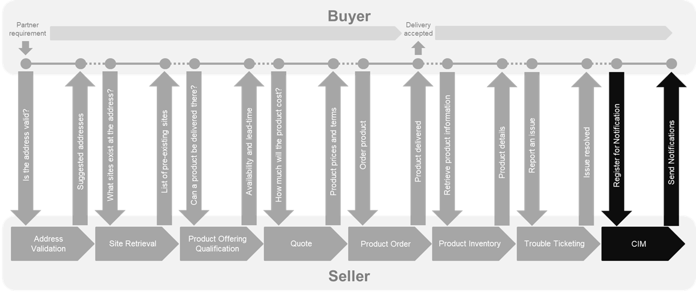
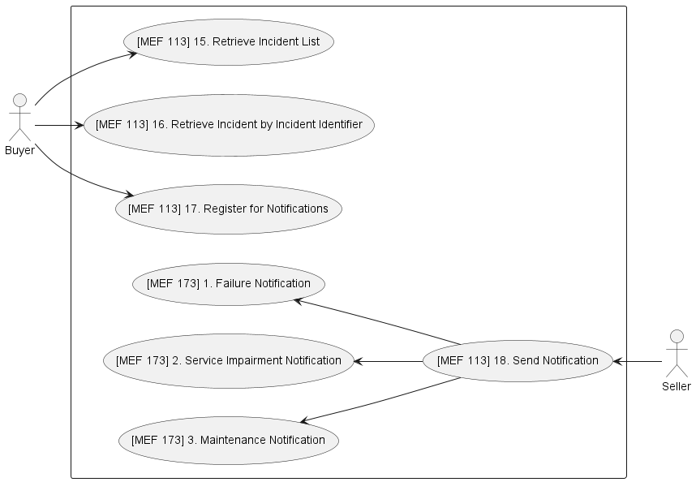
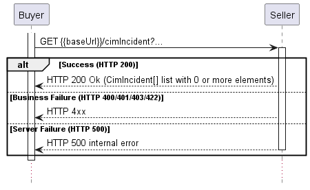
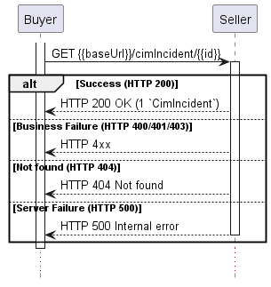
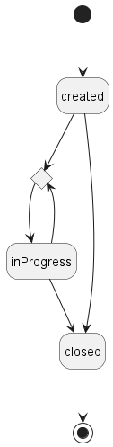
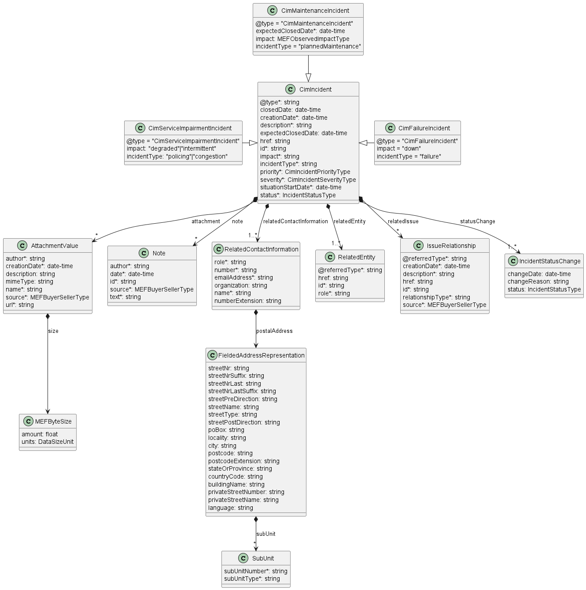
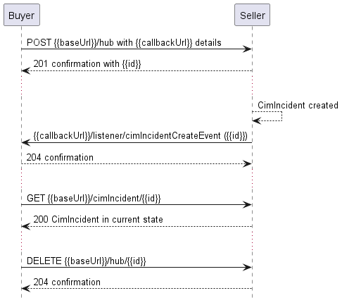
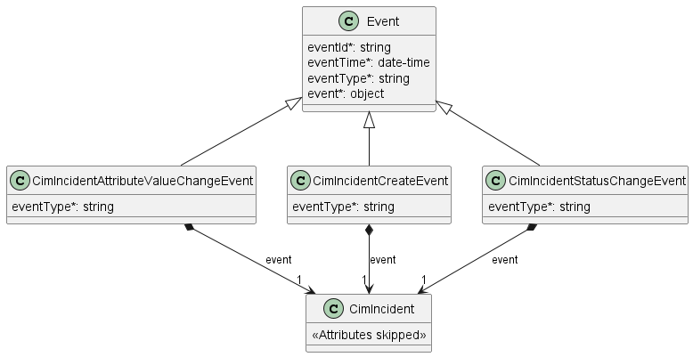
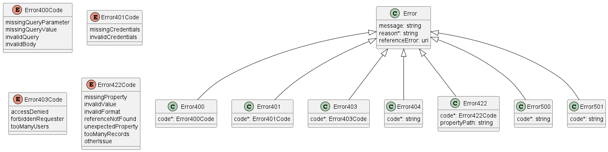
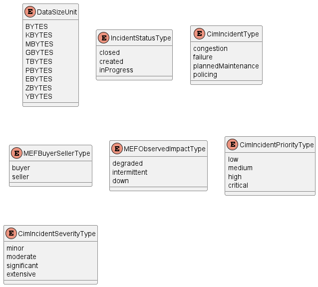

<style>
img
{
  display:block;
  float:none;
  margin-left:auto;
  margin-right:auto;
}
</style>


<div style="font-weight:bold; font-size:33pt; font-family: Sansation;  text-align:center">
</br>
</br>
Mplify Standard
</br>
</br>
Mplify 175
</br>
</br>
</br>
Circuit Impairment and Maintenance Notification API and Developer Guide
</br>
</br>
</br>
November 2025
</div>

<div class="page"/>

**Disclaimer**

© Mplify Alliance 2025. All Rights Reserved.

The information in this publication is freely available for reproduction and use
by any recipient and is believed to be accurate as of its publication date. Such
information is subject to change without notice and Mplify Alliance (Mplify) is
not responsible for any errors. Mplify does not assume responsibility to update
or correct any information in this publication. No representation or warranty,
expressed or implied, is made by Mplify concerning the completeness, accuracy,
or applicability of any information contained herein and no liability of any
kind shall be assumed by Mplify as a result of reliance upon such information.

The information contained herein is intended to be used without modification by
the recipient or user of this document. Mplify is not responsible or liable for
any modifications to this document made by any other party.

The receipt or any use of this document or its contents does not in any way
create, by implication or otherwise:

- (a) any express or implied license or right to or under any patent, copyright,
  trademark or trade secret rights held or claimed by any Mplify member which
  are or may be associated with the ideas, techniques, concepts or expressions
  contained herein; nor

- (b) any warranty or representation that any Mplify member will announce any
  product(s) and/or service(s) related thereto, or if such announcements are
  made, that such announced product(s) and/or service(s) embody any or all of
  the ideas, technologies, or concepts contained herein; nor

- (c) any form of relationship between any Mplify member and the recipient or
  user of this document.

Implementation or use of specific Mplify standards, specifications or
recommendations will be voluntary, and no Member shall be obliged to implement
them by virtue of participation in Mplify Alliance. Mplify is a non-profit
international organization to enable the development and worldwide adoption of
agile, assured and orchestrated network services. Mplify does not, expressly or
otherwise, endorse or promote any specific products or services.

**Copyright**

© Mplify Alliance 2025. Any reproduction of this document, or any portion
thereof, shall contain the following statement: "Reproduced with permission of
Mplify Alliance." No user of this document is authorized to modify any of the
information contained herein.

<div class="page"/>

**Table of Contents**

<!-- code_chunk_output -->

- [List of Contributing Members](#list-of-contributing-members)
- [1. Abstract](#1-abstract)
- [2. Terminology and Abbreviations](#2-terminology-and-abbreviations)
- [3. Compliance Levels](#3-compliance-levels)
- [4. Introduction](#4-introduction)
  - [4.1. Conventions in the Document](#41-conventions-in-the-document)
  - [4.2. Relation to Other Documents](#42-relation-to-other-documents)
  - [4.3. Approach](#43-approach)
  - [4.4. High-Level Flow](#44-high-level-flow)
- [5. API Description](#5-api-description)
  - [5.1. High-level use cases](#51-high-level-use-cases)
  - [5.2. API Endpoint and Operation Description](#52-api-endpoint-and-operation-description)
    - [5.2.1. Seller side API Endpoints](#521-seller-side-api-endpoints)
    - [5.2.2. Buyer side API Endpoints](#522-buyer-side-api-endpoints)
  - [5.3. Specifying the Buyer ID and the Seller ID](#53-specifying-the-buyer-id-and-the-seller-id)
  - [5.4. Model Structural Validation](#54-model-structural-validation)
  - [5.5. Security Considerations](#55-security-considerations)
- [6. API Interactions and Flows](#6-api-interactions-and-flows)
  - [6.1. Use Case 15: Retrieve Incident List](#61-use-case-15-retrieve-incident-list)
  - [6.2. Use Case 16: Retrieve CIM Incident by Identifier](#62-use-case-16-retrieve-cim-incident-by-identifier)
  - [6.3. Use case 17: Register for Event Notifications](#63-use-case-17-register-for-event-notifications)
  - [6.4. Use case 18: Send Event Notification](#64-use-case-18-send-event-notification)
    - [6.4.1 Use case 1: Failure Notification](#641-use-case-1-failure-notification)
    - [6.4.2 Use case 2: Service Impairment Notification](#642-use-case-2-service-impairment-notification)
    - [6.4.3 Use case 3: Maintenance Notification](#643-use-case-3-maintenance-notification)
- [7. API Details](#7-api-details)
  - [7.1. API patterns](#71-api-patterns)
    - [7.1.1. Indicating errors](#711-indicating-errors)
      - [7.1.1.1. Type Error](#7111-type-error)
      - [7.1.1.2. Type Error400](#7112-type-error400)
      - [7.1.1.3. `enum` Error400Code](#7113-enum-error400code)
      - [7.1.1.4. Type Error401](#7114-type-error401)
      - [7.1.1.5. `enum` Error401Code](#7115-enum-error401code)
      - [7.1.1.6. Type Error403](#7116-type-error403)
      - [7.1.1.7. `enum` Error403Code](#7117-enum-error403code)
      - [7.1.1.8. Type Error404](#7118-type-error404)
      - [7.1.1.9. Type Error422](#7119-type-error422)
      - [7.1.1.10. `enum` Error422Code](#71110-enum-error422code)
      - [7.1.1.11. Type Error500](#71111-type-error500)
      - [7.1.1.12. Type Error501](#71112-type-error501)
  - [7.2. Management API Data model](#72-management-api-data-model)
    - [7.2.1. CimIncident](#721-cimincident)
      - [7.2.1.1. Type CimIncident](#7211-type-cimincident)
      - [7.2.1.2. Type CimFailureIncident](#7212-type-cimfailureincident)
      - [7.2.1.3. Type CimMaintenanceIncident](#7213-type-cimmaintenanceincident)
      - [7.2.1.4. Type CimServiceImpairmentIncident](#7214-type-cimserviceimpairmentincident)
      - [7.2.1.5. `enum` CimIncidentPriorityType](#7215-enum-cimincidentprioritytype)
      - [7.2.1.6. `enum` CimIncidentSeverityType](#7216-enum-cimincidentseveritytype)
      - [7.2.1.7. `enum` CimIncidentType](#7217-enum-cimincidenttype)
      - [7.2.1.8. Type IncidentStatusChange](#7218-type-incidentstatuschange)
      - [7.2.1.9. `enum` IncidentStatusType](#7219-enum-incidentstatustype)
      - [7.2.1.10. Type IssueRelationship](#72110-type-issuerelationship)
      - [7.2.1.11. `enum` MEFObservedImpactType](#72111-enum-mefobservedimpacttype)
    - [7.2.2. Common](#722-common)
      - [7.2.2.1. Type AttachmentValue](#7221-type-attachmentvalue)
      - [7.2.2.2. `enum` DataSizeUnit](#7222-enum-datasizeunit)
      - [7.2.2.3. Type FieldedAddressRepresentation](#7223-type-fieldedaddressrepresentation)
      - [7.2.2.4. `enum` MEFBuyerSellerType](#7224-enum-mefbuyersellertype)
      - [7.2.2.5. Type MEFByteSize](#7225-type-mefbytesize)
      - [7.2.2.6. Type Note](#7226-type-note)
      - [7.2.2.7. Type RelatedContactInformation](#7227-type-relatedcontactinformation)
      - [7.2.2.8. Type RelatedEntity](#7228-type-relatedentity)
      - [7.2.2.9. Type SubUnit](#7229-type-subunit)
    - [7.2.3. Notification registration](#723-notification-registration)
      - [7.2.3.1. Type EventSubscriptionInput](#7231-type-eventsubscriptioninput)
      - [7.2.3.2. Type EventSubscription](#7232-type-eventsubscription)
  - [7.3. Notification API Data model](#73-notification-api-data-model)
    - [7.3.1. Type Event](#731-type-event)
    - [7.3.2. Type CimIncidentAttributeValueChangeEvent](#732-type-cimincidentattributevaluechangeevent)
    - [7.3.3. Type CimIncidentCreateEvent](#733-type-cimincidentcreateevent)
    - [7.3.4. Type CimIncidentStatusChangeEvent](#734-type-cimincidentstatuschangeevent)
- [8. References](#8-references)
- [Appendix A Acknowledgments](#appendix-a-acknowledgments)

<!-- /code_chunk_output -->

<div class="page"/>

# List of Contributing Members

The following members of the MEF participated in the development of this
document and have requested to be included in this list.

<!-- TODO -->

| Member  |
| ------- |
| Amartus |

**Table 1. Contributing Members**

<div class="page"/>

# 1. Abstract

This standard is intended to assist implementation of the Circuit Impairment and
Maintenance Notification functionality defined for the LSO Cantata and LSO
Sonata Interface Reference Points (IRPs), for which requirements and use cases
are defined in MEF 113 _Trouble Ticketing Requirements and Use Cases_
[[MEF 113](#8-references)] and Mplify 173 _CIM Notification Service Business
Requirements and Use Cases_ [[Mplify 173](#8-references)]. This standard
consists of this document and complementary API definitions for CIM and CIM
Notification.

This standard normatively incorporates the following files by reference as if
they were part of this document, from the GitHub repository

<https://github.com/MEF-GIT/MEF-LSO-Sonata-SDK>

commit id:
[3ecdf424af70f9308dbe70796226e34e75c48f88](https://github.com/MEF-GIT/MEF-LSO-Sonata-SDK/tree/3ecdf424af70f9308dbe70796226e34e75c48f88)

- [`productApi/cim/circuitImpairmentAndMaintenance.api.yaml`](https://raw.githubusercontent.com/MEF-GIT/MEF-LSO-Sonata-SDK/3ecdf424af70f9308dbe70796226e34e75c48f88/productApi/cim/circuitImpairmentAndMaintenance.api.yaml)
- [`productApi/cim/circuitImpairmentAndMaintenanceNotification.api.yaml`](https://raw.githubusercontent.com/MEF-GIT/MEF-LSO-Sonata-SDK/3ecdf424af70f9308dbe70796226e34e75c48f88/productApi/cim/circuitImpairmentAndMaintenanceNotification.api.yaml)

<https://github.com/MEF-GIT/MEF-LSO-Cantata-SDK>

commit id:
[5cf17645aa2738085d7e16fbe92bff9640c24c38](https://github.com/MEF-GIT/MEF-LSO-Cantata-SDK/tree/5cf17645aa2738085d7e16fbe92bff9640c24c38)

- [`productApi/cim/circuitImpairmentAndMaintenance.api.yaml`](https://raw.githubusercontent.com/MEF-GIT/MEF-LSO-Cantata-SDK/5cf17645aa2738085d7e16fbe92bff9640c24c38/productApi/cim/circuitImpairmentAndMaintenance.api.yaml)
- [`productApi/cim/circuitImpairmentAndMaintenanceNotification.api.yaml`](https://raw.githubusercontent.com/MEF-GIT/MEF-LSO-Cantata-SDK/5cf17645aa2738085d7e16fbe92bff9640c24c38/productApi/cim/circuitImpairmentAndMaintenanceNotification.api.yaml)

<div class="page"/>

# 2. Terminology and Abbreviations

This section defines the terms used in this document. In many cases, the
normative definitions of terms are found in other documents. In these cases, the
third column is used to provide the reference that is controlling, in other
Mplify or external documents.

In addition, terms defined in the standards referenced below are included in
this document by reference and are not repeated in the table below:

- MEF 55.1 [[MEF 55.1](#8-references)]
- MEF 55.1.1 [[MEF 55.1.1](#8-references)]
- MEF 113 [[MEF 113](#8-references)]
- Mplify 150 [[Mplify 150](#8-references)]
- Mplify 173 [[Mplify 173](#8-references)]

<table>
<tr>
  <th>Term</th>
  <th>Description</th>
  <th>Reference</th>
</tr>
<tr>
  <td>Application Program Interface (API)</td>
  <td>In the context of LSO, API describes one of the Management Interface Reference Points based on the requirements specified in an Interface Profile, along with a data model, the protocol that defines operations on the data and the encoding format used to encode data according to the data model. In this document, API is used synonymously with REST API.</td>
  <td><a href="#8-references">[MEF 55.1]</td>
</tr>
<tr>
  <td>Buyer</td>
  <td>In the context of this document, denotes the organization or individual acting as the customer in a transaction over a Cantata (Customer <-> Service Provider) or Sonata (Service Provider <-> Partner) Interface.</td>
  <td>This document; adapted from <a href="#8-references">[MEF 55.1.1]</td>
</tr>
<tr>
  <td>Circuit Impairment and Maintenance Notification Service</td>
  <td>A standards based fault management and maintenance API service provided by a Seller to a Buyer that provides timely notifications of Failure Situations, Service Impairments and Planned Maintenance on the Seller’s network.</td>
  <td><a href="#8-references">[Mplify 173]</td>
</tr>
<tr>
  <td>Failure Situation</td>
  <td>The Seller detects an occurrence of a Situation on a Product provided to the Buyer, where the Product is non-operational (for example, down, routing failures, severe packet drops, etc.).</td>
  <td><a href="#8-references">[Mplify 173]</td>
</tr>
<tr>
  <td>Incident</td>
  <td>An entry within a Seller's tracking system created by the Seller, which contains information about a Situation in the Seller's network that has a possible negative impact on the operability of the network on a Product for one or more Buyers</td>
  <td><a href="#8-references">[MEF 113]</a></td>
</tr>
<tr>
  <td>Issue</td>
  <td>In the context of this document, denotes a problem with a Product as experienced by the Buyer that is not part of normal operation.</td>
  <td><a href="#8-references">[MEF 113]</a></td>
</tr>
<tr>
  <td>Notification</td>
  <td>A message sent from the Seller to the Buyer to inform about an event that has occurred in regard to a specific instance of a Ticket or an Incident</td>
  <td><a href="#8-references">[MEF 113]</a></td>
</tr>
<tr>
  <td>Planned Maintenance</td>
  <td>Any scheduled maintenance to be performed by the Seller that may impact a Product for the Buyer, which also includes the planned ending time and date.</td>
  <td><a href="#8-references">[Mplify 173]</td>
</tr>
<tr>
  <td>Requesting Entity</td>
  <td>The business organization that is acting on behalf of one or more Buyers. In the most common case, the Requesting Entity represents only one Buyer and these terms are then synonymous.</td>
  <td><a href="#8-references">[Mplify 150]</a></td>
</tr>
<tr>
  <td>Responding Entity</td>
  <td>The business organization that is acting on behalf of one or more Sellers. In the most common case, the Responding Entity represents only one Seller and these terms are then synonymous.</td>
  <td><a href="#8-references">[Mplify 150]</a></td>
</tr>
<tr>
  <td>REST API</td>
  <td>Representational State Transfer. REST provides a set of architectural constraints that, when applied as a whole, emphasizes scalability of component interactions, generality of interfaces, independent deployment of components, and intermediary components to reduce interaction latency, enforce security, and encapsulate legacy systems.</td>
  <td><a href="#8-references">[REST]</a></td>
</tr>
<tr>
  <td>Seller</td>
  <td>In the context of this document, denotes the organization acting as the supplier in a transaction over a Cantata (Customer <-> Service Provider) or Sonata (Service Provider <-> Partner) Interface.</td>
  <td>This document; adapted from <a href="#8-references">[MEF 55.1.1]</td>
</tr>
<tr>
  <td>Situation</td>
  <td>In the context of this document, denotes a problem that is not part of normal operation in the Seller's network</td>
  <td><a href="#8-references">[MEF 113]</a></td>
</tr>
<tr>
  <td>Ticket</td>
  <td>An entry within a Seller's tracking system created by the Buyer (or a third party on behalf of the Buyer), which contains information about an Issue impacting normal operation of a Product, along with support interventions made by technical support staff, or third parties</td>
  <td><a href="#8-references">[MEF 113]</a></td>
</tr>
</table>

**Table 2. Terminology**

<table>
<tr>
  <th>Term</th>
  <th>Description</th>
  <th>Reference</th>
</tr>
<tr>
  <td>API</td>
  <td>Application Program Interface</td>
  <td><a href="#8-references">[MEF 55.1]</td>
</tr>
<tr>
  <td>CIM</td>
  <td>Circuit Impairment and Maintenance</td>
  <td><a href="#8-references">[Mplify 173]</td>
</tr>
<tr>
  <td>REST API</td>
  <td>Representational State Transfer API</td>
  <td><a href="#8-references">[REST]</a> </td>
</tr>
</table>

**Table 3. Abbreviations**

<div class="page"/>

# 3. Compliance Levels

The key words **"MUST"**, **"MUST NOT"**, **"REQUIRED"**, **"SHALL"**, **"SHALL
NOT"**, **"SHOULD"**, **"SHOULD NOT"**, **"RECOMMENDED"**, **"NOT
RECOMMENDED"**, **"MAY"**, and **"OPTIONAL"** in this document are to be
interpreted as described in BCP 14 ([[RFC 2119](#8-references)],
[[RFC 8174](#8-references)]) when, and only when, they appear in all capitals,
as shown here. All key words must be in bold text.

Items that are **REQUIRED** (contain the words **MUST** or **MUST NOT**) are
labeled as **[Rx]** for required. Items that are **RECOMMENDED** (contain the
words **SHOULD** or **SHOULD NOT**) are labeled as **[Dx]** for desirable. Items
that are **OPTIONAL** (contain the words MAY or OPTIONAL) are labeled as
**[Ox]** for optional.

A paragraph preceded by **[CRa]<** specifies a conditional mandatory requirement
that **MUST** be followed if the condition(s) following the "<" have been met.
For example, **"[CR1]<[D38]"** indicates that Conditional Mandatory Requirement
1 must be followed if Desirable Requirement 38 has been met. A paragraph
preceded by **[CDb]<** specifies a Conditional Desirable Requirement that
**SHOULD** be followed if the condition(s) following the "<" have been met. A
paragraph preceded by **[COc]<**specifies a Conditional Optional Requirement
that **MAY** be followed if the condition(s) following the "<" have been met.

<div class="page"/>

# 4. Introduction

The CIM API allows the Buyer to list `CimIncidents`, get `CimIncident` details
by `id` and register for receiving Notifications, and the Seller to send
Notifications about circuit impairment incidents.

This standard specification document describes the Application Programming
Interface (API) for CIM functionality of the LSO Cantata Interface Reference
Point (IRP) and LSO Sonata IRP as defined in the _MEF 55.1 Lifecycle Service
Orchestration (LSO): Reference Architecture and Framework_
[[MEF 55.1](#8-references)]. The LSO Reference Architecture is shown in Figure 1
with both IRPs highlighted.


**Figure 1. The LSO Reference Architecture**

Cantata and Sonata IRPs define pre-ordering and ordering functionalities that
allow an automated exchange of information between business applications of the
Buyer (Customer or Service Provider) and Seller (Service Provider or Partner)
Domains. Those are:

- Product Catalog
- Address Validation
- Site Retrieval
- Product Offering Qualification
- Product Quote
- Product Inventory
- Product Ordering
- Trouble Ticketing
- Billing

The business requirements and use cases for CIM are defined in MEF 113 _Trouble
Ticketing Requirements and Use Cases_ [[MEF 113](#8-references)] and Mplify 173
_CIM Notification Service Business Requirements and Use Cases_
[[Mplify 173](#8-references)]. MEF 113 defines use cases that cover Trouble
Ticket, Incident, Appointment, and WorkOrder. Mplify 173 defines additional
requirements on top of those defined by MEF 113 for Incident. This document
defines the CIM API as a separate, standalone single-purpose API and thus Mplify
173 requirements may take precedence above ones defined in MEF 113. This
document is structured as follows:

- [Chapter 4](#4-introduction) provides an introduction to CIM and its
  description in a broader context of Cantata and Sonata and their corresponding
  SDKs.
- [Chapter 5](#5-api-description) gives an overview of endpoints, resource model
  and design patterns.
- Use cases and flows are presented in
  [Chapter 6](#6-api-interactions-and-flows).
- And finally, [Chapter 7](#7-api-details) complements previous sections with a
  detailed API description.

## 4.1. Conventions in the Document

- Code samples are formatted using code blocks. When notation `<< some text >>`
  is used in the payload sample it indicates that a comment is provided instead
  of an example value and it might not comply with the OpenAPI definition.
- Model definitions are formatted as in-line code (e.g. `CimIncident`).
- In UML diagrams the default cardinality of associations is `0..1`. Other
  cardinality markers are compliant with the UML standard.
- In the API details tables and UML diagrams required attributes are marked with
  a `*` next to their names.
- In UML sequence diagrams `{{variable}}` notation is used to indicate a
  variable to be substituted with a correct value.

## 4.2. Relation to Other Documents

This API implements the CIM related requirements and use cases that are defined
in MEF 113 [[MEF 113](#8-references)] and Mplify 173 _CIM Notification Service
Business Requirements and Use Cases_ [[Mplify 173](#8-references)]. This API
definition builds on _TMF621 Trouble Ticket API REST Specification R19.0.1_
[[TMF621](#8-references)].

## 4.3. Approach

As presented in Figure 2, both Cantata and Sonata API frameworks consist of
three structural components:

- Generic API framework
- Product-independent information (Function-specific information and
  Function-specific operations)
- Product-specific information (Mplify product specification data model)


**Figure 2. Cantata and Sonata API framework**

The essential concept behind the framework is to decouple the common structure,
information and operations from the specific product information content.  
Firstly, the Generic API Framework defines a set of design rules and patterns
that are applied across all Cantata or Sonata APIs.  
Secondly, the product-independent information of the framework focuses on a
model of a particular Cantata or Sonata functionality and is agnostic to any of
the product specifications.  
Finally, the product-specific information part of the framework focuses on
Mplify product specifications that define business-relevant attributes and
requirements for trading Mplify subscriber and Mplify operator services.

CIM API is product-agnostic in its nature and is not intended to carry any
product-specific payloads. It only references products from the inventory by
`id`. It operates using the Generic API Framework and the Function-specific
Information and Operations.

## 4.4. High-Level Flow

CIM is part of a broader Cantata and Sonata End-to-End flow. Figure 3 below
shows a high-level diagram to get a good understanding of the whole process and
CIM's position within it.



**Figure 3. Cantata and Sonata End-to-End Function Flow**

- Address Validation:
  - Allows the Buyer to retrieve address information from the Seller, including
    exact formats, for addresses known to the Seller.
- Site Retrieval:
  - Allows the Buyer to retrieve Geographic Site information including exact
    formats for Geographic Sites known to the Seller.
- Product Offering Qualification (POQ):
  - Allows the Buyer to check whether the Seller can deliver a product or set of
    products from among their product offerings at the geographic address or a
    Geographic Site specified by the Buyer; or modify a previously purchased
    product.
- Quote:
  - Allows the Buyer to submit a request to find out how much the installation
    of an instance of a Product Offering, an update to an existing Product, or a
    disconnect of an existing Product will cost.
- Product Order:
  - Allows the Buyer to request the Seller to initiate and complete the
    fulfillment process of an installation of a Product Offering, an update to
    an existing Product, or a disconnect of an existing Product at the address
    defined by the Buyer.
- Product Inventory:
  - Allows the Buyer to retrieve the information about the existing Product
    instances from Seller's Product Inventory.
- Trouble Ticketing:
  - Allows the Buyer to create, retrieve, and update Trouble Tickets as well as
    receive notifications about Incidents' and Trouble Tickets' updates. This
    allows managing issues and situations for a Product provided by the Seller.
- Circuit Impairment and Maintenance:
  - Allows the Buyer to list CIM Incidents, get CIM Incidents details and
    register for receiving Notifications, and the Seller to send Notifications
    about circuit impairment incidents

<div class="page"/>

# 5. API Description

This section presents the API structure and design patterns. It starts with the
high-level use cases diagram. Then it describes the REST endpoints with use case
mapping. Next, it gives an overview of the API resource model.

## 5.1. High-level use cases

Figure 4 presents a high-level use case diagram as specified and numbered in
Mplify 173 [[Mplify 173](#8-references)] in section 7.2. Use cases are described
extensively in [chapter 6](#6-api-interactions-and-flows).



**Figure 4. Use cases**

## 5.2. API Endpoint and Operation Description

### 5.2.1. Seller side API Endpoints

**Base URL for Cantata**:

`https://{{serverBase}}:{{port}}{{?/seller_prefix}}/mefApi/sonata/cimIncident/v1/`

**Base URL for Sonata**:

`https://{{serverBase}}:{{port}}{{?/seller_prefix}}}/mefApi/cantata/cimIncident/v1/`

The following API endpoints are implemented by the Seller and allow the Buyer to
list `CimIncidents`, get `CimIncident` details by `id` and register for
receiving Notifications. The endpoints and corresponding data model are defined
in:

`productApi/cim/circuitImpairmentAndMaintenance.api.yaml`.

| API endpoint              | Description                                                                                                                                                      | MEF 113 / Mplify 173 Use Case mapping                   |
| ------------------------- | ---------------------------------------------------------------------------------------------------------------------------------------------------------------- | ------------------------------------------------------- |
| `GET /cimIncident`        | The Buyer requests a list of `CimIncidents` from the Seller based on a set of specified filter criteria. The Seller returns a summarized list of `CimIncidents`. | MEF 113 UC 15: Retrieve Incident List                   |
| `GET /cimIncident/{{id}}` | The Buyer requests detailed information about a single `CimIncident` based on a `CimIncident.id`.                                                                | MEF 113 UC 16: Retrieve Incident by Incident Identifier |
| `POST /hub`               | The Buyer requests to subscribe to notifications.                                                                                                                | MEF 113 UC 17: Register for Event Notifications         |
| `GET /hub/{{id}}`         | A request initiated by the Buyer to retrieve the details of the notification subscription.                                                                       | MEF 113 UC 17: Register for Event Notifications         |
| `DELETE /hub/{{id}}`      | A request initiated by the Buyer to instruct the Seller to stop sending notifications.                                                                           | MEF 113 UC 17: Register for Event Notifications         |

**Table 4. Seller side mandatory API endpoints**

**[R1]** The Seller implementation **MUST** support API endpoints listed in
Table 4. [Mplify173 R19], [Mplify173 R20]

### 5.2.2. Buyer side API Endpoints

**Base URL for Cantata**:

`https://{{serverBase}}:{{port}}{{?/buyer_prefix}}/mefApi/sonata/cimIncidentNotification/v1/`

**Base URL for Sonata**:

`https://{{serverBase}}:{{port}}{{?/buyer_prefix}}/mefApi/sonata/cimIncidentNotification/v1/`

The following API Endpoints are used by the Seller to post notifications to
registered listeners. The endpoints and corresponding data model are defined in

`productApi/cim/circuitImpairmentAndMaintenanceNotification.api.yaml`

| API Endpoint                                             | Description                                                                                    | MEF 113 Use Case Mapping                                                                                                                                                      |
| -------------------------------------------------------- | ---------------------------------------------------------------------------------------------- | ----------------------------------------------------------------------------------------------------------------------------------------------------------------------------- |
| `POST /listener/ CimIncidentCreateEvent`                 | A request initiated by the Seller to notify the Buyer on `CimIncident` creation                | MEF 113 UC 18: Send Notification</br>Mplify 173 UC 1: Failure Notification</br>Mplify 173 UC 2: Service Impairment Notification</br>Mplify 173 UC 3: Maintenance Notification |
| `POST /listener/ CimIncidentAttribute- ValueChangeEvent` | A request initiated by the Seller to notify the Buyer on `CimIncident` attribute value change. | MEF 113 UC 18: Send Notification</br>Mplify 173 UC 1: Failure Notification</br>Mplify 173 UC 2: Service Impairment Notification</br>Mplify 173 UC 3: Maintenance Notification |
| `POST /listener/ CimIncidentStatusChangeEvent`           | A request initiated by the Seller to notify the Buyer on `CimIncident.status` change.          | MEF 113 UC 18: Send Notification</br>Mplify 173 UC 1: Failure Notification</br>Mplify 173 UC 2: Service Impairment Notification</br>Mplify 173 UC 3: Maintenance Notification |

**Table 5. Buyer side optional API endpoints**

**[D1]** The Buyer implementation **SHOULD** support API endpoints listed in
Table 5. [MEF113 D3]

**[CR2]<([O1])** If any of endpoints listed in Table 5 is supported, then the
Seller **MUST** support all endpoints listed in Table 5. [MEF113 [CR2]<[O2]]

## 5.3. Specifying the Buyer ID and the Seller ID

A business Entity willing to represent multiple Buyers or multiple Sellers must
follow requirements of [[Mplify 150](#8-references)] chapter 8.8, which states:

> For requests of all types, there is a business Entity that initiates an
> Operation (called a Requesting Entity) and a business Entity that is
> responding to this request (called the Responding Entity). In the simplest
> case, the Requesting Entity is the Buyer and the Responding Entity is the
> Seller. However, in some cases, the Requesting Entity may represent more than
> one Buyer and similarly, the Responding Entity may represent more than one
> Seller.


**Figure 5. Buyer ID and Seller ID Examples**

> As shown in Figure 5, if a Requesting Entity representing a single Buyer is
> doing business with a Responding Entity representing a single Seller, Buyer
> and Seller IDs are not required to be passed between the two Entities. If a
> Requesting Entity representing more than one Buyer is doing business with a
> Responding Entity representing a single Seller, the Buyer ID is required to be
> passed between the two Entities. If a Requesting Entity representing a single
> Buyer is doing business with a Responding Entity representing multiple
> Sellers, the Seller ID is required to be passed between the two Entities. If a
> Requesting Entity representing multiple Buyers is doing business with a
> Responding Entity representing multiple Sellers, both the Buyer ID and the
> Seller ID are required to be passed between the Entities.

> While it is outside the scope of this specification, it is assumed that the
> Requesting Entity and the Responding Entity are aware of each other and can
> authenticate requests initiated by the other party. It is further assumed that
> the Buying Entity knows:
>
> - the list of Buyers the Requesting Entity represents when interacting with
>   this Responding Entity; and
> - the list of Sellers that this Responding Entity represents to this
>   Requesting Entity.
>
> It is also assumed that the Responding Entity knows:
>
> - the list of Sellers that this Responding Entity represents to this
>   Requesting Entity and
> - the list of Buyers the Requesting Entity represents when interacting with
>   this Respond-ing Entity.

In the API the `buyerId` and `sellerId` are represented as optional query
parameters in each operation defined.

**[R2]** If the Requesting Entity has the authority to represent more than one
Buyer the request **MUST** include `buyerId` that identifies the Buyer being
represented [Mplify150 R62]

**[R3]** If the Responding Entity represents more than one Seller to this Buyer
the request **MUST** include `sellerId` that identifies the Seller with whom
this request is associated [Mplify150 R63]

## 5.4. Model Structural Validation

The structure of the HTTP payloads is defined using OpenAPI version 3.0.

**[R4]** Implementations **MUST** use payloads that conform to these
definitions.

**[R5]** The Buyer and the Seller **MUST NOT** use any operation, entity or
attribute that is not explicitly defined or allowed by this standard.

## 5.5. Security Considerations

There must be an authentication mechanism whereby a Seller can be assured who a
Buyer is and vice-versa. There must also be authorization mechanisms in place to
control what a particular Buyer or Seller is allowed to do and what information
may be obtained. However, the definition of the exact security mechanism and
configuration is outside the scope of this document. Security considerations are
standardized by _LSO API Security Profile_ [[MEF 128.1](#8-references)].

<div class="page"/>

# 6. API Interactions and Flows

This section provides a detailed insight into the API functionality and in the
following subchapters describes the API usage flow and examples for each of the
use cases.

## 6.1. Use Case 15: Retrieve Incident List

The flow of this use case is very simple and is described in Figure 6.



**Figure 6. Use Case 15: Retrieve Incident List**

The Buyer wants to retrieve the list of Incidents that match the given filtering
criteria.

**[O1]** The Buyer **MAY** retrieve a list of Incidents by using a
`GET /cimIncident` operation with desired filtering criteria. The attributes
that are available to be used are: [MEF113 O20]

- `priority`
- `severity`
- `impact`
- `incidentType`
- `status`
- `relatedEntityId`
- `relatedEntityType`
- `creationDate.gt`
- `creationDate.lt`
- `situationStartDate.gt`
- `situationStartDate.lt`
- `expectedClosedDate.gt`
- `expectedClosedDate.lt`
- `closedDate.gt`
- `closedDate.lt`

The Buyer may also ask for pagination of the response when the number of results
is too big. The following query attributes related to pagination can be
provided:

- `limit` - number of expected list items
- `offset` - offset of the first element in the result list.

```
https://serverRoot/mefApi/sonata/cimIncidentNotification/v1/cimIncident?status=inProgress&priority=critical&limit=10&offset=0
```

The example above shows a Buyer's request to get all `CimIncidents` that are in
the `inProgress` status and with `critical` priority. Additionally, the Buyer
asks only for a first (`offset=0`) pack of 10 results (`limit=10`) to be
returned. The correct response (HTTP code `200`) in the response body contains a
list of `CimIncident_Find` objects matching the criteria. To get more details
(e.g. the item level information), the Buyer has to query a specific
`CimIncident` by `id`.

The Seller returns a list of elements that comply with the requested `limit`. If
the requested `limit` is higher than the supported list size then the smaller
list of results is returned. In that case, the size of the result is returned in
the header attribute `X-Result-Count`. The Seller can indicate that there are
additional results available using:

- `X-Total-Count` header attribute with the total number of available results
- `X-Pagination-Throttled` header set to `true`

**[D2]** The Seller **SHOULD** support the pagination mechanism.

**[CR3]<[D2]** Seller **MUST** use either `X-Total-Count` or
`X-Pagination-Throttled` to indicate that the page was truncated and additional
results are available.

**[R6]** The Seller **MUST** put the following attributes into the `CimIncident`
object in the response: [MEF113 R126]:

- `@type`
- `creationDate`
- `description`
- `id`
- `impact`
- `incidentType`
- `priority`
- `relatedContactInformation` - items with `role` equal to `incidentContact`
- `relatedEntity`
- `severity`
- `situationStartDate`
- `status`
- `statusChange`

**[R7]** In case no items matching the criteria are found, the Seller **MUST**
return a valid response with an empty list. [MEF113 R127]

**[D3]** If the Buyer requests a list of new CIM Incidents, the Buyer **SHOULD**
include a query param of `creationDate.gt` with a DateTime after the most recent
Retrieve CIM Incident List poll request. [Mplify173 D4]

```
https://serverRoot/mefApi/sonata/cimIncidentNotification/v1/cimIncident?creationDate.gt=lastPollRequestDateTime
```

**[D4]** If the Buyer requests a list of open CIM Incidents, the Buyer
**SHOULD** include a query param of `status` with `created` and `inProgress`
values. [Mplify173 D5]

```
https://serverRoot/mefApi/sonata/cimIncidentNotification/v1/cimIncident?status=created&status=inProgress
```

**[D5]** If the Buyer requests a list of recently closed CIM Incidents, the
Buyer **SHOULD** include a query param of `status` with `closed` value and
`closedDate.gt` with a DateTime starting after the most recent Retrieve CIM
Incident List poll request. [Mplify173 D6]

```
https://serverRoot/mefApi/sonata/cimIncidentNotification/v1/cimIncident?status=closed&closedDate.gt=lastPollRequestDateTime
```

## 6.2. Use Case 16: Retrieve CIM Incident by Identifier

The flow of this use case is presented in Figure 7.



**Figure 7. Use Case 16: Retrieve CIM Incident by Identifier**

The Buyer wants to retrieve detailed information about a single Product Category
with a given `id`.

The Buyer can get detailed information about the Incident from the Seller by
using a `GET /cimIncident/{{id}}` operation.

**[R8]** In case `id` does not allow to find an `CimIncident` instance, an error
response `Error404` **MUST** be returned. [MEF113 R129]

**[R9]** The Seller **MUST** put the following attributes into the `CimIncident`
object in the response: [MEF113 R131]

- `@type`
- `creationDate`
- `description`
- `id`
- `impact`
- `incidentType`
- `priority`
- `relatedContactInformation` - items with `role` equal to `incidentContact`
- `relatedEntity`
- `severity`
- `situationStartDate`
- `status`
- `statusChange`

**[R10]** The `statusChange` **MUST** include a full object's state history
including the initial state.

**[R11]** The Seller **MUST** provide all remaining optional attributes if they
are set. [MEF113 R132]

**[R12]** The Seller's **MUST** provide the `CimIncident.closedDate` if the
`status` is `closed`. [MEF113 R133], [Mplify173 R18]

Table 6 presents the mapping between the API `status` names and the MEF 113
naming, together with their description.

| status       | MEF 113 name | Description                                                                                 |
| ------------ | ------------ | ------------------------------------------------------------------------------------------- |
| `created`    | CREATED      | A new Incident has been created and allocated a unique `id`.                                |
| `inProgress` | IN_PROGRESS  | The Incident is in the process of being handled by the Seller.                              |
| `closed`     | CLOSED       | The Situation described in the Incident was closed by the Seller. This is a terminal state. |

**Table 6. Incident states**

Figure 8 presents the Incident state machine:



**Figure 8. Incident State Machine**

**[R13]** The Seller **MUST** support all CIM Incident statuses and their
associated transitions as described in Figure 8 and Table 6. [MEF113 R167]



**Figure 9. Use Case 16: CIM Incident Model**

```json
{
  "@type": "CimFailureIncident",
  "id": "00001111-4321-6666-7777-000000003333",
  "href": "{{baseUrl}}/cimIncident/00001111-4321-6666-7777-000000003333",
  "attachment": [
    {
      "author": "Luke Example",
      "creationDate": "2025-06-12T23:09:44.814Z",
      "description": "Print screen from the assurance system",
      "mimeType": "image/jpeg",
      "name": "Alarm",
      "url": "https://seller.mef.com/documents/00000000-5555-4444-3333-222211110000",
      "size": {
        "amount": 2.6,
        "units": "MBYTES"
      },
      "source": "seller"
    }
  ],
  "creationDate": "2025-06-12T23:09:44.814Z",
  "description": "Hardware failure",
  "expectedClosedDate": "2025-06-13T23:09:44.814Z",
  "impact": "down",
  "incidentType": "failure",
  "situationStartDate": "2025-06-12T23:01:44.815Z",
  "priority": "critical",
  "relatedContactInformation": [
    {
      "emailAddress": "Incident.Contact@seller.mef.com",
      "name": "Incident Contact",
      "number": "+98-765-432-10",
      "organization": "Seller Example Co.",
      "role": "incidentContact"
    }
  ],
  "relatedEntity": [
    {
      "id": "01494079-6c79-4a25-83f7-48284196d44d",
      "href": "https://mef.seller.com/mefApi/sonata/productInventory/v8/product/01494079-6c79-4a25-83f7-48284196d44d",
      "role": "Affected Product",
      "@referredType": "Product"
    }
  ],
  "severity": "extensive",
  "status": "created",
  "statusChange": [
    {
      "changeDate": "2025-06-12T23:09:44.814Z",
      "status": "created"
    }
  ]
}
```

## 6.3. Use case 17: Register for Event Notifications

Figure 10 presents the interaction flow between the Buyer and the Seller when
the Buyer registers for Notifications. It consist of four steps:

- Register for Notifications
- Send Event Notification
- Retrieve CIM Incident by Identifier
- Un-register from Notifications



**Figure 10. Notifications Use Cases**

**[R14]** The Seller **MUST** support all types of events: [Mplify173 R21]

- `cimIncidentAttributeValueChangeEvent`
- `cimIncidentCreateEvent`
- `cimIncidentStatusChangeEvent`

**[D6]** The Buyer **SHOULD** register for all types of events. [Mplify173 D3],
[Mplify173 D7]

To register for notifications the Buyer uses the `registerListener` operation
from the API: `POST /hub`. The request model contains only 2 attributes:

- `callback` - mandatory, to provide the callback address the events will be
  notified to,
- `query` - optional, to provide the required types of event.

The usage of a combination of these attributes and the `DELETE /hub/{id}` action
fulfills the [MEF113 R137], [MEF113 R138], [MEF113 R139], [Mplify173 R13],
[Mplify173 R14] requirements.

By using a simple request:

```json
{
  "callback": "https://buyer.mef.com/listenerEndpoint"
}
```

the Buyer subscribes for notification of all types of events.

Note that the subscription can be differentiated only per event type (create,
statusChange, attribute value change) but not per the CIM Incident type
(failure, planned maintenance, impairment).

If the Buyer wishes to receive only notification of a certain type, a `query`
must be added:

```json
{
  "callback": "https://buyer.mef.com/listenerEndpoint",
  "query": "eventType=cimIncidentStatusChangeEvent"
}
```

If the Buyer wishes to subscribe to 2 different types of events, there are 2
possible syntax variants [[TMF630](#8-references)]:

```
eventType=cimIncidentCreateEvent,cimIncidentStatusChangeEvent
```

or

```
eventType=cimIncidentCreateEvent&eventType=cimIncidentStatusChangeEvent
```

The `query` formatting complies to RCF3986 [RFC3986](#8-references). According
to it, every attribute defined in the Event model (from notification API) can be
used in the `query`. However, this standard requires only `eventType` attribute
to be supported.

**[R15]** `eventType` is the only attribute that the Seller **MUST** support in
the query.

The Seller responds to the subscription request by adding the `id` of the
subscription to the message that must be further used for unsubscribing.

```json
{
  "id": "00000000-0000-0000-0000-000000000678",
  "callback": "https://buyer.mef.com/listenerEndpoint",
  "query": "eventType=cimIncidentStatusChangeEvent"
}
```

Example of a final address that the Notifications will be sent to (for Sonata,
`cimIncidentStatusChangeEvent`):

- `https://buyer.mef.com/listenerEndpoint/mefApi/sonata/circuitImpairmentAndMaintenanceNotification/v1/listener/cimIncidentStatusChangeEvent`

To stop receiving events, the Buyer has to use the `unregisterListener`
operation from the `DELETE /hub/{id}` endpoint. The `id` is the identifier
received from the Seller during the listener registration.

## 6.4. Use case 18: Send Event Notification

Notifications are used to asynchronously inform the Buyer about the respective
objects and attributes changes.

**[R16]** The Seller **MUST** send Notifications of `eventTypes` to Buyers who
have registered for them. [MEF113 R141], [Mplify173 R15]

**[R17]** The Seller **MUST NOT** send Notifications for `eventTypes` to Buyers
who have not registered for them. [MEF113 R140], [Mplify173 R15]

**[R18]** The Seller **MUST** provide the following attributes of `CimIncident`:
[MEF113 R131], [Mplify173 R116]

- `@type`
- `creationDate`
- `description`
- `id`
- `impact`
- `incidentType`
- `priority`
- `relatedContactInformation` - items with `role` equal to `incidentContact`
- `relatedEntity`
- `severity`
- `situationStartDate`
- `status`
- `statusChange`

**[R19]** The Seller **MUST** provide all the remaining attributes of
`CimIncident` instance if they are set. [Mplify173 R17]

The Figure 11 shows entities involved in the Notification use cases. Every Event
type has its own dedicated schema. Every type of Event carries the full
representation of CimIncident as the event Payload. Details of `CimIncident` are
skipped as they are same as on Figure 10.



**Figure 11. Notification Data Model**

The following snippet presents an example of `cimIncidentStatusChangeEvent`

```json
{
  "eventId": "event-001",
  "eventType": "cimIncidentStatusChangeEvent",
  "eventTime": "2025-06-13T11:00:00Z",
  "event": {
    "@type": "CimServiceImpairmentIncident",
    "id": "INC-67890",
    "creationDate": "2025-06-13T09:00:00Z",
    "description": "Service is degraded due to congestion.",
    "impact": "degraded",
    "incidentType": "congestion",
    "priority": "medium",
    "relatedContactInformation": [
      {
        "emailAddress": "Incident.Contact@seller.mef.com",
        "name": "Incident Contact",
        "number": "+98-765-432-10",
        "organization": "Seller Example Co.",
        "role": "incidentContact"
      }
    ],
    "relatedEntity": [
      {
        "@referredType": "Product",
        "id": "PROD-002",
        "href": "https://mef.seller.com/mefApi/sonata/productInventory/v8/product/PROD-002"
      }
    ],
    "severity": "moderate",
    "situationStartDate": "2025-06-13T10:45:00Z",
    "status": "inProgress",
    "statusChange": [
      {
        "changeDate": "2025-06-13T09:00:00Z",
        "changeReason": "Incident created",
        "status": "created"
      },
      {
        "changeDate": "2025-06-13T11:00:00Z",
        "changeReason": "Incident under investigation",
        "status": "inProgress"
      }
    ]
  }
}
```

The table below presents the mapping between the API Notification types' names
and the ones in MEF 113 together with event descriptions. The inconsistencies
are caused by API naming convention and using the TMF event types as the base
for this API.

| API name                               | MEF 113 name          | Description                                         |
| -------------------------------------- | --------------------- | --------------------------------------------------- |
| `cimIncidentCreateEvent`               | INCIDENT_CREATE       | A new CIM Incident was created by the Seller.       |
| `cimIncidentAttributeValueChangeEvent` | INCIDENT_UPDATE       | An open CIM Incident was updated by the Seller.     |
| `cimIncidentStatusChangeEvent`         | INCIDENT_STATE_CHANGE | An CIM Incident `status` was changed by the Seller. |

**Table 7. Notification types mapping**

**[R20]** The Seller **MUST** send a `cimIncidentCreateEvent` whenever a new
`CimIncident` has been created. [MEF113 R168]

**[R21]** The Seller **MUST** send a `cimIncidentAttributeValueChangeEvent`
whenever the Seller updates any of the `CimIncident` attributes (excluding
`status`) [MEF113 R169]

**[R22]** The Seller **MUST** send a `cimIncidentStatusChangeEvent` whenever a
`CimIncident.status` change occurs. [MEF113 R170]

**[R23]** When the `CimIncident.status` moves to `inProgress`, the Seller
**MUST** set the `expectedClosedDate`. [MEF113 R171]

**[R24]** The Seller **MUST NOT** send a Notification to a Buyer for a
`CimIncident` impacting a Product that the Seller has not activated on behalf of
the Buyer. [MEF113 R172]

### 6.4.1 Use case 1: Failure Notification

Anytime the Seller detects an occurrence of a Failure Situation on a Product
provided to the Buyer, the Seller will send a Failure Notification to the Buyer.
The Incident details includes information about the nature of the Failure
Situation and may include the expected closed date and time.

The following are additional requirements for the Failure Notification Use Case.

**[R25]** When sending the Failure Notification, the Seller **MUST** use
`CimFailureIncident` type.

**[R26]** The Seller **MUST** set `CimFailureIncident.incidentType` attribute
value to `failure`. [Mplify173 R1]

**[R27]** The Seller **MUST** set `CimFailureIncident.impact` attribute value to
`down`. [Mplify173 R2]

**[R28]** The Seller **MUST** set `CimFailureIncident.description` attribute
with sufficient details about the nature of the Failure Situation. [Mplify173
R3]

**[D7]** When the `CimFailureIncident` is created, the Seller **SHOULD** set the
`expectedClosedDate` to the estimated resolution date and time of the Failure
Situation. [Mplify173 D1]

### 6.4.2 Use case 2: Service Impairment Notification

Anytime the Seller detects an occurrence of a Service Impairment on a Product
provided to the Buyer, the Seller will send a Service Impairment Notification to
the Buyer. The Incident details includes information about the nature of the
Service Impairment and may include the expected closed date and time.

The following are additional requirements for the Service Impairment
Notification Use Case.

**[R29]** When sending the Failure Notification, the Seller **MUST** use
`CimServiceImpairmentIncident` type.

**[R30]** If the Service Impairment is due to traffic violating traffic profiles
associated with the subscribed service, such as traffic drops due to policing,
the Seller **MUST** set `CimServiceImpairmentIncident.incidentType` attribute
value to `policing`. [Mplify173 R4]

**[R31]** If the Service Impairment is due to traffic congestion, such as
resulting in packet drops or traffic delays, the Seller **MUST** set
`CimServiceImpairmentIncident.incidentType` attribute value to `congestion`.
[Mplify173 R5]

**[R32]** The Seller **MUST** set `CimServiceImpairmentIncident.impact`
attribute value to `degraded` or `intermittent`. [Mplify173 R6]

**[R33]** The Seller **MUST** set `CimServiceImpairmentIncident.description`
attribute with sufficient details about the nature of the Service Impairment.
[Mplify173 R7]

**[D8]** When the `CimServiceImpairmentIncident` is created, the Seller
**SHOULD** set the `expectedClosedDate` to the estimated resolution date and
time of the Service Impairment. [Mplify173 D2]

A Buyer receiving multiple Service Impairment Notifications over a specific
duration for a Product may use that as a trigger for negotiating changes to the
Product-Specific Attributes (for example, Bandwidth Capacity, Bandwidth Profile,
Class of Service, etc.).

### 6.4.3 Use case 3: Maintenance Notification

The Seller notifies the Buyer about an upcoming Planned Maintenance that could
impact the operation of a Product provided to the Buyer. The Incident details
includes the Planned Maintenance start and ending dates and times, to help the
Buyer plan around the maintenance.

The following are additional requirements for the Planned Maintenance
Notification Use Case.

**[R34]** When sending the Failure Notification, the Seller **MUST** use
`CimMaintenanceIncident` type.

**[R35]** The Seller **MUST** set `CimMaintenanceIncident.incidentType`
attribute value to `plannedMaintenance`. [Mplify173 R8]

**[R36]** The Seller **MUST** set the
`CimMaintenanceIncident.situationStartDate` attribute value to the Planned
Maintenance start date and time. [Mplify173 R9]

**[R37]** The Seller **MUST** set the
`CimMaintenanceIncident.expectedClosedDate` to the Planned Maintenance ending
date and time. [Mplify173 R10]

The Seller Planned Maintenance notification should be sent days or weeks
(depending on the Service Level Agreement) ahead of the activity.

<div class="page"/>

# 7. API Details

## 7.1. API patterns

### 7.1.1. Indicating errors

Erroneous situations are indicated by appropriate HTTP responses. An error
response is indicated by HTTP status 4xx (for client errors) or 5xx (for server
errors) and appropriate response payload. The Product Order API uses the error
responses as depicted and described below.

Implementations can use HTTP error codes not specified in this standard in
compliance with rules defined in RFC 7231 [[RFC7231](#8-references)]. In such a
case, the error message body structure might be aligned with the `Error`.



**Figure 12. Data model types to represent an erroneous response**

#### 7.1.1.1. Type Error

**Description:** Standard Class used to describe API response error Not intended
to be used directly. The `code` in the HTTP header is used as a discriminator
for the type of error returned in runtime.

<table id="T_Error">
    <thead style="font-weight:bold;">
        <tr>
            <td>Name</td>
            <td>Type</td>
            <td>Description</td>
        </tr>
    </thead>
    <tbody>
        <tr>
            <td>message</td>
            <td>string</td>
            <td>Text that provides mode details and corrective actions related to the error. This can be shown to a client user.</td>
        </tr><tr>
            <td>reason*</td>
            <td>string<br/><span style="font-size:10px;font-style:italic">maxLength = 255</span></td>
            <td>Text that explains the reason the for error. This can be shown to a client user.</td>
        </tr><tr>
            <td>referenceError</td>
            <td>uri<br/><span style="font-size:10px;font-style:italic">format = uri</span></td>
            <td>URL pointing to documentation describing the error</td>
        </tr>
    </tbody>
</table>

#### 7.1.1.2. Type Error400

**Description:** Bad Request.
(https://tools.ietf.org/html/rfc7231#section-6.5.1)

Inherits from:

- <a href="#T_Error">Error</a>

<table id="T_Error400">
    <thead style="font-weight:bold;">
        <tr>
            <td>Name</td>
            <td>Type</td>
            <td>Description</td>
        </tr>
    </thead>
    <tbody>
        <tr>
            <td>code*</td>
            <td><a href="#T_Error400Code">Error400Code</a></td>
            <td>One of the following error codes:</br>
- missingQueryParameter: The URI is missing a required query-string parameter</br>
- missingQueryValue: The URI is missing a required query-string parameter value</br>
- invalidQuery: The query section of the URI is invalid.</br>
- invalidBody: The request has an invalid body</td>
        </tr>
    </tbody>
</table>

#### 7.1.1.3. `enum` Error400Code

**Description:** One of the following error codes:

- missingQueryParameter: The URI is missing a required query-string parameter
- missingQueryValue: The URI is missing a required query-string parameter value
- invalidQuery: The query section of the URI is invalid.
- invalidBody: The request has an invalid body

#### 7.1.1.4. Type Error401

**Description:** Unauthorized. (https://tools.ietf.org/html/rfc7235#section-3.1)

Inherits from:

- <a href="#T_Error">Error</a>

<table id="T_Error401">
    <thead style="font-weight:bold;">
        <tr>
            <td>Name</td>
            <td>Type</td>
            <td>Description</td>
        </tr>
    </thead>
    <tbody>
        <tr>
            <td>code*</td>
            <td><a href="#T_Error401Code">Error401Code</a></td>
            <td>One of the following error codes:</br>
- missingCredentials: No credentials provided.</br>
- invalidCredentials: Provided credentials are invalid or expired</td>
        </tr>
    </tbody>
</table>

#### 7.1.1.5. `enum` Error401Code

**Description:** One of the following error codes:

- missingCredentials: No credentials provided.
- invalidCredentials: Provided credentials are invalid or expired

#### 7.1.1.6. Type Error403

**Description:** Forbidden. This code indicates that the server understood the
request but refuses to authorize it.
(https://tools.ietf.org/html/rfc7231#section-6.5.3)

Inherits from:

- <a href="#T_Error">Error</a>

<table id="T_Error403">
    <thead style="font-weight:bold;">
        <tr>
            <td>Name</td>
            <td>Type</td>
            <td>Description</td>
        </tr>
    </thead>
    <tbody>
        <tr>
            <td>code*</td>
            <td><a href="#T_Error403Code">Error403Code</a></td>
            <td>This code indicates that the server understood
the request but refuses to authorize it because
of one of the following error codes:</br>
- accessDenied: Access denied</br>
- forbiddenRequester: Forbidden requester</br>
- tooManyUsers: Too many users</td>
        </tr>
    </tbody>
</table>

#### 7.1.1.7. `enum` Error403Code

**Description:** This code indicates that the server understood the request but
refuses to authorize it because of one of the following error codes:

- accessDenied: Access denied
- forbiddenRequester: Forbidden requester
- tooManyUsers: Too many users

#### 7.1.1.8. Type Error404

**Description:** Resource for the requested path not found.
(https://tools.ietf.org/html/rfc7231#section-6.5.4)

Inherits from:

- <a href="#T_Error">Error</a>

<table id="T_Error404">
    <thead style="font-weight:bold;">
        <tr>
            <td>Name</td>
            <td>Type</td>
            <td>Description</td>
        </tr>
    </thead>
    <tbody>
        <tr>
            <td>code*</td>
            <td>string</td>
            <td>The following error code:</br>
- notFound: A current representation for the target resource not found</td>
        </tr>
    </tbody>
</table>

#### 7.1.1.9. Type Error422

The response for HTTP status `422` is a list of elements that are structured
using the `Error422` data type. Each list item describes a business validation
problem. This type introduces the `propertyPath` attribute which points to the
erroneous property of the request, so that the Buyer may fix it easier. It is
highly recommended that this property should be used, yet remains optional
because it might be hard to implement.

**Description:** Unprocessable entity due to a business validation problem.
(https://tools.ietf.org/html/rfc4918#section-11.2)

Inherits from:

- <a href="#T_Error">Error</a>

<table id="T_Error422">
    <thead style="font-weight:bold;">
        <tr>
            <td>Name</td>
            <td>Type</td>
            <td>Description</td>
        </tr>
    </thead>
    <tbody>
        <tr>
            <td>code*</td>
            <td><a href="#T_Error422Code">Error422Code</a></td>
            <td>One of the following error codes:</br>
  - missingProperty: The property the Seller has expected is not present in the payload</br>
  - invalidValue: The property has an incorrect value</br>
  - invalidFormat: The property value does not comply with the expected value format</br>
  - referenceNotFound: The object referenced by the property cannot be identified in the Seller system</br>
  - unexpectedProperty: Additional property, not expected by the Seller has been provided</br>
  - tooManyRecords: the number of records to be provided in the response exceeds the Seller&#x27;s threshold.</br>
  - otherIssue: Other problem was identified (detailed information provided in a reason)
</td>
        </tr><tr>
            <td>propertyPath</td>
            <td>string</td>
            <td>A pointer to a particular property of the payload that caused the validation issue. It is highly recommended that this property should be used.
Defined using JavaScript Object Notation (JSON) Pointer (https://tools.ietf.org/html/rfc6901).
</td>
        </tr>
    </tbody>
</table>

#### 7.1.1.10. `enum` Error422Code

**Description:** One of the following error codes:

- missingProperty: The property the Seller has expected is not present in the
  payload
- invalidValue: The property has an incorrect value
- invalidFormat: The property value does not comply with the expected value
  format
- referenceNotFound: The object referenced by the property cannot be identified
  in the Seller system
- unexpectedProperty: Additional property, not expected by the Seller has been
  provided
- tooManyRecords: the number of records to be provided in the response exceeds
  the Seller's threshold.
- otherIssue: Other problem was identified (detailed information provided in a
  reason)

#### 7.1.1.11. Type Error500

**Description:** Internal Server Error.
(https://tools.ietf.org/html/rfc7231#section-6.6.1)

Inherits from:

- <a href="#T_Error">Error</a>

<table id="T_Error500">
    <thead style="font-weight:bold;">
        <tr>
            <td>Name</td>
            <td>Type</td>
            <td>Description</td>
        </tr>
    </thead>
    <tbody>
        <tr>
            <td>code*</td>
            <td>string</td>
            <td>The following error code:
- internalError: Internal server error - the server encountered an unexpected condition that prevented it from fulfilling the request.</td>
        </tr>
    </tbody>
</table>

#### 7.1.1.12. Type Error501

**Description:** Not Implemented.
(https://tools.ietf.org/html/rfc7231#section-6.6.2)

Inherits from:

- <a href="#T_Error">Error</a>

<table id="T_Error501">
    <thead style="font-weight:bold;">
        <tr>
            <td>Name</td>
            <td>Type</td>
            <td>Description</td>
        </tr>
    </thead>
    <tbody>
        <tr>
            <td>code*</td>
            <td>string</td>
            <td>The following error code:</br>
- notImplemented: Method not supported by the server</td>
        </tr>
    </tbody>
</table>

## 7.2. Management API Data model

Figure 13 presents the whole CIM data model followed by Figure 14 with all
Enumeration data types. The rest of the section presents details of each Entity
in tabular form


**Figure 13. CIM Management Data Model**



**Figure 14. CIM Management Data Model - Enums**

### 7.2.1. CimIncident

#### 7.2.1.1. Type CimIncident

**Description:** An CIM Incident is a record of an issue that is not part of
normal operation in the Seller's network that has a possible negative impact on
the operability of the network on one or more Buyers.

<table id="T_CimIncident" style="width:100%">
    <thead style="font-weight:bold">
        <tr>
            <td>Name</td>
            <td style="width:15%">Type</td>
            <td>M/O</td>
            <td>Description</td>
            <td>Mplify 173</td>
        </tr>
    </thead>
    <tbody>
        <tr>
        <td>@type</td>
            <td>string</td>
            <td>O</td>
            <td>Used to unambiguously designate the class type when sub-classing</td>
            <td>Not represented in Mplify 173</td>
        </tr><tr>
        <td>attachment</td>
            <td><a href="#T_AttachmentValue">AttachmentValue</a>[]</td>
            <td>O</td>
            <td>Attachments to the Incident, such as a file or screenshot. Attachments may be added but may not be modified or deleted (for historical reasons).</td>
            <td>Attachments</td>
        </tr><tr>
        <td>closedDate</td>
            <td>date-time<br/><span style="font-size:10px;font-style:italic">format = date-time</span></td>
            <td>O</td>
            <td>The date the CIM Incident status was set to closed by the Seller</td>
            <td>Incident Closed Date</td>
        </tr><tr>
        <td>creationDate</td>
            <td>date-time<br/><span style="font-size:10px;font-style:italic">format = date-time</span></td>
            <td>O</td>
            <td>The date on which the CIM Incident was created</td>
            <td>Incident Creation Date</td>
        </tr><tr>
        <td>description</td>
            <td>string</td>
            <td>O</td>
            <td>Description of the CIM Incident</td>
            <td>Description</td>
        </tr><tr>
        <td>expectedClosedDate</td>
            <td>date-time<br/><span style="font-size:10px;font-style:italic">format = date-time</span></td>
            <td>O</td>
            <td>The date provided by the Seller to indicate when the CIM Incident is expected to be closed.</td>
            <td>Incident Expected Closed Date</td>
        </tr><tr>
        <td>href</td>
            <td>string</td>
            <td>O</td>
            <td>Hyperlink, a reference to the CIM Incident entity</td>
            <td>Not represented in Mplify 173</td>
        </tr><tr>
        <td>id</td>
            <td>string</td>
            <td>O</td>
            <td>Unique (within the Seller domain) identifier for the CIM Incident.</td>
            <td>Incident Identifier</td>
        </tr><tr>
        <td>impact</td>
            <td>string</td>
            <td>O</td>
            <td>The presumed impact on the Buyer for the referenced Product(s).</td>
            <td>Incident Impact</td>
        </tr><tr>
        <td>incidentType</td>
            <td>string</td>
            <td>O</td>
            <td>The presumed cause of the CIM Incident as evaluated by the Seller.</td>
            <td>Incident Type</td>
        </tr><tr>
        <td>note</td>
            <td><a href="#T_Note">Note</a>[]</td>
            <td>O</td>
            <td>A set of unstructured comments or information associated to the CIM Incident. Notes may be added but may not be modified or deleted (for historical reasons).</td>
            <td>Incident Notes</td>
        </tr><tr>
        <td>priority</td>
            <td><a href="#T_CimIncidentPriorityType">CimIncident-</br>PriorityType</a></td>
            <td>O</td>
            <td>The priority (ITIL) is based on the assessment of the impact and urgency of how quickly the CIM Incident should be resolved after evaluation by the Seller of the impact of the CIM Incident.</td>
            <td>Incident Priority</td>
        </tr><tr>
        <td>relatedContact-</br>Information</td>
            <td><a href="#T_RelatedContactInformation">RelatedContact-</br>Information</a>[]<br/><span style="font-size:10px;font-style:italic">minItems = 1</span></td>
            <td>O</td>
            <td>Party playing a role in this CIM Incident.
The &#x27;role&#x27; is to specify the type of contact as specified in MEF 113:
Incident Contact (&#x27;role&#x3D;incidentContact&#x27;) - REQUIRED to be set by the Seller
Incident Technical Contact (&#x27;role&#x3D;incidentTechnicalContact&#x27;)</td>
            <td>Incident Contact, Incident Technical Contact</td>
        </tr><tr>
        <td>relatedEntity</td>
            <td><a href="#T_RelatedEntity">RelatedEntity</a>[]<br/><span style="font-size:10px;font-style:italic">minItems = 1</span></td>
            <td>O</td>
            <td>A set of identifiers of the Products on which the CIM Incident could have an impact on the normal operation.</td>
            <td>Product Identifier</td>
        </tr><tr>
        <td>relatedIssue</td>
            <td><a href="#T_IssueRelationship">IssueRelationship</a>[]</td>
            <td>O</td>
            <td>A list of Issue Relationships. Represents relationships to other Trouble Tickets, Incidents, and CIM Incidents.</td>
            <td>Related Objects</td>
        </tr><tr>
        <td>severity</td>
            <td><a href="#T_CimIncidentSeverityType">CimIncident-</br>SeverityType</a></td>
            <td>O</td>
            <td>The severity (ITIL) of the CIM Incident as evaluated by the Seller.</td>
            <td>Incident Severity</td>
        </tr><tr>
        <td>situationStartDate</td>
            <td>date-time<br/><span style="font-size:10px;font-style:italic">format = date-time</span></td>
            <td>O</td>
            <td>The date when the situation was first identified, for example via error logs.</td>
            <td>Situation Start Date</td>
        </tr><tr>
        <td>status</td>
            <td><a href="#T_IncidentStatusType">Incident-</br>StatusType</a></td>
            <td>O</td>
            <td>The current status of the CIM Incident</td>
            <td>Incident State</td>
        </tr><tr>
        <td>statusChange</td>
            <td><a href="#T_IncidentStatusChange">Incident-</br>StatusChange</a>[]<br/><span style="font-size:10px;font-style:italic">minItems = 1</span></td>
            <td>O</td>
            <td>The status change history that is associated to the CIM Incident. Populated by the Seller.</td>
            <td>Not represented in Mplify 173</td>
        </tr>
    </tbody>
</table>

#### 7.2.1.2. Type CimFailureIncident

**Description:** Sent when the Seller detects an occurrence of a Situation on a
Product provided to the Buyer, where the Product is non-operational (for
example, down, routing failures, severe packet drops, etc.).

Inherits from:

- <a href="#T_CimIncident">CimIncident</a>

<table id="T_CimFailureIncident" style="width:100%">
    <thead style="font-weight:bold">
        <tr>
            <td>Name</td>
            <td style="width:15%">Type</td>
            <td>M/O</td>
            <td>Description</td>
            <td>Mplify 173</td>
        </tr>
    </thead>
    <tbody>
        <tr>
        <td>@type</td>
            <td>string</td>
            <td>O</td>
            <td>Used to unambiguously designate the class type when using &#x60;oneOf&#x60;</td>
            <td>Not represented in Mplify 173</td>
        </tr><tr>
        <td>impact</td>
            <td>string</td>
            <td>O</td>
            <td>The presumed impact on the Buyer for the referenced Product(s).</td>
            <td>Incident Impact</td>
        </tr><tr>
        <td>incidentType</td>
            <td>string</td>
            <td>O</td>
            <td>The presumed cause of the CIM Incident as evaluated by the Seller.</td>
            <td>Incident Type</td>
        </tr>
    </tbody>
</table>

#### 7.2.1.3. Type CimMaintenanceIncident

**Description:** Any scheduled maintenance to be performed by the Seller that
may impact a Product for the Buyer, which also includes the planned ending time
and date.

Inherits from:

- <a href="#T_CimIncident">CimIncident</a>

<table id="T_CimMaintenanceIncident" style="width:100%">
    <thead style="font-weight:bold">
        <tr>
            <td>Name</td>
            <td style="width:15%">Type</td>
            <td>M/O</td>
            <td>Description</td>
            <td>Mplify 173</td>
        </tr>
    </thead>
    <tbody>
        <tr>
        <td>@type</td>
            <td>string</td>
            <td>O</td>
            <td>Used to unambiguously designate the class type when using &#x60;oneOf&#x60;</td>
            <td>Not represented in Mplify 173</td>
        </tr><tr>
        <td>impact</td>
            <td><a href="#T_MEFObservedImpactType">MEFObservedImpactType</a></td>
            <td>O</td>
            <td>The presumed impact on the Buyer for the referenced Product(s).</td>
            <td>Incident Impact</td>
        </tr><tr>
        <td>incidentType</td>
            <td>string</td>
            <td>O</td>
            <td>The presumed cause of the CIM Incident as evaluated by the Seller.</td>
            <td>Incident Type</td>
        </tr>
    </tbody>
</table>

#### 7.2.1.4. Type CimServiceImpairmentIncident

**Description:** Sent when the Seller detects an occurrence of a Situation on a
Product provided to the Buyer, where the Product is not meeting the Product
specifications or is not operational on an intermittent basis. This includes
impairments due to traffic violating traffic profile thresholds (for example,
excessive traffic drops due to policing) and/or traffic congestion exceeding
thresholds.

Inherits from:

- <a href="#T_CimIncident">CimIncident</a>

<table id="T_CimServiceImpairmentIncident" style="width:100%">
    <thead style="font-weight:bold">
        <tr>
            <td>Name</td>
            <td style="width:15%">Type</td>
            <td>M/O</td>
            <td>Description</td>
            <td>Mplify 173</td>
        </tr>
    </thead>
    <tbody>
        <tr>
        <td>@type</td>
            <td>string</td>
            <td>O</td>
            <td>Used to unambiguously designate the class type when using &#x60;oneOf&#x60;</td>
            <td>Not represented in Mplify 173</td>
        </tr><tr>
        <td>impact</td>
            <td>string</td>
            <td>O</td>
            <td>The presumed impact on the Buyer for the referenced Product(s).</td>
            <td>Incident Impact</td>
        </tr><tr>
        <td>incidentType</td>
            <td>string</td>
            <td>O</td>
            <td>The presumed cause of the CIM Incident as evaluated by the Seller.</td>
            <td>Incident Type</td>
        </tr>
    </tbody>
</table>

#### 7.2.1.5. `enum` CimIncidentPriorityType

**Description:** Possible values for the priority of CIM Incident

<table id="T_CimIncidentPriorityType">
    <thead style="font-weight:bold;">
        <tr>
            <td>Value</td>
        </tr>
    </thead>
    <tbody>
        <tr>
            <td>low</td>
        </tr><tr>
            <td>medium</td>
        </tr><tr>
            <td>high</td>
        </tr><tr>
            <td>critical</td>
        </tr>
    </tbody>
</table>

#### 7.2.1.6. `enum` CimIncidentSeverityType

**Description:** Possible values for the severity of CIM Incident

<table id="T_CimIncidentSeverityType">
    <thead style="font-weight:bold;">
        <tr>
            <td>Value</td>
        </tr>
    </thead>
    <tbody>
        <tr>
            <td>minor</td>
        </tr><tr>
            <td>moderate</td>
        </tr><tr>
            <td>significant</td>
        </tr><tr>
            <td>extensive</td>
        </tr>
    </tbody>
</table>

#### 7.2.1.7. `enum` CimIncidentType

**Description:** Possible values for the type of the CIM Incident:

- congestion - Any Situation due to traffic congestion, such as resulting in
  packet drops or traffic delays.

- failure - Any Situation where the Product is non-operational, such as down,
  routing failures or severe packet drops.

- plannedMaintenance -Any scheduled maintenance that may impact a Product for
  the Buyer.

- policing - Any Situation due to traffic violating traffic profiles associated
  with the subscribed service, such as traffic drops due to policing.

<table id="T_CimIncidentType">
    <thead style="font-weight:bold;">
        <tr>
            <td>Value</td>
        </tr>
    </thead>
    <tbody>
        <tr>
            <td>congestion</td>
        </tr><tr>
            <td>failure</td>
        </tr><tr>
            <td>plannedMaintenance</td>
        </tr><tr>
            <td>policing</td>
        </tr>
    </tbody>
</table>

#### 7.2.1.8. Type IncidentStatusChange

**Description:** Holds the status notification reasons and associated date the
status changed, populated by the server

<table id="T_IncidentStatusChange" style="width:100%">
    <thead style="font-weight:bold">
        <tr>
            <td>Name</td>
            <td style="width:15%">Type</td>
            <td>M/O</td>
            <td>Description</td>
            <td>Mplify 173</td>
        </tr>
    </thead>
    <tbody>
        <tr>
        <td>changeDate</td>
            <td>date-time<br/><span style="font-size:10px;font-style:italic">format = date-time</span></td>
            <td>O</td>
            <td>The date and time the status changed.</td>
            <td>Not represented in Mplify 173</td>
        </tr><tr>
        <td>changeReason</td>
            <td>string</td>
            <td>O</td>
            <td>The reason why the status changed.</td>
            <td>Not represented in Mplify 173</td>
        </tr><tr>
        <td>status</td>
            <td><a href="#T_IncidentStatusType">IncidentStatusType</a></td>
            <td>O</td>
            <td>Reached status</td>
            <td>Not represented in Mplify 173</td>
        </tr>
    </tbody>
</table>

#### 7.2.1.9. `enum` IncidentStatusType

**Description:** Possible values for the status of the Incident

| status       | Mplify 173 name | Description                                                                                                                                                               |
| ------------ | --------------- | ------------------------------------------------------------------------------------------------------------------------------------------------------------------------- |
| `closed`     | CLOSED          | The Situation described in the Incident was closed by has been resolved and normal operation has been restored on the Seller.Seller's network. This is a terminal status. |
| `created`    | CREATED         | A new Incident has been created and allocated a unique `id`.                                                                                                              |
| `inProgress` | IN_PROGRESS     | The Incident is in the process of being handled and investigated for resolution by the Seller.                                                                            |

#### 7.2.1.10. Type IssueRelationship

**Description:** Represents relationships to other Trouble Tickets and Incidents

<table id="T_IssueRelationship" style="width:100%">
    <thead style="font-weight:bold">
        <tr>
            <td>Name</td>
            <td style="width:15%">Type</td>
            <td>M/O</td>
            <td>Description</td>
            <td>Mplify 173</td>
        </tr>
    </thead>
    <tbody>
        <tr>
        <td>@referredType</td>
            <td>string</td>
            <td>M</td>
            <td>The type of the referred Issue (Incident or TroubleTicket)</td>
            <td>Related Object Type</td>
        </tr><tr>
        <td>creationDate</td>
            <td>date-time<br/><span style="font-size:10px;font-style:italic">format = date-time</span></td>
            <td>M</td>
            <td>The date the relationship was created</td>
            <td>Relation Creation Date</td>
        </tr><tr>
        <td>description</td>
            <td>string</td>
            <td>M</td>
            <td>A description of the reason for the Relation Source to set the relationship</td>
            <td>Relation Reason Description</td>
        </tr><tr>
        <td>href</td>
            <td>string</td>
            <td>O</td>
            <td>Reference of the Trouble Ticket or Incident</td>
            <td>Not represented in Mplify 173</td>
        </tr><tr>
        <td>id</td>
            <td>string</td>
            <td>M</td>
            <td>Unique identifier of the referenced Issue (Trouble Ticket od Incident)</td>
            <td>Related Object Identifier</td>
        </tr><tr>
        <td>relationshipType</td>
            <td>string</td>
            <td>M</td>
            <td>Type of the Trouble Ticket relationship can be blocks, depends on, duplicates, causes, etc...</td>
            <td>Relation Type</td>
        </tr><tr>
        <td>source</td>
            <td><a href="#T_MEFBuyerSellerType">MEFBuyer-</br>SellerType</a></td>
            <td>M</td>
            <td>Indicates if this Related Issue was added by the Buyer or the Seller.</td>
            <td>Relation Source</td>
        </tr>
    </tbody>
</table>

#### 7.2.1.11. `enum` MEFObservedImpactType

**Description:** An enumeration of the possible values of impact observed by the
Buyer.

- degraded: When the Product is impacted and not meeting the Product
  specifications.
- intermittent: When the Product is not operational as intended on an
  intermittent basis.
- down: When the Product is non-operational.

<table id="T_MEFObservedImpactType">
    <thead style="font-weight:bold;">
        <tr>
            <td>Value</td>
        </tr>
    </thead>
    <tbody>
        <tr>
            <td>degraded</td>
        </tr><tr>
            <td>intermittent</td>
        </tr><tr>
            <td>down</td>
        </tr>
    </tbody>
</table>

### 7.2.2. Common

Types described in this subsection are shared among two or more Cantata and
Sonata APIs.

#### 7.2.2.1. Type AttachmentValue

**Description:** Complements the description of an element (for instance a
product) through video, pictures...

<table id="T_AttachmentValue" style="width:100%">
    <thead style="font-weight:bold">
        <tr>
            <td>Name</td>
            <td style="width:15%">Type</td>
            <td>M/O</td>
            <td>Description</td>
            <td>Mplify 173</td>
        </tr>
    </thead>
    <tbody>
        <tr>
        <td>author</td>
            <td>string</td>
            <td>M</td>
            <td>The name of the person or organization who added the Attachment.</td>
            <td>Attachment Author</td>
        </tr><tr>
        <td>creationDate</td>
            <td>date-time<br/><span style="font-size:10px;font-style:italic">format = date-time</span></td>
            <td>M</td>
            <td>The date the Attachment was added.</td>
            <td>Attachment Date</td>
        </tr><tr>
        <td>description</td>
            <td>string</td>
            <td>O</td>
            <td>A narrative text describing the content of the attachment</td>
            <td>Description</td>
        </tr><tr>
        <td>mimeType</td>
            <td>string</td>
            <td>O</td>
            <td>Attachment mime type such as extension file for video, picture and document</td>
            <td>Mime Type</td>
        </tr><tr>
        <td>name</td>
            <td>string</td>
            <td>M</td>
            <td>The name of the attachment</td>
            <td>Attachment Name</td>
        </tr><tr>
        <td>size</td>
            <td><a href="#T_MEFByteSize">MEFByteSize</a></td>
            <td>O</td>
            <td>The size of the attachment.</td>
            <td>Size</td>
        </tr><tr>
        <td>source</td>
            <td><a href="#T_MEFBuyerSellerType">MEFBuyer-</br>SellerType</a></td>
            <td>M</td>
            <td>Indicates if the attachment was added by the Buyer or the Seller.</td>
            <td>Attachment Source</td>
        </tr><tr>
        <td>url</td>
            <td>string</td>
            <td>M</td>
            <td>URL where the attachment is located.</td>
            <td>URL</td>
        </tr>
    </tbody>
</table>

#### 7.2.2.2. `enum` DataSizeUnit

**Description:** The unit of measure in the data size.

<table id="T_DataSizeUnit">
    <thead style="font-weight:bold;">
        <tr>
            <td>Value</td>
        </tr>
    </thead>
    <tbody>
        <tr>
            <td>BYTES</td>
        </tr><tr>
            <td>KBYTES</td>
        </tr><tr>
            <td>MBYTES</td>
        </tr><tr>
            <td>GBYTES</td>
        </tr><tr>
            <td>TBYTES</td>
        </tr><tr>
            <td>PBYTES</td>
        </tr><tr>
            <td>EBYTES</td>
        </tr><tr>
            <td>ZBYTES</td>
        </tr><tr>
            <td>YBYTES</td>
        </tr>
    </tbody>
</table>

#### 7.2.2.3. Type FieldedAddressRepresentation

**Description:** A type of Address that has a discrete field and value for each
type of boundary or identifier down to the lowest level of detail. For example
"street number" is one field, "street name" is another field, etc.

<table id="T_FieldedAddressRepresentation" style="width:100%">
    <thead style="font-weight:bold">
        <tr>
            <td>Name</td>
            <td style="width:15%">Type</td>
            <td>M/O</td>
            <td>Description</td>
            <td>Mplify 173</td>
        </tr>
    </thead>
    <tbody>
        <tr>
        <td>streetNr</td>
            <td>string</td>
            <td>O</td>
            <td>Number identifying a specific property on a public street. It may be combined with streetNrLast for ranged addresses.</td>
            <td>Street Number</td>
        </tr><tr>
        <td>streetNrSuffix</td>
            <td>string</td>
            <td>O</td>
            <td>The first street number suffix (in a street number range) or the suffix for the street number if there is no range</td>
            <td>Street Number Suffix</td>
        </tr><tr>
        <td>streetNrLast</td>
            <td>string</td>
            <td>O</td>
            <td>Last number in a range of street numbers allocated to an Address</td>
            <td>Street Number Last</td>
        </tr><tr>
        <td>streetNrLastSuffix</td>
            <td>string</td>
            <td>O</td>
            <td>Last street number suffix for a ranged Address</td>
            <td>Street Number Last Suffix</td>
        </tr><tr>
        <td>streetPreDirection</td>
            <td>string</td>
            <td>O</td>
            <td>The direction of the street that appears before the Street Name</td>
            <td>Street Pre-Direction</td>
        </tr><tr>
        <td>streetName</td>
            <td>string</td>
            <td>O</td>
            <td>Name of the street or other street type</td>
            <td>Street Name</td>
        </tr><tr>
        <td>streetType</td>
            <td>string</td>
            <td>O</td>
            <td>The type of street (e.g., alley, avenue, boulevard, brae, crescent, drive, highway, lane, terrace, parade, place, tarn, way, wharf)</td>
            <td>Street Type</td>
        </tr><tr>
        <td>streetPostDirection</td>
            <td>string</td>
            <td>O</td>
            <td>A modifier denoting a relative direction that appears after the Street Name.</td>
            <td>Street Post-Direction</td>
        </tr><tr>
        <td>poBox</td>
            <td>string</td>
            <td>O</td>
            <td>Number identifying a specific location in a post office.</td>
            <td>PO Box Number</td>
        </tr><tr>
        <td>locality</td>
            <td>string</td>
            <td>O</td>
            <td>An area of defined or undefined boundaries within a local authority or other legislatively defined area.</td>
            <td>Locality</td>
        </tr><tr>
        <td>city</td>
            <td>string</td>
            <td>O</td>
            <td>City in which the Address is located.</td>
            <td>City</td>
        </tr><tr>
        <td>postcode</td>
            <td>string</td>
            <td>O</td>
            <td>A descriptor for a postal delivery area used to speed and simplify the delivery of mail (also known as zip code)</td>
            <td>Postal Code</td>
        </tr><tr>
        <td>postcodeExtension</td>
            <td>string</td>
            <td>O</td>
            <td>The extension used on a postal code. Note: there are different use codes for this attribute depending upon the country.</td>
            <td>Postal Code Extension</td>
        </tr><tr>
        <td>stateOrProvince</td>
            <td>string</td>
            <td>O</td>
            <td>The State or Province in which the Address is located.</td>
            <td>State or Province</td>
        </tr><tr>
        <td>countryCode</td>
            <td>string<br/><span style="font-size:10px;font-style:italic">minLength = 2<br/>maxLength = 2</span></td>
            <td>O</td>
            <td>Country in which the Address is located, defined using two characters as defined in ISO 3166</td>
            <td>Country</td>
        </tr><tr>
        <td>subUnit</td>
            <td><a href="#T_SubUnit">SubUnit</a>[]</td>
            <td>O</td>
            <td>The Sub Unit represented as a list. This is a list to allow complex sub-unit information such as SUITE 42 ROOM A</td>
            <td>Sub Units</td>
        </tr><tr>
        <td>buildingName</td>
            <td>string</td>
            <td>O</td>
            <td>The well-known name of a building that is located at this Address (e.g., where there is one Address for a campus).
</td>
            <td>Building Name</td>
        </tr><tr>
        <td>privateStreetNumber</td>
            <td>string</td>
            <td>O</td>
            <td>Street number on a private street within the Address.</td>
            <td>Private Street Number</td>
        </tr><tr>
        <td>privateStreetName</td>
            <td>string</td>
            <td>O</td>
            <td>Private streets internal to a property (e.g., a university) may have internal names that are not recorded by the land title office.</td>
            <td>Private Street Name</td>
        </tr><tr>
        <td>language</td>
            <td>string<br/><span style="font-size:10px;font-style:italic">minLength = 2<br/>maxLength = 2</span></td>
            <td>O</td>
            <td>The language in which the address is expressed. It MUST use the ISO 639:2023 two letter code 639:2023</td>
            <td>Language</td>
        </tr>
    </tbody>
</table>

#### 7.2.2.4. `enum` MEFBuyerSellerType

**Description:** An enumeration with buyer and seller values.

<table id="T_MEFBuyerSellerType">
    <thead style="font-weight:bold;">
        <tr>
            <td>Value</td>
        </tr>
    </thead>
    <tbody>
        <tr>
            <td>buyer</td>
        </tr><tr>
            <td>seller</td>
        </tr>
    </tbody>
</table>

#### 7.2.2.5. Type MEFByteSize

**Description:** A size represented by value and Byte units

<table id="T_MEFByteSize" style="width:100%">
    <thead style="font-weight:bold">
        <tr>
            <td>Name</td>
            <td style="width:15%">Type</td>
            <td>M/O</td>
            <td>Description</td>
            <td>Mplify 173</td>
        </tr>
    </thead>
    <tbody>
        <tr>
        <td>amount</td>
            <td>float<br/><span style="font-size:10px;font-style:italic">format = float</span></td>
            <td>M</td>
            <td>Numeric value in a given unit</td>
            <td>Value</td>
        </tr><tr>
        <td>units</td>
            <td><a href="#T_DataSizeUnit">DataSizeUnit</a></td>
            <td>M</td>
            <td>Byte Unit</td>
            <td>Unit</td>
        </tr>
    </tbody>
</table>

#### 7.2.2.6. Type Note

**Description:** Extra information about a given entity. Only useful in
processes involving human interaction. Not applicable for an automated process.

<table id="T_Note" style="width:100%">
    <thead style="font-weight:bold">
        <tr>
            <td>Name</td>
            <td style="width:15%">Type</td>
            <td>M/O</td>
            <td>Description</td>
            <td>Mplify 173</td>
        </tr>
    </thead>
    <tbody>
        <tr>
        <td>author</td>
            <td>string</td>
            <td>M</td>
            <td>Author of the note</td>
            <td>Note Author</td>
        </tr><tr>
        <td>date</td>
            <td>date-time<br/><span style="font-size:10px;font-style:italic">format = date-time</span></td>
            <td>M</td>
            <td>Date of the note</td>
            <td>Note Date</td>
        </tr><tr>
        <td>id</td>
            <td>string</td>
            <td>M</td>
            <td>Identifier of the note within its containing entity (may or may not be globally unique, depending on provider implementation)</td>
            <td>Not represented in Mplify 173</td>
        </tr><tr>
        <td>source</td>
            <td><a href="#T_MEFBuyerSellerType">MEFBuyer-</br>SellerType</a></td>
            <td>M</td>
            <td>Indicates if this Note was added by the Buyer or Seller.</td>
            <td>Note Source</td>
        </tr><tr>
        <td>text</td>
            <td>string</td>
            <td>M</td>
            <td>Text of the note</td>
            <td>Note Text</td>
        </tr>
    </tbody>
</table>

#### 7.2.2.7. Type RelatedContactInformation

**Description:** Contact data for a person or organization that is involved in
the product offering qualification. In a given context it is always specified by
the Seller (e.g. Seller Contact Information) or by the Buyer.

<table id="T_RelatedContactInformation" style="width:100%">
    <thead style="font-weight:bold">
        <tr>
            <td>Name</td>
            <td style="width:15%">Type</td>
            <td>M/O</td>
            <td>Description</td>
            <td>Mplify 173</td>
        </tr>
    </thead>
    <tbody>
        <tr>
        <td>role</td>
            <td>string</td>
            <td>M</td>
            <td>A role of the particular contact in the request</td>
            <td>Incident Contact</td>
        </tr><tr>
        <td>number</td>
            <td>string</td>
            <td>M</td>
            <td>Phone number</td>
            <td>Contract Phone Number</td>
        </tr><tr>
        <td>emailAddress</td>
            <td>string</td>
            <td>M</td>
            <td>Email address</td>
            <td>Contact email Address</td>
        </tr><tr>
        <td>postalAddress</td>
            <td><a href="#T_FieldedAddressRepresentation">FieldedAddress-<br>Representation</a></td>
            <td>O</td>
            <td>Identifies the postal address of the person or office to be contacted.</td>
            <td>Contact Postal Address</td>
        </tr><tr>
        <td>organization</td>
            <td>string</td>
            <td>O</td>
            <td>The organization or company that the contact belongs to</td>
            <td>Contact Organization</td>
        </tr><tr>
        <td>name</td>
            <td>string</td>
            <td>M</td>
            <td>Name of the contact</td>
            <td>Contact Name</td>
        </tr><tr>
        <td>numberExtension</td>
            <td>string</td>
            <td>O</td>
            <td>Phone number extension</td>
            <td>Contract Phone Number Extension</td>
        </tr>
    </tbody>
</table>

#### 7.2.2.8. Type RelatedEntity

**Description:** A reference to an entity, where the type of the entity is not
known in advance.

<table id="T_RelatedEntity" style="width:100%">
    <thead style="font-weight:bold">
        <tr>
            <td>Name</td>
            <td style="width:15%">Type</td>
            <td>M/O</td>
            <td>Description</td>
            <td>Mplify 173</td>
        </tr>
    </thead>
    <tbody>
        <tr>
        <td>@referredType</td>
            <td>string<br/><span style="font-size:10px;font-style:italic">default = Product</span></td>
            <td>M</td>
            <td>The actual type of the target instance when needed for disambiguation.</td>
            <td>Not represented in MEF 113</td>
        </tr><tr>
        <td>href</td>
            <td>string</td>
            <td>O</td>
            <td>Reference of the related entity.</td>
            <td>Not represented in MEF 113</td>
        </tr><tr>
        <td>id</td>
            <td>string</td>
            <td>M</td>
            <td>Unique identifier of a related entity.</td>
            <td>Product Identifier</td>
        </tr><tr>
        <td>role</td>
            <td>string</td>
            <td>M</td>
            <td>The role of an entity.</td>
            <td>Not represented in MEF 113</td>
        </tr>
    </tbody>
</table>

#### 7.2.2.9. Type SubUnit

**Description:** Allows for sub unit identification

<table id="T_SubUnit" style="width:100%">
    <thead style="font-weight:bold">
        <tr>
            <td>Name</td>
            <td style="width:15%">Type</td>
            <td>M/O</td>
            <td>Description</td>
            <td>Mplify 173</td>
        </tr>
    </thead>
    <tbody>
        <tr>
        <td>subUnitNumber</td>
            <td>string</td>
            <td>M</td>
            <td>The discriminator used for the subunit, often just a simple number but may also be a range.</td>
            <td>Sub Unit Name</td>
        </tr><tr>
        <td>subUnitType</td>
            <td>string</td>
            <td>M</td>
            <td>The type of subunit e.g. BERTH, FLAT, PIER, SUITE, SHOP, TOWER, UNIT, WHARF.</td>
            <td>Sub Unit Type</td>
        </tr>
    </tbody>
</table>

### 7.2.3. Notification registration

Notification registration and management are done through `/hub` API endpoint.
The below sections describe data models related to this endpoint.

#### 7.2.3.1. Type EventSubscriptionInput

**Description:** This class is used to register for Notifications.

| API name                            | MEF 113 name          | Description                                         |
| ----------------------------------- | --------------------- | --------------------------------------------------- |
| `cimIncidentCreateEvent`            | INCIDENT_CREATE       | A new CIM Incident was created by the Seller.       |
| `cimIdentAttributeValueChangeEvent` | INCIDENT_UPDATE       | An open CIM Incident was updated by the Seller.     |
| `cimIdentStatusChangeEvent`         | INCIDENT_STATE_CHANGE | An CIM Incident `status` was changed by the Seller. |

<table id="T_EventSubscriptionInput" style="width:100%">
    <thead style="font-weight:bold">
        <tr>
            <td>Name</td>
            <td style="width:15%">Type</td>
            <td>M/O</td>
            <td>Description</td>
            <td>Mplify 173</td>
        </tr>
    </thead>
    <tbody>
        <tr>
        <td>callback</td>
            <td>string</td>
            <td>M</td>
            <td>This callback value must be set to *host* property from Buyer Notification API (circuitImpairmentAndMaintenance.api.yaml). This property is appended with the base path and notification resource path specified in that API to construct an URL to which notification is sent. E.g. for &quot;callback&quot;: &quot;http://buyer.mef.com/listenerEndpoint&quot;, the status change event notification will be sent to: &#x60;http://buyer.mef.com/-</br>listenerEndpoint/mefApi/sonata/-</br>cimIncidentNotification/v1/listener/-</br>cimIncidentAttributeValueChangeEvent&#x60;</td>
            <td>Notification Target Information</td>
        </tr><tr>
        <td>query</td>
            <td>string</td>
            <td>O</td>
            <td>This attribute is used to define to which type of events to register to. Example: &quot;query&quot;:&quot;eventType &#x3D; cimIncidentAttributeValueChangeEvent&quot;. To subscribe for more than one event type, put the values separated by comma: &#x60;eventType&#x3D;cimIncidentAttributeValueChangeEvent,-</br>cimIncidentCreateEvent&#x60;. An empty query is treated as specifying no filters - ending in subscription for all event types.</td>
            <td>List of Event Notification Types, Action</td>
        </tr>
    </tbody>
</table>

#### 7.2.3.2. Type EventSubscription

**Description:** Sets the communication endpoint address the service instance
must use to deliver notification information

<table id="T_EventSubscription" style="width:100%">
    <thead style="font-weight:bold">
        <tr>
            <td>Name</td>
            <td style="width:15%">Type</td>
            <td>M/O</td>
            <td>Description</td>
            <td>Mplify 173</td>
        </tr>
    </thead>
    <tbody>
        <tr>
        <td>callback</td>
            <td>string</td>
            <td>M</td>
            <td>The value provided by the Buyer in &#x60;EventSubscriptionInput&#x60; during notification registration</td>
            <td>Notification Target Information</td>
        </tr><tr>
        <td>id</td>
            <td>string</td>
            <td>M</td>
            <td>An identifier of the event subscription assigned by the Seller when a resource is created.</td>
            <td>Not represented in MEF 113</td>
        </tr><tr>
        <td>query</td>
            <td>string</td>
            <td>O</td>
            <td>This attribute is used to define notification registration constraints.</td>
            <td>List of Event Notification Types, Action</td>
        </tr>
    </tbody>
</table>

## 7.3. Notification API Data model

Figure 15 presents the CIM Notification data model.


**Figure 15. CIM Notification Data Model**

This data model is used to construct requests and responses of the API endpoints
described in [Section 5.2.2](#522-buyer-side-api-endpoints).

### 7.3.1. Type Event

**Description:** Event class is used to describe information structure used for
notification.

<table id="T_Event" style="width:100%">
    <thead style="font-weight:bold">
        <tr>
            <td>Name</td>
            <td style="width:15%">Type</td>
            <td>M/O</td>
            <td>Description</td>
            <td>Mplify 173</td>
        </tr>
    </thead>
    <tbody>
        <tr>
        <td>eventId</td>
            <td>string</td>
            <td>M</td>
            <td>Id of the event</td>
            <td>Not represented in Mplify 173</td>
        </tr><tr>
        <td>eventTime</td>
            <td>date-time<br/><span style="font-size:10px;font-style:italic">format = date-time</span></td>
            <td>M</td>
            <td>Date-time when the event occurred</td>
            <td>Not represented in Mplify 173</td>
        </tr><tr>
        <td>eventType</td>
            <td>string</td>
            <td>M</td>
            <td>The type of the notification.</td>
            <td>Notification Type</td>
        </tr><tr>
        <td>event</td>
            <td>object</td>
            <td>M</td>
            <td>The event linked to the involved resource object</td>
            <td>Not represented in Mplify 173</td>
        </tr>
    </tbody>
</table>

### 7.3.2. Type CimIncidentAttributeValueChangeEvent

**Description:**

Inherits from:

- <a href="#T_Event">Event</a>

<table id="T_CimIncidentAttributeValueChangeEvent" style="width:100%">
    <thead style="font-weight:bold">
        <tr>
            <td>Name</td>
            <td style="width:15%">Type</td>
            <td>M/O</td>
            <td>Description</td>
            <td>Mplify 173</td>
        </tr>
    </thead>
    <tbody>
        <tr>
        <td>eventType</td>
            <td>string</td>
            <td>M</td>
            <td>Indicates the type of the event.</td>
            <td>Event Notification Type</td>
        </tr><tr>
        <td>event</td>
            <td><a href="#T_CimIncident">CimIncident</a></td>
            <td>M</td>
            <td>A reference to the object that is the source of the notification.
</td>
            <td>Not represented in Mplify 173</td>
        </tr>
    </tbody>
</table>

### 7.3.3. Type CimIncidentCreateEvent

**Description:**

Inherits from:

- <a href="#T_Event">Event</a>

<table id="T_CimIncidentCreateEvent" style="width:100%">
    <thead style="font-weight:bold">
        <tr>
            <td>Name</td>
            <td style="width:15%">Type</td>
            <td>M/O</td>
            <td>Description</td>
            <td>Mplify 173</td>
        </tr>
    </thead>
    <tbody>
        <tr>
        <td>eventType</td>
            <td>string</td>
            <td>M</td>
            <td>Indicates the type of the event.</td>
            <td>Notification Type</td>
        </tr><tr>
        <td>event</td>
            <td><a href="#T_CimIncident">CimIncident</a></td>
            <td>M</td>
            <td>A reference to the object that is the source of the notification.
</td>
            <td>Not represented in Mplify 173</td>
        </tr>
    </tbody>
</table>

### 7.3.4. Type CimIncidentStatusChangeEvent

**Description:**

Inherits from:

- <a href="#T_Event">Event</a>

<table id="T_CimIncidentStatusChangeEvent" style="width:100%">
    <thead style="font-weight:bold">
        <tr>
            <td>Name</td>
            <td style="width:15%">Type</td>
            <td>M/O</td>
            <td>Description</td>
            <td>Mplify 173</td>
        </tr>
    </thead>
    <tbody>
        <tr>
        <td>eventType</td>
            <td>string</td>
            <td>M</td>
            <td>Indicates the type of the event.</td>
            <td>Notification Type</td>
        </tr><tr>
        <td>event</td>
            <td><a href="#T_CimIncident">CimIncident</a></td>
            <td>M</td>
            <td>A reference to the object that is the source of the notification.
</td>
            <td>Not represented in Mplify 173</td>
        </tr>
    </tbody>
</table>

<div class="page"/>

# 8. References

- [Open API 3.0](http://spec.openapis.org/oas/v3.0.3.html), February 2020
- [MEF 55.1](https://www.mef.net/wp-content/uploads/2021/02/MEF-55.1.pdf),
  Lifecycle Service Orchestration (LSO): Reference Architecture and Framework,
  February 2021
- [MEF 55.1.1](https://www.mef.net/wp-content/uploads/MEF-55.1.1.pdf), Amendment
  to MEF 55.1: Reference Architecture and Framework - Terminology, June 2023
- [MEF 113](https://www.mef.net/wp-content/uploads/MEF-113.pdf) Trouble
  Ticketing Business Requirements and Use Cases, July 2022
- [MEF 128.1](https://www.mef.net/wp-content/uploads/MEF-128.1.pdf), LSO API
  Security Profile, April 2024
- [Mplify 150](https://www.mplify.net/wp-content/uploads/Mplify-150.pdf),
  Installation Place and Service Site Management Business Requirements and Use
  Cases, June 2025
- [Mplify 173](https://www.mef.net/wp-content/uploads/Mplify-173.pdf) CIM
  Notification Service Business Requirements and Use Cases, May 2025
- [REST](http://www.ics.uci.edu/~fielding/pubs/dissertation/rest_arch_style.htm)
  Fielding, Roy Thomas, Architectural Styles and the Design of Network-based
  Software Architectures (Ph.D.).
- [RFC 2119](https://tools.ietf.org/html/rfc2119), Key words for use in RFCs to
  Indicate Requirement Levels, March 1997
- [RFC 3986](https://tools.ietf.org/html/rfc3986#section-3) Uniform Resource
  Identifier (URI): Generic Syntax, January 2005
- [RFC 7231](https://tools.ietf.org/html/rfc7231), Hypertext Transfer Protocol
  (HTTP/1.1): Semantics and Content, June 2014
  https://tools.ietf.org/html/rfc7231
- [RFC 8174](https://tools.ietf.org/html/rfc8174), Ambiguity of Uppercase vs
  Lowercase in RFC 2119 Key Words, May 2017
- [TMF 621](https://www.tmforum.org/resources/specification/tmf621-trouble-ticket-management-api-rest-specification-r19-0-0/),
  Trouble Ticket API REST Specification R19.0.1, November 2019
- [TMF 630](https://www.tmforum.org/resources/specification/tmf630-rest-api-design-guidelines-4-2-0/)
  TMF630 API Design Guidelines 4.2.0

<div class="page"/>

# Appendix A Acknowledgments

Michał **ŁĄCZYŃSKI**
