<style>
img
{
  display:block;
  float:none;
  margin-left:auto;
  margin-right:auto;
}
</style>


<div style="font-weight:bold; font-size:33pt; font-family: Sansation; text-align:center">
</br>
</br>
Mplify Standard
</br>
</br>
Mplify 116.1
</br>
</br>
</br>
LSO Cantata and LSO Sonata Product Inventory API - Developer Guide
</br>
</br>
</br>
November 2025
</div>

<div class="page"/>

**Disclaimer**

© Mplify Alliance 2025. All Rights Reserved.

The information in this publication is freely available for reproduction and use
by any recipient and is believed to be accurate as of its publication date. Such
information is subject to change without notice and Mplify Alliance (Mplify) is
not responsible for any errors. Mplify does not assume responsibility to update
or correct any information in this publication. No representation or warranty,
expressed or implied, is made by Mplify concerning the completeness, accuracy,
or applicability of any information contained herein and no liability of any
kind shall be assumed by Mplify as a result of reliance upon such information.

The information contained herein is intended to be used without modification by
the recipient or user of this document. Mplify is not responsible or liable for
any modifications to this document made by any other party.

The receipt or any use of this document or its contents does not in any way
create, by implication or otherwise:

- (a) any express or implied license or right to or under any patent, copyright,
  trademark or trade secret rights held or claimed by any Mplify member which
  are or may be associated with the ideas, techniques, concepts or expressions
  contained herein; nor

- (b) any warranty or representation that any Mplify member will announce any
  product(s) and/or service(s) related thereto, or if such announcements are
  made, that such announced product(s) and/or service(s) embody any or all of
  the ideas, technologies, or concepts contained herein; nor

- (c) any form of relationship between any Mplify member and the recipient or
  user of this document.

Implementation or use of specific Mplify standards, specifications or
recommendations will be voluntary, and no Member shall be obliged to implement
them by virtue of participation in Mplify Alliance. Mplify is a non-profit
international organization to enable the development and worldwide adoption of
agile, assured and orchestrated network services. Mplify does not, expressly or
otherwise, endorse or promote any specific products or services.

**Copyright**

© Mplify Alliance 2025. Any reproduction of this document, or any portion
thereof, shall contain the following statement: "Reproduced with permission of
Mplify Alliance." No user of this document is authorized to modify any of the
information contained herein.

<div class="page"/>

**Table of Contents**

- [List of Contributing Members](#list-of-contributing-members)
- [1. Abstract](#1-abstract)
- [2. Terminology and Abbreviations](#2-terminology-and-abbreviations)
- [3. Compliance Levels](#3-compliance-levels)
- [4. Introduction](#4-introduction)
  - [4.1. Description](#41-description)
  - [4.2. Conventions in the Document](#42-conventions-in-the-document)
  - [4.3. Relation to Other Documents](#43-relation-to-other-documents)
  - [4.4. Approach](#44-approach)
  - [4.5. High-Level Flow](#45-high-level-flow)
- [5. API Description](#5-api-description)
  - [5.1. High-level use cases](#51-high-level-use-cases)
  - [5.2. Resource/endpoint Description](#52-resourceendpoint-description)
    - [5.2.1. Seller Side Endpoints](#521-seller-side-endpoints)
  - [5.3. Specifying the Buyer ID and the Seller ID](#53-specifying-the-buyer-id-and-the-seller-id)
  - [5.4. Integration of Product Specific Attributes](#54-integration-of-product-specific-attributes)
  - [5.5. Sample Product Specification](#55-sample-product-specification)
  - [5.6. Model Structural Validation](#56-model-structural-validation)
  - [5.7. Providing the place information](#57-providing-the-place-information)
  - [5.8. Security Considerations](#58-security-considerations)
- [6. API Interactions and Flows](#6-api-interactions-and-flows)
  - [6.1. Use case 1: Retrieve Product List](#61-use-case-1-retrieve-product-list)
  - [6.2. Use case 2: Retrieve Product by Identifier](#62-use-case-2-retrieve-product-by-identifier)
- [7. API Details](#7-api-details)
  - [7.1. API patterns](#71-api-patterns)
    - [7.1.1. Indicating errors](#711-indicating-errors)
      - [7.1.1.1. Type Error](#7111-type-error)
      - [7.1.1.2. Type Error400](#7112-type-error400)
      - [7.1.1.3. `enum` Error400Code](#7113-enum-error400code)
      - [7.1.1.4. Type Error401](#7114-type-error401)
      - [7.1.1.5. `enum` Error401Code](#7115-enum-error401code)
      - [7.1.1.6. Type Error403](#7116-type-error403)
      - [7.1.1.7. `enum` Error403Code](#7117-enum-error403code)
      - [7.1.1.8. Type Error404](#7118-type-error404)
      - [7.1.1.9. Type Error422](#7119-type-error422)
      - [7.1.1.10. `enum` Error422Code](#71110-enum-error422code)
      - [7.1.1.11. Type Error500](#71111-type-error500)
  - [7.2. Management API Data model](#72-management-api-data-model)
    - [7.2.1. Product](#721-product)
      - [7.2.1.1. Type MEFProduct](#7211-type-mefproduct)
      - [7.2.1.2. Type MEFProduct\_Find](#7212-type-mefproduct_find)
      - [7.2.1.3. `enum` MEFProductStatusType](#7213-enum-mefproductstatustype)
      - [7.2.1.4. Type MEFProductStatusChange](#7214-type-mefproductstatuschange)
      - [7.2.1.5. Type ProductPrice](#7215-type-productprice)
    - [7.2.2. Common](#722-common)
      - [7.2.2.1. Type Duration](#7221-type-duration)
      - [7.2.2.2. Type MEFBillingAccountRef](#7222-type-mefbillingaccountref)
      - [7.2.2.3. Type MEFItemTerm](#7223-type-mefitemterm)
      - [7.2.2.4. `enum` MEFEndOfTermAction](#7224-enum-mefendoftermaction)
      - [7.2.2.5. `enum` MEFPriceType](#7225-enum-mefpricetype)
      - [7.2.2.6. Type MEFProductConfiguration](#7226-type-mefproductconfiguration)
      - [7.2.2.7. Type MEFProductOrderItemRef](#7227-type-mefproductorderitemref)
      - [7.2.2.8. Type Price](#7228-type-price)
      - [7.2.2.9. Type Money](#7229-type-money)
      - [7.2.2.10. Type ProductOfferingRef](#72210-type-productofferingref)
      - [7.2.2.11. Type ProductRelationship](#72211-type-productrelationship)
      - [7.2.2.12. Type ProductSpecificationRef](#72212-type-productspecificationref)
      - [7.2.2.13. Type RelatedContactInformation](#72213-type-relatedcontactinformation)
      - [7.2.2.14. `enum` TimeUnit](#72214-enum-timeunit)
    - [7.2.3. Place representation](#723-place-representation)
      - [7.2.3.1. Type RelatedPlaceRefOrQuery](#7231-type-relatedplacereforquery)
      - [7.2.3.2. Type PlaceRefOrQuery](#7232-type-placereforquery)
      - [7.2.3.3. Type GeographicAddress\_Query](#7233-type-geographicaddress_query)
      - [7.2.3.4. Type FieldedAddressRepresentation](#7234-type-fieldedaddressrepresentation)
      - [7.2.3.5. Type FormattedAddressRepresentation](#7235-type-formattedaddressrepresentation)
      - [7.2.3.6. Type GeographicPointRepresentation](#7236-type-geographicpointrepresentation)
      - [7.2.3.7. Type LabelRepresentation](#7237-type-labelrepresentation)
      - [7.2.3.8. Type GeographicAddressRef](#7238-type-geographicaddressref)
      - [7.2.3.9. Type GeographicSiteRef](#7239-type-geographicsiteref)
      - [7.2.3.10. Type SubUnit](#72310-type-subunit)
      - [7.2.3.11. Type ContactInformation](#72311-type-contactinformation)
- [8. References](#8-references)
- [Appendix A Acknowledgments](#appendix-a-acknowledgments)

<div class="page"/>

# List of Contributing Members

The following members of Mplify participated in the development of this document
and have requested to be included in this list.

| Member                   |
| ------------------------ |
| Amartus                  |
| Colt Technology Services |
| Proximus                 |

**Table 1. Contributing Members**

# 1. Abstract

This standard assists the implementation of the Product Inventory functionality
defined for the LSO Cantata and LSO Sonata Interface Reference Points (IRPs),
for which requirements and use cases are defined in MEF 81 _Product Inventory
Management Requirements and Use Cases_ [[MEF 81](#8-references)] and MEF 81.0.1
_Amendment to MEF 81: Product Inventory Management_
[[MEF 81.0.1](#8-references)]. This standard consists of this document and
complementary API definition.

This standard normatively incorporates the following files by reference as if
they were part of this document, from the GitHub repository:

<https://github.com/MEF-GIT/MEF-LSO-Sonata-SDK>

commit id:
[aaa03d484f98664a5a14f4f54f47b675d7efb3b8](https://github.com/MEF-GIT/MEF-LSO-Sonata-SDK/tree/aaa03d484f98664a5a14f4f54f47b675d7efb3b8)

- [`productApi/inventory/productInventoryManagement.api.yaml`](https://raw.githubusercontent.com/MEF-GIT/MEF-LSO-Sonata-SDK/aaa03d484f98664a5a14f4f54f47b675d7efb3b8/productApi/inventory/productInventoryManagement.api.yaml)

<https://github.com/MEF-GIT/MEF-LSO-Cantata-SDK>

commit id:
[83d6edd0c70386058a9af6e677c069b498671da7](https://github.com/MEF-GIT/MEF-LSO-Cantata-SDK/tree/83d6edd0c70386058a9af6e677c069b498671da7)

- [`productApi/inventory/productInventoryManagement.api.yaml`](https://raw.githubusercontent.com/MEF-GIT/MEF-LSO-Cantata-SDK/83d6edd0c70386058a9af6e677c069b498671da7/productApi/inventory/productInventoryManagement.api.yaml)

<div class="page"/>

# 2. Terminology and Abbreviations

This section defines the terms used in this document. In many cases, the
normative definitions of terms are found in other documents. In these cases, the
third column is used to provide the reference that is controlling, in other
Mplify or external documents.

In addition, terms defined in the standards referenced below are included in
this document by reference and are not repeated in the table below:

- MEF 55.1
- MEF 55.1.1
- Mplify 150

<table>
<tr>
 <th>Term</th>
 <th>Description</th>
 <th>Reference</th>
</tr>
<tr>
 <td>Application Program Interface (API)</td>
 <td>In the context of LSO, API describes one of the Management Interface Reference Points based on the requirements specified in an Interface Profile, along with a data model, the protocol that defines operations on the data and the encoding format used to encode data according to the data model. In this document, API is used synonymously with REST API.</td>
 <td><a href="#8-references">[MEF 55.1]</td>
</tr>
<tr>
 <td>Buyer</td>
 <td>In the context of this document, denotes the organization or individual acting as the customer in a transaction over a Cantata (Customer <-> Service Provider) or Sonata (Service Provider <-> Partner) Interface.</td>
 <td>This document; adapted from <a href="#8-references">[MEF 55.1.1]</td>
</tr>
<tr>
 <td>Requesting Entity</td>
 <td>The business organization that is acting on behalf of one or more Buyers. In the most common case, the Requesting Entity represents only one Buyer and these terms are then synonymous.</td>
 <td><a href="#8-references">[Mplify 150]</a></td>
</tr>
<tr>
 <td>Responding Entity</td>
 <td>The business organization that is acting on behalf of one or more Sellers. In the most common case, the Responding Entity represents only one Seller and these terms are then synonymous.</td>
 <td><a href="#8-references">[Mplify 150]</a></td>
</tr>
<tr>
 <td>REST API</td>
 <td>Representational State Transfer. REST provides a set of architectural constraints that, when applied as a whole, emphasizes scalability of component interactions, generality of interfaces, independent deployment of components, and intermediary components to reduce interaction latency, enforce security, and encapsulate legacy systems.</td>
 <td><a href="#8-references">[REST]</a></td>
</tr>
<tr>
 <td>Seller</td>
 <td>In the context of this document, denotes the organization acting as the supplier in a transaction over a Cantata (Customer <-> Service Provider) or Sonata (Service Provider <-> Partner) Interface.</td>
 <td>This document; adapted from <a href="#8-references">[MEF 55.1.1]</td>
</tr>
</table>

**Table 2. Terminology**

<div class="page"/>

# 3. Compliance Levels

The key words **"MUST"**, **"MUST NOT"**, **"REQUIRED"**, **"SHALL"**, **"SHALL
NOT"**, **"SHOULD"**, **"SHOULD NOT"**, **"RECOMMENDED"**, **"NOT
RECOMMENDED"**, **"MAY"**, and **"OPTIONAL"** in this document are to be
interpreted as described in BCP 14 ([[RFC 2119](#8-references)],
[[RFC 8174](#8-references)]) when, and only when, they appear in all capitals,
as shown here. All keywords must be in bold text.

Items that are **REQUIRED** (contain the words **MUST** or **MUST NOT**) are
labeled as **[Rx]** for required. Items that are **RECOMMENDED** (contain the
words **SHOULD** or **SHOULD NOT**) are labeled as **[Dx]** for desirable. Items
that are **OPTIONAL** (contain the words MAY or OPTIONAL) are labeled as
**[Ox]** for optional.

A paragraph preceded by **[CRa]<** specifies a conditional mandatory requirement
that **MUST** be followed if the condition(s) following the "<" have been met.
For example, **"[CR1]<[D38]"** indicates that Conditional Mandatory Requirement
1 must be followed if Desirable Requirement 38 has been met. A paragraph
preceded by **[CDb]<** specifies a Conditional Desirable Requirement that
**SHOULD** be followed if the condition(s) following the "<" have been met. A
paragraph preceded by **[COc]<**specifies a Conditional Optional Requirement
that **MAY** be followed if the condition(s) following the "<" have been met.

<div class="page"/>

# 4. Introduction

This standard specification document describes the Application Programming
Interface (API) for Product Inventory functionality of the LSO Cantata Interface
Reference Point (IRP) and LSO Sonata IRP as defined in the _MEF 55.1 Lifecycle
Service Orchestration (LSO): Reference Architecture and Framework_
[[MEF 55.1](#8-references)]. The LSO Reference Architecture is shown in Figure 1
with both IRPs highlighted.


**Figure 1. The LSO Reference Architecture**

Cantata and Sonata IRPs define pre-ordering and ordering functionalities that
allow an automated exchange of information between business applications of the
Buyer (Customer or Service Provider) and Seller (Partner) Domains. Those are:

- Product Catalog
- Address Validation
- Site Retrieval
- Product Offering Qualification
- Product Quote
- Product Inventory
- Product Ordering
- Trouble Ticketing
- Billing

This document focuses on implementation aspects and is structured as follows:

- [Chapter 4](#4-introduction) provides an introduction to Product Inventory and
  its description in a broader context of Cantata and Sonata and their
  corresponding SDKs.
- [Chapter 5](#5-api-description) gives an overview of endpoints, resource model
  and design patterns.
- Use cases and flows are presented in
  [Chapter 6](#6-api-interactions-and-flows).
- And finally, [Chapter 7](#7-api-details) complements previous sections with a
  detailed API description.

## 4.1. Description

The Product Inventory API allows the Buyer to retrieve information about
existing (previously ordered) Products from the Seller's Inventory. The Seller's
Product Inventory is a set of instances of Products that have been ordered by a
Buyer. It is assumed, for a Product to exist in the Seller's Product Inventory,
that the Seller has passed the `Product.id` to the Buyer per Mplify 57.2.

The API payloads exchanged between the Buyer and the Seller consist of
product-independent and product-specific parts. The product-independent part is
technically defined in this standard. The product-specific part is defined in
the product specification standard of the concerned product. Both standards must
be used in combination to validate the correctness of the payloads.
[Section 5.4](#54-integration-of-product-specific-attributes) explains how to
use product specifications as the Inventory API payloads.

## 4.2. Conventions in the Document

- Code samples are formatted using code blocks. When notation `<< some text >>`
  is used in the payload sample it indicates that a comment is provided instead
  of an example value and it might not comply with the OpenAPI definition.
- Model definitions are formatted as in-line code (e.g. `Product`).
- In UML diagrams the default cardinality of associations is `0..1`. Other
  cardinality markers are compliant with the UML standard.
- In the API details tables and UML diagrams required attributes are marked with
  a `*` next to their names.
- In UML sequence diagrams `{{variable}}` notation is used to indicate a
  variable to be substituted with a correct value.

## 4.3. Relation to Other Documents

The requirements and use cases for Product Inventory Management are defined in
[[MEF 81](#8-references)] and [[MEF 81.0.1](#8-references)]. The API definition
builds on _TMF637 Product Inventory Management API REST Specification R19.0.0_
[[TMF 637](#8-references)].

Product specifications are defined using JSON Schema (draft 7) standard
[[JSON](#8-references)], whereas Quote API is defined using OpenAPI 3.0
[[OAS-V3](#8-references)]. The payloads exchanged through Quote endpoints must
comply with respective Product Specifications.

## 4.4. Approach

As presented in Figure 2. both Cantata and Sonata API frameworks consist of
three structural components:

- Generic API framework
- Product-independent information (Function-specific information and
  Function-specific operations)
- Product-specific information (Mplify product specification data model)

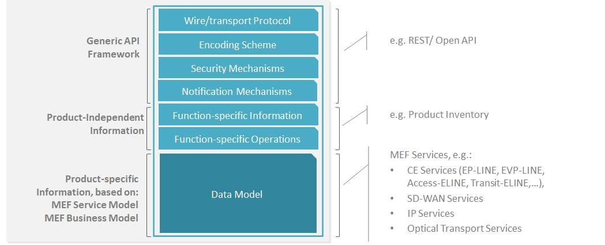

**Figure 2. Cantata and Sonata API framework**

The essential concept behind the framework is to decouple the common structure,
information, and operations from the specific product information content.
Firstly, the Generic API Framework defines a set of design rules and patterns
that are applied across all Cantata or Sonata APIs. Secondly, the
product-independent information of the framework focuses on a model of a
particular Cantata or Sonata functionality and is agnostic to any of the product
specifications. For example, this standard describes the Quote model and
operations that allow performing quoting of any product that is aligned with
either Mplify or custom product specifications. Finally, the product-specific
information part of the framework focuses on Mplify product specifications that
define business-relevant attributes and requirements for trading Mplify
subscriber and Mplify operator services.

This Developer Guide does not define Mplify product specifications but can be
used in combination with any product specifications defined by or compliant with
Mplify.

## 4.5. High-Level Flow

Product Inventory is part of a broader Cantata and Sonata End-to-End flow.
Figure 3. below shows a high-level diagram to get a good understanding of the
whole process and the Product Inventory's position within it.

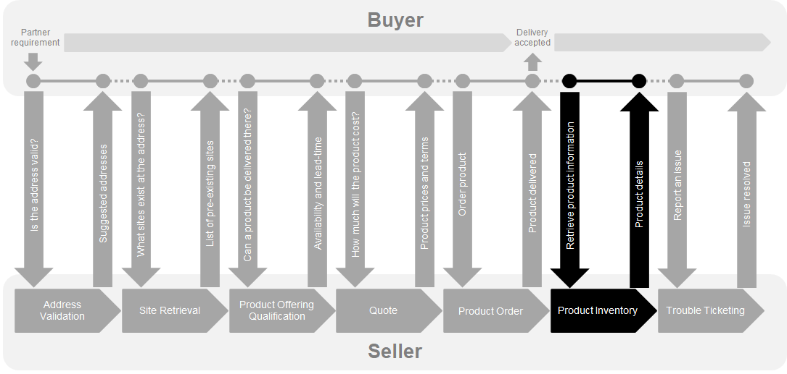

**Figure 3. Cantata and Sonata End-to-End Function Flow**

- Address Validation:
- Allows the Buyer to retrieve address information from the Seller, including
  exact formats, for Geographic Addresses known to the Seller.
- Site Retrieval:
- Allows the Buyer to retrieve Service Site information including exact formats
  for Service Sites known to the Seller.
- Product Offering Qualification (POQ):
- Allows the Buyer to check whether the Seller can deliver a product or set of
  products from among their product offerings at the geographic address or a
  Geographic Site specified by the Buyer; or modify a previously purchased
  product.
- Quote:
- Allows the Buyer to submit a request to find out how much the installation of
  an instance of a Product Offering, an update to an existing Product, or a
  disconnect of an existing Product will cost.
- Product Order:
- Allows the Buyer to request the Seller to initiate and complete the
  fulfillment process of an installation of a Product Offering, an update to an
  existing Product, or a disconnect of an existing Product at the address
  defined by the Buyer.
- Product Inventory:
- Allows the Buyer to retrieve the information about existing Product instances
  from Seller's Product Inventory.
- Trouble Ticketing:
- Allows the Buyer to create, retrieve, and update Trouble Tickets as well as
  receive notifications about Incidents' and Trouble Tickets' updates. This
  allows managing issues and situations that are not part of normal operations
  of the Product provided by the Seller.

<div class="page"/>

# 5. API Description

This section presents the API structure and design patterns. It starts with the
high-level use cases diagram. Then it describes the REST endpoints with use case
mapping. Next, it gives an overview of the API resource model and an explanation
of the design pattern that is used to combine product-agnostic and
product-specific parts of API payloads. Finally, payload validation and API
security aspects are discussed.

## 5.1. High-level use cases

Figure 4 presents a high-level use case diagram as specified in
[[MEF 81](#8-references)] in section 7.1. This picture aims to help understand
the endpoint mapping. Use cases are described extensively in
[chapter 6](#6-api-interactions-and-flows)

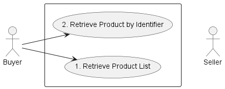

**Figure 4. Use cases**

## 5.2. Resource/endpoint Description

### 5.2.1. Seller Side Endpoints

**Base URL for Cantata**:
`https://{{server}}:{{port}}{{?/seller_prefix}}/mefApi/cantata/productInventory/v2/`

**Base URL for Sonata**:
`https://{{server}}:{{port}}{{?/seller_prefix}}/mefApi/sonata/productInventory/v8/`

The following API endpoints are implemented by the Seller and allow the Buyer to
retrieve existing Product details or a list of Products. The endpoints and
corresponding data model are defined in
`productApi/inventory/productInventoryManagement.api.yaml`.

| API endpoint          | Description                                                                                                                       | MEF 81 Use case Mapping              |
| --------------------- | --------------------------------------------------------------------------------------------------------------------------------- | ------------------------------------ |
| `GET /product`        | A request initiated by the Buyer to retrieve a list of Products (in any state) from the Seller based on a set of filter criteria. | UC 1: Retrieve Product List          |
| `GET /product/{{id}}` | A request initiated by the Buyer to retrieve full details of a single Product based on a Product identifier.                      | UC 2: Retrieve Product by Identifier |

**Table 3. Seller Side Endpoints**

**[R1]** The Buyer implementation **MUST** be able to use all REST methods
listed in Table 3. [MEF81 R3], [MEF81 R4], [MEF81 R5], [MEF81 R6].

## 5.3. Specifying the Buyer ID and the Seller ID

A business entity willing to represent multiple Buyers or multiple Sellers must
follow requirements of [[Mplify 150](#8-references)] chapter 8.8, which states:

> For requests of all types, there is a business entity that is initiating an
> Operation (called a Requesting Entity) and a business entity that is
> responding to this request (called the Responding Entity). In the simplest
> case, the Requesting Entity is the Buyer, and the Responding Entity is the
> Seller. However, in some cases, the Requesting Entity may represent more than
> one Buyer and similarly, the Responding Entity may represent more than one
> Seller.


**Figure 5. Buyer ID and Seller ID Examples**

> As shown in Figure 5, if a Requesting Entity representing a single Buyer is
> doing business with a Responding Entity representing a single Seller, Buyer
> and Seller IDs are not required to be passed between the two entities. If a
> Requesting Entity representing more than one Buyer is doing business with a
> Responding Entity representing a single Seller, the Buyer ID is required to be
> passed between the two entities. If a Requesting Entity representing a single
> Buyer is doing business with a Responding entity representing multiple
> Sellers, the Seller ID is required to be passed between the two entities. If a
> Requesting Entity representing multiple Buyers is doing business with a
> Responding Entity representing multiple Sellers, both the Buyer ID and the
> Seller ID are required to be passed between the entities.
>
> While it is outside the scope of this specification, it is assumed that the
> Requesting Entity and the Responding Entity are aware of each other and can
> authenticate requests initiated by the other party. It is further assumed that
> the Requesting Entity knows:
>
> - the list of Buyers the Requesting Entity represents when interacting with
>   this Responding Entity; and
> - the list of Sellers that this Responding Entity represents to this
>   Requesting Entity.
>
> It is also assumed that the Responding Entity knows:
>
> - the list of Sellers that this Responding Entity represents to this
>   Requesting Entity and
> - the list of Buyers the Requesting Entity represents when interacting with
>   this Responding Entity.

In the API the `buyerId` and `sellerId` are represented as optional query
parameters in each operation defined.

**[R2]** If the Requesting Entity has the authority to represent more than one
Buyer the request **MUST** include `buyerId` that identifies the Buyer being
represented. [Mplify150 R62]

**[R3]** If the Responding Entity represents more than one Seller to this Buyer
the request **MUST** include `sellerId` that identifies the Seller with whom
this request is associated. [Mplify150 R63]

## 5.4. Integration of Product Specific Attributes

Product specifications are defined using JsonSchema format and are integrated
into an Inventory payload using a standard TMF extension pattern.

The extension hosting type in the API data model is `MEFProductConfiguration`.
The `@type` attribute of that type must be set to a value that uniquely
identifies the product specification. A unique identifier for Mplify standard
product specifications is in URN format and is assigned by Mplify. This
identifier is provided as root schema `$id` and in product specification
documentation. Use of non-Mplify standard product definitions is allowed. In
such a case, the schema identifier must be agreed between the Buyer and the
Seller.

The example below shows a header of a Product Specification schema, where
`"$id": urn:mef:lso:spec:sonata:access-eline-ovc:v5.0.0:all` is the
above-mentioned URN:

```yaml
'$schema': http://json-schema.org/draft-07/schema#
'$id': urn:mef:lso:spec:sonata:access-eline-ovc:v5.0.0:all
title: MEF LSO Sonata - Access Eline OVC Product Schema
```

Product specifications are provided as Json schemas without the
`MEFProductConfiguration` context.

Product-specific attributes must be introduced into the `productConfiguration`
attribute of the `MEFProduct`.

Implementations might choose to integrate selected product specifications into
the data model during development. In such cases an integrated data model is
built and product specifications are in an inheritance relationship with
`MEFProductConfiguration` as described in OAS specification. This pattern is
called **Static Binding**. The SDK is additionally shipped with a set of API
definitions that statically bind all product-related APIs (POQ, Quote, Order,
Inventory) with all corresponding product specifications available in the
release. The snippets below present an example of a static binding of the Quote
API with a number of Mplify product specifications, from both
`MEFProductConfiguration` and product specification point of view:

```yaml
MEFProductConfiguration:
  description:
    MEFProductConfiguration is used as an extension point for MEF-specific
    product/service payload. The `@type` attribute is used as a discriminator
  discriminator:
    mapping:
      urn:mef:lso:spec:sonata:carrier-ethernet-operator-uni:v5.0.0:all: '#/components/schemas/CarrierEthernetOperatorUni'
      urn:mef:lso:spec:sonata:access-eline-ovc:v5.0.0:all: '#/components/schemas/AccessElineOvc'
    propertyName: '@type'
  properties:
    '@type':
      description:
        The name of the type, defined in the JSON schema specified above, for
        the product that is the subject of the Request. The named type must be a
        subclass of MEFProductConfiguration.
      type: string
```

```yaml
AccessElineOvc:
  allOf:
    - $ref: '#/components/schemas/MEFProductConfiguration'
    - $ref: '#/components/schemas/AccessElineOvcCommon'
    - properties:
        uniEp:
          $ref: '#/components/schemas/AccessElineOvcEndPoint'
          description:
            MEF 26.2 sec. 16 - The OVC EP object for the OVC EP at the UNI. The
            UNI OVC End Point must be included in the Access E-Line Product.
        enniEp:
          $ref: '#/components/schemas/AccessElineOvcEndPoint'
          description:
            MEF 26.2 sec. 16 - The OVC EP object for the OVC EP at the ENNI. The
            ENNI OVC End Point must be included in the Access E-Line Product.
```

Alternatively, implementations might choose not to build an integrated model and
choose different mechanisms allowing runtime validation of product-specific
fragments of the payload. The system is able to validate a given product against
a new schema without redeployment. This pattern is called **Dynamic Binding.**

Regardless of the chosen implementation pattern, the HTTP payload is exactly the
same. Both implementation approaches must conform to the requirements specified
below.

**[R4]** `MEFProductConfiguration` type is an extension point that **MUST** be
used to integrate product specifications' properties into a request/response
payload.

**[R5]** The `@type` property of `MEFProductConfiguration` **MUST** be used to
specify the type of the extending entity.

**[R6]** Product attributes specified in the payload must conform to the product
specification indicated by the `@type` property.

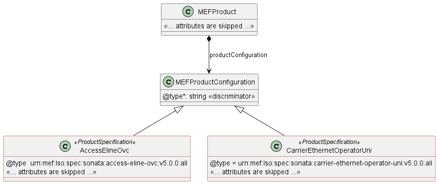

**Figure 6. The Extension Pattern**

Figure 6 depicts two Mplify `<<ProductSpecifications>>` that represent Access
E-Line and Operator UNI products. When these products are used in the payload
the `@type` of `MEFProductConfiguration` takes
`"urn:mef:lso:spec:sonata:access-eline-ovc:v5.0.0:all"` or
`"urn:mef:lso:spec:sonata:carrier-ethernet-operator-uni:v5.0.0:all"` value to
indicate which product specification should be used to interpret a set of
product-specific attributes included in the payload.

The _all_ suffix after the product type name in the URN comes from the approach
that the product schemas may differ depending on the API they are used with.
`all` means that this schema is applicable to all contexts.

This document uses samples of Access E-Line Product specification definitions to
construct API payload examples in [Section 6](#6-api-interactions-and-flows).

**_Note:_** The Access E-Line product is valid only in the Sonata context. It is
used only for the explanation of the rules of combining the product-agnostic
(envelope) and product-specific (payload) parts of the APIs. The examples do not
represent full and consistent product configurations, they are not normative and
are not kept up to date with their respective standards. It is out of the scope
of this document to explain the details of any product.

## 5.5. Sample Product Specification

The Sonata SDK contains product specification definitions, from which Access
E-Line [[MEF 106](#8-references)] is used in the payload samples in this
section. They are located in the SDK at:

`\productSchema\carrierEthernet\operatorEthernet\accessEline\accessElineOvc.yaml`
`\productSchema\carrierEthernet\operatorEthernet\carrierEthernetOperatorUni\carrierEthernetOperatorUni.yaml`

Figure 7 depicts a simplified view of the defined relationships with other
products and places.


**Figure 7. A Simplified View of Product and Place Relationships**

Product specifications define a number of product-related and envelope-related
requirements. Sample envelope-related requirements for Access E-Line:

- for an Access E-Line OVS product two mandatory relationship roles must be
  specified, one with the operator ENNI (`CONNECTS_TO_ENNI`) and a second with
  the operator UNI (`CONNECTS_TO_UNI`).
- in the case of a `modify` action, product relationships must have the same
  value as in the `add` action. They must not be changed
- for an operator UNI product a place relationship (`INSTALL_LOCATION`) must be
  specified
- in the case of a `modify` action, place relationships must have the same value
  as in the `add` action. They must not be changed

The product relationship (`product.productRelationship`) and the place
relationship (`product.place`) are presented in Figure 7.

In case some of both product-related or envelope-related requirements are
violated the Seller returns an error response to the Buyer which indicates
specific functional errors. These errors are listed in the response body (a list
of `Error422` entries) for HTTP `422` response.

## 5.6. Model Structural Validation

Model Structural Validation

The structure of the HTTP payloads exchanged via Quote API endpoints is defined
using:

- OpenAPI version 3.0 for product-agnostic part of the payload
- JsonSchema (draft 7) for product-specific part of the payload

**[R7]** Implementations **MUST** use payloads that conform to these
definitions.

**[R8]** The Buyer and the Seller **MUST NOT** use any operation, entity or
attribute that is not explicitly defined or allowed by this standard.

**[R9]** A product specification may define additional consistency rules and
requirements that **MUST** be respected by implementations.

These are defined for:

- required relation type, multiplicity to other items in the same quote request
- required relation type, multiplicity to entities in the Seller's product
  inventory
- related contact information roles that are to be defined at the item level
- relations to places (locations) and their roles that are to be defined at the
  item level

## 5.7. Providing the place information

When required by product specification, the Product must point to the place
where the Product is provided. This is done with the use of the `place`
attribute of type `RelatedPlaceRefOrQuery`, which is presented in Figure 8.

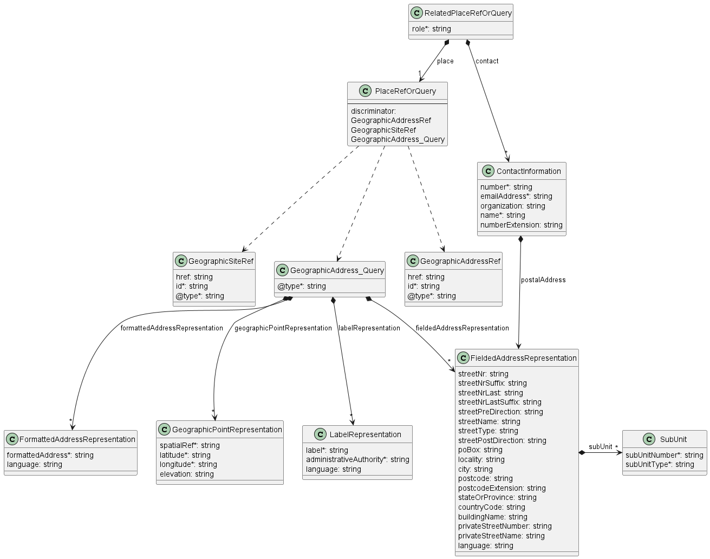

**Figure 8. Data model - referring to a place**

The `role` defines the function that the place plays for a given Product. The
name of the role to be provided is strictly defined by the product
specification. Usually, it is `INSTALL_LOCATION`.

`contact` provides additional information about the person to contact to get
access to this place in case such access is required to complete the evaluation
of this Quote Item.

`place` is where the actual place is pointed. The attribute is of type
`PlaceRefOrQuery` which is an abstract class that can be of one of three types:
`GeographicAddressRef`, `GeographicSiteRef`, or `GeographicAddress_Query`. The
first two are simple identifiers to reference a `GeographicAddress` or
`GeographicSite` respectively. The Buyer usually first validates the
`GeographicAddress` and gets its identifier from the Seller and then optionally
retrieves `GeographicSite` information for that address. In the unlikely case
that the Seller does not provide the Address Validation API and the Buyer is not
able to obtain the address identifier in any other way, the
`GeographicAddressQuery` type might be used. It contains lists of Geographic
Address Representations to provide the address information by value. There are
four types of Geographic Address Representations:

- `FieldedAddressRepresentation`
- `FormattedAddressRepresentation`
- `LabelRepresentation`
- `GeographicPointRepresentation`

One or more of these representations may be used to describe a single place.

The `GeographicAddress` model together with its above-mentioned representations
and respective requirements are defined by [Mplify 121.1](#8-references)
(chapter 5.3). That standard is the owner of those definitions. This API
specification contains a model of `GeographicAddress` but does not define it.
Any further changes of these types will update the API specification, but will
not be reflected in this document.

The mandatory `@type` attribute of `GeographicSiteRef`, `GeographicAddressRef`
and `GeographicAddress_Query` is used as a discriminator to unambiguously
identify the intended type when using in the context of the `oneOf` section of
`PlaceRefOrQuery` type.

## 5.8. Security Considerations

There must be an authentication mechanism whereby a Seller can be assured who a
Buyer is and vice-versa. There must also be authorization mechanisms in place to
control what a particular Buyer or Seller is allowed to do and what information
may be obtained. However, the definition of the exact security mechanism and
configuration is outside the scope of this document. Security considerations are
standardized by _LSO API Security Profile_ [[MEF 128.1](#8-references)].

<div class="page"/>

# 6. API Interactions and Flows

This section provides a detailed insight into the API functionality, use cases,
and flows. It starts with Table 4 presenting a list and short description of all
business use cases then presents the variants of end-to-end interaction flows,
and in the following subchapters describes the API usage flow and examples for
each of the use cases.

| Use Case # | Use Case Name                                                                   | Use Case Description                                                                               |
| ---------- | ------------------------------------------------------------------------------- | -------------------------------------------------------------------------------------------------- |
| 1          | [Retrieve Product List](#61-use-case-1-retrieve-product-list)                   | The Buyer requests a list of Products from the Seller based on filter criteria.                    |
| 2          | [Retrieve Product by Identifier](#62-use-case-2-retrieve-product-by-identifier) | The Buyer retrieves the details associated with the Product that matches the specified Identifier. |

**Table 4. Use cases description**

## 6.1. Use case 1: Retrieve Product List

The Buyer can retrieve a list of `Products` by using a `GET /product` operation
with desired filtering criteria. The attributes that are available to be used
are:

- `status`
- `productSpecificationId`
- `productOfferingId`
- `externalId`
- `geographicalSiteId`
- `relatedProductId`
- `billingAccountId`
- `productOrderId`
- `startDate.gt`
- `startDate.lt`
- `lastUpdateDate.gt`
- `lastUpdateDate.lt`

The flow is a simple request - response pattern, as presented in Figure 9:

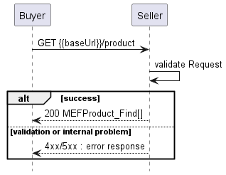

**Figure 9. Use case 1: Retrieve Product List flow**

The part of the model taking part in this use case is presented in Figure 10

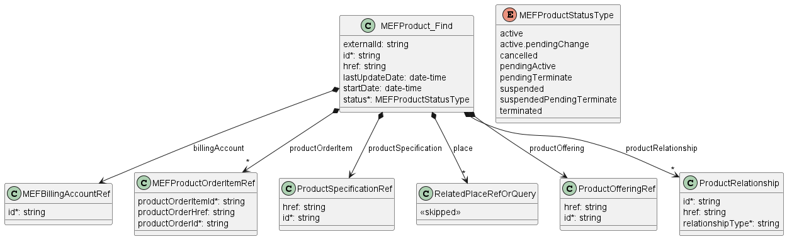

**Figure 10. Use case 1: Retrieve Product List model**

```
https://serverRoot/mefApi/sonata/productInventory/v8/product?status=pendingTerminate
```

The example above shows a Buyer's request to get all `Products` that are in the
`pendingTerminate` status. The correct response (HTTP code `200`) in the
response body contains a list of `MEFProduct_Find` objects matching the
criteria. To get more details (e.g. the item level information), the Buyer has
to query a specific `Product` by `id`.

The snippet below shows an example of a response with 1 product matched:

```json
[
  {
    "id": "01494079-6c79-4a25-83f7-48284196d44d",
    "href": "{{baseUrl}}/product/01494079-6c79-4a25-83f7-48284196d44d",
    "status": "pendingTerminate",
    "externalId": "BuyerProduct-001",
    "lastUpdateDate": "2021-06-01T08:55:54.155Z",
    "startDate": "2021-05-01T08:55:54.155Z",
    "billingAccount": {
      "id": "00000000-1111-0000-0000-000000000001"
    },
    "productOffering": {
      "id": "00000000-5555-0000-0000-000000000001"
    },
    "productOrderItem": [
      {
        "productOrderItemId": "item-001",
        "productOrderHref": "{{baseUrl}}/productOrder/00000000-1111-2222-3333-000000000123",
        "productOrderId": "00000000-1111-2222-3333-000000000123"
      }
    ],
    "productRelationship": [
      {
        "relationshipType": "CONNECTS_TO_ENNI",
        "id": "SP1_ENNI"
      }
    ]
  }
]
```

**[R10]** The Buyer **MUST** be able to perform the Inventory Query without any
filter criteria. [MEF81 R7]

**[O1]** The Seller **MAY** place a limit on the length of the list returned.
[MEF81 O2]

**[R11]** In case of too many matching items are found (the definition of 'too
many' is up to Seller's discretion), the Seller **MUST** return an `Error422`
with `code=tooManyRecords`. [MEF81 O3]

The Buyer may also ask for pagination of the response when the number of results
is too big. The following query attributes related to pagination can be
provided:

- `limit` - number of expected list items
- `offset` - offset of the first element in the result list.

```
https://serverRoot/mefApi/sonata/productInventory/v8/product?status=active&limit=20&offset=0
```

The example above shows a Buyer's request to get the first twenty `MEFProducts`
that are in `active` status. The correct response (HTTP code `200`) contains a
list of `MEFProduct_Find` objects matching the criteria in the response body. To
get more details (e.g. the item level information), the Buyer has to query a
specific `MEFProduct` by id.

The Seller returns a list of elements that comply with the requested `limit`. If
the requested `limit` is higher than the supported list size then the smaller
list of results is returned. In that case, the size of the result is returned in
the header attribute `X-Result-Count`. The Seller can indicate that there are
additional results available using:

- `X-Total-Count` header attribute with the total number of available results
- `X-Pagination-Throttled` header set to `true`

**[D1]** The Seller **SHOULD** support the pagination mechanism.

**[CR1]<[D1]** Seller **MUST** use either `X-Total-Count` or
`X-Pagination-Throttled` to indicate that the page was truncated and additional
results are available.

**[R12]** In case no items matching the criteria are found, the Seller **MUST**
return a valid response with an empty list.

**[R13]** The Seller **MUST** put the following attributes (if set) into the
`MEFProduct_Find` object in the response: [MEF81 R8]:

- `id`
- `status`
- `externalId`
- `lastUpdateDate`
- `startDate`
- `billingAccount`
- `productOffering`
- `productOrderItem`
- `productRelationship`
- `productSpecification`
- `place`

## 6.2. Use case 2: Retrieve Product by Identifier

To get detailed up to up-to-date information about the Product, the Buyer sends
a Retrieve Product by Identifier request using a `GET /product/{id}` operation.

The flow is a simple request - response pattern, as presented in Figure 11:

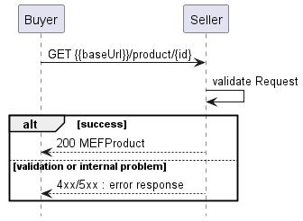

**Figure 11. Use case 2: Retrieve Product by Identifier flow**

The part of the model taking part in this use case is presented in Figure 12

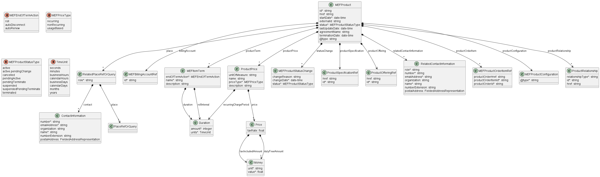

**Figure 12. Use case 2: Retrieve Product model**

Example request and response:

`GET /mefApi/sonata/productInventory/v8/product/01494079-6c79-4a25-83f7-48284196d44d`

```json
{
  "id": "01494079-6c79-4a25-83f7-48284196d44d",
  "href": "{{baseUrl}}/product/01494079-6c79-4a25-83f7-48284196d44d",
  "externalId": "BuyerProduct-001",
  "lastUpdateDate": "2021-06-01T08:55:54.155Z",
  "startDate": "2021-05-01T08:55:54.155Z",
  "status": "pendingTerminate",
  "productConfiguration": {
    "@type": "urn:mef:lso:spec:sonata:access-eline-ovc:v5.0.0:all",
    "ceVlanIdPreservation": "PRESERVE",
    "maximumFrameSize": 1526,
    "listOfClassOfServiceNames": ["low"],
    "enniEp": {
      "identifier": "SP1_ENNI-EP1",
      "ingressClassOfServiceMap": {
        "mapType": "ENDPOINT",
        "map_M": "low",
        "l2cp_P": {
          "l2cpIdentifier": {
            "l2cpProtocolType": "LLC",
            "llcAddressOrEtherType": 66
          },
          "l2cpCosName": "low"
        }
      }
    },
    "uniEp": {
      "identifier": "NewYork_UNI-EP1",
      "ingressBandwidthProfilePerClassOfServiceName": [
        {
          "classOfServiceName": "low",
          "bwpFlow": {
            "cir": {
              "irValue": 0,
              "irUnits": "MBPS"
            },
            "cirMax": {
              "irValue": 0,
              "irUnits": "MBPS"
            },
            "eir": {
              "irValue": 10,
              "irUnits": "GBPS"
            },
            "eirMax": {
              "irValue": 10,
              "irUnits": "GBPS"
            }
          }
        }
      ],
      "ingressClassOfServiceMap": {
        "mapType": "ENDPOINT",
        "map_M": "low",
        "l2cp_P": {
          "l2cpIdentifier": {
            "l2cpProtocolType": "LLC",
            "llcAddressOrEtherType": 66
          },
          "l2cpCosName": "low"
        }
      }
    }
  },
  "billingAccount": {
    "id": "00000000-1111-0000-0000-000000000001"
  },
  "productOffering": {
    "id": "00000000-5555-0000-0000-000000000001"
  },
  "productOrderItem": [
    {
      "productOrderItemId": "item-001",
      "productOrderHref": "{{baseUrl}}/productOrder/00000000-1111-2222-3333-000000000123",
      "productOrderId": "00000000-1111-2222-3333-000000000123"
    }
  ],
  "price": {
    "taxRate": 8,
    "dutyFreeAmount": {
      "unit": "USD",
      "value": 50
    },
    "taxIncludedAmount": {
      "unit": "USD",
      "value": 54
    }
  },
  "productRelationship": [
    {
      "relationshipType": "CONNECTS_TO_ENNI",
      "id": "SP1_ENNI"
    }
  ],
  "productTerm": [
    {
      "duration": {
        "amount": 12,
        "units": "calendarMonths"
      },
      "endOfTermAction": "autoRenew",
      "name": "Yearly Subscription"
    }
  ],
  "relatedContactInformation": [
    {
      "emailAddress": "Seller.AssuranceTechnicalContact@seller.mef.com",
      "name": "Seller Assurance Technical Contact",
      "number": "+98-765-432-10",
      "role": "sellerAssuranceTechnicalContact "
    },
    {
      "emailAddress": "Seller.CommercialContact@seller.mef.com",
      "name": "Seller Commercial Contact",
      "number": "+98-765-432-11",
      "role": "sellerCommercialContact"
    },
    {
      "emailAddress": "Seller.SLAManagementContact@seller.mef.com",
      "name": "Seller SLA Management Contact",
      "number": "+98-765-432-12",
      "role": "sellerSlaManagementContact"
    },
    {
      "emailAddress": "Buyer.AssuranceTechnicalContact@buyer.mef.com",
      "name": "Buyer Assurance Technical Contact",
      "number": "+12-345-678-90",
      "role": "buyerAssuranceTechnicalContact "
    },
    {
      "emailAddress": "Buyer.CommercialContact@buyer.mef.com",
      "name": "Buyer Commercial Contact",
      "number": "+12-345-678-91",
      "role": "buyerCommercialContact"
    },
    {
      "emailAddress": "Buyer.SLAManagementContact@buyer.mef.com",
      "name": "Buyer SLA Management Contact",
      "number": "+12-345-678-92",
      "role": "buyerSlaManagementContact"
    }
  ],
  "statusChange": [
    {
      "changeDate": "2021-05-01T10:01:14.571Z",
      "status": "pendingActive"
    },
    {
      "changeDate": "2021-05-02T10:01:14.571Z",
      "status": "active"
    },
    {
      "changeDate": "2021-06-01T10:01:14.571Z",
      "status": "pendingTerminate"
    }
  ]
}
```

Figure 13 below presents the Product's lifecycle.

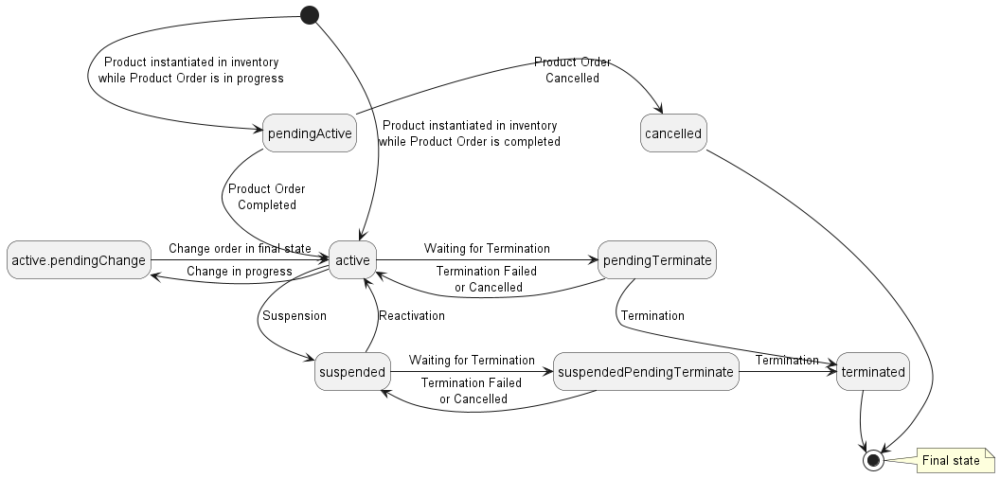

**Figure 13. Product State Machine**

A detailed description of each state can be found in Table 5.

| name                         | MEF 81 name                   | Description                                                                                                                                                                                                                                                                     |
| ---------------------------- | ----------------------------- | ------------------------------------------------------------------------------------------------------------------------------------------------------------------------------------------------------------------------------------------------------------------------------- |
| `active`                     | ACTIVE                        | The Product Order has been successfully completed and the Product Order and associated Product Order Items are in the Inventory.                                                                                                                                                |
| `active. pendingChange`      | ACTIVE\_ PENDING_CHANGE       | The Product is `active` and has a Product Order to change the Product that is in progress. The status returns to `active` when the order is completed or if the Product Order is cancelled.                                                                                     |
| `pendingTerminate`           | ACTIVE\_ PENDING_TERMINATE    | The Product is `active` and has a disconnect Order submitted by the Buyer that is in progress. The status changes to `terminated` if the disconnect is successful. The status returns to `active` if the Product Order fails to be completed or the Product Order is cancelled. |
| `cancelled`                  | CANCELLED                     | The Product is `cancelled` when the Product Order has moved to the `cancelled`.                                                                                                                                                                                                 |
| `pendingActive`              | PENDING                       | The Product Order has moved to the `acknowledged` state as defined in MEF 57.1 [11] and the Product ID for one or more Product Items has been passed from the Seller to the Buyer. The Product Order is not completed.                                                          |
| `suspended`                  | SUSPENDED                     | A Product has been successfully suspended. Products are placed into `suspended` state for some reason (e.g. nonpayment of the bill) and removed from `suspended` state for some reason (e.g. after payment).                                                                    |
| `suspended PendingTerminate` | SUSPENDED\_ PENDING_TERMINATE | The Product is in the process of being terminated by the Seller for some reason (e.g. non-payment). The status changes to `terminated` if the termination is successful. The status returns to `suspended` if the termination is not successful or cancelled.                   |
| `terminated`                 | TERMINATED                    | The Product has been successfully terminated via a disconnect Product order initiated by the Buyer or by the Seller for some reason (e.g. non-payment).                                                                                                                         |

**Table 5: Product statuses**

Products that are terminated might be removed from the Seller's inventory system
or shown in the `terminated` state at the Seller's discretion.

**[R14]** The `stateChange` **MUST** include a full object's state history
including the initial state (also in the Immediate Response).

**[R15]** The Seller **MUST** provide the following contact information: [MEF81
R11]

| Contact Role                | `role` value                                                            | Description                                                                           |
| --------------------------- | ----------------------------------------------------------------------- | ------------------------------------------------------------------------------------- |
| Assurance Technical Contact | `buyerAssuranceTechnicalContact`,</br>`sellerAssuranceTechnicalContact` | Operational contact such as Network Operations Center (NOC) for each party.           |
| Commercial Contact          | `buyerCommercialContact`, </br>`sellerCommercialContact`                | Contact for commercial issues like billing, contract extensions, etc. for each party. |
| SLA Management Contact      | `buyerSlaManagementContact`, </br>`sellerSlaManagementContact`          | Contact for SLA-related issues, lifecycle reports, etc. for each party.               |

**Table 6. Required Related Contact Information `role`**

**_Note:_** The method used to update these contacts in the Seller's Inventory
system is assumed to be agreed to between the Buyer and the Seller and is
outside the scope of this document.

There is no step of Buyer's approval before moving a Product to `active` status.
This might be part of a bilateral agreement or procedure that takes place
outside of Product Inventory API.

Additions and changes to Products in the Product Inventory can be performed on
with the use of Product Orders and the Product Order Management API, or by the
request of the Seller.

<div class="page"/>

# 7. API Details

## 7.1. API patterns

### 7.1.1. Indicating errors

Erroneous situations are indicated by appropriate HTTP responses. An error
response is indicated by HTTP status 4xx (for client errors) or 5xx (for server
errors) and appropriate response payload. The Product Order API uses the error
responses as depicted and described below.

Implementations can use HTTP error codes not specified in this standard in
compliance with rules defined in RFC 7231 [[RFC7231](#8-references)]. In such a
case, the error message body structure might be aligned with the `Error`.

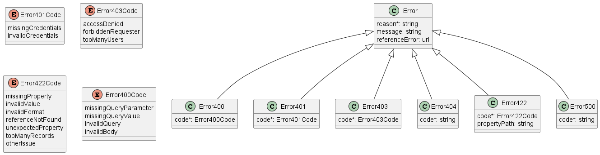

**Figure 14. Data model types to represent an erroneous response**

#### 7.1.1.1. Type Error

**Description:** Standard Class used to describe API response error Not intended
to be used directly. The `code` in the HTTP header is used as a discriminator
for the type of error returned in runtime.

<table id="T_Error">
    <thead style="font-weight:bold;">
        <tr>
            <td>Name</td>
            <td>Type</td>
            <td>Description</td>
        </tr>
    </thead>
    <tbody>
        <tr>
            <td>reason*</td>
            <td>string<br/><span style="font-size:10px;font-style:italic">maxLength = 255</span></td>
            <td>Text that explains the reason for the error. This can be shown to a client user.</td>
        </tr><tr>
            <td>message</td>
            <td>string</td>
            <td>Text that provides mode details and corrective actions related to the error. This can be shown to a client user.</td>
        </tr><tr>
            <td>referenceError</td>
            <td>uri<br/><span style="font-size:10px;font-style:italic">format = uri</span></td>
            <td>URL pointing to documentation describing the error</td>
        </tr>
    </tbody>
</table>

#### 7.1.1.2. Type Error400

**Description:** Bad Request.
(https://tools.ietf.org/html/rfc7231#section-6.5.1)

Inherits from:

- <a href="#T_Error">Error</a>

<table id="T_Error400">
    <thead style="font-weight:bold;">
        <tr>
            <td>Name</td>
            <td>Type</td>
            <td>Description</td>
        </tr>
    </thead>
    <tbody>
        <tr>
            <td>code*</td>
            <td><a href="#T_Error400Code">Error400Code</a></td>
            <td>One of the following error codes:
- missingQueryParameter: The URI is missing a required query-string parameter
- missingQueryValue: The URI is missing a required query-string parameter value
- invalidQuery: The query section of the URI is invalid.
- invalidBody: The request has an invalid body</td>
        </tr>
    </tbody>
</table>

#### 7.1.1.3. `enum` Error400Code

**Description:** One of the following error codes:

- missingQueryParameter: The URI is missing a required query-string parameter
- missingQueryValue: The URI is missing a required query-string parameter value
- invalidQuery: The query section of the URI is invalid.
- invalidBody: The request has an invalid body

#### 7.1.1.4. Type Error401

**Description:** Unauthorized. (https://tools.ietf.org/html/rfc7235#section-3.1)

Inherits from:

- <a href="#T_Error">Error</a>

<table id="T_Error401">
    <thead style="font-weight:bold;">
        <tr>
            <td>Name</td>
            <td>Type</td>
            <td>Description</td>
        </tr>
    </thead>
    <tbody>
        <tr>
            <td>code*</td>
            <td><a href="#T_Error401Code">Error401Code</a></td>
            <td>One of the following error codes:
- missingCredentials: No credentials provided.
- invalidCredentials: Provided credentials are invalid or expired</td>
        </tr>
    </tbody>
</table>

#### 7.1.1.5. `enum` Error401Code

**Description:** One of the following error codes:

- missingCredentials: No credentials provided.
- invalidCredentials: Provided credentials are invalid or expired

#### 7.1.1.6. Type Error403

**Description:** Forbidden. This code indicates that the server understood the
request but refuses to authorize it.
(https://tools.ietf.org/html/rfc7231#section-6.5.3)

Inherits from:

- <a href="#T_Error">Error</a>

<table id="T_Error403">
    <thead style="font-weight:bold;">
        <tr>
            <td>Name</td>
            <td>Type</td>
            <td>Description</td>
        </tr>
    </thead>
    <tbody>
        <tr>
            <td>code*</td>
            <td><a href="#T_Error403Code">Error403Code</a></td>
            <td>This code indicates that the server understood
the request but refuses to authorize it because
of one of the following error codes:
- accessDenied: Access denied
- forbiddenRequester: Forbidden requester
- tooManyUsers: Too many users</td>
        </tr>
    </tbody>
</table>

#### 7.1.1.7. `enum` Error403Code

**Description:** This code indicates that the server understood the request but
refuses to authorize it because of one of the following error codes:

- accessDenied: Access denied
- forbiddenRequester: Forbidden requester
- tooManyUsers: Too many users

#### 7.1.1.8. Type Error404

**Description:** Resource for the requested path not found.
(https://tools.ietf.org/html/rfc7231#section-6.5.4)

Inherits from:

- <a href="#T_Error">Error</a>

<table id="T_Error404">
    <thead style="font-weight:bold;">
        <tr>
            <td>Name</td>
            <td>Type</td>
            <td>Description</td>
        </tr>
    </thead>
    <tbody>
        <tr>
            <td>code*</td>
            <td>string</td>
            <td>The following error code:
- notFound: A current representation for the target resource not found</td>
        </tr>
    </tbody>
</table>

#### 7.1.1.9. Type Error422

The response for HTTP status `422` is a list of elements that are structured
using the `Error422` data type. Each list item describes a business validation
problem. This type introduces the `propertyPath` attribute which points to the
erroneous property of the request, so that the Buyer may fix it easier. It is
highly recommended that this property should be used, yet remains optional
because it might be hard to implement.

**Description:** Unprocessable entity due to a business validation problem.
(https://tools.ietf.org/html/rfc4918#section-11.2)

Inherits from:

- <a href="#T_Error">Error</a>

<table id="T_Error422">
    <thead style="font-weight:bold;">
        <tr>
            <td>Name</td>
            <td>Type</td>
            <td>Description</td>
        </tr>
    </thead>
    <tbody>
        <tr>
            <td>code*</td>
            <td><a href="#T_Error422Code">Error422Code</a></td>
            <td>One of the following error codes:
  - missingProperty: The property the Seller has expected is not present in the payload
  - invalidValue: The property has an incorrect value
  - invalidFormat: The property value does not comply with the expected value format
  - referenceNotFound: The object referenced by the property cannot be identified in the Seller system
  - unexpectedProperty: Additional property, not expected by the Seller has been provided
  - tooManyRecords: the number of records to be provided in the response exceeds the Seller&#x27;s threshold.
  - otherIssue: Other problem was identified (detailed information provided in a reason)
</td>
        </tr><tr>
            <td>propertyPath</td>
            <td>string</td>
            <td>A pointer to a particular property of the payload that caused the validation issue. It is highly recommended that this property should be used.
Defined using JavaScript Object Notation (JSON) Pointer (https://tools.ietf.org/html/rfc6901).
</td>
        </tr>
    </tbody>
</table>

#### 7.1.1.10. `enum` Error422Code

**Description:** One of the following error codes:

- missingProperty: The property the Seller has expected is not present in the
  payload
- invalidValue: The property has an incorrect value
- invalidFormat: The property value does not comply with the expected value
  format
- referenceNotFound: The object referenced by the property cannot be identified
  in the Seller system
- unexpectedProperty: Additional property, not expected by the Seller has been
  provided
- tooManyRecords: the number of records to be provided in the response exceeds
  the Seller's threshold.
- otherIssue: Other problem was identified (detailed information provided in a
  reason)

#### 7.1.1.11. Type Error500

**Description:** Internal Server Error.
(https://tools.ietf.org/html/rfc7231#section-6.6.1)

Inherits from:

- <a href="#T_Error">Error</a>

<table id="T_Error500">
    <thead style="font-weight:bold;">
        <tr>
            <td>Name</td>
            <td>Type</td>
            <td>Description</td>
        </tr>
    </thead>
    <tbody>
        <tr>
            <td>code*</td>
            <td>string</td>
            <td>The following error code:
- internalError: Internal server error - the server encountered an unexpected condition that prevented it from fulfilling the request.</td>
        </tr>
    </tbody>
</table>

## 7.2. Management API Data model

Figure 15 presents the whole Product Inventory data model. The data types,
requirements related to them and mapping to MEF 81 specification are discussed
later in this section.

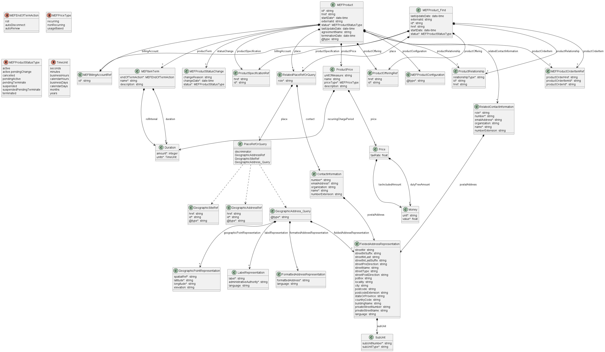

**Figure 15. Product Inventory Data Model**

### 7.2.1. Product

#### 7.2.1.1. Type MEFProduct

**Description:** A product is realized as one or more service(s) and / or
resource(s).

<table id="T_MEFProduct" style="width:100%">
    <thead style="font-weight:bold">
        <tr>
            <td>Name</td>
            <td style="width:15%">Type</td>
            <td>M/O</td>
            <td>Description</td>
            <td>MEF 81</td>
        </tr>
    </thead>
    <tbody>
        <tr>
        <td>id</td>
            <td>string</td>
            <td>M</td>
            <td>Unique identifier of the product</td>
            <td>Seller Product Identifier</td>
        </tr><tr>
        <td>href</td>
            <td>string</td>
            <td>O</td>
            <td>Reference of the product</td>
            <td>Not represented in MEF 81</td>
        </tr><tr>
        <td>startDate</td>
            <td>date-time<br/><span style="font-size:10px;font-style:italic">format = date-time</span></td>
            <td>M</td>
            <td>Is the date from which the product starts. Start date is when the product is active for the first time (when the install in the product order has been processed).</td>
            <td>Initial Order Completion Date</td>
        </tr><tr>
        <td>externalId</td>
            <td>string</td>
            <td>O</td>
            <td>Buyer identifier of the product</td>
            <td>Buyer Product Identifier</td>
        </tr><tr>
        <td>status</td>
            <td><a href="#T_MEFProductStatusType">MEFProduct-</br>StatusType</a></td>
            <td>M</td>
            <td>The lifecycle status of the product.</td>
            <td>Status</td>
        </tr><tr>
        <td>statusChange</td>
            <td><a href="#T_MEFProductStatusChange">MEFProduct-</br>StatusChange</a>[]</td>
            <td>M</td>
            <td>status change for the Product</td>
            <td>Not represented in MEF 81</td>
        </tr><tr>
        <td>lastUpdateDate</td>
            <td>date-time<br/><span style="font-size:10px;font-style:italic">format = date-time</span></td>
            <td>O</td>
            <td>Latest date when the product has been updated.</td>
            <td>Last Updated Date</td>
        </tr><tr>
        <td>agreementName</td>
            <td>string</td>
            <td>O</td>
            <td>Name of the agreement. The name is unique between the Buyer and the Seller.</td>
            <td>Agreement Name</td>
        </tr><tr>
        <td>productSpecification</td>
            <td><a href="#T_ProductSpecificationRef">ProductSpecificationRef</a></td>
            <td>O</td>
            <td>A reference to a Product Specification of the Product</td>
            <td>Product Specification ID</td>
        </tr><tr>
        <td>place</td>
            <td><a href="#T_RelatedPlaceRefOrQuery">RelatedPlace-</br>RefOrQuery</a>[]</td>
            <td>O</td>
            <td>A list of locations that are related to the Product. For example an installation location</td>
            <td>Service Site Identifier (Geographical Site ID)</td>
        </tr><tr>
        <td>productOffering</td>
            <td><a href="#T_ProductOfferingRef">ProductOfferingRef</a></td>
            <td>O</td>
            <td>A particular Product Offering defines the technical and commercial attributes and behaviors of a Product.</td>
            <td>Product Offering ID</td>
        </tr><tr>
        <td>related-</br>ContactInformation</td>
            <td><a href="#T_RelatedContactInformation">Related-</br>ContactInformation</a>[]</td>
            <td>O</td>
            <td>Party playing a role for this Product</td>
            <td>Buyer Assurance Technical Contact, Buyer Commercial Contact, Buyer SLA Management Contact, Seller Assurance Technical Contact, Seller Commercial Contact, Seller SLA Management Contact</td>
        </tr><tr>
        <td>billingAccount</td>
            <td><a href="#T_MEFBillingAccountRef">MEFBillingAccountRef</a></td>
            <td>O</td>
            <td>The Billing Account associated with the Product</td>
            <td>Billing Account Identifier</td>
        </tr><tr>
        <td>productOrderItem</td>
            <td><a href="#T_MEFProductOrderItemRef">MEFProduct-</br>OrderItemRef</a>[]</td>
            <td>O</td>
            <td>The Product Order Item of the associated Product order that resulted in the creation of this Product.</td>
            <td>Product Order Identifier, Product Order Item Identifier</td>
        </tr><tr>
        <td>productTerm</td>
            <td><a href="#T_MEFItemTerm">MEFItemTerm</a>[]</td>
            <td>O</td>
            <td>Term of the Product</td>
            <td>Product Order Item Term, Product Order Item Term End Date</td>
        </tr><tr>
        <td>terminationDate</td>
            <td>date-time<br/><span style="font-size:10px;font-style:italic">format = date-time</span></td>
            <td>O</td>
            <td>Is the date when the product was terminated. Termination date (commercial) is when the product has been terminated (when the disconnect in the product order has been processed).</td>
            <td>Termination Date</td>
        </tr><tr>
        <td>productConfiguration</td>
            <td><a href="#T_MEFProductConfiguration">MEFProduct-</br>Configuration</a></td>
            <td>O</td>
            <td>MEFProductConfiguration is used to specify the MEF specific product payload.</td>
            <td>Product</td>
        </tr><tr>
        <td>productRelationship</td>
            <td><a href="#T_ProductRelationship">ProductRelationship</a>[]</td>
            <td>O</td>
            <td>A list of references to existing products that are related to the Product.</td>
            <td>Product Relationship</td>
        </tr><tr>
        <td>productPrice</td>
            <td><a href="#T_ProductPrice">ProductPrice</a>[]</td>
            <td>O</td>
            <td>A list of Prices associated with the Product</td>
            <td>Product Price</td>
        </tr>
    </tbody>
</table>

#### 7.2.1.2. Type MEFProduct_Find

**Description:** Class used to provide product overview retrieved in GET (by
list) operation

<table id="T_MEFProduct_Find" style="width:100%">
    <thead style="font-weight:bold">
        <tr>
            <td>Name</td>
            <td style="width:15%">Type</td>
            <td>M/O</td>
            <td>Description</td>
            <td>MEF 81</td>
        </tr>
    </thead>
    <tbody>
        <tr>
        <td>productSpecification</td>
            <td><a href="#T_ProductSpecificationRef">ProductSpecificationRef</a></td>
            <td>O</td>
            <td>A reference to a Product Specification of the Product</td>
            <td>Product Specification ID</td>
        </tr><tr>
        <td>place</td>
            <td><a href="#T_RelatedPlaceRefOrQuery">RelatedPlaceRefOrQuery</a>[]</td>
            <td>O</td>
            <td>A list of locations that are related to the Product. For example an installation location</td>
            <td>Service Site Identifier (Geographical Site ID)</td>
        </tr><tr>
        <td>productOffering</td>
            <td><a href="#T_ProductOfferingRef">ProductOfferingRef</a></td>
            <td>O</td>
            <td>A particular Product Offering defines the technical and commercial attributes and behaviors of a Product.</td>
            <td>Product Offering ID</td>
        </tr><tr>
        <td>lastUpdateDate</td>
            <td>date-time<br/><span style="font-size:10px;font-style:italic">format = date-time</span></td>
            <td>O</td>
            <td>Latest date when the product has been updated.</td>
            <td>Last Updated Date</td>
        </tr><tr>
        <td>externalId</td>
            <td>string</td>
            <td>O</td>
            <td>This identifier is optionally provided during the product ordering and stored for informative purpose in the seller inventory</td>
            <td>Buyer Product Identifier</td>
        </tr><tr>
        <td>productRelationship</td>
            <td><a href="#T_ProductRelationship">ProductRelationship</a>[]</td>
            <td>O</td>
            <td>A list of references to existing products that are related to the Product.</td>
            <td>Product Relationship</td>
        </tr><tr>
        <td>id</td>
            <td>string</td>
            <td>M</td>
            <td>Unique identifier of the product</td>
            <td>Seller Product Identifier</td>
        </tr><tr>
        <td>href</td>
            <td>string</td>
            <td>O</td>
            <td>Reference of the product</td>
            <td>Not represented in MEF 81</td>
        </tr><tr>
        <td>billingAccount</td>
            <td><a href="#T_MEFBillingAccountRef">MEFBillingAccountRef</a></td>
            <td>O</td>
            <td>The Billing Account associated with the Product</td>
            <td>Billing Account Identifier</td>
        </tr><tr>
        <td>productOrderItem</td>
            <td><a href="#T_MEFProductOrderItemRef">MEFProductOrderItemRef</a>[]</td>
            <td>O</td>
            <td>The Product Order Item of the associated Product order that resulted in the creation of this Product.</td>
            <td>Product Order Identifier, Product Order Item Identifier</td>
        </tr><tr>
        <td>startDate</td>
            <td>date-time<br/><span style="font-size:10px;font-style:italic">format = date-time</span></td>
            <td>O</td>
            <td>The date from which the product starts</td>
            <td>Initial Order Completion Date</td>
        </tr><tr>
        <td>status</td>
            <td><a href="#T_MEFProductStatusType">MEFProductStatusType</a></td>
            <td>M</td>
            <td>The lifecycle status of the product.</td>
            <td>Status</td>
        </tr>
    </tbody>
</table>

#### 7.2.1.3. `enum` MEFProductStatusType

**Description:** Possible values for the status of a MEF product

| name                        | MEF 81 name                 |
| --------------------------- | --------------------------- |
| `active`                    | ACTIVE                      |
| `active.pendingChange`      | ACTIVE_PENDING_CHANGE       |
| `pendingTerminate`          | ACTIVE_PENDING_TERMINATE    |
| `cancelled`                 | CANCELLED                   |
| `pendingActive`             | PENDING                     |
| `suspended`                 | SUSPENDED                   |
| `suspendedPendingTerminate` | SUSPENDED_PENDING_TERMINATE |
| `terminated`                | TERMINATED                  |

#### 7.2.1.4. Type MEFProductStatusChange

**Description:** Holds the reached status, reasons and associated date the
Product Order status changed, populated by the Seller.

<table id="T_MEFProductStatusChange" style="width:100%">
    <thead style="font-weight:bold">
        <tr>
            <td>Name</td>
            <td style="width:15%">Type</td>
            <td>M/O</td>
            <td>Description</td>
            <td>MEF 81</td>
        </tr>
    </thead>
    <tbody>
        <tr>
        <td>changeReason</td>
            <td>string</td>
            <td>O</td>
            <td>The reason why the status changed.</td>
            <td>Not represented in MEF 81</td>
        </tr><tr>
        <td>changeDate</td>
            <td>date-time<br/><span style="font-size:10px;font-style:italic">format = date-time</span></td>
            <td>M</td>
            <td>The date and time the status changed.</td>
            <td>Not represented in MEF 81</td>
        </tr><tr>
        <td>status</td>
            <td><a href="#T_MEFProductStatusType">MEFProductStatusType</a></td>
            <td>M</td>
            <td>Status of the product</td>
            <td>Not represented in MEF 81</td>
        </tr>
    </tbody>
</table>

#### 7.2.1.5. Type ProductPrice

**Description:** An amount, usually of money, that represents the actual price
paid by a Customer for a purchase, a rent or a lease of a Product. The price is
valid for a defined period of time.

<table id="T_ProductPrice" style="width:100%">
    <thead style="font-weight:bold">
        <tr>
            <td>Name</td>
            <td style="width:15%">Type</td>
            <td>M/O</td>
            <td>Description</td>
            <td>MEF 81</td>
        </tr>
    </thead>
    <tbody>
        <tr>
        <td>unitOfMeasure</td>
            <td>string</td>
            <td>O</td>
            <td>Unit of Measure if price depending on it (Gb, SMS volume, etc..)</td>
            <td>Not represented in MEF 81</td>
        </tr><tr>
        <td>price</td>
            <td><a href="#T_Price">Price</a></td>
            <td>M</td>
            <td>Value of the Price</td>
            <td>Price</td>
        </tr><tr>
        <td>name</td>
            <td>string</td>
            <td>O</td>
            <td>A short descriptive name such as &quot;Subscription price&quot;.</td>
            <td>Price Name</td>
        </tr><tr>
        <td>priceType</td>
            <td><a href="#T_MEFPriceType">MEFPriceType</a></td>
            <td>M</td>
            <td>A category that describes the price, such as recurring, nonRecurring, usageBased</td>
            <td>Price Type</td>
        </tr><tr>
        <td>description</td>
            <td>string</td>
            <td>O</td>
            <td>A narrative that explains in detail the semantics of this product price.</td>
            <td>Price Description</td>
        </tr><tr>
        <td>recurringChargePeriod</td>
            <td><a href="#T_Duration">Duration</a></td>
            <td>O</td>
            <td>Used for a recurring charge to indicate a period</td>
            <td>Price Recurring Change Period</td>
        </tr>
    </tbody>
</table>

### 7.2.2. Common

Types described in this subsection are shared among two or more Cantata and
Sonata APIs.

#### 7.2.2.1. Type Duration

**Description:** A Duration in a given unit of time e.g. 3 hours, or 5 days.

<table id="T_Duration" style="width:100%">
    <thead style="font-weight:bold">
        <tr>
            <td>Name</td>
            <td style="width:15%">Type</td>
            <td>M/O</td>
            <td>Description</td>
            <td>MEF 81</td>
        </tr>
    </thead>
    <tbody>
        <tr>
        <td>amount</td>
            <td>integer<br/><span style="font-size:10px;font-style:italic">minimum = 0</span></td>
            <td>M</td>
            <td>Duration (number of seconds, minutes, hours, etc.)</td>
            <td>Product Order Item Term</td>
        </tr><tr>
        <td>units</td>
            <td><a href="#T_TimeUnit">TimeUnit</a></td>
            <td>M</td>
            <td>Time unit enumerated</td>
            <td>Product Order Item Term</td>
        </tr>
    </tbody>
</table>

#### 7.2.2.2. Type MEFBillingAccountRef

**Description:** A reference to the Buyer's Billing Account

<table id="T_MEFBillingAccountRef" style="width:100%">
    <thead style="font-weight:bold">
        <tr>
            <td>Name</td>
            <td style="width:15%">Type</td>
            <td>M/O</td>
            <td>Description</td>
            <td>MEF 81</td>
        </tr>
    </thead>
    <tbody>
        <tr>
        <td>id</td>
            <td>string</td>
            <td>M</td>
            <td>Identifies the buyer&#x27;s billing account to which the recurring and non-recurring charges for this order or order item will be billed. Required if the Buyer has more than one Billing Account with the Seller and for all new Product Orders.</td>
            <td>Billing Account</td>
        </tr>
    </tbody>
</table>

#### 7.2.2.3. Type MEFItemTerm

**Description:** The term of the Item

<table id="T_MEFItemTerm" style="width:100%">
    <thead style="font-weight:bold">
        <tr>
            <td>Name</td>
            <td style="width:15%">Type</td>
            <td>M/O</td>
            <td>Description</td>
            <td>MEF 81</td>
        </tr>
    </thead>
    <tbody>
        <tr>
        <td>duration</td>
            <td><a href="#T_Duration">Duration</a></td>
            <td>M</td>
            <td>Duration of the term</td>
            <td>Not represented in MEF 81</td>
        </tr><tr>
        <td>endOfTermAction</td>
            <td><a href="#T_MEFEndOfTermAction">MEFEndOfTermAction</a></td>
            <td>M</td>
            <td>The action that needs to be taken by the Seller once the term expires</td>
            <td>Not represented in MEF 81</td>
        </tr><tr>
        <td>name</td>
            <td>string</td>
            <td>M</td>
            <td>Name of the term</td>
            <td>Not represented in MEF 81</td>
        </tr><tr>
        <td>description</td>
            <td>string</td>
            <td>O</td>
            <td>Description of the term</td>
            <td>Not represented in MEF 81</td>
        </tr><tr>
        <td>rollInterval</td>
            <td><a href="#T_Duration">Duration</a></td>
            <td>O</td>
            <td>The recurring period that the Buyer is willing to pay to the end of upon disconnecting the Product after the original term has expired.</td>
            <td>Not represented in MEF 81</td>
        </tr>
    </tbody>
</table>

#### 7.2.2.4. `enum` MEFEndOfTermAction

**Description:** The action the Seller will take once the term expires.

<table id="T_MEFEndOfTermAction">
    <thead style="font-weight:bold;">
        <tr>
            <td>Value</td>
            <td>MEF 81</td>
        </tr>
    </thead>
    <tbody>
        <tr>
            <td>roll</td>
            <td>ROLL</td>
        </tr><tr>
            <td>autoDisconnect</td>
            <td>AUTO_DISCONNECT</td>
        </tr><tr>
            <td>autoRenew</td>
            <td>AUTO_RENEW</td>
        </tr>
    </tbody>
</table>

#### 7.2.2.5. `enum` MEFPriceType

**Description:** Indicates if the price is for recurring or non-recurring
charges.

<table id="T_MEFPriceType">
    <thead style="font-weight:bold;">
        <tr>
            <td>Value</td>
            <td>MEF 81</td>
        </tr>
    </thead>
    <tbody>
        <tr>
            <td>recurring</td>
            <td>RECURRING</td>
        </tr><tr>
            <td>nonRecurring</td>
            <td>NON_RECURRING</td>
        </tr><tr>
            <td>usageBased</td>
            <td>USAGE_BASED</td>
        </tr>
    </tbody>
</table>

#### 7.2.2.6. Type MEFProductConfiguration

**Description:** MEFProductConfiguration is used as an extension point for MEF
specific product/service payload. The `@type` attribute is used as a
discriminator

<table id="T_MEFProductConfiguration" style="width:100%">
    <thead style="font-weight:bold">
        <tr>
            <td>Name</td>
            <td style="width:15%">Type</td>
            <td>M/O</td>
            <td>Description</td>
            <td>MEF 81</td>
        </tr>
    </thead>
    <tbody>
        <tr>
        <td>@type</td>
            <td>string</td>
            <td>M</td>
            <td>The name of the type, defined in the JSON schema specified  above, for the product that is the subject of the POQ Request. The named type must be a subclass of MEFProductConfiguration.</td>
            <td>Not represented in MEF 81</td>
        </tr>
    </tbody>
</table>

#### 7.2.2.7. Type MEFProductOrderItemRef

**Description:** A reference to a ProductOrder item

<table id="T_MEFProductOrderItemRef" style="width:100%">
    <thead style="font-weight:bold">
        <tr>
            <td>Name</td>
            <td style="width:15%">Type</td>
            <td>M/O</td>
            <td>Description</td>
            <td>MEF 81</td>
        </tr>
    </thead>
    <tbody>
        <tr>
        <td>productOrderHref</td>
            <td>string</td>
            <td>O</td>
            <td>Reference of the related ProductOrder.</td>
            <td>Not represented in MEF 81</td>
        </tr><tr>
        <td>productOrderItemId</td>
            <td>string</td>
            <td>M</td>
            <td>Id of an Item within the Product Order</td>
            <td>Product Order Item Identifier</td>
        </tr><tr>
        <td>productOrderId</td>
            <td>string</td>
            <td>M</td>
            <td>Unique identifier of a ProductOrder.</td>
            <td>Product Order Identifier</td>
        </tr>
    </tbody>
</table>

#### 7.2.2.8. Type Price

**Description:** Provides all amounts (tax included, duty-free, tax rate) and
used currency of a Price

<table id="T_Price" style="width:100%">
    <thead style="font-weight:bold">
        <tr>
            <td>Name</td>
            <td style="width:15%">Type</td>
            <td>M/O</td>
            <td>Description</td>
            <td>MEF 81</td>
        </tr>
    </thead>
    <tbody>
        <tr>
        <td>taxRate</td>
            <td>float<br/><span style="font-size:10px;font-style:italic">format = float</span></td>
            <td>O</td>
            <td>Price Tax Rate. Unit: [%]. E.g. value 16 stand for 16% tax.</td>
            <td>Price Tax Rate</td>
        </tr><tr>
        <td>taxIncludedAmount</td>
            <td><a href="#T_Money">Money</a></td>
            <td>O</td>
            <td>All taxes included amount (expressed in the given currency)</td>
            <td>Price Tax Included Amount</td>
        </tr><tr>
        <td>dutyFreeAmount</td>
            <td><a href="#T_Money">Money</a></td>
            <td>M</td>
            <td>All taxes excluded amount (expressed in the given currency)</td>
            <td>Price Duty Free Amount</td>
        </tr>
    </tbody>
</table>

#### 7.2.2.9. Type Money

**Description:** A base / value business entity used to represent money

<table id="T_Money" style="width:100%">
    <thead style="font-weight:bold">
        <tr>
            <td>Name</td>
            <td style="width:15%">Type</td>
            <td>M/O</td>
            <td>Description</td>
            <td>MEF 81</td>
        </tr>
    </thead>
    <tbody>
        <tr>
        <td>unit</td>
            <td>string</td>
            <td>M</td>
            <td>Currency (ISO4217 norm uses 3 letters to define the currency)</td>
            <td>Not represented in MEF 81</td>
        </tr><tr>
        <td>value</td>
            <td>float<br/><span style="font-size:10px;font-style:italic">format = float</span></td>
            <td>M</td>
            <td>A positive floating point number</td>
            <td>Not represented in MEF 81</td>
        </tr>
    </tbody>
</table>

#### 7.2.2.10. Type ProductOfferingRef

**Description:** A reference to a Product Offering offered by the Seller to the
Buyer. A Product Offering contains the commercial and technical details of a
Product sold by a particular Seller. A Product Offering defines all of the
commercial terms and, through association with a particular Product
Specification, defines all the technical attributes and behaviors of the
Product. A Product Offering may constrain the allowable set of configurable
technical attributes and/or behaviors specified in the associated Product
Specification.

<table id="T_ProductOfferingRef" style="width:100%">
    <thead style="font-weight:bold">
        <tr>
            <td>Name</td>
            <td style="width:15%">Type</td>
            <td>M/O</td>
            <td>Description</td>
            <td>MEF 81</td>
        </tr>
    </thead>
    <tbody>
        <tr>
        <td>href</td>
            <td>string</td>
            <td>O</td>
            <td>Hyperlink to a Product Offering in Sellers catalog. In case Seller is not providing a catalog API this field is not used. The catalog is provided by the Seller to the Buyer during onboarding.
</td>
            <td>Not represented in MEF 81</td>
        </tr><tr>
        <td>id</td>
            <td>string</td>
            <td>M</td>
            <td>id of a Product Offering. It is assigned by the Seller. The Buyer and the Seller exchange information about offerings&#x27; ids during the onboarding process.</td>
            <td>Product Offering ID</td>
        </tr>
    </tbody>
</table>

#### 7.2.2.11. Type ProductRelationship

**Description:** A relationship to existing Product. The requirements for usage
for given Product are described in the Product Specification.

<table id="T_ProductRelationship" style="width:100%">
    <thead style="font-weight:bold">
        <tr>
            <td>Name</td>
            <td style="width:15%">Type</td>
            <td>M/O</td>
            <td>Description</td>
            <td>MEF 81</td>
        </tr>
    </thead>
    <tbody>
        <tr>
        <td>relationshipType</td>
            <td>string</td>
            <td>M</td>
            <td>Specifies the type (nature) of the relationship to the related Product. The nature of required relationships vary for Products of different types. For example, a UNI or ENNI Product may not have any relationships, but an Access E-Line may have two mandatory relationships (related to the UNI on one end and the ENNI on the other). More complex Products such as multipoint IP or Firewall Products may have more complex relationships. As a result, the allowed and mandatory &#x60;relationshipType&#x60; values are defined in the Product Specification.</td>
            <td>Relationship Nature</td>
        </tr><tr>
        <td>id</td>
            <td>string</td>
            <td>M</td>
            <td>unique identifier</td>
            <td>Seller Product Identifier</td>
        </tr><tr>
        <td>href</td>
            <td>string</td>
            <td>O</td>
            <td>Hyperlink of the referenced product</td>
            <td>Not represented in MEF 81</td>
        </tr>
    </tbody>
</table>

#### 7.2.2.12. Type ProductSpecificationRef

**Description:** A reference to a structured set of well-defined technical
attributes and/or behaviors that are used to construct a Product Offering for
sale to a market.

<table id="T_ProductSpecificationRef" style="width:100%">
    <thead style="font-weight:bold">
        <tr>
            <td>Name</td>
            <td style="width:15%">Type</td>
            <td>M/O</td>
            <td>Description</td>
            <td>MEF 81</td>
        </tr>
    </thead>
    <tbody>
        <tr>
        <td>href</td>
            <td>string</td>
            <td>O</td>
            <td>Hyperlink to a Product Specification in Sellers catalog. In case Seller is not providing a catalog API this field is not used. The catalog is provided by the Seller to the Buyer during onboarding.
</td>
            <td>Not represented in MEF 81</td>
        </tr><tr>
        <td>id</td>
            <td>string</td>
            <td>M</td>
            <td>Unique identifier of the product specification</td>
            <td>Product Specification ID</td>
        </tr>
    </tbody>
</table>

#### 7.2.2.13. Type RelatedContactInformation

**Description:** Contact data for a person or organization that is involved in
the product offering qualification. In a given context it is always specified by
the Seller (e.g. Seller Contact Information) or by the Buyer.

<table id="T_RelatedContactInformation" style="width:100%">
    <thead style="font-weight:bold">
        <tr>
            <td>Name</td>
            <td style="width:15%">Type</td>
            <td>M/O</td>
            <td>Description</td>
            <td>MEF 81</td>
        </tr>
    </thead>
    <tbody>
        <tr>
        <td>role</td>
            <td>string</td>
            <td>M</td>
            <td>The role of the particular contact in the request</td>
            <td>Contact Role</td>
        </tr><tr>
        <td>number</td>
            <td>string</td>
            <td>M</td>
            <td>Phone number</td>
            <td>Contact Phone Number</td>
        </tr><tr>
        <td>emailAddress</td>
            <td>string</td>
            <td>M</td>
            <td>Email address</td>
            <td>Contact email Address</td>
        </tr><tr>
        <td>postalAddress</td>
            <td><a href="#T_FieldedAddressRepresentation">FieldedAddress-</br>Representation</a></td>
            <td>O</td>
            <td>Identifies the postal address of the person or office to be contacted.</td>
            <td>Not represented in MEF 81</td>
        </tr><tr>
        <td>organization</td>
            <td>string</td>
            <td>O</td>
            <td>The organization or company that the contact belongs to</td>
            <td>Not represented in MEF 81</td>
        </tr><tr>
        <td>name</td>
            <td>string</td>
            <td>M</td>
            <td>Name of the contact</td>
            <td>Contact Name</td>
        </tr><tr>
        <td>numberExtension</td>
            <td>string</td>
            <td>O</td>
            <td>Phone number extension</td>
            <td>Contact Phone Number Extension</td>
        </tr>
    </tbody>
</table>
  
#### 7.2.2.14. `enum` TimeUnit

**Description:** Represents a unit of time.

<table id="T_TimeUnit">
    <thead style="font-weight:bold;">
        <tr>
            <td>Value</td>
            <td>MEF 81</td>
        </tr>
    </thead>
    <tbody>
        <tr>
            <td>seconds</td>
            <td>SECONDS</td>
        </tr><tr>
            <td>minutes</td>
            <td>MINUTES</td>
        </tr><tr>
            <td>businessHours</td>
            <td>BUSINESS_HOURS</td>
        </tr><tr>
            <td>calendarHours</td>
            <td>CALENDAR_HOURS</td>
        </tr><tr>
            <td>businessDays</td>
            <td>BUSINESS_DAYS</td>
        </tr><tr>
            <td>calendarDays</td>
            <td>CALENDAR_DAYS</td>
        </tr><tr>
            <td>months</td>
            <td>MONTHS</td>
        </tr><tr>
            <td>years</td>
            <td>YEARS</td>
        </tr>
    </tbody>
</table>

### 7.2.3. Place representation

#### 7.2.3.1. Type RelatedPlaceRefOrQuery

**Description:** Allows pointing to a place by referring to a GeographicAddress,
GeographicSite, or providing GeographicAddress by value. It also provides
additional information like the `role` the place plays for given Product and
`contact` needed access to this place.

<table id="T_RelatedPlaceRefOrQuery" style="width:100%">
    <thead style="font-weight:bold">
        <tr>
            <td>Name</td>
            <td style="width:15%">Type</td>
            <td>M/O</td>
            <td>Description</td>
            <td>MEF 81</td>
        </tr>
    </thead>
    <tbody>
        <tr>
        <td>place</td>
            <td><a href="#T_PlaceRefOrQuery">PlaceRefOrQuery</a></td>
            <td>M</td>
            <td></td>
            <td>Service Site Reference</td>
        </tr><tr>
        <td>role</td>
            <td>string</td>
            <td>M</td>
            <td>Role of this place. The values that can be specified here are described by Product Specification (e.g. &quot;INSTALL_LOCATION&quot;).</td>
            <td>Not represented in MEF 81</td>
        </tr><tr>
        <td>contact</td>
            <td><a href="#T_ContactInformation">ContactInformation</a>[]</td>
            <td>O</td>
            <td>The person to call to get access to this place in case such access is required to complete the evaluation of this POQ Item.</td>
            <td>Not represented in MEF 81</td>
        </tr>
    </tbody>
</table>

#### 7.2.3.2. Type PlaceRefOrQuery

**Description:** A place described by reference to a Geographic Address,
Geographic Site or by Geographic Address Representations.

#### 7.2.3.3. Type GeographicAddress_Query

**Description:** A list of representations being a subset of Geographic Address
entity. This is to be used when providing a list of representations to validate
or search for a Geographic Address

<table id="T_GeographicAddress_Query" style="width:100%">
    <thead style="font-weight:bold">
        <tr>
            <td>Name</td>
            <td style="width:15%">Type</td>
            <td>M/O</td>
            <td>Description</td>
            <td>MEF 81</td>
        </tr>
    </thead>
    <tbody>
        <tr>
        <td>fieldedAddress-</br>Representation</td>
            <td><a href="#T_FieldedAddressRepresentation">FieldedAddress-</br>Representation</a>[]</td>
            <td>O</td>
            <td>A list of Fielded Address representations</td>
            <td>Installation Place Representations</td>
        </tr><tr>
        <td>formattedAddress-</br>Representation</td>
            <td><a href="#T_FormattedAddressRepresentation">FormattedAddress-</br>Representation</a>[]</td>
            <td>O</td>
            <td>A list of Formatted Address representations</td>
            <td>Installation Place Representations</td>
        </tr><tr>
        <td>geographicPoint-</br>Representation</td>
            <td><a href="#T_GeographicPointRepresentation">GeographicPoint-</br>Representation</a>[]</td>
            <td>O</td>
            <td>A list of Geographic Point Address representations</td>
            <td>Installation Place Representations</td>
        </tr><tr>
        <td>label-</br>Representation</td>
            <td><a href="#T_LabelRepresentation">Label-</br>Representation</a>[]</td>
            <td>O</td>
            <td>A list of Label Address representations</td>
            <td>Installation Place Representations</td>
        </tr><tr>
        <td>@type</td>
            <td>string</td>
            <td>M</td>
            <td>Used to unambiguously designate the class type when using &#x60;oneOf&#x60;</td>
            <td>Not represented in Mplify 150</td>
        </tr>
    </tbody>
</table>

#### 7.2.3.4. Type FieldedAddressRepresentation

**Description:** A type of Address that has a discrete field and value for each
type of boundary or identifier down to the lowest level of detail. For example
"street number" is one field, "street name" is another field, etc.

<table id="T_FieldedAddressRepresentation" style="width:100%">
    <thead style="font-weight:bold">
        <tr>
            <td>Name</td>
            <td style="width:15%">Type</td>
            <td>M/O</td>
            <td>Description</td>
            <td>MEF 81</td>
        </tr>
    </thead>
    <tbody>
        <tr>
        <td>streetNr</td>
            <td>string</td>
            <td>O</td>
            <td>Number identifying a specific property on a public street. It may be combined with streetNrLast for ranged addresses.</td>
            <td>Street Number</td>
        </tr><tr>
        <td>streetNrSuffix</td>
            <td>string</td>
            <td>O</td>
            <td>The first street number suffix (in a street number range) or the suffix for the street number if there is no range</td>
            <td>Street Number Suffix</td>
        </tr><tr>
        <td>streetNrLast</td>
            <td>string</td>
            <td>O</td>
            <td>Last number in a range of street numbers allocated to an Address</td>
            <td>Street Number Last</td>
        </tr><tr>
        <td>streetNrLastSuffix</td>
            <td>string</td>
            <td>O</td>
            <td>Last street number suffix for a ranged Address</td>
            <td>Street Number Last Suffix</td>
        </tr><tr>
        <td>streetPreDirection</td>
            <td>string</td>
            <td>O</td>
            <td>The direction of the street that appears before the Street Name</td>
            <td>Street Pre-Direction</td>
        </tr><tr>
        <td>streetName</td>
            <td>string</td>
            <td>O</td>
            <td>Name of the street or other street type</td>
            <td>Street Name</td>
        </tr><tr>
        <td>streetType</td>
            <td>string</td>
            <td>O</td>
            <td>The type of street (e.g., alley, avenue, boulevard, brae, crescent, drive, highway, lane, terrace, parade, place, tarn, way, wharf)</td>
            <td>Street Type</td>
        </tr><tr>
        <td>streetPostDirection</td>
            <td>string</td>
            <td>O</td>
            <td>A modifier denoting a relative direction that appears after the Street Name.</td>
            <td>Street Post-Direction</td>
        </tr><tr>
        <td>poBox</td>
            <td>string</td>
            <td>O</td>
            <td>Number identifying a specific location in a post office.</td>
            <td>PO Box Number</td>
        </tr><tr>
        <td>locality</td>
            <td>string</td>
            <td>O</td>
            <td>An area of defined or undefined boundaries within a local authority or other legislatively defined area.</td>
            <td>Locality</td>
        </tr><tr>
        <td>city</td>
            <td>string</td>
            <td>O</td>
            <td>City in which the Address is located.</td>
            <td>City</td>
        </tr><tr>
        <td>postcode</td>
            <td>string</td>
            <td>O</td>
            <td>A descriptor for a postal delivery area used to speed and simplify the delivery of mail (also known as zip code)</td>
            <td>Postal Code</td>
        </tr><tr>
        <td>postcodeExtension</td>
            <td>string</td>
            <td>O</td>
            <td>The extension used on a postal code. Note: there are different use codes for this attribute depending upon the country.</td>
            <td>Postal Code Extension</td>
        </tr><tr>
        <td>stateOrProvince</td>
            <td>string</td>
            <td>O</td>
            <td>The State or Province in which the Address is located.</td>
            <td>State or Province</td>
        </tr><tr>
        <td>countryCode</td>
            <td>string<br/><span style="font-size:10px;font-style:italic">minLength = 2<br/>maxLength = 2</span></td>
            <td>O</td>
            <td>Country in which the Address is located, defined using two characters as defined in ISO 3166</td>
            <td>Country</td>
        </tr><tr>
        <td>subUnit</td>
            <td><a href="#T_SubUnit">SubUnit</a>[]</td>
            <td>O</td>
            <td>The Sub Unit represented as a list. This is a list to allow complex sub-unit information such as SUITE 42 ROOM A</td>
            <td>Sub Units</td>
        </tr><tr>
        <td>buildingName</td>
            <td>string</td>
            <td>O</td>
            <td>The well-known name of a building that is located at this Address (e.g., where there is one Address for a campus).
</td>
            <td>Building Name</td>
        </tr><tr>
        <td>privateStreetNumber</td>
            <td>string</td>
            <td>O</td>
            <td>Street number on a private street within the Address.</td>
            <td>Private Street Number</td>
        </tr><tr>
        <td>privateStreetName</td>
            <td>string</td>
            <td>O</td>
            <td>Private streets internal to a property (e.g., a university) may have internal names that are not recorded by the land title office.</td>
            <td>Private Street Name</td>
        </tr><tr>
        <td>language</td>
            <td>string<br/><span style="font-size:10px;font-style:italic">minLength = 2<br/>maxLength = 2</span></td>
            <td>O</td>
            <td>The language in which the address is expressed. It MUST use the ISO 639:2023 two letter code 639:2023</td>
            <td>Language</td>
        </tr>
    </tbody>
</table>

#### 7.2.3.5. Type FormattedAddressRepresentation

**Description:** A freeform text representation agreed to by the Buyer and
Seller.

<table id="T_FormattedAddressRepresentation" style="width:100%">
    <thead style="font-weight:bold">
        <tr>
            <td>Name</td>
            <td style="width:15%">Type</td>
            <td>M/O</td>
            <td>Description</td>
            <td>MEF 81</td>
        </tr>
    </thead>
    <tbody>
        <tr>
        <td>formattedAddress</td>
            <td>string</td>
            <td>M</td>
            <td>A formatted Address Representation that contains a non-fielded address.</td>
            <td>Formatted Address</td>
        </tr><tr>
        <td>language</td>
            <td>string<br/><span style="font-size:10px;font-style:italic">minLength = 2<br/>maxLength = 2</span></td>
            <td>O</td>
            <td>The language in which the address is expressed. Based on ISO 639:2023</td>
            <td>Language</td>
        </tr>
    </tbody>
</table>

#### 7.2.3.6. Type GeographicPointRepresentation

**Description:** A GeographicPointRepresentation defines a geographic point
through coordinates.

<table id="T_GeographicPointRepresentation" style="width:100%">
    <thead style="font-weight:bold">
        <tr>
            <td>Name</td>
            <td style="width:15%">Type</td>
            <td>M/O</td>
            <td>Description</td>
            <td>MEF 81</td>
        </tr>
    </thead>
    <tbody>
        <tr>
        <td>spatialRef</td>
            <td>string</td>
            <td>M</td>
            <td>The spatial reference system used to determine the coordinates. The system used and the value of this field are to be agreed during the onboarding process.</td>
            <td>Spatial Reference</td>
        </tr><tr>
        <td>latitude</td>
            <td>string</td>
            <td>M</td>
            <td>The latitude expressed in the format specified by the &#x60;spacialRef&#x60;</td>
            <td>Latitude</td>
        </tr><tr>
        <td>longitude</td>
            <td>string</td>
            <td>M</td>
            <td>The longitude expressed in the format specified by the &#x60;spacialRef&#x60;</td>
            <td>Longitude</td>
        </tr><tr>
        <td>elevation</td>
            <td>string</td>
            <td>O</td>
            <td>The elevation expressed in the format specified by the &#x60;spacialRef&#x60;</td>
            <td>Elevation</td>
        </tr>
    </tbody>
</table>

#### 7.2.3.7. Type LabelRepresentation

**Description:** A unique identifier controlled by a generally accepted
independent administrative authority that specifies a fixed geographical
location.

<table id="T_LabelRepresentation" style="width:100%">
    <thead style="font-weight:bold">
        <tr>
            <td>Name</td>
            <td style="width:15%">Type</td>
            <td>M/O</td>
            <td>Description</td>
            <td>MEF 81</td>
        </tr>
    </thead>
    <tbody>
        <tr>
        <td>label</td>
            <td>string</td>
            <td>M</td>
            <td>The unique reference to a Geographic Address assigned by the Administrative Authority.</td>
            <td>Installation Place Label</td>
        </tr><tr>
        <td>administrativeAuthority</td>
            <td>string</td>
            <td>M</td>
            <td>The organization or standard from the organization that administers this Geographic Address Label ensuring it is unique within the Administrative Authority.</td>
            <td>Administrative Authority</td>
        </tr><tr>
        <td>language</td>
            <td>string<br/><span style="font-size:10px;font-style:italic">minLength = 2<br/>maxLength = 2</span></td>
            <td>O</td>
            <td>The language in which the label is expressed. Based on ISO 639:2023</td>
            <td>Language</td>
        </tr>
    </tbody>
</table>

#### 7.2.3.8. Type GeographicAddressRef

**Description:** A reference to a Geographic Address resource available through
Address Validation API.

<table id="T_GeographicAddressRef" style="width:100%">
    <thead style="font-weight:bold">
        <tr>
            <td>Name</td>
            <td style="width:15%">Type</td>
            <td>M/O</td>
            <td>Description</td>
            <td>MEF 81</td>
        </tr>
    </thead>
    <tbody>
        <tr>
        <td>href</td>
            <td>string</td>
            <td>O</td>
            <td>Hyperlink to the referenced Address. Hyperlink MAY be used by the Seller in responses. Hyperlink MUST be ignored by the Seller in case it is provided by the Buyer in a request.
</td>
            <td>Not represented in MEF 80</td>
        </tr><tr>
        <td>id</td>
            <td>string</td>
            <td>M</td>
            <td>Identifier of the referenced Geographic Address. This identifier is assigned during a successful address validation request (Geographic Address Management API)</td>
            <td>Installation Place Identifier</td>
        </tr><tr>
        <td>@type</td>
            <td>string</td>
            <td>M</td>
            <td>Used to unambiguously designate the class type when using &#x60;oneOf&#x60;</td>
            <td>Not represented in MEF 80</td>
        </tr>
    </tbody>
</table>

#### 7.2.3.9. Type GeographicSiteRef

**Description:** A reference to a Geographic Site resource available through
Service Site API

<table id="T_GeographicSiteRef" style="width:100%">
    <thead style="font-weight:bold">
        <tr>
            <td>Name</td>
            <td style="width:15%">Type</td>
            <td>M/O</td>
            <td>Description</td>
            <td>MEF 81</td>
        </tr>
    </thead>
    <tbody>
        <tr>
        <td>href</td>
            <td>string</td>
            <td>O</td>
            <td>Hyperlink to the referenced Site. Hyperlink MAY be used by the Seller in responses. Hyperlink MUST be ignored by the Seller in case it is provided by the Buyer in a request.
</td>
            <td>Not represented in MEF 80</td>
        </tr><tr>
        <td>id</td>
            <td>string</td>
            <td>M</td>
            <td>Identifier of the referenced Geographic Site.</td>
            <td>Site Identifier</td>
        </tr><tr>
        <td>@type</td>
            <td>string</td>
            <td>M</td>
            <td>Used to unambiguously designate the class type when using &#x60;oneOf&#x60;</td>
            <td>Not represented in MEF 80</td>
        </tr>
    </tbody>
</table>

#### 7.2.3.10. Type SubUnit

**Description:** Allows for sub unit identification

<table id="T_SubUnit" style="width:100%">
    <thead style="font-weight:bold">
        <tr>
            <td>Name</td>
            <td style="width:15%">Type</td>
            <td>M/O</td>
            <td>Description</td>
            <td>MEF 81</td>
        </tr>
    </thead>
    <tbody>
        <tr>
        <td>subUnitNumber</td>
            <td>string</td>
            <td>M</td>
            <td>The discriminator used for the subunit, often just a simple number but may also be a range.</td>
            <td>Not represented in MEF 81</td>
        </tr><tr>
        <td>subUnitType</td>
            <td>string</td>
            <td>M</td>
            <td>The type of subunit e.g. BERTH, FLAT, PIER, SUITE, SHOP, TOWER, UNIT, WHARF.</td>
            <td>Not represented in MEF 81</td>
        </tr>
    </tbody>
</table>

#### 7.2.3.11. Type ContactInformation

**Description:** Contact data for a person or organization that is involved in
the product offering qualification. In a given context it is always specified by
the Seller (e.g. Seller Contact Information) or by the Buyer.

<table id="T_ContactInformation" style="width:100%">
    <thead style="font-weight:bold">
        <tr>
            <td>Name</td>
            <td style="width:15%">Type</td>
            <td>M/O</td>
            <td>Description</td>
            <td>MEF 81</td>
        </tr>
    </thead>
    <tbody>
        <tr>
        <td>number</td>
            <td>string</td>
            <td>M</td>
            <td>Phone number</td>
            <td>Contact Phone Number</td>
        </tr><tr>
        <td>emailAddress</td>
            <td>string</td>
            <td>M</td>
            <td>Email address</td>
            <td>Contact Email Address</td>
        </tr><tr>
        <td>postalAddress</td>
            <td><a href="#T_FieldedAddressRepresentation">FieldedAddressRepresentation</a></td>
            <td>O</td>
            <td>Identifies the postal address of the person or office to be contacted.</td>
            <td>Contact Postal Address</td>
        </tr><tr>
        <td>organization</td>
            <td>string</td>
            <td>O</td>
            <td>The organization or company that the contact belongs to</td>
            <td>Contact Organization</td>
        </tr><tr>
        <td>name</td>
            <td>string</td>
            <td>M</td>
            <td>Name of the contact</td>
            <td>Contact Name</td>
        </tr><tr>
        <td>numberExtension</td>
            <td>string</td>
            <td>O</td>
            <td>Phone number extension</td>
            <td>Contact Phone Number Extension</td>
        </tr>
    </tbody>
</table>

<div class="page"/>

# 8. References

- [JSON](https://json-schema.org/specification-links.html#draft-7), JSON Schema:
  A Media Type for Describing JSON Documents and associated documents, by Austin
  Wright and Henry Andrews, March 2018. Copyright © 2018 IETF Trust and the
  persons identified as the document authors. All rights reserved.
- [MEF 55.1](https://www.mef.net/wp-content/uploads/2021/02/MEF-55.1.pdf)
  Lifecycle Service Orchestration (LSO): Reference Architecture and Framework,
  February 2021
- [MEF 55.1.1](https://www.mef.net/wp-content/uploads/MEF-55.1.1.pdf), Amendment
  to MEF 55.1: Reference Architecture and Framework - Terminology, June 2023
- [MEF 81](https://www.mef.net/wp-content/uploads/2019/11/MEF-81.pdf), Product
  Inventory Management - Requirements and Use Cases, November 2019
- [MEF 81.0.1](https://www.mef.net/wp-content/uploads/2020/02/MEF-81-0-1.pdf),
  Amendment to MEF 81: Product Inventory Management, February 2020
- [MEF 106](https://www.mef.net/wp-content/uploads/MEF-106.pdf), LSO Sonata
  Access E-Line Product Schemas and Developer Guide, February 2023
- [Mplify 121.1](https://www.mplify.net/wp-content/uploads/Mplify-121.1.pdf),
  LSO Cantata and LSO Sonata Address Management API - Developer Guide, November
  2025
- [MEF 128.1](https://www.mef.net/wp-content/uploads/MEF-128.1.pdf), LSO API
  Security Profile, April 2024
- [Mplify 150](https://www.mplify.net/wp-content/uploads/Mplify-150.pdf),
  Installation Place and Service Site Management Business Requirements and Use
  Cases, June 2025
- [OAS-V3](http://spec.openapis.org/oas/v3.0.3.html), February 2020
- [REST](http://www.ics.uci.edu/~fielding/pubs/dissertation/rest_arch_style.htm)
  Fielding, Roy Thomas, Architectural Styles and the Design of Network-based
  Software Architectures (Ph.D.).
- [RFC 2119](https://tools.ietf.org/html/rfc2119), Key words for use in RFCs to
  Indicate Requirement Levels, March 1997
- [RFC 3986](https://tools.ietf.org/html/rfc3986#section-3) Uniform Resource
  Identifier (URI): Generic Syntax, January 2005
- [RFC 7231](https://tools.ietf.org/html/rfc7231), Hypertext Transfer Protocol
  (HTTP/1.1): Semantics and Content, June 2014
  https://tools.ietf.org/html/rfc7231
- [RFC 8174](https://tools.ietf.org/html/rfc8174), Ambiguity of Uppercase vs
  Lowercase in RFC 2119 Key Words, May 2017
- [TMF 637](https://projects.tmforum.org/wiki/download/attachments/123080633/TMF637_Product_Inventory_Management_API_REST_Specification_R19.0.0.pdf)
  TMF637 Product Inventory Management API REST Specification R19.0.0, June 2019

<div class="page"/>

# Appendix A Acknowledgments

Mike **BENCHECK**

Tomasz **CHMAL**

Pankaj **BODADE**

Michał **ŁĄCZYŃSKI**

Jack **PUGACZEWSKI**

Patrick **ROOSEN**

Fahim **SABIR**
