<style>
img
{
  display:block;
  float:none;
  margin-left:auto;
  margin-right:auto;
}
</style>


<div style="font-weight:bold; font-size:33pt; font-family: sensation;  text-align:center">
Letter Ballot
</br>
MEF W123
</br>
</br>
LSO Cantata and LSO Sonata Product Order Management API - Developer Guide
</br>
</br>
October 2022
</br>
</br>
<p style="color:red;font-weight:bold; font-size:18pt">EXPORT CONTROL: This document contains technical data. The download, export, re-export or disclosure of the technical data contained in this document may be restricted by applicable U.S. or foreign export laws, regulations and rules and/or applicable U.S. or foreign sanctions ("Export Control Laws or Sanctions"). You agree that you are solely responsible for determining whether any Export Control Laws or Sanctions may apply to your download, export, reexport or disclosure of this document, and for obtaining (if available) any required U.S. or foreign export or reexport licenses and/or other required authorizations.</p>
</div>

<div class="page"/>

**Disclaimer**

© MEF Forum 2022. All Rights Reserved.

The information in this publication is freely available for reproduction and
use by any recipient and is believed to be accurate as of its publication date.
Such information is subject to change without notice and MEF Forum (MEF) is not
responsible for any errors. MEF does not assume responsibility to update or
correct any information in this publication. No representation or warranty,
expressed or implied, is made by MEF concerning the completeness, accuracy, or
applicability of any information contained herein and no liability of any kind
shall be assumed by MEF as a result of reliance upon such information.

The information contained herein is intended to be used without modification by
the recipient or user of this document. MEF is not responsible or liable for
any modifications to this document made by any other party.

The receipt or any use of this document or its contents does not in any way
create, by implication or otherwise:

- (a) any express or implied license or right to or under any patent,
  copyright, trademark or trade secret rights held or claimed by any MEF member
  which are or may be associated with the ideas, techniques, concepts or
  expressions contained herein; nor

- (b) any warranty or representation that any MEF member will announce any
  product(s) and/or service(s) related thereto, or if such announcements are
  made, that such announced product(s) and/or service(s) embody any or all of
  the ideas, technologies, or concepts contained herein; nor

- (c) any form of relationship between any MEF member and the recipient or user
  of this document.

Implementation or use of specific MEF standards, specifications or
recommendations will be voluntary, and no Member shall be obliged to implement
them by virtue of participation in MEF Forum. MEF is a non-profit international
organization to enable the development and worldwide adoption of agile, assured
and orchestrated network services. MEF does not, expressly or otherwise,
endorse or promote any specific products or services.

**Copyright**

© MEF Forum 2022. Any reproduction of this document, or any portion thereof,
shall contain the following statement: "Reproduced with permission of MEF
Forum." No user of this document is authorized to modify any of the information
contained herein.

<div class="page"/>

**Table of Contents**

<!-- code_chunk_output -->

- [List of Contributing Members](#list-of-contributing-members)
- [1. Abstract](#1-abstract)
- [2. Terminology and Abbreviations](#2-terminology-and-abbreviations)
- [3. Compliance Levels](#3-compliance-levels)
- [4. Introduction](#4-introduction)
  - [4.1. Description](#41-description)
  - [4.2. Conventions in the Document](#42-conventions-in-the-document)
  - [4.3. Relation to Other Documents](#43-relation-to-other-documents)
  - [4.4. Approach](#44-approach)
  - [4.5. High-Level Flow](#45-high-level-flow)
- [5. API Description](#5-api-description)
  - [5.1. High-level Use Cases](#51-high-level-use-cases)
  - [5.2. API Endpoint and Operation Description](#52-api-endpoint-and-operation-description)
    - [5.2.1. Seller side API Endpoints](#521-seller-side-api-endpoints)
    - [5.2.2. Buyer side API Endpoints](#522-buyer-side-api-endpoints)
  - [5.3. Specifying the Buyer ID and the Seller ID](#53-specifying-the-buyer-id-and-the-seller-id)
  - [5.4. Integration of Product Specifications into Product Order Management API](#54-integration-of-product-specifications-into-product-order-management-api)
  - [5.5. Sample Product Specification](#55-sample-product-specification)
  - [5.6. Model Structural Validation](#56-model-structural-validation)
  - [5.7. Security Considerations](#57-security-considerations)
- [6. API Interactions and Flows](#6-api-interactions-and-flows)
  - [6.1. Use case 1: Create Product Order](#61-use-case-1-create-product-order)
    - [6.1.1. Interaction flow](#611-interaction-flow)
    - [6.1.2. Key Entities - Request](#612-key-entities---request)
    - [6.1.3. Request Example](#613-request-example)
    - [6.1.4. Key Entities - Response](#614-key-entities---response)
    - [6.1.5. Response Example](#615-response-example)
    - [6.1.6. Use Case 1a: Product Order Item to Install Product](#616-use-case-1a-product-order-item-to-install-product)
    - [6.1.7. Use case 1b: Product Order Item to Change Existing Product](#617-use-case-1b-product-order-item-to-change-existing-product)
    - [6.1.8. Use case 1c: Product Order Item to Disconnect Existing Product](#618-use-case-1c-product-order-item-to-disconnect-existing-product)
    - [6.1.9. Product Order State Machine](#619-product-order-state-machine)
    - [6.1.10 Product Order Item State Machine](#6110-product-order-item-state-machine)
    - [6.1.11. Requirements for Product Order and Product Order Item Lifecycle](#6111-requirements-for-product-order-and-product-order-item-lifecycle)
    - [6.1.12. Specifying Place Details](#6112-specifying-place-details)
    - [6.1.12.1. Fielded Address](#61121-fielded-address)
    - [6.1.12.2. Formatted Address](#61122-formatted-address)
    - [6.1.12.3. Geographic Point](#61123-geographic-point)
    - [6.1.12.4. Geographic Address Label](#61124-geographic-address-label)
    - [6.1.12.5. Geographic Site Reference](#61125-geographic-site-reference)
    - [6.1.12.6. Geographic Address Reference](#61126-geographic-address-reference)
  - [6.2. Use Case 2: Update Product Order](#62-use-case-2-update-product-order)
  - [6.3. Use Case 3: Retrieve List of Product Orders](#63-use-case-3-retrieve-list-of-product-orders)
  - [6.4. Use Case 4: Retrieve Product Order by Product Order Identifier](#64-use-case-4-retrieve-product-order-by-product-order-identifier)
  - [6.5. Use case 5: Modify Product Order Item Requested Delivery Date](#65-use-case-5-modify-product-order-item-requested-delivery-date)
    - [6.5.1. Use case 5a: Modify Expedite Indicator](#651-use-case-5a-modify-expedite-indicator)
    - [6.5.2. Use case 5b: Modify Product Order Item Requested Delivery Date](#652-use-case-5b-modify-product-order-item-requested-delivery-date)
  - [6.6. Use case 6: Retrieve Modify Product Order Item Requested Delivery Date List](#66-use-case-6-retrieve-modify-product-order-item-requested-delivery-date-list)
  - [6.7. Use case 7: Retrieve Modify Product Order Item Requested Delivery Date by Modify Product Order Item Requested Delivery Date Identifier](#67-use-case-7-retrieve-modify-product-order-item-requested-delivery-date-by-modify-product-order-item-requested-delivery-date-identifier)
  - [6.8. Use case 8: Cancel Product Order](#68-use-case-8-cancel-product-order)
  - [6.9. Use case 9: Retrieve List of Cancel Product Orders](#69-use-case-9-retrieve-list-of-cancel-product-orders)
  - [6.10. Use case 10: Retrieve Cancel Product Order by Cancel Product Order Identifier](#610-use-case-10-retrieve-cancel-product-order-by-cancel-product-order-identifier)
  - [6.11. Use case 11: Initiate Charge](#611-use-case-11-initiate-charge)
    - [6.11.1 Use case 11a: Initiate Charge Associated to Product Order Item](#6111-use-case-11a-initiate-charge-associated-to-product-order-item)
    - [6.11.2 Use case 11b: Initiate Charge Associated to Modify Product Order Item Requested Delivery Date](#6112-use-case-11b-initiate-charge-associated-to-modify-product-order-item-requested-delivery-date)
    - [6.11.3 Use case 11c: Initiate Charge Associated to Cancel Product Order](#6113-use-case-11c-initiate-charge-associated-to-cancel-product-order)
  - [6.12. Use case 12: Respond to Charge](#612-use-case-12-respond-to-charge)
  - [6.13. Use case 13: Retrieve List of Charges](#613-use-case-13-retrieve-list-of-charges)
  - [6.14. Use case 14: Retrieve Charge by Charge Identifier](#614-use-case-14-retrieve-charge-by-charge-identifier)
  - [6.15. Use case 15: Register for Notifications](#615-use-case-15-register-for-notifications)
  - [6.16. Use case 16: Send Notification](#616-use-case-16-send-notification)
- [7. API Details](#7-api-details)
  - [7.1. API patterns](#71-api-patterns)
    - [7.1.1. Indicating errors](#711-indicating-errors)
      - [7.1.1.1. Type Error](#7111-type-error)
      - [7.1.1.2. Type Error400](#7112-type-error400)
      - [7.1.1.3. `enum` Error400Code](#7113-enum-error400code)
      - [7.1.1.4. Type Error401](#7114-type-error401)
      - [7.1.1.5. `enum` Error401Code](#7115-enum-error401code)
      - [7.1.1.6. Type Error403](#7116-type-error403)
      - [7.1.1.7. `enum` Error403Code](#7117-enum-error403code)
      - [7.1.1.8. Type Error404](#7118-type-error404)
      - [7.1.1.9. Type Error409](#7119-type-error409)
      - [7.1.1.10. Type Error422](#71110-type-error422)
      - [7.1.1.11. `enum` Error422Code](#71111-enum-error422code)
      - [7.1.1.12. Type Error500](#71112-type-error500)
      - [7.1.1.13. Type Error501](#71113-type-error501)
    - [7.1.2. Response pagination](#712-response-pagination)
  - [7.2. Management API Data model](#72-management-api-data-model)
    - [7.2.1. ProductOrder](#721-productorder)
      - [7.2.1.1 Type ProductOrder\_Common](#7211-type-productorder_common)
      - [7.2.1.2. Type ProductOrder\_Create](#7212-type-productorder_create)
      - [7.2.1.3. Type ProductOrder](#7213-type-productorder)
      - [7.2.1.4. Type ProductOrder\_Update](#7214-type-productorder_update)
      - [7.2.1.5. Type ProductOrder\_Find](#7215-type-productorder_find)
      - [7.2.1.6. `enum` MEFProductOrderStateType](#7216-enum-mefproductorderstatetype)
      - [7.2.1.7. Type MEFProductOrderStateChange](#7217-type-mefproductorderstatechange)
    - [7.2.2. Product Order Item](#722-product-order-item)
      - [7.2.2.1 Type MEFProductOrderItem\_Common](#7221-type-mefproductorderitem_common)
      - [7.2.2.2. Type MEFProductOrderItem\_Create](#7222-type-mefproductorderitem_create)
      - [7.2.2.3. Type ProductOrderItem](#7223-type-productorderitem)
      - [7.2.2.4. Type MEFProductOrderItem\_Update](#7224-type-mefproductorderitem_update)
      - [7.2.2.5. `enum` MEFProductActionType](#7225-enum-mefproductactiontype)
      - [7.2.2.6. `enum` MEFProductOrderItemStateType](#7226-enum-mefproductorderitemstatetype)
      - [7.2.2.7. Type MEFProductOrderItemStateChange](#7227-type-mefproductorderitemstatechange)
      - [7.2.2.8. Type ProductOfferingQualificationItemRef](#7228-type-productofferingqualificationitemref)
      - [7.2.2.9. Type ProductOfferingRef](#7229-type-productofferingref)
      - [7.2.2.10. Type OrderItemRelationship](#72210-type-orderitemrelationship)
      - [7.2.2.11. Type MEFOrderItemCoordinatedAction](#72211-type-meforderitemcoordinatedaction)
      - [7.2.2.12. `enum` MEFOrderItemCoordinationDependencyType](#72212-enum-meforderitemcoordinationdependencytype)
      - [7.2.2.13. Type MEFProductOrderItemRef](#72213-type-mefproductorderitemref)
      - [7.2.2.14. Type MEFQuoteItemRef](#72214-type-mefquoteitemref)
      - [7.2.2.15. Type MEFProductOrderChargeRef](#72215-type-mefproductorderchargeref)
      - [7.2.2.16. Type MEFMilestone](#72216-type-mefmilestone)
    - [7.2.3. Product representation](#723-product-representation)
      - [7.2.3.1. Type MEFProductRefOrValueOrder](#7231-type-mefproductreforvalueorder)
      - [7.2.3.2. Type MEFProductConfiguration](#7232-type-mefproductconfiguration)
      - [7.2.3.3. Type ProductRelationship](#7233-type-productrelationship)
    - [7.2.4. Place representation](#724-place-representation)
      - [7.2.4.1. Type RelatedPlaceRefOrValue](#7241-type-relatedplacereforvalue)
      - [7.2.4.2. Type FieldedAddress](#7242-type-fieldedaddress)
      - [7.2.4.3. Type FormattedAddress](#7243-type-formattedaddress)
      - [7.2.4.4. Type MEFGeographicPoint](#7244-type-mefgeographicpoint)
      - [7.2.4.5. Type GeographicSubAddress](#7245-type-geographicsubaddress)
      - [7.2.4.6. Type GeographicAddressRef](#7246-type-geographicaddressref)
      - [7.2.4.7. Type GeographicSiteRef](#7247-type-geographicsiteref)
      - [7.2.4.8. Type GeographicAddressLabel](#7248-type-geographicaddresslabel)
      - [7.2.4.9. Type MEFSubUnit](#7249-type-mefsubunit)
    - [7.2.5. Cancel Product Order](#725-cancel-product-order)
      - [7.2.5.1. Type CancelProductOrder\_Create](#7251-type-cancelproductorder_create)
      - [7.2.5.2. Type CancelProductOrder](#7252-type-cancelproductorder)
      - [7.2.5.3. Type CancelProductOrder\_Find](#7253-type-cancelproductorder_find)
      - [7.2.5.4. `enum` CancellationReasonType](#7254-enum-cancellationreasontype)
      - [7.2.5.5. Type MEFProductOrderRef](#7255-type-mefproductorderref)
    - [7.2.6. Charge](#726-charge)
      - [7.2.6.1. Type MEFProductOrderCharge](#7261-type-mefproductordercharge)
      - [7.2.6.2. Type MEFProductOrderCharge\_Update](#7262-type-mefproductordercharge_update)
      - [7.2.6.3. Type MEFProductOrderCharge\_Find](#7263-type-mefproductordercharge_find)
      - [7.2.6.4. `enum` MEFProductOrderChargeActivityType](#7264-enum-mefproductorderchargeactivitytype)
      - [7.2.6.5. `enum` MEFProductOrderChargeStateType](#7265-enum-mefproductorderchargestatetype)
      - [7.2.6.6. Type MEFProductOrderChargeItem](#7266-type-mefproductorderchargeitem)
      - [7.2.6.7. Type MEFProductOrderChargeItem\_Update](#7267-type-mefproductorderchargeitem_update)
      - [7.2.6.8. `enum` MEFProductOrderChargeItemStateType](#7268-enum-mefproductorderchargeitemstatetype)
      - [7.2.6.9. `enum` MEFPriceCategory](#7269-enum-mefpricecategory)
      - [7.2.6.10. Type MEFCancelProductOrderRef](#72610-type-mefcancelproductorderref)
      - [7.2.6.11. Type MEFModifyProductOrderItemRequestedDeliveryDateRef](#72611-type-mefmodifyproductorderitemrequesteddeliverydateref)
    - [7.2.7. Modify Product Order Item Requested Delivery Date](#727-modify-product-order-item-requested-delivery-date)
      - [7.2.7.1. Type MEFModifyProductOrderItemRequestedDeliveryDate\_Create](#7271-type-mefmodifyproductorderitemrequesteddeliverydate_create)
      - [7.2.7.2. Type MEFModifyProductOrderItemRequestedDeliveryDate](#7272-type-mefmodifyproductorderitemrequesteddeliverydate)
    - [7.2.8. Notification registration](#728-notification-registration)
      - [7.2.8.1. Type EventSubscriptionInput](#7281-type-eventsubscriptioninput)
      - [7.2.8.2. Type EventSubscription](#7282-type-eventsubscription)
    - [7.2.9. Common](#729-common)
      - [7.2.9.1. Type Duration](#7291-type-duration)
      - [7.2.9.2. `enum` MEFAcceptedRejectedType](#7292-enum-mefacceptedrejectedtype)
      - [7.2.9.3. Type MEFBillingAccountRef](#7293-type-mefbillingaccountref)
      - [7.2.9.4. `enum` MEFBuyerSellerType](#7294-enum-mefbuyersellertype)
      - [7.2.9.5. `enum` MEFChargeableTaskStateType](#7295-enum-mefchargeabletaskstatetype)
      - [7.2.9.6. `enum` MEFChargePeriod](#7296-enum-mefchargeperiod)
      - [7.2.9.7. `enum` MEFEndOfTermAction](#7297-enum-mefendoftermaction)
      - [7.2.9.8. Type MEFItemTerm](#7298-type-mefitemterm)
      - [7.2.9.9. `enum` MEFPriceType](#7299-enum-mefpricetype)
      - [7.2.9.10. Type Money](#72910-type-money)
      - [7.2.9.11. Type Note](#72911-type-note)
      - [7.2.9.12. Type Price](#72912-type-price)
      - [7.2.9.13. Type RelatedContactInformation](#72913-type-relatedcontactinformation)
      - [7.2.9.14. Type TerminationError](#72914-type-terminationerror)
      - [7.2.9.15. `enum` TimeUnit](#72915-enum-timeunit)
  - [7.3. Notification API Data model](#73-notification-api-data-model)
    - [7.3.1. Type Event](#731-type-event)
    - [7.3.2. Type ProductOrderEvent](#732-type-productorderevent)
    - [7.3.3. Type ProductOrderEventPayload](#733-type-productordereventpayload)
    - [7.3.4. `enum` ProductOrderEventType](#734-enum-productordereventtype)
    - [7.3.5. Type CancelProductOrderEvent](#735-type-cancelproductorderevent)
    - [7.3.6. Type CancelProductOrderEventPayload](#736-type-cancelproductordereventpayload)
    - [7.3.7. `enum` CancelProductOrderEventType](#737-enum-cancelproductordereventtype)
    - [7.3.8. Type ModifyProductOrderItemRequestedDeliveryDateEvent](#738-type-modifyproductorderitemrequesteddeliverydateevent)
    - [7.3.9. Type ModifyProductOrderItemRequestedDeliveryDateEventPayload](#739-type-modifyproductorderitemrequesteddeliverydateeventpayload)
    - [7.3.10. `enum` ModifyProductOrderItemRequestedDeliveryDateEventType](#7310-enum-modifyproductorderitemrequesteddeliverydateeventtype)
    - [7.3.11. Type ChargeEvent](#7311-type-chargeevent)
    - [7.3.12. Type ChargeEventPayload](#7312-type-chargeeventpayload)
    - [7.3.13. `enum` ChargeEventType](#7313-enum-chargeeventtype)
- [8. References](#8-references)
- [Appendix A Acknowledgments](#appendix-a-acknowledgments)

<!-- /code_chunk_output -->

<div class="page"/>

# List of Contributing Members

The following members of the MEF participated in the development of this
document and have requested to be included in this list.

| Member                 |
| ---------------------- |
| Amartus                |
| Lumen Technologies     |
| NEC/Netcracker         |
| Proximus               |
| Spirent Communications |

**Table 1. Contributing Members**

# 1. Abstract

This standard is intended to assist the implementation of the Product Order
functionality defined for the LSO Cantata and LSO Sonata Interface Reference
Points (IRPs), for which requirements and use cases are defined in MEF 57.2
_Product Order Management Requirements and Use Cases_
[[MEF57.2](#8-references)]. This standard consists of this document and
complementary API definitions for Product Order Management and Product Order
Notification.

This standard normatively incorporates the following files by reference as if
they were part of this document, from the GitHub repository:

<https://github.com/MEF-GIT/MEF-LSO-Sonata-SDK>

commit id:
[441ed1cc7e37cfbf666f46e746d6d546e27c0624](https://github.com/MEF-GIT/MEF-LSO-Sonata-SDK/tree/441ed1cc7e37cfbf666f46e746d6d546e27c0624)

- [`productApi/order/productOrderManagement.api.yaml`](https://github.com/MEF-GIT/MEF-LSO-Sonata-SDK/blob/441ed1cc7e37cfbf666f46e746d6d546e27c0624/productApi/order/productOrderManagement.api.yaml)
- [`productApi/order/productOrderNotification.api.yaml`](https://github.com/MEF-GIT/MEF-LSO-Sonata-SDK/blob/441ed1cc7e37cfbf666f46e746d6d546e27c0624/productApi/order/productOrderNotification.api.yaml)

<https://github.com/MEF-GIT/MEF-LSO-Cantata-SDK>

commit id:
[c5c0a815a24fa5e230d5a668724d8e69a0b92b64](https://github.com/MEF-GIT/MEF-LSO-Cantata-SDK/tree/c5c0a815a24fa5e230d5a668724d8e69a0b92b64)

- [`productApi/order/productOrderManagement.api.yaml`](https://github.com/MEF-GIT/MEF-LSO-Cantata-SDK/blob/c5c0a815a24fa5e230d5a668724d8e69a0b92b64/productApi/order/productOrderManagement.api.yaml)
- [`productApi/order/productOrderNotification.api.yaml`](https://github.com/MEF-GIT/MEF-LSO-Cantata-SDK/blob/c5c0a815a24fa5e230d5a668724d8e69a0b92b64/productApi/order/productOrderNotification.api.yaml)

<div class="page"/>

# 2. Terminology and Abbreviations

This section defines the terms used in this document. In many cases, the
normative definitions of terms are found in other documents. In these cases,
the third column is used to provide the reference that is controlling, in other
MEF or external documents.

In addition, terms defined in the standards referenced below are included in
this document by reference and are not repeated in the table below:

- MEF 55.1
- MEF 57.2
- MEF 79
- MEF 80

<table>
<tr>
  <th>Term</th>
  <th>Description</th>
  <th>Reference</th>
</tr>
<tr>
  <td>Application Program Interface</td>
  <td>In the context of LSO, API describes one of the Management Interface Reference Points based on the requirements specified in an Interface Profile, along with a data model, the protocol that defines operations on the data and the encoding format used to encode data according to the data model. In this document, API is used synonymously with REST API.</td>
  <td><a href="#8-references">[MEF55.1]</td>
</tr>
<tr>
  <td>Buyer</td>
  <td>In the context of this document, denotes the organization or individual acting as the customer in a transaction over a Cantata (Customer <-> Service Provider) or Sonata (Service Provider <-> Partner) Interface.</td>
  <td>This document; adapted from <a href="#8-references">[MEF80]</td>
</tr>
<tr>
  <td>Cancellation Charge</td>
  <td>A charge set by the Seller that results from the cancellation of a Product Order.</td>
  <td><a href="#8-references">[MEF57.2]</a></td>
</tr>
<tr>
  <td>Connection Charge</td>
  <td>A one-off charge set by the Seller to connect a Product Order Item to the Seller's network.</td>
  <td><a href="#8-references">[MEF57.2]</a></td>
</tr>
<tr>
  <td>Construction Charge</td>
  <td>A one-off charge set by the Seller resulting from special construction required to provide a Buyer requested Product  Order Item.</td>
  <td><a href="#8-references">[MEF57.2]</a></td>
</tr>
<tr>
  <td>Disconnect Charge</td>
  <td>A one-off charge set by the Seller that results from a request by the Buyer to disconnect a Product.</td>
  <td><a href="#8-references">[MEF57.2]</a></td>
</tr>
<tr>
  <td>Expedite Charge</td>
  <td>A one-off charge set by the Seller resulting from a request by the Buyer to expedite the Product Order Item. </td>
  <td><a href="#8-references">[MEF57.2]</a></td>
</tr>
<tr>
  <td>Telecommunication Service Priority</td>
  <td>A US centric term used to assign a priority for restoration of a Product in the event of a natural or other disaster impacting multiple Products.</td>
  <td><a href="#8-references">[MEF57.2]</a></td>
</tr>
<tr>
  <td>Requesting Entity</td>
  <td>The business organization that is acting on behalf of one or more Buyers. In the most common case, the Requesting Entity represents only one Buyer and these terms are then synonymous.</td>
  <td><a href="#8-references">[MEF79]</a></td>
</tr>
<tr>
  <td>Responding Entity</td>
  <td>The business organization that is acting on behalf of one or more Sellers. In the most common case, the Responding Entity represents only one Seller and these terms are then synonymous.</td>
  <td><a href="#8-references">[MEF79]</a></td>
</tr>
<tr>
  <td>REST API</td>
  <td>REST provides a set of architectural constraints that, when applied as a whole, emphasizes scalability of component interactions, generality of interfaces, independent deployment of components, and intermediary components to reduce interaction latency, enforce security, and encapsulate legacy systems.</td>
  <td><a href="#8-references">[REST]</a> </td>
</tr>
<tr>
  <td>Seller</td>
  <td>In the context of this document, denotes the organization acting as the supplier in a transaction over a Cantata (Customer <-> Service Provider) or Sonata (Service Provider <-> Partner) Interface.</td>
  <td>This document; adapted from <a href="#8-references">[MEF80]</td>
</tr>
</table>

**Table 2. Terminology**

<table>
<tr>
  <th>Term</th>
  <th>Description</th>
  <th>Reference</th>
</tr>
<tr>
  <td>API</td>
  <td>Application Program Interface</td>
  <td><a href="#8-references">[MEF55.1]</td>
</tr>
<tr>
  <td>REST API</td>
  <td>Representational State Transfer API</td>
  <td><a href="#8-references">[REST]</a> </td>
</tr>
</table>

**Table 3. Abbreviations**

<div class="page"/>

# 3. Compliance Levels

The key words **"MUST"**, **"MUST NOT"**, **"REQUIRED"**, **"SHALL"**, **"SHALL
NOT"**, **"SHOULD"**, **"SHOULD NOT"**, **"RECOMMENDED"**, **"NOT
RECOMMENDED"**, **"MAY"**, and **"OPTIONAL"** in this document are to be
interpreted as described in BCP 14 (RFC 2119 [[RFC2119](#8-references)], RFC
8174 [[RFC8174](#8-references)]) when, and only when, they appear in all
capitals, as shown here. All key words must be in bold text.

Items that are **REQUIRED** (contain the words **MUST** or **MUST NOT**) are
labeled as **[Rx]** for required. Items that are **RECOMMENDED** (contain the
words **SHOULD** or **SHOULD NOT**) are labeled as **[Dx]** for desirable.
Items that are **OPTIONAL** (contain the words MAY or OPTIONAL) are labeled as
**[Ox]** for optional.

A paragraph preceded by **[CRa]<** specifies a conditional mandatory
requirement that **MUST** be followed if the condition(s) following the "<"
have been met. For example, **"[CR1]<[D38]"** indicates that Conditional
Mandatory Requirement 1 must be followed if Desirable Requirement 38 has been
met. A paragraph preceded by **[CDb]<** specifies a Conditional Desirable
Requirement that **SHOULD** be followed if the condition(s) following the "<"
have been met. A paragraph preceded by **[COc]<**specifies a Conditional
Optional Requirement that **MAY** be followed if the condition(s) following the
"<" have been met.

<div class="page"/>

# 4. Introduction

This standard specification document describes the Application Programming
Interface (API) for Product Order Management functionality of the LSO Cantata
Interface Reference Point (IRP) and LSO Sonata IRP as defined in the _MEF 55.1
Lifecycle Service Orchestration (LSO): Reference Architecture and Framework_
[[MEF55.1](#8-references)]. The LSO Reference Architecture is shown in Figure 1
with both IRPs highlighted.

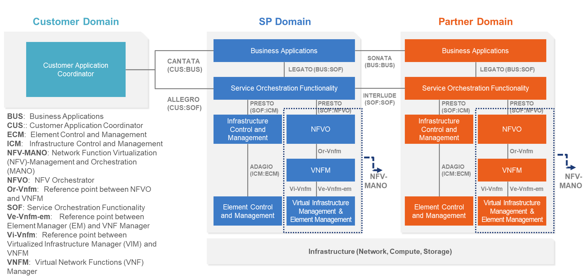
**Figure 1. The LSO Reference Architecture**

Cantata and Sonata IRPs define pre-ordering and ordering functionalities that
allow an automated exchange of information between business applications of the
Buyer (Customer or Service Provider) and Seller (Service Provider or Partner)
Domains. Those are:

- Product Catalog
- Address Validation
- Site Retrieval
- Product Offering Qualification
- Product Quote
- Product Inventory
- Product Ordering
- Trouble Ticketing
- Billing

The business requirements and use cases for Product Order Management are
defined in MEF 57.2 _Product Order Management Requirements and Use Cases_
[[MEF57.2](#8-references)].

This document is structured as follows:

- [Chapter 4](#4-introduction) provides an introduction to Product Order
  Management and its description in a broader context of Cantata and Sonata and
  their corresponding SDKs.
- [Chapter 5](#5-api-description) gives an overview of endpoints, resource
  model, and design patterns.
- Use cases and flows are presented in
  [Chapter 6](#6-api-interactions-and-flows).
- And finally, [Chapter 7](#7-api-details) complements previous sections with a
  detailed API description.

## 4.1. Description

The Product Order Management API allows the Buyer to submit a Product Order
request containing one or more Product Order items. The Buyer may place a
Product Order for an installation (`add`) of a new service, Change (`modify`)
to an existing service, or a Disconnect (`delete`) of an existing service.

The API payloads exchanged between the Buyer and the Seller consist of
product-independent and product-specific parts. The product-independent part is
technically defined in this standard. The product-specific part is defined in
the product specification standard of the concerned product. Both standards
must be used in combination to validate the correctness of the payloads.

[Section 5.4](#54-integration-of-product-specifications-into-product-order-management-api)
explains how to use product specifications as the Product Order API payloads.

This document uses samples of Access E-Line Product specification definitions
to construct API payload examples in [Section 6](#6-api-interaction--flows).

**_Note:_** The Access E-Line product is valid only in the Sonata context. It
is used only for the explanation of the rules of combining the product-agnostic
(envelope) and product-specific (payload) parts of the APIs. The examples are
not normative and are not updated to reflect the new version of the product
specification (MEF 106). It is out of the scope of this document to explain the
details of any product.

Product specifications are defined using JSON Schema (draft 7) standard
[[JS](#8-references)], whereas Product Order API is defined using OpenAPI 3.0
[[OAS-V3](#8-references)]. The payloads exchanged through Product Order
endpoints must comply with the Product specification schema as well as with MEF
57.2 [[MEF57.2](#8-references)] requirements for Product Order Management.

## 4.2. Conventions in the Document

- Code samples are formatted using code blocks. When notation `<< some text >>`
  is used in the payload sample it indicates that a comment is provided instead
  of an example value and it might not comply with the OpenAPI definition.
- Model definitions are formatted as in-line code (e.g. `GeographicAddress`).
- In UML diagrams the default cardinality of associations is `0..1`. Other
  cardinality markers are compliant with the UML standard.
- In the API details tables and UML diagrams required attributes are marked
  with a `*` next to their names.
- In UML sequence diagrams `{{variable}}` notation is used to indicate a
  variable to be substituted with a correct value.

## 4.3. Relation to Other Documents

The requirements and use cases for Product Order Management are defined in MEF
57.2 [[MEF57.2](#8-references)]. The API definition builds on _TMF622 Product
Order Management API REST Specification R19.0.1_ [[TMF622](#8-references)].
Product Order Use Cases must support the use of any of MEF product
specifications.

## 4.4. Approach

As presented in Figure 2. both Cantata and Sonata API frameworks consist of
three structural components:

- Generic API framework
- Product-independent information (Function-specific information and
  Function-specific operations)
- Product-specific information (MEF product specification data model)


**Figure 2. Cantata and Sonata API framework**

The essential concept behind the framework is to decouple the common structure,
information, and operations from the specific product information content.  
Firstly, the Generic API Framework defines a set of design rules and patterns
that are applied across all Cantata or Sonata APIs.  
Secondly, the product-independent information of the framework focuses on a
model of a particular Cantata or Sonata functionality and is agnostic to any of
the product specifications. For example, this standard is describing the
Product Order model and operations that allow ordering of any product that is
aligned with either MEF or custom product specifications.  
Finally, the product-specific information part of the framework focuses on MEF
product specifications that define business-relevant attributes and
requirements for trading MEF subscriber and MEF operator services.

This Developer Guide is not defining MEF product specifications but can be used
in combination with any product specifications defined by or compliant with
MEF.

## 4.5. High-Level Flow

Product Order Management is part of a broader Cantata and Sonata End-to-End
flow. Figure 3. below shows a high-level diagram to get a good understanding of
the whole process and Product Order Management's position within it.

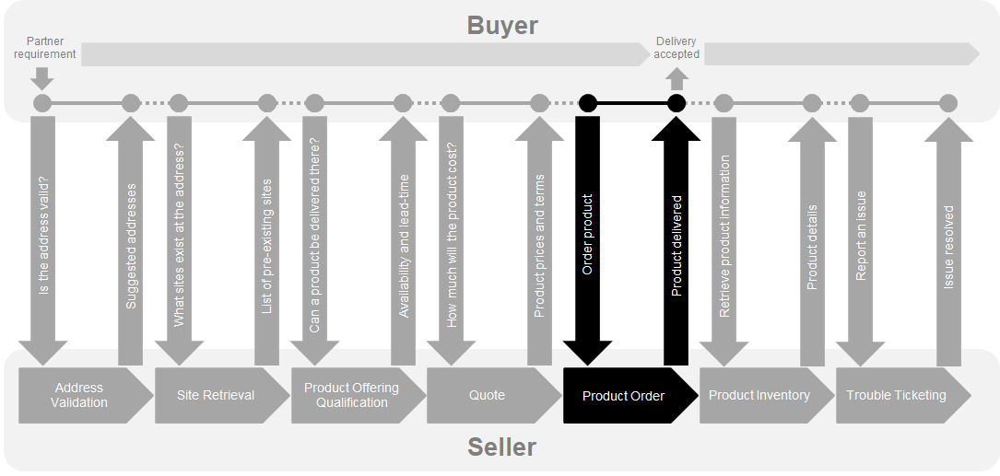

**Figure 3. Cantata and Sonata End-to-End Function Flow**

- Address Validation:
  - Allows the Buyer to retrieve address information from the Seller, including
    exact formats, for addresses known to the Seller.
- Site Retrieval:
  - Allows the Buyer to retrieve Service Site information including exact
    formats for Service Sites known to the Seller.
- Product Offering Qualification (POQ):
  - Allows the Buyer to check whether the Seller can deliver a product or set
    of products from among their product offerings at the geographic address or
    a service site specified by the Buyer; or modify a previously purchased
    product.
- Quote:
  - Allows the Buyer to submit a request to find out how much the installation
    of an instance of a Product Offering, an update to an existing Product, or
    a disconnect of an existing Product will cost.
- Product Order:
  - Allows the Buyer to request the Seller to initiate and complete the
    fulfillment process of an installation of a Product Offering, an update to
    an existing Product, or a disconnect of an existing Product at the address
    defined by the Buyer.
- Product Inventory:
  - Allows the Buyer to retrieve the information about existing Product
    instances from Seller's Product Inventory.
- Trouble Ticketing:
  - Allows the Buyer to create, retrieve, and update Trouble Tickets as well as
    receive notifications about Incidents' and Trouble Tickets' updates. This
    allows managing issues and situations for a Product provided by the Seller.

<div class="page"/>

# 5. API Description

This section presents the API structure and design patterns. It starts with the
high-level use cases diagram. Then it describes the REST endpoints with use
case mapping. Next, it gives an overview of the API resource model and an
explanation of the design pattern that is used to combine product-agnostic and
product-specific parts of API payloads. Finally, payload validation and API
security aspects are discussed.

## 5.1. High-level Use Cases

Figure 4. presents a high-level use case diagram as specified in MEF 57.2
[[MEF57.2](#8-references)] in section 8.1. This picture aims to help understand
the endpoint mapping. Use cases are described extensively in
[chapter 6](#6-api-interactions-and-flows)

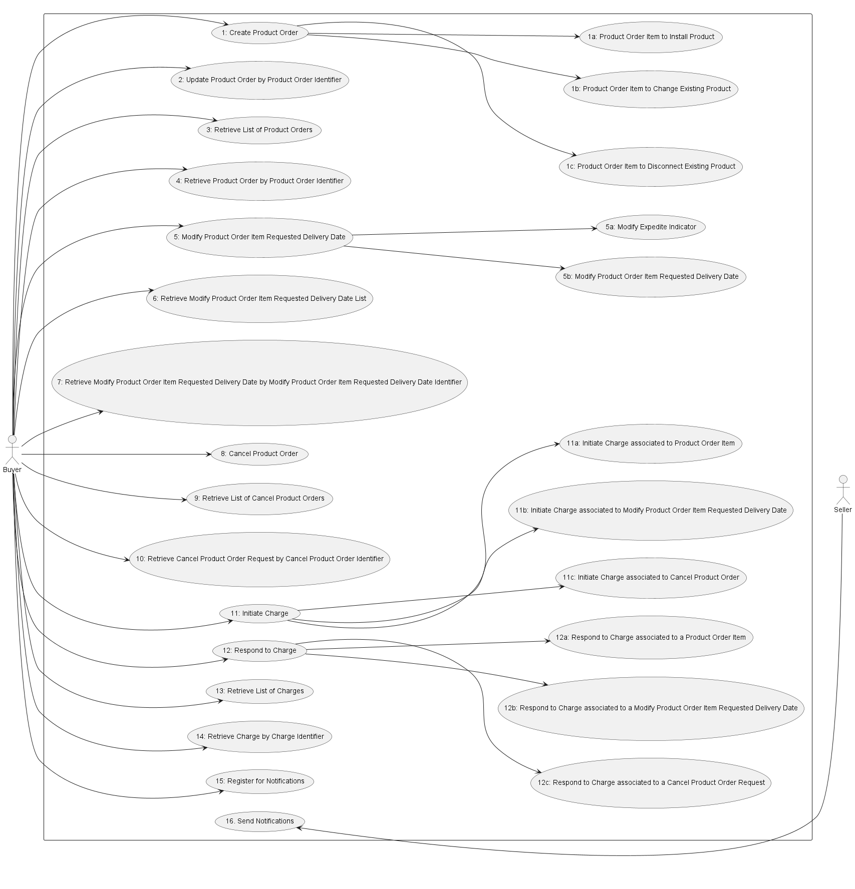

**Figure 4. Use cases**

## 5.2. API Endpoint and Operation Description

### 5.2.1. Seller side API Endpoints

**Base URL for Cantata**:
`https://{{serverBase}}:{{port}}{{?/seller_prefix}}/mefApi/cantata/productOrderingManagement/v5/`

**Base URL for Sonata**:
`https://{{serverBase}}:{{port}}{{?/seller_prefix}}/mefApi/sonata/productOrderingManagement/v10/`

The following API endpoints are implemented by the Seller and allow the Buyer
to send Product Order requests, retrieve existing Product Orders or Product
Order details, manage Charges and Notification registrations. The endpoints and
corresponding data models are defined in
`productApi/order/productOrderManagement.api.yaml`.

The first of the below tables lists the mandatory endpoints and the second one
the optional ones.

| API endpoint               | Description                                                                                                                                | MEF 57.2 Use Case mapping                                                                                                                                                                         |
| -------------------------- | ------------------------------------------------------------------------------------------------------------------------------------------ | ------------------------------------------------------------------------------------------------------------------------------------------------------------------------------------------------- |
| `POST /productOrder`       | A request initiated by the Buyer to order a new product.                                                                                   | UC 1: Create Product Order<br/>UC 1a: Product Order Item to Install Product<br/>UC 1b: Product Order Item to Change Existing Product<br/>UC 1c: Product Order Item to Disconnect Existing Product |
| `GET /productOrder`        | A request initiated by the Buyer to retrieve a list of Product Orders that match the provided filter criteria                              | UC 3: Retrieve List of Product Orders                                                                                                                                                             |
| `GET /productOrder/{{id}}` | A request initiated by the Buyer to retrieve the details associated with a specific Product Order with the given Product Order Identifier. | UC 4: Retrieve Product Order by Product Order Identifier                                                                                                                                          |

**Table 4. Seller side mandatory API endpoints**

**[R1]** The Seller **MUST** support API endpoints listed in Table 4. [MEF57.2
R1]

| API endpoint                                              | Description                                                                                                                                                                                                        | MEF 57.2 Use Case mapping                                                                                                                                                                                                                                           |
| --------------------------------------------------------- | ------------------------------------------------------------------------------------------------------------------------------------------------------------------------------------------------------------------ | ------------------------------------------------------------------------------------------------------------------------------------------------------------------------------------------------------------------------------------------------------------------- |
| `PATCH /productOrder/{{id}}`                              | Allows the Buyer to update some Product Order and Product Order Item Attributes which have no impact on the fulfillment process of the Product Order                                                               | UC 2: Update Product Order by Product Order Identifier                                                                                                                                                                                                              |
| `POST /cancelProductOrder`                                | A request initiated by the Buyer to cancel a Product Order.                                                                                                                                                        | UC 8: Cancel Product Order                                                                                                                                                                                                                                          |
| `GET /cancelProductOrder`                                 | A request initiated by the Buyer to retrieve a list of Cancel requests that match the provided filter criteria                                                                                                     | UC 9: Retrieve List of Cancel Product Orders                                                                                                                                                                                                                        |
| `GET /cancelProductOrder/{{id}}`                          | A request initiated by the Buyer to retrieve the details associated with a specific Cancel Request with the given Cancel Product Order Identifier.                                                                 | UC 10: Retrieve Cancel Product Order by Cancel Product Order Identifier                                                                                                                                                                                             |
| `GET /charge`                                             | A request initiated by the Buyer to retrieve a list of Charges that match the provided filter criteria                                                                                                             | UC 13: Retrieve List of Charges                                                                                                                                                                                                                                     |
| `GET /charge/{{id}}`                                      | A request initiated by the Buyer to retrieve the details associated with a specific Charge with the given Charge Identifier.                                                                                       | UC 14: Retrieve Charge by Charge Identifier                                                                                                                                                                                                                         |
| `PATCH /charge/{{id}}`                                    | A Buyer communicates to the Seller if they Accept or Decline Charge Items.                                                                                                                                         | UC 12: Respond to Charge</br>UC 12a: Respond to Charge Associated to a Product Order Item</br> UC 12b: Respond to Charge Associated to a Modify Product Order Item Requested Delivery Date</br> UC 12c: Respond to Charge Associated to a Cancel Product Order</br> |
| `POST /modifyProductOrderItemRequestedDeliveryDate`       | A request initiated by the Buyer to modify the requested delivery date of a Product Order Item.                                                                                                                    | UC 5: Modify Product Order Item Requested Delivery Date </br> UC 5a: Modify Expedite Indicator </br> UC 5b: Modify Product Order Item Requested Delivery Date RequestRequest                                                                                        |
| `GET /modifyProductOrderItemRequestedDeliveryDate`        | A request initiated by the Buyer to retrieve a list of Modify Product Order Item Requested Delivery Date that matches the provided filter criteria                                                                 | UC 6: Retrieve Modify Product Order Item Requested Delivery Date List                                                                                                                                                                                               |
| `GET /modifyProductOrderItemRequestedDeliveryDate/{{id}}` | A request initiated by the Buyer to retrieve the details associated with a specific Modify Product Order Item Requested Delivery Date with the given Modify Product Order Item Requested Delivery Date Identifier. | UC 7: Retrieve Modify Product Order Item Requested Delivery Date by Modify Product Order Item Requested Delivery Date Identifier                                                                                                                                    |
| `POST /hub`                                               | The Buyer requests to subscribe to notifications.                                                                                                                                                                  | UC 15: Register for Notifications                                                                                                                                                                                                                                   |
| `GET /hub/{{id}}`                                         | A request initiated by the Buyer to retrieve the details of the notification subscription.                                                                                                                         | UC 15: Register for Notifications                                                                                                                                                                                                                                   |
| `DELETE /hub/{{id}}`                                      | A request initiated by the Buyer to instruct the Seller to stop sending notifications.                                                                                                                             | UC 15: Register for Notifications                                                                                                                                                                                                                                   |

**Table 5. Seller side optional API endpoints**

**[O1]** The Seller **MAY** support API endpoints listed in Table 5. [MEF57.2
O1]

**[CR1]<[O1]** If any of the endpoints implementing Use Cases 5, 5a, 5b, 6, or
7 is supported then all endpoints implementing Use Cases 5, 5a, 5b, 6, and 7
**MUST** be supported. [MEF57.2 CR1<O1]

**[CR2]<[O1]** If any of the endpoints implementing Use Cases 8, 9, or 10 is
supported, then all endpoints implementing Use Cases 8, 9, and 10 **MUST** be
supported. [MEF57.2 CR2<O1]

**[CR3]<[O1]** If any of endpoints implementing Use Cases 11, 11a, 11b, 11c,
12, 12a, 12b, 12c, 13, or 14 is supported then all endpoints implementing Use
Cases 11, 11a, 11b, 11c, 12, 12a, 12b, 12c, 13, 14, 15, and 16 **MUST** be
supported. [MEF57.2 CR3<O1]

**[CR4]<[O1]** If either endpoints implementing Use Cases 15 or 16 are
supported then both endpoints implementing Use Cases 15 and 16 **MUST** be
supported. [MEF57.2 CR4<O1]

### 5.2.2. Buyer side API Endpoints

**Base URL for Cantata**:
`https://{{serverBase}}:{{port}}{{?/buyer_prefix}}/mefApi/cantata/productOrderingNotification/v5/`

**Base URL for Sonata**:
`https://{{serverBase}}:{{port}}{{?/buyer_prefix}}/mefApi/sonata/productOrderingNotification/v10/`

The following API Endpoints are used by the Seller to post notifications to
registered listeners. The endpoints and corresponding data model are defined in
`productApi/order/productOrderNotification.api.yaml`

All Buyer side endpoints are optional to implement. Please refer to the
requirements stated in the previous chapter for more details.

| API Endpoint                                                   | Description                                                                                                                | MEF 57.2 Use Case Mapping                                                                                                                                                                                                                                              |
| -------------------------------------------------------------- | -------------------------------------------------------------------------------------------------------------------------- | ---------------------------------------------------------------------------------------------------------------------------------------------------------------------------------------------------------------------------------------------------------------------- |
| `POST /listener/productOrderStateChangeEvent`                  | A request initiated by the Seller to notify the Buyer on `ProductOrder.state` change.                                      | UC 15: Send Notification                                                                                                                                                                                                                                               |
| `POST /listener/productOrderItemStateChangeEvent`              | A request initiated by the Seller to notify the Buyer on `ProductOrderItem.state` change.                                  | UC 15: Send Notification                                                                                                                                                                                                                                               |
| `POST /listener/productOrderItemExpectedCompletionDateSet`     | A request initiated by the Seller to notify the Buyer on `productOrder.productOrderItem.expectedCompletionDate` value set. | UC 15: Send Notification                                                                                                                                                                                                                                               |
| `POST /listener/productSpecificProductOrderItemMilestoneEvent` | A request initiated by the Seller to notify the Buyer on Product Specific Product Order Item Milestone reached event.      | UC 15: Send Notification                                                                                                                                                                                                                                               |
| `POST /listener/cancelProductOrderStateChangeEvent`            | A request initiated by the Seller to notify the Buyer on `CancelProductOrder` state change.                                | UC 15: Send Notification                                                                                                                                                                                                                                               |
| `POST /listener/chargeCreateEvent`                             | A request initiated by the Seller to notify the Buyer on `Charge` create event to initiate the charge process.             | UC 11: Initiate Charge<br/>UC 11a: Initiate Charge associated to Product Order<br/>UC 11b: Initiate Charge Associated to Modify Product Order Item Requested Delivery Date<br/>UC 11c: Initiate Charge Associated to Cancel Product Order<br/>UC 15: Send Notification |
| `POST /listener/chargeStateChangeEvent`                        | A request initiated by the Seller to notify the Buyer on `Charge` state change.                                            | UC 15: Send Notification                                                                                                                                                                                                                                               |

**Table 6. Buyer side API endpoints**

## 5.3. Specifying the Buyer ID and the Seller ID

A business entity willing to represent multiple Buyers or multiple Sellers must
follow requirements of MEF 79 [[MEF79](#8-references)] chapter 8.8, which
states:

> For requests of all types, there is a business entity that is initiating an
> Operation (called a Requesting Entity) and a business entity that is
> responding to this request (called the Responding Entity). In the simplest
> case, the Requesting Entity is the Buyer and the Responding Entity is the
> Seller. However, in some cases, the Requesting Entity may represent more than
> one Buyer and similarly, the Responding Entity may represent more than one
> Seller.
>
> While it is outside the scope of this specification, it is assumed that the
> Requesting Entity and the Responding Entity are aware of each other and can
> authenticate requests initiated by the other party. It is further assumed
> that both the Buying Entity and the Requesting Entity know:
>
> a) the list of Buyers the Requesting Entity represents when interacting with
> this Responding Entity; and  
> b) the list of Sellers that this Responding Entity represents to this
> Requesting Entity.

In the API the `buyerId` and `sellerId` are represented as query parameters in
each operation defined in `productOrderManagement.api.yaml` and as attributes
of events as described in `productOrderNotification.api.yaml`.

**[R2]** If the Requesting Entity has the authority to represent more than one
Buyer the request **MUST** include `buyerId` query parameter that identifies
the Buyer being represented [MEF79 R80]

**[R3]** If the Requesting Entity represents precisely one Buyer with the
Responding Entity, the request **MUST NOT** specify the `buyerId` [MEF79 R81]

**[R4]** If the Responding Entity represents more than one Seller to this Buyer
the request **MUST** include `sellerId` query parameter that identifies the
Seller with whom this request is associated [MEF79 R82]

**[R5]** If the Responding Entity represents precisely one Seller to this
Buyer, the request **MUST NOT** specify the `sellerId` [MEF79 R83]

**[R6]** If `buyerId` or `sellerId` attributes were specified in the request
same attributes **MUST** be used in the notification payload.

## 5.4. Integration of Product Specifications into Product Order Management API

Product specifications are defined using JsonSchema (draft 7) format and are
integrated into the `ProductOrder` using the TMF extension pattern.

The extension hosting type in the API data model is `MEFProductConfiguration`.
The `@type` attribute of that type must be set to a value that uniquely
identifies the product specification. A unique identifier for MEF standard
product specifications is in URN format and is assigned by MEF. This identifier
is provided as root schema `$id` and in product specification documentation.
Use of non-MEF standard product definitions is allowed. In such a case the
schema identifier must be agreed upon between the Buyer and the Seller.

The example below shows a header of a Product Specification schema, which is
referring to the Access E-Line order management, where
`"$id": urn:mef:lso:spec:sonata:AccessElineOvc:v1.0.0:order` is the
abovementioned URN:

```yaml
'$schema': http://json-schema.org/draft-07/schema#
'$id': urn:mef:lso:spec:sonata:AccessElineOvc:v1.0.0:order
title: MEF LSO Sonata - Access Eline OVC (Order) Product Specification
```

Product specifications are provided as Json schemas without the
`MEFProductConfiguration` context.

Product-specific attributes are introduced via the `MEFProductRefOrValue`
(defined by the Buyer). This entity has the `productConfiguration` attribute of
type `MEFProductConfiguration` which is used as an extension point for
product-specific attributes.

Implementations might choose to integrate selected product specifications to
data model during development. In such a case an integrated data model is built
and product specifications are in inheritance relationship with
`MEFProductConfiguration` as described in the OAS specification. This pattern
is called **Static Binding**. The SDK is additionally shipped with a set of API
definitions that statically bind all product-related APIs (POQ, Quote, Order,
Inventory) with all corresponding product specifications available in the
release. The snippets below present an example of a static binding of the
envelope API with several MEF product specifications, from both
`MEFProductConfiguration` and product specification point of view:

```yaml
MEFProductConfiguration:
  description:
    MEFProductConfiguration is used as an extension point for MEF-specific
    product/service payload. The `@type` attribute is used as a discriminator
  discriminator:
    mapping:
      urn:mef:lso:spec:sonata:AccessElineOvc:v1.0.0:order: '#/components/schemas/AccessElineOvcOrder_v1.0.0'
      urn:mef:lso:spec:cantata-sonata:SubscriberUni:v1.0.0:order: '#/components/schemas/SubscriberUniOrder_v1.0.0'
      urn:mef:lso:spec:cantata-sonata:EplEvc:v1.0.0:order: '#/components/schemas/EplEvcOrder_v1.0.0'
      urn:mef:lso:spec:sonata:OperatorUNI:v1.0.0:order: '#/components/schemas/OperatorUNIOrder_v1.0.0'
    propertyName: '@type'
  properties:
    '@type':
      description:
        The name of the type, defined in the JSON schema specified above, for
        the product that is the subject of the Request. The named type must be
        a subclass of MEFProductConfiguration.
      type: string
```

```yaml
AccessElineOvcOrder_v1.0.0:
  allOf:
    - $ref: '#/components/schemas/MEFProductConfiguration'
    - description:
        OVC Service Attributes control the behavior observable at and between
        External Interfaces to the Carrier Ethernet Network (CEN). The
        behaviors are achieved by the Network Operator and the Operator's
        client (the Service Provider in this case) agreeing on the value for
        each of the Service Attributes.
```

Alternatively, implementations might choose not to build an integrated model
and choose a different mechanism allowing runtime validation of product
specific fragments of the payload. The system is able to validate a given
product against a new schema without redeployment. This pattern is called
**Dynamic Binding.**

Regardless of chosen implementation pattern, the HTTP payload is exactly the
same. Both implementation approaches must conform to the requirements specified
below.

**[R7]** `MEFProductConfiguration` type is an extension point that **MUST** be
used to integrate product specifications' properties into a request/response
payload.

**[R8]** The `@type` property of `MEFProductConfiguration` **MUST** be used to
specify the type of the extending entity.

**[R9]** Product attributes specified in the payload must conform to the
product specification specified in the `@type` property.

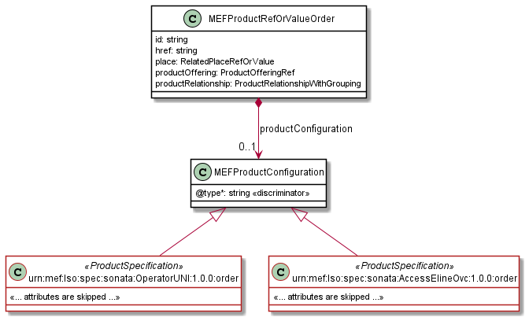

**Figure 5. The Extension Pattern with Sample Product Specific Extensions**

Figure 5. presents two MEF `<<ProductSpecifications>>` that represent Access
E-Line Operator UNI and OVC products. When these products are used as a Product
Order payload the `@type` of `MEFProductConfiguration` takes
`"urn:mef:lso:spec:sonata:AccessElineOvc:1.0.0:order"` or
`"urn:mef:lso:spec:sonata:OperatorUNI:1.0.0:order"` value to indicate which
product specification should be used to interpret a set of product-specific
attributes included in the payload. An example of a product definition inside
the `ProductOrderItem` is presented in
[Section 6.1.6](#616-use-case-1a-product-order-item-to-install-product).

The _order_ suffix after the product type name in the URN comes from the
approach that the product schemas may differ depending on the function (POQ,
Quote, Order, or Inventory) they are used with.

## 5.5. Sample Product Specification

The SDK contains product specification definitions, from which UNI and Access
E-Line (OVC) are used in the payload samples in this section. In Celine release
they are located in the SDK package at:

`\productSchema\carrierEthernet\accessEline\order\accessElineOvc.yaml`
`\productSchema\carrierEthernet\carrierEthernetOperatorUni\order\carrierEthernetOperatorUni.yaml`

The product specification data model definitions are available as JsonSchema
(version `draft 7`) documents. Figures 6. and 7. depict simplified UML views on
these data models in which:

- the mandatory attributes are marked with `*`,
- the mandatory relations have a cardinality of `1` or `1..*`,
- some relations and attributes that are not essential to the understanding of
  the product specification model are omitted.

The red color in Figures 6 and 7 below highlights the data model of Access
E-Line.


**Figure 6. A simplified view on Access E-Line product specification data
model**

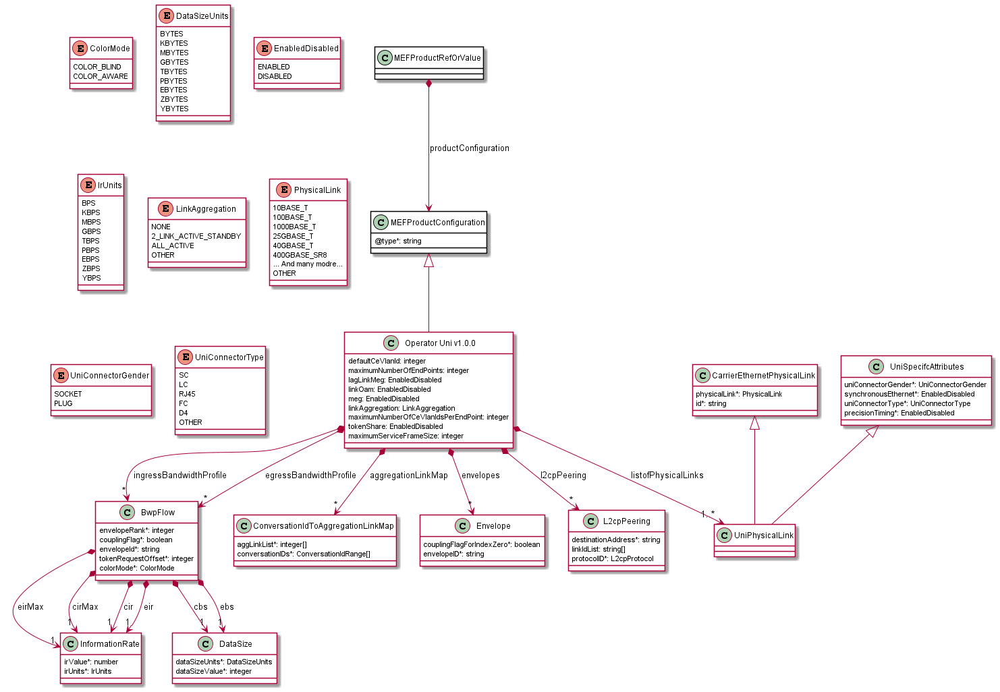

**Figure 7. A simplified view on UNI product specification data model**

Product specifications define several product-related and envelope-related
requirements. For example:

- for an Access E-Line product two mandatory relationship roles must be
  specified, one with the operator ENNI (`ENNI_REFERENCE`) and a second with
  the operator UNI (`UNI_REFERENCE`) for `add` action. First must be realized
  as a product relationship (relation to product existing in Seller's
  Inventory), second might be realized as an order item (being part of the same
  order) or as a product relationship
- in the case of a `modify` action, product relationships must have the same
  value as in the `add` action. They must not be changed
- for an operator UNI product a place relationship (`INSTALL_LOCATION`) must be
  specified
- in the case of a `modify` action, place relationships must have the same
  value as in the `add` action. They must not be changed

In case, some of these requirements are violated the Seller returns an error
response to the Buyer that indicates specific functional errors. These errors
are listed in the response body (a list of `Error422` entries) for HTTP `422`
response.

## 5.6. Model Structural Validation

The structure of the HTTP payloads exchanged via Product Order API endpoints is
defined using:

- OpenAPI version 3.0 for product-agnostic part of the payload
- JsonSchema (draft 7) for product-specific part of the payload

**[R10]** Implementations **MUST** use payloads that conform to these
definitions.

**[R11]** A product specification may define additional consistency rules and
requirements that **MUST** be respected by implementations. These are defined
for:

- required relation type, multiplicity to other items in the same Product Order
  request
- required relation type, multiplicity to entities in the Seller's product
  inventory
- related contact information roles that are to be defined at the Product Order
  Item level
- relations to places (locations) and their roles that are to be defined at the
  item level

## 5.7. Security Considerations

There must be an authentication mechanism whereby a Seller can be assured who a
Buyer is and vice-versa. There must also be authorization mechanisms in place
to control what a particular Buyer or Seller is allowed to do and what
information may be obtained. However, the definition of the exact security
mechanism and configuration is outside the scope of this document. The LSO
Security mechanisms are defined by MEF 128 _LSO API Security Profiles_
[[MEF128](#8-references)].

<div class="page"/>

# 6. API Interactions and Flows

This section provides a detailed insight into the API functionality, use cases,
and flows. It starts with Table 7 presenting a list and short description of
all business use cases then presents the variants of end-to-end interaction
flows, and in following subchapters describes the API usage flow and examples
for each of the use cases.

| Use Case # | Use Case Name                                                                                                                                                                                                                                                           | Use Case Description                                                                                                                                                                                                                                                                                                                                         | Mandatory or optional |
| ---------- | ----------------------------------------------------------------------------------------------------------------------------------------------------------------------------------------------------------------------------------------------------------------------- | ------------------------------------------------------------------------------------------------------------------------------------------------------------------------------------------------------------------------------------------------------------------------------------------------------------------------------------------------------------ | --------------------- |
| 1          | [Create Product Order](#61-use-case-1-create-product-order)                                                                                                                                                                                                             | A request initiated by the Buyer to order a new product or product component(s). A Product Order must contain at least one Product Order Item (Use Case # 1-a, 1-b, or 1-c) as shown below. A Product Order may contain more than one Product Order Item and Product Order Items within a Product Order are not required to have relationships between them. | Mandatory             |
| 1-a        | [Product Order Item to Install Product](#616-use-case-1a-product-order-item-to-install-product)                                                                                                                                                                         | Product Order Item installs a new Product.                                                                                                                                                                                                                                                                                                                   | Mandatory             |
| 1-b        | [Product Order Item to Change Existing Product](#617-use-case-1b-product-order-item-to-change-existing-product)                                                                                                                                                         | Product Order Item changes attributes of a specific active Product.                                                                                                                                                                                                                                                                                          | Mandatory             |
| 1-c        | [Product Order Item to Disconnect Existing Product](#618-use-case-1c-product-order-item-to-disconnect-existing-product)                                                                                                                                                 | Product Order Item disconnects an active Product.                                                                                                                                                                                                                                                                                                            | Mandatory             |
| 2          | [Update Product Order](#62-use-case-2-update-product-order)                                                                                                                                                                                                             | Allows the Buyer to update some Product Order and Product Order Item Attributes                                                                                                                                                                                                                                                                              | Optional              |
| 3          | [Retrieve List of Product Orders](#63-use-case-3-retrieve-list-of-product-orders)                                                                                                                                                                                       | A request initiated by the Buyer to retrieve a list of Product Orders that match the provided filter criteria                                                                                                                                                                                                                                                | Mandatory             |
| 4          | [Retrieve Product Order by Product Order Identifier](#64-use-case-4-retrieve-product-order-by-product-order-identifier)                                                                                                                                                 | A request initiated by the Buyer to retrieve the details associated with a specific Product Order with the given Product Order Identifier.                                                                                                                                                                                                                   | Mandatory             |
| 5          | [Modify Product Order Item Requested Delivery Date](#65-use-case-5-modify-product-order-item-requested-delivery-date)                                                                                                                                                   | A request initiated by the Buyer to modify either the Expedite Indicator or the Requested Completion Date of a Product Order Item.                                                                                                                                                                                                                           | Optional              |
| 6          | [Retrieve Modify Product Order Item Requested Delivery Date List](#66-use-case-6-retrieve-modify-product-order-item-requested-delivery-date-list)                                                                                                                       | A request initiated by the Buyer to retrieve a list of Modify Product Order Item Requested Delivery Date that match the provided filter criteria                                                                                                                                                                                                             | Optional              |
| 7          | [Retrieve Modify Product Order Item Requested Delivery Date by Modify Product Order Item Requested Delivery Date Identifier](#67-use-case-7-retrieve-modify-product-order-item-requested-delivery-date-by-modify-product-order-item-requested-delivery-date-identifier) | A request initiated by the Buyer to retrieve the details associated with a specific Modify Product Order Item Requested Delivery Date with the given Modify Product Order Item Requested Delivery Date Identifier.                                                                                                                                           | Optional              |
| 8          | [Cancel Product Order](#68-use-case-8-cancel-product-order)                                                                                                                                                                                                             | A request initiated by the Buyer to cancel an Product Order.                                                                                                                                                                                                                                                                                                 | Optional              |
| 9          | [Retrieve List of Cancel Requests](#69-use-case-9-retrieve-list-of-cancel-requests)                                                                                                                                                                                     | A request initiated by the Buyer to retrieve a list of Cancel Product Order requests that match the provided filter criteria                                                                                                                                                                                                                                 | Optional              |
| 10         | [Retrieve Cancel Product Order by Cancel Product Order Identifier](#610-use-case-10-retrieve-cancel-product-order-by-cancel-product-order-identifier)                                                                                                                   | A request initiated by the Buyer to retrieve the details associated with a specific Cancel Product Order with the given Cancel Product Order Identifier.                                                                                                                                                                                                     | Optional              |
| 11         | [Initiate Charge](#611-use-case-11-initiate-charge)                                                                                                                                                                                                                     | Process to communicate charges from the Seller to Buyer                                                                                                                                                                                                                                                                                                      | Optional              |
| 12         | [Respond to Charge](#612-use-case-12-respond-to-charge)                                                                                                                                                                                                                 | Process to communicate if the Buyer accepts or rejects the charges.                                                                                                                                                                                                                                                                                          | Optional              |
| 13         | [Retrieve List of Charges](#613-use-case-13-retrieve-list-of-charges)                                                                                                                                                                                                   | A request initiated by the Buyer to retrieve a list of Charges that match the provided filter criteria                                                                                                                                                                                                                                                       | Optional              |
| 14         | [Retrieve Charge by Identifier](#614-use-case-14-retrieve-charge-by-identifier)                                                                                                                                                                                         | A request initiated by the Buyer to retrieve the details associated with a specific Charge with the given ChargeIdentifier.                                                                                                                                                                                                                                  | Optional              |
| 15         | [Register for Notifications](#615-use-case-15-register-for-notifications)                                                                                                                                                                                               | The Buyer requests to subscribe to notifications for the Use Cases which the Seller supports including Create Product Order, Cancel Product Order, Charges, or Modify Product Order Item Requested Delivery Date.                                                                                                                                            | Optional              |
| 16         | [Send Notification](#616-use-case-16-send-notification)                                                                                                                                                                                                                 | A notification initiated by the Seller to the Buyer providing subsequent status information on Create Product Order, Cancel Product Order, Modify Product Order Item Requested Delivery Date, and Initiate Charge.                                                                                                                                           | Optional              |

**Table 7. Use cases description**

The detailed business requirements of each of the use cases are described in
sections 7 and 1 of MEF 57.2 [[MEF57.2](#8-references)].

## 6.1. Use case 1: Create Product Order

This is the initial step for Product Order processing.

### 6.1.1. Interaction flow

The flow of this use case is very simple and is described in Figure 8.

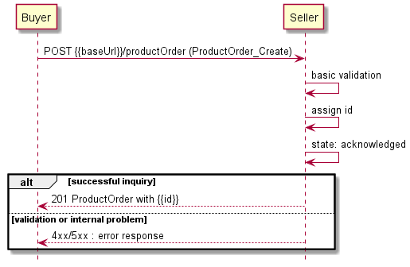

**Figure 8. Use Case 1 - Product Order create request flow**

The Buyer sends a request with a `ProductOrder_Create` type in the body. The
Seller performs request validation, assigns an `id`, and returns `ProductOrder`
type in the response body, with a `state` set to `acknowledged`. From this
point, the Product Order is ready for further processing. The Buyer can track
the progress of the process either by subscribing for notifications or by
periodically polling the `ProductOrder`. The two patterns are presented in the
following two diagrams.

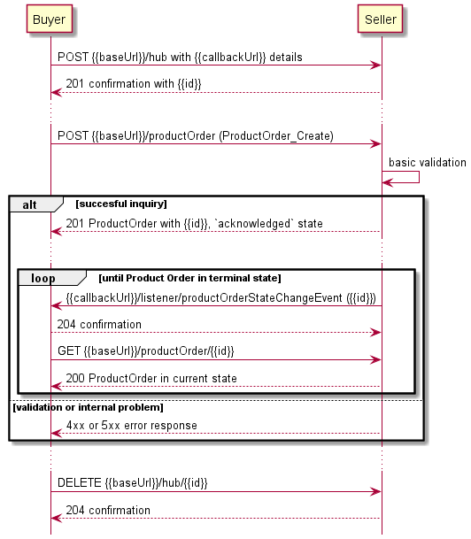

**Figure 9. Product Order progress tracking - Notifications**

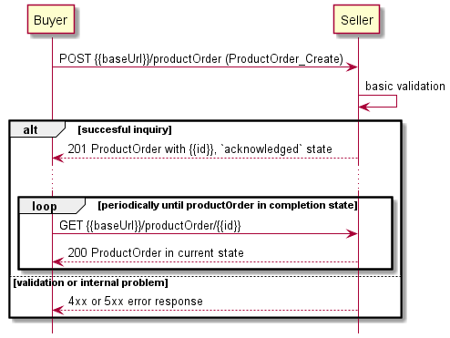

**Figure 10. Product Order progress tracking - Polling**

**_Note_**: The context of notifications is not a part of the considered use
case itself. It is presented to show the big picture of end-to-end flow. This
applies also to all further use case flow diagrams with notifications.

### 6.1.2. Key Entities - Request

Figure 11 presents the most important parts of the data model used during the
Create Product Order request (`POST /productOrder`) that is sent by a Buyer
(see [Section 5.2.1](#521-seller-side-api-endpoints) for details). The model of
the request message is a subset of the `ProductOrder` model and contains only
attributes that can (or must) be set by the Buyer. The Seller then enriches the
entity in the response with additional information.

**_Note:_** `ProductOrder_Create` and `ProductOrderItem_Create` are entities
used by the Buyer to make a request. `ProductOrder` and `ProductOrderItem` are
entities used by the Seller to provide a response. The request entities have a
subset of attributes of the response entities. Thus for visibility of these
shared attributes `ProductOrder_Common` and `ProductOrderItem_Common` have been
introduced. Though, these are not to be used directly in the exchange.

A `ProductOrderItem_Create` defines details of the product(s) being subject of
the ordering (in `MEFProductRefOrValueOrder` structure) and allows for the
definition of additional information like related parties
(`RelatedContactInformation`) or relations to other items
(`ProductOrderItemRelationship`).

`MEFProductRefOrValueOrder` allows for the introduction of MEF product-specific
properties to the Product Order payload. The extension mechanism is described
in detail in
[Section 5.4](#54-integration-of-product-specifications-into-product-order-management-api).
`MEFProductRefOrValueOrder` may be also used to specify relations to places
(using specializations of `RelatedPlaceOrValue`) and/or to a product that
exists in the Seller's inventory (using `ProductRelationship`).

The full list of attributes is available in [Section 7](#7-api-details) and in
the API specification which is an integral part of this standard.

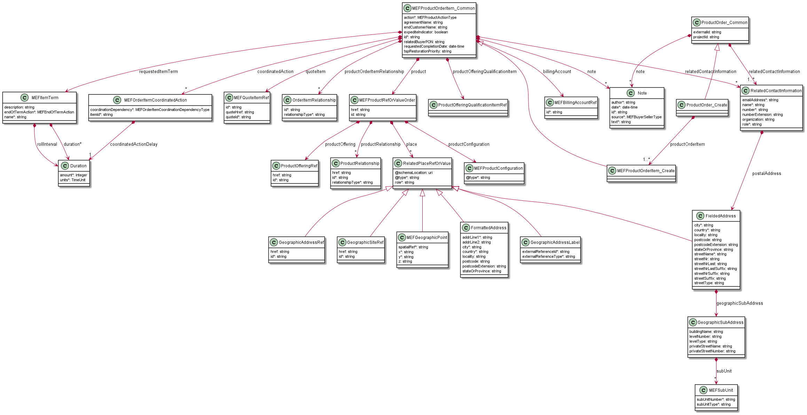

**Figure 11. Key Entities - Create Request**

### 6.1.3. Request Example

To send a Product Order request the Buyer uses the `createProductOrder`
operation from the API: `POST /productOrder`. For clarity, some of the Product
Order payload's attributes might be omitted to improve examples' readability.
The `ProductOrder_Create` is a simple structure that is common for all types of
requests (`add`, `modify`, `delete`), most of the information is in the
`ProductOrderItem_Create`.

In the example below, the Buyer requests two Product Order Items with a
specific requirement that the first one will be started one week upon the
completion of the second one. This is done with the use of the
`coordinatedAction`. This action defines possible dependencies and the
potential delay between the events.

- `startToStart` - Work on the Specified Product Order Item can only be started
  after the Coordinated Product Order Items are started
- `startToFinish` - The Coordinated Product Order Items must complete before
  work on the Specified Product Order Item begins
- `finishToStart` - Work on the Related Product Order Items begins after the
  completion of the Specified Product Order Item
- `finishToFinish` - Work on the Related Product Order Items completes at the
  same time as the Specified Product Order Item

**`Product Order` Create**

```json
{
  "externalId": "buyerOrder-001",
  "projectId": "buyerProject-001",
  "relatedContactInformation": [
    {
      "emailAddress": "john.example@example.com",
      "name": "John Example",
      "number": "12-345-6789",
      "numberExtension": "1234",
      "organization": "Example Co.",
      "role": "productOrderContact"
    }
  ],
  "productOrderItem": [
    {
      "id": "item-001",
      "action": "add",
      "endCustomerName": "End Customer Name",
      "expediteIndicator": false,
      "relatedBuyerPON": "PON-12-2021",
      "requestedCompletionDate": "2021-06-19T20:59:28.299Z",
      "agreementName": "Buyer-Seller General Agreement 03/2021",
      "billingAccount": {
        "id": "00000000-1111-0000-0000-000000000001"
      },
      "coordinatedAction": [
        {
          "itemId": "item-002",
          "coordinatedActionDelay": {
            "amount": 1,
            "units": "calendarWeeks"
          },
          "coordinationDependency": "startToFinish"
        }
      ],
      "product": {
        "productConfiguration": { << product specific attributes and configuration, see 6.1.6 >>
        },
        "productOffering": {
          "id": "00000000-5555-0000-0000-000000000001"
        },
        "productRelationship": [
          {
            "id": "00000000-6666-0000-0000-000000000001",
            "relationshipType": "ENNI_REFERENCE"
          }
        ]
      },
      "productOfferingQualificationItem": {
        "id": "poqItem-001",
        "productOfferingQualificationId": "00000000-2222-0000-0000-000000000001"
      },
      "productOrderItemRelationship": [
        {
          "id": "item-002",
          "relationshipType": "UNI_REFERENCE"
        }
      ],
      "quoteItem": {
        "id": "quoteItem-001",
        "quoteId": "00000000-4444-0000-0000-000000000001"
      },
      "relatedContactInformation": [
        {
          "emailAddress": "Buyer.ProductOrderItemContact@example.com",
          "name": "Buyer Product Order Item Contact",
          "number": "+12-345-678-90",
          "role": "buyerProductOrderItemContact"
        },
        {
          "emailAddress": "Buyer.ImplementationContact@example.com",
          "name": "Buyer Implementation Contact",
          "number": "+12-345-678-90",
          "role": "buyerImplementationContact"
        },
        {
          "emailAddress": "Buyer.TechnicalContact@example.com",
          "name": "Buyer Technical Contact",
          "number": "+12-345-678-90",
          "role": "buyerTechnicalContact"
        },
        {
          "emailAddress": "bill.contact@example.com",
          "name": "Bill Contact",
          "number": "+12-345-678-90",
          "organization": "Example Company",
          "role": "billingContact"
        }
      ],
      "requestedItemTerm": {
        "duration": {
          "amount": 12,
          "units": "calendarMonths"
        },
        "endOfTermAction": "autoRenew",
        "name": "Yearly Subscription"
      }
    },
    {
      "id": "item-002",
      "action": "add"
      ...
      << attributes skipped for readability >>
    }
  ]
}
```

**[R12]** The Buyer's request **MUST** contain at least one `productOrderItem`.
[MEF57.2 R14]

**[R13]** The Buyer's request **MUST** specify a `relatedContactInformation`
item with a `role` set to `productOrderContact`. [MEF57.2 R61]

**[O2]** The Buyer and Seller **MAY** agree on using other contact `roles`.
[MEF57.2 O3]

**_Note:_** During the onboarding the Seller may require to provide an
additional contact `role`.

**_Note:_** It is up to Seller's discretion on how to react in case the Buyer
provides a contact `role` that is not listed by this standard or agreed upon
during the onboarding. Preferably the Seller should return an error with a
message stating which `roles` are accepted. It may also be ignored

For each `productOrderItem`:

**[R14]** The Buyer's Create Product Order request **MUST** contain: [MEF57.2
R22], [MEF57.2 R16]

- `id`,
- `action`,
- `requestedCompletionDate`,
- `relatedContactInformation` items with following values of `role` set:
  - `buyerProductOrderItemContact`,
  - `buyerImplementationContact`,
  - `buyerTechnicalContact`.

**[O3]** The Seller **MAY** require that the `billingAccount` attributes be the
same for all Product Order Items in a Product Order. [MEF57.2 O8]

**[O4]** The Seller **MAY** require the Buyer to perform a POQ prior to
submitting the Product Order. [MEF57.2 O7]

**[CR5]<[O4]** The Buyer's request **MUST** provide the
`productOfferingQualificationItem` if required by the Seller. [MEF57.2 CR5<O7]

**[O5]** The Seller **MAY** require the Buyer to perform a Quote prior to
submitting the Product Order. [MEF57.2 O8]

**[CR6]<[O5]** The Buyer's request **MUST** provide the `quoteItem` if required
by the Seller.[MEF57.2 CR6<O8]

**[R15]** If the Buyer requires the `tspRestorationPriority` to be specified
for the Product Order Item, the Buyer's Create Product Order request **MUST**
provide it. [MEF57.2 R25]

### 6.1.4. Key Entities - Response

Figure 12 presents the most important data model parts used to provide a
response to a Buyer's Create Product Order (`POST /productOrder`) or to
retrieve a `ProductOrder` by identifier (`GET /productOrder/{{id}}`) request.
Please note that the model differs only with the number of attributes for
`ProductOrder` and `ProductOrderItem` entities.

`ProductOrder` is the root entity of a response and it contains the same number
of `ProductOrderItems` as in the request.

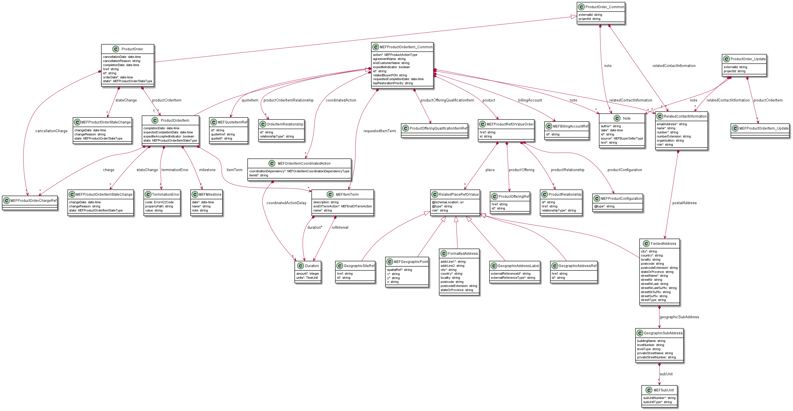

**Figure 12. Key Entities - Response**

**_Note_**: The term "Seller Response Code" used in the Business Requirements
maps to HTTP response code, where `2xx` indicates _Success_ and `4xx` or `5xx`
indicate _Failure_.

### 6.1.5. Response Example

The following snippet presents the Seller's response. It has the same structure
as in the retrieve by identifier operation.

```json
{
  "id": "00000000-1111-2222-3333-000000000123",
  "href": "{{baseUrl}}/productOrder/00000000-1111-2222-3333-000000000123",
  "orderDate": "2021-05-19T07:01:02.983Z",
  "state": "acknowledged",
  "externalId": "buyerOrder-001", << as provided by the Buyer >>
  "projectId": "buyerProject-001", << as provided by the Buyer >>
  "relatedContactInformation": [
    { << as provided by the Buyer >>
      "emailAddress": "john.example@example.com",
      "name": "John Example",
      "number": "12-345-6789",
      "numberExtension": "1234",
      "organization": "Buyer Example Co.",
      "role": "productOrderContact"
    },
    { << added by Seller >>
      "emailAddress": "kate.example@example.com",
      "name": "Kate Example",
      "number": "12-345-67890",
      "organization": "Seller Example Co.",
      "role": "sellerContact"
    }
  ],
  "productOrderItem": [
    {
      "id": "item-001", << as provided by the Buyer >>
      "action": "add", << as provided by the Buyer >>
      "endCustomerName": "End Customer Name", << as provided by the Buyer >>
      "expediteIndicator": false, << as provided by the Buyer >>
      "relatedBuyerPON": "PON-12-2021", << as provided by the Buyer >>
      "requestedCompletionDate": "2021-06-19T20:59:28.299Z", << as provided by the Buyer >>
      "expectedCompletionDate": "2021-05-31T00:00:00.000Z",
      "expediteAcceptedIndicator": false,
      "state": "acknowledged",
      "agreementName": "Buyer-Seller General Agreement 03/2021", << as provided by the Buyer >>
      "billingAccount": { << as provided by the Buyer >>  },
      "coordinatedAction": [ << as provided by the Buyer >> ],
      "product": { << as provided by the Buyer >> },
      "productOfferingQualificationItem": { << as provided by the Buyer >> },
      "productOrderItemRelationship": [ << as provided by the Buyer >> ],
      "quoteItem": { << as provided by the Buyer >> },
      "relatedContactInformation": [
        {
          "emailAddress": "Buyer.ProductOrderItemContact@example.com",
          "name": "Buyer Product Order Item Contact",
          "number": "+12-345-678-90",
          "role": "buyerProductOrderItemContact"
        },
        {
          "emailAddress": "Buyer.ImplementationContact@example.com",
          "name": "Buyer Implementation Contact",
          "number": "+12-345-678-90",
          "role": "buyerImplementationContact"
        },
        {
          "emailAddress": "Buyer.TechnicalContact@example.com",
          "name": "Buyer Technical Contact",
          "number": "+12-345-678-90",
          "role": "buyerTechnicalContact"
        },
        {
          "emailAddress": "Seller.Contact@example.com",
          "name": "Seller Contact",
          "number": "+12-345-678-90",
          "role": "sellerContact"
        }

      ],
      "requestedItemTerm": {
        "duration": {
          "amount": 12,
          "units": "calendarMonths"
        },
        "endOfTermAction": "autoRenew",
        "name": "Yearly Subscription",
      },
      "itemTerm": [
        {
          "duration": {
            "amount": 12,
            "units": "calendarMonths"
          },
          "endOfTermAction": "autoRenew",
          "name": "Yearly Subscription",
        }
      ],
      "stateChange": [
        {
          "changeDate": "2021-05-19T07:01:02.983Z",
          "state": "acknowledged"
        }
      ],
      "milestone": [
        {
          "date" : "2021-05-19T07:01:02.983Z",
          "name" : "EXAMPLE_MILESTONE_NAME",
          "note" : "Additional comment when needed"
        }
      ]
    },
    {
      "id": "item-002",
      "action": "add"
      ...
      << attributes skipped for readability >>
    }
  ],
  "stateChange": [
    {
      "changeDate" : "2021-05-19T07:01:02.983Z",
      "state" : "acknowledged"
    }
  ]
}
```

The response to the create request does not contain all possible attributes.
Some of them are valid only in the future lifecycle of the `Product Order`
(e.g. `cancellationDate`, `cancellationReason`, `completionDate`).

**[R16]** The Seller's response **MUST** include all and unchanged attributes'
values as provided in the request. [MEF57.2 R19], [MEF57.2 R33]

These attributes are indicated above with an appropriate comment:
`<< as provided by the Buyer >>`.

The Seller might append related contact information if required, either at item
or Product Order level but cannot modify related contact information provided
by the Buyer.

**[R17]** The Seller **MUST** specify the following attributes in a response:
[MEF57.2 R16]

- `id`,
- `state`,
- `relatedContactInformation` item with a `role` set to `sellerContact`

**[R18]** The `id` **MUST** remain the same value for the life of the Product
Order. [MEF57.2 R17]

**[R19]** The `stateChange` **MUST** contain a full history of the
`productOrder.state`. [MEF57.2 R20], , [MEF57.2 R57]

**[O6]** The Seller **MAY** add a `note` to any Product Order that is not in
the `completed`, `partial`, `rejected`, `cancelled`, or `failed` states.
[MEF57.2 O9]

**[R20]** The Seller **MUST** add a `note` only with `source=seller`. [MEF57.2
R9], [MEF57.2 R10]

**[R21]** Notes **MUST NOT** be able to be modified or deleted once entered.
[MEF57.2 R13]

For each `productOrderItem`:

**[R22]** The response **MUST** have the `state` attribute set. [MEF57.2 R32]

**[R23]** The `stateChange` **MUST** contain a full history of the `state`.
[MEF57.2 R51], [MEF57.2 R60]

**[R24]** If in the request the `expediteIndicator` is `false`, the Seller's
response **MUST NOT** have the `expediteAcceptedIndicator` attribute set to
`true`. [MEF57.2 R34]

**[R25]** The response **MUST NOT** include the `expediteAcceptedIndicator`
attribute set to `true` until the Charge process for any charges associated
with the expedite is complete. [MEF57.2 R35]

**[R26]** If there are any additional costs associated with the Product Order
Item and it's `state` is `held.assessingCharge`, the Seller's response **MUST**
have the `charge` attribute filled with these costs. [MEF57.2 R39]

**[R27]** If the Product Order Item `state` in the Seller's response is
`cancelled` or `failed`, the `expectedCompletionDate` attribute **MUST NOT** be
provided. [MEF57.2 R36]

**[R28]** If the Product Order Item `state` in the Seller's response is
`inProgress`, the `expectedCompletionDate` attribute **MUST** be provided.
[MEF57.2 R37]

**[R29]** If the Product Order Item `state` in the Seller's response is not
`completed`, the response **MUST NOT** contain the `completionDate`. [MEF57.2
R38]

### 6.1.6. Use Case 1a: Product Order Item to Install Product

When requesting a new product installation (`action` equal to `add`) the Buyer
needs to provide all of its configuration information. The example below shows
a request for Access E-Line product (type
`urn:mef:lso:spec:sonata:AccessElineOvc:1.0.0:order`). Assuming this is an
extension of a previous example, the Product Order and less important
attributes are omitted.

```json
{
  <<ProductOrder attributes...>>
  "productOrderItem": [
    {
      "id": "item-001",
      "action": "add",
      ...
      "product": {
        "@type": "MEFProductRefOrValueOrder",
        "productConfiguration": {
          "@type": "urn:mef:lso:spec:sonata:AccessElineOvc:1.0.0:order",
          "enniEp": {
            "ingressBandwidthProfilePerClassOfServiceName": [
                {
                    "classOfServiceName": "silver",
                    "bwpFlow": [
                        {
                            "envelopeRank": 1,
                            "couplingFlag": false,
                            "envelopeName": "defaultENNI",
                            "tokenRequestedOffset": 0,
                            "colorMode": "COLOR_BLIND",
                            "cir": {
                                "irValue": 20,
                                "irUnits": "MBPS"
                            },
                            "cbs": {
                                "dataSizeValue": 50,
                                "dataSizeUnits": "KBYTES"
                            },
                            "eir": {
                                "irValue": 0,
                                "irUnits": "BPS"
                            },
                            "ebs": {
                                "dataSizeValue": 0,
                                "dataSizeUnits": "BYTES"
                            },
                            "cirMax": {
                                "irValue": 20,
                                "irUnits": "MBPS"
                            },
                            "eirMax": {
                                "irValue": 0,
                                "irUnits": "BPS"
                            },
                        }
                    ]
                }
            ]
          },
          "maximumFrameSize": 1522,
          "uniEp": {
            "ingressBandwidthProfilePerClassOfServiceName": [
                {
                    "classOfServiceName": "silver",
                    "bwpFlow": [
                        {
                            "envelopeRank": 1,
                            "couplingFlag": false,
                            "envelopeName": "defaultUNI",
                            "tokenRequestedOffset": 0,
                            "colorMode": "COLOR_BLIND",
                            "cir": {
                                "irValue": 20,
                                "irUnits": "MBPS"
                            },
                            "cbs": {
                                "dataSizeValue": 50,
                                "dataSizeUnits": "KBYTES"
                            },
                            "eir": {
                                "irValue": 0,
                                "irUnits": "BPS"
                            },
                            "ebs": {
                                "dataSizeValue": 0,
                                "dataSizeUnits": "BYTES"
                            },
                            "cirMax": {
                                "irValue": 20,
                                "irUnits": "MBPS"
                            },
                            "eirMax": {
                                "irValue": 0,
                                "irUnits": "BPS"
                            },
                        }
                    ]
                }
            ]
          }
        },
        "productOffering": {
          "id": "00000000-5555-0000-0000-000000000001"
        },
        "productRelationship": [
          {
            "id": "00000000-6666-0000-0000-000000000001",
            "relationshipType": "ENNI_REFERENCE"
          }
        ]
      },
      "productOfferingQualificationItem": {
        "id": "poqItem-001",
        "productOfferingQualificationId": "00000000-2222-0000-0000-000000000001"
      },
      "productOrderItemRelationship": [
        {
          "id": "item-002",
          "relationshipType": "UNI_REFERENCE"
        }
      ],
      "quoteItem": {
        "id": "quoteItem-001",
        "quoteId": "00000000-4444-0000-0000-000000000001"
      },
      "relatedContactInformation": [
        {
          "emailAddress": "Buyer.ProductOrderItemContact@example.com",
          "name": "Buyer Product Order Item Contact",
          "number": "+12-345-678-90",
          "role": "buyerProductOrderItemContact"
        },
        {
          "emailAddress": "Buyer.ImplementationContact@example.com",
          "name": "Buyer Implementation Contact",
          "number": "+12-345-678-90",
          "role": "buyerImplementationContact"
        },
        {
          "emailAddress": "Buyer.TechnicalContact@example.com",
          "name": "Buyer Technical Contact",
          "number": "+12-345-678-90",
          "role": "buyerTechnicalContact"
        }
      ],
      "requestedItemTerm": {
        "duration": {
          "amount": 12,
          "units": "calendarMonths"
        },
        "endOfTermAction": "autoRenew",
        "name": "Yearly Subscription",
      }
    },
    {
      "id": "item-002",
      "action": "add"
      <<Product Order Item Item with UNI Product configuration that the E-Line OVC refers to>>
    }
  ]
}
```

The following requirements apply when `productOrderItem.action` is `add`:

**[R30]** The Buyer **MUST** provide the `product.productConfiguration`.
[MEF57.2 R24]

**[R31]** If there is a relationship with another Product Order Item within the
same Product Order, the `productOrderItemRelationship` **MUST** be specified.
[MEF57.2 R45]

**[R32]** `product.productOffering` **MUST** be provided. [MEF57.2 R45]

**[R33]** The Buyer **MUST** provide the `billingAccount` even if the presumed
price is zero. [MEF57.2 R47]

**[R34]** The Buyer **MUST** provide the `requestedItemTerm`. [MEF57.2 R43]

**[R35]** If the `requestedItemTerm.endOfTermAction` is `roll`, the Buyer
**MUST** provide the `requestedItemTerm.rollInterval`. [MEF57.2 R44]

**[R36]** The Buyer **MUST NOT** specify the `productOrderItem.product.id` in
the request. It is the Seller who assigns this id.

The following requirements apply for a Seller's lifecycle response when
`productOrderItem.action` is `add`:

**[R37]** If the Seller does not support the `requestedItemTerm`, the Seller
**MUST** reject the Product Order Item and move the Product Order Item to the
`rejected` state. [MEF57.2 R49]

**[R38]** If the `requestedItemTerm` does not match the term from a referenced
Quote, the Seller **MUST** reject the Product Order Item and move the Product
Order Item to the `rejected` state. [MEF57.2 R50]

An Access E-Line product specification defines two mandatory relationship types
that have to be specified in case of ordering an `add` action: `ENNI_REFERENCE`
and `UNI_REFERENCE`.  
The reference to an operator UNI product might use another Product Order item
or an existing product from the Seller's inventory. This example assumes that
the UNI product is another item of the request with a unique identifier
`item-002`. This Access E-Line product references an existing ENNI product
which is uniquely identified with id `00000000-6666-0000-0000-000000000001` in
the Seller's inventory.

The place is not provided as Access E-Line product specification does not allow
for a place description to be part of the request. Values for some of the
available product attributes are provided under `productConfiguration` node.
This example uses only a tiny subset of available Access E-Line attributes. It
aims to explain the Product definition and relation patterns, not to focus on
the product configurations themselves.

This specification describes the structure and requirements defined for this
product with which the payload should be validated. Product specification is a
subject of MEF standardization. It is published as a dedicated MEF standard. It
is build of:

- the JSON Schemas for technical specifications. Those can be found in the SDK
  in the `\productSchema\` directory.
- a document with a textual description of the product and a list of the
  requirements (not all of them can be technically included in the JSON
  schema). Such documents can be found in the `\documentation\productSchema\`
  directory of the SDK package.

The product offering is a business representation of a product specification
version offered by the Seller for purchase. Product offering associates
commercial attributes to a product specification. The product offering model is
not part of the standardization and is up to the Seller to define their
offering.

Until the Product Catalog API is available, both product specifications and
product offerings are not negotiated and exchanged within Cantata and Sonata.
They are agreed between the Buyer and the Seller during the onboarding process.
After that, they are only referenced as in the example above.

### 6.1.7. Use case 1b: Product Order Item to Change Existing Product

The following example shows a request for an order for an existing Access
E-Line Product modification (`action` equal to `modify`). In particular,
changes to `cir` (Committed Information Rate) and `cbs` (Committed Burst Size)
values for `ENNI` and `UNI` bandwidth profiles are introduced.  
The Access E-Line product exists in Seller's inventory and is identified as
`01494079-6c79-4a25-83f7-48284196d44d`.

The following requirements apply to `productOrderItem` when `action` is
`modify`:

**[R39]** The modify request **MUST** specify a reference (provide
`product.id`) to an existing product which is a subject of this order and
provide the desired `product.productConfiguration`. [MEF57.2 R24], [MEF57.2
R56]

**[R40]** The modify request **MUST** repeat the same values (specified or
empty) of `product.productOffering`, `product.productRelationship`, and
`product.place` as they are available in the inventory for a given product
instance. These values cannot be updated nor deleted.

**[R41]** If there is a relationship with another Product Order Item within the
same Product Order, the `productOrderItemRelationship` **MUST** be specified.
[MEF57.2 R55]

**[R42]** The Buyer **MUST** provide the `requestedItemTerm`. [MEF57.2 R54]

**[O7]** The Buyer **MAY** include the `billingAccount`. [MEF57.2 O12]

**[O8]** The Seller **MAY** require that the `billingAccount` attributes be the
same for all Product Order Items in a Product Order. [MEF57.2 O10]

There is no possibility to send an update to single attributes. The Buyer must
send a full product description (the whole `product.productConfiguration`
section and if set previously or to be set: `product.productRelationship` and
`product.place`), that means all attributes that represent the desired state,
even if some of them do not change.  
If Seller does not allow for some of the attributes to change an appropriate
error response (`422`) must be returned to the Buyer.

Please also note, that in the `add` case, a reference to the UNI product used
the `productOrderItemRelationship` pointing to another `productOrderItem` in
the same Product Order Request. This is because the UNI was not existing at
that moment and was also a part of the order. In the case of ordering the
update of an existing Access E-Line, the UNI is also existing and it must be
referenced with the use of `productRelationship`. This example assumes that the
UNI product is available in Seller's Inventory with the `id` equals
`"00000000-0000-000a-0000-000000000098"`.

The references to `quoteItem` and `productOfferingQualificationItem`, if
provided, would point to a different POQ and Quote items than the ones provided
in the `add` request, for the `modify` case also the POQ and Quote have to be
performed explicitly for the `modify` action.

```json
{
  <<ProductOrder attributes...>>
  "productOrderItem": [
    {
      "id": "item-001",
      "action": "modify",
      ...
      "product": {
        "id" : "01494079-6c79-4a25-83f7-48284196d44d",
        "@type" : "MEFProductRefOrValueOrder",
        "productConfiguration": {
          "@type": "urn:mef:lso:spec:sonata:AccessElineOvc:1.0.0:order",
          "enniEp": {
            "ingressBandwidthProfilePerClassOfServiceName": [
                {
                    "classOfServiceName": "silver",
                    "bwpFlow": [
                        {
                            "envelopeRank": 1,
                            "couplingFlag": false,
                            "envelopeName": "defaultENNI",
                            "tokenRequestedOffset": 0,
                            "colorMode": "COLOR_BLIND",
                            "cir": {
                                "irValue": 40, << this value to be updated >>
                                "irUnits": "MBPS"
                            },
                            "cbs": {
                                "dataSizeValue": 100, << this value to be updated >>
                                "dataSizeUnits": "KBYTES"

                            },
                            "eir": {
                                "irValue": 0,
                                "irUnits": "BPS"
                            },
                            "ebs": {
                                "dataSizeValue": 0,
                                "dataSizeUnits": "BYTES"

                            },
                            "cirMax": {
                                "irValue": 40,  << this value to be updated >>
                                "irUnits": "MBPS"
                            },
                            "eirMax": {
                                "irValue": 0,
                                "irUnits": "BPS"
                            },
                        }
                    ]
                }
            ]
          },
          "maximumFrameSize": 1522,
          "uniEp": {
            "ingressBandwidthProfilePerClassOfServiceName": [
                {
                    "classOfServiceName": "silver",
                    "bwpFlow": [
                        {
                            "envelopeRank": 1,
                            "couplingFlag": false,
                            "envelopeName": "defaultUNI",
                            "tokenRequestedOffset": 0,
                            "colorMode": "COLOR_BLIND",
                            "cir": {
                                "irValue": 40, << this value to be updated >>
                                "irUnits": "MBPS"
                            },
                            "cbs": {
                                "dataSizeValue": 100, << this value to be updated >>
                                "dataSizeUnits": "KBYTES"

                            },
                            "eir": {
                                "irValue": 0,
                                "irUnits": "BPS"
                            },
                            "ebs": {
                                "dataSizeValue": 0,
                                "dataSizeUnits": "BYTES"

                            },
                            "cirMax": {
                                "irValue": 40, << this value to be updated >>
                                "irUnits": "MBPS"
                            },
                            "eirMax": {
                                "irValue": 0,
                                "irUnits": "BPS"
                            },
                        }
                    ]
                }
            ]
          }
        }, << lack of productOffering >>
        "productRelationship": [
          {
            "id": "00000000-6666-0000-0000-000000000001",
            "relationshipType": "ENNI_REFERENCE"
          },
          { << UNI referenced as existing product >>
            "relationshipType": "UNI_REFERENCE",
            "id": "00000000-0000-000a-0000-000000000098"
          }
        ]
      }, << lack of productOrderItemRelationship for UNI >>
      "productOfferingQualificationItem": { << POQ id different than in the add case >>
        "id": "poqItem-001",
        "productOfferingQualificationId": "00000000-2222-0000-0000-000000000002"
      },
      "quoteItem": { << Quote id different than in the add case >>
        "id": "quoteItem-001",
        "quoteId": "00000000-4444-0000-0000-000000000002"
      },
      "relatedContactInformation": [
        {
          "emailAddress": "Buyer.ProductOrderItemContact@example.com",
          "name": "Buyer Product Order Item Contact",
          "number": "+12-345-678-90",
          "role": "buyerProductOrderItemContact"
        },
        {
          "emailAddress": "Buyer.ImplementationContact@example.com",
          "name": "Buyer Implementation Contact",
          "number": "+12-345-678-90",
          "role": "buyerImplementationContact"
        },
        {
          "emailAddress": "Buyer.TechnicalContact@example.com",
          "name": "Buyer Technical Contact",
          "number": "+12-345-678-90",
          "role": "buyerTechnicalContact"
        }
      ],
    }
  ]
}
```

### 6.1.8. Use case 1c: Product Order Item to Disconnect Existing Product

The example below represents a single Product Order request for deletion
(`action` equals `delete`) of an existing Access E-Line product (type
`urn:mef:lso:spec:sonata:AccessElineOvc:1.0.0:order`).

```json
{
  <<ProductOrder attributes...>>
  "productOrderItem": [
    {
      "id": "item-001",
      "action": "delete",
      "product": {
        "id" : "01494079-6c79-4a25-83f7-48284196d44d"
      }
    }
  ]
}
```

The following requirements apply to `productOrderItem` when `action` is
`delete`:

**[R43]** `product.id` **MUST** be provided. [MEF57.2 R58]

**[R44]** The Buyer **MUST NOT** provide any attributes not specified in [R43].
[MEF57.2 R59]

### 6.1.9. Product Order State Machine

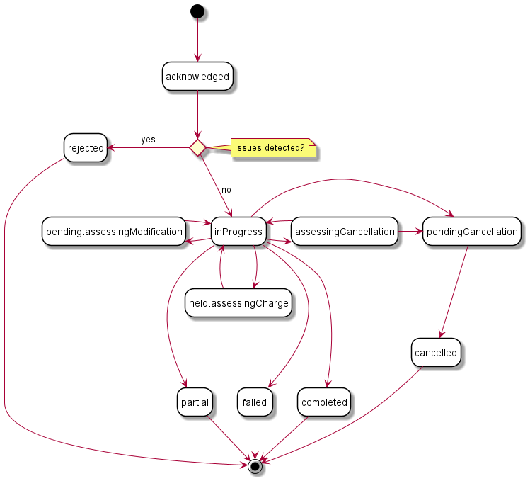

**Figure 13. Product Order State Machine**

Figure 13 presents the state machine for the Product Order. After receiving the
request, the Seller performs basic checks of the message. If any problem is
found an Error response is provided. If the validation passes a response is
provided with `ProductOrder` and all `ProductOrderItems` in `acknowledged`
state. Before moving the order to the `inProgress` state, the Buyer performs
all the remaining business and time-consuming validations. At this point, an
Error response cannot be provided anymore so the order moves to a `rejected`
state if some issues are found. The `productOrderItem.terminationError` acts as
a placeholder to provide a detailed description of what caused the problem.

Table 8 presents the mapping between the API `state` names (aligned with TMF)
and the MEF 57.2 naming, together with states' description.

| state                           | MEF 57.2 name          | Description                                                                                                                                                                                                                                                                                                                                                                                                                                                                                                                                                                                                                                                                                                                                                                              |
| ------------------------------- | ---------------------- | ---------------------------------------------------------------------------------------------------------------------------------------------------------------------------------------------------------------------------------------------------------------------------------------------------------------------------------------------------------------------------------------------------------------------------------------------------------------------------------------------------------------------------------------------------------------------------------------------------------------------------------------------------------------------------------------------------------------------------------------------------------------------------------------- |
| `acknowledged`                  | ACKNOWLEDGED           | A Product Order has been received by the Seller and has passed basic validation. A `productOrder.id` is assigned in the `acknowledged` state and a response is returned to the Buyer. The Product Order remains in the `acknowledged` state while validations of Product Order and Product Order Item(s) attributes as applicable is completed. If the Product Order and Product Order Item attributes are validated the Product Order moves to the `inProgress` state. If not validated, the Product Order moves to the `rejected` state.                                                                                                                                                                                                                                               |
| `assessingCancellation`         | ASSESSING_CANCELLATION | A Cancel Product Order request has been received by the Seller. The Product Order is being assessed to determine if the Product Order can be cancelled. If there are charges associated with cancelling the Product Order, these are communicated to the Buyer using the Charge process. The Product Order remains in the `assessingCancellation` state until any relevant Charge is completed or withdrawn by the Seller. Once the Buyer’s request has been validated and any associated Charges completed, the Product Order moves to the `pendingCancellation` state. If the request is not validated or if any associated Charges are not completed, the Product Order moves to the `inProgress` state and the Product Order is not cancelled.                                       |
| `held.assessingCharge`          | ASSESSING_CHARGE       | A Charge has been initiated by the Seller that is not the result of a Modify Product Order Item Requested Delivery Date or Cancel Product Order request and the Seller is awaiting a Buyer response to the Charge. If a blocking or non-blocking charge is accepted by the Buyer, the Product Order moves to `inProgress`. If a non-blocking charge is declined by the Buyer, the Product Order moves to `inProgress`. If a blocking charge is declined by the Buyer and there are no unrelated Product Order Items in the Product Order, the Product Order moves to the `inProgress` and then to the `failed` state. If a blocking charge is declined by the Buyer and there are unrelated Product Order Items in the Product Order, the Product Order moves to the `inProgress` state. |
| `pending.assessingModification` | ASSESSING_MODIFICATION | A request has been made by the Buyer to modify either the `expediteIndicator` or the `requestedCompletionDate` of a Product Order Item. The Product Order Item is currently being assessed to determine whether the Modify Product Order Item Requested Delivery Date is valid. If there is a charge associated with the Modify Product Order Item Requested Delivery Date, the Product Order remains in the `pending.assessingModification` state until the Charge is completed or withdrawn by the Seller. Once the Buyer's request has been validated and any associated Charges completed, the Product Order returns to the `inProgress` state.                                                                                                                                      |
| `cancelled`                     | CANCELLED              | The Product Order has been successfully cancelled. This is a terminal state.                                                                                                                                                                                                                                                                                                                                                                                                                                                                                                                                                                                                                                                                                                             |
| `pendingCancellation`           | CANCELLING             | The Buyer's Cancel Request has been assessed and it has been determined that it is feasible to proceed with the cancellation. This state can also result from a Seller cancelling the Product Order within their systems without a request from the Buyer.                                                                                                                                                                                                                                                                                                                                                                                                                                                                                                                               |
| `completed`                     | COMPLETED              | The Product Order has completed fulfillment. This is a terminal state                                                                                                                                                                                                                                                                                                                                                                                                                                                                                                                                                                                                                                                                                                                    |
| `failed`                        | FAILED                 | All Product Order Items have failed which results in the entire Product Order failing. This is a terminal state.                                                                                                                                                                                                                                                                                                                                                                                                                                                                                                                                                                                                                                                                         |
| `inProgress`                    | IN_PROGRESS            | The Product Order has been successfully validated, and fulfillment has started.                                                                                                                                                                                                                                                                                                                                                                                                                                                                                                                                                                                                                                                                                                          |
| `partial`                       | PARTIAL                | Fulfillment of at least one Product Order Item has failed, and fulfillment of at least one Product Order Item has been successful. This is a terminal state.                                                                                                                                                                                                                                                                                                                                                                                                                                                                                                                                                                                                                             |
| `rejected`                      | REJECTED               | A Product Order was submitted, and it has failed at least one of the validation checks the Seller performs after it reached the `acknowledged` state                                                                                                                                                                                                                                                                                                                                                                                                                                                                                                                                                                                                                                     |

**Table 8. Product Order states**

### 6.1.10 Product Order Item State Machine


**Figure 14. Product Order Item State Machine**

Table 9 presents the mapping between the API `state` names (aligned with TMF)
and the MEF 57.2 naming, together with the corresponding descriptions.

| state                 | MEF 57.2 name | Description                                                                                                                                                                                                                                                                                                                                                                                                                                                                                                                                                                                                                                                                                                                                                                                      |
| --------------------- | ------------- | ------------------------------------------------------------------------------------------------------------------------------------------------------------------------------------------------------------------------------------------------------------------------------------------------------------------------------------------------------------------------------------------------------------------------------------------------------------------------------------------------------------------------------------------------------------------------------------------------------------------------------------------------------------------------------------------------------------------------------------------------------------------------------------------------ |
| `acknowledged`        | ACKNOWLEDGED  | A Product Order Item has been received and has passed basic business validations. From the `acknowledged` state the Product Order Item is further validated and depending on the results of the validation and if other Product Order Items in the Product Order are also validated the Product Order Item moves to `inProgress`, `rejected.validated`, or `rejected.unassessed`.                                                                                                                                                                                                                                                                                                                                                                                                                |
| `cancelled`           | CANCELLED     | The Product Order has moved to the `pendingCancellation` state. All Product Order Items move to `cancelled`.                                                                                                                                                                                                                                                                                                                                                                                                                                                                                                                                                                                                                                                                                     |
| `completed`           | COMPLETED     | The Product Order Item has completed provisioning. This is an end state                                                                                                                                                                                                                                                                                                                                                                                                                                                                                                                                                                                                                                                                                                                          |
| `failed`              | FAILED        | The fulfillment of a Product Order Item has failed. A Product Order Item may fail because the Buyer declined a Blocking charge identified via the Charge, the Buyer failed to respond to a Charge Item included in a Charge, or the Seller is unable to fulfill the Product Order Item. A Product Order Item moving to `failed` state results in the Product Order State being `failed` or `partial`. This is a terminal state.                                                                                                                                                                                                                                                                                                                                                                  |
| `held`                | HELD          | The Product Order Item cannot be progressed due to Charge the Seller awaiting a response from the Buyer on a Charge. The Seller stops work on the Product Order Item until the Charge has completed. Upon acceptance by the Buyer of all Blocking charges, the Product Order Item returns to `inProgress` state If the Buyer rejects a Blocking charge, the Product Order Item moves to the `failed` state.                                                                                                                                                                                                                                                                                                                                                                                      |
| `inProgress`          | IN_PROGRESS   | The Product Order Item has been successfully validated and fulfillment has started. If the Seller's system links validation between Product Order Items in a Product Order, a Product Order Item in this state also indicates that the other Product Order Items passed validation.                                                                                                                                                                                                                                                                                                                                                                                                                                                                                                              |
| `pending`             | PENDING       | The Product Order Item cannot be progressed due to the Seller assessing a Cancel Product Order or Modify Product Order Item Requested Delivery Date request. The Seller stops work on the Product Order Item until either the Cancel Product Order has been accepted and the Product Order state moves to `pendingCancellation` and the Product Order Item state moves to `cancelled`, the Cancel Product Order has been rejected and the Product Order Item State moves to `inProgress`, the Modify Product Order Item Requested Delivery Date has been accepted and the Product Order Item State moves to `inProgress`, or the Modify Product Order Item Requested Delivery Date moves to `done.declined` and the Product Order Item state moves to `inProgress` with original delivery dates. |
| `rejected`            | REJECTED      | A Product Order Item was submitted, and it has failed at least one validation checks the Seller performs during the `acknowledged` state.                                                                                                                                                                                                                                                                                                                                                                                                                                                                                                                                                                                                                                                        |
| `rejected.unassessed` | UNASSESSED    | A Product Order was submitted and all validation checks the Seller performs during the `acknowledged` state have not been completed, but another Product Order Item in the Product Order has moved to the `rejected` state.                                                                                                                                                                                                                                                                                                                                                                                                                                                                                                                                                                      |
| `rejected.validated`  | VALIDATED     | A Product Order was submitted, and it has passed all validation checks the Seller performs during the `acknowledged` state, but another Product Order Item in the Product Order has moved to the `rejected` state                                                                                                                                                                                                                                                                                                                                                                                                                                                                                                                                                                                |

**Table 9. Product Order Item states**

### 6.1.11. Requirements for Product Order and Product Order Item Lifecycle

Requirements below are applied to a Product Order processing lifecycle - after
providing an initial response where the Product Order was `acknowledged`. It
assumes a Seller's response to a GET by `id` request.

**[R45]** If the Product Order `state` in the Seller's response is `completed`,
the response **MUST** contain the `completionDate` attribute. [MEF57.2 R21]

**[R46]** If the Product Order Item `state` in the Seller's response is
`inProgress`, the `expectedCompletionDate` attribute **MUST** be provided.
[MEF57.2 R40]

**[R47]** If the Product Order Item `state` in the Seller's response is
`cancelled`, the `expectedCompletionDate` attribute **MUST NOT** be provided.
[MEF57.2 R42]

**[R48]** If the Product Order Item `state` in the Seller's response is
`completed`, the response **MUST** contain the `completionDate` attribute.
[MEF57.2 R41]

**[R49]** If the Product Order Item `state` in the Seller's response is not
`completed`, the response **MUST NOT** contain the `completionDate` attribute.
[MEF57.2 R52]

**[R50]** If the Seller revises the `expectedCompletionDate` for any Product
Order Item, they **MUST** include a `note` that indicates that the date has
been revised and the reason for the revision. [MEF57.2 R53]

### 6.1.12. Specifying Place Details

Some product specifications may define requirements concerning place definition
in case `add` or `modify` action is used. For example, an Operator UNI product
specification requires an `INSTALL_LOCATION` place definition in the case of
the `add` action.

There are different formats in which place information may be provided:
geographic point (`MEFGeographicPoint`), fielded (`FieldedAddress`), formatted
(`FormattedAddress`), geographic address identifier (`GeographicAddressLabel`),
geographic site reference (`GeographicSiteRef`), and a geographic address
reference (`GeographicAddressRef`). The first four of them can be used to
provide a full place description by value. The site and address reference allow
specifying the place information as a reference to previously validated address
or site available through Seller's Addressing and Site API endpoints, which
definition is provided in the SDK:

- `productApi/serviceability/address/geographicAddressManagement.api.yaml`
- `productApi/serviceability/site/geographicSiteManagement.api.yaml`

The master class for all address types is the `RelatedPlaceRefOrValue` which
adds the `role` to add more context to the specified address. To distinguish
between place types the `@type` discriminator is used.

**_Note:_** The _RefOrValue_ stands for a pattern where an address can be
provided either by `id` (using `GeographicSiteRef` or `GeographicAddressRef`)
OR by value (with use of `MEFGeographicPoint`, `FieldedAddress`,
`FormattedAddress`, `GeographicAddressLabel`). There is no way to specify an
address with use both ref AND value at the same time.

Examples of different place specification formats are provided below.

### 6.1.12.1. Fielded Address

```json
{
  "@type": "FieldedAddress",
  "streetType": "ul.",
  "streetName": "Edmunda Wasilewskiego",
  "streetNr": "20",
  "streetNrSuffix": "14",
  "city": "Kraków",
  "stateOrProvince": "Lesser Poland",
  "postcode": "30-305",
  "country": "Poland",
  "geographicSubAddress": {
    "levelType": "floor",
    "levelNumber": "4"
  },
  "role": "INSTALL_LOCATION"
}
```

Fielded address example of a place specification. The type discriminator has
the value `FieldedAddress`. A subset of available attributes is used to
describe the place. The fielded address has an optional `geographicSubAddress`
structure that defines several attributes that can be used in case precise
address information has to be provided. In the example above, a floor in the
building at the given address is specified using this structure. The role of
the place is assigned according to the requirements of the Operator UNI product
specification.

### 6.1.12.2. Formatted Address

```json
{
  "@type": "FormattedAddress",
  "addrLine1": "ul. Edmunda Wasilewskiego 20/14",
  "addrLine2": "Floor 4",
  "city": "Kraków",
  "stateOrProvince": "Lesser Poland",
  "postcode": "30-305",
  "country": "Poland",
  "role": "INSTALL_LOCATION"
}
```

Place information in a form of a formatted address. The type discriminator has
the value `FormattedAddress`. This example contains the same information as the
previous `FieldedAddress` example.

### 6.1.12.3. Geographic Point

```json
{
  "@type": "MEFGeographicPoint",
  "spatialRef": "EPSG:4326 WGS 84",
  "x": "50.048868",
  "y": "19.929523",
  "role": "INSTALL_LOCATION"
}
```

Place information in a form of geographic point. `spatialRef` determines the
standard that has to be used to interpret coordinates provided in the required
`x` (latitude), `y` (longitude), and optional `z` (elevation) values.

This type allows only providing a point. It cannot carry more detailed
information like the floor number from previous examples.

**[R51]** The `spatialRef` value that can be used **MUST** be agreed between
Buyer and Seller.

### 6.1.12.4. Geographic Address Label

```json
{
  "@type": "GeographicAddressLabel",
  "externalReferenceType": "CLLI",
  "externalReferenceId": "PLTXCL01",
  "role": "INSTALL_LOCATION"
}
```

The Geographic Address Label represents a unique identifier controlled by a
generally accepted independent administrative authority that specifies a fixed
geographical location. The example above is a place that represents a CLLI
(Common Language Location Identifier) identifier which is commonly used to
refer locations in North America for network equipment installations.

### 6.1.12.5. Geographic Site Reference

```json
{
  "@type": "GeographicSiteRef",
  "id": "18d3bb74-997a-4a62-8198-84250766765a",
  "role": "INSTALL_LOCATION"
}
```

`GeographicSiteRef` type is used to specify a `GeographicSite` by reference in
the request. In the above example, a `GeographicSite` identified as
`18d3bb74-997a-4a62-8198-84250766765a` in the Sellers Service Site API is used.

### 6.1.12.6. Geographic Address Reference

```json
{
  "@type": "GeographicAddressRef",
  "id": "8198bb74-18d3-9ef0-4913-66765a842507",
  "role": "INSTALL_LOCATION"
}
```

`GeographicAddressRef` type is used to specify a `GeographicAddress` by
reference in the request. In the above example a `GeographicAddress` identified
as `8198bb74-18d3-9ef0-4913-66765a842507` in the Sellers Service Site API is
used.

## 6.2. Use Case 2: Update Product Order

The update is realized with the use of the `PATCH /productOrder/{{id}}`
operation. For that purpose a specialized types `ProductOrder_Update` and
`ProductOrderItem_Update` are provided. Their lists of attributes are limited
to a subset that includes only the Buyer settable and not Product Order
processing affecting attributes. If Buyer wishes to update any attribute not
listed in abovementioned types (e.g. product-related) then the pending Product
Arder must be canceled and a new one must be resubmitted.

The PATCH usage recommendation follows TMF 622 json/merge
(https://tools.ietf.org/html/rfc7386).

Figure 15 presents the model used in the PATCH request. The Seller responds
with a `ProductOrder` type.


**Figure 15. Patch request Model**

The example below shows a request to change Product Order Contact
(`relatedContactInformation` with `role` set to `productOrderContact`), and the
`endCustomerName` of the first Product Order Item.

```json
{
  "relatedContactInformation": [
    { << updated contact >>
      "emailAddress": "Richard.example@example.com",
      "name": "Richard Example",
      "number": "98-765-4321",
      "organization": "Buyer Example Co.",
      "role": "productOrderContact",
    },
    { << not changed >>
      "emailAddress": "kate.example@example.com",
      "name": "Kate Example",
      "number": "12-345-67890",
      "organization": "Seller Example Co.",
      "role": "sellerContact"
    }
  ],
  "productOrderItem": [
    {
      "id": "item-001",
      "endCustomerName": "Updated End Customer Name"
    },
    {
      "id": "item-002"
    }
  ]
}
```

**[R52]** A Buyer's Patch request **MUST** contain one or more of the
`ProductOrder` updateable attributes. [MEF57.2 R62]

**[R53]** If a Buyer's Patch request contains a Product Order Item, it **MUST**
provide one or more of the Product Order Item's updateable attributes (apart
from `id`). [MEF57.2 R69]

If the Buyer wishes to update a Product Order Item:

**[R54]** A Buyer's Patch request **MUST** contain `productOrderItem.id`
[MEF57.2 R68]

**_Note:_** The `productOrderItem.id` attribute cannot be updated. It is used
only to refer to identify and items to be updated.

**[R55]** If a Buyer wants to update a Product Order Item, the Patch request
**MUST** contain one or more of the `ProductOrderItem` updateable attributes.
[MEF57.2 R69]

**[R56]** The Buyer **MUST** only be able to modify hte Buyer-related contact
information. [MEF57.2 R4]

**_Note:_** The Buyer can update a Buyer-related contact by providing a full
list of existing `relatedContactInformation` items, and making updates within
it.

**[R57]** The Buyer **MUST** add a `note` only with `source=note`. [MEF57.2
R11], [MEF57.2 R12]

**[R58]** When the Buyer is adding a Note, the `note` list **MUST** be appended
with the new `note` item. [MEF57.2 R14]

## 6.3. Use Case 3: Retrieve List of Product Orders

The Buyer can retrieve a list of `ProductOrders` by using a `GET /productOrder`
operation with desired filtering criteria.

**[O9]** The Buyer's request **MAY** contain none or more of the following
attributes: [MEF57.2 O16]

- `state`
- `externalId`
- `projectId`
- `orderDate.gt`
- `orderDate.lt`
- `completionDate.gt`
- `completionDate.lt`
- `cancellationDate.gt`
- `cancellationDate.lt`

**[O10]** The Buyer's request **MAY** contain any of the following attributes:
[MEF57.2 O17]

- `itemRequestedCompletionDate.gt`
- `itemRequestedCompletionDate.lt`
- `itemExpectedCompletionDate.gt`
- `itemExpectedCompletionDate.lt`

The Buyer may also ask for pagination with the use of the `offset` and `limit`
parameters. The filtering and pagination attributes must be specified in URI
query format [RFC3986](#8-references). Section
[7.1.2.](#712-response-pagination) provides details about the implementation of
pagination mechanism.

```
https://serverRoot/mefApi/sonata/productOrderingManagement/v10/productOrder?state=completed&projectId=myProject&limit=10&offset=0
```

The example above shows a Buyer's request to get all `ProductOrders` that are
in the `completed` state and are part of `myProject`. Additionally, the Buyer
asks only for a first (`offset=0`) pack of 10 results (`limit=10`) to be
returned. The correct response (HTTP code `200`) in the response body contains
a list of `ProductOrder_Find` objects matching the criteria. To get more
details (e.g. the item level information), the Buyer has to query a specific
`ProductOrder` by `id`.

**[R59]** The Seller **MUST** put the following attributes (if set) into the
`ProductOrder_Find` object in the response: [MEF57.2 R99]

- `id`
- `cancellationDate`
- `completionDate`
- `externalId`
- `orderDate`
- `projectId`
- `state`

**[R60]** In case no items matching the criteria are found, the Seller **MUST**
return a valid response with an empty list. [MEF57.2 R101]

## 6.4. Use Case 4: Retrieve Product Order by Product Order Identifier

The Buyer can get detailed information about the Product Order from the Seller
by using a `GET /productOrder/{{id}}` operation. In case `id` does not allow to
find a `ProductOrder` in Seller's system, an error response `Error404` must be
returned. The payload returned in the response includes all attributes the
Buyer has provided while sending a Product Order create request. The attributes
provided by the Seller depend on the status of the `ProductOrder` and may
require some time to be set.

**[R61]** Once the product identifier
(`productOrder.productOrderItem.product.id`) is assigned, it **MUST** be
provided in the Seller's response.

**[R62]** The Seller's response **MUST** comply with the states and attributes
detailed in Table 10 and Table 11. [MEF57.2 R103]

Please note that for readability purposes following tables do not show
attributes specified by the Buyer that must be only echoed back ("E") by the
Seller without any change. Attributes required to be provided by the Seller are
shown by an "R", Required if Populated by the Seller shown by a "PR", or
Optional to be provided by the Seller or the Buyer shown by an "O". It there
are two values in a cell (e.g. E / PR) the first one relates to values set by
the Buyer, the second for the Values set by the Seller.

|                           | acknowledged | assessingCancellation | held.assessingCharge | cancelled | pendingCancellation | completed | failed | inProgress | partial | rejected |
| ------------------------- | ------------ | --------------------- | -------------------- | --------- | ------------------- | --------- | ------ | ---------- | ------- | -------- |
| id                        | R            | R                     | R                    | R         | R                   | R         | R      | R          | R       | R        |
| orderDate                 | R            | R                     | R                    | R         | R                   | R         | R      | R          | R       | R        |
| state                     | R            | R                     | R                    | R         | R                   | R         | R      | R          | R       | R        |
| relatedContactInformation | R            | R                     | R                    | R         | R                   | R         | R      | R          | R       | R        |
| cancellationReason        |              |                       |                      | E / R     |                     |           |        |            |         |          |
| cancellationDate          |              |                       |                      | R         |                     |           |        |            |         |          |
| cancellationCharge        |              |                       |                      | PR        | PR                  |           |        |            |         |          |
| completionDate            |              |                       |                      | R         |                     | R         | R      |            | R       | R        |
| note                      | E / PR       | E / PR                | E / PR               | E / PR    | E / PR              | E / PR    | E / PR | E / PR     | E / PR  | E / PR   |

**Table 10. Seller Response Product Order Attributes Based on Product Order
State**

|                           | acknowledged | cancelled | completed | failed | held   | inProgress | pending | rejected | rejected.validated | rejected.unassessed |
| ------------------------- | ------------ | --------- | --------- | ------ | ------ | ---------- | ------- | -------- | ------------------ | ------------------- |
| note                      | E / PR       | E / PR    | E / PR    | E / PR | E / PR | E / PR     | E / PR  | E / PR   | E / PR             | E / PR              |
| expediteAcceptedIndicator | PR           | PR        | PR        | PR     | PR     | PR         | PR      | PR       | PR                 | PR                  |
| charge                    |              | PR        | PR        | PR     | PR     | PR         | PR      |          | PR                 |                     |
| stateChange               | R            | R         | R         | R      | R      | R          | R       | R        | R                  | R                   |
| expectedCompletionDate    |              | R         | R         | R      | R      | R          | R       |          |                    |                     |
| completionDate            |              |           | R         |        |        |            |         |          |                    |                     |
| state                     | R            | R         | R         | R      | R      | R          | R       | R        | R                  | R                   |
| relatedContactInformation | E / R        | E / R     | E / R     | E / R  | E / R  | E / R      | E / R   | E / R    | E / R              | E / R               |
| itemTerm                  |              | PR        | PR        | PR     | PR     | PR         | PR      | PR       | PR                 |                     |
| terminationError          |              |           |           | R      |        |            |         | R        |                    |                     |

**Table 11. Seller Response Product Order Item Attributes Based on Product
Order Item State**

## 6.5. Use case 5: Modify Product Order Item Requested Delivery Date

The Product Order PATCH operation is limited to a subset of attributes that
includes only the Buyer settable and not Product Order processing affecting
ones ([Section 6.2](#62-use-case-2-update-product-order)). Modification of
`requestedCompletionDate` or `expediteIndicator` may bring a significant
processing and business impact hence it is extracted to a separate dedicated
process.

The Buyer issues the request by using a dedicated endpoint:
`POST /modifyProductOrderItemRequestedDeliveryDate` and providing a
`MEFModifyProductOrderItemRequestedDeliveryDate_Create` in the request body.

There are two functions supported by the Modify Product Order Item Requested
Delivery Date request:

- changing the `expediteIndicator`
- changing the `requestedCompletionDate` of the Product Order Item.

Figure 16 presents entity types that take part in the Modify Product Order Item
Requested Delivery Date use cases:

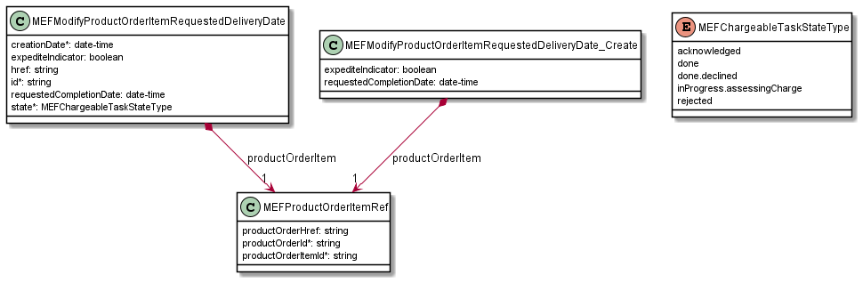

**Figure 16. Modify Product Order Item Requested Delivery Date Model**

The state transition and detailed description are presented in Figure 17 and
Table 12:


**Figure 17. Modify Product Order Item Requested Delivery Date State Machine**

| Name                       | MEF 57.2 Name    | Description                                                                                                                                                                                                                                                                                                                                                                                                                                                                                                                                                                         |
| -------------------------- | ---------------- | ----------------------------------------------------------------------------------------------------------------------------------------------------------------------------------------------------------------------------------------------------------------------------------------------------------------------------------------------------------------------------------------------------------------------------------------------------------------------------------------------------------------------------------------------------------------------------------- |
| inProgress.assessingCharge | ACCESSING_CHARGE | The Modify Product Order Item Requested Delivery Date request results in a Charge being initiated by the Seller. The Modify Product Order Item Requested Delivery Date remains in this state until the Charge is completed or withdrawn by the Seller. All charges within a Charge that was initiated due to a Modify Product Order Item Requested Delivery Date are considered Blocking charges. If any charge is not accepted by the Buyer, the Modify Product Order Item Requested Delivery Date moves from the `inProgress.assessingCharge` state to the `done.declined` state. |
| acknowledged               | ACKNOWLEDGED     | A Modify Product Order Item Requested Delivery Date request has been received and has passed basic validation. The Modify Product Order Item Requested Delivery Date Identifier is assigned in the `acknowledged` state. Validation of Modify Product Order Item Requested Delivery Date attributes as applicable is completed in the `acknowledged` state.                                                                                                                                                                                                                         |
| done                       | COMPLETED        | A Modify Product Order Item Requested Delivery Date request has been received, passed all validations, if a Charge is associated all Charge Items have been accepted by the Buyer, and the Product Order Item Completion Date has been updated as requested.                                                                                                                                                                                                                                                                                                                        |
| done.declined              | DECLINED         | Blocking charges associated with a Modify Product Order Item Requested Delivery Date have been declined by the Buyer. No updates are made to the Product Order Item.                                                                                                                                                                                                                                                                                                                                                                                                                |
| rejected                   | REJECTED         | A Modify Product Order Item Requested Delivery Date request was submitted by the Buyer, and it has failed any validation checks the Seller performs during the `acknowledged` state. No updates are made to the referenced Product Order Item.                                                                                                                                                                                                                                                                                                                                      |

**Table 12. Modify Product Order Item Requested Delivery Date States**

Example of a Buyer's request
(`modifyProductOrderItemRequestedDeliveryDate_Create`):

```json
{
  "expediteIndicator": true,
  "requestedCompletionDate": "2021-05-25T21:32:28.826Z",
  "productOrderItem": {
    "productOrderId": "00000000-1111-2222-3333-000000000123",
    "productOrderItemId": "item-001"
  }
}
```

Example of a Seller's response (`modifyProductOrderItemRequestedDeliveryDate`):

```json
{
  "id": "00000000-8888-0000-0000-000000000001",
  "expediteIndicator": true,
  "requestedCompletionDate": "2021-05-25T21:32:28.826Z",
  "productOrderItem": {
    "productOrderId": "00000000-1111-2222-3333-000000000123",
    "productOrderItemId": "item-001"
  },
  "state": "acknowledged"
}
```

Below you can find a flow of this use case when there are no additional charges
identified. A case with additional charges handling is presented in
[Section 6.11.2](#6112-use-case-11b-initiate-charge-associated-to-modify-product-order-item-requested-delivery-date)

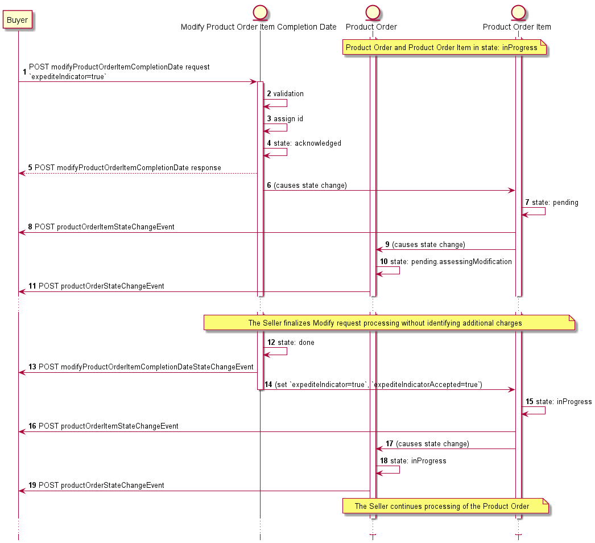

**Figure 18. Modify Product Order Item Requested Delivery Date Flow**

- The Buyer sends a `modifyProductOrderItemRequestedDeliveryDate` request with
  the `expediteIndicator` set to `true` (and/or `requestedCompletionDate`) set
  to new value **(1)**.
- The Seller validates the request **(2)**.
- The Seller initiates the Modify Date process, assigns a unique `id` **(3)**,
  then sets the
  `modifyProductOrderItemRequestedDeliveryDate.state`to`acknowledged`**(4)**,
  changes the `state` of the referenced `ProductOrderItem` to `pending`
  **(6,7)**, and the `state` of `ProductOrder` to
  `pending.assessingModification` **(9,10)**.
- The Seller notifies the Buyer of any charges resulting from the request while
  the `modifyProductOrderItemRequestedDeliveryDate` is in the `acknowledged`
  state (The details of the Charge process are not present here for clarity.
  They are provided in
  [Section 6.11.2](#6112-use-case-11b-initiate-charge-associated-to-modify-product-order-item-requested-delivery-date)
  for details).
- The Seller accepts the requested change. The
  `modifyProductOrderItemRequestedDeliveryDate` is set to `done` **(12)** and
  the Seller updates the `expediteIndicator` and the
  `expediteAcceptedIndicator` (and/or `requestedCompletionDate`) **(14)**.
- The Seller sets the referenced `ProductOrderItem.state` back to `inProgress`
  **(15)** and `ProductOrder.state` to `inProgress` **(17,18)**.
- The Seller continues the work to fulfill the Product Order.

**_Note:_** The are places where the sequence of the state changes is performed
"at the same time" (e.g. **4,7,10**, **12,14,15,18**). The diagrams in this
document show additional "causes ..." steps for explanation purposes. The
actual order of those state transitions is not mandated and may depend on
Seller's implementation.

### 6.5.1. Use case 5a: Modify Expedite Indicator

In this case, the Buyer requests to expedite a Product Order.

**[R63]** The Buyer's sent `modifyProductOrderItemRequestedDeliveryDate_Create`
**MUST** contain the following attributes: [MEF57.2 R74]

- `productOrderItem`
- `expediteIndicator`

The Buyer sets the `expediteIndicator` to `true` if they want the Seller to
fulfill the Product Order Item in a shorter period than the
`installationInterval` (provided in product offering qualification and/or quote
step).

**[O11]** The Buyer's sent `modifyProductOrderItemRequestedDeliveryDate_Create`
**MAY** contain the `requestedCompletionDate`. [MEF57.2 O13]

If the Buyer sets the `expediteIndicator` to `true` and sets a
`requestedCompletionDate` then they are requesting that the Product Order Item
be fulfilled in a shorter time period than the `installationInterval` and have
provided a date they would like it fulfilled by. The `requestedCompletionDate`
must indicate a shorter time period than the `installationInterval`. The Seller
may try to honor the date or may ignore it.

**[R64]** The Seller's response **MUST** specify the `id`, `state`, and
`creationDate` attributes. [MEF57.2 R75]

**[R65]** The Seller's response **MUST** echo back all attributes and values in
the Buyer's request. [MEF57.2 R76]

### 6.5.2. Use case 5b: Modify Product Order Item Requested Delivery Date

In this case, the Buyer requests to change the `expectedCompletionDate` of a
Product Order Item.

**[R66]** The Buyer's sent `modifyProductOrderItemRequestedDeliveryDate_Create`
**MUST** contain the following attributes: [MEF57.2 R78]

- `productOrderItem`
- `requestedCompletionDate`

If the Buyer wants to push out or delay the fulfillment of the Product Order
Item, they set a new `requestedCompletionDate` and the `expediteIndicator` to
`false` (or just not specify it all as the default value for
`expediteIndicator` is `false`).

**[R67]** The Seller's response **MUST** specify the `id`, `state`, and
`creationDate` attributes. [MEF57.2 R79]

**[R68]** The Seller's response **MUST** echo back all attributes and values in
the Buyer's request. [MEF57.2 R80]

## 6.6. Use case 6: Retrieve Modify Product Order Item Requested Delivery Date List

The Buyer can retrieve a list of `modifyProductOrderItemRequestedDeliveryDate`
by using a `GET /modifyProductOrderItemRequestedDeliveryDate` operation with
desired filtering criteria.

**[O12]** The Buyer's request **MAY** contain none or any of the following
attributes: [MEF57.2 O18]

- `state`
- `expediteIndicator`
- `productOrderId`
- `requestedCompletionDate.gt`
- `requestedCompletionDate.lt`
- `creationDate.gt`
- `creationDate.lt`

The rules of using pagination and an example request are provided in
[section 6.3](#63-use-case-3-retrieve-list-of-product-orders). Please refer to
it as the rules also apply to this case.

**[R69]** The Seller **MUST** put the following attributes (if set) into the
response: [MEF57.2 R104]

- `id`
- `creationDate`
- `expediteIndicator`
- `productOrderItem`
- `requestedCompletionDate`
- `state`

**[R70]** In case no items matching the criteria are found, the Seller **MUST**
return a valid response with an empty list. [MEF57.2 R105]

## 6.7. Use case 7: Retrieve Modify Product Order Item Requested Delivery Date by Modify Product Order Item Requested Delivery Date Identifier

The Buyer can get detailed information about the Modify Product Order Item
Requested Delivery Date from the Seller by using a
`GET /modifyProductOrderItemRequestedDeliveryDate/{{id}}` operation.

**[R71]** The Seller **MUST** put the following attributes (if set) into the
response: [MEF57.2 R108]

- `id`
- `creationDate`
- `expediteIndicator`
- `productOrderItem`
- `requestedCompletionDate`
- `state`

**[R72]** In case `id` does not allow to find a
`modifyProductOrderItemRequestedDeliveryDate` in Seller's Inventory, an error
response `404` must be returned. [MEF57.2 R109]

## 6.8. Use case 8: Cancel Product Order

The Buyer may request to Cancel a Product Order by using
`POST /cancelProductOrder` and providing a `CancelProductOrder_Create` in the
request body.

The following Figures present the use case's model and flow diagrams.

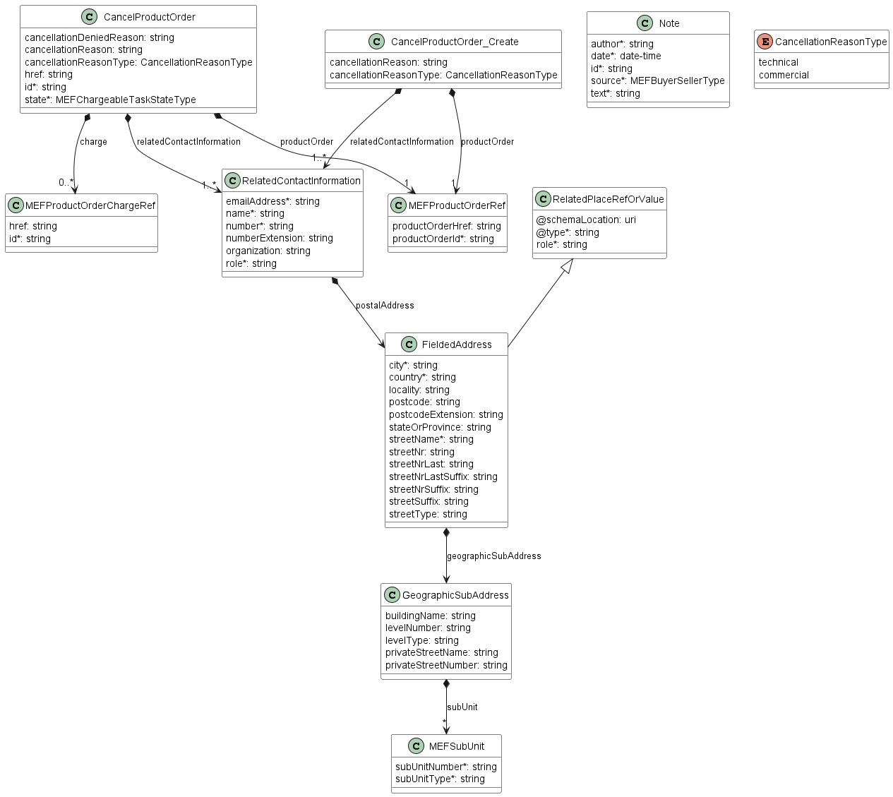

**Figure 19. Cancel Product Order Model**

The state transition and detailed description are presented in Figure 20 and
Table 13:

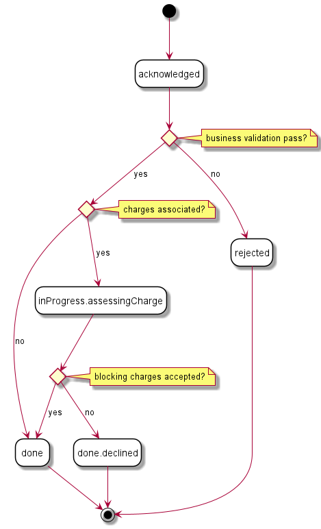

**Figure 20. Cancel Product OrderState Machine**

| Name                         | MEF 57.2 Name    | Description                                                                                                                                                                                                                          |
| ---------------------------- | ---------------- | ------------------------------------------------------------------------------------------------------------------------------------------------------------------------------------------------------------------------------------ |
| `acknowledged`               | ACKNOWLEDGED     | A Cancel Request has been received and has passed basic validation. Seller `id` is assigned in the `acknowledged` state. Validation of Cancel attributes as applicable is completed in the `acknowledged` state.                     |
| `inProgress.assessingCharge` | ACCESSING_CHARGE | The Cancel Request results in a Charge being initiated by the Seller. The Cancel Request remains in this state until the Charge is completed or withdrawn by the Seller.                                                             |
| `done`                       | COMPLETED        | A Cancel Request has been received, passed all validations, if a Charge is associated all Charge Items have been accepted by the Buyer, and the Product Order has been cancelled as requested.                                       |
| `done.declined`              | DECLINED         | Blocking charges associated with a Cancel Product Order have been declined by the Buyer. No updates are made to the Product Order.                                                                                                   |
| `rejected`                   | REJECTED         | A Cancel Request was submitted, and it has failed any validation checks the Seller performs during the `acknowledged` state e.g. the Product Order being in an incorrect state. No updates are made to the referenced Product Order. |

**Table 13. Cancel Product Order States**

Example of a Buyer's request (`CancelProductOrder_Create`):

```json
{
  "cancellationReasonType": "technical",
  "cancellationReason": "A technical reason for cancelling the ProductOrder",
  "note": [
    {
      "date": "2021-05-22T23:30:47.999Z",
      "author": "Cancel Product Order Contact",
      "id": "1",
      "source": "buyer",
      "text": "We have an equipment swap and the requirements will change. Will issue another Product Order once done."
    }
  ],
  "relatedContactInformation": [
    {
      "emailAddress": "Cancel.ProductOrderContact@example.com",
      "name": "Cancel Product Order Contact",
      "number": "+12-345-678-90",
      "organization": "Buyer",
      "role": "cancelProductOrderContact"
    }
  ],
  "productOrder": {
    "id": "00000000-1111-2222-3333-000000000123"
  }
}
```

**[R73]** A Buyer **MUST** have submitted the Product Order Request to be able
to submit a Cancel Request on the Product Order. [MEF57.2 R93]

**[R74]** The Buyer's Cancel Product Order request **MUST** contain the
following attributes: [MEF57.2 R94]

- `productOrder`
- `relatedContactInformation` (`role=cancelProductOrderContact`)

  Example of a Seller's response (`CancelProductOrder`):

```json
{
  "id": "00000000-9999-0000-0000-000000000003",
  "state": "acknowledged",
  "cancellationReasonType": "technical",
  "cancellationReason": "A technical reason for cancelling the ProductOrder",
  "note": [
    {
      "date": "2021-05-22T23:30:47.999Z",
      "author": "Cancel Product Order Contact",
      "id": "1",
      "source": "buyer",
      "text": "We have an equipment swap and the requirements will change. Will issue another Product Order once done."
    }
  ],
  "relatedContactInformation": [
    {
      "emailAddress": "Cancel.ProductOrderContact@example.com",
      "name": "Cancel Product Order Contact",
      "number": "+12-345-678-90",
      "organization": "Buyer",
      "role": "cancelProductOrderContact"
    },
    {
      "emailAddress": "Seller.Contact@example.com",
      "name": "Seller Contact",
      "number": "+12-345-678-90",
      "organization": "Seller",
      "role": "sellerContact"
    }
  ],
  "productOrder": {
    "id": "00000000-1111-2222-3333-000000000123"
  }
}
```

**[R75]** The Seller **MUST** echo back all Buyer specified attributes in the
Buyer's Cancel Product Order request. [MEF57.2 R95]

**[R76]** The Seller **MUST** specify the following attributes in the response:
[MEF57.2 R96]

- `id`
- `state`
- `relatedContactInformation` (add item with
  `role=cancelProductOrderSellerContact`)

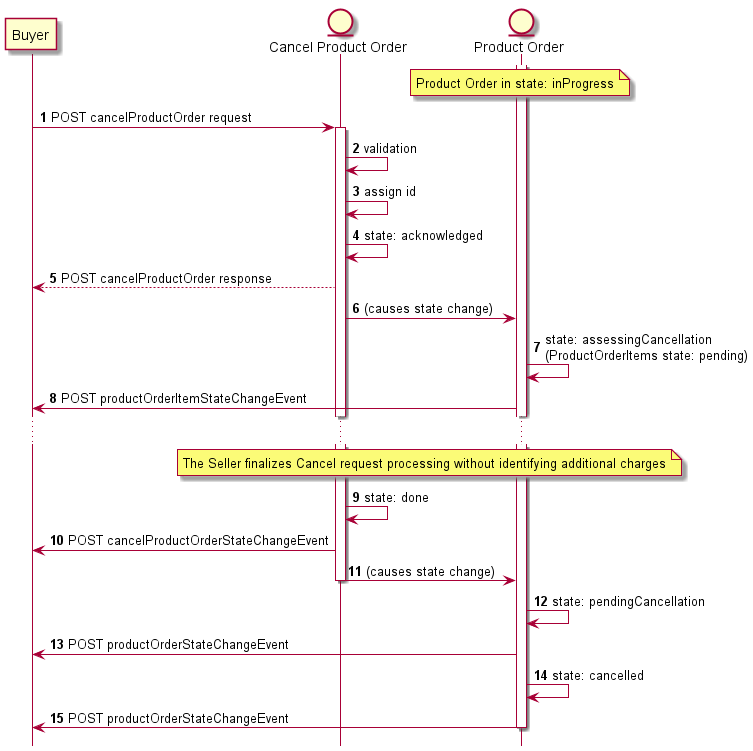

**Figure 21. Cancel Product Order Flow**

- The Buyer sends a Cancel Product Order request with
  `CancelProductOrder_Create` **(1)**.
- The Seller validates the request **(2)**.
- The Seller initiates the Cancel process, assigns a `CancelProductOrder.id`
  **(3)**, sets the `CancelProductOrder.state` to `acknowledged` **(4)**, and
  changes the referenced `ProductOrder.state` to `assessingCancellation`
  **(6,7)**.
- The Seller notifies the Buyer of any charges resulting from cancelling the
  referenced Product Order while the Cancel Request is in the `acknowledged`
  state (The details of the Charge process are not present here for clarity.
  They are provided in
  [Section 6.11.3](#6113-use-case-11c-initiate-charge-associated-to-cancel-product-order)
  for details).
- The Seller accepts the Cancel Request. The `CancelProductOrder.state` is set
  to `done` **(9)** and the referenced `ProductOrder.state` is set to
  `pendingCancellation` **(11,12)**.
- Once the Seller has completed the cancellation process, the referenced
  `ProductOrder.state` is changed to `cancelled` **(14)**.

## 6.9. Use case 9: Retrieve List of Cancel Product Orders

The Buyer can retrieve a list of `CancelProductOrder` by using a
`GET /cancelProductOrder` operation with desired filtering criteria.

**[O13]** The Buyer's request **MAY** contain none or any of the following
attributes: [MEF57.2 O19]

- `productOrderId`
- `state`
- `cancellationReasonType`

The rules of using pagination and an example request are provided in
[section 6.3](#63-use-case-3-retrieve-list-of-product-orders). Please refer to
it as the rules also apply to this case.

**[R77]** The Seller **MUST** put the following attributes (if set) into the
response: [MEF57.2 R110]

- `id`
- `cancellationReasonType`
- `productOrder`
- `state`

**[R78]** In case no items matching the criteria are found, the Seller **MUST**
return a valid response with an empty list. [MEF57.2 R111]

## 6.10. Use case 10: Retrieve Cancel Product Order by Cancel Product Order Identifier

The Buyer can get detailed information about the Cancel Product Order request
from the Seller by using a `GET /cancelProductOrder/{{id}}` operation.

**[R79]** The Seller's response **MUST** echo back all attributes provided by
the Buyer in the request and provide the following attributes (if set):
[MEF57.2 R114]

- `id`
- `cancellationDeniedReason`
- `cancellationReason`
- `cancellationReasonType`
- `productOrder`
- `relatedContactInformation` (items with
  `role=cancelProductOrderSellerContact` and `role=cancelProductOrderContact`)
- `state`

## 6.11. Use case 11: Initiate Charge

When new or changes to existing charges are identified by the Seller during
processing of a Product Order the Seller must communicate them to the Buyer and
the Buyer must respond if they accept or reject each charge.

Within the Charge, the Seller indicates for each Charge Item, if the Charge
Item is Blocking or non-Blocking. After sending a `ChargeCreateEvent` the
Seller puts the associated Product Order in `held.assessingCharge` and/or
Product Order Item in `held` state and waits for the response. If the Buyer
rejects a Blocking Charge, the Seller will cancel the processing of the related
entity (depending on the sub-case - as described below).

The seller may identify Charges during:

- standard processing Product Order Item,
- processing of Buyer's Cancel Product Order,
- processing of Buyer's Modify Product Order Item Requested Delivery Date
  Request.

The variants are described as separate use cases and are explained in next
sections.

Figure 22 presents the model taking part in the use case. It is common for all
sub-use cases:

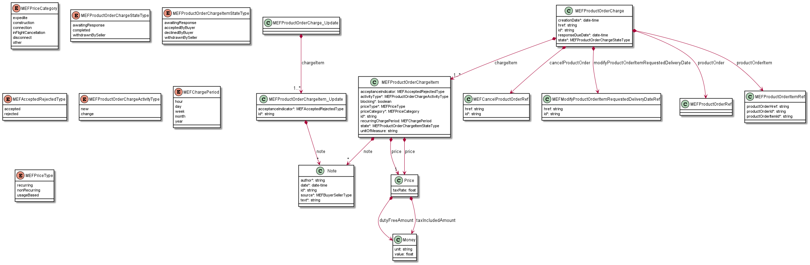

**Figure 22. Charge Model**

The Figures and Tables below present the Charge and Charge Item states.

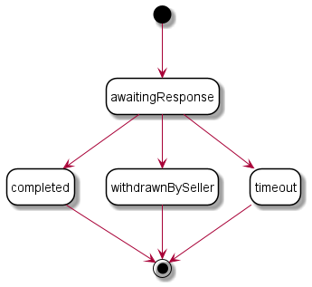

**Figure 23. Charge State Machine**

| State               | MEF 57.2 Name       | Description                                                                                                                                                                                                                                                                                                                                        |
| ------------------- | ------------------- | -------------------------------------------------------------------------------------------------------------------------------------------------------------------------------------------------------------------------------------------------------------------------------------------------------------------------------------------------- |
| `awaitingResponse`  | AWAITING_RESPONSE   | A Charge has been initiated by the Seller. The charge includes one or more charges related to a Product Order or Product Order Item. Buyer has not indicated whether they accept or reject the charges via a Respond to Charge request.                                                                                                            |
| `completed`         | COMPLETED           | All Charge Items included in the Charge for a given Product Order Item have moved to either the `acceptedByBuyer` state, the `declinedByBuyer` state, or the `withdrawnBySeller` state.                                                                                                                                                            |
| `timeout`           | TIMEOUT             | A Charge Item has been declined by the Buyer. The referenced Product Order and Product Order Items are updated. If a Blocking charge is declined, the Seller may cancel the referenced Product Order Item and any related Product Order Items, the related Cancel Product Order, or the related Modify Product Order Item Requested Delivery Date. |
| `withdrawnBySeller` | WITHDRAWN_BY_SELLER | The Seller determines that the Charge Item is incorrect. They withdraw the Charge Item and initiate a new Charge with the required correction(s) if needed.                                                                                                                                                                                        |

**Table 14. Charge States**

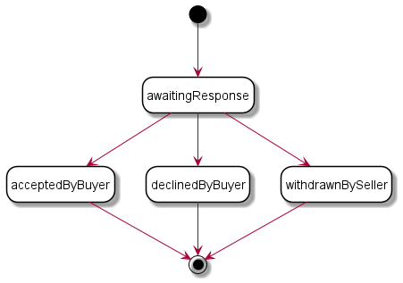

**Figure 24. Charge Item State Machine**

| State               | Description                                                                                                                                       |
| ------------------- | ------------------------------------------------------------------------------------------------------------------------------------------------- |
| `acceptedByBuyer`   | A Charge Item identified in the Charge has been accepted by the Buyer.                                                                            |
| `awaitingResponse`  | A Charge Item has been identified by the Seller and awaits Buyer's acceptance.                                                                    |
| `declinedByBuyer`   | A Charge Item identified in the Charge has been declined by the Buyer. The referenced Product Order and Product Order Items are updated.          |
| `withdrawnBySeller` | The Seller determines that the Charge Item is incorrect. They withdraw the Charge Item and initiate a new Charge with the required correction(s). |

**Table 15. Charge Item States**

**[R80]** The Charge **MUST** contain only Charge Items related to the same
Product Order Item (or Product Order, depending on the Use Case).

**[R81]** A Product Order **MUST NOT** have more than one Charge in
`state=awaitingResponse` at the same time. [MEF57.2 R88]

**[R82]** A Product Order Item **MUST NOT** have more than one Charge in
`state=awaitingResponse` at the same time. [MEF57.2 R87]

**[R83]** A Product Order and a Product Order Item within the Product Order
**MUST NOT** have Charges `state=awaitingResponse` at both the Product Order
and Product Order Item at the same time. [MEF57.2 R89]

**[R84]** A Charge **MUST** be initiated for a Product Order only in one of the
following states: `assessingCancellation` or `pending.assessingModification`.

**[R85]** A Charge **MUST** be initiated for a Product Order Item only in one
of the following states: `inProgress`, or `pending` state.

**[R86]** The Seller **MUST** support the `chargeCreateEvent` notification if
the Seller supports Charge use cases. [MEF57.2 R8]

**[O14]** The Seller **MAY** support the `chargeStateChangeEvent` and
`chargeTimeoutEvent` notifications if the Seller supports Charge use cases.
[MEF57.2 O5]

**[R87]** The Buyer **MUST** register for `chargeCreateEvent` notifications if
the Seller supports charge use cases. [MEF57.2 R7]

**[O15]** The Buyer **MAY** register for other Charge related notifications if
they are supported by the Seller [MEF57.2 O4]

**[R88]** When the Seller creates a Charge, the following attributes **MUST**
be set: [MEF57.2 R82]

- `id`
- `productOrder` XOR `productOrderItem`
- `chargeItem`
- `creationDate`
- `responseDueDate`
- `state`

**[R89]** When the Seller initiates the Charge associated to a Cancel Product
Order the `productOrder` attribute **MUST** provided. [MEF57.2 R84]

**[R90]** When the Charge was identified as an effect of a Modify Product Order
Item Requested Delivery Date request the Seller **MUST** provide the
`productOrderItem` and `modifyProductOrderItemRequestedDeliveryDate`
attributes. [MEF57.2 R83]

**[R91]** When the Charge was identified as an effect of a Cancel Product Order
request the Seller **MUST** provide the `productOrder` and `cancelProductOrder`
attributes. [MEF57.2 R82]

**[R92]** For each Charge Item included in the Charge, the Seller **MUST**
include the following attributes: [MEF57.2 R85]

- `id`
- `activityType`
- `priceType`
- `priceCategory`
- `blocking`
- `price`
- `state`

**[R93]** Table 16 shows the attributes that **MUST** be included in the Charge
Item based on the `priceType`: [MEF57.2 R86]

| `priceType`    | `recurringChargePeriod` | `unitOfMeasure` | `price.dutyFreeAmount` |
| -------------- | ----------------------- | --------------- | ---------------------- |
| `recurring`    | X                       |                 | X                      |
| `nonRecurring` |                         |                 | X                      |
| `usageBased`   |                         | X               | X                      |

**Table 16. Price Type Required Information**

### 6.11.1 Use case 11a: Initiate Charge Associated to Product Order Item

In this case, the Seller detects additional charges or changes in previously
communicated charges linked to the fulfillment of the Product Order Item. The
model and states have been described earlier. The sequence diagram below
presents a Charge use case together with a context of the Use Case 1.

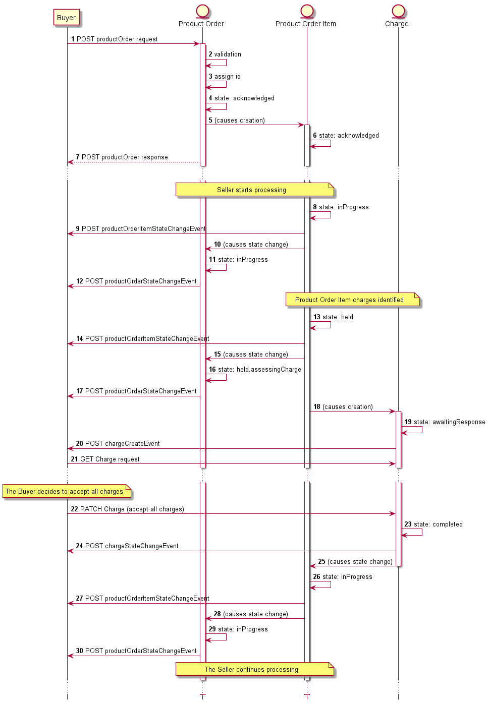

**Figure 25. Use case 11a: Initiate Charge Associated to Product Order Item
Flow**

- The Seller identifies one or more charges associated with a
  `ProductOrderItem`. The referenced `ProductOrderItem` moves to the `held`
  state **(13)** and the `ProductOrder` moves to `held.assessingCharge` state
  **(15,16)**.
- A `Charge` is initiated by the Seller and a `chargeCreateEvent` is sent by
  the Seller **(18,19,20)**.
- The Buyer queries for the details of the `Charge` **(21)**.
- The Buyer accepts each `ChargeItem` contained within the `Charge` **(22)**.
- The Seller changes the state of the Charge to `completed` **(23)** and
  changes the referenced `ProductOrderItem` and `ProductOrder` states back to
  `inProgress` **(25,26,28,29)**.

The snippet below presents how a Charge related to this use case may look like.
This exact part will be a body of a response to a Buyer's GET by id request
**(21)**.

```json
{
  "id": "00000000-0000-1111-0000-000000000001",
  "href": "{{baseUrl}}/charge/00000000-0000-1111-0000-00000000000",
  "creationDate": "2021-05-25T22:05:48.319Z",
  "productOrderId": "00000000-1111-2222-3333-000000000123",
  "productOrderItemId": "item-001",
  "chargeItem": [
    {
      "id": "item-001",
      "priceType": "nonRecurring",
      "description": "Because of COVID sanitary restrictions there is an additional for the on-site installation visit",
      "activityType": "new",
      "blocking": true,
      "price": {
        "taxRate": 8,
        "dutyFreeAmount": {
          "unit": "USD",
          "value": 50
        },
        "taxIncludedAmount": {
          "unit": "USD",
          "value": 54
        }
      },
      "state": "awaitingResponse"
    }
  ],
  "responseDueDate": "2021-05-25T22:05:48.319Z",
  "state": "awaitingResponse"
}
```

### 6.11.2 Use case 11b: Initiate Charge Associated to Modify Product Order Item Requested Delivery Date

In this case, the Charges are identified as a result of a Modify Product Order
Item Completion Date request. The model and states have been described earlier.
The sequence diagram below presents a Charge use case together with a context
of the Use Case 5a: Modify Expedite Indicator - setting the `expediteIndicator`
to `true`
[see section 6.5](#65-use-case-5-modify-product-order-item-requested-delivery-date).

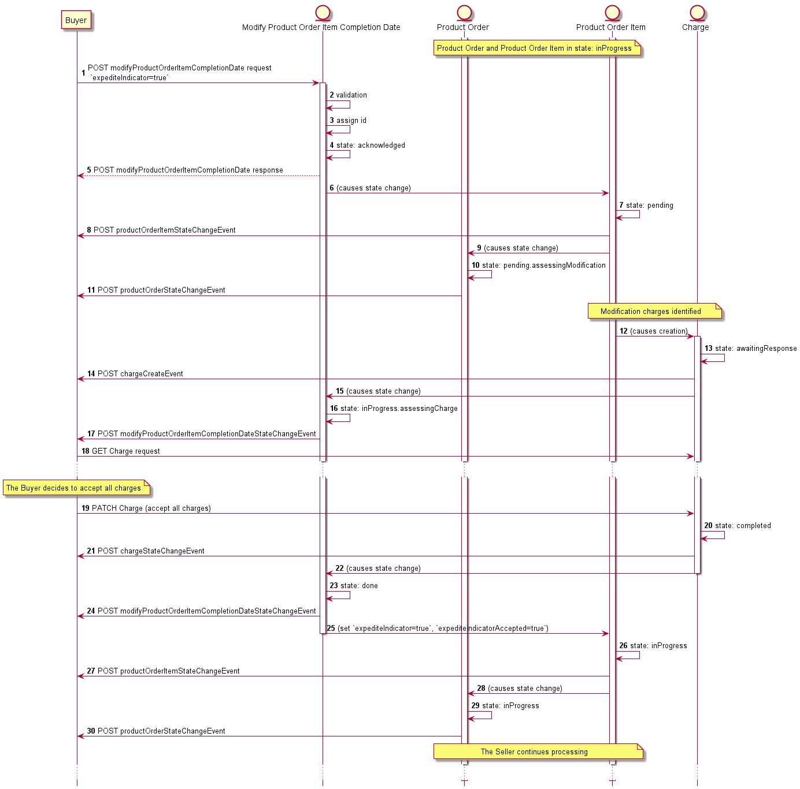

**Figure 26. Use case 11b: Initiate Charge Associated to Modify Product Order
Item Requested Delivery Date Flow**

- The Seller identifies one or more charges associated with a
  `modifyProductOrderItemRequestedDeliveryDate` request. A `Charge` process is
  initiated by the Seller **(12,13)** and a `chargeCreateEvent` is sent by the
  Seller **(14)**.
- The referenced `modifyProductOrderItemRequestedDeliveryDate` moves to the
  `inProgress.assessingCharge` state **(15,16)** (until a response is received
  from the Buyer or the `responseDueDate` expires).
- The Buyer queries for the details of the `Charge` **(18)**.
- The Buyer accepts each `ChargeItem` contained within the `Charge` **(19)**.
- The Seller changes the state of the `Charge` to `completed` **(20)** and the
  referenced `modifyProductOrderItemRequestedDeliveryDate` state to `done`
  **(22,23)**.
- The Seller updates the `expediteIndicator` and `expediteIndicatorAccepted`
  **(25)** and changes the `ProductOrderItem` and `ProductOrder` states back to
  `inProgress` **(26,28,29)**.

### 6.11.3 Use case 11c: Initiate Charge Associated to Cancel Product Order

In this case, the Charges are identified as a result of a Cancel Product Order
request. The model and states have been described earlier. The sequence diagram
below presents a Charge use case together with a context of the Use Case 8:
Cancel Product Order

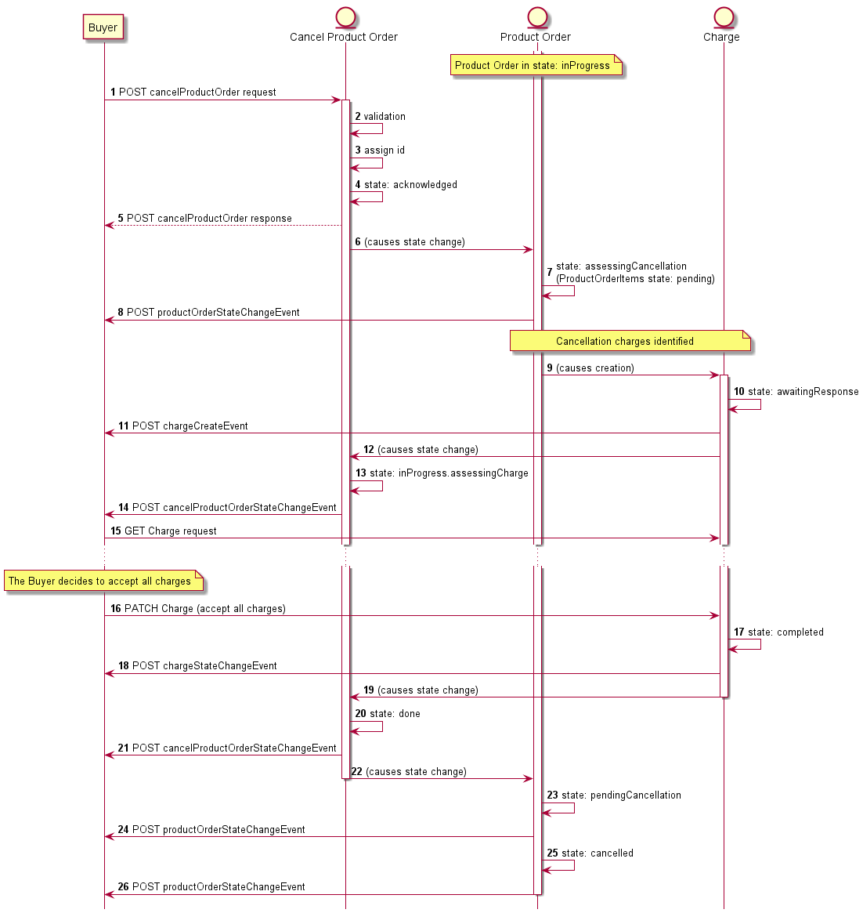

**Figure 27. Use case 11c: Initiate Charge Associated to Cancel Product Order
Flow**

- The Seller identifies one or more charges associated with a
  `CancelProductOrder` request. A `Charge` process is initiated by the Seller
  in `awaitingResponse` state **(9,10)** and a `chargeCreateEvent` is sent by
  the Seller **(11)**.
- The referenced `CancelProductOrder` moves to the `assessingCharge` state
  **(12,13)** (until a response is received from the Buyer or the
  `responseDueDate` expires).
- The Buyer queries for the details of the `Charge` **(15)**.
- The Buyer accepts each `ChargeItem` contained within the `Charge` **(16)**.
- The Seller changes the state of the `Charge` to `completed` **(17)** and the
  referenced `CancelProductOrder` state to `done` **(19,20)**.
- The referenced `ProductOrder.state` is set to `pendingCancellation`
  **(22,23)**.
- Once the Seller has completed the cancellation process, the referenced
  `ProductOrder.state` is changed to `cancelled` **(25)**.

## 6.12. Use case 12: Respond to Charge

The Buyer must respond to a Charge initiated by the Seller with the use of a
`PATCH /charge/{{id}}` operation. The model for this case is in Figure 22
[section 6.11](#611-use-case-11-initiate-charge)

The PATCH usage recommendation follows TMF 622 json/merge
(https://tools.ietf.org/html/rfc7386).

Below is an example of such a Charge response - PATCH request:

```json
{
  "chargeItem": [
    {
      "id": "item-001",
      "acceptanceIndicator": "accepted"
    }
  ]
}
```

**[R94]** The Buyer's response to the Charge **MUST** update the
`acceptanceIndicator` for each and every Charge Item included in the Charge.
[MEF57.2 R90]

**[R95]** The Buyer **MUST** update all Charge Items included in a Charge at
once. [MEF57.2 R91]

**[O16]** The Buyer **MAY** add notes to Charge Items by appending the existing
`note` list with a new item. [MEF57.2 O14]

**[R96]** If there is no response received by the `responseDueDate` is passed
the Seller **MUST** treat all Charge Items as `declinedByBuyer` and put the
Charge in `timeout` state. [MEF57.2 R92]

**[R97]** Once a Charge Item has been accepted by the Buyer, the Seller **MUST
NOT** withdraw or modify the Charge Item. [MEF57.2 R124]

If in Use Case 11a the Buyer rejects a Charge Item that is identified as
Blocking, the Seller changes the state of the Charge to `completed`, changes
the referenced Product Order Item state to `failed`, and changes any Product
Order Items related to the referenced Product Order Item to `failed`.

If in Use Case 11b the Buyer rejects a Blocking Charge Item, the Seller changes
the state of the Charge to `complete` and changes the referenced Modify Product
Order Item Requested Delivery Date state to `declined`. No modification to the
Product Order Item is Performed.

If in Use Case 11c the Buyer rejects a Blocking Charge Item, the Seller changes
the state of the Charge to `complete` and changes the referenced Cancel Product
Order state to `declined`, and returns the Product Order to `inProgress`. The
Product Order is not cancelled.

## 6.13. Use case 13: Retrieve List of Charges

The Buyer can retrieve a list of `Charges` by using a `GET /charge` operation
with desired filtering criteria.

**[O17]** The Buyer's request **MAY** contain none or any of the following
attributes: [MEF57.2 O20]

- `productOrderId`
- `productOrderItemId`
- `creationDate.gt`
- `creationDate.lt`
- `responseDueDate.gt`
- `responseDueDate.lt`
- `state`

The rules of using pagination and an example request are provided in
[section 6.3](#63-use-case-3-retrieve-list-of-product-orders). Please refer to
it as the rules also apply to this case.

**[R98]** The Seller must put the following attributes into the response (if
set): [MEF57.2 R116]:

- `id`
- `productOrder` or `productOrderItem`
- `state`
- `creationDate`
- `responseDueDate`

**[R99]** In case no items matching the criteria are found, the Seller **MUST**
return a valid response with an empty list. [MEF57.2 R115]

## 6.14. Use case 14: Retrieve Charge by Charge Identifier

The Buyer can get detailed information about the Charge communicated by the
Seller by using a `GET /charge/{{id}}` operation.

**[R100]** The Seller's response **MUST** provide the following Charge
attributes (if set): [MEF57.2 R119]

- `id`
- `chargeItem`
- `creationDate`
- `responseDueDate`
- `state`
- `productOrder` or `productOrderItem`
- `cancelProductOrder`
- `modifyProductOrderItemRequestedDeliveryDate`

## 6.15. Use case 15: Register for Notifications

The Seller communicates with the Buyer with Notifications provided that:

- both Seller and Buyer support notification mechanism
- Buyer has registered to receive notifications from the Seller

To register for notifications the Buyer uses the `registerListener` operation
from the API: `POST /hub`. The request model contains only 2 attributes:

- `callback` - mandatory, to provide the callback address the events will be
  notified to,
- `query` - optional, to provide the required types of event.

The usage of a combination of these attributes fulfills the [MEF57.2 CR7<O21],
and [MEF57.2 CR8<O21] requirements.

The figure below shows all entities involved in the Notification use cases.

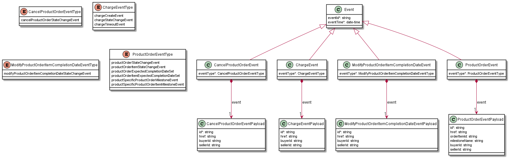

**Figure 28. Product Order Management Notification Data Model**

By using a simple request:

```json
{
  "callback": "https://buyer.com/listenerEndpoint"
}
```

The Buyer subscribes for notification of all types of events. Those are:

- `productOrderStateChangeEvent`
- `productOrderItemStateChangeEvent`
- `productSpecificProductOrderItemMilestoneEvent`
- `productOrderItemExpectedCompletionDateSetEvent`
- `cancelProductOrderStateChangeEvent`
- `chargeCreateEvent`
- `chargeStateChangeEvent`
- `chargeTimeoutEvent`
- `modifyProductOrderItemRequestedDeliveryDateStateChangeEvent`

If the Buyer wishes to receive only notification of a certain type, a `query`
must be added:

```json
{
  "callback": "https://buyer.com/listenerEndpoint",
  "query": "eventType=productOrderStateChangeEvent"
}
```

If the Buyer wishes to subscribe to 2 different types of events, there are 2
possible syntax variants [[TMF630](#8-references)]:

```
eventType=productOrderStateChangeEvent,chargeCreateEvent
```

or

```
eventType=productOrderStateChangeEvent&eventType=chargeCreateEvent
```

The `query` formatting complies to RFC3986 [RFC3986](#8-references). According
to it, every attribute defined in the Event model (from notification API) can
be used in the `query`. However, this standard requires only `eventType`
attribute to be supported.

**[O18]** The Seller **MAY** support registration for Notifications other than
`chargeCreateEvent`. [MEF57.2 O21]

**[R101]** `eventType` is the only attribute that the Seller **MUST** support
in the query.

If any of Charge related use cases are supported, the following 2 requirements
apply:

**[R102]** The Seller **MUST** support `chargeCreateEvent` notifications.
[MEF57.2 R120]

**[R103]** The Buyer **MUST** subscribe to `chargeCreateEvent` notifications.
[MEF57.2 R121]

The Seller responds to the subscription request by adding the `id` of the
subscription to the message that must be further used for unsubscribing.

```json
{
  "id": "00000000-0000-0000-0000-000000000678",
  "callback": "https://buyer.com/listenerEndpoint",
  "query": "eventType=productOrderStateChangeEvent"
}
```

Example of a final address that the Notifications will be sent to (for Sonata,
`productOrderStateChangeEvent`):

- `https://buyer.com/listenerEndpoint/mefApi/sonata/productOrderingNotification/v10/listener/productOrderStateChangeEvent`

## 6.16. Use case 16: Send Notification

Notifications are used to asynchronously inform the Buyer about the respective
objects and attributes changes. The Seller's synchronous response to a Product
Order, Cancel Product Order, and Modify Product Order Item Requested Delivery
Date create requests are considered to act as a Create Notification so there is
no explicit respective Create Notification type. The next notification must be
sent when the `state` changes compared to the previously sent one.

For sake of readability, all previous flow diagrams presented only cases of
using only the `productOrderStateChangeEvent`. Figure 29 presents the
end-to-end sequence of communication in Use Case 1 - Create Product Order with
Buyer's subscription to both `productOrderStateChangeEvent` and
`productOrderItemStateChangeEvent` event types.

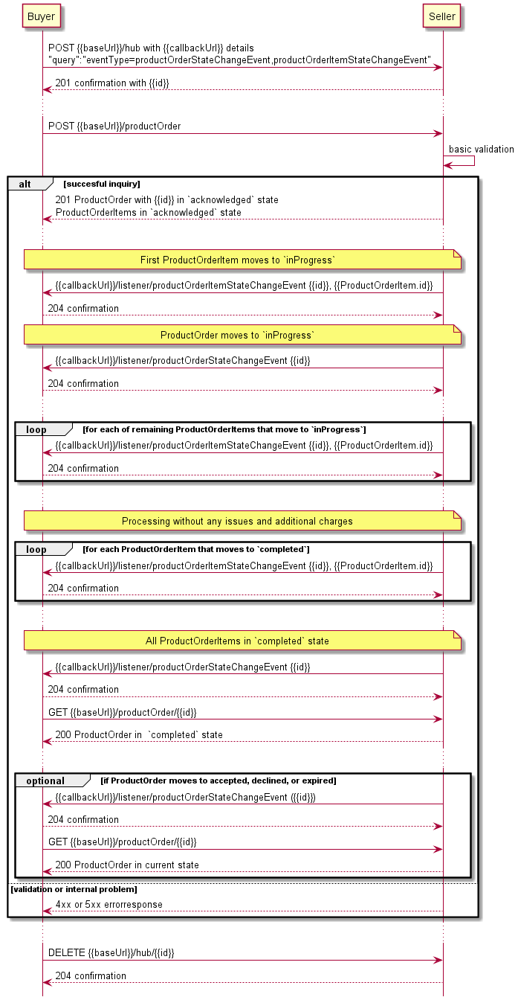

**Figure 29. Use Case 1 - Create Product Order with Product Order Item
Notifications**

After a successful Notification subscription, the Buyer sends a Product Order
create request. The Seller responds with Product Order and all items in
`acknowledged` state. When the first Product Order Item moves to `inProgress`,
a `productOrderItemStateChangeEvent` is sent. Immediately the Product Order
also changes its state to `inProgress` and the `productOrderStateChangeEvent`
is sent. Then the rest (if any) of the Product Order Items are processed. Let's
assume that no additional charges were found and the process ends smoothly.
When particular items are done processing they reach the `completed` state.
Once all are successfully done, the Product Order also changes state to
`completed`. The Buyer will likely now ask for the Product Order details.

The events are sent only after a synchronous response to the Product Order
create request was provided. Thus there must be no state change notifications
set for Product Order and Product Order Items reaching the `acknowledged`
state.

**[R104]** The Seller **MUST NOT** send Notifications to Buyers who have not
registered for them. [MEF57.2 R122]

**[R105]** The Seller **MUST** send Notifications to Buyers who have registered
for them. [MEF57.2 R123]

Following snippets present example of `productOrderStateChangeEvent` and
`productOrderItemStateChangeEvent`:

```json
{
  "eventId": "event-001",
  "eventType": "productOrderStateChangeEvent",
  "eventTime": "2021-06-02T00:00:00.000Z",
  "event": {
    "id": "00000000-1111-2222-3333-000000000123"
  }
}
```

**[R106]** An event triggered by the Product Order Item
(`productOrderItemStateChangeEvent`,
`productOrderItemExpectedCompletionDateSet`,
`productSpecificProductOrderItemMilestoneEvent`) **MUST** additionally contain
the relative `orderItemId`. [MEF57.2 R124]

**[O19]** The Seller **MAY** support
`productSpecificProductOrderItemMilestoneEvent`. [MEF57.2 O22]

**[CR7]<[O19]** If the Seller supports Milestones, the
`productSpecificProductOrderItemMilestoneEvent` must have the `milestoneName`
attribute set. [MEF57.2 R124]

**[CR8]<[O19]** If the Seller supports Milestones, the Seller **MUST** store
the Milestone history in `milestone` attribute. [MEF57.2 CR9<O22]

```json
{
  "eventId": "event-002",
  "eventType": "productOrderItemStateChangeEvent",
  "eventTime": "2021-06-02T00:00:00.000Z",
  "event": {
    "id": "00000000-1111-2222-3333-000000000123",
    "orderItemId": "item-001"
  }
}
```

**_Note_**: the body of the event carries only the source object's `id`. The
Buyer needs to query it later by `id` to get details.

To stop receiving events, the Buyer has to use the `unregisterListener`
operation from the `DELETE /hub/{id}` endpoint. The `id` is the identifier
received from the Seller during the listener registration.

<div class="page"/>

# 7. API Details

## 7.1. API patterns

### 7.1.1. Indicating errors

Erroneous situations are indicated by appropriate HTTP responses. An error
response is indicated by HTTP status 4xx (for client errors) or 5xx (for server
errors) and appropriate response payload. The Product Order API uses the error
responses as depicted and described below.

Implementations can use HTTP error codes not specified in this standard in
compliance with rules defined in RFC 7231 [[RFC7231](#8-references)]. In such a
case, the error message body structure might be aligned with the `Error`.


**Figure 30. Data model types to represent an erroneous response**

#### 7.1.1.1. Type Error

**Description:** Standard Class used to describe API response error Not
intended to be used directly. The `code` in the HTTP header is used as a
discriminator for the type of error returned in runtime.

<table id="T_Error">
    <thead style="font-weight:bold;">
        <tr>
            <td>Name</td>
            <td>Type</td>
            <td>Description</td>
        </tr>
    </thead>
    <tbody>
        <tr>
            <td>message</td>
            <td>string</td>
            <td>Text that provides mode details and corrective actions related to the error. This can be shown to a client user.</td>
        </tr><tr>
            <td>reason*</td>
            <td>string</td>
            <td>Text that explains the reason for the error. This can be shown to a client user.</td>
        </tr><tr>
            <td>referenceError</td>
            <td>uri</td>
            <td>URL pointing to documentation describing the error</td>
        </tr>
    </tbody>
</table>

#### 7.1.1.2. Type Error400

**Description:** Bad Request.
(https://tools.ietf.org/html/rfc7231#section-6.5.1)

Inherits from:

- <a href="#T_Error">Error</a>

<table id="T_Error400">
    <thead style="font-weight:bold;">
        <tr>
            <td>Name</td>
            <td>Type</td>
            <td>Description</td>
        </tr>
    </thead>
    <tbody>
        <tr>
            <td>code*</td>
            <td><a href="#T_Error400Code">Error400Code</a></td>
            <td>One of the following error codes:</br>
- missingQueryParameter: The URI is missing a required query-string parameter</br>
- missingQueryValue: The URI is missing a required query-string parameter value</br>
- invalidQuery: The query section of the URI is invalid.</br>
- invalidBody: The request has an invalid body</td>
        </tr>
    </tbody>
</table>

#### 7.1.1.3. `enum` Error400Code

**Description:** One of the following error codes:

- missingQueryParameter: The URI is missing a required query-string parameter
- missingQueryValue: The URI is missing a required query-string parameter value
- invalidQuery: The query section of the URI is invalid.
- invalidBody: The request has an invalid body

#### 7.1.1.4. Type Error401

**Description:** Unauthorized.
(https://tools.ietf.org/html/rfc7235#section-3.1)

Inherits from:

- <a href="#T_Error">Error</a>

<table id="T_Error401">
    <thead style="font-weight:bold;">
        <tr>
            <td>Name</td>
            <td>Type</td>
            <td>Description</td>
        </tr>
    </thead>
    <tbody>
        <tr>
            <td>code*</td>
            <td><a href="#T_Error401Code">Error401Code</a></td>
            <td>One of the following error codes:</br>
- missingCredentials: No credentials provided.</br>
- invalidCredentials: Provided credentials are invalid or expired</td>
        </tr>
    </tbody>
</table>

#### 7.1.1.5. `enum` Error401Code

**Description:** One of the following error codes:

- missingCredentials: No credentials provided.
- invalidCredentials: Provided credentials are invalid or expired

#### 7.1.1.6. Type Error403

**Description:** Forbidden. This code indicates that the server understood the
request but refuses to authorize it.
(https://tools.ietf.org/html/rfc7231#section-6.5.3)

Inherits from:

- <a href="#T_Error">Error</a>

<table id="T_Error403">
    <thead style="font-weight:bold;">
        <tr>
            <td>Name</td>
            <td>Type</td>
            <td>Description</td>
        </tr>
    </thead>
    <tbody>
        <tr>
            <td>code*</td>
            <td><a href="#T_Error403Code">Error403Code</a></td>
            <td>This code indicates that the server understood
the request but refuses to authorize it because
of one of the following error codes:</br>
- accessDenied: Access denied</br>
- forbiddenRequester: Forbidden requester</br>
- tooManyUsers: Too many users</td>
        </tr>
    </tbody>
</table>

#### 7.1.1.7. `enum` Error403Code

**Description:** This code indicates that the server understood the request but
refuses to authorize it because of one of the following error codes:

- accessDenied: Access denied
- forbiddenRequester: Forbidden requester
- tooManyUsers: Too many users

#### 7.1.1.8. Type Error404

**Description:** Resource for the requested path not found.
(https://tools.ietf.org/html/rfc7231#section-6.5.4)

Inherits from:

- <a href="#T_Error">Error</a>

<table id="T_Error404">
    <thead style="font-weight:bold;">
        <tr>
            <td>Name</td>
            <td>Type</td>
            <td>Description</td>
        </tr>
    </thead>
    <tbody>
        <tr>
            <td>code*</td>
            <td>string</td>
            <td>The following error code:<br/>
- notFound: A current representation for the target resource not found</td>
        </tr>
    </tbody>
</table>

#### 7.1.1.9. Type Error409

**Description:** Conflict
(https://datatracker.ietf.org/doc/html/rfc7231#section-6.5.8)

Inherits from:

- <a href="#T_Error">Error</a>

<table id="T_Error409">
    <thead style="font-weight:bold;">
        <tr>
            <td>Name</td>
            <td>Type</td>
            <td>Description</td>
        </tr>
    </thead>
    <tbody>
        <tr>
            <td>code*</td>
            <td>string</td>
            <td>The following error code:
- conflict: The client has provided a value whose semantics are not appropriate for the property.</td>
        </tr>
    </tbody>
</table>

#### 7.1.1.10. Type Error422

The response for HTTP status `422` is a list of elements that are structured
using the `Error422` data type. Each list item describes a business validation
problem. This type introduces the `propertyPath` attribute which points to the
erroneous property of the request, so that the Buyer may fix it easier. It is
highly recommended that this property should be used, yet remains optional
because it might be hard to implement.

**Description:** Unprocessable entity due to a business validation problem.
(https://tools.ietf.org/html/rfc4918#section-11.2)

Inherits from:

- <a href="#T_Error">Error</a>

<table id="T_Error422">
    <thead style="font-weight:bold;">
        <tr>
            <td>Name</td>
            <td>Type</td>
            <td>Description</td>
        </tr>
    </thead>
    <tbody>
        <tr>
            <td>code*</td>
            <td><a href="#T_Error422Code">Error422Code</a></td>
            <td>One of the following error codes:</br>
  - missingProperty: The property the Seller has expected is not present in the payload</br>
  - invalidValue: The property has an incorrect value</br>
  - invalidFormat: The property value does not comply with the expected value format</br>
  - referenceNotFound: The object referenced by the property cannot be identified in the Seller system</br>
  - unexpectedProperty: Additional property, not expected by the Seller has been provided</br>
  - tooManyRecords: the number of records to be provided in the response exceeds the Seller's threshold.</br>
  - otherIssue: Other problem was identified (detailed information provided in a reason)
</td>
        </tr><tr>
            <td>propertyPath</td>
            <td>string</td>
            <td>A pointer to a particular property of the payload that caused the validation issue. It is highly recommended that this property should be used.
Defined using JavaScript Object Notation (JSON) Pointer (https://tools.ietf.org/html/rfc6901).
</td>
        </tr>
    </tbody>
</table>

#### 7.1.1.11. `enum` Error422Code

**Description:** One of the following error codes:

- missingProperty: The property the Seller has expected is not present in the
  payload
- invalidValue: The property has an incorrect value
- invalidFormat: The property value does not comply with the expected value
  format
- referenceNotFound: The object referenced by the property cannot be identified
  in the Seller system
- unexpectedProperty: Additional property, not expected by the Seller has been
  provided
- tooManyRecords: the number of records to be provided in the response exceeds
  the Seller's threshold.
- otherIssue: Other problem was identified (detailed information provided in a
  reason)

#### 7.1.1.12. Type Error500

**Description:** Internal Server Error.
(https://tools.ietf.org/html/rfc7231#section-6.6.1)

Inherits from:

- <a href="#T_Error">Error</a>

<table id="T_Error500">
    <thead style="font-weight:bold;">
        <tr>
            <td>Name</td>
            <td>Type</td>
            <td>Description</td>
        </tr>
    </thead>
    <tbody>
        <tr>
            <td>code*</td>
            <td>string</td>
            <td>The following error code:<br/>
- internalError: Internal server error - the server encountered an unexpected condition that prevented it from fulfilling the request.</td>
        </tr>
    </tbody>
</table>

#### 7.1.1.13. Type Error501

**Description:** Not Implemented. Used in case Seller is not supporting an
optional operation (https://tools.ietf.org/html/rfc7231#section-6.6.2)

Inherits from:

- <a href="#T_Error">Error</a>

<table id="T_Error501">
    <thead style="font-weight:bold;">
        <tr>
            <td>Name</td>
            <td>Type</td>
            <td>Description</td>
        </tr>
    </thead>
    <tbody>
        <tr>
            <td>code*</td>
            <td>string</td>
            <td>The following error code:<br/>
- notImplemented: Method not supported by the server</td>
        </tr>
    </tbody>
</table>

### 7.1.2. Response pagination

A response to retrieve a list of results (e.g.
`GET /productOfferingQualification`) can be paginated. The Buyer can specify
following query attributes related to pagination:

- `limit` - number of expected list items
- `offset` - offset of the first element in the result list

The Seller returns a list of elements that comply with the requested `limit`.
If the requested `limit` is higher than the supported list size the smaller
list result is returned. In that case, the size of the result is returned in
the header attribute `X-Result-Count`. The Seller can indicate that there are
additional results available using:

- `X-Total-Count` header attribute with the total number of available results
- `X-Pagination-Throttled` header set to `true`

**[R107]** Seller **MUST** use either `X-Total-Count` or
`X-Pagination-Throttled` to indicate that the page was truncated and additional
results are available.

## 7.2. Management API Data model

Figure 31 presents the whole Product Order Management data model. The data
types, requirements related to them and mapping to MEF 57.2 specification are
discussed later in this section.

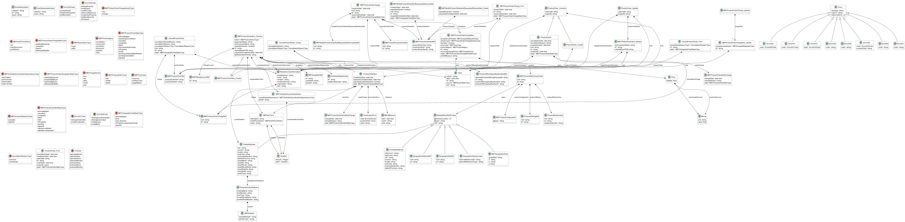

**Figure 31. Product Order Management Data Model**

### 7.2.1. ProductOrder

#### 7.2.1.1 Type ProductOrder_Common

**Description:** A Product Order is a type of order which can be used to place
an order between a customer and a service provider or between a service
provider and a partner and vice versa,

<table id="T_ProductOrder_Common">
    <thead style="font-weight:bold;">
        <tr>
            <td>Name</td>
            <td>Type</td>
            <td>Description</td>
            <td>MEF 57.2</td>
        </tr>
    </thead>
    <tbody>
        <tr>
            <td>externalId</td>
            <td>string</td>
            <td>An identifier for this order within the Buyer&#x27;s enterprise.</td>
            <td>Buyer Product Order Identifier</td>
        </tr><tr>
            <td>note</td>
            <td><a href="#T_Note">Note</a>[]</td>
            <td>Free form text to clarify or explain the Product Order. Only new notes can be entered. The Buyer and Seller cannot modify an existing Note. The Buyer creates a Note when creating the Product Order or when updating it. The Seller may add notes at any time.
</td>
            <td>Note</td>
        </tr><tr>
            <td>projectId</td>
            <td>string</td>
            <td>An identifier that is used to group Product Orders that is important to the Buyer. A projectId can be used to relate multiple Product Orders together.</td>
            <td>Project Identifier</td>
        </tr><tr>
            <td>relatedContactInformation*</td>
            <td><a href="#T_RelatedContactInformation">RelatedContactInformation</a>[]</td>
            <td>Contact information of an individual or organization playing a role in this context.
(e.g. Product Order Contact: role&#x3D;productOrderContact;
Seller Contact: role&#x3D;sellerContact)
Providing the Product Order Contact in the request is mandatory.</td>
            <td>Product Order Contact, Seller Contact</td>
        </tr>
    </tbody>
</table>

#### 7.2.1.2. Type ProductOrder_Create

**Description:** A Product Order is a type of order which can be used to place
an order between a customer and a service provider or between a service
provider and a partner and vice versa, Skipped properties:
id,href,completionDate,orderDate,state,stateChange,cancellationDate,cancellationReason

Inherits from:

- <a href="#T_ProductOrder_Common">ProductOrder_Common</a>

<table id="T_ProductOrder_Create">
    <thead style="font-weight:bold;">
        <tr>
            <td>Name</td>
            <td>Type</td>
            <td>Description</td>
            <td>MEF 57.2</td>
        </tr>
    </thead>
    <tbody>
        <tr>
            <td>productOrderItem*</td>
            <td><a href="#T_MEFProductOrderItem_Create">MEFProductOrderItem_Create</a>[]</td>
            <td>Items contained in the Product Order.
</td>
            <td>Product Order Item</td>
        </tr>
    </tbody>
</table>

#### 7.2.1.3. Type ProductOrder

**Description:** A Product Order is a type of order which can be used to place
an order between a customer and a service provider or between a service
provider and a partner and vice versa

Inherits from:

- <a href="#T_ProductOrder_Common">ProductOrder_Common</a>

<table id="T_ProductOrder">
    <thead style="font-weight:bold;">
        <tr>
            <td>Name</td>
            <td>Type</td>
            <td>Description</td>
            <td>MEF 57.2</td>
        </tr>
    </thead>
    <tbody>
        <tr>
            <td>cancellationCharge</td>
            <td><a href="#T_MEFProductOrderChargeRef">MEFProductOrderChargeRef</a>[]</td>
            <td>Charges associated with cancelling the Product Order</td>
            <td>Cancel Product Order Charge</td>
        </tr><tr>
            <td>cancellationDate</td>
            <td>date-time</td>
            <td>Identifies the date the Seller cancelled the Order. Set by Seller when the Order is moved to the cancelled state.</td>
            <td>Product Order Cancellation Date</td>
        </tr><tr>
            <td>cancellationReason</td>
            <td>string</td>
            <td>An optional free-form text field for the Seller to provide additional information regarding the reason for the cancellation. If the Seller cancels the Product Order, the Seller provides the reason. If the Buyer requests the cancellation, the Seller copies the reason provided by the Buyer from the Cancel Product Order request.</td>
            <td>Cancellation Reason</td>
        </tr><tr>
            <td>completionDate</td>
            <td>date-time</td>
            <td>Identifies the date that all Product Order Items within the Order have reached a terminal state. No further action is permitted on the Product Order.</td>
            <td>Product Order Final State Date</td>
        </tr><tr>
            <td>href</td>
            <td>string</td>
            <td>Hyperlink to access the order</td>
            <td>Not represented in MEF 57.2</td>
        </tr><tr>
            <td>id*</td>
            <td>string</td>
            <td>Unique identifier for the Product Order that is generated by the Seller when the Product Order is initially accepted via an API.</td>
            <td>Product Order Identifier</td>
        </tr><tr>
            <td>orderDate*</td>
            <td>date-time</td>
            <td>Date when the Product Order was created in the Seller&#x27;s system and a Product Order Identifier was assigned</td>
            <td>Product Order Create Date</td>
        </tr><tr>
            <td>productOrderItem*</td>
            <td><a href="#T_ProductOrderItem">ProductOrderItem</a>[]</td>
            <td>Items contained in the Product Order.
</td>
            <td>Product Order Item</td>
        </tr><tr>
            <td>state*</td>
            <td><a href="#T_MEFProductOrderStateType">MEFProductOrderStateType</a></td>
            <td>The states as defined by TMF622 and extended to meet MEF requirements. These states are used to convey the Product Order status during the lifecycle of the Product Order.</td>
            <td>Product Order State</td>
        </tr><tr>
            <td>stateChange</td>
            <td><a href="#T_MEFProductOrderStateChange">MEFProductOrderStateChange</a>[]</td>
            <td>State change for the Product Order</td>
            <td>Not represented in MEF 57.2</td>
        </tr>
    </tbody>
</table>

#### 7.2.1.4. Type ProductOrder_Update

**Description:** A request initiated by the Buyer to update Product Order
and/or Product

<table id="T_ProductOrder_Update">
    <thead style="font-weight:bold;">
        <tr>
            <td>Name</td>
            <td>Type</td>
            <td>Description</td>
            <td>MEF 57.2</td>
        </tr>
    </thead>
    <tbody>
        <tr>
            <td>externalId</td>
            <td>string</td>
            <td>An identifier for this Product Order within the Buyer&#x27;s enterprise.</td>
            <td>Not represented in MEF 57.2</td>
        </tr><tr>
            <td>note</td>
            <td><a href="#T_Note">Note</a>[]</td>
            <td>Free form text to clarify or explain the Product Order. Only new notes can be entered. The Buyer and Seller cannot modify an existing Note. The Buyer creates a Note when creating the Product Order or when updating it. The Seller may add notes at any time.
</td>
            <td>Note</td>
        </tr><tr>
            <td>productOrderItem</td>
            <td><a href="#T_MEFProductOrderItem_Update">MEFProductOrderItem_Update</a>[]</td>
            <td>Order Item attributes that may be updated
</td>
            <td>Product Order Item</td>
        </tr><tr>
            <td>projectId</td>
            <td>string</td>
            <td>An identifier that is used to group Product Orders that is important to the Buyer. A projectId can be used to relate multiple Product Orders together.</td>
            <td>Project Identifier</td>
        </tr><tr>
            <td>relatedContactInformation</td>
            <td><a href="#T_RelatedContactInformation">RelatedContactInformation</a>[]</td>
            <td>Contact information of an individual or organization playing a role in this context. The Buyer is allowed to update the Product Order Contact: role&#x3D;productOrderContact;
</td>
            <td>Product Order Contact, Seller Contact</td>
        </tr>
    </tbody>
</table>

#### 7.2.1.5. Type ProductOrder_Find

**Description:** Structure to define GET without id response. A list of
productOrder matching request criteria. Provides Product order summary view.

<table id="T_ProductOrder_Find">
    <thead style="font-weight:bold;">
        <tr>
            <td>Name</td>
            <td>Type</td>
            <td>Description</td>
            <td>MEF 57.2</td>
        </tr>
    </thead>
    <tbody>
        <tr>
            <td>cancellationDate</td>
            <td>date-time</td>
            <td>Identifies the date the Seller cancelled the Order. Set by Seller when the Order is moved to the cancelled state.</td>
            <td>Not represented in MEF 57.2</td>
        </tr><tr>
            <td>completionDate</td>
            <td>date-time</td>
            <td>Identifies the date that all Product Order Items within the Order have reached a terminal state. No further action is permitted on the Product Order after this notification.</td>
            <td>Product Order Cancellation Date</td>
        </tr><tr>
            <td>externalId</td>
            <td>string</td>
            <td>ID given by the consumer and only understandable by him (to facilitate his searches afterward).</td>
            <td>Buyer Product Order Identifier</td>
        </tr><tr>
            <td>id*</td>
            <td>string</td>
            <td>Unique identifier for the order that is generated by the Seller when the order is initially accepted via an API.</td>
            <td>Product Order Identifier</td>
        </tr><tr>
            <td>orderDate*</td>
            <td>date-time</td>
            <td>Date when the Product Order was created</td>
            <td>Product Order Create Date</td>
        </tr><tr>
            <td>projectId</td>
            <td>string</td>
            <td>An identifier that is used to group Product Orders that is important to the Buyer. A projectId can be used to relate multiple Product Orders together.</td>
            <td>Project Identifier</td>
        </tr><tr>
            <td>state*</td>
            <td><a href="#T_MEFProductOrderStateType">MEFProductOrderStateType</a></td>
            <td>The states as defined by TMF622 and extended to meet MEF requirements. These states are used to convey the Product Order status during the lifecycle of the Product Order.</td>
            <td>Product Order State</td>
        </tr>
    </tbody>
</table>

#### 7.2.1.6. `enum` MEFProductOrderStateType

**Description:** Possible values for the state of the Product Order The
following mapping has been used between `MEFProductOrderStateType` and MEF
57.2:

| state                           | MEF 57.2 name          | Description                                                                                                                                                                                                                                                                                                                                                                                                                                                                                                                                                                                                                                                                                                                                                                              |
| ------------------------------- | ---------------------- | ---------------------------------------------------------------------------------------------------------------------------------------------------------------------------------------------------------------------------------------------------------------------------------------------------------------------------------------------------------------------------------------------------------------------------------------------------------------------------------------------------------------------------------------------------------------------------------------------------------------------------------------------------------------------------------------------------------------------------------------------------------------------------------------- |
| `acknowledged`                  | ACKNOWLEDGED           | A Product Order has been received by the Seller and has passed basic validation. A `productOrder.id` is assigned in the `acknowledged` state and a response is returned to the Buyer. The Product Order remains in the `acknowledged` state while validations of Product Order and Product Order Item(s) attributes as applicable is completed. If the Product Order and Product Order Item attributes are validated the Product Order moves to the `inProgress` state. If not validated, the Product Order moves to the `rejected` state.                                                                                                                                                                                                                                               |
| `assessingCancellation`         | ASSESSING_CANCELLATION | A Cancel Product Order request has been received by the Seller. The Product Order is being assessed to determine if the Product Order can be cancelled. If there are charges associated with cancelling the Product Order, these are communicated to the Buyer using the Charge process. The Product Order remains in the `assessingCancellation` state until any relevant Charge is completed or withdrawn by the Seller. Once the Buyer's Cancel Product Order request has been validated and any associated Charges completed, the Product Order moves to the `pendingCancellation` state. If the request is not validated or if any associated Charges are not completed, the Product Order moves to the `inProgress` state and the Product Order is not cancelled.                  |
| `held.assessingCharge`          | ASSESSING_CHARGE       | A Charge has been initiated by the Seller that is not the result of a Modify Product Order Item Requested Delivery Date or Cancel Product Order request and the Seller is awaiting a Buyer response to the Charge. If a blocking or non-blocking charge is accepted by the Buyer, the Product Order moves to `inProgress`. If a non-blocking charge is declined by the Buyer, the Product Order moves to `inProgress`. If a blocking charge is declined by the Buyer and there are no unrelated Product Order Items in the Product Order, the Product Order moves to the `inProgress` and then to the `failed` state. If a blocking charge is declined by the Buyer and there are unrelated Product Order Items in the Product Order, the Product Order moves to the `inProgress` state. |
| `pending.assessingModification` | ASSESSING_MODIFICATION | A request has been made by the Buyer to modify either the `expediteIndicator` or the `requestedCompletionDate` of a Product Order Item. The Product Order Item is currently being assessed to determine whether the Modify Product Order Item Requested Delivery Date is valid. If there is a charge associated with the Modify Product Order Item Requested Delivery Date, the Product Order remains in the `pending.assessingModification` state until the Charge is completed or withdrawn by the Seller. Once the Buyer's request has been validated and any associated Charges completed, the Product Order returns to the `inProgress` state.                                                                                                                                      |
| `cancelled`                     | CANCELLED              | The Product Order has been successfully cancelled. This is a terminal state.                                                                                                                                                                                                                                                                                                                                                                                                                                                                                                                                                                                                                                                                                                             |
| `pendingCancellation`           | CANCELLING             | The Buyer's Cancel Request has been assessed and it has been determined that it is feasible to proceed with the cancellation. This state can also result from a Seller cancelling the Product Order within their systems without a request from the Buyer.                                                                                                                                                                                                                                                                                                                                                                                                                                                                                                                               |
| `completed`                     | COMPLETED              | The Product Order has completed fulfillment and the Product is now active. This is a terminal state                                                                                                                                                                                                                                                                                                                                                                                                                                                                                                                                                                                                                                                                                      |
| `failed`                        | FAILED                 | All Product Order Items have failed which results in the entire Product Order failing. This is a terminal state.                                                                                                                                                                                                                                                                                                                                                                                                                                                                                                                                                                                                                                                                         |
| `inProgress`                    | IN_PROGRESS            | The Product Order has been successfully validated, and fulfillment has started.                                                                                                                                                                                                                                                                                                                                                                                                                                                                                                                                                                                                                                                                                                          |
| `partial`                       | PARTIAL                | Fulfillment of at least one Product Order Item has failed, and fulfillment of at least one Product Order Item has been successful. This is a terminal state.                                                                                                                                                                                                                                                                                                                                                                                                                                                                                                                                                                                                                             |
| `rejected`                      | REJECTED               | A Product Order was submitted, and it has failed at least one of the validation checks the Seller performs after it reached the `acknowledged` state                                                                                                                                                                                                                                                                                                                                                                                                                                                                                                                                                                                                                                     |

#### 7.2.1.7. Type MEFProductOrderStateChange

**Description:** Holds the State notification reasons and associated date the
State changed, populated by the server

<table id="T_MEFProductOrderStateChange">
    <thead style="font-weight:bold;">
        <tr>
            <td>Name</td>
            <td>Type</td>
            <td>Description</td>
            <td>MEF 57.2</td>
        </tr>
    </thead>
    <tbody>
        <tr>
            <td>changeDate</td>
            <td>date-time</td>
            <td>The date on when the state was reached</td>
            <td>Not represented in MEF 57.2</td>
        </tr><tr>
            <td>changeReason</td>
            <td>string</td>
            <td>Additional comment related to state change</td>
            <td>Not represented in MEF 57.2</td>
        </tr><tr>
            <td>state</td>
            <td><a href="#T_MEFProductOrderStateType">MEFProductOrderStateType</a></td>
            <td>Reached state</td>
            <td>Not represented in MEF 57.2</td>
        </tr>
    </tbody>
</table>

### 7.2.2. Product Order Item

#### 7.2.2.1 Type MEFProductOrderItem_Common

**Description:** An identified part of the order. A product order is decomposed
into one or more order items.

<table id="T_MEFProductOrderItem_Common">
    <thead style="font-weight:bold;">
        <tr>
            <td>Name</td>
            <td>Type</td>
            <td>Description</td>
            <td>MEF 57.2</td>
        </tr>
    </thead>
    <tbody>
        <tr>
            <td>action*</td>
            <td><a href="#T_MEFProductActionType">MEFProductActionType</a></td>
            <td>Action to be applied to the product referred by this Product Order Item</td>
            <td>Product Order Item Product Action</td>
        </tr><tr>
            <td>agreementName</td>
            <td>string</td>
            <td>The name of the Agreement which is referenced for the Product Order Item.</td>
            <td>Agreement Name</td>
        </tr><tr>
            <td>billingAccount</td>
            <td><a href="#T_MEFBillingAccountRef">MEFBillingAccountRef</a></td>
            <td>Billing account information for the billing account the Buyer wants used for the Product Order Item</td>
            <td>Buyer Billing Information</td>
        </tr><tr>
            <td>coordinatedAction</td>
            <td><a href="#T_MEFOrderItemCoordinatedAction">MEFOrderItemCoordinatedAction</a>[]</td>
            <td>The interval after the completion of one or more related Product Order Items that this Product Order Item can be started or completed</td>
            <td>Product Order Item Coordinated Action</td>
        </tr><tr>
            <td>endCustomerName</td>
            <td>string</td>
            <td>The name of the End Customer, either a business name or an individual name depending on the end customer.</td>
            <td>Product Order Item End Customer Name</td>
        </tr><tr>
            <td>expediteIndicator</td>
            <td>boolean</td>
            <td>Indicates that expedited treatment is requested. Set by the Buyer. If this is set to TRUE, the Buyer sets the Requested Completion Date to the expedited date. See MEF 57.2 section 7.3 for a description of the interaction between the Buyer and the Seller.</td>
            <td>Expedite Indicator</td>
        </tr><tr>
            <td>id*</td>
            <td>string</td>
            <td>A Buyer provided identifier to identify Product Order Items and to be able to relate them to one another. This is set by the Buyer and is unique within the Product Order. Examples of Reference Identifier could be 1, 2, 3 or A, B, C. The Reference Identifier can be reused in multiple Product Orders to identify a Product Order Item within that Product Order.
</td>
            <td>Product Order Item Reference Number</td>
        </tr><tr>
            <td>note</td>
            <td><a href="#T_Note">Note</a>[]</td>
            <td>Free form text to clarify or explain the Product Order Item. Only new notes can be entered. The Buyer and Seller cannot modify an existing Note. The Buyer creates a Note when creating the Product Order Item or when updating it. The Seller may add notes at any time. This is not to be used to inform the Seller of Actions that the Buyer wishes performed.
</td>
            <td>Note</td>
        </tr><tr>
            <td>product</td>
            <td><a href="#T_MEFProductRefOrValueOrder">MEFProductRefOrValueOrder</a></td>
            <td>The Buyer&#x27;s existing Product for which the Product Order is being requested. Set by the Buyer if the Product Action is modify or delete.</td>
            <td>Product Order Item Product Identifier</td>
        </tr><tr>
            <td>productOfferingQualificationItem</td>
            <td><a href="#T_ProductOfferingQualificationItemRef">ProductOfferingQualificationItemRef</a></td>
            <td>The POQ and POQ Item associated to this Product Order Item. The relation may be required by the Seller. In that case, this is a mandatory field. If the Seller does not require the POQ Item reference, then this is an optional attribute.</td>
            <td>Product Order Item POQ Attributes</td>
        </tr><tr>
            <td>productOrderItemRelationship</td>
            <td><a href="#T_OrderItemRelationship">OrderItemRelationship</a>[]</td>
            <td>The relationship between Product Order Items in the Product Order.</td>
            <td>Product Order Item Relationship</td>
        </tr><tr>
            <td>quoteItem</td>
            <td><a href="#T_MEFQuoteItemRef">MEFQuoteItemRef</a></td>
            <td>The Quote Item associated to this Product Order Item. The Quote Item reference may be required by the Seller. In that case, this is a mandatory field. If the Seller does not require the Quote, then this is an optional attribute.</td>
            <td>Product Order Item Quote Attributes</td>
        </tr><tr>
            <td>relatedBuyerPON</td>
            <td>string</td>
            <td>Identifies the Buyer Purchase Order Number that is related to this Product Order.</td>
            <td>Related Buyer Purchase Order Number</td>
        </tr><tr>
            <td>relatedContactInformation</td>
            <td><a href="#T_RelatedContactInformation">RelatedContactInformation</a>[]</td>
            <td>Contact information of an individual or organization playing a role for this Order Item.
The rule for mapping a represented attribute
value to a &#x60;role&#x60; is to use the _lowerCamelCase_ pattern e.g.
- Buyer Product Order Item Contact: &#x60;role&#x3D;buyerProductOrderItemContact&#x60;
- Buyer Implementation Contact: &#x60;role&#x3D;buyerImplementationContact&#x60;
- Buyer Technical Contact: &#x60;role&#x3D;buyerTechnicalContact&#x60;
- Buyer Billing Contact: &#x60;role&#x3D;buyerBillingContact&#x60;
- Buyer Fault Contact: &#x60;role&#x3D;buyerFaultContact&#x60;
- Seller Fault Contact: &#x60;role&#x3D;sellerFaultContact&#x60;
- Buyer GDPR Contact: &#x60;role&#x3D;buyerGDPRContact&#x60;
- Seller GDPR Contact: &#x60;role&#x3D;sellerGDPRContact&#x60;</td>
            <td>Contact</td>
        </tr><tr>
            <td>requestedCompletionDate</td>
            <td>date-time</td>
            <td>Identifies the Buyer&#x27;s desired due date (requested delivery date)</td>
            <td>Product Order Item Requested Completion Date</td>
        </tr><tr>
            <td>requestedItemTerm</td>
            <td><a href="#T_MEFItemTerm">MEFItemTerm</a></td>
            <td>Requested term of the Product Order Item</td>
            <td>Not represented in MEF 57.2</td>
        </tr><tr>
            <td>tspRestorationPriority</td>
            <td>string</td>
            <td>Within the United States, indicates the provisioning and restoration priority as defined under the TSP Service Vendor Handbook. The valid values are defined in ATIS OBF document: ATIS-0404001.
</td>
            <td>Product Order Item Telecommunications Service Priority/Restoration Priority</td>
        </tr>
    </tbody>
</table>

#### 7.2.2.2. Type MEFProductOrderItem_Create

**Description:** An identified part of the order. A product order is decomposed
into one or more order items.

Inherits from:

- <a href="#T_MEFProductOrderItem_Common">MEFProductOrderItem_Common</a>

<table id="T_MEFProductOrderItem_Create">
    <thead style="font-weight:bold;">
        <tr>
            <td>Name</td>
            <td>Type</td>
            <td>Description</td>
            <td>MEF 57.2</td>
        </tr>
    </thead>
    <tbody>
        
    </tbody>
</table>

#### 7.2.2.3. Type ProductOrderItem

**Description:** An identified part of the order. A product order is decomposed
into one or more order items.

Inherits from:

- <a href="#T_MEFProductOrderItem_Common">MEFProductOrderItem_Common</a>

<table id="T_ProductOrderItem">
    <thead style="font-weight:bold;">
        <tr>
            <td>Name</td>
            <td>Type</td>
            <td>Description</td>
            <td>MEF 57.2</td>
        </tr>
    </thead>
    <tbody>
        <tr>
            <td>charge</td>
            <td><a href="#T_MEFProductOrderChargeRef">MEFProductOrderChargeRef</a>[]</td>
            <td>The Charges associated to this Product Order Item. This list contains all completed Charges containing accepted Charge Items initiated by the Seller. Any Charge that is withdrawn or containing all declined Charge Items must not be included in this list.</td>
            <td>Related Charges</td>
        </tr><tr>
            <td>completionDate</td>
            <td>date-time</td>
            <td>Identifies the date the Seller completed the Product Order Item. Set by Seller when all Product Order Items have reached a terminal state. No further action is permitted on the Product Order after this state is reached.</td>
            <td>Product Order Item Completion Date</td>
        </tr><tr>
            <td>expectedCompletionDate</td>
            <td>date-time</td>
            <td>Identifies the date the Seller expects to complete the Product Order Item.
</td>
            <td>Product Order Item Expected Completion Date</td>
        </tr><tr>
            <td>expediteAcceptedIndicator</td>
            <td>boolean</td>
            <td>Indicates if the Seller has accepted the Buyer&#x27;s Expedite request. See MEF 57.2 section 7.3 for a description of the interaction between the Buyer and Seller. If this is set to true, the Seller provides the costs to expedite the Product Order in the charge attribute</td>
            <td>Product Order Item Expedite Accepted Indicator</td>
        </tr><tr>
            <td>itemTerm</td>
            <td><a href="#T_MEFItemTerm">MEFItemTerm</a>[]</td>
            <td>Term of the Product Order Item</td>
            <td>Product Order Item Term</td>
        </tr><tr>
            <td>milestone</td>
            <td><a href="#T_MEFMilestone">MEFMilestone</a>[]</td>
            <td>Milestones associated to the Product Order Item. Set by the Seller when a Milestone occurs.</td>
            <td>Not represented in MEF 57.2</td>
        </tr><tr>
            <td>state</td>
            <td><a href="#T_MEFProductOrderItemStateType">MEFProductOrderItemStateType</a></td>
            <td>State of the Product Order Item</td>
            <td>Product Order Item State</td>
        </tr><tr>
            <td>stateChange</td>
            <td><a href="#T_MEFProductOrderItemStateChange">MEFProductOrderItemStateChange</a>[]</td>
            <td>State change for the Product Order Item</td>
            <td>Not represented in MEF 57.2</td>
        </tr><tr>
            <td>terminationError</td>
            <td><a href="#T_TerminationError">TerminationError</a>[]</td>
            <td>When the Seller cannot process the request, the Seller returns a text-based list of reasons here.</td>
            <td>Not represented in MEF 57.2</td>
        </tr>
    </tbody>
</table>

**_Note:_** The `stateChange` attribute holds the whole history of the Product
ORder Item's state changes. It keeps information also for the
`Product Order Item Failed Date` so it is not exposed additionally for the
Product Order Item. Only date-time state related attributes that are available
in TMF APIs are kept as single attributes.

#### 7.2.2.4. Type MEFProductOrderItem_Update

**Description:** An updatable representation of the Product Order Item.

<table id="T_MEFProductOrderItem_Update">
    <thead style="font-weight:bold;">
        <tr>
            <td>Name</td>
            <td>Type</td>
            <td>Description</td>
            <td>MEF 57.2</td>
        </tr>
    </thead>
    <tbody>
        <tr>
            <td>endCustomerName</td>
            <td>string</td>
            <td>The name of the End Customer, either a business name or an individual name depending on the end customer.</td>
            <td>Product Order Item End Customer Name</td>
        </tr><tr>
            <td>id*</td>
            <td>string</td>
            <td>Identifier of the Item. This is to address the Item to be updated within the Product Order. The id itself cannot be updated.
</td>
            <td>Product Order Item Reference Number</td>
        </tr><tr>
            <td>note</td>
            <td><a href="#T_Note">Note</a>[]</td>
            <td>Free form text to clarify or explain the Product Order Item. Only new notes can be entered. The Buyer and Seller cannot modify an existing Note. The Buyer creates a Note when creating the Product Order Item or when updating it. The Seller may add notes at any time.
</td>
            <td>Note</td>
        </tr><tr>
            <td>relatedBuyerPON</td>
            <td>string</td>
            <td>This information is not used by the Seller and is maintained for the convenience of the Buyer (e.g. search purposes).</td>
            <td>Related Buyer Purchase Order Number</td>
        </tr><tr>
            <td>relatedContactInformation</td>
            <td><a href="#T_RelatedContactInformation">RelatedContactInformation</a>[]</td>
            <td>Contact information of an individual or organization playing a role for this Order Item. Buyer can modify, add, or delete only Buyer-related contacts.
The rule for mapping a represented attribute
value to a &#x60;role&#x60; is to use the _lowerCamelCase_ pattern e.g.
- Buyer Product Order Item Contact: &#x60;role&#x3D;buyerProductOrderItemContact&#x60;
- Buyer Implementation Contact: &#x60;role&#x3D;buyerImplementationContact&#x60;
- Buyer Technical Contact: &#x60;role&#x3D;buyerTechnicalContact&#x60;
- Buyer Fault Contact: &#x60;role&#x3D;buyerFaultContact&#x60;
- Buyer GDPR Contact: &#x60;role&#x3D;buyerGDPRContact&#x60;</td>
            <td>Contact</td>
        </tr>
    </tbody>
</table>

#### 7.2.2.5. `enum` MEFProductActionType

**Description:** Action to be performed on the Product that the Order Item
refers to.

| ProductActionType | MEF 57.2   |
| ----------------- | ---------- |
| add               | INSTALL    |
| modify            | CHANGE     |
| delete            | DISCONNECT |

#### 7.2.2.6. `enum` MEFProductOrderItemStateType

**Description:** Possible values for the state of the Product Order Item The
following mapping has been used between `MEFProductOrderItemStateType` and MEF
57.2:

| state                 | MEF 57.2 name | Description                                                                                                                                                                                                                                                                                                                                                                                                                                                                                                                                                                                                                                                                                                                                                                                      |
| --------------------- | ------------- | ------------------------------------------------------------------------------------------------------------------------------------------------------------------------------------------------------------------------------------------------------------------------------------------------------------------------------------------------------------------------------------------------------------------------------------------------------------------------------------------------------------------------------------------------------------------------------------------------------------------------------------------------------------------------------------------------------------------------------------------------------------------------------------------------ |
| `acknowledged`        | ACKNOWLEDGED  | A Product Order Item has been received and has passed basic business validations. From the `acknowledged` state the Product Order Item is further validated and depending on the results of the validation and if other Product Order Items in the Product Order are also validated the Product Order Item moves to `inProgress`, `rejected.validated`, or `rejected.unassessed`.                                                                                                                                                                                                                                                                                                                                                                                                                |
| `cancelled`           | CANCELLED     | The Product Order has moved to the `pendingCancellation` state. All Product Order Items move to `cancelled`.                                                                                                                                                                                                                                                                                                                                                                                                                                                                                                                                                                                                                                                                                     |
| `completed`           | COMPLETED     | The Product Order Item has completed provisioning. This is an end state                                                                                                                                                                                                                                                                                                                                                                                                                                                                                                                                                                                                                                                                                                                          |
| `failed`              | FAILED        | The fulfillment of a Product Order Item has failed. A Product Order Item may fail because the Buyer declined a Blocking charge identified via the Charge, the Buyer failed to respond to a Charge Item included in a Charge, or the Seller is unable to fulfill the Product Order Item. A Product Order Item moving to `failed` state results in the Product Order State being `failed` or `partial`. This is a terminal state.                                                                                                                                                                                                                                                                                                                                                                  |
| `held`                | HELD          | The Product Order Item cannot be progressed due to Charge the Seller awaiting a response from the Buyer on a Charge. The Seller stops work on the Product Order Item until the Charge has completed. Upon acceptance by the Buyer of all Blocking charges, the Product Order Item returns to `inProgress` state If the Buyer rejects a Blocking charge, the Product Order Item moves to the `failed` state.                                                                                                                                                                                                                                                                                                                                                                                      |
| `inProgress`          | IN_PROGRESS   | The Product Order Item has been successfully validated and fulfillment has started. If the Seller's system links validation between Product Order Items in a Product Order, a Product Order Item in this state also indicates that the other Product Order Items passed validation.                                                                                                                                                                                                                                                                                                                                                                                                                                                                                                              |
| `pending`             | PENDING       | The Product Order Item cannot be progressed due to the Seller assessing a Cancel Product Order or Modify Product Order Item Requested Delivery Date request. The Seller stops work on the Product Order Item until either the Cancel Product Order has been accepted and the Product Order state moves to `pendingCancellation` and the Product Order Item state moves to `cancelled`, the Cancel Product Order has been rejected and the Product Order Item State moves to `inProgress`, the Modify Product Order Item Requested Delivery Date has been accepted and the Product Order Item State moves to `inProgress`, or the Modify Product Order Item Requested Delivery Date moves to `done.declined` and the Product Order Item state moves to `inProgress` with original delivery dates. |
| `rejected`            | REJECTED      | A Product Order Item was submitted, and it has failed at least one validation checks the Seller performs during the `acknowledged` state.                                                                                                                                                                                                                                                                                                                                                                                                                                                                                                                                                                                                                                                        |
| `rejected.unassessed` | UNASSESSED    | A Product Order was submitted and all validation checks the Seller performs during the `acknowledged` state have not been completed, but another Product Order Item in the Product Order has moved to the `rejected` state.                                                                                                                                                                                                                                                                                                                                                                                                                                                                                                                                                                      |
| `rejected.validated`  | VALIDATED     | A Product Order was submitted, and it has passed all validation checks the Seller performs during the `acknowledged` state, but another Product Order Item in the Product Order has moved to the `rejected` state                                                                                                                                                                                                                                                                                                                                                                                                                                                                                                                                                                                |

#### 7.2.2.7. Type MEFProductOrderItemStateChange

**Description:** Holds the State notification reasons and associated date the
State changed, populated by the server

<table id="T_MEFProductOrderItemStateChange">
    <thead style="font-weight:bold;">
        <tr>
            <td>Name</td>
            <td>Type</td>
            <td>Description</td>
            <td>MEF 57.2</td>
        </tr>
    </thead>
    <tbody>
        <tr>
            <td>changeDate</td>
            <td>date-time</td>
            <td>The date on when the state was reached</td>
            <td>Not represented in MEF 57.2</td>
        </tr><tr>
            <td>changeReason</td>
            <td>string</td>
            <td>Additional comment related to state change.</td>
            <td>Not represented in MEF 57.2</td>
        </tr><tr>
            <td>state</td>
            <td><a href="#T_MEFProductOrderItemStateType">MEFProductOrderItemStateType</a></td>
            <td>Reached state</td>
            <td>Not represented in MEF 57.2</td>
        </tr>
    </tbody>
</table>

#### 7.2.2.8. Type ProductOfferingQualificationItemRef

**Description:** It's a productOfferingQualification item that has been
executed previously.

<table id="T_ProductOfferingQualificationItemRef">
    <thead style="font-weight:bold;">
        <tr>
            <td>Name</td>
            <td>Type</td>
            <td>Description</td>
            <td>MEF 57.2</td>
        </tr>
    </thead>
    <tbody>
        <tr>
            <td>alternateProductOfferingProposalId</td>
            <td>string</td>
            <td>A unique identifier for this Alternate Product Proposal assigned by the Seller.</td>
            <td>Alternate Product Proposal Identifier</td>
        </tr><tr>
            <td>id*</td>
            <td>string</td>
            <td>Id of an item of a product offering qualification</td>
            <td>POQ Item Identifier</td>
        </tr><tr>
            <td>productOfferingQualificationHref</td>
            <td>string</td>
            <td>Reference to a related Product Offering Qualification resource.</td>
            <td>Not represented in MEF 57.2</td>
        </tr><tr>
            <td>productOfferingQualificationId*</td>
            <td>string</td>
            <td>Unique identifier of related Product Offering Qualification resource.</td>
            <td>POQ Identifier</td>
        </tr>
    </tbody>
</table>

#### 7.2.2.9. Type ProductOfferingRef

**Description:** A reference to a Product Offering offered by the Seller to the
Buyer. A Product Offering contains the commercial and technical details of a
Product sold by a particular Seller. A Product Offering defines all of the
commercial terms and, through association with a particular Product
Specification, defines all the technical attributes and behaviors of the
Product. A Product Offering may constrain the allowable set of configurable
technical attributes and/or behaviors specified in the associated Product
Specification.

<table id="T_ProductOfferingRef">
    <thead style="font-weight:bold;">
        <tr>
            <td>Name</td>
            <td>Type</td>
            <td>Description</td>
            <td>MEF 57.2</td>
        </tr>
    </thead>
    <tbody>
        <tr>
            <td>href</td>
            <td>string</td>
            <td>Hyperlink to a Product Offering in Sellers catalog. In case Seller is not providing a catalog capabilities this field is not used.  The catalog API definition is provided by the Seller to the Buyer during onboarding Hyperlink MAY be used by the Seller in responses   Hyperlink MUST be ignored by the Seller in case it is provided by the Buyer in a request
</td>
            <td>Not represented in MEF 57.2</td>
        </tr><tr>
            <td>id*</td>
            <td>string</td>
            <td>id of a Product Offering. It is assigned by the Seller. The Buyer and the Seller exchange information about offerings&#x27; ids during the onboarding process.</td>
            <td>Product Offering Identifier</td>
        </tr>
    </tbody>
</table>

#### 7.2.2.10. Type OrderItemRelationship

**Description:** The relationship between Product Order Items in the Product
Order.

<table id="T_OrderItemRelationship">
    <thead style="font-weight:bold;">
        <tr>
            <td>Name</td>
            <td>Type</td>
            <td>Description</td>
            <td>MEF 57.2</td>
        </tr>
    </thead>
    <tbody>
        <tr>
            <td>id*</td>
            <td>string</td>
            <td>Id of the related Order Item (must be in the same Order).</td>
            <td>Related Product Order Item Reference Identifier</td>
        </tr><tr>
            <td>relationshipType*</td>
            <td>string</td>
            <td>Specifies the nature of the relationship to the related Product Order Items. A string that is one of the relationship types specified in the Product Specification.</td>
            <td>Product Order Item Relationship Nature</td>
        </tr>
    </tbody>
</table>

#### 7.2.2.11. Type MEFOrderItemCoordinatedAction

**Description:** The interval after the completion of one or more related
Product Order Items that this Product Order Item can be started or completed

<table id="T_MEFOrderItemCoordinatedAction">
    <thead style="font-weight:bold;">
        <tr>
            <td>Name</td>
            <td>Type</td>
            <td>Description</td>
            <td>MEF 57.2</td>
        </tr>
    </thead>
    <tbody>
        <tr>
            <td>coordinatedActionDelay*</td>
            <td><a href="#T_Duration">Duration</a></td>
            <td>The period of time for which the coordinated action is delayed.</td>
            <td>Coordinated Action Delay</td>
        </tr><tr>
            <td>coordinationDependency*</td>
            <td><a href="#T_MEFOrderItemCoordinationDependencyType">MEFOrderItemCoordinationDependencyType</a></td>
            <td>A dependency between the Product Order Item and a related Product Order Item</td>
            <td>Product Order Item Coordination Dependency</td>
        </tr><tr>
            <td>itemId*</td>
            <td>string</td>
            <td>Specifies Product Order Item that is to be coordinated with this Product Order Item.</td>
            <td>Coordinated Product Order Item Reference Identifier</td>
        </tr>
    </tbody>
</table>

#### 7.2.2.12. `enum` MEFOrderItemCoordinationDependencyType

**Description:** Possible values of the Order Item Coordination Dependency

| OrderItemCoordinationDependencyType | MEF 57.2         | Description                                                                                                        |
| ----------------------------------- | ---------------- | ------------------------------------------------------------------------------------------------------------------ |
| startToStart                        | START_TO_START   | Work on the Specified Product Order Item can only be started after the Coordinated Product Order Items are started |
| startToFinish                       | START_TO_FINISH  | The Coordinated Product Order Items must complete before work on the Specified Product Order Item begins           |
| finishToStart                       | FINISH_TO_START  | Work on the Related Product Order Items begins after the completion of the Specified Product Order Item            |
| finishToFinish                      | FINISH_TO_FINISH | Work on the Related Product Order Items completes at the same time as the Specified Product Order Item             |

#### 7.2.2.13. Type MEFProductOrderItemRef

**Description:** It's a ProductOrder item

<table id="T_MEFProductOrderItemRef">
    <thead style="font-weight:bold;">
        <tr>
            <td>Name</td>
            <td>Type</td>
            <td>Description</td>
            <td>MEF 57.2</td>
        </tr>
    </thead>
    <tbody>
        <tr>
            <td>productOrderHref</td>
            <td>string</td>
            <td>Reference of the related ProductOrder.</td>
            <td>Not represented in MEF 57.2</td>
        </tr><tr>
            <td>productOrderId*</td>
            <td>string</td>
            <td>Unique identifier of a ProductOrder.</td>
            <td>Product  Order Identifier</td>
        </tr><tr>
            <td>productOrderItemId*</td>
            <td>string</td>
            <td>Id of an Item within the Product Order</td>
            <td>Product Order Item Reference Identifier</td>
        </tr>
    </tbody>
</table>

#### 7.2.2.14. Type MEFQuoteItemRef

**Description:** It's a Quote item that has been executed previously.

<table id="T_MEFQuoteItemRef">
    <thead style="font-weight:bold;">
        <tr>
            <td>Name</td>
            <td>Type</td>
            <td>Description</td>
            <td>MEF 57.2</td>
        </tr>
    </thead>
    <tbody>
        <tr>
            <td>id*</td>
            <td>string</td>
            <td>Id of an Quote Item</td>
            <td>Quote Item Identifier</td>
        </tr><tr>
            <td>quoteHref</td>
            <td>string</td>
            <td>Reference of the related Quote.</td>
            <td>Not represented in MEF 57.2</td>
        </tr><tr>
            <td>quoteId*</td>
            <td>string</td>
            <td>Unique identifier of a Quote.</td>
            <td>Quote Identifier</td>
        </tr>
    </tbody>
</table>

#### 7.2.2.15. Type MEFProductOrderChargeRef

**Description:** a reference to a Charge instance

<table id="T_MEFProductOrderChargeRef">
    <thead style="font-weight:bold;">
        <tr>
            <td>Name</td>
            <td>Type</td>
            <td>Description</td>
            <td>MEF 57.2</td>
        </tr>
    </thead>
    <tbody>
        <tr>
            <td>href</td>
            <td>string</td>
            <td>Hyperlink to access the Charge</td>
            <td>Not represented in MEF 57.2</td>
        </tr><tr>
            <td>id*</td>
            <td>string</td>
            <td>A unique identifier of the Charge</td>
            <td>Charge Identifier</td>
        </tr>
    </tbody>
</table>

#### 7.2.2.16. Type MEFMilestone

**Description:** Milestones associated to the Product Order Item. Set by the
Seller when a Milestone occurs.

<table id="T_MEFMilestone">
    <thead style="font-weight:bold;">
        <tr>
            <td>Name</td>
            <td>Type</td>
            <td>Description</td>
            <td>MEF 57.2</td>
        </tr>
    </thead>
    <tbody>
        <tr>
            <td>date*</td>
            <td>date-time</td>
            <td>The date on when the milestone was reached</td>
            <td>Not represented in MEF 57.2</td>
        </tr><tr>
            <td>name*</td>
            <td>string</td>
            <td>Name of the Milestone.</td>
            <td>Not represented in MEF 57.2</td>
        </tr><tr>
            <td>note</td>
            <td>string</td>
            <td>Additional comment related to milestone change.</td>
            <td>Not represented in MEF 57.2</td>
        </tr>
    </tbody>
</table>

### 7.2.3. Product representation

#### 7.2.3.1. Type MEFProductRefOrValueOrder

**Description:** Used by the Buyer to point to existing and/or describe the
desired shape of the product. In case of `add` action - only
`productConfiguration` MUST be specified. For `modify` action - both `id` and
`productConfiguration` MUST be provided to point which product instance to
update and to what state. In `delete` only the `id` must be provided.

<table id="T_MEFProductRefOrValueOrder">
    <thead style="font-weight:bold;">
        <tr>
            <td>Name</td>
            <td>Type</td>
            <td>Description</td>
            <td>MEF 57.2</td>
        </tr>
    </thead>
    <tbody>
        <tr>
            <td>href</td>
            <td>string</td>
            <td>Hyperlink to the referenced Product. Hyperlink MAY be used by the Seller in responses. Hyperlink MUST be ignored by the Seller in case it is provided by the Buyer in a request.</td>
            <td>Not represented in MEF 57.2</td>
        </tr><tr>
            <td>id</td>
            <td>string</td>
            <td>The unique identifier of an in-service Product that is the ordering subject. This field MUST be populated if an item &#x60;action&#x60; is either &#x60;modify&#x60; or &#x60;delete&#x60;. This field MUST NOT be populated if an item &#x60;action&#x60; is &#x60;add&#x60;.</td>
            <td>Product Identifier</td>
        </tr><tr>
            <td>place</td>
            <td><a href="#T_RelatedPlaceRefOrValue">RelatedPlaceRefOrValue</a>[]</td>
            <td>The relationships between this Product Order Item and one or more Places as defined in the Product Specification.</td>
            <td>Product Order Item Place Relationship</td>
        </tr><tr>
            <td>productConfiguration</td>
            <td><a href="#T_MEFProductConfiguration">MEFProductConfiguration</a></td>
            <td>MEFProductConfiguration is used to specify the MEF specific product payload. This field MUST be populated if an item &#x60;action&#x60; is &#x60;add&#x60; or &#x60;modify&#x60;. It MUST NOT be populated when an item &#x60;action&#x60; is &#x60;delete&#x60;. The @type is used as a discriminator.</td>
            <td>Product Specific Attributes</td>
        </tr><tr>
            <td>productOffering</td>
            <td><a href="#T_ProductOfferingRef">ProductOfferingRef</a></td>
            <td>A particular Product Offering defines the technical and commercial attributes and behaviors of a Product.</td>
            <td>Product Order Item Product Offering Identifier</td>
        </tr><tr>
            <td>productRelationship</td>
            <td><a href="#T_ProductRelationship">ProductRelationship</a>[]</td>
            <td>A list of references to existing products that are related to the ordered Product.</td>
            <td>Product Relationship</td>
        </tr>
    </tbody>
</table>

#### 7.2.3.2. Type MEFProductConfiguration

**Description:** MEFProductConfiguration is used as an extension point for MEF
specific product/service payload. The `@type` attribute is used as a
discriminator

<table id="T_MEFProductConfiguration">
    <thead style="font-weight:bold;">
        <tr>
            <td>Name</td>
            <td>Type</td>
            <td>Description</td>
            <td>MEF 57.2</td>
        </tr>
    </thead>
    <tbody>
        <tr>
            <td>@type*</td>
            <td>string</td>
            <td>The name of the type, defined in the JSON schema specified  above, for the product that is the subject of the Product Order Request. The named type must be a subclass of MEFProductConfiguration.</td>
            <td>Not represented in MEF 57.2</td>
        </tr>
    </tbody>
</table>

#### 7.2.3.3. Type ProductRelationship

**Description:** A relationship to an existing Product. The requirements for
usage for given Product are described in the Product Specification.

<table id="T_ProductRelationship">
    <thead style="font-weight:bold;">
        <tr>
            <td>Name</td>
            <td>Type</td>
            <td>Description</td>
            <td>MEF 57.2</td>
        </tr>
    </thead>
    <tbody>
        <tr>
            <td>href</td>
            <td>string</td>
            <td>Hyperlink to the product in Seller&#x27;s inventory that is referenced Hyperlink MAY be used when providing a response by the Seller Hyperlink MUST be ignored by the Seller in case it is provided by the Buyer in a request</td>
            <td>Not represented in MEF 57.2</td>
        </tr><tr>
            <td>id*</td>
            <td>string</td>
            <td>unique identifier of the related Product</td>
            <td>Related Product Identifier</td>
        </tr><tr>
            <td>relationshipType*</td>
            <td>string</td>
            <td>Specifies the type (nature) of the relationship to the related Product. The nature of required relationships varies for Products of different types. For example, a UNI or ENNI Product may not have any relationships, but an Access E-Line may have two mandatory relationships (related to the UNI on one end and the ENNI on the other). More complex Products such as multipoint IP or Firewall Products may have more complex relationships. As a result, the allowed and mandatory &#x60;relationshipType&#x60; values are defined in the Product Specification.
</td>
            <td>Product Relationship Nature</td>
        </tr>
    </tbody>
</table>

### 7.2.4. Place representation

There are several formats in which place information can be introduced to the
Product Order request.

**[R108]** `GeographicAddressRef` or `GeographicSiteRef` **MUST** be used to
provide place information by reference. This method is referred to as "Known
Address ID method" in MEF 79 Sn 8.9.3.1.

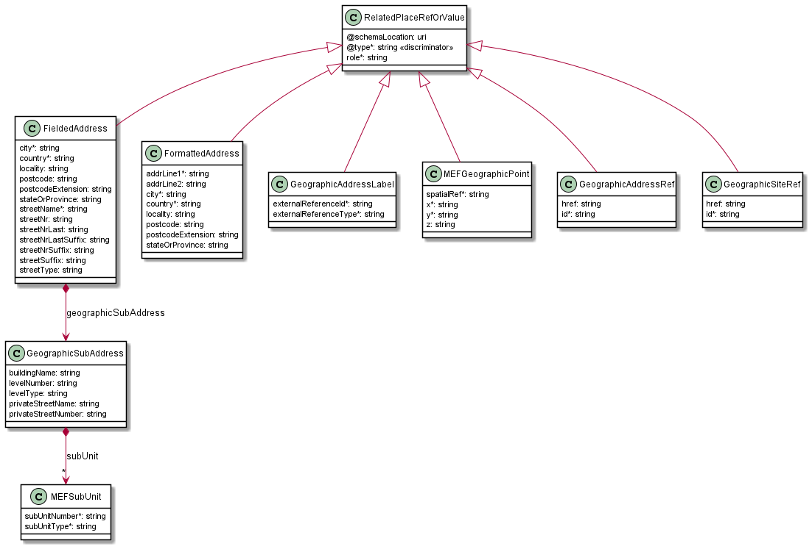

**Figure 32. Data model types representing a place**

#### 7.2.4.1. Type RelatedPlaceRefOrValue

**Description:** Place defines the places where the product order must be done.

<table id="T_RelatedPlaceRefOrValue">
    <thead style="font-weight:bold;">
        <tr>
            <td>Name</td>
            <td>Type</td>
            <td>Description</td>
            <td>MEF 57.2</td>
        </tr>
    </thead>
    <tbody>
        <tr>
            <td>@schemaLocation</td>
            <td>uri</td>
            <td>A URI to a JSON-Schema file that defines additional attributes and relationships. May be used to define additional related place types. Usage of this attribute must be agreed upon between Buyer and Seller.</td>
            <td>Not represented in MEF 57.2</td>
        </tr><tr>
            <td>@type*</td>
            <td>string</td>
            <td>This field is used as a discriminator and is used between different place representations. This type might discriminate for additional related place as defined in &#x27;@schemaLocation&#x27;.
</td>
            <td>Not represented in MEF 57.2</td>
        </tr><tr>
            <td>role*</td>
            <td>string</td>
            <td>Role of this place</td>
            <td>RelatedPlaceRefOrValue</td>
        </tr>
    </tbody>
</table>

#### 7.2.4.2. Type FieldedAddress

**Description:** A type of Address that has a discrete field and value for each
type of boundary or identifier down to the lowest level of detail. For example
"street number" is one field, "street name" is another field, etc. Reference:
MEF 79 (Sn 8.9.2)

Inherits from:

- <a href="#T_RelatedPlaceRefOrValue">RelatedPlaceRefOrValue</a>

<table id="T_FieldedAddress">
    <thead style="font-weight:bold;">
        <tr>
            <td>Name</td>
            <td>Type</td>
            <td>Description</td>
            <td>MEF 57.2</td>
        </tr>
    </thead>
    <tbody>
        <tr>
            <td>city*</td>
            <td>string</td>
            <td>The city that the address is in</td>
            <td>City</td>
        </tr><tr>
            <td>country*</td>
            <td>string</td>
            <td>Country that the address is in</td>
            <td>Country</td>
        </tr><tr>
            <td>geographicSubAddress</td>
            <td><a href="#T_GeographicSubAddress">GeographicSubAddress</a></td>
            <td>Additional fields used to specify an address, as detailed as possible.</td>
            <td>Not represented in MEF 57.2</td>
        </tr><tr>
            <td>locality</td>
            <td>string</td>
            <td>The locality that the address is in</td>
            <td>Locality</td>
        </tr><tr>
            <td>postcode</td>
            <td>string</td>
            <td>Descriptor for a postal delivery area, used to speed and simplify the delivery of mail (also known as zip code)</td>
            <td>Postal Code</td>
        </tr><tr>
            <td>postcodeExtension</td>
            <td>string</td>
            <td>An extension of a postal code. E.g. the part following the dash in a US urban property address</td>
            <td>Postal Code Extension</td>
        </tr><tr>
            <td>stateOrProvince</td>
            <td>string</td>
            <td>The State or Province that the address is in</td>
            <td>State Or Province</td>
        </tr><tr>
            <td>streetName*</td>
            <td>string</td>
            <td>Name of the street or other street type</td>
            <td>Street Name</td>
        </tr><tr>
            <td>streetNr</td>
            <td>string</td>
            <td>Number identifying a specific property on a public street. It may be combined with streetNrLast for ranged addresses. MEF 79 defines it as required however as in certain countries it is not used we make it optional in API.</td>
            <td>Street Number</td>
        </tr><tr>
            <td>streetNrLast</td>
            <td>string</td>
            <td>Last number in a range of street numbers allocated to a property</td>
            <td>Street Number Last</td>
        </tr><tr>
            <td>streetNrLastSuffix</td>
            <td>string</td>
            <td>Last street number suffix for a ranged address</td>
            <td>Street Number Suffix Last</td>
        </tr><tr>
            <td>streetNrSuffix</td>
            <td>string</td>
            <td>The first street number suffix</td>
            <td>Street Number Suffix</td>
        </tr><tr>
            <td>streetSuffix</td>
            <td>string</td>
            <td>A modifier denoting a relative direction</td>
            <td>Street Suffix</td>
        </tr><tr>
            <td>streetType</td>
            <td>string</td>
            <td>The type of street (e.g., alley, avenue, boulevard, brae, crescent, drive, highway, lane, terrace, parade, place, tarn, way, wharf)</td>
            <td>Street Type</td>
        </tr>
    </tbody>
</table>

#### 7.2.4.3. Type FormattedAddress

**Description:** A type of Address that has discrete fields for each type of
boundary or identifier with the exception of street and more specific location
details, which are combined into a maximum of two strings based on local postal
addressing conventions. Reference: MEF 79 (Sn 8.9.3)

Inherits from:

- <a href="#T_RelatedPlaceRefOrValue">RelatedPlaceRefOrValue</a>

<table id="T_FormattedAddress">
    <thead style="font-weight:bold;">
        <tr>
            <td>Name</td>
            <td>Type</td>
            <td>Description</td>
            <td>MEF 57.2</td>
        </tr>
    </thead>
    <tbody>
        <tr>
            <td>addrLine1*</td>
            <td>string</td>
            <td>The first address line in a formatted address</td>
            <td>Address Line 1</td>
        </tr><tr>
            <td>addrLine2</td>
            <td>string</td>
            <td>The second address line in a formatted address</td>
            <td>Address Line 2</td>
        </tr><tr>
            <td>city*</td>
            <td>string</td>
            <td>The city that the address is in</td>
            <td>City</td>
        </tr><tr>
            <td>country*</td>
            <td>string</td>
            <td>Country that the address is in</td>
            <td>Country</td>
        </tr><tr>
            <td>locality</td>
            <td>string</td>
            <td>An area of defined or undefined boundaries within a local authority or other legislatively defined area, usually rural or semi-rural in nature</td>
            <td>Locality</td>
        </tr><tr>
            <td>postcode</td>
            <td>string</td>
            <td>Descriptor for a postal delivery area, used to speed and simplify the delivery of mail (also known as ZIP code)</td>
            <td>Postal Code</td>
        </tr><tr>
            <td>postcodeExtension</td>
            <td>string</td>
            <td>An extension of a postal code. E.g. the part following the dash in an US urban property address</td>
            <td>Postal Code Extension</td>
        </tr><tr>
            <td>stateOrProvince</td>
            <td>string</td>
            <td>The State or Province that the address is in</td>
            <td>State Or Province</td>
        </tr>
    </tbody>
</table>

#### 7.2.4.4. Type MEFGeographicPoint

**Description:** A MEFGeographicPoint defines a geographic point through
coordinates. Reference: MEF 79 (Sn 8.9.5)

Inherits from:

- <a href="#T_RelatedPlaceRefOrValue">RelatedPlaceRefOrValue</a>

<table id="T_MEFGeographicPoint">
    <thead style="font-weight:bold;">
        <tr>
            <td>Name</td>
            <td>Type</td>
            <td>Description</td>
            <td>MEF 57.2</td>
        </tr>
    </thead>
    <tbody>
        <tr>
            <td>spatialRef*</td>
            <td>string</td>
            <td>The spatial reference system used to determine the coordinates (e.g. &quot;WGS84&quot;). The system used and the value of this field are to be agreed during the onboarding process.</td>
            <td>Spatial Reference</td>
        </tr><tr>
            <td>x*</td>
            <td>string</td>
            <td>The latitude expressed in the format specified by the &#x60;spacialRef&#x60;</td>
            <td>Latitude</td>
        </tr><tr>
            <td>y*</td>
            <td>string</td>
            <td>The longitude expressed in the format specified by the &#x60;spacialRef&#x60;</td>
            <td>Longitude</td>
        </tr><tr>
            <td>z</td>
            <td>string</td>
            <td>The elevation expressed in the format specified by the &#x60;spacialRef&#x60;</td>
            <td>Elevation</td>
        </tr>
    </tbody>
</table>

#### 7.2.4.5. Type GeographicSubAddress

**Description:** Additional fields used to specify an address, as detailed as
possible.

<table id="T_GeographicSubAddress">
    <thead style="font-weight:bold;">
        <tr>
            <td>Name</td>
            <td>Type</td>
            <td>Description</td>
            <td>MEF 57.2</td>
        </tr>
    </thead>
    <tbody>
        <tr>
            <td>buildingName</td>
            <td>string</td>
            <td>Allows for identification of places that require building name  as part of addressing information
</td>
            <td>Building Name</td>
        </tr><tr>
            <td>levelNumber</td>
            <td>string</td>
            <td>Used where a level type may be repeated e.g. BASEMENT 1, BASEMENT 2</td>
            <td>Level Number</td>
        </tr><tr>
            <td>levelType</td>
            <td>string</td>
            <td>Describes level types within a building</td>
            <td>Level Type</td>
        </tr><tr>
            <td>privateStreetName</td>
            <td>string</td>
            <td>&quot;Private streets internal to a property (e.g. a university) may have internal names that are not recorded by the land title office</td>
            <td>Private Street Name</td>
        </tr><tr>
            <td>privateStreetNumber</td>
            <td>string</td>
            <td>Private streets numbers internal to a private street</td>
            <td>Private Street Number</td>
        </tr><tr>
            <td>subUnit</td>
            <td><a href="#T_MEFSubUnit">MEFSubUnit</a>[]</td>
            <td>Representation of a MEFSubUnit It is used for describing subunit within a subAddress e.g. BERTH, FLAT, PIER, SUITE, SHOP, TOWER, UNIT, WHARF.</td>
            <td>Not represented in MEF 57.2</td>
        </tr>
    </tbody>
</table>

#### 7.2.4.6. Type GeographicAddressRef

**Description:** A reference to a Geographic Address resource available through
Address Validation API.

Inherits from:

- <a href="#T_RelatedPlaceRefOrValue">RelatedPlaceRefOrValue</a>

<table id="T_GeographicAddressRef">
    <thead style="font-weight:bold;">
        <tr>
            <td>Name</td>
            <td>Type</td>
            <td>Description</td>
            <td>MEF 57.2</td>
        </tr>
    </thead>
    <tbody>
        <tr>
            <td>href</td>
            <td>string</td>
            <td>Hyperlink to the referenced GeographicAddress. Hyperlink MAY be used by the Seller in responses. Hyperlink MUST be ignored by the Seller in case it is provided by the Buyer in a request
</td>
            <td>Not represented in MEF 57.2</td>
        </tr><tr>
            <td>id*</td>
            <td>string</td>
            <td>Identifier of the referenced Geographic Address. This identifier is assigned during a successful address validation request (Geographic Address Validation API)</td>
            <td>Fielded | Formatted | Geographic Address Label | Geographic Point Identifier</td>
        </tr>
    </tbody>
</table>

#### 7.2.4.7. Type GeographicSiteRef

**Description:** A reference to a Geographic Site resource available through
Service Site API

Inherits from:

- <a href="#T_RelatedPlaceRefOrValue">RelatedPlaceRefOrValue</a>

<table id="T_GeographicSiteRef">
    <thead style="font-weight:bold;">
        <tr>
            <td>Name</td>
            <td>Type</td>
            <td>Description</td>
            <td>MEF 57.2</td>
        </tr>
    </thead>
    <tbody>
        <tr>
            <td>href</td>
            <td>string</td>
            <td>Hyperlink to the referenced GeographicSite. Hyperlink MAY be used by the Seller in responses. Hyperlink MUST be ignored by the Seller in case it is provided by the Buyer in a request
</td>
            <td>Not represented in MEF 57.2</td>
        </tr><tr>
            <td>id*</td>
            <td>string</td>
            <td>Identifier of the referenced Geographic Site.</td>
            <td>Site Identifier</td>
        </tr>
    </tbody>
</table>

#### 7.2.4.8. Type GeographicAddressLabel

**Description:** A unique identifier controlled by a generally accepted
independent administrative authority that specifies a fixed geographical
location. Reference: MEF 79 (Sn 8.9.4)

Inherits from:

- <a href="#T_RelatedPlaceRefOrValue">RelatedPlaceRefOrValue</a>

<table id="T_GeographicAddressLabel">
    <thead style="font-weight:bold;">
        <tr>
            <td>Name</td>
            <td>Type</td>
            <td>Description</td>
            <td>MEF 57.2</td>
        </tr>
    </thead>
    <tbody>
        <tr>
            <td>externalReferenceId*</td>
            <td>string</td>
            <td>A reference to an address by id</td>
            <td>Administrative Authority Address Label</td>
        </tr><tr>
            <td>externalReferenceType*</td>
            <td>string</td>
            <td>Uniquely identifies the authority that specifies the addresses reference and/or its type (if the authority specifies more than one type of address). The value(s) to be used are to be agreed during the onboarding. For North American providers this would normally be CLLI (Common Language Location Identifier) code.</td>
            <td>Administrative Authority</td>
        </tr>
    </tbody>
</table>

#### 7.2.4.9. Type MEFSubUnit

**Description:** Allows for sub unit identification

<table id="T_MEFSubUnit">
    <thead style="font-weight:bold;">
        <tr>
            <td>Name</td>
            <td>Type</td>
            <td>Description</td>
            <td>MEF 57.2</td>
        </tr>
    </thead>
    <tbody>
        <tr>
            <td>subUnitNumber*</td>
            <td>string</td>
            <td>The discriminator used for the subunit, often just a simple number but may also be a range.</td>
            <td>Sub Unit Name</td>
        </tr><tr>
            <td>subUnitType*</td>
            <td>string</td>
            <td>The type of subunit e.g.BERTH, FLAT, PIER, SUITE, SHOP, TOWER, UNIT, WHARF.</td>
            <td>Sub Unit Type</td>
        </tr>
    </tbody>
</table>

### 7.2.5. Cancel Product Order

#### 7.2.5.1. Type CancelProductOrder_Create

**Description:** Request for cancellation an existing product order Skipped
properties: id,href,state,effectiveCancellationDate

<table id="T_CancelProductOrder_Create">
    <thead style="font-weight:bold;">
        <tr>
            <td>Name</td>
            <td>Type</td>
            <td>Description</td>
            <td>MEF 57.2</td>
        </tr>
    </thead>
    <tbody>
        <tr>
            <td>cancellationReason</td>
            <td>string</td>
            <td>An optional attribute that allows the Buyer to provide additional detail to the Seller on their reason for cancelling the Product Order</td>
            <td>Cancellation Reason</td>
        </tr><tr>
            <td>cancellationReasonType</td>
            <td><a href="#T_CancellationReasonType">CancellationReasonType</a></td>
            <td>Identifies the type of reason, Technical or Commercial, for the Cancellation request</td>
            <td>Cancellation Reason Type</td>
        </tr><tr>
            <td>productOrder*</td>
            <td><a href="#T_MEFProductOrderRef">MEFProductOrderRef</a></td>
            <td>A reference to a Product Order that the buyer wishes to cancel.</td>
            <td>Product Order Identifier</td>
        </tr><tr>
            <td>relatedContactInformation*</td>
            <td><a href="#T_RelatedContactInformation">RelatedContactInformation</a>[]</td>
            <td>Contact information of an individual or organization playing a role for this Cancel Product Order.
The rule for mapping a represented attribute
value to a &#x60;role&#x60; is to use the _lowerCamelCase_ pattern e.g.
- Cancel Product Order Contact: &#x60;role&#x3D;cancelProductOrderContact&#x60;</td>
            <td>Cancel Product Order Contact, Cancel Product Order Seller Contact</td>
        </tr>
    </tbody>
</table>

#### 7.2.5.2. Type CancelProductOrder

**Description:** Request for cancellation an existing product order

<table id="T_CancelProductOrder">
    <thead style="font-weight:bold;">
        <tr>
            <td>Name</td>
            <td>Type</td>
            <td>Description</td>
            <td>MEF 57.2</td>
        </tr>
    </thead>
    <tbody>
        <tr>
            <td>cancellationDeniedReason</td>
            <td>string</td>
            <td>If the Cancel Product Order request is denied by the Seller, the Seller provides a reason to the Buyer using this attribute.</td>
            <td>Cancellation Denied Reason</td>
        </tr><tr>
            <td>cancellationReason</td>
            <td>string</td>
            <td>An optional attribute that allows the Buyer to provide additional detail to the Seller on their reason for cancelling the Product Order</td>
            <td>Cancellation Reason</td>
        </tr><tr>
            <td>cancellationReasonType</td>
            <td><a href="#T_CancellationReasonType">CancellationReasonType</a></td>
            <td>Identifies the type of reason, Technical or Commercial, for the Cancellation request</td>
            <td>Cancellation Reason Type</td>
        </tr><tr>
            <td>charge</td>
            <td><a href="#T_MEFProductOrderChargeRef">MEFProductOrderChargeRef</a></td>
            <td>The Charge Identifier of any charges that are related to the Cancel Product Order.</td>
            <td>Related Charge</td>
        </tr><tr>
            <td>href</td>
            <td>string</td>
            <td>Hyperlink to the cancellation request. Hyperlink MAY be used by the Seller in responses Hyperlink MUST be ignored by the Seller in case it is provided by the Buyer in a request
</td>
            <td>Not represented in MEF 57.2</td>
        </tr><tr>
            <td>id*</td>
            <td>string</td>
            <td>Unique identifier for the Cancel Product Order that is generated by the Seller when the Cancel Product Order request &#x60;state&#x60; is set to &#x60;acknowledged&#x60;</td>
            <td>Cancel Product Order Identifier</td>
        </tr><tr>
            <td>productOrder*</td>
            <td><a href="#T_MEFProductOrderRef">MEFProductOrderRef</a></td>
            <td>A reference to a Product Order that the Buyer wishes to cancel.</td>
            <td>Product Order Identifier</td>
        </tr><tr>
            <td>relatedContactInformation*</td>
            <td><a href="#T_RelatedContactInformation">RelatedContactInformation</a>[]</td>
            <td>Contact information of an individual or organization playing a role for this Cancel Product Order.
The rule for mapping a represented attribute
value to a &#x60;role&#x60; is to use the _lowerCamelCase_ pattern e.g.
- Cancel Product Order Contact: &#x60;role&#x3D;cancelProductOrderContact&#x60;
- Cancel Product Order Seller Contact: &#x60;role&#x3D;cancelProductOrderSellerContact&#x60;</td>
            <td>Cancel Product Order Contact, Cancel Product Order Seller Contact</td>
        </tr><tr>
            <td>state*</td>
            <td><a href="#T_MEFChargeableTaskStateType">MEFChargeableTaskStateType</a></td>
            <td>The states as defined by TMF622 and extended to meet MEF requirements. These states are used to convey the Cancel Product Order status during the lifecycle of the Product Order.</td>
            <td>Cancel Product Order State</td>
        </tr>
    </tbody>
</table>

#### 7.2.5.3. Type CancelProductOrder_Find

**Description:** A response to a Buyer's get List of Cancel Product Orders

<table id="T_CancelProductOrder_Find">
    <thead style="font-weight:bold;">
        <tr>
            <td>Name</td>
            <td>Type</td>
            <td>Description</td>
            <td>MEF 57.2</td>
        </tr>
    </thead>
    <tbody>
        <tr>
            <td>cancellationReasonType*</td>
            <td><a href="#T_CancellationReasonType">CancellationReasonType</a></td>
            <td>Identifies the type of reason, Technical or Commercial, for the Cancellation request</td>
            <td>Cancellation Reason Type</td>
        </tr><tr>
            <td>id*</td>
            <td>string</td>
            <td>Unique identifier for the Cancel Product Order that is generated by the Seller when the Cancel Product Order request &#x60;state&#x60; is set to &#x60;acknowledged&#x60;</td>
            <td>Cancel Product Order Identifier</td>
        </tr><tr>
            <td>productOrder*</td>
            <td><a href="#T_MEFProductOrderRef">MEFProductOrderRef</a></td>
            <td>A reference to a Product Order that the Buyer wishes to cancel.</td>
            <td> Product Order Identifier</td>
        </tr><tr>
            <td>state*</td>
            <td><a href="#T_MEFChargeableTaskStateType">MEFChargeableTaskStateType</a></td>
            <td>The states as defined by TMF622 and extended to meet MEF requirements. These states are used to convey the Cancel Product Order status during the lifecycle of the Product Order.</td>
            <td>Cancel Product Order State</td>
        </tr>
    </tbody>
</table>

#### 7.2.5.4. `enum` CancellationReasonType

**Description:** Identifies the type of reason, Technical or Commercial, for
the Cancellation Request

<table id="T_CancellationReasonType">
    <thead style="font-weight:bold;">
        <tr>
            <td>Value</td>
            <td>MEF 57.2</td>
        </tr>
    </thead>
    <tbody>
        <tr>
            <td>technical</td>
            <td>TECHNICAL</td>
        </tr><tr>
            <td>commercial</td>
            <td>COMMERCIAL</td>
        </tr>
    </tbody>
</table>

#### 7.2.5.5. Type MEFProductOrderRef

**Description:** Holds the MEF Product Order reference

<table id="T_MEFProductOrderRef">
    <thead style="font-weight:bold;">
        <tr>
            <td>Name</td>
            <td>Type</td>
            <td>Description</td>
            <td>MEF 57.2</td>
        </tr>
    </thead>
    <tbody>
        <tr>
            <td>productOrderHref</td>
            <td>string</td>
            <td>Hyperlink to access the order</td>
            <td>Not represented in MEF 57.2</td>
        </tr><tr>
            <td>productOrderId*</td>
            <td>string</td>
            <td>Unique (within the ordering domain) identifier for the order that is generated by the seller when the order is initially accepted.</td>
            <td>Product Order Identifier</td>
        </tr>
    </tbody>
</table>

### 7.2.6. Charge

#### 7.2.6.1. Type MEFProductOrderCharge

**Description:** When non-recurring or updated recurring charges are identified
by the Seller during their processing of a Product Order, the Seller must
communicate these charges to the Buyer and the Buyer must respond to the Seller
informing the Seller if they accept or reject each charge. The Seller indicates
for each charge, if the charge is Blocking or non-Blocking. If the Buyer
rejects a Blocking Charge, the Seller will cancel that Product Order Item and
any related Product Order Items. If the Buyer rejects a non-blocking Charge,
the Seller may proceed with fulfillment of the Product Order Item.

<table id="T_MEFProductOrderCharge">
    <thead style="font-weight:bold;">
        <tr>
            <td>Name</td>
            <td>Type</td>
            <td>Description</td>
            <td>MEF 57.2</td>
        </tr>
    </thead>
    <tbody>
        <tr>
            <td>cancelProductOrder</td>
            <td><a href="#T_MEFCancelProductOrderRef">MEFCancelProductOrderRef</a></td>
            <td>A reference to the Cancel Product Order request that is cause of the Charge. Required if the Charge was caused by a Cancel Product Order.</td>
            <td>Cancel Product Order Identifier</td>
        </tr><tr>
            <td>chargeItem*</td>
            <td><a href="#T_MEFProductOrderChargeItem">MEFProductOrderChargeItem</a>[]</td>
            <td>A list of Charge Items contained in the Charge</td>
            <td>Charge Items</td>
        </tr><tr>
            <td>creationDate*</td>
            <td>date-time</td>
            <td>Date that the Charge was created by the Seller.</td>
            <td>Charge Creation Date</td>
        </tr><tr>
            <td>href</td>
            <td>string</td>
            <td>Hyperlink to the Charge. Hyperlink MAY be used by the Seller in responses Hyperlink MUST be ignored by the Seller in case it is provided by the Buyer in a request
</td>
            <td>Not represented in MEF 57.2</td>
        </tr><tr>
            <td>id*</td>
            <td>string</td>
            <td>A unique identifier of the Charge</td>
            <td>Charge Identifier</td>
        </tr><tr>
            <td>modifyProductOrderItemRequestedDeliveryDate</td>
            <td><a href="#T_MEFModifyProductOrderItemRequestedDeliveryDateRef">MEFModifyProductOrderItemRequestedDeliveryDateRef</a></td>
            <td>A reference to the Modify Product Order Item Requested Delivery Date request that is cause of the Charge. Required if the Charge was caused by a Modify Product Order Item Requested Delivery Date request.</td>
            <td>Modify Product Order Item Requested Delivery Date Identifier</td>
        </tr><tr>
            <td>productOrder</td>
            <td><a href="#T_MEFProductOrderRef">MEFProductOrderRef</a></td>
            <td>Product Order which the Seller is communicating additional or modified charges to the Buyer. This relation MUST be set when the Charge applies to a Product Order. (Caused by Cancel Product Order request)</td>
            <td>Product Order Identifier</td>
        </tr><tr>
            <td>productOrderItem</td>
            <td><a href="#T_MEFProductOrderItemRef">MEFProductOrderItemRef</a></td>
            <td>Product Order Item which the Seller is communicating additional or modified charges to the Buyer. This relation MUST be set when the Charge applies to a Product Order Item. (Identified by Seller or caused by Modify Product Order Item Requested Delivery Date request)</td>
            <td>Product Order Item Reference Identifier</td>
        </tr><tr>
            <td>responseDueDate*</td>
            <td>date-time</td>
            <td>The date by which the Buyer must respond to the Seller&#x27;s Charge. If there is no response received by the Due Date the Seller will treat all charges as declined and move them to &#x60;declinedByBuyer&#x60; status and put the Charge to &#x60;completed&#x60; status.</td>
            <td>Response Due Date</td>
        </tr><tr>
            <td>state*</td>
            <td><a href="#T_MEFProductOrderChargeStateType">MEFProductOrderChargeStateType</a></td>
            <td>The state of the Charge</td>
            <td>Charge State</td>
        </tr>
    </tbody>
</table>

#### 7.2.6.2. Type MEFProductOrderCharge_Update

**Description:** A subset of MEFProductOrderCharge that is allowed to be
updated by the Buyer

<table id="T_MEFProductOrderCharge_Update">
    <thead style="font-weight:bold;">
        <tr>
            <td>Name</td>
            <td>Type</td>
            <td>Description</td>
            <td>MEF 57.2</td>
        </tr>
    </thead>
    <tbody>
        <tr>
            <td>chargeItem*</td>
            <td><a href="#T_MEFProductOrderChargeItem_Update">MEFProductOrderChargeItem_Update</a>[]</td>
            <td>A list of Charge Items contained in the Charge</td>
            <td>Charge Items</td>
        </tr>
    </tbody>
</table>

#### 7.2.6.3. Type MEFProductOrderCharge_Find

**Description:** A response object for Buyer's get Charge List request.

<table id="T_MEFProductOrderCharge_Find">
    <thead style="font-weight:bold;">
        <tr>
            <td>Name</td>
            <td>Type</td>
            <td>Description</td>
            <td>MEF 57.2</td>
        </tr>
    </thead>
    <tbody>
        <tr>
            <td>creationDate*</td>
            <td>date-time</td>
            <td>Date that the Charge was created by the Seller.</td>
            <td>Charge Creation Date</td>
        </tr><tr>
            <td>id*</td>
            <td>string</td>
            <td>A unique identifier of the Charge</td>
            <td>Charge Identifier</td>
        </tr><tr>
            <td>productOrder</td>
            <td><a href="#T_MEFProductOrderRef">MEFProductOrderRef</a></td>
            <td>Product Order which the Seller is communicating additional or modified charges to the Buyer. This relation MUST be set when the Charge applies to a Product Order. (Caused by Cancel Product Order request)</td>
            <td>Product Order Identifier</td>
        </tr><tr>
            <td>productOrderItem</td>
            <td><a href="#T_MEFProductOrderItemRef">MEFProductOrderItemRef</a></td>
            <td>Product Order Item which the Seller is communicating additional or modified charges to the Buyer. This relation MUST be set when the Charge applies to a Product Order Item. (Identified by Seller or caused by Modify Product Order Item Requested Delivery Date request)</td>
            <td>Product Order Item Reference Identifier</td>
        </tr><tr>
            <td>responseDueDate*</td>
            <td>date-time</td>
            <td>The date by which the Buyer must respond to the Seller&#x27;s Charge. If there is no response received by the Due Date the Seller will treat all charges as declined and move them to &#x60;declinedByBuyer&#x60; status and put the Charge to &#x60;completed&#x60; status.</td>
            <td>Response Due Date</td>
        </tr><tr>
            <td>state*</td>
            <td><a href="#T_MEFProductOrderChargeStateType">MEFProductOrderChargeStateType</a></td>
            <td>The state of the Charge</td>
            <td>Charge State</td>
        </tr>
    </tbody>
</table>

#### 7.2.6.4. `enum` MEFProductOrderChargeActivityType

**Description:** Possible values for the state of the Charge Activity Type

<table id="T_MEFProductOrderChargeActivityType">
    <thead style="font-weight:bold;">
        <tr>
            <td>Value</td>
            <td>MEF 57.2</td>
        </tr>
    </thead>
    <tbody>
        <tr>
            <td>new</td>
            <td>NEW</td>
        </tr><tr>
            <td>change</td>
            <td>CHANGE</td>
        </tr>
    </tbody>
</table>

#### 7.2.6.5. `enum` MEFProductOrderChargeStateType

**Description:** Possible values for the state of the Charge

| State               | Description                                                                                                                              |
| ------------------- | ---------------------------------------------------------------------------------------------------------------------------------------- |
| `completed`         | All Charge Items included in the Charge have moved to either the `accepted` state or the `declined` state.                               |
| `awaitingResponse`  | A Charge has been initiated by the Buyer. The charge includes one or more charges.                                                       |
| `timeout`           | A response has not been received from the Buyer within the `responseDueDate`. This is treated as if the Buyer declined the Charge Items. |
| `withdrawnBySeller` | The Seller determines that the Charge is incorrect. They withdraw the Charge and initiate a new Charge with the required correction(s).  |

#### 7.2.6.6. Type MEFProductOrderChargeItem

**Description:** A single component part of the Charge

<table id="T_MEFProductOrderChargeItem">
    <thead style="font-weight:bold;">
        <tr>
            <td>Name</td>
            <td>Type</td>
            <td>Description</td>
            <td>MEF 57.2</td>
        </tr>
    </thead>
    <tbody>
        <tr>
            <td>acceptanceIndicator</td>
            <td><a href="#T_MEFAcceptedRejectedType">MEFAcceptedRejectedType</a></td>
            <td>Indicates if the Buyer has accepted the specified charge.</td>
            <td>Charge Acceptance Indicator</td>
        </tr><tr>
            <td>activityType*</td>
            <td><a href="#T_MEFProductOrderChargeActivityType">MEFProductOrderChargeActivityType</a></td>
            <td>Indicates if this is a new charge or a change to a charge provided in a Quote or in a previous accepted Charge Item.</td>
            <td>Charge Item Activity Type</td>
        </tr><tr>
            <td>blocking*</td>
            <td>boolean</td>
            <td>Indicates if rejecting the charge will cause the Seller to cancel the Product Order Item, or close the Cancel Product Order or Modify Product Order Item Requested Delivery Date without action.</td>
            <td>Blocking Indicator</td>
        </tr><tr>
            <td>id*</td>
            <td>string</td>
            <td>An identifier that is unique among all Charge Items within a Charge</td>
            <td>Charge Item Identifier</td>
        </tr><tr>
            <td>note</td>
            <td><a href="#T_Note">Note</a>[]</td>
            <td>Free form text to clarify or explain the Charge Item. Only new notes can be entered. The Seller cannot modify an existing Note.
</td>
            <td>Note</td>
        </tr><tr>
            <td>price*</td>
            <td><a href="#T_Price">Price</a></td>
            <td>The value of the Price associated with the Charge Item</td>
            <td>Charge Price</td>
        </tr><tr>
            <td>priceCategory*</td>
            <td><a href="#T_MEFPriceCategory">MEFPriceCategory</a></td>
            <td>The category of the price</td>
            <td>Charge Item Price Category</td>
        </tr><tr>
            <td>priceType*</td>
            <td><a href="#T_MEFPriceType">MEFPriceType</a></td>
            <td>The type of the price.</td>
            <td>Charge Item Price Type</td>
        </tr><tr>
            <td>recurringChargePeriod</td>
            <td><a href="#T_MEFChargePeriod">MEFChargePeriod</a></td>
            <td>Used for a Charge Item with a priceType &#x3D; recurring to indicate the period</td>
            <td>Charge Item Price Recurring Charge Period</td>
        </tr><tr>
            <td>state*</td>
            <td><a href="#T_MEFProductOrderChargeItemStateType">MEFProductOrderChargeItemStateType</a></td>
            <td>The state of the Charge Item</td>
            <td>Charge Item State</td>
        </tr><tr>
            <td>unitOfMeasure</td>
            <td>string</td>
            <td>Unit of Measure if price depending on it is usageBased (Gb, SMS volume, etc..)</td>
            <td>Charge Item Price Unit Of Measure</td>
        </tr>
    </tbody>
</table>

#### 7.2.6.7. Type MEFProductOrderChargeItem_Update

**Description:** A type used to perform Buyer's response to a Charge Item - to
accept or reject it.

<table id="T_MEFProductOrderChargeItem_Update">
    <thead style="font-weight:bold;">
        <tr>
            <td>Name</td>
            <td>Type</td>
            <td>Description</td>
            <td>MEF 57.2</td>
        </tr>
    </thead>
    <tbody>
        <tr>
            <td>acceptanceIndicator*</td>
            <td><a href="#T_MEFAcceptedRejectedType">MEFAcceptedRejectedType</a></td>
            <td>Indicates if the Buyer has accepted the specified charge</td>
            <td>Charge Acceptance Indicator</td>
        </tr><tr>
            <td>id*</td>
            <td>string</td>
            <td>An identifier that is unique among Charge. Used for Charge Item matching, not to be update.</td>
            <td>Charge Item Identifier</td>
        </tr><tr>
            <td>note</td>
            <td><a href="#T_Note">Note</a>[]</td>
            <td>Free form text to clarify or explain the Charge Item. Only new notes can be entered. The Seller cannot modify an existing Note.
</td>
            <td>Note</td>
        </tr>
    </tbody>
</table>

#### 7.2.6.8. `enum` MEFProductOrderChargeItemStateType

**Description:** Possible values for the state of the Charge Item

| State               | MEF 57.2 Name       | Description                                                                                                                                                                                                                                                                                                                                        |
| ------------------- | ------------------- | -------------------------------------------------------------------------------------------------------------------------------------------------------------------------------------------------------------------------------------------------------------------------------------------------------------------------------------------------- |
| `awaitingResponse`  | AWAITING_RESPONSE   | A Charge has been initiated by the Buyer. The charge includes one or more charges related to a Product Order or Product Order Item. Buyer has not indicated whether they accept or reject the charges via a Respond to Charge request.                                                                                                             |
| `completed`         | COMPLETED           | All Charge Items included in the Charge for a given Product Order Item have moved to either the `acceptedByBuyer` state, the `declinedByBuyer` state, or the `withdrawnBySeller` state.                                                                                                                                                            |
| `timeout`           | TIMEOUT             | A Charge Item has been declined by the Buyer. The referenced Product Order and Product Order Items are updated. If a Blocking charge is declined, the Seller may cancel the referenced Product Order Item and any related Product Order Items, the related Cancel Product Order, or the related Modify Product Order Item Requested Delivery Date. |
| `withdrawnBySeller` | WITHDRAWN_BY_SELLER | The Seller determines that the Charge Item is incorrect. They withdraw the Charge Item and initiate a new Charge with the required correction(s) if needed.                                                                                                                                                                                        |

#### 7.2.6.9. `enum` MEFPriceCategory

**Description:** A description of the cause of the Charge Item

<table id="T_MEFPriceCategory">
    <thead style="font-weight:bold;">
        <tr>
            <td>Value</td>
            <td>MEF 57.2</td>
        </tr>
    </thead>
    <tbody>
        <tr>
            <td>cancellation</td>
            <td>CANCELLATION</td>
        </tr><tr>
            <td>construction</td>
            <td>CONSTRUCTION</td>
        </tr><tr>
            <td>connection</td>
            <td>CONNECTION</td>
        </tr><tr>
            <td>disconnect</td>
            <td>DISCONNECT</td>
        </tr><tr>
            <td>expedite</td>
            <td>EXPEDITE</td>
        </tr><tr>
            <td>other</td>
            <td>OTHER</td>
        </tr>
    </tbody>
</table>

#### 7.2.6.10. Type MEFCancelProductOrderRef

**Description:** A reference to a Cancel Product Order instance

<table id="T_MEFCancelProductOrderRef">
    <thead style="font-weight:bold;">
        <tr>
            <td>Name</td>
            <td>Type</td>
            <td>Description</td>
            <td>MEF 57.2</td>
        </tr>
    </thead>
    <tbody>
        <tr>
            <td>href</td>
            <td>string</td>
            <td>Hyperlink to access the Cancel Product Order</td>
            <td>Not represented in MEF 57.2</td>
        </tr><tr>
            <td>id*</td>
            <td>string</td>
            <td>A unique identifier of the Cancel Product Order</td>
            <td>Not represented in MEF 57.2</td>
        </tr>
    </tbody>
</table>

#### 7.2.6.11. Type MEFModifyProductOrderItemRequestedDeliveryDateRef

**Description:** a reference to Modify Product Order Item Requested Delivery
Date

<table id="T_MEFModifyProductOrderItemRequestedDeliveryDateRef">
    <thead style="font-weight:bold;">
        <tr>
            <td>Name</td>
            <td>Type</td>
            <td>Description</td>
            <td>MEF 57.2</td>
        </tr>
    </thead>
    <tbody>
        <tr>
            <td>href</td>
            <td>string</td>
            <td>Hyperlink to access the Modify Product Order Item Requested Delivery Date</td>
            <td>Not represented in MEF 57.2</td>
        </tr><tr>
            <td>id*</td>
            <td>string</td>
            <td>A unique identifier of the Modify Product Order Item Requested Delivery Date</td>
            <td>Not represented in MEF 57.2</td>
        </tr>
    </tbody>
</table>

### 7.2.7. Modify Product Order Item Requested Delivery Date

#### 7.2.7.1. Type MEFModifyProductOrderItemRequestedDeliveryDate_Create

**Description:** A request initiated by the Buyer to modify the Requested
Requested Delivery Date or the Expedite Indicator of a Product Order Item.

<table id="T_MEFModifyProductOrderItemRequestedDeliveryDate_Create">
    <thead style="font-weight:bold;">
        <tr>
            <td>Name</td>
            <td>Type</td>
            <td>Description</td>
            <td>MEF 57.2</td>
        </tr>
    </thead>
    <tbody>
        <tr>
            <td>expediteIndicator</td>
            <td>boolean</td>
            <td>Indicates that expedited treatment is requested. Set by the Buyer. Default Value &#x3D; FALSE. If this is set to TRUE, the Buyer sets the Requested Completion Date to the expedited date</td>
            <td>Product Order Item Expedite Indicator</td>
        </tr><tr>
            <td>productOrderItem*</td>
            <td><a href="#T_MEFProductOrderItemRef">MEFProductOrderItemRef</a></td>
            <td>A reference to the Product Order Item to be modified.</td>
            <td>Product Order Identifier, Product Order Item Identifier</td>
        </tr><tr>
            <td>requestedCompletionDate</td>
            <td>date-time</td>
            <td>Identifies the Buyer&#x27;s desired due date (requested delivery date)</td>
            <td>Product Order Item Requested Completion Date</td>
        </tr>
    </tbody>
</table>

#### 7.2.7.2. Type MEFModifyProductOrderItemRequestedDeliveryDate

**Description:** A response to a request initiated by the Buyer to modify the
Requested Completion Date or the Expedite Indicator of a Product Order Item.

<table id="T_MEFModifyProductOrderItemRequestedDeliveryDate">
    <thead style="font-weight:bold;">
        <tr>
            <td>Name</td>
            <td>Type</td>
            <td>Description</td>
            <td>MEF 57.2</td>
        </tr>
    </thead>
    <tbody>
        <tr>
            <td>creationDate*</td>
            <td>date-time</td>
            <td>Date that the Modify Product Order Item Requested Delivery Date was created in the Seller&#x27;s system and the id was assigned</td>
            <td>Modify Product Order Item Delivery Date Create Date</td>
        </tr><tr>
            <td>expediteIndicator</td>
            <td>boolean</td>
            <td>Indicates that expedited treatment is requested. Set by the Buyer. Default Value &#x3D; FALSE. If this is set to TRUE, the Buyer sets the Requested Completion Date to the expedited date</td>
            <td>Product Order Item Expedite Indicator</td>
        </tr><tr>
            <td>href</td>
            <td>string</td>
            <td>Hyperlink to the modification request. Hyperlink MAY be used by the Seller in responses Hyperlink MUST be ignored by the Seller in case it is provided by the Buyer in a request
</td>
            <td>Not represented in MEF 57.2</td>
        </tr><tr>
            <td>id*</td>
            <td>string</td>
            <td>Unique identifier for the MEFModifyProductOrderItemRequestedDeliveryDate that is generated by the Seller when the MEFModifyProductOrderItemRequestedDeliveryDate request is moved to the &#x27;acknowledged&#x27; state.</td>
            <td>Modify Product Order Item Requested Delivery Date Identifier</td>
        </tr><tr>
            <td>productOrderItem*</td>
            <td><a href="#T_MEFProductOrderItemRef">MEFProductOrderItemRef</a></td>
            <td>A reference to the Product Order Item to be modified.</td>
            <td>Product Order Identifier, Product Order Item Identifier</td>
        </tr><tr>
            <td>requestedCompletionDate</td>
            <td>date-time</td>
            <td>Identifies the Buyer&#x27;s desired due date (requested delivery date)</td>
            <td>Product Order Item Requested Completion Date</td>
        </tr><tr>
            <td>state*</td>
            <td><a href="#T_MEFChargeableTaskStateType">MEFChargeableTaskStateType</a></td>
            <td>The state of the Modify Product Order Item Requested Delivery Date request</td>
            <td>Modify Product Order Item Requested Delivery Date State</td>
        </tr>
    </tbody>
</table>

### 7.2.8. Notification registration

Notification registration and management are done through `/hub` API endpoint.
The below sections describe data models related to this endpoint.

#### 7.2.8.1. Type EventSubscriptionInput

The `query` attribute is used to constrain the notification types that the
Buyer is willing to receive to the callback endpoint. The `query` formatting
complies to RFC3986 [RFC3986](#8-references) and [TMF630](#8-references). Every
attribute defined in the Event model (from notification API) can be used in the
`query`. Example:

```
    "query":"eventType=productOrderStateChangeEvent"
```

If the Buyer wishes to subscribe to 2 different types of events, there are 2
possible syntax variants:

- `eventType=productOrderStateChangeEvent,productOrderItemStateChangeEvent` or
- `eventType=productOrderStateChangeEvent&eventType=productOrderItemStateChangeEvent`

**Description:** This class is used to register for Notifications.

<table id="T_EventSubscriptionInput">
    <thead style="font-weight:bold;">
        <tr>
            <td>Name</td>
            <td>Type</td>
            <td>Description</td>
            <td>MEF 57.2</td>
        </tr>
    </thead>
    <tbody>
        <tr>
            <td>callback*</td>
            <td>string</td>
            <td>This callback value must be set to *host* property from Buyer Product Order Notification API (productOrderNotification.api.yaml). This property is appended with the base path and notification resource path specified in that API to construct an URL to which notification is sent. E.g. for &quot;callback&quot;: &quot;https://buyer.co/listenerEndpoint&quot;, the product order state change event notification will be sent to: &#x60;https://buyer.co/listenerEndpoint/mefApi/sonata/productOrderingNotification/v10/listener/productOrderStateChangeEvent&#x60;</td>
            <td>Notification Target Information</td>
        </tr><tr>
            <td>query</td>
            <td>string</td>
            <td>This attribute is used to define to which type of events to register to. Example: &quot;query&quot;:&quot;eventType &#x3D; productOrderStateChangeEvent&quot;. To subscribe for more than one event type, put the values separated by comma: &#x60;eventType&#x3D;productOrderStateChangeEvent,productOrderItemStateChangeEvent&#x60;. The possible values are enumerated by &#x27;ProductOrderEventType&#x27;, &#x60;CancelProductOrderEventType&#x60; in productOrderNotification.api.yaml. An empty query is treated as specifying no filters - ending in subscription for all event types.</td>
            <td>Not represented in MEF 57.2</td>
        </tr>
    </tbody>
</table>

#### 7.2.8.2. Type EventSubscription

**Description:** This resource is used to respond to notification
subscriptions.

<table id="T_EventSubscription">
    <thead style="font-weight:bold;">
        <tr>
            <td>Name</td>
            <td>Type</td>
            <td>Description</td>
            <td>MEF 57.2</td>
        </tr>
    </thead>
    <tbody>
        <tr>
            <td>callback*</td>
            <td>string</td>
            <td>The value provided by the Buyer in &#x60;EventSubscriptionInput&#x60; during notification registration</td>
            <td>Notification Target Information</td>
        </tr><tr>
            <td>id*</td>
            <td>string</td>
            <td>An identifier of this Event Subscription assigned by the Seller when a resource is created.</td>
            <td>Not represented in MEF 57.2</td>
        </tr><tr>
            <td>query</td>
            <td>string</td>
            <td>The value provided by the Buyer in &#x60;EventSubscriptionInput&#x60; during notification registration</td>
            <td>Not represented in MEF 57.2</td>
        </tr>
    </tbody>
</table>

### 7.2.9. Common

Types described in this subsection are shared among two or more Cantata and
Sonata APIs.

#### 7.2.9.1. Type Duration

**Description:** A Duration in a given unit of time e.g. 3 hours, or 5 days.

<table id="T_Duration">
    <thead style="font-weight:bold;">
        <tr>
            <td>Name</td>
            <td>Type</td>
            <td>Description</td>
            <td>MEF 57.2</td>
        </tr>
    </thead>
    <tbody>
        <tr>
            <td>amount*</td>
            <td>integer</td>
            <td>Duration (number of seconds, minutes, hours, etc.)</td>
            <td>Duration Value</td>
        </tr><tr>
            <td>units*</td>
            <td><a href="#T_TimeUnit">TimeUnit</a></td>
            <td>Time unit type</td>
            <td>Duration Unit</td>
        </tr>
    </tbody>
</table>

#### 7.2.9.2. `enum` MEFAcceptedRejectedType

**Description:** Indicator of acceptance

<table id="T_MEFAcceptedRejectedType">
    <thead style="font-weight:bold;">
        <tr>
            <td>Value</td>
            <td>MEF 57.2</td>
        </tr>
    </thead>
    <tbody>
        <tr>
            <td>accepted</td>
            <td>ACCEPTED</td>
        </tr><tr>
            <td>rejected</td>
            <td>REJECTED</td>
        </tr>
    </tbody>
</table>

#### 7.2.9.3. Type MEFBillingAccountRef

**Description:** A reference to the Buyer's Billing Account

<table id="T_MEFBillingAccountRef">
    <thead style="font-weight:bold;">
        <tr>
            <td>Name</td>
            <td>Type</td>
            <td>Description</td>
            <td>MEF 57.2</td>
        </tr>
    </thead>
    <tbody>
        <tr>
            <td>id*</td>
            <td>string</td>
            <td>Identifies the buyer&#x27;s billing account to which the recurring and non-recurring charges for this order or order item will be billed. Required if the Buyer has more than one Billing Account with the Seller and for all new Product Orders.</td>
            <td>Billing Account</td>
        </tr>
    </tbody>
</table>

#### 7.2.9.4. `enum` MEFBuyerSellerType

**Description:** Indicates if the note is from Buyer or Seller.

<table id="T_MEFBuyerSellerType">
    <thead style="font-weight:bold;">
        <tr>
            <td>Value</td>
            <td>MEF 57.2</td>
        </tr>
    </thead>
    <tbody>
        <tr>
            <td>buyer</td>
            <td>BUYER</td>
        </tr><tr>
            <td>seller</td>
            <td>SELLER</td>
        </tr>
    </tbody>
</table>

#### 7.2.9.5. `enum` MEFChargeableTaskStateType

**Description:** The states as defined by TMF622 and extended to meet MEF
requirements.

| Name                       | MEF 57.2 Name    | Description                                                                                                                                                                                                                                                                                                                                                                                                                                                                                                                                                                         |
| -------------------------- | ---------------- | ----------------------------------------------------------------------------------------------------------------------------------------------------------------------------------------------------------------------------------------------------------------------------------------------------------------------------------------------------------------------------------------------------------------------------------------------------------------------------------------------------------------------------------------------------------------------------------- |
| inProgress.assessingCharge | ACCESSING_CHARGE | The Modify Product Order Item Requested Delivery Date request results in a Charge being initiated by the Seller. The Modify Product Order Item Requested Delivery Date remains in this state until the Charge is completed or withdrawn by the Seller. All charges within a Charge that was initiated due to a Modify Product Order Item Requested Delivery Date are considered Blocking charges. If any charge is not accepted by the Buyer, the Modify Product Order Item Requested Delivery Date moves from the `inProgress.assessingCharge` state to the `done.declined` state. |
| acknowledged               | ACKNOWLEDGED     | A Modify Product Order Item Requested Delivery Date request has been received and has passed basic validation. The Modify Product Order Item Requested Delivery Date Identifier is assigned in the `acknowledged` state. Validation of Modify Product Order Item Requested Delivery Date attributes as applicable is completed in the `acknowledged` state.                                                                                                                                                                                                                         |
| done                       | ACCEPTED         | A Modify Product Order Item Requested Delivery Date request has been received, passed all validations, if a Charge is associated all Charge Items have been accepted by the Buyer, and the Product Order Item Completion Date has been updated as requested.                                                                                                                                                                                                                                                                                                                        |
| done.declined              | DECLINED         | Blocking charges associated with a Modify Product Order Item Requested Delivery Date have been declined by the Buyer. No updates are made to the Product Order Item.                                                                                                                                                                                                                                                                                                                                                                                                                |
| rejected                   | REJECTED         | A Modify Product Order Item Requested Delivery Date request was submitted by the Buyer, and it has failed any validation checks the Seller performs during the `acknowledged` state. No updates are made to the referenced Product Order Item.                                                                                                                                                                                                                                                                                                                                      |

#### 7.2.9.6. `enum` MEFChargePeriod

**Description:** Used for a recurring charge to indicate period.

<table id="T_MEFChargePeriod">
    <thead style="font-weight:bold;">
        <tr>
            <td>Value</td>
            <td>MEF 57.2</td>
        </tr>
    </thead>
    <tbody>
        <tr>
            <td>hour</td>
            <td>HOUR</td>
        </tr><tr>
            <td>day</td>
            <td>DAY</td>
        </tr><tr>
            <td>week</td>
            <td>WEEK</td>
        </tr><tr>
            <td>month</td>
            <td>MONTH</td>
        </tr><tr>
            <td>year</td>
            <td>YEAR</td>
        </tr>
    </tbody>
</table>

#### 7.2.9.7. `enum` MEFEndOfTermAction

**Description:** The action the Seller will take once the term expires. Roll
indicates that the Product's contract will continue on a rolling basis for the
duration of the Roll Interval at the end of the Term.  
Auto-disconnect indicates that the Product will be disconnected at the end of
the Term. Auto-renew indicates that the Product's contract will be
automatically renewed for the Term Duration at the end of the Term.

<table id="T_MEFEndOfTermAction">
    <thead style="font-weight:bold;">
        <tr>
            <td>Value</td>
            <td>MEF 57.2</td>
        </tr>
    </thead>
    <tbody>
        <tr>
            <td>roll</td>
            <td>ROLL</td>
        </tr><tr>
            <td>autoDisconnect</td>
            <td>AUTO_DISCONNECT</td>
        </tr><tr>
            <td>autoRenew</td>
            <td>AUTO_RENEW</td>
        </tr>
    </tbody>
</table>

#### 7.2.9.8. Type MEFItemTerm

**Description:** The term of the Item

<table id="T_MEFItemTerm">
    <thead style="font-weight:bold;">
        <tr>
            <td>Name</td>
            <td>Type</td>
            <td>Description</td>
            <td>MEF 57.2</td>
        </tr>
    </thead>
    <tbody>
        <tr>
            <td>description</td>
            <td>string</td>
            <td>Description of the term</td>
            <td>Product Order Item Term Description</td>
        </tr><tr>
            <td>duration*</td>
            <td><a href="#T_Duration">Duration</a></td>
            <td>Duration of the term</td>
            <td>Quote Item Term Duration</td>
        </tr><tr>
            <td>endOfTermAction*</td>
            <td><a href="#T_MEFEndOfTermAction">MEFEndOfTermAction</a></td>
            <td>The action that needs to be taken by the Seller once the term expires</td>
            <td>End of Term Action</td>
        </tr><tr>
            <td>name*</td>
            <td>string</td>
            <td>Name of the term</td>
            <td>Product Order Item Term Name</td>
        </tr><tr>
            <td>rollInterval</td>
            <td><a href="#T_Duration">Duration</a></td>
            <td>The recurring period that the Buyer is willing to pay for the Product after the original term has expired.</td>
            <td>Roll Interval</td>
        </tr>
    </tbody>
</table>

#### 7.2.9.9. `enum` MEFPriceType

**Description:** Indicates if the price is for recurring or non-recurring
charges.

<table id="T_MEFPriceType">
    <thead style="font-weight:bold;">
        <tr>
            <td>Value</td>
            <td>MEF 57.2</td>
        </tr>
    </thead>
    <tbody>
        <tr>
            <td>recurring</td>
            <td>RECURRING</td>
        </tr><tr>
            <td>nonRecurring</td>
            <td>NON_RECURRING</td>
        </tr><tr>
            <td>usageBased</td>
            <td>USAGE_BASED</td>
        </tr>
    </tbody>
</table>

#### 7.2.9.10. Type Money

**Description:** A base / value business entity used to represent money

<table id="T_Money">
    <thead style="font-weight:bold;">
        <tr>
            <td>Name</td>
            <td>Type</td>
            <td>Description</td>
            <td>MEF 57.2</td>
        </tr>
    </thead>
    <tbody>
        <tr>
            <td>unit</td>
            <td>string</td>
            <td>Currency (ISO4217 norm uses 3 letters to define the currency)</td>
            <td>Currency</td>
        </tr><tr>
            <td>value</td>
            <td>float</td>
            <td>A positive floating point number</td>
            <td>Value</td>
        </tr>
    </tbody>
</table>

#### 7.2.9.11. Type Note

**Description:** Extra information about a given entity. Only useful in
processes involving human interaction. Not applicable for the automated
process.

<table id="T_Note">
    <thead style="font-weight:bold;">
        <tr>
            <td>Name</td>
            <td>Type</td>
            <td>Description</td>
            <td>MEF 57.2</td>
        </tr>
    </thead>
    <tbody>
        <tr>
            <td>author*</td>
            <td>string</td>
            <td>Author of the note</td>
            <td>Note Author</td>
        </tr><tr>
            <td>date*</td>
            <td>date-time</td>
            <td>Date the Note was created</td>
            <td>Note Date</td>
        </tr><tr>
            <td>id*</td>
            <td>string</td>
            <td>Identifier of the note within its containing entity (may or may not be globally unique, depending on provider implementation)</td>
            <td>Not represented in MEF 57.2</td>
        </tr><tr>
            <td>source*</td>
            <td><a href="#T_MEFBuyerSellerType">MEFBuyerSellerType</a></td>
            <td>Indicates if the note is from Buyer or Seller</td>
            <td>Note source</td>
        </tr><tr>
            <td>text*</td>
            <td>string</td>
            <td>Text of the note</td>
            <td>Note Text</td>
        </tr>
    </tbody>
</table>

#### 7.2.9.12. Type Price

**Description:** Provides all amounts (tax included, duty free, tax rate), used
currency and percentage to apply for Price Alteration.

<table id="T_Price">
    <thead style="font-weight:bold;">
        <tr>
            <td>Name</td>
            <td>Type</td>
            <td>Description</td>
            <td>MEF 57.2</td>
        </tr>
    </thead>
    <tbody>
        <tr>
            <td>dutyFreeAmount*</td>
            <td><a href="#T_Money">Money</a></td>
            <td>All taxes excluded amount (expressed in the given currency)</td>
            <td>Price Duty Free Amount</td>
        </tr><tr>
            <td>taxIncludedAmount</td>
            <td><a href="#T_Money">Money</a></td>
            <td>All taxes included amount (expressed in the given currency)</td>
            <td>Price Tax Included Amount</td>
        </tr><tr>
            <td>taxRate</td>
            <td>float</td>
            <td>Price Tax Rate. Unit: [%]. E.g. value 16 stand for 16% tax.</td>
            <td>Price Tax Rate</td>
        </tr>
    </tbody>
</table>

#### 7.2.9.13. Type RelatedContactInformation

**Description:** Contact information of an individual or organization playing a
role for this Order Item. The rule for mapping a represented attribute value to
a `role` is to use the _lowerCamelCase_ pattern e.g.

- Buyer Order Item Contact: `role=buyerOrderItemContact`
- Buyer Implementation Contact: `role=buyerImplementationContact`
- Buyer Technical Contact: `role=buyerTechnicalContact`

<table id="T_RelatedContactInformation">
    <thead style="font-weight:bold;">
        <tr>
            <td>Name</td>
            <td>Type</td>
            <td>Description</td>
            <td>MEF 57.2</td>
        </tr>
    </thead>
    <tbody>
        <tr>
            <td>emailAddress*</td>
            <td>string</td>
            <td>Email address</td>
            <td>Contact email Address</td>
        </tr><tr>
            <td>name*</td>
            <td>string</td>
            <td>Name of the contact</td>
            <td>Contact Name</td>
        </tr><tr>
            <td>number*</td>
            <td>string</td>
            <td>Phone number</td>
            <td>Contract Phone Number</td>
        </tr><tr>
            <td>numberExtension</td>
            <td>string</td>
            <td>Phone number extension</td>
            <td>Contract Phone Number Extension</td>
        </tr><tr>
            <td>organization</td>
            <td>string</td>
            <td>The organization or company that the contact belongs to</td>
            <td>Contact Organization</td>
        </tr><tr>
            <td>postalAddress</td>
            <td><a href="#T_FieldedAddress">FieldedAddress</a></td>
            <td>Identifies the postal address of the person or office to be contacted.</td>
            <td>Contact Postal Address</td>
        </tr><tr>
            <td>role*</td>
            <td>string</td>
            <td>A role the party plays in a given context.</td>
            <td>Not represented in MEF 57.2</td>
        </tr>
    </tbody>
</table>

The `role` attribute is used to provide a reason the particular party
information is used. It can result from MEF 57.2 requirements (e.g. Seller
Contact Information) or from the Product Specification requirements.

The rule for mapping a represented attribute value to a `role` is to use the
_lowerCamelCase_ pattern e.g.

- Seller Contact: `role` equal to `sellerContact`
- Buyer Contact Information: `role` equal to `buyerContactInformation`

#### 7.2.9.14. Type TerminationError

**Description:** This indicates an error that caused an Item to be terminated.
The code and propertyPath should be used like in Error422.

<table id="T_TerminationError">
    <thead style="font-weight:bold;">
        <tr>
            <td>Name</td>
            <td>Type</td>
            <td>Description</td>
        </tr>
    </thead>
    <tbody>
        <tr>
            <td>code</td>
            <td><a href="#T_Error422Code">Error422Code</a></td>
            <td>One of the following error codes:</br>
  - missingProperty: The property the Seller has expected is not present in the payload</br>
  - invalidValue: The property has an incorrect value</br>
  - invalidFormat: The property value does not comply with the expected value format</br>
  - referenceNotFound: The object referenced by the property cannot be identified in the Seller system</br>
  - unexpectedProperty: Additional property, not expected by the Seller has been provided</br>
  - tooManyRecords: the number of records to be provided in the response exceeds the Seller&#x27;s threshold.</br>
  - otherIssue: Other problem was identified (detailed information provided in a reason)
</td>
        </tr><tr>
            <td>propertyPath</td>
            <td>string</td>
            <td>A pointer to a particular property of the payload that caused the validation issue. It is highly recommended that this property should be used.
Defined using JavaScript Object Notation (JSON) Pointer (https://tools.ietf.org/html/rfc6901).
</td>
        </tr><tr>
            <td>value</td>
            <td>string</td>
            <td>Text to describe the reason of the termination.</td>
        </tr>
    </tbody>
</table>

#### 7.2.9.15. `enum` TimeUnit

**Description:** Represents a unit of time. Reference: MEF 57.2 (Sn 9.22)

<table id="T_TimeUnit">
    <thead style="font-weight:bold;">
        <tr>
            <td>Value</td>
            <td>MEF 57.2</td>
        </tr>
    </thead>
    <tbody>
        <tr>
            <td>calendarMonths</td>
            <td>CALENDAR_MONTHS</td>
        </tr><tr>
            <td>calendarDays</td>
            <td>CALENDAR_DAYS</td>
        </tr><tr>
            <td>calendarHours</td>
            <td>CALENDAR_HOURS</td>
        </tr><tr>
            <td>calendarMinutes</td>
            <td>CALENDAR_MINUTES</td>
        </tr><tr>
            <td>businessDays</td>
            <td>BUSINESS_DAYS</td>
        </tr><tr>
            <td>businessHours</td>
            <td>BUSINESS_HOURS</td>
        </tr><tr>
            <td>businessMinutes</td>
            <td>BUSINESS_MINUTES</td>
        </tr>
    </tbody>
</table>

**[R109]** The clarification of what Business days, hours, and minutes mean
**MUST** be done between the Buyer and the Seller during the onboarding
process.

## 7.3. Notification API Data model

Figure 33 presents the Product Order Management Notification data model. The
data types, requirements related to them and mapping to MEF 57.2 are discussed
later in this section.


**Figure 33. Product Order Management Notification Data Model**

This data model is used to construct requests and responses of the API
endpoints described in [Section 5.2.2](#522-buyer-side-api-endpoints).

### 7.3.1. Type Event

**Description:** Event class is used to describe information structure used for
notification.

<table id="T_Event">
    <thead style="font-weight:bold;">
        <tr>
            <td>Name</td>
            <td>Type</td>
            <td>Description</td>
            <td>MEF 57.2</td>
        </tr>
    </thead>
    <tbody>
        <tr>
            <td>eventId*</td>
            <td>string</td>
            <td>Id of the event</td>
            <td>Not represented in MEF 57.2</td>
        </tr><tr>
            <td>eventTime*</td>
            <td>date-time</td>
            <td>Date-time when the event occurred</td>
            <td>Not represented in MEF 57.2</td>
        </tr>
    </tbody>
</table>

### 7.3.2. Type ProductOrderEvent

**Description:**

Inherits from:

- <a href="#T_Event">Event</a>

<table id="T_ProductOrderEvent">
    <thead style="font-weight:bold;">
        <tr>
            <td>Name</td>
            <td>Type</td>
            <td>Description</td>
            <td>MEF 57.2</td>
        </tr>
    </thead>
    <tbody>
        <tr>
            <td>eventType*</td>
            <td><a href="#T_ProductOrderEventType">ProductOrderEventType</a></td>
            <td>Indicates the type of the event.
</td>
            <td>Notification Type</td>
        </tr><tr>
            <td>event*</td>
            <td><a href="#T_ProductOrderEventPayload">ProductOrderEventPayload</a></td>
            <td>A reference to the Product Order that is source of the notification.
</td>
            <td>Not represented in MEF 57.2</td>
        </tr>
    </tbody>
</table>

### 7.3.3. Type ProductOrderEventPayload

**Description:** The identifier of the Product Order and/or Order Item being
subject of this event.

<table id="T_ProductOrderEventPayload">
    <thead style="font-weight:bold;">
        <tr>
            <td>Name</td>
            <td>Type</td>
            <td>Description</td>
            <td>MEF 57.2</td>
        </tr>
    </thead>
    <tbody>
        <tr>
            <td>sellerId</td>
            <td>string</td>
            <td>The unique identifier of the organization that is acting as the Seller. MUST be specified in the request only when requester entity represents more than one Seller.
Reference: MEF 79 (Sn 8.8)</td>
            <td>Seller</td>
        </tr><tr>
            <td>milestoneName</td>
            <td>string</td>
            <td>The name of the Milestone that was reached by give Product Order or Product Order Item. Mandatory for Product Specific Milestone reached events.</td>
            <td>Not represented in MEF 57.2</td>
        </tr><tr>
            <td>orderItemId</td>
            <td>string</td>
            <td>ID of the Product Order Item (within the Product Order) which state change triggered the event. Mandatory for Product Order Item related events.</td>
            <td>Not represented in MEF 57.2</td>
        </tr><tr>
            <td>id*</td>
            <td>string</td>
            <td>ID of the Product Order</td>
            <td>Not represented in MEF 57.2</td>
        </tr><tr>
            <td>href</td>
            <td>string</td>
            <td>Hyperlink to access the Product Order</td>
            <td>Not represented in MEF 57.2</td>
        </tr><tr>
            <td>buyerId</td>
            <td>string</td>
            <td>The unique identifier of the organization that is acting as the a Buyer. MUST be specified in the request only when the responding represents more than one Buyer.
Reference: MEF 79 (Sn 8.8)</td>
            <td>Buyer</td>
        </tr>
    </tbody>
</table>

### 7.3.4. `enum` ProductOrderEventType

**Description:** Indicates the type of Product Order event.

<table id="T_ProductOrderEventType">
    <thead style="font-weight:bold;">
        <tr>
            <td>Value</td>
            <td>MEF 57.2</td>
        </tr>
    </thead>
    <tbody>
        <tr>
            <td>productOrderStateChangeEvent</td>
            <td>PRODUCT_ORDER_STATE_CHANGE</td>
        </tr><tr>
            <td>productOrderItemStateChangeEvent</td>
            <td>PRODUCT_ORDER_ITEM_STATE_CHANGE</td>
        </tr><tr>
            <td>productOrderItemExpectedCompletionDateSet</td>
            <td>PRODUCT_ORDER_ITEM_EXPECTED_COMPLETION_DATE_SET</td>
        </tr><tr>
            <td>productSpecificProductOrderItemMilestoneEvent</td>
            <td>PRODUCT_SPECIFIC_PRODUCT_ORDER_ITEM_MILESTONE</td>
        </tr>
    </tbody>
</table>

### 7.3.5. Type CancelProductOrderEvent

**Description:**

Inherits from:

- <a href="#T_Event">Event</a>

<table id="T_CancelProductOrderEvent">
    <thead style="font-weight:bold;">
        <tr>
            <td>Name</td>
            <td>Type</td>
            <td>Description</td>
            <td>MEF 57.2</td>
        </tr>
    </thead>
    <tbody>
        <tr>
            <td>eventType*</td>
            <td><a href="#T_CancelProductOrderEventType">CancelProductOrderEventType</a></td>
            <td>Indicates the type of the event.
</td>
            <td>Notification Type</td>
        </tr><tr>
            <td>event*</td>
            <td><a href="#T_CancelProductOrderEventPayload">CancelProductOrderEventPayload</a></td>
            <td>A reference to the object that is source of the notification.
</td>
            <td>Not represented in MEF 57.2</td>
        </tr>
    </tbody>
</table>

### 7.3.6. Type CancelProductOrderEventPayload

**Description:** The identifier of the Cancel Product Order being subject of
this event.

<table id="T_CancelProductOrderEventPayload">
    <thead style="font-weight:bold;">
        <tr>
            <td>Name</td>
            <td>Type</td>
            <td>Description</td>
            <td>MEF 57.2</td>
        </tr>
    </thead>
    <tbody>
        <tr>
            <td>sellerId</td>
            <td>string</td>
            <td>The unique identifier of the organization that is acting as the Seller. MUST be specified in the request only when requester entity represents more than one Seller.
Reference: MEF 79 (Sn 8.8)</td>
            <td>Seller</td>
        </tr><tr>
            <td>id*</td>
            <td>string</td>
            <td>ID of the Cancel Product Order</td>
            <td>Not represented in MEF 57.2</td>
        </tr><tr>
            <td>href</td>
            <td>string</td>
            <td>Hyperlink to access the Cancel Product Order</td>
            <td>Not represented in MEF 57.2</td>
        </tr><tr>
            <td>buyerId</td>
            <td>string</td>
            <td>The unique identifier of the organization that is acting as the a Buyer. MUST be specified in the request only when the responding represents more than one Buyer.
Reference: MEF 79 (Sn 8.8)</td>
            <td>Buyer</td>
        </tr>
    </tbody>
</table>

### 7.3.7. `enum` CancelProductOrderEventType

**Description:** Indicates the type of Cancel Product Order event.

<table id="T_CancelProductOrderEventType">
    <thead style="font-weight:bold;">
        <tr>
            <td>Value</td>
            <td>MEF 57.2</td>
        </tr>
    </thead>
    <tbody>
        <tr>
            <td>cancelProductOrderStateChangeEvent</td>
            <td>CANCEL_PRODUCT_ORDER_STATE_CHANGE</td>
        </tr>
    </tbody>
</table>

### 7.3.8. Type ModifyProductOrderItemRequestedDeliveryDateEvent

**Description:**

Inherits from:

- <a href="#T_Event">Event</a>

<table id="T_ModifyProductOrderItemRequestedDeliveryDateEvent">
    <thead style="font-weight:bold;">
        <tr>
            <td>Name</td>
            <td>Type</td>
            <td>Description</td>
            <td>MEF 57.2</td>
        </tr>
    </thead>
    <tbody>
        <tr>
            <td>eventType*</td>
            <td><a href="#T_ModifyProductOrderItemRequestedDeliveryDateEventType">ModifyProductOrderItemRequestedDeliveryDateEventType</a></td>
            <td>Indicates the type of the event.
</td>
            <td>Notification Type</td>
        </tr><tr>
            <td>event*</td>
            <td><a href="#T_ModifyProductOrderItemRequestedDeliveryDateEventPayload">ModifyProductOrderItemRequestedDeliveryDateEventPayload</a></td>
            <td>A reference to the object that is source of the notification.
</td>
            <td>Not represented in MEF 57.2</td>
        </tr>
    </tbody>
</table>

### 7.3.9. Type ModifyProductOrderItemRequestedDeliveryDateEventPayload

**Description:** The identifier of the Modify Product Order Item Requested
Delivery Date being subject of this event.

<table id="T_ModifyProductOrderItemRequestedDeliveryDateEventPayload">
    <thead style="font-weight:bold;">
        <tr>
            <td>Name</td>
            <td>Type</td>
            <td>Description</td>
            <td>MEF 57.2</td>
        </tr>
    </thead>
    <tbody>
        <tr>
            <td>sellerId</td>
            <td>string</td>
            <td>The unique identifier of the organization that is acting as the Seller. MUST be specified in the request only when requester entity represents more than one Seller.
Reference: MEF 79 (Sn 8.8)</td>
            <td>Seller</td>
        </tr><tr>
            <td>id*</td>
            <td>string</td>
            <td>ID of the Modify Product Order Item Requested Delivery Date</td>
            <td>Not represented in MEF 57.2</td>
        </tr><tr>
            <td>href</td>
            <td>string</td>
            <td>Hyperlink to access the Modify Product Order Item Requested Delivery Date</td>
            <td>Not represented in MEF 57.2</td>
        </tr><tr>
            <td>buyerId</td>
            <td>string</td>
            <td>The unique identifier of the organization that is acting as the a Buyer. MUST be specified in the request only when the responding represents more than one Buyer.
Reference: MEF 79 (Sn 8.8)</td>
            <td>Buyer</td>
        </tr>
    </tbody>
</table>

### 7.3.10. `enum` ModifyProductOrderItemRequestedDeliveryDateEventType

**Description:** Indicates the type of Modify Product Order Item Requested
Delivery Date event.

<table id="T_ModifyProductOrderItemRequestedDeliveryDateEventType">
    <thead style="font-weight:bold;">
        <tr>
            <td>Value</td>
            <td>MEF 57.2</td>
        </tr>
    </thead>
    <tbody>
        <tr>
            <td>modifyProductOrderItemRequestedDeliveryDateStateChangeEvent</td>
            <td>MODIFY_PRODUCT_ORDER_ITEM_REQUESTED_DELIVERY_DATE_STATE_CHANGE</td>
        </tr>
    </tbody>
</table>

### 7.3.11. Type ChargeEvent

**Description:**

Inherits from:

- <a href="#T_Event">Event</a>

<table id="T_ChargeEvent">
    <thead style="font-weight:bold;">
        <tr>
            <td>Name</td>
            <td>Type</td>
            <td>Description</td>
            <td>MEF 57.2</td>
        </tr>
    </thead>
    <tbody>
        <tr>
            <td>eventType*</td>
            <td><a href="#T_ChargeEventType">ChargeEventType</a></td>
            <td>Indicates the type of the event.</td>
            <td>Notification Type</td>
        </tr><tr>
            <td>event*</td>
            <td><a href="#T_ChargeEventPayload">ChargeEventPayload</a></td>
            <td>A reference to the object that is source of the notification.</td>
            <td>Not represented in MEF 57.2</td>
        </tr>
    </tbody>
</table>

### 7.3.12. Type ChargeEventPayload

**Description:** The identifier of the Charge being subject of this event.

<table id="T_ChargeEventPayload">
    <thead style="font-weight:bold;">
        <tr>
            <td>Name</td>
            <td>Type</td>
            <td>Description</td>
            <td>MEF 57.2</td>
        </tr>
    </thead>
    <tbody>
        <tr>
            <td>sellerId</td>
            <td>string</td>
            <td>The unique identifier of the organization that is acting as the Seller. MUST be specified in the request only when requester entity represents more than one Seller.
Reference: MEF 79 (Sn 8.8)</td>
            <td>Seller</td>
        </tr><tr>
            <td>id*</td>
            <td>string</td>
            <td>ID of the Charge</td>
            <td>Not represented in MEF 57.2</td>
        </tr><tr>
            <td>href</td>
            <td>string</td>
            <td>Hyperlink to access the Charge</td>
            <td>Not represented in MEF 57.2</td>
        </tr><tr>
            <td>buyerId</td>
            <td>string</td>
            <td>The unique identifier of the organization that is acting as the a Buyer. MUST be specified in the request only when the responding represents more than one Buyer.
Reference: MEF 79 (Sn 8.8)</td>
            <td>Buyer</td>
        </tr>
    </tbody>
</table>

### 7.3.13. `enum` ChargeEventType

**Description:** Indicates the type of Charge event.

<table id="T_ChargeEventType">
    <thead style="font-weight:bold;">
        <tr>
            <td>Value</td>
            <td>MEF 57.2</td>
        </tr>
    </thead>
    <tbody>
        <tr>
            <td>chargeCreateEvent</td>
            <td>CHARGE_CREATE</td>
        </tr><tr>
            <td>chargeStateChangeEvent</td>
            <td>CHARGE_STATE_CHANGE</td>
        </tr><tr>
            <td>chargeTimeoutEvent</td>
            <td>CHARGE_TIMEOUT</td>
        </tr>
    </tbody>
</table>

<div class="page"/>

# 8. References

- [ISO4217]  
  International Standards Organization ISO 4217:2015,
  [Currency Codes](https://www.currency-iso.org/en/home/tables/table-a1.html),
  August 2018
- [JS]
  [JSON Schema draft 7](https://json-schema.org/specification-links.html#draft-7),
  JSON Schema: A Media Type for Describing JSON Documents and associated
  documents, by Austin Wright and Henry Andrews, March 2018. Copyright © 2018
  IETF Trust and the persons identified as the document authors. All rights
  reserved.
- [MEF55.1]
  [MEF 55.1](https://www.mef.net/wp-content/uploads/2021/02/MEF-55.1.pdf)
  Lifecycle Service Orchestration (LSO): Reference Architecture and Framework,
  February 2021
- [MEF57.2] [MEF 57.2](https://www.mef.net/wp-content/uploads/MEF-57.2.pdf)
  Product Order Management Requirements and Use Cases, Product Order
  Management, June 2022
- [MEF79] [MEF 79](https://www.mef.net/wp-content/uploads/2019/11/MEF-79.pdf),
  Address, Service Site, and Product Offering Qualification Management,
  Requirements and Use Cases, November 2019
- [MEF80] [MEF 80](https://www.mef.net/wp-content/uploads/MEF-80.pdf), Quote
  Management Requirements and Use Cases, July 2021
- [MEF128] [MEF 128](https://www.mef.net/wp-content/uploads/MEF-128.pdf), LSO
  API Security Profile, July 2022
- [OAS-V3] [Open API 3.0](http://spec.openapis.org/oas/v3.0.3.html), February
  2020
- [REST]
  [Chapter 5: Representational State Transfer (REST)](http://www.ics.uci.edu/~fielding/pubs/dissertation/rest_arch_style.htm)
  Fielding, Roy Thomas, Architectural Styles and the Design of Network-based
  Software Architectures (Ph.D.).
- [RFC2119] [RFC 2119](https://tools.ietf.org/html/rfc2119), Key words for use
  in RFCs to Indicate Requirement Levels, by S. Bradner, March 1997
- [RFC3986] [RFC 3986](https://tools.ietf.org/html/rfc3986#section-3) Uniform
  Resource Identifier (URI): Generic Syntax, January 2005
- [RFC8174] [RFC 8174](https://tools.ietf.org/html/rfc8174), Ambiguity of
  Uppercase vs Lowercase in RFC 2119 Key Words, by B. Leiba, May 2017,
  Copyright (c) 2017 IETF Trust and the persons identified as the document
  authors. All rights reserved.
- [RFC7231] [RFC 7231](https://tools.ietf.org/html/rfc7231), Hypertext Transfer
  Protocol (HTTP/1.1): Semantics and Content, June 2014
  https://tools.ietf.org/html/rfc7231
- [TMF622]
  [TMF 622](https://www.tmforum.org/resources/specification/tmf622-product-ordering-management-api-rest-specification-r19-0-0/#)
  Product Ordering API REST Specification R19.0.1, November 2019
- [TMF630]
  [TMF 630](https://www.tmforum.org/resources/specification/tmf630-rest-api-design-guidelines-4-2-0/)
  TMF630 API Design Guidelines 4.2.0

<div class="page"/>

# Appendix A Acknowledgments

Mike **BENCHECK**

Michał **ŁĄCZYŃSKI**

Jack **PUGACZEWSKI**

Patrick **ROOSEN**

Karthik **SETHURAMAN**
