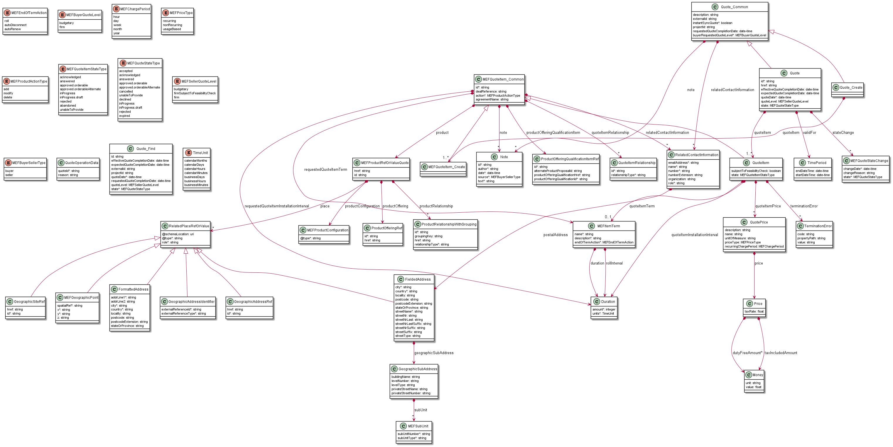
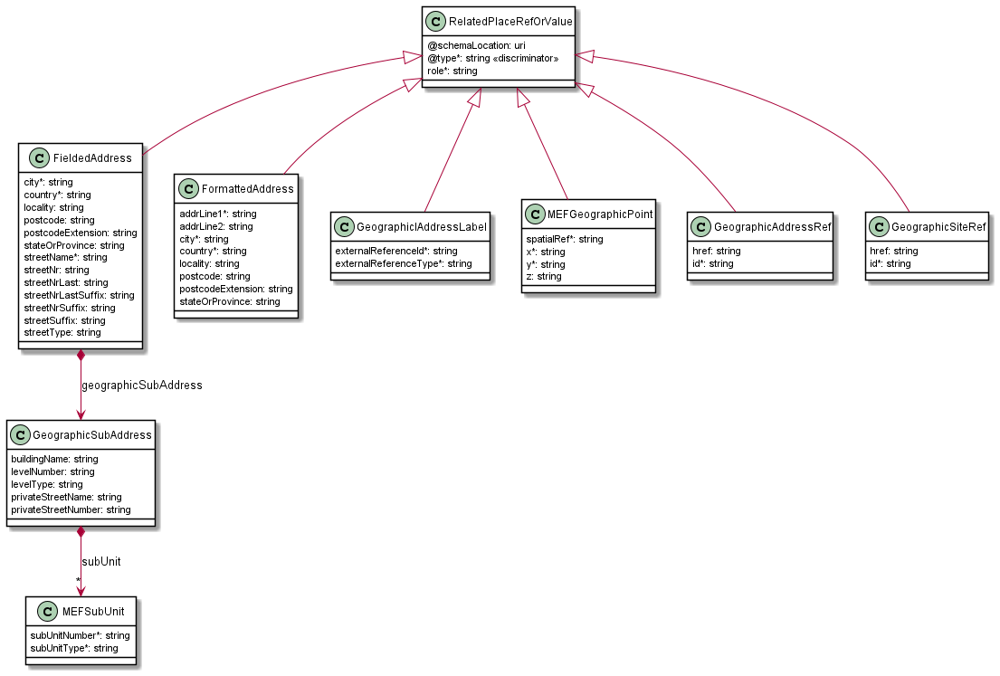
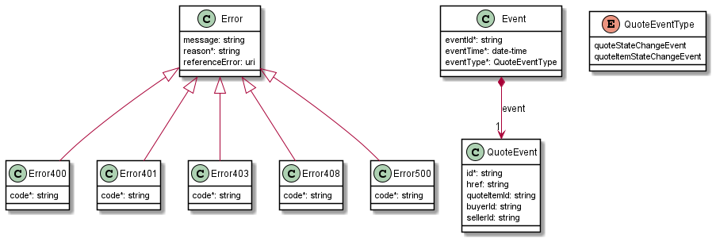

<style>
img
{
  display:block;
  float:none;
  margin-left:auto;
  margin-right:auto;
}
</style>


<div style="font-weight:bold; font-size:33pt; font-family: sensation;  text-align:center">
MEF Standard
</br>
MEF 115
</br>
</br>
LSO Cantata and LSO Sonata Quote Management API - Developer Guide
</br>
</br>
</br>
</br>
May 2022
</div>

<div class="page"/>

**Disclaimer**

© MEF Forum 2022. All Rights Reserved.

The information in this publication is freely available for reproduction and
use by any recipient and is believed to be accurate as of its publication date.
Such information is subject to change without notice and MEF Forum (MEF) is not
responsible for any errors. MEF does not assume responsibility to update or
correct any information in this publication. No representation or warranty,
expressed or implied, is made by MEF concerning the completeness, accuracy, or
applicability of any information contained herein and no liability of any kind
shall be assumed by MEF as a result of reliance upon such information.

The information contained herein is intended to be used without modification by
the recipient or user of this document. MEF is not responsible or liable for
any modifications to this document made by any other party.

The receipt or any use of this document or its contents does not in any way
create, by implication or otherwise:

- (a) any express or implied license or right to or under any patent,
  copyright, trademark or trade secret rights held or claimed by any MEF member
  which are or may be associated with the ideas, techniques, concepts or
  expressions contained herein; nor

- (b) any warranty or representation that any MEF member will announce any
  product(s) and/or service(s) related thereto, or if such announcements are
  made, that such announced product(s) and/or service(s) embody any or all of
  the ideas, technologies, or concepts contained herein; nor

- (c) any form of relationship between any MEF member and the recipient or user
  of this document.

Implementation or use of specific MEF standards, specifications or
recommendations will be voluntary, and no Member shall be obliged to implement
them by virtue of participation in MEF Forum. MEF is a non-profit international
organization to enable the development and worldwide adoption of agile, assured
and orchestrated network services. MEF does not, expressly or otherwise,
endorse or promote any specific products or services.

**Copyright**

© MEF Forum 2022. Any reproduction of this document, or any portion thereof,
shall contain the following statement: "Reproduced with permission of MEF
Forum." No user of this document is authorized to modify any of the information
contained herein.

<div class="page"/>

**Table of Contents**

<!-- code_chunk_output -->

- [List of Contributing Members](#list-of-contributing-members)
- [1. Abstract](#1-abstract)
- [2. Terminology and Abbreviations](#2-terminology-and-abbreviations)
- [3. Compliance Levels](#3-compliance-levels)
- [4. Introduction](#4-introduction)
  - [4.1. Description](#41-description)
  - [4.2. Conventions in the Document](#42-conventions-in-the-document)
  - [4.3. Relation to Other Documents](#43-relation-to-other-documents)
  - [4.4. Approach](#44-approach)
  - [4.5. High-Level Flow](#45-high-level-flow)
- [5. API Description](#5-api-description)
  - [5.1. High-level use cases](#51-high-level-use-cases)
  - [5.2. API Endpoint and Operation Description](#52-api-endpoint-and-operation-description)
    - [5.2.1. Seller side API Endpoints](#521-seller-side-api-endpoints)
    - [5.2.2. Buyer side API Endpoints](#522-buyer-side-api-endpoints)
  - [5.3. Specifying the Buyer ID and the Seller ID](#53-specifying-the-buyer-id-and-the-seller-id)
  - [5.4. Integration of Product Specifications into Quote Management API](#54-integration-of-product-specifications-into-quote-management-api)
  - [5.5. Sample Product Specification](#55-sample-product-specification)
  - [5.6. Model Structural Validation](#56-model-structural-validation)
  - [5.7. Security Considerations](#57-security-considerations)
- [6. API Interactions and Flows](#6-api-interactions-and-flows)
  - [6.1. API Resource Schema summary](#61-api-resource-schema-summary)
    - [6.1.1. Key Entities - Create request](#611-key-entities---create-request)
    - [6.1.2. Key Entities - Response](#612-key-entities---response)
  - [6.2. Use case 1: Create Quote](#62-use-case-1-create-quote)
    - [6.2.1. Use case 1a: Immediate Quote Response Requested and Provided](#621-use-case-1a-immediate-quote-response-requested-and-provided)
    - [6.2.2. Use case 1b: Deferred Quote Response Requested and Provided](#622-use-case-1b-deferred-quote-response-requested-and-provided)
    - [6.2.3. Use case 1c: Deferred Quote Response Requested, Immediate Quote Response Provided](#623-use-case-1c-deferred-quote-response-requested-immediate-quote-response-provided)
    - [6.2.4. Buyer's Quote request](#624-buyers-quote-request)
    - [6.2.5. Seller's Response to a Create Quote request](#625-sellers-response-to-a-create-quote-request)
    - [6.2.7. Quote Item Specification Details](#627-quote-item-specification-details)
      - [6.2.7.1. Quote Item Structure for `add` Action](#6271-quote-item-structure-for-add-action)
      - [6.2.7.2. Quote Item Structure for `modify` Action](#6272-quote-item-structure-for-modify-action)
      - [6.3.3.3. Quote Item Structure for `delete` Action](#6333-quote-item-structure-for-delete-action)
    - [6.2.8. Specifying Place Details](#628-specifying-place-details)
      - [6.2.8.1. Fielded Address](#6281-fielded-address)
      - [6.2.8.2. Formatted Address](#6282-formatted-address)
      - [6.2.8.3. Geographic Point](#6283-geographic-point)
      - [6.2.8.4. Geographic Address Label](#6284-geographic-address-label)
      - [6.2.8.5. Geographic Site Reference](#6285-geographic-site-reference)
      - [6.2.8.6. Geographic Address Reference](#6286-geographic-address-reference)
  - [6.3. Use Case 2: Retrieve Quote List](#63-use-case-2-retrieve-quote-list)
  - [6.4. Use Case 3: Retrieve Quote by Quote Identifier](#64-use-case-3-retrieve-quote-by-quote-identifier)
  - [6.5. Use case 4: Cancel Quote by Quote Identifier](#65-use-case-4-cancel-quote-by-quote-identifier)
  - [6.6. Use case 5: Decline Quote by Quote Identifier](#66-use-case-5-decline-quote-by-quote-identifier)
  - [6.7. Use case 6: Register for Quote Notifications](#67-use-case-6-register-for-quote-notifications)
  - [6.8. Use case 7: Send Quote Notification](#68-use-case-7-send-quote-notification)
- [7. API Details](#7-api-details)
  - [7.1. API patterns](#71-api-patterns)
    - [7.1.1. Indicating errors](#711-indicating-errors)
      - [7.1.1.1. Type Error](#7111-type-error)
      - [7.1.1.2. Type Error400](#7112-type-error400)
      - [7.1.1.3. Type Error401](#7113-type-error401)
      - [7.1.1.4. Type Error403](#7114-type-error403)
      - [7.1.1.5. Type Error404](#7115-type-error404)
      - [7.1.1.6. Type Error422](#7116-type-error422)
      - [7.1.1.7. Type Error500](#7117-type-error500)
      - [7.1.1.8. Type Error501](#7118-type-error501)
    - [7.1.2. Response pagination](#712-response-pagination)
  - [7.2. Management API Data model](#72-management-api-data-model)
    - [7.2.1. Quote](#721-quote)
      - [7.2.1.1 Type Quote_Common](#7211-type-quote_common)
      - [7.2.1.2. Type Quote_Create](#7212-type-quote_create)
      - [7.2.1.3. Type Quote](#7213-type-quote)
      - [7.2.1.4. `enum` MEFQuoteStateType](#7214-enum-mefquotestatetype)
      - [7.2.1.5. `enum` MEFBuyerQuoteLevel](#7215-enum-mefbuyerquotelevel)
      - [7.2.1.6. `enum` MEFSellerQuoteLevel](#7216-enum-mefsellerquotelevel)
      - [7.2.1.7. Type MEFQuoteStateChange](#7217-type-mefquotestatechange)
    - [7.2.2. Quote Item](#722-quote-item)
      - [7.2.2.1 Type MEFQuoteItem_Common](#7221-type-mefquoteitem_common)
      - [7.2.2.2. Type MEFQuoteItem_Create](#7222-type-mefquoteitem_create)
      - [7.2.2.3. Type QuoteItem](#7223-type-quoteitem)
      - [7.2.2.4. `enum` MEFProductActionType](#7224-enum-mefproductactiontype)
      - [7.2.2.5. `enum` MEFQuoteItemStateType](#7225-enum-mefquoteitemstatetype)
      - [7.2.2.6. Type ProductOfferingQualificationItemRef](#7226-type-productofferingqualificationitemref)
      - [7.2.2.7. Type ProductOfferingRef](#7227-type-productofferingref)
      - [7.2.2.8. Type QuoteItemRelationship](#7228-type-quoteitemrelationship)
      - [7.2.2.9. Type MEFItemTerm](#7229-type-mefitemterm)
      - [7.2.2.10. `enum` MEFEndOfTermAction](#72210-enum-mefendoftermaction)
      - [7.2.2.11. Type QuotePrice](#72211-type-quoteprice)
      - [7.2.2.12. Type Price](#72212-type-price)
      - [7.2.2.13. `enum` MEFPriceType](#72213-enum-mefpricetype)
      - [7.2.2.14. `enum` MEFChargePeriod](#72214-enum-mefchargeperiod)
    - [7.2.3. Product representation](#723-product-representation)
      - [7.2.3.1. Type MEFProductRefOrValueQuote](#7231-type-mefproductreforvaluequote)
      - [7.2.3.2. Type MEFProductConfiguration](#7232-type-mefproductconfiguration)
      - [7.2.3.3. Type ProductRelationshipWithGrouping](#7233-type-productrelationshipwithgrouping)
    - [7.2.4. Place representation](#724-place-representation)
      - [7.2.4.2. Type RelatedPlaceRefOrValue](#7242-type-relatedplacereforvalue)
      - [7.2.4.2. Type FieldedAddress](#7242-type-fieldedaddress)
      - [7.2.4.3. Type FormattedAddress](#7243-type-formattedaddress)
      - [7.2.4.4. Type MEFGeographicPoint](#7244-type-mefgeographicpoint)
      - [7.2.4.5. Type GeographicSubAddress](#7245-type-geographicsubaddress)
      - [7.2.4.6. Type GeographicAddressRef](#7246-type-geographicaddressref)
      - [7.2.4.7. Type GeographicSiteRef](#7247-type-geographicsiteref)
      - [7.2.4.8. Type GeographicAddressLabel](#7248-type-geographicaddresslabel)
      - [7.2.4.9. Type MEFSubUnit](#7249-type-mefsubunit)
    - [7.2.5. Notification registration](#725-notification-registration)
      - [7.2.5.1. Type EventSubscriptionInput](#7251-type-eventsubscriptioninput)
      - [7.2.5.2. Type EventSubscription](#7252-type-eventsubscription)
    - [7.2.6. Type QuoteOperationData](#726-type-quoteoperationdata)
    - [7.2.7. Common](#727-common)
      - [7.2.7.1. Type Duration](#7271-type-duration)
      - [7.2.7.2. Type Money](#7272-type-money)
      - [7.2.7.3. Type Note](#7273-type-note)
      - [7.2.7.4. `enum` MEFBuyerSellerType](#7274-enum-mefbuyersellertype)
      - [7.2.7.5. Type RelatedContactInformation](#7275-type-relatedcontactinformation)
      - [7.2.7.6. Type TerminationError](#7276-type-terminationerror)
      - [7.2.7.7. Type TimePeriod](#7277-type-timeperiod)
      - [7.2.7.8. `enum` TimeUnit](#7278-enum-timeunit)
  - [7.3. Notification API Data model](#73-notification-api-data-model)
    - [7.3.1. Type Event](#731-type-event)
    - [7.3.2. Type QuoteEvent](#732-type-quoteevent)
    - [7.3.3. `enum` QuoteEventType](#733-enum-quoteeventtype)
- [8. References](#8-references)

<!-- /code_chunk_output -->

<div class="page"/>

# List of Contributing Members

The following members of the MEF participated in the development of this
document and have requested to be included in this list.

| Member                 |
| ---------------------- |
| Amartus                |
| Colt                   |
| Lumen Technologies     |
| NEC/Netcracker         |
| Orange                 |
| Proximus               |
| Spirent Communications |
| Verizon                |

**Table 1. Contributing Members**

# 1. Abstract

This standard is intended to assist the implementation of the Quote
functionality defined for the LSO Cantata and LSO Sonata Interface Reference
Points (IRPs), for which requirements and use cases are defined in MEF 80
_Quote Management Requirements and Use Cases_ [[MEF80](#8-references)]. This
standard consists of this document and complementary API definitions for Quote
Management and Quote Notification.

This standard normatively incorporates the following files by reference as if
they were part of this document, from the GitHub repository

<https://github.com/MEF-GIT/MEF-LSO-Sonata-SDK>

commit id:
[415ef5ad60d07cf6bc87c36c684217e98cb9936e](https://github.com/MEF-GIT/MEF-LSO-Sonata-SDK/tree/415ef5ad60d07cf6bc87c36c684217e98cb9936e)

- [`productApi/quote/quoteManagement.api.yaml`](https://github.com/MEF-GIT/MEF-LSO-Sonata-SDK/blob/415ef5ad60d07cf6bc87c36c684217e98cb9936e/productApi/quote/quoteManagement.api.yaml)
- [`productApi/quote/quoteNotification.api.yaml`](https://github.com/MEF-GIT/MEF-LSO-Sonata-SDK/blob/415ef5ad60d07cf6bc87c36c684217e98cb9936e/productApi/quote/quoteNotification.api.yaml)

<https://github.com/MEF-GIT/MEF-LSO-Cantata-SDK>

commit id:
[6a27c0b1a237753ea234a6b4ad10798da837d2e6](https://github.com/MEF-GIT/MEF-LSO-Cantata-SDK/tree/6a27c0b1a237753ea234a6b4ad10798da837d2e6)

- [`productApi/quote/quoteManagement.api.yaml`](https://github.com/MEF-GIT/MEF-LSO-Cantata-SDK/blob/6a27c0b1a237753ea234a6b4ad10798da837d2e6/productApi/quote/quoteManagement.api.yaml)
- [`productApi/quote/quoteNotification.api.yaml`](https://github.com/MEF-GIT/MEF-LSO-Cantata-SDK/blob/6a27c0b1a237753ea234a6b4ad10798da837d2e6/productApi/quote/quoteNotification.api.yaml)

# 2. Terminology and Abbreviations

This section defines the terms used in this document. In many cases, the
normative definitions of terms are found in other documents. In these cases,
the third column is used to provide the reference that is controlling, in other
MEF or external documents.

<table>
<tr>
  <th>Term</th>
  <th>Description</th>
  <th>Reference</th>
</tr>
<tr>
  <td>Application Program Interface (API)</td>
  <td>In the context of LSO, API describes one of the Management Interface Reference Points based on the requirements specified in an Interface Profile, along with a data model, the protocol that defines operations on the data and the encoding format used to encode data according to the data model. In this document, API is used synonymously with REST API.</td>
  <td><a href="#8-references">[MEF55.1]</td>
</tr>
<tr>
  <td>Budgetary Quote</td>
  <td>A quote that is provided quickly and with very little analysis such that the Buyer can get an idea of how much the requested Product Offering could cost. Monthly Recurring Charges and Non-Recurring Charges, if specified, are subject to change.</td>
  <td><a href="#8-references">[MEF80]</td>
</tr>
<tr>
  <td>Buyer</td>
  <td>In the context of this document, denotes the organization or individual acting as the customer in a transaction over a Cantata (Customer <-> Service Provider) or Sonata (Service Provider <-> Partner) Interface.</td>
  <td>This document; adapted from <a href="#8-references">[MEF80]</td>
</tr>
<tr>
  <td>Completion State</td>
  <td>A state a Quote is in when the Seller has completed processing their Quote.  This is one of the following states: <br/>answered, <br/>approved.orderable, <br/>approved.orderableAlternate, <br/>cancelled, <br/>unableToProvide, <br/>rejected
  </td>
  <td>This document</td>
</tr>
<tr>
  <td>Currency</td>
  <td>The unit of measurement in which a monetary cost is expressed.  Currency is represented by currency codes defined in ISO 4217:2015.
  </td>
  <td><a href="#8-references">[ISO4217]</td>
</tr>
<tr>
  <td>Deferred Quote Response</td>
  <td>A Seller's response to a Buyer's Create Quote Request whereby the Seller immediately acknowledges that the Create Quote Request was received and, over time, sends notifications to update the Buyer on the status and results of the Create Quote Request (assuming the Buyer has subscribed to receive the notifications). The Buyer can also poll the Seller for the Quote Request Response and status associated with the Create Quote Request.</td>
  <td><a href="#8-references">[MEF80]</td>
</tr>
<tr>
  <td>Firm Quote</td>
  <td>A quote provided to the Buyer based on a pre-order analysis.  All Monthly Recurring Charges and Non-Recurring Charges specified on a Firm Quote are committed. A Firm Quote may expire at some date specified by the Seller.</td>
  <td><a href="#8-references">[MEF80]</td>
</tr>
<tr>
  <td>Firm - Subject to Feasibility Check Quote</td>
  <td>A quote that is provided to the Buyer based on some, but not a complete, pre-order analysis.  At this stage there is further analysis that the Seller can (and is willing) to undertake to provide a committed or firm price, but the Seller needs more time to complete this or the Seller may request that the Buyer use the Firm - Subject to Feasibility Check Quote to proceed to the Order process.Ordering may be possible based on the Firm - Subject to Feasibility Check Quote with some stipulations as to how cost identified during delivering is addressed. The Monthly Recurring Charges specified in the Quote Response are final. Non-Recurring Charges specified in the Quote Response are subject to change.</td>
  <td><a href="#8-references">[MEF80]</td>
</tr>
<tr>
  <td>Immediate Quote Response</td>
  <td>A Seller's response to the Buyer's Create Quote Request,whereby the Seller responds immediately with the results of the request or indicates that the request cannot be processed. The maximum time to provide an Immediate Response is for further study but is expected to be less than 30 seconds.</td>
  <td><a href="#8-references">[MEF80]</td>
</tr>
<tr>
  <td>Recurring Charge</td>
  <td>Charge for a product that is incurred by the Buyer each specified time interval for that product.</td>
  <td><a href="#8-references">[MEF80]</a></td>
</tr>
<tr>
  <td>Requesting Entity</td>
  <td>The business organization that is acting on behalf of one or more Buyers. In the most common case, the Requesting Entity represents only one Buyer and these terms are then synonymous.</td>
  <td><a href="#8-references">[MEF79]</a></td>
</tr>
<tr>
  <td>Responding Entity</td>
  <td>The business organization that is acting on behalf of one or more Sellers. In the most common case, the Responding Entity represents only one Seller and these terms are then synonymous.</td>
  <td><a href="#8-references">[MEF79]</a></td>
</tr>
<tr>
  <td>REST API</td>
  <td>Representational State Transfer. REST provides a set of architectural constraints that, when applied as a whole, emphasizes scalability of component interactions, generality of interfaces, independent deployment of components, and intermediary components to reduce interaction latency, enforce security, and encapsulate legacy systems.</td>
  <td><a href="#8-references">[REST]</a> </td>
</tr>
<tr>
  <td>Seller</td>
  <td>In the context of this document, denotes the organization acting as the supplier in a transaction over a Cantata (Customer <-> Service Provider) or Sonata (Service Provider <-> Partner) Interface.</td>
  <td>This document; adapted from <a href="#8-references">[MEF80]</td>
</tr>
<tr>
  <td>Terminal State</td>
  <td>A state in which the Quote is considered terminated, and no further actions may be taken by the Buyer. This is one of the following: <br/>accepted, <br/>cancelled, <br/>unableToProvide, <br/>declined, <br/>expired, <br/>rejected
  </td>
  <td>This document</td>
</tr>
</table>

# 3. Compliance Levels

The key words **"MUST"**, **"MUST NOT"**, **"REQUIRED"**, **"SHALL"**, **"SHALL
NOT"**, **"SHOULD"**, **"SHOULD NOT"**, **"RECOMMENDED"**, **"NOT
RECOMMENDED"**, **"MAY"**, and **"OPTIONAL"** in this document are to be
interpreted as described in BCP 14 (RFC 2119 [[rfc2119](#8-references)], RFC
8174 [[rfc8174](#8-references)]) when, and only when, they appear in all
capitals, as shown here. All key words must be in bold text.

Items that are **REQUIRED** (contain the words **MUST** or **MUST NOT**) are
labeled as **[Rx]** for required. Items that are **RECOMMENDED** (contain the
words **SHOULD** or **SHOULD NOT**) are labeled as **[Dx]** for desirable.
Items that are **OPTIONAL** (contain the words MAY or OPTIONAL) are labeled as
**[Ox]** for optional.

# 4. Introduction

This standard specification document describes the Application Programming
Interface (API) for Product Quote Management functionality of the LSO Cantata
Interface Reference Point (IRP) and LSO Sonata IRP as defined in the _MEF 55.1
Lifecycle Service Orchestration (LSO): Reference Architecture and Framework_
[[MEF55.1](#8-references)]. The LSO Reference Architecture is shown in Figure 1
with both IRPs highlighted.


**Figure 1. The LSO Reference Architecture**

Cantata and Sonata IRPs define pre-ordering and ordering functionalities that
allow an automated exchange of information between business applications of the
Buyer (Customer or Service Provider) and Seller (Service Provider or Partner)
Domains. Those are:

- Product Catalog
- Address Validation
- Site Retrieval
- Product Offering Qualification
- Product Quote
- Product Inventory
- Product Ordering
- Trouble Ticketing
- Billing

The business requirements and use cases for Quote Management are defined in MEF
80 _Quote Management Requirements and Use Cases_ [[MEF80](#8-references)].

This document focuses on implementation aspects of Quote functionality and is
structured as follows:

- [Chapter 4](#4-introduction) provides an introduction to Quote Management and
  its description in a broader context of Cantata and Sonata and their
  corresponding SDKs.
- [Chapter 5](#5-api-description) gives an overview of endpoints, resource
  model and design patterns.
- Use cases and flows are presented in
  [Chapter 6](#6-api-interactions-and-flows).
- And finally, [Chapter 7](#7-api-details) complements previous sections with a
  detailed API description.

## 4.1. Description

The Quote Management API allows the Buyer to request a quote for the
installation of one or more of the Seller's Product Offerings or for an action
to be performed on an existing Product. Product Offerings are defined in MEF 79
_Address, Service Site, and Product Offering Qualification Management,
Requirements and Use Cases_ [[MEF79](#8-references)]

The API payloads exchanged between the Buyer and the Seller consist of
product-independent and product-specific parts. The product-independent part is
technically defined in this standard. The product-specific part is defined in
the product specification standard of the concerned product. Both standards
must be used in combination to validate the correctness of the payloads.
[Section 5.4](#54-integration-of-product-specifications-into-quote-management-api)
explains how to use product specifications as the Quote API payloads.

This document uses samples of Access E-Line Product specification definitions
to construct API payload examples in [Section 6](#6-api-interaction--flows).

**_Note:_** The Access E-Line product is valid only in the Sonata context. It
is used only for the explanation of the rules of combining the product-agnostic
(envelope) and product-specific (payload) parts of the APIs. The examples are
not normative and are not updated to reflect new version of the product
specification (MEF 106). It is out of the scope of this document to explain the
details of any product.

Product specifications are defined using JSON Schema (draft 7) standard
[[JS](#8-references)], whereas Quote API is defined using OpenAPI 3.0
[[OAS-V3](#8-references)]. The payloads exchanged through Quote endpoints must
comply with the Product specification schema as well as with MEF 80
[[MEF80](#8-references)] requirements for Quote Management.

## 4.2. Conventions in the Document

- Code samples are formatted using code blocks. When notation `<< some text >>`
  is used in the payload sample it indicates that a comment is provided instead
  of an example value and it might not comply with the OpenAPI definition.
- Model definitions are formatted as in-line code (e.g. `GeographicAddress`).
- In UML diagrams the default cardinality of associations is `0..1`. Other
  cardinality markers are complaint with the UML standard.
- In the API details tables and UML diagrams required attributes are marked
  with a `*` next to their names.
- In UML sequence diagrams `{{variable}}` notation is used to indicates a
  variable to be substituted with a correct value.

## 4.3. Relation to Other Documents

The requirements and use cases for Quote Management are defined in MEF 80
[[MEF80](#8-references)]. The API definition builds on _TMF648 Quote Management
API REST Specification R19.0.1_ [[TMF648](#8-references)]. Quote Use Cases must
support the use of any of MEF product specifications.

## 4.4. Approach

As presented in Figure 2. both Cantata and Sonata API frameworks consist of
three structural components:

- Generic API framework
- Product-independent information (Function-specific information and
  Function-specific operations)
- Product-specific information (MEF product specification data model)


**Figure 2. Cantata and Sonata API framework**

The essential concept behind the framework is to decouple the common structure,
information, and operations from the specific product information content.  
Firstly, the Generic API Framework defines a set of design rules and patterns
that are applied across all Cantata or Sonata APIs.  
Secondly, the product-independent information of the framework focuses on a
model of a particular Cantata or Sonata functionality and is agnostic to any of
the product specifications. For example, this standard is describing the Quote
model and operations that allow performing quoting of any product that is
aligned with either MEF or custom product specifications.  
Finally, the product-specific information part of the framework focuses on MEF
product specifications that define business-relevant attributes and
requirements for trading MEF subscriber and MEF operator services.

This Developer Guide is not defining MEF product specifications but can be used
in combination with any product specifications defined by or compliant with
MEF.

## 4.5. High-Level Flow

Quote Management is part of a broader Cantata and Sonata End-to-End flow.
Figure 3. below shows a high-level diagram to get a good understanding of the
whole process and Quote Management's position within it.


**Figure 3. Cantata and Sonata End-to-End Function Flow**

- Address Validation:
  - Allows the Buyer to retrieve address information from the Seller, including
    exact formats, for addresses known to the Seller.
- Site Retrieval:
  - Allows the Buyer to retrieve Service Site information including exact
    formats for Service Sites known to the Seller.
- Product Offering Qualification (POQ):
  - Allows the Buyer to check whether the Seller can deliver a product or set
    of products from among their product offerings at the geographic address or
    a service site specified by the Buyer; or modify a previously purchased
    product.
- Quote:
  - Allows the Buyer to submit a request to find out how much the installation
    of an instance of a Product Offering, an update to an existing Product, or
    a disconnect of an existing Product will cost.
- Product Order:
  - Allows the Buyer to request the Seller to initiate and complete the
    fulfillment process of an installation of a Product Offering, an update to
    an existing Product, or a disconnect of an existing Product at the address
    defined by the Buyer.
- Product Inventory:
  - Allows the Buyer to retrieve the information about existing Product
    instances from Seller's Product Inventory.
- Trouble Ticketing:
  - Allows the Buyer to create, retrieve, and update Trouble Tickets as well as
    receive notifications about Incidents' and Trouble Tickets' updates. This
    allows managing issues and situations that are not part of normal
    operations of the Product provided by the Seller.

# 5. API Description

This section presents the API structure and design patterns. It starts with the
high-level use cases diagram. Then it describes the REST endpoints with use
case mapping. Next, it gives an overview of the API resource model and an
explanation of the design pattern that is used to combine product-agnostic and
product-specific parts of API payloads. Finally, payload validation and API
security aspects are discussed.

## 5.1. High-level use cases

Figure 4 presents a high-level use case diagram as specified in MEF 80
[[MEF80](#8-references)] in section 7.2. This picture aims to help understand
the endpoint mapping. Use cases are described extensively in
[chapter 6](#6-api-interactions-and-flows)


**Figure 4. Use cases**

## 5.2. API Endpoint and Operation Description

### 5.2.1. Seller side API Endpoints

**Base URL for Cantata**:
`https://{{serverBase}}:{{port}}{{?/buyer_prefix}}/mefApi/cantata/quoteManagement/v2/`

**Base URL for Sonata**:
`https://{{serverBase}}:{{port}}{{?/buyer_prefix}}/mefApi/sonata/quoteManagement/v8/`

The following API endpoints are implemented by the Seller and allow the Buyer
to send Quote requests, retrieve existing Quotes or Quote details, and manage
notification registrations. The endpoints and corresponding data model are
defined in `productApi/quote/quoteManagement.api.yaml`.

| API endpoint         | Description                                                                                                                                | MEF 80 Use Case mapping                                                                                                                                                                                               |
| -------------------- | ------------------------------------------------------------------------------------------------------------------------------------------ | --------------------------------------------------------------------------------------------------------------------------------------------------------------------------------------------------------------------- |
| `POST /quote`        | A request initiated by the Buyer to _create_ new `Quote` and start the quotation process on the Seller's side.                             | UC 1: Create Quote <br>UC 1a: Immediate Quote Response Requested and Provided<br>UC 1b: Deferred Quote Response Requested and Provided<br>UC 1c: Deferred Quote Response Requested, Immediate Quote Response Provided |
| `GET /quote`         | A request initiated by the Buyer to retrieve a list of `Quotes` from the Seller based on filter criteria provided as _`query`_ parameters. | UC 2: Retrieve Quote List                                                                                                                                                                                             |
| `GET /quote/{{id}}`  | A request initiated by the Buyer to retrieve full details of a specific `Quote` based on _`id`_ provided as _`path`_ parameter             | UC 3: Retrieve Quote by Quote Identifier                                                                                                                                                                              |
| `POST /cancelQuote`  | A request initiated by the Buyer to _cancel_ existing `Quote`. The `Quote.id` is provided in the message body.                             | UC 4: Cancel Quote by Quote Identifier                                                                                                                                                                                |
| `POST /declineQuote` | A request initiated by the Buyer to _decline_ existing `Quote`. The `Quote.id` is provided in the message body.                            | UC 5: Decline Quote by Quote Identifier                                                                                                                                                                               |
| `POST /hub`          | A request initiated by the Buyer to instruct the Seller to send notifications of `Quote` and `QuoteItem` state change events.              | UC 6: Register for Quote Notifications                                                                                                                                                                                |
| `DELETE /hub/{{id}}` | A request initiated by the Buyer to instruct the Seller to stop sending notifications.                                                     | UC 6: Register for Quote Notification                                                                                                                                                                                 |

**Table 2. Seller side API endpoints**

### 5.2.2. Buyer side API Endpoints

**Base URL for Cantata**:
`https://{{serverBase}}:{{port}}{{?/seller_prefix}}/mefApi/cantata/quoteNotification/v2/`

**Base URL for Sonata**:
`https://{{serverBase}}:{{port}}{{?/seller_prefix}}/mefApi/sonata/quoteNotification/v8/`

The following API Endpoints are used by the Seller to post `Quote` and
`QuoteItem` notifications to registered listeners. The endpoints and
corresponding data model are defined in
`productApi/quote/quoteNotification.api.yaml`

| API Endpoint                               | Description                                                                        | MEF 80 Use Case Mapping       |
| ------------------------------------------ | ---------------------------------------------------------------------------------- | ----------------------------- |
| `POST /listener/quoteStateChangeEvent`     | A request initiated by the Seller to notify the buyer on `Quote` state change.     | UC 7: Send Quote Notification |
| `POST /listener/quoteItemStateChangeEvent` | A request initiated by the Seller to notify the Buyer on `QuoteItem` state change. | UC 7: Send Quote Notification |

**Table 3. Buyer side API endpoints**

## 5.3. Specifying the Buyer ID and the Seller ID

A business entity willing to represent multiple Buyers or multiple Sellers must
follow requirements of MEF 79 [[MEF79](#8-references)] chapter 8.8, which
states:

> For requests of all types, there is a business entity that is initiating an
> Operation (called a Requesting Entity) and a business entity that is
> responding to this request (called the Responding Entity). In the simplest
> case, the Requesting Entity is the Buyer and the Responding Entity is the
> Seller. However, in some cases, the Requesting Entity may represent more than
> one Buyer and similarly, the Responding Entity may represent more than one
> Seller.
>
> While it is outside the scope of this specification, it is assumed that the
> Requesting Entity and the Responding Entity are aware of each other and can
> authenticate requests initiated by the other party. It is further assumed
> that both the Buying Entity and the Requesting Entity know:
>
> a) the list of Buyers the Requesting Entity represents when interacting with
> this Responding Entity;and  
> b) the list of Sellers that this Responding Entity represents to this
> Requesting Entity.

In the API the `buyerId` and `sellerId` are represented as query parameters in
each operation defined in `quoteManagement.api.yaml` and as attributes of an
event (`QuoteEvent`) as described in `quoteNotification.api.yaml`.

**[R1]** If the Requesting Entity has the authority to represent more than one
Buyer the request **MUST** include `buyerId` query parameter that identifies
the Buyer being represented [MEF79 R80]

**[R2]** If the Requesting Entity represents precisely one Buyer with the
Responding Entity, the request **MUST NOT** specify the `buyerId` [MEF79 R81]

**[R3]** If the Responding Entity represents more than one Seller to this Buyer
the request **MUST** include `sellerId` query parameter that identifies the
Seller with whom this request is associated [MEF79 R82]

**[R4]** If the Responding Entity represents precisely one Seller to this
Buyer, the request **MUST NOT** specify the `sellerId` [MEF79 R83]

**[R5]** If `buyerId` or `sellerId` attributes were specified in the request
same attributes **MUST** be used in the notification payload.

## 5.4. Integration of Product Specifications into Quote Management API

Product specifications are defined using JsonSchema (draft 7) format and are
integrated into the `Quote` payload using the TMF extension pattern.

The extension hosting type in API data model is `MEFProductConfiguration`. The
`@type` attribute of that type must be set to a value that uniquely identifies
the product spectifiaction. A unique identifier for MEF standard product
specifications is in URN format and is assigned by MEF. This identifier is
provided as root schema `$id` and in product specification documentation. Use
of non-MEF standard product definitions is allowed. In such case the schema
identifier must be agreed between the Buyer and the Seller.

The example below shows a header of a Product Specification schema, where
`"$id": urn:mef:lso:spec:sonata:access-eline:v1.0.0:quote` is the
abovementioned URN:

```yaml
'$schema': http://json-schema.org/draft-07/schema#
'$id': urn:mef:lso:spec:sonata:access-eline:v1.0.0:quote
title: MEF LSO Sonata - Access Eline OVC (Quote) Product Specification
```

Product specifications are provided as Json schemas without the
`MEFProductConfiguration` context.

Product-specific attributes are introduced via the `MEFProductRefOrValue`
(defined by the Buyer). This entity has the `productConfiguration` attribute of
type `MEFProductConfiguration` which is used as an extension point for
product-specific attributes.

Implementations might choose to integrate selected product specifications to
data model during development. In such case, an integrated data model is built
and product specifications are in inheritance relationship with
`MEFProductConfiguration` as described in OAS specification. This pattern is
called **Static Binding**. The SDK is additionally shipped with a set of API
definitions that statically bind all product-related APIs (POQ, Quote, Order,
Inventory) with all corresponding product specifications available in the
release. The snippets below present an example of a static binding of the
envelope API with a number of MEF product specifications, from both
`MEFProductConfiguration` and product specification point of view:

```yaml
MEFProductConfiguration:
  description:
    MEFProductConfiguration is used as an extension point for MEF specific
    product/service payload. The `@type` attribute is used as a discriminator
  discriminator:
    mapping:
      urn:mef:lso:spec:sonata:AccessElineOvc:v1.0.0:quote: '#/components/schemas/AccessElineOvcQuote_v1.0.0'
      urn:mef:lso:spec:cantata-sonata:SubscriberUni:v1.0.0:quote: '#/components/schemas/SubscriberUniQuote_v1.0.0'
      urn:mef:lso:spec:cantata-sonata:EplEvc:v1.0.0:quote: '#/components/schemas/EplEvcQuote_v1.0.0'
      urn:mef:lso:spec:sonata:OperatorUNI:v1.0.0:quote: '#/components/schemas/OperatorUNIQuote_v1.0.0'
    propertyName: '@type'
  properties:
    '@type':
      description:
        The name of the type, defined in the JSON schema specified above, for
        the product that is the subject of the POQ Request. The named type must
        be a subclass of MEFProductConfiguration.
      type: string
```

```yaml
AccessElineOvcQuote_v1.0.0:
  allOf:
    - $ref: '#/components/schemas/MEFProductConfiguration'
    - description:
        OVC Service Attributes control the behavior observable at and between
        External Interfaces to the Carrier Ethernet Network (CEN). The
        behaviors are achieved by the Network Operator and the Operator's
        client (the Service Provider in this case) agreeing on the value for
        each of the Service Attributes.
```

Alternatively, implementations might choose not to build an integrated model
and choose different mechanism allowing runtime validation of product specific
fragments of the payload. The system is able to validate given product against
a new schema without redeployment. This pattern is called **Dynamic Binding.**

Regardless of chosen implementation pattern, the HTTP payload is exactly the
same. Both implementation approaches must conform to requirements specified
below.

**[R6]** `MEFProductConfiguration` type is an extension point that **MUST** be
used to integrate product specifications' properties into a request/response
payload.

**[R7]** The `@type` property of `MEFProductConfiguration` **MUST** be used to
specify the type of the extending entity.

**[R8]** Product attributes specified in payload must conform to the product
specification specified in the `@type` property.


**Figure 5. The Extension Pattern with Sample Product Specific Extensions**

Figure 5. presents two MEF `<<ProductSpecifications>>` that represent Access
E-Line Operator UNI and OVC products. When these products are used as a Quote
payload the `@type` of `MEFProductConfiguration` takes
`"urn:mef:lso:spec:sonata:AccessElineOvc:1.0.0:quote"` or
`"urn:mef:lso:spec:sonata:OperatorUNI:1.0.0:quote"` value to indicate which
product specification should be used to interpret a set of product-specific
attributes included in the payload. An example of a product definition inside
the `QuoteItem` is presented in
[Section 6.2.7.1](#6271-quote-item-structure-for-add-action).

The _quote_ suffix after the product type name in the URN comes from the
approach that the product schemas may differ depending on the Interface
Reference Point function they are used with.

## 5.5. Sample Product Specification

The SDK contains product specification definitions, from which UNI and Access
E-Line (OVC) are used in the payload samples in this section. In Celine release
they are located in the SDK package at:

`\productSchema\carrierEthernet\accessEline\quote\accessElineOvc.yaml`
`\productSchema\carrierEthernet\carrierEthernetOperatorUni\quote\carrierEthernetOperatorUni.yaml`

The product specification data model definitions are available as JsonSchema
(version `draft 7`) documents. Figure 6. and 7. depict simplified UML views on
these data models in which:

- the mandatory attributes are marked with `*`,
- the mandatory relations have a cardinality of `1` or `1..*`,
- some relations and attributes that are not essential to the understanding of
  the product specification model are omitted.

The red color in figures 6. and 7. below highlights the data model of Access
E-Line.


**Figure 6. A simplified view on Access E-Line product specification data
model**


**Figure 7. A simplified view on UNI product specification data model**

Product specifications define several product-related and envelope-related
requirements. For example:

- for an Access E-Line product two mandatory relationship roles must be
  specified, one with the operator ENNI (`ENNI_REFERENCE`) and a second with
  the operator UNI (`UNI_REFERENCE`) for `add` action. First must be realized
  as a product relationship (relation to product existing in Seller's
  Inventory), second might be realized as an quote item (being part of the same
  quote) or as a product relationship
- in the case of a `modify` action, product relationships must have the same
  value as in the `add` action. They must not be changed
- for an operator UNI product a place relationship (`INSTALL_LOCATION`) must be
  specified
- in the case of a `modify` action, place relationships must have the same
  value as in the `add` action. They must not be changed

In case, some of these requirements are violated the Seller returns an error
response to the Buyer that indicates specific functional errors. These errors
are listed in the response body (a list of `Error422` entries) for HTTP `422`
response.

## 5.6. Model Structural Validation

The structure of the HTTP payloads exchanged via Quote API endpoints is defined
using:

- OpenAPI version 3.0 for product-agnostic part of the payload
- JsonSchema (draft 7) for product-specific part of the payload

**[R9]** Implementations **MUST** use payloads that conform to these
definitions.

**[R10]** A product specification may define additional consistency rules and
requirements that **MUST** be respected by implementations. These are defined
for:

- required relation type, multiplicity to other items in the same quote request
- required relation type, multiplicity to entities in the Seller's product
  inventory
- related contact information roles that are to be defined at the item level
- relations to places (locations) and their roles that are to be defined at the
  item level [MEF80 R23]

## 5.7. Security Considerations

There must be an authentication mechanism whereby a Seller can be assured who a
Buyer is and vice-versa. There must also be authorization mechanisms in place
to control what a particular Buyer or Seller is allowed to do and what
information may be obtained. However, the definition of the exact security
mechanism and configuration is outside the scope of this document. It is being
worked on by a separate MEF Project (MEF W128).

# 6. API Interactions and Flows

This section provides a detailed insight into the API functionality, use cases,
and flows. It starts with Table 4 presenting a list and short description of
all business use cases then presents the variants of ent-to-end interaction
flows, and in following subchapters describes the API usage flow and examples
for each of the use cases.

| Use Case # | Use Case Name                                                        | Use Case Description                                                                                                                          |
| ---------- | -------------------------------------------------------------------- | --------------------------------------------------------------------------------------------------------------------------------------------- |
| 1          | Create Quote                                                         | The Buyer requests a Quote from the Seller using one of the sub-Use Cases below.                                                              |
| 1a         | Immediate Quote Response Requested and Provided                      | The Buyer requests a Quote from the Seller and requests an Immediate Quote Response.                                                          |
| 1b         | Deferred Quote Response Requested and Provided                       | The Buyer requests a Quote from the Seller and does not request an Immediate Quote Response. The Seller provides a Deferred Quote Response.   |
| 1c         | Deferred Quote Response Requested, Immediate Quote Response Provided | The Buyer requests a Quote from the Seller and does not request an Immediate Quote Response. The Seller provides an Immediate Quote Response. |
| 2          | Retrieve Quote List                                                  | The Buyer requests a list of Quotes from the Seller based on Quote filter criteria.                                                           |
| 3          | Retrieve Quote by Quote Identifier                                   | The Buyer requests detailed information related to a single Quote based on a Quote Identifier.                                                |
| 4          | Cancel Quote by Quote Identifier                                     | The Buyer requests to Cancel a Quote.                                                                                                         |
| 5          | Decline Quote by Quote Identifier                                    | The Buyer declines the Quote.                                                                                                                 |
| 6          | Register for Quote Notifications                                     | The Buyer initiates a request to instruct the Seller to send notifications of Quote and/or Quote Item state changes                           |
| 7          | Send Quote Notification                                              | Seller sends Notifications to the Buyer                                                                                                       |

**Table 4. Use cases description**

The detailed business requirements of each of the use cases are described in
sections 7.2 and 8 of MEF 80 [[MEF80](#8-references)].

## 6.1. API Resource Schema summary

This subchapter describes the most important entities from the resource model
which can be found in the API specification. Each entity is a simple or
composed type (with the use of `allOf` keyword for data types composition). A
simple type defines a set of properties that might be of an object, primitive,
or reference type.

**[R11]** If an entity is used in the request or response payload, all
properties marked as required **MUST** be provided.

[Section 6](#6-api-interactions-and-flows) provides examples of data model and
API usage. For a detailed description and complete definition of the data
model, please refer to [API Details](#7-api-details) chapter.

### 6.1.1. Key Entities - Create request

Figure 8 presents the most important parts of the data model used during the
Quote request (`POST /quote`) that is sent by a Buyer (see
[Section 5.2.1](#521-seller-side-api-endpoints) for details). The model of the
request message is a subset of the `Quote` model and contains only attributes
that can (or must) be set by the Buyer. The Seller then enriches the entity in
the response with additional information.

**[R12]** `Quote_Create` is the root entity of a quote request. It **MUST**
contain one or more `QuoteItem_Create` [MEF80 R12].

**_Note:_** `Quote_Create` and `QuoteItem_Create` are entities used by the
Buyer to make a request. `Quote` and `QuoteItem` are entities used by the
Seller to provide a response. The request entities have a subset of attributes
of the response entities. Thus for visibility of these shared attributes
`Quote_Common` and `QuoteItem_Common` have been introduced. Though, these are
not to be used directly in the exchange.

A `QuoteItem_Create` defines details of the product(s) being subject of
quotation (in `MEFProductRefOrValue` structure) and allows for the definition
of additional information like related parties (`RelatedContactInformation`) or
relations to other items (`QuoteItemRelationship`).

`MEFProductRefOrValue` allows for the introduction of MEF product-specific
properties to the Quote payload. The extension mechanism is described in
details in
[Section 5.4.](#54-integration-of-product-specifications-into-quote-management-api).
`MEFProductRefOrValue` may be also used to specify relations to places (using
specializations of `RelatedPlaceOrValue`) and/or to a product that exists in
the Seller's inventory (using `ProductRelationship`).


**Figure 8. Key Entities - Create Request**

### 6.1.2. Key Entities - Response

Figure 9. shows the most important data model parts used to provide a response
to a Buyer's Create Quote (`POST /quote`) or to retrieve a `Quote` by
identifier (`GET /quote/{{id}}`) request. Please note that the model differs
only with the number of attributes for `Quote` and `QuoteItem` entities.

**[R13]** Any attribute set by the Buyer in the request **MUST NOT** be
modified by the Seller in the response.

`Quote` is the root entity of a response and it contains one or more
`QuoteItems`. For `Quote` and each of the `QuoteItems`, the Seller provides the
state and, if applicable, the final quotation (`QuotePrice`) to a particular
item from Buyer's request.


**Figure 9. Key Entities - Response**

## 6.2. Use case 1: Create Quote

There are two possible types of interaction: immediate and deferred.

1. The Seller responds immediately with the final results of the processing.
   This is called an Immediate Quote Response.
2. The Seller acknowledges that the request has been received, but will not
   complete processing it immediately, and send notifications to update the
   Buyer on the status (assuming the Buyer has subscribed to receive the
   notifications). This is called a Deferred Quote Response.

Their details are described in the following subchapters.

### 6.2.1. Use case 1a: Immediate Quote Response Requested and Provided

An immediate quote response can be requested by a Buyer using a mandatory
`instantSyncQuote` flag set to `true`. If the Buyer's Create Quote request is
not valid, the appropriate error code and description are returned in case the
request doesn't pass the initial validation. In case of successful processing,
the Seller responds with a `Quote` in one of the completion states:
`approved.orderable`, `answered` or `approved.orderableAlternate` to indicate
success or `unableToProvide` to indicate that the Buyer did not provide enough
information or the Seller is not able to provide the answer for any other
reason.


The figure above presents the basic synchronous use case flow while the one
below adds the context when the Buyer decides to use additional asynchronous
the Notification mechanism (and the Seller supports it). In this case, the
Buyer must register to receive notifications before sending the Create Quote
request. In case of Immediate Response, the received Quote will already be in
the completion state. The notification can be sent afterward if from a
successful completion state (`approved.orderable` or
`approved.orderableAlternate`), the Quote will move to one of the terminal
states (`accepted`, `declined`, `expired`).


**Figure 11. Use case 1a: Immediate Quote Response Requested and Provided with
Notification**

**_Note_**: The context of notifications is not a part of the considered use
case itself. It is presented to show the big picture of end-to-end flow. This
applies to also to all further use case flow diagrams with notifications.

**[R14]** The Seller **MUST** support either Use Case 1a or 1b in a sense that
both types of requests (immediate or deferred) **MUST** be supported yet only
one of the response types (immediate or deferred) MAY be supported. [MEF80 R11]

### 6.2.2. Use case 1b: Deferred Quote Response Requested and Provided

A deferred quotation can be requested by using `instantSyncQuote` flag set to
`false`. The Seller responds with `Quote` (state `acknowledged` and `Quote.id`
specified) and starts processing the request asynchronously. When the Buyer has
registered for quote notifications, the Seller will send a quote state change
notifications to the Buyer.

The Buyer may choose between two possible patterns to get details on the
progress of his quote: polling and notification.

In the first case (Figure 12), the Buyer needs to poll periodically for the
Quote to check its state until the completion state is reached and optionally
to check whether the state changed to one of the terminal states


**Figure 12. Use case 1b: Deferred Quote Response Requested and Provided -
Polling pattern**

To use the notifications mechanism (Figure 13), the Buyer needs to register for
by providing a callback endpoint before sending the Quote Create request. The
Seller sends notifications of Quote changes until the terminal state is
reached. The state change is an update from the state (all attributes are
considered, not only the `Quote.state`) that was sent as a first response to a
Create Quote request.


**Figure 13. Use case 1b: Deferred Quote Response Requested and Provided -
Notification pattern**

### 6.2.3. Use case 1c: Deferred Quote Response Requested, Immediate Quote Response Provided

In this scenario, the Buyer does not request an Immediate Quote Response
(`instantSyncQuote` equals `false`), but the Seller is able to provide one and
does so by providing a synchronous response with a `Quote` in one of the
completion states.


**Figure 14. Use case 1c: Deferred Quote Response Requested, Immediate Quote
Response Provided**

Figure 14. presents the case where the Buyer didn't register for Quote
Notifications.

Figure 15. presents the interaction between Buyer and Seller when the Buyer
registered for Quote Notifications. Please note that in this case (just like in
use case 1a) the Seller provides an immediate response. The Quote state change
event will only be sent after some time when the Quote will reach a terminal
state (e.g. `expired`).


**Figure 15. Use case 1c: Deferred Quote Response Requested, Immediate Quote
Response Provided, with Notifications**

### 6.2.4. Buyer's Quote request

To send a Quote request the Buyer uses the `createQuote` operation from the
API: `POST /quote`. The Create Quote request model is common for Use Cases 1a,
1b, and 1c.  
For clarity, some of the Quote payload's attributes might be omitted to improve
examples' readability.  
The full list of attributes is available in [Section 7](#7-api-details) and in
the API specification which is an integral part of this standard.

**`Quote` Create**

```json
{
  "instantSyncQuote": false,
  "buyerRequestedQuoteLevel": "firm",
  "requestedQuoteCompletionDate": "2020-08-10T16:45:39.368Z",
  "description": "Buyer defined description ",
  "externalId": "buyerQuote-001", << Buyer understandable External Id >>
  "projectId": "buyerProject-001", << Buyer understandable Project Id >>
  "quoteItem": [
    {
      "id": "item-001",
      "action": "add",
      "product": { << product specific attributes and configuration, see 6.3.3 >>
      },
      "productOfferingQualificationItem": {
        "id": "poqItem-001",
        "productOfferingQualificationId": "32112300-0000-0000-0000-000000000394812"
      },
      "requestedQuoteItemTerm": {
        "duration": {
          "amount": 12,
          "units": "calendarMonths"
        },
        "endOfTermAction": "autoRenew",
        "name": "Yearly Subscription"
      }
    }
  ],
  "relatedContactInformation": [
    {
      "emailAddress": "john.example@example.com",
      "name": "John Example",
      "number": "12-345-6789",
      "numberExtension": "1234",
      "role": "buyerContactInformation"
    }
  ]
}
```

The Buyer **MUST** specify:

- **[R15]** `buyerRequestedQuoteLevel` - to inform whether `budgetary` or
  `firm` quotation level is required [MEF80 R13]. Please refer to the glossary
  for more details.
- **[R16]** `instantSyncQuote` - to request the _Immediate_ (`true`) or
  _Deferred_ (`false`) response [MEF80 R13].
- **[R17]** at least one `quoteItem` [MEF80 R13].
- **[R18]** if `instantSyncQuote` equals `false` the
  `relatedContactInformation[]` with an item of `role` equal
  `buyerContactInformation` to specify the required _Buyer Contact Information_
  [MEF80 R16].
- **[R19]** if `instantSyncQuote` equals `false` the
  `requestedQuoteCompletionDate` [MEF80 R17] to set the deadline for the Seller
  to provide the pricing. If `instantSyncQuote` equals `true`, this is ignored
  by the Seller [MEF80 R18].

**[O1]** The Seller **MAY** decide to make the
`productOfferingQualificationItem` mandatory for a Buyer Create Quote request.
[MEF80 O5]

**_Note:_** During the onboarding the Seller may require to provide an
additional contact `role`.

**_Note:_** It is up to Seller's descretion on how to react in case the Buyer
provides a contact `role` that is not listed by this standard or agreed upon
during the onboarding. Preferably the Seller should return an error with a
message stating which `roles` are accepted. It may also be ignored

For every `QuoteItem` the Buyer **MUST** specify:

- **[R20]** `id` - to identify `quoteItem` locally within a `Quote`. For
  example a sequence number (01, 02, 03...) [MEF80 R14]
- **[R21]** `action` - to specify what kind of operation on a product is to be
  quoted [MEF80 R14]

  **_Note_**: The values correspond to `orderItem.action` that will be set
  during ordering of quoted product(s).

- **[R22]** `product` - a relation to an instance of a product or product
  configuration [MEF80 R13]
- **[R23]** if `instantSyncQuote` equals `false` the
  `relatedContactInformation[]` with an item of `role` equal
  `quoteItemTechnicalContact` to specify the required Quote Item Technical
  Contact Information [MEF80 R15].
- **[R24]** if `instantSyncQuote` equals `false` and the Quote Item requires a
  location, `relatedContactInformation[]` with an item of `role` equal to
  `quoteItemLocationContact` to specify the required Quote Item Location
  Contact Information [MEF80 R24].
- **[R25]** The `QuoteItem` content **MUST** follow the product specification
  related requirements when specifying values for `relatedContactInformation`
  and `quoteItemRelationship` attributes.

### 6.2.5. Seller's Response to a Create Quote request

**_Note_**: The term "Seller Response Code" used in the Business Requirements
maps to HTTP response code, where `2xx` indicates _Success_ and `4xx` or `5xx`
indicate _Failure_.

The following snippet presents the Seller's response. It has the same structure
as in the retrieve by identifier operation.

```json
{
  "id": "00000000-0000-0000-0000-000000000123",
  "href" : "{{baseUrl}}/quote/00000000-0000-0000-0000-000000000123",
  "state" : "approved.orderable",
  "effectiveQuoteCompletionDate": "2020-08-10T16:45:20.421Z",
  "expectedQuoteCompletionDate": "2020-08-10T16:45:39.421Z",
  "quoteDate": "2020-08-10T16:40:33.422Z",
  "quoteLevel": "firm",
  "instantSyncQuote": "false", << as provided by the Buyer >>
  "buyerRequestedQuoteLevel": "firm", << as provided by the Buyer >>
  "requestedQuoteCompletionDate": "2020-08-10T16:45:39.368Z", << as provided by the Buyer >>
  "externalId": "buyerQuote-001", << as provided by the Buyer >>
  "projectId": "buyerProject-001", << as provided by the Buyer >>
  "stateChange" : [ {
      "changeDate" : "2020-08-10T16:45:39.422Z",
      "state" : "approved.orderable"
    }, {
      "changeDate" : "2020-08-10T16:42:39.422Z",
      "state" : "inProgress.draft"
    }, {
      "changeDate" : "2020-08-10T16:40:39.422Z",
      "state" : "inProgress"
    }, {
      "changeDate" : "2020-08-10T16:40:33.422Z",
      "state" : "acknowledged"
    } ],
  "quoteItem": [
    {
      "state": "approved.orderable",
      "subjectToFeasibilityCheck": false,
      "id": "item-001",
      "action": "add",
      "product": { << as provided by the Buyer >> },
      "productOfferingQualificationItem": {
        "id": "poqItem-001",
        "productOfferingQualificationId": "32112300-0000-0000-0000-000000000394812"
      },
      "requestedQuoteItemTerm": { << as provided by the Buyer >>
        "duration": {
          "amount": 12,
          "units": "calendarMonths"
        },
        "endOfTermAction": "autoRenew",
        "name": "Yearly Subscription"
      },
      "quoteItemTerm": {
        "duration": {
          "amount": 12,
          "units": "calendarMonths"
        },
        "endOfTermAction": "autoRenew",
        "name": "Yearly Subscription"
      },
      "quoteItemPrice": [
        {
          "name": "Monthly Plan 25",
          "priceType": "recurring",
          "recurringChargePeriod": "month",
          "price": {
            "taxRate": 16,
            "dutyFreeAmount": {
              "unit": "EUR",
              "value": 25,
            },
            "taxIncludedAmount": {
              "unit": "EUR",
              "value": 29,
            },
          },
        }
      ],
    }
  ],
  "relatedContactInformation": [
    {
      "emailAddress": "john.example@example.com",
      "name": "John Example",
      "number": "12-345-6789",
      "role": "buyerContactInformation"
    },
    {
      "emailAddress": "kate.example@example.com",
      "name": "Kate Example",
      "number": "12-345-67890",
      "role": "sellerContactInformation"
    }
  ]
  "validFor": {
    "endDateTime": "2020-08-17T16:45:39.422Z",
  }
}
```

**[R26]** As mentioned earlier, the Seller **MUST NOT** change the values of
attributes specified by the Buyer [MEF80 R36].

These attributes are indicated above with an appropriate comment:
`<< as provided by the Buyer >>`.

In response, the Seller **MUST** provide:

- **[R27]** `id` [MEF80 R35],
- **[R28]** `state` - one of the states [MEF80 R44],
- **[R29]** `quoteDate` [MEF80 R39],
- **[R30]** _Seller Contact Information_ by adding a relatedContactInformation
  with `role` equal `sellerContactInformation` [MEF80 R40],
- **[R31]** `quoteItem.state` [MEF80 R46],
- **[R32]** `quoteItem.quoteItemTerm` [MEF80 R58],
- if Seller provides a successful response with `Quote` in completion state:
  - **[R33]** when the Buyer request a `budgetary` level, the Seller **MUST**
    respond with `quoteLevel` equal to `budgetary`.[MEF80 R42],
  - **[R34]** when the Buyer request a `firm` level, the Seller **MUST**
    respond with `quoteLevel` equal to `firm` or
    `firmSubjectToFeasibilityCheck` [MEF80 40],
  - **[R35]** if the `quoteLevel` is `firmSubjectToFeasibilityCheck`, the
    Seller **MUST** specify the `subjectToFeasibilityCheck` equal to `true`
    attribute in their response for at least one `quoteItem` [MEF80 R46],
  - **[R36]** `stateChange` - to specify the history of the `Quote's` state
    transitions.

The Seller might append related contact information if required, either at item
or Quote level but cannot modify related contact information provided by the
Buyer.

**[R37]** If the Seller's Quote specifies `endOfTermAction` equal to `roll` for
a `QuoteItem.quoteItemTerm`, then the Seller **MUST** specify the
`rollInterval` for that Quote Item. [MEF80 R61]

**[R38]** If the Seller's Quote specifies `endOfTermAction` equal to
`autoRenew` or `autoDisconnect`, then the Seller **MUST NOT** specify the
`rollInterval` for that Quote Item. [MEF80 R62]

**[R39]** The grace period after auto-renewal during which the Buyer can
disconnect the Product without penalty **MUST** be agreed between Seller and
Buyer as part of on-boarding if the Seller chooses to use the value `autoRenew`
for the `endOfTermAction` attribute. [MEF80 R63]

**[R40]** The `quoteItemTerm.duration` specified in the Seller's Quote **MUST**
be the closest term duration that the Seller offers to the Buyer's
`requestedQuoteItemTerm.duration`. [MEF80 R59]

**[O2]** The `quoteItemTerm.duration` specified by the Seller in their Quote
**MAY** be greater than, equal to, or less than the Buyer's
`requestedQuoteItemTerm.duration`.[MEF80 O13]

**[R41]** If the `requestedQuoteItemTerm.duration` specified in the Seller's
Quote is less than the Buyer's `requestedQuoteItemTerm.duration` and the
`Quote` moves to the Orderable states, the `quoteItem.state` **MUST** be
`approved.orderableAlternate`.[MEF80 R60]

### 6.2.7. Quote Item Specification Details

This section provides examples of how the `quoteItem` should look like
depending on the desired `action`.

#### 6.2.7.1. Quote Item Structure for `add` Action

When requesting a new Product (`action` equal to `add`) the Buyer needs to
provide all of its configurations. The example below shows a request for Access
E-Line product (type `urn:mef:lso:spec:sonata:AccessElineOvc:1.0.0:quote`).

```json
{
  <<Quote attributes...>>
  "quoteItem": [
    {
      "id": "item-001",
      "action": "add",
      ...
      "product": {
        "@type": "MEFProductRefOrValue",
        "productConfiguration": {
          "@type": "urn:mef:lso:spec:sonata:AccessElineOvc:1.0.0:quote",
          "enniEp": {
            "ingressBandwidthProfilePerClassOfServiceName": [
                {
                    "classOfServiceName": "silver",
                    "bwpFlow": [
                        {
                            "envelopeRank": 1,
                            "couplingFlag": false,
                            "envelopeName": "defaultENNI",
                            "tokenRequestedOffset": 0,
                            "colorMode": "COLOR_BLIND",
                            "cir": {
                                "irValue": 20,
                                "irUnits": "MBPS"
                            },
                            "cbs": {
                                "dataSizeValue": 50,
                                "dataSizeUnits": "KBYTES"
                            },
                            "eir": {
                                "irValue": 0,
                                "irUnits": "BPS"
                            },
                            "ebs": {
                                "dataSizeValue": 0,
                                "dataSizeUnits": "BYTES"
                            },
                            "cirMax": {
                                "irValue": 20,
                                "irUnits": "MBPS"
                            },
                            "eirMax": {
                                "irValue": 0,
                                "irUnits": "BPS"
                            },
                        }
                    ]
                }
            ]
          },
          "maximumFrameSize": 1522,
          "uniEp": {
            "ingressBandwidthProfilePerClassOfServiceName": [
                {
                    "classOfServiceName": "silver",
                    "bwpFlow": [
                        {
                            "envelopeRank": 1,
                            "couplingFlag": false,
                            "envelopeName": "defaultUNI",
                            "tokenRequestedOffset": 0,
                            "colorMode": "COLOR_BLIND",
                            "cir": {
                                "irValue": 20,
                                "irUnits": "MBPS"
                            },
                            "cbs": {
                                "dataSizeValue": 50,
                                "dataSizeUnits": "KBYTES"
                            },
                            "eir": {
                                "irValue": 0,
                                "irUnits": "BPS"
                            },
                            "ebs": {
                                "dataSizeValue": 0,
                                "dataSizeUnits": "BYTES"
                            },
                            "cirMax": {
                                "irValue": 20,
                                "irUnits": "MBPS"
                            },
                            "eirMax": {
                                "irValue": 0,
                                "irUnits": "BPS"
                            },
                        }
                    ]
                }
            ]
          }
        },
        "productOffering": {
          "id": "000073"
        },
        "productRelationship": [
          {
            "relationshipType": "ENNI_REFERENCE",
            "id": "00000000-0000-000a-0000-000000000001"
          }
        ]
      },
      "quoteItemRelationship": [
        {
          "relationshipType": "UNI_REFERENCE",
          "id": "item-002"
        }
      ],
      "relatedContactInformation": [
        {
          "number": "1-234-567-890",
          "emailAddress": "john@example.com",
          "role": "buyerContactInformation",
          "name": "John Example"
        }
      ]
    },
    {
      "id": "item-002",
      "action": "add"
      <<Quote Item with UNI Product configuration that the E-Line OVC refers to>>
    }
  ]
}
```

**[R42]** `MEFProductConfiguration` **MUST** be provided in the payload in case
an item `action` is set to `add` [MEF80 R21].

**[R43]** `productOffering` - **MUST** be provided in the payload in case an
item `action` is set to `add` [MEF80 R21]

**[R44]** The Buyer **MUST NOT** specify the `product.id` in the request when
`action` equal to `add`. It is the Seller who assigns this id [MEF80 R27].

The Access E-Line product specification is identified as
`00000000-0000-0000-0000-0000000007e3` in the Seller's catalog.

An Access E-Line product specification defines two mandatory relationship types
that have to be specified in case of quoting an `add` action: `ENNI_REFERENCE`
and `UNI_REFERENCE`.  
The reference to an operator UNI product might use another Quote item or an
existing product from the Seller's inventory. This example assumes that the UNI
product is another item of the request with a unique identifier `item-002`.
This Access E-Line product references to an existing ENNI product which is
uniquely identified with id `00000000-0000-000a-0000-000000000001` in the
Seller's inventory.

The place is not provided as Access E-Line product specification does not allow
for a place description to be part of the request. Values for some of the
available product attributes are provided under `productConfiguration` node.
This example uses only a tiny subset of available Access E-Line attributes. It
aims to explain the Product definition and relation patterns, not to focus on
the product configurations themselves.

This specification describes the structure and requirements defined for this
product with which the payload should be validated. Product specification is a
subject of MEF standardization. It is published as a dedicated MEF standard. It
is build of:

- the JSON Schemas for technical specifications. Those can be found in the SDK
  in the `\productSchema\` directory.
- a document with a textual description of the product and a list of the
  requirements (not all of them can be technically included in the JSON
  schema). Such documents can be found in the `\documentation\productSchema\`
  directory of the SDK package.

The product offering is a business representation of a product specification
version offered by the Seller for purchase. Product offering associates
commercial attributes to a product specification. The product offering model is
not part of the standardization and is up to the Seller to define their
offering.

Both product specifications and product offerings are not negotiated and
exchanged within Cantata and Sonata. They are agreed between the Buyer and the
Seller during the onboarding process. After that, they are only referenced as
in the example above.

#### 6.2.7.2. Quote Item Structure for `modify` Action

The following example shows a request for a quotation of an existing Access
E-Line Product modification (`action` equal to `modify`). In particular,
changes to `cir` (Committed Information Rate) and `cbs` (Committed Burst Size)
values for `ENNI` and `UNI` bandwidth profiles are introduced.  
The Access E-Line product exists in Seller's inventory and is identified as
`01494079-6c79-4a25-83f7-48284196d44d`.

**[R45]** The modify request **MUST** specify a reference (provide
`product.id`) to an existing product which is a subject of this order and
provide the desired `product.productConfiguration`. [MEF80 R28]

**[R46]** The modify request **MUST** repeat the same values (specified or
empty) of `product.productOffering`, `product.productRelationship`, and
`product.place` as they are for available in the inventory for a given product
instance. These values cannot be updated nor deleted. [MEF80 R29]

**_Note:_** The above requirement stands with literal contradiction to [MEF80
R29] yet implements it's intention of not updating the
`product.productOffering`. The pattern of repeating the whole `product` is
applied consistently across POQ, Quote and Order APIs.

There is no possibility to send an update to single attributes. The Buyer must
send a full product description (the whole `product.productConfiguration`
section and if set previously or to be set: `product.productRelationship` and
`product.place`), that means all attributes that represent the desired state,
even if some of them do not change.  
If Seller does not allow for some of the attributes to change an appropriate
error response (`422`) must be returned to the Buyer.

Please also note, that in the `add` case, a reference to the UNI product used
the `quoteItemRelationship` pointing to another `quoteItem` in the same Quote
Request. This is because the UNI was not existing at that moment and was also a
part of the quotation. In the case of quoting the update of an existing Access
E-Line, the UNI is also existing and it must be referenced with the use of
`productRelationship`. This example assumes that the UNI product is available
in Seller's Inventory with the `id` equals
`"00000000-0000-000a-0000-000000000098"`.

```json
{
  <<Quote attributes...>>
  "quoteItem": [
    {
      "id": "item-001",
      "action": "modify",
      ...
      "product": {
        "id" : "01494079-6c79-4a25-83f7-48284196d44d",
        "@type" : "MEFProductRefOrValue",
        "productConfiguration": {
          "@type": "urn:mef:lso:spec:sonata:AccessElineOvc:1.0.0:quote",
          "enniEp": {
            "ingressBandwidthProfilePerClassOfServiceName": [
                {
                    "classOfServiceName": "silver",
                    "bwpFlow": [
                        {
                            "envelopeRank": 1,
                            "couplingFlag": false,
                            "envelopeName": "defaultENNI",
                            "tokenRequestedOffset": 0,
                            "colorMode": "COLOR_BLIND",
                            "cir": {
                                "irValue": 40,
                                "irUnits": "MBPS"
                            },
                            "cbs": {
                                "dataSizeValue": 100,
                                "dataSizeUnits": "KBYTES"

                            },
                            "eir": {
                                "irValue": 0,
                                "irUnits": "BPS"
                            },
                            "ebs": {
                                "dataSizeValue": 0,
                                "dataSizeUnits": "BYTES"

                            },
                            "cirMax": {
                                "irValue": 40,
                                "irUnits": "MBPS"
                            },
                            "eirMax": {
                                "irValue": 0,
                                "irUnits": "BPS"
                            },
                        }
                    ]
                }
            ]
          },
          "maximumFrameSize": 1522,
          "uniEp": {
            "ingressBandwidthProfilePerClassOfServiceName": [
                {
                    "classOfServiceName": "silver",
                    "bwpFlow": [
                        {
                            "envelopeRank": 1,
                            "couplingFlag": false,
                            "envelopeName": "defaultUNI",
                            "tokenRequestedOffset": 0,
                            "colorMode": "COLOR_BLIND",
                            "cir": {
                                "irValue": 40,
                                "irUnits": "MBPS"
                            },
                            "cbs": {
                                "dataSizeValue": 100,
                                "dataSizeUnits": "KBYTES"

                            },
                            "eir": {
                                "irValue": 0,
                                "irUnits": "BPS"
                            },
                            "ebs": {
                                "dataSizeValue": 0,
                                "dataSizeUnits": "BYTES"

                            },
                            "cirMax": {
                                "irValue": 40,
                                "irUnits": "MBPS"
                            },
                            "eirMax": {
                                "irValue": 0,
                                "irUnits": "BPS"
                            },
                        }
                    ]
                }
            ]
          }
        },
        "productRelationship": [
          {
            "relationshipType": "ENNI_REFERENCE",
            "id": "00000000-0000-000a-0000-000000000001"
          },
          {
            "relationshipType": "UNI_REFERENCE",
            "id": "00000000-0000-000a-0000-000000000098"
          }
        ]
      },
      "relatedContactInformation": [
        {
          "number": "1-234-567-890",
          "emailAddress": "john@example.com",
          "role": "buyerContactInformation",
          "name": "John Example"
        }
      ]
    }
  ]
}
```

**_Note:_** The Buyer can update a Buyer-related contact by providing a full
list of existing `relatedContactInformation` items, and updating the value
those with Buyer-related `roles`.

**_Note:_** The Buyer can not update a Buyer-related note. New notes can only
be appended to existing list of `note` items.

#### 6.3.3.3. Quote Item Structure for `delete` Action

The example below represents a single Quote request for deletion (`action`
equals `delete`) of an existing Access E-Line product (type
`urn:mef:lso:spec:sonata:AccessElineOvc:1.0.0:quote`).

```json
{
  <<Quote attributes...>>
  "quoteItem": [
    {
      "id": "item-001",
      "action": "delete",
      "product": {
        "id" : "01494079-6c79-4a25-83f7-48284196d44d"
      }
    }
  ]
}
```

**[R47]** `product.id` is mandatory for the `quoteItem` in the `delete`
request. [MEF80 R30]

**[R48]** `MEFProductConfiguration` **MUST NOT** be provided in the payload in
case an item `action` is set to `delete`. [MEF80 R31]

**[R49]** In the `delete` request the only allowed attributes are `product.id`
and `@type`. [MEF80 R31]

### 6.2.8. Specifying Place Details

Some product specifications may define requirements concerning place definition
in case `add` or `modify` action is used. For example, an Operator UNI product
specification requires an `INSTALL_LOCATION` place definition in the case of
`add` action.

There are different formats in which place information may be provided:
geographic point (`MEFGeographicPoint`), fielded (`FieldedAddress`), formatted
(`FormattedAddress`), geographic address identifier (`GeographicAddressLabel`),
geographic site reference (`GeographicSiteRef`), and a geographic address
reference (`GeographicAddressRef`). The first four of them can be used to
provide a full place description by value. The site and address reference allow
specifying the place information as a reference to previously validated address
or site available through Seller's Addressing and Site API endpoints, which
definition is provided in the SDK:

- `productApi/serviceability/address/geographicAddressManagement.api.yaml`
- `productApi/serviceability/site/geographicSiteManagement.api.yaml`

The master class for all address types is the `RelatedPlaceRefOrValue` which
add the `role` to add more context to the specified address. To distinguish
between place types the `@type` discriminator is used.

**_Note:_** The _RefOrValue_ stands for a pattern where an address can be
provided either by `id` (using `GeographicSiteRef` or `GeographicAddressRef`)
OR by value (with use of `MEFGeographicPoint`, `FieldedAddress`,
`FormattedAddress`, `GeographicAddressLabel`). There is no way to specify an
address with use both ref AND value at the same time.

Examples of different place specification formats are provided below.

#### 6.2.8.1. Fielded Address

```json
{
  "@type": "FieldedAddress",
  "streetType": "ul.",
  "streetName": "Edmunda Wasilewskiego",
  "streetNr": "20",
  "streetNrSuffix": "14",
  "city": "Kraków",
  "stateOrProvince": "Lesser Poland",
  "postcode": "30-305",
  "country": "Poland",
  "geographicSubAddress": {
    "levelType": "floor",
    "levelNumber": "4"
  },
  "role": "INSTALL_LOCATION"
}
```

Fielded address example of a place specification. The type discriminator has
the value `FieldedAddress`. A subset of available attributes is used to
describe the place. The fielded address has an optional `geographicSubAddress`
structure that defines several attributes that can be used in case precise
address information has to be provided. In the example above, a floor in the
building at the given address is specified using this structure. The role of
the place is assigned according to the requirements of the Operator UNI product
specification.

#### 6.2.8.2. Formatted Address

```json
{
  "@type": "FormattedAddress",
  "addrLine1": "ul. Edmunda Wasilewskiego 20/14",
  "addrLine2": "Floor 4",
  "city": "Kraków",
  "stateOrProvince": "Lesser Poland",
  "postcode": "30-305",
  "country": "Poland",
  "role": "INSTALL_LOCATION"
}
```

Place information in a form of a formatted address. The type discriminator has
the value `FormattedAddress`. This example contains the same information as the
previous `FieldedAddress` example.

#### 6.2.8.3. Geographic Point

```json
{
  "@type": "MEFGeographicPoint",
  "spatialRef": "EPSG:4326 WGS 84",
  "x": "50.048868",
  "y": "19.929523",
  "role": "INSTALL_LOCATION"
}
```

Place information in a form of geographic point. `spatialRef` determines the
standard that has to be used to interpret coordinates provided in the required
`x` (latitude), `y` (longitude), and optional `z` (elevation) values.

This type allows only providing a point. It cannot carry more detailed
information like the floor number from previous examples.

#### 6.2.8.4. Geographic Address Label

```json
{
  "@type": "GeographicAddressLabel",
  "externalReferenceType": "CLLI",
  "externalReferenceId": "PLTXCL01",
  "role": "INSTALL_LOCATION"
}
```

The Geographic Address Label represents a unique identifier controlled by a
generally accepted independent administrative authority that specifies a fixed
geographical location. The example above is a place that represents a CLLI
(Common Language Location Identifier) identifier which is commonly used to
refer locations in North America for network equipment installations.

#### 6.2.8.5. Geographic Site Reference

```json
{
  "@type": "GeographicSiteRef",
  "id": "18d3bb74-997a-4a62-8198-84250766765a",
  "role": "INSTALL_LOCATION"
}
```

`GeographicSiteRef` type is used to specify a `GeographicSite` by reference in
the POQ request. In the above example, a `GeographicSite` identified as
`18d3bb74-997a-4a62-8198-84250766765a` in the Sellers Service Site API is used.

#### 6.2.8.6. Geographic Address Reference

```json
{
  "@type": "GeographicAddressRef",
  "id": "8198bb74-18d3-9ef0-4913-66765a842507",
  "role": "INSTALL_LOCATION"
}
```

`GeographicAddressRef` type is used to specify a `GeographicAddress` by
reference in the POQ request. In the above example a `GeographicAddress`
identified as `8198bb74-18d3-9ef0-4913-66765a842507` in the Sellers Service
Site API is used.

## 6.3. Use Case 2: Retrieve Quote List

The Buyer can retrieve a list of `Quotes` by using a `GET /quote` operation
with desired filtering criteria.

The [[MEF80](#8-references)] specifies the possible filtering criteria, those
are [MEF80 O17]:

- `state`
- `quoteLevel`
- `externalId`
- `projectId`
- `quoteDate.gt`
- `quoteDate.lt`
- `requestedQuoteCompletionDate.gt`
- `requestedQuoteCompletionDate.lt`
- `expectedQuoteCompletionDate.gt`
- `expectedQuoteCompletionDate.lt`
- `effectiveQuoteCompletionDate.gt`
- `effectiveQuoteCompletionDate.lt`

The Buyer may also ask for pagination with the use of the `offset` and `limit`
parameters. The filtering and pagination attributes must be specified in URI
query format [rfc3986](#8-references). Section
[7.1.2.](#712-response-pagination) provides details about the implementation of
pagination mechanism.

```
https://serverRoot/mefApi/sonata/quoteManagement/v8/quote?state=approved.orderable&quoteLevel=firm
```

The example above shows a Buyer's request to get all `Quotes` that are in
`approved.orderable` state and with `firm` level. The correct response (HTTP
code `200`) contains a list of `Quote_Find` objects matching the criteria in
the response body. To get more details (e.g. the item level information), the
Buyer has to query a specific `Quote` by id.

**[R50]**The Seller must put the following attributes into the `Quote_Find`
object in the response: [MEF80 R77]:

- `id`
- `effectiveQuoteCompletionDate`
- `expectedQuoteCompletionDate`
- `externalId`
- `projectId`
- `quoteDate`
- `quoteLevel`
- `requestedQuoteCompletionDate`
- `state`

In case no items are matching the criteria an empty list is returned.

Below you can find a response with 2 matching entities:

```json
[
  {
    "id": "00000000-0000-0000-0000-000000000123",
    "effectiveQuoteCompletionDate": "2020-08-10T16:45:20.421Z",
    "expectedQuoteCompletionDate": "2020-08-10T16:45:39.421Z",
    "externalId": "BuyerId-00112233",
    "projectId": "Project-ABCDEF",
    "quoteDate": "2020-08-10T16:40:33.422Z",
    "quoteLevel": "firm",
    "requestedQuoteCompletionDate": "2020-08-10T16:45:39.368Z",
    "state": "approved.orderable"
  },
  {
    "id": "00000000-1212-3434-0000-987600000abc",
    "effectiveQuoteCompletionDate": "2020-09-112T08:25:20.421Z",
    "expectedQuoteCompletionDate": "2020-09-112T08:25:39.421Z",
    "externalId": "BuyerId-99887766",
    "projectId": "Project-ZYX",
    "quoteDate": "2020-09-112T08:20:33.422Z",
    "quoteLevel": "firm",
    "requestedQuoteCompletionDate": "2020-09-112T08:25:39.368Z",
    "state": "approved.orderable"
  }
]
```

## 6.4. Use Case 3: Retrieve Quote by Quote Identifier

The Buyer can get detailed information about the Quote from the Seller by using
a `GET /quote/{{id}}` operation. In case `id` does not allow to find a `Quote`
in Seller's Inventory, an error response `404` must be returned. The payload
returned in the response includes all the attributes Buyer has provided while
sending a Quote request. The attributes provided by the Seller depend on the
status of the `Quote` and may require some time to be set.

[R51] If `quoteLevel` equals `firm` then the response must specify attributes
as shown in Table 5 and Table 6 [MEF80 R81].

Please note that for readability purposes following tables (5,6,7 and 8) do not
show attributes specified by the Buyer that must be echoed back by the Seller
without any change. Attributes required to be provided by the Seller are shown
by an "R", Required if Populated by the Seller shown by a "PR", or Optional to
be provided by the Seller or the Buyer shown by an "O".

|                                                           | accepted                | acknowledged            | cancelled               | declined                | expired                 | inProgress              | inProgress.draft        | approved.orderable      | approved.orderableAlternate | rejected                | unableToProvide         |
| --------------------------------------------------------- | ----------------------- | ----------------------- | ----------------------- | ----------------------- | ----------------------- | ----------------------- | ----------------------- | ----------------------- | --------------------------- | ----------------------- | ----------------------- |
| id                                                        | R                       | R                       | R                       | R                       | R                       | R                       | R                       | R                       | R                           | R                       | R                       |
| state                                                     | R                       | R                       | R                       | R                       | R                       | R                       | R                       | R                       | R                           | R                       | R                       |
| quoteDate                                                 | R                       | R                       | R                       | R                       | R                       | R                       | R                       | R                       | R                           | R                       | R                       |
| stateChange                                               | R                       | O                       | O                       | R                       | R                       | R                       | R                       | O                       | O                           | O                       | O                       |
| expectedQuoteCompletionDate                               | O                       | O                       | O                       | O                       | O                       | R                       | R                       | O                       | O                           | O                       | O                       |
| validFor                                                  | O                       |                         |                         | O                       | O                       |                         |                         | R                       | R                           |                         |                         |
| effectiveQuoteCompletionDate                              |                         |                         | R                       |                         |                         |                         |                         | R                       | R                           |                         | R                       |
| quoteLevel                                                | R                       |                         | PR                      | R                       | R                       |                         | R                       | R                       | R                           |                         |                         |
| note                                                      | E - Buyer / PR - Seller | E - Buyer / PR - Seller | E - Buyer / PR - Seller | E - Buyer / PR - Seller | E - Buyer / PR - Seller | E - Buyer / PR - Seller | E - Buyer / PR - Seller | E - Buyer / PR - Seller | E - Buyer / PR - Seller     | E - Buyer / PR - Seller | E - Buyer / PR - Seller |
| relatedContactInformation (role=sellerContactInformation) | R                       | E                       | R                       | R                       | R                       | R                       | R                       | R                       | R                           | E                       | R                       |

**Table 5. Seller Response to Query by ID, FIRM Quote Level, Quote Attributes**

|                               | accepted                | acknowledged            | cancelled               | declined                | expired                 | inProgress              | inProgress.draft        | approved.orderable      | approved.orderableAlternate | rejected                | unableToProvide         |
| ----------------------------- | ----------------------- | ----------------------- | ----------------------- | ----------------------- | ----------------------- | ----------------------- | ----------------------- | ----------------------- | --------------------------- | ----------------------- | ----------------------- |
| subjectToFeasibilityCheck     | R                       | PR                      | PR                      | R                       | R                       |                         | R                       | R                       | R                           |                         |                         |
| note                          | E - Buyer / PR - Seller | E - Buyer / PR - Seller | E - Buyer / PR - Seller | E - Buyer / PR - Seller | E - Buyer / PR - Seller | E - Buyer / PR - Seller | E - Buyer / PR - Seller | E - Buyer / PR - Seller | E - Buyer / PR - Seller     | E - Buyer / PR - Seller | E - Buyer / PR - Seller |
| state                         | R                       | R                       | R                       | R                       | R                       | R                       | R                       | R                       | R                           | R                       | R                       |
| price                         | R                       |                         |                         | R                       | R                       |                         | R                       | R                       | R                           |                         |                         |
| quoteItemTerm                 | R                       |                         |                         | R                       | R                       |                         | R                       | R                       | R                           |                         |                         |
| quoteItemInstallationInterval | R                       |                         |                         | R                       | R                       |                         | R                       | R                       | R                           |                         |                         |
| terminationError              |                         |                         |                         | PR                      |                         |                         |                         |                         |                             |                         | R                       |

**Table 6. Seller Response to Query by ID, FIRM Quote Level, QuoteItem
Attributes**

**[R51]** If `quoteLevel` equals `budgetary` then the response must specify
attributes as shown in Table 7 and Table 8 [MEF80 R82].

|                                                           | answered                | acknowledged            | cancelled               | expired                 | inProgress              | rejected                | unableToProvide         |
| --------------------------------------------------------- | ----------------------- | ----------------------- | ----------------------- | ----------------------- | ----------------------- | ----------------------- | ----------------------- |
| id                                                        | R                       | R                       | R                       | R                       | R                       | R                       | R                       |
| state                                                     | R                       | R                       | R                       | R                       | R                       | R                       | R                       |
| quoteDate                                                 | R                       | R                       | R                       | R                       | R                       | R                       | R                       |
| stateChange                                               | O                       |                         | O                       | R                       | R                       |                         | O                       |
| expectedQuoteCompletionDate                               | O                       |                         | O                       | O                       | R                       |                         | O                       |
| validFor                                                  | R                       |                         |                         |                         |                         |                         |                         |
| effectiveQuoteCompletionDate                              | R                       |                         | R                       | R                       |                         |                         | R                       |
| quoteLevel                                                | R                       | R                       | R                       | R                       | R                       | R                       | R                       |
| note                                                      | E - Buyer / PR - Seller | E - Buyer / PR - Seller | E - Buyer / PR - Seller | E - Buyer / PR - Seller | E - Buyer / PR - Seller | E - Buyer / PR - Seller | E - Buyer / PR - Seller |
| relatedContactInformation (role=sellerContactInformation) | R                       | R                       | R                       | R                       | R                       | R                       | R                       |

**Table 7. Seller Response to Query by ID, BUDGETARY Quote Level, Quote
attributes**

|                               | answered                | acknowledged            | cancelled               | expired                 | inProgress              | rejected                | unableToProvide |
| ----------------------------- | ----------------------- | ----------------------- | ----------------------- | ----------------------- | ----------------------- | ----------------------- | --------------- |
| subjectToFeasibilityCheck     | NA                      | NA                      | NA                      | NA                      | NA                      | NA                      | NA              |
| note                          | E - Buyer / PR - Seller | E - Buyer / PR - Seller | E - Buyer / PR - Seller | E - Buyer / PR - Seller | E - Buyer / PR - Seller | E - Buyer / PR - Seller |                 |
| state                         | R                       | R                       | R                       | R                       | R                       | R                       | R               |
| Price                         | R                       |                         |                         | R                       |                         |                         |                 |
| quoteItemTerm                 | R                       |                         |                         | R                       |                         |                         |                 |
| quoteItemInstallationInterval | R                       |                         |                         | R                       |                         |                         |                 |
| terminationError              |                         |                         |                         |                         |                         | PR                      | PR              |

**Table 8. Seller Response to Query by ID, BUDGETARY Quote Level, QuoteItem
attributes**

In the example below, the `Quote` is in the `approved.orderable` state.

**[R52]** The `Quote` can be in `approved.orderable` state only when all its
`QuoteItems` are in the `approved.orderable` state as well [MEF80 R70].

**[D1]** When moving the Quote to `rejected` or `unableToProvide` state, the
Seller **SHOULD** use the `quoteItem.terminationError` to describe the reason
for item processing failure.

The Seller's response to an inquiry is valid for one week
(`validFor.endDateTime`). The `stateChange` lists the history of the `Quote`
state.

```json
{
  "id": "00000000-0000-0000-0000-000000000123",
  "href" : "{{baseUrl}}/quote/00000000-0000-0000-0000-000000000123",
  "state" : "approved.orderable",
  "quoteLevel": "firm",
  "instantSyncQuote": false,
  "buyerRequestedQuoteLevel": "firm",
  "effectiveQuoteCompletionDate": "2020-08-10T16:45:20.421Z",
  "quoteDate": "2020-08-10T16:40:33.422Z",
  "validFor": {
    "endDateTime": "2020-08-17T16:45:39.422Z",
  },
  "quoteItem": [ {
    "state": "approved.orderable",
    "subjectToFeasibilityCheck": false,
    "id": "item-001",
    "action": "add",
    << some attributes are omitted >>
    },
    {
    "state": "approved.orderable",
    "subjectToFeasibilityCheck": false,
    "id": "item-002",
    "action": "add",
    << some attributes are omitted >>
    }
  ],
  "stateChange" : [ {
    "changeDate" : "2020-08-10T16:45:39.422Z",
    "state" : "approved.orderable"
  }, {
    "changeDate" : "2020-08-10T16:42:39.422Z",
    "state" : "inProgress.draft"
  }, {
    "changeDate" : "2020-08-10T16:40:39.422Z",
    "state" : "inProgress"
  }, {
      "changeDate" : "2020-08-10T16:40:33.422Z",
      "state" : "acknowledged"
    }
  ],
    "relatedContactInformation": [
    {
      "emailAddress": "john.example@example.com",
      "name": "John Example",
      "number": "12-345-6789",
      "role": "buyerContactInformation"
    },
    {
      "emailAddress": "kate.example@example.com",
      "name": "Kate Example",
      "number": "12-345-67890",
      "role": "sellerContactInformation"
    }
  ]
}
```

## 6.5. Use case 4: Cancel Quote by Quote Identifier

The Buyer may decide to cancel a Quote request that is in progress
(`inProgress` or `inProgress.draft` states). A `cancelQuote` operation from the
`POST /cancelQuote` endpoint must be used to do so.

**[R53]** The Seller **MUST** provide the ability for a Buyer to cancel a
`Quote` when the `Quote` is in the `inProgress` or `inProgress.draft` state.
[MEF80 R1].

The message body contains only two attributes:

- `quoteId` - mandatory one to point which `Quote` must be cancelled
- `reason` - to optionally specify the cause of the cancellation.

```json
{
  "quoteId": "00000000-0000-0000-0000-000000000123",
  "reason": "My requirements have changed I do not need this Quote to finish processing."
}
```

The Seller responds with the same body. No `id` is added. The cancellation
request does not create any trackable object in the Seller's system that can be
further tracked or monitored by the Buyer. The Seller is obliged to process
such a request and cancel the `Quote`.

The reason for having a separate `POST` endpoint for operation on the `Quote`,
even when it is not technically required, is keeping the pattern consistency
with Ordering API, where operations like `amendOrder` or `cancelOrder` are
long-lasting processes that can be tracked by the Buyer and might not
necessarily end up with success.

Figure 16. presents an example of the Cancel use case flow:


**Figure 16. Use case 4, 5: Cancel or Decline Quote by Quote Identifier**

**_Note_:** if the Buyer requests cancellation of a Quote that does not belong
to them, the Seller should respond that the Quote does not exist (`Error422`
with `code` equal to `referenceNotFound`)

## 6.6. Use case 5: Decline Quote by Quote Identifier

The Buyer may also decide to decline a `Quote` provided by the Seller
(`approved.orderable` or `approved.orderableAlternate` states). A
`declineQuote` operation from the `POST /declineQuote` endpoint must be used to
do so.

**[R54]** The Seller **MUST** provide the ability for a Buyer to decline a
`Quote` when the `Quote` is in the `approved.orderable` or
`approved.orderableAlternate` state. [MEF80 R2].

The Decline Request has the same body and the rules of usage as the Cancel
Request mentioned in the section above.

**_Note_**: Declining a Quote is optional. The Buyer may as well leave the
response unattended and let it timeout.

**_Note_**: There is no endpoint to move the Quote to `accepted` state. The
Buyer accepts a Quote by placing an Order (using Order API) that refers to it.
In that case, it is the Seller who makes the transition to the `accepted`
state.

## 6.7. Use case 6: Register for Quote Notifications

The Seller communicates with the Buyer with Notifications provided that:

- both Seller and Buyer support `Quote` notification mechanism
- Buyer has registered to receive `Quote` notifications from the Seller

To register for notifications the Buyer uses the `registerListener` operation
from the API: `POST /hub`. The request model contains only 2 attributes:

- `callback` - mandatory, to provide the callback address the events will be
  notified to,
- `query` - optional, to narrow the required types of event.

The usage of a combination of these attributes fulfills the [MEF80 R84], [MEF80
R85], and [MEF80 R86] requirements.

By using a simple request:

```json
{
  "callback": "https://buyer.com/listenerEndpoint"
}
```

The Buyer subscribes for notification of all types of events. Those are:

- `quoteStateChangeEvent`
- `quoteItemStateChangeEvent`

If the Buyer wishes to receive only notification of a certain type, a `query`
must be added:

```json
{
  "callback": "https://buyer.com/listenerEndpoint",
  "query": "eventType=quoteStateChangeEvent"
}
```

If the Buyer wishes to subscribe to 2 different types of events, there are 2
possible syntax variants [[TMF630](#8-references)]:

```
eventType=quoteStateChangeEvent,quoteItemStateChangeEvent
```

or

```
eventType=quoteStateChangeEvent&eventType=quoteItemStateChangeEvent
```

**_Note_**: There are only 2 event types in the Quote API so eventually there
is no need to request both in the query - an empty query may be used as well.

The `query` formatting complies to RCF3986 [RFC3986](#8-references). According
to it, every attribute defined in the Event model (from notification API) can
be used in the `query`. However, this standard requires only `eventType`
attribute to be supported.

**[O3]** The Seller **MAY** support the ability for the Buyer to Register for
Quote Notification. [MEF80 O19]

**[CR1] < [O3]** If the Seller supports the ability for the Buyer to Register
for Quote Notifications, they **MUST** support sending Quote Notifications.
[MEF80 CR3<O19]

**[R55]** `eventType` is the only attribute that the Seller **MUST** support in
the query.

The Seller responds to the subscription request by adding the `id` of the
subscription to the message that must be further used for unsubscribing.

```json
{
  "id": "00000000-0000-0000-0000-000000000678",
  "callback": "https://buyer.com/listenerEndpoint",
  "query": "eventType=quoteStateChangeEvent"
}
```

## 6.8. Use case 7: Send Quote Notification

Notifications are used to asynchronously inform the Buyer about the
`Quote.state` or `QuoteItem.state` attributes change. The Seller's synchronous
response to a Create Quote request is considered to act as a Create
Notification so there is no explicit Create Notification type. The next
notification must be sent when the `state` changes compared to the previously
sent one.

For sake of readability, all previous flow diagrams presented only cases of
using only the `quoteStateChangeEvent`. Figure 17 presents the end-to-end
sequence of communication in Use Case 1b - Deferred Quote Response Requested
and Provided with Buyer's subscription to both `quoteStateChangeEvent` and
`quoteItemStateChangeEvent` event types.


**Figure 17. Use case 1b: Deferred Quote Response Requested and Provided with
QuoteItem Notifications**

After a successful Notification subscription, the Buyer sends a Create Quote
request asking for a deferred response. The Seller responds with Quote and all
items in `acknowledged` state. When the first Quote Item moves to `inProgress`,
a `quoteItemStateChangeEvent` is sent. Immediately the Quote also changes its
state to `inProgress` and the `quoteStateChangeEvent` is sent. Then the rest
(if any) of the Quote Items are processed. When particular items are done
processing they reach the `approved.orderable` state. Once all are successfully
done, the Quote also changes state to `approved.orderable`. The Buyer will
likely now ask for the Quote details.

The events are sent only after a synchronous response to Create Quote request
was provided. Thus any `Quote` or `QuoteItem` state change history until that
moment is not a subject for notification. This applies in both deferred and
immediate responses. Especially in the latter one when the `Quote` provided in
the response is already in the completion state, so all of its `QuoteItems`
must have had at least one state transition.

**[O4]** The Seller **MAY** support sending Quote Notifications. [MEF80 O20]

**[R56]** The Seller **MUST** support sending Quote Notifications if a deferred
response is supported.

**[CR2]<[O4]** The Seller **MUST** be able to send Quote Notifications to
Buyers for both Immediate and Deferred Quote Responses. [MEF80 CR4<O20]

**[CR3]<[O4]** If the Buyer has registered for Quote State notifications,
Notifications for Immediate Quote Responses **MUST** be sent to indicate when a
Quote has changed from the `approved.orderableAlternate` or
`approved.orderable` states to one of the terminal states (`declined`,
`expired`, or `accepted`). [MEF80 CR5<O20]

**[CR4]**<[O4] The Seller **MUST** send Quote Notifications to Buyers who have
registered for Quote Notifications [MEF80 CR7<O20].

**[CR5]**<[O4] The Seller **MUST NOT** send Quote Notifications to Buyers who
have not registered for Quote Notifications [MEF80 CR6<O20].

Seller sends notifications about `Quote` or `QuoteItem` state change events.
`Quote` state change event might look like:

```json
{
  "eventId": "event-001",
  "eventType": "quoteStateChangeEvent",
  "eventTime": "2020-08-10T16:40:37.422Z0",
  "event": {
    "id": "00000000-0000-0000-0000-000000000123"
  }
}
```

**[R57]** An event triggered by the state change of the `QuoteItem` **MUST**
additionally contain the relative `quoteItemId`:

```json
{
  "eventId": "event-002",
  "eventType": "quoteItemStateChangeEvent",
  "eventTime": "2020-08-10T16:45:37.422Z0",
  "event": {
    "id": "00000000-0000-0000-0000-000000000123",
    "quoteItemId": "item-002"
  }
}
```

**_Note_**: the body of the event carries only the Quote `id`. The Buyer needs
to query it later by `id` to get details.

To stop receiving events, the Buyer has to use the `unregisterListener`
operation from the `DELETE /hub/{id}` endpoint. The `id` is the identifier
received from the Seller during the listener registration.

The flow of this use case is presented in Figure 18.


**Figure 18. Use case 6, 7: Register and Send Notifications**

Notifications are sent to:

Sonata:

- `https://buyer.com/listenerEndpoint/mefApi/sonata/quoteNotification/v8/listener/quoteStateChangeEvent`
  in case of `quoteStateChangeEvent`
- `https://buyer.com/listenerEndpoint/mefApi/sonata/quoteNotification/v8/listener/quoteItemStateChangeEvent`
  in case of `quoteItemStateChangeEvent`

Cantata:

- `https://buyer.com/listenerEndpoint/mefApi/cantata/quoteNotification/v2/listener/quoteStateChangeEvent`
  in case of `quoteStateChangeEvent`
- `https://buyer.com/listenerEndpoint/mefApi/cantata/quoteNotification/v2/listener/quoteItemStateChangeEvent`
  in case of `quoteItemStateChangeEvent`

# 7. API Details

## 7.1. API patterns

### 7.1.1. Indicating errors

Erroneous situations are indicated by appropriate HTTP responses. An error
response is indicated by HTTP status 4xx (for client errors) or 5xx (for server
errors) and appropriate response payload. The Quote API uses the error
responses as depicted and described below.

Implementations can use HTTP error codes not specified in this standard in
compliance with rules defined in RFC 7231 [[RFC7231](#8-references)]. In such a
case, the error message body structure might be aligned with the `Error`.


**Figure 19. Data model types to represent an erroneous response**

#### 7.1.1.1. Type Error

**Description:** Standard Class used to describe API response error Not
intended to be used directly. The `code` in the HTTP header is used as a
discriminator for the type of error returned in runtime.

<table id="T_Error">
    <thead style="font-weight:bold;">
        <tr>
            <td>Name</td>
            <td>Type</td>
            <td>Description</td>
        </tr>
    </thead>
    <tbody>
        <tr>
            <td>message</td>
            <td>string</td>
            <td>Text that provide mode details and corrective actions related to the error. This can be shown to a client user.</td>
        </tr><tr>
            <td>reason*</td>
            <td>string</td>
            <td>Text that explains the reason for error. This can be shown to a client user.</td>
        </tr><tr>
            <td>referenceError</td>
            <td>uri</td>
            <td>URL pointing to documentation describing the error</td>
        </tr>
    </tbody>
</table>

#### 7.1.1.2. Type Error400

**Description:** Bad Request.
(https://tools.ietf.org/html/rfc7231#section-6.5.1)

Inherits from:

- <a href="#T_Error">Error</a>

<table id="T_Error400">
    <thead style="font-weight:bold;">
        <tr>
            <td>Name</td>
            <td>Type</td>
            <td>Description</td>
        </tr>
    </thead>
    <tbody>
        <tr>
            <td>code*</td>
            <td>string</td>
            <td>One of the following error codes:<br>
- missingQueryParameter: The URI is missing a required query-string parameter<br>
- missingQueryValue: The URI is missing a required query-string parameter value<br>
- invalidQuery: The query section of the URI is invalid.<br>
- invalidBody: The request has an invalid body</td>
        </tr>
    </tbody>
</table>

#### 7.1.1.3. Type Error401

**Description:** Unauthorized.
(https://tools.ietf.org/html/rfc7235#section-3.1)

Inherits from:

- <a href="#T_Error">Error</a>

<table id="T_Error401">
    <thead style="font-weight:bold;">
        <tr>
            <td>Name</td>
            <td>Type</td>
            <td>Description</td>
        </tr>
    </thead>
    <tbody>
        <tr>
            <td>code*</td>
            <td>string</td>
            <td>One of the following error codes:<br>
- missingCredentials: No credentials provided.<br>
- invalidCredentials: Provided credentials are invalid or expired</td>
        </tr>
    </tbody>
</table>

#### 7.1.1.4. Type Error403

**Description:** Forbidden. This code indicates that the server understood the
request but refuses to authorize it.
(https://tools.ietf.org/html/rfc7231#section-6.5.3)

Inherits from:

- <a href="#T_Error">Error</a>

<table id="T_Error403">
    <thead style="font-weight:bold;">
        <tr>
            <td>Name</td>
            <td>Type</td>
            <td>Description</td>
        </tr>
    </thead>
    <tbody>
        <tr>
            <td>code*</td>
            <td>string</td>
            <td>This code indicates that the server understood
the request but refuses to authorize it because
of one of the following error codes:<br>
- accessDenied: Access denied<br>
- forbiddenRequester: Forbidden requester<br>
- tooManyUsers: Too many users</td>
        </tr>
    </tbody>
</table>

#### 7.1.1.5. Type Error404

**Description:** Resource for the requested path not found.
(https://tools.ietf.org/html/rfc7231#section-6.5.4)

Inherits from:

- <a href="#T_Error">Error</a>

<table id="T_Error404">
    <thead style="font-weight:bold;">
        <tr>
            <td>Name</td>
            <td>Type</td>
            <td>Description</td>
        </tr>
    </thead>
    <tbody>
        <tr>
            <td>code*</td>
            <td>string</td>
            <td>The following error code:<br>
- notFound: A current representation for the target resource not found</td>
        </tr>
    </tbody>
</table>

#### 7.1.1.6. Type Error422

The response for HTTP status `422` is a list of elements that are structured
using the `Error422` data type. Each list item describes a business validation
problem. This type introduces the `propertyPath` attribute which points to the
erroneous property of the request, so that the Buyer may fix it easier. It is
highly recommended that this property should be used, yet remains optional
because it might be hard to implement.

**Description:** Unprocessable entity due to a business validation problem.
(https://tools.ietf.org/html/rfc4918#section-11.2)

Inherits from:

- <a href="#T_Error">Error</a>

<table id="T_Error422">
    <thead style="font-weight:bold;">
        <tr>
            <td>Name</td>
            <td>Type</td>
            <td>Description</td>
        </tr>
    </thead>
    <tbody>
        <tr>
            <td>code*</td>
            <td>string</td>
            <td>One of the following error codes:<br>
  - missingProperty: The property the Seller has expected is not present in the payload<br>
  - invalidValue: The property has an incorrect value<br>
  - invalidFormat: The property value does not comply with the expected value format<br>
  - referenceNotFound: The object referenced by the property cannot be identified in the Seller system<br>
  - unexpectedProperty: Additional property, not expected by the Seller has been provided<br>
  - tooManyRecords: the number of records to be provided in the response exceeds the Seller's threshold.<br>
  - otherIssue: Other problem was identified (detailed information provided in a reason)
</td>
        </tr><tr>
            <td>propertyPath</td>
            <td>string</td>
            <td>A pointer to a particular property of the payload that caused the validation issue. It is highly recommended that this property should be used.
Defined using JavaScript Object Notation (JSON) Pointer (https://tools.ietf.org/html/rfc6901).
</td>
        </tr>
    </tbody>
</table>

#### 7.1.1.7. Type Error500

**Description:** Internal Server Error.
(https://tools.ietf.org/html/rfc7231#section-6.6.1)

Inherits from:

- <a href="#T_Error">Error</a>

<table id="T_Error500">
    <thead style="font-weight:bold;">
        <tr>
            <td>Name</td>
            <td>Type</td>
            <td>Description</td>
        </tr>
    </thead>
    <tbody>
        <tr>
            <td>code*</td>
            <td>string</td>
            <td>The following error code:<br>
- internalError: Internal server error - the server encountered an unexpected condition that prevented it from fulfilling the request.</td>
        </tr>
    </tbody>
</table>

#### 7.1.1.8. Type Error501

**Description:** Not Implemented.
(https://tools.ietf.org/html/rfc7231#section-6.6.2)

Inherits from:

- <a href="#T_Error">Error</a>

<table id="T_Error501">
    <thead style="font-weight:bold;">
        <tr>
            <td>Name</td>
            <td>Type</td>
            <td>Description</td>
        </tr>
    </thead>
    <tbody>
        <tr>
            <td>code*</td>
            <td>string</td>
            <td>The following error code:<br>
- notImplemented: Method not supported by the server</td>
        </tr>
    </tbody>
</table>

### 7.1.2. Response pagination

A response to retrieve a list of results (e.g.
`GET /productOfferingQualification`) can be paginated. The Buyer can specify
following query attributes related to pagination:

- `limit` - number of expected list items
- `offset` - offset of the first element in the result list

The Seller returns a list of elements that comply with the requested `limit`.
If the requested `limit` is higher than the supported list size the smaller
list result is returned. In that case, the size of the result is returned in
the header attribute `X-Result-Count`. The Seller can indicate that there are
additional results available using:

- `X-Total-Count` header attribute with the total number of available results
- `X-Pagination-Throttled` header set to `true`

**[R58]** Seller **MUST** use either `X-Total-Count` or
`X-Pagination-Throttled` to indicate that the page was truncated and additional
results are available.

## 7.2. Management API Data model

Figure 20 presents the whole Quote Management data model. The data types,
requirements related to them and mapping to MEF 80 specifications are discussed
later in this section.



**Figure 20. Quote Management Data Model**

### 7.2.1. Quote

#### 7.2.1.1 Type Quote_Common

**Description:** Quote can be used to negotiate service and product acquisition
or modification between a customer and a service provider. The Quote contains a
list of quote items, a reference to a customer, a list of productOfferings, and
attached prices and conditions.

<table id="T_Quote_Common">
    <thead style="font-weight:bold;">
        <tr>
            <td>Name</td>
            <td>Type</td>
            <td>Description</td>
            <td>MEF 80</td>
        </tr>
    </thead>
    <tbody>
        <tr>
            <td>description</td>
            <td>string</td>
            <td>Description of the quote</td>
            <td>Description</td>
        </tr><tr>
            <td>externalId</td>
            <td>string</td>
            <td>ID given by the consumer and only understandable by him (to facilitate his searches afterwards)</td>
            <td>Buyer Quote Identifier</td>
        </tr><tr>
            <td>instantSyncQuote*</td>
            <td>boolean</td>
            <td>If this flag is set to true, the Buyer requests an immediate Quote to be provided in the response to the creation of a Quote.</td>
            <td>Immediate Quote Response</td>
        </tr><tr>
            <td>projectId</td>
            <td>string</td>
            <td>An identifier that is used to group Quotes that represent a unit of functionality that is important to a Buyer. A Project can be used to relate multiple Quotes together.</td>
            <td>Project Identifier</td>
        </tr><tr>
            <td>requestedQuoteCompletionDate</td>
            <td>date-time</td>
            <td>This is requested date - from quote requester - to get a complete response for this quote</td>
            <td>Requested Quote Completion Date</td>
        </tr><tr>
            <td>buyerRequestedQuoteLevel*</td>
            <td><a href="#T_MEFBuyerQuoteLevel">MEFBuyerQuoteLevel</a></td>
            <td>An indication of whether the Buyer's Quote request is for a Quote of Budgetary or Firm level.</td>
            <td>Buyer Requested Quote Level</td>
        </tr><tr>
            <td>note</td>
            <td><a href="#T_Note">Note</a>[]</td>
            <td>Free form text associated with the quote. Only useful in processes involving human interaction. Not applicable for the automated process.</td>
            <td>Note</td>
        </tr><tr>
            <td>relatedContactInformation</td>
            <td><a href="#T_RelatedContactInformation">RelatedContactInformation</a>[]</td>
            <td> Party playing a role for this quote. If `instantSyncQuote` equals `false`<br>
          then the Buyer MUST specify Buyer Contact Information ('role` equals `buyerContactInformation'). <br>
          The Seller MUST always specify Seller Contact Information ('role` equals `sellerContactInformation') </td>
            <td>Buyer Contact Information (role` equals `buyerContactInformation), Seller Contact Information (role` equals `sellerContactInformation)</td>
        </tr>
    </tbody>
</table>

#### 7.2.1.2. Type Quote_Create

**Description:** Quote can be used to negotiate service and product acquisition
or modification between a customer and a service provider. The Quote contains a
list of quote items, a reference to a customer, a list of productOffering, and
attached prices and conditions.

This type MUST be used by the Buyer in the request.

Inherits from:

- <a href="#T_Quote_Common">Quote_Common</a>

<table id="T_Quote_Create">
    <thead style="font-weight:bold;">
        <tr>
            <td>Name</td>
            <td>Type</td>
            <td>Description</td>
            <td>MEF 80</td>
        </tr>
    </thead>
    <tbody>
        <tr>
            <td>quoteItem*</td>
            <td><a href="#T_MEFQuoteItem_Create">MEFQuoteItem_Create</a>[]</td>
            <td>An item of the quote - used to describe an operation on a product to be quoted</td>
            <td>Quote Item</td>
        </tr>
    </tbody>
</table>

**[R59]** If `instantSyncQuote` equals `false` the `relatedContactInformation`
list **MUST** contain an entry that represents Buyer Contact Information. The
role for this entry **MUST** be `buyerContactInformation`. [MEF80 R16].

#### 7.2.1.3. Type Quote

**Description:** Quote can be used to negotiate service and product acquisition
or modification between a customer and a service provider. The Quote contains a
list of quote items, a reference to a customer, a list of productOffering and
attached prices and conditions.

This type MUST be used by the Seller in the response.

Inherits from:

- <a href="#T_Quote_Common">Quote_Common</a>

<table id="T_Quote">
    <thead style="font-weight:bold;">
        <tr>
            <td>Name</td>
            <td>Type</td>
            <td>Description</td>
            <td>MEF 80</td>
        </tr>
    </thead>
    <tbody>
        <tr>
            <td>id*</td>
            <td>string</td>
            <td>Unique identifier - attributed by quoting system</td>
            <td>Seller Quote Identifier</td>
        </tr><tr>
            <td>href</td>
            <td>string</td>
            <td>Hyperlink representing this Quote. Hyperlink MAY be used when providing a response by the Seller
</td>
            <td>Not represented in MEF 80</td>
        </tr><tr>
            <td>effectiveQuoteCompletionDate</td>
            <td>date-time</td>
            <td>Date when the Quote State was set to one of the Completion States.</td>
            <td>Quote Completion Date</td>
        </tr><tr>
            <td>expectedQuoteCompletionDate</td>
            <td>date-time</td>
            <td>This is the date provided by the Seller to indicate the date by which the Quote is expected to reach a Quote Completion State</td>
            <td>Expected Quote Completion Date</td>
        </tr><tr>
            <td>quoteDate*</td>
            <td>date-time</td>
            <td>Date and time when the quote was created</td>
            <td>Quote Request Date</td>
        </tr><tr>
            <td>quoteItem*</td>
            <td><a href="#T_QuoteItem">QuoteItem</a>[]</td>
            <td>An item of the quote - it is used to describe an operation on a product to be quoted</td>
            <td>Quote Item</td>
        </tr><tr>
            <td>quoteLevel</td>
            <td><a href="#T_MEFSellerQuoteLevel">MEFSellerQuoteLevel</a></td>
            <td>An indication of whether the Seller's Quote Response is Budgetary, Firm - Subject to Feasibility Check, or Firm. The Seller Quote Level is provided by the Seller when responding to a Quote request. This represents the lowest Quote Item Level of all Quote Items included in the Quote.</td>
            <td>Seller Quote Level</td>
        </tr><tr>
            <td>state</td>
            <td><a href="#T_MEFQuoteStateType">MEFQuoteStateType</a></td>
            <td>The state of the Quote.</td>
            <td>Quote State</td>
        </tr><tr>
            <td>stateChange</td>
            <td><a href="#T_MEFQuoteStateChange">MEFQuoteStateChange</a>[]</td>
            <td>State change for the Quote</td>
            <td>Quote ACCEPTED Date,<br>Quote IN_PROGRESS Date,<br>Quote IN_PROGRESS_DRAFT Date,<br>Quote Completion State Date,<br>Quote CANCELLED Date,<br>Quote DECLINED Date,<br>Quote EXPIRED Date,<br>Quote REJECTED Date</td>
        </tr><tr>
            <td>validFor</td>
            <td><a href="#T_TimePeriod">TimePeriod</a></td>
            <td>Quote validity period. For use in the context of this attribute, only the endDateTime attribute must be used.</td>
            <td>Valid Until Date</td>
        </tr>
    </tbody>
</table>

**[R60]** Each item in `quoteItem` list **MUST** correspond to one and only one
Quote Item in the Buyer's Create Quote request [MEF80 R36], [MEF80 R45].

**[R61]** Seller's response **MUST** contain an entry that represents _Seller
Contact Information_. The role for this entry **MUST** be
`sellerContactInformation`. [MEF80 R43]

#### 7.2.1.4. `enum` MEFQuoteStateType

**Description:** Possible values for the status of a Quote. Following mapping
has been used between `MEFQuoteStateType` and MEF 80:

<table id="T_MEFQuoteStateType">
    <thead style="font-weight:bold;">
        <tr>
            <td>Value</td>
            <td>MEF 80</td>
            <td>Description</td>
        </tr>
    </thead>
    <tbody>
        <tr>
            <td>accepted</td>
            <td>ACCEPTED</td>
            <td>The accepted state is set by the Seller. It is triggered by a Product Order. All Quote Items must be in an approved.orderable or approved.orderableAlternate state. In that case, the Quote moves from the approved.orderableAlternate state to the accepted state.</td>
        </tr><tr>
            <td>acknowledged</td>
            <td>ACKNOWLEDGED</td>
            <td>A Create Quote request has been received by the Seller and has passed basic validation. Quote `id` is assigned in the acknowledged state. The Quote remains in the this state until all validations of Quote and Quote Item(s) attributes' as applicable are completed. If the Quote and Quote Item attributes are validated the Quote moves to the inProgress state for a Deferred Quote Response. If all Quote and Quote Item(s) attributes are not validated, the Quote moves to the REJECTED state.</td>
        </tr><tr>
           <td>answered</td>
            <td>ANSWERED</td>
            <td>The answered state is applied when a Buyer Requested Quote Level is BUDGETARY, and the Seller has provided a Quote to answer the Buyer's Quote request. When the Quote request is in the BUDGETARY state, all Quote Items must be in a terminal state.</td>
        </tr><tr>
            <td>approved.orderable</td>
            <td>ORDERABLE</td>
            <td>The approved.orderable state is where the quote has been internally approved by the Seller and is ready for the Buyer to review. All Quote Items must also be in an approved.orderable state. In case of an Immediate Quote Response for a Quote, the Quote State can directly move to approved.orderable state without going through the inProgress state.</td>
        </tr><tr>
            <td>approved.orderableAlternate</td>
            <td>ORDERABLE_ALTERNATE</td>
            <td>This state is set by the Seller when the Seller's Quote contains a Quote Item Term that is > the Buyer's Requested Quote Item Term and/or a Quote Item Installation Interval that is > the Buyer's Requested Quote Item Installation Interval and Requested Quote Item Installation Interval Value. Quote items are in the approved.orderableAlternate or approved.orderable state. From approved.orderable or approved.orderableAlternate the quote can move to the declined, expired, or accepted states.</td>
        </tr><tr>
            <td>cancelled</td>
            <td>CANCELLED</td>
            <td>A Quote can only be cancelled when it is in an inProgress state or an inProgress.draft state. The cancelled state is when the quote process is stopped by a Buyer through an explicit Cancel Quote by Quote Identifier Request. Quote items might be in an inProgress, inProgress.draft, approved.orderable, or approved.orderableAlternate state. Any Quote Items in an inProgress or inProgress.draft state are moved to a abandoned state. The Seller moves the Quote to the cancelled state upon the receipt of a Cancel Quote by Quote Identifier request from the Buyer.</td>
        </tr><tr>
            <td>declined</td>
            <td>DECLINED</td>
            <td>The declined state is used when the Buyer does not wish to progress with the quotation. The Buyer requests to change the state of the Quote to declined through a Decline Request. In order for a Buyer to decline the Quote, the Quote must be in an approved.orderable or approved.orderableAlternate state. The Seller moves the Quote to declined state. The state of any associated Quote Items does not change.</td>
        </tr><tr>
            <td>expired</td>
            <td>EXPIRED</td>
            <td>This state is set by the Seller from an approved.orderable, approved.orderableAlternate, or answered state to indicate that the `validFor` date for the Quote has passed and Quote will no longer be honored. All the Quote Items must be in an approved.orderable, approved.orderableAlternate, or answered state</td>
        </tr><tr>
            <td>inProgress</td>
            <td>IN_PROGRESS</td>
            <td>The Quote is in the inProgress state when the Seller is collecting all information for building the Quote according to the Buyer's requirements. The Seller may update pricing and expectedCompletionDate in this state. At least one Quote Item is in an inProgress state. No Quote Items may be in an unableToProvide state.</td>
        </tr><tr>
            <td>inProgress.draft</td>
            <td>IN_PROGRESS_DRAFT</td>
            <td>The inProgress.draft state is when the Seller has populated some information in the Quote in answer to the Buyer's request. The Seller is continuing to work on the Quote and the Quote cannot be referenced in a Product Order in this state. At least one Quote Item is in an inProgress.draft state. No Quote Items are in an abandoned, rejected, or unableToProvide state.</td>
        </tr><tr>
            <td>unableToProvide</td>
            <td>UNABLE_TO_PROVIDE</td>
            <td>This state is set when the Seller is unable to provide a Quote in the timeframe required by the Buyer (e.g. if an immediate response or a response date is set but cannot be met by the Seller) or cannot provide a price as requested by the Buyer.<br/>
            The Quote request moves to unableToProvide when one Quote Item is in an unableToProvide state. Any Quote Items in an inProgress state are moved to an abandoned state.<br/> 
            When a Quote is in the unableToProvide state, some Quote Items might be in the approved.orderable or approved.orderableAlternate state.<br/>
            In case of an Immediate Quote Response  for a Quote, the Quote State can directly move to the unableToProvide state without going through the inProgress state.</td>
        </tr><tr>
            <td>rejected</td>
            <td>REJECTED</td>
            <td>A Create Quote request was submitted, and it has failed at least one of the validation checks the Seller performs after it reached the acknowledged state.</td>
        </tr>
    </tbody>
</table>


The Buyer makes the decision about the kind of response that will be provided.
The decision is rather implementation than request dependent. After successful
basic syntax checks, the response is sent back with all objects in the
`acknowledged` state. If some issues were found an Error message must be
returned. After moving the Quote to the `acknowledged` state the Seller has no
technical possibility to send back an error message. In case any problems are
found in the next business validation, the Quote must be moved to `rejected`
state indicating the reason for rejection.

**Figure 21. Quote firm flow activity diagram**


**Figure 22. Quote budgetary flow activity diagram**

If a Quote request does not pass an initial validation the appropriate error
response is returned to the Buyer. In case a Quote request failed business
rules validation the HTTP response code is `422` and a list of validation
problems is returned. Otherwise, the Quote is processed and given an `id`.

Following tables present the possible combinations of Quote and QuoteItem
states, as described in MEF 80 [[MEF80](#8-references)]:

| Quote State\Quote Items State | abandoned | inProgress | inProgress.draft | rejected.insufficientInformationProvided | approved.orderableAlternate | approved.orderable | unableToProvide |
| ----------------------------- | --------- | ---------- | ---------------- | ---------------------------------------- | --------------------------- | ------------------ | --------------- |
| accepted                      |           |            |                  |                                          | X                           | X                  |                 |
| acknowledged                  |           |            |                  |                                          |                             |                    |                 |
| cancelled                     | X         |            |                  | X                                        | X                           | X                  | X               |
| declined                      |           |            |                  |                                          | X                           | X                  |                 |
| expired                       |           |            |                  |                                          | X                           | X                  |                 |
| inProgress                    |           | X          | X                |                                          | X                           | X                  |                 |
| inProgress.draft              |           |            | X                |                                          | X                           | X                  |                 |
| approved.orderableAlternate   |           |            |                  |                                          | X                           | X                  |                 |
| approved.orderable            |           |            |                  |                                          |                             | X                  |                 |
| rejected                      |           |            |                  |                                          | X                           | X                  |                 |
| unableToProvide               | X         |            |                  | X                                        | X                           | X                  | X               |

**Table 9. Allowable Quote Item States per Quote State for FIRM Quote Level**

| Quote State\Quote Items State | abandoned | answered | inProgress | rejected.insufficientInformationProvided | unableToProvide |
| ----------------------------- | --------- | -------- | ---------- | ---------------------------------------- | --------------- |
| acknowledged                  |           |          |            |                                          |                 |
| answered                      |           | X        |            |                                          |                 |
| cancelled                     | X         | X        |            |                                          |                 |
| expired                       |           | X        |            |                                          |                 |
| inProgress                    |           | X        | X          |                                          |                 |
| rejected                      |           |          |            |                                          |                 |
| unableToProvide               | X         | X        |            |                                          | X               |

**Table 10. Allowable Quote Item States per Quote State for BUDGETARY Quote
Level**

#### 7.2.1.5. `enum` MEFBuyerQuoteLevel

**Description:** An indication of whether the Buyer's Quote request is for a
Budgetary or Firm Quote Level. Set by the Buyer. Buyer Requested Quote Level
contains the possible values and may be set by the Buyer on the Request. All
Quote Items in a Quote have the same Quote Level.

<table id="T_MEFBuyerQuoteLevel">
    <thead style="font-weight:bold;">
        <tr>
            <td>Value</td>
            <td>MEF 80</td>
            <td>Description</td>
        </tr>
    </thead>
    <tbody>
        <tr>
            <td>budgetary</td>
            <td>BUDGETARY</td>
            <td>A quote that is provided quickly and with very little analysis such that the Buyer can get an idea of how much the requested Product Offering could cost. Any charges specified are subject to change.</td>
        </tr><tr>
            <td>firm</td>
            <td>FIRM</td>
            <td>A quote provided to the Buyer based on a complete pre-order analysis analysis. All Monthly Recurring Charges and Non-Recurring Charges specified on a Firm Quote are committed. A Firm Quote may expire at some date specified by the Seller</td>
        </tr>
    </tbody>
</table>

#### 7.2.1.6. `enum` MEFSellerQuoteLevel

**Description:** An indication of whether the Seller's Quote Response is
Budgetary, Firm - Subject to Feasibility Check, or Firm. The Seller Quote Level
is provided by the Seller when responding to a Quote request. This represents
the lowest Quote Item Level of all Quote Items included in the Quote.

<table id="T_MEFSellerQuoteLevel">
    <thead style="font-weight:bold;">
        <tr>
            <td>Value</td>
            <td>MEF 80</td>
            <td>Description</td>
        </tr>
    </thead>
    <tbody>
        <tr>
            <td>budgetary</td>
            <td>BUDGETARY</td>
            <td>A quote that is provided quickly and with very little analysis such that the Buyer can get an idea of how much the requested Product Offering could cost.  Any charges specified are subject to change.</td>
        </tr><tr>
            <td>firmSubjectToFeasibilityCheck</td>
            <td>FIRM_SUBJECT_TO_FEASIBILITY_CHECK</td>
            <td>A quote that is provided to the Buyer based on some, but not a complete, pre-order analysis.  At this stage, the Seller may not be willing to perform any further work on the quote and requests that the Buyer use the Firm - Subject to Feasibility Check Quote to proceed to the Order process. Ordering is possible based on the Firm - Subject to Feasibility Check Quote with some stipulations as to how cost identified during delivery is addressed. The Monthly Recurring Charges specified in the Quote Response are final. Non-Recurring Charges specified in the Quote Response are subject to change.</td>
        </tr><tr>
            <td>firm</td>
            <td>FIRM</td>
            <td>A quote provided to the Buyer based on a complete pre-order analysis analysis.  All Monthly Recurring Charges and Non-Recurring Charges specified on a Firm Quote are committed.  A Firm Quote may ex-pire at some date specified by the Seller</td>
        </tr>
    </tbody>
</table>

#### 7.2.1.7. Type MEFQuoteStateChange

This list works as a history for a `Quote` instance.

**Description:** Holds the reached state, reasons, and associated date the
Quote state changed, populated by the Seller.

<table id="T_MEFQuoteStateChange">
    <thead style="font-weight:bold;">
        <tr>
            <td>Name</td>
            <td>Type</td>
            <td>Description</td>
            <td>MEF 80</td>
        </tr>
    </thead>
    <tbody>
        <tr>
            <td>changeDate*</td>
            <td>date-time</td>
            <td>The date on when the state was reached</td>
            <td>Not represented in MEF 80</td>
        </tr><tr>
            <td>changeReason</td>
            <td>string</td>
            <td>Additional comment related to state change</td>
            <td>Not represented in MEF 80</td>
        </tr><tr>
            <td>state*</td>
            <td><a href="#T_MEFQuoteStateType">MEFQuoteStateType</a></td>
            <td>A state reached at the change date</td>
            <td>Not represented in MEF 80</td>
        </tr>
    </tbody>
</table>

### 7.2.2. Quote Item

#### 7.2.2.1 Type MEFQuoteItem_Common

**Description:** A quote items describe an action to be performed on a
productOffering or a product in order to get pricing elements and condition.

<table id="T_MEFQuoteItem_Common">
    <thead style="font-weight:bold;">
        <tr>
            <td>Name</td>
            <td>Type</td>
            <td>Description</td>
            <td>MEF 80</td>
        </tr>
    </thead>
    <tbody>
        <tr>
            <td>id*</td>
            <td>string</td>
            <td>Identifier of the quote item (generally it is a sequence number 01, 02, 03, ...)</td>
            <td>Quote Item Reference Number</td>
        </tr><tr>
            <td>dealReference</td>
            <td>string</td>
            <td>A pre-agreed pricing modifier reference that the Seller is offering to the Buyer which will impact the price.</td>
            <td>Quote Item Deal Reference</td>
        </tr><tr>
            <td>action*</td>
            <td><a href="#T_MEFProductActionType">MEFProductActionType</a></td>
            <td>Product action to be applied to this Quote Item. This corresponds to the Order Item Action when an associated product is ordered.</td>
            <td>Quote Item Product Action</td>
        </tr><tr>
            <td>agreementName</td>
            <td>string</td>
            <td>Name of the agreement. The name is unique between the Buyer and the Seller.</td>
            <td>Agreement</td>
        </tr><tr>
            <td>note</td>
            <td><a href="#T_Note">Note</a>[]</td>
            <td>Free form text associated with the quote item. Only useful in processes involving human interaction. Not applicable for the automated process.</td>
            <td>Quote Item Notes</td>
        </tr><tr>
            <td>product</td>
            <td><a href="#T_MEFProductRefOrValue">MEFProductRefOrValue</a></td>
            <td>The Buyer's existing Product for which the quote is being requested.</td>
            <td>Product Identifier,<br>Product Specific Attributes</td>
        </tr><tr>
            <td>productOfferingQualificationItem</td>
            <td><a href="#T_ProductOfferingQualificationItemRef">ProductOfferingQualificationItemRef</a></td>
            <td>A reference to a previously done POQ with item specified</td>
            <td>POQ</td>
        </tr><tr>
            <td>quoteItemRelationship</td>
            <td><a href="#T_QuoteItemRelationship">QuoteItemRelationship</a>[]</td>
            <td>A relationship from item within a quote</td>
            <td>Quote Item Relationship</td>
        </tr><tr>
            <td>relatedContactInformation</td>
            <td><a href="#T_RelatedContactInformation">RelatedContactInformation</a>[]</td>
            <td>Contact information of an individual or organization playing a role for this Quote.<br>
            If <code>instantSyncQuote</code> equals </code>false</code> then Quote Item Technical Contact (role: quoteItemTechnicalContact) MUST be specified.<br>
            If <code>instantSyncQuote</code> equals </code>false</code> and the Quote Item requires a location,
          the Buyer MUST provide the Quote Item Location Contact Information (role: quoteItemLocationContact).</td>
            <td>Quote Item Location Contact (role: quoteItemLocationContact),<br>Quote Item Technical Contact (role: quoteItemTechnicalContact)</td>
        </tr><tr>
            <td>requestedQuoteItemInstallationInterval</td>
            <td><a href="#T_Duration">Duration</a></td>
            <td>The installation interval requested by the Buyer.</td>
            <td>Requested Quote Item Installation Interval</td>
        </tr><tr>
            <td>requestedQuoteItemTerm</td>
            <td><a href="#T_MEFItemTerm">MEFItemTerm</a></td>
            <td>The terms of the Quote Item. Used to describe a term (also known as commitment) for a Quote Item. Each Quote Item in a Quote Request could have a different Requested Quote Item Term. The Buyer specifies the longest term that they would accept. The Buyer may be willing to accept a shorter term. If the Seller responds with a term longer than the Buyer's request, it is treated as an alternate response.</td>
            <td>Requested Quote Item Term</td>
        </tr>
    </tbody>
</table>

#### 7.2.2.2. Type MEFQuoteItem_Create

**Description:** A quote item describes an action to be performed on a
productOffering or a product in order to get pricing elements and condition.

The modeling pattern introduces the `MEFQuoteItem_Common` supertype to
aggregate attributes that are common to both `QuoteItem` and
`MEFQuoteItem_Create`. In this case the create type has a subset of attributes
of the response type and does not introduce any new, thus the
`MEFQuoteItem_Create` type has an empty definition.

Inherits from:

- <a href="#T_MEFQuoteItem_Common">MEFQuoteItem_Common</a>

_Repeated:_ **[R23]** If `instantSyncQuote` equals `false` the
`relatedContactInformation` list **MUST** contain an entry that represents
Quote Item Technical Contact Information. The role for this entry **MUST** be
`quoteItemTechnicalContact`. [MEF80 R15]

_Repeated:_ **[R24]** If `instantSyncQuote` equals `false` and the Quote Item
requires a location, the Buyer MUST provide the Quote Item Location Contact
Information `role` equal to `quoteItemLocationContact`. [MEF80 R24]

#### 7.2.2.3. Type QuoteItem

**Description:** Quote items describe an action to be performed on a
productOffering or a product in order to get pricing elements and conditions.

<table id="T_QuoteItem">
    <thead style="font-weight:bold;">
        <tr>
            <td>Name</td>
            <td>Type</td>
            <td>Description</td>
            <td>MEF 80</td>
        </tr>
    </thead>
    <tbody>
        <tr>
            <td>quoteItemInstallationInterval</td>
            <td><a href="#T_Duration">Duration</a></td>
            <td>Quote Item Installation Interval as proposed by the Seller for the Quote.</td>
            <td>Quote Item Installation Interval</td>
        </tr><tr>
            <td>quoteItemPrice</td>
            <td><a href="#T_QuotePrice">QuotePrice</a>[]</td>
            <td>Price for this quote item</td>
            <td>Quote Item Price</td>
        </tr><tr>
            <td>quoteItemTerm</td>
            <td><a href="#T_MEFItemTerm">MEFItemTerm</a>[]</td>
            <td>Quote Item Term as defined by the Seller and part of the Quote for the Quote Item.</td>
            <td>Quote Item Term</td>
        </tr><tr>
            <td>subjectToFeasibilityCheck</td>
            <td>boolean</td>
            <td>For a Firm Quote Level indicates if the pricing requires a Feasibility Check. The Seller indicates if the Quote Item requires a Feasibility Check. This is not used for a Budgetary Quote Level</td>
            <td>Subject to Feasibility Check</td>
        </tr><tr>
            <td>state</td>
            <td><a href="#T_MEFQuoteItemStateType">MEFQuoteItemStateType</a></td>
            <td>The state of the Quote Item</td>
            <td>Quote Item State</td>
        </tr><tr>
            <td>terminationError</td>
            <td><a href="#T_TerminationError">TerminationError</a>[]</td>
            <td>When the Seller cannot process the Quote Item Request, the Seller returns a text-based list of reasons here.</td>
            <td>Quote Item Termination Error</td>
        </tr>
    </tbody>
</table>

#### 7.2.2.4. `enum` MEFProductActionType

**Description:** Product action to be applied to the Quote Item. This
corresponds to the Order Item Action when an associated product is ordered.

Mapping to MEF 80:

<table id="T_MEFProductActionType">
    <thead style="font-weight:bold;">
        <tr>
            <td>Value</td>
            <td>MEF 80</td>
        </tr>
    </thead>
    <tbody>
        <tr>
            <td>add</td>
            <td>INSTALL</td>
        </tr><tr>
            <td>modify</td>
            <td>CHANGE</td>
        </tr><tr>
            <td>delete</td>
            <td>DISCONNECT</td>
        </tr>
    </tbody>
</table>

#### 7.2.2.5. `enum` MEFQuoteItemStateType

**Description:** Possible values for the status of a QuoteItem. Following
mapping has been used between `MEFQuoteItemStateType` and MEF 80:

<table id="T_MEFQuoteItemStateType">
    <thead style="font-weight:bold;">
        <tr>
            <td>Value</td>
            <td>MEF 80</td>
            <td>Description</td>
        </tr>
    </thead>
    <tbody>
        <tr>
            <td>abandoned</td>
            <td>ABANDONED</td>
            <td>The abandoned state is applied to Quote Items that are in an inProgress state when the quote is moved to a terminal state (cancelled, unableToProvide).</td>
        </tr><tr>
            <td>answered</td>
            <td>ANSWERED</td>
            <td>The answered state is applied when a Buyer Requested Quote Level is budgetary, and the Seller has provided a Quote in answer to the Buyer's Create Quote request.</td>
        </tr><tr>
            <td>acknowledged</td>
            <td>ACKNOWLEDGED</td>
            <td>A Create Quote request has been received by the Seller and has passed basic validation. The Quote Item remains in the acknowledged state until all validations of Quote Item attributes as applicable are completed.<br/>
            If the Quote Item attributes are validated the Quote Item moves to the inProgress state for a Deferred Quote Response. If not all Quote Item attributes are validated, the Quote Item moves to the rejected state.</td>
        </tr><tr>
            <td>approved.orderable</td>
            <td>ORDERABLE</td>
            <td>The approved.orderable state is where the Quote Item has been internally approved by the Seller. In case of an Immediate Quote Response for a Quote, a Quote Item can directly move to approved.orderable state without going through the inProgress state</td>
        </tr><tr>
            <td>approved.orderableAlternate</td>
            <td>ORDERABLE_ALTERNATE </td>
            <td>This state is set by the Seller when they have provided inProgress.draft quote Quote response for this Quote Item and have either decided that they will not perform any further work on the Quote or the Seller's response Quote contains a `quoteItemInstallationInterval` greater than the `requestedQuoteItemInstallationInterval`.</td>
        </tr><tr>
            <td>inProgress</td>
            <td>IN_PROGRESS</td>
            <td>The inProgress state is applied when the Quote Item is currently in the hands of the Seller to build it regarding Buyer requirements. The price for the Quote Item is under construction.</td>
        </tr><tr>
            <td>inProgress.draft</td>
            <td>IN_PROGRESS_DRAFT</td>
            <td>The inProgress.draft state is applied to a Buyer Requested Quote Level of firm and the Seller is providing a partial response for this Quote Item in answer to the Buyer's request. The information for this Quote Item may be subject to revision.</td>
        </tr><tr>
            <td>unableToProvide</td>
            <td>UNABLE_TO_PROVIDE</td>
            <td>The unableToProvide state is set on a Quote Item when the Seller cannot provide pricing for this item. In case of an Immediate Quote Response for a Quote, a Quote Item can directly move to the unableToProvide state without going through the inProgress state.</td>
        </tr><tr>
            <td>rejected</td>
            <td>REJECTED</td>
            <td>A Quote Item has failed at least one of the validation checks the Seller performs after it reached the acknowledged state if a Deferred Response is provided.</td>
        </tr>
    </tbody>
</table>


**Figure 23. Quote Item firm quote flow activity**


**Figure 24. Quote Item budgetary quote flow activity**

#### 7.2.2.6. Type ProductOfferingQualificationItemRef

**Description:** It's a productOfferingQualificationItem that has been executed
previously.

<table id="T_ProductOfferingQualificationItemRef">
    <thead style="font-weight:bold;">
        <tr>
            <td>Name</td>
            <td>Type</td>
            <td>Description</td>
            <td>MEF 80</td>
        </tr>
    </thead>
    <tbody>
        <tr>
            <td>id*</td>
            <td>string</td>
            <td>Id of an item of a product offering qualification</td>
            <td>POQ Item Identifier</td>
        </tr><tr>
            <td>alternateProductProposalId</td>
            <td>string</td>
            <td>A unique identifier for the Alternate Product Proposal assigned by the Seller, if the referenced qualification comes from an alternate product proposal.</td>
            <td>Alternate Product Proposal Identifier</td>
        </tr><tr>
            <td>productOfferingQualificationHref</td>
            <td>string</td>
            <td>Reference of the related Product Offering Qualification.</td>
            <td>Not represented in MEF 80</td>
        </tr><tr>
            <td>productOfferingQualificationId*</td>
            <td>string</td>
            <td>Unique identifier of related Product Offering Qualification.</td>
            <td>POQ Identifier</td>
        </tr>
    </tbody>
</table>

#### 7.2.2.7. Type ProductOfferingRef

**Description:** A reference to a Product Offering offered by the Seller to the
Buyer. A Product Offering contains the commercial and technical details of a
Product sold by a particular Seller. A Product Offering defines all of the
commercial terms and, through association with a particular Product
Specification, defines all the technical attributes and behaviors of the
Product. A Product Offering may constrain the allowable set of configurable
technical attributes and/or behaviors specified in the associated Product
Specification. The id of the Product offering is assigned by the Seller. The
Buyer and the Seller exchange information about offerings' ids during the
onboarding process.

<table id="T_ProductOfferingRef">
    <thead style="font-weight:bold;">
        <tr>
            <td>Name</td>
            <td>Type</td>
            <td>Description</td>
            <td>MEF 80</td>
        </tr>
    </thead>
    <tbody>
        <tr>
            <td>id*</td>
            <td>string</td>
            <td>unique identifier of the Product Offering.</td>
            <td>Quote.Product Offering Identifier</td>
        </tr><tr>
            <td>href</td>
            <td>string</td>
            <td>Hyperlink to a Product Offering in Sellers catalog. In case Seller is not providing catalog capabilities this field is not used. The catalog API definition is provided by the Seller to Buyer during onboarding Hyperlink MAY be used when providing response by the Seller Hyperlink MUST be ignored by the Seller in case it is provided by the Buyer in a requestHyperlink reference</td>
            <td>Not represented in MEF 80</td>
        </tr>
    </tbody>
</table>

#### 7.2.2.8. Type QuoteItemRelationship

**Description:** Used to describe the relationship between quote items. These
relationships could have an impact on pricing and conditions

<table id="T_QuoteItemRelationship">
    <thead style="font-weight:bold;">
        <tr>
            <td>Name</td>
            <td>Type</td>
            <td>Description</td>
            <td>MEF 80</td>
        </tr>
    </thead>
    <tbody>
        <tr>
            <td>id*</td>
            <td>string</td>
            <td>ID of the related quote item (must be in the same quote)</td>
            <td>Quote Item Relationship Identifier</td>
        </tr><tr>
            <td>relationshipType*</td>
            <td>string</td>
            <td>Relationship type as relies on, bundles, etc... MEF: Specifies the nature of the relationship to the related Quote Items. The nature of required relationships varies for Products of different types. For example, a UNI or ENNI Product may not have any relationships, but an Access E-Line may have two mandatory relationships (related to the UNI on one end and the ENNI on the other). More complex Products such as multipoint IP or Firewall Products may have more complex relationships.  As a result, the allowed and mandatory Relationship Nature values are defined in the Product Specification.</td>
            <td>Quote Item Relationship Nature</td>
        </tr>
    </tbody>
</table>

#### 7.2.2.9. Type MEFItemTerm

**Description:** The terms of the Quote Item. Used to describe a term (also
known as commitment) for a Quote Item. Each Quote Item in a Quote request could
have a different Requested Quote Item Term. The Buyer specifies the longest
term that they would accept. The Buyer may be willing to accept a shorter term.
If the Seller responds with a term longer than the Buyer's request, it is
treated as an alternate response.

<table id="T_MEFItemTerm">
    <thead style="font-weight:bold;">
        <tr>
            <td>Name</td>
            <td>Type</td>
            <td>Description</td>
            <td>MEF 80</td>
        </tr>
    </thead>
    <tbody>
        <tr>
            <td>name*</td>
            <td>string</td>
            <td>Name of the term</td>
            <td>Quote Item Term Name</td>
        </tr><tr>
            <td>description</td>
            <td>string</td>
            <td>Description of the term</td>
            <td>Quote Item Term Description</td>
        </tr><tr>
            <td>duration*</td>
            <td><a href="#T_Duration">Duration</a></td>
            <td>Duration of the term</td>
            <td>Quote Item Term Duration</td>
        </tr><tr>
            <td>rollInterval</td>
            <td><a href="#T_Duration">Duration</a></td>
            <td>The recurring period that the Buyer is willing to pay to the end of upon disconnecting the Product after the original term has expired.</td>
            <td>Roll Interval</td>
        </tr><tr>
            <td>endOfTermAction*</td>
            <td><a href="#T_MEFEndOfTermAction">MEFEndOfTermAction</a></td>
            <td>The action that needs to be taken by the Seller once the term expires</td>
            <td>Seller End of Term Action</td>
        </tr>
    </tbody>
</table>

#### 7.2.2.10. `enum` MEFEndOfTermAction

**Description:** The action that needs to be taken by the Seller once the term
expires.

<table id="T_MEFEndOfTermAction">
    <thead style="font-weight:bold;">
        <tr>
            <td>Value</td>
            <td>MEF 80</td>
            <td>Description</td>
        </tr>
    </thead>
    <tbody>
        <tr>
            <td>roll</td>
            <td>ROLL</td>
            <td>Roll indicates that the Product’s contract will continue on a rolling basis for the duration of the Roll Interval at the end of the Quote Item Term.</td>
        </tr><tr>
            <td>autoDisconnect</td>
            <td>AUTO_DISCONNECT</td>
            <td>Auto-disconnect indicates that the Product will be disconnected at the end of the Quote Item Term.</td>
        </tr><tr>
            <td>autoRenew</td>
            <td>AUTO_RENEW</td>
            <td>Auto-renew indicates that the Product’s contract will be automatically renewed for the Quote Item Term Duration at the end of the Quote Item Term.</td>
        </tr>
    </tbody>
</table>

#### 7.2.2.11. Type QuotePrice

Table 11 shows the combination of attributes that MUST be provided for each
Price Type [MEF80 R55], [MEF80 R56].

| `priceType`    | `recurringChargePeriod` | `unitOfMeasure` | `price.dutyFreeAmount` | Comments                                                 |
| -------------- | ----------------------- | --------------- | ---------------------- | -------------------------------------------------------- |
| `recurring`    | X                       |                 | X                      |                                                          |
| `nonRecurring` |                         |                 | X                      |                                                          |
| `usageBased`   |                         | X               | X                      | `price.dutyFreeAmount` is the charge per `unitOfMeasure` |

**Table 11. Price Type Required Information**

**Description:** Description of price and discount awarded

<table id="T_QuotePrice">
    <thead style="font-weight:bold;">
        <tr>
            <td>Name</td>
            <td>Type</td>
            <td>Description</td>
            <td>MEF 80</td>
        </tr>
    </thead>
    <tbody>
        <tr>
            <td>description</td>
            <td>string</td>
            <td>Description of the quote/quote item price</td>
            <td>Quote Item Price Description</td>
        </tr><tr>
            <td>name</td>
            <td>string</td>
            <td>Name of the quote/quote item price</td>
            <td>Quote Item Price Name</td>
        </tr><tr>
            <td>unitOfMeasure</td>
            <td>string</td>
            <td>Unit of Measure if price depending on it (Gb, SMS volume, etc..) MEF: if Quote Item Price Type equals usageBased</td>
            <td>Quote Item Price Unit Of Measure</td>
        </tr><tr>
            <td>price</td>
            <td><a href="#T_Price">Price</a></td>
            <td>The associated price.</td>
            <td>Quote Item Price Amount</td>
        </tr><tr>
            <td>priceType</td>
            <td><a href="#T_MEFPriceType">MEFPriceType</a></td>
            <td>Indicates if the price is for recurring, non-recurring, or usage based charges.</td>
            <td>Quote Item Price Type</td>
        </tr><tr>
            <td>recurringChargePeriod</td>
            <td><a href="#T_MEFChargePeriod">MEFChargePeriod</a></td>
            <td>Used for a recurring charge to indicate period</td>
            <td>Quote Item Price Recurring Charge Period</td>
        </tr>
    </tbody>
</table>

#### 7.2.2.12. Type Price

**Description:** Provides all amounts (tax included, duty-free, tax rate), used
currency and percentage to apply for Price Alteration.

<table id="T_Price">
    <thead style="font-weight:bold;">
        <tr>
            <td>Name</td>
            <td>Type</td>
            <td>Description</td>
            <td>MEF 80</td>
        </tr>
    </thead>
    <tbody>
        <tr>
            <td>taxRate</td>
            <td>float</td>
            <td>Price Tax Rate. Unit: [%]. E.g. value 16 stand for 16% tax.</td>
            <td>Price Tax Rate</td>
        </tr><tr>
            <td>dutyFreeAmount*</td>
            <td><a href="#T_Money">Money</a></td>
            <td>All taxes excluded amount (expressed in the given currency).</td>
            <td>Price Duty Free Amount</td>
        </tr><tr>
            <td>taxIncludedAmount</td>
            <td><a href="#T_Money">Money</a></td>
            <td>All taxes included amount (expressed in the given currency).</td>
            <td>Price Tax Included Amount</td>
        </tr>
    </tbody>
</table>

#### 7.2.2.13. `enum` MEFPriceType

**Description:** Indicates if the price is for recurring or non-recurring
charges.

<table id="T_MEFPriceType">
    <thead style="font-weight:bold;">
        <tr>
            <td>Value</td>
            <td>MEF 80</td>
        </tr>
    </thead>
    <tbody>
        <tr>
            <td>recurring</td>
            <td>RECURRING</td>
        </tr><tr>
            <td>nonRecurring</td>
            <td>NON_RECURRING</td>
        </tr><tr>
            <td>usageBased</td>
            <td>USAGE_BASED</td>
        </tr>
    </tbody>
</table>

#### 7.2.2.14. `enum` MEFChargePeriod

**Description:** Used for a recurring charge to indicate a period.

<table id="T_MEFChargePeriod">
    <thead style="font-weight:bold;">
        <tr>
            <td>Value</td>
            <td>MEF 80</td>  
        </tr>
    </thead>
    <tbody>
        <tr>
            <td>hour</td>
            <td>HOUR</td>
        </tr><tr>
            <td>day</td>
            <td>DAY</td>
        </tr><tr>
            <td>week</td>
            <td>WEEK</td>
        </tr><tr>
            <td>month</td>
            <td>MONTH</td>
        </tr><tr>
            <td>year</td>
            <td>YEAR</td>
        </tr>
    </tbody>
</table>

### 7.2.3. Product representation

#### 7.2.3.1. Type MEFProductRefOrValueQuote

**Description:** One or more services sold to a Buyer by a Seller. A particular
Product Offering defines the technical and commercial attributes and behaviors
of a Product.

<table id="T_MEFProductRefOrValueQuote">
    <thead style="font-weight:bold;">
        <tr>
            <td>Name</td>
            <td>Type</td>
            <td>Description</td>
            <td>MEF 80</td>
        </tr>
    </thead>
    <tbody>
        <tr>
            <td>href</td>
            <td>string</td>
            <td>Hyperlink to the product in Seller&#x27;s inventory that is the quotation&#x27;s subject.
Hyperlink MAY be used by the Seller in response.
Hyperlink MUST be ignored by the Seller in case it is provided by the Buyer in a request.
</td>
            <td>Not represented in MEF 80</td>
        </tr><tr>
            <td>id</td>
            <td>string</td>
            <td>The unique identifier of an in-service Product that is the quotation&#x27;s subject.
This attribute MUST be populated if an item &#x60;action&#x60; is either &#x60;modify&#x60; or &#x60;delete&#x60;.
This attribute MUST NOT be populated if an item &#x60;action&#x60; is &#x60;add&#x60;.
</td>
            <td>Product Identifier</td>
        </tr><tr>
            <td>place</td>
            <td><a href="#T_RelatedPlaceRefOrValue">RelatedPlaceRefOrValue</a>[]</td>
            <td>A list of places that are related to the Product. For example an installation location</td>
            <td>Quote Item Location and Quote Item Location Type</td>
        </tr><tr>
            <td>productConfiguration</td>
            <td><a href="#T_MEFProductConfiguration">MEFProductConfiguration</a></td>
            <td>Technical attributes for the Product that would be delivered to fulfill the Quote Item.</td>
            <td>Product Specific Attributes</td>
        </tr><tr>
            <td>productOffering</td>
            <td><a href="#T_ProductOfferingRef">ProductOfferingRef</a></td>
            <td>A particular Product Offering defines the technical and commercial attributes and behaviors of a Product.</td>
            <td>Product Offering Identifier</td>
        </tr><tr>
            <td>productRelationship</td>
            <td><a href="#T_ProductRelationshipWithGrouping">ProductRelationshipWithGrouping</a>[]</td>
            <td>A list of references to existing products that are related to the Product that would be delivered to fulfill the Quote Item
</td>
            <td>Product Relationships</td>
        </tr>
    </tbody>
</table>

#### 7.2.3.2. Type MEFProductConfiguration

**Description:** MEFProductConfiguration is used as an extension point for
MEF-specific product/service payload. The `@type` attribute is used as a
discriminator.

<table id="T_MEFProductConfiguration">
    <thead style="font-weight:bold;">
        <tr>
            <td>Name</td>
            <td>Type</td>
            <td>Description</td>
            <td>MEF 80</td>
        </tr>
    </thead>
    <tbody>
        <tr>
            <td>@type*</td>
            <td>string</td>
            <td>The name of the type that uniquely identifies the type of the product that is the subject of the POQ Request. In the case of the MEF product, this is the URN provided in the Product Specification.</td>
            <td>Not represented in MEF 80</td>
        </tr>
    </tbody>
</table>

#### 7.2.3.3. Type ProductRelationshipWithGrouping

**Description:** A relationship to existing Product. The requirements for usage
for a given Product are described in the Product Specification. The
"WithGrouping" flavor of the Product Relationship allows for providing a list
of related product identifiers within a single Product Relationship. This can
be later used while processing the request as defined in the Product
Specification. The `groupingKey` attribute is used to achieve this behavior in
the API by marking the list of `ProductRelationshipWithGroupings` within a
`product` with a common key.

<table id="T_ProductRelationshipWithGrouping">
    <thead style="font-weight:bold;">
        <tr>
            <td>Name</td>
            <td>Type</td>
            <td>Description</td>
            <td>MEF 80</td>
        </tr>
    </thead>
    <tbody>
        <tr>
            <td>id*</td>
            <td>string</td>
            <td>unique identifier of a Product that is referenced.</td>
            <td>Product Relationship Identifier</td>
        </tr><tr>
            <td>groupingKey</td>
            <td>string</td>
            <td>MEF 80 Introduces a list of related ids for the
            ProductRelationship. For sake of TMF compliance, a `groupingKey` is
            introduced to retain id as a simple attribute. Ids from relationships
            having the same `groupingKey` and `relationshipType` MUST be treated
            as a list of identifiers.
            Reference: MEF 80 (Sn 8.1.8.).</td>
            <td>Not represented in MEF 80</td>
        </tr><tr>
            <td>href</td>
            <td>string</td>
            <td>Hyperlink to the product in Seller&#x27;s inventory that is referenced Hyperlink MAY be used when providing a response by the Seller Hyperlink MUST be ignored by the Seller in case it is provided by the Buyer in a request</td>
            <td>Not represented in MEF 80</td>
        </tr><tr>
            <td>relationshipType*</td>
            <td>string</td>
            <td>Specifies the type (nature) of the relationship to the related Product. The nature of required relationships varies for Products of different types. For example, a UNI or ENNI Product may not have any relationships, but an Access E-Line may have two mandatory relationships (related to the UNI on one end and the ENNI on the other). More complex Products such as multipoint IP or Firewall Products may have more complex relationships. As a result, the allowed and mandatory `relationshipType` values are defined in the Product Specification.
</td>
            <td>Product Relationship Nature</td>
        </tr>
    </tbody>
</table>

MEF 80 allows for providing a list of related product identifiers within a
single Product Relationship. This can be later used while processing the
request as defined in the Product Specification. The `groupingKey` attribute is
used to achieve this behavior in the API by marking the list of
`ProductRelationshipWithGroupings` within a `product` with a common key.

**[R62]** The Product Identifier from relationships having the same
`groupingKey` and `relationshipType` **MUST** be treated as a list of
identifiers.

**_Note_**: The Buyer may submit a Quote request for a Product that requires an
interconnection between Buyer and Seller. The Quote request may contain the
Product identifier for one or more interconnections. The Seller returns the
best result for the Quote request over any of the related product identifiers.
The Buyer includes one of the product `ids` in the Order request if they place
an order based on this Quote. If none of the related product identifiers from
the Quote are included in the Order request, the Seller may reject the Order
request.

### 7.2.4. Place representation

There are several formats in which place information can be introduced to the
Quote request.

**[R63]** `GeographicAddressRef` or `GeographicSiteRef` **MUST** be used to
provide place information by reference. This method is referred to as the
"Known Address ID method" in MEF 79 Sn 8.9.3.1.



**Figure 25. Data model types representing a place**

#### 7.2.4.2. Type RelatedPlaceRefOrValue

**Description:** Place defines the places where the products' quotation must be
done.

<table id="T_RelatedPlaceRefOrValue">
    <thead style="font-weight:bold;">
        <tr>
            <td>Name</td>
            <td>Type</td>
            <td>Description</td>
            <td>MEF 80</td>
        </tr>
    </thead>
    <tbody>
        <tr>
            <td>@schemaLocation</td>
            <td>uri</td>
            <td>A URI to a JSON-Schema file that defines additional attributes and relationships. May be used to define additional related place types. Usage of this attribute must be agreed upon between Buyer and Seller.
            </td>
            <td>Not represented in MEF 80</td>
        </tr><tr>
            <td>@type*</td>
            <td>string</td>
            <td>This field is used as a discriminator and is used between different place representations. This type might discriminate for additional related place as defined in<code>@schemaLocation</code>.
</td>
            <td>Not represented in MEF 80</td>
        </tr><tr>
            <td>role*</td>
            <td>string</td>
            <td>Role of this place</td>
            <td>RelatedPlaceRefOrValue</td>
        </tr>
    </tbody>
</table>

#### 7.2.4.2. Type FieldedAddress

**Description:** A type of Address that has a discrete field and value for each
type of boundary or identifier down to the lowest level of detail. For example
"street number" is one field, "street name" is another field, etc.

Inherits from:

- <a href="#T_RelatedPlaceRefOrValue">RelatedPlaceRefOrValue</a>

<table id="T_FieldedAddress">
    <thead style="font-weight:bold;">
        <tr>
            <td>Name</td>
            <td>Type</td>
            <td>Description</td>
            <td>MEF 80</td>
        </tr>
    </thead>
    <tbody>
        <tr>
            <td>city*</td>
            <td>string</td>
            <td>The city that the address is in</td>
            <td>City</td>
        </tr><tr>
            <td>country*</td>
            <td>string</td>
            <td>Country that the address is in</td>
            <td>Country</td>
        </tr><tr>
            <td>geographicSubAddress</td>
            <td><a href="#T_GeographicSubAddress">GeographicSubAddress</a></td>
            <td>Additional fields used to specify an address, as detailed as possible.</td>
            <td>Not represented in MEF 80</td>
        </tr><tr>
            <td>locality</td>
            <td>string</td>
            <td>The locality that the address is in</td>
            <td>Locality</td>
        </tr><tr>
            <td>postcode</td>
            <td>string</td>
            <td>Descriptor for a postal delivery area used to speed and simplify the delivery of mail (also known as zip code)</td>
            <td>Postal Code</td>
        </tr><tr>
            <td>postcodeExtension</td>
            <td>string</td>
            <td>An extension of a postal code. E.g. the part following the dash in an american urban property address</td>
            <td>Postal Code Extension</td>
        </tr><tr>
            <td>stateOrProvince</td>
            <td>string</td>
            <td>The State or Province that the address is in</td>
            <td>State Or Province</td>
        </tr><tr>
            <td>streetName*</td>
            <td>string</td>
            <td>Name of the street or other street type</td>
            <td>Street Name</td>
        </tr><tr>
            <td>streetNr</td>
            <td>string</td>
            <td>Number identifying a specific property on a public street. It may be combined with streetNrLast for ranged addresses.</td>
            <td>Street Number</td>
        </tr><tr>
            <td>streetNrLast</td>
            <td>string</td>
            <td>Last number in a range of street numbers allocated to a property</td>
            <td>Street Number Last</td>
        </tr><tr>
            <td>streetNrLastSuffix</td>
            <td>string</td>
            <td>Last street number suffix for a ranged address</td>
            <td>Street Number Suffix Last</td>
        </tr><tr>
            <td>streetNrSuffix</td>
            <td>string</td>
            <td>The first street number suffix</td>
            <td>Street Number Suffix</td>
        </tr><tr>
            <td>streetSuffix</td>
            <td>string</td>
            <td>A modifier denoting a relative direction</td>
            <td>Street Suffix</td>
        </tr><tr>
            <td>streetType</td>
            <td>string</td>
            <td>Alley, avenue, boulevard, brae, crescent, drive, highway, lane, terrace, parade, place, tarn, way, wharf</td>
            <td>Street Type</td>
        </tr>
    </tbody>
</table>

#### 7.2.4.3. Type FormattedAddress

**Description:** A type of Address that has discrete fields for each type of
boundary or an identifier with the exception of the street and more specific
location details, which are combined into a maximum of two strings based on
local postal addressing conventions.

Inherits from:

- <a href="#T_RelatedPlaceRefOrValue">RelatedPlaceRefOrValue</a>

<table id="T_FormattedAddress">
    <thead style="font-weight:bold;">
        <tr>
            <td>Name</td>
            <td>Type</td>
            <td>Description</td>
            <td>MEF 80</td>
        </tr>
    </thead>
    <tbody>
        <tr>
            <td>addrLine1*</td>
            <td>string</td>
            <td>The first address line in a formatted address</td>
            <td>Address Line 1</td>
        </tr><tr>
            <td>addrLine2</td>
            <td>string</td>
            <td>The second address line in a formatted address</td>
            <td>Address Line 2</td>
        </tr><tr>
            <td>city*</td>
            <td>string</td>
            <td>The city that the address is in</td>
            <td>City</td>
        </tr><tr>
            <td>country*</td>
            <td>string</td>
            <td>Country that the address is in</td>
            <td>Country</td>
        </tr><tr>
            <td>locality</td>
            <td>string</td>
            <td>An area of defined or undefined boundaries within a local authority or other legislatively defined area, usually rural or semi rural in nature</td>
            <td>Locality</td>
        </tr><tr>
            <td>postcode</td>
            <td>string</td>
            <td>Descriptor for a postal delivery area used to speed and simplify the delivery of mail (also known as ZIP code)</td>
            <td>Postal Code</td>
        </tr><tr>
            <td>postcodeExtension</td>
            <td>string</td>
            <td>An extension of a postal code. E.g. the part following the dash in an US urban property address</td>
            <td>Postal Code Extension</td>
        </tr><tr>
            <td>stateOrProvince</td>
            <td>string</td>
            <td>The State or Province that the address is in</td>
            <td>State Or Province</td>
        </tr>
    </tbody>
</table>

#### 7.2.4.4. Type MEFGeographicPoint

**Description:** A MEFGeographicPoint defines a geographic point through
coordinates. Reference: MEF 79 (Sn 8.9.5)

Inherits from:

- <a href="#T_RelatedPlaceRefOrValue">RelatedPlaceRefOrValue</a>

<table id="T_MEFGeographicPoint">
    <thead style="font-weight:bold;">
        <tr>
            <td>Name</td>
            <td>Type</td>
            <td>Description</td>
            <td>MEF 80</td>
        </tr>
    </thead>
    <tbody>
        <tr>
            <td>spatialRef*</td>
            <td>string</td>
            <td>The spatial reference system used to determine the coordinates (e.g. `WGS84`). The system used and the value of this field are to be agreed upon during the onboarding process.</td>
            <td>Spatial Reference</td>
        </tr><tr>
            <td>x*</td>
            <td>string</td>
            <td>The latitude expressed in the format specified by the <code>spacialRef</code></td>
            <td>Latitude</td>
        </tr><tr>
            <td>y*</td>
            <td>string</td>
            <td>The longitude expressed in the format specified by the <code>spacialRef</code></td>
            <td>Longitude</td>
        </tr><tr>
            <td>z</td>
            <td>string</td>
            <td>The elevation expressed in the format specified by the <code>spacialRef</code></td>
            <td>Elevation</td>
        </tr>
    </tbody>
</table>

**[R64]** The `spatialRef` value that can be used **MUST** be agreed between
Buyer and Seller

#### 7.2.4.5. Type GeographicSubAddress

**Description:** Additional fields used to specify an address, as detailed as
possible.

<table id="T_GeographicSubAddress">
    <thead style="font-weight:bold;">
        <tr>
            <td>Name</td>
            <td>Type</td>
            <td>Description</td>
            <td>MEF 80</td>
        </tr>
    </thead>
    <tbody>
        <tr>
            <td>buildingName</td>
            <td>string</td>
            <td>Allows for identification of places that require building name as part of addressing information</td>
            <td>Building Name</td>
        </tr><tr>
            <td>levelNumber</td>
            <td>string</td>
            <td>Used where a level type may be repeated e.g. BASEMENT 1, BASEMENT 2</td>
            <td>Level Number</td>
        </tr><tr>
            <td>levelType</td>
            <td>string</td>
            <td>Describes level types within a building</td>
            <td>Level Type</td>
        </tr><tr>
            <td>privateStreetName</td>
            <td>string</td>
            <td>Private streets internal to a property (e.g. a university) may have internal names that are not recorded by the land title office
</td>
            <td>Private Street Name</td>
        </tr><tr>
            <td>privateStreetNumber</td>
            <td>string</td>
            <td>Private streets numbers internal to a private street</td>
            <td>Private Street Number</td>
        </tr><tr>
            <td>subUnit</td>
            <td><a href="#T_MEFSubUnit">MEFSubUnit</a>[]</td>
            <td>Representation of a MEFSubUnit
It is used for describing subunit within a subAddress  e.g.BERTH, FLAT, PIER, SUITE, SHOP, TOWER, UNIT, WHARF.</td>
            <td>Sub Unit List</td>
        </tr>
    </tbody>
</table>

#### 7.2.4.6. Type GeographicAddressRef

**Description:** A reference to a Geographic Address resource available through
Address Validation API.

Inherits from:

- <a href="#T_RelatedPlaceRefOrValue">RelatedPlaceRefOrValue</a>

<table id="T_GeographicAddressRef">
    <thead style="font-weight:bold;">
        <tr>
            <td>Name</td>
            <td>Type</td>
            <td>Description</td>
            <td>MEF 80</td>
        </tr>
    </thead>
    <tbody>
        <tr>
            <td>href</td>
            <td>string</td>
            <td>Hyperlink to the referenced GeographicAddress. Hyperlink MAY be used by the Seller in responses. Hyperlink MUST be ignored by the Seller in case it is provided by the Buyer in a request</td>
            <td>Not represented in MEF 79</td>
        </tr><tr>
            <td>id*</td>
            <td>string</td>
            <td>Identifier of the referenced Geographic Address. This identifier is assigned during a successful address validation request (Geographic Address Validation API)</td>
            <td>Fielded | Formatted | Geographic Address Label | Geographic Point Identifier</td>
        </tr>
    </tbody>
</table>

#### 7.2.4.7. Type GeographicSiteRef

**Description:** A reference to a Geographic Site resource available through
Service Site API.

Inherits from:

- <a href="#T_RelatedPlaceRefOrValue">RelatedPlaceRefOrValue</a>

<table id="T_GeographicSiteRef">
    <thead style="font-weight:bold;">
        <tr>
            <td>Name</td>
            <td>Type</td>
            <td>Description</td>
            <td>MEF 80</td>
        </tr>
    </thead>
    <tbody>
        <tr>
            <td>href</td>
            <td>string</td>
            <td>Hyperlink to the referenced GeographicSite. Hyperlink MAY be used by the Seller in responses. Hyperlink MUST be ignored by the Seller in case it is provided by the Buyer in a request</td>
            <td>Not represented in MEF 79</td>
        </tr><tr>
            <td>id*</td>
            <td>string</td>
            <td>Identifier of the referenced Geographic Site.</td>
            <td>Site Identifier</td>
        </tr>
    </tbody>
</table>

#### 7.2.4.8. Type GeographicAddressLabel

**Description:** A unique identifier controlled by a generally accepted
independent administrative authority that specifies a fixed geographical
location.

Reference: MEF 79 (Sn 8.9.4), MEF 79.0.2 (Sn 8.9.4)

Inherits from:

- <a href="#T_RelatedPlaceRefOrValue">RelatedPlaceRefOrValue</a>

<table id="T_GeographicAddressLabel">
    <thead style="font-weight:bold;">
        <tr>
            <td>Name</td>
            <td>Type</td>
            <td>Description</td>
            <td>MEF 80</td>
        </tr>
    </thead>
    <tbody>
        <tr>
            <td>externalReferenceId*</td>
            <td>string</td>
            <td>The unique reference to an Address as provided by the Administrative Authority.</td>
            <td>Administrative Authority Address Label</td>
        </tr><tr>
            <td>externalReferenceType*</td>
            <td>string</td>
            <td>The organization or standard from the organization that administers this Geographic Address Label ensuring it is unique within the Administrative Authority. The value(s) to be used are to be agreed upon during the onboarding. For North American providers this would normally be CLLI (Common Language Location Identifier) code.</td>
            <td>Administrative Authority</td>
        </tr>
    </tbody>
</table>

#### 7.2.4.9. Type MEFSubUnit

**Description:** Allows for subunit identification

<table id="T_MEFSubUnit">
    <thead style="font-weight:bold;">
        <tr>
            <td>Name</td>
            <td>Type</td>
            <td>Description</td>
            <td>MEF 80</td>
        </tr>
    </thead>
    <tbody>
        <tr>
            <td>subUnitNumber*</td>
            <td>string</td>
            <td>The discriminator used for the subunit, often just a simple number but may also be a range.</td>
            <td>Sub Unit Name</td>
        </tr><tr>
            <td>subUnitType*</td>
            <td>string</td>
            <td>The type of subunit e.g.BERTH, FLAT, PIER, SUITE, SHOP, TOWER, UNIT, WHARF.</td>
            <td>Sub Unit Type</td>
        </tr>
    </tbody>
</table>

### 7.2.5. Notification registration

Notification registration and management are done through `/hub` API endpoint.
The below sections describe data models related to this endpoint.

#### 7.2.5.1. Type EventSubscriptionInput

The `query` attribute is used to constrain the notification types that the
Buyer is willing to receive to the callback endpoint. The `query` formatting
complies to RCF3986 [rfc3986](#8-references) and [TMF630](#8-references). Every
attribute defined in the Event model (from notification API) can be used in the
`query`. Example:

```
    "query":"eventType=quoteStateChangeEvent"
```

If the Buyer wishes to subscribe to 2 different types of events, there are 2
possible syntax variants:

- `eventType=quoteStateChangeEvent,quoteItemStateChangeEvent` or
- `eventType=quoteStateChangeEvent&eventType=quoteItemStateChangeEvent`

**Description:** This class is used to register for Notifications.

<table id="T_EventSubscriptionInput">
    <thead style="font-weight:bold;">
        <tr>
            <td>Name</td>
            <td>Type</td>
            <td>Description</td>
            <td>MEF 80</td>
        </tr>
    </thead>
    <tbody>
        <tr>
            <td>callback*</td>
            <td>string</td>
            <td>This callback value must be set to *host* property from Buyer Notification API (quoteNotification.api.yaml). This property is
          appended with the base path and notification resource path specified
          in that API to construct an URL to which notification is sent. E.g.
          for "callback": "http://buyer.co/listenerEndpoint", the state change
          event notification will be sent to:
          `http://buyer.co/listenerEndpoint/mefApi/sonata/quoteNotification/v8/listener/quoteStateChangeEvent`</td>
            <td>Notification Target Information</td>
        </tr><tr>
            <td>query</td>
            <td>string</td>
            <td>This attribute is used to define to which type of events to register
          to. Example: "query":"eventType = quoteStateChangeEvent". To subscribe
          for more than one event type, put the values separated by comma:
          `eventType=quoteStateChangeEvent,quoteItemStateChangeEvent`. The
          possible values are enumerated by the 'QuoteEventType' in
          quoteNotification.api.yaml. An empty query is treated as specifying no
          filters - ending in  subscription for all event types.</td>
            <td>List of Notification Types</td>
        </tr>
    </tbody>
</table>

#### 7.2.5.2. Type EventSubscription

**Description:** Sets the communication endpoint address the service instance
must use to deliver notification information

<table id="T_EventSubscription">
    <thead style="font-weight:bold;">
        <tr>
            <td>Name</td>
            <td>Type</td>
            <td>Description</td>
            <td>MEF 80</td>
        </tr>
    </thead>
    <tbody>
        <tr>
            <td>id*</td>
            <td>string</td>
            <td>An identifier of the event subscription assigned by the Seller when a resource is created.</td>
            <td>Not represented in MEF 80</td>
        </tr><tr>
            <td>callback*</td>
            <td>string</td>
            <td>The value provided by the Buyer in &#x60;EventSubscriptionInput&#x60; during notification registration</td>
            <td>Notification Target Information</td>
        </tr><tr>
            <td>query</td>
            <td>string</td>
            <td>This attribute is used to define notification registration constraints.</td>
            <td>List of Notification Types, Action</td>
        </tr>
    </tbody>
</table>

### 7.2.6. Type QuoteOperationData

The `QuoteOperationData` is a common type for both Cancel or Decline requests
that can be sent by using `/cancelQuote` or `/declineQuote` endpoints.

**Description:** Request for operation on an existing Quote (cancel or decline)

<table id="T_QuoteOperationData">
    <thead style="font-weight:bold;">
        <tr>
            <td>Name</td>
            <td>Type</td>
            <td>Description</td>
            <td>MEF 80</td>
        </tr>
    </thead>
    <tbody>
        <tr>
            <td>quoteId*</td>
            <td>string</td>
            <td>Unique (within the Seller quoting domain) identifier for the quote, as attributed by the Seller.</td>
            <td>Seller Quote Identifier</td>
        </tr><tr>
            <td>reason</td>
            <td>string</td>
            <td>Allows the Buyer to specify a reason for the Cancel or Decline Quote request.</td>
            <td>Reason</td>
        </tr>
    </tbody>
</table>

### 7.2.7. Common

Types described in this subsection are shared among two or more Cantata and
Sonata APIs.

#### 7.2.7.1. Type Duration

**Description:** A Duration in a given unit of time e.g. 3 hours, or 5 days.

<table id="T_Duration">
    <thead style="font-weight:bold;">
        <tr>
            <td>Name</td>
            <td>Type</td>
            <td>Description</td>
            <td>MEF 80</td>
        </tr>
    </thead>
    <tbody>
        <tr>
            <td>amount*</td>
            <td>integer</td>
            <td>Duration (number of seconds, minutes, hours, etc.)</td>
            <td>Duration Value</td>
        </tr><tr>
            <td>units*</td>
            <td><a href="#T_TimeUnit">TimeUnit</a></td>
            <td>Time unit type</td>
            <td>Duration Unit</td>
        </tr>
    </tbody>
</table>

#### 7.2.7.2. Type Money

**Description:** A base/value business entity used to represent money

<table id="T_Money">
    <thead style="font-weight:bold;">
        <tr>
            <td>Name</td>
            <td>Type</td>
            <td>Description</td>
            <td>MEF 80</td>
        </tr>
    </thead>
    <tbody>
        <tr>
            <td>unit</td>
            <td>string</td>
            <td>Currency (ISO4217 norm uses 3 letters to define the currency)</td>
            <td>Currency</td>
        </tr><tr>
            <td>value</td>
            <td>float</td>
            <td>A positive floating point number</td>
            <td>Value</td>
        </tr>
    </tbody>
</table>

#### 7.2.7.3. Type Note

**Description:** Extra information about a given entity. Only useful in
processes involving human interaction. Not applicable for the automated
process.

<table id="T_Note">
    <thead style="font-weight:bold;">
        <tr>
            <td>Name</td>
            <td>Type</td>
            <td>Description</td>
            <td>MEF 80</td>
        </tr>
    </thead>
    <tbody>
        <tr>
            <td>id*</td>
            <td>string</td>
            <td>Identifier of the note within its containing entity (may or may not be globally unique, depending on provider implementation)</td>
            <td>Not represented in MEF 80</td>
        </tr><tr>
            <td>author*</td>
            <td>string</td>
            <td>Author of the note</td>
            <td>Note Author</td>
        </tr><tr>
            <td>date*</td>
            <td>date-time</td>
            <td>Date of the note</td>
            <td>Note Date</td>
        </tr><tr>
            <td>source*</td>
            <td><a href="#T_MEFBuyerSellerType">MEFBuyerSellerType</a></td>
            <td>Indicates if the note is from Buyer or Seller</td>
            <td>Note source</td>
        </tr><tr>
            <td>text*</td>
            <td>string</td>
            <td>Text of the note</td>
            <td>Note Text</td>
        </tr>
    </tbody>
</table>

#### 7.2.7.4. `enum` MEFBuyerSellerType

**Description:** Indicates if the note is from Buyer or Seller.

<table id="T_MEFBuyerSellerType">
    <thead style="font-weight:bold;">
        <tr>
            <td>Value</td>
            <td>MEF 80</td>
        </tr>
    </thead>
    <tbody>
        <tr>
            <td>buyer</td>
            <td>BUYER</td>
        </tr><tr>
            <td>seller</td>
            <td>SELLER</td>
        </tr>
    </tbody>
</table>

#### 7.2.7.5. Type RelatedContactInformation

**Description:** Contact data for a person or organization that is involved in
a given context. It is specified by the Seller (e.g. Seller Contact
Information) or by the Buyer.

Reference: MEF 80 (Sn 8.1.9)

<table id="T_RelatedContactInformation">
    <thead style="font-weight:bold;">
        <tr>
            <td>Name</td>
            <td>Type</td>
            <td>Description</td>
            <td>MEF 80</td>
        </tr>
    </thead>
    <tbody>
        <tr>
            <td>emailAddress*</td>
            <td>string</td>
            <td>Email address</td>
            <td>Contact email Address</td>
        </tr><tr>
            <td>name*</td>
            <td>string</td>
            <td>Name of the contact</td>
            <td>Contact Name</td>
        </tr><tr>
            <td>number*</td>
            <td>string</td>
            <td>Phone number</td>
            <td>Contract Phone Number</td>
        </tr><tr>
            <td>numberExtension</td>
            <td>string</td>
            <td>Phone number extension</td>
            <td>Contract Phone Number Extension</td>
        </tr><tr>
            <td>organization</td>
            <td>string</td>
            <td>The organization or company that the contact belongs to</td>
            <td>Contact Organization</td>
        </tr><tr>
            <td>role*</td>
            <td>string</td>
            <td>The role of the particular contact in a given context.</td>
            <td>Not represented in MEF 80</td>
        </tr><tr>
            <td>postalAddress</td>
            <td><a href="#T_FieldedAddress">FieldedAddress</a></td>
            <td>Identifies the postal address of the person or office to be contacted.</td>
            <td>Contact Postal Address</td>
        </tr>
    </tbody>
</table>

The related contact information can be defined at a Quote or a Quote Item
level. In both cases, it is allowed to provide a list of party role
information. The `role` attribute is used to provide a reason the particular
party information is used. It can result from MEF 80 requirements (e.g. Seller
Contact Information) or from the Product Specification requirements.

The rule for mapping a represented attribute value to a `role` is to use the
_lowerCamelCase_ pattern e.g.

- Seller Contact Information: `role` equal to `sellerContactInformation`
- Buyer Contact Information: `role` equal to `buyerContactInformation`
- Quote Item Location Contact: `role` equal to `quoteItemLocationContact`
- Quote Item Technical Contact: `role` equal to `quoteItemTechnicalContact`

#### 7.2.7.6. Type TerminationError

**Description:** This indicates an error that caused an Item to be terminated.
The code and propertyPath should be used like in Error422.

<table id="T_TerminationError">
    <thead style="font-weight:bold;">
        <tr>
            <td>Name</td>
            <td>Type</td>
            <td>Description</td>
        </tr>
    </thead>
    <tbody>
        <tr>
            <td>code</td>
            <td>string</td>
            <td>One of the following error codes:<br/>
  - missingProperty: The property the Seller has expected is not present in the payload<br/>
  - invalidValue: The property has an incorrect value<br/>
  - invalidFormat: The property value does not comply with the expected value format<br/>
  - referenceNotFound: The object referenced by the property cannot be identified in the Seller system<br/>
  - unexpectedProperty: Additional property, not expected by the Seller has been provided<br/>
  - tooManyRecords: the number of records to be provided in the response exceeds the Seller`s threshold.<br/>
  - otherIssue: Other problem was identified (detailed information provided in a reason)
</td>
        </tr><tr>
            <td>propertyPath</td>
            <td>string</td>
            <td>A pointer to a particular property of the payload that caused the validation issue. It is highly recommended that this property should be used.
Defined using JavaScript Object Notation (JSON) Pointer (https://tools.ietf.org/html/rfc6901).
</td>
        </tr><tr>
            <td>value</td>
            <td>string</td>
            <td>Text to describe the reason of the termination.</td>
        </tr>
    </tbody>
</table>

#### 7.2.7.7. Type TimePeriod

**Description:** A period of time, either as a deadline (endDateTime only) a
startDateTime only, or both

<table id="T_TimePeriod">
    <thead style="font-weight:bold;">
        <tr>
            <td>Name</td>
            <td>Type</td>
            <td>Description</td>
            <td>MEF 80</td>
        </tr>
    </thead>
    <tbody>
        <tr>
            <td>endDateTime</td>
            <td>date-time</td>
            <td>End of the time period, using IETC-RFC-3339 format</td>
            <td>Quote.Valid Until Date</td>
        </tr><tr>
            <td>startDateTime</td>
            <td>date-time</td>
            <td>Start of the time period, using IETC-RFC-3339 format. If you define a start, you must also define an end</td>
            <td>Not represented in MEF 80</td>
        </tr>
    </tbody>
</table>

#### 7.2.7.8. `enum` TimeUnit

**Description:** Represents a unit of time. Reference: MEF 79 (Sn
8.4.3.1/8.4.3.2)

<table id="T_TimeUnit">
    <thead style="font-weight:bold;">
        <tr>
            <td>Value</td>
            <td>MEF 80</td>
        </tr>
    </thead>
    <tbody>
        <tr>
            <td>calendarMonths</td>
            <td>CALENDAR_MONTHS</td>
        </tr><tr>
            <td>calendarDays</td>
            <td>CALENDAR_DAYS</td>
        </tr><tr>
            <td>calendarHours</td>
            <td>CALENDAR_HOURS</td>
        </tr><tr>
            <td>calendarMinutes</td>
            <td>CALENDAR_MINUTES</td>
        </tr><tr>
            <td>businessDays</td>
            <td>BUSINESS_DAYS</td>
        </tr><tr>
            <td>businessHours</td>
            <td>BUSINESS_HOURS</td>
        </tr><tr>
            <td>businessMinutes</td>
            <td>BUSINESS_MINUTES</td>
        </tr>
    </tbody>
</table>

**[R65]** The clarification of what Business days, hours, and minutes mean
**MUST** be done between the Buyer and the Seller during the onboarding
process.

## 7.3. Notification API Data model

Figure 26 presents the Quote Notification data model. The data types,
requirements related to them and mapping to MEF 80 are discussed later in this
section.



**Figure 26. Quote Notification Data Model**

The Quote Management data model is used to construct requests and responses of
the API endpoints described in [Section 5.2.2](#522-buyer-side-api-endpoints).

### 7.3.1. Type Event

**Description:** Event class is used to describe information structure used for
notification.

<table id="T_Event">
    <thead style="font-weight:bold;">
        <tr>
            <td>Name</td>
            <td>Type</td>
            <td>Description</td>
            <td>MEF 80</td>
        </tr>
    </thead>
    <tbody>
        <tr>
            <td>eventId*</td>
            <td>string</td>
            <td>Id of the event</td>
            <td>Not represented in MEF 80</td>
        </tr><tr>
            <td>eventTime*</td>
            <td>date-time</td>
            <td>Datetime when the event occurred</td>
            <td>Not represented in MEF 80</td>
        </tr><tr>
            <td>eventType*</td>
            <td><a href="#T_QuoteEventType">QuoteEventType</a></td>
            <td>Event Type</td>
            <td>Notification Type</td>
        </tr><tr>
            <td>event*</td>
            <td><a href="#T_QuoteEvent">QuoteEvent</a></td>
            <td>Event data</td>
            <td>Not represented in MEF 80</td>
        </tr>
    </tbody>
</table>

### 7.3.2. Type QuoteEvent

**Description:** The identifier of the Quote and/or Quote Item being subject of
this event.

<table id="T_QuoteEvent">
    <thead style="font-weight:bold;">
        <tr>
            <td>Name</td>
            <td>Type</td>
            <td>Description</td>
            <td>MEF 80</td>
        </tr>
    </thead>
    <tbody>
        <tr>
            <td>id*</td>
            <td>string</td>
            <td>ID of the Quote attributed by quoting system</td>
            <td>Seller Quote Identifier</td>
        </tr><tr>
            <td>href</td>
            <td>string</td>
            <td>Hyperlink to access the quote</td>
            <td>Not represented in MEF 80</td>
        </tr><tr>
            <td>quoteItemId</td>
            <td>string</td>
            <td>ID of the Quote Item (within the Quote) which state change triggered the event</td>
            <td>Quote Item Reference Number</td>
        </tr>
    </tbody>
</table>

### 7.3.3. `enum` QuoteEventType

**Description:** Type of the Event

<table id="T_QuoteEventType">
    <thead style="font-weight:bold;">
        <tr>
            <td>Value</td>
            <td>MEF 80</td>
        </tr>
    </thead>
    <tbody>
        <tr>
            <td>quoteStateChangeEvent</td>
            <td>QUOTE_STATE_CHANGE</td>
        </tr><tr>
            <td>quoteItemStateChangeEvent</td>
            <td>QUOTE_ITEM_STATE_CHANGE</td>
        </tr>
    </tbody>
</table>

# 8. References

- [ISO4217]
  [Currency Codes](https://www.currency-iso.org/en/home/tables/table-a1.html)
  International Standards Organization ISO 4217:2015, 2015
- [JS]
  [JSON Schema draft 7](https://json-schema.org/specification-links.html#draft-7),
  JSON Schema: A Media Type for Describing JSON Documents and associated
  documents, by Austin Wright and Henry Andrews, March 2018. Copyright © 2018
  IETF Trust and the persons identified as the document authors. All rights
  reserved.
- [MEF55.1]
  [MEF 55.1](https://www.mef.net/wp-content/uploads/2021/02/MEF-55.1.pdf)
  Lifecycle Service Orchestration (LSO): Reference Architecture and Framework,
  February 2021
- [MEF79]
  [MEF 79](http://www.mef.net/resources/technical-specifications/download?id=129&fileid=file1),
  Address, Service Site, and Product Offering Qualification Management,
  Requirements and Use Cases, November 2019
- [MEF80] [MEF 80](https://www.mef.net/wp-content/uploads/MEF-80.pdf), Quote
  Management Requirements and Use Cases, July 2021
- [OAS-V3] [Open API 3.0](http://spec.openapis.org/oas/v3.0.3.html), February
  2020
- [REST]
  [Chapter 5: Representational State Transfer (REST)](http://www.ics.uci.edu/~fielding/pubs/dissertation/rest_arch_style.htm)
  Fielding, Roy Thomas, Architectural Styles and the Design of Network-based
  Software Architectures (Ph.D.).
- [RFC3986] [RFC 3986](https://tools.ietf.org/html/rfc3986#section-3) Uniform
  Resource Identifier (URI): Generic Syntax, January 2005
- [RFC7231] [RFC 7231](https://tools.ietf.org/html/rfc7231), Hypertext Transfer
  Protocol (HTTP/1.1): Semantics and Content, June 2014
  https://tools.ietf.org/html/rfc7231
- [TMF630]
  [TMF 630](https://www.tmforum.org/resources/how-to-guide/tmf630-api-design-guidelines-4-0/)
  TMF630 API Design Guidelines 4.0.1
- [TMF648]
  [TMF 648](https://www.tmforum.org/resources/specification/tmf648-quote-management-api-rest-specification-r19-0-0/)
  TMF648 Quote Management API REST Specification R19.0.1
