<style>
img
{
  display:block;
  float:none;
  margin-left:auto;
  margin-right:auto;
}
</style>


<div style="font-weight:bold; font-size:33pt; font-family: Sansation;  text-align:center">
Working Draft
</br>
</br>
MEF W115.1 v0.1
</br>
</br>
LSO Cantata and LSO Sonata Quote Management API - Developer Guide
</br>
</br>
<p style="color:red;font-weight:bold; font-size:18pt">This draft represents MEF work in progress and is subject to change.</p>
</br>
December 2024
</br>
</br>
<p style="color:red;font-weight:bold; font-size:18pt">EXPORT CONTROL: This document contains technical data. The download, export, re-export or disclosure of the technical data contained in this document may be restricted by applicable U.S. or foreign export laws, regulations and rules and/or applicable U.S. or foreign sanctions ("Export Control Laws or Sanctions"). You agree that you are solely responsible for determining whether any Export Control Laws or Sanctions may apply to your download, export, reexport or disclosure of this document, and for obtaining (if available) any required U.S. or foreign export or reexport licenses and/or other required authorizations.
</div>

<div class="page"/>

**Disclaimer**

© MEF Forum 2024. All Rights Reserved.

The information in this publication is freely available for reproduction and use
by any recipient and is believed to be accurate as of its publication date. Such
information is subject to change without notice and MEF Forum (MEF) is not
responsible for any errors. MEF does not assume responsibility to update or
correct any information in this publication. No representation or warranty,
expressed or implied, is made by MEF concerning the completeness, accuracy, or
applicability of any information contained herein and no liability of any kind
shall be assumed by MEF as a result of reliance upon such information.

The information contained herein is intended to be used without modification by
the recipient or user of this document. MEF is not responsible or liable for any
modifications to this document made by any other party.

The receipt or any use of this document or its contents does not in any way
create, by implication or otherwise:

- (a) any express or implied license or right to or under any patent, copyright,
  trademark or trade secret rights held or claimed by any MEF member which are
  or may be associated with the ideas, techniques, concepts or expressions
  contained herein; nor

- (b) any warranty or representation that any MEF member will announce any
  product(s) and/or service(s) related thereto, or if such announcements are
  made, that such announced product(s) and/or service(s) embody any or all of
  the ideas, technologies, or concepts contained herein; nor

- (c) any form of relationship between any MEF member and the recipient or user
  of this document.

Implementation or use of specific MEF standards, specifications or
recommendations will be voluntary, and no Member shall be obliged to implement
them by virtue of participation in MEF Forum. MEF is a non-profit international
organization to enable the development and worldwide adoption of agile, assured
and orchestrated network services. MEF does not, expressly or otherwise, endorse
or promote any specific products or services.

**Copyright**

© MEF Forum 2024. Any reproduction of this document, or any portion thereof,
shall contain the following statement: "Reproduced with permission of MEF
Forum." No user of this document is authorized to modify any of the information
contained herein.

<div class="page"/>

**Table of Contents**

<!-- code_chunk_output -->

- [List of Contributing Members](#list-of-contributing-members)
- [1. Abstract](#1-abstract)
- [2. Terminology and Abbreviations](#2-terminology-and-abbreviations)
- [3. Compliance Levels](#3-compliance-levels)
- [4. Introduction](#4-introduction)
  - [4.1. Description](#41-description)
  - [4.2. Conventions in the Document](#42-conventions-in-the-document)
  - [4.3. Relation to Other Documents](#43-relation-to-other-documents)
  - [4.4. Approach](#44-approach)
  - [4.5. High-Level Flow](#45-high-level-flow)
- [5. API Description](#5-api-description)
  - [5.1. Pre-Requisites](#51-pre-requisites)
  - [5.2. Use cases](#52-use-cases)
  - [5.3. API Endpoint and Operation Description](#53-api-endpoint-and-operation-description)
    - [5.3.1. Seller-side API Endpoints](#531-seller-side-api-endpoints)
    - [5.3.2. Buyer-side API Endpoints](#532-buyer-side-api-endpoints)
  - [5.4. Specifying the Buyer ID and the Seller ID](#54-specifying-the-buyer-id-and-the-seller-id)
  - [5.5. Integration of Product Specific Attributes](#55-integration-of-product-specific-attributes)
  - [5.6. Sample Product Specification](#56-sample-product-specification)
  - [5.7. Model Structural Validation](#57-model-structural-validation)
  - [5.8. Security Considerations](#58-security-considerations)
- [6. API Interactions and Flows](#6-api-interactions-and-flows)
  - [6.1. API Resource Schema Summary](#61-api-resource-schema-summary)
    - [6.1.1. Key Entities - Create request](#611-key-entities---create-request)
    - [6.1.2. Key Entities - Response](#612-key-entities---response)
    - [6.1.3. Quote Process Flow](#613-quote-process-flow)
    - [6.1.4. Quote Item Process Flow](#614-quote-item-process-flow)
    - [6.1.5. Providing the place information](#615-providing-the-place-information)
  - [6.2. Use case 1: Create Quote](#62-use-case-1-create-quote)
    - [6.2.1. Use case 1a: Immediate Quote Response Requested and Provided](#621-use-case-1a-immediate-quote-response-requested-and-provided)
    - [6.2.2. Use case 1b: Deferred Quote Response Requested and Provided](#622-use-case-1b-deferred-quote-response-requested-and-provided)
    - [6.2.3. Use case 1c: Deferred Quote Response Requested, Immediate Quote Response Provided](#623-use-case-1c-deferred-quote-response-requested-immediate-quote-response-provided)
    - [6.2.4. Buyer's Quote request](#624-buyers-quote-request)
    - [6.2.5. Seller's Response to a Create Quote Request](#625-sellers-response-to-a-create-quote-request)
    - [6.2.6. Quote Item Specification Details](#626-quote-item-specification-details)
      - [6.2.6.1. Quote Item Structure for `add` Action](#6261-quote-item-structure-for-add-action)
      - [6.2.6.2. Quote Item Structure for `modify` Action](#6262-quote-item-structure-for-modify-action)
      - [6.2.6.3. Quote Item Structure for `delete` Action](#6263-quote-item-structure-for-delete-action)
  - [6.3. Use Case 2: Retrieve Quote List](#63-use-case-2-retrieve-quote-list)
  - [6.4. Use Case 3: Retrieve Quote by Quote Identifier](#64-use-case-3-retrieve-quote-by-quote-identifier)
  - [6.5. Use case 4: Cancel Quote by Quote Identifier](#65-use-case-4-cancel-quote-by-quote-identifier)
  - [6.6. Use case 5: Decline Quote by Quote Identifier](#66-use-case-5-decline-quote-by-quote-identifier)
  - [6.7. Use case 6: Register for Quote Notifications](#67-use-case-6-register-for-quote-notifications)
  - [6.8. Use case 7: Send Quote Notification](#68-use-case-7-send-quote-notification)
- [7. API Details](#7-api-details)
  - [7.1. API patterns](#71-api-patterns)
    - [7.1.1. Indicating errors](#711-indicating-errors)
      - [7.1.1.1. Type Error](#7111-type-error)
      - [7.1.1.2. Type Error400](#7112-type-error400)
      - [7.1.1.3. `enum` Error400Code](#7113-enum-error400code)
      - [7.1.1.4. Type Error401](#7114-type-error401)
      - [7.1.1.5. `enum` Error401Code](#7115-enum-error401code)
      - [7.1.1.6. Type Error403](#7116-type-error403)
      - [7.1.1.7. `enum` Error403Code](#7117-enum-error403code)
      - [7.1.1.8. Type Error404](#7118-type-error404)
      - [7.1.1.9. Type Error422](#7119-type-error422)
      - [7.1.1.10. `enum` Error422Code](#71110-enum-error422code)
      - [7.1.1.11. Type Error500](#71111-type-error500)
      - [7.1.1.12. Type Error501](#71112-type-error501)
  - [7.2. Management API Data model](#72-management-api-data-model)
    - [7.2.1. Quote](#721-quote)
      - [7.2.1.1 Type Quote\_Common](#7211-type-quote_common)
      - [7.2.1.2. Type Quote\_Create](#7212-type-quote_create)
      - [7.2.1.3. Type Quote](#7213-type-quote)
      - [7.2.1.4. `enum` MEFQuoteStateType](#7214-enum-mefquotestatetype)
      - [7.2.1.5. `enum` MEFBuyerQuoteLevel](#7215-enum-mefbuyerquotelevel)
      - [7.2.1.6. `enum` MEFSellerQuoteLevel](#7216-enum-mefsellerquotelevel)
      - [7.2.1.7. Type MEFQuoteStateChange](#7217-type-mefquotestatechange)
      - [7.2.1.8. Type MEFQuoteItemStateChange](#7218-type-mefquoteitemstatechange)
      - [7.2.1.9. Type Quote\_Find](#7219-type-quote_find)
    - [7.2.2. Quote Item](#722-quote-item)
      - [7.2.2.1 Type MEFQuoteItem\_Common](#7221-type-mefquoteitem_common)
      - [7.2.2.2. Type MEFQuoteItem\_Create](#7222-type-mefquoteitem_create)
      - [7.2.2.3. Type QuoteItem](#7223-type-quoteitem)
      - [7.2.2.4. `enum` MEFProductActionType](#7224-enum-mefproductactiontype)
      - [7.2.2.5. `enum` MEFQuoteItemStateType](#7225-enum-mefquoteitemstatetype)
      - [7.2.2.6. Type ProductOfferingQualificationItemRef](#7226-type-productofferingqualificationitemref)
      - [7.2.2.7. Type ProductOfferingRef](#7227-type-productofferingref)
      - [7.2.2.8. Type QuoteItemRelationship](#7228-type-quoteitemrelationship)
      - [7.2.2.9. Type MEFItemTerm](#7229-type-mefitemterm)
      - [7.2.2.10. `enum` MEFEndOfTermAction](#72210-enum-mefendoftermaction)
      - [7.2.2.11. Type QuotePrice](#72211-type-quoteprice)
      - [7.2.2.12. Type Price](#72212-type-price)
      - [7.2.2.13. `enum` MEFPriceType](#72213-enum-mefpricetype)
    - [7.2.3. Product representation](#723-product-representation)
      - [7.2.3.1. Type MEFProductRefOrValueQuote](#7231-type-mefproductreforvaluequote)
      - [7.2.3.2. Type MEFProductConfiguration](#7232-type-mefproductconfiguration)
      - [7.2.3.3. Type ProductRelationship](#7233-type-productrelationship)
    - [7.2.4. Place representation](#724-place-representation)
      - [7.2.4.1. Type RelatedPlaceRefOrQueryWithSubUnit](#7241-type-relatedplacereforquerywithsubunit)
      - [7.2.4.2. Type PlaceRefOrQuery](#7242-type-placereforquery)
      - [7.2.4.3. Type GeographicAddress\_Query](#7243-type-geographicaddress_query)
      - [7.2.4.4. Type FieldedAddressRepresentation](#7244-type-fieldedaddressrepresentation)
      - [7.2.4.5. Type FormattedAddressRepresentation](#7245-type-formattedaddressrepresentation)
      - [7.2.4.6. Type GeographicPointRepresentation](#7246-type-geographicpointrepresentation)
      - [7.2.4.7. Type LabelRepresentation](#7247-type-labelrepresentation)
      - [7.2.4.8. Type GeographicAddressRef](#7248-type-geographicaddressref)
      - [7.2.4.9. Type GeographicSiteRef](#7249-type-geographicsiteref)
      - [7.2.4.10. Type SubUnit](#72410-type-subunit)
    - [7.2.5. Notification registration](#725-notification-registration)
      - [7.2.5.1. Type EventSubscriptionInput](#7251-type-eventsubscriptioninput)
      - [7.2.5.2. Type EventSubscription](#7252-type-eventsubscription)
    - [7.2.6. Type QuoteOperationData](#726-type-quoteoperationdata)
    - [7.2.7. Common](#727-common)
      - [7.2.7.1. Type Duration](#7271-type-duration)
      - [7.2.7.2. Type Money](#7272-type-money)
      - [7.2.7.3. Type Note](#7273-type-note)
      - [7.2.7.4. `enum` MEFBuyerSellerType](#7274-enum-mefbuyersellertype)
      - [7.2.7.5. Type ContactInformation](#7275-type-contactinformation)
      - [7.2.7.6. Type RelatedContactInformation](#7276-type-relatedcontactinformation)
      - [7.2.7.7. Type TerminationError](#7277-type-terminationerror)
      - [7.2.7.8. Type TimePeriod](#7278-type-timeperiod)
      - [7.2.7.9. `enum` TimeUnit](#7279-enum-timeunit)
  - [7.3. Notification API Data model](#73-notification-api-data-model)
    - [7.3.1. Type Event](#731-type-event)
    - [7.3.2. Type QuoteStateChangeEvent](#732-type-quotestatechangeevent)
    - [7.3.3. Type QuoteStateChangeEventPayload](#733-type-quotestatechangeeventpayload)
    - [7.3.4. Type QuoteItemStateChangeEvent](#734-type-quoteitemstatechangeevent)
    - [7.3.5. Type QuoteItemStateChangeEventPayload](#735-type-quoteitemstatechangeeventpayload)
    - [7.3.6. `enum` MEFQuoteStateType](#736-enum-mefquotestatetype)
    - [7.3.7. `enum` MEFQuoteItemStateType](#737-enum-mefquoteitemstatetype)
- [8. References](#8-references)

<!-- /code_chunk_output -->

<div class="page"/>

# List of Contributing Members

The following members of the MEF participated in the development of this
document and have requested to be included in this list.

| Member |
| ------ |
|        |
|        |
|        |
|        |

**Table 1. Contributing Members**

<div class="page"/>

# 1. Abstract

The Quote allows the Buyer to submit a request to find out how much the
installation of a new Product, an update to an existing Product, or a disconnect
of an existing Product will cost.

This standard is intended to assist the implementation of the Quote
functionality defined for the LSO Cantata and LSO Sonata Interface Reference
Points (IRPs), for which requirements and use cases are defined in MEF 80 _Quote
Management Requirements and Use Cases_ [[MEF 80](#8-references)] and it's
_Amendment_ [[MEF80.0.1](#8-references)]. This standard consists of this
document and complementary API definitions for Quote Management and Quote
Notification.

This standard normatively incorporates the following files by reference as if
they were part of this document, from the GitHub repository

<https://github.com/MEF-GIT/MEF-LSO-Sonata-SDK>

<!-- commit id:
[415ef5ad60d07cf6bc87c36c684217e98cb9936e](https://github.com/MEF-GIT/MEF-LSO-Sonata-SDK/tree/415ef5ad60d07cf6bc87c36c684217e98cb9936e) -->

- [`productApi/quote/quoteManagement.api.yaml`](https://raw.githubusercontent.com/MEF-GIT/MEF-LSO-Sonata-SDK/refs/tags/irene/productApi/quote/quoteManagement.api.yaml)
- [`productApi/quote/quoteNotification.api.yaml`](https://raw.githubusercontent.com/MEF-GIT/MEF-LSO-Sonata-SDK/refs/tags/irene/productApi/quote/quoteNotification.api.yaml)

<https://github.com/MEF-GIT/MEF-LSO-Cantata-SDK>

<!-- commit id:
[6a27c0b1a237753ea234a6b4ad10798da837d2e6](https://github.com/MEF-GIT/MEF-LSO-Cantata-SDK/tree/6a27c0b1a237753ea234a6b4ad10798da837d2e6) -->

- [`productApi/quote/quoteManagement.api.yaml`](https://raw.githubusercontent.com/MEF-GIT/MEF-LSO-Cantata-SDK/refs/tags/irene/productApi/quote/quoteManagement.api.yaml)
- [`productApi/quote/quoteNotification.api.yaml`](https://raw.githubusercontent.com/MEF-GIT/MEF-LSO-Cantata-SDK/refs/tags/irene/productApi/quote/quoteNotification.api.yaml)

<div class="page"/>

# 2. Terminology and Abbreviations

This section defines the terms used in this document. In many cases, the
normative definitions of terms are found in other documents. In these cases, the
third column is used to provide the reference that is controlling, in other MEF
or external documents.

In addition, terms defined in the standards referenced below are included in
this document by reference and are not repeated in the table below:

- MEF 55.1
- MEF 55.1.1
- MEF 79.1
- MEF 80

<table>
<tr>
  <th>Term</th>
  <th>Description</th>
  <th>Reference</th>
</tr>
<tr>
  <td>Application Program Interface (API)</td>
  <td>In the context of LSO, API describes one of the Management Interface Reference Points based on the requirements specified in an Interface Profile, along with a data model, the protocol that defines operations on the data and the encoding format used to encode data according to the data model. In this document, API is used synonymously with REST API.</td>
  <td><a href="#8-references">[MEF 55.1]</td>
</tr>
<tr>
  <td>Budgetary Quote</td>
  <td>A quote that is provided quickly and with very little analysis such that the Buyer can get an idea of how much the requested Product Offering could cost. Monthly Recurring Charges and Non-Recurring Charges, if specified, are subject to change.</td>
  <td><a href="#8-references">[MEF 80]</td>
</tr>
<tr>
  <td>Buyer</td>
  <td>In the context of this document, denotes the organization or individual acting as the customer in a transaction over a Cantata (Customer <-> Service Provider) or Sonata (Service Provider <-> Partner) Interface.</td>
  <td>This document; adapted from <a href="#8-references">[MEF 55.1.1]</td>
</tr>
<tr>
  <td>Completion State</td>
  <td>A state a Quote is in when the Seller has completed processing their Quote.  This is one of the following states: <br/>answered, <br/>approved.orderable, <br/>approved.orderableAlternate, <br/>cancelled, <br/>unableToProvide, <br/>rejected
  </td>
  <td>This document</td>
</tr>
<tr>
  <td>Currency</td>
  <td>The unit of measurement in which a monetary cost is expressed.  Currency is represented by currency codes defined in ISO 4217:2015.
  </td>
  <td><a href="#8-references">[ISO4217]</td>
</tr>
<tr>
  <td>Deferred Quote Response</td>
  <td>A Seller's response to a Buyer's Create Quote Request whereby the Seller immediately acknowledges that the Create Quote Request was received and, over time, sends notifications to update the Buyer on the status and results of the Create Quote Request (assuming the Buyer has subscribed to receive the notifications). The Buyer can also poll the Seller for the Quote Request Response and status associated with the Create Quote Request.</td>
  <td><a href="#8-references">[MEF 80]</td>
</tr>
<tr>
  <td>Firm Quote</td>
  <td>A quote provided to the Buyer based on a pre-order analysis.  All Monthly Recurring Charges and Non-Recurring Charges specified on a Firm Quote are committed. A Firm Quote may expire at some date specified by the Seller.</td>
  <td><a href="#8-references">[MEF 80]</td>
</tr>
<tr>
  <td>Firm - Subject to Feasibility Check Quote</td>
  <td>A quote that is provided to the Buyer based on some, but not a complete, pre-order analysis.  At this stage there is further analysis that the Seller can (and is willing) to undertake to provide a committed or firm price, but the Seller needs more time to complete this or the Seller may request that the Buyer use the Firm - Subject to Feasibility Check Quote to proceed to the Order process. Ordering may be possible based on the Firm - Subject to Feasibility Check Quote with some stipulations as to how the cost identified during delivery is addressed. The Monthly Recurring Charges specified in the Quote Response are final. Non-Recurring Charges specified in the Quote Response are subject to change.</td>
  <td><a href="#8-references">[MEF 80]</td>
</tr>
<tr>
  <td>Immediate Quote Response</td>
  <td>A Seller's response to the Buyer's Create Quote Request, whereby the Seller responds immediately with the results of the request or indicates that the request cannot be processed. The maximum time to provide an Immediate Response is for further study but is expected to be less than 30 seconds.</td>
  <td><a href="#8-references">[MEF 80]</td>
</tr>
<tr>
  <td>Recurring Charge</td>
  <td>Charge for a product that is incurred by the Buyer each specified time interval for that product.</td>
  <td><a href="#8-references">[MEF 80]</a></td>
</tr>
<tr>
  <td>Requesting Entity</td>
  <td>The business organization that is acting on behalf of one or more Buyers. In the most common case, the Requesting Entity represents only one Buyer and these terms are then synonymous.</td>
  <td><a href="#8-references">[MEF150]</a></td>
</tr>
<tr>
  <td>Responding Entity</td>
  <td>The business organization that is acting on behalf of one or more Sellers. In the most common case, the Responding Entity represents only one Seller and these terms are then synonymous.</td>
  <td><a href="#8-references">[MEF150]</a></td>
</tr>
<tr>
  <td>REST API</td>
  <td>Representational State Transfer. REST provides a set of architectural constraints that, when applied as a whole, emphasizes scalability of component interactions, generality of interfaces, independent deployment of components, and intermediary components to reduce interaction latency, enforce security, and encapsulate legacy systems.</td>
  <td><a href="#8-references">[REST]</a></td>
</tr>
<tr>
  <td>Seller</td>
  <td>In the context of this document, denotes the organization acting as the supplier in a transaction over a Cantata (Customer <-> Service Provider) or Sonata (Service Provider <-> Partner) Interface.</td>
  <td>This document; adapted from <a href="#8-references">[MEF55.1.1]</td>
</tr>
<tr>
  <td>Terminal State</td>
  <td>A state in which the Quote is considered terminated, and no further actions may be taken by the Buyer. This is one of the following: <br/>accepted, <br/>cancelled, <br/>unableToProvide, <br/>declined, <br/>expired, <br/>rejected
  </td>
  <td>This document</td>
</tr>
</table>

**Table 2. Terminology**

<div class="page"/>

# 3. Compliance Levels

The key words **"MUST"**, **"MUST NOT"**, **"REQUIRED"**, **"SHALL"**, **"SHALL
NOT"**, **"SHOULD"**, **"SHOULD NOT"**, **"RECOMMENDED"**, **"NOT
RECOMMENDED"**, **"MAY"**, and **"OPTIONAL"** in this document are to be
interpreted as described in BCP 14 ([[RFC2119](#8-references)],
[[RFC8174](#8-references)]) when, and only when, they appear in all capitals, as
shown here. All key words must be in bold text.

Items that are **REQUIRED** (contain the words **MUST** or **MUST NOT**) are
labeled as **[Rx]** for required. Items that are **RECOMMENDED** (contain the
words **SHOULD** or **SHOULD NOT**) are labeled as **[Dx]** for desirable. Items
that are **OPTIONAL** (contain the words MAY or OPTIONAL) are labeled as
**[Ox]** for optional.

A paragraph preceded by **[CRa]<** specifies a conditional mandatory requirement
that **MUST** be followed if the condition(s) following the "<" have been met.
For example, **"[CR1]<[D38]"** indicates that Conditional Mandatory Requirement
1 must be followed if Desirable Requirement 38 has been met. A paragraph
preceded by **[CDb]<** specifies a Conditional Desirable Requirement that
**SHOULD** be followed if the condition(s) following the "<" have been met. A
paragraph preceded by **[COc]<**specifies a Conditional Optional Requirement
that **MAY** be followed if the condition(s) following the "<" have been met.

<div class="page"/>

# 4. Introduction

This standard specification document describes the Application Programming
Interface (API) for Product Quote Management functionality of the LSO Cantata
Interface Reference Point (IRP) and LSO Sonata IRP as defined in the _MEF 55.1
Lifecycle Service Orchestration (LSO): Reference Architecture and Framework_
[[MEF55.1](#8-references)]. The LSO Reference Architecture is shown in Figure 1
with both IRPs highlighted.


**Figure 1. The LSO Reference Architecture**

Cantata and Sonata IRPs define pre-ordering and ordering functionalities that
allow an automated exchange of information between business applications of the
Buyer (Customer or Service Provider) and Seller (Service Provider or Partner)
Domains. Those are:

- Product Catalog
- Address Validation
- Site Retrieval
- Product Offering Qualification
- Product Quote
- Product Inventory
- Product Ordering
- Trouble Ticketing
- Billing

This document focuses on implementation aspects of Quote functionality and is
structured as follows:

- [Chapter 4](#4-introduction) provides an introduction to Quote Management and
  its description in a broader context of Cantata and Sonata and their
  corresponding SDKs.
- [Chapter 5](#5-api-description) gives an overview of endpoints, resource model
  and design patterns.
- Use cases and flows are presented in
  [Chapter 6](#6-api-interactions-and-flows).
- And finally, [Chapter 7](#7-api-details) complements previous sections with a
  detailed API description.

## 4.1. Description

The Quote Management API allows the Buyer to request a quote for the
installation of one or more of the Seller's Product Offerings or for an action
to be performed on an existing Product.

The API payloads exchanged between the Buyer and the Seller consist of
product-independent and product-specific parts. The product-independent part is
technically defined in this standard. The product-specific part is defined in
the product specification standard of the concerned product. Both standards must
be used in combination to validate the correctness of the payloads.
[Section 5.5](#55-integration-of-product-specific-attributes) explains how to
use product specifications as the Quote API payloads.

## 4.2. Conventions in the Document

- Code samples are formatted using code blocks. When notation `<< some text >>`
  is used in the payload sample it indicates that a comment is provided instead
  of an example value and it might not comply with the OpenAPI definition.
- Model definitions are formatted as in-line code (e.g. `GeographicAddress`).
- In UML diagrams the default cardinality of associations is `0..1`. Other
  cardinality markers are compliant with the UML standard.
- In the API details tables and UML diagrams required attributes are marked with
  a `*` next to their names.
- In UML sequence diagrams `{{variable}}` notation is used to indicate a
  variable to be substituted with a correct value.

## 4.3. Relation to Other Documents

The business requirements and use cases for Quote Management are defined in MEF
80 [[MEF 80](#8-references)] and it's amendment [[MEF80.0.1](#8-references)].
Product specifications are defined using JSON Schema (draft 7) standard
[[JS](#8-references)], whereas Quote API is defined using OpenAPI 3.0
[[OAS-V3](#8-references)]. The payloads exchanged through Quote endpoints must
comply with respective Product Specifications.

The API definition builds on _TMF648 Quote Management API REST Specification
R19.0.1_ [[TMF648](#8-references)].

## 4.4. Approach

As presented in Figure 2. both Cantata and Sonata API frameworks consist of
three structural components:

- Generic API framework
- Product-independent information (Function-specific information and
  Function-specific operations)
- Product-specific information (MEF product specification data model)


**Figure 2. Cantata and Sonata API framework**

The essential concept behind the framework is to decouple the common structure,
information, and operations from the specific product information content.  
Firstly, the Generic API Framework defines a set of design rules and patterns
that are applied across all Cantata or Sonata APIs.  
Secondly, the product-independent information of the framework focuses on a
model of a particular Cantata or Sonata functionality and is agnostic to any of
the product specifications. For example, this standard describes the Quote model
and operations that allow performing quoting of any product that is aligned with
either MEF or custom product specifications.  
Finally, the product-specific information part of the framework focuses on MEF
product specifications that define business-relevant attributes and requirements
for trading MEF subscriber and MEF operator services.

This Developer Guide does not define MEF product specifications but can be used
in combination with any product specifications defined by or compliant with MEF.

## 4.5. High-Level Flow

Quote Management is part of a broader Cantata and Sonata End-to-End flow.
Figure 3. below shows a high-level diagram to get a good understanding of the
whole process and Quote Management's position within it.

The Quote is not required to be performed by the Buyer unless it is mandated by
the Seller.

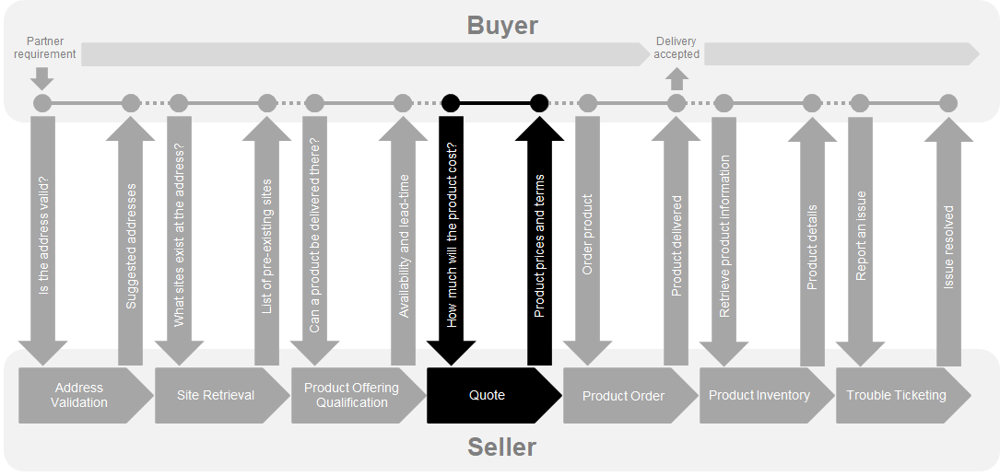

**Figure 3. Cantata and Sonata End-to-End Function Flow**

- Address Validation:
  - Allows the Buyer to retrieve address information from the Seller, including
    exact formats, for Geographic Addresses known to the Seller.
- Site Retrieval:
  - Allows the Buyer to retrieve Service Site information including exact
    formats for Service Sites known to the Seller.
- Product Offering Qualification (POQ):
  - Allows the Buyer to check whether the Seller can deliver a product or set of
    products from among their product offerings at the geographic address or a
    Geographic Site specified by the Buyer; or modify a previously purchased
    product.
- Quote:
  - Allows the Buyer to submit a request to find out how much the installation
    of an instance of a Product Offering, an update to an existing Product, or a
    disconnect of an existing Product will cost.
- Product Order:
  - Allows the Buyer to request the Seller to initiate and complete the
    fulfillment process of an installation of a Product Offering, an update to
    an existing Product, or a disconnect of an existing Product at the address
    defined by the Buyer.
- Product Inventory:
  - Allows the Buyer to retrieve the information about existing Product
    instances from Seller's Product Inventory.
- Trouble Ticketing:
  - Allows the Buyer to create, retrieve, and update Trouble Tickets as well as
    receive notifications about Incidents' and Trouble Tickets' updates. This
    allows managing issues and situations that are not part of normal operations
    of the Product provided by the Seller.

Note that this is not a comprehensive list of APIs available in Cantata and
Sonata IRPs.

<div class="page"/>

# 5. API Description

This section presents the API structure and design patterns. It starts with the
high-level use cases diagram. Then it describes the REST endpoints with use case
mapping. Next, it gives an overview of the API resource model and an explanation
of the design pattern that is used to combine product-agnostic and
product-specific parts of API payloads. Finally, payload validation and API
security aspects are discussed.

## 5.1. Pre-Requisites

Prior to establishing an API communication, the Buyer and the Seller need to
agree on the following, during the so-called onboarding process:

- Commercial contract and terms
- Authentication method
- Supported Geographic Address Representations (only when `GeographicAddress.id`
  is not supported)
- Supported response type (Immediate, Deferred, both)
- Notification support

**[R1]** The Seller and the Buyer **MUST** agree on the method used to identify
a place, either by `GeographicAddressRef`, `GeographicSiteRef` or
`GeographicAddress_Query`.

## 5.2. Use cases

Figure 4 presents a high-level use case diagram as specified in MEF 80
[[MEF 80](#8-references)] in section 7.2. This picture aims to help understand
the endpoint mapping. Use cases are described extensively in
[chapter 6](#6-api-interactions-and-flows)

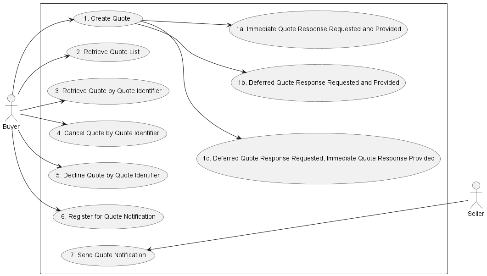

**Figure 4. Use cases**

## 5.3. API Endpoint and Operation Description

### 5.3.1. Seller-side API Endpoints

**Base URL for Cantata**:

`https://{{serverBase}}:{{port}}{{?/seller_prefix}}/mefApi/cantata/quoteManagement/v3/`

**Base URL for Sonata**:

`https://{{serverBase}}:{{port}}{{?/seller_prefix}}/mefApi/sonata/quoteManagement/v9/`

The following API endpoints are implemented by the Seller and allow the Buyer to
send Quote requests, retrieve existing Quotes or Quote details, and manage
notification registrations. The endpoints and corresponding data model are
defined in `productApi/quote/quoteManagement.api.yaml`.

| API endpoint         | Description                                                                                                                                | MEF 80 Use Case mapping                   |
| -------------------- | ------------------------------------------------------------------------------------------------------------------------------------------ | ----------------------------------------- |
| `POST /quote`        | A request initiated by the Buyer to _create_ new `Quote` and start the quotation process on the Seller's side.                             | UC 1: Create Quote <br>(incl. 1a, 1b, 1c) |
| `GET /quote`         | A request initiated by the Buyer to retrieve a list of `Quotes` from the Seller based on filter criteria provided as _`query`_ parameters. | UC 2: Retrieve Quote List                 |
| `GET /quote/{{id}}`  | A request initiated by the Buyer to retrieve full details of a specific `Quote` based on `id`_ provided as _`path`\_ parameter             | UC 3: Retrieve Quote by Quote Identifier  |
| `POST /cancelQuote`  | A request initiated by the Buyer to _cancel_ existing `Quote`. The `Quote.id` is provided in the message body.                             | UC 4: Cancel Quote by Quote Identifier    |
| `POST /declineQuote` | A request initiated by the Buyer to _decline_ existing `Quote`. The `Quote.id` is provided in the message body.                            | UC 5: Decline Quote by Quote Identifier   |
| `POST /hub`          | A request initiated by the Buyer to instruct the Seller to send notifications of `Quote` and `QuoteItem` state change events.              | UC 6: Register for Quote Notifications    |
| `GET /hub/{{id}}`    | A request initiated by the Buyer to retrieve the details of specific notification registration.                                            | UC 6: Register for Quote Notification     |
| `DELETE /hub/{{id}}` | A request initiated by the Buyer to instruct the Seller to stop sending notifications.                                                     | UC 6: Register for Quote Notification     |

**Table 3. Seller side API endpoints**

**[R2]** The Seller **MUST** support either Use Case 1a or 1b in a sense that
both types of requests (immediate or deferred) **MUST** be supported yet only
one of the response types (immediate or deferred) MAY be supported. [MEF80 R11]

**[R3]** The Seller **MUST** support Use Cases 2, 3, 4, and 5.

**[O1]** The Seller **MAY** support Use Cases 1a, 1b, 1c, and 6.

### 5.3.2. Buyer-side API Endpoints

**Base URL for Cantata**:

`https://{{serverBase}}:{{port}}{{?/seller_prefix}}/mefApi/cantata/quoteNotification/v3/`

**Base URL for Sonata**:

`https://{{serverBase}}:{{port}}{{?/seller_prefix}}/mefApi/sonata/quoteNotification/v9/`

The following API Endpoints are used by the Seller to post `Quote` and
`QuoteItem` notifications to registered listeners. The endpoints and
corresponding data model are defined in
`productApi/quote/quoteNotification.api.yaml`

| API Endpoint                               | Description                                                                            | MEF 80 Use Case Mapping       |
| ------------------------------------------ | -------------------------------------------------------------------------------------- | ----------------------------- |
| `POST /listener/quoteStateChangeEvent`     | A request initiated by the Seller to notify the buyer of the `Quote` state change.     | UC 7: Send Quote Notification |
| `POST /listener/quoteItemStateChangeEvent` | A request initiated by the Seller to notify the Buyer of the `QuoteItem` state change. | UC 7: Send Quote Notification |

**Table 4. Buyer-side API endpoints**

**[O2]** The Buyer **MAY** support Use Case 7.

## 5.4. Specifying the Buyer ID and the Seller ID

A business Entity willing to represent multiple Buyers or multiple Sellers must
follow requirements of [[MEF 150](#8-references)] chapter 8.8, which states:

> For requests of all types, there is a business Entity that initiates an
> Operation (called a Requesting Entity) and a business Entity that is
> responding to this request (called the Responding Entity). In the simplest
> case, the Requesting Entity is the Buyer and the Responding Entity is the
> Seller. However, in some cases, the Requesting Entity may represent more than
> one Buyer and similarly, the Responding Entity may represent more than one
> Seller.


**Figure 5. Buyer ID and Seller ID Examples**

> As shown in Figure 5, if a Requesting Entity representing a single Buyer is
> doing business with a Responding Entity representing a single Seller, Buyer
> and Seller IDs are not required to be passed between the two Entities. If a
> Requesting Entity representing more than one Buyer is doing business with a
> Responding Entity representing a single Seller, the Buyer ID is required to be
> passed between the two Entities. If a Requesting Entity representing a single
> Buyer is doing business with a Responding Entity representing multiple
> Sellers, the Seller ID is required to be passed between the two Entities. If a
> Requesting Entity representing multiple Buyers is doing business with a
> Responding Entity representing multiple Sellers, both the Buyer ID and the
> Seller ID are required to be passed between the Entities.

> While it is outside the scope of this specification, it is assumed that the
> Requesting Entity and the Responding Entity are aware of each other and can
> authenticate requests initiated by the other party. It is further assumed that
> the Buying Entity knows:
>
> - the list of Buyers the Requesting Entity represents when interacting with
>   this Responding Entity; and
> - the list of Sellers that this Responding Entity represents to this
>   Requesting Entity.
>
> It is also assumed that the Responding Entity knows:
>
> - the list of Sellers that this Responding Entity represents to this
>   Requesting Entity and
> - the list of Buyers the Requesting Entity represents when interacting with
>   this Respond-ing Entity.

In the API the `buyerId` and `sellerId` are represented as optional query
parameters in each operation defined.

**[R4]** If the Requesting Entity has the authority to represent more than one
Buyer the request **MUST** include `buyerId` that identifies the Buyer being
represented [MEF150 R62]

**[R5]** If the Responding Entity represents more than one Seller to this Buyer
the request **MUST** include `sellerId` that identifies the Seller with whom
this request is associated [MEF150 R63]

## 5.5. Integration of Product Specific Attributes

Product specifications are defined using JsonSchema format and are integrated
into a Quote payload using a standard TMF extension pattern.

The extension hosting type in the API data model is `MEFProductConfiguration`.
The `@type` attribute of that type must be set to a value that uniquely
identifies the product specification. A unique identifier for MEF standard
product specifications is in URN format and is assigned by MEF. This identifier
is provided as root schema `$id` and in product specification documentation. Use
of non-MEF standard product definitions is allowed. In such a case, the schema
identifier must be agreed between the Buyer and the Seller.

The example below shows a header of a Product Specification schema, where
`"$id": urn:mef:lso:spec:sonata:access-eline-ovc:v5.0.0:all` is the
above-mentioned URN:

```yaml
'$schema': http://json-schema.org/draft-07/schema#
'$id': urn:mef:lso:spec:sonata:access-eline-ovc:v5.0.0:all
title: MEF LSO Sonata - Access Eline OVC Product Schema
```

Product specifications are provided as Json schemas without the
`MEFProductConfiguration` context.

Product-specific attributes must be introduced into the `productConfiguration`
attribute of the `MEFProductRefOrValueQuote`.

Implementations might choose to integrate selected product specifications into
the data model during development. In such cases an integrated data model is
built and product specifications are in an inheritance relationship with
`MEFProductConfiguration` as described in OAS specification. This pattern is
called **Static Binding**. The SDK is additionally shipped with a set of API
definitions that statically bind all product-related APIs (POQ, Quote, Order,
Inventory) with all corresponding product specifications available in the
release. The snippets below present an example of a static binding of the Quote
API with a number of MEF product specifications, from both
`MEFProductConfiguration` and product specification point of view:

```yaml
MEFProductConfiguration:
  description:
    MEFProductConfiguration is used as an extension point for MEF-specific
    product/service payload.  The `@type` attribute is used as a discriminator
  discriminator:
    mapping:
      urn:mef:lso:spec:sonata:carrier-ethernet-operator-uni:v5.0.0:all: '#/components/schemas/CarrierEthernetOperatorUni'
      urn:mef:lso:spec:sonata:access-eline-ovc:v5.0.0:all: '#/components/schemas/AccessElineOvc'
    propertyName: '@type'
  properties:
    '@type':
      description:
        The name of the type, defined in the JSON schema specified above, for
        the product that is the subject of the Quote Request. The named type
        must be a subclass of MEFProductConfiguration.
      type: string
```

```yaml
AccessElineOvc:
  allOf:
    - $ref: '#/components/schemas/MEFProductConfiguration'
    - $ref: '#/components/schemas/AccessElineOvcCommon'
    - properties:
        uniEp:
          $ref: '#/components/schemas/AccessElineOvcEndPoint'
          description:
            MEF 26.2 sec. 16 - The OVC EP object for the OVC EP at the UNI. The
            UNI OVC End Point must be included in the Access E-Line Product.
        enniEp:
          $ref: '#/components/schemas/AccessElineOvcEndPoint'
          description:
            MEF 26.2 sec. 16 - The OVC EP object for the OVC EP at the ENNI. The
            ENNI OVC End Point must be included in the Access E-Line Product.
```

Alternatively, implementations might choose not to build an integrated model and
choose different mechanisms allowing runtime validation of product-specific
fragments of the payload. The system is able to validate given product against a
new schema without redeployment. This pattern is called **Dynamic Binding.**

Regardless of the chosen implementation pattern, the HTTP payload is exactly the
same. Both implementation approaches must conform to the requirements specified
below.

**[R6]** `MEFProductConfiguration` type is an extension point that **MUST** be
used to integrate product specifications' properties into a request/response
payload.

**[R7]** The `@type` property of `MEFProductConfiguration` **MUST** be used to
specify the type of the extending entity.

**[R8]** Product attributes specified in the payload must conform to the product
specification indicated by the `@type` property.

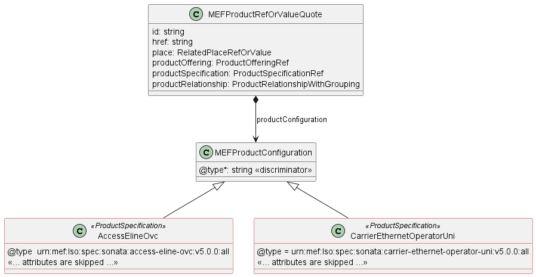

**Figure 6. The Extension Pattern**

Figure 6 depicts two MEF `<<ProductSpecifications>>` that represent Access
E-Line and Operator UNI products. When these products are used in the Quote
payload the `@type` of `MEFProductConfiguration` takes
`"urn:mef:lso:spec:sonata:access-eline-ovc:v5.0.0:all"` or
`"urn:mef:lso:spec:sonata:carrier-ethernet-operator-uni:v5.0.0:all"` value to
indicate which product specification should be used to interpret a set of
product-specific attributes included in the payload.

The _all_ suffix after the product type name in the URN comes from the approach
that the product schemas may differ depending on the API they are used with.
`all` means that this schema is applicable to all contexts.

This document uses samples of Access E-Line Product specification definitions to
construct API payload examples in [Section 6](#6-api-interactions-and-flows).

**_Note:_** The Access E-Line product is valid only in the Sonata context. It is
used only for the explanation of the rules of combining the product-agnostic
(envelope) and product-specific (payload) parts of the APIs. The examples do not
represent full and consistent product configurations, they are not normative and
are not kept up to date with their respective standards. It is out of the scope
of this document to explain the details of any product.

## 5.6. Sample Product Specification

The Sonata SDK contains product specification definitions, from which Access
E-Line [[MEF 106](#8-references)] is used in the payload samples in this
section. They are located in the SDK at:

`\productSchema\carrierEthernet\operatorEthernet\accessEline\accessElineOvc.yaml`
`\productSchema\carrierEthernet\operatorEthernet\carrierEthernetOperatorUni\carrierEthernetOperatorUni.yaml`

Figure 7 depicts a simplified view of the defined relationships with other
products and places.


**Figure 7. A Simplified View of Product and Place Relationships**

Product specifications define a number of product-related and envelope-related
requirements. Sample envelope-related requirements for Access E-Line:

- for an Access E-Line OVS product two mandatory relationship roles must be
  specified, one with the operator ENNI (`CONNECTS_TO_ENNI`) and a second with
  the operator UNI (`CONNECTS_TO_UNI`).
- in the case of a `modify` action, product relationships must have the same
  value as in the `add` action. They must not be changed
- for an operator UNI product a place relationship (`INSTALL_LOCATION`) must be
  specified
- in the case of a `modify` action, place relationships must have the same value
  as in the `add` action. They must not be changed

The product relationship (`product.productRelationship`) and the place
relationship (`product.place`) are presented in Figure 7.

In case some of both product-related or envelope-related requirements are
violated the Seller returns an error response to the Buyer which indicates
specific functional errors. These errors are listed in the response body (a list
of `Error422` entries) for HTTP `422` response.

## 5.7. Model Structural Validation

The structure of the HTTP payloads exchanged via Quote API endpoints is defined
using:

- OpenAPI version 3.0 for product-agnostic part of the payload
- JsonSchema (draft 7) for product-specific part of the payload

**[R9]** Implementations **MUST** use payloads that conform to these
definitions.

**[R10]** The Buyer and the Seller **MUST NOT** use any operation, entity or
attribute that is not explicitly defined or allowed by this standard.

**[R11]** A product specification may define additional consistency rules and
requirements that **MUST** be respected by implementations. [MEF80 R23]

These are defined for:

- required relation type, multiplicity to other items in the same quote request
- required relation type, multiplicity to entities in the Seller's product
  inventory
- related contact information roles that are to be defined at the item level
- relations to places (locations) and their roles that are to be defined at the
  item level

## 5.8. Security Considerations

There must be an authentication mechanism whereby a Seller can be assured who a
Buyer is and vice-versa. There must also be authorization mechanisms in place to
control what a particular Buyer or Seller is allowed to do and what information
may be obtained. However, the definition of the exact security mechanism and
configuration is outside the scope of this document. Security considerations are
standardized by _LSO API Security Profile_ [[MEF 128.1](#8-references)].

<div class="page"/>

# 6. API Interactions and Flows

This section provides a detailed insight into the API functionality, use cases,
and flows. It starts with Table 5 presenting a list and short description of all
business use cases then presents the variants of ent-to-end interaction flows,
and in the following subchapters describes the API usage flow and examples for
each of the use cases.

| Use Case # | Use Case Name                                                        | Use Case Description                                                                                                                          |
| ---------- | -------------------------------------------------------------------- | --------------------------------------------------------------------------------------------------------------------------------------------- |
| 1          | Create Quote                                                         | The Buyer requests a Quote from the Seller using one of the sub-use Cases below.                                                              |
| 1a         | Immediate Quote Response Requested and Provided                      | The Buyer requests a Quote from the Seller and requests an Immediate Quote Response.                                                          |
| 1b         | Deferred Quote Response Requested and Provided                       | The Buyer requests a Quote from the Seller and does not request an Immediate Quote Response. The Seller provides a Deferred Quote Response.   |
| 1c         | Deferred Quote Response Requested, Immediate Quote Response Provided | The Buyer requests a Quote from the Seller and does not request an Immediate Quote Response. The Seller provides an Immediate Quote Response. |
| 2          | Retrieve Quote List                                                  | The Buyer requests a list of Quotes from the Seller based on Quote filter criteria.                                                           |
| 3          | Retrieve Quote by Quote Identifier                                   | The Buyer requests detailed information related to a single Quote based on a Quote Identifier.                                                |
| 4          | Cancel Quote by Quote Identifier                                     | The Buyer requests to Cancel a Quote.                                                                                                         |
| 5          | Decline Quote by Quote Identifier                                    | The Buyer declines the Quote.                                                                                                                 |
| 6          | Register for Quote Notifications                                     | The Buyer initiates a request to instruct the Seller to send notifications of Quote and/or Quote Item state changes                           |
| 7          | Send Quote Notification                                              | Seller sends Notifications to the Buyer                                                                                                       |

**Table 5. Use cases description**

The detailed business requirements of each of the use cases are described in
sections 7.2 and 8 of MEF 80 [[MEF 80](#8-references)] and in
[[MEF80.0.1](#8-references)].

## 6.1. API Resource Schema Summary

This subchapter describes the most important entities from the resource model
which can be found in the API specification. Each entity is a simple or composed
type (with the use of `allOf` keyword for data type composition). A simple type
defines a set of properties that might be of an object, primitive, or reference
type.

**[R12]** If an entity is used in the request or response payload, all
properties marked as required **MUST** be provided.

[Section 6](#6-api-interactions-and-flows) provides examples of data model and
API usage. For a detailed description and complete definition of the data model,
please refer to [API Details](#7-api-details) chapter.

### 6.1.1. Key Entities - Create request

Figure 8 presents the most important parts of the data model used during the
Quote request (`POST /quote`) that is sent by a Buyer (see
[Section 5.3.1](#531-seller-side-api-endpoints) for details). The model of the
request message is a subset of the `Quote` model and contains only attributes
that can (or must) be set by the Buyer. The Seller then enriches the entity in
the response with additional information.

**[R13]** `Quote_Create` is the root entity of a quote request. It **MUST**
contain one or more `QuoteItem_Create` [MEF80 R12].

**_Note:_** `Quote_Create` and `QuoteItem_Create` are entities used by the Buyer
to make a request. `Quote` and `QuoteItem` are entities used by the Seller to
provide a response. The request entities have a subset of attributes of the
response entities. Thus for visibility of these shared attributes `Quote_Common`
and `QuoteItem_Common` have been introduced. Though, these are not to be used
directly in the exchange.

A `QuoteItem_Create` defines details of the product being subject of the
quotation (in `MEFProductRefOrValueQuote` structure) and allows for the
definition of additional information like related parties
(`RelatedContactInformation`) or relations to other items
(`QuoteItemRelationship`).

`MEFProductRefOrValueQuote` allows for the introduction of MEF product-specific
properties to the Quote payload. The extension mechanism is described in detail
in [Section 5.5.](#55-integration-of-product-specific-attributes).
`MEFProductRefOrValueQuote` may be also used to specify relations to places
(using specializations of `RelatedPlaceRefOrQueryWithSubUnit`) and/or to a
product that exists in the Seller's inventory (using `ProductRelationship`).

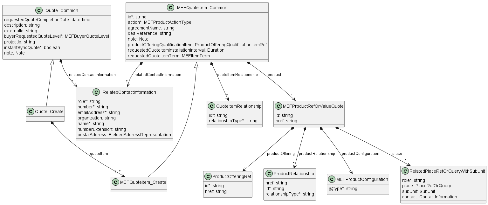

**Figure 8. Key Entities - Create Request**

### 6.1.2. Key Entities - Response

Figure 9. shows the most important data model parts used to provide a response
to a Buyer's Create Quote (`POST /quote`) or to retrieve a `Quote` by identifier
(`GET /quote/{{id}}`) request. Please note that the model differs only with the
number of attributes for `Quote` and `QuoteItem` entities.

**[R14]** Any attribute set by the Buyer in the request **MUST NOT** be modified
by the Seller in the response.

`Quote` is the root entity of a response and it contains one or more
`QuoteItems`. For `Quote` and each of the `QuoteItems`, the Seller provides the
state and, if applicable, the final quotation (`QuotePrice`) to a particular
item from Buyer's request.

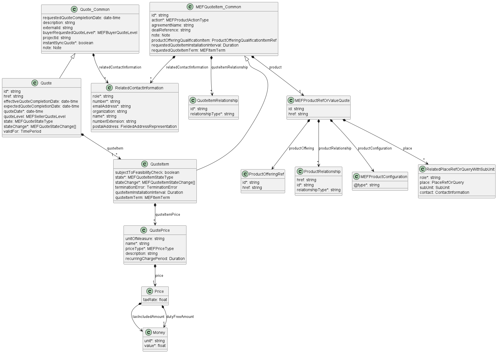

**Figure 9. Key Entities - Response**

### 6.1.3. Quote Process Flow

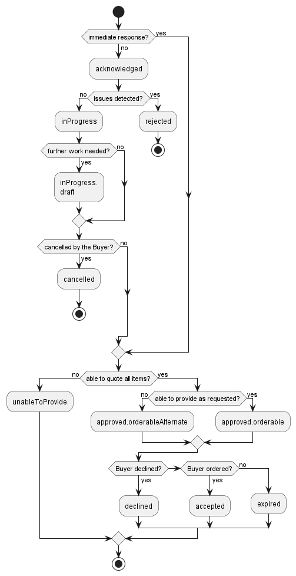

**Figure 10. Quote firm flow activity diagram**

The Buyer makes the decision about the kind of response that will be provided.
The decision is rather implementation than request-dependent. After successful
basic syntax checks, the response is sent back with all objects in the
`acknowledged` state. If some issues were found an Error message must be
returned. After moving the Quote to the `acknowledged` state the Seller has no
technical possibility to send back an error message. In case any problems are
found in the next business validation, the Quote must be moved to `rejected`
state indicating the reason for rejection.

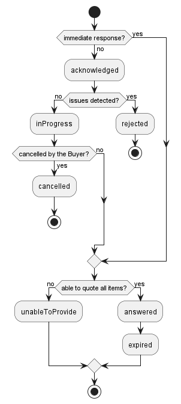

**Figure 11. Quote budgetary flow activity diagram**

The following tables present the possible combinations of Quote and QuoteItem
states, as described in MEF 80 [[MEF 80](#8-references)]:

| Quote State\Quote Items State | abandoned | acknowledged | inProgress | inProgress.draft | approved.orderableAlternate | approved.orderable | rejected | unableToProvide |
| ----------------------------- | --------- | ------------ | ---------- | ---------------- | --------------------------- | ------------------ | -------- | --------------- |
| accepted                      |           |              |            |                  | X                           | X                  |          |                 |
| acknowledged                  |           | X            |            |                  |                             |                    |          |                 |
| cancelled                     | X         |              |            |                  | X                           | X                  | X        | X               |
| declined                      |           |              |            |                  | X                           | X                  |          |                 |
| expired                       |           |              |            |                  | X                           | X                  |          |                 |
| inProgress                    |           | X            | X          | X                | X                           | X                  |          |                 |
| inProgress.draft              |           | X            |            | X                | X                           | X                  |          |                 |
| approved.orderableAlternate   |           |              |            |                  | X                           | X                  |          |                 |
| approved.orderable            |           |              |            |                  |                             | X                  |          |                 |
| rejected                      | X         |              |            |                  |                             |                    | X        |                 |
| unableToProvide               | X         |              |            |                  | X                           | X                  |          | X               |

**Table 6. Allowable Quote Item States per Quote State for FIRM Quote Level**

| Quote State\Quote Items State | abandoned | acknowledged | answered | inProgress | rejected | unableToProvide |
| ----------------------------- | --------- | ------------ | -------- | ---------- | -------- | --------------- |
| acknowledged                  |           | X            |          |            |          |                 |
| answered                      |           |              | X        |            |          |                 |
| cancelled                     | X         |              | X        |            |          |                 |
| expired                       |           |              | X        |            |          |                 |
| inProgress                    |           | X            | X        | X          |          |                 |
| rejected                      | X         |              |          |            | X        |                 |
| unableToProvide               | X         |              | X        |            |          | X               |

**Table 7. Allowable Quote Item States per Quote State for BUDGETARY Quote
Level**

### 6.1.4. Quote Item Process Flow

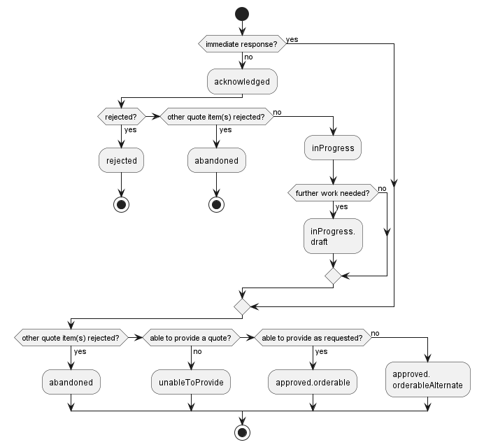

**Figure 12. Quote Item firm quote flow activity**

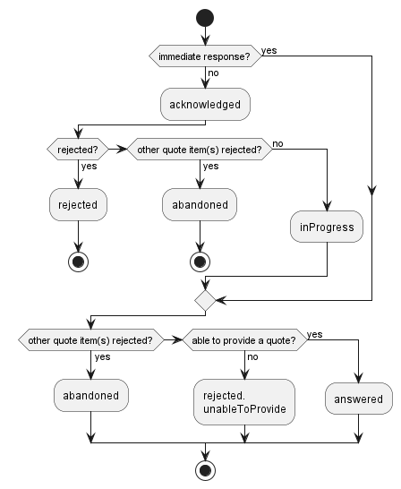

**Figure 13. Quote Item budgetary quote flow activity**

### 6.1.5. Providing the place information

When required by product specification, the Buyer must point to the place where
the Product is to be provided. This is done with the use of the `Quote Item's`
attribute: `product.place` of type `RelatedPlaceRefOrQueryWithSubUnit`, which is
presented in Figure 14.

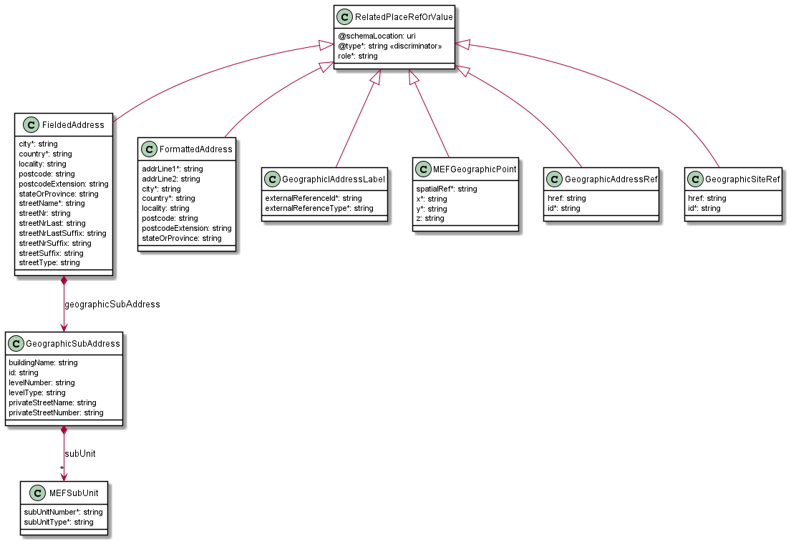

**Figure 14. Data model - referring to a place**

The `role` defines the function that the place plays for a given Product. The
name of the role to be provided is strictly defined by the product
specification. Usually, it is `INSTALL_LOCATION`.

`contact` provides additional information about the person to contact to get
access to this place in case such access is required to complete the evaluation
of this Quote Item.

`place` is where the actual place is pointed. The attribute is of type
`PlaceRefOrQuery` which is an abstract class that can be of one of three types:
`GeographicAddressRef`, `GeographicSiteRef`, or `GeographicAddress_Query`. The
first two are simple identifiers to reference a `GeographicAddress` or
`GeographicSite` respectively. The Buyer usually first validates the
`GeographicAddress` and gets its identifier from the Seller and then optionally
retrieves `GeographicSite` information for that address. In the unlikely case
that the Seller does not provide the Address Validation API and the Buyer is not
able to obtain the address identifier in any other way, the
`GeographicAddressQuery` type might be used. It contains lists of Geographic
Address Representations to provide the address information by value. There are
four types of Geographic Address Representations:

- `FieldedAddressRepresentation`
- `FormattedAddressRepresentation`
- `LabelRepresentation`
- `GeographicPointRepresentation`

The Buyer may use one or more of these representations to describe a single
desired place. The Buyer must provide sufficient clarity that allows the Seller
to match to precisely one place. For this reason, the success rate of Quote
inquiries is significantly better when identifiers are used.

In case when there is no desired `GeographicSite` object in the Seller's system,
or `GeographicAddress` precision is not sufficient, the Buyer may use the
`subUnit` attribute to provide more detailed information about the precise
location of the installation. This information may be used by the Seller to
create an instance of a `GeographicSite` with the same `subUnit` attribute
value.

The `GeographicAddress` model together with its above-mentioned representations
and respective requirements are defined by [MEF 121.1](#8-references) (chapter
5.3). That standard is the owner of those definitions. This API specification
contains a model of `GeographicAddress` but does not define it. Any further
changes of these types will update the API specification, but will not be
reflected in this document.

The mandatory `@type` attribute of `GeographicSiteRef`, `GeographicAddressRef`
and `GeographicAddress_Query` is used as a discriminator to unambiguously
identify the intended type when using in the context of the `oneOf` section of
`PlaceRefOrQuery` type.

**[D1]** For all Addresses that have not been validated, a Buyer **SHOULD**
initiate a Validate Address request, to get the Seller's full details associated
with this Address prior to submitting a Create Quote request. [MEF80 D1]

**[D2]** For all Addresses that have been validated, the Buyer **SHOULD** use
the Seller's Address Identifier to describe the location when submitting a
Create Quote request and when a Service Site does not exist. [MEF80 D2]

**[D3]** After validating an Address, a Buyer **SHOULD** initiate a Retrieve
Service Site List request and obtain the Seller's Service Site Identifiers for
all Service Sites at the validated Address prior to submitting a Create Quote
request. [MEF80 D3]

**[D4]** Once the Buyer has obtained the Service Site Identifier of the Service
Site, then for all subsequent operations related to this Service Site, the Buyer
**SHOULD** use the Seller's Service Site Identifier to reference this Service
Site when submitting a Create Quote request. [MEF80 D4]

## 6.2. Use case 1: Create Quote

There are two possible types of interaction: immediate and deferred.

1. The Seller responds immediately with the final results of the processing.
   This is called an Immediate Quote Response.
2. The Seller acknowledges that the request has been received, but will not
   complete processing it immediately, and send notifications to update the
   Buyer on the status (assuming the Buyer has subscribed to receive the
   notifications). This is called a Deferred Quote Response.

Their details are described in the following subchapters.

**[R15]** When providing responses to the API calls the Buyer and the Seller
**MUST** provide relevant HTTP Response codes.

**_Note_**: The term "Seller Response Code" used in the Business Requirements
maps to HTTP response code, where `2xx` indicates _Success_ and `4xx` or `5xx`
indicate _Failure_.

### 6.2.1. Use case 1a: Immediate Quote Response Requested and Provided

An immediate quote response can be requested by a Buyer using a mandatory
`instantSyncQuote` flag set to `true`. If the Buyer's Create Quote request is
not valid, the appropriate error code and description are returned in case the
request doesn't pass the initial validation. In case of successful processing,
the Seller responds with a `Quote` in one of the Completion States:
`approved.orderable`, `answered` or `approved.orderableAlternate` to indicate
success or `unableToProvide` to indicate that the Buyer did not provide enough
information or the Seller is not able to provide the answer for any other
reason.

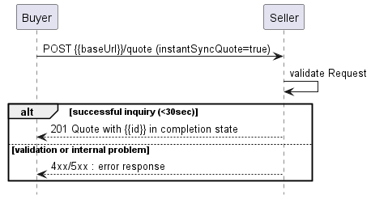

**Figure 15. Use case 1a: Immediate Quote Response Requested and Provided**

Figure 15 presents the basic synchronous use case flow while the one below adds
the context when the Buyer decides to use additional asynchronous the
Notification mechanism (and the Seller supports it). In this case, the Buyer
must register to receive notifications before sending the Create Quote request.
In case of Immediate Response, the received Quote will already be in the
Completion State. The notification can be sent afterward if from a successful
Completion State (`approved.orderable` or `approved.orderableAlternate`), the
Quote will move to one of the Terminal States (`accepted`, `declined`,
`expired`).

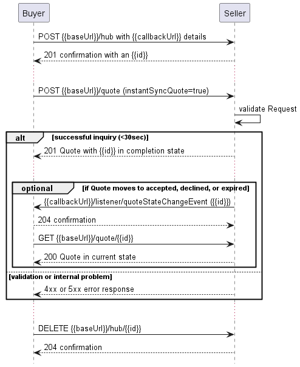

**Figure 16. Use case 1a: Immediate Quote Response Requested and Provided with
Notification**

**_Note_**: The context of notifications is not a part of the considered use
case itself. It is presented to show the big picture of end-to-end flow. This
applies also to all further use case flow diagrams with notifications.

### 6.2.2. Use case 1b: Deferred Quote Response Requested and Provided

A deferred quotation can be requested by using the `instantSyncQuote` flag set
to `false`. The Seller responds with `Quote` (state `acknowledged` and
`Quote.id` specified) and starts processing the request asynchronously. When the
Buyer has registered for quote notifications, the Seller will send a quote state
change notifications to the Buyer.

The Buyer may choose between two possible patterns to get details on the
progress of his quote: polling and notification.

In the first case (Figure 17), the Buyer needs to poll periodically for the
Quote to check its state until the Completion State is reached and optionally to
check whether the state changed to one of the Terminal States

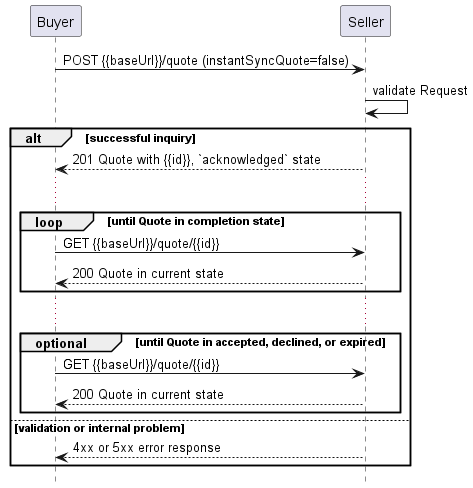

**Figure 17. Use case 1b: Deferred Quote Response Requested and Provided -
Polling pattern**

To use the notifications mechanism (Figure 18), the Buyer needs to register for
by providing a callback endpoint before sending the Quote Create request. The
Seller sends notifications of Quote changes until the Terminal State is reached.
The state change is an update from the state (all attributes are considered, not
only the `Quote.state`) that was sent as a first response to a Create Quote
request.

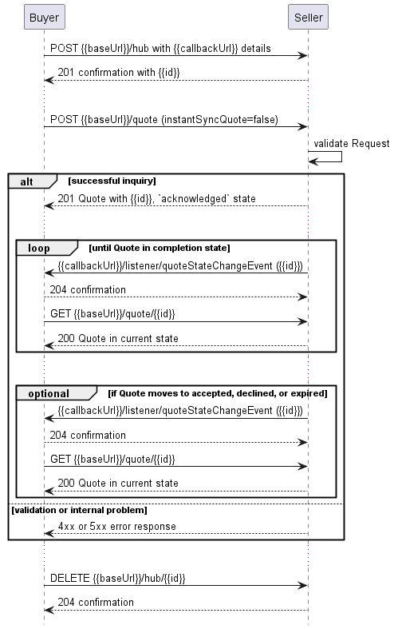

**Figure 18. Use case 1b: Deferred Quote Response Requested and Provided -
Notification pattern**

### 6.2.3. Use case 1c: Deferred Quote Response Requested, Immediate Quote Response Provided

In this scenario, the Buyer does not request an Immediate Quote Response
(`instantSyncQuote` equals `false`), but the Seller is able to provide one and
does so by providing a synchronous response with a `Quote` in one of the
Completion States.

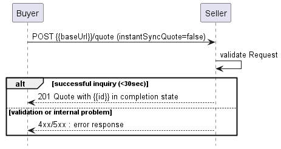

**Figure 19. Use case 1c: Deferred Quote Response Requested, Immediate Quote
Response Provided**

Figure 19 presents the case where the Buyer didn't register for Quote
Notifications.

Figure 20 presents the interaction between the Buyer and the Seller when the
Buyer registered for Quote Notifications. Please note that in this case (just
like in use case 1a) the Seller provides an immediate response. The Quote state
change event will only be sent after some time when the Quote reaches a terminal
state (e.g. `expired`).


**Figure 20. Use case 1c: Deferred Quote Response Requested, Immediate Quote
Response Provided, with Notifications**

### 6.2.4. Buyer's Quote request

To send a Quote request the Buyer uses the `createQuote` operation from the API:
`POST /quote`. The Create Quote request model is common for Use Cases 1a, 1b,
and 1c. For clarity, some of the Quote payload's attributes might be omitted to
improve examples' readability.  
The full list of attributes is available in [Section 7](#7-api-details) and in
the API specification which is an integral part of this standard.

**`Quote` Create**

```json
{
  "instantSyncQuote": false,
  "buyerRequestedQuoteLevel": "firm",
  "requestedQuoteCompletionDate": "2020-08-10T16:45:39.368Z",
  "description": "Buyer defined description ",
  "externalId": "buyerQuote-001", << Buyer understandable External Id >>
  "projectId": "buyerProject-001", << Buyer understandable Project Id >>
  "quoteItem": [
    {
      "id": "item-001",
      "action": "add",
      "product": { << product specific attributes and configuration, see 6.3.3 >>
      },
      "productOfferingQualificationItem": {
        "id": "poqItem-001",
        "productOfferingQualificationId": "32112300-0000-0000-0000-000000000394812"
      },
      "requestedQuoteItemTerm": {
        "duration": {
          "amount": 12,
          "units": "calendarMonths"
        },
        "endOfTermAction": "autoRenew",
        "name": "Yearly Subscription"
      },
      "relatedContactInformation": [
        {
          "emailAddress": "eddie.technical@buyer.mef.com",
          "name": "Eddie Technical",
          "number": "12-345-6789",
          "numberExtension": "1234",
          "role": "quoteItemTechnicalContact"
        }
      ]
    }
  ],
  "relatedContactInformation": [
    {
      "emailAddress": "john.example@buyer.mef.com",
      "name": "John Example",
      "number": "12-345-6789",
      "numberExtension": "1234",
      "role": "buyerContactInformation"
    }
  ]
}
```

**[R16]** In the create Quote request, the Buyer **MUST** provide the following
attributes: [MEF80 R13]

- `buyerRequestedQuoteLevel`
- `instantSyncQuote`
- `quoteItem` (minimum 1)

**[R17]** If `instantSyncQuote` equals `false` the Buyer **MUST** also provide
`relatedContactInformation[]` with an item of `role` equal
`buyerContactInformation`. [MEF80 R16]

**[R18]** If `instantSyncQuote` equals `false` the Buyer **MUST** also provide
`requestedQuoteCompletionDate`. [MEF80 R17], [MEF80 R18]

**[O3]** The Seller **MAY** decide to make the
`productOfferingQualificationItem` mandatory for a Buyer Create Quote request.
[MEF80 O5]

**_Note:_** During the onboarding the Seller may require to provide an
additional contact `role`.

**_Note:_** It is up to Seller's discretion on how to react in case the Buyer
provides a contact `role` that is not listed by this standard or agreed upon
during the onboarding. Preferably the Seller should return an error with a
message stating which `roles` are accepted. It may also be ignored.

**[R19]** For every `QuoteItem` in the create Quote request, the Buyer **MUST**
specify the following attributes: [MEF80 R14], [MEF80 R13]

- `id`
- `action`
- `product`

**[R20]** If `instantSyncQuote` equals `false` the Buyer **MUST** also provide
`relatedContactInformation[]` with an item of `role` equal
`quoteItemTechnicalContact`. [MEF80 R15]

**[R21]** The `QuoteItem` content **MUST** follow the product
specification-related requirements when specifying values for
`relatedContactInformation`, `quoteItemRelationship`, `product.place`, and
`product.productRelationship` attributes.

Some Product Specifications allow providing a list of related products even for
relationship types whose final cardinality is 1. These act like a list of
candidates. For example, the Buyer may include a list of ENNIs between the Buyer
and Seller as related Products. The ENNIs in the list might need to all be in
the same Geographic Area as defined by the Seller (same city, same county,
etc.). The Seller uses any of the ENNIs in the list to respond to the POQ
Request.

**[R22]** When specifying the `product.place`, the Buyer **MUST** provide
following attributes`: [*MEF80.0.1 A1-R1]

- `place`
- `role`

**[R23]** When specifying the `product.place`, with `GeographicSiteRef` the
Buyer **MUST NOT** additionally provide `subUnit` to describe exactly where the
Buyer wants the Product to be installed. [*MEF80.0.1 A1-R3]

### 6.2.5. Seller's Response to a Create Quote Request

The following snippet presents the Seller's response. It has the same structure
as in the retrieve by identifier operation.

```json
{
  "id": "00000000-0000-0000-0000-000000000123",
  "href": "{{baseUrl}}/quote/00000000-0000-0000-0000-000000000123",
  "state": "approved.orderable",
  "effectiveQuoteCompletionDate": "2020-08-10T16:45:20.421Z",
  "expectedQuoteCompletionDate": "2020-08-10T16:45:39.421Z",
  "quoteDate": "2020-08-10T16:40:33.422Z",
  "quoteLevel": "firm",
  "instantSyncQuote": "false", << as provided by the Buyer >>
  "buyerRequestedQuoteLevel": "firm", << as provided by the Buyer >>
  "requestedQuoteCompletionDate": "2020-08-10T16:45:39.368Z", << as provided by the Buyer >>
  "externalId": "buyerQuote-001", << as provided by the Buyer >>
  "projectId": "buyerProject-001", << as provided by the Buyer >>
  "stateChange": [
    {
      "changeDate": "2020-08-10T16:45:39.422Z",
      "state": "approved.orderable"
    },
    {
      "changeDate": "2020-08-10T16:42:39.422Z",
      "state": "inProgress.draft"
    },
    {
      "changeDate": "2020-08-10T16:40:39.422Z",
      "state": "inProgress"
    },
    {
      "changeDate": "2020-08-10T16:40:33.422Z",
      "state": "acknowledged"
    }
  ],
  "quoteItem": [
    {
      "id": "item-001",
      "action": "add",
      "state": "approved.orderable",
      "stateChange": [
        {
          "changeDate": "2020-08-10T16:45:39.422Z",
          "state": "approved.orderable"
        },
        {
          "changeDate": "2020-08-10T16:42:39.422Z",
          "state": "inProgress.draft"
        },
        {
          "changeDate": "2020-08-10T16:40:39.422Z",
          "state": "inProgress"
        },
        {
          "changeDate": "2020-08-10T16:40:33.422Z",
          "state": "acknowledged"
        }
      ],
      "subjectToFeasibilityCheck": false,
      "product": {<< as provided by the Buyer >>},
      "productOfferingQualificationItem": {
        "id": "poqItem-001",
        "productOfferingQualificationId": "32112300-0000-0000-0000-000000000394812"
      },
      "requestedQuoteItemTerm": {<< as provided by the Buyer >>
        "duration": {
          "amount": 12,
          "units": "calendarMonths"
        },
        "endOfTermAction": "autoRenew",
        "name": "Yearly Subscription"
      },
      "relatedContactInformation": [<< as provided by the Buyer >>
        {
          "emailAddress": "eddie.technical@buyer.mef.com",
          "name": "Eddie Technical",
          "number": "12-345-6789",
          "numberExtension": "1234",
          "role": "quoteItemTechnicalContact"
        }
      ],
      "quoteItemTerm": {
        "duration": {
          "amount": 12,
          "units": "calendarMonths"
        },
        "endOfTermAction": "autoRenew",
        "name": "Yearly Subscription"
      },
      "quoteItemPrice": [
        {
          "name": "Monthly Plan 25",
          "priceType": "recurring",
          "recurringChargePeriod": {
            "amount": 1,
            "units": "calendarMonths"
          },
          "price": {
            "taxRate": 16,
            "dutyFreeAmount": {
              "unit": "EUR",
              "value": 25
            },
            "taxIncludedAmount": {
              "unit": "EUR",
              "value": 29
            }
          }
        }
      ]
    }
  ],
  "relatedContactInformation": [
    {
      "emailAddress": "john.example@buyer.mef.com",
      "name": "John Example",
      "number": "12-345-6789",
      "role": "buyerContactInformation"
    },
    {
      "emailAddress": "kate.example@seller.mef.com",
      "name": "Kate Example",
      "number": "12-345-67890",
      "role": "sellerContactInformation"
    }
  ],
  "validFor": {
    "endDateTime": "2020-08-17T16:45:39.422Z"
  }
}
```

**[R24]** As mentioned earlier, the Seller **MUST NOT** change the values of
attributes specified by the Buyer. [MEF80 R36]

These attributes are indicated above with an appropriate comment:
`<< as provided by the Buyer >>`.

**[R25]** In the response, the Seller **MUST** provide the following attributes:
[MEF80 R35], [MEF80 R44], [MEF80 R39], [MEF80 R40], [MEF80 R46], [MEF80 R58].

- `id`
- `state`
- `stateChange`
- `quoteDate`
- `relatedContactInformation` with added `role=sellerContactInformation`
- `quoteItem`
  - `quoteItem.state`
  - `quoteItem.stateChange`
  - `quoteItem.quoteItemTerm`

**[R26]** Each item in `quoteItem` list **MUST** correspond to one and only one
Quote Item in the Buyer's Create Quote request. [MEF80 R36], [MEF80 R45]

**[R27]** If the `Quote` is in Completion State and the Buyer requested a
`budgetary` level, the Seller **MUST** respond with `quoteLevel` equal to
`budgetary`. [MEF80 R42]

**[R28]** If the `Quote` is in a Completion State and the Buyer request a `firm`
level, the Seller **MUST** respond with `quoteLevel` equal to `firm` or
`firmSubjectToFeasibilityCheck`. [MEF80 40]

**[R29]** If the `quoteLevel` is `firmSubjectToFeasibilityCheck`, the Seller
**MUST** specify the `subjectToFeasibilityCheck` equal to `true` attribute in
their response for at least one `quoteItem`. [MEF80 R46]

**[R30]** The `stateChange` **MUST** include a full object's state history
including the initial state (also in the Immediate Response).

The Seller might append related contact information if required, either at the
item or Quote level but cannot modify related contact information provided by
the Buyer.

**[R31]** If the Seller's Quote specifies `endOfTermAction` equal to `roll` for
a `QuoteItem.quoteItemTerm`, then the Seller **MUST** specify the `rollInterval`
for that Quote Item. [MEF80 R61]

**[R32]** If the Seller's Quote specifies `endOfTermAction` equal to `autoRenew`
or `autoDisconnect`, then the Seller **MUST NOT** specify the `rollInterval` for
that Quote Item. [MEF80 R62]

**[R33]** The grace period after auto-renewal during which the Buyer can
disconnect the Product without penalty **MUST** be agreed between Seller and
Buyer as part of onboarding if the Seller chooses to use the value `autoRenew`
for the `endOfTermAction` attribute. [MEF80 R63]

**[R34]** The `quoteItemTerm.duration` specified in the Seller's Quote **MUST**
be the closest term duration that the Seller offers to the Buyer's
`requestedQuoteItemTerm.duration`. [MEF80 R59]

**[O4]** The `quoteItemTerm.duration` specified by the Seller in their Quote
**MAY** be greater than, equal to, or less than the Buyer's
`requestedQuoteItemTerm.duration`.[MEF80 O13]

**[R35]** If the `requestedQuoteItemTerm.duration` specified in the Seller's
Quote is less than the Buyer's `requestedQuoteItemTerm.duration` and the `Quote`
moves to the Orderable states, the `quoteItem.state` **MUST** be
`approved.orderableAlternate`.[MEF80 R60]

**[R36]** When specifying the `quoteItem.quoteItemPrice` the Seller **MUST**
provide the following attributes: [MEF80 R55]

- `name`
- `priceType`
- `price.dutyFreeAmount`

**[R37]** When specifying the `quoteItem.quoteItemPrice` the Seller **MUST**
follow the combination of attributes presented in Table 8. [MEF80 R56], [MEF80
R57]

| `priceType`    | `recurringChargePeriod` | `unitOfMeasure` | `price.dutyFreeAmount` | Comments                                                 |
| -------------- | ----------------------- | --------------- | ---------------------- | -------------------------------------------------------- |
| `recurring`    | X                       |                 | X                      |                                                          |
| `nonRecurring` |                         |                 | X                      |                                                          |
| `usageBased`   |                         | X               | X                      | `price.dutyFreeAmount` is the charge per `unitOfMeasure` |

**Table 8. Price Type Required Information**

### 6.2.6. Quote Item Specification Details

This section provides examples of how the `quoteItem` should look like depending
on the desired `action`.

#### 6.2.6.1. Quote Item Structure for `add` Action

When requesting a new Product (`action` equal to `add`) the Buyer needs to
provide all of its configurations. The example below shows a request for Access
E-Line product (type `urn:mef:lso:spec:sonata:access-eline-ovc:v5.0.0:all`).

```json
{
  <<Quote attributes...>>
  "quoteItem": [
    {
      "id": "item-001",
      "action": "add",
      ...
      "product": {
        "productConfiguration": {
          "@type": "urn:mef:lso:spec:sonata:access-eline-ovc:v5.0.0:all",
          "ceVlanIdPreservation": "PRESERVE",
          "maximumFrameSize": 1526,
          "listOfClassOfServiceNames": ["low"],
          "enniEp": {
            "identifier": "SP1_ENNI-EP1",
            "ingressClassOfServiceMap": {
              "mapType": "ENDPOINT",
              "map_M": "low",
              "l2cp_P": {
                "l2cpIdentifier": {
                  "l2cpProtocolType": "LLC",
                  "llcAddressOrEtherType": 66
                },
                "l2cpCosName": "low"
              }
            }
          },
          "uniEp": {
            "identifier": "NewYork_UNI-EP1",
            "ingressBandwidthProfilePerClassOfServiceName": [
              {
                "classOfServiceName": "low",
                "bwpFlow": {
                  "cir": {
                    "irValue": 0,
                    "irUnits": "MBPS"
                  },
                  "cirMax": {
                    "irValue": 0,
                    "irUnits": "MBPS"
                  },
                  "eir": {
                    "irValue": 10,
                    "irUnits": "GBPS"
                  },
                  "eirMax": {
                    "irValue": 10,
                    "irUnits": "GBPS"
                  }
                }
              }
            ],
            "ingressClassOfServiceMap": {
              "mapType": "ENDPOINT",
              "map_M": "low",
              "l2cp_P": {
                "l2cpIdentifier": {
                  "l2cpProtocolType": "LLC",
                  "llcAddressOrEtherType": 66
                },
                "l2cpCosName": "low"
              }
            }
          }
        },
        "productOffering": {
          "id": "000073"
        },
        "productRelationship": [
          {
            "relationshipType": "CONNECTS_TO_ENNI",
            "id": "SP1_ENNI"
          }
        ]
      },
      "quoteItemRelationship": [
        {
          "relationshipType": "CONNECTS_TO_UNI",
          "id": "item-002"
        }
      ]
    },
    {
      "id": "item-002",
      "action": "add",
      ...
      "product": {
        "productOffering": {
          "id": "000074"
        },
        "place": [
          {
            "place": {
              "@type": "GeographicAddressRef",
              "id": "NewYorkAddress-id-1"
            },
            "role": "INSTALL_LOCATION",
            "contact": [
              {
                "number": "+12-345-678-90",
                "emailAddress": "LocationContact@buyer.mef.com",
                "name": "Location Contact"
              }
            ]
          }
        ],
        "productConfiguration": {
          "@type": "urn:mef:lso:spec:sonata:carrier-ethernet-operator-uni:v5.0.0:all",
          "defaultCeVlanId": 4094,
          "maximumNumberOfEndPoints": 6,
          "lagLinkMeg": "DISABLED",
          "linkAggregation": "NONE",
          "tokenShare": "ENABLED",
          "maximumServiceFrameSize": 1522,
          "listOfPhysicalLinks": [
            {
              "id": "01",
              "physicalLink": "10GBASE_SR",
              "uniConnectorGender": "SOCKET",
              "synchronousEthernet": "ENABLED",
              "uniConnectorType": "SC",
              "precisionTiming": "DISABLED"
            }
          ]
        }
      }
    }
  ]
}
```

**[R38]** `MEFProductConfiguration` **MUST** be provided in the payload in case
an item `action` is set to `add` [MEF80 R21].

**[R39]** `productOffering` - **MUST** be provided in the payload in case an
item `action` is set to `add` [MEF80 R21]

**[R40]** The Buyer **MUST NOT** specify the `product.id` in the request when
`action` equal to `add`. It is the Seller who assigns this id [MEF80 R27].

An Access E-Line product specification defines two mandatory relationship types
that have to be specified in case of quoting an `add` action: `CONNECTS_TO_ENNI`
and `CONNECTS_TO_UNI`.  
The reference to an operator UNI product might use another Quote item or an
existing product from the Seller's inventory. In this example, the UNI product
is another item of the request with a unique identifier `item-002`. This Access
E-Line product references an existing ENNI product which is uniquely identified
with id `SP1_ENNI` in the Seller's inventory.

The place is not provided as the Access E-Line product specification does not
allow for a place description to be part of the request. Values for some of the
available product attributes are provided under the `productConfiguration` node.
This example uses only a tiny subset of available Access E-Line attributes. It
aims to explain the Product definition and relation patterns, not to focus on
the product configurations themselves.

This specification describes the structure and requirements defined for this
product with which the payload should be validated. Product specification is a
subject of MEF standardization. It is published as a dedicated MEF standard. It
is built of:

- the JSON Schemas for technical specifications. Those can be found in the SDK
  in the `\productSchema\` directory.
- a document with a textual description of the product and a list of the
  requirements (not all of them can be technically included in the JSON schema).
  Such documents can be found in the `\documentation\productSchema\` directory
  of the SDK package.

The product offering is a business representation of a product specification
version offered by the Seller for purchase. Product offering associates
commercial attributes to a product specification. The product offering model is
not part of the standardization and is up to the Seller to define their
offering.

Both product specifications and product offerings are not negotiated and
exchanged within Cantata and Sonata. They are agreed between the Buyer and the
Seller during the onboarding process. After that, they are only referenced as in
the example above.

#### 6.2.6.2. Quote Item Structure for `modify` Action

The following example shows a request for a quotation of an existing Access
E-Line Product modification (`action` equal to `modify`). In particular, changes
to `cir` (Committed Information Rate) and `cirMax` (Maximum Committed
Information Rate) values for `uniEp` bandwidth profiles are introduced.  
The Access E-Line product exists in Seller's inventory and is identified as
`AccessElineOVC-0001`.

**[R41]** If `action=modify` the Buyer **MUST** provide following attributes of
`quoteItem.product`: [MEF80 R28]

- `product.id`
- `product.productOffering`
- `product.productConfiguration`

**[R42]** The modify request **MUST** provide a full state of the `product`
attributes, including values of (specified or empty) of
`product.productRelationship` and `product.place`. [MEF80 R29]

The Product Specification defines if the relationships to products or places can
be changed.

**[O5]** The Seller **MAY** allow the Buyer to specify a different
`product.productOffering` than the one of the existing Product.

**[R43]** If `product.productOffering` changes, it **MUST** be based on the same
Product Specification` as the existing Product.

There is no possibility to send an update to single attributes. The Buyer must
send a full product description (the whole `product.productConfiguration`
section and if set previously or to be set: `product.productRelationship` and
`product.place`), which means all attributes that represent the desired state,
even if some of them do not change.  
If the Seller does not allow for some of the attributes to change an appropriate
error response (`422`) must be returned to the Buyer.

Please also note, that in the `add` case, a reference to the UNI product used
the `quoteItemRelationship` pointing to another `quoteItem` in the same Quote
Request. This is because the UNI did not exist at that moment and was also a
part of the quotation. In the case of quoting the update of an existing Access
E-Line, the UNI is also existing and it must be referenced with the use of
`productRelationship`. This example assumes that the UNI product is available in
Seller's Inventory with the `id=SP1_UNI`.

```json
{
  <<Quote attributes...>>
  "quoteItem": [
    {
      "id": "item-001",
      "action": "modify",
      ...
      "product": {
        "id": "AccessElineOVC-0001",
        "productConfiguration": {
          "@type": "urn:mef:lso:spec:sonata:access-eline-ovc:v5.0.0:all",
          "ceVlanIdPreservation": "PRESERVE",
          "maximumFrameSize": 1526,
          "listOfClassOfServiceNames": ["low"],
          "enniEp": {
            "identifier": "SP1_ENNI-EP1",
            "ingressClassOfServiceMap": {
              "mapType": "ENDPOINT",
              "map_M": "low",
              "l2cp_P": {
                "l2cpIdentifier": {
                  "l2cpProtocolType": "LLC",
                  "llcAddressOrEtherType": 66
                },
                "l2cpCosName": "low"
              }
            }
          },
          "uniEp": {
            "identifier": "NewYork_UNI-EP1",
            "ingressBandwidthProfilePerClassOfServiceName": [
              {
                "classOfServiceName": "low",
                "bwpFlow": {
                  "cir": {
                    "irValue": 1,
                    "irUnits": "GBPS"
                  },
                  "cirMax": {
                    "irValue": 1,
                    "irUnits": "GBPS"
                  },
                  "eir": {
                    "irValue": 10,
                    "irUnits": "GBPS"
                  },
                  "eirMax": {
                    "irValue": 10,
                    "irUnits": "GBPS"
                  }
                }
              }
            ],
            "ingressClassOfServiceMap": {
              "mapType": "ENDPOINT",
              "map_M": "low",
              "l2cp_P": {
                "l2cpIdentifier": {
                  "l2cpProtocolType": "LLC",
                  "llcAddressOrEtherType": 66
                },
                "l2cpCosName": "low"
              }
            }
          }
        },
        "productOffering": {
          "id": "000073"
        },
        "productRelationship": [
          {
            "relationshipType": "CONNECTS_TO_ENNI",
            "id": "SP1_ENNI"
          },
          {
            "relationshipType": "CONNECTS_TO_UNI",
            "id": "SP1_UNI"
          }
        ]
      },
      "relatedContactInformation": [
        {
          "number": "1-234-567-890",
          "emailAddress": "john@buyer.mef.com",
          "role": "buyerContactInformation",
          "name": "John Example"
        }
      ]
    }
  ]
}
```

#### 6.2.6.3. Quote Item Structure for `delete` Action

The example below represents a single Quote request for deletion (`action`
equals `delete`) of an existing Access E-Line product
(`id=AccessElineOVC-0001`). It assumes that `instantSyncQuote=true` so no
`relatedContactInformation` is provided.

```json
{
  <<Quote attributes...>>
  "quoteItem": [
    {
      "id": "item-001",
      "action": "delete",
      "product": {
        "id": "AccessElineOVC-0001"
      }
    }
  ]
}
```

**[R44]** In the `delete` request the Buyer **MUST** provide the
`quoteItem.product.id` attribute. [MEF80 R30]

**[R45]** In the `delete` request the Buyer **MUST NOT** provide any of the
following attributes: [MEF80 R31]

- `quoteItem.productOfferingQualificationItem`
- `quoteItem.quoteItemRelationship`
- `quoteItem.product.*` - product attributes other than `id`

## 6.3. Use Case 2: Retrieve Quote List

The Buyer can retrieve a list of `Quotes` by using a `GET /quote` operation with
desired filtering criteria.

**[O6]** The Buyer **MAY** use any of the following query parameters to query
for the Quote list: [MEF80 O17]

- `state`
- `quoteLevel`
- `externalId`
- `projectId`
- `quoteDate.gt`
- `quoteDate.lt`
- `requestedQuoteCompletionDate.gt`
- `requestedQuoteCompletionDate.lt`
- `expectedQuoteCompletionDate.gt`
- `expectedQuoteCompletionDate.lt`
- `effectiveQuoteCompletionDate.gt`
- `effectiveQuoteCompletionDate.lt`

**[O7]** The Buyer **MAY** use a combination of attributes to avoid getting an
`Error422` with `tooManyRecords` code.

The Buyer may also ask for pagination of the response when the number of results
is too big. The following query attributes related to pagination can be
provided:

- `limit` - number of expected list items
- `offset` - offset of the first element in the result list.

```
https://serverRoot/mefApi/sonata/quoteManagement/v9/quote?state=approved.orderable&quoteLevel=firm&limit=20&offset=0
```

The example above shows a Buyer's request to get the first twenty `Quotes` that
are in `approved.orderable` state and with `firm` level. The correct response
(HTTP code `200`) contains a list of `Quote_Find` objects matching the criteria
in the response body. To get more details (e.g. the item level information), the
Buyer has to query a specific `Quote` by id.

The Seller returns a list of elements that comply with the requested `limit`. If
the requested `limit` is higher than the supported list size then the smaller
list of results is returned. In that case, the size of the result is returned in
the header attribute `X-Result-Count`. The Seller can indicate that there are
additional results available using:

- `X-Total-Count` header attribute with the total number of available results
- `X-Pagination-Throttled` header set to `true`

**[D5]** The Seller **SHOULD** support the pagination mechanism.

**[CR1]<[D5]** Seller **MUST** use either `X-Total-Count` or
`X-Pagination-Throttled` to indicate that the page was truncated and additional
results are available.

**[R46]** The Seller **MUST** put the following attributes into the `Quote_Find`
object in the response: [MEF80 R77]

- `id`
- `effectiveQuoteCompletionDate`
- `expectedQuoteCompletionDate`
- `externalId`
- `projectId`
- `quoteDate`
- `quoteLevel`
- `requestedQuoteCompletionDate`
- `state`

In case no items match the criteria an empty list is returned.

**[R47]** In case of too many matching items are found (the definition of 'too
many' is up to Seller's discretion), the Seller **MUST** return an `Error422`
with `code=tooManyRecords`.

In that case, the Buyer can change the filter criteria and/or repeat the query
with pagination in order to avoid receiving the `tooManyRecords` error.

Below you can find a response with 2 matching entities:

```json
[
  {
    "id": "00000000-0000-0000-0000-000000000123",
    "effectiveQuoteCompletionDate": "2020-08-10T16:45:20.421Z",
    "expectedQuoteCompletionDate": "2020-08-10T16:45:39.421Z",
    "externalId": "BuyerId-00112233",
    "projectId": "Project-ABCDEF",
    "quoteDate": "2020-08-10T16:40:33.422Z",
    "quoteLevel": "firm",
    "requestedQuoteCompletionDate": "2020-08-10T16:45:39.368Z",
    "state": "approved.orderable"
  },
  {
    "id": "00000000-1212-3434-0000-987600000abc",
    "effectiveQuoteCompletionDate": "2020-09-112T08:25:20.421Z",
    "expectedQuoteCompletionDate": "2020-09-112T08:25:39.421Z",
    "externalId": "BuyerId-99887766",
    "projectId": "Project-ZYX",
    "quoteDate": "2020-09-112T08:20:33.422Z",
    "quoteLevel": "firm",
    "requestedQuoteCompletionDate": "2020-09-112T08:25:39.368Z",
    "state": "approved.orderable"
  }
]
```

## 6.4. Use Case 3: Retrieve Quote by Quote Identifier

The Buyer can get detailed information about the Quote from the Seller by using
a `GET /quote/{{id}}` operation. In case `id` does not allow to find a `Quote`
in Seller's Inventory, an error response `404` must be returned. The payload
returned in the response includes all the attributes Buyer has provided while
sending a Quote request. The attributes provided by the Seller depend on the
status of the `Quote` and may require some time to be set.

**[R48]** If `quoteLevel` equals `firm` then the response must specify
attributes as shown in Table 9 and Table 10. [MEF80 R81]

Please note that for readability purposes following tables (9, 10, 11, and 12)
do not show attributes specified by the Buyer that must be echoed back by the
Seller without any change. Attributes required to be provided by the Seller are
shown by an "R", Required if Populated by the Seller shown by a "PR", or
Optional to be provided by the Seller or the Buyer shown by an "O".

|                                                           | accepted                | acknowledged            | cancelled               | declined                | expired                 | inProgress              | inProgress.draft        | approved.orderable      | approved.orderableAlternate | rejected                | unableToProvide         |
| --------------------------------------------------------- | ----------------------- | ----------------------- | ----------------------- | ----------------------- | ----------------------- | ----------------------- | ----------------------- | ----------------------- | --------------------------- | ----------------------- | ----------------------- |
| id                                                        | R                       | R                       | R                       | R                       | R                       | R                       | R                       | R                       | R                           | R                       | R                       |
| state                                                     | R                       | R                       | R                       | R                       | R                       | R                       | R                       | R                       | R                           | R                       | R                       |
| stateChange                                               | R                       | R                       | R                       | R                       | R                       | R                       | R                       | R                       | R                           | R                       | R                       |
| quoteDate                                                 | R                       | R                       | R                       | R                       | R                       | R                       | R                       | R                       | R                           | R                       | R                       |
| expectedQuoteCompletionDate                               | O                       | O                       | O                       | O                       | O                       | R                       | R                       | O                       | O                           | O                       | O                       |
| validFor                                                  | O                       |                         |                         | O                       | O                       |                         |                         | R                       | R                           |                         |                         |
| effectiveQuoteCompletionDate                              |                         |                         | R                       |                         |                         |                         |                         | R                       | R                           |                         | R                       |
| quoteLevel                                                | R                       |                         | PR                      | R                       | R                       |                         | R                       | R                       | R                           |                         |                         |
| note                                                      | E - Buyer / PR - Seller | E - Buyer / PR - Seller | E - Buyer / PR - Seller | E - Buyer / PR - Seller | E - Buyer / PR - Seller | E - Buyer / PR - Seller | E - Buyer / PR - Seller | E - Buyer / PR - Seller | E - Buyer / PR - Seller     | E - Buyer / PR - Seller | E - Buyer / PR - Seller |
| relatedContactInformation (role=sellerContactInformation) | R                       | E                       | R                       | R                       | R                       | R                       | R                       | R                       | R                           | E                       | R                       |

**Table 9. Seller Response to Query by ID, FIRM Quote Level, Quote Attributes**

|                               | accepted                | acknowledged            | cancelled               | declined                | expired                 | inProgress              | inProgress.draft        | approved.orderable      | approved.orderableAlternate | rejected                | unableToProvide         |
| ----------------------------- | ----------------------- | ----------------------- | ----------------------- | ----------------------- | ----------------------- | ----------------------- | ----------------------- | ----------------------- | --------------------------- | ----------------------- | ----------------------- |
| subjectToFeasibilityCheck     | R                       | PR                      | PR                      | R                       | R                       |                         | R                       | R                       | R                           |                         |                         |
| note                          | E - Buyer / PR - Seller | E - Buyer / PR - Seller | E - Buyer / PR - Seller | E - Buyer / PR - Seller | E - Buyer / PR - Seller | E - Buyer / PR - Seller | E - Buyer / PR - Seller | E - Buyer / PR - Seller | E - Buyer / PR - Seller     | E - Buyer / PR - Seller | E - Buyer / PR - Seller |
| state                         | R                       | R                       | R                       | R                       | R                       | R                       | R                       | R                       | R                           | R                       | R                       |
| stateChange                   | R                       | R                       | R                       | R                       | R                       | R                       | R                       | R                       | R                           | R                       | R                       |
| price                         | R                       |                         |                         | R                       | R                       |                         | R                       | R                       | R                           |                         |                         |
| quoteItemTerm                 | R                       |                         |                         | R                       | R                       |                         | R                       | R                       | R                           |                         |                         |
| quoteItemInstallationInterval | R                       |                         |                         | R                       | R                       |                         | R                       | R                       | R                           |                         |                         |
| terminationError              |                         |                         |                         | PR                      |                         |                         |                         |                         |                             |                         | R                       |

**Table 10. Seller Response to Query by ID, FIRM Quote Level, QuoteItem
Attributes**

**[R49]** If `quoteLevel` equals `budgetary` then the response must specify
attributes as shown in Table 11 and Table 12. [MEF80 R82]

|                                                           | answered                | acknowledged            | cancelled               | expired                 | inProgress              | rejected                | unableToProvide         |
| --------------------------------------------------------- | ----------------------- | ----------------------- | ----------------------- | ----------------------- | ----------------------- | ----------------------- | ----------------------- |
| id                                                        | R                       | R                       | R                       | R                       | R                       | R                       | R                       |
| state                                                     | R                       | R                       | R                       | R                       | R                       | R                       | R                       |
| stateChange                                               | R                       | R                       | R                       | R                       | R                       | R                       | R                       |
| quoteDate                                                 | R                       | R                       | R                       | R                       | R                       | R                       | R                       |
| expectedQuoteCompletionDate                               | O                       |                         | O                       | O                       | R                       |                         | O                       |
| validFor                                                  | R                       |                         |                         |                         |                         |                         |                         |
| effectiveQuoteCompletionDate                              | R                       |                         | R                       | R                       |                         |                         | R                       |
| quoteLevel                                                | R                       | R                       | R                       | R                       | R                       | R                       | R                       |
| note                                                      | E - Buyer / PR - Seller | E - Buyer / PR - Seller | E - Buyer / PR - Seller | E - Buyer / PR - Seller | E - Buyer / PR - Seller | E - Buyer / PR - Seller | E - Buyer / PR - Seller |
| relatedContactInformation (role=sellerContactInformation) | R                       | R                       | R                       | R                       | R                       | R                       | R                       |

**Table 11. Seller Response to Query by ID, BUDGETARY Quote Level, Quote
attributes**

|                               | answered                | acknowledged            | cancelled               | expired                 | inProgress              | rejected                | unableToProvide |
| ----------------------------- | ----------------------- | ----------------------- | ----------------------- | ----------------------- | ----------------------- | ----------------------- | --------------- |
| subjectToFeasibilityCheck     | NA                      | NA                      | NA                      | NA                      | NA                      | NA                      | NA              |
| note                          | E - Buyer / PR - Seller | E - Buyer / PR - Seller | E - Buyer / PR - Seller | E - Buyer / PR - Seller | E - Buyer / PR - Seller | E - Buyer / PR - Seller |                 |
| state                         | R                       | R                       | R                       | R                       | R                       | R                       | R               |
| stateChange                   | R                       | R                       | R                       | R                       | R                       | R                       | R               |
| price                         | R                       |                         |                         | R                       |                         |                         |                 |
| quoteItemTerm                 | R                       |                         |                         | R                       |                         |                         |                 |
| quoteItemInstallationInterval | R                       |                         |                         | R                       |                         |                         |                 |
| terminationError              |                         |                         |                         |                         |                         | PR                      | PR              |

**Table 12. Seller Response to Query by ID, BUDGETARY Quote Level, QuoteItem
attributes**

In the example below, the `Quote` is in the `approved.orderable` state.

**[R50]** The `Quote` can be in `approved.orderable` state only when all its
`QuoteItems` are in the `approved.orderable` state as well [MEF80 R70].

**[D6]** When moving the Quote to `rejected` or `unableToProvide` state, the
Seller **SHOULD** use the `quoteItem.terminationError` to describe the reason
for item processing failure.

The Seller's response to an inquiry is valid for one week
(`validFor.endDateTime`). The `stateChange` lists the history of the `Quote`
state.

```json
{
  "id": "00000000-0000-0000-0000-000000000123",
  "href": "{{baseUrl}}/quote/00000000-0000-0000-0000-000000000123",
  "state": "approved.orderable",
  "quoteLevel": "firm",
  "instantSyncQuote": false,
  "buyerRequestedQuoteLevel": "firm",
  "effectiveQuoteCompletionDate": "2020-08-10T16:45:20.421Z",
  "quoteDate": "2020-08-10T16:40:33.422Z",
  "validFor": {
    "endDateTime": "2020-08-17T16:45:39.422Z"
 },
  "quoteItem": [
 {
      "state": "approved.orderable",
      "subjectToFeasibilityCheck": false,
      "id": "item-001",
      "action": "add"
      << some attributes are omitted >>
 },
 {
      "state": "approved.orderable",
      "subjectToFeasibilityCheck": false,
      "id": "item-002",
      "action": "add"
      << some attributes are omitted >>
 }
 ],
  "stateChange": [
 {
      "changeDate": "2020-08-10T16:45:39.422Z",
      "state": "approved.orderable"
 },
 {
      "changeDate": "2020-08-10T16:42:39.422Z",
      "state": "inProgress.draft"
 },
 {
      "changeDate": "2020-08-10T16:40:39.422Z",
      "state": "inProgress"
 },
 {
      "changeDate": "2020-08-10T16:40:33.422Z",
      "state": "acknowledged"
 }
 ],
  "relatedContactInformation": [
 {
      "emailAddress": "john.example@buyer.mef.com",
      "name": "John Example",
      "number": "12-345-6789",
      "role": "buyerContactInformation"
 },
 {
      "emailAddress": "kate.example@seller.mef.com",
      "name": "Kate Example",
      "number": "12-345-67890",
      "role": "sellerContactInformation"
 }
 ]
}
```

## 6.5. Use case 4: Cancel Quote by Quote Identifier

The Buyer may decide to cancel a Quote request that is in progress (`inProgress`
or `inProgress.draft` states). A `cancelQuote` operation from the
`POST /cancelQuote` endpoint must be used to do so.

**[R51]** The Seller **MUST** provide the ability for a Buyer to cancel a
`Quote` when the `Quote` is in the `inProgress` or `inProgress.draft` state.
[MEF80 R1].

The message body contains only two attributes:

- `quoteId` - mandatory one to point which `Quote` must be canceled
- `reason` - to optionally specify the cause of the cancellation.

```json
{
  "quoteId": "00000000-0000-0000-0000-000000000123",
  "reason": "My requirements have changed I do not need this Quote to finish processing."
}
```

The Seller responds with the same body. No `id` is added. The cancellation
request does not create any trackable object in the Seller's system that can be
further tracked or monitored by the Buyer. The Seller is obliged to process such
a request and cancel the `Quote`.

The reason for having a separate `POST` endpoint for operation on the `Quote`,
even when it is not technically required, is keeping the pattern consistency
with Ordering API, where operations like `cancelOrder` are long-lasting
processes that can be tracked by the Buyer and might not necessarily end up with
success.

Figure 21 presents an example of the Cancel use case flow:

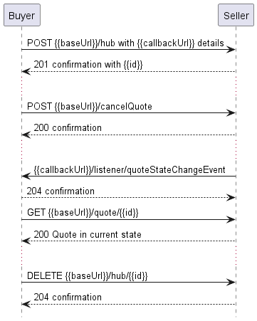

**Figure 21 Use case 4, 5: Cancel or Decline Quote by Quote Identifier**

**_Note_:** If the Buyer requests cancellation of a Quote that does not belong
to them, the Seller should respond that the Quote does not exist (`Error422`
with `code` equal to `referenceNotFound`)

## 6.6. Use case 5: Decline Quote by Quote Identifier

The Buyer may also decide to decline a `Quote` provided by the Seller
(`approved.orderable` or `approved.orderableAlternate` states). A `declineQuote`
operation from the `POST /declineQuote` endpoint must be used to do so.

**[R52]** The Seller **MUST** provide the ability for a Buyer to decline a
`Quote` when the `Quote` is in the `approved.orderable` or
`approved.orderableAlternate` state. [MEF80 R2].

The Decline Request has the same body and rules of usage as the Cancel Request
mentioned in the section above.

**_Note_**: Declining a Quote is optional. The Buyer may as well leave the
response unattended and let it time out.

**_Note_**: There is no endpoint to move the Quote to `accepted` state. The
Buyer accepts a Quote by placing an Order (using Order API) that refers to it.
In that case, it is the Seller who makes the transition to the `accepted` state.

## 6.7. Use case 6: Register for Quote Notifications

The Seller communicates with the Buyer with Notifications provided that:

- both Seller and Buyer support `Quote` notification mechanism
- Buyer has registered to receive `Quote` notifications from the Seller

To register for notifications the Buyer uses the `registerListener` operation
from the API: `POST /hub`. The request model contains only 2 attributes:

- `callback` - mandatory, to provide the callback address the events will be
  notified to,
- `query` - optional, to narrow the required types of events.

The usage of a combination of these attributes fulfills the [MEF80 R84], [MEF80
R85], and [MEF80 R86] requirements.

By using a simple request:

```json
{
  "callback": "https://buyer.mef.com/listenerEndpoint"
}
```

The Buyer subscribes for notification of all types of events.

If the Buyer wishes to receive only notification of a certain type, a `query`
must be added:

```json
{
  "callback": "https://buyer.mef.com/listenerEndpoint",
  "query": "eventType=quoteStateChangeEvent"
}
```

If the Buyer wishes to subscribe to 2 different types of events, there are 2
possible syntax variants [[TMF630](#8-references)]:

```
eventType=quoteStateChangeEvent,quoteItemStateChangeEvent
```

or

```
eventType=quoteStateChangeEvent&eventType=quoteItemStateChangeEvent
```

**_Note_**: There are only 2 event types in the Quote API so eventually there is
no need to request both in the query - an empty query may be used as well.

**[R53]** The Buyer **MUST** provide the `callback` during notification
registration.

The `query` formatting complies with [RFC3986](#8-references). According to it,
every attribute defined in the Event model (from notification API) can be used
in the `query`. However, this standard requires only `eventType` attribute to be
supported.

**[O8]** The Seller **MAY** support the ability for the Buyer to Register for
Quote Notification. [MEF80 O19]

**[CR2]<[O8]** If the Seller supports the ability for the Buyer to Register for
Quote Notifications, they **MUST** support sending Quote Notifications. [MEF80
CR3<O19]

**[R54]** If the Seller does not support notifications, they **MUST** return an
error message (`Error501`) to the Buyer indicating that notifications are not
supported.

**[R55]** `eventType` is the only attribute that the Seller **MUST** support in
the query.

The Seller responds to the subscription request by adding the `id` of the
subscription to the message that must be further used for unsubscribing.

```json
{
  "id": "00000000-0000-0000-0000-000000000678",
  "callback": "https://buyer.mef.com/listenerEndpoint",
  "query": "eventType=quoteStateChangeEvent"
}
```

Example of a final address that the Notifications will be sent to (for Sonata,
`quoteStateChangeEvent`):

- `https://buyer.mef.com/listenerEndpoint/mefApi/sonata/productOfferingQualificationNotification/v9/listener/quoteStateChangeEvent`

To stop receiving events, the Buyer has to use the `unregisterListener`
operation from the `DELETE /hub/{id}` endpoint. The `id` is the identifier
received from the Seller during the listener registration.

**[R56]** In the `unregisterListener` operation, the Buyer **MUST** provide the
`id` of the registered `EventSubscription` that originates from the Seller.

The example below shows an exemplary unregister call sent by the Buyer to the
Seller:

```url
http://seller.mef.com:8080/mefApi/sonata/quoteManagement/v9/hub/00000000-0000-0000-0000-000000000678
```

**[R57]** In the successful scenario the Seller **MUST** respond with an empty
body and HTTP code `204`.

The Buyer can unregister only the whole `EventSubscription`, regardless of the
provided `query`. In the case when the Buyer e.g. resigns from specific types of
events (or changes the callback address), the existing `EventSubscription` that
includes undesired notification types that need to be removed and replaced by
the new `EventSubscription` with adjusted `query` attribute.

**_Note:_** The above note concludes that the Buyer cannot update the existing
`EventSubscription`. Every kind of update is done by subscription replacement.

## 6.8. Use case 7: Send Quote Notification

Notifications are used to asynchronously inform the Buyer about the
`Quote.state` or `QuoteItem.state` attributes change. The Seller's synchronous
response to a Create Quote request is considered to act as a Create Notification
so there is no explicit Create Notification type. The next notification must be
sent when the `state` changes compared to the previously sent one.

For the sake of readability, all previous flow diagrams presented only cases of
using only the `quoteStateChangeEvent`. Figure 22 presents the end-to-end
sequence of communication in Use Case 1b - Deferred Quote Response Requested and
Provided with Buyer's subscription to both `quoteStateChangeEvent` and
`quoteItemStateChangeEvent` event types.

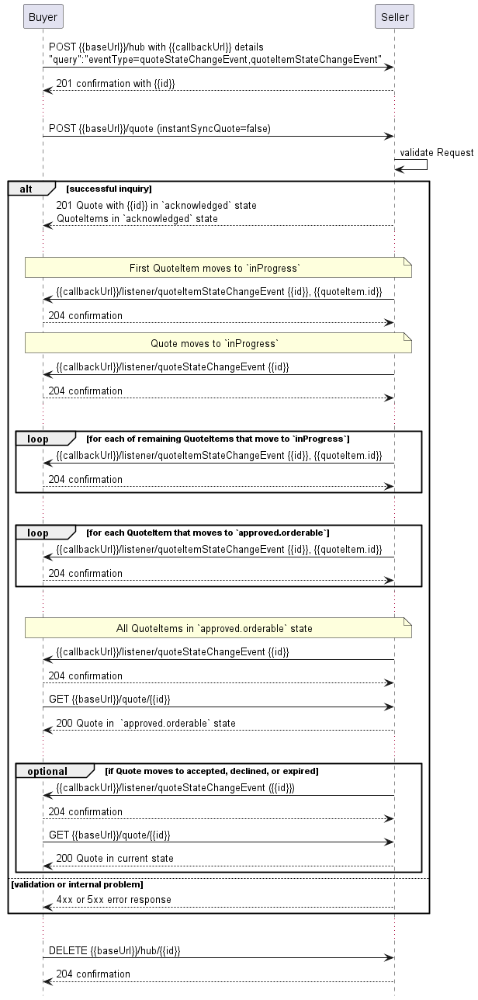

**Figure 22. Use case 1b: Deferred Quote Response Requested and Provided with
QuoteItem Notifications**

After a successful Notification subscription, the Buyer sends a Create Quote
request asking for a deferred response. The Seller responds with Quote and all
items in `acknowledged` state. When the first Quote Item moves to `inProgress`,
a `quoteItemStateChangeEvent` is sent. Immediately the Quote also changes its
state to `inProgress` and the `quoteStateChangeEvent` is sent. Then the rest (if
any) of the Quote Items are processed. When particular items are done processing
they reach the `approved.orderable` state. Once all are successfully done, the
Quote also changes state to `approved.orderable`. The Buyer will likely now ask
for the Quote details.

The events are sent only after a synchronous response to the create Quote
request was provided.

**[O9]** The Seller **MAY** support sending Quote Notifications. [MEF80 O20]

**[R58]** The Seller **MUST** support sending Quote Notifications if a deferred
response is supported.

**[CR3]<[O9]** The Seller **MUST** be able to send Quote Notifications to Buyers
for both Immediate and Deferred Quote Responses. [MEF80 CR4<O20]

**[CR4]<[O9]** If the Buyer has registered for Quote State notifications,
Notifications for Immediate Quote Responses **MUST** be sent to indicate when a
Quote has changed from the `approved.orderableAlternate` or `approved.orderable`
states to one of the Terminal States (`declined`, `expired`, or `accepted`).
[MEF80 CR5<O20]

**[CR5]<[O9]** The Seller **MUST** send Quote Notifications to Buyers who have
registered for Quote Notifications [MEF80 CR7<O20].

**[CR6]<[O9]** The Seller **MUST NOT** send Quote Notifications to Buyers who
have not registered for Quote Notifications [MEF80 CR6<O20].

Seller sends notifications about `Quote` or `QuoteItem` state change events.
`Quote` state change event might look like:

```json
{
  "eventId": "event-001",
  "eventType": "quoteStateChangeEvent",
  "eventTime": "2020-08-10T16:40:39.422Z",
  "event": {
    "id": "00000000-0000-0000-0000-000000000123",
    "state": "inProgress"
  }
}
```

`QuoteItemStateChangeEvent` example:

```json
{
  "eventId": "event-002",
  "eventType": "quoteItemStateChangeEvent",
  "eventTime": "2020-08-10T16:40:39.422Z",
  "event": {
    "id": "00000000-0000-0000-0000-000000000123",
    "quoteItemId": "item-001",
    "state": "inProgress"
  }
}
```

**_Note_**: The body of the event carries only the Quote and/or Quote Item `id`
and `state`. The Buyer needs to query Quote by `id` to get details.

**[R59]** The Seller **MUST** provide the following attributes of `Event`:

- `event`
- `eventId`
- `eventTime`
- `eventType`

**[R60]** The Seller **MUST** provide the following attributes of
`QuoteStateChangeEventPayload` when sending `QuoteStateChangeEvent`: [MEF80
CR8<O20]

- `id`
- `state`

**[R61]** The Seller **MUST** provide the following attributes of
`QuoteItemStateChangeEventPayload` when sending `QuoteItemStateChangeEvent`:
[MEF80 CR8<O20], [MEF80 CR8<O21]

- `id`
- `quoteItemId`
- `state`

<div class="page"/>

# 7. API Details

## 7.1. API patterns

### 7.1.1. Indicating errors

Erroneous situations are indicated by appropriate HTTP responses. An error
response is indicated by HTTP status 4xx (for client errors) or 5xx (for server
errors) and appropriate response payload. The Quote API uses the error responses
as depicted and described below.

Implementations can use http error codes not specified in this standard in
compliance with rules defined in RFC 7231 [[RFC7231](#8-references)]. In such
case the error message body structure might be aligned with the `Error`.

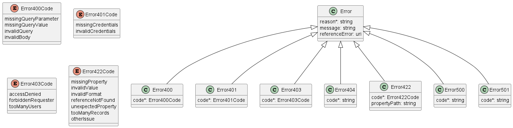

**Figure 23. Data model types to represent an erroneous response**

#### 7.1.1.1. Type Error

**Description:** Standard Class used to describe API response error Not intended
to be used directly. The `code` in the HTTP header is used as a discriminator
for the type of error returned in runtime.

<table id="T_Error">
    <thead style="font-weight:bold;">
        <tr>
            <td>Name</td>
            <td>Type</td>
            <td>Description</td>
        </tr>
    </thead>
    <tbody>
        <tr>
            <td>reason*</td>
            <td>string<br/><span style="font-size:10px;font-style:italic">maxLength = 255</span></td>
            <td>Text that explains the reason for the error. This can be shown to a client user.</td>
        </tr><tr>
            <td>message</td>
            <td>string</td>
            <td>Text that provides mode details and corrective actions related to the error. This can be shown to a client user.</td>
        </tr><tr>
            <td>referenceError</td>
            <td>uri<br/><span style="font-size:10px;font-style:italic">format = uri</span></td>
            <td>URL pointing to documentation describing the error</td>
        </tr>
    </tbody>
</table>

#### 7.1.1.2. Type Error400

**Description:** Bad Request.
(https://tools.ietf.org/html/rfc7231#section-6.5.1)

Inherits from:

- <a href="#T_Error">Error</a>

<table id="T_Error400">
    <thead style="font-weight:bold;">
        <tr>
            <td>Name</td>
            <td>Type</td>
            <td>Description</td>
        </tr>
    </thead>
    <tbody>
        <tr>
            <td>code*</td>
            <td><a href="#T_Error400Code">Error400Code</a></td>
            <td>One of the following error codes:
- missingQueryParameter: The URI is missing a required query-string parameter
- missingQueryValue: The URI is missing a required query-string parameter value
- invalidQuery: The query section of the URI is invalid.
- invalidBody: The request has an invalid body</td>
        </tr>
    </tbody>
</table>

#### 7.1.1.3. `enum` Error400Code

**Description:** One of the following error codes:

- missingQueryParameter: The URI is missing a required query-string parameter
- missingQueryValue: The URI is missing a required query-string parameter value
- invalidQuery: The query section of the URI is invalid.
- invalidBody: The request has an invalid body

<table id="T_Error400Code">
    <thead style="font-weight:bold;">
        <tr>
            <td>Value</td>
            <td>MEF 80</td>
        </tr>
    </thead>
    <tbody>
        <tr>
            <td>missingQueryParameter</td>
            <td>MISSING_QUERY_PARAMETER</td>
        </tr><tr>
            <td>missingQueryValue</td>
            <td>MISSING_QUERY_VALUE</td>
        </tr><tr>
            <td>invalidQuery</td>
            <td>INVALID_QUERY</td>
        </tr><tr>
            <td>invalidBody</td>
            <td>INVALID_BODY</td>
        </tr>
    </tbody>
</table>

#### 7.1.1.4. Type Error401

**Description:** Unauthorized. (https://tools.ietf.org/html/rfc7235#section-3.1)

Inherits from:

- <a href="#T_Error">Error</a>

<table id="T_Error401">
    <thead style="font-weight:bold;">
        <tr>
            <td>Name</td>
            <td>Type</td>
            <td>Description</td>
        </tr>
    </thead>
    <tbody>
        <tr>
            <td>code*</td>
            <td><a href="#T_Error401Code">Error401Code</a></td>
            <td>One of the following error codes:
- missingCredentials: No credentials provided.
- invalidCredentials: Provided credentials are invalid or expired</td>
        </tr>
    </tbody>
</table>

#### 7.1.1.5. `enum` Error401Code

**Description:** One of the following error codes:

- missingCredentials: No credentials provided.
- invalidCredentials: Provided credentials are invalid or expired

<table id="T_Error401Code">
    <thead style="font-weight:bold;">
        <tr>
            <td>Value</td>
            <td>MEF 80</td>
        </tr>
    </thead>
    <tbody>
        <tr>
            <td>missingCredentials</td>
            <td>MISSING_CREDENTIALS</td>
        </tr><tr>
            <td>invalidCredentials</td>
            <td>INVALID_CREDENTIALS</td>
        </tr>
    </tbody>
</table>

#### 7.1.1.6. Type Error403

**Description:** Forbidden. This code indicates that the server understood the
request but refuses to authorize it.
(https://tools.ietf.org/html/rfc7231#section-6.5.3)

Inherits from:

- <a href="#T_Error">Error</a>

<table id="T_Error403">
    <thead style="font-weight:bold;">
        <tr>
            <td>Name</td>
            <td>Type</td>
            <td>Description</td>
        </tr>
    </thead>
    <tbody>
        <tr>
            <td>code*</td>
            <td><a href="#T_Error403Code">Error403Code</a></td>
            <td>This code indicates that the server understood
the request but refuses to authorize it because
of one of the following error codes:
- accessDenied: Access denied
- forbiddenRequester: Forbidden requester
- tooManyUsers: Too many users</td>
        </tr>
    </tbody>
</table>

#### 7.1.1.7. `enum` Error403Code

**Description:** This code indicates that the server understood the request but
refuses to authorize it because of one of the following error codes:

- accessDenied: Access denied
- forbiddenRequester: Forbidden requester
- tooManyUsers: Too many users

<table id="T_Error403Code">
    <thead style="font-weight:bold;">
        <tr>
            <td>Value</td>
            <td>MEF 80</td>
        </tr>
    </thead>
    <tbody>
        <tr>
            <td>accessDenied</td>
            <td>ACCESS_DENIED</td>
        </tr><tr>
            <td>forbiddenRequester</td>
            <td>FORBIDDEN_REQUESTER</td>
        </tr><tr>
            <td>tooManyUsers</td>
            <td>TOO_MANY_USERS</td>
        </tr>
    </tbody>
</table>

#### 7.1.1.8. Type Error404

**Description:** Resource for the requested path not found.
(https://tools.ietf.org/html/rfc7231#section-6.5.4)

Inherits from:

- <a href="#T_Error">Error</a>

<table id="T_Error404">
    <thead style="font-weight:bold;">
        <tr>
            <td>Name</td>
            <td>Type</td>
            <td>Description</td>
        </tr>
    </thead>
    <tbody>
        <tr>
            <td>code*</td>
            <td>string</td>
            <td>The following error code:
- notFound: A current representation for the target resource not found</td>
        </tr>
    </tbody>
</table>

#### 7.1.1.9. Type Error422

The response for HTTP status `422` is a list of elements that are structured
using the `Error422` data type. Each list item describes a business validation
problem. This type introduces the `propertyPath` attribute which points to the
erroneous property of the request, so that the Buyer may fix it easier. It is
highly recommended that this property should be used, yet remains optional
because it might be hard to implement.

**Description:** Unprocessable entity due to a business validation problem.
(https://tools.ietf.org/html/rfc4918#section-11.2)

Inherits from:

- <a href="#T_Error">Error</a>

<table id="T_Error422">
    <thead style="font-weight:bold;">
        <tr>
            <td>Name</td>
            <td>Type</td>
            <td>Description</td>
        </tr>
    </thead>
    <tbody>
        <tr>
            <td>code*</td>
            <td><a href="#T_Error422Code">Error422Code</a></td>
            <td>One of the following error codes:
  - missingProperty: The property the Seller has expected is not present in the payload
  - invalidValue: The property has an incorrect value
  - invalidFormat: The property value does not comply with the expected value format
  - referenceNotFound: The object referenced by the property cannot be identified in the Seller system
  - unexpectedProperty: Additional property, not expected by the Seller has been provided
  - tooManyRecords: the number of records to be provided in the response exceeds the Seller&#x27;s threshold.
  - otherIssue: Other problem was identified (detailed information provided in a reason)
</td>
        </tr><tr>
            <td>propertyPath</td>
            <td>string</td>
            <td>A pointer to a particular property of the payload that caused the validation issue. It is highly recommended that this property should be used.
Defined using JavaScript Object Notation (JSON) Pointer (https://tools.ietf.org/html/rfc6901).
</td>
        </tr>
    </tbody>
</table>

#### 7.1.1.10. `enum` Error422Code

**Description:** One of the following error codes:

- missingProperty: The property the Seller has expected is not present in the
  payload
- invalidValue: The property has an incorrect value
- invalidFormat: The property value does not comply with the expected value
  format
- referenceNotFound: The object referenced by the property cannot be identified
  in the Seller system
- unexpectedProperty: Additional property, not expected by the Seller has been
  provided
- tooManyRecords: the number of records to be provided in the response exceeds
  the Seller's threshold.
- otherIssue: Other problem was identified (detailed information provided in a
  reason)

<table id="T_Error422Code">
    <thead style="font-weight:bold;">
        <tr>
            <td>Value</td>
            <td>MEF 80</td>
        </tr>
    </thead>
    <tbody>
        <tr>
            <td>missingProperty</td>
            <td>MISSING_PROPERTY</td>
        </tr><tr>
            <td>invalidValue</td>
            <td>INVALID_VALUE</td>
        </tr><tr>
            <td>invalidFormat</td>
            <td>INVALID_FORMAT</td>
        </tr><tr>
            <td>referenceNotFound</td>
            <td>REFERENCE_NOT_FOUND</td>
        </tr><tr>
            <td>unexpectedProperty</td>
            <td>UNEXPECTED_PROPERTY</td>
        </tr><tr>
            <td>tooManyRecords</td>
            <td>TOO_MANY_RECORDS</td>
        </tr><tr>
            <td>otherIssue</td>
            <td>OTHER_ISSUE</td>
        </tr>
    </tbody>
</table>

#### 7.1.1.11. Type Error500

**Description:** Internal Server Error.
(https://tools.ietf.org/html/rfc7231#section-6.6.1)

Inherits from:

- <a href="#T_Error">Error</a>

<table id="T_Error500">
    <thead style="font-weight:bold;">
        <tr>
            <td>Name</td>
            <td>Type</td>
            <td>Description</td>
        </tr>
    </thead>
    <tbody>
        <tr>
            <td>code*</td>
            <td>string</td>
            <td>The following error code:
- internalError: Internal server error - the server encountered an unexpected condition that prevented it from fulfilling the request.</td>
        </tr>
    </tbody>
</table>

#### 7.1.1.12. Type Error501

**Description:** Not Implemented.
(https://tools.ietf.org/html/rfc7231#section-6.6.2)

Inherits from:

- <a href="#T_Error">Error</a>

<table id="T_Error501">
    <thead style="font-weight:bold;">
        <tr>
            <td>Name</td>
            <td>Type</td>
            <td>Description</td>
        </tr>
    </thead>
    <tbody>
        <tr>
            <td>code*</td>
            <td>string</td>
            <td>The following error code:
- notImplemented: Method not supported by the server</td>
        </tr>
    </tbody>
</table>

## 7.2. Management API Data model

Figure 24 presents the whole Quote Management data model The data types,
requirements related to them and mapping to MEF 80 specifications are discussed
later in this section.

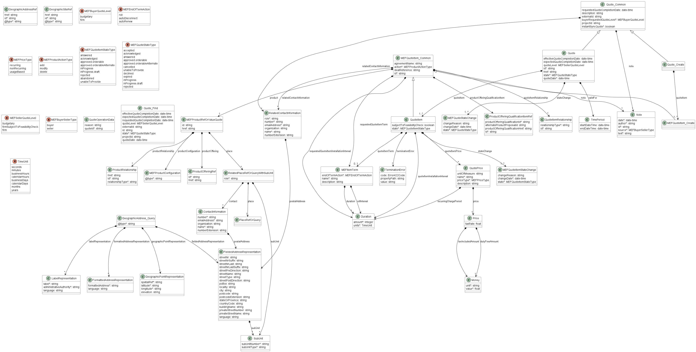

**Figure 24. Quote Management Data Model**

### 7.2.1. Quote

#### 7.2.1.1 Type Quote_Common

**Description:** Quote can be used to negotiate service and product acquisition
or modification between a customer and a service provider. Quote contains a list
of quote items, a reference to a customer, a list of productOfferings, and
attached prices and conditions.

<table id="T_Quote_Common" style="width:100%">
    <thead style="font-weight:bold">
        <tr>
            <td>Name</td>
            <td style="width:15%">Type</td>
            <td>M/O</td>
            <td>Description</td>
            <td>MEF 80</td>
        </tr>
    </thead>
    <tbody>
        <tr>
        <td>note</td>
            <td><a href="#T_Note">Note</a>[]</td>
            <td>O</td>
            <td>Free form text associated with the quote. Only useful in processes involving human interaction. Not applicable for the automated process.</td>
            <td>Note</td>
        </tr><tr>
        <td>requestedQuoteCompletionDate</td>
            <td>date-time<br/><span style="font-size:10px;font-style:italic">format = date-time</span></td>
            <td>O</td>
            <td>This is requested date - from quote requester - to get a complete response for this quote</td>
            <td>Requested Quote Completion Date</td>
        </tr><tr>
        <td>relatedContactInformation</td>
            <td><a href="#T_RelatedContactInformation">RelatedContactInformation</a>[]</td>
            <td>O</td>
            <td>Party playing a role for this quote. If &#x60;instantSyncQuote&#x60; equals &#x60;false&#x60; 
then the Buyer MUST specify Buyer Contact Information (&#x27;role: buyerContactInformation&#x27;) 
and the Seller MUST specify Seller Contact Information (&#x27;role: sellerContactInformation&#x27;)</td>
            <td>Buyer Contact Information (role&#x60; equals &#x60;buyerContactInformation), Seller Contact Information (role&#x60; equals &#x60;sellerContactInformation)</td>
        </tr><tr>
        <td>description</td>
            <td>string</td>
            <td>O</td>
            <td>Description of the quote</td>
            <td>Description</td>
        </tr><tr>
        <td>externalId</td>
            <td>string</td>
            <td>O</td>
            <td>ID given by the consumer and only understandable by him (to facilitate his searches afterwards)</td>
            <td>Buyer Quote Identifier</td>
        </tr><tr>
        <td>buyerRequestedQuoteLevel</td>
            <td><a href="#T_MEFBuyerQuoteLevel">MEFBuyerQuoteLevel</a></td>
            <td>M</td>
            <td>An indication of whether the Buyer&#x27;s Quote request is for a Quote of Budgetary or Firm level.</td>
            <td>Buyer Requested Quote Level</td>
        </tr><tr>
        <td>projectId</td>
            <td>string</td>
            <td>O</td>
            <td>An identifier that is used to group Quotes that represent a unit of functionality that is important to a Buyer. A Project can be used to relate multiple Quotes together.</td>
            <td>Project Identifier</td>
        </tr><tr>
        <td>instantSyncQuote</td>
            <td>boolean</td>
            <td>M</td>
            <td>If this flag is set to true, the Buyer requests an immediate Quote to be provided in the response to the creation of a Quote.</td>
            <td>Immediate Quote Response</td>
        </tr>
    </tbody>
</table>

#### 7.2.1.2. Type Quote_Create

**Description:** Quote can be used to negotiate service and product acquisition
or modification between a customer and a service provider. Quote contains a list
of quote items, a reference to a customer, a list of productOfferings, and
attached prices and conditions.

Inherits from:

- <a href="#T_Quote_Common">Quote_Common</a>

<table id="T_Quote_Create" style="width:100%">
    <thead style="font-weight:bold">
        <tr>
            <td>Name</td>
            <td style="width:15%">Type</td>
            <td>M/O</td>
            <td>Description</td>
            <td>MEF 80</td>
        </tr>
    </thead>
    <tbody>
        <tr>
        <td>quoteItem</td>
            <td><a href="#T_MEFQuoteItem_Create">MEFQuoteItem_Create</a>[]<br/><span style="font-size:10px;font-style:italic">minItems = 1</span></td>
            <td>M</td>
            <td>An item of the quote - used to describe an operation on a product to be quoted</td>
            <td>Quote Item</td>
        </tr>
    </tbody>
</table>

#### 7.2.1.3. Type Quote

**Description:** Quote can be used to negotiate service and product acquisition
or modification between a customer and a service provider. Quote contains a list
of quote items, a reference to a customer, a list of productOfferings, and
attached prices and conditions.

Inherits from:

- <a href="#T_Quote_Common">Quote_Common</a>

<table id="T_Quote" style="width:100%">
    <thead style="font-weight:bold">
        <tr>
            <td>Name</td>
            <td style="width:15%">Type</td>
            <td>M/O</td>
            <td>Description</td>
            <td>MEF 80</td>
        </tr>
    </thead>
    <tbody>
        <tr>
        <td>effectiveQuoteCompletionDate</td>
            <td>date-time<br/><span style="font-size:10px;font-style:italic">format = date-time</span></td>
            <td>O</td>
            <td>Date when the Quote State was set to one of the Completion States.</td>
            <td>Quote Completion Date</td>
        </tr><tr>
        <td>expectedQuoteCompletionDate</td>
            <td>date-time<br/><span style="font-size:10px;font-style:italic">format = date-time</span></td>
            <td>O</td>
            <td>This is the date provided by the Seller to indicate the date by which the Quote is expected to reach a Quote Completion State</td>
            <td>Expected Quote Completion Date</td>
        </tr><tr>
        <td>validFor</td>
            <td><a href="#T_TimePeriod">TimePeriod</a></td>
            <td>O</td>
            <td>Quote validity period. For use in the context of this attribute, only the endDateTime attribute must be used.</td>
            <td>Valid Until Date</td>
        </tr><tr>
        <td>quoteLevel</td>
            <td><a href="#T_MEFSellerQuoteLevel">MEFSellerQuoteLevel</a></td>
            <td>O</td>
            <td>An indication of whether the Seller&#x27;s Quote Response is Budgetary, Firm - Subject to Feasibility Check, or Firm. The Seller Quote Level is provided by the Seller when responding to a Quote request.  This represents the lowest Quote Item Level of all Quote Items included in the Quote.</td>
            <td>Seller Quote Level</td>
        </tr><tr>
        <td>quoteItem</td>
            <td><a href="#T_QuoteItem">QuoteItem</a>[]<br/><span style="font-size:10px;font-style:italic">minItems = 1</span></td>
            <td>M</td>
            <td>An item of the quote - it is used to describe an operation on a product to be quoted</td>
            <td>Quote Item</td>
        </tr><tr>
        <td>stateChange</td>
            <td><a href="#T_MEFQuoteStateChange">MEFQuoteStateChange</a>[]<br/><span style="font-size:10px;font-style:italic">minItems = 1</span></td>
            <td>M</td>
            <td>State change for the Quote</td>
            <td>Quote ACCEPTED Date, Quote IN_PROGRESS Date, Quote IN_PROGRESS_DRAFT Date, Quote Completion State Date, Quote CANCELLED Date, Quote DECLINED Date, Quote EXPIRED Date, Quote REJECTED Date</td>
        </tr><tr>
        <td>id</td>
            <td>string</td>
            <td>M</td>
            <td>Unique identifier - attributed by quoting system</td>
            <td>Seller Quote Identifier</td>
        </tr><tr>
        <td>href</td>
            <td>string</td>
            <td>O</td>
            <td>Hyperlink representing this Quote. Hyperlink MAY be used when providing a response by the Seller
</td>
            <td>Not represented in MEF 80</td>
        </tr><tr>
        <td>state</td>
            <td><a href="#T_MEFQuoteStateType">MEFQuoteStateType</a></td>
            <td>M</td>
            <td>The state of the Quote.</td>
            <td>Quote State</td>
        </tr><tr>
        <td>quoteDate</td>
            <td>date-time<br/><span style="font-size:10px;font-style:italic">format = date-time</span></td>
            <td>M</td>
            <td>Date and time when the quote was created</td>
            <td>Quote Request Date</td>
        </tr>
    </tbody>
</table>

#### 7.2.1.4. `enum` MEFQuoteStateType

**Description:** Possible values for the status of a Quote. Following mapping
has been used between `MEFQuoteStateType` and MEF 80:

| QuoteStateType              | MEF 80              |
| --------------------------- | ------------------- |
| accepted                    | ACCEPTED            |
| acknowledged                | ACKNOWLEDGED        |
| answered                    | ANSWERED            |
| approved.orderable          | ORDERABLE           |
| approved.orderableAlternate | ORDERABLE_ALTERNATE |
| declined                    | DECLINED            |
| expired                     | EXPIRED             |
| cancelled                   | CANCELLED           |
| unableToProvide             | UNABLE_TO_PROVIDE   |
| inProgress                  | IN_PROGRESS         |
| inProgress.draft            | IN_PROGRESS_DRAFT   |
| rejected                    | REJECTED            |

<table id="T_MEFQuoteStateType">
    <thead style="font-weight:bold;">
        <tr>
            <td>Value</td>
            <td>MEF 80</td>
        </tr>
    </thead>
    <tbody>
        <tr>
            <td>accepted</td>
            <td>ACCEPTED</td>
        </tr><tr>
            <td>acknowledged</td>
            <td>ACKNOWLEDGED</td>
        </tr><tr>
            <td>answered</td>
            <td>ANSWERED</td>
        </tr><tr>
            <td>approved.orderable</td>
            <td>APPROVED.ORDERABLE</td>
        </tr><tr>
            <td>approved.orderableAlternate</td>
            <td>APPROVED.ORDERABLE_ALTERNATE</td>
        </tr><tr>
            <td>cancelled</td>
            <td>CANCELLED</td>
        </tr><tr>
            <td>unableToProvide</td>
            <td>UNABLE_TO_PROVIDE</td>
        </tr><tr>
            <td>declined</td>
            <td>DECLINED</td>
        </tr><tr>
            <td>expired</td>
            <td>EXPIRED</td>
        </tr><tr>
            <td>inProgress</td>
            <td>IN_PROGRESS</td>
        </tr><tr>
            <td>inProgress.draft</td>
            <td>IN_PROGRESS.DRAFT</td>
        </tr><tr>
            <td>rejected</td>
            <td>REJECTED</td>
        </tr>
    </tbody>
</table>

#### 7.2.1.5. `enum` MEFBuyerQuoteLevel

**Description:** An indication of whether the Buyer's Quote Request is for a
Budgetary or Firm Quote Level. Set by the Buyer. Buyer Requested Quote Level
contains the possible values and may be set by the Buyer on the Request. All
Quote Items in a Quote have the same Quote Level.

<table id="T_MEFBuyerQuoteLevel">
    <thead style="font-weight:bold;">
        <tr>
            <td>Value</td>
            <td>MEF 80</td>
        </tr>
    </thead>
    <tbody>
        <tr>
            <td>budgetary</td>
            <td>BUDGETARY</td>
        </tr><tr>
            <td>firm</td>
            <td>FIRM</td>
        </tr>
    </tbody>
</table>

#### 7.2.1.6. `enum` MEFSellerQuoteLevel

**Description:** An indication of whether the Seller's Quote Response is
Budgetary, Firm - Subject to Feasibility Check, or Firm. The Seller Quote Level
is provided by the Seller when responding to a Quote request. This represents
the lowest Quote Item Level of all Quote Items included in the Quote.

<table id="T_MEFSellerQuoteLevel">
    <thead style="font-weight:bold;">
        <tr>
            <td>Value</td>
            <td>MEF 80</td>
        </tr>
    </thead>
    <tbody>
        <tr>
            <td>budgetary</td>
            <td>BUDGETARY</td>
        </tr><tr>
            <td>firmSubjectToFeasibilityCheck</td>
            <td>FIRM_SUBJECT_TO_FEASIBILITY_CHECK</td>
        </tr><tr>
            <td>firm</td>
            <td>FIRM</td>
        </tr>
    </tbody>
</table>

#### 7.2.1.7. Type MEFQuoteStateChange

**Description:** Holds the reached state, reasons, and associated date the Quote
state changed, populated by the Seller.

<table id="T_MEFQuoteStateChange" style="width:100%">
    <thead style="font-weight:bold">
        <tr>
            <td>Name</td>
            <td style="width:15%">Type</td>
            <td>M/O</td>
            <td>Description</td>
            <td>MEF 80</td>
        </tr>
    </thead>
    <tbody>
        <tr>
        <td>changeReason</td>
            <td>string</td>
            <td>O</td>
            <td>Additional comment related to state change</td>
            <td>Not represented in MEF 80</td>
        </tr><tr>
        <td>changeDate</td>
            <td>date-time<br/><span style="font-size:10px;font-style:italic">format = date-time</span></td>
            <td>M</td>
            <td>The date when the state was reached</td>
            <td>Not represented in MEF 80</td>
        </tr><tr>
        <td>state</td>
            <td><a href="#T_MEFQuoteStateType">MEFQuoteStateType</a></td>
            <td>M</td>
            <td>The state reached at the change date</td>
            <td>Not represented in MEF 80</td>
        </tr>
    </tbody>
</table>

#### 7.2.1.8. Type MEFQuoteItemStateChange

**Description:** Holds the reached state, reasons, and associated date the Quote
Item state changed, populated by the Seller.

<table id="T_MEFQuoteItemStateChange" style="width:100%">
    <thead style="font-weight:bold">
        <tr>
            <td>Name</td>
            <td style="width:15%">Type</td>
            <td>M/O</td>
            <td>Description</td>
            <td>MEF 80</td>
        </tr>
    </thead>
    <tbody>
        <tr>
        <td>changeReason</td>
            <td>string</td>
            <td>O</td>
            <td>Additional comment related to state change</td>
            <td></td>
        </tr><tr>
        <td>changeDate</td>
            <td>date-time<br/><span style="font-size:10px;font-style:italic">format = date-time</span></td>
            <td>M</td>
            <td>The date when the state was reached</td>
            <td></td>
        </tr><tr>
        <td>state</td>
            <td><a href="#T_MEFQuoteItemStateType">MEFQuoteItemStateType</a></td>
            <td>M</td>
            <td>The state reached at the change date</td>
            <td></td>
        </tr>
    </tbody>
</table>

#### 7.2.1.9. Type Quote_Find

**Description:** This class represents a single list item for the response of
`listQuote` operation.

<table id="T_Quote_Find" style="width:100%">
    <thead style="font-weight:bold">
        <tr>
            <td>Name</td>
            <td style="width:15%">Type</td>
            <td>M/O</td>
            <td>Description</td>
            <td>MEF 80</td>
        </tr>
    </thead>
    <tbody>
        <tr>
        <td>effectiveQuoteCompletionDate</td>
            <td>date-time<br/><span style="font-size:10px;font-style:italic">format = date-time</span></td>
            <td>O</td>
            <td>Date when the Quote State was set to one of the Completion States</td>
            <td></td>
        </tr><tr>
        <td>expectedQuoteCompletionDate</td>
            <td>date-time<br/><span style="font-size:10px;font-style:italic">format = date-time</span></td>
            <td>O</td>
            <td>This is the date provided by the Seller to indicate expected Quote completion date</td>
            <td></td>
        </tr><tr>
        <td>requestedQuoteCompletionDate</td>
            <td>date-time<br/><span style="font-size:10px;font-style:italic">format = date-time</span></td>
            <td>O</td>
            <td>This is requested date - from quote requester - to get a complete response for this quote</td>
            <td></td>
        </tr><tr>
        <td>quoteLevel</td>
            <td><a href="#T_MEFSellerQuoteLevel">MEFSellerQuoteLevel</a></td>
            <td>O</td>
            <td>The level of the Quote provided by the Seller. This represents the lowest Quote Item Level of all Quote Items included in the Quote.</td>
            <td></td>
        </tr><tr>
        <td>externalId</td>
            <td>string</td>
            <td>O</td>
            <td>ID given by the consumer and only understandable by him (to facilitate his searches afterward)</td>
            <td></td>
        </tr><tr>
        <td>id</td>
            <td>string</td>
            <td>O</td>
            <td>Unique identifier - attributed by quoting system</td>
            <td></td>
        </tr><tr>
        <td>state</td>
            <td><a href="#T_MEFQuoteStateType">MEFQuoteStateType</a></td>
            <td>M</td>
            <td>The state of the Quote.</td>
            <td></td>
        </tr><tr>
        <td>projectId</td>
            <td>string</td>
            <td>O</td>
            <td>An identifier that is used to group Quotes that represent a unit of functionality that is important to a Buyer. A Project can be used to relate multiple Quotes together.</td>
            <td></td>
        </tr><tr>
        <td>quoteDate</td>
            <td>date-time<br/><span style="font-size:10px;font-style:italic">format = date-time</span></td>
            <td>O</td>
            <td>Date and time when the quote was created</td>
            <td></td>
        </tr>
    </tbody>
</table>

### 7.2.2. Quote Item

#### 7.2.2.1 Type MEFQuoteItem_Common

**Description:** Quote items describe an action to be performed on a
productOffering or a product in order to get pricing elements and conditions.

<table id="T_MEFQuoteItem_Common" style="width:100%">
    <thead style="font-weight:bold">
        <tr>
            <td>Name</td>
            <td style="width:15%">Type</td>
            <td>M/O</td>
            <td>Description</td>
            <td>MEF 80</td>
        </tr>
    </thead>
    <tbody>
        <tr>
        <td>requestedQuoteItemTerm</td>
            <td><a href="#T_MEFItemTerm">MEFItemTerm</a></td>
            <td>O</td>
            <td>The terms of the Quote Item. Used to describe a term (also known as commitment) for a Quote Item. Each Quote Item in a Quote Request could have a different Requested Quote Item Term. The Buyer specifies the longest term that they would accept. The Buyer may be willing to accept a shorter term. If the Seller responds with a term longer than the Buyer&#x27;s request, it is treated as an alternate response.</td>
            <td>Requested Quote Item Term</td>
        </tr><tr>
        <td>note</td>
            <td><a href="#T_Note">Note</a>[]</td>
            <td>O</td>
            <td>Free form text associated with the quote item. Only useful in processes involving human interaction. Not applicable for the automated process.</td>
            <td>Quote Item Notes</td>
        </tr><tr>
        <td>product</td>
            <td><a href="#T_MEFProductRefOrValueQuote">MEFProductRefOrValueQuote</a></td>
            <td>M</td>
            <td>The Buyer&#x27;s existing Product for which the quote is being requested.</td>
            <td>Product Identifier, Product Specific Attributes</td>
        </tr><tr>
        <td>productOfferingQualificationItem</td>
            <td><a href="#T_ProductOfferingQualificationItemRef">ProductOfferingQualificationItemRef</a></td>
            <td>O</td>
            <td>A reference to a previously done POQ with item specified</td>
            <td>POQ</td>
        </tr><tr>
        <td>relatedContactInformation</td>
            <td><a href="#T_RelatedContactInformation">RelatedContactInformation</a>[]</td>
            <td>O</td>
            <td>Contact information of an individual or organization playing a role for this Quote. If &#x60;instantSyncQuote&#x60; equals &#x60;false&#x60;  then &#x27;Quote Item Technical Contact&#x27; must be specified (&#x60;role: quoteItemTechnicalContact&#x60;).
</td>
            <td>Quote Item Location Contact (role: quoteItemLocationContact), Quote Item Technical Contact (role: quoteItemTechnicalContact)</td>
        </tr><tr>
        <td>agreementName</td>
            <td>string</td>
            <td>O</td>
            <td>Name of the agreement. The name is unique between the Buyer and the Seller.</td>
            <td>Agreement</td>
        </tr><tr>
        <td>action</td>
            <td><a href="#T_MEFProductActionType">MEFProductActionType</a></td>
            <td>M</td>
            <td>Product action to be applied to this Quote Item. This corresponds to the Order Item Action when an associated product is ordered.</td>
            <td>Quote Item Product Action</td>
        </tr><tr>
        <td>dealReference</td>
            <td>string</td>
            <td>O</td>
            <td>A pre-agreed pricing modifier reference that the Seller is offering to the Buyer which will impact the price.</td>
            <td>Quote Item Deal Reference</td>
        </tr><tr>
        <td>id</td>
            <td>string</td>
            <td>M</td>
            <td>Identifier of the quote item (generally it is a sequence number 01, 02, 03, ...)</td>
            <td>Quote Item Reference Number</td>
        </tr><tr>
        <td>requestedQuoteItemInstallationInterval</td>
            <td><a href="#T_Duration">Duration</a></td>
            <td>O</td>
            <td>The installation interval requested by the Buyer.</td>
            <td>Requested Quote Item Installation Interval</td>
        </tr><tr>
        <td>quoteItemRelationship</td>
            <td><a href="#T_QuoteItemRelationship">QuoteItemRelationship</a>[]</td>
            <td>O</td>
            <td>A relationship from item within a quote</td>
            <td>Quote Item Relationship</td>
        </tr>
    </tbody>
</table>

#### 7.2.2.2. Type MEFQuoteItem_Create

**Description:** A quote item describes an action to be performed on a
productOffering or a product in order to get pricing elements and condition. The
modeling pattern introduces the `MEFQuoteItem_Common` supertype to aggregate
attributes that are common to both `QuoteItem` and `MEFQuoteItem_Create`. In
this case the create type has a subset of attributes of the response type and
does not introduce any new, thus the `MEFQuoteItem_Create` type has an empty
definition.

Inherits from:

- <a href="#T_MEFQuoteItem_Common">MEFQuoteItem_Common</a>

#### 7.2.2.3. Type QuoteItem

**Description:** Quote items describe an action to be performed on a
productOffering or a product in order to get pricing elements and conditions.

Inherits from:

- <a href="#T_MEFQuoteItem_Common">MEFQuoteItem_Common</a>

<table id="T_QuoteItem" style="width:100%">
    <thead style="font-weight:bold">
        <tr>
            <td>Name</td>
            <td style="width:15%">Type</td>
            <td>M/O</td>
            <td>Description</td>
            <td>MEF 80</td>
        </tr>
    </thead>
    <tbody>
        <tr>
        <td>terminationError</td>
            <td><a href="#T_TerminationError">TerminationError</a>[]</td>
            <td>O</td>
            <td>When the Seller cannot process the Quote Item Request, the Seller returns a text-based list of reasons here.</td>
            <td>Quote Item Termination Error</td>
        </tr><tr>
        <td>quoteItemInstallationInterval</td>
            <td><a href="#T_Duration">Duration</a></td>
            <td>O</td>
            <td>Quote Item Installation Interval as proposed by the Seller for the Quote.</td>
            <td>Quote Item Installation Interval</td>
        </tr><tr>
        <td>subjectToFeasibilityCheck</td>
            <td>boolean</td>
            <td>O</td>
            <td>For a Firm Quote Level indicates if the pricing requires a Feasibility Check. The Seller indicates if the Quote Item requires a Feasibility Check. This is not used for a Budgetary Quote Level.</td>
            <td>Subject to Feasibility Check</td>
        </tr><tr>
        <td>quoteItemTerm</td>
            <td><a href="#T_MEFItemTerm">MEFItemTerm</a>[]<br/><span style="font-size:10px;font-style:italic">maxItems = 1</span></td>
            <td>O</td>
            <td>Quote Item Term as defined by the Seller and part of the Quote for the Quote Item.</td>
            <td>Quote Item Term</td>
        </tr><tr>
        <td>state</td>
            <td><a href="#T_MEFQuoteItemStateType">MEFQuoteItemStateType</a></td>
            <td>M</td>
            <td>The state of the Quote Item.</td>
            <td>Quote Item State</td>
        </tr><tr>
        <td>stateChange</td>
            <td><a href="#T_MEFQuoteItemStateChange">MEFQuoteItemStateChange</a>[]<br/><span style="font-size:10px;font-style:italic">minItems = 1</span></td>
            <td>M</td>
            <td>State change for the Quote</td>
            <td></td>
        </tr><tr>
        <td>quoteItemPrice</td>
            <td><a href="#T_QuotePrice">QuotePrice</a>[]</td>
            <td>O</td>
            <td>Price for this quote item</td>
            <td>Quote Item Price</td>
        </tr>
    </tbody>
</table>

#### 7.2.2.4. `enum` MEFProductActionType

**Description:** Product action to be applied to the Quote Item. This
corresponds to the Order Item Action when an associated product is ordered.

| MEFProductActionType | MEF 80     |
| -------------------- | ---------- |
| add                  | INSTALL    |
| modify               | CHANGE     |
| delete               | DISCONNECT |

<table id="T_MEFProductActionType">
    <thead style="font-weight:bold;">
        <tr>
            <td>Value</td>
            <td>MEF 80</td>
        </tr>
    </thead>
    <tbody>
        <tr>
            <td>add</td>
            <td>ADD</td>
        </tr><tr>
            <td>modify</td>
            <td>MODIFY</td>
        </tr><tr>
            <td>delete</td>
            <td>DELETE</td>
        </tr>
    </tbody>
</table>

#### 7.2.2.5. `enum` MEFQuoteItemStateType

**Description:** Possible values for the status of a QuoteItem. Following
mapping has been used between `MEFQuoteItemStateType` and MEF 80:

| MEFQuoteItemStateType       | MEF 80              |
| --------------------------- | ------------------- |
| answered                    | ANSWERED            |
| acknowledged                | ACKNOWLEDGED        |
| approved.orderable          | ORDERABLE           |
| approved.orderableAlternate | ORDERABLE_ALTERNATE |
| inProgress                  | IN_PROGRESS         |
| inProgress.draft            | IN_PROGRESS_DRAFT   |
| abandoned                   | ABANDONED           |
| rejected                    | REJECTED            |
| unableToProvide             | UNABLE_TO_PROVIDE   |

<table id="T_MEFQuoteItemStateType">
    <thead style="font-weight:bold;">
        <tr>
            <td>Value</td>
            <td>MEF 80</td>
        </tr>
    </thead>
    <tbody>
        <tr>
            <td>answered</td>
            <td>ANSWERED</td>
        </tr><tr>
            <td>acknowledged</td>
            <td>ACKNOWLEDGED</td>
        </tr><tr>
            <td>approved.orderable</td>
            <td>APPROVED.ORDERABLE</td>
        </tr><tr>
            <td>approved.orderableAlternate</td>
            <td>APPROVED.ORDERABLE_ALTERNATE</td>
        </tr><tr>
            <td>inProgress</td>
            <td>IN_PROGRESS</td>
        </tr><tr>
            <td>inProgress.draft</td>
            <td>IN_PROGRESS.DRAFT</td>
        </tr><tr>
            <td>rejected</td>
            <td>REJECTED</td>
        </tr><tr>
            <td>abandoned</td>
            <td>ABANDONED</td>
        </tr><tr>
            <td>unableToProvide</td>
            <td>UNABLE_TO_PROVIDE</td>
        </tr>
    </tbody>
</table>

#### 7.2.2.6. Type ProductOfferingQualificationItemRef

**Description:** It's a productOfferingQualification item that has been executed
previously.

<table id="T_ProductOfferingQualificationItemRef" style="width:100%">
    <thead style="font-weight:bold">
        <tr>
            <td>Name</td>
            <td style="width:15%">Type</td>
            <td>M/O</td>
            <td>Description</td>
            <td>MEF 80</td>
        </tr>
    </thead>
    <tbody>
        <tr>
        <td>productOfferingQualificationId</td>
            <td>string</td>
            <td>M</td>
            <td>Unique identifier of related Product Offering Qualification.</td>
            <td>POQ Identifier</td>
        </tr><tr>
        <td>alternateProductProposalId</td>
            <td>string</td>
            <td>O</td>
            <td>A unique identifier for the Alternate Product Proposal assigned by the Seller, if the referenced qualification comes from an alternate product proposal.</td>
            <td>Alternate Product Proposal Identifier</td>
        </tr><tr>
        <td>productOfferingQualificationHref</td>
            <td>string</td>
            <td>O</td>
            <td>Reference of the related Product Offering Qualification.</td>
            <td>Not represented in MEF 80</td>
        </tr><tr>
        <td>id</td>
            <td>string</td>
            <td>M</td>
            <td>Id of an item of a product offering qualification</td>
            <td>POQ Item Identifier</td>
        </tr>
    </tbody>
</table>

#### 7.2.2.7. Type ProductOfferingRef

**Description:** A reference to a Product Offering offered by the Seller to the
Buyer. A Product Offering contains the commercial and technical details of a
Product sold by a particular Seller. A Product Offering defines all of the
commercial terms and, through association with a particular Product
Specification defines all the technical attributes and behaviors of the Product.
A Product Offering may constrain the allowable set of configurable technical
attributes and/or behaviors specified in the associated Product Specification.
The id of the Product offering is assigned by the Seller. The Buyer and the
Seller exchange information about offerings' ids during the onboarding process.

<table id="T_ProductOfferingRef" style="width:100%">
    <thead style="font-weight:bold">
        <tr>
            <td>Name</td>
            <td style="width:15%">Type</td>
            <td>M/O</td>
            <td>Description</td>
            <td>MEF 80</td>
        </tr>
    </thead>
    <tbody>
        <tr>
        <td>id</td>
            <td>string</td>
            <td>M</td>
            <td>unique identifier of the Product Offering.</td>
            <td>Quote.Product Offering Identifier</td>
        </tr><tr>
        <td>href</td>
            <td>string</td>
            <td>O</td>
            <td>Hyperlink to a Product Offering in Sellers catalog. In case Seller is not providing catalog capabilities this field is not used. The catalog API definition is provided by the Seller to Buyer during onboarding Hyperlink MAY be used when providing response by the Seller Hyperlink MUST be ignored by the Seller in case it is provided by the Buyer in a requestHyperlink reference</td>
            <td>Not represented in MEF 80</td>
        </tr>
    </tbody>
</table>

#### 7.2.2.8. Type QuoteItemRelationship

**Description:** Used to describe the relationship between quote items. These
relationships could have an impact on pricing and conditions

<table id="T_QuoteItemRelationship" style="width:100%">
    <thead style="font-weight:bold">
        <tr>
            <td>Name</td>
            <td style="width:15%">Type</td>
            <td>M/O</td>
            <td>Description</td>
            <td>MEF 80</td>
        </tr>
    </thead>
    <tbody>
        <tr>
        <td>relationshipType</td>
            <td>string</td>
            <td>M</td>
            <td>Relationship type as relies on, bundles, etc... MEF: Specifies the nature of the relationship to the related Quote Items. The nature of required relationships varies for Products of different types. For example, a UNI or ENNI Product may not have any relationships, but an Access E-Line may have two mandatory relationships (related to the UNI on one end and the ENNI on the other). More complex Products such as multipoint IP or Firewall Products may have more complex relationships. As a result, the allowed and mandatory Relationship Nature values are defined in the Product Specification.</td>
            <td>Quote Item Relationship Nature</td>
        </tr><tr>
        <td>id</td>
            <td>string</td>
            <td>M</td>
            <td>ID of the related quote item (must be in the same quote)</td>
            <td>Quote Item Relationship Identifier</td>
        </tr>
    </tbody>
</table>

#### 7.2.2.9. Type MEFItemTerm

**Description:** The terms of the Quote Item. Used to describe a term (also
known as commitment) for a Quote Item. Each Quote Item in a Quote Request could
have a different Requested Quote Item Term. The Buyer specifies the longest term
that they would accept. The Buyer may be willing to accept a shorter term. If
the Seller responds with a term longer than the Buyer's request, it is treated
as an alternate response.

<table id="T_MEFItemTerm" style="width:100%">
    <thead style="font-weight:bold">
        <tr>
            <td>Name</td>
            <td style="width:15%">Type</td>
            <td>M/O</td>
            <td>Description</td>
            <td>MEF 80</td>
        </tr>
    </thead>
    <tbody>
        <tr>
        <td>duration</td>
            <td><a href="#T_Duration">Duration</a></td>
            <td>M</td>
            <td>Duration of the term</td>
            <td>Quote Item Term Duration</td>
        </tr><tr>
        <td>endOfTermAction</td>
            <td><a href="#T_MEFEndOfTermAction">MEFEndOfTermAction</a></td>
            <td>M</td>
            <td>The action that needs to be taken by the Seller once the term expires</td>
            <td>Seller End of Term Action</td>
        </tr><tr>
        <td>name</td>
            <td>string</td>
            <td>M</td>
            <td>Name of the term</td>
            <td>Quote Item Term Name</td>
        </tr><tr>
        <td>description</td>
            <td>string</td>
            <td>O</td>
            <td>Description of the term</td>
            <td>Quote Item Term Description</td>
        </tr><tr>
        <td>rollInterval</td>
            <td><a href="#T_Duration">Duration</a></td>
            <td>O</td>
            <td>The recurring period that the Buyer is willing to pay to the end of upon disconnecting the Product after the original term has expired. If &#x60;endOfTermAction&#x60; is equal to &#x60;roll&#x60; then &#x60;rollInterval&#x60; MUST be specified. If &#x60;endOfTermAction&#x60; is equal to &#x60;autoRenew&#x60; or &#x60;autoDisconnect&#x60;, then &#x60;rollInterval&#x60; MUST NOT be specified.</td>
            <td>Roll Interval</td>
        </tr>
    </tbody>
</table>

#### 7.2.2.10. `enum` MEFEndOfTermAction

**Description:** The action that needs to be taken by the Seller once the term
expires.

<table id="T_MEFEndOfTermAction">
    <thead style="font-weight:bold;">
        <tr>
            <td>Value</td>
            <td>MEF 80</td>
        </tr>
    </thead>
    <tbody>
        <tr>
            <td>roll</td>
            <td>ROLL</td>
        </tr><tr>
            <td>autoDisconnect</td>
            <td>AUTO_DISCONNECT</td>
        </tr><tr>
            <td>autoRenew</td>
            <td>AUTO_RENEW</td>
        </tr>
    </tbody>
</table>

#### 7.2.2.11. Type QuotePrice

**Description:** Description of price and discount awarded

<table id="T_QuotePrice" style="width:100%">
    <thead style="font-weight:bold">
        <tr>
            <td>Name</td>
            <td style="width:15%">Type</td>
            <td>M/O</td>
            <td>Description</td>
            <td>MEF 80</td>
        </tr>
    </thead>
    <tbody>
        <tr>
        <td>unitOfMeasure</td>
            <td>string</td>
            <td>O</td>
            <td>Unit of Measure if price depending on it (Gb, SMS volume, etc..) MEF: if Quote Item Price Type equals usageBased</td>
            <td>Quote Item Price Unit Of Measure</td>
        </tr><tr>
        <td>price</td>
            <td><a href="#T_Price">Price</a></td>
            <td>M</td>
            <td>The associated price</td>
            <td>Quote Item Price Amount</td>
        </tr><tr>
        <td>name</td>
            <td>string</td>
            <td>M</td>
            <td>Name of the quote/quote item price</td>
            <td>Quote Item Price Name</td>
        </tr><tr>
        <td>priceType</td>
            <td><a href="#T_MEFPriceType">MEFPriceType</a></td>
            <td>M</td>
            <td>Indicates if the price is for recurring, non-recurring, or usage based charges</td>
            <td>Quote Item Price Type</td>
        </tr><tr>
        <td>description</td>
            <td>string</td>
            <td>O</td>
            <td>Description of the quote/quote item price</td>
            <td>Quote Item Price Description</td>
        </tr><tr>
        <td>recurringChargePeriod</td>
            <td><a href="#T_Duration">Duration</a></td>
            <td>O</td>
            <td>Used for a recurring charge to indicate a period</td>
            <td>Quote Item Price Recurring Charge Period</td>
        </tr>
    </tbody>
</table>

#### 7.2.2.12. Type Price

**Description:** Provides all amounts (tax included, duty-free, tax rate) and
used currency of a Price

<table id="T_Price" style="width:100%">
    <thead style="font-weight:bold">
        <tr>
            <td>Name</td>
            <td style="width:15%">Type</td>
            <td>M/O</td>
            <td>Description</td>
            <td>MEF 80</td>
        </tr>
    </thead>
    <tbody>
        <tr>
        <td>taxRate</td>
            <td>float<br/><span style="font-size:10px;font-style:italic">format = float</span></td>
            <td>O</td>
            <td>Price Tax Rate. Unit: [%]. E.g. value 16 stand for 16% tax.</td>
            <td>Price Tax Rate.</td>
        </tr><tr>
        <td>taxIncludedAmount</td>
            <td><a href="#T_Money">Money</a></td>
            <td>O</td>
            <td>All taxes included amount (expressed in the given currency)</td>
            <td>Price Tax Included Amount</td>
        </tr><tr>
        <td>dutyFreeAmount</td>
            <td><a href="#T_Money">Money</a></td>
            <td>M</td>
            <td>All taxes excluded amount (expressed in the given currency)</td>
            <td>Price Duty Free Amount</td>
        </tr>
    </tbody>
</table>

#### 7.2.2.13. `enum` MEFPriceType

**Description:** Indicates if the price is for recurring or non-recurring
charges.

<table id="T_MEFPriceType">
    <thead style="font-weight:bold;">
        <tr>
            <td>Value</td>
            <td>MEF 80</td>
        </tr>
    </thead>
    <tbody>
        <tr>
            <td>recurring</td>
            <td>RECURRING</td>
        </tr><tr>
            <td>nonRecurring</td>
            <td>NON_RECURRING</td>
        </tr><tr>
            <td>usageBased</td>
            <td>USAGE_BASED</td>
        </tr>
    </tbody>
</table>

### 7.2.3. Product representation

#### 7.2.3.1. Type MEFProductRefOrValueQuote

**Description:** One or more services sold to a Buyer by a Seller. A particular
Product Offering defines the technical and commercial attributes and behaviors
of a Product.

<table id="T_MEFProductRefOrValueQuote" style="width:100%">
    <thead style="font-weight:bold">
        <tr>
            <td>Name</td>
            <td style="width:15%">Type</td>
            <td>M/O</td>
            <td>Description</td>
            <td>MEF 80</td>
        </tr>
    </thead>
    <tbody>
        <tr>
        <td>id</td>
            <td>string</td>
            <td>O</td>
            <td>The unique identifier of an in-service Product that is the quotation&#x27;s subject.  This field MUST be populated if an item &#x60;action&#x60; is either &#x60;modify&#x60; or &#x60;delete&#x60;.  This field MUST NOT be populated if an item &#x60;action&#x60; is &#x60;add&#x60;.
</td>
            <td>Product Identifier</td>
        </tr><tr>
        <td>href</td>
            <td>string</td>
            <td>O</td>
            <td>Hyperlink to the product in Seller&#x27;s inventory that is the quotation&#x27;s subject. Hyperlink MAY be used when providing a response by the Seller. Hyperlink MUST be ignored by the Seller in case it is provided by the Buyer in a request
</td>
            <td>Not represented in MEF 80</td>
        </tr><tr>
        <td>place</td>
            <td><a href="#T_RelatedPlaceRefOrQueryWithSubUnit">RelatedPlaceRefOrQueryWithSubUnit</a>[]</td>
            <td>O</td>
            <td>A list of places that are related to the Product. For example an installation location</td>
            <td>Quote Item Location and Quote Item Location Type</td>
        </tr><tr>
        <td>productConfiguration</td>
            <td><a href="#T_MEFProductConfiguration">MEFProductConfiguration</a></td>
            <td>O</td>
            <td>Technical attributes for the Product that would be delivered to fulfill the Quote Item.</td>
            <td>Product Specific Attributes</td>
        </tr><tr>
        <td>productOffering</td>
            <td><a href="#T_ProductOfferingRef">ProductOfferingRef</a></td>
            <td>O</td>
            <td>A particular Product Offering defines the technical and commercial attributes and behaviors of a Product.</td>
            <td>Product Offering Identifier</td>
        </tr><tr>
        <td>productRelationship</td>
            <td><a href="#T_ProductRelationship">ProductRelationship</a>[]</td>
            <td>O</td>
            <td>A list of references to existing products that are related to the Product that would be delivered to fulfill the Quote Item</td>
            <td>Product Relationships</td>
        </tr>
    </tbody>
</table>

#### 7.2.3.2. Type MEFProductConfiguration

**Description:** MEFProductConfiguration is used as an extension point for MEF
specific product/service payload. The `@type` attribute is used as a
discriminator

<table id="T_MEFProductConfiguration" style="width:100%">
    <thead style="font-weight:bold">
        <tr>
            <td>Name</td>
            <td style="width:15%">Type</td>
            <td>M/O</td>
            <td>Description</td>
            <td>MEF 80</td>
        </tr>
    </thead>
    <tbody>
        <tr>
        <td>@type</td>
            <td>string</td>
            <td>M</td>
            <td>The name of the type that uniquely identifies the type of the product that is the subject of the POQ Request. In the case of the MEF product, this is the URN provided in the Product Specification.</td>
            <td>Not represented in MEF 80</td>
        </tr>
    </tbody>
</table>

#### 7.2.3.3. Type ProductRelationship

**Description:** A relationship to an existing Product. The requirements for
usage for given Product are described in the Product Specification. When the
Buyer provides multiple ProductRelationships of same relationshipType the Seller
determines if a list is supported as defined in the Product Specification.

<table id="T_ProductRelationship" style="width:100%">
    <thead style="font-weight:bold">
        <tr>
            <td>Name</td>
            <td style="width:15%">Type</td>
            <td>M/O</td>
            <td>Description</td>
            <td>MEF 80</td>
        </tr>
    </thead>
    <tbody>
        <tr>
        <td>href</td>
            <td>string</td>
            <td>O</td>
            <td>Hyperlink to the product in Seller&#x27;s inventory that is referenced Hyperlink MAY be used when providing a response by the Seller Hyperlink MUST be ignored by the Seller in case it is provided by the Buyer in a request</td>
            <td></td>
        </tr><tr>
        <td>id</td>
            <td>string</td>
            <td>M</td>
            <td>unique identifier of the related Product</td>
            <td></td>
        </tr><tr>
        <td>relationshipType</td>
            <td>string</td>
            <td>M</td>
            <td>Specifies the type (nature) of the relationship to the related Product. The nature of required relationships varies for Products of different types. For example, a UNI or ENNI Product may not have any relationships, but an Access E-Line may have two mandatory relationships (related to the UNI on one end and the ENNI on the other). More complex Products such as multipoint IP or Firewall Products may have more complex relationships. As a result, the allowed and mandatory &#x60;relationshipType&#x60; values are defined in the Product Specification.
</td>
            <td></td>
        </tr>
    </tbody>
</table>

### 7.2.4. Place representation

#### 7.2.4.1. Type RelatedPlaceRefOrQueryWithSubUnit

**Description:** Allows pointing to a place by referring a GeographicAddress,
GeographicSite, or providing GeographicAddress by value. It also provides
additional information like the `role` the place plays for given Product,
`subUnit` to provide more detailed information about the precise location of the
installation and `contact` needed access to this place.

<table id="T_RelatedPlaceRefOrQueryWithSubUnit" style="width:100%">
    <thead style="font-weight:bold">
        <tr>
            <td>Name</td>
            <td style="width:15%">Type</td>
            <td>M/O</td>
            <td>Description</td>
            <td>MEF 80</td>
        </tr>
    </thead>
    <tbody>
        <tr>
        <td>place</td>
            <td><a href="#T_PlaceRefOrQuery">PlaceRefOrQuery</a></td>
            <td>M</td>
            <td></td>
            <td></td>
        </tr><tr>
        <td>role</td>
            <td>string</td>
            <td>M</td>
            <td>Role of this place. The values that can be specified here are described by Product Specification (e.g. &quot;INSTALL_LOCATION&quot;).</td>
            <td></td>
        </tr><tr>
        <td>subUnit</td>
            <td><a href="#T_SubUnit">SubUnit</a>[]</td>
            <td>O</td>
            <td>A list of zero or more sub units included within the boundary of the &#x60;place&#x60; for this POQ Item. This is a list to allow complex sub-unit information such as SUITE 42 ROOM A</td>
            <td></td>
        </tr><tr>
        <td>contact</td>
            <td><a href="#T_ContactInformation">ContactInformation</a>[]</td>
            <td>O</td>
            <td>The person to call to get access to this place in case such access is required to complete the evaluation of this POQ Item.</td>
            <td></td>
        </tr>
    </tbody>
</table>

#### 7.2.4.2. Type PlaceRefOrQuery

**Description:** A place described by reference to Geographic Address,
Geographic Site or by Geographic Address Representations.

#### 7.2.4.3. Type GeographicAddress_Query

**Description:** A list of representations being a subset of Geographic Address
entity. This is to be used when providing a list of representations to validate
or search for an Geographic Address

<table id="T_GeographicAddress_Query" style="width:100%">
    <thead style="font-weight:bold">
        <tr>
            <td>Name</td>
            <td style="width:15%">Type</td>
            <td>M/O</td>
            <td>Description</td>
            <td>MEF 150</td>
        </tr>
    </thead>
    <tbody>
        <tr>
        <td>fieldedAddressRepresentation</td>
            <td><a href="#T_FieldedAddressRepresentation">FieldedAddressRepresentation</a>[]</td>
            <td>O</td>
            <td>A list of Fielded Address representations</td>
            <td></td>
        </tr><tr>
        <td>formattedAddressRepresentation</td>
            <td><a href="#T_FormattedAddressRepresentation">FormattedAddressRepresentation</a>[]</td>
            <td>O</td>
            <td>A list of Formatted Address representations</td>
            <td></td>
        </tr><tr>
        <td>geographicPointRepresentation</td>
            <td><a href="#T_GeographicPointRepresentation">GeographicPointRepresentation</a>[]</td>
            <td>O</td>
            <td>A list of Geographic Point Address representations</td>
            <td></td>
        </tr><tr>
        <td>labelRepresentation</td>
            <td><a href="#T_LabelRepresentation">LabelRepresentation</a>[]</td>
            <td>O</td>
            <td>A list of Label Address representations</td>
            <td></td>
        </tr><tr>
        <td>@type</td>
            <td>string</td>
            <td>M</td>
            <td>Used to unambiguously designate the class type when using &#x60;oneOf&#x60;</td>
            <td></td>
        </tr>
    </tbody>
</table>

#### 7.2.4.4. Type FieldedAddressRepresentation

**Description:** A type of Address that has a discrete field and value for each
type of boundary or identifier down to the lowest level of detail. For example
"street number" is one field, "street name" is another field, etc.

<table id="T_FieldedAddressRepresentation" style="width:100%">
    <thead style="font-weight:bold">
        <tr>
            <td>Name</td>
            <td style="width:15%">Type</td>
            <td>M/O</td>
            <td>Description</td>
            <td>MEF 150</td>
        </tr>
    </thead>
    <tbody>
        <tr>
        <td>streetNr</td>
            <td>string</td>
            <td>O</td>
            <td>Number identifying a specific property on a public street. It may be combined with streetNrLast for ranged addresses.</td>
            <td></td>
        </tr><tr>
        <td>streetNrSuffix</td>
            <td>string</td>
            <td>O</td>
            <td>The first street number suffix (in a street number range) or the suffix for the street number if there is no range</td>
            <td></td>
        </tr><tr>
        <td>streetNrLast</td>
            <td>string</td>
            <td>O</td>
            <td>Last number in a range of street numbers allocated to an Address</td>
            <td></td>
        </tr><tr>
        <td>streetNrLastSuffix</td>
            <td>string</td>
            <td>O</td>
            <td>Last street number suffix for a ranged Address</td>
            <td></td>
        </tr><tr>
        <td>streetPreDirection</td>
            <td>string</td>
            <td>O</td>
            <td>The direction of the street that appears before the Street Name</td>
            <td></td>
        </tr><tr>
        <td>streetName</td>
            <td>string</td>
            <td>O</td>
            <td>Name of the street or other street type</td>
            <td></td>
        </tr><tr>
        <td>streetType</td>
            <td>string</td>
            <td>O</td>
            <td>The type of street (e.g., alley, avenue, boulevard, brae, crescent, drive, highway, lane, terrace, parade, place, tarn, way, wharf)</td>
            <td></td>
        </tr><tr>
        <td>streetPostDirection</td>
            <td>string</td>
            <td>O</td>
            <td>A modifier denoting a relative direction that appears after the Street Name.</td>
            <td></td>
        </tr><tr>
        <td>poBox</td>
            <td>string</td>
            <td>O</td>
            <td>Number identifying a specific location in a post office.</td>
            <td></td>
        </tr><tr>
        <td>locality</td>
            <td>string</td>
            <td>O</td>
            <td>An area of defined or undefined boundaries within a local authority or other legislatively defined area.</td>
            <td></td>
        </tr><tr>
        <td>city</td>
            <td>string</td>
            <td>O</td>
            <td>City in which the Address is located.</td>
            <td></td>
        </tr><tr>
        <td>postcode</td>
            <td>string</td>
            <td>O</td>
            <td>A descriptor for a postal delivery area used to speed and simplify the delivery of mail (also known as zip code)</td>
            <td></td>
        </tr><tr>
        <td>postcodeExtension</td>
            <td>string</td>
            <td>O</td>
            <td>The extension used on a postal code. Note: there are different use codes for this attribute depending upon the country.</td>
            <td></td>
        </tr><tr>
        <td>stateOrProvince</td>
            <td>string</td>
            <td>O</td>
            <td>The State or Province in which the Address is located.</td>
            <td></td>
        </tr><tr>
        <td>countryCode</td>
            <td>string<br/><span style="font-size:10px;font-style:italic">minLength = 2<br/>maxLength = 2</span></td>
            <td>O</td>
            <td>Country in which the Address is located, defined using two characters as defined in ISO 3166</td>
            <td></td>
        </tr><tr>
        <td>subUnit</td>
            <td><a href="#T_SubUnit">SubUnit</a>[]</td>
            <td>O</td>
            <td>The Sub Unit represented as a list. This is a list to allow complex sub-unit information such as SUITE 42 ROOM A</td>
            <td></td>
        </tr><tr>
        <td>buildingName</td>
            <td>string</td>
            <td>O</td>
            <td>The well-known name of a building that is located at this Address (e.g., where there is one Address for a campus).
</td>
            <td></td>
        </tr><tr>
        <td>privateStreetNumber</td>
            <td>string</td>
            <td>O</td>
            <td>Street number on a private street within the Address.</td>
            <td></td>
        </tr><tr>
        <td>privateStreetName</td>
            <td>string</td>
            <td>O</td>
            <td>Private streets internal to a property (e.g., a university) may have internal names that are not recorded by the land title office.</td>
            <td></td>
        </tr><tr>
        <td>language</td>
            <td>string<br/><span style="font-size:10px;font-style:italic">minLength = 2<br/>maxLength = 2</span></td>
            <td>O</td>
            <td>The language in which the address is expressed. It MUST use the ISO 639:2023 two letter code 639:2023</td>
            <td></td>
        </tr>
    </tbody>
</table>

#### 7.2.4.5. Type FormattedAddressRepresentation

**Description:** A freeform text representation agreed to by the Buyer and
Seller.

<table id="T_FormattedAddressRepresentation" style="width:100%">
    <thead style="font-weight:bold">
        <tr>
            <td>Name</td>
            <td style="width:15%">Type</td>
            <td>M/O</td>
            <td>Description</td>
            <td>MEF 80</td>
        </tr>
    </thead>
    <tbody>
        <tr>
        <td>formattedAddress</td>
            <td>string</td>
            <td>M</td>
            <td>A formatted Address Representation that contains a non-fielded address.</td>
            <td></td>
        </tr><tr>
        <td>language</td>
            <td>string<br/><span style="font-size:10px;font-style:italic">minLength = 2<br/>maxLength = 2</span></td>
            <td>O</td>
            <td>The language in which the address is expressed. Based on ISO 639:2023</td>
            <td></td>
        </tr>
    </tbody>
</table>

#### 7.2.4.6. Type GeographicPointRepresentation

**Description:** A GeographicPointRepresentation defines a geographic point
through coordinates.

<table id="T_GeographicPointRepresentation" style="width:100%">
    <thead style="font-weight:bold">
        <tr>
            <td>Name</td>
            <td style="width:15%">Type</td>
            <td>M/O</td>
            <td>Description</td>
            <td>MEF 80</td>
        </tr>
    </thead>
    <tbody>
        <tr>
        <td>spatialRef</td>
            <td>string</td>
            <td>M</td>
            <td>The spatial reference system used to determine the coordinates. The system used and the value of this field are to be agreed during the onboarding process.</td>
            <td></td>
        </tr><tr>
        <td>latitude</td>
            <td>string</td>
            <td>M</td>
            <td>The latitude expressed in the format specified by the &#x60;spacialRef&#x60;</td>
            <td></td>
        </tr><tr>
        <td>longitude</td>
            <td>string</td>
            <td>M</td>
            <td>The longitude expressed in the format specified by the &#x60;spacialRef&#x60;</td>
            <td></td>
        </tr><tr>
        <td>elevation</td>
            <td>string</td>
            <td>O</td>
            <td>The elevation expressed in the format specified by the &#x60;spacialRef&#x60;</td>
            <td></td>
        </tr>
    </tbody>
</table>

#### 7.2.4.7. Type LabelRepresentation

**Description:** A unique identifier controlled by a generally accepted
independent administrative authority that specifies a fixed geographical
location.

<table id="T_LabelRepresentation" style="width:100%">
    <thead style="font-weight:bold">
        <tr>
            <td>Name</td>
            <td style="width:15%">Type</td>
            <td>M/O</td>
            <td>Description</td>
            <td>MEF 80</td>
        </tr>
    </thead>
    <tbody>
        <tr>
        <td>label</td>
            <td>string</td>
            <td>M</td>
            <td>The unique reference to an Geographic Address assigned by the Administrative Authority.</td>
            <td></td>
        </tr><tr>
        <td>administrativeAuthority</td>
            <td>string</td>
            <td>M</td>
            <td>The organization or standard from the organization that administers this Geographic Address Label ensuring it is unique within the Administrative Authority.</td>
            <td></td>
        </tr><tr>
        <td>language</td>
            <td>string<br/><span style="font-size:10px;font-style:italic">minLength = 2<br/>maxLength = 2</span></td>
            <td>O</td>
            <td>The language in which the label is expressed. Based on ISO 639:2023</td>
            <td></td>
        </tr>
    </tbody>
</table>

#### 7.2.4.8. Type GeographicAddressRef

**Description:** A reference to a Geographic Address resource available through
Address Validation API.

<table id="T_GeographicAddressRef" style="width:100%">
    <thead style="font-weight:bold">
        <tr>
            <td>Name</td>
            <td style="width:15%">Type</td>
            <td>M/O</td>
            <td>Description</td>
            <td>MEF 80</td>
        </tr>
    </thead>
    <tbody>
        <tr>
        <td>href</td>
            <td>string</td>
            <td>O</td>
            <td>Hyperlink to the referenced Address. Hyperlink MAY be used by the Seller in responses. Hyperlink MUST be ignored by the Seller in case it is provided by the Buyer in a request.
</td>
            <td>Not represented in MEF 80</td>
        </tr><tr>
        <td>id</td>
            <td>string</td>
            <td>M</td>
            <td>Identifier of the referenced Geographic Address. This identifier is assigned during a successful address validation request (Geographic Address Management API)</td>
            <td>Fielded | Formatted | Geographic Address Label | Geographic Point Identifier</td>
        </tr><tr>
        <td>@type</td>
            <td>string</td>
            <td>M</td>
            <td>Used to unambiguously designate the class type when using &#x60;oneOf&#x60;</td>
            <td></td>
        </tr>
    </tbody>
</table>

#### 7.2.4.9. Type GeographicSiteRef

**Description:** A reference to a Geographic Site resource available through
Service Site API

<table id="T_GeographicSiteRef" style="width:100%">
    <thead style="font-weight:bold">
        <tr>
            <td>Name</td>
            <td style="width:15%">Type</td>
            <td>M/O</td>
            <td>Description</td>
            <td>MEF 80</td>
        </tr>
    </thead>
    <tbody>
        <tr>
        <td>href</td>
            <td>string</td>
            <td>O</td>
            <td>Hyperlink to the referenced Site. Hyperlink MAY be used by the Seller in responses. Hyperlink MUST be ignored by the Seller in case it is provided by the Buyer in a request.
</td>
            <td>Not represented in MEF 80</td>
        </tr><tr>
        <td>id</td>
            <td>string</td>
            <td>M</td>
            <td>Identifier of the referenced Geographic Site.</td>
            <td>Site Identifier</td>
        </tr><tr>
        <td>@type</td>
            <td>string</td>
            <td>M</td>
            <td>Used to unambiguously designate the class type when using &#x60;oneOf&#x60;</td>
            <td></td>
        </tr>
    </tbody>
</table>

#### 7.2.4.10. Type SubUnit

**Description:** Allows for sub unit identification

<table id="T_SubUnit" style="width:100%">
    <thead style="font-weight:bold">
        <tr>
            <td>Name</td>
            <td style="width:15%">Type</td>
            <td>M/O</td>
            <td>Description</td>
            <td>MEF 80</td>
        </tr>
    </thead>
    <tbody>
        <tr>
        <td>subUnitNumber</td>
            <td>string</td>
            <td>M</td>
            <td>The discriminator used for the subunit, often just a simple number but may also be a range.</td>
            <td></td>
        </tr><tr>
        <td>subUnitType</td>
            <td>string</td>
            <td>M</td>
            <td>The type of subunit e.g. BERTH, FLAT, PIER, SUITE, SHOP, TOWER, UNIT, WHARF.</td>
            <td></td>
        </tr>
    </tbody>
</table>

### 7.2.5. Notification registration

Notification registration and management are done through `/hub` API endpoint.
The below sections describe data models related to this endpoint.

#### 7.2.5.1. Type EventSubscriptionInput

**Description:** This class is used to register for Notifications.

<table id="T_EventSubscriptionInput" style="width:100%">
    <thead style="font-weight:bold">
        <tr>
            <td>Name</td>
            <td style="width:15%">Type</td>
            <td>M/O</td>
            <td>Description</td>
            <td>MEF 80</td>
        </tr>
    </thead>
    <tbody>
        <tr>
        <td>query</td>
            <td>string</td>
            <td>O</td>
            <td>This attribute is used to define to which type of events to register to. Example: &quot;query&quot;:&quot;eventType &#x3D; quoteStateChangeEvent&quot;. To subscribe for more than one event type, put the values separated by comma: &#x60;eventType&#x3D;quoteStateChangeEvent,quoteItemStateChangeEvent&#x60;. The possible values are enumerated by the &#x27;QuoteEventType&#x27; in quoteNotification.api.yaml. An empty query is treated as specifying no filters - ending in  subscription for all event types.</td>
            <td>List of Notification Types, Action</td>
        </tr><tr>
        <td>callback</td>
            <td>string</td>
            <td>M</td>
            <td>This callback value must be set to *host* property from Buyer Notification API (quoteNotification.api.yaml). This property is appended with the base path and notification resource path specified in that API to construct an URL to which notification is sent. E.g. for &quot;callback&quot;: &quot;http://buyer.mef.com/listenerEndpoint&quot;, the state change event notification will be sent to: &#x60;http://buyer.mef.com/listenerEndpoint/mefApi/sonata/quoteNotification/v9/listener/quoteStateChangeEvent&#x60;</td>
            <td>Notification Target Information</td>
        </tr>
    </tbody>
</table>

#### 7.2.5.2. Type EventSubscription

**Description:** This resource is used to manage notification subscription.

<table id="T_EventSubscription" style="width:100%">
    <thead style="font-weight:bold">
        <tr>
            <td>Name</td>
            <td style="width:15%">Type</td>
            <td>M/O</td>
            <td>Description</td>
            <td>MEF 80</td>
        </tr>
    </thead>
    <tbody>
        <tr>
        <td>query</td>
            <td>null</td>
            <td>O</td>
            <td>The value provided by the Buyer in &#x60;EventSubscriptionInput&#x60; during notification registration</td>
            <td>List of Notification Types, Action</td>
        </tr><tr>
        <td>callback</td>
            <td>string</td>
            <td>M</td>
            <td>The value provided by the Buyer in &#x60;EventSubscriptionInput&#x60; during notification registration</td>
            <td>Notification Target Information</td>
        </tr><tr>
        <td>id</td>
            <td>string</td>
            <td>M</td>
            <td>An identifier of the event subscription assigned by the Seller when a resource is created.</td>
            <td>Not represented in MEF 80</td>
        </tr>
    </tbody>
</table>

### 7.2.6. Type QuoteOperationData

The `QuoteOperationData` is a common type for both Cancel or Decline requests
that can be sent by using `/cancelQuote` or `/declineQuote` endpoints.

**Description:** Request for operation on an existing Quote (cancel or decline)

<table id="T_QuoteOperationData" style="width:100%">
    <thead style="font-weight:bold">
        <tr>
            <td>Name</td>
            <td style="width:15%">Type</td>
            <td>M/O</td>
            <td>Description</td>
            <td>MEF 80</td>
        </tr>
    </thead>
    <tbody>
        <tr>
        <td>reason</td>
            <td>string</td>
            <td>O</td>
            <td>Allows the Buyer to specify a reason for the Cancel or Decline Quote request.</td>
            <td>Reason</td>
        </tr><tr>
        <td>quoteId</td>
            <td>string</td>
            <td>M</td>
            <td>Unique (within the Seller quoting domain) identifier for the quote, as attributed by the Seller.</td>
            <td>Seller Quote Identifier</td>
        </tr>
    </tbody>
</table>

### 7.2.7. Common

Types described in this subsection are shared among two or more Cantata and
Sonata APIs.

#### 7.2.7.1. Type Duration

**Description:** A Duration in a given unit of time e.g. 3 hours, or 5 days.

<table id="T_Duration" style="width:100%">
    <thead style="font-weight:bold">
        <tr>
            <td>Name</td>
            <td style="width:15%">Type</td>
            <td>M/O</td>
            <td>Description</td>
            <td>MEF 80</td>
        </tr>
    </thead>
    <tbody>
        <tr>
        <td>amount</td>
            <td>integer<br/><span style="font-size:10px;font-style:italic">minimum = 0</span></td>
            <td>M</td>
            <td>Duration (number of seconds, minutes, hours, etc.)</td>
            <td>Duration Value</td>
        </tr><tr>
        <td>units</td>
            <td><a href="#T_TimeUnit">TimeUnit</a></td>
            <td>M</td>
            <td>Time unit enumerated</td>
            <td>Duration Unit</td>
        </tr>
    </tbody>
</table>

#### 7.2.7.2. Type Money

**Description:** A base/value business entity used to represent money

<table id="T_Money" style="width:100%">
    <thead style="font-weight:bold">
        <tr>
            <td>Name</td>
            <td style="width:15%">Type</td>
            <td>M/O</td>
            <td>Description</td>
            <td>MEF 80</td>
        </tr>
    </thead>
    <tbody>
        <tr>
        <td>unit</td>
            <td>string</td>
            <td>M</td>
            <td>Currency (ISO4217 norm uses 3 letters to define the currency)</td>
            <td>Currency</td>
        </tr><tr>
        <td>value</td>
            <td>float<br/><span style="font-size:10px;font-style:italic">format = float</span></td>
            <td>M</td>
            <td>A positive floating point number</td>
            <td>Value</td>
        </tr>
    </tbody>
</table>

#### 7.2.7.3. Type Note

**Description:** Extra information about a given entity. Only useful in
processes involving human interaction. Not applicable for the automated process.

<table id="T_Note" style="width:100%">
    <thead style="font-weight:bold">
        <tr>
            <td>Name</td>
            <td style="width:15%">Type</td>
            <td>M/O</td>
            <td>Description</td>
            <td>MEF 80</td>
        </tr>
    </thead>
    <tbody>
        <tr>
        <td>date</td>
            <td>date-time<br/><span style="font-size:10px;font-style:italic">format = date-time</span></td>
            <td>M</td>
            <td>Date of the note</td>
            <td>Note Date</td>
        </tr><tr>
        <td>author</td>
            <td>string</td>
            <td>M</td>
            <td>Author of the note</td>
            <td>Note Author</td>
        </tr><tr>
        <td>id</td>
            <td>string</td>
            <td>M</td>
            <td>Identifier of the note within its containing entity (may or may not be globally unique, depending on provider implementation)</td>
            <td>Not represented in MEF 80</td>
        </tr><tr>
        <td>source</td>
            <td><a href="#T_MEFBuyerSellerType">MEFBuyerSellerType</a></td>
            <td>M</td>
            <td>Indicates if the note is from Buyer or Seller</td>
            <td>Note source</td>
        </tr><tr>
        <td>text</td>
            <td>string</td>
            <td>M</td>
            <td>Text of the note</td>
            <td>Note Text</td>
        </tr>
    </tbody>
</table>

#### 7.2.7.4. `enum` MEFBuyerSellerType

**Description:** Indicates if the note is from Buyer or Seller.

<table id="T_MEFBuyerSellerType">
    <thead style="font-weight:bold;">
        <tr>
            <td>Value</td>
            <td>MEF 80</td>
        </tr>
    </thead>
    <tbody>
        <tr>
            <td>buyer</td>
            <td>BUYER</td>
        </tr><tr>
            <td>seller</td>
            <td>SELLER</td>
        </tr>
    </tbody>
</table>

#### 7.2.7.5. Type ContactInformation

**Description:** Contact data for a person or organization that is involved in
the product offering qualification. In a given context it is always specified by
the Seller (e.g. Seller Contact Information) or by the Buyer.

<table id="T_ContactInformation" style="width:100%">
    <thead style="font-weight:bold">
        <tr>
            <td>Name</td>
            <td style="width:15%">Type</td>
            <td>M/O</td>
            <td>Description</td>
            <td>MEF 80</td>
        </tr>
    </thead>
    <tbody>
        <tr>
        <td>number</td>
            <td>string</td>
            <td>M</td>
            <td>Phone number</td>
            <td></td>
        </tr><tr>
        <td>emailAddress</td>
            <td>string</td>
            <td>M</td>
            <td>Email address</td>
            <td></td>
        </tr><tr>
        <td>postalAddress</td>
            <td><a href="#T_FieldedAddressRepresentation">FieldedAddressRepresentation</a></td>
            <td>O</td>
            <td>Identifies the postal address of the person or office to be contacted.</td>
            <td></td>
        </tr><tr>
        <td>organization</td>
            <td>string</td>
            <td>O</td>
            <td>The organization or company that the contact belongs to</td>
            <td></td>
        </tr><tr>
        <td>name</td>
            <td>string</td>
            <td>M</td>
            <td>Name of the contact</td>
            <td></td>
        </tr><tr>
        <td>numberExtension</td>
            <td>string</td>
            <td>O</td>
            <td>Phone number extension</td>
            <td></td>
        </tr>
    </tbody>
</table>

#### 7.2.7.6. Type RelatedContactInformation

**Description:** Contact data for a person or organization that is involved in
the product offering qualification. In a given context it is always specified by
the Seller (e.g. Seller Contact Information) or by the Buyer.

<table id="T_RelatedContactInformation" style="width:100%">
    <thead style="font-weight:bold">
        <tr>
            <td>Name</td>
            <td style="width:15%">Type</td>
            <td>M/O</td>
            <td>Description</td>
            <td>MEF 80</td>
        </tr>
    </thead>
    <tbody>
        <tr>
        <td>role</td>
            <td>string</td>
            <td>M</td>
            <td>A role of the particular contact in the request</td>
            <td>Not represented in MEF 80</td>
        </tr><tr>
        <td>number</td>
            <td>string</td>
            <td>M</td>
            <td>Phone number</td>
            <td>Contract Phone Number</td>
        </tr><tr>
        <td>emailAddress</td>
            <td>string</td>
            <td>M</td>
            <td>Email address</td>
            <td>Contact email Address</td>
        </tr><tr>
        <td>postalAddress</td>
            <td><a href="#T_FieldedAddressRepresentation">FieldedAddressRepresentation</a></td>
            <td>O</td>
            <td>Identifies the postal address of the person or office to be contacted.</td>
            <td>Contact Postal Address</td>
        </tr><tr>
        <td>organization</td>
            <td>string</td>
            <td>O</td>
            <td>The organization or company that the contact belongs to</td>
            <td>Contact Organization</td>
        </tr><tr>
        <td>name</td>
            <td>string</td>
            <td>M</td>
            <td>Name of the contact</td>
            <td>Contact Name</td>
        </tr><tr>
        <td>numberExtension</td>
            <td>string</td>
            <td>O</td>
            <td>Phone number extension</td>
            <td>Contract Phone Number Extension</td>
        </tr>
    </tbody>
</table>

The related contact information can be defined at a Quote or a Quote Item level.
In both cases, it is allowed to provide a list of party role information. The
`role` attribute is used to provide a reason the particular party information is
used. It can result from MEF 80 requirements (e.g. Seller Contact Information)
or from the Product Specification requirements.

The rule for mapping a represented attribute value to a `role` is to use the
_lowerCamelCase_ pattern e.g.

- Seller Contact Information: `role` equal to `sellerContactInformation`
- Buyer Contact Information: `role` equal to `buyerContactInformation`
- Quote Item Technical Contact: `role` equal to `quoteItemTechnicalContact`

#### 7.2.7.7. Type TerminationError

**Description:** This indicates an error that caused an Item to be terminated.
The code and propertyPath should be used like in Error422.

<table id="T_TerminationError">
    <thead style="font-weight:bold;">
        <tr>
            <td>Name</td>
            <td>Type</td>
            <td>Description</td>
        </tr>
    </thead>
    <tbody>
        <tr>
            <td>code</td>
            <td><a href="#T_Error422Code">Error422Code</a></td>
            <td>One of the following error codes:
  - missingProperty: The property the Seller has expected is not present in the payload
  - invalidValue: The property has an incorrect value
  - invalidFormat: The property value does not comply with the expected value format
  - referenceNotFound: The object referenced by the property cannot be identified in the Seller system
  - unexpectedProperty: Additional property, not expected by the Seller has been provided
  - tooManyRecords: the number of records to be provided in the response exceeds the Seller&#x27;s threshold.
  - otherIssue: Other problem was identified (detailed information provided in a reason)
</td>
        </tr><tr>
            <td>propertyPath</td>
            <td>string</td>
            <td>A pointer to a particular property of the payload that caused the validation issue. It is highly recommended that this property should be used.
Defined using JavaScript Object Notation (JSON) Pointer (https://tools.ietf.org/html/rfc6901).
</td>
        </tr><tr>
            <td>value</td>
            <td>string</td>
            <td>Text to describe the reason of the termination.</td>
        </tr>
    </tbody>
</table>

#### 7.2.7.8. Type TimePeriod

**Description:** A period of time, either as a deadline (endDateTime only) a
startDateTime only, or both.

<table id="T_TimePeriod" style="width:100%">
    <thead style="font-weight:bold">
        <tr>
            <td>Name</td>
            <td style="width:15%">Type</td>
            <td>M/O</td>
            <td>Description</td>
            <td>MEF 80</td>
        </tr>
    </thead>
    <tbody>
        <tr>
        <td>startDateTime</td>
            <td>date-time<br/><span style="font-size:10px;font-style:italic">format = date-time</span></td>
            <td>O</td>
            <td>Start of the time period, using IETC-RFC-3339 format. If you define a start, you must also define an end</td>
            <td>Not represented in MEF 80</td>
        </tr><tr>
        <td>endDateTime</td>
            <td>date-time<br/><span style="font-size:10px;font-style:italic">format = date-time</span></td>
            <td>O</td>
            <td>End of the time period, using IETC-RFC-3339 format</td>
            <td>Quote.Valid Until Date</td>
        </tr>
    </tbody>
</table>

#### 7.2.7.9. `enum` TimeUnit

**Description:** Represents a unit of time.

<table id="T_TimeUnit">
    <thead style="font-weight:bold;">
        <tr>
            <td>Value</td>
            <td>MEF 80</td>
        </tr>
    </thead>
    <tbody>
        <tr>
            <td>seconds</td>
            <td>SECONDS</td>
        </tr><tr>
            <td>minutes</td>
            <td>MINUTES</td>
        </tr><tr>
            <td>businessHours</td>
            <td>BUSINESS_HOURS</td>
        </tr><tr>
            <td>calendarHours</td>
            <td>CALENDAR_HOURS</td>
        </tr><tr>
            <td>businessDays</td>
            <td>BUSINESS_DAYS</td>
        </tr><tr>
            <td>calendarDays</td>
            <td>CALENDAR_DAYS</td>
        </tr><tr>
            <td>months</td>
            <td>MONTHS</td>
        </tr><tr>
            <td>years</td>
            <td>YEARS</td>
        </tr>
    </tbody>
</table>

## 7.3. Notification API Data model

Figure 25 presents the Quote Notification data model. The data types,
requirements related to them, and mapping to MEF 80 are discussed later in this
section.

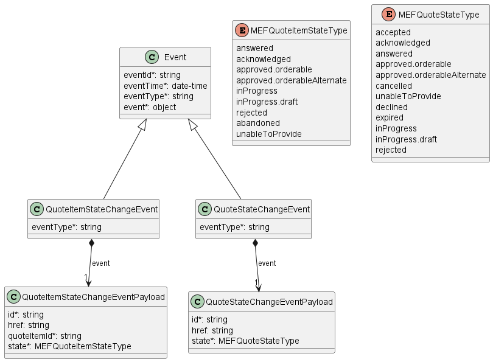

**Figure 25. Quote Notification Data Model**

The Quote Management data model is used to construct requests and responses of
the API endpoints described in [Section 5.3.2](#532-buyer-side-api-endpoints).

### 7.3.1. Type Event

**Description:** Event class is used to describe information structure used for
notification.

<table id="T_Event" style="width:100%">
    <thead style="font-weight:bold">
        <tr>
            <td>Name</td>
            <td style="width:15%">Type</td>
            <td>M/O</td>
            <td>Description</td>
            <td>MEF 80</td>
        </tr>
    </thead>
    <tbody>
        <tr>
        <td>eventId</td>
            <td>string</td>
            <td>M</td>
            <td>Id of the event</td>
            <td></td>
        </tr><tr>
        <td>eventTime</td>
            <td>date-time<br/><span style="font-size:10px;font-style:italic">format = date-time</span></td>
            <td>M</td>
            <td>Date-time when the event occurred</td>
            <td></td>
        </tr><tr>
        <td>eventType</td>
            <td>string</td>
            <td>M</td>
            <td>The type of the notification.</td>
            <td></td>
        </tr><tr>
        <td>event</td>
            <td>object</td>
            <td>M</td>
            <td>The event linked to the involved resource object</td>
            <td></td>
        </tr>
    </tbody>
</table>

### 7.3.2. Type QuoteStateChangeEvent

**Description:** QuoteStateChangeEvent structure

Inherits from:

- <a href="#T_Event">Event</a>

<table id="T_QuoteStateChangeEvent" style="width:100%">
    <thead style="font-weight:bold">
        <tr>
            <td>Name</td>
            <td style="width:15%">Type</td>
            <td>M/O</td>
            <td>Description</td>
            <td>MEF 80</td>
        </tr>
    </thead>
    <tbody>
        <tr>
        <td>eventType</td>
            <td>string</td>
            <td>M</td>
            <td>Indicates the type of product offering qualification event.</td>
            <td></td>
        </tr><tr>
        <td>event</td>
            <td><a href="#T_QuoteStateChangeEventPayload">QuoteStateChangeEventPayload</a></td>
            <td>M</td>
            <td>A reference to the Quote that is source of the notification.
</td>
            <td></td>
        </tr>
    </tbody>
</table>

### 7.3.3. Type QuoteStateChangeEventPayload

**Description:** A reference to the Quote that is the source of the
notification.

<table id="T_QuoteStateChangeEventPayload" style="width:100%">
    <thead style="font-weight:bold">
        <tr>
            <td>Name</td>
            <td style="width:15%">Type</td>
            <td>M/O</td>
            <td>Description</td>
            <td>MEF 80</td>
        </tr>
    </thead>
    <tbody>
        <tr>
        <td>id</td>
            <td>string</td>
            <td>M</td>
            <td>The Quote unique identifier.</td>
            <td></td>
        </tr><tr>
        <td>href</td>
            <td>string</td>
            <td>O</td>
            <td>Link to the Quote</td>
            <td></td>
        </tr><tr>
        <td>state</td>
            <td><a href="#T_MEFQuoteStateType">MEFQuoteStateType</a></td>
            <td>M</td>
            <td>The state reached at change date</td>
            <td></td>
        </tr>
    </tbody>
</table>

### 7.3.4. Type QuoteItemStateChangeEvent

**Description:** QuoteItemStateChangeEvent structure

Inherits from:

- <a href="#T_Event">Event</a>

<table id="T_QuoteItemStateChangeEvent" style="width:100%">
    <thead style="font-weight:bold">
        <tr>
            <td>Name</td>
            <td style="width:15%">Type</td>
            <td>M/O</td>
            <td>Description</td>
            <td>MEF 80</td>
        </tr>
    </thead>
    <tbody>
        <tr>
        <td>eventType</td>
            <td>string</td>
            <td>M</td>
            <td>Indicates the type of product offering qualification event.</td>
            <td></td>
        </tr><tr>
        <td>event</td>
            <td><a href="#T_QuoteItemStateChangeEventPayload">QuoteItemStateChangeEventPayload</a></td>
            <td>M</td>
            <td>A reference to the Quote that is source of the notification.
</td>
            <td></td>
        </tr>
    </tbody>
</table>

### 7.3.5. Type QuoteItemStateChangeEventPayload

**Description:** A reference to the Quote that is the source of the
notification.

<table id="T_QuoteItemStateChangeEventPayload" style="width:100%">
    <thead style="font-weight:bold">
        <tr>
            <td>Name</td>
            <td style="width:15%">Type</td>
            <td>M/O</td>
            <td>Description</td>
            <td>MEF 80</td>
        </tr>
    </thead>
    <tbody>
        <tr>
        <td>id</td>
            <td>string</td>
            <td>M</td>
            <td>The Quote unique identifier.</td>
            <td></td>
        </tr><tr>
        <td>href</td>
            <td>string</td>
            <td>O</td>
            <td>Link to the Quote</td>
            <td></td>
        </tr><tr>
        <td>quoteItemId</td>
            <td>string</td>
            <td>M</td>
            <td>ID of the Quote Item (within the Quote) which state change triggered the event</td>
            <td></td>
        </tr><tr>
        <td>state</td>
            <td><a href="#T_MEFQuoteItemStateType">MEFQuoteItemStateType</a></td>
            <td>M</td>
            <td>The state reached at change date</td>
            <td></td>
        </tr>
    </tbody>
</table>

### 7.3.6. `enum` MEFQuoteStateType

**Description:** Possible values for the status of a Quote. Following mapping
has been used between `MEFQuoteStateType` and MEF 80:

| QuoteStateType              | MEF 80              |
| --------------------------- | ------------------- |
| accepted                    | ACCEPTED            |
| acknowledged                | ACKNOWLEDGED        |
| answered                    | ANSWERED            |
| approved.orderable          | ORDERABLE           |
| approved.orderableAlternate | ORDERABLE_ALTERNATE |
| declined                    | DECLINED            |
| expired                     | EXPIRED             |
| cancelled                   | CANCELLED           |
| unableToProvide             | UNABLE_TO_PROVIDE   |
| inProgress                  | IN_PROGRESS         |
| inProgress.draft            | IN_PROGRESS_DRAFT   |
| rejected                    | REJECTED            |

<table id="T_MEFQuoteStateType">
    <thead style="font-weight:bold;">
        <tr>
            <td>Value</td>
            <td>MEF 80</td>
        </tr>
    </thead>
    <tbody>
        <tr>
            <td>accepted</td>
            <td>ACCEPTED</td>
        </tr><tr>
            <td>acknowledged</td>
            <td>ACKNOWLEDGED</td>
        </tr><tr>
            <td>answered</td>
            <td>ANSWERED</td>
        </tr><tr>
            <td>approved.orderable</td>
            <td>APPROVED.ORDERABLE</td>
        </tr><tr>
            <td>approved.orderableAlternate</td>
            <td>APPROVED.ORDERABLE_ALTERNATE</td>
        </tr><tr>
            <td>cancelled</td>
            <td>CANCELLED</td>
        </tr><tr>
            <td>unableToProvide</td>
            <td>UNABLE_TO_PROVIDE</td>
        </tr><tr>
            <td>declined</td>
            <td>DECLINED</td>
        </tr><tr>
            <td>expired</td>
            <td>EXPIRED</td>
        </tr><tr>
            <td>inProgress</td>
            <td>IN_PROGRESS</td>
        </tr><tr>
            <td>inProgress.draft</td>
            <td>IN_PROGRESS.DRAFT</td>
        </tr><tr>
            <td>rejected</td>
            <td>REJECTED</td>
        </tr>
    </tbody>
</table>

### 7.3.7. `enum` MEFQuoteItemStateType

**Description:** Possible values for the status of a QuoteItem.

Following mapping has been used between `MEFQuoteItemStateType` and MEF 80:

| MEFQuoteItemStateType       | MEF 80              |
| --------------------------- | ------------------- |
| answered                    | ANSWERED            |
| acknowledged                | ACKNOWLEDGED        |
| approved.orderable          | ORDERABLE           |
| approved.orderableAlternate | ORDERABLE_ALTERNATE |
| inProgress                  | IN_PROGRESS         |
| inProgress.draft            | IN_PROGRESS_DRAFT   |
| abandoned                   | ABANDONED           |
| rejected                    | REJECTED            |
| unableToProvide             | UNABLE_TO_PROVIDE   |

<table id="T_MEFQuoteItemStateType">
    <thead style="font-weight:bold;">
        <tr>
            <td>Value</td>
            <td>MEF 80</td>
        </tr>
    </thead>
    <tbody>
        <tr>
            <td>answered</td>
            <td>ANSWERED</td>
        </tr><tr>
            <td>acknowledged</td>
            <td>ACKNOWLEDGED</td>
        </tr><tr>
            <td>approved.orderable</td>
            <td>APPROVED.ORDERABLE</td>
        </tr><tr>
            <td>approved.orderableAlternate</td>
            <td>APPROVED.ORDERABLE_ALTERNATE</td>
        </tr><tr>
            <td>inProgress</td>
            <td>IN_PROGRESS</td>
        </tr><tr>
            <td>inProgress.draft</td>
            <td>IN_PROGRESS.DRAFT</td>
        </tr><tr>
            <td>rejected</td>
            <td>REJECTED</td>
        </tr><tr>
            <td>abandoned</td>
            <td>ABANDONED</td>
        </tr><tr>
            <td>unableToProvide</td>
            <td>UNABLE_TO_PROVIDE</td>
        </tr>
    </tbody>
</table>

<div class="page"/>

# 8. References

- [ISO4217](https://www.currency-iso.org/en/home/tables/table-a1.html)
  International Standards Organization ISO 4217:2015, 2015
- [JSON](https://json-schema.org/specification-links.html#draft-7), JSON Schema:
  A Media Type for Describing JSON Documents and associated documents, by Austin
  Wright and Henry Andrews, March 2018. Copyright © 2018 IETF Trust and the
  persons identified as the document authors. All rights reserved.
- [MEF 50.1](https://www.mef.net/wp-content/uploads/2017/08/MEF-50-1.pdf), MEF
  Services Lifecycle Process Flows, August 2017.
- [MEF 55.1](https://www.mef.net/wp-content/uploads/2021/02/MEF-55.1.pdf),
  Lifecycle Service Orchestration (LSO): Reference Architecture and Framework,
  February 2021
- [MEF 55.1.1](https://www.mef.net/wp-content/uploads/MEF-55.1.1.pdf), Amendment
  to MEF 55.1: Reference Architecture and Framework - Terminology, June 2023
- [MEF 79.1](https://www.mef.net/wp-content/uploads/MEF-79.1-Draft-R1.pdf),
  Product Offering Qualification Management Business Requirements and Use Cases,
  November 2024, Draft Standard (R1)
- [MEF 80](https://www.mef.net/wp-content/uploads/MEF-80.pdf), Quote Management
  Requirements and Use Cases, July 2021
- [MEF 80.0.1](https://www.mef.net/wp-content/uploads/MEF-80.0.1-Draft-R1.pdf),
  Amendment to MEF 80: Quote Management Requirements and Use Cases, November
  2024, Draft Standard (R1)
- [MEF 106](https://www.mef.net/wp-content/uploads/MEF-106.pdf), LSO Sonata
  Access E-Line Product Schemas and Developer Guide, February 2023
- [MEF 121.1](https://github.com/MEF-GIT/MEF-LSO-Sonata-SDK/blob/irene/documentation/productApi/serviceability/address/MEF%20121.1%20-%20LSO%20Cantata%20and%20LSO%20Sonata%20Address%20Management%20API%20-%20Developer%20Guide.pdf?raw=true),
  LSO Cantata and LSO Sonata Address Management API - Developer Guide, December
  2024
- [MEF 128.1](https://www.mef.net/wp-content/uploads/MEF-128.1.pdf), LSO API
  Security Profile, April 2024
- [MEF 150](https://www.mef.net/wp-content/uploads/MEF-150-Draft-R1.pdf),
  Installation Place and Service Site Management Business Requirements and Use
  Cases, November 2024, Draft Standard (R1)
- [OAS-V3](http://spec.openapis.org/oas/v3.0.3.html), February 2020
- [REST](http://www.ics.uci.edu/~fielding/pubs/dissertation/rest_arch_style.htm)
  Fielding, Roy Thomas, Architectural Styles and the Design of Network-based
  Software Architectures (Ph.D.).
- [RFC 2119](https://tools.ietf.org/html/rfc2119), Key words for use in RFCs to
  Indicate Requirement Levels, March 1997
- [RFC 3986](https://tools.ietf.org/html/rfc3986#section-3) Uniform Resource
  Identifier (URI): Generic Syntax, January 2005
- [RFC 7231](https://tools.ietf.org/html/rfc7231), Hypertext Transfer Protocol
  (HTTP/1.1): Semantics and Content, June 2014
  https://tools.ietf.org/html/rfc7231
- [RFC 8174](https://tools.ietf.org/html/rfc8174), Ambiguity of Uppercase vs
  Lowercase in RFC 2119 Key Words, May 2017
- [TMF 630](https://www.tmforum.org/resources/how-to-guide/tmf630-api-design-guidelines-4-0/)
  TMF630 API Design Guidelines 4.0.1
- [TMF 648](https://www.tmforum.org/resources/specification/tmf648-quote-management-api-rest-specification-r19-0-0/)
  TMF648 Quote Management API REST Specification R19.0.1 Doc
