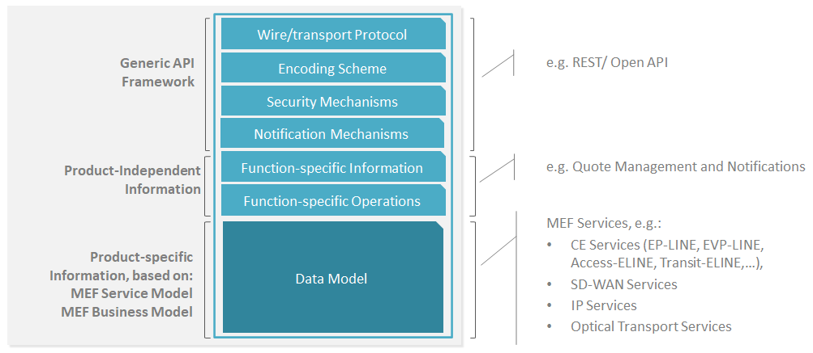
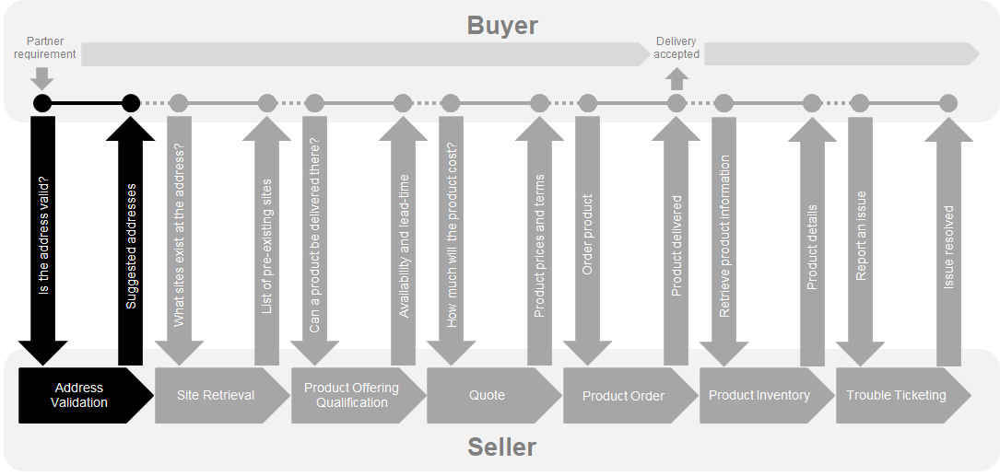
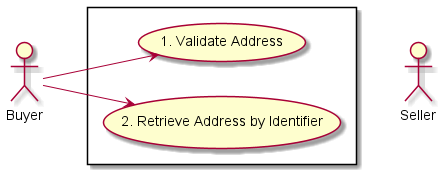
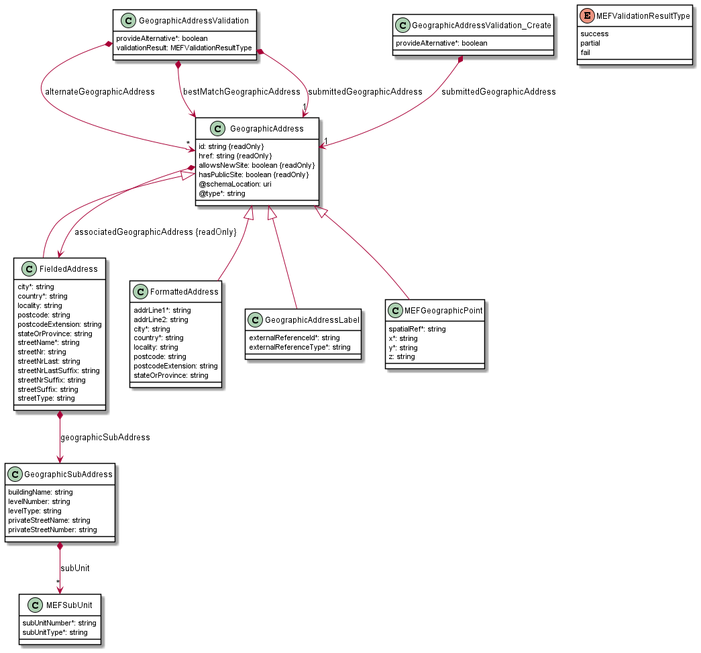
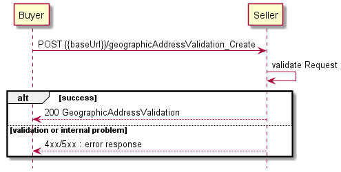
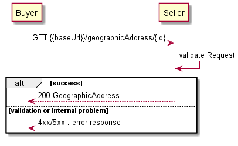
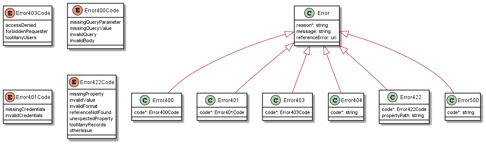

<style>
img
{
  display:block;
  float:none;
  margin-left:auto;
  margin-right:auto;
}
</style>


<div style="font-weight:bold; font-size:33pt; font-family: sensation;  text-align:center">
MEF Standard
</br>
MEF 121
</br>
</br>
LSO Cantata and LSO Sonata Address Management API - Developer Guide
</br>
</br>
</br>
</br>
May 2022
</div>

<div class="page"/>

**Disclaimer**

© MEF Forum 2022. All Rights Reserved.

The information in this publication is freely available for reproduction and
use by any recipient and is believed to be accurate as of its publication date.
Such information is subject to change without notice and MEF Forum (MEF) is not
responsible for any errors. MEF does not assume responsibility to update or
correct any information in this publication. No representation or warranty,
expressed or implied, is made by MEF concerning the completeness, accuracy, or
applicability of any information contained herein and no liability of any kind
shall be assumed by MEF as a result of reliance upon such information.

The information contained herein is intended to be used without modification by
the recipient or user of this document. MEF is not responsible or liable for
any modifications to this document made by any other party.

The receipt or any use of this document or its contents does not in any way
create, by implication or otherwise:

- (a) any express or implied license or right to or under any patent,
  copyright, trademark or trade secret rights held or claimed by any MEF member
  which are or may be associated with the ideas, techniques, concepts or
  expressions contained herein; nor

- (b) any warranty or representation that any MEF member will announce any
  product(s) and/or service(s) related thereto, or if such announcements are
  made, that such announced product(s) and/or service(s) embody any or all of
  the ideas, technologies, or concepts contained herein; nor

- (c) any form of relationship between any MEF member and the recipient or user
  of this document.

Implementation or use of specific MEF standards, specifications or
recommendations will be voluntary, and no Member shall be obliged to implement
them by virtue of participation in MEF Forum. MEF is a non-profit international
organization to enable the development and worldwide adoption of agile, assured
and orchestrated network services. MEF does not, expressly or otherwise,
endorse or promote any specific products or services.

**Copyright**

© MEF Forum 2022. Any reproduction of this document, or any portion thereof,
shall contain the following statement: "Reproduced with permission of MEF
Forum." No user of this document is authorized to modify any of the information
contained herein.

<div class="page"/>

**Table of Contents**

- [List of Contributing Members](#list-of-contributing-members)
- [1. Abstract](#1-abstract)
- [2. Terminology and Abbreviations](#2-terminology-and-abbreviations)
- [3. Compliance Levels](#3-compliance-levels)
- [4. Introduction](#4-introduction)
  - [4.1. Description](#41-description)
  - [4.2. Conventions in the Document](#42-conventions-in-the-document)
  - [4.3. Relation to Other Documents](#43-relation-to-other-documents)
  - [4.4. Approach](#44-approach)
  - [4.5. High-Level Flow](#45-high-level-flow)
- [5. API Description](#5-api-description)
  - [5.1. High-level use cases](#51-high-level-use-cases)
  - [5.2. Resource/endpoint Description](#52-resourceendpoint-description)
    - [5.2.1. Seller Side Endpoints](#521-seller-side-endpoints)
    - [5.2.2. Specifying the Buyer ID and the Seller ID](#522-specifying-the-buyer-id-and-the-seller-id)
  - [5.3. API Resource Schema summary](#53-api-resource-schema-summary)
    - [5.3.1. Fielded Address](#531-fielded-address)
    - [5.3.2. Formatted Address](#532-formatted-address)
    - [5.3.3. Geographic Point](#533-geographic-point)
    - [5.3.4. Geographic Address Label](#534-geographic-address-label)
  - [5.4. Model Structural Validation](#54-model-structural-validation)
  - [5.5. Security Considerations](#55-security-considerations)
- [6. API Interaction & Flows](#6-api-interaction--flows)
  - [6.1. Use case 1: Validate Address](#61-use-case-1-validate-address)
    - [6.1.1 Address Validation Request](#611-address-validation-request)
    - [6.1.2 Address Validation Response](#612-address-validation-response)
  - [6.2. Use case 2: Retrieve Address by Identifier](#62-use-case-2-retrieve-address-by-identifier)
- [7. API Details](#7-api-details)
  - [7.1. API patterns](#71-api-patterns)
    - [7.1.1. Indicating errors](#711-indicating-errors)
      - [7.1.1.1. Type Error](#7111-type-error)
      - [7.1.1.2. Type Error400](#7112-type-error400)
      - [7.1.1.3. Type Error401](#7113-type-error401)
      - [7.1.1.4. Type Error403](#7114-type-error403)
      - [7.1.1.5. Type Error404](#7115-type-error404)
      - [7.1.1.6. Type Error422](#7116-type-error422)
      - [7.1.1.7. Type Error500](#7117-type-error500)
  - [7.2. API Data model](#72-api-data-model)
    - [7.2.1 Geographic Address Validation](#721-geographic-address-validation)
      - [7.2.1.1 Type GeographicAddressValidation_Create](#7211-type-geographicaddressvalidation_create)
      - [7.2.1.2 Type GeographicAddressValidation](#7212-type-geographicaddressvalidation)
      - [7.2.1.3 `enum` MEFValidationResultType](#7213-enum-mefvalidationresulttype)
    - [7.2.2. Geographic Address](#722-geographic-address)
      - [7.2.2.1 Type GeographicAddress](#7221-type-geographicaddress)
      - [7.2.2.2. Type FieldedAddress](#7222-type-fieldedaddress)
      - [7.2.2.3. Type FormattedAddress](#7223-type-formattedaddress)
      - [7.2.2.4. Type MEFGeographicPoint](#7224-type-mefgeographicpoint)
      - [7.2.2.5. Type GeographicSubAddress](#7225-type-geographicsubaddress)
      - [7.2.2.6. Type GeographicAddressLabel](#7226-type-geographicaddresslabel)
      - [7.2.2.7. Type MEFSubUnit](#7227-type-mefsubunit)
- [8. References](#8-references)

<div class="page"/>

# List of Contributing Members

The following members of the MEF participated in the development of this
document and have requested to be included in this list.

| Member                 |
| ---------------------- |
| Amartus                |
| Colt                   |
| Lumen Technologies     |
| NEC/Netcracker         |
| Orange                 |
| Proximus               |
| Spirent Communications |

**Table 1: Contributing Members**

# 1. Abstract

This standard is intended to assist implementation of the Address Validation
functionality defined for the LSO Cantata and LSO Sonata Interface Reference
Point (IRPs), for which requirements and use cases are defined in MEF 79
_Address, Service Site, and Product Offering Qualification Management
Requirements and Use Cases_ [[MEF79](#8-references)] and MEF W79.0.2 _Amendment
to MEF 79: Address Validation_ [[MEF79.0.2](#8-references)]. This standard
consists of this document and complementary API definitions.

This standard normatively incorporates the following files by reference as if
they were part of this document, from the GitHub repository:

<https://github.com/MEF-GIT/MEF-LSO-Sonata-SDK>

commit id:
[2062c16db194adc5109d0b7c0578a1a9128c6471](https://github.com/MEF-GIT/MEF-LSO-Sonata-SDK/tree/2062c16db194adc5109d0b7c0578a1a9128c6471)

- [`productApi/serviceability/address/geographicAddressManagement.api.yaml`](https://github.com/MEF-GIT/MEF-LSO-Sonata-SDK/blob/2062c16db194adc5109d0b7c0578a1a9128c6471/productApi/serviceability/address/geographicAddressManagement.api.yaml)

<https://github.com/MEF-GIT/MEF-LSO-Cantata-SDK>

commit id:
[fd4aad8d6417b6aed2fa4e2d4ffa9836648addb0](https://github.com/MEF-GIT/MEF-LSO-Cantata-SDK/tree/fd4aad8d6417b6aed2fa4e2d4ffa9836648addb0)

- [`productApi/serviceability/address/geographicAddressManagement.api.yaml`](https://github.com/MEF-GIT/MEF-LSO-Cantata-SDK/blob/fd4aad8d6417b6aed2fa4e2d4ffa9836648addb0/productApi/serviceability/address/geographicAddressManagement.api.yaml)

# 2. Terminology and Abbreviations

This section defines the terms used in this document. In many cases, the
normative definitions of terms are found in other documents. In these cases,
the third column is used to provide the reference that is controlling, in other
MEF or external documents.

<table>
<tr>
  <th>Term</th>
  <th>Description</th>
  <th>Reference</th>
</tr>
<tr>
  <td>Address</td>
  <td>A way of specifying an absolute fixed location on earth using pre-established boundary and identifier information such as country, city, postal code and street information.</td>
  <td><a href="#8-references">[MEF79]</td>
</tr>
<tr>
  <td>Application Program Interface (API)</td>
  <td>In the context of LSO, API describes one of the Management Interface Reference Points based on the requirements specified in an Interface Profile, along with a data model, the protocol that defines operations on the data and the encoding format used to encode data according to the data model. In this document, API is used synonymously with REST API.</td>
  <td><a href="#8-references">[MEF55.1]</td>
</tr>
<tr>
  <td>Buyer</td>
  <td>In the context of this document, denotes the organization or individual acting as the customer in a transaction over a Cantata (Customer <-> Service Provider) or Sonata (Service Provider <-> Partner) Interface.</td>
  <td>This document; adapted from <a href="#8-references">[MEF80]</td>
</tr>
<tr>
  <td>Fielded Address</td>
  <td>A type of Address that has a discrete field and value for each type of boundary or identifier down to the lowest level of detail. For example, "street number" is one field, "street name" is another field, etc.</td>
  <td><a href="#8-references">[MEF79]</td>
</tr>
<tr>
  <td>Formatted Address</td>
  <td>A type of Address that has discrete fields for each type of boundary or identifier with the exception of street and more specific location details, which are combined into a maximum of two strings based on local postal addressing conventions.</td>
  <td><a href="#8-references">[MEF79]</td>
</tr>
<tr>
  <td>Geographic Address Label</td>
  <td>An identifier that is unique within the Administrative Authority that controls assignment of the label and that specifies a fixed location on earth.</td>
  <td><a href="#8-references">[MEF79.0.2]</td>
</tr>
<tr>
  <td>Requesting Entity</td>
  <td>The business organization that is acting on behalf of one or more Buyers. In the most common case, the Requesting Entity represents only one Buyer and these terms are then synonymous.</td>
  <td><a href="#8-references">[MEF79]</a></td>
</tr>
<tr>
  <td>Responding Entity</td>
  <td>The business organization that is acting on behalf of one or more Sellers. In the most common case, the Responding Entity represents only one Seller and these terms are then synonymous.</td>
  <td><a href="#8-references">[MEF79]</a></td>
</tr>
<tr>
  <td>REST API </td>
  <td>Representational State Transfer. REST provides a set of architectural constraints that, when applied as a whole, emphasizes scalability of component interactions, generality of interfaces, independent deployment of components, and intermediary components to reduce interaction latency, enforce security, and encapsulate legacy systems.</td>
  <td><a href="#8-references">[REST]</a> </td>
</tr>
<tr>
  <td>Seller</td>
  <td>In the context of this document, denotes the organization acting as the supplier in a transaction over a Cantata (Customer <-> Service Provider) or Sonata (Service Provider <-> Partner) Interface.</td>
  <td>This document; adapted from <a href="#8-references">[MEF80]</td>
</tr>
<tr>
  <td>Service Site</td>
  <td>A fixed physical location at which a Product can be installed. Its location can be described either with geocodes (Lat/Long information) or by association with an Address or Global Address Reference. This association may include a Sub-address describing where within that Address or Global Address Reference this particular Service Site is located.</td>
  <td><a href="#8-references">[MEF79]</td>
</tr>
</table>

# 3. Compliance Levels

The key words **"MUST"**, **"MUST NOT"**, **"REQUIRED"**, **"SHALL"**, **"SHALL
NOT"**, **"SHOULD"**, **"SHOULD NOT"**, **"RECOMMENDED"**, **"NOT
RECOMMENDED"**, **"MAY"**, and **"OPTIONAL"** in this document are to be
interpreted as described in BCP 14 (RFC 2119 [[rfc2119](#8-references)], RFC
8174 [[rfc8174](#8-references)]) when, and only when, they appear in all
capitals, as shown here. All key words must be in bold text.

Items that are **REQUIRED** (contain the words **MUST** or **MUST NOT**) are
labeled as **[Rx]** for required. Items that are **RECOMMENDED** (contain the
words **SHOULD** or **SHOULD NOT**) are labeled as **[Dx]** for desirable.
Items that are **OPTIONAL** (contain the words MAY or OPTIONAL) are labeled as
**[Ox]** for optional.

# 4. Introduction

This standard specification document describes the Application Programming
Interface (API) for Address Validation functionality of the LSO Cantata
Interface Reference Point (IRP) and Sonata IRP as defined in the MEF 55.1
_Lifecycle Service Orchestration (LSO): Reference Architecture and Framework_
[[MEF55.1](#8-references)]. The LSO Reference Architecture is shown in Figure 1
with both IRPs highlighted.


**Figure 1. The LSO Reference Architecture**

Cantata and Sonata IRPs define pre-ordering and ordering functionalities that
allow an automated exchange of information between business applications of the
Buyer (Customer or Service Provider) and Seller (Service Provider or Partner)
Domains. Those are:

- Address Validation
- Site Retrieval
- Product Offering Qualification
- Product Quote
- Product Inventory
- Product Ordering
- Trouble Ticketing
- Billing

The business requirements and use cases for Address Validation are defined in
_Address, Service Site, and Product Offering Qualification Management
Requirements and Use Cases_ (MEF 79) [[MEF79](#8-references)] and _Amendment to
MEF 79: Address Validation_ (MEF W79.0.2) [[MEF79.0.2](#8-references)].

This document focuses on implementation aspects of Address Validation
functionality and is structured as follows:

- [Chapter 4](#4-introduction) provides an introduction to Address Validation
  and its description in a broader context of Cantata and Sonata and their
  corresponding SDKs.
- [Chapter 5](#5-api-description) gives an overview of endpoints, resource
  model and design patterns.
- Use cases and flows are presented in
  [Chapter 6](#6-api-interactions-and-flows).
- And finally, [Chapter 7](#7-api-details) complements previous sections with a
  detailed API description.

## 4.1. Description

The point of Address Validation API is to ensure that the Buyer and the Seller
understand each other in terms of address representation. It is often the case
that the same address may be represented in various ways. There are also cases
where the address might be ambiguous or there is no address at all.

The other purpose is to obtain the Seller's Address Identifier so that the
Buyer may refer to it by reference hence speeding up the latter conversation.

## 4.2. Conventions in the Document

- Code samples are formatted using code blocks. When notation `<< some text >>`
  is used in the payload sample it indicates that a comment is provided instead
  of an example value and it might not comply with the OpenAPI definition.
- Model definitions are formatted as in-line code (e.g. `GeographicAddress`).
- In UML diagrams the default cardinality of associations is `0..1`. Other
  cardinality markers are complaint with the UML standard.
- In the API details tables and UML diagrams required attributes are marked
  with a `*` next to their names.
- In UML sequence diagrams `{{variable}}` notation is used to indicates a
  variable to be substituted with a correct value.

## 4.3. Relation to Other Documents

The requirements and use cases for Address Validation functionality are defined
in MEF 79 [[MEF79](#8-references)] and MEF 79.0.2 [[MEF79.0.2](#8-references)].
The API definition builds on TMF 673 API as specified by _TMF673 Geographic
Address Management API User Guide_ [[TMF673](#8-references)].

## 4.4. Approach

As presented in Figure 2. both Cantata and Sonata API frameworks consist of
three structural components:

- Generic API framework
- Product-independent information (Function-specific information and
  Function-specific operations)
- Product-specific information (MEF product specification data model)



**Figure 2. Cantata and Sonata API framework**

The essential concept behind the framework is to decouple the common structure,
information, and operations from the specific product information content.  
Firstly, the Generic API Framework defines a set of design rules and patterns
that are applied across all Cantata or Sonata APIs.  
Secondly, the product-independent information of the framework focuses on a
model of a particular Cantata or Sonata functionality and is agnostic to any of
the product specifications.  
Finally, the product-specific information part of the framework focuses on MEF
product specifications that define business-relevant attributes and
requirements for trading MEF subscriber and MEF operator services.

The Address Validation API is product-agnostic in its nature and is not
intended to carry any product-specific payloads. It operates using the Generic
API Framework and the Function-specific Information and Operations.

## 4.5. High-Level Flow

Address Validation is part of a broader Cantata and Sonata End-to-End flow.
Figure 3. below shows a high-level diagram to get a good understanding of the
whole process and Address Validation's position within it.



**Figure 3. Cantata and Sonata End-to-End Function Flow**

- Address Validation:
  - Allows the Buyer to retrieve address information from the Seller, including
    exact formats, for addresses known to the Seller.
- Site Retrieval:
  - Allows the Buyer to retrieve Service Site information including exact
    formats for Service Sites known to the Seller.
- Product Offering Qualification (POQ):
  - Allows the Buyer to check whether the Seller can deliver a product or set
    of products from among their product offerings at the geographic address or
    a service site specified by the Buyer; or modify a previously purchased
    product.
- Quote:
  - Allows the Buyer to submit a request to find out how much the installation
    of an instance of a Product Offering, an update to an existing Product, or
    a disconnect of an existing Product will cost.
- Product Order:
  - Allows the Buyer to request the Seller to initiate and complete the
    fulfillment process of an installation of a Product Offering, an update to
    an existing Product, or a disconnect of an existing Product at the address
    defined by the Buyer.
- Product Inventory:
  - Allows the Buyer to retrieve the information about existing Product
    instances from Seller's Product Inventory.
- Trouble Ticketing:
  - Allows the Buyer to create, retrieve, and update Trouble Tickets as well as
    receive notifications about Incidents' and Trouble Tickets' updates. This
    allows managing issues and situations that are not part of normal
    operations of the Product provided by the Seller.

# 5. API Description

This section discusses the API structure and design patterns. It starts with
the high-level use cases diagram and then it describes the REST endpoints with
use case mapping.

## 5.1. High-level use cases

Figure 4 presents a high-level use case diagram as specified in MEF 79
[[MEF79](#8-references)] for Address Validation in section 7.1. This picture
aims to help understand the endpoint mapping. Use cases are described
extensively in [chapter 6](#6-api-interactions-and-flows)



**Figure 4. High-level use cases**

## 5.2. Resource/endpoint Description

### 5.2.1. Seller Side Endpoints

**Base URL for Cantata**:
`https://{{serverBase}}:{{port}}{{?/seller_prefix}}/mefApi/cantata/geographicAddressManagement/v1/`

**Base URL for Sonata**:
`https://{{serverBase}}:{{port}}{{?/seller_prefix}}/mefApi/sonata/geographicAddressManagement/v7/`

**_Note:_** All examples will include only the Sonata version of the Base Path.

Following endpoints are exposed by the Seller and allow the Buyer to:

- Validate geographic address data
- Retrieve a geographic address by identifier from Seller's database.

The endpoints and corresponding data model are defined in
`productApi/serviceability/address/geographicAddressManagement.api.yaml`.

| API endpoint                        | Description                                                                                                                              | MEF 79 Use case Mapping              |
| ----------------------------------- | ---------------------------------------------------------------------------------------------------------------------------------------- | ------------------------------------ |
| `POST /geographicAddressValidation` | A request initiated by the Buyer to validate the address representation and get the Seller address `id` if it is supported by the Seller | UC 1: Validate Address               |
| `GET /geographicAddress/{id}`       | A request initiated by the Buyer to retrieve full details of a single `GeographicAddress` based on an identifier.                        | UC 2: Retrieve Address by Identifier |

**[R1]** The Buyer implementation **MUST** be able to use all REST methods that
are listed in the table above. [MEF79 R1].

### 5.2.2. Specifying the Buyer ID and the Seller ID

A business entity willing to represent multiple Buyers or multiple Sellers must
follow requirements of MEF 79 [[MEF79](#8-references)] chapter 8.8, which
states:

> For requests of all types, there is a business entity that is initiating an
> Operation (called a Requesting Entity) and a business entity that is
> responding to this request (called the Responding Entity). In the simplest
> case, the Requesting Entity is the Buyer and the Responding Entity is the
> Seller. However, in some cases, the Requesting Entity may represent more than
> one Buyer and similarly, the Responding Entity may represent more than one
> Seller.
>
> While it is outside the scope of this specification, it is assumed that the
> Requesting Entity and the Responding Entity are aware of each other and can
> authenticate requests initiated by the other party. It is further assumed
> that both the Buying Entity and the Requesting Entity know:
>
> a) the list of Buyers the Requesting Entity represents when interacting with
> this Responding Entity; and  
> b) the list of Sellers that this Responding Entity represents to this
> Requesting Entity.

In the API the `buyerId` and `sellerId` are represented as optional query
parameters in each operation defined in `geographicAddressManagement.api.yaml`.

**[R2]** If the Requesting Entity has the authority to represent more than one
Buyer the request **MUST** include `buyerId` query parameter that identifies
the Buyer being represented [MEF79 R80]

**[R3]** If the Requesting Entity represents precisely one Buyer with the
Responding Entity, the request **MUST NOT** specify the `buyerId` [MEF79 R81]

**[R4]** If the Responding Entity represents more than one Seller to this Buyer
the request **MUST** include `sellerId` query parameter that identifies the
Seller with whom this request is associated [MEF79 R82]

**[R5]** If the Responding Entity represents precisely one Seller to this
Buyer, the request **MUST NOT** specify the `sellerId` [MEF79 R83]

## 5.3. API Resource Schema summary

This subchapter describes the entities from the resource model included in the
API specification.

Each entity is a simple or composed type (with the use of `allOf` keyword for
data types composition). A simple type defines a set of properties that might
be of an object, primitive, or reference type.

[Section 6](#6-api-interactions-and-flows) provides examples of data model and
API usage. For a detailed description of the data model, please refer to
[API Details](#7-api-details).

Figure 5 presents the whole data model of the API.



**Figure 5. Data Model**

**_Note:_** While showing the extends relation, for clarity, the extending type
lists only added attributes, not the sum with the extended type.

`GeographicAddressValidation_Create` is a subset of the
`GeographicAddressValidation` model and is used as a request message. It
contains only attributes that must be set by the Buyer. The Seller then
enriches the entity in the response with additional information of
`bestMatchGeographicAddress` and `alternateGeographicAddress`. In the case of
`MefGeographicPoint` or `GeographicAddressLabel`, the Seller may decide to
provide also the `associatedGeographicAddress` to translate the geo-coordinates
or Label into the `FieldedAddress`.

**[R6]** If an entity is used in the request or response, all properties marked
as required **MUST** be provided.

The root class of address representation is the `GeographicAddress`. It is used
by both the Buyer and the Seller. The Seller in the request can only specify
those without property `readOnly=true`.

The address representation may take one of four types defined in this standard:

- `FieldedAddress`
- `FormattedAddress`
- `GeographicAddressLabel`
- `MEFGeographicPoint`

or any additional type agreed upon between Buyer and Seller. The mandatory
`@type` attribute of `GeographicAddress` is used as a discriminator. It is
possible for the Buyer and the Seller to go beyond those four specified types.
This can be done with the use of the `@schemaLocation` attribute that will
point to the schema defining the model of the new agreed address
representation. Using additional address schema must be bilaterally agreed upon
during the onboarding process.

**[R7]** A Buyer **MUST** support at least one of `FieldedAddress` or
`FormattedAddress` to describe locations. [MEF79 R84]

**[R8]** A Seller **MUST** support at least one of `FieldedAddresses` or
`FormattedAddresses` to specify a location. [MEF79 R85]

### 5.3.1. Fielded Address

```json
{
  "@type": "FieldedAddress",
  "streetType": "ul.",
  "streetName": "Edmunda Wasilewskiego",
  "streetNr": "20",
  "streetNrSuffix": "14",
  "city": "Kraków",
  "stateOrProvince": "Lesser Poland",
  "postcode": "30-305",
  "country": "Poland",
  "geographicSubAddress": {
    "levelType": "floor",
    "levelNumber": "4"
  }
}
```

Example of a Geographic Address of type Fielded Address. The type discriminator
has the value `FieldedAddress`. A subset of available attributes is used to
describe the Geographic Address. The Fielded Address has an optional
`geographicSubAddress` structure that defines several attributes that can be
used in case precise address information has to be provided. In the example
above, a floor in the building at the given address is specified using this
structure.

### 5.3.2. Formatted Address

```json
{
  "@type": "FormattedAddress",
  "addrLine1": "ul. Edmunda Wasilewskiego 20/14",
  "addrLine2": "Floor 4",
  "city": "Kraków",
  "stateOrProvince": "Lesser Poland",
  "postcode": "30-305",
  "country": "Poland"
}
```

Geographic Address of type Formatted Address. The type discriminator has the
value `FormattedAddress`. This example contains the same information as the
previous `FieldedAddress` example.

### 5.3.3. Geographic Point

```json
{
  "@type": "MEFGeographicPoint",
  "spatialRef": "EPSG:4326 WGS 84",
  "x": "50.048868",
  "y": "19.929523"
}
```

Place information in a form of geographic point. `spatialRef` determines the
standard that has to be used to interpret coordinates provided in `x`
(latitude), `y` (longitude), and `z` (elevation) values.

This type allows only providing a point. It cannot carry more detailed
information like the floor number from previous examples.

**[R9]** The `spatialRef` value that can be used **MUST** be agreed upon
between Buyer and Seller during the onboarding process.

### 5.3.4. Geographic Address Label

```json
{
  "@type": "GeographicAddressLabel",
  "externalReferenceType": "CLLI",
  "externalReferenceId": "PLTXCL01"
}
```

The Geographic Address Label represents a unique identifier controlled by a
generally accepted independent Administrative Authority or standard
(`externalReferenceType`) that specifies a fixed geographical location. The
example above is a place that represents a CLLI (Common Language Location
Identifier) identifier which is commonly used to refer locations in North
America for network equipment installations.

## 5.4. Model Structural Validation

The structure of the HTTP payloads exchanged via Address Validation API
endpoints is defined using OpenAPI version 3.0.

**[R10]** Implementations **MUST** use payloads that conform to these
definitions.

## 5.5. Security Considerations

There must be an authentication mechanism whereby a Seller can be assured who a
Buyer is and vice-versa. There must also be authorization mechanisms in place
to control what a particular Buyer or Seller is allowed to do and what
information may be obtained. However, the definition of the exact security
mechanism and configuration is outside the scope of this document. It is being
worked on by a separate MEF Project (MEF W128).

# 6. API Interaction & Flows

This section provides a detailed insight into the API functionality, use cases,
and flows. First, it presents a list of business use cases then provides
examples with a comprehensive explanation of all usage aspects.

| Use Case # | Use Case Name                  | Use Case Description                                                                                                                                                                                                                                                                                                                                                                                                                                                                                                                                    |
| ---------- | ------------------------------ | ------------------------------------------------------------------------------------------------------------------------------------------------------------------------------------------------------------------------------------------------------------------------------------------------------------------------------------------------------------------------------------------------------------------------------------------------------------------------------------------------------------------------------------------------------- |
| 1          | Validate Address               | The Buyer sends `FieldedAddress`, `FormattedAddress`, `MEFGeographicPoint`, or `GeographicAddressLabel` information known to the Buyer to the Seller. The Seller responds with a list of `GeographicAddresses` known to the Seller that likely match the Address information sent by the Buyer. For each Address returned, the Seller should also provide an `id`, which uniquely identifies this Address within the Seller. When the Buyer sends a `MEFGeographicPoint` or `GeographicAddressLabel`, the Seller may also return an associated address. |
| 2          | Retrieve Address by Identifier | The Buyer requests the full details of a single `GeographicAddress` based on an `id` that was previously provided by the Seller.                                                                                                                                                                                                                                                                                                                                                                                                                        |

**Table 2. Use cases description**

The detailed business requirements of each of the use cases are described in
sections 7.2, 8.1, and 8.9 of MEF 79 [[MEF79](#8-references)] and MEF 79.0.2
[[MEF79.0.2](#8-references)].

## 6.1. Use case 1: Validate Address

To send a Validate Address Request the Buyer uses the
`createGeographicAddressValidation` operation from the API:
`POST /geographicAddressValidation`.

The flow is a simple request-response pattern, as presented in Figure 6:



**Figure 6. Validate Address Flow**

### 6.1.1 Address Validation Request

`GeographicAddressValidation_Create:`

```json
{
  "provideAlternative": true,
  "submittedGeographicAddress": {
    "@type": "FieldedAddress",
    "streetNr": "20",
    "streetName": "E. Wasilewskiego",
    "city": "Krakow",
    "postcode": "30-305",
    "country": "Poland"
  }
}
```

`GeographicAddressValidation_Create` is the starting entity. The Buyer submits
the Buyer's representation of the Address in one of four types. Type's specific
required attributes must be included in the Address Validation request.

**[R11]** The Buyer **MUST NOT** specify the `submittedGeographicAddress.id` in
the request. [MEF79 R5], [MEF79 R89], [MEF79 R7], [MEF79 R94], [MEF79.0.2
A2-R1], [MEF79.0.2 A2-R17], [MEF79.0.2 A2-R3], [MEF79.0.2 A2-R23]

**_Note:_** Mef 79 calls this _"Unknown Address ID"_ method.

MEF 79 requires the Seller to support alternative address specification in
response to Buyer's inquiry. This mode is configured using the
`provideAlternative` attribute set to `true`. MEF does not specify the Seller's
behavior in case the attribute is set to `false`. The data model specifies this
attribute due to compliance with the TMF API counterpart.

**[R12]** The Buyer **MUST** always set the value of
`GeographicAddressValidation_Create.provideAlternative` to `true` in the
request.

**[R13]** If a specific country uses `postcode` in it's addressing rules, the
`postcode` attrivute of `FieldedAddress` or `FormattedAddress` **MUST** be
populated in the Buyer's request.

**[R14]** If `streetNr` is supported, it **MUST** be populated in the Buyer's
request.

### 6.1.2 Address Validation Response

After receiving the request, the Seller validates its structure and
completeness. When the validation of the request is successful, the Seller
attempts to match the Buyer's provided address with address information in the
Seller's address management system. For each Address that matches the
`submittedGeographicAddress`, the Seller returns the Address information
including (recommended) an Address Identifier (`id`) for each of them. It is up
to the Seller to decide whether an Address matches the
`submittedGeographicAddress`.

**_Note_** Having an Address validated does not provide any information of
whether the Seller is able to provide any type of Product there. It only
assures that the Buyer and Seller have a common understanding of the place the
validated geographicAddress is used as a representation for. The validated
Address can then be used in further steps of the process.

**[D1]** When the Seller is asked for a valid Address that does not have an
`id` assigned yet (e.g. in case of `MEFGeographicPoint` or
`GeographicAddressLabel`), the Seller **SHOULD** assign the `id` and provide it
in the response.

**[D2]** If validated address has an `id` provided, then it **SHOULD** be used
in latter steps so that the Seller does not have to validate the Address each
time.

**_Note_**: It is up to Seller's policy how long to retain non-referenced
Address id's.

**_Note_**: The term "Seller Response Code" used in the Business Requirements
maps to HTTP response code, where `2xx` indicates _Success_ and `4xx` or `5xx`
indicate _Failure_.

The Seller responds with the `GeographicAddressValidation`:

```json
{
  "provideAlternative": "true", << as provided by the Buyer >>
  "alternateGeographicAddress": [
    {
      "@type": "FieldedAddress",
      "id": "00000000-0000-0030-0305-873500002010",
      "href": "{{baseUrl}}/geographicAddress/00000000-0000-0030-0305-873500002010",
      "allowsNewSite": "true",
      "hasPublicSite": "false",
      "streetNr": "20",
      "streetNrSuffix": "10",
      "streetName": "Edmunda Wasilewskiego",
      "streetType": "ul.",
      "city": "Kraków",
      "stateOrProvince": "Lesser Poland",
      "postcode": "30-305",
      "country": "Poland"
    },
    {
      "@type": "FieldedAddress",
      "id": "00000000-0000-0030-0305-873500002014",
      "href": "{{baseUrl}}/geographicAddress/00000000-0000-0030-0305-873500002014",
      "allowsNewSite": "true",
      "hasPublicSite": "true",
      "streetNr": "20",
      "streetNrSuffix": "14",
      "streetName": "Edmunda Wasilewskiego",
      "streetType": "ul.",
      "city": "Kraków",
      "stateOrProvince": "Lesser Poland",
      "postcode": "30-305",
      "country": "Poland"
    }
  ],
  "bestMatchGeographicAddress": {
    "@type": "FieldedAddress",
    "id": "00000000-0000-0030-0305-873500002000",
    "href": "{{baseUrl}}/geographicAddress/00000000-0000-0030-0305-873500002000",
    "allowsNewSite": "true",
    "hasPublicSite": "true",
    "streetNr": "20",
    "streetName": "Edmunda Wasilewskiego",
    "streetType": "ul.",
    "city": "Kraków",
    "stateOrProvince": "Lesser Poland",
    "postcode": "30-305",
    "country": "Poland"
  },
  "submittedGeographicAddress": { << as provided by the Buyer >>
    "@type": "FieldedAddress",
    "streetNr": "20",
    "streetName": "E. Wasilewskiego",
    "city": "Krakow",
    "postcode": "30-305",
    "country": "Poland"
  }
}
```

**[R15]** Any attribute set by the Buyer in the request **MUST NOT** be
modified by the Seller in the response.

**[R16]** The Seller **MUST** respond with the same Address Type as was
provided in the request. [MEF79 R10], [MEF79 R11], [MEF79.0.2 A2-R5],
[MEF79.0.2 A2-R6]

**[D3]** When specifying a `FieldedAddress` or `FormattedAddress`, the Seller
**SHOULD** specify the `GeographicAddress.id`. [MEF79 D7], [MEF79 D8]

**[D4]** When specifying a `GeographicPoint` or `GeographicAddressLabel`, the
Seller **SHOULD** specify the `GeographicAddress.id`. [MEF79.0.2 A2-D1],
[MEF79.0.2 A2-D2]

**[R17]** To a request placed with a `GeographicPoint` or
`GeographicAddressLabel`, the Seller **MUST** respond only providing the
`bestMatchGeographicAddress`. This is because those types, thanks to the
external authority, already uniquely identify an address and there is no chance
of different notations, etc. The Seller might add the `GeographicAddress.id` or
`associatedGeographicAddress`.

Please note the details of the response:

Returned Addresses have attributes coming from the parent `GeographicAddress`
that are common for each Address Type:

- `id` and `href` to allow referencing them by the Buyer in latter steps.
- `allowsNewSite` - to specify if a Buyer must use one of the known existing
  Service Sites at this location for any Products delivered to this Address.
- `hasPublicSite` - to specify if the Address contains Service Sites that are
  public (e.g. MeetMe-Rooms)

The `allowsNewSite` and `hasPublicSite` attributes are forcing the Seller to
combine the Address domain data with the Service Site domain data. Thus it is
up to the Seller's decision to populate these attributes. Not having these
attributes provided neither having them set to `false` doesn't mean that the
Buyer cannot proceed with using the validated address in further steps.

`FieldedAddress` objects in the response are enriched with the following
attributes to reflect the representation available in the Seller's system:

- `streetType`
- `streetNrSuffix`
- `stateOrProvince`
- `geographicSubAddress`

Additionally, the Seller has corrected 2 fields to match the Seller's
representation of the Address:

- `streetName`: from value `"E. Wasilewskiego"` to `"Edmunda Wasilewskiego"`
- `city`: from value `"Krakow"` to `"Kraków"`

The response contains a `bestMatchGeographicAddress` if found, and a list of
`alternateGeographicAddress`, if any. In the example above the Seller decided
to return the best match and 2 alternatives. That means that in the Seller's
system 3 Addresses are matching the Buyer's Address representation (`country`,
`city`, `streetName`) out of which one was selected to be the best match.

While it is up to Seller's discretion to decide on what constitutes the best
match and alternative Addresses, these rules are recommended:

- best match should be the address the office addresses as provided in the
  request. In the example above the request provided a `streetName` and
  `streetNr` to point to a building. The Seller has three matching Addresses:
  one for the building and two for offices within it. The Address of the
  building is chosen as the best match because the offices are more specific
  and additionally contain the `streetNrSuffix`.

- an Address of a different level of detail should be returned as an
  alternative one. Referring to the example - assuming there was no building
  address in Seller's system but only the addresses of the offices - the office
  addresses should all be marked as alternatives (even if the Seller by any
  reason prioritizes one over the other) because they additionally specify the
  `streetNrSuffix`. The same applies when matched Address would be of less
  detailed specification e.g. containing only `streetName` and no `streetNr`.

- the `alternateGeographicAddress` is not expected to be a sorted list.

**[R18]** In case of no matching addresses found, the Seller **MUST** return a
valid (code `200`) response with an empty list of `bestMatchGeographicAddress`
and `alternateGeographicAddress`. [MEF79.0.2 A2-R7], [MEF79.0.2 A2-R8]

**[D5]** In case of no matching addresses found, the Seller **SHOULD** respond
with `validationStatus=fail`.

**[D6]** In case the best match address is found, the Seller **SHOULD** respond
with `validationStatus=success`.

**[D7]** In case the best match address is not found but an alternate address
is provided, the Seller **SHOULD** respond with `validationStatus=partial`.

**[R19]** In case of too many matching addresses found (the definition of 'too
many' is up to Seller's discretion), the Seller **MUST** return an `Error422`
with `code=tooManyRecords`.

**[O1]** If the `GeographicPoint` or `GeographicAddressLabel` is used in the
request, the Seller **MAY** decide to additionally enrich the response with the
`associatedGeographicAddress` to provide the `FieldedAddress` describing the
location pointed by the coordinates. [MEF79.0.2 A2-O1], [MEF79.0.2 A2-O2]

**_Note_**: When a `GeographicPoint` or `GeographicAddressLabel` is specified
by the Buyer, the Seller will return either a `bestMatchGeographicAddress` or
an empty list.

**_Note_**: If the Seller does not support validation for Address that is
outside of the Seller's operating area, the Seller might return a `422` Error
with `code=otherIssue`, and a `reason` of e.g. _"Address out of operational
area"_.

## 6.2. Use case 2: Retrieve Address by Identifier

To get detailed and up do date information about the Address, the Buyer sends a
Retrieve Address by Identifier Request using a `GET /geographicAddress/{id}`
operation.



**Figure 7. Retrieve Address by Identifier Flow**

Sample request:

`GET /mefApi/sonata/geographicAddressManagement/v7/geographicAddress/00000000-0000-0030-0305-873500002014`

Sample response:

```json
{
  "@type": "FieldedAddress",
  "id": "00000000-0000-0030-0305-873500002014",
  "href": "{{baseUrl}}/geographicAddress/00000000-0000-0030-0305-873500002014",
  "allowsNewSite": "true",
  "hasPublicSite": "true",
  "streetNr": "20",
  "streetNrSuffix": "14",
  "streetName": "Edmunda Wasilewskiego",
  "streetType": "ul.",
  "city": "Kraków",
  "stateOrProvince": "Lesser Poland",
  "postcode": "30-305",
  "country": "Poland",
  "geographicSubAddress": {
    "levelType": "floor",
    "levelNumber": "4"
  }
}
```

Sample request:

`GET /mefApi/sonata/geographicAddressManagement/v7/geographicAddress/00000000-0000-5004-8868-000019929523`

Sample response:

```json
{
  "@type": "MEFGeographicPoint",
  "id": "00000000-0000-5004-8868-000019929523",
  "href": "{{baseUrl}}/geographicAddress/00000000-0000-5004-8868-000019929523",
  "allowsNewSite": "true",
  "hasPublicSite": "false",
  "spatialRef": "EPSG:4326 WGS 84",
  "x": "50.048868",
  "y": "19.929523",
  "z": "0",
  "associatedGeographicAddress": {
    "@type": "FieldedAddress",
    "id": "00000000-0000-0030-0305-873500002014",
    "href": "{{baseUrl}}/geographicAddress/00000000-0000-0030-0305-873500002014",
    "allowsNewSite": "true",
    "hasPublicSite": "true",
    "streetNr": "20",
    "streetNrSuffix": "14",
    "streetName": "Edmunda Wasilewskiego",
    "streetType": "ul.",
    "city": "Kraków",
    "stateOrProvince": "Lesser Poland",
    "postcode": "30-305",
    "country": "Poland",
    "geographicSubAddress": {
      "levelType": "floor",
      "levelNumber": "4"
    }
  }
}
```

The example above shows the setting of the optional
`associatedGeographicAddress` that can be provided by the Seller to map the
coordinates to an existing `FieldedAddress`.

**[R20]** In case `id` does not find a `GeographicAddress` in Seller's system,
an error response `404` **MUST** be returned.

**[R21]** `GeographicAddress.id` **MUST** be unique among all types of
`GeographicAddresses` in the Seller's system.

Because of the above, the Buyer does not have to specify the Address type in
the request, as required in [MEF79 R4].

# 7. API Details

## 7.1. API patterns

### 7.1.1. Indicating errors

Erroneous situations are indicated by appropriate HTTP responses. An error
response is indicated by HTTP status 4xx (for client errors) or 5xx (for server
errors) and appropriate response payload. The Address Validation API uses the
error responses depicted and described below.

Implementations can use http error codes not specified in this standard in
compliance with rules defined in RFC 7231 [[RFC7231](#8-references)]. In such
case the error message body structure might be aligned with the `Error`.



**Figure 8. Data model types to represent an erroneous response**

#### 7.1.1.1. Type Error

**Description:** Standard Class used to describe API response error Not
intended to be used directly. The `code` in the HTTP header is used as a
discriminator for the type of error returned in runtime.

<table id="T_Error">
    <thead style="font-weight:bold;">
        <tr>
            <td>Name</td>
            <td>Type</td>
            <td>Description</td>
        </tr>
    </thead>
    <tbody>
        <tr>
            <td>message</td>
            <td>string</td>
            <td>Text that provides mode details and corrective actions related to the error. This can be shown to a client user.</td>
        </tr><tr>
            <td>reason*</td>
            <td>string</td>
            <td>Text that explains the reason for error. This can be shown to a client user.</td>
        </tr><tr>
            <td>referenceError</td>
            <td>uri</td>
            <td>URL pointing to documentation describing the error</td>
        </tr>
    </tbody>
</table>

#### 7.1.1.2. Type Error400

**Description:** Bad Request.
(https://tools.ietf.org/html/rfc7231#section-6.5.1)

Inherits from:

- <a href="#T_Error">Error</a>

<table id="T_Error400">
    <thead style="font-weight:bold;">
        <tr>
            <td>Name</td>
            <td>Type</td>
            <td>Description</td>
        </tr>
    </thead>
    <tbody>
        <tr>
            <td>code*</td>
            <td>string</td>
            <td>One of the following error codes:<br>
- missingQueryParameter: The URI is missing a required query-string parameter<br>
- missingQueryValue: The URI is missing a required query-string parameter value<br>
- invalidQuery: The query section of the URI is invalid.<br>
- invalidBody: The request has an invalid body</td>
        </tr>
    </tbody>
</table>

#### 7.1.1.3. Type Error401

**Description:** Unauthorized.
(https://tools.ietf.org/html/rfc7235#section-3.1)

Inherits from:

- <a href="#T_Error">Error</a>

<table id="T_Error401">
    <thead style="font-weight:bold;">
        <tr>
            <td>Name</td>
            <td>Type</td>
            <td>Description</td>
        </tr>
    </thead>
    <tbody>
        <tr>
            <td>code*</td>
            <td>string</td>
            <td>One of the following error codes:<br>
- missingCredentials: No credentials provided.<br>
- invalidCredentials: Provided credentials are invalid or expired</td>
        </tr>
    </tbody>
</table>

#### 7.1.1.4. Type Error403

**Description:** Forbidden. (https://tools.ietf.org/html/rfc7231#section-6.5.3)

Inherits from:

- <a href="#T_Error">Error</a>

<table id="T_Error403">
    <thead style="font-weight:bold;">
        <tr>
            <td>Name</td>
            <td>Type</td>
            <td>Description</td>
        </tr>
    </thead>
    <tbody>
        <tr>
            <td>code*</td>
            <td>string</td>
            <td>This code indicates that the server understood
the request but refuses to authorize it because
of one of the following error codes:<br>
- accessDenied: Access denied<br>
- forbiddenRequester: Forbidden requester<br>
- tooManyUsers: Too many users</td>
        </tr>
    </tbody>
</table>

#### 7.1.1.5. Type Error404

**Description:** Resource for the requested path not found.
(https://tools.ietf.org/html/rfc7231#section-6.5.4)

Inherits from:

- <a href="#T_Error">Error</a>

<table id="T_Error404">
    <thead style="font-weight:bold;">
        <tr>
            <td>Name</td>
            <td>Type</td>
            <td>Description</td>
        </tr>
    </thead>
    <tbody>
        <tr>
            <td>code*</td>
            <td>string</td>
            <td>The following error code:<br>
- notFound: A current representation for the target resource not found</td>
        </tr>
    </tbody>
</table>

#### 7.1.1.6. Type Error422

The response for HTTP status `422` is a list of elements that are structured
using the `Error422` data type. Each list item describes a business validation
problem. This type introduces the `propertyPath` attribute which points to the
erroneous property of the request, so that the Buyer may fix it easier. It is
highly recommended that this property should be used, yet remains optional
because it might be hard to implement.

**Description:** Unprocessable entity due to a business validation problem.
(https://tools.ietf.org/html/rfc4918#section-11.2)

Inherits from:

- <a href="#T_Error">Error</a>

<table id="T_Error422">
    <thead style="font-weight:bold;">
        <tr>
            <td>Name</td>
            <td>Type</td>
            <td>Description</td>
        </tr>
    </thead>
    <tbody>
        <tr>
            <td>code*</td>
            <td>string</td>
            <td>One of the following error codes:<br>
  - missingProperty: The property the Seller has expected is not present in the payload<br>
  - invalidValue: The property has an incorrect value<br>
  - invalidFormat: The property value does not comply with the expected value format<br>
  - referenceNotFound: The object referenced by the property cannot be identified in the Seller system<br>
  - unexpectedProperty: Additional property, not expected by the Seller has been provided<br>
  - tooManyRecords: the number of records to be provided in the response exceeds the Seller's threshold.<br>
  - otherIssue: Other problem was identified (detailed information provided in a reason)
</td>
        </tr><tr>
            <td>propertyPath</td>
            <td>string</td>
            <td>A pointer to a particular property of the payload that caused the validation issue. It is highly recommended that this property should be used.
Defined using JavaScript Object Notation (JSON) Pointer (https://tools.ietf.org/html/rfc6901).
</td>
        </tr>
    </tbody>
</table>

#### 7.1.1.7. Type Error500

**Description:** Internal Server Error.
(https://tools.ietf.org/html/rfc7231#section-6.6.1)

Inherits from:

- <a href="#T_Error">Error</a>

<table id="T_Error500">
    <thead style="font-weight:bold;">
        <tr>
            <td>Name</td>
            <td>Type</td>
            <td>Description</td>
        </tr>
    </thead>
    <tbody>
        <tr>
            <td>code*</td>
            <td>string</td>
            <td>The following error code:<br>
- internalError: Internal server error - the server encountered an unexpected condition that prevented it from fulfilling the request.</td>
        </tr>
    </tbody>
</table>

## 7.2. API Data model

Figure 9 presents the Address Validation data model. The data types,
requirements related to them, and mapping to MEF 79 and MEF 79.0.2
specifications are discussed later in this section.

This data model is used to construct requests and responses of the API
endpoints described in [Section 5.2.1](#521-seller-side-endpoints)


**Figure 9. Address Validation Data Model**

### 7.2.1 Geographic Address Validation

#### 7.2.1.1 Type GeographicAddressValidation_Create

**Description:** This resource is used to manage address validation request.

Skipped properties: alternateGeographicAddress, bestMatchGeographicAddress,
validationResult.

<table id="T_GeographicAddressValidation_Create">
    <thead style="font-weight:bold;">
        <tr>
            <td>Name</td>
            <td>Type</td>
            <td>Description</td>
            <td>MEF 79</td>
        </tr>
    </thead>
    <tbody>
        <tr>
            <td>provideAlternative*</td>
            <td>boolean</td>
            <td>Indicator provided by the requester to specify if alternate addresses must be provided in case of partial or fail result. MEF: The attribute is kept for TMF API compliance. MEF requires this attribute always to be set to "true". Alternatives should be provided regardless of whether best match was found. The Seller is allowed not to implement the support for "false"</td>
            <td>Not represented in MEF 79</td>
        </tr><tr>
            <td>submittedGeographicAddress*</td>
            <td><a href="#T_GeographicAddress">GeographicAddress</a></td>
            <td>The address as submitted to validation. MEF: Structure used by the buyer to request geographic address validation</td>
            <td>Buyer Specified Address</td>
        </tr>
    </tbody>
</table>

#### 7.2.1.2 Type GeographicAddressValidation

**Description:** This resource is used to manage address validation response.

<table id="T_GeographicAddressValidation">
    <thead style="font-weight:bold;">
        <tr>
            <td>Name</td>
            <td>Type</td>
            <td>Description</td>
            <td>MEF 79</td>
        </tr>
    </thead>
    <tbody>
        <tr>
            <td>provideAlternative*</td>
            <td>boolean</td>
            <td>Indicator provided by the requester to specify if alternate addresses must be provided in case of partial or fail result. MEF: The attribute is kept for TMF API compliance. MEF requires this attribute always to be set to "true". Alternatives should be provided regardless of whether best match was found. The Seller is allowed not to implement the support for "false"</td>
            <td>Not represented in MEF 79</td>
        </tr><tr>
            <td>validationResult</td>
            <td><a href="#T_MEFValidationResultType">MEFValidationResultType</a></td>
            <td>Result of the address validation (success, partial, fail)</td>
            <td>Not represented in MEF 79</td>
        </tr><tr>
            <td>alternateGeographicAddress</td>
            <td><a href="#T_GeographicAddress">GeographicAddress</a>[]</td>
            <td>An array of zero or more Addresses known to the Seller that are
considered by the Seller to match the submittedGeographicAddress.
Not including the bestMatchAddress. MEF: Alternatives should be
provided regardless of whether best match was found.</td>
            <td>Seller Verified Addresses (bestMatch&#x3D;false)</td>
        </tr><tr>
            <td>bestMatchGeographicAddress</td>
            <td><a href="#T_GeographicAddress">GeographicAddress</a></td>
            <td>Represents that the Seller is confident this is likely a direct match to the submittedGeographicAddress</td>
            <td>Seller Verified Addresses (bestMatch&#x3D;true)</td>
        </tr><tr>
            <td>submittedGeographicAddress*</td>
            <td><a href="#T_GeographicAddress">GeographicAddress</a></td>
            <td>The address as submitted to validation.</td>
            <td>Buyer Specified Address</td>
        </tr>
    </tbody>
</table>

#### 7.2.1.3 `enum` MEFValidationResultType

**Description:** Result of the address validation:

- success - best match found,
- partial - no best match but alternatives available,
- fail - neither best match nor alternatives provided

<table id="T_MEFValidationResultType">
    <thead style="font-weight:bold;">
        <tr>
            <td>Value</td>
            <td>MEF 79</td>
            <td>Description</td>
        </tr>
    </thead>
    <tbody>
        <tr>
            <td>success</td>
            <td>Not represented in MEF 79</td>
            <td>best match found</td>
        </tr><tr>
            <td>partial</td>
            <td>Not represented in MEF 79</td>
            <td>no best match but alternatives available</td>
        </tr><tr>
            <td>fail</td>
            <td>Not represented in MEF 79</td>
            <td>neither best match nor alternatives provided</td>
        </tr>
    </tbody>
</table>

### 7.2.2. Geographic Address

#### 7.2.2.1 Type GeographicAddress

**Description:** Structured textual way of describing how to find a property in
an urban area (country properties are often defined differently).  
Note: Address corresponds to SID UrbanPropertyAddress

<table id="T_GeographicAddress">
    <thead style="font-weight:bold;">
        <tr>
            <td>Name</td>
            <td>Type</td>
            <td>Description</td>
            <td>MEF 79</td>
        </tr>
    </thead>
    <tbody>
        <tr>
            <td>id {readOnly}</td>
            <td>string</td>
            <td>Unique identifier of the place</td>
            <td>Geographic Address Identifier</td>
        </tr><tr>
            <td>href {readOnly}</td>
            <td>string</td>
            <td>Unique reference of the place</td>
            <td>Not represented in MEF 79</td>
        </tr><tr>
            <td>allowsNewSite {readOnly}</td>
            <td>boolean</td>
            <td>This attribute specifies if a Buyer must use one of the known existing Service Sites at this location for any Products delivered to this Address. For example, if a particular building owner mandated that all interconnects be done in a shared Public Meet-Me-Room, this attribute would be set to False for that Address.</td>
            <td>Address Allows New Sites</td>
        </tr><tr>
            <td>hasPublicSite {readOnly}</td>
            <td>boolean</td>
            <td>This attribute specifies if that Address contains Service Sites that are public such as Meet-Me-Rooms at an interconnect location or a shared telecom room in the basement of a multi-tenant building</td>
            <td>Address Has Public Sites</td>
        </tr><tr>
            <td>associatedGeographicAddress {readOnly}</td>
            <td><a href="#T_FieldedAddress">FieldedAddress</a></td>
            <td>A Fielded Address that is associated with the Geographic Point or the Geographic Address Label.</td>
            <td>Associated Address</td>
        </tr><tr>
            <td>@schemaLocation</td>
            <td>uri</td>
            <td>A URI to a JSON-Schema file that defines additional attributes and relationships. May be used to define additional GeographicAddress types. Usage of this attribute must be agreed upon between Buyer and Seller.</td>
            <td>Not represented in MEF 79</td>
        </tr><tr>
            <td>@type*</td>
            <td>string</td>
            <td>This field is used as discriminator. The value is the name of one of the types that inherit from it using &#x27;allOf&#x27;, i.e. one of FieldedAddress, FormattedAddress, GeographicAddressLabel, MEFGeographicPoint. Moreover, it might discriminate for an additional related place as defined in &#x27;@schemaLocation&#x27;.
</td>
            <td>Not represented in MEF 79</td>
        </tr>
    </tbody>
</table>

#### 7.2.2.2. Type FieldedAddress

**Description:** A type of Address that has a discrete field and value for each
type of boundary or identifier down to the lowest level of detail. For example
"street number" is one field, "street name" is another field, etc.

Reference: MEF 79 (Sn 8.9.2)

Inherits from:

- <a href="#T_GeographicAddress">GeographicAddress</a>

<table id="T_FieldedAddress">
    <thead style="font-weight:bold;">
        <tr>
            <td>Name</td>
            <td>Type</td>
            <td>Description</td>
            <td>MEF 79</td>
        </tr>
    </thead>
    <tbody>
        <tr>
            <td>city*</td>
            <td>string</td>
            <td>The city that the address is in</td>
            <td>City</td>
        </tr><tr>
            <td>country*</td>
            <td>string</td>
            <td>The country that the address is in</td>
            <td>Country</td>
        </tr><tr>
            <td>geographicSubAddress</td>
            <td><a href="#T_GeographicSubAddress">GeographicSubAddress</a></td>
            <td>Additional fields used to specify an address, as detailed as possible.</td>
            <td>Not represented in MEF 79</td>
        </tr><tr>
            <td>locality</td>
            <td>string</td>
            <td>The locality that the address is in</td>
            <td>Locality</td>
        </tr><tr>
            <td>postcode</td>
            <td>string</td>
            <td>A descriptor for a postal delivery area used to speed and simplify the delivery of mail (also known as zip code) MEF 79 defines it as required however as in certain countries it is not used we make it optional in API.</td>
            <td>Postal Code</td>
        </tr><tr>
            <td>postcodeExtension</td>
            <td>string</td>
            <td>An extension of a postal code. E.g. the part following the dash in a US urban property address</td>
            <td>Postal Code Extension</td>
        </tr><tr>
            <td>stateOrProvince</td>
            <td>string</td>
            <td>The State or Province that the address is in</td>
            <td>State Or Province</td>
        </tr><tr>
            <td>streetName*</td>
            <td>string</td>
            <td>Name of the street or other street type</td>
            <td>Street Name</td>
        </tr><tr>
            <td>streetNr</td>
            <td>string</td>
            <td>Number identifying a specific property on a public street. It may be combined with streetNrLast for ranged addresses. MEF 79 defines it as required however as in certain countries it is not used we make it optional in API.</td>
            <td>Street Number</td>
        </tr><tr>
            <td>streetNrLast</td>
            <td>string</td>
            <td>Last number in a range of street numbers allocated to a property</td>
            <td>Street Number Last</td>
        </tr><tr>
            <td>streetNrLastSuffix</td>
            <td>string</td>
            <td>Last street number suffix for a ranged address</td>
            <td>Street Number Suffix Last</td>
        </tr><tr>
            <td>streetNrSuffix</td>
            <td>string</td>
            <td>The first street number suffix</td>
            <td>Street Number Suffix</td>
        </tr><tr>
            <td>streetSuffix</td>
            <td>string</td>
            <td>A modifier denoting a relative direction</td>
            <td>Street Suffix</td>
        </tr><tr>
            <td>streetType</td>
            <td>string</td>
            <td>The type of street (e.g., alley, avenue, boulevard, brae, crescent, drive, highway, lane, terrace, parade, place, tarn, way, wharf)</td>
            <td>Street Type</td>
        </tr>
    </tbody>
</table>

#### 7.2.2.3. Type FormattedAddress

**Description:** A type of Address that has discrete fields for each type of
boundary or identifier with the exception of street and more specific location
details, which are combined into a maximum of two strings based on local postal
addressing conventions.

Reference: MEF 79 (Sn 8.9.3)

Inherits from:

- <a href="#T_GeographicAddress">GeographicAddress</a>

<table id="T_FormattedAddress">
    <thead style="font-weight:bold;">
        <tr>
            <td>Name</td>
            <td>Type</td>
            <td>Description</td>
            <td>MEF 79</td>
        </tr>
    </thead>
    <tbody>
        <tr>
            <td>addrLine1*</td>
            <td>string</td>
            <td>The first address line in a formatted address</td>
            <td>Address Line 1</td>
        </tr><tr>
            <td>addrLine2</td>
            <td>string</td>
            <td>The second address line in a formatted address</td>
            <td>Address Line 2</td>
        </tr><tr>
            <td>city*</td>
            <td>string</td>
            <td>The city that the address is in</td>
            <td>City</td>
        </tr><tr>
            <td>country*</td>
            <td>string</td>
            <td>The country that the address is in</td>
            <td>Country</td>
        </tr><tr>
            <td>locality</td>
            <td>string</td>
            <td>An area of defined or undefined boundaries within a local authority or other legislatively defined area, usually rural or semi-rural in nature</td>
            <td>Locality</td>
        </tr><tr>
            <td>postcode</td>
            <td>string</td>
            <td>A descriptor for a postal delivery area used to speed and simplify the delivery of mail (also known as ZIP code)</td>
            <td>Postal Code</td>
        </tr><tr>
            <td>postcodeExtension</td>
            <td>string</td>
            <td>An extension of a postal code. E.g. the part following the dash in a US urban property address</td>
            <td>Postal Code Extension</td>
        </tr><tr>
            <td>stateOrProvince</td>
            <td>string</td>
            <td>The State or Province that the address is in</td>
            <td>State Or Province</td>
        </tr>
    </tbody>
</table>

#### 7.2.2.4. Type MEFGeographicPoint

**Description:** A MEFGeographicPoint defines a geographic point through
coordinates. Reference: MEF 79 (Sn 8.9.5), MEF 79.0.2 (Sn 8.9.5)

Inherits from:

- <a href="#T_GeographicAddress">GeographicAddress</a>

<table id="T_MEFGeographicPoint">
    <thead style="font-weight:bold;">
        <tr>
            <td>Name</td>
            <td>Type</td>
            <td>Description</td>
            <td>MEF 79</td>
        </tr>
    </thead>
    <tbody>
        <tr>
            <td>spatialRef*</td>
            <td>string</td>
            <td>The spatial reference system used to determine the coordinates (e.g. &quot;WGS84&quot;). The system used and the value of this field are to be agreed during the onboarding process.</td>
            <td>Spatial Reference</td>
        </tr><tr>
            <td>x*</td>
            <td>string</td>
            <td>The latitude expressed in the format specified by the <code>spacialRef</code></td>
            <td>Latitude</td>
        </tr><tr>
            <td>y*</td>
            <td>string</td>
            <td>The longitude expressed in the format specified by the <code>spacialRef</code></td>
            <td>Longitude</td>
        </tr><tr>
            <td>z</td>
            <td>string</td>
            <td>The elevation expressed in the format specified by the <code>spacialRef</code></td>
            <td>Elevation</td>
        </tr>
    </tbody>
</table>

#### 7.2.2.5. Type GeographicSubAddress

**Description:** Additional fields used to specify an address, as detailed as
possible.

<table id="T_GeographicSubAddress">
    <thead style="font-weight:bold;">
        <tr>
            <td>Name</td>
            <td>Type</td>
            <td>Description</td>
            <td>MEF 79</td>
        </tr>
    </thead>
    <tbody>
        <tr>
            <td>buildingName</td>
            <td>string</td>
            <td>Allows for identification of places that require building name  as part of addressing information</td>
            <td>Building Name</td>
        </tr><tr>
            <td>levelNumber</td>
            <td>string</td>
            <td>Used where a level type may be repeated e.g. BASEMENT 1, BASEMENT 2</td>
            <td>Level Number</td>
        </tr><tr>
            <td>levelType</td>
            <td>string</td>
            <td>Describes level types within a building</td>
            <td>Level Type</td>
        </tr><tr>
            <td>privateStreetName</td>
            <td>string</td>
            <td>Private streets internal to a property (e.g. a university) may have internal names that are not recorded by the land title office
</td>
            <td>Private Street Name</td>
        </tr><tr>
            <td>privateStreetNumber</td>
            <td>string</td>
            <td>Private streets numbers internal to a private street</td>
            <td>Private Street Number</td>
        </tr><tr>
            <td>subUnit</td>
            <td><a href="#T_MEFSubUnit">MEFSubUnit</a>[]</td>
            <td>Representation of a MEFSubUnit It is used for describing subunit within a subAddress e.g. BERTH, FLAT, PIER, SUITE, SHOP, TOWER, UNIT, WHARF.</td>
            <td>Sub Unit List</td>
        </tr>
    </tbody>
</table>

#### 7.2.2.6. Type GeographicAddressLabel

**Description:** A unique identifier controlled by a generally accepted the
independent administrative authority that specifies a fixed geographical
location.

Reference: MEF 79 (Sn 8.9.4), MEF 79.0.2 (Sn 8.9.4)

Inherits from:

- <a href="#T_GeographicAddress">GeographicAddress</a>

<table id="T_GeographicAddressLabel">
    <thead style="font-weight:bold;">
        <tr>
            <td>Name</td>
            <td>Type</td>
            <td>Description</td>
            <td>MEF 79</td>
        </tr>
    </thead>
    <tbody>
        <tr>
            <td>externalReferenceId*</td>
            <td>string</td>
            <td>The unique reference to an Address as provided by the Administrative Authority.</td>
            <td>Administrative Authority Address Label</td>
        </tr><tr>
            <td>externalReferenceType*</td>
            <td>string</td>
            <td>The organization or standard from the organization that administers this Geographic Address Label ensuring it is unique within the Administrative Authority. The value(s) to be used are to be agreed during the onboarding. For North American providers this would normally be CLLI (Common Language Location Identifier) code.</td>
            <td>Administrative Authority</td>
        </tr>
    </tbody>
</table>

#### 7.2.2.7. Type MEFSubUnit

**Description:** Allows for sub unit identification

Reference: MEF 79 (Sn 8.9.2)

<table id="T_MEFSubUnit">
    <thead style="font-weight:bold;">
        <tr>
            <td>Name</td>
            <td>Type</td>
            <td>Description</td>
            <td>MEF 79</td>
        </tr>
    </thead>
    <tbody>
        <tr>
            <td>subUnitNumber*</td>
            <td>string</td>
            <td>The discriminator used for the subunit, often just a simple number but may also be a range.</td>
            <td>Sub Unit Name</td>
        </tr><tr>
            <td>subUnitType*</td>
            <td>string</td>
            <td>The type of subunit e.g.BERTH, FLAT, PIER, SUITE, SHOP, TOWER, UNIT, WHARF.</td>
            <td>Sub Unit Type</td>
        </tr>
    </tbody>
</table>

# 8. References

- [MEF55.1]
  [MEF 55.1](https://www.mef.net/wp-content/uploads/2021/02/MEF-55.1.pdf),
  Lifecycle Service Orchestration (LSO): Reference Architecture and Framework,
  February 2021
- [MEF79] [MEF 79](https://www.mef.net/wp-content/uploads/2019/11/MEF-79.pdf),
  Address, Service Site, and Product Offering Qualification Management,
  Requirements and Use Cases, November 2019
- [MEF79.0.2]
  [MEF 79.0.2](https://www.mef.net/wp-content/uploads/MEF-79.0.2.pdf),
  Amendment to MEF 79: Address Validation, July 2021
- [MEF80] [MEF 80](https://www.mef.net/wp-content/uploads/MEF-80.pdf), Quote
  Management Requirements and Use Cases, July 2021
- [OAS-V3] [Open API 3.0](http://spec.openapis.org/oas/v3.0.3.html), February
  2020
- [REST]
  [Chapter 5: Representational State Transfer (REST)](http://www.ics.uci.edu/~fielding/pubs/dissertation/rest_arch_style.htm)
  Fielding, Roy Thomas, Architectural Styles and the Design of Network-based
  Software Architectures (Ph.D.).
- [RFC2119] [RFC 2119](https://tools.ietf.org/html/rfc2119), Key words for use
  in RFCs to Indicate Requirement Levels, March 1997
- [RFC7231] [RFC 7231](https://tools.ietf.org/html/rfc7231), Hypertext Transfer
  Protocol (HTTP/1.1): Semantics and Content, June 2014
  https://tools.ietf.org/html/rfc7231
- [RFC8174] [RFC 8174](https://tools.ietf.org/html/rfc8174), Ambiguity of
  Uppercase vs Lowercase in RFC 2119 Key Words, May 2017
- [TMF673]
  [TMF 673](https://www.tmforum.org/resources/specification/tmf673-geographic-address-management-api-user-guide-v4-0-0/),
  TMF673 Geographic Address Management API User Guide v4.0.0
