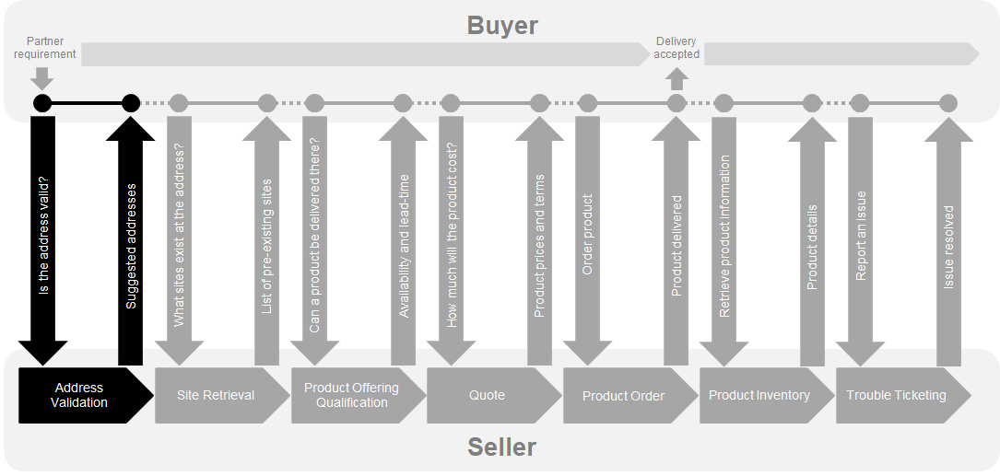
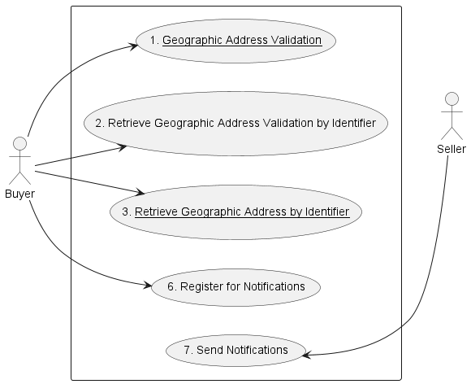
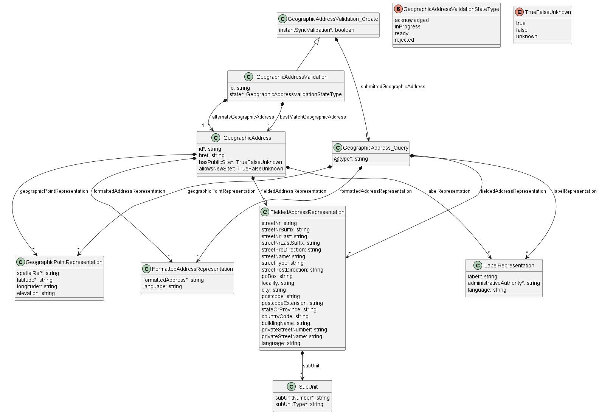
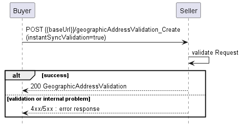
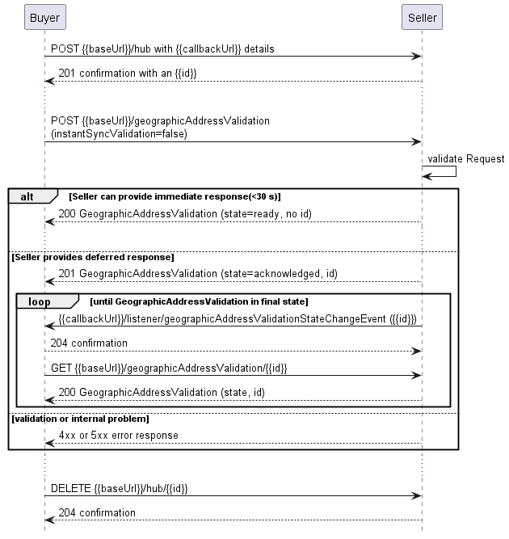
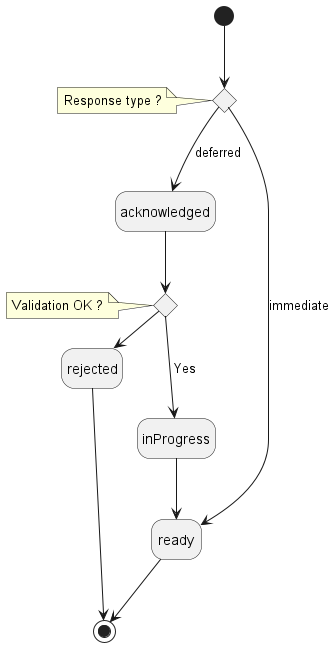
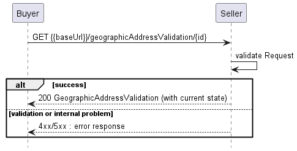
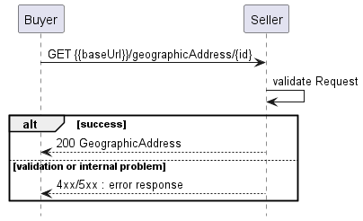
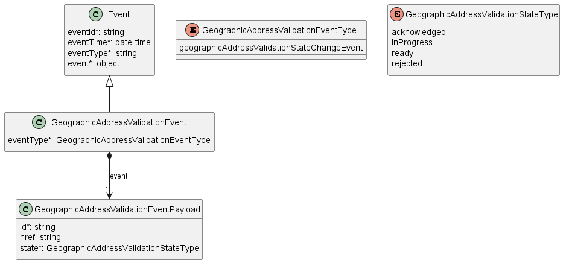
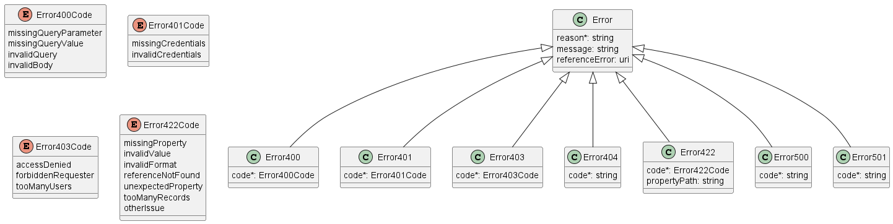

<style>
img
{
  display:block;
  float:none;
  margin-left:auto;
  margin-right:auto;
}
</style>


<div style="font-weight:bold; font-size:33pt; font-family: Sansation; text-align:center">
Letter Ballot
</br>
</br>
Mplify 121.1
</br>
</br>
LSO Cantata and LSO Sonata Address Management API - Developer Guide
</br>
</br>
July 2025
<p style="color:red;font-weight:bold; font-size:18pt">EXPORT CONTROL: This document contains technical data. The download, export, re-export or disclosure of the technical data contained in this document may be restricted by applicable U.S. or foreign export laws, regulations and rules and/or applicable U.S. or foreign sanctions ("Export Control Laws or Sanctions"). You agree that you are solely responsible for determining whether any Export Control Laws or Sanctions may apply to your download, export, reexport or disclosure of this document, and for obtaining (if available) any required U.S. or foreign export or reexport licenses and/or other required authorizations.
</div>

<div class="page"/>

**Disclaimer**

© Mplify Alliance 2025. All Rights Reserved.

The information in this publication is freely available for reproduction and use
by any recipient and is believed to be accurate as of its publication date. Such
information is subject to change without notice and Mplify Alliance (Mplify) is
not responsible for any errors. Mplify does not assume responsibility to update
or correct any information in this publication. No representation or warranty,
expressed or implied, is made by Mplify concerning the completeness, accuracy,
or applicability of any information contained herein and no liability of any
kind shall be assumed by Mplift as a result of reliance upon such information.

The information contained herein is intended to be used without modification by
the recipient or user of this document. Mplify is not responsible or liable for
any modifications to this document made by any other party.

The receipt or any use of this document or its contents does not in any way
create, by implication or otherwise:

- (a) any express or implied license or right to or under any patent, copyright,
  trademark or trade secret rights held or claimed by any Mplify member which
  are or may be associated with the ideas, techniques, concepts or expressions
  contained herein; nor

- (b) any warranty or representation that any Mplify member will announce any
  product(s) and/or service(s) related thereto, or if such announcements are
  made, that such announced product(s) and/or service(s) embody any or all of
  the ideas, technologies, or concepts contained herein; nor

- (c) any form of relationship between any Mplify member and the recipient or
  user of this document.

Implementation or use of specific Mplify standards, specifications or
recommendations will be voluntary, and no Member shall be obliged to implement
them by virtue of participation in Mplify Alliance. Mplify is a non-profit
international organization to enable the development and worldwide adoption of
agile, assured and orchestrated network services. Mplify does not, expressly or
otherwise, endorse or promote any specific products or services.

**Copyright**

© Mplify Alliance 2025. Any reproduction of this document, or any portion
thereof, shall contain the following statement: "Reproduced with permission of
Mplify Alliance." No user of this document is authorized to modify any of the
information contained herein.

<div class="page"/>

**Table of Contents**

- [List of Contributing Members](#list-of-contributing-members)
- [1. Abstract](#1-abstract)
- [2. Terminology and Abbreviations](#2-terminology-and-abbreviations)
- [3. Compliance Levels](#3-compliance-levels)
- [4. Introduction](#4-introduction)
  - [4.1. Conventions in the Document](#41-conventions-in-the-document)
  - [4.2. Framework](#42-framework)
- [5. API Description](#5-api-description)
  - [5.1. High-level use cases](#51-high-level-use-cases)
  - [5.2. Resource/endpoint Description](#52-resourceendpoint-description)
    - [5.2.1. Seller Side Endpoints](#521-seller-side-endpoints)
    - [5.2.2. Buyer Side Endpoints](#522-buyer-side-endpoints)
    - [5.2.3. Specifying the Buyer ID and the Seller ID](#523-specifying-the-buyer-id-and-the-seller-id)
  - [5.3. API Resource Schema summary](#53-api-resource-schema-summary)
    - [5.3.1. Fielded Address Representation](#531-fielded-address-representation)
    - [5.3.2. Formatted Address Representation](#532-formatted-address-representation)
    - [5.3.3. Label Representation](#533-label-representation)
    - [5.3.4. Geographic Point Representation](#534-geographic-point-representation)
  - [5.4. Model Structural Validation](#54-model-structural-validation)
  - [5.5. Security Considerations](#55-security-considerations)
- [6. API Interaction \& Flows](#6-api-interaction--flows)
  - [6.1. Use case 1: Geographic Address Validation](#61-use-case-1-geographic-address-validation)
    - [6.1.1 Geographic Address Validation - Request](#611-geographic-address-validation---request)
    - [6.1.2 Geographic Address Validation Response](#612-geographic-address-validation-response)
  - [6.2. Use case 2: Retrieve Geographic Address Validation by Identifier](#62-use-case-2-retrieve-geographic-address-validation-by-identifier)
  - [6.3. Use case 3: Retrieve Geographic Address by Identifier](#63-use-case-3-retrieve-geographic-address-by-identifier)
  - [6.4. Use case 6: Register for Notifications](#64-use-case-6-register-for-notifications)
    - [6.4.1. Register for Notifications - Request](#641-register-for-notifications---request)
    - [6.4.2. Register for Event Notifications - Response](#642-register-for-event-notifications---response)
    - [6.4.3. Unregister from Event Notifications - Request](#643-unregister-from-event-notifications---request)
    - [6.4.4. Unregister for Event Notifications - Response](#644-unregister-for-event-notifications---response)
  - [6.5. Use case 7: Send Notifications](#65-use-case-7-send-notifications)
- [7. API Details](#7-api-details)
  - [7.1. API patterns](#71-api-patterns)
    - [7.1.1. Indicating errors](#711-indicating-errors)
      - [7.1.1.1. Type Error](#7111-type-error)
      - [7.1.1.2. Type Error400](#7112-type-error400)
      - [7.1.1.3. `enum` Error400Code](#7113-enum-error400code)
      - [7.1.1.4. Type Error401](#7114-type-error401)
      - [7.1.1.5. `enum` Error401Code](#7115-enum-error401code)
      - [7.1.1.6. Type Error403](#7116-type-error403)
      - [7.1.1.7. `enum` Error403Code](#7117-enum-error403code)
      - [7.1.1.8. Type Error404](#7118-type-error404)
      - [7.1.1.9. Type Error422](#7119-type-error422)
      - [7.1.1.10. `enum` Error422Code](#71110-enum-error422code)
      - [7.1.1.11. Type Error500](#71111-type-error500)
      - [7.1.1.12. Type Error501](#71112-type-error501)
  - [7.2. API Data model](#72-api-data-model)
    - [7.2.1 Geographic Address Validation](#721-geographic-address-validation)
      - [7.2.1.1 Type GeographicAddressValidation\_Create](#7211-type-geographicaddressvalidation_create)
      - [7.2.1.2 Type GeographicAddressValidation](#7212-type-geographicaddressvalidation)
      - [7.2.1.3 `enum` GeographicAddressValidationStateType](#7213-enum-geographicaddressvalidationstatetype)
    - [7.2.2. Geographic Address](#722-geographic-address)
      - [7.2.2.1 Type GeographicAddress\_Query](#7221-type-geographicaddress_query)
      - [7.2.2.2 Type GeographicAddress](#7222-type-geographicaddress)
      - [7.2.2.3. Type FieldedAddressRepresentation](#7223-type-fieldedaddressrepresentation)
      - [7.2.2.4. Type FormattedAddressRepresentation](#7224-type-formattedaddressrepresentation)
      - [7.2.2.5. Type GeographicPointRepresentation](#7225-type-geographicpointrepresentation)
      - [7.2.2.6. Type LabelRepresentation](#7226-type-labelrepresentation)
      - [7.2.2.7. Type SubUnit](#7227-type-subunit)
      - [7.2.2.8. `enum` TrueFalseUnknown](#7228-enum-truefalseunknown)
    - [7.2.3. Notification registration](#723-notification-registration)
      - [7.2.3.1. Type EventSubscriptionInput](#7231-type-eventsubscriptioninput)
      - [7.2.3.2. Type EventSubscription](#7232-type-eventsubscription)
  - [7.3. Notification API Data model](#73-notification-api-data-model)
    - [7.3.1. Type Event](#731-type-event)
    - [7.3.2. Type GeographicAddressValidationEvent](#732-type-geographicaddressvalidationevent)
    - [7.3.3. Type GeographicAddressValidationEventPayload](#733-type-geographicaddressvalidationeventpayload)
- [8. References](#8-references)
- [Appendix A Acknowledgments](#appendix-a-acknowledgments)

<div class="page"/>

# List of Contributing Members

The following members of Mplify participated in the development of this document
and have requested to be included in this list.

| Member                   |
| ------------------------ |
| Amartus                  |
| Colt Technology Services |
| Proximus                 |

**Table 1: Contributing Members**

<div class="page"/>

# 1. Abstract

This standard is intended to assist implementation of the Address Validation
functionality defined for the LSO Cantata and LSO Sonata Interface Reference
Point (IRPs), for which requirements and use cases are defined in _Installation
Place and Service Site Management Business Requirements and Use Cases_
[[Mplify 150](#8-references)].

The purpose of Address Validation API is to ensure that the Buyer and the Seller
understand each other in terms of address representation. It is often the case
that the same address may be represented in various ways. There are also cases
where the Fielded or Formatted Address Representation might be ambiguous or
there is no Fielded or Formatted Address Representation at all.

An additional goal of the Address Validation is to obtain the Seller's
`GeographicAddress` identifier so that the Buyer may refer to it by reference
hence speeding up the later conversation.

This standard consists of this document and complementary API definitions.

This standard normatively incorporates the following files by reference as if
they were part of this document, from the GitHub repository:

<https://github.com/MEF-GIT/MEF-LSO-Sonata-SDK>

commit id:
[aaa03d484f98664a5a14f4f54f47b675d7efb3b8](https://github.com/MEF-GIT/MEF-LSO-Sonata-SDK/tree/aaa03d484f98664a5a14f4f54f47b675d7efb3b8)

- [`productApi/serviceability/address/geographicAddressManagement.api.yaml`](https://raw.githubusercontent.com/MEF-GIT/MEF-LSO-Sonata-SDK/aaa03d484f98664a5a14f4f54f47b675d7efb3b8/productApi/serviceability/address/geographicAddressManagement.api.yaml)

- [`productApi/serviceability/address/geographicAddressNotification.api.yaml`](https://raw.githubusercontent.com/MEF-GIT/MEF-LSO-Sonata-SDK/aaa03d484f98664a5a14f4f54f47b675d7efb3b8/productApi/serviceability/address/geographicAddressNotification.api.yaml)

<https://github.com/MEF-GIT/MEF-LSO-Cantata-SDK>

commit id:
[83d6edd0c70386058a9af6e677c069b498671da7](https://github.com/MEF-GIT/MEF-LSO-Cantata-SDK/tree/83d6edd0c70386058a9af6e677c069b498671da7)

- [`productApi/serviceability/address/geographicAddressManagement.api.yaml`](https://raw.githubusercontent.com/MEF-GIT/MEF-LSO-Cantata-SDK/83d6edd0c70386058a9af6e677c069b498671da7/productApi/serviceability/address/geographicAddressManagement.api.yaml)

- [`productApi/serviceability/address/geographicAddressNotification.api.yaml`](https://raw.githubusercontent.com/MEF-GIT/MEF-LSO-Cantata-SDK/83d6edd0c70386058a9af6e677c069b498671da7/productApi/serviceability/address/geographicAddressNotification.api.yaml)

<div class="page"/>

# 2. Terminology and Abbreviations

This section defines the terms used in this document. In many cases, the
normative definitions of terms are found in other documents. In these cases, the
third column is used to provide the reference that is controlling, in other
Mplify or external documents.

In addition, terms defined in the standards referenced below are included in
this document by reference and are not repeated in the table below:

- <a href="#8-references">MEF 50.1</a>
- <a href="#8-references">MEF 55.1</a>
- <a href="#8-references">MEF 55.1.1</a>
- <a href="#8-references">Mplify 150</a>

<table>
  <tr>
    <th>Term</th>
    <th>Description</th>
    <th>Reference</th>
  </tr>
  <tr>
    <td>Alternate Geographic Addresses</td>
    <td>An array of zero or more Geographic Addresses with Geographic Address Representations known to the Seller that are considered by the Seller to be an alternate to the Buyer Specified Geographic Address Representations.</td>
    <td>This document; adapted from <a href="#8-references">[Mplify 150]</a></td>
  </tr>  
  <tr>
    <td>Area of Validation</td>
    <td>The areas of the world in which a Seller can validate addresses such as a state, province, or country.</td>
    <td><a href="#8-references">[Mplify 150]</td>
  </tr>
  <tr>
    <td>Deferred Response</td>
    <td>A Seller's response to a Buyer's Validate Geographic Address request whereby the Seller immediately (less than 30 seconds) acknowledges that the Validate Geographic Address request was received and, over time, sends notifications to update the Buyer on the state and results of the Validate Geographic Address request (assuming the Buyer has subscribed to receive the notifications). A Deferred Response may take some time for the Seller to fulfill.</td>
    <td><a href="#8-references">[Mplify 150]</td>
  </tr>
  <tr>
    <td>Fielded Address Representation</td>
    <td>A type of Representation where a discrete field and value for each type of boundary or identifier down to the lowest level of detail. For example, "street number" is one field, "street name" is another field, etc.</td>
    <td>This document; adapted from <a href="#8-references">[Mplify 150]</td>
  </tr>
  <tr>
    <td>Formatted Address Representation</td>
    <td>A type of Representation using single string based on local postal addressing conventions.</td>
    <td>This document; adapted from <a href="#8-references">[Mplify 150]</td>
  </tr>
  <tr>
    <td>Geographic Address</td>
    <td>A place on Earth, which may or may not be fixed, described using one or more Geographic Address Representations.</td>
    <td>This document; adapted from <a href="#8-references">[Mplify 150]</td>
  </tr>
  <tr>
    <td>Geographic Address Representation</td>
    <td>A concrete method of describing a specific address which uses well defined formats to detail the attributes.</td>
    <td>This document; adapted from <a href="#8-references">[Mplify 150]</td>
  </tr>
  <tr>
    <td>Geographic Point Representation</td>
    <td>A type of Representation where coordinates (latitude, longitude and sometimes elevation) are used to specify a particular place on Earth.</td>
    <td>This document; adapted from <a href="#8-references">[Mplify 150]</td>
  </tr>
  <tr>
    <td>Geographic Site</td>
    <td>A fixed or mobile place at which a Product can be installed.</td>
    <td>This document; adapted from <a href="#8-references">[Mplify 150]</td>
  </tr>
  <tr>
    <td>Label Representation</td>
    <td>A type of Geographic Address Representation that is a unique combination of label and Administrative Authority (any organization that distributes labels) that controls assignment of the label and that specifies either a place which may or may not be fixed on Earth.</td>
    <td>This document; adapted from <a href="#8-references">[Mplify 150]</td>
  </tr>
  <tr>
    <td>Requesting Entity</td>
    <td>The business organization that is acting on behalf of one or more Buyers. In the most common case, the Requesting Entity represents only one Buyer and these terms are then synonymous.</td>
    <td><a href="#8-references">[Mplify 150]</a></td>
  </tr>
  <tr>
    <td>Responding Entity</td>
    <td>The business organization that is acting on behalf of one or more Sellers. In the most common case, the Responding Entity represents only one Seller and these terms are then synonymous.</td>
    <td><a href="#8-references">[Mplify 150]</a></td>
  </tr>
  <tr>
    <td>REST API</td>
    <td>Representational State Transfer. REST provides a set of architectural constraints that, when applied as a whole, emphasizes scalability of component interactions, generality of interfaces, independent deployment of components, and intermediary components to reduce interaction latency, enforce security, and encapsulate legacy systems.</td>
    <td><a href="#8-references">[REST]</a></td>
  </tr>
</table>

**Table 2. Terminology**

<div class="page"/>

# 3. Compliance Levels

The key words **"MUST"**, **"MUST NOT"**, **"REQUIRED"**, **"SHALL"**, **"SHALL
NOT"**, **"SHOULD"**, **"SHOULD NOT"**, **"RECOMMENDED"**, **"NOT
RECOMMENDED"**, **"MAY"**, and **"OPTIONAL"** in this document are to be
interpreted as described in BCP 14 ([[RFC2119](#8-references)],
[[RFC8174](#8-references)]) when, and only when, they appear in all capitals, as
shown here. All key words must be in bold text.

Items that are **REQUIRED** (contain the words **MUST** or **MUST NOT**) are
labeled as **[Rx]** for required. Items that are **RECOMMENDED** (contain the
words **SHOULD** or **SHOULD NOT**) are labeled as **[Dx]** for desirable. Items
that are **OPTIONAL** (contain the words MAY or OPTIONAL) are labeled as
**[Ox]** for optional.

A paragraph preceded by **[CRa]<** specifies a conditional mandatory requirement
that **MUST** be followed if the condition(s) following the "<" have been met.
For example, **"[CR1]<[D38]"** indicates that Conditional Mandatory Requirement
1 must be followed if Desirable Requirement 38 has been met. A paragraph
preceded by **[CDb]<** specifies a Conditional Desirable Requirement that
**SHOULD** be followed if the condition(s) following the "<" have been met. A
paragraph preceded by **[COc]<**specifies a Conditional Optional Requirement
that **MAY** be followed if the condition(s) following the "<" have been met.

<div class="page"/>

# 4. Introduction

**_Note:_** The requirements and use cases for Address Validation functionality
are defined in _Installation Place and Service Site Management Business
Requirements and Use Cases_ [[Mplify 150](#8-references)] which introduced the
_Installation Place_ as a new entity with multiple address representations. For
the sake of backward and TMF compatibility the API definition does not introduce
_Installation Place_ as a new root API resource, but updates the existing model
of `GeographicAddress`, according to before-mentioned Mplify Standard.

This API standard is based on TMF 673 API as specified by _TMF673 Geographic
Address Management API User Guide_ [[TMF673](#8-references)].

This standard specification document describes the API for Address Validation
functionality of the LSO Cantata and Sonata Interface Reference Point (IRP) as
defined in the MEF 55.1 _Lifecycle Service Orchestration (LSO): Reference
Architecture and Framework_ [[MEF 55.1](#8-references)]. The LSO Reference
Architecture is shown in Figure 1.


**Figure 1. The LSO Reference Architecture**

Cantata and Sonata IRPs define pre-ordering and ordering functionalities that
allow an automated exchange of information between business applications of the
Buyer (Customer or Service Provider) and Seller (Service Provider or Partner)
Domains. Those are:

- Address Validation
- Site Retrieval
- Product Offering Qualification
- Quote
- Product Offering Availability and Pricing Discovery
- Product Inventory
- Product Ordering
- Trouble Ticketing
- Billing

This document focuses on implementation aspects of Address Validation
functionality and is structured as follows:

- [Chapter 4](#4-introduction) provides an introduction to Address Validation
  and its description in a broader context of Cantata and Sonata and their
  corresponding SDKs.
- [Chapter 5](#5-api-description) gives an overview of endpoints, resource model
  and design patterns.
- Use cases and flows are presented in
  [Chapter 6](#6-api-interactions-and-flows).
- And finally, [Chapter 7](#7-api-details) complements previous sections with a
  detailed API description.

## 4.1. Conventions in the Document

- Code samples are formatted using code blocks. When notation `<< some text >>`
  is used in the payload sample it indicates that a comment is provided instead
  of an example value and it might not comply with the OpenAPI definition.
- Model definitions are formatted as in-line code (e.g. `GeographicAddress`).
- In UML diagrams the default cardinality of associations is `0..1`. Other
  cardinality markers are compliant with the UML standard.
- In the API details tables and UML diagrams required attributes are marked with
  a `*` next to their names.
- In UML sequence diagrams `{{variable}}` notation is used to indicate a
  variable to be substituted with a correct value.

## 4.2. Framework

As presented in Figure 2. both Cantata and Sonata API frameworks consist of
three structural components:

- Generic API framework
- Product-independent information (Function-specific information and
  Function-specific operations)
- Product-specific information (Mplify product specification data model)


**Figure 2. Cantata and Sonata API framework**

The essential concept behind the framework is to decouple the common structure,
information, and operations from the specific product information content.  
Firstly, the Generic API Framework defines a set of design rules and patterns
that are applied across all Cantata or Sonata APIs.  
Secondly, the product-independent information of the framework focuses on a
model of a particular Cantata or Sonata functionality and is agnostic to any of
the product specifications.  
Finally, the product-specific information part of the framework focuses on
Mplify product specifications that define business-relevant attributes and
requirements for trading Mplify subscriber and Mplify operator services.

The Address Validation API is product-agnostic in its nature and is not intended
to carry any product-specific information. It operates using the Generic API
Framework and the Function-specific Information and Operations.

Address Validation is part of a broader Cantata and Sonata End-to-End flow.
Figure 3. below shows a high-level diagram to get a good understanding of the
whole process and Address Validation's position within it.



**Figure 3. Cantata and Sonata End-to-End Function Flow**

- Address Validation:
  - Allows the Buyer to retrieve address information from the Seller, including
    exact formats, for Geographic Addresses known to the Seller.
- Site Retrieval:
  - Allows the Buyer to retrieve Geographic Site information including exact
    formats for Geographic Sites known to the Seller.
- Product Offering Qualification (POQ):
  - Allows the Buyer to check whether the Seller can deliver a product or set of
    products from among their product offerings at the geographic address or a
    Geographic Site specified by the Buyer; or modify a previously purchased
    product.
- Quote:
  - Allows the Buyer to submit a request to find out how much the installation
    of an instance of a Product Offering, an update to an existing Product, or a
    disconnect of an existing Product will cost.
- Product Order:
  - Allows the Buyer to request the Seller to initiate and complete the
    fulfillment process of an installation of a Product Offering, an update to
    an existing Product, or a disconnect of an existing Product at the address
    defined by the Buyer.
- Product Inventory:
  - Allows the Buyer to retrieve the information about existing Product
    instances from Seller's Product Inventory.
- Trouble Ticketing:
  - Allows the Buyer to create, retrieve, and update Trouble Tickets as well as
    receive notifications about Incidents' and Trouble Tickets' updates. This
    allows managing issues and situations that are not part of normal operations
    of the Product provided by the Seller.

This document focuses on the first function shown in black. A Buyer asks a
Seller if they understand a given Geographic Address Representation. The Seller
may:

- Confirm that the Geographic Address Representation(s) to be validated is a
  best match for a Representation of an Geographic Address known by the Seller.
- Provide one or more Geographic Address Representation suggestions for the
  Geographic Address the Seller believes could alternatives to the Buyer's
  Geographic Address Representation.

When one or more suggestions are provided by the Seller, the Seller may
optionally indicate which one they believe is the most likely to be a match.

<div class="page"/>

# 5. API Description

This section discusses the API structure and design patterns. It starts with the
high-level use cases diagram and then it describes the REST endpoints with use
case mapping.

## 5.1. High-level use cases

Figure 4 presents a high-level use case diagram. This picture aims to help
understand the endpoint mapping. Use cases are described extensively in
[chapter 6](#6-api-interactions-and-flows). Use case numbering is kept
consistent with [Mplify 150](#8-references). The underlined font designates
required use cases.



**Figure 4. High-level use cases**

## 5.2. Resource/endpoint Description

### 5.2.1. Seller Side Endpoints

**Base URL for Cantata**:

`https://{{serverBase}}:{{port}}{{?/seller_prefix}}/mefApi/cantata/geographicAddressManagement/v2/`

**Base URL for Sonata**:

`https://{{serverBase}}:{{port}}{{?/seller_prefix}}/mefApi/sonata/geographicAddressManagement/v8/`

**_Note:_** All examples will include only the Sonata version of the Base Path.

Following endpoints are exposed by the Seller and allow the Buyer to:

- Validate Geographic Address
- Retrieve a Geographic Address Validation by Identifier
- Retrieve a Geographic Address by Identifier
- Register for Notifications

The endpoints and corresponding data model are defined in
`productApi/serviceability/address/geographicAddressManagement.api.yaml`.

| API endpoint                            | Use Case Name                                        | Mplify 150 Use case Mapping                                                                          |
| --------------------------------------- | ---------------------------------------------------- | ---------------------------------------------------------------------------------------------------- |
| `POST /geographicAddressValidation`     | Validate Geographic Address                          | UC 1: Validate Installation Place                                                                    |
| `GET /geographicAddressValidation/{id}` | Retrieve Geographic Address Validation by Identifier | UC 2: Retrieve Validate Installation Place Request by Validate Installation Place Request Identifier |
| `GET /geographicAddress/{id}`           | Retrieve Geographic Address by Identifier            | UC 3: Retrieve Installation Place by Installation Place Identifier                                   |
| `POST /hub`                             | Register for Notifications                           | UC 6: Register for Notifications                                                                     |
| `GET /hub/{{id}}`                       | Register for Notifications                           | UC 6: Register for Notifications                                                                     |
| `DELETE /hub/{{id}}`                    | Register for Notifications                           | UC 6: Register for Notifications                                                                     |

**Table 3. End point to use case mapping - Seller Side**

### 5.2.2. Buyer Side Endpoints

**Base URL for Cantata**:

`https://{{serverBase}}:{{port}}{{?/buyer_prefix}}/mefApi/cantata/geographicAddressNotification/v2/`

**Base URL for Sonata**:

`https://{{serverBase}}:{{port}}{{?/buyer_prefix}}/mefApi/sonata/geographicAddressNotification/v8/`

The following API Endpoints are used by the Seller to post notifications to
registered listeners. The endpoints and corresponding data model are defined in
`productApi/serviceability/address/geographicAddressNotification.api.yaml`

| API Endpoint                                                 | Use Case Name     | Mplify 150 Use Case Mapping |
| ------------------------------------------------------------ | ----------------- | --------------------------- |
| `POST /listener/geographicAddressValidationStateChangeEvent` | Send Notification | UC 7: Send Notification     |

**Table 4. End point to use case mapping - Buyer Side**

### 5.2.3. Specifying the Buyer ID and the Seller ID

A business entity willing to represent multiple Buyers or multiple Sellers must
follow requirements of [[Mplify 150](#8-references)] chapter 8.8, which states:

> For requests of all types, there is a business entity that is initiating an
> Operation (called a Requesting Entity) and a business entity that is
> responding to this request (called the Responding Entity). In the simplest
> case, the Requesting Entity is the Buyer, and the Responding Entity is the
> Seller. However, in some cases, the Requesting Entity may represent more than
> one Buyer and similarly, the Responding Entity may represent more than one
> Seller.


**Figure 5. Buyer ID and Seller ID Examples**

> As shown in Figure 5, if a Requesting Entity representing a single Buyer is
> doing business with a Responding Entity representing a single Seller, Buyer
> and Seller IDs are not required to be passed between the two entities. If a
> Requesting Entity representing more than one Buyer is doing business with a
> Responding Entity representing a single Seller, the Buyer ID is required to be
> passed between the two entities. If a Requesting Entity representing a single
> Buyer is doing business with a Responding entity representing multiple
> Sellers, the Seller ID is required to be passed between the two entities. If a
> Requesting Entity representing multiple Buyers is doing business with a
> Responding Entity representing multiple Sellers, both the Buyer ID and the
> Seller ID are required to be passed between the entities.
>
> While it is outside the scope of this specification, it is assumed that the
> Requesting Entity and the Responding Entity are aware of each other and can
> authenticate requests initiated by the other party. It is further assumed that
> the Requesting Entity knows:
>
> - the list of Buyers the Requesting Entity represents when interacting with
>   this Responding Entity; and
> - the list of Sellers that this Responding Entity represents to this
>   Requesting Entity.
>
> It is also assumed that the Responding Entity knows:
>
> - the list of Sellers that this Responding Entity represents to this
>   Requesting Entity and
> - the list of Buyers the Requesting Entity represents when interacting with
>   this Responding Entity.

In the API the `buyerId` and `sellerId` are represented as optional query
parameters in each operation defined.

**[R1]** If the Requesting Entity has the authority to represent more than one
Buyer the request **MUST** include `buyerId` that identifies the Buyer being
represented. [Mplify150 R62]

**[R2]** If the Responding Entity represents more than one Seller to this Buyer
the request **MUST** include `sellerId` that identifies the Seller with whom
this request is associated. [Mplify150 R63]

## 5.3. API Resource Schema summary

This subchapter describes the entities from the resource model included in the
API specification.

Each entity is a simple or composed type (with the use of `allOf` keyword for
data types composition). A simple type defines a set of properties that might be
of an object, primitive, or reference type.

[Section 6](#6-api-interactions-and-flows) provides examples of data model and
API usage. For a detailed description of the data model, please refer to
[API Details](#7-api-details).

Figure 6 presents the data model for use cases 1-3 (not including Errors).



**Figure 6. Data Model**

**_Note:_** While showing the extends relation, for clarity, the extending type
lists only added attributes, not the sum with the extended type.

`GeographicAddressValidation_Create` is a subset of the
`GeographicAddressValidation` type and is used as a request body. It contains
only attributes that must be set by the Buyer. The Seller then enriches the
entity in the response with additional information (e.g.
`bestMatchGeographicAddress` and `alternateGeographicAddress`).

**[R3]** If an entity is used in the request or response, all properties marked
as required **MUST** be provided.

**[R4]** `language` **MUST** use the [ISO 639:2023](#8-references) two letter
codes. [Mplify150 R8], [Mplify150 R11], [Mplify150 R13]

**_Note:_** Having the `language` attribute and representations as lists allows
the Seller to store representations in multiple languages for a single
Geographic Address.

The root class of address representation is the `GeographicAddress`. An address
is mainly described by one or more representations. There are four types of
representations:

- `FieldedAddressRepresentation`
- `FormattedAddressRepresentation`
- `LabelRepresentation`
- `GeographicPointRepresentation`

A Buyer can use any combination of these representation types when submitting a
Validate Geographic Address request. As an example, a Buyer may include a
`FieldedAddressRepresentation` and a `GeographicPointRepresentation` in a single
request. This provides the Seller with the most information that the Buyer can
provide in an attempt to validate the Geographic Address.

Multiple Geographic Addresses can have the same representation. Usually, the
same values of `GeographicPointRepresentation`, may be used in Addresses
representing rooms in one building. Each Geographic Address covered by such
Geographic Point Representation has its own `id`.

### 5.3.1. Fielded Address Representation

Example of a `FieldedAddressRepresentation`

```json
{
  "streetType": "st.",
  "streetName": "E. Wasilewskiego",
  "streetNr": "20",
  "city": "Cracow",
  "stateOrProvince": "Lesser Poland",
  "postcode": "30-305",
  "countryCode": "pl",
  "subUnit": [
    {
      "subUnitType": "floor",
      "subUnitNumber": "4"
    },
    {
      "subUnitType": "apartment",
      "subUnitNumber": "14"
    }
  ],
  "language": "en"
}
```

A subset of available attributes is used to describe the Geographic Address.
There is an optional `subUnit` structure that can be used to specify precise
location e.g. within a building. A list of Sub Units is to be used only to
represent a hierarchy that point to single bottom level Sub Unit. Not to
represent a list of "sibling" Sub Units or all Sub Units within an Geographic
Address.

In the example above, an apartment number 14 on 4th floor in the building at the
given address is specified using this structure.

A more precise location could be specified, but that would constitute a separate
Geographic Address instance, identified by a separate `id`:

```json
{
  "subUnit": [
    {
      "subUnitType": "floor",
      "subUnitNumber": "4"
    },
    {
      "subUnitType": "apartment",
      "subUnitNumber": "14"
    },
    {
      "subUnitType": "bay",
      "subUnitNumber": "South"
    },
    {
      "subUnitType": "cage",
      "subUnitNumber": "3"
    }
  ]
}
```

**[R5]** The Buyer and Seller **MUST** agree to a minimum set of attributes for
`FieldedAddressRepresentation` which they agree to support for describing a
Geographic Address. [Mplify150 R2], [Mplify150 R6], [Mplify150 O3]

**[O1]** `streetName` **MAY** contain the `streetType` or `streetType` **MAY**
be used as a stand-alone field. [Mplify150 O1]

Example:

```json
{
  "streetName": "Edmunda Wasilewskiego st."
}
```

or:

```json
{
  "streetType": "st.",
  "streetName": "Edmunda Wasilewskiego"
}
```

**[O2]** If a single `FieldedAddressRepresentation` has more than one street
number, the `streetNr` and `streetNrLast` **MAY** be used to represent start and
the end of the range. [Mplify150 O2]

For example if the building has a number like "20-22" it may be expressed as:

```json
{
  "streetNr": "20-22"
}
```

or:

```json
{
  "streetNr": "20",
  "streetNrLast": "22"
}
```

**[R6]** `streetNrLastSuffix` **MUST** only be used when there is a
`streetNrLast` present. [Mplify150 R3]

**[R7]** `streetPreDirection` **MUST** be used when the direction of the street
comes before the `streetName`. [Mplify150 R4]

**[R8]** `streetPostDirection` **MUST** be used when the direction of the street
comes after the `streetName`. [Mplify150 R5]

In some cases a `FieldedAddressRepresentation` may contain both
`streetPreDirection` and `streetPostDirection`

**[R9]** `countryCode` **MUST** use the [ISO 3166](#8-references) two letter
codes. [Mplify150 R7]

The use of the `language` attribute is strongly recommended to clarify the
language used for the Fielded Address Representation.

### 5.3.2. Formatted Address Representation

```json
{
  "formattedAddress": "st. Edmunda Wasilewskiego 20/14, floor 4, 30-305, Cracow, Poland",
  "language": "en"
}
```

`FormattedAddressRepresentation` uses single string field to describe the
address details.

**[R10]** Following attribute **MUST** be provided when specifying
`FormattedAddressRepresentation`: [Mplify150 R11]

- `formattedAddress`

**[R11]** The Buyer and Seller **MUST** agree if they also require the
`language` attribute for `FormattedAddressRepresentation`. [Mplify150 R2]

### 5.3.3. Label Representation

```json
{
  "administrativeAuthority": "CLLI",
  "label": "PLTXCL01"
}
```

The Label represents a unique identifier controlled by a generally accepted
independent Administrative Authority or standard body. It can be used to
identify things that do not have a static Geographic Address, such as airplanes
or ships. In this case, the unique identifier (i.e., airplane tail number) for
the airplane or ship is used.

The example above is a place that represents a CLLI (Common Language Location
Identifier) identifier which is commonly used to refer locations in North
America for network equipment installations.

**[R12]** Following attributes **MUST** be provided when specifying
`LabelRepresentation`: [Mplify150 R12]

- `administrativeAuthority`
- `label`

**[R13]** The Buyer and Seller **MUST** agree if they also require the
`language` attribute for `LabelRepresentation`. [Mplify150 R2]

### 5.3.4. Geographic Point Representation

```json
{
  "spatialRef": "EPSG:4326",
  "latitude": "50.048868",
  "longitude": "19.929523"
}
```

This representation uses spatial coordinates to describe a place. `spatialRef`
determines the standard that has to be used to interpret coordinates provided in
`latitude`, `longitude` and `elevation` values.

This type allows only providing a point. It cannot carry more detailed
information like the floor number from previous examples.

**[R14]** Following attributes **MUST** be provided when specifying
`GeographicPointRepresentation`: [Mplify150 R14]

- `spatialRef`
- `latitude`
- `longitude`

**[R15]** The `spatialRef` value that can be used **MUST** be agreed upon
between Buyer and Seller during the onboarding process. [Mplify150 R16]

**[R16]** The Buyer and Seller **MUST** agree to the level of accuracy of the
`latitude`, `longitude` and `elevation`. [Mplify150 R15]

Level of accuracy in this context means the number of decimal points used in the
`latitude`, `longitude` and `elevation`.

**[R17]** The Buyer and Seller **MUST** agree if they also require the
`elevation` attribute for `GeographicPointRepresentation`. [Mplify150 R2]

## 5.4. Model Structural Validation

The structure of the HTTP payloads exchanged via Address Validation API
endpoints is defined using OpenAPI version 3.0.

**[R18]** Implementations **MUST** use payloads that conform to these
definitions.

**[R19]** The Buyer and the Seller **MUST NOT** use any operation, entity or
attribute that is not explicitly defined or allowed by this standard.

## 5.5. Security Considerations

There must be an authentication mechanism whereby a Seller can be assured who a
Buyer is and vice-versa. There must also be authorization mechanisms in place to
control what a particular Buyer or Seller is allowed to do and what information
may be obtained. However, the definition of the exact security mechanism and
configuration is outside the scope of this document. Security considerations are
standardized by _LSO API Security Profile_ [[MEF 128.1](#8-references)].

<div class="page"/>

# 6. API Interaction & Flows

This section provides a detailed insight into the API functionality, use cases,
and flows. First, it presents a list of business use cases then provides
examples with a comprehensive explanation of all usage aspects.

| Use Case # | Use Case Name                                        | Use Case Description                                                                                                                                                                                                                                                                                                                                                                                                                                                                                                                                                                                                          |
| ---------- | ---------------------------------------------------- | ----------------------------------------------------------------------------------------------------------------------------------------------------------------------------------------------------------------------------------------------------------------------------------------------------------------------------------------------------------------------------------------------------------------------------------------------------------------------------------------------------------------------------------------------------------------------------------------------------------------------------- |
| 1          | Geographic Address Validation                        | The Buyer sends to the Seller one or more Geographic Address Representations for a place known to them. The Seller responds with a list of Geographic Addresses known to them, which likely match information sent by the Buyer. For each Geographic Address returned, the Seller provides an Geographic Address Identifier, which uniquely identifies this Geographic Address within the Seller. The Seller may reply with an Immediate Response or a Deferred Response as directed by the Buyer. If the Buyer has stated that they would accept a Deferred Response, the Seller may still reply with an Immediate Response. |
| 2          | Retrieve Geographic Address Validation by Identifier | The Buyer requests the details of a Deferred Response to a Geographic Address Validation Request.                                                                                                                                                                                                                                                                                                                                                                                                                                                                                                                             |
| 3          | Retrieve Geographic Address by Identifier            | The Buyer requests the details of a single Geographic Address based on an Geographic Address `id` that was previously provided by the Seller.                                                                                                                                                                                                                                                                                                                                                                                                                                                                                 |
| 6          | Register for Notifications                           | The Buyer registers for notifications on Geographic Address Validation requests that are Deferred.                                                                                                                                                                                                                                                                                                                                                                                                                                                                                                                            |
| 7          | Send Notification                                    | The Seller generates notifications to Buyer's who have subscribed to notifications.                                                                                                                                                                                                                                                                                                                                                                                                                                                                                                                                           |

**Table 5. Use cases description**

**[R20]** The Buyer **MUST** be able to initiate Use Case 1 and 3. [Mplify150
R17], [Mplify150 R39]

**[R21]** The Seller **MUST** be able to provide either an Immediate Response or
a Deferred Response for Use Case 1. [Mplify150 R19]

**[R22]** The Seller **MUST** associate an `id` to each unique Geographic
Address of which they are aware. [Mplify150 R18]

**[R23]** If a Seller supports Deferred Response for the Validate Geographic
Address request, the Seller **MUST** support Use Cases 2, 6, and 7. [Mplify150
R120]

**[D1]** For all Geographic Addresses that have not been validated, a Buyer
**SHOULD** initiate a Validate Geographic Address request, to get the Seller's
`GeographicAddress.id` and it's Representations. [Mplify150 D2]

**[D2]** For all Geographic Address that have been validated, the Buyer
**SHOULD** use the Geographic Address `id` to reference the Geographic Address
onwards. [Mplify150 D3]

## 6.1. Use case 1: Geographic Address Validation

Since there are often different representations of the same address, as an
example 123 Main Street might be represented as 123 Main Street, 123 Main St, or
123 Main. The Buyer sends a request with the Geographic Address
Representation(s) as they know it to the Seller and the Seller returns a list of
`GeographicAddresses` (including the `id` for each) with possibly matching
Representations that the Buyer can select from.

Each Geographic Address has an `id` within the Seller's system. If a Buyer
submits an Geographic Address Validation request that does not directly match
any of the Geographic Addresses existing in the Seller's system but the Seller
knows other Geographic Addresses having (a) Geographic Address Representation(s)
which are a close match, the Seller returns these Geographic Addresses as
`alternateGeographicAddress` in the response. A close match is described as in
the vicinity of, or close in Street Number, Street Name, etc. to the submitted
Geographic Address Representation such as Buyer submits Street Number of 124,
Seller knows Street Numbers 122 and 126 and returns them to the Buyer.

As another example of this, the Buyer submits a request to validate the
Geographic Address represented as 123 Main St, Unit 8, Krakow, Poland. The
Seller does not know this representation although they do know:

- 123 Main St, Krakow, Poland (`id=123`)
- 123 Main St, Unit 6, Krakow, Poland (`id=456`)
- 123 Main St, Unit 15, Krakow, Poland (`id=789`)

The Seller may approach this example in one of two ways. The first approach is
that the Seller assumes that Unit 8 exists at 123 Main St, returns Unit 8 as the
"best match", returns an Geographic Address Identifier to the Buyer, and may
return the known Geographic Addresses as alternatives.

The second approach is that the Seller may determine that they do not know Unit
8 at 123 Main St and return one of the known Geographic Addresses as the "best
match" or returns no "best match" and returns the known Geographic Addresses as
alternatives. When the Geographic Address Validation process is completed, the
Buyer knows how the Geographic Address is represented in the Seller's systems
and has a Seller defined `id` of the Geographic Address.

**_Note:_** Address validation only verifies the way the Buyer needs to express
the address to the Seller. It is not performed to verify that a particular
product can be provided at that address.

To send a Validate Address request the Buyer uses the
`createGeographicAddressValidation` operation from the API:
`POST /geographicAddressValidation`.

There are 2 possible flows of this operation: immediate and deferred. The Buyer
has an option to request an immediate response only, by providing
`instantSyncValidation=true`. When the Buyer does not require an immediate
response, the Seller can still provide one.

An immediate response flow is shown on Figure 7. The Seller provides full
information in a synchronous response.



**Figure 7. Geographic Address Validation immediate response**

A deferred response flow is presented on Figure 8. The seller first acknowledges
the request and then starts processing the validation. Whenever the `state`
changes, an event is sent to the Buyer. The Buyer can than get the validation
details.



**Figure 8. Geographic Address Validation deferred response**

The lifecycle of a `GeographicAddressValidation` is shown on Figure 9:



**Figure 9. `GeographicAddressValidation` Lifecycle**

| Name         | Description                                                                                                                                                                                                                                                                                                                  |
| ------------ | ---------------------------------------------------------------------------------------------------------------------------------------------------------------------------------------------------------------------------------------------------------------------------------------------------------------------------- |
| acknowledged | A `GeographicAddressValidation` request has been received by the Seller and has passed basic validation. A `GeographicAddressValidation.id` is assigned in the `acknowledged` state and moves to `inProgress` when it passes business validation. If it does not pass business validation, it moves to the `rejected` state. |
| inProgress   | The `GeographicAddressValidation` request is currently being worked on by the Seller.                                                                                                                                                                                                                                        |
| ready        | The `GeographicAddressValidation` request processing is completed and it is ready to be retrieved or the Immediate Response has been returned.                                                                                                                                                                               |
| rejected     | The `GeographicAddressValidation` request processing has failed at least one of the validation checks the Seller performs after it reached the `acknowledged` state.                                                                                                                                                         |

**Table 6. `GeographicAddressValidation` states**

### 6.1.1 Geographic Address Validation - Request

The following snippet presents an example of a request using the
`GeographicAddressValidation_Create:`

```json
{
  "instantSyncValidation": false,
  "submittedGeographicAddress": {
    "@type": "GeographicAddress_Query",
    "fieldedAddressRepresentation": [
      {
        "streetName": "E. Wasilewskiego",
        "streetNr": "20",
        "city": "Cracow",
        "postcode": "30-305",
        "countryCode": "pl",
        "language": "en"
      }
    ],
    "geographicPointRepresentation": [
      {
        "spatialRef": "EPSG:4326",
        "latitude": "50.048868",
        "longitude": "19.929523"
      }
    ]
  }
}
```

In this example, the Buyer does not require only an immediate response
(`"instantSyncValidation": false`) and provides 2 address representations -
fielded and point. More representations potentially help the Seller to find the
match for the address, especially in not urbanized areas.

It is expected that all Geographic Address Representations that are provided for
a single validation request represent the same Geographic Address.

**[R24]** Buyer and Seller **MUST** agree what Geographic Address
Representations may be included in the Geographic Address Validation request.
[Mplify150 R1]

**[R25]** The Buyer **MUST** specify all attributes of the
`FieldedAddressRepresentation` agreed with the Seller during on-boarding.
[Mplify150 R24]

**[R26]** Following attributes **MUST** be provided when specifying
`GeographicAddressValidation_Create`: [Mplify150 R22], [Mplify150 R23]

- `instantSyncValidation`
- `submittedGeographicAddress` - with at least one Representation

### 6.1.2 Geographic Address Validation Response

After receiving the request, the Seller validates its structure and
completeness. When the validation of the request is successful, the Seller
attempts to match the Buyer's provided Representations with Representations
known in the Seller's address management system. For each Geographic Address
that matches the `submittedGeographicAddress`, the Seller returns the address
information including an identifier (`id`). It is up to the Seller to decide
whether an Address matches the `submittedGeographicAddress`.

Having an Address validated does not provide any information of whether the
Seller is able to provide any type of Product there. It only assures that the
Buyer and Seller have a common understanding of the place and the Address to
indicate that place. The validated address can then be used in further steps of
the process.

The Seller responds with the `GeographicAddressValidation`:

```json
{
  "state": "ready",
  "bestMatchGeographicAddress": {
    "@type": "GeographicAddress",
    "id": "00000000-0000-0030-0305-873500002000",
    "href": "{{baseUrl}}/geographicAddress/00000000-0000-0030-0305-873500002000",
    "allowsNewSite": "true",
    "hasPublicSite": "true",
    "fieldedAddressRepresentation": [
      {
        "streetType": "st.",
        "streetName": "Edmunda Wasilewskiego",
        "streetNr": "20",
        "city": "Cracow",
        "stateOrProvince": "Lesser Poland",
        "postcode": "30-305",
        "countryCode": "pl",
        "language": "en"
      }
    ],
    "geographicPointRepresentation": [
      {
        "spatialRef": "EPSG:4326",
        "latitude": "50.048868",
        "longitude": "19.929523"
      }
    ]
  },
  "alternateGeographicAddress": [
    {
      "@type": "GeographicAddress",
      "id": "00000000-0000-0030-0305-873500002010",
      "href": "{{baseUrl}}/geographicAddress/00000000-0000-0030-0305-873500002010",
      "allowsNewSite": "true",
      "hasPublicSite": "false",
      "fieldedAddressRepresentation": [
        {
          "streetType": "st.",
          "streetName": "Edmunda Wasilewskiego",
          "streetNr": "20",
          "city": "Cracow",
          "stateOrProvince": "Lesser Poland",
          "postcode": "30-305",
          "countryCode": "pl",
          "subUnit": [
            {
              "subUnitType": "floor",
              "subUnitNumber": "3"
            },
            {
              "subUnitType": "apartment",
              "subUnitNumber": "10"
            }
          ],
          "language": "en"
        }
      ],
      "geographicPointRepresentation": [
        {
          "spatialRef": "EPSG:4326",
          "latitude": "50.048868",
          "longitude": "19.929523"
        }
      ]
    },
    {
      "@type": "GeographicAddress",
      "id": "00000000-0000-0030-0305-873500002014",
      "href": "{{baseUrl}}/geographicAddress/00000000-0000-0030-0305-873500002014",
      "allowsNewSite": "true",
      "hasPublicSite": "true",
      "fieldedAddressRepresentation": [
        {
          "streetType": "st.",
          "streetName": "Edmunda Wasilewskiego",
          "streetNr": "20",
          "city": "Cracow",
          "stateOrProvince": "Lesser Poland",
          "postcode": "30-305",
          "countryCode": "pl",
          "subUnit": [
            {
              "subUnitType": "floor",
              "subUnitNumber": "4"
            },
            {
              "subUnitType": "apartment",
              "subUnitNumber": "14"
            }
          ],
          "language": "en"
        }
      ],
      "geographicPointRepresentation": [
        {
          "spatialRef": "EPSG:4326",
          "latitude": "50.048868",
          "longitude": "19.929523"
        }
      ]
    }
  ],
  "instantSyncValidation": false,
  "submittedGeographicAddress": {
    "@type": "GeographicAddress_Query",
    "fieldedAddressRepresentation": [
      {
        "streetName": "E. Wasilewskiego",
        "streetNr": "20",
        "city": "Cracow",
        "postcode": "30-305",
        "countryCode": "pl",
        "language": "en"
      }
    ],
    "geographicPointRepresentation": [
      {
        "spatialRef": "EPSG:4326",
        "latitude": "50.048868",
        "longitude": "19.929523"
      }
    ]
  }
}
```

Each of the returned Geographic Addresses, aside from representations, has the
following attributes set:

- `id` and `href` to allow referencing them by the Buyer in later steps.
- `allowsNewSite` - to specify if a Buyer must use one of the known existing
  Service Sites at this location for any Products delivered to this Address.
- `hasPublicSite` - to specify if the Address contains Service Sites that are
  public (e.g. MeetMe-Rooms)

Having one or both of these attributes set to `false` doesn't mean that the
Buyer cannot proceed with using the validated address in further steps.

The matched `fieldedAddressRepresentation` in Seller's system has more fields
defined, thus the response contains more fields than in the Buyer's request.
These are:

- `streetType`
- `subUnit`
- `stateOrProvince`
- `subUnit`

Additionally, the Seller has corrected 1 field to match the Seller's
representation of the Address:

- `streetName`: from value `"E. Wasilewskiego"` to `"Edmunda Wasilewskiego"` the
  response contains a `bestMatchGeographicAddress` if found, and a list of
  `alternateGeographicAddress`, if any. In the example above the Seller decided
  to return the best match and 2 alternatives. That means that in the Seller's
  system 3 Addresses are matching the Buyer's Address representation
  (`countryCode`, `city`, `streetName`) out of which one was selected to be the
  best match.

While it is up to Seller's discretion to decide on what constitutes the best
match and alternative, these rules are recommended:

- best match should be the address with the level of precision as provided in
  the request. In the example above the request provided a `streetName` and
  `streetNr` to point to a building. The Seller has three matching Addresses:
  one for the building and two for offices within it (one on 3rd floor, and on
  on 4th, all with same GPS coordinates). The Address of the building is chosen
  as the best match because the offices are more specific and additionally
  contain the `subUnit`.

- an Address of a different level of detail should be returned as an alternative
  one. Referring to the example - assuming there was no building address in
  Seller's system but only the addresses of the offices - the office addresses
  should all be marked as alternatives (even if the Seller by any reason
  prioritizes one over the other) because they additionally specify the
  `subUnit`. The same applies when matched Address would be of less detailed
  specification e.g. containing only `streetName` and no `streetNr`.

- the `alternateGeographicAddress` is not expected to be a sorted list.

The Seller may respond either with immediate or deferred response.

**[R27]** The Seller **MUST NOT** provide a deferred response if the Buyer has
asked for an immediate response (`instantSyncValidation=true`). [Mplify150 R25]

**[O3]** The Seller **MAY** provide an immediate response regardless of the
`instantSyncValidation` the Buyer has asked for. [Mplify150 O6]

**[R28]** The Seller **MUST** specify `state` when providing the response.
[Mplify150 R27]

**[R29]** The Seller **MUST** return a HTTP Response Code `200` when providing
an immediate response. [Mplify150 R27]

**[R30]** The Seller **MUST** return an HTTP Response Code `201` when providing
a deferred response. [Mplify150 R27]

**_Note_**: The term "Seller Response Code" used in the Business Requirements
maps to HTTP response code, where `2xx` indicates _Success_ and `4xx` or `5xx`
indicates _Failure_.

**[R31]** When the response is successful, the Seller **MUST** echo back all
attributes received in the Buyer's request. [Mplify150 R29]

**[R32]** Following attributes **MUST** be provided when specifying the
response: [Mplify150 R27], [Mplify150 R28]

- `state`
- per each `GeographicAddress` returned:
  - `id`
  - `allowsNewSite`
  - `hasPublicSite`
  - `@type`
  - at least one item in one of:
    - `fieldedAddressRepresentation`
    - `formattedAddressRepresentation`
    - `geographicPointRepresentation`
    - `labelRepresentation`

**[R33]** For an immediate response, the Seller **MUST** always provide
`state=ready`. [Mplify150 R26]

**[R34]** For an immediate response, the Seller **MUST NOT** provide the
`GeographicAddressValidation.id`.

**[R35]** For a deferred response, the Seller **MUST** provide the
`GeographicAddressValidation.id`. [Mplify150 R35]

**_Note:_** For `allowsNewSite` and `hasPublicSite` attributes the `unknown`
value means that either the Seller does not support Site Management, or they are
not aware of whether the value is `true` or `false`.

**[R36]** In case of no matching addresses found, the Seller **MUST** return a
successful response with no `bestMatchGeographicAddress` attribute and an empty
list of `alternateGeographicAddress`.

**[R37]** If a `GeographicAddress` is identified and returned as a
`bestMatchGeographicAddress` it **MUST NOT** be returned in
`alternateGeographicAddress` list. [Mplify150 R32]

**[R38]** In case of too many matching addresses found (the definition of 'too
many' is up to Seller's discretion), the Seller **MUST** return an `Error422`
with `code=tooManyRecords`.

**[R39]** When validating the Geographic Address, the Seller **MUST** validate
that the Geographic Address is within their Area of Validation. [Mplify150 R33]

**[R40]** When the Seller validates a Geographic Address that is not within
their Area of Validation they **MUST** return a `422` Error with
`code=otherIssue`, and a `reason` of e.g. _"Address out of Area of Validation"_.
[Mplify150 R34]

**_Note:_** The Area of Validation coverage is up to the Seller's discretion.
The Seller may decide to validate addresses regardless on where they are located
and provide the serviceability context only at the Product Offering
Qualification stage

## 6.2. Use case 2: Retrieve Geographic Address Validation by Identifier

This Use Case is performed to retrieve the details of Geographic Address
Validation in case of a deferred response for use case 1. This is when the
Seller is unable to perform validation of the Geographic Address within the time
limits of an immediate response (suggested 30 seconds) and the Buyer is provided
with an `GeographicAddressValidation.id` to identify the request. The Seller may
also notify the Buyer whenever the `state` of the request changes (Use Case 7).

The sequence diagram for this use case is shown on Figure 10. It is also apart
of a broader diagram presented on Figure 8.



**Figure 10. Retrieve Geographic Address Validation by Identifier Flow**

The Buyer sends a Retrieve Geographic Address Validation by Identifier request
using a `GET /geographicAddressValidation/{id}` operation.

**[R41]** The Seller response to the Retrieve Geographic Address Validation by
Identifier request **MUST** include all of the `GeographicAddressValidation`
attributes. [Mplify150 R37]

This may result in no `bestMatchGeographicAddress` and/or empty list of
`alternateGeographicAddress` being returned if the Seller has not completed the
validation process yet.

Sample request:

`GET /mefApi/sonata/geographicAddressManagement/v8/geographicAddressValidation/00000000-0000-4444-0305-873500004456`

Sample response:

```json
{
  "id": "00000000-0000-4444-0305-873500004456",
  "state": "inProgress",
  "alternateGeographicAddress": [
    {
      "@type": "GeographicAddress",
      "id": "00000000-0000-0030-0305-873500002014",
      "href": "{baseUrl}}/geographicAddress/00000000-0000-0030-0305-873500002014",
      "allowsNewSite": "true",
      "hasPublicSite": "true",
      "fieldedAddressRepresentation": [
        {
          "streetType": "st.",
          "streetName": "Edmunda Wasilewskiego",
          "streetNr": "20",
          "city": "Cracow",
          "stateOrProvince": "Lesser Poland",
          "postcode": "30-305",
          "countryCode": "pl",
          "subUnit": [
            {
              "subUnitType": "floor",
              "subUnitNumber": "4"
            },
            {
              "subUnitType": "apartment",
              "subUnitNumber": "14"
            }
          ],
          "language": "en"
        }
      ],
      "geographicPointRepresentation": [
        {
          "spatialRef": "EPSG:4326",
          "latitude": "50.048868",
          "longitude": "19.929523"
        }
      ]
    }
  ],
  "instantSyncValidation": false,
  "submittedGeographicAddress": {
    "@type": "GeographicAddress_Query",
    "fieldedAddressRepresentation": [
      {
        "streetName": "E. Wasilewskiego",
        "streetNr": "20",
        "city": "Cracow",
        "postcode": "30-305",
        "countryCode": "pl",
        "language": "en"
      }
    ],
    "geographicPointRepresentation": [
      {
        "spatialRef": "EPSG:4326",
        "latitude": "50.048868",
        "longitude": "19.929523"
      }
    ]
  }
}
```

**[R42]** In case `id` does not find a `GeographicAddressValidation` in Seller's
system, an error response `404` **MUST** be returned.

## 6.3. Use case 3: Retrieve Geographic Address by Identifier

To get detailed and up do date information about the Geographic Address, the
Buyer sends a Retrieve Geographic Address by Identifier request using a
`GET /geographicAddress/{id}` operation.



**Figure 11. Retrieve Geographic Address by Identifier Flow**

Sample request:

`GET /mefApi/sonata/geographicAddressManagement/v8/geographicAddress/00000000-0000-0030-0305-873500002000`

Sample response:

```json
{
  "@type": "GeographicAddress",
  "id": "00000000-0000-0030-0305-873500002000",
  "href": "{baseUrl}}/geographicAddress/00000000-0000-0030-0305-873500002000",
  "allowsNewSite": "true",
  "hasPublicSite": "true",
  "fieldedAddressRepresentation": [
    {
      "streetType": "st.",
      "streetName": "Edmunda Wasilewskiego",
      "streetNr": "20",
      "city": "Cracow",
      "stateOrProvince": "Lesser Poland",
      "postcode": "30-305",
      "countryCode": "pl",
      "language": "en"
    }
  ],
  "geographicPointRepresentation": [
    {
      "spatialRef": "EPSG:4326",
      "latitude": "50.048868",
      "longitude": "19.929523"
    }
  ]
}
```

**[R43]** In case `id` does not find a `GeographicAddress` in Seller's system,
an error response `404` **MUST** be returned.

**[R44]** The Seller **MUST** return all of the representations (of types agreed
to by the Buyer and Seller) that the Seller is aware of when responding to the
Retrieve Geographic Address by Identifier request. [Mplify150 R41]

**[R45]** Following attributes **MUST** be provided when specifying the
response: [Mplify150 R42]

- `id`
- `hasPublicSite`
- `allowsNewSite`
- `@type`
- at least one item in one of:
  - `fieldedAddressRepresentation`
  - `formattedAddressRepresentation`
  - `geographicPointRepresentation`
  - `labelRepresentation`

## 6.4. Use case 6: Register for Notifications

When providing a deferred response, the Seller must support sending
notifications. To receive these notifications, the Buyer needs to register for
them.

### 6.4.1. Register for Notifications - Request

To register for notifications the Buyer uses the `registerListener` operation
from the API: `POST /hub`. The request model contains only 2 attributes:

- `callback` - mandatory, to provide the callback address the events will be
  notified to,
- `query` - optional, to provide the required types of event.

**[R46]** The Buyer request **MUST** contain the following attributes:
[Mplify150 R55]

- `callback`

By using a simple request:

```json
{
  "callback": "https://buyer.mef.com/listenerEndpoint"
}
```

The Buyer subscribes for notification of all types of events.

If the Buyer wishes to receive only notification of a certain type, a `query`
must be added:

```json
{
  "callback": "https://buyer.mef.com/listenerEndpoint",
  "query": "eventType=geographicAddressValidationStateChangeEvent"
}
```

This Standard specifies only one type of event:
`geographicAddressValidationStateChangeEvent` so the `query` parameter may be
either empty or set to `eventType=geographicAddressValidationStateChangeEvent`
and it will be equivalent.

The `query` formatting complies with [RFC3986](#8-references). According to
which, every attribute defined in the Event model (from notification API) can be
used in the `query`. However, this Mplify standard requires only `eventType`
attribute to be supported.

**[R47]** `eventType` is the only attribute that the Seller **MUST** support in
the `query`.

**[R48]** If the Seller does not support notifications, they **MUST** return an
error message (`501`) to the Buyer indicating that notifications are not
supported.

### 6.4.2. Register for Event Notifications - Response

The Seller responds to the subscription request by adding the `id` of the
subscription to the message that must be further used for unsubscribing.

```json
{
  "callback": "https://buyer.mef.com/listenerEndpoint",
  "id": "1659bc83-d334-4de4-aa60-0818e4060ae1",
  "query": "eventType=geographicAddressValidationStateChangeEvent"
}
```

Example of a final address that the Notifications will be sent to (for Sonata,
`geographicAddressValidationStateChangeEvent`):

- `https://buyer.mef.com/listenerEndpoint/mefApi/sonata/geographicAddressValidationNotifications/v8/listener/geographicAddressValidationStateChangeEvent`

### 6.4.3. Unregister from Event Notifications - Request

To stop receiving notifications, the Buyer has to use the `unregisterListener`
operation from the `DELETE /hub/{id}` endpoint. The `id` is the identifier
received from the Seller during the registration.

**[R49]** The Buyer must provide the `id` of the registered `EventSubscription`
that originates from the Seller.

The example below shows an exemplary unregister call sent by the Buyer to the
Seller:

```url
http://seller.mef.com:8080/mefApi/sonata/geographicAddress/v8/hub/1659bc83-d334-4de4-aa60-0818e4060ae1
```

### 6.4.4. Unregister for Event Notifications - Response

**[R50]** In the successful scenario the Seller **MUST** respond with an empty
body and HTTP code `204`.

The Buyer can unregister only the whole `EventSubscription`, regardless of the
provided `query`. In the case when the Buyer e.g. resigns from specific types of
events (or changes the callback address), the existing `EventSubscription` that
includes undesired notification types needs to be removed and replaced by the
new `EventSubscription` with adjusted `query` attribute.

**_Note:_** The above note concludes that the Buyer cannot update the existing
`EventSubscription`. Every kind of update is done by subscription replacement.

## 6.5. Use case 7: Send Notifications

Notifications are used to asynchronously inform the Buyer about the respective
objects and attributes changes.

**[R51]** The Seller **MUST** send Notifications for `eventTypes` to Buyers who
have registered for them. [Mplify150 R57]

**[R52]** The Seller **MUST NOT** send Notifications for `eventTypes` to Buyers
who have not registered for them. [Mplify150 R58]

**[R53]** The Seller **MUST** send a notification to all of the targets
specified by the Buyer every time there is a change in state. [Mplify150 R60]

**[O4]** If the Seller fails to receive an acknowledgment from the Buyer
repeatedly then Seller **MAY** mark related `EventSubscription` as corrupted and
stop sending notifications.

**[CR1]<[O4]** If the Seller marked related `EventSubscription` as corrupted
then unsent notifications **MUST** be stored as dead letters for resending
purposes.

It's at the Buyer and Seller's discretion how to inform the Buyer that the
listener is out of service and how to uncheck corrupted `EventSubscription` when
the listener is claimed.

Figure 12 shows all entities involved in the Send Notification use case.



**Figure 12. Notification Data Model**

The following snippet presents an example of
`geographicAddressValidationStateChangeEvent`

```json
{
  "eventId": "44b691d1-771a-44b6-1695-050dd415771a",
  "eventTime": "2024-08-06T15:58:51.968Z",
  "eventType": "geographicAddressValidationStateChangeEvent",
  "event": {
    "id": "f277fbed-2328-891d-8801-b1e4ce388801",
    "state": "inProgress"
  }
}
```

**[R54]** The Seller **MUST** provide the following attributes of
`GeographicAddressValidationStateChangeEventPayload` when sending
`GeographicAddressValidationStateChangeEvent`:

- `id`
- `state`

The body of the event carries only the source object's `id`. The Buyer needs to
query it later by `id` to get details.

**_Note:_** Object creation is not considered a "state change" type of the
event. Thus, there are no notifications sent when the response is immediate.

<div class="page"/>

# 7. API Details

## 7.1. API patterns

### 7.1.1. Indicating errors

Erroneous situations are indicated by appropriate HTTP responses. An error
response is indicated by HTTP status 4xx (for client errors) or 5xx (for server
errors) and appropriate response payload. The Address Validation API uses the
error responses depicted and described below.

Implementations can use http error codes not specified in this standard in
compliance with rules defined in RFC 7231 [[RFC7231](#8-references)]. In such
case the error message body structure might be aligned with the `Error`.



**Figure 13. Data model types to represent an erroneous response**

#### 7.1.1.1. Type Error

**Description:** Standard Class used to describe API response error Not intended
to be used directly. The `code` in the HTTP header is used as a discriminator
for the type of error returned in runtime.

<table id="T_Error">
    <thead style="font-weight:bold;">
        <tr>
            <td>Name</td>
            <td>Type</td>
            <td>Description</td>
        </tr>
    </thead>
    <tbody>
        <tr>
            <td>reason*</td>
            <td>string<br/><span style="font-size:10px;font-style:italic">maxLength = 255</span></td>
            <td>Text that explains the reason for error. This can be shown to a client user.</td>
        </tr><tr>
            <td>message</td>
            <td>string</td>
            <td>Text that provides mode details and corrective actions related to the error. This can be shown to a client user.</td>
        </tr><tr>
            <td>referenceError</td>
            <td>uri<br/><span style="font-size:10px;font-style:italic">format = uri</span></td>
            <td>URL pointing to documentation describing the error</td>
        </tr>
    </tbody>
</table>

#### 7.1.1.2. Type Error400

**Description:** Bad Request.
(https://tools.ietf.org/html/rfc7231#section-6.5.1)

Inherits from:

- <a href="#T_Error">Error</a>

<table id="T_Error400">
    <thead style="font-weight:bold;">
        <tr>
            <td>Name</td>
            <td>Type</td>
            <td>Description</td>
        </tr>
    </thead>
    <tbody>
        <tr>
            <td>code*</td>
            <td><a href="#T_Error400Code">Error400Code</a></td>
            <td>One of the following error codes:
- missingQueryParameter: The URI is missing a required query-string parameter
- missingQueryValue: The URI is missing a required query-string parameter value
- invalidQuery: The query section of the URI is invalid.
- invalidBody: The request has an invalid body</td>
        </tr>
    </tbody>
</table>

#### 7.1.1.3. `enum` Error400Code

**Description:** One of the following error codes:

- missingQueryParameter: The URI is missing a required query-string parameter
- missingQueryValue: The URI is missing a required query-string parameter value
- invalidQuery: The query section of the URI is invalid.
- invalidBody: The request has an invalid body

#### 7.1.1.4. Type Error401

**Description:** Unauthorized. (https://tools.ietf.org/html/rfc7235#section-3.1)

Inherits from:

- <a href="#T_Error">Error</a>

<table id="T_Error401">
    <thead style="font-weight:bold;">
        <tr>
            <td>Name</td>
            <td>Type</td>
            <td>Description</td>
        </tr>
    </thead>
    <tbody>
        <tr>
            <td>code*</td>
            <td><a href="#T_Error401Code">Error401Code</a></td>
            <td>One of the following error codes:
- missingCredentials: No credentials provided.
- invalidCredentials: Provided credentials are invalid or expired</td>
        </tr>
    </tbody>
</table>

#### 7.1.1.5. `enum` Error401Code

**Description:** One of the following error codes:

- missingCredentials: No credentials provided.
- invalidCredentials: Provided credentials are invalid or expired

#### 7.1.1.6. Type Error403

**Description:** Forbidden. (https://tools.ietf.org/html/rfc7231#section-6.5.3)

Inherits from:

- <a href="#T_Error">Error</a>

<table id="T_Error403">
    <thead style="font-weight:bold;">
        <tr>
            <td>Name</td>
            <td>Type</td>
            <td>Description</td>
        </tr>
    </thead>
    <tbody>
        <tr>
            <td>code*</td>
            <td><a href="#T_Error403Code">Error403Code</a></td>
            <td>This code indicates that the server understood
the request but refuses to authorize it because
of one of the following error codes:
- accessDenied: Access denied
- forbiddenRequester: Forbidden requester
- tooManyUsers: Too many users</td>
        </tr>
    </tbody>
</table>

#### 7.1.1.7. `enum` Error403Code

**Description:** This code indicates that the server understood the request but
refuses to authorize it because of one of the following error codes:

- accessDenied: Access denied
- forbiddenRequester: Forbidden requester
- tooManyUsers: Too many users

#### 7.1.1.8. Type Error404

**Description:** Resource for the requested path not found.
(https://tools.ietf.org/html/rfc7231#section-6.5.4)

Inherits from:

- <a href="#T_Error">Error</a>

<table id="T_Error404">
    <thead style="font-weight:bold;">
        <tr>
            <td>Name</td>
            <td>Type</td>
            <td>Description</td>
        </tr>
    </thead>
    <tbody>
        <tr>
            <td>code*</td>
            <td>string</td>
            <td>The following error code:
- notFound: A current representation for the target resource not found</td>
        </tr>
    </tbody>
</table>

#### 7.1.1.9. Type Error422

The response for HTTP status `422` is a list of elements that are structured
using the `Error422` data type. Each list item describes a business validation
problem. This type introduces the `propertyPath` attribute which points to the
erroneous property of the request, so that the Buyer may fix it easier. It is
highly recommended that this property should be used, yet remains optional
because it might be hard to implement.

**Description:** Unprocessable entity due to a business validation problem.
(https://tools.ietf.org/html/rfc4918#section-11.2)

Inherits from:

- <a href="#T_Error">Error</a>

<table id="T_Error422">
    <thead style="font-weight:bold;">
        <tr>
            <td>Name</td>
            <td>Type</td>
            <td>Description</td>
        </tr>
    </thead>
    <tbody>
        <tr>
            <td>code*</td>
            <td><a href="#T_Error422Code">Error422Code</a></td>
            <td>One of the following error codes:
  - missingProperty: The property the Seller has expected is not present in the payload
  - invalidValue: The property has an incorrect value
  - invalidFormat: The property value does not comply with the expected value format
  - referenceNotFound: The object referenced by the property cannot be identified in the Seller system
  - unexpectedProperty: Additional property, not expected by the Seller has been provided
  - tooManyRecords: the number of records to be provided in the response exceeds the Seller&#x27;s threshold.
  - otherIssue: Other problem was identified (detailed information provided in a reason)
</td>
        </tr><tr>
            <td>propertyPath</td>
            <td>string</td>
            <td>A pointer to a particular property of the payload that caused the validation issue. It is highly recommended that this property should be used.
Defined using JavaScript Object Notation (JSON) Pointer (https://tools.ietf.org/html/rfc6901).
</td>
        </tr>
    </tbody>
</table>

#### 7.1.1.10. `enum` Error422Code

**Description:** One of the following error codes:

- missingProperty: The property the Seller has expected is not present in the
  payload
- invalidValue: The property has an incorrect value
- invalidFormat: The property value does not comply with the expected value
  format
- referenceNotFound: The object referenced by the property cannot be identified
  in the Seller system
- unexpectedProperty: Additional property, not expected by the Seller has been
  provided
- tooManyRecords: the number of records to be provided in the response exceeds
  the Seller's threshold.
- otherIssue: Other problem was identified (detailed information provided in a
  reason)

#### 7.1.1.11. Type Error500

**Description:** Internal Server Error.
(https://tools.ietf.org/html/rfc7231#section-6.6.1)

Inherits from:

- <a href="#T_Error">Error</a>

<table id="T_Error500">
    <thead style="font-weight:bold;">
        <tr>
            <td>Name</td>
            <td>Type</td>
            <td>Description</td>
        </tr>
    </thead>
    <tbody>
        <tr>
            <td>code*</td>
            <td>string</td>
            <td>The following error code:
- internalError: Internal server error - the server encountered an unexpected condition that prevented it from fulfilling the request.</td>
        </tr>
    </tbody>
</table>

#### 7.1.1.12. Type Error501

**Description:** Not Implemented. Used in case Seller is not supporting an
optional operation (https://tools.ietf.org/html/rfc7231#section-6.6.2)

Inherits from:

- <a href="#T_Error">Error</a>

<table id="T_Error501">
    <thead style="font-weight:bold;">
        <tr>
            <td>Name</td>
            <td>Type</td>
            <td>Description</td>
        </tr>
    </thead>
    <tbody>
        <tr>
            <td>code*</td>
            <td>string</td>
            <td>The following error code:
- notImplemented: Method not supported by the server</td>
        </tr>
    </tbody>
</table>

## 7.2. API Data model

Figure 14 presents the Address Validation data model. The data types,
requirements related to them, and mapping to Mplify 150 specification are
discussed later in this section.

This data model is used to construct requests and responses of the API endpoints
described in [Section 5.2.1](#521-seller-side-endpoints)


**Figure 14. Address Validation Data Model**

### 7.2.1 Geographic Address Validation

#### 7.2.1.1 Type GeographicAddressValidation_Create

**Description:** This resource is used to manage address validation requests.

<table id="T_GeographicAddressValidation_Create" style="width:100%">
    <thead style="font-weight:bold">
        <tr>
            <td>Name</td>
            <td style="width:15%">Type</td>
            <td>M/O</td>
            <td>Description</td>
            <td>Mplify 150</td>
        </tr>
    </thead>
    <tbody>
        <tr>
        <td>submittedGeographicAddress</td>
            <td><a href="#T_GeographicAddress_Query">GeographicAddress_Query</a></td>
            <td>M</td>
            <td>Structure used by the buyer to request geographic address validation&#x27;</td>
            <td>Buyer Specified Address</td>
        </tr><tr>
        <td>instantSyncValidation</td>
            <td>boolean</td>
            <td>M</td>
            <td>If this flag is set to True, the Buyer requires an Immediate Response to this request. If the Seller is unable to provide an Immediate Response, the Seller is to reply with an appropriate error.</td>
            <td>Immediate Response Only</td>
        </tr>
    </tbody>
</table>

#### 7.2.1.2 Type GeographicAddressValidation

**Description:** This resource is used to manage address validation response.

Inherits from:

- <a href="#T_GeographicAddressValidation_Create">GeographicAddressValidation_Create</a>

<table id="T_GeographicAddressValidation" style="width:100%">
    <thead style="font-weight:bold">
        <tr>
            <td>Name</td>
            <td style="width:15%">Type</td>
            <td>M/O</td>
            <td>Description</td>
            <td>Mplify 150</td>
        </tr>
    </thead>
    <tbody>
        <tr>
        <td>id</td>
            <td>string</td>
            <td>O</td>
            <td>An identifier that the Seller assigns to the Validate Geographic Address request when the response is Deferred.</td>
            <td>Validate Installation Place Request Identifier</td>
        </tr><tr>
        <td>state</td>
            <td><a href="#T_GeographicAddressValidationStateType">GeographicAddressValidationStateType</a></td>
            <td>M</td>
            <td>The state of a GeographicAddressValidation.</td>
            <td>Validate Installation Place Request State</td>
        </tr><tr>
        <td>alternateGeographicAddress</td>
            <td><a href="#T_GeographicAddress">GeographicAddress</a>[]</td>
            <td>M</td>
            <td>An array of zero or more GeographicAddresses known to the Seller that are considered by the Seller to be an alternate to the Buyer&#x27;s &#x60;submittedGeographicAddress&#x60;</td>
            <td>Seller Verified Alternate Installation Place(s)</td>
        </tr><tr>
        <td>bestMatchGeographicAddress</td>
            <td><a href="#T_GeographicAddress">GeographicAddress</a></td>
            <td>O</td>
            <td>Specifies the GeographicAddress which the Seller believes is the best match to the Buyer&#x27;s &#x60;submittedGeographicAddress&#x60;.</td>
            <td>Seller Verified Best Match Installation Place</td>
        </tr>
    </tbody>
</table>

#### 7.2.1.3 `enum` GeographicAddressValidationStateType

**Description:** A list of possible `state` values for
GeographicAddressValidation.

| Name         | Description                                                                                                                                                                                                                                                                                                                |
| ------------ | -------------------------------------------------------------------------------------------------------------------------------------------------------------------------------------------------------------------------------------------------------------------------------------------------------------------------- |
| acknowledged | A GeographicAddressValidation request has been received by the Seller and has passed basic validation. A `GeographicAddressValidation.id` is assigned in the `acknowledged` state and moves to `inProgress` when it passes business validation. If it does not pass business validation, it moves to the `rejected` state. |
| inProgress   | The GeographicAddressValidation request is currently being worked on by the Seller.                                                                                                                                                                                                                                        |
| ready        | The GeographicAddressValidation processing is completed by the Seller and it is ready to be retrieved or the Immediate Response has been returned.                                                                                                                                                                         |
| rejected     | The GeographicAddressValidation processing has failed at least one of the validation checks the Seller performs after it reached the `acknowledged` state.                                                                                                                                                                 |

<table id="T_GeographicAddressValidationStateType">
    <thead style="font-weight:bold;">
        <tr>
            <td>Value</td>
            <td>Mplify 150</td>
        </tr>
    </thead>
    <tbody>
        <tr>
            <td>acknowledged</td>
            <td>ACKNOWLEDGED</td>
        </tr><tr>
            <td>inProgress</td>
            <td>IN_PROGRESS</td>
        </tr><tr>
            <td>ready</td>
            <td>READY</td>
        </tr><tr>
            <td>rejected</td>
            <td>REJECTED</td>
        </tr>
    </tbody>
</table>

### 7.2.2. Geographic Address

#### 7.2.2.1 Type GeographicAddress_Query

**Description:** A list of representations being a subset of Geographic Address
entity. This is to be used when providing a list of representations to validate
or search for a Geographic Address

<table id="T_GeographicAddress_Query" style="width:100%">
    <thead style="font-weight:bold">
        <tr>
            <td>Name</td>
            <td style="width:15%">Type</td>
            <td>M/O</td>
            <td>Description</td>
            <td>Mplify 150</td>
        </tr>
    </thead>
    <tbody>
        <tr>
        <td>fieldedAddressRepresentation</td>
            <td><a href="#T_FieldedAddressRepresentation">FieldedAddressRepresentation</a>[]</td>
            <td>O</td>
            <td>A list of Fielded Address representations</td>
            <td>Installation Place Representations</td>
        </tr><tr>
        <td>formattedAddressRepresentation</td>
            <td><a href="#T_FormattedAddressRepresentation">FormattedAddressRepresentation</a>[]</td>
            <td>O</td>
            <td>A list of Formatted Address representations</td>
            <td>Installation Place Representations</td>
        </tr><tr>
        <td>geographicPointRepresentation</td>
            <td><a href="#T_GeographicPointRepresentation">GeographicPointRepresentation</a>[]</td>
            <td>O</td>
            <td>A list of Geographic Point Address representations</td>
            <td>Installation Place Representations</td>
        </tr><tr>
        <td>labelRepresentation</td>
            <td><a href="#T_LabelRepresentation">LabelRepresentation</a>[]</td>
            <td>O</td>
            <td>A list of Label Address representations</td>
            <td>Installation Place Representations</td>
        </tr><tr>
        <td>@type</td>
            <td>string</td>
            <td>M</td>
            <td>Used to unambiguously designate the class type when using &#x60;oneOf&#x60;</td>
            <td>Not represented in Mplify 150</td>
        </tr>
    </tbody>
</table>

#### 7.2.2.2 Type GeographicAddress

**Description:** A place on Earth, which may or may not be fixed, described
using one or more Geographic Address Representations.

<table id="T_GeographicAddress" style="width:100%">
    <thead style="font-weight:bold">
        <tr>
            <td>Name</td>
            <td style="width:15%">Type</td>
            <td>M/O</td>
            <td>Description</td>
            <td>Mplify 150</td>
        </tr>
    </thead>
    <tbody>
        <tr>
        <td>id</td>
            <td>string</td>
            <td>M</td>
            <td>Unique identifier of the place</td>
            <td>Geographic Address Identifier</td>
        </tr><tr>
        <td>href</td>
            <td>string</td>
            <td>O</td>
            <td>Unique reference of the place</td>
            <td>Not represented in Mplify 150</td>
        </tr><tr>
        <td>hasPublicSite</td>
            <td><a href="#T_TrueFalseUnknown">TrueFalseUnknown</a></td>
            <td>M</td>
            <td>This attribute specifies if public sites exist at the GeographicAddress</td>
            <td>Installation Place Has Public Sites</td>
        </tr><tr>
        <td>allowsNewSite</td>
            <td><a href="#T_TrueFalseUnknown">TrueFalseUnknown</a></td>
            <td>M</td>
            <td>This attribute specifies if a Buyer must use one of the known existing Sites at this location for any Products delivered to this Address.</td>
            <td>Installation Place Allows New Sites</td>
        </tr><tr>
        <td>fieldedAddressRepresentation</td>
            <td><a href="#T_FieldedAddressRepresentation">FieldedAddressRepresentation</a>[]</td>
            <td>O</td>
            <td>A list of Fielded Address representations</td>
            <td>Installation Place Representations</td>
        </tr><tr>
        <td>formattedAddressRepresentation</td>
            <td><a href="#T_FormattedAddressRepresentation">FormattedAddressRepresentation</a>[]</td>
            <td>O</td>
            <td>A list of Formatted Address representations</td>
            <td>Installation Place Representations</td>
        </tr><tr>
        <td>geographicPointRepresentation</td>
            <td><a href="#T_GeographicPointRepresentation">GeographicPointRepresentation</a>[]</td>
            <td>O</td>
            <td>A list of Geographic Point Address representations</td>
            <td>Installation Place Representations</td>
        </tr><tr>
        <td>labelRepresentation</td>
            <td><a href="#T_LabelRepresentation">LabelRepresentation</a>[]</td>
            <td>O</td>
            <td>A list of Label Address representations</td>
            <td>Installation Place Representations</td>
        </tr><tr>
        <td>@type</td>
            <td>string</td>
            <td>M</td>
            <td>Used to unambiguously designate the class type when using &#x60;oneOf&#x60;</td>
            <td>Not represented in Mplify 150</td>
        </tr>
    </tbody>
</table>

#### 7.2.2.3. Type FieldedAddressRepresentation

**Description:** A type of Address that has a discrete field and value for each
type of boundary or identifier down to the lowest level of detail. For example
"street number" is one field, "street name" is another field, etc.

<table id="T_FieldedAddressRepresentation" style="width:100%">
    <thead style="font-weight:bold">
        <tr>
            <td>Name</td>
            <td style="width:15%">Type</td>
            <td>M/O</td>
            <td>Description</td>
            <td>Mplify 150</td>
        </tr>
    </thead>
    <tbody>
        <tr>
        <td>streetNr</td>
            <td>string</td>
            <td>O</td>
            <td>Number identifying a specific property on a public street. It may be combined with streetNrLast for ranged addresses.</td>
            <td>Street Number</td>
        </tr><tr>
        <td>streetNrSuffix</td>
            <td>string</td>
            <td>O</td>
            <td>The first street number suffix (in a street number range) or the suffix for the street number if there is no range</td>
            <td>Street Number Suffix</td>
        </tr><tr>
        <td>streetNrLast</td>
            <td>string</td>
            <td>O</td>
            <td>Last number in a range of street numbers allocated to an Address</td>
            <td>Street Number Last</td>
        </tr><tr>
        <td>streetNrLastSuffix</td>
            <td>string</td>
            <td>O</td>
            <td>Last street number suffix for a ranged Address</td>
            <td>Street Number Last Suffix</td>
        </tr><tr>
        <td>streetPreDirection</td>
            <td>string</td>
            <td>O</td>
            <td>The direction of the street that appears before the Street Name</td>
            <td>Street Pre-Direction</td>
        </tr><tr>
        <td>streetName</td>
            <td>string</td>
            <td>O</td>
            <td>Name of the street or other street type</td>
            <td>Street Name</td>
        </tr><tr>
        <td>streetType</td>
            <td>string</td>
            <td>O</td>
            <td>The type of street (e.g., alley, avenue, boulevard, brae, crescent, drive, highway, lane, terrace, parade, place, tarn, way, wharf)</td>
            <td>Street Type</td>
        </tr><tr>
        <td>streetPostDirection</td>
            <td>string</td>
            <td>O</td>
            <td>A modifier denoting a relative direction that appears after the Street Name.</td>
            <td>Street Post-Direction</td>
        </tr><tr>
        <td>poBox</td>
            <td>string</td>
            <td>O</td>
            <td>Number identifying a specific location in a post office.</td>
            <td>PO Box Number</td>
        </tr><tr>
        <td>locality</td>
            <td>string</td>
            <td>O</td>
            <td>An area of defined or undefined boundaries within a local authority or other legislatively defined area.</td>
            <td>Locality</td>
        </tr><tr>
        <td>city</td>
            <td>string</td>
            <td>O</td>
            <td>City in which the Address is located.</td>
            <td>City</td>
        </tr><tr>
        <td>postcode</td>
            <td>string</td>
            <td>O</td>
            <td>A descriptor for a postal delivery area used to speed and simplify the delivery of mail (also known as zip code)</td>
            <td>Postal Code</td>
        </tr><tr>
        <td>postcodeExtension</td>
            <td>string</td>
            <td>O</td>
            <td>The extension used on a postal code. Note: there are different use codes for this attribute depending upon the country.</td>
            <td>Postal Code Extension</td>
        </tr><tr>
        <td>stateOrProvince</td>
            <td>string</td>
            <td>O</td>
            <td>The State or Province in which the Address is located.</td>
            <td>State or Province</td>
        </tr><tr>
        <td>countryCode</td>
            <td>string<br/><span style="font-size:10px;font-style:italic">minLength = 2<br/>maxLength = 2</span></td>
            <td>O</td>
            <td>Country in which the Address is located, defined using two characters as defined in ISO 3166</td>
            <td>Country</td>
        </tr><tr>
        <td>subUnit</td>
            <td><a href="#T_SubUnit">SubUnit</a>[]</td>
            <td>O</td>
            <td>The Sub Unit represented as a list. This is a list to allow complex sub-unit information such as SUITE 42 ROOM A</td>
            <td>Sub Units</td>
        </tr><tr>
        <td>buildingName</td>
            <td>string</td>
            <td>O</td>
            <td>The well-known name of a building that is located at this Address (e.g., where there is one Address for a campus).
</td>
            <td>Building Name</td>
        </tr><tr>
        <td>privateStreetNumber</td>
            <td>string</td>
            <td>O</td>
            <td>Street number on a private street within the Address.</td>
            <td>Private Street Number</td>
        </tr><tr>
        <td>privateStreetName</td>
            <td>string</td>
            <td>O</td>
            <td>Private streets internal to a property (e.g., a university) may have internal names that are not recorded by the land title office.</td>
            <td>Private Street Name</td>
        </tr><tr>
        <td>language</td>
            <td>string<br/><span style="font-size:10px;font-style:italic">minLength = 2<br/>maxLength = 2</span></td>
            <td>O</td>
            <td>The language in which the address is expressed. It MUST use the ISO 639:2023 two letter code 639:2023</td>
            <td>Language</td>
        </tr>
    </tbody>
</table>

#### 7.2.2.4. Type FormattedAddressRepresentation

**Description:** A type of Representation using single string based on local
postal addressing conventions.

<table id="T_FormattedAddressRepresentation" style="width:100%">
    <thead style="font-weight:bold">
        <tr>
            <td>Name</td>
            <td style="width:15%">Type</td>
            <td>M/O</td>
            <td>Description</td>
            <td>Mplify 150</td>
        </tr>
    </thead>
    <tbody>
        <tr>
        <td>formattedAddress</td>
            <td>string</td>
            <td>M</td>
            <td>A string containing the address representation</td>
            <td>Formatted Address</td>
        </tr><tr>
        <td>language</td>
            <td>string<br/><span style="font-size:10px;font-style:italic">minLength = 2<br/>maxLength = 2</span></td>
            <td>O</td>
            <td>The language in which the address is expressed.  It MUST use the ISO 639:2023 two letter code</td>
            <td>Language</td>
        </tr>
    </tbody>
</table>

#### 7.2.2.5. Type GeographicPointRepresentation

**Description:** A type of Representation where coordinates (latitude, longitude
and sometimes elevation) are used to specify a particular place on Earth.

<table id="T_GeographicPointRepresentation" style="width:100%">
    <thead style="font-weight:bold">
        <tr>
            <td>Name</td>
            <td style="width:15%">Type</td>
            <td>M/O</td>
            <td>Description</td>
            <td>Mplify 150</td>
        </tr>
    </thead>
    <tbody>
        <tr>
        <td>spatialRef</td>
            <td>string</td>
            <td>M</td>
            <td>The spatial reference system used to determine the coordinates. The system used and the value of this field are to be agreed during the onboarding process.</td>
            <td>Spatial Reference</td>
        </tr><tr>
        <td>latitude</td>
            <td>string</td>
            <td>M</td>
            <td>The latitude expressed in the format specified by the &#x60;spacialRef&#x60;</td>
            <td>Latitude</td>
        </tr><tr>
        <td>longitude</td>
            <td>string</td>
            <td>M</td>
            <td>The longitude expressed in the format specified by the &#x60;spacialRef&#x60;</td>
            <td>Longitude</td>
        </tr><tr>
        <td>elevation</td>
            <td>string</td>
            <td>O</td>
            <td>The elevation expressed in the format specified by the &#x60;spacialRef&#x60;</td>
            <td>Elevation</td>
        </tr>
    </tbody>
</table>

#### 7.2.2.6. Type LabelRepresentation

**Description:** A type of Geographic Address Representation that is a unique
combination of label and Administrative Authority (any organization that
distributes labels) that controls assignment of the label and that specifies
either a place which may or may not be fixed on Earth.It can be used to identify
things that do not have a static Address, such as airplanes or ships

<table id="T_LabelRepresentation" style="width:100%">
    <thead style="font-weight:bold">
        <tr>
            <td>Name</td>
            <td style="width:15%">Type</td>
            <td>M/O</td>
            <td>Description</td>
            <td>Mplify 150</td>
        </tr>
    </thead>
    <tbody>
        <tr>
        <td>label</td>
            <td>string</td>
            <td>M</td>
            <td>The unique reference to an Geographic Address assigned by the Administrative Authority.</td>
            <td>Installation Place Label</td>
        </tr><tr>
        <td>administrativeAuthority</td>
            <td>string</td>
            <td>M</td>
            <td>The organization or standard from the organization that administers this Label ensuring it is unique within the Administrative Authority.</td>
            <td>Administrative Authority</td>
        </tr><tr>
        <td>language</td>
            <td>string<br/><span style="font-size:10px;font-style:italic">minLength = 2<br/>maxLength = 2</span></td>
            <td>O</td>
            <td>The language in which the label is expressed. It MUST use the ISO 639:2023 two letter code&#x27;</td>
            <td>Language</td>
        </tr>
    </tbody>
</table>

#### 7.2.2.7. Type SubUnit

**Description:** Allows for sub unit identification

<table id="T_SubUnit" style="width:100%">
    <thead style="font-weight:bold">
        <tr>
            <td>Name</td>
            <td style="width:15%">Type</td>
            <td>M/O</td>
            <td>Description</td>
            <td>Mplify 150</td>
        </tr>
    </thead>
    <tbody>
        <tr>
        <td>subUnitNumber</td>
            <td>string</td>
            <td>M</td>
            <td>The discriminator used for the subunit, often just a simple number but may also be a range.</td>
            <td>Sub Unit Name</td>
        </tr><tr>
        <td>subUnitType</td>
            <td>string</td>
            <td>M</td>
            <td>The type of subunit e.g. BERTH, FLAT, PIER, SUITE, SHOP, TOWER, UNIT, WHARF.</td>
            <td>Sub Unit Type</td>
        </tr>
    </tbody>
</table>

#### 7.2.2.8. `enum` TrueFalseUnknown

**Description:** An enumeration used to represent one of three states

<table id="T_TrueFalseUnknown">
    <thead style="font-weight:bold;">
        <tr>
            <td>Value</td>
            <td>Mplify 150</td>
        </tr>
    </thead>
    <tbody>
        <tr>
            <td>true</td>
            <td>TRUE</td>
        </tr><tr>
            <td>false</td>
            <td>FALSE</td>
        </tr><tr>
            <td>unknown</td>
            <td>UNKNOWN</td>
        </tr>
    </tbody>
</table>

### 7.2.3. Notification registration

Notification registration and management are done through `/hub` API endpoint.
The below sections describe data models related to this endpoint.

#### 7.2.3.1. Type EventSubscriptionInput

**Description:** This class is used to register for Notifications.

<table id="T_EventSubscriptionInput" style="width:100%">
    <thead style="font-weight:bold">
        <tr>
            <td>Name</td>
            <td style="width:15%">Type</td>
            <td>M/O</td>
            <td>Description</td>
            <td>Mplify 150</td>
        </tr>
    </thead>
    <tbody>
        <tr>
        <td>callback</td>
            <td>string</td>
            <td>M</td>
            <td>The callback address that the Buyer will be listening for the event notifications at. This property is appended with the notification resource path to construct an URL to which notification is sent. E.g. for &quot;callback&quot;: &quot;https://buyer.mef.com/listenerEndpoint&quot;, the Geographic Address Validation State Change Event state change notification will be sent to: &#x60;https://buyer.mef.com/listenerEndpoint/mefApi/sonata/geographicAddressNotification/v8/listener/geographicAddressValidationStateChangeEvent&#x60;</td>
            <td>Return Address Information</td>
        </tr><tr>
        <td>query</td>
            <td>string</td>
            <td>O</td>
            <td>This attribute is used to define to which type of events to register to. There is only one event type possible, so the value must either be empty or equal to &quot;geographicAddressValidationStateChangeEvent&quot;.</td>
            <td>List of Notification Types, Action</td>
        </tr>
    </tbody>
</table>

#### 7.2.3.2. Type EventSubscription

**Description:** This resource is used to respond to notification subscriptions.

<table id="T_EventSubscription" style="width:100%">
    <thead style="font-weight:bold">
        <tr>
            <td>Name</td>
            <td style="width:15%">Type</td>
            <td>M/O</td>
            <td>Description</td>
            <td>Mplify 150</td>
        </tr>
    </thead>
    <tbody>
        <tr>
        <td>callback</td>
            <td>string</td>
            <td>M</td>
            <td>The value provided by the Buyer in &#x60;EventSubscriptionInput&#x60; during notification registration</td>
            <td>Return Address Information</td>
        </tr><tr>
        <td>id</td>
            <td>string</td>
            <td>M</td>
            <td>An identifier of this Event Subscription assigned by the Seller when a resource is created.</td>
            <td>Not represented in Mplify 150</td>
        </tr><tr>
        <td>query</td>
            <td>string</td>
            <td>O</td>
            <td>The value provided by the Buyer in &#x60;EventSubscriptionInput&#x60; during notification registration</td>
            <td>List of Notification Types, Action</td>
        </tr>
    </tbody>
</table>

## 7.3. Notification API Data model

### 7.3.1. Type Event

**Description:** Event class is used to describe information structure used for
notification.

<table id="T_Event" style="width:100%">
    <thead style="font-weight:bold">
        <tr>
            <td>Name</td>
            <td style="width:15%">Type</td>
            <td>M/O</td>
            <td>Description</td>
            <td>Mplify 150</td>
        </tr>
    </thead>
    <tbody>
        <tr>
        <td>eventId</td>
            <td>string</td>
            <td>M</td>
            <td>Id of the event</td>
            <td>Not represented in Mplify 150</td>
        </tr><tr>
        <td>eventTime</td>
            <td>date-time<br/><span style="font-size:10px;font-style:italic">format = date-time</span></td>
            <td>M</td>
            <td>Date-time when the event occurred</td>
            <td>Not represented in Mplify 150</td>
        </tr><tr>
        <td>eventType</td>
            <td>string</td>
            <td>M</td>
            <td>The type of the notification.</td>
            <td>Notification Type</td>
        </tr><tr>
        <td>event</td>
            <td>object</td>
            <td>M</td>
            <td>The event linked to the involved resource object</td>
            <td>State, Validate Installation Place Identifier</td>
        </tr>
    </tbody>
</table>

### 7.3.2. Type GeographicAddressValidationEvent

**Description:**

Inherits from:

- <a href="#T_Event">Event</a>

<table id="T_GeographicAddressValidationEvent" style="width:100%">
    <thead style="font-weight:bold">
        <tr>
            <td>Name</td>
            <td style="width:15%">Type</td>
            <td>M/O</td>
            <td>Description</td>
            <td>Mplify 150</td>
        </tr>
    </thead>
    <tbody>
        <tr>
        <td>eventType</td>
            <td>string</td>
            <td>M</td>
            <td>Indicates the type of the event.
</td>
            <td>Notification Type</td>
        </tr><tr>
        <td>event</td>
            <td><a href="#T_GeographicAddressValidationEventPayload">GeographicAddressValidationEventPayload</a></td>
            <td>M</td>
            <td>A reference to the Geographic Address Validation that is source of the notification.
</td>
            <td>State, Validate Installation Place Identifier</td>
        </tr>
    </tbody>
</table>

### 7.3.3. Type GeographicAddressValidationEventPayload

**Description:** The identifier of the Geographic Address Validation being
subject of this event.

<table id="T_GeographicAddressValidationEventPayload" style="width:100%">
    <thead style="font-weight:bold">
        <tr>
            <td>Name</td>
            <td style="width:15%">Type</td>
            <td>M/O</td>
            <td>Description</td>
            <td>Mplify 150</td>
        </tr>
    </thead>
    <tbody>
        <tr>
        <td>id</td>
            <td>string</td>
            <td>M</td>
            <td>ID of the Geographic Address Validation</td>
            <td>Validate Installation Place Identifier</td>
        </tr><tr>
        <td>href</td>
            <td>string</td>
            <td>O</td>
            <td>Hyperlink to access the Geographic Address Validation</td>
            <td>Not represented in Mplify 150</td>
        </tr><tr>
        <td>state</td>
            <td><a href="#T_GeographicAddressValidationStateType">GeographicAddressValidationStateType</a></td>
            <td>M</td>
            <td>A state reached at change date</td>
            <td>State</td>
        </tr>
    </tbody>
</table>

<div class="page"/>

# 8. References

- [ISO 639:2023], Code for individual languages and language groups, November
  2023
- [ISO 3166], Codes for the representation of names of countries and their
  subdivisions - Part 1: Country code, 2020
- [MEF 50.1](https://www.mef.net/wp-content/uploads/2017/08/MEF-50-1.pdf), MEF
  Services Lifecycle Process Flows, August 2017.
- [MEF 55.1](https://www.mef.net/wp-content/uploads/2021/02/MEF-55.1.pdf),
  Lifecycle Service Orchestration (LSO): Reference Architecture and Framework,
  February 2021
- [MEF 55.1.1](https://www.mef.net/wp-content/uploads/MEF-55.1.1.pdf), Amendment
  to MEF 55.1: Reference Architecture and Framework - Terminology, June 2023
- [MEF 128.1](https://www.mef.net/wp-content/uploads/MEF-128.1.pdf), LSO API
  Security Profile, April 2024
- [Mplify 150](https://www.mplify.net/wp-content/uploads/Mplify-150.pdf),
  Installation Place and Service Site Management Business Requirements and Use
  Cases, June 2025
- [Open API 3.0](http://spec.openapis.org/oas/v3.0.3.html), February 2020
- [REST](http://www.ics.uci.edu/~fielding/pubs/dissertation/rest_arch_style.htm)
  Fielding, Roy Thomas, Architectural Styles and the Design of Network-based
  Software Architectures (Ph.D.).
- [RFC 2119](https://tools.ietf.org/html/rfc2119), Key words for use in RFCs to
  Indicate Requirement Levels, March 1997
- [RFC 3986](https://tools.ietf.org/html/rfc3986#section-3), Uniform Resource
  Identifier (URI): Generic Syntax, January 2005
- [RFC 7231](https://tools.ietf.org/html/rfc7231), Hypertext Transfer Protocol
  (HTTP/1.1): Semantics and Content, June 2014
- [RFC 8174](https://tools.ietf.org/html/rfc8174), Ambiguity of Uppercase vs
  Lowercase in RFC 2119 Key Words, May 2017
- [TMF 673](https://www.tmforum.org/resources/specification/tmf673-geographic-address-management-api-user-guide-v4-0-0/),
  TMF673 Geographic Address Management API User Guide v4.0.0

<div class="page"/>

# Appendix A Acknowledgments

Mike **BENCHECK**

Tomasz **CHMAL**

Pankaj **BODADE**

Michał **ŁĄCZYŃSKI**

Jack **PUGACZEWSKI**

Patrick **ROOSEN**

Fahim **SABIR**

