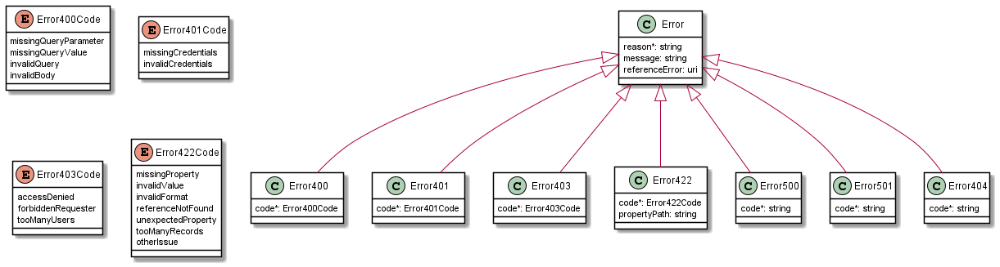

<div align="center">


## **Working Draft**<!-- omit in toc -->

## **MEF W87, v0.4**<!-- omit in toc -->

## LSO Cantata and LSO Sonata Product Offering Qualification API - Developer Guide<!-- omit in toc -->

## May 2021 <!-- omit in toc -->

<p style="color:red;font-weight:bold; font-size:18pt">This draft represents MEF work in progress and is subject to change.</p>

</div>

<div style="page-break-after: always;"></div>

<div style="page-break-after: always;"></div>

**Disclaimer**

© MEF Forum 2021. All Rights Reserved.

The information in this publication is freely available for reproduction and
use by any recipient and is believed to be accurate as of its publication date.
Such information is subject to change without notice and MEF Forum (MEF) is not
responsible for any errors. MEF does not assume responsibility to update or
correct any information in this publication. No representation or warranty,
expressed or implied, is made by MEF concerning the completeness, accuracy, or
applicability of any information contained herein and no liability of any kind
shall be assumed by MEF as a result of reliance upon such information.

The information contained herein is intended to be used without modification by
the recipient or user of this document. MEF is not responsible or liable for
any modifications to this document made by any other party.

The receipt or any use of this document or its contents does not in any way
create, by implication or otherwise:

- (a) any express or implied license or right to or under any patent,
  copyright, trademark or trade secret rights held or claimed by any MEF member
  which are or may be associated with the ideas, techniques, concepts or
  expressions contained herein; nor

- (b) any warranty or representation that any MEF member will announce any
  product(s) and/or service(s) related thereto, or if such announcements are
  made, that such announced product(s) and/or service(s) embody any or all of
  the ideas, technologies, or concepts contained herein; nor

- (c) any form of relationship between any MEF member and the recipient or user
  of this document.

Implementation or use of specific MEF standards, specifications or
recommendations will be voluntary, and no Member shall be obliged to implement
them by virtue of participation in MEF Forum. MEF is a non-profit international
organization to enable the development and worldwide adoption of agile, assured
and orchestrated network services. MEF does not, expressly or otherwise,
endorse or promote any specific products or services.

**Copyright**

© MEF Forum 2021. Any reproduction of this document, or any portion thereof,
shall contain the following statement: "Reproduced with permission of MEF
Forum." No user of this document is authorized to modify any of the information
contained herein.

<div style="page-break-after: always;"></div>

# Table of Contents <!-- omit in toc -->

<!-- code_chunk_output -->

- [List of Contributing Members](#list-of-contributing-members)
- [1. Abstract](#1-abstract)
- [2. Terminology and Abbreviations](#2-terminology-and-abbreviations)
- [3. Compliance Levels](#3-compliance-levels)
- [4. Introduction](#4-introduction)
  - [4.1. Description](#41-description)
  - [4.2. Conventions in the Document](#42-conventions-in-the-document)
  - [4.3. Relation to Other Documents](#43-relation-to-other-documents)
  - [4.4. Approach](#44-approach)
  - [4.5. High-Level Flow](#45-high-level-flow)
- [5. API Description](#5-api-description)
  - [5.1. Resource/endpoint Description](#51-resourceendpoint-description)
    - [5.1.1. Seller Side Endpoints](#511-seller-side-endpoints)
    - [5.1.2. Buyer Side Endpoints](#512-buyer-side-endpoints)
    - [5.1.3. Specifying the Buyer ID and the Seller ID](#513-specifying-the-buyer-id-and-the-seller-id)
  - [5.2. Data Model - Key Entities](#52-data-model---key-entities)
    - [5.2.1 Request View on Key Entities](#521-request-view-on-key-entities)
    - [5.2.2 Response/Inventory View on Key Entities](#522-responseinventory-view-on-key-entities)
    - [5.2.3. Integration of Product Specifications into Product Offering Qualification Management API](#523-integration-of-product-specifications-into-product-offering-qualification-management-api)
  - [5.3. Model Structural Validation](#53-model-structural-validation)
  - [5.4. Security Considerations](#54-security-considerations)
- [6. API Interaction & Flows](#6-api-interaction--flows)
  - [6.1. Sample Product Specification](#61-sample-product-specification)
  - [6.2. Interaction Patterns](#62-interaction-patterns)
    - [6.2.1. Immediate Response](#621-immediate-response)
    - [6.2.2. Deferred Response with Polling](#622-deferred-response-with-polling)
    - [6.2.3. Deferred Response with Notifications](#623-deferred-response-with-notifications)
  - [6.3. Sending Product Offering Qualification Request](#63-sending-product-offering-qualification-request)
    - [6.3.1. Buyer POQ Request](#631-buyer-poq-request)
    - [6.3.2. Seller's Response to POQ Request](#632-sellers-response-to-poq-request)
    - [6.3.3. POQ Item Specification Details](#633-poq-item-specification-details)
    - [6.3.4. Specifying Place Details](#634-specifying-place-details)
  - [6.4. Retrieving POQ information](#64-retrieving-poq-information)
    - [6.4.1. Retrieving POQ list](#641-retrieving-poq-list)
    - [6.4.2. Retrieving POQ by identifier](#642-retrieving-poq-by-identifier)
  - [6.5. Alternative Product Proposals](#65-alternative-product-proposals)
  - [6.6. Notifications](#66-notifications)
- [7. API Details](#7-api-details)
  - [7.1. API patterns](#71-api-patterns)
    - [7.1.1. Indicating errors](#711-indicating-errors)
    - [7.1.2. Response pagination](#712-response-pagination)
  - [7.2. Management API Data model](#72-management-api-data-model)
    - [7.2.1 Product Offering Qualification](#721-product-offering-qualification)
    - [7.2.2. Product Offering Qualification Item](#722-product-offering-qualification-item)
    - [7.2.3. Product representation](#723-product-representation)
    - [7.2.4. Place representation](#724-place-representation)
    - [7.2.5. Notification registration](#725-notification-registration)
    - [7.2.6. Common](#726-common)
  - [7.3. Notification API Data model](#73-notification-api-data-model)
    - [7.3.1. Type Event](#731-type-event)
    - [7.3.2. Type POQEvent](#732-type-poqevent)
    - [7.3.3. `enum` POQEventType](#733-enum-poqeventtype)
- [8. References](#8-references)

<!-- /code_chunk_output -->

<div style="page-break-after: always;"></div>

# List of Contributing Members

The following members of the MEF participated in the development of this
document and have requested to be included in this list.

| Member |
| ------ |
|        |
|        |
|        |

**Table 1. Contributing Members**

# 1. Abstract

This standard is intended to assist implementation of the Product Offering
Qualification (POQ) function defined for the LSO Cantata and LSO Sonata
Interface Reference Points (IRPs), for which requirements and use cases are
defined in MEF 79 [[MEF79](#8-references)], MEF 79.0.1
[[MEF79.0.1](#8-references)] and MEF 79.0.2 [[MEF79.0.2](#8-references)]. This
standard consists of this document and complementary API definitions for
Product Offering Qualification Management and Notification.

This Draft Standard normatively incorporates the following files by reference
as if they were part of this document, from the GitHub repository

<https://github.com/MEF-GIT/MEF-LSO-Sonata-SDK>

- `productApi/serviceability/offeringQualification/productOfferingQualificationManagement.api.yaml`
- `productApi/serviceability/offeringQualification/productOfferingQualificationNotification.api.yaml`

<https://github.com/MEF-GIT/MEF-LSO-Cantata-SDK>

- `productApi/serviceability/offeringQualification/productOfferingQualificationManagement.api.yaml`
- `productApi/serviceability/offeringQualification/productOfferingQualificationNotification.api.yaml`

# 2. Terminology and Abbreviations

This section defines the terms used in this document. In many cases, the
normative definitions of terms are found in other documents. In these cases,
the third column is used to provide the reference that is controlling, in other
MEF or external documents.

<table>
<tr>
  <th>Term</th>
  <th>Description</th>
  <th>Reference</th>
</tr>
<tr>
  <td>Application Program Interface (API)</td>
  <td>In the context of LSO, API describes one of the Management Interface Reference Points based on the requirements specified in an Interface Profile, along with a data model, the protocol that defines operations on the data and the encoding format used to encode data according to the data model. In this document, API is used synonymously with REST API.</td>
  <td><a href="#8-references">[MEF55.1]</td>
</tr>
<tr>
  <td>Buyer</td>
  <td>In the context of this document, denotes the organization or individual acting as the customer in a transaction over a Cantata (Customer <-> Service Provider) or Sonata (Service Provider <-> Partner) Interface.</td>
  <td>This document; adapted from <a href="#8-references">[MEF80]</td>
</tr>
<tr>
  <td>Deferred Response</td>
  <td>A Seller's response to a Buyer's request whereby the Seller immediately acknowledges that the request was received, and, over time, sends notifications to update the Buyer on the status and results of the request (assuming the Buyer has subscribed to receive the notifications). The Buyer can also poll the Seller for the results and status associated with the request.</td>
  <td><a href="#8-references">[MEF79]</a> </td>
</tr>
<tr>
  <td>Immediate Response</td>
  <td>A Seller's response to the Buyer whereby the Seller responds immediately with the results of the request or indicates that the request cannot be processed. The maximum time to provide an Immediate Response is for further study, but is expected to be less than 30 seconds. </td>
  <td><a href="#8-references">[MEF79]</a> </td>
</tr>
<tr>
  <td>OpenAPI</td>
  <td>RESTful API Documentation Specification for machine-readable interface files for describing, producing, consuming, and visualizing RESTful web services.</td>
  <td><a href="#8-references">[OAS-3] <a href="#8-references">[OAS-V3]</a></td>
</tr>
<tr>
  <td>POQ</td>
  <td>Product Offering Qualification</td>
  <td><a href="#8-references">[MEF79]</a> </td>
</tr>
<tr>
  <td>POQ Item</td>
  <td>Product Offering Qualification Item</td>
  <td><a href="#8-references">[MEF79]</a> </td>
</tr>
<tr>
  <td>Product Offering Qualification</td>
  <td>One or more POQ Items formulated into a request made by a Buyer to a Seller.</td>
  <td><a href="#8-references">[MEF79]</a> </td>
</tr>
<tr>
  <td>Product Offering Qualification Item</td>
  <td>An individual article included in a POQ that describes a Product of a particular type (Product Offering). The objective is to determine if it is feasible for the Seller to deliver this item as described and for the Seller to inform the Buyer of the estimated time interval to complete this delivery.</td>
  <td><a href="#8-references">[MEF79]</a> </td>
</tr>
<tr>
  <td>Requesting Entity</td>
  <td>The business organization that is acting on behalf of one or more Buyers. In the most common case, the Requesting Entity represents only one Buyer and these terms are then synonymous.</td>
  <td><a href="#8-references">[MEF79]</a></td>
</tr>
<tr>
  <td>Responding Entity</td>
  <td>The business organization that is acting on behalf of one or more Sellers. In the most common case, the Responding Entity represents only one Seller and these terms are then synonymous.</td>
  <td><a href="#8-references">[MEF79]</a></td>
</tr>
<tr>
  <td>REST API </td>
  <td>Representational State Transfer. REST provides a set of architectural constraints that, when applied as a whole, emphasizes scalability of component interactions, generality of interfaces, independent deployment of components, and intermediary components to reduce interaction latency, enforce security, and encapsulate legacy systems.</td>
  <td><a href="#8-references">[REST]</a> </td>
</tr>
<tr>
  <td>Seller</td>
  <td>In the context of this document, denotes the organization acting as the supplier in a transaction over a Cantata (Customer <-> Service Provider) or Sonata (Service Provider <-> Partner) Interface.</td>
  <td>This document; adapted from <a href="#8-references">[MEF80]</td>
</tr>
</table>

# 3. Compliance Levels

The key words **"MUST"**, **"MUST NOT"**, **"REQUIRED"**, **"SHALL"**, **"SHALL
NOT"**, **"SHOULD"**, **"SHOULD NOT"**, **"RECOMMENDED"**, **"NOT
RECOMMENDED"**, **"MAY"**, and **"OPTIONAL"** in this document are to be
interpreted as described in BCP 14 (RFC 2119 [[RFC2119](#8-references)], RFC
8174 [[RFC8174](#8-references)]) when, and only when, they appear in all
capitals, as shown here. All key words must be in bold text.

Items that are **REQUIRED** (contain the words **MUST** or **MUST NOT**) are
labeled as **[Rx]** for required. Items that are **RECOMMENDED** (contain the
words **SHOULD** or **SHOULD NOT**) are labeled as **[Dx]** for desirable.
Items that are **OPTIONAL** (contain the words MAY or OPTIONAL) are labeled as
**[Ox]** for optional.

# 4. Introduction

This standard specification document describes the Application Programming
Interface (API) for Product Offering Qualification functionality of the LSO
Cantata Interface Reference Point (IRP) and LSO Sonata IRP as defined in the
_MEF 55.1 Lifecycle Service Orchestration (LSO): Reference Architecture and
Framework_ [[MEF55.1](#8-references)]. The LSO Reference Architecture is shown
in Figure 1 with both IRPs highlighted.


**Figure 1. The LSO Reference Architecture**

Cantata and Sonata IRPs define pre-ordering and ordering operations that allow
automated exchange of information between business applications of the the
Buyer (Customer or Service Provider) and Seller (Service Provider or Partner)
Domains. Those are:

- Product Catalog
- Address Validation
- Site Retrieval
- Product Offering Qualification
- Product Quote
- Product Inventory
- Product Ordering
- Trouble Ticketing
- Billing

The business requirements and use cases for Product Offering Qualification are
defined in:

- _MEF 79: Address, Service Site, and Product Offering Qualification Management
  Requirements and Use Cases_ [[MEF79](#8-references)],
- _MEF 79.0.1: Amendment to MEF 79: Address, Service Site, and Product Offering
  Qualification Management, Requirements, and Use Cases_
  [[MEF79.0.1](#8-references)], and
- _MEF 79.0.2: Amendment to MEF 79: Address Validation_
  [[MEF79.0.2](#8-references)].

This document focuses on implementation aspects of POQ functionality and is
structured as follows:

- [Section 4](#4-introduction) gives a technical introduction to POQ
  functionality.
- [Section 5](#5-api-description) provides an overview of the operations, data
  models, and design patterns of API definition.
- [Section 6](#6-api-interaction--flows) focuses on API interactions with the
  help of end-to-end sequence diagrams and usage examples.
- [Section 7](#7-api-details) complements Section 5 with an in-depth API
  description.

## 4.1. Description

The Product Offering Qualification (POQ) API allows a Buyer to check whether
the Seller can deliver a product or set of products from among their product
offerings at the geographic address or a service site specified by the Buyer;
or modify a previously purchased product.

The API payloads exchanged between a Buyer and the Seller during the POQ
execution consist of product-independent and product-specific parts. The
product-independent part is technically defined in this standard. The
product-specific part is defined in the product specifications of the concerned
product. Both definition types must be used in combination to validate the
correctness of the payloads.
[Section 5.2.1](#521-integrating-product-specifications-into-poq-payload)
explains how to use product-specific definitions with POQ API definition.

This document uses examples of Access E-Line Product specified by
[[MEFW106](#8-references)]. These sample product specification definitions are
used to construct API payloads examples that illustrate API usage in
[Section 6](#6-api-interaction--flows).

**_Note:_** The Access E-Line product is valid only in the Sonata context. It
is used only for the explanation of the rules of combining the product-agnostic
(envelope) and product-specific (payload) parts of the APIs. It is out of the
scope of this document to explain the details of any product.

Product specifications are defined using JSON Schema (draft 7) standard
[[JS](#8-references)], whereas POQ API is defined using OpenAPI 3.0 standard
[[OAS-V3](#8-references)]. The payloads exchanged through POQ endpoints must
comply with these definitions as well as with MEF 79 [[MEF79](#8-references)],
MEF 79.0.1 [[MEF79.0.1](#8-references)], and MEF 79.0.2
[[MEF79.0.2](#8-references)] requirements for POQ functionality and with
product specifications that are in use.

## 4.2. Conventions in the Document

- Code samples are formatted using code blocks. When notation `<< some text >>`
  is used in the payload sample it indicates that a comment is provided instead
  of an example value and it might not comply with the OpenAPI definition.
- Model definitions are formatted as in-line code (e.g. `GeographicAddress`).
- In UML diagrams the default cardinality of associations is `0..1`. Other
  cardinality markers are complaint with the UML standard.
- In the API details tables and UML diagrams required attributes are marked
  with a `*` next to their names.
- In UML sequence diagrams `{{variable}}` notation is used to indicates a
  variable to be substituted with a correct value.

## 4.3. Relation to Other Documents

The requirements and use cases for POQ functionality are defined in MEF 79
[[MEF79](#8-references)], MEF 79.0.1 [[MEF79.0.1](#8-references)] and MEF
79.0.2 [[MEF79.0.2](#8-references)]. The API definition builds on TMF 679
version 19.0.1 [[TMF679](#8-references)]. POQ functions must allow using any
MEF product specifications, in particular the ones defined for the Access
E-Line Product Specification in MEF W106 [[MEFW106](#8-references)].

## 4.4. Approach

As presented in Figure 2. both Cantata and Sonata API frameworks consists of
three structural components:

- Generic API framework
- Product-independent information (Function-specific information and
  Function-specific operations)
- Product-specific information (MEF product specification data model)


**Figure 2. Cantata and Sonata API framework**

The essential concept behind the framework is to decouple the common structure,
information and operations from the specific product information content.
Firstly, the Generic API Framework defines a set of design rules and patterns
that are applied across all Cantata or Sonata APIs. Secondly, the
product-independent part of the framework focuses on a model of a particular
Cantata or Sonata functionality and is agnostic to any of the product
specifications. For example, this standard is describing Product Offering
Qualification model and operations that allow performing qualifications of any
product that is aligned with one of MEF or custom product specifications.
Finally, the product-specific information part of the framework focuses on MEF
product specifications that define business-relevant attributes and
requirements for trading MEF subscriber and MEF operator services. This
standard is not defining MEF product specifications, however, can be used along
with any product specification defined by or compliant with MEF.

## 4.5. High-Level Flow

Quote management is part of a broader Cantata and Sonata End-to-End flow.
Figure 3. below shows a high-level diagram to get a good understanding of the
whole process and Quote Management's position within it.


**Figure 3. Cantata and Sonata End-to-End Function Flow**

- Address Validation:
  - Allows the Buyer to retrieve address information from the Seller, including
    exact formats, for addresses known to the Seller.
- Site Retrieval:
  - Allows the Buyer to retrieve Service Site information including exact
    formats for Service Sites known to the Seller.
- Product Offering Qualification (POQ):
  - Allows the Buyer to check whether the Seller can deliver a product or set
    of products from among their product offerings at the geographic address or
    a service site specified by the Buyer; or modify a previously purchased
    product.
- Quote:
  - Allows the Buyer to submit a request to find out how much the installation
    of an instance of a Product Offering, an update to an existing Product, or
    a disconnect of an existing Product will cost.
- Product Order:
  - Allows the Buyer to request the Seller to initiate and complete the
    fulfillment process of an installation of a Product Offering, an update to
    an existing Product, or a disconnect of an existing Product at the address
    defined by the Buyer.
- Product Inventory:
  - Allows the Buyer to retrieve the information about existing Product
    instances from Seller's Product Inventory.
- Trouble Ticketing:
  - Allows the Buyer to create, retrieve, and update Trouble Tickets as well as
    receive notifications about Incidents' and Trouble Tickets' updates. This
    allows managing issues and situations that are not part of normal
    operations of the Product provided by the Seller.

# 5. API Description

This section discusses the API structure and design patterns. It starts with a
description of available REST endpoints. Then, an overview of the API data
model is given together with the description of the extension design pattern
that is used to combine product-agnostic and product-specific parts of API
payloads. Finally, payload validation and API security aspects are discussed.

## 5.1. Resource/endpoint Description

### 5.1.1. Seller Side Endpoints

**BasePath for Cantata**:
`https://{{server}}:{{port}}/mefApi/cantata/productOfferingQualification/v1/`

**BasePath for Sonata**:
`https://{{server}}:{{port}}/mefApi/sonata/productOfferingQualification/v7/`

The following API endpoints are implemented by the Seller and allow the Buyer
to send POQ requests, retrieve existing POQs or POQ details, and manage
notification registrations. The endpoints and corresponding data model are
defined in
`productApi/serviceability/offeringQualification/productOfferingQualificationManagement.api.yaml`.

| API endpoint                               | Description                                                                                                                                                                                                                                                                                                                                                                          | MEF 79 Use case Mapping                     |
| ------------------------------------------ | ------------------------------------------------------------------------------------------------------------------------------------------------------------------------------------------------------------------------------------------------------------------------------------------------------------------------------------------------------------------------------------ | ------------------------------------------- |
| `POST /productOfferingQualification`       | A request initiated by the Buyer to determine whether the Seller can feasibly deliver a particular Product (or Products) to a specific set of geographic locations                                                                                                                                                                                                                   | UC 6: Create Product Offering Qualification |
| `GET /productOfferingQualification`        | A request initiated by the Buyer to retrieve a list of POQs (in any state) from the Seller based on a set of POQ filter criteria.                                                                                                                                                                                                                                                    | UC 7: Retrieve POQ List                     |
| `GET /productOfferingQualification/{{id}}` | A request initiated by the Buyer to retrieve full details of a single Product Offering Qualification based on a POQ identifier.                                                                                                                                                                                                                                                      | UC 8: Retrieve POQ by Identifier            |
| `POST /hub`                                | A request initiated by the Buyer to instruct the Seller to send notifications of POQ create and/or state changes if the Buyer has registered for these notifications. The state change notifications are sent only in the Deferred scenario as in the Immediate scenario once the response to POQ Request is provided (create notification), there will be no further state changes. | UC 5: Register for POQ Notifications        |
| `DELETE /hub/{{id}}`                       | A request initiated by the Buyer to instruct the Seller to stop sending notifications of POQ create and/or state changes.                                                                                                                                                                                                                                                            | UC 5: Register for POQ Notifications        |

**[R1]** The Buyer implementation **MUST** be able to use all REST methods for
`/productOfferingQualification` endpoint that are listed in the table above.
[MEF79 R1].

### 5.1.2. Buyer Side Endpoints

**BasePath for Cantata**:
`https://{{server}}:{{port}}/mefApi/cantata/productOfferingQualificationNotification/v1/`

**BasePath for Sonata**:
`https://{{server}}:{{port}}/mefApi/sonata/productOfferingQualificationNotification/v7/`

The following API endpoints are implemented by the Buyer and are used by the
Seller to send POQ related notifications. The endpoints and corresponding data
model are defined in
`productApi/serviceability/offeringQualification/productOfferingQualificationNotification.api.yaml`

| API endpoint                             | Description                                                                | MEF 79 Use case Mapping          |
| ---------------------------------------- | -------------------------------------------------------------------------- | -------------------------------- |
| `POST /listener/poqCreateEvent`          | A request initiated by the Seller to notify Buyer on POQ creation          | UC 9: Notify of POQ State Change |
| `POST /listener/poqStateChangeEvent`     | A request initiated by the Seller to notify Buyer on POQ state change      | UC 9: Notify of POQ State Change |
| `POST /listener/poqItemStateChangeEvent` | A request initiated by the Seller to notify Buyer on POQ Item state change | UC 9: Notify of POQ State Change |

### 5.1.3. Specifying the Buyer ID and the Seller ID

A business entity willing to represent multiple Buyers or multiple Sellers must
follow requirements of MEF 79 [[MEF79](#8-references)] chapter 8.8, which
states:

> For requests of all types, there is a business entity that is initiating an
> Operation (called a Requesting Entity) and a business entity that is
> responding to this request (called the Responding Entity). In the simplest
> case, the Requesting Entity is the Buyer and the Responding Entity is the
> Seller. However, in some cases, the Requesting Entity may represent more than
> one Buyer and similarly, the Responding Entity may represent more than one
> Seller.
>
> While it is outside the scope of this specification, it is assumed that the
> Requesting Entity and the Responding Entity are aware of each other and can
> authenticate requests initiated by the other party. It is further assumed
> that both the Buying Entity and the Requesting Entity know:
>
> a) the list of Buyers the Requesting Entity represents when interacting with
> this Responding Entity; and  
> b) the list of Sellers that this Responding Entity represents to this
> Requesting Entity.

In the API the `buyerId` and `sellerId` are represented as query parameters in
each operation defined in `productOfferingQualificationManagement.api.yaml` and
as attributes of an event (`PoqEvent`) as described in
`productOfferingQualificationNotification.api.yaml`.

**[R2]** If the Requesting Entity has the authority to represent more than one
Buyer the request **MUST** include `buyerId` query parameter that identifies
the Buyer being represented [MEF79 R80]

**[R3]** If the Requesting Entity represents precisely one Buyer with the
Responding Entity, the request **MUST NOT** specify the `buyerId` [MEF79 R81]

**[R4]** If the Responding Entity represents more than one Seller to this Buyer
the request **MUST** include `sellerId` query parameter that identifies the
Seller with whom this request is associated [MEF79 R82]

**[R5]** If the Responding Entity represents precisely one Seller to this
Buyer, the request **MUST NOT** specify the `sellerId` [MEF79 R83]

**[R6]** If `buyerId` or `sellerId` attributes were specified in the
notification registration request, the same attributes **MUST** be used in
notification payload.

## 5.2. Data Model - Key Entities

Sections below describe the most important entities (aka data types) from the
data model which can be found in the API specification (definitions section).
Each entity is a simple or composed type (using `allOf` keyword for data types
composition). A simple type defines a set of properties that might be of an
object, primitive, or reference type.

**[R7]** If an entity is used in the request or response payload all properties
marked as required **MUST** be provided.

A detailed description of the data types is provided in
[Section 7](#7-api-details) and the OpenAPI definition. The examples that
illustrate the usage of the data model are included in
[Section 6](#6-api-interaction--flows).

### 5.2.1 Request View on Key Entities

Figure 4 depicts a view on the data model that is used in the Product Offering
Qualification request (`POST /productOfferingQualification`) that is sent by a
Buyer (see [Section 5.1.1](#511-seller-side-endpoints) for details).

`ProductOfferingQualification_Create` is the root entity of a product offering
qualification request. It contains one or more
`ProductOfferingQualificationItem_Create`. An item
(`ProductOfferingQualificationItem_Create`) defines an item inquiry details (in
`MEFProductRefOrValue` structure) and allows for the definition of related
contact information (`relatedContactInformation`) or relations to other items
(`QualificationItemRelationship`). `MEFProductRefOrValue` allows for the
introduction of MEF product-specific properties to the POQ payload. The
extension mechanism is described in detail in
[Section 5.2.3](#523-integration-of-product-specifications-into-product-offering-qualification-management-api).
Also, a `MEFProductRefOrValue` may be used to specify relations to places
(using specializations of `RelatePlaceOrValue`) or/and to a product that exists
in the Seller's inventory (using `ProductRelationshipWithGrouping`).


**Figure 4. The POQ Management API Data model - request view on key entities**

### 5.2.2 Response/Inventory View on Key Entities

Figure 5 depicts a view on the data model that is used to provide a response to
a Buyer's Product Offering Qualification request
(`POST /productOfferingQualification`) or to retrieve POQ by an identifier
(`GET /productOfferingQualification/{{id}}`).

`ProductOfferingQualification` is the root entity of a product offering
qualification response and it is managed by the Seller.
`ProductOfferingQualification` extends `ProductOfferingQualification_Common`
(which represents Buyer's request) with a number of attributes, i.e. unique
identifier or state information.

**[R8]** The properties provided in the requests by the Buyer **MUST NOT** be
modified by the Seller.

`ProductOfferingQualification` contains one or more items
(`ProductOfferingQualificationItem`). For each item, the Seller provides the
processing state and if applicable the final response to a particular item from
Buyer's request.

**[R9]** In case of a successful response (`status` equals to `done.ready`) the
Seller **MUST** provide serviceability confidence level and if applicable might
provide an alternate product proposal (`AlternateProductOfferingProposal`).

**[R10]** If `status=done.ready`, and the `serviceabilityConfidence` is
`yellow` or `green`, the Seller **MUST** specify the `installationInterval` in
the response. [MEF79 R56]

**[R11]** If `status=done.ready`, then the Seller **MAY** specify the
`guaranteedUntilDate` in the response [MEF79 O5]


**Figure 5. The POQ Management API Data model - response/inventory view on key
entities**

### 5.2.3. Integration of Product Specifications into Product Offering Qualification Management API

Product specifications are defined using JsonSchema (draft 7) format and are
integrated into a POQ payload using TMF extension pattern.

The extension hosting type in API data model is `MEFProductConfiguration`. The
`@type` attribute of that type must be set to a value that uniquely identifies
the product spectifiaction. A unique identifier for MEF standard product
specifications is in URN format and is assigned by MEF. This identifier is
provided as root schema `$id` and in product specification documentation. Use
of non-MEF standard product definitions is allowed. In such case the schema
identifier must be agreed between the Buyer and the Seller.

The example below shows a header of a Product Specification schema, where
`"$id": urn:mef:lso:spec:sonata:access-eline:v1.0.0:poq` is the abovementioned
URN:

```yaml
'$schema': http://json-schema.org/draft-07/schema#
'$id': urn:mef:lso:spec:sonata:access-eline:v1.0.0:poq
title: MEF LSO Sonata - Access Eline OVC (POQ) Product Specification
```

Product specifications are provided as Json schemas without the
`MEFProductConfiguration` context.

Product-specific attributes can be introduced into `MEFProductRefOrValue`
(defined by the Buyer) or into `AlternateProductOfferingProposal` (may be
defined by the Seller while responding to POQ) using `MEFAlternateProduct`.
Each of these types introduces the `productConfiguration` attribute of type
`MEFProductConfiguration` which is used as an extension point for
product-specific attributes.

Implementations might choose to integrate selected product specifications to
data model during development. In such case an integrated data model is built
and product specifications are in inheritence relationship with
`MEFProductConfiguration` as described in OAS specification. This pattern is
called **Static Binding**. The SDK is additionally shipped with a set of API
definitions that statically bind all product-related APIs (POQ, Quote, Order,
Inventory) with all corresponding product specifications available in the
release. The snippets below present an example of a static binding of the POQ
API with a number of MEF product specifications, from both
`MEFProductConfiguration` and product specification point of view:

```yaml
MEFProductConfiguration:
  description:
    MEFProductConfiguration is used as an extension point for MEF specific
    product/service payload.  The `@type` attribute is used as a discriminator
  discriminator:
    mapping:
      urn:mef:lso:spec:sonata:AccessElineOvc:v1.0.0:poq: '#/components/schemas/AccessElineOvcPoq_v1.0.0'
      urn:mef:lso:spec:cantata-sonata:SubscriberUni:v1.0.0:poq: '#/components/schemas/SubscriberUniPoq_v1.0.0'
      urn:mef:lso:spec:cantata-sonata:EplEvc:v1.0.0:poq: '#/components/schemas/EplEvcPoq_v1.0.0'
      urn:mef:lso:spec:sonata:OperatorUNI:v1.0.0:poq: '#/components/schemas/OperatorUNIPoq_v1.0.0'
    propertyName: '@type'
  properties:
    '@type':
      description:
        The name of the type, defined in the JSON schema specified above, for
        the product that is the subject of the POQ Request. The named type must
        be a subclass of MEFProductConfiguration.
      type: string
```

```yaml
AccessElineOvcPoq_v1.0.0:
  allOf:
    - $ref: '#/components/schemas/MEFProductConfiguration'
    - description:
        OVC Service Attributes control the behavior observable at and between
        External Interfaces to the Carrier Ethernet Network (CEN). The
        behaviors are achieved by the Network Operator and the Operator's
        client (the Service Provider in this case) agreeing on the value for
        each of the Service Attributes.
```

Alternatively, implementations might choose not to build an integrated model
and choose different mechanism allowing runtime validation of product specific
fragments of the payload. The system is able to validate given product against
a new schema without redeployment. This pattern is called **Dynamic Binding.**

Regardless of chosen implementation pattern, the HTTP payload is exactly the
same. Both implementation approaches must conform to requirements specified
below.

**[R12]** `MEFProductConfiguration` type is an extension point that **MUST** be
used to integrate product specifications' properties into a request/response
payload.

**[R13]** The `@type` property of `MEFProductConfiguration` **MUST** be used to
specify the type of the extending entity.

**[RXXX]** Product attributes specified in payload must conform to the product
specification specified in the `@type` property.


**Figure 6. The Extension Pattern with Sample Product Specific Extensions**

Figure 6. depicts two MEF `<<ProductSpecifications>>` that represent Access
E-Line and Operator UNI products. When these products are used in POQ payload
the `@type` of `MEFProductConfiguration` takes
`"urn:mef:lso:spec:sonata:AccessElineOvc:1.0.0:poq"` or
`"urn:mef:lso:spec:sonata:OperatorUNI:1.0.0:poq"` value to indicate which
product specification should be used to interpret a set of product-specific
properties included in the payload.

The _poq_ suffix after the product type name comes from the approach that the
product schemas may differ depending on the Interface Reference Point function
they are used with.

## 5.3. Model Structural Validation

The structure of the HTTP payloads exchanged via POQ API endpoints is defined
using:

- OpenAPI version 3.0 for product-agnostic part of the payload
- JsonSchema (draft 7) for product-specific part of the payload

**[R14]** Implementations **MUST** use payloads that conform to these
definitions.

**[R15]** A product specification may define additional consistency rules and
requirements that **MUST** be respected by implementations. These are defined
for:

- relations to other items in the same product offering qualification request
  (e.g. required relation type, multiplicity) (as specified in [MEF79 R37],
  [MEF79 A1-R2])
- relations to entities from the inventory managed by the Seller (as specified
  in [MEF79 R37], [MEF79 A1-R1])
- related contact information that is to be defined at an item level
- relations to places (locations) that are to be defined at an item level
  [MEF79 R35 & R36]

## 5.4. Security Considerations

There must be an authentication mechanism whereby a Seller can be assured who a
Buyer is and vice-versa. There must also be authorization mechanisms in place
to control what a particular Buyer or Seller is allowed to do and what
information may be obtained. However, the definition of the exact security
mechanism is outside the scope of this document.

# 6. API Interaction & Flows

<!-- TODO check rest of following in the document -->

This section discusses the most important aspects of end-to-end interactions
that result in completed product qualification inquiries. It starts with a
description of product specifications which are used in the remainder of the
section in example payloads. Then the end-to-end flows are presented for the
immediate and deferred interaction patterns. Next, the structure of the POQ
request and response is described. This part highlights different variants of
POQ interactions for different item action types, place definitions, and
alternative responses. Finally, the mechanism of notifications is briefly
discussed.

## 6.1. Sample Product Specification

The Sonata SDK contains draft product specification definitions, from which UNI
and Access E-Line are used in the payload samples in this section. The product
specification data model definitions are available as JsonSchema (version
`draft 7`) documents. Figure 7 and Figure 8 depict simplified UML views on
these data models in which:

- the mandatory attributes are denoted with `*`,
- the mandatory relations have a cardinality of `1` or `1..*`,
- relations and attributes that are not essential to the understanding of the
  product specification model are omitted.

The detailed Access E-line product specification description is provided in MEF
W106 [[MEFW106](#8-references)].


**Figure 7. A simplified view on Access E-Line product specification data
model**


**Figure 8. A simplified view on UNI product specification data model**

Product specifications define a number of product-related and envelope-related
requirements. Sample envelope-related requirements (as specified in MEF W106
[[MEFW106](#8-references)]):

- an Access E-Line product specification defines two mandatory product
  relationship roles to ENNI (`ENNI_REFERENCE`) and operator UNI
  (`UNI_REFERENCE`) for `add` action. First must be realized as a product
  relationship, second might be realized as item or product relationship
- product relationships cannot be specified in case of `modify` or `delete`
  actions
- an operator UNI product specification defines a place relationship
  (`INSTALL_LOCATION`) that must be specified for `add` action
- place relationships cannot be specified in case of `modify` or `delete`
  actions

The product relationship (`product.productRelationship`) and the place
relationship (`product.place`) are presented in Figure 4 and in more details at
Figure 13.

In case some of both product-related or envelope-related requirements are
violated the Seller returns an error response to the Buyer which indicates
specific functional errors. These errors are listed in the response body (a
list of `Error422` entries) for HTTP `422` response.

## 6.2. Interaction Patterns

To complete POQ inquiry three interaction patterns can be used depending on
Buyer/Seller side capabilities.

### 6.2.1. Immediate Response

Immediate response can be requested by a Buyer using `instantSyncQualification`
flag set to `true`. In case of successful processing, the Seller will respond
with POQ in state `done.ready` (indicating success) or
`terminatedWithError`(indicating that Buyer has not provided enough
information). Otherwise, the appropriate error code and description are
returned in case the payload doesn't pass initial validation. Please note that
`done.unableToProvide` state is not supported in the immediate response case.
The `done.unableToProvide` state is only used during the Deferred Response
pattern when the Seller is unable to provide a response in the time frame
required by the Buyer.

**_Note_**: The term "Seller Response Code" used in the Business Requirements
maps to HTTP response code, where `2xx` indicates _Success_ and `4xx` or `5xx`
indicate _Failure_.

**[R16]** The Seller **MAY** provide an immediate answer even when
`instantSyncQualification` flag set to `false` [MEF79 R3].


**Figure 9. Immediate response**

### 6.2.2. Deferred Response with Polling

A deferred response can be requested by a Buyer using
`instantSyncQualification` flag set to `false`. The Seller responds with
partial `POQ` (including at least `id` and `state=acknowledged`) and starts
processing the request asynchronously. The Buyer polls the POQ until the final
status is reached by the POQ using the POQ identifier specified by the Seller
in response.


**Figure 10. Deferred response with polling**

### 6.2.3. Deferred Response with Notifications

In this variant of the deferred response, the notifications mechanism is used.
First, the Buyer registers for notification providing a callback endpoint. Then
the Buyer requests for qualification. The Seller sends notifications on POQ
creation and subsequent POQ and POQ Item State changes until the final POQ
status is reached.

When the Buyer registers for POQ notifications this registration will be valid
until the Buyer unsubscribes from the POQ notifications. This implies that for
any POQ request the Buyer sends to the Seller, and for which he requests an
Deferred Response, in the time frame between the registration for the POQ
notifications and unsubscribing from the same POQ notifications by the Buyer,
the Seller will have to inform the Buyer of changes using the POQ
notifications.


**Figure 11. Deferred response with notifications**

## 6.3. Sending Product Offering Qualification Request

To send a POQ request a Buyer must use createProductOfferingQualification
(`POST {{baseUrl}}/productOfferingQualification`) which represents UC6 from
MEF79. In the remainder of this section, some of the POQ payloads attributes
might be omitted to simplify examples' content. The full list of attributes is
available in [Section 7](#7-api-details) and in API specification which is an
integral part of this standard.

### 6.3.1. Buyer POQ Request

The most common Buyer attributes used in a request are listed below:

```json
{
  "provideAlternative" : false,
  "requestedPOQCompletionDate" : "2020-08-29T07:03:36.2640125Z",
  "instantSyncQualification" : false,
  "projectId" : "ourProjectForCustomerX",
  "relatedContactInformation" : [],
  "productOfferingQualificationItem" : [ {
    "id" : "item-001",
    "action" : "add",
    "product": { << product specific attributes and configuration >> },
    "relatedContactInformation": [ << required related contact information entries >> ],
    "qualificationItemRelationship": [ << item level relationships >> ]
  },
  {
      "id": "item-002"
      <<rest of item-002 attributes are omitted>>
  }
  ]
}
```

**[R17]** Each POQ request sent by the Buyer **MUST** include at least one POQ
Item. [MEF79 R28]

**[R18]** The Buyer **MUST** set the `instantSyncQualification` flag to request
for an immediate or deferred response. [MEF79 R27]

**[R19]** The `requestedPOQCompletionDate` **MUST** be specified when
`instantSyncQualification=false`

**[R20]** The Related Contact Information list **MUST** contain an entry that
represents the Buyer Contact Information. [MEF79 R27]

**[R21]** When specifying the Buyer Contact Information the Buyer **MUST**
provide a `relatedContactInformation` entry with a
`role=buyerContactInformation`.

**[R22]** The Buyer **MUST** follow product specification related requirements
when specifying values for
`productOfferingQualificationItem.relatedContactInformation`.

**Note:** [MEF79 R27] specifies the attributes that must be provided by a Buyer
in the POQ request. The API model is not compatible with this requirement in
following way:

- `provideAlternative` defines a default `false` value in case it is not
  provided by the Buyer,
- `instantSyncQualification` defines a default `false` value in case it is not
  provided by the Buyer.

The Buyer can request alternative proposals (`provideAlternative=true`) in the
Create POQ request. In case the Seller cannot support the requested Product
Offering or Product Configuration, alternative Product Offerings which the
Seller does support can be included in the Create POQ response by the Seller.

### 6.3.2. Seller's Response to POQ Request

The Seller deferred response may look like this:

```json
{
  "id" : "1234-5678-9000",
  "href" : "{{baseUrl}}/productOfferingQualification/1234-5678-9000",
  "state" : "done.ready",
  "stateChange": [ << state change log >>],
  "expectedPOQCompletionDate" : "2020-08-06T18:45:33.228518Z",
  "provideAlternative" : false, << as provided by the Buyer >>
  "requestedPOQCompletionDate" : "2020-08-29T07:03:36.2640125Z", << as provided by the Buyer >>
  "instantSyncQualification" : false, << as provided by the Buyer >>
  "projectId" : "ourProjectForCustomerX", << as provided by the Buyer >>
  "relatedContactInformation" : [<< might be appended with contact information specific to the Seller >>],
  "productOfferingQualificationItem" : [ {
    "id" : "item-001",
    "state" : "done.ready",
    "stateChange": [ << state change log >> ],
    "serviceabilityConfidence": "green",
    "guaranteedUntilDate": "2020-11-06T18:45:33.228518Z",
    "installationInterval" : {
        "amount" : 10,
        "timeUnit" : "days"
    },
    "action" : "add",
    "product": { << as provided by the Buyer >> },
    "relatedContactInformation": [ << might be appended with contact information specific to the Seller >> ],
    "qualificationItemRelationship": [ << as provided by the Buyer >> ],
    "alternateProductOfferingProposal": [ << provided in case exact response cannot be given, and `provideAlternative` is true >>],
    "terminationError": [<< look into Section 7 for details >>]
  },
  {
      "id": "item-002",
      "state" : "done.ready",
      <<rest of item-002 attributes are omitted>>
  }
  ]
}
```

**[R23]** The Seller **MUST NOT** change the values of attributes specified by
the Buyer.

These attributes are indicated above with an appropriate comment. The Seller
might append related contact information, if required, either at item or POQ
level but cannot modify related contact information provided by the Buyer.

**[R24]** If the `ProductOfferingQualification` is used to provide a response
to an instant qualification request the `state` **MUST** take either
`terminatedWithError` or `done.ready` value. [MEF79 R45]

**[R25]** The Related Contact Information list **MUST** contain an entry that
represents Seller Contact Information [MEF79 R48 && R72].

**[R26]** When specifying the Seller Contact Information the Seller **MUST**
provide a `relatedContactInformation` entry with a
`role=sellerContactInformation`.

**[R27]** Each item in `productOfferingQualificationItem` list in the response
**MUST** correspond to an item from a list in the request [MEF79 R50 && R74].

**[R28]** When item state is `done.ready` the Seller **MUST** provide value for
`serviceabilityConfidence` [MEF79 R55 & R78] attribute.

**[R29]** When attribute `serviceabilityConfidence` is set to `green` or
`yellow` the Seller **MUST** provide values for `installationInterval`
attribute [MEF79 R56 & R79]

**[R30]** When item state is `terminatedWithError` or `done.abandoned` the
Seller **MUST NOT** provide values for `serviceabilityConfidence`,
`installationInterval`, `validFor`, and `alternateProductOfferingProposal`
attributes [MEF79 R53 & R76].

**[R31]** When item state is `terminatedWithError` the Seller **MUST** provide
value for `terminationError` attribute [MEF79 R54 & R77].

### 6.3.3. POQ Item Specification Details

**[R32]** For each item, the Buyer **MUST** specify `id`, `action`, and
`product`.

In the remainder of the section examples of POQ item definitions for different
`action` types are given.

#### 6.3.3.1. POQ Item Structure for `add` Action

The example below represents a single POQ request item
(`ProductOfferingRequestItem_Create`) to evaluate the installation of a new
(action `add`) Access E-Line product (type
`urn:mef:lso:spec:sonata:AccessElineOvc:1.0.0:poq`). A Buyer is sending all
mandatory attributes as well as a subset of optional attributes that are
relevant for this inquiry.

```json {.line-numbers}
{
  "action": "add",
  "id": "item-002",
  "product": {
    "productOffering": {
      "id": "000073"
    },
    "productConfiguration": {
      "@type": "urn:mef:lso:spec:sonata:AccessElineOvc:1.0.0:poq",
      "enniEp": {
        "ingressBandwidthProfilePerClassOfServiceName": [
          {
            "classOfServiceName": "silver",
            "bwpFlow": [
              {
                "envelopeRank": 1,
                "couplingFlag": false,
                "envelopeName": "defaultENNI",
                "tokenRequestedOffset": 0,
                "colorMode": "COLOR_BLIND",
                "cir": {
                  "irValue": 20,
                  "irUnits": "MBPS"
                },
                "cbs": {
                  "dataSizeValue": 50,
                  "dataSizeUnits": "KBYTES"
                },
                "eir": {
                  "irValue": 0,
                  "irUnits": "BPS"
                },
                "ebs": {
                  "dataSizeValue": 0,
                  "dataSizeUnits": "BYTES"
                },
                "cirMax": {
                  "irValue": 20,
                  "irUnits": "MBPS"
                },
                "eirMax": {
                  "irValue": 0,
                  "irUnits": "BPS"
                }
              }
            ]
          }
        ]
      },
      "maximumFrameSize": 1522,
      "uniEp": {
        "ingressBandwidthProfilePerClassOfServiceName": [
          {
            "classOfServiceName": "silver",
            "bwpFlow": [
              {
                "envelopeRank": 1,
                "couplingFlag": false,
                "envelopeName": "defaultUNI",
                "tokenRequestedOffset": 0,
                "colorMode": "COLOR_BLIND",
                "cir": {
                  "irValue": 20,
                  "irUnits": "MBPS"
                },
                "cbs": {
                  "dataSizeValue": 50,
                  "dataSizeUnits": "KBYTES"
                },
                "eir": {
                  "irValue": 0,
                  "irUnits": "BPS"
                },
                "ebs": {
                  "dataSizeValue": 0,
                  "dataSizeUnits": "BYTES"
                },
                "cirMax": {
                  "irValue": 20,
                  "irUnits": "MBPS"
                },
                "eirMax": {
                  "irValue": 0,
                  "irUnits": "BPS"
                }
              }
            ]
          }
        ]
      }
    },
    "productRelationship": [
      {
        "relationshipType": "ENNI_REFERENCE",
        "id": "00000000-0000-000a-0000-000000000001"
      }
    ]
  },
  "qualificationItemRelationship": [
    {
      "relationshipType": "UNI_REFERENCE",
      "id": "item-001"
    }
  ],
  "relatedContactInformation": [
    {
      "number": "1-430-358-5262",
      "emailAddress": "john@mef.net",
      "role": "technical team",
      "name": "John Doe"
    }
  ]
}
```

MEF 79 defines the `productOffering` as mandatory for the `add` action. This is
in the case the Buyer knows exactly what Product Offering to refer to in the
request. However, the API allows additionally the use case of providing the
`productSpecification` instead. In this scenario, the Buyer asks if a
particular type of product (defined by providing `productSpecification` and
additional product-specific attributes in `productConfiguration`) can be served
and gets back from the Seller a direct or alternate `productOfferings` in the
response. These can be later used in Quote and Product Order steps.

**[R33]** If `action=add` the Buyer **MUST** provide exactly one of
`productOffering` or `productSpecification`. [MEF79 R31]

**[R34]** If `action=add` the Buyer **MUST** provide product-specific
attributes (`productConfiguration`). [MEF79 R31]

**[R35]** The product specified in `product.@type` **MUST** be compatible with
the one defined by `productOffering` or `productSpecification`.

**[R36]** If `action=add` the Buyer **MUST NOT** provide `product.id`. [MEF79
R30]

In the example above, the Access E-Line product specification is identified as
`00000000-0000-0000-0000-0000000007e3` in the Seller's catalog. This
specification describes the structure and requirements defined for this product
which should be validated. An Access E-Line product specification defines two
mandatory relationship types that have to be specified in case of an `add`
action qualification: `ENNI_REFERENCE` and `UNI_REFERENCE`. The reference to an
operator UNI product might use another POQ item or an existing product from the
Seller's inventory. This example assumes that UNI product is another item of
the POQ request with a unique identifier `item-001`. This Access E-Line product
references an existing ENNI product that is uniquely identified with id
`00000000-0000-000a-0000-000000000001` in the Seller's inventory.

The place is not provided as Access E-Line product specification does not allow
for a place description to be part of the request. Values for some of the
available product attributes are provided under `productConfiguration` node.
This example uses a tiny subset of available Access E-Line attributes.

#### 6.3.3.2. POQ Item Structure for `modify` Action

The example below represents a single POQ request item to evaluate a
modification of an existing (action `modify`) Access E-Line product (type
`urn:mef:lso:spec:sonata:AccessElineOvc:1.0.0:poq`).

```json {.line-numbers}
{
  "action": "modify",
  "id": "item-001",
  "product": {
    "id": "01494079-6c79-4a25-83f7-48284196d44d",
    "productConfiguration": {
      "@type": "urn:mef:lso:spec:sonata:AccessElineOvc:1.0.0:poq",
      "enniEp": {
        "ingressBandwidthProfilePerClassOfServiceName": [
          {
            "classOfServiceName": "silver",
            "bwpFlow": [
              {
                "envelopeRank": 1,
                "couplingFlag": false,
                "envelopeName": "defaultENNI",
                "tokenRequestedOffset": 0,
                "colorMode": "COLOR_BLIND",
                "cir": {
                  "irValue": 40,
                  "irUnits": "MBPS"
                },
                "cbs": {
                  "dataSizeValue": 100,
                  "dataSizeUnits": "KBYTES"
                },
                "eir": {
                  "irValue": 0,
                  "irUnits": "BPS"
                },
                "ebs": {
                  "dataSizeValue": 0,
                  "dataSizeUnits": "BYTES"
                },
                "cirMax": {
                  "irValue": 40,
                  "irUnits": "MBPS"
                },
                "eirMax": {
                  "irValue": 0,
                  "irUnits": "BPS"
                }
              }
            ]
          }
        ]
      },
      "maximumFrameSize": 1522,
      "uniEp": {
        "ingressBandwidthProfilePerClassOfServiceName": [
          {
            "classOfServiceName": "silver",
            "bwpFlow": [
              {
                "envelopeRank": 1,
                "couplingFlag": false,
                "envelopeName": "defaultUNI",
                "tokenRequestedOffset": 0,
                "colorMode": "COLOR_BLIND",
                "cir": {
                  "irValue": 40,
                  "irUnits": "MBPS"
                },
                "cbs": {
                  "dataSizeValue": 100,
                  "dataSizeUnits": "KBYTES"
                },
                "eir": {
                  "irValue": 0,
                  "irUnits": "BPS"
                },
                "ebs": {
                  "dataSizeValue": 0,
                  "dataSizeUnits": "BYTES"
                },
                "cirMax": {
                  "irValue": 40,
                  "irUnits": "MBPS"
                },
                "eirMax": {
                  "irValue": 0,
                  "irUnits": "BPS"
                }
              }
            ]
          }
        ]
      }
    }
  },
  "relatedContactInformation": [
    {
      "number": "1-430-358-5262",
      "emailAddress": "john@mef.net",
      "role": "technical team",
      "name": "John Doe"
    }
  ]
}
```

**[R37]** The modify request **MUST** specify a reference (provide
`product.id`) to an existing product which is a subject of this qualification
and provide `product.productConfiguration` and if set previously or to be set:
`product.productRelationship` and `product.place`. [MEF79 R32]

**[R38]** If `action=modify` the Buyer **MUST NOT** provide the
`product.productOffering` or `product.productSpecification` attributes.

There is no possibility to send an update to single attributes. The Buyer must
send a full `product.productConfiguration` together with
`product.productRelationship` and `product.place` (if set), which means all
attributes that represent the desired state, even if some of them do not
change.  
If Seller does not allow for some of the attributes to change an appropriate
error response (`422`) must be returned to the Buyer.

The above example represents a qualification request for an Access E-Line
product change. In particular, changes to `cir` (Committed Information Rate)
values for `ENNI` and `UNI` bandwidth profiles are qualified. The Access E-Line
product exists in Seller's inventory and is identified as
`01494079-6c79-4a25-83f7-48284196d44d`.

#### 6.3.3.3. POQ Item Structure for `delete` Action

The example below represents a single POQ request item to evaluate a disconnect
of an existing (action `delete`) Access E-Line product (type
`urn:mef:lso:spec:sonata:AccessElineOvc:1.0.0:poq`).

```json
{
  "id": "item-001",
  "action": "remove",
  "product": {
    "id": "01494079-6c79-4a25-83f7-48284196d44d"
  }
}
```

Product instance identifier (`01494079-6c79-4a25-83f7-48284196d44d`) is the
only allowed attribute in the disconnect evaluation request.

**[R39]** If `action=delete` the Buyer **MUST NOT** provide `productOffering`,
`productSpecification` and `productConfiguration` attributes. [MEF79 R33]

**[R40]** If item action is set to or `delete` the Buyer **MUST** provide
`product.id` of the referenced Product. [MEF79 R32]

**[R41]** In the `delete` request the only allowed attributes of `product` are
`id` and `@type`. [MEF79 R33]

### 6.3.4. Specifying Place Details

Some product specifications may define requirements concerning place definition
in case `add` or `modify` action is used. For example, the specification of a
place in the case of Access E-Line product is not allowed. Operator UNI product
specification requires an `INSTALL_LOCATION` place definition in case of `add`
action.

There are different formats in which place information may be provided:
geographic point (`MEFGeographicPoint`), fielded (`FieldedAddress`), formatted
(`FormattedAddress`), geographic address label (`GeographicAddressLabel`),
geographic site reference (`GeographicSiteRef`), and a geographic address
reference (`GeographicAddressRef`). Four of them can be used to provide a full
place description in POQ or POQ item. The site and address reference allow
specifying the place information as a reference to previously validated address
or site available through Seller's Address and Site API endpoints. To
distinguish between the place types the `@type` discriminator is used.

The master class for all address types is the `RelatedPlaceRefOrValue` which
add the `role` to add more context to the specified address. To distinguish
between place types the `@type` discriminator is used.

**_Note:_** The _RefOrValue_ stands for a pattern where an address can be
provided either by `id` (using `GeographicSiteRef` or `GeographicAddressRef`)
OR by value (with use of `MEFGeographicPoint`, `FieldedAddress`,
`FormattedAddress`, `GeographicAddressLabel`). There is no way to specify an
address with use both ref AND value at the same time.

**[R42]** Buyer and Seller **MUST** support at least one of `FieldedAddress` or
`FormattedAddress` place representations [MEF79 R84 & R85].

**[R43]** `GeographicAddressRef` or `GeographicSiteRef` **MUST** be used to
provide place information by reference. This method is referred to as "Known
Address ID method" in MEF 79 Sn 8.9.3.1. [MEF79 D2]

Examples of different place specification formats are provided below.

#### 6.3.4.1. Fielded Address

```json
{
  "@type": "FieldedAddress",
  "streetType": "ul.",
  "streetName": "Edmunda Wasilewskiego",
  "streetNr": "20",
  "streetNrSuffix": "14",
  "city": "Kraków",
  "stateOrProvince": "Lesser Poland",
  "postcode": "30-305",
  "country": "Poland",
  "geographicSubAddress": {
    "levelType": "floor",
    "levelNumber": "4"
  },
  "role": "INSTALL_LOCATION"
}
```

Fielded address example of a place specification. The type discriminator has
the value `FieldedAddress`. A subset of available attributes is used to
describe the place. The fielded address has an optional `geographicSubAddress`
structure that defines several attributes that can be used in case precise
address information has to be provided. In the above example, a floor in the
building at the given address is specified using this structure. The role of
the place is assigned according to the requirements of the Operator UNI product
specification.

#### 6.3.4.2. Formatted Address

```json
{
  "@type": "FormattedAddress",
  "addrLine1": "ul. Edmunda Wasilewskiego 20/14",
  "city": "Kraków",
  "stateOrProvince": "Lesser Poland",
  "postcode": "30-305",
  "country": "Poland",
  "role": "INSTALL_LOCATION"
}
```

Place information in a form of a formatted address. The type discriminator has
the value `FormattedAddress`. This example contains the same information as
FieldedAddress example provided above, however, the detailed floor information
is omitted. The second address line (`addrLine2`) could be used to specify that
information.

#### 6.3.4.3. Geographic Point

```json
{
  "@type": "MEFGeographicPoint",
  "spatialRef": "EPSG:4326 WGS 84",
  "x": "50.048868",
  "y": "19.929523",
  "role": "INSTALL_LOCATION"
}
```

Place information in a form of geographic point. `spatialRef` determines the
standard that has to be used to interpret coordinates provided in the required
`x` (latitude), `y` (longitude), and optional `z` (elevation) values.

#### 6.3.4.4. Geographic Address Label

```json
{
  "@type": "GeographicAddressLabel",
  "externalReferenceType": "CLLI",
  "externalReferenceId": "PLTXCL01",
  "role": "INSTALL_LOCATION"
}
```

The Geographic Address Label represents a unique identifier controlled by a
generally accepted independent administrative authority that specifies a fixed
geographical location. The example above is a place that represents a CLLI
(Common Language Location Identifier) identifier which is commonly used to
refer locations in North America for network equipment installations.

#### 6.3.4.5. Geographic Site Reference

```json
{
  "@type": "GeographicSiteRef",
  "id": "18d3bb74-997a-4a62-8198-84250766765a",
  "role": "INSTALL_LOCATION"
}
```

`GeographicSiteRef` type is used to specify a `GeographicSite` by reference in
the POQ request. In the above example, a `GeographicSite` identified as
`18d3bb74-997a-4a62-8198-84250766765a` in the Seller's Service Site API is
used.

#### 6.3.4.6. Geographic Address Reference

```json
{
  "@type": "GeographicAddressRef",
  "id": "8198bb74-18d3-9ef0-4913-66765a842507",
  "role": "INSTALL_LOCATION"
}
```

`GeographicAddressRef` type is used to specify a `GeographicAddress` by
reference in the POQ request. In the above example a `GeographicAddress`
identified as `8198bb74-18d3-9ef0-4913-66765a842507` in the Seller's Service
Site API is used.

## 6.4. Retrieving POQ information

### 6.4.1. Retrieving POQ list

A Buyer can retrieve a list of the POQs he initiated using
`GET /productOfferingQualification/` operation with desired filtering criteria.

The [[MEF79](#8-references)] specifies the possible filtering criteria, those
are **[MEF79 O7]**:

- `state`
- `projectId`
- `requestedPOQCompletionDate.lt`
- `requestedPOQCompletionDate.gt`

The Buyer may also ask for pagination with the use of the `offset` and `limit`
parameters. The filtering and pagination attributes must be specified in URI
query format [RFC3986](#8-references). Section
[7.1.2.](#712-response-pagination) provides details about the implementation of
the pagination mechanism.

The correct response (HTTP code `200`) contains a list of POQs matching the
criteria in the response body. In case, there are no POQs matching the criteria
an empty list is returned. MEF 79 [MEF79](#8-references) narrows the list of
POQ attributes that are populated in the response to:

- `id`,
- `state`,
- `requestedPOQCompletionDate`,
- `projectId`.

The Buyer may request to retrieve all POQ records that are associated with the
project `p1` by executing the following query:

`https://seller.com/mefApi/sonata/productOfferingQualification/v7/productOfferingQualification?projectId=p1`

In the response, the Seller returns all POQ matching these filtering criteria.

```json
[
  {
    "requestedPOQCompletionDate": "2020-09-18",
    "id": "97975e56-b6ba-40d4-b9b3-dab2b0e58279",
    "state": "inProgress",
    "projectId": "p1"
  },
  {
    "requestedPOQCompletionDate": "2020-09-26",
    "id": "79de3367-ce55-4e9a-952c-3c16e715bb7f",
    "state": "done.ready",
    "projectId": "p1"
  }
]
```

To see full details of a particular POQ the Buyer can retrieve POQ by the
identifier as described in the section below.

### 6.4.2. Retrieving POQ by identifier

POQ information can be retrieved from the Seller using GET
`/productOfferingQualification/{{id}}` operation. The correct payload returned
in the response includes all the attributes Buyer has provided while sending
POQ request. In case `id` does not identify a POQ that belongs to the Buyer an
error response `404` must be returned. A correct response includes at least POQ
unique `id` and up-to-date `state` assigned to POQ and all its items.

POQ can be in an intermediate (`inProgress`) or one of the final states
(`done.ready`, `done.unableToProvide` , or `terminatedWithError`). Details
about POQ structure and allowed POQ states are provided in
[API details section](#72-management-api-data-model).

```json
{
  "id" : "00000000-0000-0000-0000-000000000b01",
  "href" : "{{baseUrl}}/productOfferingQualification/00000000-0000-0000-0000-000000000b01",
  "state" : "done.ready",
   << some attributes are omitted >>
  "productOfferingQualificationItem" : [ {
    "id" : "item-001",
    "state" : "done.ready",
    "action" : "add",
    "serviceabilityConfidence" : "green",
    "guaranteedUntilDate" : "2020-12-23T12:00:00+02:00",
    << some attributes are omitted >>
    "stateChange" : [ {
      "changeDate" : "2020-08-23T21:13:32.20+02:00",
      "state" : "acknowledged"
    }, {
      "changeDate" : "2020-08-23T21:13:32.25+02:00",
      "state" : "inProgress"
    }, {
      "changeDate" : "2020-08-23T21:28:49.12+02:00",
      "state" : "done.ready"
    } ]
  } ],
  "stateChange" : [{
      "changeDate" : "2020-08-23T21:13:32.20+02:00",
      "state" : "acknowledged"
    }, {
    "changeDate" : "2020-08-23T21:13:32.25+02:00",
    "state" : "inProgress"
  }, {
    "changeDate" : "2020-08-23T21:28:50.25+02:00",
    "state" : "done.ready"
  } ]
}
```

In the above example, some of the attributes initially specified by the Buyer
are removed from the payload to make the example more concise. The POQ is in a
`done.ready` final state. This is only possible if all items are in the
`done.ready` state as well. The Seller's response to an inquiry represented by
id `item-001` is positive (serviceability confidence is `green`) and valid
almost end of 2020 (`guaranteedUntilDate`). In the state transition history
(`stateChange`) all transitions for an item and POQ are listed. As listed in
history the processing of the POQ request was almost instantaneous - completion
under 20 seconds.

## 6.5. Alternative Product Proposals

The Buyer may be interested in an alternative response in case the Seller is
not able to qualify an exact product. In that case, the Seller may respond with
a non-empty list of alternatives for each item with a confidence level assigned
to either `yellow` or `red`.

For example, a Buyer is requesting an option for an alternative response:

```json

{
  "provideAlternative" : true,
  "requestedPOQCompletionDate" : "2020-08-12T18:45:33.228518Z",
  "instantSyncQualification" : false,
  ...
}
```

As the Seller is not able to deliver the exact product, a single alternative is
returned:

```json
{
  "id" : "00000000-0000-0000-0000-000000000b01",
  "href" : "{{baseUrl}}/productOfferingQualification/00000000-0000-0000-0000-000000000b01",
  << some attributes are omitted >>
  "productOfferingQualificationItem" : [{
    "action" : "add",
    "id" : "item-001",
    "product" : {
      "productConfiguration" : {
        "@type" : "urn:mef:lso:spec:sonata:AccessElineOvc:1.0.0:poq",
        "uniEp": {
            "ingressBandwidthProfilePerClassOfServiceName": [
                {
                    "classOfServiceName": "silver",
                    "bwpFlow": [
                        {
                            "envelopeRank": 1,
                            "couplingFlag": false,
                            "envelopeName": "defaultUNI",
                            "tokenRequestedOffset": 0,
                            "colorMode": "COLOR_BLIND",
                            "cir": {
                                "irValue": 20,
                                "irUnits": "MBPS"
                            },
                            << some attributes are omitted >>
                        }
                    ]
                }
            ]
        }
        << some attributes are omitted >>
      },
      "productOffering": {
          "id": "000073"
      },
      << some attributes are omitted >>
    },
    "serviceabilityConfidence" : "red",
    "alternateProductOfferingProposal" : [ {
      "installationInterval" : {
        "amount" : 10,
        "timeUnit" : "days"
      },
      "id" : "alternative-01",
      "alternateProduct" : {
        "productOffering": {
          "id": "000099"
        },
        "productSpecification": {
          "id": "urn:mef:lso:spec:sonata:AccessElineOvc:1.0.0:poq"
        },
        "productConfiguration" : {
            "@type" : "urn:mef:lso:spec:sonata:AccessElineOvc:1.0.0:poq",
            "uniEp": {
                "ingressBandwidthProfilePerClassOfServiceName": [
                    {
                        "classOfServiceName": "silver",
                        "bwpFlow": [
                            {
                                "envelopeRank": 1,
                                "couplingFlag": false,
                                "envelopeName": "defaultUNI",
                                "tokenRequestedOffset": 0,
                                "colorMode": "COLOR_BLIND",
                                "cir": {
                                    "irValue": 30,
                                    "irUnits": "MBPS"
                                },
                                << some attributes are omitted >>
                            }
                        ]
                    }
                ]
            },
          << some attributes are omitted >>
        }
      }
    } ],
    << some attributes are omitted >>
    "state" : "done.ready"
  } ],
  << some attributes are omitted >>
}

```

The Seller is not able (`serviceabilityConfidence` is `red`) to deliver an
Access E-Line service with `cir` set to 20 Mbps. However, there is an option
for a service with `cir` of 30 Mbps. This response is returned as
`alternative-01`. The installation interval for the alternative offering is 10
days.

## 6.6. Notifications

Notifications are used to asynchronously inform the Buyer about:

- the creation of a `ProductOfferingQualification`,
- `ProductOfferingQualification.state` attribute value change,
- `ProductOfferingQualificationItem.state` attribute value change

Notifications are sent from Seller to Buyer in case:

- both Seller and Buyer support notification mechanism
- Buyer has registered to receive notifications from the Seller
- The state change notifications are sent only in the Deferred scenario as in
  the Immediate scenario once the response to POQ Request is provided (create
  notification), there will be no further state changes.
  ([Section 6.2.3.](#623-deferred-qualification-with-notifications))

To register for notifications Buyer can either register for all POQ
notifications:

```json
{
  "callback": "https://buyer.co/listenerEndpoint"
}
```

or be more selective using `query` attribute:

```json
{
  "callback": "https://buyer.co/listenerEndpoint",
  "query": "eventType=poqCreateEvent"
}
```

Seller sends notifications about POQ create and update events. Example of POQ
create event might look like:

```json
{
  "eventId": "event-001",
  "eventType": "poqCreateEvent",
  "eventTime": "2020-08-07T01:07:42.7030052+01:00",
  "event": {
    "id": "00000000-0000-0000-0000-000000000b01"
  }
}
```

Notifications are sent to:

- `https://buyer.co/listenerEndpoint/mefApi/sonata/productOfferingQualificationNotification/v7/listener/poqCreateEvent`
  in case of `poqCreateEvent`
- `https://buyer.co/listenerEndpoint/mefApi/sonata/productOfferingQualificationNotification/v7/listener/poqStateChangeEvent`
  in case of `poqStateChangeEvent`
- `https://buyer.co/listenerEndpoint/mefApi/sonata/productOfferingQualificationNotification/v7/listener/poqItemStateChangeEvent`
  in case of `poqItemStateChangeEvent`

**[R44]** Seller **MUST** send events only to Buyers who have registered to
receive such notifications [MEF79 R58].

**[R45]** The create notifications **MUST** be sent in both Immediate and
Deferred scenarios [MEF79 R59].

**[R46]** The state change notifications **MUST** be sent only in the Deferred
scenario (there will be no state changes in the Immediate scenario anyway)
[MEF79 R59].

**_Note_**: MEF 79 defines only one type of the update event:
`poqStateChangeEvent` and specifies that both `Poq` and `PoqItem` state changes
notifications must be sent using this type. In other MEF APIs it is a common
pattern to separate the endpoint for Items to allow the Buyer to choose the
level of notifications and avoid unwanted messages. This pattern has also been
applied in POQ API.

# 7. API Details

## 7.1. API patterns

### 7.1.1. Indicating errors

Erroneous situations are indicated by appropriate HTTP responses. An error
response is indicated by HTTP status 4xx (for client errors) or 5xx (for server
errors) and appropriate response payload. The POQ API uses the error responses
depicted and described below.

Implementations can use HTTP error codes not specified in this standard in
compliance with rules defined in RFC 7231 [[RFC7231](#8-references)]. In such a
case the error message body structure might be aligned with the `Error`.



**Figure 12. Data model types to represent an erroneous response**

#### 7.1.1.1. Type Error

**Description:** Standard Class used to describe API response error Not
intended to be used directly. The `code` in the HTTP header is used as a
discriminator for the type of error returned in runtime.

<table id="T_Error">
    <thead style="font-weight:bold;">
        <tr>
            <td>Name</td>
            <td>Type</td>
            <td>Description</td>
        </tr>
    </thead>
    <tbody>
        <tr>
            <td>message</td>
            <td>string</td>
            <td>Text that provides mode details and corrective actions related to the error. This can be shown to a client user.</td>
        </tr><tr>
            <td>reason*</td>
            <td>string</td>
            <td>Text that explains the reason for the error. This can be shown to a client user.</td>
        </tr><tr>
            <td>referenceError</td>
            <td>uri</td>
            <td>URL pointing to documentation describing the error</td>
        </tr>
    </tbody>
</table>

#### 7.1.1.2. Type Error400

**Description:** Bad Request.
(https://tools.ietf.org/html/rfc7231#section-6.5.1)

Inherits from:

- <a href="#T_Error">Error</a>

<table id="T_Error400">
    <thead style="font-weight:bold;">
        <tr>
            <td>Name</td>
            <td>Type</td>
            <td>Description</td>
        </tr>
    </thead>
    <tbody>
        <tr>
            <td>code*</td>
            <td>string</td>
            <td>One of the following error codes:<br>
- missingQueryParameter: The URI is missing a required query-string parameter<br>
- missingQueryValue: The URI is missing a required query-string parameter value<br>
- invalidQuery: The query section of the URI is invalid.<br>
- invalidBody: The request has an invalid body</td>
        </tr>
    </tbody>
</table>

#### 7.1.1.3. Type Error401

**Description:** Unauthorized.
(https://tools.ietf.org/html/rfc7235#section-3.1)

Inherits from:

- <a href="#T_Error">Error</a>

<table id="T_Error401">
    <thead style="font-weight:bold;">
        <tr>
            <td>Name</td>
            <td>Type</td>
            <td>Description</td>
        </tr>
    </thead>
    <tbody>
        <tr>
            <td>code*</td>
            <td>string</td>
            <td>One of the following error codes:<br>
- missingCredentials: No credentials provided.<br>
- invalidCredentials: Provided credentials are invalid or expired</td>
        </tr>
    </tbody>
</table>

#### 7.1.1.4. Type Error403

**Description:** Forbidden. This code indicates that the server understood the
request but refuses to authorize it.
(https://tools.ietf.org/html/rfc7231#section-6.5.3)

Inherits from:

- <a href="#T_Error">Error</a>

<table id="T_Error403">
    <thead style="font-weight:bold;">
        <tr>
            <td>Name</td>
            <td>Type</td>
            <td>Description</td>
        </tr>
    </thead>
    <tbody>
        <tr>
            <td>code*</td>
            <td>string</td>
            <td>This code indicates that the server understood
the request but refuses to authorize it because
of one of the following error codes:<br>
- accessDenied: Access denied<br>
- forbiddenRequester: Forbidden requester<br>
- tooManyUsers: Too many users</td>
        </tr>
    </tbody>
</table>

#### 7.1.1.5. Type Error404

**Description:** Resource for the requested path not found.
(https://tools.ietf.org/html/rfc7231#section-6.5.4)

Inherits from:

- <a href="#T_Error">Error</a>

<table id="T_Error404">
    <thead style="font-weight:bold;">
        <tr>
            <td>Name</td>
            <td>Type</td>
            <td>Description</td>
        </tr>
    </thead>
    <tbody>
        <tr>
            <td>code*</td>
            <td>string</td>
            <td>The following error code:<br>
- notFound: A current representation for the target resource not found</td>
        </tr>
    </tbody>
</table>

#### 7.1.1.6. Type Error422

The response for HTTP status `422` is a list of elements that are structured
using the `Error422` data type. Each list item describes a business validation
problem. This type introduces the `propertyPath` attribute which points to the
erroneous property of the request, so that the Buyer may fix it easier. It is
highly recommended that this property should be used, yet remains optional
because it might be hard to implement.

**Description:** Unprocessable entity due to a business validation problem.
(https://tools.ietf.org/html/rfc4918#section-11.2)

Inherits from:

- <a href="#T_Error">Error</a>

<table id="T_Error422">
    <thead style="font-weight:bold;">
        <tr>
            <td>Name</td>
            <td>Type</td>
            <td>Description</td>
        </tr>
    </thead>
    <tbody>
        <tr>
            <td>code*</td>
            <td>string</td>
            <td>One of the following error codes:<br>
  - missingProperty: The property the Seller has expected is not present in the payload<br>
  - invalidValue: The property has an incorrect value<br>
  - invalidFormat: The property value does not comply with the expected value format<br>
  - referenceNotFound: The object referenced by the property cannot be identified in the Seller system<br>
  - unexpectedProperty: Additional property, not expected by the Seller has been provided<br>
  - tooManyRecords: the number of records to be provided in the response exceeds the Seller's threshold.<br>
  - otherIssue: Other problem was identified (detailed information provided in a reason)
</td>
        </tr><tr>
            <td>propertyPath</td>
            <td>string</td>
            <td>A pointer to a particular property of the payload that caused the validation issue. It is highly recommended that this property should be used.
Defined using JavaScript Object Notation (JSON) Pointer (https://tools.ietf.org/html/rfc6901).
</td>
        </tr>
    </tbody>
</table>

#### 7.1.1.7. Type Error500

**Description:** Internal Server Error.
(https://tools.ietf.org/html/rfc7231#section-6.6.1)

Inherits from:

- <a href="#T_Error">Error</a>

<table id="T_Error500">
    <thead style="font-weight:bold;">
        <tr>
            <td>Name</td>
            <td>Type</td>
            <td>Description</td>
        </tr>
    </thead>
    <tbody>
        <tr>
            <td>code*</td>
            <td>string</td>
            <td>The following error code:<br>
- internalError: Internal server error - the server encountered an unexpected condition that prevented it from fulfilling the request.</td>
        </tr>
    </tbody>
</table>

#### 7.1.1.8. Type Error501

**Description:** Not Implemented.
(https://tools.ietf.org/html/rfc7231#section-6.6.2)

Inherits from:

- <a href="#T_Error">Error</a>

<table id="T_Error501">
    <thead style="font-weight:bold;">
        <tr>
            <td>Name</td>
            <td>Type</td>
            <td>Description</td>
        </tr>
    </thead>
    <tbody>
        <tr>
            <td>code*</td>
            <td>string</td>
            <td>The following error code:<br>
- notImplemented: Method not supported by the server</td>
        </tr>
    </tbody>
</table>

### 7.1.2. Response pagination

A response to retrieve a list of results (e.g.
`GET /productOfferingQualification`) can be paginated. The Buyer can specify
following query attributes related to pagination:

- `limit` - number of expected list items
- `offset` - offset of the first element in the result list

The Seller returns a list of elements that comply with the requested `limit`.
If the requested `limit` is higher than the supported list size the smaller
list result is returned. In that case, the size of the result is returned in
the header attribute `X-Result-Count`. The Seller can indicate that there are
additional results available using:

- `X-Total-Count` header attribute with the total number of available results
- `X-Pagination-Throttled` header set to `true`

**[R47]** Seller **MUST** use either `X-Total-Count` or
`X-Pagination-Throttled` to indicate that the page was truncated and additional
results are available.

## 7.2. Management API Data model

Figure 13 presents the Product Offering Qualification Management data model.
The data types, requirements related to them, and mapping to MEF 79 and MEF
79.0.1 specifications are discussed later in this section.


**Figure 13. Product Offering Qualification Management Data Model**

The POQ Management data model is used to construct requests and responses of
the API endpoints described in [Section 5.1.1](#511-seller-side-endpoints)

### 7.2.1 Product Offering Qualification

#### 7.2.1.1. Type ProductOfferingQualification_Common

**Description:** Defines a set of POQ attributes that might be used by the
Buyer and cannot be modified by the Seller.

The `relatedContactInformation` entries provided by the Buyer cannot be changed
by the Seller, however, the Seller might append related contact information to
that list.

<table id="T_ProductOfferingQualification_Common">
    <thead style="font-weight:bold;">
        <tr>
            <td>Name</td>
            <td>Type</td>
            <td>Description</td>
            <td>MEF 79</td>
        </tr>
    </thead>
    <tbody>
        <tr>
            <td>externalId</td>
            <td>string</td>
            <td>ID given by the consumer and only understandable by him (to facilitate his searches afterwards)</td>
            <td>Not represented in MEF 79</td>
        </tr><tr>            <td>instantSyncQualification</td>
            <td>boolean</td>
            <td>If this flag is set to Yes, Buyer requests to have an instant qualification to be provided in operation POST response
            </td>
            <td>Immediate Response Only</td>
        </tr><tr>
            <td>projectId</td>
            <td>string</td>
            <td>This value MAY be assigned by the Buyer to identify a project the serviceability request is associated with.</td>
            <td>Project Identifier</td>
        </tr><tr>
            <td>provideAlternative</td>
            <td>boolean</td>
            <td>Allows the Buyer to indicate if he is willing to get an alternate proposal if requested product not available.</td>
            <td>Provide Alternate</td>
        </tr><tr>
            <td>relatedContactInformation*</td>
            <td><a href="#T_RelatedContactInformation">RelatedContactInformation</a>[]</td>
            <td>Party playing a role for this qualification. MEF 79 mandates
          providing 'Buyer Contact Information' in the request
          ('role=buyerContactInformation') and 'Seller Contact Information'
          in the response ('role=sellerContactInformation') </td>
            <td>Allows for specifying Buyer and Seller Contact Information</td>
        </tr><tr>
            <td>requestedPOQCompletionDate</td>
            <td>date-time</td>
            <td>The latest date a the POQ completion is expected. This attribute is required when <code>instantSyncQualification=false</code></td>
            <td>Expected Response Date</td>
        </tr>
    </tbody>
</table>

#### 7.2.1.2. Type ProductOfferingQualification_Create

**Description:** Represents a request formulated by the Buyer that is composed
of product offering qualification items. Reference: MEF 79 (Sn 8.4)

Inherits from:

- <a href="#T_ProductOfferingQualification_Common">ProductOfferingQualification_Common</a>

<table id="T_ProductOfferingQualification_Create">
    <thead style="font-weight:bold;">
        <tr>
            <td>Name</td>
            <td>Type</td>
            <td>Description</td>
            <td>MEF 79</td>
        </tr>
    </thead>
    <tbody>
        <tr>
            <td>productOfferingQualificationItem*</td>
            <td><a href="#T_ProductOfferingQualificationItem_Create">ProductOfferingQualificationItem_Create</a>[]</td>
            <td>A non-empty list of POQ items</td>
            <td>Product Offering Qualification Items</td>
        </tr>
    </tbody>
</table>

#### 7.2.1.3. Type ProductOfferingQualification

**Description:** Represents a response to the Buyer POQ inquiry. This type
defines a set of attributes that are assigned by the Seller while processing
the request. A POQ response is a combination of attributes defined here with
common attributes that are sent in the request. This type is used in response
to an immediate request and POQ retrieval by an identifier.

Inherits from:

- <a href="#T_ProductOfferingQualification_Common">ProductOfferingQualification_Common</a>

<table id="T_ProductOfferingQualification">
    <thead style="font-weight:bold;">
        <tr>
            <td>Name</td>
            <td>Type</td>
            <td>Description</td>
            <td>MEF 79</td>
        </tr>
    </thead>
    <tbody>
        <tr>
            <td>effectiveQualificationDate</td>
            <td>date-time</td>
            <td>Date and time (set by the Seller) when the POQ state was set to one of the completion states (done.ready, done.unable_to_provide, terminated_with_error). The Seller <b>MUST NOT</b> provide this attribute until mentioned states are achieved.</td>
            <td>Not represented in MEF 79</td>
        </tr><tr>
            <td>expectedPOQCompletionDate</td>
            <td>date-time</td>
            <td>The date the Seller expects to provide qualification result. Set by the Seller in case of providing a deferred response when the POQ is in acknowledged or inProgress state</td>
            <td>Not represented in MEF 79</td>
        </tr><tr>
            <td>href</td>
            <td>string</td>
            <td>Hyperlink to this POQ. Hyperlink MAY be used by the Seller in responses. Hyperlink MUST be ignored by the Seller in case it is provided by the Buyer in a request.
</td>
            <td>Not represented in MEF 79</td>
        </tr><tr>
            <td>id*</td>
            <td>string</td>
            <td>The Serviceability Request's unique identifier assigned by the Seller.</td>
            <td>POQ Identifier</td>
        </tr><tr>
            <td>productOfferingQualificationItem*</td>
            <td><a href="#T_ProductOfferingQualificationItem">ProductOfferingQualificationItem</a>[]</td>
            <td>One or more of Product Offering Qualification Items. It MUST contain exactly one entry for each item in the POQ request.</td>
            <td>Product Offering Qualification Items</td>
        </tr><tr>
            <td>state*</td>
            <td><a href="#T_MEFPOQTaskStateType">MEFPOQTaskStateType</a></td>
            <td>The state that represents the qualification status</td>
            <td>POQ State</td>
        </tr><tr>
            <td>stateChange</td>
            <td><a href="#T_MEFPOQStateChange">MEFPOQStateChange</a>[]</td>
            <td>A log of all state transitions for the POQ. It must be in sync with the most recent POQ Request state.
</td>
            <td>Not represented in MEF 79</td>
        </tr>
    </tbody>
</table>

#### 7.2.1.4. `enum` MEFPOQTaskStateType


**Figure 14. POQ Activity Diagram**

If a POQ request does not pass an initial validation the appropriate error
response is returned to the Buyer. In case a POQ request failed business rules
validation the HTTP response code is `422` and a list of validation problems is
returned. Otherwise, the POQ is assigned a unique identifier. In case of a
deferred response, the POQ gets the `acknowledged` state assigned and is
returned in the response. In case of an immediate response the POQ moves
directly to `done.ready` once the processing is done. POQ reaches `done.ready`
state if all elements are in `done.ready` state as well. If an evaluation of
any items concludes in state `terminatedWithError` the POQ reaches
`terminatedWithError` state. The `terminatedWithError` state is reached also
when there is some other information is missing in POQ request send by the
Buyer. If the POQ is processed asynchronously it can reach
`done.unableToProvide` if the Seller is not able to complete all items
qualification by the deadline specified by the Buyer
(`requestedPOQCompletionDate`).

**[R48]** The state of the POQ **MUST** be `done.ready` only if _all_ items are
in `done.ready` state [MEF79 R46 & R68].

**[R49]** The state of the POQ **MUST** be `terminatedWithError` only if _at
least one_ item is in `terminatedWithError` state [MEF79 R47 & R69].

**[R50]** The state of the POQ **MUST** be `inProgress` only if _at least one_
item is in `inProgress` state and _none_ of the items is in
`terminatedWithError` state [MEF79 R70].

The following mapping has been used between
`ProductOfferingQualificationStateType` and MEF 79 (Sn 9.1):

**Description:** These values represent the valid states through which the
product offering qualification can transition.

<table id="T_MEFPOQTaskStateType">
    <thead style="font-weight:bold;">
        <tr>
            <td>Value</td>
            <td>MEF 79</td>
            <td>Description</td>
        </tr>
    </thead>
    <tbody>
        <tr>
            <td>acknowledged</td>
            <td>Not represented in MEF 79</td>
            <td>A request has been received by the Seller, has passed basic validation and the id was assigned.</td>
        </tr><tr>
            <td>terminatedWithError</td>
            <td>INSUFFICIENT_INFORMATION_PROVIDED</td>
            <td>This state is achieved when a well-formed
                POQ request has been received, but there
                is insufficient information to complete the POQ</td>
        </tr><tr>
            <td>inProgress</td>
            <td>IN_PROGRESS</td>
            <td>There is at least one POQ Item in <code>inProgress</code>state</td>
        </tr><tr>
            <td>done.unableToProvide</td>
            <td>UNABLE_TO_PROVIDE</td>
            <td>
                This state is set when the Seller is unable
                to provide a Product Offering Qualification
                in the timeframe required by the Buyer.
            </td>
        </tr><tr>
            <td>done.ready</td>
            <td>READY</td>
            <td>Reached when all items are in <code>done.ready</code> state</td>
        </tr>
    </tbody>
</table>

#### 7.2.1.5. Type MEFPOQStateChange

**Description:** Holds the reached state, reasons, and associated date the POQ
state changed, populated by the Seller.

<table id="T_MEFPOQStateChange">
    <thead style="font-weight:bold;">
        <tr>
            <td>Name</td>
            <td>Type</td>
            <td>Description</td>
            <td>MEF 79</td>
        </tr>
    </thead>
    <tbody>
        <tr>
            <td>changeDate*</td>
            <td>date-time</td>
            <td>The date on when the state was reached</td>
            <td>Not represented in MEF 79</td>
        </tr><tr>
            <td>changeReason</td>
            <td>string</td>
            <td>Additional comment related to state change</td>
            <td>Not represented in MEF 79</td>
        </tr><tr>
            <td>state*</td>
            <td><a href="#T_MEFPOQTaskStateType">MEFPOQTaskStateType</a></td>
            <td>A state reached at change date</td>
            <td>Not represented in MEF 79</td>
        </tr>
    </tbody>
</table>

#### 7.2.1.6. Type ProductOfferingQualification_Find

**Description:** This class represent a single list item for the response of
`listProductOfferingQualification` operation.

Reference: MEF 79 (Sn 8.6)

<table id="T_ProductOfferingQualification_Find">
    <thead style="font-weight:bold;">
        <tr>
            <td>Name</td>
            <td>Type</td>
            <td>Description</td>
            <td>MEF 79</td>
        </tr>
    </thead>
    <tbody>
        <tr>
            <td>id*</td>
            <td>string</td>
            <td>The POQ Request's unique identifier.</td>
            <td>POQ Identifier</td>
        </tr><tr>
            <td>projectId</td>
            <td>string</td>
            <td>The project ID specified by the Buyer in the POQ Request, if any.</td>
            <td>Project Identifier</td>
        </tr><tr>
            <td>requestedPOQCompletionDate</td>
            <td>date</td>
            <td>The latest date the POQ completion is expected by the Buyer, if specified by the Buyer.</td>
            <td>Requested Response Date</td>
        </tr><tr>
            <td>state*</td>
            <td><a href="#T_MEFPOQTaskStateType">MEFPOQTaskStateType</a></td>
            <td>Current state of the POQ</td>
            <td>POQ State</td>
        </tr>
    </tbody>
</table>

### 7.2.2. Product Offering Qualification Item

#### 7.2.2.1. Type ProductOfferingQualificationItem_Common

**Description:** Common attributes shared between a POQ Item request and
response. These attributes are provided by the Buyer and must not be modified
by the Seller.

The `relatedContactInformation` entries provided by the Buyer cannot be changed
by the Seller, however, the Seller might append related contact information to
that list.

<table id="T_ProductOfferingQualificationItem_Common">
    <thead style="font-weight:bold;">
        <tr>
            <td>Name</td>
            <td>Type</td>
            <td>Description</td>
            <td>MEF 79</td>
        </tr>
    </thead>
    <tbody>
        <tr>
            <td>action*</td>
            <td><a href="#T_ProductActionType">ProductActionType</a></td>
            <td>Action to be qualified</td>
            <td>POQ Activity</td>
        </tr><tr>
            <td>id*</td>
            <td>string</td>
            <td>Id of this POQ item which is unique within the POQ. Assigned by the Buyer.</td>
            <td>Product Offering Qualification Item Identifier</td>
        </tr><tr>
            <td>product*</td>
            <td><a href="#T_MEFProductRefOrValue">MEFProductRefOrValue</a></td>
            <td>Used by the Buyer to point to existing and/or describe the desired shape of the product.
          In case of <code>add</code> action - only <code>productConfiguration</code> <b>MUST</b> be specified.
          For <code>modify</code> action - both <code>id</code> and <code>productConfiguration</code> to point which product instance to update and to what state.
          In <code>delete</code> only the <code>id</code> must be provided.</td>
            <td>Related to Product Specific Attributes, Product Relationships</td>
        </tr><tr>
            <td>qualificationItemRelationship</td>
            <td><a href="#T_QualificationItemRelationship">QualificationItemRelationship</a>[]</td>
            <td>A list of references to related POQ items in this POQ</td>
            <td>POQ Item Relationships</td>
        </tr><tr>
            <td>relatedContactInformation</td>
            <td><a href="#T_RelatedContactInformation">RelatedContactInformation</a>[]</td>
            <td>Contact information of an individual or organization playing a role for this POQ Item
          (e.g. for MEF 79: POQ Item Location Contact, role=locationContact)</td>
            <td>Related to POQ Item Location Contact</td>
        </tr>
    </tbody>
</table>

#### 7.2.2.2. `enum` ProductActionType

**Description:** Action to be performed on the Product Item. The action types
are described in MEF 79 (Sn 8.4.1.1) as _POQ Activity_

<table id="T_ProductActionType">
    <thead style="font-weight:bold;">
        <tr>
            <td>Value</td>
            <td>MEF 79</td>
            <td>Description</td>
        </tr>
    </thead>
    <tbody>
        <tr>
            <td>add</td>
            <td>INSTALL</td>
            <td>POQ item being evaluated is a new product</td>
        </tr><tr>
            <td>modify</td>
            <td>CHANGE</td>
            <td>POQ item being evaluated describes a change to an existing product</td>
        </tr><tr>
            <td>delete</td>
            <td>DISCONNECT</td>
            <td>POQ item is an evaluation of the feasibility of disconnecting of an existing product</td>
        </tr>
    </tbody>
</table>

#### 7.2.2.3. Type ProductOfferingRef

**Description:** A reference to a Product Offering offered by the Seller to the
Buyer. A Product Offering contains the commercial and technical details of a
Product sold by a particular Seller. A Product Offering defines all of the
commercial terms and, through association with a particular Product
Specification, defines all the technical attributes and behaviors of the
Product. A Product Offering may constrain the allowable set of configurable
technical attributes and/or behaviors specified in the associated Product
Specification. Defined in MEF 79 Section 8.4.1.1

<table id="T_ProductOfferingRef">
    <thead style="font-weight:bold;">
        <tr>
            <td>Name</td>
            <td>Type</td>
            <td>Description</td>
            <td>MEF 79</td>
        </tr>
    </thead>
    <tbody>
        <tr>
            <td>href</td>
            <td>string</td>
            <td>Hyperlink to a Product Offering in Sellers catalog. In case Seller is not providing a catalog API this field is not used. The catalog is
          provided by the Seller to the Buyer during onboarding. Hyperlink MAY
          be used by the Seller in responses  
          Hyperlink MUST be ignored by the Seller in case it is provided by the
          Buyer in a request.
</td>
            <td>Product Offering Identifier</td>
        </tr><tr>
            <td>id*</td>
            <td>string</td>
            <td>Id of a Product Offering. It is assigned by the Seller.
         The Buyer and the Seller exchange information about offerings'
         ids during the onboarding process.</td>
            <td>Product Offering Identifier</td>
        </tr>
    </tbody>
</table>

#### 7.2.2.4. Type QualificationItemRelationship

**Description:** The relationship between product offering qualification items
that can be used to validate business rules between POQ items.

<table id="T_QualificationItemRelationship">
    <thead style="font-weight:bold;">
        <tr>
            <td>Name</td>
            <td>Type</td>
            <td>Description</td>
            <td>MEF 79</td>
        </tr>
    </thead>
    <tbody>
        <tr>
            <td>id*</td>
            <td>string</td>
            <td>An identifier of the targeted POQ item within the same POQ request</td>
            <td>Related POQ Item Identifier</td>
        </tr><tr>
            <td>relationshipType*</td>
            <td>string</td>
            <td>One of the relationship types defined in the Product Specification. For example: "UNI_REFERENCE".
</td>
            <td>Relationship Nature</td>
        </tr>
    </tbody>
</table>

#### 7.2.2.5. Type ProductOfferingQualificationItem_Create

<div id="T_ProductOfferingQualificationItem_Create"></div>

**Description:** This structure serves as a request for a product offering
qualification item.

A product qualification item is an individual article included in a POQ that
describes a Product of a particular type (Product Offering) being delivered to
the geographic address or a service site specified by the Buyer.

The objective is to determine if it is feasible for the Seller to deliver this
item as described and for the Seller to inform the Buyer of the estimated time
interval to complete this delivery.

The modeling pattern introduces the `Common` supertype to aggregate attributes
that are common to both `ProductOfferingQualificationItem` and
`ProductOfferingQualificationItem_Create`. It happens that it is the Create
type has a subset of attributes of the response type and does not introduce any
new, thus the `Create` type has an empty definition.

Reference: MEF 79 (Sn 8.4.1.1)

Inherits from:

- <a href="#T_ProductOfferingQualificationItem_Common">ProductOfferingQualificationItem_Common</a>

#### 7.2.2.6. Type ProductOfferingQualificationItem

**Description:** An individual article included in a POQ that describes a
Product of a particular type (Product Offering) being delivered to a specific
geographical location. The objective is to determine if it is feasible for the
Seller to deliver this item as described and for the Seller to inform the Buyer
of the estimated time interval to complete this delivery.

Reference: MEF 79 (Sn 8.4.3.1)

Inherits from:

- <a href="#T_ProductOfferingQualificationItem_Common">ProductOfferingQualificationItem_Common</a>

<table id="T_ProductOfferingQualificationItem">
    <thead style="font-weight:bold;">
        <tr>
            <td>Name</td>
            <td>Type</td>
            <td>Description</td>
            <td>MEF 79</td>
        </tr>
    </thead>
    <tbody>
        <tr>
            <td>alternateProductOfferingProposal</td>
            <td><a href="#T_AlternateProductOfferingProposal">AlternateProductOfferingProposal</a>[]</td>
            <td>A list of one or more alternative Product Offerings
              that the Seller is proposing to the Buyer. If<br />1) the Buyer has set `provideAlternate=true`; <br />2) the Seller has determined that the POQ Confidence Level
              for this item is `yellow` or `red`; and <br />3) The Seller has alternate Products (e.g. similar but lower
              bandwidth) that may be adequate.<br />**MUST NOT** be specified if 'state' is 'terminatedWithError' or 'done.abandoned'.</td>
            <td>Alternate Product Proposals</td>
        </tr><tr>
            <td>guaranteedUntilDate</td>
            <td>date-time</td>
            <td>Date until the Seller guarantees the qualification result. **MUST NOT** be specified if <code>state</code> is <code>terminatedWithError</code> or <code>done.abandoned</code>.</td>
            <td>Guaranteed Until Date</td>
        </tr><tr>
            <td>installationInterval</td>
            <td><a href="#T_Duration">Duration</a></td>
            <td>
                The estimated minimum interval that the Seller requires in their
              standard process to complete the delivery of this Product from
              the time the order is placed and any precedents have been
              completed.
              When attribute `serviceabilityConfidence` is set to `green` or
              `yellow` the Seller **MUST** populate this attribute.
              **MUST NOT** be specified if 'state' is 'terminatedWithError' or
              `done.abandoned`.
            </td>
            <td>Installation Interval (Value + Unit)</td>
        </tr><tr>
            <td>serviceabilityConfidenceReason</td>
            <td>string</td>
            <td>A free text description of the reason a particular color is being provided.</td>
            <td>Not represented in MEF 79</td>
        </tr><tr>
            <td>serviceabilityConfidence</td>
            <td><a href="#T_MEFServiceabilityColor">MEFServiceabilityColor</a></td>
            <td>The level of confidence of the Seller to be able to service the
              request.
              When the item state is `done.ready` the Seller <b>MUST</b>
              provide a value.
              It <b>MUST NOT</b> be populated for other states.</td>
            <td>POQ Confidence Level</td>
        </tr><tr>
            <td>state*</td>
            <td><a href="#T_MEFPOQItemTaskStateType">MEFPOQItemTaskStateType</a></td>
            <td>Current state of an item</td>
            <td>POQ Item State</td>
        </tr><tr>
            <td>stateChange</td>
            <td><a href="#T_MEFPOQItemStateChange">MEFPOQItemStateChange</a>[]</td>
            <td>A log of all state transitions for the POQ Item. It must be in sync with the most recent POQ Item's state.
</td>
            <td>Not represented in MEF 79</td>
        </tr><tr>
            <td>terminationError</td>
            <td><a href="#T_TerminationError">TerminationError</a>[]</td>
            <td>A list of text-based reasons the Seller <b>MUST</b> provide when the request cannot be processed. When item state is <code>terminatedWithError</code> the Seller <b>MUST</b> provide at least one termination error.
</td>
            <td>Termination Error</td>
        </tr>
    </tbody>
</table>

#### 7.2.2.7. `enum` MEFServiceabilityColor

**Description:** A color that indicates confidence to service the request. When
the item state is `done.ready` the Seller **MUST** provide a value. It **MUST
NOT** be populated for other states.

Mapping between `ServiceabilityColor` and POQ Confidence Level (MEF 79 (Table
25)):

<table id="T_MEFServiceabilityColor">
    <thead style="font-weight:bold;">
        <tr>
            <td>Value</td>
            <td>MEF 79</td>
            <td>Description</td>
        </tr>
    </thead>
    <tbody>
        <tr>
            <td>green</td>
            <td>GREEN</td>
            <td>The Seller has high confidence that this Product can be delivered</td>
        </tr><tr>
            <td>yellow</td>
            <td>YELLOW</td>
            <td>The Seller believes they can deliver the Product but is not highly confident</td>
        </tr><tr>
            <td>red</td>
            <td>RED</td>
            <td>The Seller cannot deliver the Product as specified</td>
        </tr>
    </tbody>
</table>

#### 7.2.2.8. `enum` MEFPOQItemTaskStateType

**Description:** Defines all possible POQ Item states.

Figure 15. depicts an activity diagram for a POQ Item lifecycle.


**Figure 15. POQ Item Activity Diagram**

The `acknowledged` is an initial internal state of an item. The item reaches
`inProgress` if the Buyer did not request instant qualification and the Seller
did not provide an immediate response. If there is any other item that reached
`terminatedWithError` state the currently processed item is abandoned
(`done.abandoned`). If the Seller was able to successfully complete the
processing of the item the `done.ready` state is assigned. Otherwise,
`terminatedWithError` state is assigned.

The following mapping has been used between `MEFPOQItemTaskStateType` and MEF
79 (Sn 9.2):

<table id="T_MEFPOQItemTaskStateType">
    <thead style="font-weight:bold;">
        <tr>
            <td>Value</td>
            <td>MEF 79</td>
            <td>Description</td>
        </tr>
    </thead>
    <tbody>
        <tr>
            <td>acknowledged</td>
            <td>Not represented in MEF 79</td>
            <td>A request has been received by the Seller and has passed basic validation.</td>
        </tr>
        <tr>
            <td>inProgress</td>
            <td>IN_PROGRESS</td>
            <td>The Seller is working on a POQ item response and the answer is not ready yet</td>
        </tr>
        <tr>
            <td>terminatedWithError</td>
            <td>INSUFFICIENT_INFORMATION_PROVIDED</td>
            <td>The information provided by the Buyer is insufficient for the Seller to provide POQ Item response</td>
        </tr>
        <tr>
            <td>done.abandoned</td>
            <td>ABANDONED</td>
            <td>
                Applied to a POQ Item in case the final state is not reached
                and any other POQ Item moved to the final state other than <code>done</code>
            </td>
        </tr>
        <tr>
            <td>done.ready</td>
            <td>READY</td>
            <td>POQ Item response is complete. This state does not imply that Seller is able to deliver requested item
            </td>
        </tr>
    </tbody>
</table>

#### 7.2.2.9. Type MEFPOQItemStateChange

**Description:** Holds the reached state, reasons, and associated date the POQ
state changed, populated by the Seller.

<table id="T_MEFPOQItemStateChange">
    <thead style="font-weight:bold;">
        <tr>
            <td>Name</td>
            <td>Type</td>
            <td>Description</td>
            <td>MEF 79</td>
        </tr>
    </thead>
    <tbody>
        <tr>
            <td>changeDate*</td>
            <td>date-time</td>
            <td>The date on when the state was reached</td>
            <td>Not represented in MEF 79</td>
        </tr><tr>
            <td>changeReason</td>
            <td>string</td>
            <td>Additional comment related to state change</td>
            <td>Not represented in MEF 79</td>
        </tr><tr>
            <td>state*</td>
            <td><a href="#T_MEFPOQItemTaskStateType">MEFPOQItemTaskStateType</a></td>
            <td>A state which was reached at change date</td>
            <td>Not represented in MEF 79</td>
        </tr>
    </tbody>
</table>

#### 7.2.2.10. Type TerminationError

**Description:** This indicates an error that caused an Item to be terminated.
The code and propertyPath should be used like in Error422.

Reference: MEF 79 (Sn 8.4.3.1)

<table id="T_TerminationError">
    <thead style="font-weight:bold;">
        <tr>
            <td>Name</td>
            <td>Type</td>
            <td>Description</td>
            <td>MEF 79</td>
        </tr>
    </thead>
    <tbody>
        <tr>
            <td>code</td>
            <td>string</td>
            <td>One of the following error codes:<br>
  - missingProperty: The property the Seller has expected is not present in the payload<br>
  - invalidValue: The property has an incorrect value<br>
  - invalidFormat: The property value does not comply with the expected value format<br>
  - referenceNotFound: The object referenced by the property cannot be identified in the Seller system<br>
  - unexpectedProperty: Additional property, not expected by the Seller has been provided<br>
  - tooManyRecords: the number of records to be provided in the response exceeds the Seller's threshold.<br>
  - otherIssue: Other problem was identified (detailed information provided in a reason)
</td>
            <td>Not represented in MEF 79</td>
        </tr><tr>
            <td>propertyPath</td>
            <td>string</td>
            <td>A pointer to a particular property of the payload that caused the validation issue. It is highly recommended that this property should be used.
Defined using JavaScript Object Notation (JSON) Pointer (https://tools.ietf.org/html/rfc6901).
</td>
            <td>Not represented in MEF 79</td>
        </tr><tr>
            <td>value</td>
            <td>string</td>
            <td>Text to describe the reason of the termination.</td>
            <td>Termination Error</td>
        </tr>
    </tbody>
</table>

### 7.2.3. Product representation

#### 7.2.3.1. Type MEFProductRefOrValue

**Description:** Used by the Buyer to point to existing and/or describe the
desired shape of the product. In the case of `add` action - only
`productConfiguration` MUST be specified. For `modify` action - both `id` and
`productConfiguration` to point which product instance to update and to what
state. In `delete` only the `id` must be provided. Product-related properties
are described in MEF 79 Section 8.4.1.1

<table id="T_MEFProductRefOrValue">
    <thead style="font-weight:bold;">
        <tr>
            <td>Name</td>
            <td>Type</td>
            <td>Description</td>
            <td>MEF 79</td>
        </tr>
    </thead>
        <tr>
            <td>href</td>
            <td>string</td>
            <td>Hyperlink to the referenced Product. Hyperlink MAY be used by the Seller in responses. Hyperlink MUST be ignored by the Seller in case it is provided by the Buyer in a request.
</td>
            <td>Not represented in MEF 79</td>
        </tr><tr>
            <td>id</td>
            <td>string</td>
            <td>The unique identifier of an in-service Product that is the qualification&#x27;s subject. This field MUST be populated if an item &#x60;action&#x60; is either &#x60;modify&#x60; or &#x60;delete&#x60;. This field MUST NOT be populated if an item &#x60;action&#x60; is &#x60;add&#x60;.
</td>
            <td>Product Identifie</td>
        </tr><tr>
            <td>place</td>
            <td><a href="#T_RelatedPlaceRefOrValue">RelatedPlaceRefOrValue</a>[]</td>
            <td>A list of locations that are related to the Product. For example an installation location</td>
            <td>POQ Item Location and POQ Item Location Type</td>
        </tr><tr>
            <td>productConfiguration</td>
            <td><a href="#T_MEFProductConfiguration">MEFProductConfiguration</a></td>
            <td>MEFProductConfiguration is used to specify the MEF specific product payload. This field MUST be populated if an item &#x60;action&#x60; is &#x60;add&#x60; or &#x60;modify&#x60;. It MUST NOT be populated when an item &#x60;action&#x60; is &#x60;delete&#x60;. The @type is used as a discriminator.</td>
            <td>Product Specific Attributes</td>
        </tr><tr>
            <td>productOffering</td>
            <td><a href="#T_ProductOfferingRef">ProductOfferingRef</a></td>
            <td>A reference to product offering. 
MEF 79 defines the &#x60;productOffering&#x60; as mandatory for the &#x60;add&#x60; action,
however, the API allows additionally the use case of providing the
&#x60;productSpecification&#x60; instead. In this scenario the Buyer asks if
a particular type of product can be served and gets back from the Seller
a direct or alternate &#x60;productOfferings&#x60; in response. These can be later used
in Quote and Product Order steps.
</td>
            <td>Product Offering Identifier</td>
        </tr><tr>
            <td>productRelationship</td>
            <td><a href="#T_ProductRelationshipWithGrouping">ProductRelationshipWithGrouping</a>[]</td>
            <td>A list of references to existing products that are related to the Product that would be delivered to fulfill the POQ Item.</td>
            <td>Product Relationships</td>
        </tr><tr>
            <td>productSpecification</td>
            <td><a href="#T_ProductSpecificationRef">ProductSpecificationRef</a></td>
            <td>A reference to a Product Specification used to describe the Product</td>
            <td>Not represented in 79</td>
        </tr>
    </tbody>
</table>

Definition of `place` and `productRelationship` must comply with specific
requirements of the Product Specification being used.

To indicate which Product Offering is used a Buyer may use a `productOffering`
attribute. MEF 79 defines the `productOffering` as mandatory for the `add`
action, however, the API allows additionally the use case of providing the
`productSpecification` instead. In this scenario, the Buyer asks if a
particular type of product can be served and gets back from the Seller a direct
or alternate `productOfferings` in response. These can be later used in Quote
and Product Order steps

#### 7.2.3.2. Type MEFProductConfiguration

**Description:** MEFProductConfiguration is used as an extension point for
MEF-specific product/service payload. The `@type` attribute is used as a
discriminator.

<table id="T_MEFProductConfiguration">
    <thead style="font-weight:bold;">
        <tr>
            <td>Name</td>
            <td>Type</td>
            <td>Description</td>
            <td>MEF 79</td>
        </tr>
    </thead>
    <tbody>
        <tr>
            <td>@type*</td>
            <td>string</td>
            <td>The name of the type that uniquely identifies the type of the product that is the subject of the POQ Request. In case of MEF product this is the URN provided in the Product Specification.</td>
            <td>Not represented in MEF 79</td>
        </tr>
    </tbody>
</table>

_Repeated:_ **[R12]** `MEFProductConfiguration` type is an extension point that
**MUST** be used to integrate product specifications' properties into a
request/response payload.

_Repeated:_ **[R14]** The `@type` property of `MEFProductConfiguration`
**MUST** be used to specify the type of the extending entity.

_Repeated:_ **[R35]** The product specified in `product.@type` **MUST** be
compatible with the one defined by `productOffering` or `productSpecification.

[Section 7.2.2.2](#7222-enum-productactiontype) describes the relation between
product configuration attributes and an item action type specified by the
Buyer.

#### 7.2.3.3. Type ProductRelationshipWithGrouping

**Description:** A relationship to existing Product. The requirements for usage
for a given Product are described in the Product Specification. The
"WithGrouping" flavor of the Product Relationship allows for providing a list
of related product identifiers within a single Product Relationship. This can
be later used while processing the request as defined in the Product
Specification. The `groupingKey` attribute is used to achieve this behavior in
the API by marking the list of `ProductRelationshipWithGroupings` within a
`product` with a common key.

<table id="T_ProductRelationshipWithGrouping">
    <thead style="font-weight:bold;">
        <tr>
            <td>Name</td>
            <td>Type</td>
            <td>Description</td>
            <td>MEF 79</td>
        </tr>
    </thead>
    <tbody>
        <tr>
            <td>href</td>
            <td>string</td>
            <td>Hyperlink to the referenced Product. Hyperlink MAY be used by the
          Seller in responses. Hyperlink MUST be ignored by the Seller in case it is provided by the
          Buyer in a request.
</td>
            <td>Not represented in MEF 79</td>
        </tr><tr>
            <td>id*</td>
            <td>string</td>
            <td>An unique identifier of a Product that is referenced</td>
            <td>Related Product Identifier</td>
        </tr><tr>
            <td>groupingKey</td>
            <td>string</td>
            <td>MEF 79.0.1. Introduces a list of related ids for the
          ProductRelationship. For sake of TMF compliance a <code>groupingKey</code> is
          introduce to retain id as simple attribute. Ids from relationships
          having the same <code>groupingKey</code> and <code>relationshipType</code> <b>MUST</b> be treated
          as a list of identifiers. <br /> Reference: MEF 79.0.1 (Sn 7)
</td>
            <td>supports Related Product Identifier</td>
        </tr><tr>
            <td>relationshipType*</td>
            <td>string</td>
            <td>Specifies the type (nature) of the relationship to the related
          Product. The nature of required relationships vary for Products of
          different types. For example, a UNI or ENNI Product may not have any
          relationships, but an Access E-Line may have two mandatory
          relationships (related to the UNI on one end and the ENNI on the
          other). More complex Products such as multipoint IP or Firewall
          Products may have more complex relationships. As a result, the allowed
          and mandatory `relationshipType` values are defined in the Product
          Specification.</td>
            <td>Relationship Nature</td>
        </tr>
    </tbody>
</table>

MEF 79.0.1 allows for providing multiple related product identifiers. This can
be later used while processing the request as defined in the Product
Specification. The `groupingKey` attribute is to achieve this behavior in the
APIs.

**[R51]** The Product Identifier from relationships having the same
`groupingKey` and `relationshipType` **MUST** be treated as a list of
identifiers.

#### 7.2.3.4. Type AlternateProductOfferingProposal

**Description:** If in the request the Buyer has requested to have alternate
product proposals, then this class represents a single proposal. All properties
are assigned by the Seller.

Reference: MEF 79 (Sn 8.4.3.2)

<table id="T_AlternateProductOfferingProposal">
    <thead style="font-weight:bold;">
        <tr>
            <td>Name</td>
            <td>Type</td>
            <td>Description</td>
            <td>MEF 79</td>
        </tr>
    </thead>
    <tbody>
        <tr>
            <td>alternateProduct*</td>
            <td><a href="#T_MEFAlternateProduct">MEFAlternateProduct</a></td>
            <td>Alternate product proposal</td>
            <td>related to Product Specific Attributes</td>
        </tr><tr>
            <td>id*</td>
            <td>string</td>
            <td>Identifier of the Product Offering Qualification alternate proposal. Assigned by the Seller.</td>
            <td>Alternate Product Proposal Identifier</td>
        </tr><tr>
            <td>installationInterval*</td>
            <td><a href="#T_Duration">Duration</a></td>
            <td>The estimated minimum interval that the Seller requires in their standard process to complete the delivery of this Product from the time the order is placed and any precedents have been completed.</td>
            <td>Installation Interval Value and Installation Interval Unit</td>
        </tr>
    </tbody>
</table>

#### 7.2.3.5. Type MEFAlternateProduct

**Description:** An alternative Product Offering that the Seller is proposing
to the Buyer. If 1) the Buyer has set `provideAlternate=true`; 2) the Seller
has determined that the POQ Confidence Level for this item is `yellow` or
`red`; and 3) The Seller has alternate Products (e.g. similar but lower
bandwidth) that may be adequate.

<table id="T_MEFAlternateProduct">
    <thead style="font-weight:bold;">
        <tr>
            <td>Name</td>
            <td>Type</td>
            <td>Description</td>
            <td>MEF 79</td>
        </tr>
    </thead>
    <tbody>
        <tr>
            <td>productConfiguration*</td>
            <td><a href="#T_MEFProductConfiguration">MEFProductConfiguration</a></td>
            <td>Technical attributes for the Product that would be delivered to fulfill the POQ Item</td>
            <td>Product Specific Attributes</td>
        </tr><tr>
            <td>productOffering*</td>
            <td><a href="#T_ProductOfferingRef">ProductOfferingRef</a></td>
            <td>A reference to the alternate product offering.</td>
            <td>Product Offering Identifier</td>
        </tr><tr>
            <td>productSpecification</td>
            <td><a href="#T_ProductSpecificationRef">ProductSpecificationRef</a></td>
            <td>A reference to a Product Specification of the proposed alternate product</td>
            <td>Not represented in 79</td>
        </tr>
    </tbody>
</table>

#### 7.2.3.6. Type ProductSpecificationRef

**Description:** A reference to a structured set of well-defined technical
attributes and/or behaviors that are used to construct a Product Offering for
sale to a market.

This data type is not represented in MEF 79.

<table id="T_ProductSpecificationRef">
    <thead style="font-weight:bold;">
        <tr>
            <td>Name</td>
            <td>Type</td>
            <td>Description</td>
            <td>MEF 79</td>
        </tr>
    </thead>
    <tbody>
        <tr>
            <td>href</td>
            <td>string</td>
            <td>Hyperlink to a Product Specification in Sellers catalog. In case Seller is
          not providing a catalog API this field is not used. The catalog is
          provided by the Seller to the Buyer during onboarding. Hyperlink MAY
          be used by the Seller in responses.
          Hyperlink MUST be ignored by the Seller in case it is provided by the
          Buyer in a request.
</td>
            <td>Not represented in MEF 79</td>
        </tr><tr>
            <td>id*</td>
            <td>string</td>
            <td>Unique identifier of the product specification</td>
            <td>Not represented in MEF 79</td>
        </tr>
    </tbody>
</table>

### 7.2.4. Place representation

There are several formats in which place information can be introduced to the
POQ request.


**Figure 16. Data model types representing a place**

#### 7.2.4.1. Type RelatedPlaceRefOrValue

**Description:** Place defines the places (locations) where the products being
the subject of this qualification are to be provided.

This standard defines a number of specializations (place representations) of a
place type.

<table id="T_RelatedPlaceRefOrValue">
    <thead style="font-weight:bold;">
        <tr>
            <td>Name</td>
            <td>Type</td>
            <td>Description</td>
            <td>MEF 79</td>
        </tr>
    </thead>
    <tbody>
        <tr>
            <td>@schemaLocation</td>
            <td>uri</td>
            <td>A URL to a JSON-Schema file that defines additional attributes and relationships. May be used to define additional related place types. Usage of this attribute must be agreed between Buyer and Seller.
            </td>
            <td>Not represented in MEF 79</td>
        </tr><tr>
            <td>@type*</td>
            <td>string</td>
            <td>This field is used as discriminator. The value is the name of one of
          the types that inherit from it using 'allOf', i.e. one of
          FieldedAddress, FormattedAddress, GeographicAddressLabel,
          MEFGeographicPoint, GeographicAddressRef, GeographicSiteRef. Moreover, it might discriminate for
          additional related place as defined in '@schemaLocation'.
</td>
            <td>Relates e.g to POQ Item Location Type</td>
        </tr><tr>
            <td>role*</td>
            <td>string</td>
            <td>Role of this place. The values that can be specified here
          are described by Product Specification (e.g. "INSTALL_LOCATION").</td>
            <td>Not represented in MEF 79</td>
        </tr>
    </tbody>
</table>

#### 7.2.4.2. Type FieldedAddress

**Description:** A type of Address that has a discrete field and value for each
type of boundary or identifier down to the lowest level of detail. For example
"street number" is one field, "street name" is another field, etc. Reference:
MEF 79 (Sn 8.9.2)

Inherits from:

- <a href="#T_RelatedPlaceRefOrValue">RelatedPlaceRefOrValue</a>

<table id="T_FieldedAddress">
    <thead style="font-weight:bold;">
        <tr>
            <td>Name</td>
            <td>Type</td>
            <td>Description</td>
            <td>MEF 79</td>
        </tr>
    </thead>
    <tbody>
        <tr>
            <td>city*</td>
            <td>string</td>
            <td>The city that the address is in</td>
            <td>City</td>
        </tr><tr>
            <td>country*</td>
            <td>string</td>
            <td>Country that the address is in</td>
            <td>Country</td>
        </tr><tr>
            <td>geographicSubAddress</td>
            <td><a href="#T_GeographicSubAddress">GeographicSubAddress</a></td>
            <td>Additional fields used to specify an address, as detailed as possible.</td>
            <td></td>
        </tr><tr>
            <td>locality</td>
            <td>string</td>
            <td>The locality that the address is in</td>
            <td>Locality</td>
        </tr><tr>
            <td>postcode</td>
            <td>string</td>
            <td>A descriptor for a postal delivery area, used to speed and simplify the delivery of mail (also known as zip code) MEF 79 defines it as required however as in certain countries it is not used we make it optional in API.</td>
            <td>Postal Code</td>
        </tr><tr>
            <td>postcodeExtension</td>
            <td>string</td>
            <td>An extension of a postal code. E.g. the part following the dash in a US urban property address</td>
            <td>Postal Code Extension</td>
        </tr><tr>
            <td>stateOrProvince</td>
            <td>string</td>
            <td>The State or Province that the address is in</td>
            <td>State Or Province</td>
        </tr><tr>
            <td>streetName*</td>
            <td>string</td>
            <td>Name of the street or other street type</td>
            <td>Street Name</td>
        </tr><tr>
            <td>streetNr</td>
            <td>string</td>
            <td>Number identifying a specific property on a public street. It may be combined with streetNrLast for ranged addresses. MEF 79 defines it as required for the Seller response, however in certain countries it is not used, so it's optional in API.</td>
            <td>Street Number</td>
        </tr><tr>
            <td>streetNrLast</td>
            <td>string</td>
            <td>Last number in a range of street numbers allocated to a property</td>
            <td>Street Number Last</td>
        </tr><tr>
            <td>streetNrLastSuffix</td>
            <td>string</td>
            <td>Last street number suffix for a ranged address</td>
            <td>Street Number Suffix Last</td>
        </tr><tr>
            <td>streetNrSuffix</td>
            <td>string</td>
            <td>The first street number suffix</td>
            <td>Street Number Suffix</td>
        </tr><tr>
            <td>streetSuffix</td>
            <td>string</td>
            <td>A modifier denoting a relative direction</td>
            <td>Street Suffix</td>
        </tr><tr>
            <td>streetType</td>
            <td>string</td>
            <td>The type of street (e.g., alley, avenue, boulevard, brae, crescent, drive, highway, lane, terrace, parade, place, tarn, way, wharf)</td>
            <td>Street Type</td>
        </tr>
    </tbody>
</table>

#### 7.2.4.3. Type FormattedAddress

**Description:** A type of Address that has discrete fields for each type of
boundary or identifier with the exception of the street and more specific
location details, which are combined into a maximum of two strings based on
local postal addressing conventions.

Reference: MEF 79 (Sn 8.9.3)

Inherits from:

- <a href="#T_RelatedPlaceRefOrValue">RelatedPlaceRefOrValue</a>

<table id="T_FormattedAddress">
    <thead style="font-weight:bold;">
        <tr>
            <td>Name</td>
            <td>Type</td>
            <td>Description</td>
            <td>MEF 79</td>
        </tr>
    </thead>
    <tbody>
        <tr>
            <td>addrLine1*</td>
            <td>string</td>
            <td>The first address line in a formatted address</td>
            <td>Address Line 1</td>
        </tr><tr>
            <td>addrLine2</td>
            <td>string</td>
            <td>The second address line in a formatted address</td>
            <td>Address Line 2</td>
        </tr><tr>
            <td>city*</td>
            <td>string</td>
            <td>The city that the address is in</td>
            <td>City</td>
        </tr><tr>
            <td>country*</td>
            <td>string</td>
            <td>Country that the address is in</td>
            <td>Country</td>
        </tr><tr>
            <td>locality</td>
            <td>string</td>
            <td>An area of defined or undefined boundaries within a local authority or other legislatively defined area, usually rural or semi-rural in nature</td>
            <td>Locality</td>
        </tr><tr>
            <td>postcode</td>
            <td>string</td>
            <td>A descriptor for a postal delivery area, used to speed and simplify the delivery of mail (also known as ZIP code)</td>
            <td>Postal Code</td>
        </tr><tr>
            <td>postcodeExtension</td>
            <td>string</td>
            <td>An extension of a postal code. E.g. the part following the dash in a US urban property address</td>
            <td>Postal Code Extension</td>
        </tr><tr>
            <td>stateOrProvince</td>
            <td>string</td>
            <td>The State or Province that the address is in</td>
            <td>State Or Province</td>
        </tr>
    </tbody>
</table>

#### 7.2.4.4. Type MEFGeographicPoint

**Description:** A MEFGeographicPoint defines a geographic point through
coordinates. Reference: MEF 79 (Sn 8.9.5)

Inherits from:

- <a href="#T_RelatedPlaceRefOrValue">RelatedPlaceRefOrValue</a>

<table id="T_MEFGeographicPoint">
    <thead style="font-weight:bold;">
        <tr>
            <td>Name</td>
            <td>Type</td>
            <td>Description</td>
            <td>MEF 79</td>
        </tr>
    </thead>
    <tbody>
        <tr>
            <td>spatialRef*</td>
            <td>string</td>
            <td>The spatial reference system used to determine the coordinates (e.g. &quot;WGS84&quot;). The system used and the value of this field are to be agreed during the onboarding process.</td>
            <td>Spatial Reference</td>
        </tr><tr>
            <td>x*</td>
            <td>string</td>
            <td>The latitude expressed in the format specified by the <code>spacialRef</code></td>
            <td>Latitude</td>
        </tr><tr>
            <td>y*</td>
            <td>string</td>
            <td>The longitude expressed in the format specified by the <code>spacialRef</code></td>
            <td>Longitude</td>
        </tr><tr>
            <td>z</td>
            <td>string</td>
            <td>The elevation expressed in the format specified by the <code>spacialRef</code></td>
            <td>Elevation</td>
        </tr>
    </tbody>
</table>

**[R52]** The `spatialRef` value to be used **MUST** be agreed between Buyer
and Seller during the onboarding process.

#### 7.2.4.5. Type GeographicSubAddress

**Description:** Additional fields used to specify an address, as detailed as
possible.

<table id="T_GeographicSubAddress">
    <thead style="font-weight:bold;">
        <tr>
            <td>Name</td>
            <td>Type</td>
            <td>Description</td>
            <td>MEF 79</td>
        </tr>
    </thead>
    <tbody>
        <tr>
            <td>buildingName</td>
            <td>string</td>
            <td>Allows for identification of places that require building name  as part of addressing information</td>
            <td>Building Name</td>
        </tr><tr>
            <td>levelNumber</td>
            <td>string</td>
            <td>Used where a level type may be repeated e.g. BASEMENT 1, BASEMENT 2</td>
            <td>Level Number</td>
        </tr><tr>
            <td>levelType</td>
            <td>string</td>
            <td>Describes level types within a building</td>
            <td>Level Type</td>
        </tr><tr>
            <td>privateStreetName</td>
            <td>string</td>
            <td>Private streets internal to a property (e.g. a university) may have internal names that are not recorded by the land title office
</td>
            <td>Private Street Name</td>
        </tr><tr>
            <td>privateStreetNumber</td>
            <td>string</td>
            <td>Private streets numbers internal to a private street</td>
            <td>Private Street Number</td>
        </tr><tr>
            <td>subUnit</td>
            <td><a href="#T_MEFSubUnit">MEFSubUnit</a>[]</td>
            <td>Representation of a MEFSubUnit It is used for describing subunit within a subAddress e.g. BERTH, FLAT, PIER, SUITE, SHOP, TOWER, UNIT, WHARF.</td>
            <td></td>
        </tr>
    </tbody>
</table>

#### 7.2.4.6. Type GeographicAddressRef

**Description:** A reference to a Geographic Address resource available through
Sonata Address Validation API. Identifier from MEF 79 (Table 21).

Inherits from:

- <a href="#T_RelatedPlaceRefOrValue">RelatedPlaceRefOrValue</a>

<table id="T_GeographicAddressRef">
    <thead style="font-weight:bold;">
        <tr>
            <td>Name</td>
            <td>Type</td>
            <td>Description</td>
            <td>MEF 79</td>
        </tr>
    </thead>
    <tbody>
        <tr>
            <td>href</td>
            <td>string</td>
            <td>Hyperlink to the referenced Address. Hyperlink MAY be used by the
          Seller in responses. Hyperlink MUST be ignored by the Seller in case it is provided by the
          Buyer in a request.
</td>
            <td>Not represented in MEF 79</td>
        </tr><tr>
            <td>id*</td>
            <td>string</td>
            <td>Identifier of the referenced Geographic Address. This identifier is assigned during a successful address validation request (Sonata Geographic Address Management API)</td>
            <td>Fielded | Formatted | Geographic Address Label | Geographic Point Identifier</td>
        </tr>
    </tbody>
</table>

#### 7.2.4.7. Type GeographicSiteRef

**Description:** A reference to a Geographic Site resource available through
Sonata Service Site API. Identifier from MEF 79 (Table 21).

Inherits from:

- <a href="#T_RelatedPlaceRefOrValue">RelatedPlaceRefOrValue</a>

<table id="T_GeographicSiteRef">
    <thead style="font-weight:bold;">
        <tr>
            <td>Name</td>
            <td>Type</td>
            <td>Description</td>
            <td>MEF 79</td>
        </tr>
    </thead>
    <tbody>
        <tr>
            <td>href</td>
            <td>string</td>
            <td>Hyperlink to the referenced Site. Hyperlink MAY be used by the
          Seller in responses. Hyperlink MUST be ignored by the Seller in case it is provided by the
          Buyer in a request.
</td>
            <td>Not represented in MEF 79</td>
        </tr><tr>
            <td>id*</td>
            <td>string</td>
            <td>Identifier of the referenced Geographic Site.</td>
            <td>Site Identifier</td>
        </tr>
    </tbody>
</table>

#### 7.2.4.8. Type GeographicAddressLabel

**Description:** A unique identifier controlled by a generally accepted
independent administrative authority that specifies a fixed geographical
location. Reference: MEF 79 (Sn 8.9.4)

Inherits from:

- <a href="#T_RelatedPlaceRefOrValue">RelatedPlaceRefOrValue</a>

<table id="T_GeographicAddressLabel">
    <thead style="font-weight:bold;">
        <tr>
            <td>Name</td>
            <td>Type</td>
            <td>Description</td>
            <td>MEF 79</td>
        </tr>
    </thead>
    <tbody>
        <tr>
            <td>externalReferenceId*</td>
            <td>string</td>
            <td>The unique reference to an Address as provided by the Administrative Authority.</td>
            <td>Administrative Authority Address Label</td>
        </tr><tr>
            <td>externalReferenceType*</td>
            <td>string</td>
            <td>The organization or standard from the organization that administers this Geographic Address Label ensuring it is unique within the Administrative Authority. The value(s) to be used are to be agreed during the onboarding. For North American providers this would normally be CLLI (Common Language Location Identifier) code.</td>
            <td>Administrative Authority</td>
        </tr>
    </tbody>
</table>

#### 7.2.4.9. Type MEFSubUnit

**Description:** A Sub Unit type

Reference: MEF 79 (Sn 8.9.2)

<table id="T_MEFSubUnit">
    <thead style="font-weight:bold;">
        <tr>
            <td>Name</td>
            <td>Type</td>
            <td>Description</td>
            <td>MEF 79</td>
        </tr>
    </thead>
    <tbody>
        <tr>
            <td>subUnitNumber*</td>
            <td>string</td>
            <td>The discriminator used for the subunit, often just a simple number but may also be a range.</td>
            <td>Sub Unit Name</td>
        </tr><tr>
            <td>subUnitType*</td>
            <td>string</td>
            <td>The type of subunit e.g.BERTH, FLAT, PIER, SUITE, SHOP, TOWER, UNIT, WHARF.</td>
            <td>Sub Unit Type</td>
        </tr>
    </tbody>
</table>

### 7.2.5. Notification registration

Notification registration and management are done through `/hub` API endpoint.
The below sections describe data models related to this endpoint.

#### 7.2.5.1. Type EventSubscriptionInput

**Description:** This class is used to register for Notifications.

<table id="T_EventSubscriptionInput">
    <thead style="font-weight:bold;">
        <tr>
            <td>Name</td>
            <td>Type</td>
            <td>Description</td>
            <td>MEF 79</td>
        </tr>
    </thead>
    <tbody>
        <tr>
            <td>callback*</td>
            <td>string</td>
            <td>This callback value must be set to *host* property from Buyer ProductOfferingQualification Notification API (productOfferingQualificationNotification.api.yaml). This property is appended with base path and notification resource path specified in that API to construct an URL to which notification is sent. E.g. for &quot;callback&quot;: &quot;https://buyer.co/listenerEndpoint&quot;, the create event notification will be sent to: <code>https://buyer.co/listenerEndpoint/mefApi/sonata/productOfferingQualificationNotification/v7/listener/poqCreateEvent</code></td>
            <td>Return Address Information</td>
        </tr><tr>
            <td>query</td>
            <td>string</td>
            <td>This attribute is used to define to which type of events to register to. Example: &quot;query&quot;:&quot;eventType = poqCreateEvent&quot;. To subscribe for more than one event type, put the values separated by comma: <code>eventType=poqCreateEvent,poqStateChangeEvent</code>. The possible values are enumerated by the <code>POQEventType</code> in productOfferingQualificationNotification.api.yaml. An empty query is treated as specyfying no filters - ending in subscription for all event types.</td>
            <td>List of Notification Types</td>
        </tr>
    </tbody>
</table>

The `query` formatting complies to RCF3986 [RFC3986](#8-references). According
to it, every attribute defined in the Event model (from notification API) can
be used in the `query`. However, this standard requires only `eventType`
attribute to be supported.

**[R53]** `eventType` is the only attribute that the Seller **MUST** support in
the query.

#### 7.2.5.2. Type EventSubscription

**Description:** This resource is used to manage notification subscriptions.
Reference: MEF 79 (Sn 8.3)

<table id="T_EventSubscription">
    <thead style="font-weight:bold;">
        <tr>
            <td>Name</td>
            <td>Type</td>
            <td>Description</td>
            <td>MEF 79</td>
        </tr>
    </thead>
    <tbody>
        <tr>
            <td>callback*</td>
            <td>string</td>
            <td>The value provided by the Buyer in <code>EventSubscriptionInput</code> during notification registration</td>
            <td>Return Address Information</td>
        </tr><tr>
            <td>id*</td>
            <td>string</td>
            <td>An identifier of this Event Subscription assigned by the Seller when resource is created.</td>
            <td>Not represented in MEF 79</td>
        </tr><tr>
            <td>query</td>
            <td>string</td>
            <td>The value provided by the Buyer in <code>EventSubscriptionInput</code> during notification registration</td>
            <td>List of Notification Types</td>
        </tr>
    </tbody>
</table>

### 7.2.6. Common

#### 7.2.6.1. Type RelatedContactInformation

**Description:** Contact data for a person or organization that is involved in
the product offering qualification. In a given context it is always specified
by the Seller (e.g. Seller Contact Information) or by the Buyer.

Reference: MEF 79 (Sn 8.11)

<table id="T_RelatedContactInformation">
    <thead style="font-weight:bold;">
        <tr>
            <td>Name</td>
            <td>Type</td>
            <td>Description</td>
            <td>MEF 79</td>
        </tr>
    </thead>
    <tbody>
        <tr>
            <td>emailAddress*</td>
            <td>string</td>
            <td>Email address</td>
            <td>Contact email Address</td>
        </tr><tr>
            <td>name*</td>
            <td>string</td>
            <td>Name of the contact</td>
            <td>Contact Name</td>
        </tr><tr>
            <td>number*</td>
            <td>string</td>
            <td>Phone number</td>
            <td>Contract Phone Number</td>
        </tr><tr>
            <td>numberExtension</td>
            <td>string</td>
            <td>Phone number extension</td>
            <td>Contract Phone Number Extension</td>
        </tr><tr>
            <td>organization</td>
            <td>string</td>
            <td>The organization or company that the contact belongs to</td>
            <td>Contact Organization</td>
        </tr><tr>
            <td>role*</td>
            <td>string</td>
            <td>A role of the particular contact in the request</td>
            <td>Not represented in MEF 79</td>
        </tr><tr>
            <td>postalAddress</td>
            <td><a href="#T_FieldedAddress">FieldedAddress</a></td>
            <td>Identifies the postal address of the person or office to be contacted.</td>
            <td>Not represented in MEF 79</td>
        </tr>
    </tbody>
</table>

The related contact information can be defined at a POQ or a POQ Item level. In
both cases, it is allowed to provide a list of party role information. The
`role` attribute is used to provide a reason the particular party information
is used. It can result from MEF 79 requirements (e.g. Seller Contact
Information) or from the Product Specification requirements.

The rule for mapping a represented attribute value to a `role` is to use the
_lowerCamelCase_ pattern e.g.

- Seller Contact Information: `role=sellerContactInformation`
- Buyer Contact Information: `role=buyerContactInformation`

#### 7.2.6.2. Type Duration

**Description:** A Duration in a given unit of time e.g. 3 hours, or 5 days.

<table id="T_Duration">
    <thead style="font-weight:bold;">
        <tr>
            <td>Name</td>
            <td>Type</td>
            <td>Description</td>
            <td>MEF 79</td>
        </tr>
    </thead>
    <tbody>
        <tr>
            <td>amount*</td>
            <td>integer</td>
            <td>Duration (number of seconds, minutes, hours, etc.)</td>
            <td>Duration Value</td>
        </tr><tr>
            <td>units*</td>
            <td><a href="#T_TimeUnit">TimeUnit</a></td>
            <td>Time unit type</td>
            <td>Duration Unit</td>
        </tr>
    </tbody>
</table>

#### 7.2.6.3. `enum` TimeUnit

**Description:** Represents a unit of time.

Reference: MEF 79 (Sn 8.4.3.1/8.4.3.2)

<table id="T_TimeUnit">
    <thead style="font-weight:bold;">
        <tr>
            <td>Value</td>
            <td>MEF 79</td>   
        </tr>
    </thead>
    <tbody>
        <tr>
            <td>calendarMonths</td>
            <td>CALENDAR_MONTHS</td>   
        </tr><tr>
            <td>calendarDays</td>
            <td>CALENDAR_DAYS</td>   
        </tr><tr>
            <td>calendarHours</td>
            <td>CALENDAR_HOURS</td>   
        </tr><tr>
            <td>calendarMinutes</td>
            <td>CALENDAR_MINUTES</td>   
        </tr><tr>
            <td>businessDays</td>
            <td>BUSINESS_DAYS</td>   
        </tr><tr>
            <td>businessHours</td>
            <td>BUSINESS_HOURS</td>   
        </tr><tr>
            <td>businessMinutes</td>
            <td>BUSINESS_MINUTES</td>   
        </tr>
    </tbody>
</table>

**[R54]** The clarification of what Business days, hours, and minutes mean
**MUST** be done between the Buyer and the Seller during the onboarding
process.

## 7.3. Notification API Data model

Figure 17 presents the Product Offering Qualification Notification data model.
The data types, requirements related to them, and mapping to MEF 79 and MEF
79.0.1 specifications are discussed later in this section.


**Figure 17. Product Offering Qualification Notifications Data Model**

The POQ Management data model is used to construct requests and responses of
the API endpoints described in [Section 5.1.2](#512-buyer-side-endpoints).

### 7.3.1. Type Event

**Description:** Event class is used to describe information structure used for
notification.

Reference: MEF 79 (Sn 8.5)

<table id="T_Event">
    <thead style="font-weight:bold;">
        <tr>
            <td>Name</td>
            <td>Type</td>
            <td>Description</td>
            <td>MEF 79</td>
        </tr>
    </thead>
    <tbody>
        <tr>
            <td>eventId*</td>
            <td>string</td>
            <td>Id of the event</td>
            <td>Not represented in MEF 79</td>
        </tr><tr>
            <td>eventType*</td>
            <td><a href="#T_POQEventType">POQEventType</a></td>
            <td>Indicates the type of the POQ event.</td>
            <td>State Change Type</td>
        </tr><tr>
            <td>eventTime*</td>
            <td>date-time</td>
            <td>Datetime when the event occurred</td>
            <td>Not represented in MEF 79</td>
        </tr><tr>
            <td>event*</td>
            <td><a href="#T_POQEvent">POQEvent</a></td>
            <td>A reference to the POQ that is source of the notification.</td>
            <td></td>
        </tr>
    </tbody>
</table>

### 7.3.2. Type POQEvent

**Description:** A reference to the POQ that is the source of the notification.

<table id="T_POQEvent">
    <thead style="font-weight:bold;">
        <tr>
            <td>Name</td>
            <td>Type</td>
            <td>Description</td>
            <td>MEF 79</td>
        </tr>
    </thead>
    <tbody>
        <tr>
            <td>id*</td>
            <td>string</td>
            <td>The POQ Request's unique identifier.</td>
            <td>POQ Identifier</td>
        </tr><tr>
            <td>href</td>
            <td>string</td>
            <td>Link to the POQ</td>
            <td>Not represented in MEF 79</td>
        </tr><tr>
            <td>buyerId</td>
            <td>string</td>
            <td>The unique identifier of the organization that is acting as the
          a Buyer. <b>MUST</b> be specified in the request only when the responding
          represents more than one Buyer.
           Reference: MEF 79 (Sn 8.8)
          </td>
            <td>Buyer ID</td>
        </tr><tr>
            <td>sellerId</td>
            <td>string</td>
            <td> The unique identifier of the organization that is acting as the
          Seller <b>MUST</b> be specified in the request only when requester entity
          represents more than one Seller.
          Reference: MEF 79 (Sn 8.8)</td>
            <td>Seller ID</td>
        </tr>
    </tbody>
</table>

### 7.3.3. `enum` POQEventType

**Description:** Indicates the type of product offering qualification event.

<table id="T_POQEventType">
    <thead style="font-weight:bold;">
        <tr>
            <td>Value</td>
            <td>MEF 79</td>   
        </tr>
    </thead>
    <tbody>
        <tr>
            <td>poqCreateEvent</td>
            <td>CREATE</td>   
        </tr><tr>
            <td>poqStateChangeEvent</td>
            <td>CHANGE</td>   
        </tr><tr>
            <td>poqItemStateChangeEvent</td>
            <td>CHANGE</td>   
        </tr>
    </tbody>
</table>

# 8. References

<!-- TODO update 80, 106, 79.0.1, -->

- [JS]
  [JsonSchema specifications](https://json-schema.org/specification-links.html)
- [MEF55.1]
  [MEF 55.1](https://www.mef.net/wp-content/uploads/2021/02/MEF-55.1.pdf),
  Lifecycle Service Orchestration (LSO): Reference Architecture and Framework,
  February 2021
- [MEF79]
  [MEF 79](http://www.mef.net/resources/technical-specifications/download?id=129&fileid=file1),
  Address, Service Site, and Product Offering Qualification Management,
  Requirements and Use Cases, November 2019
- [MEF79.0.1]
  [MEF 79.0.1](https://www.mef.net/wp-content/uploads/2020/12/MEF-79-0-1.pdf),
  Amendment to MEF 79: Address, Service Site, and Product Offering
  Qualification Management, Requirements, and Use Cases, December 2020
- [MEF79.0.2]
  [MEF W79.0.2](https://www.mef.net/wp-content/uploads/MEF-79.0.2-Draft-R2.pdf),
  Amendment to MEF 79: Address Validation, May 2021, Draft R2
- [MEF80] [MEF 80](https://www.mef.net/wp-content/uploads/MEF-80-Draft-R6.pdf),
  Quote Management Requirements and Use Cases, Draft (R6), May 2021
- [MEF106]
  [MEF W106](https://github.com/MEF-GIT/MEF-LSO-Sonata-SDK-extended/blob/working-draft/documentation/productSchema/carrierEthernet/accessEline/MEF%20W106%20-%20LSO%20Sonata%20Product%20Specification%20-%20Access%20E-Line%20-%20Product%20Schema%20Guide.pdf)
  LSO Sonata Product Specification - Access E-Line - Product Schema Guide,
  Working Draft June 2021
- [OAS-V3] [Open API 3.0](http://spec.openapis.org/oas/v3.0.3.html), February
  2020
- [REST]
  [Chapter 5: Representational State Transfer (REST)](http://www.ics.uci.edu/~fielding/pubs/dissertation/rest_arch_style.htm),
  Fielding, Roy Thomas, Architectural Styles and the Design of Network-based
  Software Architectures (Ph.D.).
- [RFC2119] [RFC 2119](https://tools.ietf.org/html/rfc2119), Key words for use
  in RFCs to Indicate Requirement Levels, March 1997
- [RFC3986] [RFC 3986](https://tools.ietf.org/html/rfc3986#section-3), Uniform
  Resource Identifier (URI): Generic Syntax, January 2005
- [RFC7231] [RFC 7231](https://tools.ietf.org/html/rfc7231), Hypertext Transfer
  Protocol (HTTP/1.1): Semantics and Content, June 2014
  https://tools.ietf.org/html/rfc7231
- [RFC8174] [RFC 8174](https://tools.ietf.org/html/rfc8174), Ambiguity of
  Uppercase vs Lowercase in RFC 2119 Key Words, May 2017
- [TMF679]
  [TMF 679 version 19.0.1](https://www.tmforum.org/resources/specification/tmf679-product-offering-qualification-api-rest-specification-r19-0-0/),
  TMF679 Product Offering qualification API REST Specification, June 2019
