<style>
img
{
  display:block;
  float:none;
  margin-left:auto;
  margin-right:auto;
}
</style>


<div style="font-weight:bold; font-size:33pt; font-family: Sansation; text-align:center">
</br>
</br>
Mplify Standard
</br>
</br>
Mplify 87.1
</br>
</br>
</br>
LSO Cantata and LSO Sonata Product Offering Qualification API - Developer Guide
</br>
</br>
</br>
November 2025
</br>
</div>

<div class="page"/>

**Disclaimer**

© Mplify Alliance 2025. All Rights Reserved.

The information in this publication is freely available for reproduction and use
by any recipient and is believed to be accurate as of its publication date. Such
information is subject to change without notice and Mplify Alliance (Mplify) is
not responsible for any errors. Mplify does not assume responsibility to update
or correct any information in this publication. No representation or warranty,
expressed or implied, is made by Mplify concerning the completeness, accuracy,
or applicability of any information contained herein and no liability of any
kind shall be assumed by Mplify as a result of reliance upon such information.

The information contained herein is intended to be used without modification by
the recipient or user of this document. Mplify is not responsible or liable for
any modifications to this document made by any other party.

The receipt or any use of this document or its contents does not in any way
create, by implication or otherwise:

- (a) any express or implied license or right to or under any patent, copyright,
  trademark or trade secret rights held or claimed by any Mplify member which
  are or may be associated with the ideas, techniques, concepts or expressions
  contained herein; nor

- (b) any warranty or representation that any Mplify member will announce any
  product(s) and/or service(s) related thereto, or if such announcements are
  made, that such announced product(s) and/or service(s) embody any or all of
  the ideas, technologies, or concepts contained herein; nor

- (c) any form of relationship between any Mplify member and the recipient or
  user of this document.

Implementation or use of specific Mplify standards, specifications or
recommendations will be voluntary, and no Member shall be obliged to implement
them by virtue of participation in Mplify Alliance. Mplify is a non-profit
international organization to enable the development and worldwide adoption of
agile, assured and orchestrated network services. Mplify does not, expressly or
otherwise, endorse or promote any specific products or services.

**Copyright**

© Mplify Alliance 2025. Any reproduction of this document, or any portion
thereof, shall contain the following statement: "Reproduced with permission of
Mplify Alliance." No user of this document is authorized to modify any of the
information contained herein.

<div class="page"/>

# Table of Contents <!-- omit in toc -->

<!-- code_chunk_output -->

- [List of Contributing Members](#list-of-contributing-members)
- [1. Abstract](#1-abstract)
- [2. Terminology and Abbreviations](#2-terminology-and-abbreviations)
- [3. Compliance Levels](#3-compliance-levels)
- [4. Introduction](#4-introduction)
  - [4.1. Description](#41-description)
  - [4.2. Conventions in the Document](#42-conventions-in-the-document)
  - [4.3. Relation to Other Documents](#43-relation-to-other-documents)
  - [4.4. Approach](#44-approach)
  - [4.5. High-Level Flow](#45-high-level-flow)
- [5. API Description](#5-api-description)
  - [5.1. Pre-Requisites](#51-pre-requisites)
  - [5.2. Use cases](#52-use-cases)
  - [5.3. Resource/endpoint Description](#53-resourceendpoint-description)
    - [5.3.1. Seller Side Endpoints](#531-seller-side-endpoints)
    - [5.3.2. Buyer Side Endpoints](#532-buyer-side-endpoints)
  - [5.4. Specifying the Buyer ID and the Seller ID](#54-specifying-the-buyer-id-and-the-seller-id)
  - [5.5. Data Model - Key Entities](#55-data-model---key-entities)
    - [5.5.1. Request Key Entities](#551-request-key-entities)
    - [5.5.2. Response Key Entities](#552-response-key-entities)
    - [5.5.3. Product Offering Qualification Process Flow](#553-product-offering-qualification-process-flow)
    - [5.5.4. Product Offering Qualification Item Process Flow](#554-product-offering-qualification-item-process-flow)
    - [5.5.5. Providing the place information](#555-providing-the-place-information)
  - [5.6. Integration of Product Specific Attributes](#56-integration-of-product-specific-attributes)
  - [5.7. Model Structural Validation](#57-model-structural-validation)
  - [5.8. Security Considerations](#58-security-considerations)
- [6. API Interaction \& Flows](#6-api-interaction--flows)
  - [6.1. Sample Product Specification](#61-sample-product-specification)
  - [6.2. Interaction Patterns](#62-interaction-patterns)
    - [6.2.1. Immediate Response](#621-immediate-response)
    - [6.2.2. Deferred Response with Polling](#622-deferred-response-with-polling)
    - [6.2.3. Deferred Response with Notifications](#623-deferred-response-with-notifications)
  - [6.3. Use Case 2: Create Product Offering Qualification](#63-use-case-2-create-product-offering-qualification)
    - [6.3.1. Buyer Create POQ Request](#631-buyer-create-poq-request)
      - [6.3.1.1. Request for `add` action](#6311-request-for-add-action)
      - [6.3.1.2. Request for `modify` action](#6312-request-for-modify-action)
    - [6.3.2. Seller's Response to Create POQ request](#632-sellers-response-to-create-poq-request)
      - [6.3.2.1. Deferred response](#6321-deferred-response)
      - [6.3.2.2. Immediate response](#6322-immediate-response)
      - [6.3.2.3. Alternative Product Offering Proposals](#6323-alternative-product-offering-proposals)
  - [6.4. Use Case 3: Retrieve POQ list](#64-use-case-3-retrieve-poq-list)
  - [6.5. Use Case 4: Retrieve POQ by identifier](#65-use-case-4-retrieve-poq-by-identifier)
  - [6.6. Notifications](#66-notifications)
    - [6.6.1. Use Case 1: Register for POQ Notifications](#661-use-case-1-register-for-poq-notifications)
    - [6.6.2. Use Case 5: Send POQ Notification](#662-use-case-5-send-poq-notification)
- [7. API Details](#7-api-details)
  - [7.1. API patterns](#71-api-patterns)
    - [7.1.1. Indicating errors](#711-indicating-errors)
      - [7.1.1.1. Type Error](#7111-type-error)
      - [7.1.1.2. Type Error400](#7112-type-error400)
      - [7.1.1.3. `enum` Error400Code](#7113-enum-error400code)
      - [7.1.1.4. Type Error401](#7114-type-error401)
      - [7.1.1.5. `enum` Error401Code](#7115-enum-error401code)
      - [7.1.1.6. Type Error403](#7116-type-error403)
      - [7.1.1.7. `enum` Error403Code](#7117-enum-error403code)
      - [7.1.1.8. Type Error404](#7118-type-error404)
      - [7.1.1.9. Type Error422](#7119-type-error422)
      - [7.1.1.10. `enum` Error422Code](#71110-enum-error422code)
      - [7.1.1.11. Type Error500](#71111-type-error500)
      - [7.1.1.12. Type Error501](#71112-type-error501)
  - [7.2. Management API Data model](#72-management-api-data-model)
    - [7.2.1 Product Offering Qualification](#721-product-offering-qualification)
      - [7.2.1.1. Type ProductOfferingQualification\_Common](#7211-type-productofferingqualification_common)
      - [7.2.1.2. Type ProductOfferingQualification\_Create](#7212-type-productofferingqualification_create)
      - [7.2.1.3. Type ProductOfferingQualification](#7213-type-productofferingqualification)
      - [7.2.1.4. `enum` MEFPOQTaskStateType](#7214-enum-mefpoqtaskstatetype)
      - [7.2.1.5. Type MEFPOQStateChange](#7215-type-mefpoqstatechange)
      - [7.2.1.6. Type ProductOfferingQualification\_Find](#7216-type-productofferingqualification_find)
    - [7.2.2. Product Offering Qualification Item](#722-product-offering-qualification-item)
      - [7.2.2.1. Type ProductOfferingQualificationItem\_Common](#7221-type-productofferingqualificationitem_common)
      - [7.2.2.2. `enum` PoqProductActionType](#7222-enum-poqproductactiontype)
      - [7.2.2.3. Type ProductOfferingRef](#7223-type-productofferingref)
      - [7.2.2.4. Type QualificationItemRelationship](#7224-type-qualificationitemrelationship)
      - [7.2.2.5. Type ProductOfferingQualificationItem\_Create](#7225-type-productofferingqualificationitem_create)
      - [7.2.2.6. Type ProductOfferingQualificationItem](#7226-type-productofferingqualificationitem)
      - [7.2.2.7. `enum` MEFServiceabilityColor](#7227-enum-mefserviceabilitycolor)
      - [7.2.2.8. `enum` AlternateServiceabilityColor](#7228-enum-alternateserviceabilitycolor)
      - [7.2.2.9. `enum` MEFPOQItemTaskStateType](#7229-enum-mefpoqitemtaskstatetype)
      - [7.2.2.10. Type MEFPOQItemStateChange](#72210-type-mefpoqitemstatechange)
      - [7.2.2.11. `enum` DeliveryType](#72211-enum-deliverytype)
      - [7.2.2.12. Type TerminationError](#72212-type-terminationerror)
    - [7.2.3. Product representation](#723-product-representation)
      - [7.2.3.1. Type MEFProductRefOrValue](#7231-type-mefproductreforvalue)
      - [7.2.3.2. Type MEFProductConfiguration](#7232-type-mefproductconfiguration)
      - [7.2.3.3. Type ProductRelationship](#7233-type-productrelationship)
      - [7.2.3.4. Type AlternateProductOfferingProposal](#7234-type-alternateproductofferingproposal)
      - [7.2.3.5. Type MEFAlternateProduct](#7235-type-mefalternateproduct)
      - [7.2.3.6. Type ProductSpecificationRef](#7236-type-productspecificationref)
    - [7.2.4. Place representation](#724-place-representation)
      - [7.2.4.1. Type RelatedPlaceRefOrQueryWithSubUnit](#7241-type-relatedplacereforquerywithsubunit)
      - [7.2.4.2. Type PlaceRefOrQuery](#7242-type-placereforquery)
      - [7.2.4.3. Type GeographicAddress\_Query](#7243-type-geographicaddress_query)
      - [7.2.4.4. Type FieldedAddressRepresentation](#7244-type-fieldedaddressrepresentation)
      - [7.2.4.5. Type FormattedAddressRepresentation](#7245-type-formattedaddressrepresentation)
      - [7.2.4.6. Type GeographicPointRepresentation](#7246-type-geographicpointrepresentation)
      - [7.2.4.7. Type LabelRepresentation](#7247-type-labelrepresentation)
      - [7.2.4.8. Type GeographicAddressRef](#7248-type-geographicaddressref)
      - [7.2.4.9. Type GeographicSiteRef](#7249-type-geographicsiteref)
      - [7.2.4.10. Type SubUnit](#72410-type-subunit)
    - [7.2.5. Notification registration](#725-notification-registration)
      - [7.2.5.1. Type EventSubscriptionInput](#7251-type-eventsubscriptioninput)
      - [7.2.5.2. Type EventSubscription](#7252-type-eventsubscription)
    - [7.2.6. Common](#726-common)
      - [7.2.6.1. Type RelatedContactInformation](#7261-type-relatedcontactinformation)
      - [7.2.6.1. Type ContactInformation](#7261-type-contactinformation)
      - [7.2.6.2. Type Duration](#7262-type-duration)
      - [7.2.6.3. `enum` TimeUnit](#7263-enum-timeunit)
  - [7.3. Notification API Data model](#73-notification-api-data-model)
    - [7.3.1. Type Event](#731-type-event)
    - [7.3.2. Type PoqStateChangeEvent](#732-type-poqstatechangeevent)
    - [7.3.3. Type PoqStateChangeEventPayload](#733-type-poqstatechangeeventpayload)
    - [7.3.4. Type PoqItemStateChangeEvent](#734-type-poqitemstatechangeevent)
    - [7.3.5. Type PoqItemStateChangeEventPayload](#735-type-poqitemstatechangeeventpayload)
    - [7.3.6. `enum` MEFPOQTaskStateType](#736-enum-mefpoqtaskstatetype)
    - [7.3.7. `enum` MEFPOQItemTaskStateType](#737-enum-mefpoqitemtaskstatetype)
- [8. References](#8-references)
- [Appendix A Acknowledgments](#appendix-a-acknowledgments)

<!-- /code_chunk_output -->

<div class="page"/>

# List of Contributing Members

The following members of Mplify participated in the development of this document
and have requested to be included in this list.

| Member                   |
| ------------------------ |
| Amartus                  |
| Colt Technology Services |
| Proximus                 |

**Table 1. Contributing Members**

<div class="page"/>

# 1. Abstract

This standard is intended to assist in the implementation of the Product
Offering Qualification (POQ) function defined for the LSO Cantata and LSO Sonata
Interface Reference Points (IRPs), for which requirements and use cases are
defined in Mplify 79.1 _Product Offering Qualification Management Business
Requirements and Use Cases_ [[Mplify 79.1](#8-references)].

POQ allows the Buyer to determine whether it is feasible for the Seller to
deliver a particular Product Offering with a given configuration to a particular
place if applicable.

This standard normatively incorporates the following files by reference as if
they were part of this document, from the GitHub repository

<https://github.com/MEF-GIT/MEF-LSO-Sonata-SDK>

commit id:
[aaa03d484f98664a5a14f4f54f47b675d7efb3b8](https://github.com/MEF-GIT/MEF-LSO-Sonata-SDK/tree/aaa03d484f98664a5a14f4f54f47b675d7efb3b8)

- [`productApi/serviceability/offeringQualification/productOfferingQualificationManagement.api.yaml`](https://raw.githubusercontent.com/MEF-GIT/MEF-LSO-Sonata-SDK/aaa03d484f98664a5a14f4f54f47b675d7efb3b8/productApi/serviceability/offeringQualification/productOfferingQualificationManagement.api.yaml)
- [`productApi/serviceability/offeringQualification/productOfferingQualificationNotification.api.yaml`](https://raw.githubusercontent.com/MEF-GIT/MEF-LSO-Sonata-SDK/aaa03d484f98664a5a14f4f54f47b675d7efb3b8/productApi/serviceability/offeringQualification/productOfferingQualificationNotification.api.yaml)

<https://github.com/MEF-GIT/MEF-LSO-Cantata-SDK>

commit id:
[83d6edd0c70386058a9af6e677c069b498671da7](https://github.com/MEF-GIT/MEF-LSO-Cantata-SDK/tree/83d6edd0c70386058a9af6e677c069b498671da7)

- [`productApi/serviceability/offeringQualification/productOfferingQualificationManagement.api.yaml`](https://raw.githubusercontent.com/MEF-GIT/MEF-LSO-Cantata-SDK/83d6edd0c70386058a9af6e677c069b498671da7/productApi/serviceability/offeringQualification/productOfferingQualificationManagement.api.yaml)
- [`productApi/serviceability/offeringQualification/productOfferingQualificationNotification.api.yaml`](https://raw.githubusercontent.com/MEF-GIT/MEF-LSO-Cantata-SDK/83d6edd0c70386058a9af6e677c069b498671da7/productApi/serviceability/offeringQualification/productOfferingQualificationNotification.api.yaml)

<div class="page"/>

# 2. Terminology and Abbreviations

This section defines the terms used in this document. In many cases, the
normative definitions of terms are found in other documents. In these cases, the
third column is used to provide the reference that is controlling, in other
Mplify or external documents.

In addition, terms defined in the standards referenced below are included in
this document by reference and are not repeated in the table below:

- <a href="#8-references">MEF 55.1</a>
- <a href="#8-references">MEF 55.1.1</a>
- <a href="#8-references">Mplify 150</a>

<table>
  <tr>
    <th>Term</th>
    <th>Description</th>
    <th>Reference</th>
  </tr>
  <tr>
    <td>POQ</td>
    <td>Product Offering Qualification</td>
    <td><a href="#8-references">[Mplify79.1]</a> </td>
  </tr>
  <tr>
    <td>POQ Item</td>
    <td>Product Offering Qualification Item</td>
    <td><a href="#8-references">[Mplify79.1]</a> </td>
  </tr>
</table>

**Table 2. Abbreviations**

<table>
  <tr>
    <th>Term</th>
    <th>Description</th>
    <th>Reference</th>
  </tr>
  <tr>
    <td>Application Program Interface (API)</td>
    <td>In the context of LSO, API describes one of the Management Interface Reference Points based on the requirements specified in an Interface Profile, along with a data model, the protocol that defines operations on the data, and the encoding format used to encode data according to the data model. In this document, API is used synonymously with REST API.</td>
    <td><a href="#8-references">[MEF55.1]</td>
  </tr>
    <tr>
    <td>Build</td>
    <td>Build is when a Seller or Seller's 3rd Party needs to perform additional physical work to connect to the Installation Place or Service Site. Build work can require approvals from local government, landlords, or legal teams. When Build is needed during fulfillment, this may result in an extended cycle time. The following requirements are associated with a POQ being classed as Build:</br>Wayleave is needed (legal agreements)</br>Installation of fiber</br>Installation of radio antenna</br>Installation of inside wiring from common equipment area to customer</br>New network entry point</br>Digging and additional approvals from concerned authorities
    </td>
    <td><a href="#8-references">[Mplify79.1]</td>
  </tr>
  <tr>
    <td>Buyer</td>
    <td>In the context of this document, denotes the organization acting as the customer in a transaction over a Cantata (Customer <-> Service Provider) or Sonata (Service Provider <-> Partner) Interface Reference Point.</td>
    <td>This document; adapted from <a href="#8-references">[MEF55.1.1]</td>
  </tr>
  <tr>
    <td>Deferred Response</td>
    <td>A Seller's response to a Buyer's request whereby the Seller immediately acknowledges that the request was received, and, over time, sends notifications to update the Buyer on the status and results of the request (assuming the Buyer has subscribed to receive the notifications). The Buyer can also poll the Seller for the results and status associated with the request.</td>
    <td><a href="#8-references">[Mplify79.1]</a></td>
  </tr>
  <tr>
    <td>End Customer</td>
    <td>The actual user of the Product that contracts for the Product with the Buyer or the Buyer's representative.</td>
    <td><a href="#8-references">[Mplify79.1]</a></td>
  </tr>
  <tr>
    <td>Immediate Response</td>
    <td>A Seller's response to the Buyer whereby the Seller responds immediately with the results of the request or indicates that the request cannot be processed. The maximum time to provide an Immediate Response is for further study but is expected to be less than 30 seconds.</td>
    <td><a href="#8-references">[Mplify79.1]</a></td>
  </tr>
  <tr>
    <td>Installation Interval</td>
    <td>The estimated minimum interval that the Seller requires in their standard process to complete the delivery of a Product from the time the order is placed, and any precedents have been completed.</td>
    <td><a href="#8-references">[Mplify79.1]</a></td>
  </tr>
  <tr>
    <td>OFF-NET with Build</td>
    <td>The place does not have an existing connection to the Seller's network, but the Seller can connect via a partner who is willing to build out their network to connect to the place (refer to the definition of Build). Some providers may refer to this as Near-Net.</td>
    <td><a href="#8-references">[Mplify79.1]</a></td>
  </tr>
  <tr>
    <td>OFF-NET without Build</td>
    <td>A place that does not have an existing connection to the Seller's network, but the Seller can connect via a 3rd party's existing connection. This may require augmentation of additional equipment, but no Build is needed for the connection.</td>
    <td><a href="#8-references">[Mplify79.1]</a></td>
  </tr>
   <tr>
    <td>ON-NET with Build</td>
    <td>A place that does not have an existing connection to the Seller's network, but to which the Seller is willing to build out their network to connect to the place (refer to the definition of Build). Some providers may refer to this as Near-Net.</td>
    <td><a href="#8-references">[Mplify79.1]</a></td>
  </tr>
  <tr>
    <td>ON-NET without Build</td>
    <td>A place that has an existing connection to the Seller's network. This may require the augmentation of additional equipment.</td>
    <td><a href="#8-references">[Mplify79.1]</a></td>
  </tr>
  <tr>
    <td>OpenAPI</td>
    <td>RESTful API Documentation Specification for machine-readable interface files for describing, producing, consuming, and visualizing RESTful web services.</td>
    <td><a href="#8-references">[OAS-V3]</a></td>
  </tr>
  <tr>
    <td>Product Offering Qualification</td>
    <td>One or more POQ Items formulated into a request made by a Buyer to a Seller.</td>
    <td><a href="#8-references">[Mplify79.1]</a></td>
  </tr>
  <tr>
    <td>Product Offering Qualification Item</td>
    <td>An individual article included in a POQ that describes a Product of a particular type (Product Offering). The objective is to determine if it is feasible for the Seller to deliver this item as described and for the Seller to inform the Buyer of the estimated time interval to complete this delivery.</td>
    <td><a href="#8-references">[Mplify79.1]</a> </td>
  </tr>
  <tr>
    <td>Requesting Entity</td>
    <td>The business organization that is acting on behalf of one or more Buyers. In the most common case, the Requesting Entity represents only one Buyer and these terms are then synonymous.</td>
    <td><a href="#8-references">[Mplify150]</a></td>
  </tr>
  <tr>
    <td>Responding Entity</td>
    <td>The business organization that is acting on behalf of one or more Sellers. In the most common case, the Responding Entity represents only one Seller and these terms are then synonymous.</td>
    <td><a href="#8-references">[Mplify150]</a></td>
  </tr>
  <tr>
    <td>REST API </td>
    <td>Representational State Transfer. REST provides a set of architectural constraints that, when applied as a whole, emphasizes scalability of component interactions, generality of interfaces, independent deployment of components, and intermediary components to reduce interaction latency, enforce security, and encapsulate legacy systems.</td>
    <td><a href="#8-references">[REST]</a> </td>
  </tr>
  <tr>
    <td>Seller</td>
    <td>In the context of this document, denotes the organization acting as the supplier in a transaction over a Cantata (Customer <-> Service Provider) or Sonata (Service Provider <-> Partner) Interface Reference Point.</td>
    <td>This document; adapted from <a href="#8-references">[MEF55.1.1]</td>
  </tr>
</table>

**Table 3. Terminology**

<div class="page"/>

# 3. Compliance Levels

The key words **"MUST"**, **"MUST NOT"**, **"REQUIRED"**, **"SHALL"**, **"SHALL
NOT"**, **"SHOULD"**, **"SHOULD NOT"**, **"RECOMMENDED"**, **"NOT
RECOMMENDED"**, **"MAY"**, and **"OPTIONAL"** in this document are to be
interpreted as described in BCP 14 ([[RFC 2119](#8-references)],
[[RFC 8174](#8-references)]) when, and only when, they appear in all capitals,
as shown here. All keywords must be in bold text.

Items that are **REQUIRED** (contain the words **MUST** or **MUST NOT**) are
labeled as **[Rx]** for required. Items that are **RECOMMENDED** (contain the
words **SHOULD** or **SHOULD NOT**) are labeled as **[Dx]** for desirable. Items
that are **OPTIONAL** (contain the words MAY or OPTIONAL) are labeled as
**[Ox]** for optional.

A paragraph preceded by **[CRa]<** specifies a conditional mandatory requirement
that **MUST** be followed if the condition(s) following the "<" have been met.
For example, **"[CR1]<[D38]"** indicates that Conditional Mandatory Requirement
1 must be followed if Desirable Requirement 38 has been met. A paragraph
preceded by **[CDb]<** specifies a Conditional Desirable Requirement that
**SHOULD** be followed if the condition(s) following the "<" have been met. A
paragraph preceded by **[COc]<**specifies a Conditional Optional Requirement
that **MAY** be followed if the condition(s) following the "<" have been met.

<div class="page"/>

# 4. Introduction

This standard specification document describes the Application Programming
Interface (API) for Product Offering Qualification functionality of the LSO
Cantata Interface Reference Point (IRP) and LSO Sonata IRP as defined in the
_MEF 55.1 Lifecycle Service Orchestration (LSO): Reference Architecture and
Framework_ [[MEF 55.1](#8-references)]. The LSO Reference Architecture is shown
in Figure 1 with both IRPs highlighted.

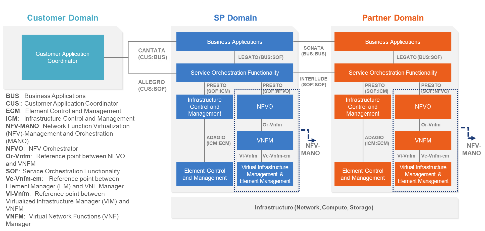
**Figure 1. The LSO Reference Architecture**

Cantata and Sonata IRPs define pre-ordering and ordering operations that allow
automated exchange of information between business applications of the Buyer
(Customer or Service Provider) and Seller (Service Provider or Partner) Domains.
Those are:

- Product Catalog
- Address Validation
- Site Retrieval
- Product Offering Qualification
- Quote
- Product Offering Availability and Pricing Discovery
- Product Inventory
- Product Ordering
- Trouble Ticketing
- Billing

This document focuses on implementation aspects of POQ functionality and is
structured as follows:

- [Section 4](#4-introduction) gives a technical introduction to POQ
  functionality.
- [Section 5](#5-api-description) provides an overview of the operations, data
  models, and design patterns of API definition.
- [Section 6](#6-api-interaction--flows) focuses on API interactions with the
  help of end-to-end sequence diagrams and usage examples.
- [Section 7](#7-api-details) complements Section 5 with an in-depth API
  description.

## 4.1. Description

The Product Offering Qualification (POQ) API allows a Buyer to:

- Determine whether it is feasible for the Seller to deliver a particular
  Product based on a Product Offering with a given configuration to a particular
  place (if applicable).
- Find out alternative Product Offerings if any are available
- Retrieve an overview of existing POQs
- Retrieve details of a specified POQ
- Register for and receive notifications

The API payloads exchanged between a Buyer and the Seller during the POQ
execution consist of product-independent and product-specific parts. The
product-independent part is defined in this standard. The product-specific part
is defined in the product specifications of the concerned product. Both
definitions must be used in combination to validate the correctness of the
requests.
[Section 5.6](#56-integration-of-product-specifications-into-product-offering-qualification-management-api)
explains how to use product-specific definitions with the POQ API definition.

## 4.2. Conventions in the Document

- Code samples are formatted using code blocks. When notation `<< some text >>`
  is used in the payload sample it indicates that a comment is provided instead
  of an example value and it might not comply with the OpenAPI definition.
- Model definitions are formatted as in-line code (e.g. `GeographicAddress`).
- In UML diagrams the default cardinality of associations is `0..1`. Other
  cardinality markers are compliant with the UML standard.
- In the API details tables and UML diagrams required attributes are marked with
  a `*` next to their names.
- In UML sequence diagrams `{{variable}}` notation is used to indicate a
  variable to be substituted with a correct value.

## 4.3. Relation to Other Documents

The requirements and use cases for POQ functionality are defined in Mplify 79.1
[[Mplify79.1](#8-references)]. Product specifications are defined using JSON
Schema (draft 7) standard [[JS](#8-references)], whereas POQ API is defined
using OpenAPI 3.0 standard [[OAS-V3](#8-references)]. The product payloads
exchanged through POQ endpoints must comply with respective product
specifications. This standard is based on TMF 679 API as specified by _TMF679
Product Offering Qualification API REST Specification_
[[TMF679](#8-references)].

## 4.4. Approach

As presented in Figure 2. both Cantata and Sonata API frameworks consist of
three structural components:

- Generic API framework
- Product-independent information (Function-specific information and
  Function-specific operations)
- Product-specific information (Mplify product specification data model)


**Figure 2. Cantata and Sonata API framework**

The essential concept behind the framework is to decouple the common structure,
information and operations from the specific product information content.
Firstly, the Generic API Framework defines a set of design rules and patterns
that are applied across all Cantata or Sonata APIs. Secondly, the
product-independent part of the framework focuses on a model of a particular
Cantata or Sonata functionality and is agnostic to any of the product
specifications. For example, this standard describes Product Offering
Qualification model and operations that allow performing qualifications of any
product that is aligned with one of Mplify or custom product specifications.
Finally, the product-specific information part of the framework focuses on
Mplify product specifications that define business-relevant attributes and
requirements for trading Mplify subscriber and Mplify operator services. This
standard does not define Mplify product specifications, however, can be used
along with any product specification defined by or compliant with Mplify.

## 4.5. High-Level Flow

Product Offering Qualification is part of a broader Cantata and Sonata process
flow. Figure 3. below shows a high-level diagram to get a good understanding of
the process and Product Offering Qualification's position within it.

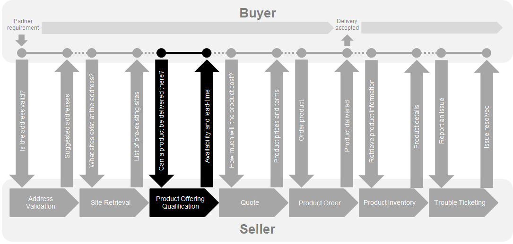

**Figure 3. Cantata and Sonata Flow**

- Address Validation:
  - Allows the Buyer to retrieve address information from the Seller, including
    exact formats, for Geographic Addresses known to the Seller.
- Site Retrieval:
  - Allows the Buyer to retrieve Geographic Site information including exact
    formats for Geographic Sites known to the Seller.
- Product Offering Qualification (POQ):
  - Allows the Buyer to check whether the Seller can deliver a product or set of
    products from among their product offerings at the geographic address or a
    Geographic Site specified by the Buyer; or modify a previously purchased
    product.
- Quote:
  - Allows the Buyer to submit a request to find out how much the installation
    of an instance of a Product Offering, an update to an existing Product, or a
    disconnect of an existing Product will cost.
- Product Order:
  - Allows the Buyer to request the Seller to initiate and complete the
    fulfillment process of an installation of a Product Offering, an update to
    an existing Product, or a disconnect of an existing Product at the address
    defined by the Buyer.
- Product Inventory:
  - Allows the Buyer to retrieve the information about existing Product
    instances from Seller's Product Inventory.
- Trouble Ticketing:
  - Allows the Buyer to create, retrieve, and update Trouble Tickets as well as
    receive notifications about Incidents' and Trouble Tickets' updates. This
    allows managing issues and situations that are not part of normal operations
    of the Product provided by the Seller.

Note that this is not a comprehensive list of APIs available in Cantata and
Sonata IRPs.

This document focuses on the function shown in black. The Buyer asks if a
specific configuration of a Product Offering can be provided at a Geographic
Address or Geographic Site by the Seller. The Seller responds with the technical
feasibility of fulfilling a Product with the lead-time required to complete the
fulfillment. This function is not required to be performed by the Buyer unless
it is mandated by the Seller.

<div class="page"/>

# 5. API Description

This section discusses the API structure and design patterns. It starts with a
description of available REST endpoints. Then, an overview of the API data model
is given together with the description of the extension design pattern that is
used to combine product-agnostic and product-specific parts of API payloads.
Finally, payload validation and API security aspects are discussed.

## 5.1. Pre-Requisites

Prior to establishing an API communication, the Buyer and the Seller need to
agree on the following, during the so-called onboarding process:

- Commercial contract and terms
- Authentication method
- Supported Geographic Address Representations (only when `GeographicAddress.id`
  is not supported)
- Supported response type (Immediate, Deferred, both)
- If the Alternate Product Proposal is of the same Product Specification as the
  Buyer's request
- Notification support

**[R1]** The Seller and the Buyer **MUST** agree on the method used to identify
a place, either by `GeographicAddressRef`, `GeographicSiteRef` or
`GeographicAddress_Query`. [Mplify79.1 R1]

## 5.2. Use cases

Figure 4 presents a use case diagram. It aims to help understand the endpoint
mapping. Use cases are described extensively in
[chapter 6](#6-api-interaction--flows)

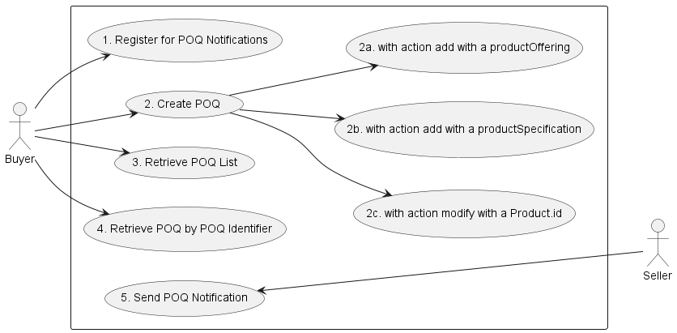

**Figure 4. Use cases**

## 5.3. Resource/endpoint Description

### 5.3.1. Seller Side Endpoints

**Base URL for Cantata**:
`https://{{serverBase}}:{{port}}{{?/seller_prefix}}/mefApi/cantata/productOfferingQualification/v2/`

**Base URL for Sonata**:
`https://{{serverBase}}:{{port}}{{?/seller_prefix}}/mefApi/sonata/productOfferingQualification/v8/`

The following API endpoints are implemented by the Seller and allow the Buyer to
send POQ create requests, retrieve existing POQs or POQ details, and manage
notification registrations. The endpoints and corresponding data model are
defined in
`productApi/serviceability/offeringQualification/productOfferingQualificationManagement.api.yaml`.

| API endpoint                               | Description                                                                                                                                      | Mplify 79.1 Use case Mapping                                   |
| ------------------------------------------ | ------------------------------------------------------------------------------------------------------------------------------------------------ | -------------------------------------------------------------- |
| `POST /productOfferingQualification`       | A request initiated by the Buyer to determine whether the Seller can feasibly deliver a particular Product Offering(s) per desired configuration | UC 2: Create Product Offering Qualification (incl. 2a, 2b, 2c) |
| `GET /productOfferingQualification`        | A request initiated by the Buyer to retrieve a list of POQs from the Seller based on a set of POQ filter criteria.                               | UC 3: Retrieve POQ List                                        |
| `GET /productOfferingQualification/{{id}}` | A request initiated by the Buyer to retrieve full details of a single Product Offering Qualification based on a POQ identifier.                  | UC 4: Retrieve POQ by Identifier                               |
| `POST /hub`                                | A request initiated by the Buyer to instruct the Seller to send notifications of specified type(s)                                               | UC 1: Register for POQ Notifications                           |
| `GET /hub/{{id}}`                          | A request initiated by the Buyer to retrieve the details of the notification subscription.                                                       | UC 1: Register for POQ Notifications                           |
| `DELETE /hub/{{id}}`                       | A request initiated by the Buyer to instruct the Seller to stop sending notifications.                                                           | UC 1: Register for POQ Notifications                           |

**Table 4. Seller side endpoints**

**[R2]** A Buyer **MUST** be able to initiate Use Cases 2a, 2c, and 4.
[Mplify79.1 R2]

**[D1]** A Buyer **SHOULD** be able to initiate Use Case 2b. [Mplify79.1 D1]

**[D2]** A Buyer **SHOULD** be able to initiate Use Case 1 and/or Use Case 3.
[Mplify79.1 D2]

**[R3]** The Seller **MUST** be able to provide an Immediate Response or a
Deferred Response for Use Cases 2a and 2c. [Mplify79.1 R3]

**[CR1]<[D1]** The Seller **MUST** be able to provide an Immediate Response or a
Deferred Response for Use Case 2b. [Mplify79.1 CR1<D1]

**[R4]** If a Deferred Response is provided, the Seller **MUST** support the
ability for the Buyer to register for Notifications (Use Case 1) and to generate
Notifications (Use Case 5) when the Buyer has registered for them. [Mplify79.1
R4]

### 5.3.2. Buyer Side Endpoints

**Base URL for Cantata**:

`https://{{serverBase}}:{{port}}{{?/buyer_prefix}}/mefApi/cantata/productOfferingQualificationNotification/v2/`

**Base URL for Sonata**:

`https://{{serverBase}}:{{port}}{{?/buyer_prefix}}/mefApi/sonata/productOfferingQualificationNotification/v8/`

The following API endpoints are implemented by the Buyer and are used by the
Seller to send POQ-related notifications. The endpoints and corresponding data
model are defined in
`productApi/serviceability/offeringQualification/productOfferingQualificationNotification.api.yaml`

| API endpoint                             | Description                                                                | Mplify 79.1 Use case Mapping |
| ---------------------------------------- | -------------------------------------------------------------------------- | ---------------------------- |
| `POST /listener/poqStateChangeEvent`     | A request initiated by the Seller to notify Buyer on POQ state change      | UC 5: Send POQ Notification  |
| `POST /listener/poqItemStateChangeEvent` | A request initiated by the Seller to notify Buyer on POQ Item state change | UC 5: Send POQ Notification  |

**Table 5. Buyer side endpoints**

## 5.4. Specifying the Buyer ID and the Seller ID

A business entity willing to represent multiple Buyers or multiple Sellers must
follow requirements of [[Mplify 150](#8-references)] chapter 8.8, which states:

> For requests of all types, there is a business entity that is initiating an
> Operation (called a Requesting Entity) and a business entity that is
> responding to this request (called the Responding Entity). In the simplest
> case, the Requesting Entity is the Buyer, and the Responding Entity is the
> Seller. However, in some cases, the Requesting Entity may represent more than
> one Buyer and similarly, the Responding Entity may represent more than one
> Seller.

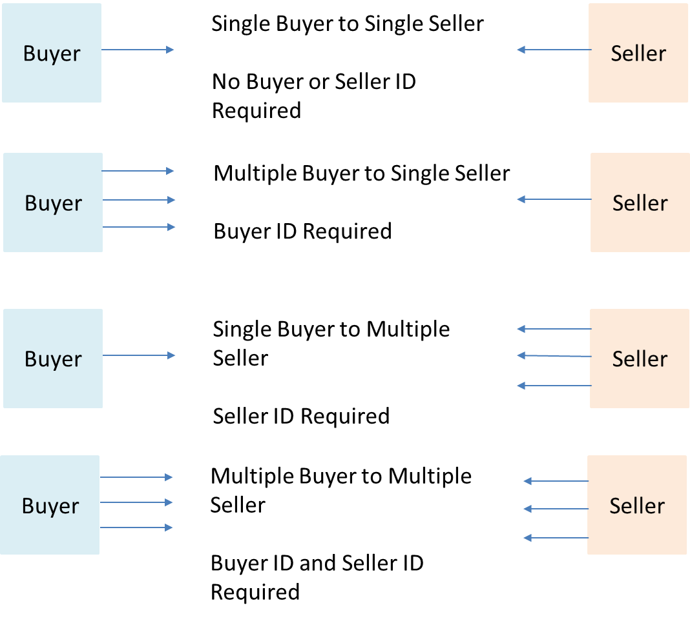

**Figure 5. Buyer ID and Seller ID Examples**

> As shown in Figure 5, if a Requesting Entity representing a single Buyer is
> doing business with a Responding Entity representing a single Seller, Buyer
> and Seller IDs are not required to be passed between the two entities. If a
> Requesting Entity representing more than one Buyer is doing business with a
> Responding Entity representing a single Seller, the Buyer ID is required to be
> passed between the two entities. If a Requesting Entity representing a single
> Buyer is doing business with a Responding entity representing multiple
> Sellers, the Seller ID is required to be passed between the two entities. If a
> Requesting Entity representing multiple Buyers is doing business with a
> Responding Entity representing multiple Sellers, both the Buyer ID and the
> Seller ID are required to be passed between the entities.
>
> While it is outside the scope of this specification, it is assumed that the
> Requesting Entity and the Responding Entity are aware of each other and can
> authenticate requests initiated by the other party. It is further assumed that
> the Requesting Entity knows:
>
> - the list of Buyers the Requesting Entity represents when interacting with
>   this Responding Entity; and
> - the list of Sellers that this Responding Entity represents to this
>   Requesting Entity.
>
> It is also assumed that the Responding Entity knows:
>
> - the list of Sellers that this Responding Entity represents to this
>   Requesting Entity and
> - the list of Buyers the Requesting Entity represents when interacting with
>   this Responding Entity.

In the API the `buyerId` and `sellerId` are represented as optional query
parameters in each operation defined.

**[R5]** If the Requesting Entity has the authority to represent more than one
Buyer the request **MUST** include `buyerId` that identifies the Buyer being
represented. [Mplify150 R62]

**[R6]** If the Responding Entity represents more than one Seller to this Buyer
the request **MUST** include `sellerId` that identifies the Seller with whom
this request is associated. [Mplify150 R63]

## 5.5. Data Model - Key Entities

The sections below describe the most important entities (aka data types) from
the data model which can be found in the API specification (definitions
section). Each entity is a simple or composed type (using the `allOf` keyword
for data types composition). A simple type defines a set of properties that
might be of an object, primitive, or reference type.

**[R7]** If an entity is used in the request or response payload all properties
marked as required **MUST** be provided.

A detailed description of the data types is provided in
[Section 7](#7-api-details) and the OpenAPI definition. The examples that
illustrate the usage of the data model are included in
[Section 6](#6-api-interaction--flows).

### 5.5.1. Request Key Entities

Figure 6 depicts a view of the data model that is used in the Product Offering
Qualification request (`POST /productOfferingQualification`) that is sent by a
Buyer (see [Section 5.3.1](#531-seller-side-endpoints) for details).

`ProductOfferingQualification_Create` is the root entity of a product offering
qualification request. It contains one or more
`ProductOfferingQualificationItem_Create`. A POQ item defines an item inquiry
details (in `MEFProductRefOrValue` structure) and allows for the definition of
related contact information (`relatedContactInformation`) or relations to other
items (`qualificationItemRelationship`). `MEFProductRefOrValue` allows for the
introduction of Mplify product-specific properties to the POQ payload. The
extension mechanism is described in detail in
[Section 5.6.](#56-integration-of-product-specifications-into-product-offering-qualification-management-api).
Also, a `MEFProductRefOrValue.place` may be used to specify relations to
place(s) or/and `MEFProductRefOrValue.productRelationship` to specify relations
product that exists in the Seller's inventory.

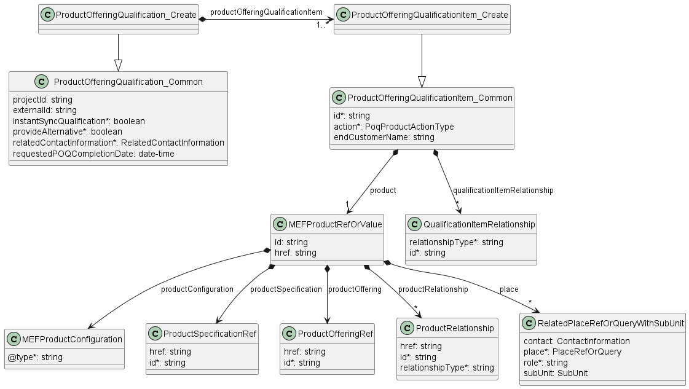

**Figure 6. Data model - request key entities**

### 5.5.2. Response Key Entities

Figure 7 depicts a view of the data model that is used to provide a response to
a Buyer's Product Offering Qualification request
(`POST /productOfferingQualification`) or to retrieve POQ by an identifier
(`GET /productOfferingQualification/{{id}}`).

`ProductOfferingQualification` is the root entity of a response and it is
managed by the Seller. `ProductOfferingQualification` extends
`ProductOfferingQualification_Common` (which represents Buyer's request) with a
number of attributes, i.e. unique identifier or state information.

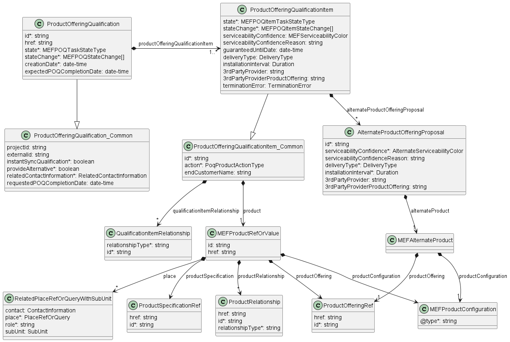

**Figure 7. Data model - response key entities**

### 5.5.3. Product Offering Qualification Process Flow

This chapter specifies the POQ process states and possible transitions.

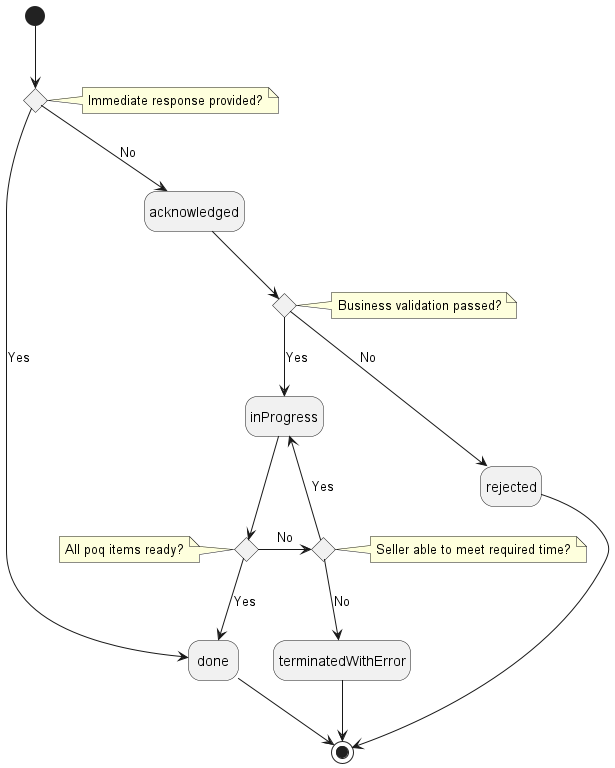

**Figure 8. Product Offering Qualification Process Flow**

Table 6 presents detailed descriptions of states and mapping between
`MEFPOQTaskStateType` and Mplify 79.1.

| MEFPOQTaskStateType | Mplify 79.1         | Description                                                                                                                                                                                                               |
| ------------------- | ------------------- | ------------------------------------------------------------------------------------------------------------------------------------------------------------------------------------------------------------------------- |
| acknowledged        | ACKNOWLEDGED        | A request has been received by the Seller, has passed basic validation, and the id was assigned. For an Immediate response, the POQ moves directly to the `done` state and does not pass through `acknowledged`.          |
| inProgress          | IN_PROGRESS         | The POQ is currently being worked by the Seller.                                                                                                                                                                          |
| done                | READY               | The POQ has been internally approved by the Seller. Reached when all items are in a `done` state. It does not imply that the Seller can deliver all POQ Items in this POQ. It only means that the POQ has been completed. |
| rejected            | REJECTED            | A POQ was submitted, and it has failed at least one of the business validation checks the Seller performs after it reached the `acknowledged` state.                                                                      |
| terminatedWithError | UNABLE_TO_MEET_TIME | The Seller is unable to provide a response in the timeframe required by the Buyer (e.g. if an immediate response or a response date is set but cannot be met by the Seller).                                              |

**Table 6. Product Offering Qualification States**

If a POQ request does not pass an initial (syntax) validation the appropriate
error response is returned to the Buyer. In case a POQ request fails business
rules validation the HTTP response code is `422` and a list of validation
problems is returned. Otherwise, the POQ is assigned a unique identifier. In
case of a deferred response, the POQ gets the `acknowledged` state assigned and
is returned in the response. In case of an immediate response, the POQ moves
directly to `done` once the processing is done. POQ reaches the `done` state
only if all items are in the `done` state as well. If an evaluation of any items
concludes in the state `rejected` the POQ reaches the `rejected` state. If the
POQ is processed asynchronously (Deferred Response) it can reach
`terminatedWithError` if the Seller is not able to complete all items
qualification by the deadline specified by the Buyer in
`requestedPOQCompletionDate`.

**[R8]** If the Seller provides an Immediate Response, the Seller **MUST**
support POQ `done` state and its associated state transitions as specified in
Figure 8. [Mplify79.1 R94]

**[R9]** If the Seller provides a Deferred Response, the Seller **MUST** support
all POQ States and their associated state transitions as specified in Figure 8.
[Mplify79.1 R95]

**[R10]** The state of the POQ **MUST** be `done` only if _all_ items are in
`done` state. [Mplify79.1 R97]

**[R11]** The state of the POQ **MUST** be `terminatedWithError` when _at least
one_ item is in the `terminatedWithError` state.

**[R12]** The state of the POQ **MUST** be `rejected` when _at least one_ item
is in a `rejected` state.

**[R13]** When the POQ state moves to `terminatedWithError` or `rejected` or all
POQ Items that are not `done` **MUST** move to `done.abandoned`. [Mplify79.1
R102]

**[R14]** The state of the POQ **MUST** be `inProgress` only if _at least one_
item is in the `inProgress` state and _none_ of the items is in
`terminatedWithError` or `rejected` state. [Mplify79.1 R98]

### 5.5.4. Product Offering Qualification Item Process Flow

Figure 9. depicts a process flow for a POQ Item lifecycle.

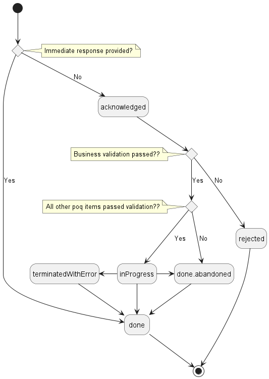

**Figure 9. POQ Item Process Flow**

Table 7 presents detailed descriptions of states and mapping between
`MEFPOQItemTaskStateType` and Mplify 79.1.

| MEFPOQItemTaskStateType | Mplify 79.1         | Description                                                                                                                                                                                                                                                                                      |
| ----------------------- | ------------------- | ------------------------------------------------------------------------------------------------------------------------------------------------------------------------------------------------------------------------------------------------------------------------------------------------ |
| acknowledged            | ACKNOWLEDGED        | A request has been received by the Seller and has passed basic validation. For an Immediate response, the POQ moves directly to the `done` state and does not pass through `acknowledged`.                                                                                                       |
| inProgress              | IN_PROGRESS         | The Seller is working on a POQ item response and the answer is not ready yet                                                                                                                                                                                                                     |
| done.abandoned          | ABANDONED           | Applied to a POQ Item in case the final state is not reached and POQ is moved to the final state other than `done`                                                                                                                                                                               |
| done                    | READY               | The POQ Item has been internally approved by the Seller. This state does not imply that the Seller is able to deliver the requested item. It only means that the response for this POQ Item is complete.                                                                                         |
| rejected                | REJECTED            | A POQ Item has failed the business validation checks the Seller performs after it reaches the `acknowledged` state.                                                                                                                                                                              |
| terminatedWithError     | UNABLE_TO_MEET_TIME | The Seller is unable to provide a POQ Item response in the timeframe required by the Buyer (e.g. if an immediate response or a response date is set but cannot be met by the Seller). When a POQ Item goes to `terminatedWithError`, all POQ Items that are not `done` move to `done.abandoned`. |

**Table 7. Product Offering Qualification Item States**

In the Immediate Response, if successful, the POQ item goes directly to `done`
state. In the case of a Deferred Response, `acknowledged` is the initial state
of an item. The item reaches `inProgress` once the Seller starts processing it.
If there is any other item that reaches the `terminatedWithError` or `rejected`
state the currently processed or not yet processed items are abandoned
(`done.abandoned`). If the Seller was able to successfully complete the
processing of the item the `done` state is assigned.

**[R15]** If the Seller provides an Immediate Response, the Seller **MUST**
support POQ Item `done` state and its associated state transitions as specified
in Figure 9. [Mplify79.1 R100]

**[R16]** If the Seller provides a Deferred Response, the Seller **MUST**
support all POQ Item States and their associated state transitions as specified
in Figure 9. [Mplify79.1 R101]

Table 8 presents the dependencies between the POQ state and the POQ Item state.
The header represents the POQ state and the rows represent the POQ Item state.

| POQ Item state \ POQ state | `acknowledged` | `inProgress`          | `done` | `rejected`            | `terminatedWithError` |
| -------------------------- | -------------- | --------------------- | ------ | --------------------- | --------------------- |
| `done.abandoned`           | 0              | 0                     | 0      | 0 OR MORE BUT NOT ALL | 0 OR MORE             |
| `acknowledged`             | ALL            | 0 OR MORE BUT NOT ALL | 0      | 0                     | 0                     |
| `inProgress`               | 0              | 1 OR MORE             | 0      | 0                     | 0                     |
| `done`                     | 0              | 0 OR MORE BUT NOT ALL | ALL    | 0 OR MORE BUT NOT ALL | 0 OR MORE BUT NOT ALL |
| `rejected`                 | 0              | 0                     | 0      | 1 OR MORE             | 0                     |
| `terminatedWithError`      | 0              | 0                     | 0      | 0                     | 1 OR MORE             |

**Table 8. POQ State to POQ Item State Dependency Matrix**

**[R17]** The POQ na POQ Item state interactions **MUST** must follow rules
defined in Table 8. [Mplify79.1 R99]

### 5.5.5. Providing the place information

When required by product specification, the Buyer must point to the place where
the Product is to be provided. This is done with the use of the POQ Item's
attribute: `product.place` of type `RelatedPlaceRefOrQueryWithSubUnit`, which is
presented in Figure 10.

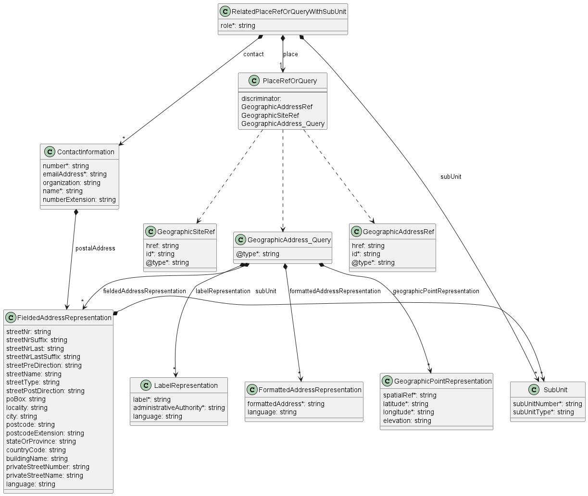

**Figure 10. Data model - referring to a place**

The `role` defines the function that the place plays for a given Product. The
name of the role to be provided is strictly defined by the product
specification. Usually, it is `INSTALL_LOCATION`.

`contact` provides additional information about the person to contact to get
access to this place in case such access is required to complete the evaluation
of this POQ Item.

`place` is where the actual place is pointed. The attribute is of type
`PlaceRefOrQuery` which is an abstract class that can be of one of three types:
`GeographicAddressRef`, `GeographicSiteRef`, or `GeographicAddress_Query`. The
first two are simple identifiers to reference a `GeographicAddress` or
`GeographicSite` respectively. The Buyer usually first validates the
`GeographicAddress` and gets its identifier from the Seller and then optionally
retrieves `GeographicSite` information for that address. In the unlikely case
that the Seller does not provide the Address Validation API and the Buyer is not
able to obtain the address identifier in any other way, the
`GeographicAddressQuery` type might be used. It contains lists of Geographic
Address Representations to provide the address information by value. There are
four types of Geographic Address Representations:

- `FieldedAddressRepresentation`
- `FormattedAddressRepresentation`
- `LabelRepresentation`
- `GeographicPointRepresentation`

The Buyer may use one or more of these representations to describe a single
desired place. The Buyer must provide sufficient clarity that allows the Seller
to match to precisely one place. For this reason, the success rate of POQs is
significantly better when identifiers are used.

In case when there is no desired `GeographicSite` object in the Seller's system,
or `GeographicAddress` precision is not sufficient, the Buyer may use the
`subUnit` attribute to provide more detailed information about the precise
location of the installation. This information may be used by the Seller to
create an instance of a `GeographicSite` with the same `subUnit` attribute
value.

The `GeographicAddress` model together with its above-mentioned representations
and respective requirements are defined by [Mplify 121.1](#8-references)
(chapter 5.3). That standard is the owner of those definitions. This API
specification contains a model of `GeographicAddress` but does not define it.
Any further changes of these types will update the API specification, but will
not be reflected in this document.

The mandatory `@type` attribute of `GeographicSiteRef`, `GeographicAddressRef`
and `GeographicAddress_Query` is used as a discriminator to unambiguously
identify the intended type when using in the context of the `oneOf` section of
`PlaceRefOrQuery` type.

## 5.6. Integration of Product Specific Attributes

Product specifications are defined using JsonSchema format and are integrated
into a POQ payload using a standard TMF extension pattern.

The extension hosting type in the API data model is `MEFProductConfiguration`.
The `@type` attribute of that type must be set to a value that uniquely
identifies the product specification. A unique identifier for Mplify standard
product specifications is in URN format and is assigned by Mplify. This
identifier is provided as root schema `$id` and in product specification
documentation. Use of non-Mplify standard product definitions is allowed. In
such a case, the schema identifier must be agreed between the Buyer and the
Seller.

The example below shows a header of a Product Specification schema, where
`"$id": urn:mef:lso:spec:sonata:access-eline-ovc:v5.0.0:all` is the
above-mentioned URN:

```yaml
'$schema': http://json-schema.org/draft-07/schema#
'$id': urn:mef:lso:spec:sonata:access-eline-ovc:v5.0.0:all
title: MEF LSO Sonata - Access Eline OVC Product Schema
```

Product specifications are provided as Json schemas without the
`MEFProductConfiguration` context.

Product-specific attributes can be introduced into `MEFProductRefOrValue`
(defined by the Buyer) or into `AlternateProductOfferingProposal` (may be
defined by the Seller while responding to POQ) using `MEFAlternateProduct`. Each
of these types introduces the `productConfiguration` attribute of type
`MEFProductConfiguration` which is used as an extension point for
product-specific attributes.

Implementations might choose to integrate selected product specifications to the
data model during development. In such cases an integrated data model is built
and product specifications are in an inheritance relationship with
`MEFProductConfiguration` as described in OAS specification. This pattern is
called **Static Binding**. The SDK is additionally shipped with a set of API
definitions that statically bind all product-related APIs (POQ, Quote, Order,
Inventory) with all corresponding product specifications available in the
release. The snippets below present an example of a static binding of the POQ
API with a number of Mplify product specifications, from both
`MEFProductConfiguration` and product specification point of view:

```yaml
MEFProductConfiguration:
  description:
    MEFProductConfiguration is used as an extension point for MEF-specific
    product/service payload.  The `@type` attribute is used as a discriminator
  discriminator:
    mapping:
      urn:mef:lso:spec:sonata:carrier-ethernet-operator-uni:v5.0.0:all: '#/components/schemas/CarrierEthernetOperatorUni'
      urn:mef:lso:spec:sonata:access-eline-ovc:v5.0.0:all: '#/components/schemas/AccessElineOvc'
    propertyName: '@type'
  properties:
    '@type':
      description:
        The name of the type, defined in the JSON schema specified above, for
        the product that is the subject of the POQ Request. The named type must
        be a subclass of MEFProductConfiguration.
      type: string
```

```yaml
AccessElineOvc:
  allOf:
    - $ref: '#/components/schemas/MEFProductConfiguration'
    - $ref: '#/components/schemas/AccessElineOvcCommon'
    - properties:
        uniEp:
          $ref: '#/components/schemas/AccessElineOvcEndPoint'
          description:
            MEF 26.2 sec. 16 - The OVC EP object for the OVC EP at the UNI. The
            UNI OVC End Point must be included in the Access E-Line Product.
        enniEp:
          $ref: '#/components/schemas/AccessElineOvcEndPoint'
          description:
            MEF 26.2 sec. 16 - The OVC EP object for the OVC EP at the ENNI. The
            ENNI OVC End Point must be included in the Access E-Line Product.
```

Alternatively, implementations might choose not to build an integrated model and
choose different mechanisms allowing runtime validation of product-specific
fragments of the payload. The system is able to validate given product against a
new schema without redeployment. This pattern is called **Dynamic Binding.**

Regardless of the chosen implementation pattern, the HTTP payload is exactly the
same. Both implementation approaches must conform to the requirements specified
below.

**[R18]** `MEFProductConfiguration` type is an extension point that **MUST** be
used to integrate product specifications' properties into a request/response
payload.

**[R19]** The `@type` property of `MEFProductConfiguration` **MUST** be used to
specify the type of the extending entity.

**[R20]** Product attributes specified in the payload must conform to the
product specification indicated by the `@type` property.

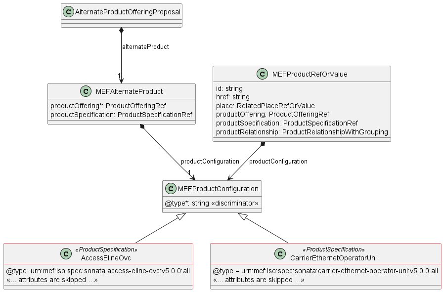

**Figure 11. The Extension Pattern**

Figure 11 depicts two Mplify `<<ProductSpecifications>>` that represent Access
E-Line and Operator UNI products. When these products are used in the POQ
payload the `@type` of `MEFProductConfiguration` takes
`"urn:mef:lso:spec:sonata:access-eline-ovc:v5.0.0:all"` or
`"urn:mef:lso:spec:sonata:carrier-ethernet-operator-uni:v5.0.0:all"` value to
indicate which product specification should be used to interpret a set of
product-specific attributes included in the payload.

The _all_ suffix after the product type name in the URN comes from the approach
that the product schemas may differ depending on the API they are used with.
`all` means that this schema is applicable to all contexts.

This document uses samples of Access E-Line Product specification definitions to
construct API payload examples in [Section 6](#6-api-interaction--flows).

**_Note:_** The Access E-Line product is valid only in the Sonata context. It is
used only for the explanation of the rules of combining the product-agnostic
(envelope) and product-specific (payload) parts of the APIs. The examples do not
represent full and consistent product configurations, they are not normative and
are not kept up to date with their respective standards. It is out of the scope
of this document to explain the details of any product.

## 5.7. Model Structural Validation

The structure of the HTTP payloads exchanged via POQ API endpoints is defined
using:

- OpenAPI version 3.0 for the product-agnostic part of the payload
- JsonSchema (draft 7) for the product-specific part of the payload

**[R21]** Implementations **MUST** use payloads that conform to these
definitions.

**[R22]** The Buyer and the Seller **MUST NOT** use any operation, entity or
attribute that is not explicitly defined or allowed by this standard.

**[R23]** The API payloads **MUST** conform to any consistency rules and
requirements defined by respective Product Specifications.

These are defined for:

- relations to other items in the same product offering qualification request
  (e.g. required relation type, multiplicity)
- relations to entities from the inventory managed by the Seller
- related contact information that is to be defined at an item level
- relations to places (locations) that are to be defined at an item level

## 5.8. Security Considerations

There must be an authentication mechanism whereby a Seller can be assured who a
Buyer is and vice-versa. There must also be authorization mechanisms in place to
control what a particular Buyer or Seller is allowed to do and what information
may be obtained. However, the definition of the exact security mechanism and
configuration is outside the scope of this document. Security considerations are
standardized by _LSO API Security Profile_ [[MEF 128.1](#8-references)].

<div class="page"/>

# 6. API Interaction & Flows

This section discusses the most important aspects of end-to-end interactions
that result in completed product qualification inquiries. It starts with a
description of product specifications which are used in the remainder of the
section in example payloads. Then the end-to-end flows are presented for the
immediate and deferred interaction patterns. Next, the structure of the POQ
request and response is described. This part highlights different variants of
POQ interactions for different item action types, place definitions, and
alternative responses. Finally, the mechanism of notifications is discussed.

## 6.1. Sample Product Specification

The Sonata SDK contains product specification definitions, from which Access
E-Line [[MEF 106](#8-references)] is used in the payload samples in this
section. They are located in the SDK at:

`\productSchema\carrierEthernet\operatorEthernet\accessEline\accessElineOvc.yaml`
`\productSchema\carrierEthernet\operatorEthernet\carrierEthernetOperatorUni\carrierEthernetOperatorUni.yaml`

Figure 12 depicts a simplified view of the defined relationships with other
products and places.


**Figure 12. A simplified view of Product and Place Relationships**

Product specifications define a number of product-related and envelope-related
requirements. Sample envelope-related requirements for Access E-Line:

- for an Access E-Line OVS product two mandatory relationship roles must be
  specified, one with the operator ENNI (`CONNECTS_TO_ENNI`) and a second with
  the operator UNI (`CONNECTS_TO_UNI`).
- in the case of a `modify` action, product relationships must have the same
  value as in the `add` action. They must not be changed
- for an operator UNI product a place relationship (`INSTALL_LOCATION`) must be
  specified
- in the case of a `modify` action, place relationships must have the same value
  as in the `add` action. They must not be changed

The product relationship (`product.productRelationship`) and the place
relationship (`product.place`) are presented in Figure 12.

In case some of both product-related or envelope-related requirements are
violated the Seller returns an error response to the Buyer which indicates
specific functional errors. These errors are listed in the response body (a list
of `Error422` entries) for HTTP `422` response.

## 6.2. Interaction Patterns

To complete the POQ inquiry three interaction patterns can be used depending on
Buyer/Seller side capabilities.

**[R24]** When providing responses to the API calls the Buyer and the Seller
**MUST** provide relevant HTTP Response codes. [Mplify79.1 R8], [Mplify79.1
R27], [Mplify79.1 R36], [Mplify79.1 R54], [Mplify79.1 R63], [Mplify79.1 R77],
[Mplify79.1 R83]

**_Note_**: The term "Seller Response Code" used in the Business Requirements
maps to HTTP response code, where `2xx` indicates _Success_ and `4xx` or `5xx`
indicate _Failure_.

### 6.2.1. Immediate Response

Immediate response can be requested by a Buyer using `instantSyncQualification`
flag set to `true`. In case of successful processing, the Seller will respond
with POQ in a `done` state (indicating success). Otherwise, the appropriate
error code and description are returned in case the payload doesn't pass initial
validation. Please note that the `terminatedWithError` state is not supported in
the immediate response case. It is only used during the Deferred Response
pattern when the Seller is unable to provide a response in the time frame
required by the Buyer.

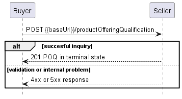

**Figure 13. Immediate response**

### 6.2.2. Deferred Response with Polling

A deferred response can be requested by a Buyer using `instantSyncQualification`
flag set to `false`. The Seller responds with partial `POQ` (including at least
`id` and `state=acknowledged`) and starts processing the request asynchronously.
The Buyer polls the POQ until the final status is reached by the POQ using the
POQ identifier specified by the Seller in response.

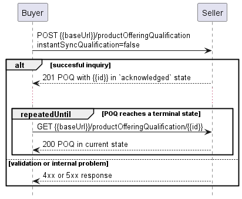

**Figure 14. Deferred response with polling**

### 6.2.3. Deferred Response with Notifications

In this variant of the deferred response, the notifications mechanism is used.
First, the Buyer registers for notifications providing a callback endpoint. Then
the Buyer requests for qualification. The Seller sends notifications on POQ and
POQ Item State changes until the final POQ status is reached.

When the Buyer registers for POQ notifications this registration will be valid
until the Buyer unsubscribes from the POQ notifications. This implies that for
any POQ request the Buyer sends to the Seller, and for which they request a
Deferred Response, in the time frame between the registration for the POQ
notifications and unsubscribing from the same POQ notifications by the Buyer,
the Seller will have to inform the Buyer of changes using the POQ notifications.

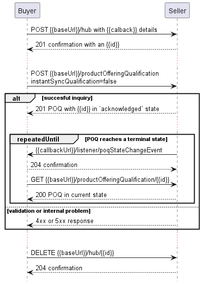

**Figure 15. Deferred response with notifications**

## 6.3. Use Case 2: Create Product Offering Qualification

To send a POQ request a Buyer must use createProductOfferingQualification
operation (`POST {{baseUrl}}/productOfferingQualification`) which represents Use
Case 2 (including sub-use cases). In the remainder of this section, some of the
POQ payloads attributes might be omitted to simplify examples' content. The full
list of attributes is available in [Section 7](#7-api-details) and in the API
specification which is an integral part of this standard. Use cases 2a, 2b, and
2c differ in the details on the POQ Item level, so first the common POQ level
will be described, and the the item level for each use case.

The sub-use cases of Use Case 2 are as follows:

- 2a: Create POQ Item with `action=add` and referring a particular Product
  Offering (`product.productOffering`)
- 2b: Create POQ Item with `action=add` and providing only Product Specification
  (`product.productSpecification`)
- 2c: Create POQ Item with `action=modify`, referring existing product to modify
  by providing `product.id`.

The Buyer uses 2a when they know exactly the Product Offering they want to
order. Use Case 2b allows the Buyer only to provide the Product Specification to
receive the Product Offering(s) from the Seller.

### 6.3.1. Buyer Create POQ Request

Here is the example of the Buyer's Create POQ request. It allows deferred
response to be provided by `2024-11-06T09:36:05.668Z`. It requests the
qualification of the creation of 2 products: Access E-Line OVC and Carrier
Ethernet Operator UNI, and provides all required relationships, as described in
Figure 12.

The Buyer also requests providing alternative proposals
(`provideAlternative=true`).

The Access E-Line Product Offering is identified as `000073` in the Seller's
Product Catalog. This specification describes the structure and requirements
defined for this product which should be validated. An Access E-Line product
specification defines two mandatory relationship types that have to be
specified: `CONNECTS_TO_ENNI` and `CONNECTS_TO_UNI`. This Access E-Line product
references an existing ENNI product that is uniquely identified with id
`SP1_ENNI` in the Seller's inventory. The reference to a UNI product might use
another POQ item or an existing product from the Seller's Product Inventory.
This example assumes that the UNI product is another item of the POQ request
with a unique identifier `item-002`.

The place is not provided as the Access E-Line product specification does not
allow for a place description to be part of the request. Values for some of the
available product attributes are provided under the `productConfiguration` node.
This example uses a subset of available Access E-Line attributes.

The UNI product refers to Product Offering with `id=000074` and provides the
required `place` relationship with `role=INSTALL_LOCATION` and referencing an
address by an identifier with `GeographicAddressRef`.

```json
{
  "instantSyncQualification": false,
  "requestedPOQCompletionDate": "2024-11-12T09:36:05.668Z",
  "provideAlternative": true,
  "externalId": "BuyerPoq-00001",
  "projectId": "BuyerProjectX",
  "relatedContactInformation": [
    {
      "emailAddress": "john.example@buyer.mef.com",
      "name": "John Example",
      "number": "12-345-6789",
      "numberExtension": "1234",
      "organization": "Buyer Co.",
      "role": "buyerContactInformation"
    }
  ],
  "productOfferingQualificationItem": [
    {
      "id": "item-001",
      "action": "add",
      "product": {
        "productOffering": {
          "id": "000073"
        },
        "productConfiguration": {
          "@type": "urn:mef:lso:spec:sonata:access-eline-ovc:v5.0.0:all",
          "ceVlanIdPreservation": "PRESERVE",
          "maximumFrameSize": 1526,
          "listOfClassOfServiceNames": ["low"],
          "enniEp": {
            "identifier": "SP1_ENNI-EP1",
            "ingressClassOfServiceMap": {
              "mapType": "ENDPOINT",
              "map_M": "low",
              "l2cp_P": {
                "l2cpIdentifier": {
                  "l2cpProtocolType": "LLC",
                  "llcAddressOrEtherType": 66
                },
                "l2cpCosName": "low"
              }
            }
          },
          "uniEp": {
            "identifier": "NewYork_UNI-EP1",
            "ingressBandwidthProfilePerClassOfServiceName": [
              {
                "classOfServiceName": "low",
                "bwpFlow": {
                  "cir": {
                    "irValue": 0,
                    "irUnits": "MBPS"
                  },
                  "cirMax": {
                    "irValue": 0,
                    "irUnits": "MBPS"
                  },
                  "eir": {
                    "irValue": 10,
                    "irUnits": "GBPS"
                  },
                  "eirMax": {
                    "irValue": 10,
                    "irUnits": "GBPS"
                  }
                }
              }
            ],
            "ingressClassOfServiceMap": {
              "mapType": "ENDPOINT",
              "map_M": "low",
              "l2cp_P": {
                "l2cpIdentifier": {
                  "l2cpProtocolType": "LLC",
                  "llcAddressOrEtherType": 66
                },
                "l2cpCosName": "low"
              }
            }
          }
        },
        "productRelationship": [
          {
            "relationshipType": "CONNECTS_TO_ENNI",
            "id": "SP1_ENNI"
          }
        ]
      },
      "qualificationItemRelationship": [
        {
          "relationshipType": "CONNECTS_TO_UNI",
          "id": "item-002"
        }
      ]
    },
    {
      "id": "item-002",
      "action": "add",
      "product": {
        "productOffering": {
          "id": "000074"
        },
        "place": [
          {
            "place": {
              "@type": "GeographicAddressRef",
              "id": "NewYorkAddress-id-1"
            },
            "role": "INSTALL_LOCATION",
            "contact": [
              {
                "number": "+12-345-678-90",
                "emailAddress": "LocationContact@buyer.mef.com",
                "name": "Location Contact"
              }
            ]
          }
        ],
        "productConfiguration": {
          "@type": "urn:mef:lso:spec:sonata:carrier-ethernet-operator-uni:v5.0.0:all",
          "defaultCeVlanId": 4094,
          "maximumNumberOfEndPoints": 6,
          "lagLinkMeg": "DISABLED",
          "linkAggregation": "NONE",
          "tokenShare": "ENABLED",
          "maximumServiceFrameSize": 1522,
          "listOfPhysicalLinks": [
            {
              "id": "01",
              "physicalLink": "10GBASE_SR",
              "uniConnectorGender": "SOCKET",
              "synchronousEthernet": "ENABLED",
              "uniConnectorType": "SC",
              "precisionTiming": "DISABLED"
            }
          ]
        }
      }
    }
  ]
}
```

**[R25]** The Buyer **MUST** specify following attributes: [Mplify79.1 R9],
[Mplify79.1 R12]

- `instantSyncQualification`
- `provideAlternative`
- `relatedContactInformation` with an item with `role=buyerContactInformation`
- at least one `productOfferingQualificationItem`

**[R26]** For Use Case 2b the Buyer **MUST** specify `provideAlternative`
attribute as `true`. [Mplify79.1 R10]

**[R27]** The Buyer **MUST** specify following attributes of
`RelatedContactInformation`: [Mplify79.1 R22]

- `emailAddress`
- `name`
- `number`
- `role`

During the onboarding, the Seller may require to provide an additional contact
`role`.

**_Note:_** It is up to Seller's discretion on how to react in case the Buyer
provides a contact `role` that is not listed by this standard or agreed upon
during the onboarding. Preferably the Seller should return an error with a
message stating which `roles` are accepted. It may also be ignored.

**[R28]** The `requestedPOQCompletionDate` **MUST** be specified when
`instantSyncQualification=false`, [Mplify79.1 R11]

**[R29]** The Buyer **MUST** specify following attributes of
`productOfferingQualificationItem`: [Mplify79.1 R17], [Mplify79.1 R48]

- `id`
- `action`
- `product.productConfiguration`

**[R30]** A relationship between the POQ Item and an already activated Product
**MUST** use the `productRelationship` attribute to detail the relationship.
[Mplify79.1 R23], [Mplify79.1 R50]

**[R31]** When specifying the `productRelationship`, the Buyer **MUST** provide
following attributes`: [Mplify79.1 R25], [Mplify79.1 R52]

- `id`
- `relationshipType`

**[R32]** A relationship between the POQ Item and other POQ Items **MUST** use
the `qualificationItemRelationship` attribute to detail the relationship.
[Mplify79.1 R24], [Mplify79.1 R51]

**[R33]** When specifying the `qualificationItemRelationship`, the Buyer
**MUST** provide following attributes`: [Mplify79.1 R26], [Mplify79.1 R53]

- `id`
- `relationshipType`

Some Product Specifications allow providing a list of related products even for
relationship types whose final cardinality is 1. These act like a list of
candidates. For example, the Buyer may include a list of ENNIs between the Buyer
and Seller as related Products. The ENNIs in the list might need to all be in
the same Geographic Area as defined by the Seller (same city, same county,
etc.). The Seller uses any of the ENNIs in the list to respond to the POQ
Request.

**[R34]** If the Product Specification mandates a Place, the `product.place`
**MUST** be used to detail the place relationship. [Mplify79.1 R18]

**[R35]** When specifying the `product.place`, the Buyer **MUST** provide the
following attributes: [Mplify79.1 R19]

- `place`
- `role`
- `contact`

**[O1]** When specifying the `product.place`, with `GeographicAddressRef` or
`GeographicAddress_Query` the Buyer **MAY** additionally provide `subUnit`to
describe exactly where the Buyer wants the Product to be installed. [Mplify79.1
O4]

**[R36]** When specifying the `ContactInformation`, the Buyer **MUST** provide
following attributes`: [Mplify79.1 R22]

- `emailAddress`
- `name`
- `number`

#### 6.3.1.1. Request for `add` action

Requirements in this section apply to the Buyer providing
`productOfferingQualificationItem` with the `add` action.

**[R37]** If `action=add` the Buyer **MUST** provide exactly one of
`product.productOffering` (Use Case 2a) or `product.productSpecification` (Use
Case 2b). [Mplify79.1 R17]

**[R37]** If `action=add` the Buyer **MUST NOT** provide `product.id`.

#### 6.3.1.2. Request for `modify` action

Requirements in this section apply to the Buyer requesting the `modify` action.

The example below represents a single POQ request item to evaluate a
modification of an existing (action `modify`) Access E-Line product. The product
is referred to with `id=AccessElineOVC-0001` and a new full `product`
representation. The desire is to set the `cir` (Committed Information Rate) from
`0 GBPS` to `1 GBPS` so that the Buyer can have 1 GBPS of the bandwidth
guaranteed.

```json
{
  "id": "item-001",
  "action": "modify",
  "product": {
    "id": "AccessElineOVC-0001",
    "productOffering": {
      "id": "000073"
    },
    "productConfiguration": {
      "@type": "urn:mef:lso:spec:sonata:access-eline-ovc:v5.0.0:all",
      "ceVlanIdPreservation": "PRESERVE",
      "maximumFrameSize": 1526,
      "listOfClassOfServiceNames": ["low"],
      "enniEp": {
        "identifier": "SP1_ENNI-EP1",
        "ingressClassOfServiceMap": {
          "mapType": "ENDPOINT",
          "map_M": "low",
          "l2cp_P": {
            "l2cpIdentifier": {
              "l2cpProtocolType": "LLC",
              "llcAddressOrEtherType": 66
            },
            "l2cpCosName": "low"
          }
        }
      },
      "uniEp": {
        "identifier": "NewYork_UNI-EP1",
        "ingressBandwidthProfilePerClassOfServiceName": [
          {
            "classOfServiceName": "low",
            "bwpFlow": {
              "cir": {
                "irValue": 1,
                "irUnits": "GBPS"
              },
              "cirMax": {
                "irValue": 1,
                "irUnits": "GBPS"
              },
              "eir": {
                "irValue": 10,
                "irUnits": "GBPS"
              },
              "eirMax": {
                "irValue": 10,
                "irUnits": "GBPS"
              }
            }
          }
        ],
        "ingressClassOfServiceMap": {
          "mapType": "ENDPOINT",
          "map_M": "low",
          "l2cp_P": {
            "l2cpIdentifier": {
              "l2cpProtocolType": "LLC",
              "llcAddressOrEtherType": 66
            },
            "l2cpCosName": "low"
          }
        }
      }
    },
    "productRelationship": [
      {
        "relationshipType": "CONNECTS_TO_ENNI",
        "id": "SP1_ENNI"
      },
      {
        "relationshipType": "CONNECTS_TO_UNI",
        "id": "SP1_UNI"
      }
    ]
  }
}
```

**[R39]** If `action=modify` the Buyer **MUST** provide following attributes of
`poqItem.product`: [Mplify79.1 R48]

- `product.id`
- `product.productOffering`
- `product.productConfiguration`

**[R40]** The modify request **MUST** provide a full state of the `product`
attributes, including values of (specified or empty) of
`product.productOffering`, `product.productRelationship`,
`product.productSpecification`, and `product.place` as they are available in the
inventory for a given product instance.

**[O2]** The Seller **MAY** allow the Buyer to specify a different
`product.productOffering` than the one of the existing Product. [Mplify79.1 O10]

**[R41]** If `product.productOffering` changes, it **MUST** be based on the same
`product.productSpecification` as the existing Product. [Mplify79.1 R49]

There is no possibility to send an update to single attributes. The Buyer must
send a full `product` representation, which means all attributes that represent
the desired state, even if some of them do not change.  
If the Seller does not allow for some of the attributes to change (e.g. because
of Product Offering or technical constraints) an appropriate error response
(`422`) must be returned to the Buyer.

The Product Specification defines if the relationships to products or places can
be changed.

Note, that since the example contains only one POQ item it has to refer to the
UNI product by `product.productRelationship`, instead of
`qualificationItemRelationship` like in the create request where the UNI was
provided as an item in the same POQ.

### 6.3.2. Seller's Response to Create POQ request

**[R42]** The Seller **MUST** echo back all attributes contained in the Buyer's
request (not changed). [Mplify79.1 R34], [Mplify79.1 R37], [Mplify79.1 R61],
[Mplify79.1 R64]

The following snippet provides an example of an immediate response. For sake of
readability only Seller settable attributes are shown.

```json
{
  "id": "1234-5678-9000",
  "href": "{{baseUrl}}/productOfferingQualification/1234-5678-9000",
  "creationDate": "2024-11-07T10:39:26.245Z",
  "state": "done",
  "stateChange": [
    {
      "changeDate": "2024-11-07T10:39:26.245Z",
      "state": "done"
    }
  ],
  "relatedContactInformation": [
    {
      "emailAddress": "john.example@buyer.mef.com",
      "name": "John Example",
      "number": "12-345-6789",
      "numberExtension": "1234",
      "organization": "Buyer Co.",
      "role": "buyerContactInformation"
    },
    {
      "emailAddress": "anna.seller@seller.mef.com",
      "name": "Anna Seller",
      "number": "98-765-4321",
      "organization": "Seller",
      "role": "sellerContactInformation"
    }
  ],
  "productOfferingQualificationItem": [
    {
      "id": "item-001",
      "state": "done",
      "stateChange": [
        {
          "changeDate": "2024-11-07T10:39:26.245Z",
          "state": "done"
        }
      ],
      "serviceabilityConfidence": "yellow",
      "serviceabilityConfidenceReason": "There needs to be a site survey done to verify the possibility of serving a 10 GBPS connection",
      "installationInterval": {
        "amount": 10,
        "units": "businessDays"
      },
      "guaranteedUntilDate": "2024-12-07T10:39:26.245Z",
      "alternateProductOfferingProposal": [
        {
          "id": "altItem-001",
          "serviceabilityConfidence": "green",
          "serviceabilityConfidenceReason": "1 GBPS connection can be provisioned with current network configuration",
          "installationInterval": {
            "amount": 1,
            "units": "businessDays"
          },
          "guaranteedUntilDate": "2024-12-07T10:39:26.245Z",
          "alternateProduct": {
            "productOffering": {
              "id": "000166"
            },
            "productConfiguration": {
              "@type": "urn:mef:lso:spec:sonata:access-eline-ovc:v5.0.0:all",
              "ceVlanIdPreservation": "PRESERVE",
              "maximumFrameSize": 1526,
              "listOfClassOfServiceNames": ["low"],
              "enniEp": {
                "identifier": "SP1_ENNI-EP1",
                "ingressClassOfServiceMap": {
                  "mapType": "ENDPOINT",
                  "map_M": "low",
                  "l2cp_P": {
                    "l2cpIdentifier": {
                      "l2cpProtocolType": "LLC",
                      "llcAddressOrEtherType": 66
                    },
                    "l2cpCosName": "low"
                  }
                }
              },
              "uniEp": {
                "identifier": "NewYork_UNI-EP1",
                "ingressBandwidthProfilePerClassOfServiceName": [
                  {
                    "classOfServiceName": "low",
                    "bwpFlow": {
                      "cir": {
                        "irValue": 0,
                        "irUnits": "MBPS"
                      },
                      "cirMax": {
                        "irValue": 0,
                        "irUnits": "MBPS"
                      },
                      "eir": {
                        "irValue": 1,
                        "irUnits": "GBPS"
                      },
                      "eirMax": {
                        "irValue": 1,
                        "irUnits": "GBPS"
                      }
                    }
                  }
                ],
                "ingressClassOfServiceMap": {
                  "mapType": "ENDPOINT",
                  "map_M": "low",
                  "l2cp_P": {
                    "l2cpIdentifier": {
                      "l2cpProtocolType": "LLC",
                      "llcAddressOrEtherType": 66
                    },
                    "l2cpCosName": "low"
                  }
                }
              }
            },
            "productRelationship": [
              {
                "relationshipType": "CONNECTS_TO_ENNI",
                "id": "SP1_ENNI"
              }
            ]
          },
          "deliveryType": "onNetWithoutBuild"
        }
      ],
      "deliveryType": "onNetWithBuild"
    },
    {
      "id": "item-002",
      "state": "done",
      "stateChange": [
        {
          "changeDate": "2024-11-07T10:39:26.245Z",
          "state": "done"
        }
      ],
      "serviceabilityConfidence": "green",
      "serviceabilityConfidenceReason": "We can serve as requested",
      "installationInterval": {
        "amount": 1,
        "units": "businessWeek"
      },
      "guaranteedUntilDate": "2024-12-07T10:39:26.245Z",
      "deliveryType": "onNetWithBuild"
    }
  ]
}
```

**[R43]** When providing a response, the Seller **MUST** provide the additional
following attributes of `ProductOfferingQualification`: [Mplify79.1 R29],
[Mplify79.1 R33], [Mplify79.1 R38], [Mplify79.1 R55], [Mplify79.1 R59],
[Mplify79.1 R60], [Mplify79.1 R65]

- `id`
- `state`
- `stateChange`
- `creationDate`
- `productOfferingQualificationItem`
  - `state`
  - `stateChange`

**[R44]** The `stateChange` **MUST** include a full object's state history
including the initial state (also in the Immediate Response).

**[R45]** The `ProductOfferingQualification.id` **MUST** be unique within the
Seller's system. [Mplify79.1 R32], [Mplify79.1 R58]

**[R46]** Each item in the `productOfferingQualificationItem` list in the
response **MUST** correspond to an item from a list in the request. [Mplify79.1
R27], [Mplify79.1 R42], [Mplify79.1 R69]

**[R47]** The Seller response to a Use Case 2a request **MUST** match the
Product Offering specified in the request. [Mplify79.1 R15]

**[R48]** The Seller response to a Use Case 2b request **MUST** match the
Product Specification provided in the request. [Mplify79.1 R13], [Mplify79.1
R16]

Note: This POQ Item response may have a `serviceabilityConfidence=red` if there
are no matching Product Offerings with a `serviceabilityConfidence` of `green`
or `yellow`. In that case, the Seller also does not provide the
`product.productOffering` attribute.

**[R49]** The Seller response to Use Case 2b **MUST** include the Product
Offering with the highest `serviceabilityConfidence` possible (i.e. `green`, or
`yellow` if not `green`). [Mplify79.1 R14]

#### 6.3.2.1. Deferred response

Requirements in this section apply to Seller providing a Deferred Response.

**[R50]** The Seller **MUST** provide following attributes' values: [Mplify79.1
R30], [Mplify79.1 R31], [Mplify79.1 R56], [Mplify79.1 R57]

- `state=acknowledged`
- for all `productOfferingQualificationItems`: `state=acknowledged`

**[O3]** The Seller **MAY** provide an immediate answer even when the
`instantSyncQualification` flag is set to `false`. [Mplify79.1 O5].

#### 6.3.2.2. Immediate response

Requirements in this section apply to Seller providing an Immediate Response.

**[R51]** The Seller **MUST** provide the following attribute of
`ProductOfferingQualificationItem`: [Mplify79.1 R43], [Mplify79.1 R71]

- `serviceabilityConfidence`

**[R52]** The Seller **MUST** provide following attributes' values: [Mplify79.1
R38], [Mplify79.1 R39], [Mplify79.1 R40], [Mplify79.1 R65], [Mplify79.1 R66],
[Mplify79.1 R67], [Mplify79.1 R70]

- `state=done`
- `relatedContactInformation` with added item with
  `role=sellerContactInformation`
- `productOfferingQualificationItem.state=done`

**[R53]** When attribute `serviceabilityConfidence` is set to `green` or
`yellow` the Seller **MUST** provide the following attributes of
`ProductOfferingQualificationItem`: [Mplify79.1 R44], [Mplify79.1 R72],
[Mplify79.1 R73]

- `installationInterval`
- `deliveryType`
- `product.productOffering`

**_Note_**: The Buyer and Seller may agree on a method where a confidence of
`yellow` is returned with a specific lead time value that can be interpreted by
the Buyer as the Seller saying that they can provide the Product Offering but
cannot provide a valid lead time in their response.

**[D2]** The Seller **SHOULD** specify the `guaranteedUntilDate` in the response
[Mplify79.1 D3], [Mplify79.1 D5]

**[O4]** If the `deliveryType` is `offNetWithBuild` or `offNetWithoutBuild`, the
Seller **MAY** provide the `3rdPartyProvider` and
`3rdPartyProviderProductOffering`. [Mplify79.1 O6], [Mplify79.1 O12]

#### 6.3.2.3. Alternative Product Offering Proposals

Alternate Product Offering Proposals represent other Product Offerings that the
Seller is proposing to meet the needs of the Buyer. In the example in section
[6.3.2](#632-sellers-response-to-create-poq-request), the Buyer requested a
Product Offering with `id=000073` and configuration of 10 GBPS of not guaranteed
bandwidth. The Seller can potentially provide that but a site survey is needed
to verify that. That is why `serviceabilityConfidence-yellow` is provided.
However the Seller can quickly provide a slower connection (1 GBPS) and an
ALternative is proposed with Product Offering `id=000166` and relevant product
configuration. The Seller may specify any number of Alternate Product Offering
Proposals in response to one POQ Item.

**[O5]** In Use Cases 2a and 2c the Seller **MAY** specify
`alternateProductOfferingProposal` only when all of the following are true:
[Mplify79.1 O7], [Mplify79.1 O11], [Mplify79.1 O13]

- the Buyer has set `provideAlternate` to `true`
- the Seller has determined that the `serviceabilityConfidence` for this item is
  `yellow` or `red`
- the Seller has alternate Product Offerings (e.g., similar but lower bandwidth)
  that may be adequate

**[CR2]<[O5]** If the Buyer has requested to provide alternatives, but the
Seller cannot find any, then the Seller **MUST** return
`alternateProductOfferingProposal` array with 0 items.

**[O6]** The Seller response to Use Case 2b **MAY** include additional Product
Offerings as Alternate Offerings regardless of the `serviceabilityConfidence` of
the Product Offering. [Mplify79.1 O2]

**[O7]** The Seller's response provided as Alternate Product Offering Proposals
**MAY** be of a different Product Offering or Product Specification than
requested by the Buyer. [Mplify79.1 O3], [Mplify79.1 O9], [Mplify79.1 O15]

**[R54]** When specifying the `alternateProductOfferingProposal`, the Seller
**MUST** provide following attributes`: [Mplify79.1 R45], [Mplify79.1 R46],
[Mplify79.1 R74], [Mplify79.1 R75]

- `id`
- `serviceabilityConfidence`
- `installationInterval`
- `alternateProduct`
- `deliveryType`

**[D3]** The Seller **SHOULD** specify the `guaranteedUntilDate` attribute.
[Mplify79.1 D4], [Mplify79.1 D6]

**[R55]** The `alternateProductOfferingProposal.id` **MUST** be unique within
the POQ Item. [Mplify79.1 R47], [Mplify79.1 R76]

**[O8]** If the `deliveryType` is `offNetWithBuild` or `offNetWithoutBuild`, the
Seller **MAY** provide the `3rdPartyProvider` and
`3rdPartyProviderProductOffering`. [Mplify79.1 O8], [Mplify79.1 O14]

## 6.4. Use Case 3: Retrieve POQ list

A Buyer can retrieve a list of the POQs by using
`GET /productOfferingQualification/` operation with desired filtering criteria.

**[O9]** The Buyer **MAY** use any of the following query parameters to query
for the Product Offering Qualification list. [Mplify79.1 O16]

- `state`
- `creationDate.gt`
- `creationDate.lt`
- `requestedPOQCompletionDate.lt`
- `requestedPOQCompletionDate.gt`
- `externalId`
- `projectId`

**[O10]** The Buyer **MAY** use a combination of attributes to avoid getting an
`Error422` with `tooManyRecords` code.

**[D4]** The Seller **SHOULD** support the pagination mechanism.

The Buyer may also ask for pagination of the response when the number of results
is too big. The following query attributes related to pagination can be
provided:

- `limit` - number of expected list items
- `offset` - offset of the first element in the result list

```url
https://serverRoot/mefApi/sonata/productOfferingQualification/v8/productOfferingQualification?state=inProgress&limit=20&offset=0
```

The example above shows a Buyer's request to get the first twenty Product
Offering Qualifications that are in progress from a possible long list within
the response.

The Seller returns a list of elements that comply with the requested `limit`. If
the requested `limit` is higher than the supported list size then the smaller
list of results is returned. In that case, the size of the result is returned in
the header attribute `X-Result-Count`. The Seller can indicate that there are
additional results available using:

- `X-Total-Count` header attribute with the total number of available results
- `X-Pagination-Throttled` header set to `true`

**[CR3]<[D4]** Seller **MUST** use either `X-Total-Count` or
`X-Pagination-Throttled` to indicate that the page was truncated and additional
results are available.

In the response, the Seller returns all POQs matching these filtering criteria
(3 in the example).

```json
[
  {
    "id": "1234-5678-9000",
    "creationDate": "2024-11-15T10:39:26.245Z",
    "state": "inProgress",
    "requestedPOQCompletionDate": "2024-11-06T09:36:05.668Z",
    "externalId": "BuyerPoq-00001",
    "projectId": "BuyerProjectX"
  },
  {
    "id": "97975e56-b6ba-40d4-b9b3-dab2b0e58279",
    "creationDate": "2024-09-18",
    "state": "inProgress",
    "requestedPOQCompletionDate": "2024-09-20"
  },
  {
    "id": "79de3367-ce55-4e9a-952c-3c16e715bb7f",
    "creationDate": "2024-09-26",
    "state": "inProgress",
    "requestedPOQCompletionDate": "2024-09-30",
    "externalId": "BuyerPoq-00124"
  }
]
```

**[R56]** The Seller **MUST** return zero or more
`ProductOfferingQualification_Find` objects in the response. [Mplify79.1 R79]

**[R57]** For each `ProductOfferingQualification_Find` returned, the Seller
**MUST** specify values (if present) of the following attributes: [Mplify79.1
R80]

- `id`
- `state`
- `creationDate`
- `requestedPOQCompletionDate`
- `externalId`
- `projectId`

**[R58]** In case of too many matching records are found (the definition of 'too
many' is up to Seller's discretion), the Seller **MUST** return an `Error422`
with `code` equal to `tooManyRecords`.

To see full details of a particular POQ the Buyer must retrieve the POQ by the
identifier as described in the section below.

## 6.5. Use Case 4: Retrieve POQ by identifier

POQ information can be retrieved from the Seller using the GET
`/productOfferingQualification/{{id}}` operation. The correct payload returned
in the response includes all the attributes that the Buyer has provided while
sending the POQ request and all that the Seller has added during the request
processing.

POQ can be in an intermediate (`acknowledged`, `inProgress`) or one of the final
states (`done`, `rejected`, `terminatedWithError`). There are different
requirements, depending on the POQ state.

The example below shows a possible response for a POQ being in the middle of the
processing. The POQ is in the `inProgress` state, with the timestamps of state
transitions captured in `stateChange`. One item is in the `inProgress` state and
the second is still in the `acknowledged`. Both are still not done processing so
they do not have the "response" attributes like
`alternateProductOfferingProposal`, `serviceabilityConfidence`,
`serviceabilityConfidenceReason`, `installationInterval`, `guaranteedUntilDate`,
and `deliveryType` set yet.

**[R59]** The Buyer **MUST** provide the `id` of the
`ProductOfferingQualification` in the query. [Mplify79.1 R81]

Request:

```url
https://serverRoot/mefApi/sonata/productOfferingQualification/v8/productOfferingQualification/1234-5678-9000
```

Response:

```json
{
  "id": "1234-5678-9000",
  "href": "{{baseUrl}}/productOfferingQualification/1234-5678-9000",
  "creationDate": "2024-11-07T10:39:26.245Z",
  "expectedPOQCompletionDate": "2024-11-10T10:39:26.245Z",
  "state": "inProgress",
  "stateChange": [
    {
      "changeDate": "2024-11-07T10:39:26.245Z",
      "state": "acknowledged"
    },
    {
      "changeDate": "2024-11-07T15:39:26.245Z",
      "state": "inProgress"
    }
  ],
  "instantSyncQualification": false,
  "requestedPOQCompletionDate": "2024-11-12T09:36:05.668Z",
  "provideAlternative": true,
  "externalId": "BuyerPoq-00001",
  "projectId": "BuyerProjectX",
  "relatedContactInformation": [
    {
      "emailAddress": "john.example@buyer.mef.com",
      "name": "John Example",
      "number": "12-345-6789",
      "numberExtension": "1234",
      "organization": "Buyer Co.",
      "role": "buyerContactInformation"
    },
    {
      "emailAddress": "anna.seller@seller.mef.com",
      "name": "Anna Seller",
      "number": "98-765-4321",
      "organization": "Seller",
      "role": "sellerContactInformation"
    }
  ],
  "productOfferingQualificationItem": [
    {
      "id": "item-001",
      "action": "add",
      "state": "inProgress",
      "stateChange": [
        {
          "changeDate": "2024-11-07T10:39:26.245Z",
          "state": "acknowledged"
        },
        {
          "changeDate": "2024-11-08T15:39:26.245Z",
          "state": "inProgress"
        }
      ],
      "product": {
        "productOffering": {
          "id": "000073"
        },
        "productConfiguration": {
          "@type": "urn:mef:lso:spec:sonata:access-eline-ovc:v5.0.0:all",
          "ceVlanIdPreservation": "PRESERVE",
          "maximumFrameSize": 1526,
          "listOfClassOfServiceNames": ["low"],
          "enniEp": {
            "identifier": "SP1_ENNI-EP1",
            "ingressClassOfServiceMap": {
              "mapType": "ENDPOINT",
              "map_M": "low",
              "l2cp_P": {
                "l2cpIdentifier": {
                  "l2cpProtocolType": "LLC",
                  "llcAddressOrEtherType": 66
                },
                "l2cpCosName": "low"
              }
            }
          },
          "uniEp": {
            "identifier": "NewYork_UNI-EP1",
            "ingressBandwidthProfilePerClassOfServiceName": [
              {
                "classOfServiceName": "low",
                "bwpFlow": {
                  "cir": {
                    "irValue": 0,
                    "irUnits": "MBPS"
                  },
                  "cirMax": {
                    "irValue": 0,
                    "irUnits": "MBPS"
                  },
                  "eir": {
                    "irValue": 10,
                    "irUnits": "GBPS"
                  },
                  "eirMax": {
                    "irValue": 10,
                    "irUnits": "GBPS"
                  }
                }
              }
            ],
            "ingressClassOfServiceMap": {
              "mapType": "ENDPOINT",
              "map_M": "low",
              "l2cp_P": {
                "l2cpIdentifier": {
                  "l2cpProtocolType": "LLC",
                  "llcAddressOrEtherType": 66
                },
                "l2cpCosName": "low"
              }
            }
          }
        },
        "productRelationship": [
          {
            "relationshipType": "CONNECTS_TO_ENNI",
            "id": "SP1_ENNI"
          }
        ]
      },
      "qualificationItemRelationship": [
        {
          "relationshipType": "CONNECTS_TO_UNI",
          "id": "item-002"
        }
      ]
    },
    {
      "id": "item-002",
      "state": "acknowledged",
      "stateChange": [
        {
          "changeDate": "2024-11-07T10:39:26.245Z",
          "state": "acknowledged"
        }
      ],
      "product": {
        "productOffering": {
          "id": "000074"
        },
        "place": [
          {
            "place": {
              "@type": "GeographicAddressRef",
              "id": "NewYorkAddress-id-1"
            },
            "role": "INSTALL_LOCATION",
            "contact": [
              {
                "number": "+12-345-678-90",
                "emailAddress": "LocationContact@buyer.mef.com",
                "name": "Location Contact"
              }
            ]
          }
        ],
        "productConfiguration": {
          "@type": "urn:mef:lso:spec:sonata:carrier-ethernet-operator-uni:v5.0.0:all",
          "defaultCeVlanId": 4094,
          "maximumNumberOfEndPoints": 6,
          "lagLinkMeg": "DISABLED",
          "linkAggregation": "NONE",
          "tokenShare": "ENABLED",
          "maximumServiceFrameSize": 1522,
          "listOfPhysicalLinks": [
            {
              "id": "01",
              "physicalLink": "10GBASE_SR",
              "uniConnectorGender": "SOCKET",
              "synchronousEthernet": "ENABLED",
              "uniConnectorType": "SC",
              "precisionTiming": "DISABLED"
            }
          ]
        }
      }
    }
  ]
}
```

The Seller receives the request and returns all information (including all POQ
items) for the POQ with the requested `id`.

The following requirements apply to the `ProductOfferingQualification` provided
in Seller's response.

**[R60]** The Seller **MUST** provide the following attributes: [Mplify79.1 R84]

- `id`
- `state`
- `stateChange`
- `creationDate`
- `instantSyncQualification`
- `provideAlternative`
- `relatedContactInformation`
- `productOfferingQualificationItem`

The following requirements apply to all `ProductOfferingQualificationItems`
provided in Seller's response.

**[R61]** Each item in the `productOfferingQualificationItem` list in the
response **MUST** correspond to an item from a list in the request. [Mplify79.1
R88]

**[R62]** The Seller **MUST** provide the following attributes of
`ProductOfferingQualificationItem`: [Mplify79.1 R86], [Mplify79.1 R88]

- `id`
- `state`
- `stateChange`
- `action`
- `product`

**[R63]** The `stateChange` **MUST** include a full object's state history
including the initial state (also in the Immediate Response).

**[R64]** If `state=done` the Seller **MUST** provide the following attributes
of `ProductOfferingQualificationItem`: [Mplify79.1 R82]

- `serviceabilityConfidence`
- `relatedContactInformation` with items:
  - `role=buyerContactInformation`
  - `role=sellerContactInformation`

**[R65]** When attribute `serviceabilityConfidence` is set to `green` or
`yellow` the Seller **MUST** provide the following attributes of
`ProductOfferingQualificationItem`: [Mplify79.1 R82]

- `installationInterval`
- `deliveryType`
- `product.productOffering`

**[D5]** If `state=done` the Seller **SHOULD** specify the
`guaranteedUntilDate`. [Mplify79.1 D7]

**[R66]** If `state=rejected` the Seller **MUST** only provide (aside from buyer
set) the following attributes of `ProductOfferingQualificationItem`: [Mplify79.1
R90]

- `state`
- `stateChange`

## 6.6. Notifications

Notifications are used to asynchronously inform the Buyer about:

- `ProductOfferingQualification.state` attribute value change,
- `ProductOfferingQualificationItem.state` attribute value change

Notifications are sent from Seller to Buyer in case:

- Both Seller and Buyer support notification mechanism
- Buyer has registered to receive notifications from the Seller

The state change notifications are sent only in the Deferred scenario as in the
Immediate scenario once the response to the POQ create request is provided there
are no further state changes.

### 6.6.1. Use Case 1: Register for POQ Notifications

To register for notifications the Buyer uses the `registerListener` operation
from the API: `POST /hub`. The request model contains only 2 attributes:

- `callback` - mandatory, to provide the callback address the events will be
  notified to,
- `query` - optional, to provide the required types of event.

By using a simple request:

```json
{
  "callback": "https://buyer.mef.com/listenerEndpoint"
}
```

The Buyer subscribes for notification of all types of events.

If the Buyer wishes to receive only notification of a certain type, a `query`
must be added:

```json
{
  "callback": "https://buyer.mef.com/listenerEndpoint",
  "query": "eventType=poqStateChangeEvent"
}
```

**[R67]** The Buyer **MUST** provide the `callback` during notification
registration. [Mplify79.1 R7]

The `query` formatting complies with RCF3986 [RFC3986](#8-references). According
to it, every attribute defined in the Event model (from notification API) can be
used in the `query`. However, this standard requires only the `eventType`
attribute to be supported.

**[R68]** `eventType` is the only attribute that the Seller **MUST** support in
the `query`.

**[R69]** If the Seller does not support notifications, they **MUST** return an
error message (`Error501`) to the Buyer indicating that notifications are not
supported.

The Seller responds to the subscription request by adding the `id` of the
subscription to the message that must be further used for unsubscribing.

```json
{
  "callback": "https://buyer.mef.com/listenerEndpoint",
  "id": "1659bc83-d334-4de4-aa60-0818e4060ae1",
  "query": "eventType=poqStateChangeEvent"
}
```

Example of a final address that the Notifications will be sent to (for Sonata,
`poqStateChangeEvent`):

- `https://buyer.mef.com/listenerEndpoint/mefApi/sonata/productOfferingQualificationNotification/v8/listener/poqStateChangeEvent`

To stop receiving events, the Buyer has to use the `unregisterListener`
operation from the `DELETE /hub/{id}` endpoint. The `id` is the identifier
received from the Seller during the listener registration.

**[R70]** In the `unregisterListener` operation, the Buyer **MUST** provide the
`id` of the registered `EventSubscription` that originates from the Seller.

The example below shows an exemplary unregister call sent by the Buyer to the
Seller:

```url
http://seller.mef.com:8080/mefApi/sonata/productOfferingQualification/v8/hub/1659bc83-d334-4de4-aa60-0818e4060ae1
```

**[R71]** In the successful scenario the Seller **MUST** respond with an empty
body and HTTP code `204`.

The Buyer can unregister only the whole `EventSubscription`, regardless of the
provided `query`. In the case when the Buyer e.g. resigns from specific types of
events (or changes the callback address), the existing `EventSubscription` that
includes undesired notification types that needs to be removed and replaced by
the new `EventSubscription` with adjusted `query` attribute.

**_Note:_** The above note concludes that the Buyer cannot update the existing
`EventSubscription`. Every kind of update is done by subscription replacement.

### 6.6.2. Use Case 5: Send POQ Notification

Figure 16 presents the model of Events.

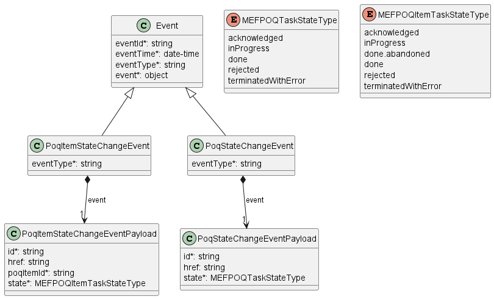

**Figure 16. Event Model**

An example of a POQ state change event might look like this:

```json
{
  "eventId": "event-001",
  "eventType": "poqStateChangeEvent",
  "eventTime": "2024-08-07T01:07:42.7030052+01:00",
  "event": {
    "id": "00000000-0000-0000-0000-000000000b01",
    "state": "inProgress"
  }
}
```

**[R72]** If a Buyer has registered for notifications, the Seller **MUST**
generate notifications to the Buyer. [Mplify79.1 R5]

**[R73]** If the Buyer has not registered for notifications, the Seller **MUST
NOT** generate notifications to the Buyer. [Mplify79.1 R6]

**[R74]** Seller **MUST** send events only to Buyers who have registered to
receive such notifications. [Mplify79.1 R90].

**[R75]** The state change notifications **MUST** be sent only in the Deferred
Response scenario. [Mplify79.1 R91]

There are no state changes in the Immediate scenario.

**[R76]** The Seller **MUST** send a notification to all of the targets
specified by the Buyer in their Register for POQ Notifications request.
[Mplify79.1 R92]

[R76] means, that the Buyer may have multiple subscriptions listeners registered
per single event type.

**[R77]** The Seller **MUST** provide the following attributes of `Event`:

- `event`
- `eventId`
- `eventTime`
- `eventType`

**[R78]** The Seller **MUST** provide the following attributes of
`PoqStateChangeEventPayload` when sending `PoqStateChangeEvent`: [Mplify79.1
R92]

- `id`
- `state`

**[R79]** The Seller **MUST** provide the following attributes of
`PoqItemStateChangeEventPayload` when sending `PoqItemStateChangeEvent`:
[Mplify79.1 R93]

- `id`
- `poqItemId`
- `state`

<div class="page"/>

# 7. API Details

## 7.1. API patterns

### 7.1.1. Indicating errors

Erroneous situations are indicated by appropriate HTTP responses. An error
response is indicated by HTTP status 4xx (for client errors) or 5xx (for server
errors) and appropriate response payload. The POQ API uses the error responses
depicted and described below.

Implementations can use HTTP error codes not specified in this standard in
compliance with rules defined in RFC 7231 [[RFC7231](#8-references)]. In such a
case, the error message body structure might be aligned with the `Error`.

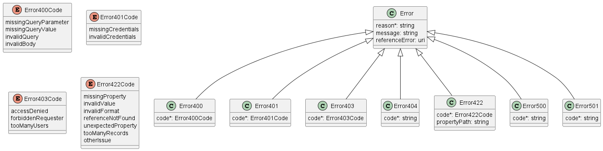

**Figure 17. Data model types to represent an erroneous response**

#### 7.1.1.1. Type Error

**Description:** Standard Class used to describe API response error Not intended
to be used directly. The `code` in the HTTP header is used as a discriminator
for the type of error returned in runtime.

<table id="T_Error">
    <thead style="font-weight:bold;">
        <tr>
            <td>Name</td>
            <td>Type</td>
            <td>Description</td>
        </tr>
    </thead>
    <tbody>
        <tr>
            <td>reason*</td>
            <td>string<br/><span style="font-size:10px;font-style:italic">maxLength = 255</span></td>
            <td>Text that explains the reason for the error. This can be shown to a client user.</td>
        </tr><tr>
            <td>message</td>
            <td>string</td>
            <td>Text that provides mode details and corrective actions related to the error. This can be shown to a client user.</td>
        </tr><tr>
            <td>referenceError</td>
            <td>uri<br/><span style="font-size:10px;font-style:italic">format = uri</span></td>
            <td>URL pointing to documentation describing the error</td>
        </tr>
    </tbody>
</table>

#### 7.1.1.2. Type Error400

**Description:** Bad Request.
(https://tools.ietf.org/html/rfc7231#section-6.5.1)

Inherits from:

- <a href="#T_Error">Error</a>

<table id="T_Error400">
    <thead style="font-weight:bold;">
        <tr>
            <td>Name</td>
            <td>Type</td>
            <td>Description</td>
        </tr>
    </thead>
    <tbody>
        <tr>
            <td>code*</td>
            <td><a href="#T_Error400Code">Error400Code</a></td>
            <td>One of the following error codes:
- missingQueryParameter: The URI is missing a required query-string parameter
- missingQueryValue: The URI is missing a required query-string parameter value
- invalidQuery: The query section of the URI is invalid.
- invalidBody: The request has an invalid body</td>
        </tr>
    </tbody>
</table>

#### 7.1.1.3. `enum` Error400Code

**Description:** One of the following error codes:

- missingQueryParameter: The URI is missing a required query-string parameter
- missingQueryValue: The URI is missing a required query-string parameter value
- invalidQuery: The query section of the URI is invalid.
- invalidBody: The request has an invalid body

#### 7.1.1.4. Type Error401

**Description:** Unauthorized. (https://tools.ietf.org/html/rfc7235#section-3.1)

Inherits from:

- <a href="#T_Error">Error</a>

<table id="T_Error401">
    <thead style="font-weight:bold;">
        <tr>
            <td>Name</td>
            <td>Type</td>
            <td>Description</td>
        </tr>
    </thead>
    <tbody>
        <tr>
            <td>code*</td>
            <td><a href="#T_Error401Code">Error401Code</a></td>
            <td>One of the following error codes:
- missingCredentials: No credentials provided.
- invalidCredentials: Provided credentials are invalid or expired</td>
        </tr>
    </tbody>
</table>

#### 7.1.1.5. `enum` Error401Code

**Description:** One of the following error codes:

- missingCredentials: No credentials provided.
- invalidCredentials: Provided credentials are invalid or expired

#### 7.1.1.6. Type Error403

**Description:** Forbidden. This code indicates that the server understood the
request but refuses to authorize it.
(https://tools.ietf.org/html/rfc7231#section-6.5.3)

Inherits from:

- <a href="#T_Error">Error</a>

<table id="T_Error403">
    <thead style="font-weight:bold;">
        <tr>
            <td>Name</td>
            <td>Type</td>
            <td>Description</td>
        </tr>
    </thead>
    <tbody>
        <tr>
            <td>code*</td>
            <td><a href="#T_Error403Code">Error403Code</a></td>
            <td>This code indicates that the server understood
the request but refuses to authorize it because
of one of the following error codes:
- accessDenied: Access denied
- forbiddenRequester: Forbidden requester
- tooManyUsers: Too many users</td>
        </tr>
    </tbody>
</table>

#### 7.1.1.7. `enum` Error403Code

**Description:** This code indicates that the server understood the request but
refuses to authorize it because of one of the following error codes:

- accessDenied: Access denied
- forbiddenRequester: Forbidden requester
- tooManyUsers: Too many users

#### 7.1.1.8. Type Error404

**Description:** Resource for the requested path not found.
(https://tools.ietf.org/html/rfc7231#section-6.5.4)

Inherits from:

- <a href="#T_Error">Error</a>

<table id="T_Error404">
    <thead style="font-weight:bold;">
        <tr>
            <td>Name</td>
            <td>Type</td>
            <td>Description</td>
        </tr>
    </thead>
    <tbody>
        <tr>
            <td>code*</td>
            <td>string</td>
            <td>The following error code:
- notFound: A current representation for the target resource not found</td>
        </tr>
    </tbody>
</table>

#### 7.1.1.9. Type Error422

The response for HTTP status `422` is a list of elements that are structured
using the `Error422` data type. Each list item describes a business validation
problem. This type introduces the `propertyPath` attribute which points to the
erroneous property of the request, so that the Buyer may fix it easier. It is
highly recommended that this property should be used, yet remains optional
because it might be hard to implement.

**Description:** Unprocessable entity due to a business validation problem.
(https://tools.ietf.org/html/rfc4918#section-11.2)

Inherits from:

- <a href="#T_Error">Error</a>

<table id="T_Error422">
    <thead style="font-weight:bold;">
        <tr>
            <td>Name</td>
            <td>Type</td>
            <td>Description</td>
        </tr>
    </thead>
    <tbody>
        <tr>
            <td>code*</td>
            <td><a href="#T_Error422Code">Error422Code</a></td>
            <td>One of the following error codes:
  - missingProperty: The property the Seller has expected is not present in the payload
  - invalidValue: The property has an incorrect value
  - invalidFormat: The property value does not comply with the expected value format
  - referenceNotFound: The object referenced by the property cannot be identified in the Seller system
  - unexpectedProperty: Additional property, not expected by the Seller has been provided
  - tooManyRecords: the number of records to be provided in the response exceeds the Seller&#x27;s threshold.
  - otherIssue: Other problem was identified (detailed information provided in a reason)
</td>
        </tr><tr>
            <td>propertyPath</td>
            <td>string</td>
            <td>A pointer to a particular property of the payload that caused the validation issue. It is highly recommended that this property should be used.
Defined using JavaScript Object Notation (JSON) Pointer (https://tools.ietf.org/html/rfc6901).
</td>
        </tr>
    </tbody>
</table>

#### 7.1.1.10. `enum` Error422Code

**Description:** One of the following error codes:

- missingProperty: The property the Seller has expected is not present in the
  payload
- invalidValue: The property has an incorrect value
- invalidFormat: The property value does not comply with the expected value
  format
- referenceNotFound: The object referenced by the property cannot be identified
  in the Seller system
- unexpectedProperty: Additional property, not expected by the Seller has been
  provided
- tooManyRecords: the number of records to be provided in the response exceeds
  the Seller's threshold.
- otherIssue: Other problem was identified (detailed information provided in a
  reason)

#### 7.1.1.11. Type Error500

**Description:** Internal Server Error.
(https://tools.ietf.org/html/rfc7231#section-6.6.1)

Inherits from:

- <a href="#T_Error">Error</a>

<table id="T_Error500">
    <thead style="font-weight:bold;">
        <tr>
            <td>Name</td>
            <td>Type</td>
            <td>Description</td>
        </tr>
    </thead>
    <tbody>
        <tr>
            <td>code*</td>
            <td>string</td>
            <td>The following error code:
- internalError: Internal server error - the server encountered an unexpected condition that prevented it from fulfilling the request.</td>
        </tr>
    </tbody>
</table>

#### 7.1.1.12. Type Error501

**Description:** Not Implemented. Used in case Seller is not supporting an
optional operation (https://tools.ietf.org/html/rfc7231#section-6.6.2)

Inherits from:

- <a href="#T_Error">Error</a>

<table id="T_Error501">
    <thead style="font-weight:bold;">
        <tr>
            <td>Name</td>
            <td>Type</td>
            <td>Description</td>
        </tr>
    </thead>
    <tbody>
        <tr>
            <td>code*</td>
            <td>string</td>
            <td>The following error code:
- notImplemented: Method not supported by the server</td>
        </tr>
    </tbody>
</table>

## 7.2. Management API Data model

Figure 18 presents the Product Offering Qualification Management data model. The
data types, requirements related to them, and mapping to MEF 79.1 specification
are discussed later in this section.

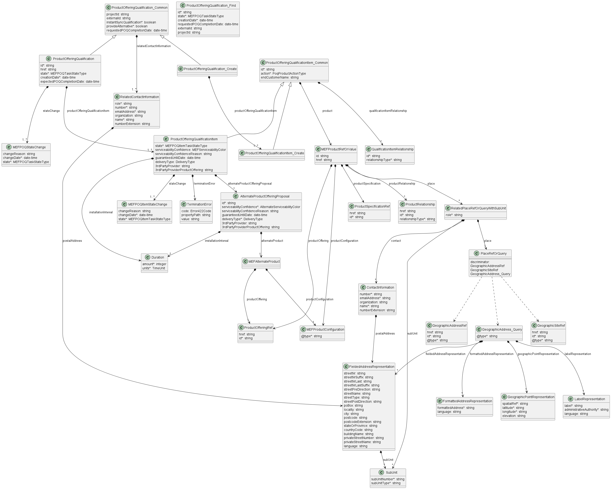

**Figure 18. Product Offering Qualification Management Data Model**

The POQ Management data model is used to construct requests and responses of the
API endpoints described in [Section 5.1.1](#511-seller-side-endpoints)

### 7.2.1 Product Offering Qualification

#### 7.2.1.1. Type ProductOfferingQualification_Common

**Description:** Defines a set of POQ attributes that might be used by the Buyer
and cannot be modified by the Seller. The `relatedContactInformation` entries
provided by the Buyer cannot be changed by the Seller, however the Seller might
append related contact information to that list.`

<table id="T_ProductOfferingQualification_Common" style="width:100%">
    <thead style="font-weight:bold">
        <tr>
            <td>Name</td>
            <td style="width:15%">Type</td>
            <td>M/O</td>
            <td>Description</td>
            <td>Mplify 79.1</td>
        </tr>
    </thead>
    <tbody>
        <tr>
        <td>projectId</td>
            <td>string</td>
            <td>O</td>
            <td>An identifier that is used to group Product Offering Qualifications that represent a unit of functionality that is important to a Buyer. A Project can be used to relate multiple Product Offering Qualifications together.</td>
            <td>Project Identifier</td>
        </tr><tr>
        <td>externalId</td>
            <td>string</td>
            <td>O</td>
            <td>An identifier that is used to group things that represent a unit of functionality that is important to a Buyer (unique for the Buyer). A Project can be used to relate multiple requests together such as POQ requests, Product Orders, etc.</td>
            <td>External Identifier</td>
        </tr><tr>
        <td>instantSync-</br>Qualification</td>
            <td>boolean</td>
            <td>M</td>
            <td>If this flag is set to true, the Buyer requires an Immediate Response to this request. If the Seller is unable to provide an Immediate Response, the Seller is to reply with an appropriate error.</td>
            <td>Immediate Response Only</td>
        </tr><tr>
        <td>provideAlternative</td>
            <td>boolean</td>
            <td>M</td>
            <td>If set to true it means that the wishes to receive alternative solutions. The Seller may provide Alternative Product Offering Configurations in the response such as a Product Offering with a lower bandwidth than requested. If &quot;false&quot; the Seller is to reply only with exact matches.</td>
            <td>Provide Alternate</td>
        </tr><tr>
        <td>requestedPOQ-</br>CompletionDate</td>
            <td>date-time<br/><span style="font-size:10px;font-style:italic">format = date-time</span></td>
            <td>O</td>
            <td>The desired date by which the Buyer wants to receive a response to the Create Product Offering Qualification request. If the Seller cannot meet the expected date, the Seller may choose to reject the request using the &#x60;terminatedWithError&#x60; state.</td>
            <td>Expected Response Date</td>
        </tr><tr>
        <td>relatedContact-</br>Information</td>
            <td><a href="#T_RelatedContactInformation">RelatedContact-</br>Information</a>[]<br/><span style="font-size:10px;font-style:italic">minItems = 1</span></td>
            <td>M</td>
            <td>Party playing a role for this qualification. 
Buyer Contact Information&#x27; **MUST** be provided in the request
(&#x27;role&#x3D;buyerContactInformation&#x27;) and &#x27;Seller Contact Information&#x27;
 **MUST** be provided in the response (&#x27;role&#x3D;sellerContactInformation&#x27;)</td>
            <td>Allows for specifying Buyer and Seller Contact Information</td>
        </tr>
    </tbody>
</table>

#### 7.2.1.2. Type ProductOfferingQualification_Create

**Description:** Represents a request formulated by the Buyer that is composed
of product offering qualification items.

Inherits from:

- <a href="#T_ProductOfferingQualification_Common">ProductOfferingQualification_Common</a>

<table id="T_ProductOfferingQualification_Create" style="width:100%">
    <thead style="font-weight:bold">
        <tr>
            <td>Name</td>
            <td style="width:15%">Type</td>
            <td>M/O</td>
            <td>Description</td>
            <td>Mplify 79.1</td>
        </tr>
    </thead>
    <tbody>
        <tr>
        <td>productOffering-</br>QualificationItem</td>
            <td><a href="#T_ProductOfferingQualificationItem_Create">ProductOffering-</br>QualificationItem_Create</a>[]<br/><span style="font-size:10px;font-style:italic">minItems = 1</span></td>
            <td>M</td>
            <td>The Product Offering Qualification is composed of Product Offering Qualification Items. This is the list of associated Product Offering Qualification Items.</td>
            <td>Product Offering Qualification Items</td>
        </tr>
    </tbody>
</table>

#### 7.2.1.3. Type ProductOfferingQualification

**Description:** Represents a response to the Buyer's POQ inquiry. This type
defines a set of attributes that are assigned by the Seller while processing the
request. A POQ response is a combination of attributes defined here with common
attributes that are sent in the request. This type is used in response to an
immediate request and POQ retrieval by an identifier.

Inherits from:

- <a href="#T_ProductOfferingQualification_Common">ProductOfferingQualification_Common</a>

<table id="T_ProductOfferingQualification" style="width:100%">
    <thead style="font-weight:bold">
        <tr>
            <td>Name</td>
            <td style="width:15%">Type</td>
            <td>M/O</td>
            <td>Description</td>
            <td>Mplify 79.1</td>
        </tr>
    </thead>
    <tbody>
        <tr>
        <td>id</td>
            <td>string</td>
            <td>M</td>
            <td>The identifier of the Product Offering Qualification that is unique within this Seller.</td>
            <td>POQ Identifier</td>
        </tr><tr>
        <td>href</td>
            <td>string</td>
            <td>O</td>
            <td>Hyperlink to this POQ. Hyperlink MAY be used by the Seller in responses. Hyperlink MUST be ignored by the Seller in case it is provided by the Buyer in a request.
</td>
            <td>Not represented in Mplify 79.1</td>
        </tr><tr>
        <td>state</td>
            <td><a href="#T_MEFPOQTaskStateType">MEFPOQ-</br>TaskStateType</a></td>
            <td>M</td>
            <td>The state of the qualification</td>
            <td>POQ State</td>
        </tr><tr>
        <td>creationDate</td>
            <td>date-time<br/><span style="font-size:10px;font-style:italic">format = date-time</span></td>
            <td>M</td>
            <td>Date when the POQ was created within the Seller&#x27;s system</td>
            <td>POQ Create Date</td>
        </tr><tr>
        <td>expectedPOQ-</br>CompletionDate</td>
            <td>date-time<br/><span style="font-size:10px;font-style:italic">format = date-time</span></td>
            <td>O</td>
            <td>The date the Seller expects to provide qualification result. Set by the Seller in case of providing a deferred response when the POQ is in an acknowledged or inProgress state.</td>
            <td>Not represented in Mplify 79.1</td>
        </tr><tr>
        <td>productOfferingQualificationItem</td>
            <td><a href="#T_ProductOfferingQualificationItem">ProductOffering-</br>QualificationItem</a>[]<br/><span style="font-size:10px;font-style:italic">minItems = 1</span></td>
            <td>M</td>
            <td>One or more of Product Offering Qualification Items. It MUST contain exactly one entry for each item in the POQ request.</td>
            <td>Product Offering Qualification Items</td>
        </tr><tr>
        <td>stateChange</td>
            <td><a href="#T_MEFPOQStateChange">MEFPOQ-</br>StateChange</a>[]<br/><span style="font-size:10px;font-style:italic">minItems = 1</span></td>
            <td>M</td>
            <td>A log of all state transitions for the POQ. It must be in sync with the most recent POQ Request state.
</td>
            <td>Not represented in Mplify 79.1</td>
        </tr>
    </tbody>
</table>

#### 7.2.1.4. `enum` MEFPOQTaskStateType

**Description:** These values represent the valid states through which the
product offering qualification can transition.

The following mapping has been used between `MEFPOQTaskStateType` and Mplify
79.1:

| MEFPOQTaskStateType | Mplify 79.1         | Description                                                                                                                                                                                                             |
| ------------------- | ------------------- | ----------------------------------------------------------------------------------------------------------------------------------------------------------------------------------------------------------------------- |
| acknowledged        | ACKNOWLEDGED        | A request has been received by the Seller, has passed basic validation, and the id was assigned. For an Immediate response, the POQ moves directly to the `done` state and does not pass through `acknowledged`.        |
| inProgress          | IN_PROGRESS         | The POQ is currently being worked by the Seller.                                                                                                                                                                        |
| done                | READY               | The POQ has been internally approved by the Seller. Reached when all items are in `done` state. It does not imply that the Seller can deliver all POQ Items in this POQ. It only means that the POQ has been completed. |
| rejected            | REJECTED            | A POQ was submitted, and it has failed at least one of the business validation checks the Seller performs after it reached the `acknowledged` state.                                                                    |
| terminatedWithError | UNABLE_TO_MEET_TIME | The Seller is unable to provide a response in the timeframe required by the Buyer (e.g. if an immediate response or a response date is set but cannot be met by the Seller).                                            |

#### 7.2.1.5. Type MEFPOQStateChange

**Description:** Holds the reached state, reasons, and associated date the POQ
state changed, populated by the Seller.

<table id="T_MEFPOQStateChange" style="width:100%">
    <thead style="font-weight:bold">
        <tr>
            <td>Name</td>
            <td style="width:15%">Type</td>
            <td>M/O</td>
            <td>Description</td>
            <td>Mplify 79.1</td>
        </tr>
    </thead>
    <tbody>
        <tr>
        <td>changeReason</td>
            <td>string</td>
            <td>O</td>
            <td>Additional comment related to state change</td>
            <td>Not represented in Mplify 79.1</td>
        </tr><tr>
        <td>changeDate</td>
            <td>date-time<br/><span style="font-size:10px;font-style:italic">format = date-time</span></td>
            <td>M</td>
            <td>The date on when the state was reached</td>
            <td>Not represented in Mplify 79.1</td>
        </tr><tr>
        <td>state</td>
            <td><a href="#T_MEFPOQTaskStateType">MEFPOQTaskStateType</a></td>
            <td>M</td>
            <td>The state reached at the change date</td>
            <td>Not represented in Mplify 79.1</td>
        </tr>
    </tbody>
</table>

#### 7.2.1.6. Type ProductOfferingQualification_Find

**Description:** This class represent a single list item for the response of
`listProductOfferingQualification` operation.

<table id="T_ProductOfferingQualification_Find" style="width:100%">
    <thead style="font-weight:bold">
        <tr>
            <td>Name</td>
            <td style="width:15%">Type</td>
            <td>M/O</td>
            <td>Description</td>
            <td>Mplify 79.1</td>
        </tr>
    </thead>
    <tbody>
        <tr>
        <td>id</td>
            <td>string</td>
            <td>M</td>
            <td>The POQ Request&#x27;s unique identifier.</td>
            <td>POQ Identifier</td>
        </tr><tr>
        <td>state</td>
            <td><a href="#T_MEFPOQTaskStateType">MEFPOQTask-</br>StateType</a></td>
            <td>M</td>
            <td>Current state of the POQ</td>
            <td>POQ State</td>
        </tr><tr>
        <td>creationDate</td>
            <td>date-time<br/><span style="font-size:10px;font-style:italic">format = date-time</span></td>
            <td>M</td>
            <td>Date when the POQ was created within the Seller&#x27;s system</td>
            <td>POQ Create Date</td>
        </tr><tr>
        <td>requestedPOQ-</br>CompletionDate</td>
            <td>date-time<br/><span style="font-size:10px;font-style:italic">format = date-time</span></td>
            <td>O</td>
            <td>The latest date the POQ completion is expected by the Buyer, if specified by the Buyer.
</td>
            <td>Requested Response Date</td>
        </tr><tr>
        <td>externalId</td>
            <td>string</td>
            <td>O</td>
            <td>ID given by the consumer and only understandable by him (to facilitate his searches afterwards)</td>
            <td>External Identifier</td>
        </tr><tr>
        <td>projectId</td>
            <td>string</td>
            <td>O</td>
            <td>The project ID specified by the Buyer in the POQ Request, if any.</td>
            <td>Project Identifier</td>
        </tr>
    </tbody>
</table>

### 7.2.2. Product Offering Qualification Item

#### 7.2.2.1. Type ProductOfferingQualificationItem_Common

**Description:** Common attributes shared between a POQ request and response.
These attributes are provided by the Buyer and must not be modified by the
Seller.

<table id="T_ProductOfferingQualificationItem_Common" style="width:100%">
    <thead style="font-weight:bold">
        <tr>
            <td>Name</td>
            <td style="width:15%">Type</td>
            <td>M/O</td>
            <td>Description</td>
            <td>Mplify 79.1</td>
        </tr>
    </thead>
    <tbody>
        <tr>
        <td>id</td>
            <td>string</td>
            <td>M</td>
            <td>Id of this POQ item which is unique within the POQ. Assigned by the Buyer.
</td>
            <td>Product Offering Qualification Item Identifier</td>
        </tr><tr>
        <td>action</td>
            <td><a href="#T_PoqProductActionType">PoqProductActionType</a></td>
            <td>M</td>
            <td>The POQ Item Action associated with this POQ item. &#x60;add&#x60; means that this POQ Item being evaluated is a completely new deployment. &#x60;modify&#x60; means that this is a change to an exist-ing Product (e.g., to increase the bandwidth).</td>
            <td>POQ Activity</td>
        </tr><tr>
        <td>product</td>
            <td><a href="#T_MEFProductRefOrValue">MEFProductRefOrValue</a></td>
            <td>M</td>
            <td>Used by the Buyer to point to existing and/or describe the desired shape of the product. In case of &#x60;add&#x60; action - only &#x60;productConfiguration&#x60; MUST be specified. For &#x60;modify&#x60; action - both &#x60;id&#x60; and &#x60;productConfiguration&#x60; to point which product instance to update and to what state.
</td>
            <td>Related to Product Specific Attributes, Product Relationships</td>
        </tr><tr>
        <td>qualification-</br>ItemRelationship</td>
            <td><a href="#T_QualificationItemRelationship">Qualification-</br>ItemRelationship</a>[]</td>
            <td>O</td>
            <td>A list of references to related POQ items in this POQ
</td>
            <td>POQ Item Relationships</td>
        </tr><tr>
        <td>endCustomerName</td>
            <td>string</td>
            <td>O</td>
            <td>The name of the End Customer. The actual user of the Product that contracts for the Product with the Buyer or the Buyer&#x27;s representative.
</td>
            <td>POQ Item End Customer Name</td>
        </tr>
    </tbody>
</table>

#### 7.2.2.2. `enum` PoqProductActionType

**Description:** Action to be performed on the Product Item.

The following mapping has been used between `PoqProductActionType` and Mplify
79.1:

| PoqProductActionType | Mplify 79.1 |
| -------------------- | ----------- |
| add                  | INSTALL     |
| modify               | CHANGE      |

#### 7.2.2.3. Type ProductOfferingRef

**Description:** A reference to a Product Offering offered by the Seller to the
Buyer. A Product Offering contains the commercial and technical details of a
Product sold by a particular Seller. A Product Offering defines all of the
commercial terms and, through association with a particular Product
Specification, defines all the technical attributes and behaviors of the
Product. A Product Offering may constrain the allowable set of configurable
technical attributes and/or behaviors specified in the associated Product
Specification.

<table id="T_ProductOfferingRef" style="width:100%">
    <thead style="font-weight:bold">
        <tr>
            <td>Name</td>
            <td style="width:15%">Type</td>
            <td>M/O</td>
            <td>Description</td>
            <td>Mplify 79.1</td>
        </tr>
    </thead>
    <tbody>
        <tr>
        <td>href</td>
            <td>string</td>
            <td>O</td>
            <td>Hyperlink to a Product Offering. The catalog is provided by the Seller to the Buyer during onboarding. Hyperlink MAY be used by the Seller in responses   Hyperlink MUST be ignored by the Seller in case it is provided by the Buyer in a request.
</td>
            <td>Product Offering Identifier</td>
        </tr><tr>
        <td>id</td>
            <td>string</td>
            <td>M</td>
            <td>id of a Product Offering. The Buyer and the Seller exchange information about offerings&#x27; ids during the onboarding process.</td>
            <td>Product Offering Identifier</td>
        </tr>
    </tbody>
</table>

#### 7.2.2.4. Type QualificationItemRelationship

**Description:** The relationship between product offering qualification items
that can be used to validate business rules between POQ items.

<table id="T_QualificationItemRelationship" style="width:100%">
    <thead style="font-weight:bold">
        <tr>
            <td>Name</td>
            <td style="width:15%">Type</td>
            <td>M/O</td>
            <td>Description</td>
            <td>Mplify 79.1</td>
        </tr>
    </thead>
    <tbody>
        <tr>
        <td>id</td>
            <td>string</td>
            <td>M</td>
            <td>An identifier of the targeted POQ item within the same POQ request</td>
            <td>Related POQ Item Identifier</td>
        </tr><tr>
        <td>relationshipType</td>
            <td>string</td>
            <td>M</td>
            <td>Specifies the type (nature) of the relationship to the related Product. The nature of required relationships varies for Products of different types. For example, a UNI or ENNI Product may not have any relationships, but an Access E-Line may have two mandatory relationships (related to the UNI on one end and the ENNI on the other). More complex Products such as multipoint IP or Firewall Products may have more complex relationships. As a result, the allowed and mandatory &#x60;relationshipType&#x60; values are defined in the Product Specification.
</td>
            <td>Relationship Nature</td>
        </tr>
    </tbody>
</table>

#### 7.2.2.5. Type ProductOfferingQualificationItem_Create

**Description:** This structure serves as a request for a product offering
qualification item. A product qualification item is an individual article
included in a POQ that describes a Product of a particular type (Product
Offering) being delivered to the geographic address or a service site specified
by the Buyer. The objective is to determine if it is feasible for the Seller to
deliver this item as described and for the Seller to inform the Buyer of the
estimated time interval to complete this delivery. The modelling pattern
introduces the `Common` supertype to aggregate attributes that are common to
both `ProductOfferingQualificationItem` and
`ProductOfferingQualificationItem_Create`. It happens that it is the Create type
has a subset of attributes of the response type and does not introduce any new,
thus the `Create` type has an empty definition.

Inherits from:

- <a href="#T_ProductOfferingQualificationItem_Common">ProductOfferingQualificationItem_Common</a>

#### 7.2.2.6. Type ProductOfferingQualificationItem

**Description:** An individual article included in a POQ that describes a
Product of a particular type (Product Offering) being delivered to a specific
geographical location. The objective is to determine if it is feasible for the
Seller to deliver this item as described and for the Seller to inform the Buyer
of the estimated time interval to complete this delivery.

Inherits from:

- <a href="#T_ProductOfferingQualificationItem_Common">ProductOfferingQualificationItem_Common</a>

<table id="T_ProductOfferingQualificationItem" style="width:100%">
    <thead style="font-weight:bold">
        <tr>
            <td>Name</td>
            <td style="width:15%">Type</td>
            <td>M/O</td>
            <td>Description</td>
            <td>Mplify 79.1</td>
        </tr>
    </thead>
    <tbody>
        <tr>
        <td>state</td>
            <td><a href="#T_MEFPOQItemTaskStateType">MEFPOQItem-</br>TaskStateType</a></td>
            <td>M</td>
            <td>Current state of an item</td>
            <td>POQ Item State</td>
        </tr><tr>
        <td>stateChange</td>
            <td><a href="#T_MEFPOQItemStateChange">MEFPOQItem-</br>StateChange</a>[]<br/><span style="font-size:10px;font-style:italic">minItems = 1</span></td>
            <td>M</td>
            <td>A log of all state transitions for the POQ Item. It must be in sync with the most recent POQ Item&#x27;s state.
</td>
            <td>Not represented in Mplify 79.1</td>
        </tr><tr>
        <td>serviceability-</br>Confidence</td>
            <td><a href="#T_MEFServiceabilityColor">MEFServiceability-</br>Color</a></td>
            <td>O</td>
            <td>The level of confidence of the Seller to be able to service the request. When the item state is &#x60;done&#x60; the Seller **MUST** provide a value. It **MUST NOT** be populated for other states.</td>
            <td>POQ Confidence Level</td>
        </tr><tr>
        <td>serviceability-</br>ConfidenceReason</td>
            <td>string</td>
            <td>O</td>
            <td>A free text description of the reason a particular Serviceability Confidence is being provided.</td>
            <td>Not represented in Mplify 79.1</td>
        </tr><tr>
        <td>installationInterval</td>
            <td><a href="#T_Duration">Duration</a></td>
            <td>O</td>
            <td>The estimated minimum interval that the Seller requires in their standard process to complete the delivery of this Product from the time the order is placed and any precedents have been completed. When attribute &#x60;serviceabilityConfidence&#x60; is set to &#x60;green&#x60; or &#x60;yellow&#x60; the Seller **MUST** populate this attribute. **MUST NOT** be specified if &#x27;state&#x27; is &#x27;terminatedWithError&#x27; or &#x60;done.abandoned&#x60;.
</td>
            <td>Installation Interval (Value + Unit)</td>
        </tr><tr>
        <td>guaranteed-</br>UntilDate</td>
            <td>date-time<br/><span style="font-size:10px;font-style:italic">format = date-time</span></td>
            <td>O</td>
            <td>Date until the Seller guarantees the qualification result. **MUST NOT** be specified if &#x27;state&#x27; is &#x27;terminatedWithError&#x27; or &#x27;done.abandoned&#x27;.
</td>
            <td>Guaranteed Until Date</td>
        </tr><tr>
        <td>alternateProduct-</br>OfferingProposal</td>
            <td><a href="#T_AlternateProductOfferingProposal">AlternateProduct-</br>OfferingProposal</a>[]</td>
            <td>O</td>
            <td>A list of zero or more alternative Product Offerings that the Seller is proposing to the Buyer. The Seller MAY specify items if: 1) the Buyer has set &#x60;provideAlternate&#x3D;true&#x60;; 2) the Seller has determined that the POQ Confidence Level for this item is &#x60;yellow&#x60; or &#x60;red&#x60;; and 3) The Seller has alternate Products (e.g. similar but lower bandwidth) that may be adequate. If the Buyer has requested to provide alternatives, but the Seller cannot find any, then the Seller **MUST** return &#x60;alternateProductOfferingProposal&#x60; array with 0 items.
</td>
            <td>Alternate Product Proposals</td>
        </tr><tr>
        <td>deliveryType</td>
            <td><a href="#T_DeliveryType">DeliveryType</a></td>
            <td>O</td>
            <td>The mechanism used to deliver the Product to the place of its installation.
</td>
            <td>Delivery Type</td>
        </tr><tr>
        <td>3rdPartyProvider</td>
            <td>string</td>
            <td>O</td>
            <td>If the Delivery Type is &#x60;offNet*&#x60; it specifies what 3rd party provider is used to connect to that place of installation.
</td>
            <td>3rd Party Provider</td>
        </tr><tr>
        <td>3rdPartyProvider-</br>ProductOffering</td>
            <td>string</td>
            <td>O</td>
            <td>If the Delivery Type is &#x60;offNet*&#x60;, it specifies the 3rd party provider&#x27;s offering is used to connect to that place of installation.
</td>
            <td>3rd Party Provider Product Offering</td>
        </tr><tr>
        <td>terminationError</td>
            <td><a href="#T_TerminationError">TerminationError</a>[]</td>
            <td>O</td>
            <td>A list of text-based reasons the Seller MUST provide when the request cannot be processed. When item state is &#x60;terminatedWithError&#x60; the Seller **MUST** provide at least one termination error.
</td>
            <td>Termination Error</td>
        </tr>
    </tbody>
</table>

#### 7.2.2.7. `enum` MEFServiceabilityColor

**Description:** A color that indicates confidence to service the request. When
the item state is `done` the Seller **MUST** provide a value. It **MUST NOT** be
populated for other states.

| ServiceabilityColor | Description                                                                                                                                                                                                                                                                                                                                                                                                                                                                          |
| ------------------- | ------------------------------------------------------------------------------------------------------------------------------------------------------------------------------------------------------------------------------------------------------------------------------------------------------------------------------------------------------------------------------------------------------------------------------------------------------------------------------------ |
| green               | The Seller is highly confident that they can deliver the Product Offering. It is not expected that the Seller will change this after an order is placed.                                                                                                                                                                                                                                                                                                                             |
| yellow              | The Seller is confident that they can deliver the Product Offering subject to a feasibility check. The delivery of the Product Offering is subject to checks that the Seller may not carry out until later in the pre-sales/fulfillment process. The Seller cannot be highly confident that they can deliver the Product Offering until those checks are performed. There is a possibility that the Seller may determine that they will not be able to deliver the Product Offering. |
| red                 | The Seller cannot deliver the Product Offering as specified. The Seller may or may not have an alternate Product Offerings that could be substituted.                                                                                                                                                                                                                                                                                                                                |

#### 7.2.2.8. `enum` AlternateServiceabilityColor

**Description:** A color that indicates confidence to service the request.

| ServiceabilityColor | Description                                                                                                                                                                                                                                                                                                                                                                                                                                                                          |
| ------------------- | ------------------------------------------------------------------------------------------------------------------------------------------------------------------------------------------------------------------------------------------------------------------------------------------------------------------------------------------------------------------------------------------------------------------------------------------------------------------------------------ |
| green               | The Seller is highly confident that they can deliver the Product Offering. It is not expected that the Seller will change this after an order is placed.                                                                                                                                                                                                                                                                                                                             |
| yellow              | The Seller is confident that they can deliver the Product Offering subject to a feasibility check. The delivery of the Product Offering is subject to checks that the Seller may not carry out until later in the pre-sales/fulfillment process. The Seller cannot be highly confident that they can deliver the Product Offering until those checks are performed. There is a possibility that the Seller may determine that they will not be able to deliver the Product Offering. |

<table id="T_AlternateServiceabilityColor">
    <thead style="font-weight:bold;">
        <tr>
            <td>Value</td>
            <td>Mplify 79.1</td>
        </tr>
    </thead>
    <tbody>
        <tr>
            <td>green</td>
            <td>GREEN</td>
        </tr><tr>
            <td>yellow</td>
            <td>YELLOW</td>
        </tr>
    </tbody>
</table>

#### 7.2.2.9. `enum` MEFPOQItemTaskStateType

**Description:** POQ item states - The specific states are managed by the Seller
based on its processing and/or based on the Buyer's action.

| MEFPOQItemTaskStateType | Mplify 79.1         | Description                                                                                                                                                                                                                                                                                      |
| ----------------------- | ------------------- | ------------------------------------------------------------------------------------------------------------------------------------------------------------------------------------------------------------------------------------------------------------------------------------------------ |
| acknowledged            | ACKNOWLEDGED        | A request has been received by the Seller and has passed basic validation. For an Immediate response, the POQ moves directly to `done` state and does not pass through `acknowledged`.                                                                                                           |
| inProgress              | IN_PROGRESS         | The Seller is working on a POQ item response and the answer is not ready yet                                                                                                                                                                                                                     |
| done.abandoned          | ABANDONED           | Applied to a POQ Item in case the final state is not reached and POQ is moved to the final state other than `done`                                                                                                                                                                               |
| done                    | READY               | The POQ Item has been internally approved by the Seller. This state does not imply that the Seller is able to deliver the requested item. It only means that the response for this POQ Item is complete.                                                                                         |
| rejected                | REJECTED            | A POQ Item has failed the business validation checks the Seller performs after it reaches the `acknowledged` state.                                                                                                                                                                              |
| terminatedWithError     | UNABLE_TO_MEET_TIME | The Seller is unable to provide a POQ Item response in the timeframe required by the Buyer (e.g. if an immediate response or a response date is set but cannot be met by the Seller). When a POQ Item goes to `terminatedWithError`, all POQ Items that are not `done` move to `done.abandoned`. |

#### 7.2.2.10. Type MEFPOQItemStateChange

**Description:** Holds the reached state, reasons, and associated date the POQ
state changed, populated by the Seller.

<table id="T_MEFPOQItemStateChange" style="width:100%">
    <thead style="font-weight:bold">
        <tr>
            <td>Name</td>
            <td style="width:15%">Type</td>
            <td>M/O</td>
            <td>Description</td>
            <td>Mplify 79.1</td>
        </tr>
    </thead>
    <tbody>
        <tr>
        <td>changeReason</td>
            <td>string</td>
            <td>O</td>
            <td>Additional comment related to state change</td>
            <td>Not represented in Mplify 79.1</td>
        </tr><tr>
        <td>changeDate</td>
            <td>date-time<br/><span style="font-size:10px;font-style:italic">format = date-time</span></td>
            <td>M</td>
            <td>The date on when the state was reached</td>
            <td>Not represented in Mplify 79.1</td>
        </tr><tr>
        <td>state</td>
            <td><a href="#T_MEFPOQItemTaskStateType">MEFPOQItem-</br>TaskStateType</a></td>
            <td>M</td>
            <td>The state reached at the change date</td>
            <td>Not represented in Mplify 79.1</td>
        </tr>
    </tbody>
</table>

#### 7.2.2.11. `enum` DeliveryType

**Description:** The mechanism used to deliver the Product to the place of its
installation.

| Delivery Type      | Description                                                                                                                                                                                                                                                    |
| ------------------ | -------------------------------------------------------------------------------------------------------------------------------------------------------------------------------------------------------------------------------------------------------------- |
| offNetWithBuild    | A place does not have an existing connection to the Seller's network, but the Seller can connect via a partner who is willing to build out their network to connect to the place (refer to definition of Build). Some providers may refer to this as Near-Net. |
| offNetWithoutBuild | A place that does not have an existing connection to the Seller's network, but the Seller can connect via a 3rd party's existing connection. This may require augmentation of additional equipment, but no Build is needed for the connection.                 |
| onNetWithBuild     | A place that does not have an existing connection to the Seller's network, but to which the Seller is willing to build out their network to connect to the place (refer to definition of Build). Some providers may refer to this as Near-Net.                 |
| onNetWithoutBuild  | A place that has an existing connection to the Seller's network. This may require the augmentation of additional equipment.                                                                                                                                    |

<table id="T_DeliveryType">
    <thead style="font-weight:bold;">
        <tr>
            <td>Value</td>
            <td>Mplify 79.1</td>
        </tr>
    </thead>
    <tbody>
        <tr>
            <td>offNetWithBuild</td>
            <td>OFF-NET w/Build</td>
        </tr><tr>
            <td>offNetWithoutBuild</td>
            <td>OFF-NET w/o Build</td>
        </tr><tr>
            <td>onNetWithBuild</td>
            <td>ON-NET w/Build</td>
        </tr><tr>
            <td>onNetWithoutBuild</td>
            <td>ON-NET w/o Build</td>
        </tr>
    </tbody>
</table>

#### 7.2.2.12. Type TerminationError

**Description:** This indicates an error that caused an Item to be terminated.
The code and propertyPath should be used like in Error422.

<table id="T_TerminationError">
    <thead style="font-weight:bold;">
        <tr>
            <td>Name</td>
            <td>Type</td>
            <td>Description</td>
        </tr>
    </thead>
    <tbody>
        <tr>
            <td>code</td>
            <td><a href="#T_Error422Code">Error422Code</a></td>
            <td>One of the following error codes:
  - missingProperty: The property the Seller has expected is not present in the payload
  - invalidValue: The property has an incorrect value
  - invalidFormat: The property value does not comply with the expected value format
  - referenceNotFound: The object referenced by the property cannot be identified in the Seller system
  - unexpectedProperty: Additional property, not expected by the Seller has been provided
  - tooManyRecords: the number of records to be provided in the response exceeds the Seller&#x27;s threshold.
  - otherIssue: Other problem was identified (detailed information provided in a reason)
</td>
        </tr><tr>
            <td>propertyPath</td>
            <td>string</td>
            <td>A pointer to a particular property of the payload that caused the validation issue. It is highly recommended that this property should be used.
Defined using JavaScript Object Notation (JSON) Pointer (https://tools.ietf.org/html/rfc6901).
</td>
        </tr><tr>
            <td>value</td>
            <td>string</td>
            <td>Text to describe the reason of the termination.</td>
        </tr>
    </tbody>
</table>

### 7.2.3. Product representation

#### 7.2.3.1. Type MEFProductRefOrValue

**Description:** Used by the Buyer to point to existing and/or describe the
desired shape of the product. In the case of the `add` action - only
`productConfiguration` MUST be specified. For `modify` action - both `id` and
`productConfiguration` MUST be provided to point which product instance to
update and to what state.

<table id="T_MEFProductRefOrValue" style="width:100%">
    <thead style="font-weight:bold">
        <tr>
            <td>Name</td>
            <td style="width:15%">Type</td>
            <td>M/O</td>
            <td>Description</td>
            <td>Mplify 79.1</td>
        </tr>
    </thead>
    <tbody>
        <tr>
        <td>id</td>
            <td>string</td>
            <td>O</td>
            <td>The unique identifier of an in-service Product that is the qualification&#x27;s subject. This field MUST be populated if an item &#x60;action&#x60; is either &#x60;modify&#x60;. This field MUST NOT be populated if an item &#x60;action&#x60; is &#x60;add&#x60;.
</td>
            <td>Product Identifier</td>
        </tr><tr>
        <td>href</td>
            <td>string</td>
            <td>O</td>
            <td>Hyperlink to the referenced Product. Hyperlinks may be used by the Seller in responses. Hyperlinks MUST be ignored by the Seller in case it is provided by the Buyer in a request.
</td>
            <td>Not represented in Mplify 79.1</td>
        </tr><tr>
        <td>product-</br>Specification</td>
            <td><a href="#T_ProductSpecificationRef">Product-</br>SpecificationRef</a></td>
            <td>O</td>
            <td>The identifier of a Product Specification associated with this POQ Item. This identifier is specified by the Seller and is established between the Buyer and Seller prior to issuing any POQ requests.</td>
            <td>Not represented in 79</td>
        </tr><tr>
        <td>product-</br>Offering</td>
            <td><a href="#T_ProductOfferingRef">Product-</br>OfferingRef</a></td>
            <td>O</td>
            <td>The identifier for a Product Offering associated with this POQ Item. This identifier is specified by the Seller and is established between the Buyer and Seller prior to issuing any POQ requests.</td>
            <td>Product Offering Identifier</td>
        </tr><tr>
        <td>product-</br>Configuration</td>
            <td><a href="#T_MEFProductConfiguration">MEFProduct-</br>Configuration</a></td>
            <td>O</td>
            <td>The technical attributes for the Product that would be delivered to fulfill this POQ Item. This essentially specifies the values for attributes defined in the Product Specification or Product Offering. MEFProductConfiguration is used to specify the product-specific payload. This field MUST be populated if an item &#x60;action&#x60; is &#x60;add&#x60; or &#x60;modify.</td>
            <td>Product Specific Attributes</td>
        </tr><tr>
        <td>productRelationship</td>
            <td><a href="#T_ProductRelationship">ProductRelationship</a>[]</td>
            <td>O</td>
            <td>A list of references to existing products that are related to the Product that would be delivered to fulfill the POQ Item.</td>
            <td>Product Relationships</td>
        </tr><tr>
        <td>place</td>
            <td><a href="#T_RelatedPlaceRefOrQueryWithSubUnit">RelatedPlace-</br>RefOrQueryWithSubUnit</a>[]</td>
            <td>O</td>
            <td>A list of locations that are related to the Product. For example an installation location</td>
            <td>POQ Item Location and POQ Item Location Type</td>
        </tr>
    </tbody>
</table>

#### 7.2.3.2. Type MEFProductConfiguration

**Description:** The extension point to provide product-specific payload. The
@type is used as a discriminator.

<table id="T_MEFProductConfiguration" style="width:100%">
    <thead style="font-weight:bold">
        <tr>
            <td>Name</td>
            <td style="width:15%">Type</td>
            <td>M/O</td>
            <td>Description</td>
            <td>Mplify 79.1</td>
        </tr>
    </thead>
    <tbody>
        <tr>
        <td>@type</td>
            <td>string</td>
            <td>M</td>
            <td>The name of the type that uniquely identifies the type of the product that is the subject of the POQ Request. In the case of Mplify product this is the URN provided in the Product Specification.</td>
            <td>Not represented in Mplify 79.1</td>
        </tr>
    </tbody>
</table>

#### 7.2.3.3. Type ProductRelationship

**Description:** A relationship to an existing Product. The requirements for
usage for given Product are described in the Product Specification. When the
Buyer provides multiple ProductRelationships of the same relationshipType the
Seller determines if a list is supported as defined in the Product
Specification.

<table id="T_ProductRelationship" style="width:100%">
    <thead style="font-weight:bold">
        <tr>
            <td>Name</td>
            <td style="width:15%">Type</td>
            <td>M/O</td>
            <td>Description</td>
            <td>Mplify 79.1</td>
        </tr>
    </thead>
    <tbody>
        <tr>
        <td>href</td>
            <td>string</td>
            <td>O</td>
            <td>Hyperlink to the product in Seller&#x27;s inventory that is referenced Hyperlink MAY be used when providing a response by the Seller Hyperlink MUST be ignored by the Seller in case it is provided by the Buyer in a request</td>
            <td>Not represented in Mplify 79.1</td>
        </tr><tr>
        <td>id</td>
            <td>string</td>
            <td>M</td>
            <td>unique identifier of the related Product</td>
            <td>Related Product Identifier</td>
        </tr><tr>
        <td>relationshipType</td>
            <td>string</td>
            <td>M</td>
            <td>Specifies the type (nature) of the relationship to the related Product. The nature of required relationships varies for Products of different types. For example, a UNI or ENNI Product may not have any relationships, but an Access E-Line may have two mandatory relationships (related to the UNI on one end and the ENNI on the other). More complex Products such as multipoint IP or Firewall Products may have more complex relationships. As a result, the allowed and mandatory &#x60;relationshipType&#x60; values are defined in the Product Specification.
</td>
            <td>Relationship Nature</td>
        </tr>
    </tbody>
</table>

#### 7.2.3.4. Type AlternateProductOfferingProposal

**Description:** If in request the Buyer has requested to have alternate product
proposals, then this class represents a single proposal. All properties are
assigned by the Seller.

<table id="T_AlternateProductOfferingProposal" style="width:100%">
    <thead style="font-weight:bold">
        <tr>
            <td>Name</td>
            <td style="width:15%">Type</td>
            <td>M/O</td>
            <td>Description</td>
            <td>Mplify 79.1</td>
        </tr>
    </thead>
    <tbody>
        <tr>
        <td>id</td>
            <td>string</td>
            <td>M</td>
            <td>A unique identifier for this Alternate Product Offering Proposal assigned by the Seller.
</td>
            <td>Alternate Product Proposal Identifier</td>
        </tr><tr>
        <td>serviceability-</br>Confidence</td>
            <td><a href="#T_AlternateServiceabilityColor">Alternate-</br>ServiceabilityColor</a></td>
            <td>M</td>
            <td>The level of confidence of the Seller to be able to service the request with the Alternate Product Offering. Note that this response is only an evaluation of the technical feasibility of delivery independent of when the Product Offering can be delivered. When the item state is &#x60;done&#x60; the Seller **MUST** provide a value. It **MUST NOT** be populated for other states.</td>
            <td>Alternate Product Offering POQ Confidence Level</td>
        </tr><tr>
        <td>serviceability-</br>ConfidenceReason</td>
            <td>string</td>
            <td>O</td>
            <td>The reason for the Serviceability Confidence Reason value.</td>
            <td>Alternate Product Offering POQ Confidence Reason</td>
        </tr><tr>
        <td>installationInterval</td>
            <td><a href="#T_Duration">Duration</a></td>
            <td>M</td>
            <td>The estimated minimum interval that the Seller requires in their standard process to complete the delivery of this product from the time the order is placed and any precedents have been completed.
</td>
            <td>Installation Interval Value and Installation Interval Unit</td>
        </tr><tr>
        <td>alternateProduct</td>
            <td><a href="#T_MEFAlternateProduct">MEFAlternateProduct</a></td>
            <td>M</td>
            <td>Alternate product proposal</td>
            <td>related to Product Specific Attributes</td>
        </tr><tr>
        <td>guaranteedUntilDate</td>
            <td>date-time<br/><span style="font-size:10px;font-style:italic">format = date-time</span></td>
            <td>O</td>
            <td>Date until the Seller guarantees the qualification result.
</td>
            <td>Guaranteed Until Date</td>
        </tr><tr>
        <td>deliveryType</td>
            <td><a href="#T_DeliveryType">DeliveryType</a></td>
            <td>M</td>
            <td>The mechanism used to deliver the Product to the place of its installation.
</td>
            <td>Delivery Type</td>
        </tr><tr>
        <td>3rdPartyProvider</td>
            <td>string</td>
            <td>O</td>
            <td>If the Delivery Type is &#x60;offNet*&#x60; it specifies what 3rd party provider is used to connect to that place of installation.
</td>
            <td>3rd Party Provider</td>
        </tr><tr>
        <td>3rdPartyProvider-</br>ProductOffering</td>
            <td>string</td>
            <td>O</td>
            <td>If the Delivery Type is &#x60;offNet*&#x60;, it specifies the 3rd party provider&#x27;s offering is used to connect to that place of installation.
</td>
            <td>3rd Party Provider Product</td>
        </tr>
    </tbody>
</table>

#### 7.2.3.5. Type MEFAlternateProduct

**Description:** An alternative Product Offering that the Seller is proposing to
the Buyer.

<table id="T_MEFAlternateProduct" style="width:100%">
    <thead style="font-weight:bold">
        <tr>
            <td>Name</td>
            <td style="width:15%">Type</td>
            <td>M/O</td>
            <td>Description</td>
            <td>Mplify 79.1</td>
        </tr>
    </thead>
    <tbody>
        <tr>
        <td>productOffering</td>
            <td><a href="#T_ProductOfferingRef">ProductOfferingRef</a></td>
            <td>M</td>
            <td>A reference to the alternate product offering.
</td>
            <td>Product Offering Identifier</td>
        </tr><tr>
        <td>productConfiguration</td>
            <td><a href="#T_MEFProductConfiguration">MEFProductConfiguration</a></td>
            <td>M</td>
            <td>MEFProductConfiguration is used to provide product-specific payload. The @type is used as a discriminator.</td>
            <td>Product Specific Attributes</td>
        </tr>
    </tbody>
</table>

#### 7.2.3.6. Type ProductSpecificationRef

**Description:** A reference to a structured set of well-defined technical
attributes and/or behaviors that are used to construct a Product Offering for
sale to a market.

<table id="T_ProductSpecificationRef" style="width:100%">
    <thead style="font-weight:bold">
        <tr>
            <td>Name</td>
            <td style="width:15%">Type</td>
            <td>M/O</td>
            <td>Description</td>
            <td>Mplify 79.1</td>
        </tr>
    </thead>
    <tbody>
        <tr>
        <td>href</td>
            <td>string</td>
            <td>O</td>
            <td>Hyperlink to a Product Specification in the Seller's catalog. The catalog is provided by the Seller to the Buyer during onboarding. Hyperlink MAY be used by the Seller in responses. Hyperlink MUST be ignored by the Seller in case it is provided by the Buyer in a request.
</td>
            <td>Not represented in Mplify 79.1</td>
        </tr><tr>
        <td>id</td>
            <td>string</td>
            <td>M</td>
            <td>Unique identifier of the product specification</td>
            <td>Not represented in Mplify 79.1</td>
        </tr>
    </tbody>
</table>

### 7.2.4. Place representation

#### 7.2.4.1. Type RelatedPlaceRefOrQueryWithSubUnit

**Description:** Allows pointing to a place by referring to a GeographicAddress,
GeographicSite, or providing GeographicAddress by value. It also provides
additional information like the `role` the place plays for given Product,
`subUnit` to provide more detailed information about the precise location of the
installation and `contact` needed access to this place.

<table id="T_RelatedPlaceRefOrQueryWithSubUnit" style="width:100%">
    <thead style="font-weight:bold">
        <tr>
            <td>Name</td>
            <td style="width:15%">Type</td>
            <td>M/O</td>
            <td>Description</td>
            <td>Mplify 79.1</td>
        </tr>
    </thead>
    <tbody>
        <tr>
        <td>place</td>
            <td><a href="#T_PlaceRefOrQuery">Place-</br>RefOrQuery</a></td>
            <td>M</td>
            <td></td>
            <td>POQ Item Place</td>
        </tr><tr>
        <td>role</td>
            <td>string</td>
            <td>M</td>
            <td>Role of this place. The values that can be specified here are described by Product Specification (e.g. &quot;INSTALL_LOCATION&quot;).</td>
            <td>POQ Item Place Role</td>
        </tr><tr>
        <td>subUnit</td>
            <td><a href="#T_SubUnit">SubUnit</a>[]</td>
            <td>O</td>
            <td>A list of zero or more sub units included within the boundary of the &#x60;place&#x60; for this POQ Item. This is a list to allow complex sub-unit information such as SUITE 42 ROOM A</td>
            <td>POQ Item Place Sub Unit List</td>
        </tr><tr>
        <td>contact</td>
            <td><a href="#T_ContactInformation">Contact-</br>Information</a>[]</td>
            <td>O</td>
            <td>The person to call to get access to this place in case such access is required to complete the evaluation of this POQ Item.</td>
            <td>POQ Item Place Contact</td>
        </tr>
    </tbody>
</table>

#### 7.2.4.2. Type PlaceRefOrQuery

**Description:** A place described by reference to a Geographic Address,
Geographic Site or by Geographic Address Representations.

#### 7.2.4.3. Type GeographicAddress_Query

**Description:** A list of representations being a subset of Geographic Address
entity. This is to be used when providing a list of representations to validate
or search for a Geographic Address

<table id="T_GeographicAddress_Query" style="width:100%">
    <thead style="font-weight:bold">
        <tr>
            <td>Name</td>
            <td style="width:15%">Type</td>
            <td>M/O</td>
            <td>Description</td>
            <td>Mplify 79.1</td>
        </tr>
    </thead>
    <tbody>
        <tr>
        <td>fieldedAddress-</br>Representation</td>
            <td><a href="#T_FieldedAddressRepresentation">FieldedAddress-</br>Representation</a>[]</td>
            <td>O</td>
            <td>A list of Fielded Address representations</td>
            <td>Installation Place Representations</td>
        </tr><tr>
        <td>formattedAddress-</br>Representation</td>
            <td><a href="#T_FormattedAddressRepresentation">FormattedAddress-</br>Representation</a>[]</td>
            <td>O</td>
            <td>A list of Formatted Address representations</td>
            <td>Installation Place Representations</td>
        </tr><tr>
        <td>geographicPoint-</br>Representation</td>
            <td><a href="#T_GeographicPointRepresentation">GeographicPoint-</br>Representation</a>[]</td>
            <td>O</td>
            <td>A list of Geographic Point Address representations</td>
            <td>Installation Place Representations</td>
        </tr><tr>
        <td>label-</br>Representation</td>
            <td><a href="#T_LabelRepresentation">Label-</br>Representation</a>[]</td>
            <td>O</td>
            <td>A list of Label Address representations</td>
            <td>Installation Place Representations</td>
        </tr><tr>
        <td>@type</td>
            <td>string</td>
            <td>M</td>
            <td>Used to unambiguously designate the class type when using &#x60;oneOf&#x60;</td>
            <td>Not represented in Mplify 150</td>
        </tr>
    </tbody>
</table>

#### 7.2.4.4. Type FieldedAddressRepresentation

**Description:** A type of Address that has a discrete field and value for each
type of boundary or identifier down to the lowest level of detail. For example
"street number" is one field, "street name" is another field, etc.

<table id="T_FieldedAddressRepresentation" style="width:100%">
    <thead style="font-weight:bold">
        <tr>
            <td>Name</td>
            <td style="width:15%">Type</td>
            <td>M/O</td>
            <td>Description</td>
            <td>Mplify 79.1</td>
        </tr>
    </thead>
    <tbody>
        <tr>
        <td>streetNr</td>
            <td>string</td>
            <td>O</td>
            <td>Number identifying a specific property on a public street. It may be combined with streetNrLast for ranged addresses.</td>
            <td>Street Number</td>
        </tr><tr>
        <td>streetNrSuffix</td>
            <td>string</td>
            <td>O</td>
            <td>The first street number suffix (in a street number range) or the suffix for the street number if there is no range</td>
            <td>Street Number Suffix</td>
        </tr><tr>
        <td>streetNrLast</td>
            <td>string</td>
            <td>O</td>
            <td>Last number in a range of street numbers allocated to an Address</td>
            <td>Street Number Last</td>
        </tr><tr>
        <td>streetNrLastSuffix</td>
            <td>string</td>
            <td>O</td>
            <td>Last street number suffix for a ranged Address</td>
            <td>Street Number Last Suffix</td>
        </tr><tr>
        <td>streetPreDirection</td>
            <td>string</td>
            <td>O</td>
            <td>The direction of the street that appears before the Street Name</td>
            <td>Street Pre-Direction</td>
        </tr><tr>
        <td>streetName</td>
            <td>string</td>
            <td>O</td>
            <td>Name of the street or other street type</td>
            <td>Street Name</td>
        </tr><tr>
        <td>streetType</td>
            <td>string</td>
            <td>O</td>
            <td>The type of street (e.g., alley, avenue, boulevard, brae, crescent, drive, highway, lane, terrace, parade, place, tarn, way, wharf)</td>
            <td>Street Type</td>
        </tr><tr>
        <td>streetPostDirection</td>
            <td>string</td>
            <td>O</td>
            <td>A modifier denoting a relative direction that appears after the Street Name.</td>
            <td>Street Post-Direction</td>
        </tr><tr>
        <td>poBox</td>
            <td>string</td>
            <td>O</td>
            <td>Number identifying a specific location in a post office.</td>
            <td>PO Box Number</td>
        </tr><tr>
        <td>locality</td>
            <td>string</td>
            <td>O</td>
            <td>An area of defined or undefined boundaries within a local authority or other legislatively defined area.</td>
            <td>Locality</td>
        </tr><tr>
        <td>city</td>
            <td>string</td>
            <td>O</td>
            <td>City in which the Address is located.</td>
            <td>City</td>
        </tr><tr>
        <td>postcode</td>
            <td>string</td>
            <td>O</td>
            <td>A descriptor for a postal delivery area used to speed and simplify the delivery of mail (also known as zip code)</td>
            <td>Postal Code</td>
        </tr><tr>
        <td>postcodeExtension</td>
            <td>string</td>
            <td>O</td>
            <td>The extension used on a postal code. Note: there are different use codes for this attribute depending upon the country.</td>
            <td>Postal Code Extension</td>
        </tr><tr>
        <td>stateOrProvince</td>
            <td>string</td>
            <td>O</td>
            <td>The State or Province in which the Address is located.</td>
            <td>State or Province</td>
        </tr><tr>
        <td>countryCode</td>
            <td>string<br/><span style="font-size:10px;font-style:italic">minLength = 2<br/>maxLength = 2</span></td>
            <td>O</td>
            <td>Country in which the Address is located, defined using two characters as defined in ISO 3166</td>
            <td>Country</td>
        </tr><tr>
        <td>subUnit</td>
            <td><a href="#T_SubUnit">SubUnit</a>[]</td>
            <td>O</td>
            <td>The Sub Unit represented as a list. This is a list to allow complex sub-unit information such as SUITE 42 ROOM A</td>
            <td>Sub Units</td>
        </tr><tr>
        <td>buildingName</td>
            <td>string</td>
            <td>O</td>
            <td>The well-known name of a building that is located at this Address (e.g., where there is one Address for a campus).
</td>
            <td>Building Name</td>
        </tr><tr>
        <td>privateStreetNumber</td>
            <td>string</td>
            <td>O</td>
            <td>Street number on a private street within the Address.</td>
            <td>Private Street Number</td>
        </tr><tr>
        <td>privateStreetName</td>
            <td>string</td>
            <td>O</td>
            <td>Private streets internal to a property (e.g., a university) may have internal names that are not recorded by the land title office.</td>
            <td>Private Street Name</td>
        </tr><tr>
        <td>language</td>
            <td>string<br/><span style="font-size:10px;font-style:italic">minLength = 2<br/>maxLength = 2</span></td>
            <td>O</td>
            <td>The language in which the address is expressed. It MUST use the ISO 639:2023 two letter code 639:2023</td>
            <td>Language</td>
        </tr>
    </tbody>
</table>

#### 7.2.4.5. Type FormattedAddressRepresentation

**Description:** A freeform text representation agreed to by the Buyer and
Seller.

<table id="T_FormattedAddressRepresentation" style="width:100%">
    <thead style="font-weight:bold">
        <tr>
            <td>Name</td>
            <td style="width:15%">Type</td>
            <td>M/O</td>
            <td>Description</td>
            <td>Mplify 79.1</td>
        </tr>
    </thead>
    <tbody>
        <tr>
        <td>formattedAddress</td>
            <td>string</td>
            <td>M</td>
            <td>A formatted Address Representation that contains a non-fielded address.</td>
            <td>Formatted Address</td>
        </tr><tr>
        <td>language</td>
            <td>string<br/><span style="font-size:10px;font-style:italic">minLength = 2<br/>maxLength = 2</span></td>
            <td>O</td>
            <td>The language in which the address is expressed. Based on ISO 639:2023</td>
            <td>Language</td>
        </tr>
    </tbody>
</table>

#### 7.2.4.6. Type GeographicPointRepresentation

**Description:** A GeographicPointRepresentation defines a geographic point
through coordinates.

<table id="T_GeographicPointRepresentation" style="width:100%">
    <thead style="font-weight:bold">
        <tr>
            <td>Name</td>
            <td style="width:15%">Type</td>
            <td>M/O</td>
            <td>Description</td>
            <td>Mplify 79.1</td>
        </tr>
    </thead>
    <tbody>
        <tr>
        <td>spatialRef</td>
            <td>string</td>
            <td>M</td>
            <td>The spatial reference system used to determine the coordinates. The system used and the value of this field are to be agreed during the onboarding process.</td>
            <td>Spatial Reference</td>
        </tr><tr>
        <td>latitude</td>
            <td>string</td>
            <td>M</td>
            <td>The latitude expressed in the format specified by the &#x60;spacialRef&#x60;</td>
            <td>Latitude</td>
        </tr><tr>
        <td>longitude</td>
            <td>string</td>
            <td>M</td>
            <td>The longitude expressed in the format specified by the &#x60;spacialRef&#x60;</td>
            <td>Longitude</td>
        </tr><tr>
        <td>elevation</td>
            <td>string</td>
            <td>O</td>
            <td>The elevation expressed in the format specified by the &#x60;spacialRef&#x60;</td>
            <td>Elevation</td>
        </tr>
    </tbody>
</table>

#### 7.2.4.7. Type LabelRepresentation

**Description:** A unique identifier controlled by a generally accepted
independent administrative authority that specifies a fixed geographical
location.

<table id="T_LabelRepresentation" style="width:100%">
    <thead style="font-weight:bold">
        <tr>
            <td>Name</td>
            <td style="width:15%">Type</td>
            <td>M/O</td>
            <td>Description</td>
            <td>Mplify 79.1</td>
        </tr>
    </thead>
    <tbody>
        <tr>
        <td>label</td>
            <td>string</td>
            <td>M</td>
            <td>The unique reference to a Geographic Address assigned by the Administrative Authority.</td>
            <td>Installation Place Label</td>
        </tr><tr>
        <td>administrative-</br>Authority</td>
            <td>string</td>
            <td>M</td>
            <td>The organization or standard from the organization that administers this Geographic Address Label ensuring it is unique within the Administrative Authority.</td>
            <td>Administrative Authority</td>
        </tr><tr>
        <td>language</td>
            <td>string<br/><span style="font-size:10px;font-style:italic">minLength = 2<br/>maxLength = 2</span></td>
            <td>O</td>
            <td>The language in which the label is expressed. Based on ISO 639:2023</td>
            <td>Language</td>
        </tr>
    </tbody>
</table>

#### 7.2.4.8. Type GeographicAddressRef

**Description:** A reference to a Geographic Address resource available through
Address Validation API.

<table id="T_GeographicAddressRef" style="width:100%">
    <thead style="font-weight:bold">
        <tr>
            <td>Name</td>
            <td style="width:15%">Type</td>
            <td>M/O</td>
            <td>Description</td>
            <td>Mplify 79.1</td>
        </tr>
    </thead>
    <tbody>
        <tr>
        <td>href</td>
            <td>string</td>
            <td>O</td>
            <td>Hyperlink to the referenced Address. Hyperlink MAY be used by the Seller in responses. Hyperlink MUST be ignored by the Seller in case it is provided by the Buyer in a request.
</td>
            <td>Not represented in Mplify 79.1</td>
        </tr><tr>
        <td>id</td>
            <td>string</td>
            <td>M</td>
            <td>Identifier of the referenced Geographic Address. This identifier is assigned during a successful address validation request (Geographic Address Management API)</td>
            <td>Installation Place Identifier</td>
        </tr><tr>
        <td>@type</td>
            <td>string</td>
            <td>M</td>
            <td>Used to unambiguously designate the class type when using &#x60;oneOf&#x60;</td>
            <td>Not represented in Mplify 79.1</td>
        </tr>
    </tbody>
</table>

#### 7.2.4.9. Type GeographicSiteRef

**Description:** A reference to a Geographic Site resource available through
Service Site API

<table id="T_GeographicSiteRef" style="width:100%">
    <thead style="font-weight:bold">
        <tr>
            <td>Name</td>
            <td style="width:15%">Type</td>
            <td>M/O</td>
            <td>Description</td>
            <td>Mplify 79.1</td>
        </tr>
    </thead>
    <tbody>
        <tr>
        <td>href</td>
            <td>string</td>
            <td>O</td>
            <td>Hyperlink to the referenced Site. Hyperlink MAY be used by the Seller in responses. Hyperlink MUST be ignored by the Seller in case it is provided by the Buyer in a request.
</td>
            <td>Not represented in Mplify 79.1</td>
        </tr><tr>
        <td>id</td>
            <td>string</td>
            <td>M</td>
            <td>Identifier of the referenced Geographic Site.</td>
            <td>Site Identifier</td>
        </tr><tr>
        <td>@type</td>
            <td>string</td>
            <td>M</td>
            <td>Used to unambiguously designate the class type when using &#x60;oneOf&#x60;</td>
            <td>Not represented in Mplify 79.1</td>
        </tr>
    </tbody>
</table>

#### 7.2.4.10. Type SubUnit

**Description:** Allows for sub unit identification

<table id="T_SubUnit" style="width:100%">
    <thead style="font-weight:bold">
        <tr>
            <td>Name</td>
            <td style="width:15%">Type</td>
            <td>M/O</td>
            <td>Description</td>
            <td>Mplify 79.1</td>
        </tr>
    </thead>
    <tbody>
        <tr>
        <td>subUnitNumber</td>
            <td>string</td>
            <td>M</td>
            <td>The discriminator used for the subunit, often just a simple number but may also be a range.</td>
            <td>Sub Unit Name</td>
        </tr><tr>
        <td>subUnitType</td>
            <td>string</td>
            <td>M</td>
            <td>The type of subunit e.g. BERTH, FLAT, PIER, SUITE, SHOP, TOWER, UNIT, WHARF.</td>
            <td>Sub Unit Type</td>
        </tr>
    </tbody>
</table>

### 7.2.5. Notification registration

Notification registration and management are done through `/hub` API endpoint.
The below sections describe data models related to this endpoint.

#### 7.2.5.1. Type EventSubscriptionInput

**Description:** This class is used to register for Notifications.

<table id="T_EventSubscriptionInput" style="width:100%">
    <thead style="font-weight:bold">
        <tr>
            <td>Name</td>
            <td style="width:15%">Type</td>
            <td>M/O</td>
            <td>Description</td>
            <td>Mplify 79.1</td>
        </tr>
    </thead>
    <tbody>
        <tr>
        <td>query</td>
            <td>string</td>
            <td>O</td>
            <td>This attribute is used to define which type of events to register to. Example: &quot;query&quot;:&quot;eventType &#x3D; poqStateChangeEvent&quot;. To subscribe for more than one event type, put the values separated by a comma: &#x60;eventType&#x3D;poqStateChangeEvent,-</br>poqItemStateChangeEvent&#x60;. The possible values are enumerated by the &#x27;POQEventType&#x27; in productOfferingQualificationNotification.api.yaml. An empty query is treated as specifying no filters - ending in  subscription for all event types.</td>
            <td>List of Notification Types</td>
        </tr><tr>
        <td>callback</td>
            <td>string</td>
            <td>M</td>
            <td>This callback value must be set to *host* property from the Buyer ProductOfferingQualification Notification API (productOfferingQualificationNotification.api.yaml). This property is appended with the base path and notification resource path specified in that API to construct a URL to which notification is sent. E.g. for the &quot;callback&quot;: &quot;https://buyer.mef.com/listenerEndpoint&quot;, the create event notification will be sent to: &#x60;https://buyer.mef.com/listenerEndpoint/-</br>mefApi/sonata/productOfferingQualificationNotification/-</br>v8/listener/poqStateChangeEvent&#x60;</td>
            <td>Return Address Information</td>
        </tr>
    </tbody>
</table>

#### 7.2.5.2. Type EventSubscription

**Description:** This resource is used to manage notification subscriptions.

<table id="T_EventSubscription" style="width:100%">
    <thead style="font-weight:bold">
        <tr>
            <td>Name</td>
            <td style="width:15%">Type</td>
            <td>M/O</td>
            <td>Description</td>
            <td>Mplify 79.1</td>
        </tr>
    </thead>
    <tbody>
        <tr>
        <td>query</td>
            <td>string</td>
            <td>O</td>
            <td>The value provided by the Buyer in &#x60;EventSubscriptionInput&#x60; during notification registration</td>
            <td>List of Notification Types</td>
        </tr><tr>
        <td>callback</td>
            <td>string</td>
            <td>M</td>
            <td>The value provided by the Buyer in &#x60;EventSubscriptionInput&#x60; during notification registration</td>
            <td>Return Address Information</td>
        </tr><tr>
        <td>id</td>
            <td>string</td>
            <td>M</td>
            <td>An identifier of this Event Subscription assigned by the Seller when a resource is created.</td>
            <td>Not represented in Mplify 79.1</td>
        </tr>
    </tbody>
</table>

### 7.2.6. Common

#### 7.2.6.1. Type RelatedContactInformation

**Description:** Contact data for a person or organization that is involved in
the product offering qualification. In a given context it is always specified by
the Seller (e.g. Seller Contact Information) or by the Buyer.

<table id="T_RelatedContactInformation" style="width:100%">
    <thead style="font-weight:bold">
        <tr>
            <td>Name</td>
            <td style="width:15%">Type</td>
            <td>M/O</td>
            <td>Description</td>
            <td>Mplify 79.1</td>
        </tr>
    </thead>
    <tbody>
        <tr>
        <td>role</td>
            <td>string</td>
            <td>M</td>
            <td>The role of the particular contact in the request</td>
            <td>Not represented in Mplify 79.1</td>
        </tr><tr>
        <td>number</td>
            <td>string</td>
            <td>M</td>
            <td>Phone number</td>
            <td>Contract Phone Number</td>
        </tr><tr>
        <td>emailAddress</td>
            <td>string</td>
            <td>M</td>
            <td>Email address</td>
            <td>Contact email Address</td>
        </tr><tr>
        <td>postalAddress</td>
            <td><a href="#T_FieldedAddressRepresentation">FieldedAddress-</br>Representation</a></td>
            <td>O</td>
            <td>Identifies the postal address of the person or office to be contacted.</td>
            <td>Contact Postal Address</td>
        </tr><tr>
        <td>organization</td>
            <td>string</td>
            <td>O</td>
            <td>The organization or company that the contact belongs to</td>
            <td>Contact Organization</td>
        </tr><tr>
        <td>name</td>
            <td>string</td>
            <td>M</td>
            <td>Name of the contact</td>
            <td>Contact Name</td>
        </tr><tr>
        <td>numberExtension</td>
            <td>string</td>
            <td>O</td>
            <td>Phone number extension</td>
            <td>Contract Phone Number Extension</td>
        </tr>
    </tbody>
</table>

#### 7.2.6.1. Type ContactInformation

**Description:** Contact data for a person or organization that is involved in
the product offering qualification. In a given context it is always specified by
the Seller (e.g. Seller Contact Information) or by the Buyer.

<table id="T_ContactInformation" style="width:100%">
    <thead style="font-weight:bold">
        <tr>
            <td>Name</td>
            <td style="width:15%">Type</td>
            <td>M/O</td>
            <td>Description</td>
            <td>Mplify 79.1</td>
        </tr>
    </thead>
    <tbody>
        <tr>
        <td>number</td>
            <td>string</td>
            <td>M</td>
            <td>Phone number</td>
            <td>Contact Phone Number</td>
        </tr><tr>
        <td>emailAddress</td>
            <td>string</td>
            <td>M</td>
            <td>Email address</td>
            <td>Contact Email Address</td>
        </tr><tr>
        <td>postalAddress</td>
            <td><a href="#T_FieldedAddressRepresentation">FieldedAddress-</br>Representation</a></td>
            <td>O</td>
            <td>Identifies the postal address of the person or office to be contacted.</td>
            <td>Contact Postal Address</td>
        </tr><tr>
        <td>organization</td>
            <td>string</td>
            <td>O</td>
            <td>The organization or company that the contact belongs to</td>
            <td>Contact Organization</td>
        </tr><tr>
        <td>name</td>
            <td>string</td>
            <td>M</td>
            <td>Name of the contact</td>
            <td>Contact Name</td>
        </tr><tr>
        <td>numberExtension</td>
            <td>string</td>
            <td>O</td>
            <td>Phone number extension</td>
            <td>Contact Phone Number Extension</td>
        </tr>
    </tbody>
</table>

#### 7.2.6.2. Type Duration

**Description:** A Duration in a given unit of time e.g. 3 hours, or 5 days.

<table id="T_Duration" style="width:100%">
    <thead style="font-weight:bold">
        <tr>
            <td>Name</td>
            <td style="width:15%">Type</td>
            <td>M/O</td>
            <td>Description</td>
            <td>Mplify 79.1</td>
        </tr>
    </thead>
    <tbody>
        <tr>
        <td>amount</td>
            <td>integer<br/><span style="font-size:10px;font-style:italic">minimum = 0</span></td>
            <td>M</td>
            <td>Duration (number of seconds, minutes, hours, etc.)</td>
            <td>Duration Value</td>
        </tr><tr>
        <td>units</td>
            <td><a href="#T_TimeUnit">TimeUnit</a></td>
            <td>M</td>
            <td>Time unit enumerated</td>
            <td>Duration Unit</td>
        </tr>
    </tbody>
</table>

#### 7.2.6.3. `enum` TimeUnit

**Description:** Represents a unit of time.

<table id="T_TimeUnit">
    <thead style="font-weight:bold;">
        <tr>
            <td>Value</td>
            <td>Mplify 79.1</td>
        </tr>
    </thead>
    <tbody>
        <tr>
            <td>seconds</td>
            <td>SECONDS</td>
        </tr><tr>
            <td>minutes</td>
            <td>MINUTES</td>
        </tr><tr>
            <td>businessHours</td>
            <td>BUSINESS_HOURS</td>
        </tr><tr>
            <td>calendarHours</td>
            <td>CALENDAR_HOURS</td>
        </tr><tr>
            <td>businessDays</td>
            <td>BUSINESS_DAYS</td>
        </tr><tr>
            <td>calendarDays</td>
            <td>CALENDAR_DAYS</td>
        </tr><tr>
            <td>months</td>
            <td>MONTHS</td>
        </tr><tr>
            <td>years</td>
            <td>YEARS</td>
        </tr>
    </tbody>
</table>

## 7.3. Notification API Data model

Figure 19 presents the Product Offering Qualification Notification data model.


**Figure 19. Product Offering Qualification Notifications Data Model**

### 7.3.1. Type Event

**Description:** Event class is used to describe information structure used for
notification.

<table id="T_Event" style="width:100%">
    <thead style="font-weight:bold">
        <tr>
            <td>Name</td>
            <td style="width:15%">Type</td>
            <td>M/O</td>
            <td>Description</td>
            <td>Mplify 79.1</td>
        </tr>
    </thead>
    <tbody>
        <tr>
        <td>eventId</td>
            <td>string</td>
            <td>M</td>
            <td>Id of the event</td>
            <td>Not represented in Mplify 79.1</td>
        </tr><tr>
        <td>eventTime</td>
            <td>date-time<br/><span style="font-size:10px;font-style:italic">format = date-time</span></td>
            <td>M</td>
            <td>Date-time when the event occurred</td>
            <td>Not represented in Mplify 79.1</td>
        </tr><tr>
        <td>eventType</td>
            <td>string</td>
            <td>M</td>
            <td>The type of the notification.</td>
            <td>Notification Type</td>
        </tr><tr>
        <td>event</td>
            <td>object</td>
            <td>M</td>
            <td>The event linked to the involved resource object</td>
            <td>Not represented in Mplify 79.1</td>
        </tr>
    </tbody>
</table>

### 7.3.2. Type PoqStateChangeEvent

**Description:** PoqStateChangeEvent structure

Inherits from:

- <a href="#T_Event">Event</a>

<table id="T_PoqStateChangeEvent" style="width:100%">
    <thead style="font-weight:bold">
        <tr>
            <td>Name</td>
            <td style="width:15%">Type</td>
            <td>M/O</td>
            <td>Description</td>
            <td>Mplify 79.1</td>
        </tr>
    </thead>
    <tbody>
        <tr>
        <td>eventType</td>
            <td>string</td>
            <td>M</td>
            <td>Indicates the type of product offering qualification event.</td>
            <td>Notification Type</td>
        </tr><tr>
        <td>event</td>
            <td><a href="#T_PoqStateChangeEventPayload">PoqStateChange-</br>EventPayload</a></td>
            <td>M</td>
            <td>A reference to the POQ that is source of the notification.
</td>
            <td>POQ State</td>
        </tr>
    </tbody>
</table>

### 7.3.3. Type PoqStateChangeEventPayload

**Description:** A reference to the POQ that is the source of the notification.

<table id="T_PoqStateChangeEventPayload" style="width:100%">
    <thead style="font-weight:bold">
        <tr>
            <td>Name</td>
            <td style="width:15%">Type</td>
            <td>M/O</td>
            <td>Description</td>
            <td>Mplify 79.1</td>
        </tr>
    </thead>
    <tbody>
        <tr>
        <td>id</td>
            <td>string</td>
            <td>M</td>
            <td>The POQ unique identifier.</td>
            <td>Product Offering Qualification Identifier</td>
        </tr><tr>
        <td>href</td>
            <td>string</td>
            <td>O</td>
            <td>Link to the POQ</td>
            <td>Not represented in Mplify 79.1</td>
        </tr><tr>
        <td>state</td>
            <td><a href="#T_MEFPOQTaskStateType">MEFPOQ-</br>TaskStateType</a></td>
            <td>M</td>
            <td>The state reached at change date</td>
            <td>POQ State</td>
        </tr>
    </tbody>
</table>

### 7.3.4. Type PoqItemStateChangeEvent

**Description:** PoqItemStateChangeEvent structure

Inherits from:

- <a href="#T_Event">Event</a>

<table id="T_PoqItemStateChangeEvent" style="width:100%">
    <thead style="font-weight:bold">
        <tr>
            <td>Name</td>
            <td style="width:15%">Type</td>
            <td>M/O</td>
            <td>Description</td>
            <td>Mplify 79.1</td>
        </tr>
    </thead>
    <tbody>
        <tr>
        <td>eventType</td>
            <td>string</td>
            <td>M</td>
            <td>Indicates the type of product offering qualification event.</td>
            <td>Notification Type</td>
        </tr><tr>
        <td>event</td>
            <td><a href="#T_PoqItemStateChangeEventPayload">PoqItemStateChange-</br>EventPayload</a></td>
            <td>M</td>
            <td>A reference to the POQ that is source of the notification.
</td>
            <td>POQ Item State</td>
        </tr>
    </tbody>
</table>

### 7.3.5. Type PoqItemStateChangeEventPayload

**Description:** A reference to the POQ that is the source of the notification.

<table id="T_PoqItemStateChangeEventPayload" style="width:100%">
    <thead style="font-weight:bold">
        <tr>
            <td>Name</td>
            <td style="width:15%">Type</td>
            <td>M/O</td>
            <td>Description</td>
            <td>Mplify 79.1</td>
        </tr>
    </thead>
    <tbody>
        <tr>
        <td>id</td>
            <td>string</td>
            <td>M</td>
            <td>The POQ unique identifier.</td>
            <td>Product Offering Qualification Identifier</td>
        </tr><tr>
        <td>href</td>
            <td>string</td>
            <td>O</td>
            <td>Link to the POQ</td>
            <td>Not represented in Mplify 79.1</td>
        </tr><tr>
        <td>poqItemId</td>
            <td>string</td>
            <td>M</td>
            <td>ID of the Poq Item (within the Poq) which state change triggered the event</td>
            <td>Product Offering Qualification Item Identifier</td>
        </tr><tr>
        <td>state</td>
            <td><a href="#T_MEFPOQItemTaskStateType">MEFPOQItem-</br>TaskStateType</a></td>
            <td>M</td>
            <td>The state reached at change date</td>
            <td>POQ Item State</td>
        </tr>
    </tbody>
</table>

### 7.3.6. `enum` MEFPOQTaskStateType

**Description:** These values represent the valid states through which the
product offering qualification can transition.

The following mapping has been used between `MEFPOQTaskStateType` and Mplify
79.1:

| MEFPOQTaskStateType | Mplify 79.1         | Description                                                                                                                                                                                                             |
| ------------------- | ------------------- | ----------------------------------------------------------------------------------------------------------------------------------------------------------------------------------------------------------------------- |
| acknowledged        | ACKNOWLEDGED        | A request has been received by the Seller, has passed basic validation and the id was assigned. For an Immediate response, the POQ moves directly to the `done` state and does not pass through `acknowledged`.         |
| inProgress          | IN_PROGRESS         | The POQ is currently being worked by the Seller.                                                                                                                                                                        |
| done                | READY               | The POQ has been internally approved by the Seller. Reached when all items are in `done` state. It does not imply that the Seller can deliver all POQ Items in this POQ. It only means that the POQ has been completed. |
| rejected            | REJECTED            | A POQ was submitted, and it has failed at least one of the business validation checks the Seller performs after it reached the `acknowledged` state.                                                                    |
| terminatedWithError | UNABLE_TO_MEET_TIME | The Seller is unable to provide a response in the timeframe required by the Buyer (e.g., if an immediate response or a response date is set but cannot be met by the Seller).                                           |

### 7.3.7. `enum` MEFPOQItemTaskStateType

**Description:** POQ item states - The specific states are managed by the Seller
based on its processing and/or based on the Buyer's action.

| MEFPOQItemTaskStateType | Mplify 79.1         | Description                                                                                                                                                                                                                                                                                       |
| ----------------------- | ------------------- | ------------------------------------------------------------------------------------------------------------------------------------------------------------------------------------------------------------------------------------------------------------------------------------------------- |
| acknowledged            | ACKNOWLEDGED        | A request has been received by the Seller and has passed basic validation. For an Immediate response, the POQ moves directly to `done` state and does not pass through `acknowledged`.                                                                                                            |
| inProgress              | IN_PROGRESS         | The Seller is working on a POQ item response and the answer is not ready yet                                                                                                                                                                                                                      |
| done.abandoned          | ABANDONED           | Applied to a POQ Item in case the final state is not reached and POQ is moved to the final state other than `done`                                                                                                                                                                                |
| done                    | READY               | The POQ Item has been internally approved by the Seller. This state does not imply that Seller is able to deliver requested item. It only means that the response for this POQ Item is complete.                                                                                                  |
| rejected                | REJECTED            | A POQ Item has failed the business validation checks the Seller performs after it reached the `acknowledged` state.                                                                                                                                                                               |
| terminatedWithError     | UNABLE_TO_MEET_TIME | The Seller is unable to provide a POQ Item response in the timeframe required by the Buyer (e.g., if an immediate response or a response date is set but cannot be met by the Seller). When a POQ Item goes to `terminatedWithError`, all POQ Items that are not `done` move to `done.abandoned`. |

<div class="page"/>

# 8. References

- [JSON](https://json-schema.org/specification-links.html#draft-7), JSON Schema:
  A Media Type for Describing JSON Documents and associated documents, by Austin
  Wright and Henry Andrews, March 2018. Copyright © 2018 IETF Trust and the
  persons identified as the document authors. All rights reserved.
- [MEF 55.1](https://www.mef.net/wp-content/uploads/2021/02/MEF-55.1.pdf),
  Lifecycle Service Orchestration (LSO): Reference Architecture and Framework,
  February 2021
- [MEF 55.1.1](https://www.mef.net/wp-content/uploads/MEF-55.1.1.pdf), Amendment
  to MEF 55.1: Reference Architecture and Framework - Terminology, June 2023
- [Mplify 79.1](https://www.mplify.net/wp-content/uploads/Mplify-79.1.pdf),
  Product Offering Qualification Management Business Requirements and Use Cases,
  June 2025
- [MEF 106](https://www.mef.net/wp-content/uploads/MEF-106.pdf), LSO Sonata
  Access E-Line Product Schemas and Developer Guide, February 2023
- [Mplify 121.1](https://www.mplify.net/wp-content/uploads/Mplify-121.1.pdf),
  LSO Cantata and LSO Sonata Address Management API - Developer Guide, November
  2025
- [MEF 128.1](https://www.mef.net/wp-content/uploads/MEF-128.1.pdf), LSO API
  Security Profile, April 2024
- [Mplify 150](https://www.mplify.net/wp-content/uploads/Mplify-150.pdf),
  Installation Place and Service Site Management Business Requirements and Use
  Cases, June 2025
- [OAS-V3](http://spec.openapis.org/oas/v3.0.3.html), February 2020
- [REST](http://www.ics.uci.edu/~fielding/pubs/dissertation/rest_arch_style.htm),
  Fielding, Roy Thomas, Architectural Styles and the Design of Network-based
  Software Architectures (Ph.D.).
- [RFC 2119](https://tools.ietf.org/html/rfc2119), Key words for use in RFCs to
  Indicate Requirement Levels, March 1997
- [RFC 3986](https://tools.ietf.org/html/rfc3986#section-3) Uniform Resource
  Identifier (URI): Generic Syntax, January 2005
- [RFC 7231](https://tools.ietf.org/html/rfc7231), Hypertext Transfer Protocol
  (HTTP/1.1): Semantics and Content, June 2014
- [RFC 8174](https://tools.ietf.org/html/rfc8174), Ambiguity of Uppercase vs
  Lowercase in RFC 2119 Key Words, May 2017
- [TMF 679](https://www.tmforum.org/resources/specification/tmf679-product-offering-qualification-api-rest-specification-r19-0-0/),
  TMF679 Product Offering Qualification API REST Specification, June 2019

<div class="page"/>

# Appendix A Acknowledgments

Mike **BENCHECK**

Tomasz **CHMAL**

Pankaj **BODADE**

Michał **ŁĄCZYŃSKI**

Jack **PUGACZEWSKI**

Patrick **ROOSEN**

Fahim **SABIR**
