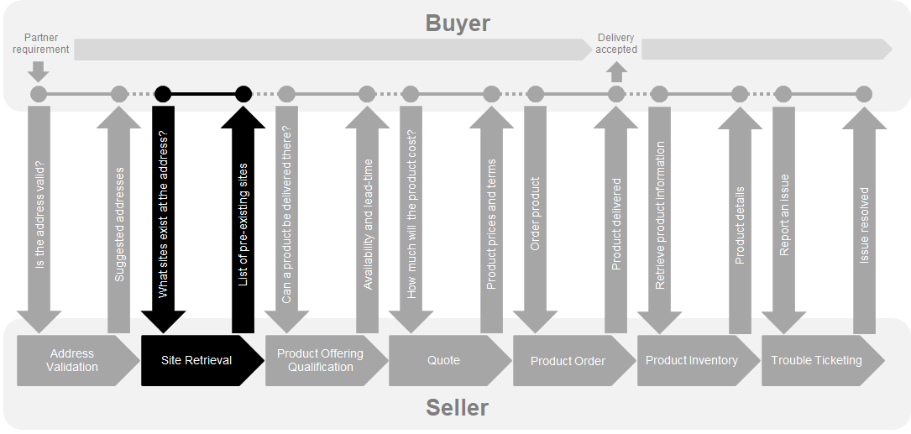
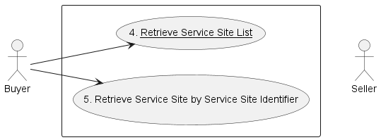
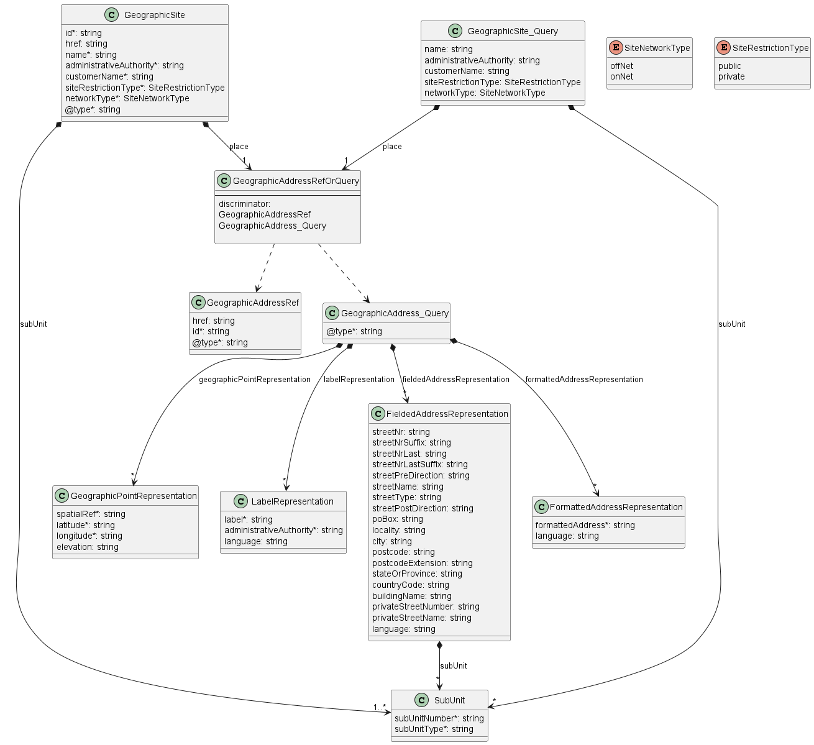
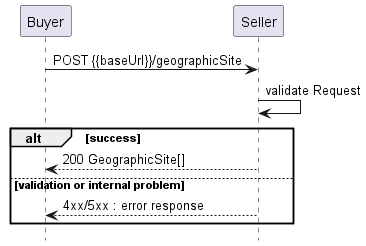
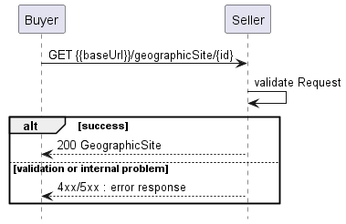
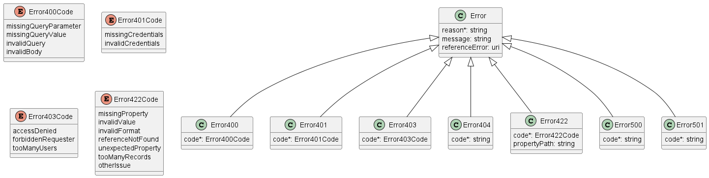

<style>
img
{
  display:block;
  float:none;
  margin-left:auto;
  margin-right:auto;
}
</style>


<div style="font-weight:bold; font-size:33pt; font-family: Sansation; text-align:center">
Letter Ballot
</br>
</br>
Mplify 122.1
</br>
</br>
LSO Cantata and LSO Sonata Site Management API - Developer Guide
</br>
</br>
July 2025
<p style="color:red;font-weight:bold; font-size:18pt">EXPORT CONTROL: This document contains technical data. The download, export, re-export or disclosure of the technical data contained in this document may be restricted by applicable U.S. or foreign export laws, regulations and rules and/or applicable U.S. or foreign sanctions ("Export Control Laws or Sanctions"). You agree that you are solely responsible for determining whether any Export Control Laws or Sanctions may apply to your download, export, reexport or disclosure of this document, and for obtaining (if available) any required U.S. or foreign export or reexport licenses and/or other required authorizations.
</div>

<div class="page"/>

**Disclaimer**

© Mplify Alliance 2025. All Rights Reserved.

The information in this publication is freely available for reproduction and use
by any recipient and is believed to be accurate as of its publication date. Such
information is subject to change without notice and Mplify Alliance (Mplify) is
not responsible for any errors. Mplify does not assume responsibility to update
or correct any information in this publication. No representation or warranty,
expressed or implied, is made by Mplify concerning the completeness, accuracy,
or applicability of any information contained herein and no liability of any
kind shall be assumed by Mplift as a result of reliance upon such information.

The information contained herein is intended to be used without modification by
the recipient or user of this document. Mplify is not responsible or liable for
any modifications to this document made by any other party.

The receipt or any use of this document or its contents does not in any way
create, by implication or otherwise:

- (a) any express or implied license or right to or under any patent, copyright,
  trademark or trade secret rights held or claimed by any Mplify member which
  are or may be associated with the ideas, techniques, concepts or expressions
  contained herein; nor

- (b) any warranty or representation that any Mplify member will announce any
  product(s) and/or service(s) related thereto, or if such announcements are
  made, that such announced product(s) and/or service(s) embody any or all of
  the ideas, technologies, or concepts contained herein; nor

- (c) any form of relationship between any Mplify member and the recipient or
  user of this document.

Implementation or use of specific Mplify standards, specifications or
recommendations will be voluntary, and no Member shall be obliged to implement
them by virtue of participation in Mplify Alliance. Mplify is a non-profit
international organization to enable the development and worldwide adoption of
agile, assured and orchestrated network services. Mplify does not, expressly or
otherwise, endorse or promote any specific products or services.

**Copyright**

© Mplify Alliance 2025. Any reproduction of this document, or any portion
thereof, shall contain the following statement: "Reproduced with permission of
Mplify Alliance." No user of this document is authorized to modify any of the
information contained herein.

<div class="page"/>

**Table of Contents**

- [List of Contributing Members](#list-of-contributing-members)
- [1. Abstract](#1-abstract)
- [2. Terminology and Abbreviations](#2-terminology-and-abbreviations)
- [3. Compliance Levels](#3-compliance-levels)
- [4. Introduction](#4-introduction)
  - [4.1. Description](#41-description)
  - [4.2. Conventions in the Document](#42-conventions-in-the-document)
  - [4.3. Approach](#43-approach)
  - [4.4. High-Level Flow](#44-high-level-flow)
- [5. API Description](#5-api-description)
  - [5.1. High-level use cases](#51-high-level-use-cases)
  - [5.2. Resource/endpoint Description](#52-resourceendpoint-description)
    - [5.2.1. Seller Side Endpoints](#521-seller-side-endpoints)
    - [5.2.2. Specifying the Buyer ID and the Seller ID](#522-specifying-the-buyer-id-and-the-seller-id)
  - [5.3. API Resource Schema Summary](#53-api-resource-schema-summary)
  - [5.4. Model Structural Validation](#54-model-structural-validation)
  - [5.5. Security Considerations](#55-security-considerations)
- [6. API Interaction \& Flows](#6-api-interaction--flows)
  - [6.1. Use case 4: Retrieve Service Site List](#61-use-case-4-retrieve-service-site-list)
  - [6.2. Use case 5: Retrieve Service Site by Identifier](#62-use-case-5-retrieve-service-site-by-identifier)
- [7. API Details](#7-api-details)
  - [7.1. API patterns](#71-api-patterns)
    - [7.1.1. Indicating errors](#711-indicating-errors)
      - [7.1.1.1. Type Error](#7111-type-error)
      - [7.1.1.2. Type Error400](#7112-type-error400)
      - [7.1.1.3. `enum` Error400Code](#7113-enum-error400code)
      - [7.1.1.4. Type Error401](#7114-type-error401)
      - [7.1.1.5. `enum` Error401Code](#7115-enum-error401code)
      - [7.1.1.6. Type Error403](#7116-type-error403)
      - [7.1.1.7. `enum` Error403Code](#7117-enum-error403code)
      - [7.1.1.8. Type Error404](#7118-type-error404)
      - [7.1.1.9. Type Error422](#7119-type-error422)
      - [7.1.1.10. `enum` Error422Code](#71110-enum-error422code)
      - [7.1.1.11. Type Error500](#71111-type-error500)
      - [7.1.1.12. Type Error501](#71112-type-error501)
  - [7.2. API Data model](#72-api-data-model)
    - [7.2.1. Geographic Site](#721-geographic-site)
      - [7.2.1.1 Type GeographicSite](#7211-type-geographicsite)
      - [7.2.1.2 Type GeographicSite\_Query](#7212-type-geographicsite_query)
      - [7.2.1.3. `enum` SiteRestrictionType](#7213-enum-siterestrictiontype)
      - [7.2.1.4. `enum` SiteNetworkType](#7214-enum-sitenetworktype)
    - [7.2.2. Geographic Address](#722-geographic-address)
      - [7.2.2.1 Type GeographicAddressRefOrQuery](#7221-type-geographicaddressreforquery)
      - [7.2.2.2 Type GeographicAddressRef](#7222-type-geographicaddressref)
      - [7.2.2.3. Type GeographicAddress\_Query](#7223-type-geographicaddress_query)
      - [7.2.2.4. Type FieldedAddressRepresentation](#7224-type-fieldedaddressrepresentation)
      - [7.2.2.5. Type FormattedAddressRepresentation](#7225-type-formattedaddressrepresentation)
      - [7.2.2.6. Type GeographicPointRepresentation](#7226-type-geographicpointrepresentation)
      - [7.2.2.7. Type LabelRepresentation](#7227-type-labelrepresentation)
      - [7.3. Common](#73-common)
      - [7.3.1. Type SubUnit](#731-type-subunit)
- [8. References](#8-references)
- [Appendix A Acknowledgments](#appendix-a-acknowledgments)

<div class="page"/>

# List of Contributing Members

The following members of Mplify participated in the development of this document
and have requested to be included in this list.

| Member                   |
| ------------------------ |
| Amartus                  |
| Colt Technology Services |
| Proximus                 |

**Table 1. Contributing Members**

<div class="page"/>

# 1. Abstract

This standard is intended to assist in the implementation of the Site Retrieval
functionality defined for the LSO Cantata and LSO Sonata Interface Reference
Points (IRPs), for which requirements and use cases are defined in _Installation
Place and Service Site Management Business Requirements and Use Cases_
[[Mplify 150](#8-references)].

Site retrieval allows the Buyer to determine if there is already a Site, as
defined by the Seller, at the Geographic Address. The Buyer requests a list of
Sites at a Geographic Address or, if the Site `id` is known, may ask for details
of that Site. Site information includes the type of Site (Public or Private),
the specific location within the Geographic Address where the Site is located,
and additional Site information. The Buyer can use the Site `id` for POQ, Quote,
or Product Order.

This standard normatively incorporates the following files by reference as if
they were part of this document, from the GitHub repository

<https://github.com/MEF-GIT/MEF-LSO-Sonata-SDK>

commit id:
[aaa03d484f98664a5a14f4f54f47b675d7efb3b8](https://github.com/MEF-GIT/MEF-LSO-Sonata-SDK/tree/aaa03d484f98664a5a14f4f54f47b675d7efb3b8)

- [`productApi/serviceability/site/geographicSiteManagement.api.yaml`](https://raw.githubusercontent.com/MEF-GIT/MEF-LSO-Sonata-SDK/aaa03d484f98664a5a14f4f54f47b675d7efb3b8/productApi/serviceability/site/geographicSiteManagement.api.yaml)

<https://github.com/MEF-GIT/MEF-LSO-Cantata-SDK>

commit id:
[83d6edd0c70386058a9af6e677c069b498671da7](https://github.com/MEF-GIT/MEF-LSO-Cantata-SDK/tree/83d6edd0c70386058a9af6e677c069b498671da7)

- [`productApi/serviceability/site/geographicSiteManagement.api.yaml`](https://raw.githubusercontent.com/MEF-GIT/MEF-LSO-Cantata-SDK/83d6edd0c70386058a9af6e677c069b498671da7/productApi/serviceability/site/geographicSiteManagement.api.yaml)

<div class="page"/>

# 2. Terminology and Abbreviations

This section defines the terms used in this document. In many cases, the
normative definitions of terms are found in other documents. In these cases, the
third column is used to provide the reference that is controlling, in other
Mplify or external documents.

In addition, terms defined in the standards referenced below are included in
this document by reference and are not repeated in the table below:

- <a href="#8-references">MEF 50.1</a>
- <a href="#8-references">MEF 55.1</a>
- <a href="#8-references">MEF 55.1.1</a>
- <a href="#8-references">Mplify 150</a>

<table>
<tr>
  <th>Term</th>
  <th>Description</th>
  <th>Reference</th>
</tr>
  <tr>
    <td>Fielded Address Representation</td>
    <td>A type of Representation where a discrete field and value for each type of boundary or identifier down to the lowest level of detail. For example, "street number" is one field, "street name" is another field, etc.</td>
    <td>This document; adapted from <a href="#8-references">[Mplify 150]</td>
  </tr>
  <tr>
    <td>Formatted Address Representation</td>
    <td>A type of Representation using single string based on local postal addressing conventions.</td>
    <td>This document; adapted from <a href="#8-references">[Mplify 150]</td>
  </tr>
  <tr>
    <td>Geographic Address</td>
    <td>A place on Earth, which may or may not be fixed, described using one or more Geographic Address Representations.</td>
    <td>This document; adapted from <a href="#8-references">[Mplify 150]</td>
  </tr>
  <tr>
    <td>Geographic Address Representation</td>
    <td>A concrete method of describing a specific address which uses well defined formats to detail the attributes.</td>
    <td>This document; adapted from <a href="#8-references">[Mplify 150]</td>
  </tr>
  <tr>
    <td>Geographic Point Representation</td>
    <td>A type of Representation where coordinates (latitude, longitude and sometimes elevation) are used to specify a particular place on Earth.</td>
    <td>This document; adapted from <a href="#8-references">[Mplify 150]</td>
  </tr>
  <tr>
    <td>Geographic Site</td>
    <td>A fixed or mobile place at which a Product can be installed.</td>
    <td>This document; adapted from <a href="#8-references">[Mplify 150]</td>
  </tr>
  <tr>
    <td>Label Representation</td>
    <td>A type of Geographic Address Representation that is a unique combination of label and Administrative Authority (any organization that distributes labels) that controls assignment of the label and that specifies either a place which may or may not be fixed on Earth.</td>
    <td>This document; adapted from <a href="#8-references">[Mplify 150]</td>
  </tr>
  <tr>
    <td>OFF-NET</td>
    <td>A Site that is served by a partner of the Seller and not directly by the Seller's network.</td>
    <td>This document; adapted from <a href="#8-references">[Mplify 150]</td>
  </tr>
  <tr>
    <td>ON-NET</td>
    <td>A Site that is connected to the Seller's network.</td>
    <td>This document; adapted from <a href="#8-references">[Mplify 150]</td>
  </tr>
    <tr>
    <td>Private Site</td>
    <td>A Geographic Site for which the existence is on a need-to-know basis.</td>
    <td>This document; adapted from <a href="#8-references">[Mplify 150]</td>
  </tr>
  <tr>
    <td>Public Site</td>
    <td>A Geographic Site for which the existence is public information.</td>
    <td>This document; adapted from <a href="#8-references">[Mplify 150]</td>
  </tr>
  <tr>
    <td>Requesting Entity</td>
    <td>The business organization that is acting on behalf of one or more Buyers. In the most common case, the Requesting Entity represents only one Buyer and these terms are then synonymous.</td>
    <td><a href="#8-references">[Mplify 150]</a></td>
  </tr>
  <tr>
    <td>Responding Entity</td>
    <td>The business organization that is acting on behalf of one or more Sellers. In the most common case, the Responding Entity represents only one Seller and these terms are then synonymous.</td>
    <td><a href="#8-references">[Mplify 150]</a></td>
  </tr>
  <tr>
    <td>REST API</td>
    <td>Representational State Transfer. REST provides a set of architectural constraints that, when applied as a whole, emphasizes scalability of component interactions, generality of interfaces, independent deployment of components, and intermediary components to reduce interaction latency, enforce security, and encapsulate legacy systems.</td>
    <td><a href="#8-references">[REST]</a></td>
  </tr>
</table>

**Table 2. Terminology**

<div class="page"/>

# 3. Compliance Levels

The key words **"MUST"**, **"MUST NOT"**, **"REQUIRED"**, **"SHALL"**, **"SHALL
NOT"**, **"SHOULD"**, **"SHOULD NOT"**, **"RECOMMENDED"**, **"NOT
RECOMMENDED"**, **"MAY"**, and **"OPTIONAL"** in this document are to be
interpreted as described in BCP 14 (RFC 2119 [[rfc2119](#8-references)], RFC
8174 [[rfc8174](#8-references)]) when, and only when, they appear in all
capitals, as shown here. All key words must be in bold text.

Items that are **REQUIRED** (contain the words **MUST** or **MUST NOT**) are
labeled as **[Rx]** for required. Items that are **RECOMMENDED** (contain the
words **SHOULD** or **SHOULD NOT**) are labeled as **[Dx]** for desirable. Items
that are **OPTIONAL** (contain the words MAY or OPTIONAL) are labeled as
**[Ox]** for optional.

A paragraph preceded by **[CRa]<** specifies a conditional mandatory requirement
that **MUST** be followed if the condition(s) following the "<" have been met.
For example, **"[CR1]<[D38]"** indicates that Conditional Mandatory Requirement
1 must be followed if Desirable Requirement 38 has been met. A paragraph
preceded by **[CDb]<** specifies a Conditional Desirable Requirement that
**SHOULD** be followed if the condition(s) following the "<" have been met. A
paragraph preceded by **[COc]<**specifies a Conditional Optional Requirement
that **MAY** be followed if the condition(s) following the "<" have been met.

<div class="page"/>

# 4. Introduction

**_Note:_** The requirements and use cases for Site retrieval functionality are
defined in _Installation Place and Service Site Management Business Requirements
and Use Cases_ [[Mplify 150](#8-references)] which introduced the _Installation
Place_ as a new entity with multiple address representations. For the sake of
backward and TMF compatibility the API definition does not introduce
_Installation Place_ as a new API resource, but updates the existing model of
`GeographicAddress`, according to the before-mentioned Mplify Standard.

This standard is based on TMF 674 API as specified by _TMF674 Geographic Site
Management API User Guide_ [[TMF674](#8-references)].

This standard specification document describes the API for Site Retrieval
functionality of the LSO Cantata Interface Reference Point (IRP) and Sonata IRP
as defined in the MEF 55.1 _Lifecycle Service Orchestration (LSO): Reference
Architecture and Framework_ [[MEF 55.1](#8-references)]. The LSO Reference
Architecture is shown in Figure 1 with both IRPs highlighted.


**Figure 1. The LSO Reference Architecture**

Cantata and Sonata IRPs define pre-ordering and ordering functionalities that
allow an automated exchange of information between business applications of the
Buyer (Customer or Service Provider) and Seller (Service Provider or Partner)
Domains. Those are:

- Product Catalog
- Address Validation
- Site Retrieval
- Product Offering Qualification
- Quote
- Product Offering Availability and Pricing Discovery
- Product Inventory
- Product Ordering
- Trouble Ticketing
- Billing

The business requirements and use cases for Site Retrieval are defined in
_Installation Place and Service Site Management Business Requirements and Use
Cases_ [[Mplify 150](#8-references)].

This document focuses on the implementation aspects of Site Retrieval
functionality and is structured as follows:

- [Chapter 4](#4-introduction) provides an introduction to Site Retrieval and
  its description in a broader context of Cantata and Sonata and their
  corresponding SDKs.
- [Chapter 5](#5-api-description) gives an overview of endpoints, resource model
  and design patterns.
- Use cases and flows are presented in [Chapter 6](#6-api-interaction--flows).
- And finally, [Chapter 7](#7-api-details) complements previous sections with a
  detailed API description.

## 4.1. Description

A Site usually represents a location where the Seller has already delivered one
or more products. A Site identifier is assigned at some point by the Seller to
reference the location. A Site always references a `GeographicAddress` that
defines its location.

A `GeographicSite` within a Seller's network represents a location at which a
Product can be installed and usually where the Seller has already delivered one
or more products. A `GeographicSite.id` is assigned by the Seller to reference
the `GeographicSite`. A `GeographicSite` is associated to one and only one
`GeographicAddress`.

Before performing Product Offering Qualification, Quote, or Product Order, the
Buyer may need to obtain details on the Site. These details can include whether
the Site is public or private, room and floor information, or additional
details.

One example of why a Buyer may need to perform a Site retrieval prior to
submitting a Product Offering Qualification request is to determine if that site
is public, meaning that the Seller is willing to provide service to any
end-customer at the site, or private, meaning that the end-customers that the
Seller will provide service to at that site is limited.

Public Sites are often located in a common area at a Geographic Address, such as
a basement, which all end-customers at that Geographic Address can access.
Normally, all public Sites at a Geographic Address will be included in the list
of Sites returned by the Seller in response to the Buyer's retrieve Site list
request.

Private Sites are dedicated to a single end customer and are not usually shared
with other end customers at that Geographic Address. The Seller cannot connect a
Buyer to the private Site without the permission of a party authorized to use
the private Site. Normally, a private Site will not be included in the list of
Sites at a Geographic Address returned by the Seller in response to the Buyer's
retrieve Site list request unless the Buyer is determined by the Seller as
authorized to view the private Sites at that Geographic Address.

A Site is defined as a physical place at which a Product can be installed. There
are many possible cases for example: A particular Geographic Address may not
have any suitable Sites to install telecom equipment; it may have one Site
(e.g., a wiring closet in the basement); or it may have multiple Sites (e.g., a
wiring closet in each suite of a multi-tenant building). Moreover, even if the
Seller is aware of the Geographic Address, they may or may not hold any of this
Site information at the time of the Buyer's request.

## 4.2. Conventions in the Document

- Code samples are formatted using code blocks. When notation `<< some text >>`
  is used in the payload sample it indicates that a comment is provided instead
  of an example value and it might not comply with the OpenAPI definition.
- Model definitions are formatted as in-line code (e.g. `GeographicSite`).
- In UML diagrams the default cardinality of associations is `0..1`. Other
  cardinality markers are compliant with the UML standard.
- In the API details tables and UML diagrams required attributes are marked with
  a `*` next to their names.
- In UML sequence diagrams `{{variable}}` notation is used to indicate a
  variable to be substituted with a correct value.

## 4.3. Approach

As presented in Figure 2. both Cantata and Sonata API frameworks consists of
three structural components:

- Generic API framework
- Product-independent information (Function-specific information and
  Function-specific operations)
- Product-specific information (Mplify product specification data model)


**Figure 2. Cantata and Sonata API framework**

The essential concept behind the framework is to decouple the common structure,
information and operations from the specific product information content.  
Firstly, the Generic API Framework defines a set of design rules and patterns
that are applied across all Cantata or Sonata APIs.  
Secondly, the product-independent information of the framework focuses on a
model of a particular Cantata or Sonata functionality and is agnostic to any of
the product specifications.  
Finally, the product-specific information part of the framework focuses on
Mplify product specifications that define business-relevant attributes and
requirements for trading Mplify subscriber and Mplify operator services.

The Site Retrieval is product-agnostic in its nature and is not intended to
carry any product-specific information. It operates using the Generic API
Framework and the Function-Specific Information and Operations.

## 4.4. High-Level Flow

Site Retrieval is part of a broader Cantata and Sonata End-to-End flow.
Figure 3. below shows a high-level diagram to get a good understanding of the
whole process and Site Retrieval's position within it.



**Figure 3. Cantata and Sonata End-to-End Function Flow**

- Address Validation:
  - Allows the Buyer to retrieve address information from the Seller, including
    exact formats, for Geographic Addresses known to the Seller.
- Site Retrieval:
  - Allows the Buyer to retrieve Geographic Site information including exact
    formats for Geographic Sites known to the Seller.
- Product Offering Qualification (POQ):
  - Allows the Buyer to check whether the Seller can deliver a product or set of
    products from among their product offerings at the geographic address or a
    Geographic Site specified by the Buyer; or modify a previously purchased
    product.
- Quote:
  - Allows the Buyer to submit a request to find out how much the installation
    of an instance of a Product Offering, an update to an existing Product, or a
    disconnect of an existing Product will cost.
- Product Order:
  - Allows the Buyer to request the Seller to initiate and complete the
    fulfillment process of an installation of a Product Offering, an update to
    an existing Product, or a disconnect of an existing Product at the address
    defined by the Buyer.
- Product Inventory:
  - Allows the Buyer to retrieve the information about existing Product
    instances from Seller's Product Inventory.
- Trouble Ticketing:
  - Allows the Buyer to create, retrieve, and update Trouble Tickets as well as
    receive notifications about Incidents' and Trouble Tickets' updates. This
    allows for managing issues and situations that are not part of the normal
    operations of the Product provided by the Seller.

<div class="page"/>

# 5. API Description

This section discusses the API structure and design patterns. It starts with the
high-level use cases diagram and then it describes the REST endpoints with the
use case mapping.

## 5.1. High-level use cases

Figure 4 presents a high-level use case diagram. This picture aims to help
understand endpoint mapping. Use cases are described extensively in
[chapter 6](#6-api-interaction--flows). Use case numbering is kept consistent
with [Mplify 150](#8-references). The underlined font designates required use
cases.



**Figure 4. High-level use cases**

## 5.2. Resource/endpoint Description

### 5.2.1. Seller Side Endpoints

**Base URL for Cantata**:

`https://{{serverBase}}:{{port}}{{?/seller_prefix}}/mefApi/cantata/geographicSiteManagement/v2/`

**Base URL for Sonata**:

`https://{{serverBase}}:{{port}}{{?/seller_prefix}}/mefApi/sonata/geographicSiteManagement/v8/`

**_Note:_** All examples will include only the Sonata version of the Base Path.

The following endpoints are exposed by the Seller and allow the Buyer to:

- perform a query for a Geographic Site list
- get a single Geographic Site by `id`

The endpoints and corresponding data model are defined in
`productApi/serviceability/site/geographicSiteManagement.api.yaml`.

| API endpoint               | Description                                                                                                                                                     | Mplify 150 Use case Mapping               |
| -------------------------- | --------------------------------------------------------------------------------------------------------------------------------------------------------------- | ----------------------------------------- |
| `GET /geographicSite`      | A request initiated by the Buyer to retrieve a list of `GeographicSites` from the Seller based on filter criteria provided as _`query`_                         | UC 4: Retrieve Service Site List          |
| `GET /geographicSite/{id}` | A request initiated by the Buyer to retrieve full details of a single `GeographicSite` based on a Geographic Site identifier previously provided by the Seller. | UC 5: Retrieve Service Site by Identifier |

**Table 3. Endpoint to use case mapping**

**[R1]** The Buyer **MUST** be able to use the `GET /geographicSite` operation
to perform Use Case 4. [Mplify150 R21]

### 5.2.2. Specifying the Buyer ID and the Seller ID

A business entity willing to represent multiple Buyers or multiple Sellers must
follow requirements of [[Mplify 150](#8-references)] chapter 8.8, which states:

> For requests of all types, there is a business entity that is initiating an
> Operation (called a Requesting Entity) and a business entity that is
> responding to this request (called the Responding Entity). In the simplest
> case, the Requesting Entity is the Buyer, and the Responding Entity is the
> Seller. However, in some cases, the Requesting Entity may represent more than
> one Buyer and similarly, the Responding Entity may represent more than one
> Seller.


**Figure 5. Buyer ID and Seller ID Examples**

> As shown in Figure 5, if a Requesting Entity representing a single Buyer is
> doing business with a Responding Entity representing a single Seller, Buyer
> and Seller IDs are not required to be passed between the two entities. If a
> Requesting Entity representing more than one Buyer is doing business with a
> Responding Entity representing a single Seller, the Buyer ID is required to be
> passed between the two entities. If a Requesting Entity representing a single
> Buyer is doing business with a Responding entity representing multiple
> Sellers, the Seller ID is required to be passed between the two entities. If a
> Requesting Entity representing multiple Buyers is doing business with a
> Responding Entity representing multiple Sellers, both the Buyer ID and the
> Seller ID are required to be passed between the entities.
>
> While it is outside the scope of this specification, it is assumed that the
> Requesting Entity and the Responding Entity are aware of each other and can
> authenticate requests initiated by the other party. It is further assumed that
> the Requesting Entity knows:
>
> - the list of Buyers the Requesting Entity represents when interacting with
>   this Responding Entity; and
> - the list of Sellers that this Responding Entity represents to this
>   Requesting Entity.
>
> It is also assumed that the Responding Entity knows:
>
> - the list of Sellers that this Responding Entity represents to this
>   Requesting Entity and
> - the list of Buyers the Requesting Entity represents when interacting with
>   this Responding Entity.

In the API the `buyerId` and `sellerId` are represented as optional query
parameters in each operation defined.

**[R2]** If the Requesting Entity has the authority to represent more than one
Buyer the request **MUST** include `buyerId` that identifies the Buyer being
represented. [Mplify150 R62]

**[R3]** If the Responding Entity represents more than one Seller to this Buyer
the request **MUST** include `sellerId` that identifies the Seller with whom
this request is associated. [Mplify150 R63]

## 5.3. API Resource Schema Summary

This subchapter describes the resource model used by the API.

Each entity is a simple or composed type (with the use of `allOf` keyword for
data types composition). A simple type defines a set of properties that might be
of an object, primitive, or reference type.

[Section 6](#6-api-interaction--flows) provides examples of data model and API
usage. For a detailed description of the data model, please refer to
[API Details](#7-api-details).

Figure 6 presents the data model for use cases 4 and 5 (not including Errors).



**Figure 6. Data Model**

While showing the extends relation, for clarity, the extending type lists only
its own attributes without the inherited ones.

The root entity is the `GeographicSite`. It is used by both endpoints. Apart
from a few simple attributes, it defines referential attributes:

- `place` - a set of location descriptions, each of which describes where this
  Geographic Site is located.
- `subUnit` - to describe the Site's detailed position within the Geographic
  Address.

The `place` can be specified with the use of `GeographicAddressRefOrQuery`. This
means that the `GeographicAddress` can either be referred to by its `id`, or by
value of at least one of the Geographic Address representations.

A `Site` cannot be a part of another `Site` nor describe its `place`. That is
why `GeographicAddressRefOrQuery` is used instead of standard
`PlaceReforValue` - to ensure that a `Site` will not be used as a referenced
type.

There are four types of Geographic Address Representations:

- `FieldedAddressRepresentation`
- `FormattedAddressRepresentation`
- `LabelRepresentation`
- `GeographicPointRepresentation`

The `GeographicAddress` model together with its above-mentioned representations
and respective requirements are defined by [Mplify 121.1](#8-references)
(chapter 5.3). That standard is the owner of those definitions. This API
specification contains a model of `GeographicAddress` but does not define it.
Any further changes of these types will update the API specification, but will
not be reflected in this document.

The mandatory `@type` attribute of `GeographicAddressRef` and
`GeographicAddress_Query` is used as a discriminator to unambiguously identify
the intended type when using in the context of the `oneOf` section of
`GeographicAddressRefOrQuery` type.

## 5.4. Model Structural Validation

The structure of the HTTP payloads exchanged via Site Retrieval API endpoints is
defined in the OpenAPI document which is an integral part of this standard.

**[R4]** Implementations **MUST** use payloads that conform to these
definitions.

**[R5]** The Buyer and the Seller **MUST NOT** use any operation, entity or
attribute that is not explicitly defined or allowed by this standard.

## 5.5. Security Considerations

There must be an authentication mechanism whereby a Seller can be assured who a
Buyer is and vice-versa. There must also be authorization mechanisms in place to
control what a particular Buyer or Seller is allowed to do and what information
may be obtained. However, the definition of the exact security mechanism and
configuration is outside the scope of this document. Security considerations are
standardized by _LSO API Security Profile_ [[MEF 128.1](#8-references)].

<div class="page"/>

# 6. API Interaction & Flows

This section provides a detailed insight into the API functionality, use cases,
and flows. First, a list of business use cases is presented, followed by
examples and an explanation of all usage aspects involved.

Table 4 keeps the original use case numbering and naming from Mplify 150. The
descriptions use API naming.

| Use Case # | Use Case Name                                    | Use Case Description                                                                                                                                                                                                                                      |
| ---------- | ------------------------------------------------ | --------------------------------------------------------------------------------------------------------------------------------------------------------------------------------------------------------------------------------------------------------- |
| 4          | Retrieve Service Site List                       | The Buyer requests that the Seller provides a list of `GeographicSites` known to the Seller based on filter criteria. For each `GeographicSite` returned, the Seller also provides a `GeographicSite.id`, which uniquely identifies it within the Seller. |
| 5          | Retrieve Service Site by Service Site Identifier | The Buyer requests the full details for a single `GeographicSite` based on a `GeographicSite.id`.                                                                                                                                                         |

**Table 4. Use cases description**

The term "Seller Response Code" used in the Business Requirements maps to HTTP
response code, where `2xx` indicates _Success_ and `4xx` or `5xx` indicate
_Failure_.

## 6.1. Use case 4: Retrieve Service Site List

The flow is a simple request-response pattern, as presented in Figure 7:



**Figure 7. Use case 4: Retrieve Service Site List flow**

The Buyer can retrieve a list of `GeographicSites` by using a
`POST /geographicSite` operation with desired filtering criteria. The POST
operation is used because of the complex query parameters structure that is
carried within the body of the request.

**[O1]** The Buyer **MAY** use any of the following attributes: [Mplify150 O7],
[Mplify150 O9]

- `name`
- `administrativeAuthority`
- `customerName`
- `siteRestrictionType`
- `networkType`
- `subUnit`

**[O2]** The Buyer **MAY** use a combination of attributes to avoid getting an
`Error422` with `tooManyRecords` code. [Mplify150 O8], [Mplify150 O10]

**[R6]** The Buyer **MUST** specify the `place` as search criteria. [Mplify150
R43], [Mplify150 R44]

The `place` attribute in the request is of `GeographicAddressRefOrQuery` type.
This means that the Buyer may point to `GeographicAddress` by its `id`, using
the `GeographicAddressRef` type or with the use of representation values, using
`GeographicAddress_Query` type.

**[R7]** The Buyer and the Seller **MUST** agree whether `GeographicAddressRef`
and/or `GeographicAddress_Query` can be used in the query.

**[R8]** If `GeographicAddress_Query` is agreed, the Buyer and the Seller
**MUST** agree what Geographic Address Representations may be included in the
request. [Mplify150 R1]

The following example shows the usage of `GeographicAddressRef` in the request
(Use Case 4a). This queries for Sites located in `GeographicAddress` with
`id=00000000-0000-0030-0305-873500002014`, `siteRestrictionType=public`, and
`networkType: onNet`.

```json
{
  "place": {
    "@type": "GeographicAddressRef",
    "id": "00000000-0000-0030-0305-873500002014"
  },
  "siteRestrictionType": "public",
  "networkType": "onNet"
}
```

After receiving the request, the Seller validates it. Then the Seller attempts
to match the Buyer's provided criteria with their own Site information. The
determination of what is considered a match for a free text field is at the
Seller's discretion. If the request filter criteria match one or more Sites
known to the Seller, a response is returned with the detailed `GeographicSite`
information.

The Seller's response to such a query may look like below:

```json
[
  {
    "@type": "GeographicSite",
    "id": "22223333-0000-0030-0305-019283747566",
    "href": "{{baseUrl}}/geographicSite/22223333-0000-0030-0305-019283747566",
    "place": {
      "@type": "GeographicAddressRef",
      "id": "00000000-0000-0030-0305-873500002014"
    },
    "name": "Cracow Wasil Room 1",
    "administrativeAuthority": "Authority Example 1",
    "customerName": "Customer Example 1",
    "siteRestrictionType": "public",
    "networkType": "onNet",
    "subUnit": [
      {
        "subUnitNumber": "room",
        "subUnitType": "1"
      }
    ]
  },
  {
    "@type": "GeographicSite",
    "id": "22223333-0000-0030-0305-667584930201",
    "href": "{{baseUrl}}/geographicSite/22223333-0000-0030-0305-667584930201",
    "place": {
      "@type": "GeographicAddressRef",
      "id": "00000000-0000-0030-0305-873500002014"
    },
    "name": "Cracow Wasil Room 2",
    "administrativeAuthority": "Authority Example 1",
    "customerName": "Customer Example 2",
    "siteRestrictionType": "public",
    "networkType": "onNet",
    "subUnit": [
      {
        "subUnitNumber": "room",
        "subUnitType": "2"
      }
    ]
  }
]
```

The Seller has found 2 Sites matching the criteria. They are located in
`room 1`, and `room 2` as specified by the `subUnit` respectively.

An example below shows an equivalent request with the use of
`GeographicAddress_Query` (Use Case 4b). The assumption is that it resolves to
exactly the same `GeographicAddress` as in the example above.

```json
{
  "place": {
    "@type": "GeographicAddress_Query",
    "fieldedAddressRepresentation": [
      {
        "streetType": "st.",
        "streetName": "Edmunda Wasilewskiego",
        "streetNr": "20",
        "city": "Cracow",
        "stateOrProvince": "Lesser Poland",
        "postcode": "30-305",
        "countryCode": "pl",
        "subUnit": [
          {
            "subUnitType": "floor",
            "subUnitNumber": "4"
          },
          {
            "subUnitType": "apartment",
            "subUnitNumber": "14"
          }
        ],
        "language": "en"
      }
    ]
  },
  "siteRestrictionType": "public",
  "networkType": "onNet"
}
```

This time the Buyer uses `GeographicAddress_Query` and chooses to provide
`fieldedAddressRepresentation`. This case should only be used in cases when the
Seller does not support identifiers for `GeographicAddresses`.

A Seller's response may look like the following:

```json
[
  {
    "@type": "GeographicSite",
    "id": "22223333-0000-0030-0305-019283747566",
    "href": "{{baseUrl}}/geographicSite/22223333-0000-0030-0305-019283747566",
    "place": {
      "@type": "GeographicAddress_Query",
      "fieldedAddressRepresentation": [
        {
          "streetType": "st.",
          "streetName": "Edmunda Wasilewskiego",
          "streetNr": "20",
          "city": "Cracow",
          "stateOrProvince": "Lesser Poland",
          "postcode": "30-305",
          "countryCode": "pl",
          "subUnit": [
            {
              "subUnitType": "floor",
              "subUnitNumber": "4"
            },
            {
              "subUnitType": "apartment",
              "subUnitNumber": "14"
            }
          ],
          "language": "en"
        }
      ],
      "geographicPointRepresentation": [
        {
          "spatialRef": "EPSG:4326",
          "latitude": "50.048868",
          "longitude": "19.929523"
        }
      ]
    },
    "name": "Cracow Wasil Room 1",
    "administrativeAuthority": "Authority Example 1",
    "customerName": "Customer Example 1",
    "siteRestrictionType": "public",
    "networkType": "onNet",
    "subUnit": [
      {
        "subUnitNumber": "room",
        "subUnitType": "1"
      }
    ]
  },
  {
    "@type": "GeographicSite",
    "id": "22223333-0000-0030-0305-667584930201",
    "href": "{{baseUrl}}/geographicSite/22223333-0000-0030-0305-667584930201",
    "place": {
      //same as in the first Site
    },
    "name": "Cracow Wasil Room 2",
    "administrativeAuthority": "Authority Example 1",
    "customerName": "Customer Example 2",
    "siteRestrictionType": "public",
    "networkType": "onNet",
    "subUnit": [
      {
        "subUnitNumber": "room",
        "subUnitType": "2"
      }
    ]
  }
]
```

The Seller responds with the same Sites. Just the `place` is referred to in
different ways. Notice that in the response also the
`geographicPointRepresentation` is present. The Seller may add this information.
The `subUnit` attribute of the request refers only to the `subUnit` attribute of
the `GeographicSite` object, not to the `subUnit` of the `GeographicAddress`. In
the example above the address specifies `floor 4` and `apartment 14` and that is
the precision of that address. The additional placement information is added by
the `GeographicSites` at the room level. There are 2 Sites in two separate rooms
(`1` and `2`). Thus a valid `subUnit` value in the query would be `room 1` that
will filter only the Site with `name="Cracow Wasil Room 1"`. A query with
`subUnit` of `floor 4` will result in an empty list.

All requirements apply to both Use Cases 4a and 4b:

**[R9]** A `GeographicSite` included in the Seller's response **MUST** be
located at a `GeographicAddress` having an exact match to the value provided in
the `place` attribute of the request. [Mplify150 R45]

**[R10]** If the Buyer provided Geographic Address representations do not match
a single `GeographicAddress` in the Seller's system, the Seller **MUST** return
an empty list. [Mplify150 R46]

**[R11]** In case no matching records are found, the Seller **MUST** return a
valid `200` response with an empty list.

Not having any `GeographicSite` provided for the given Address does not indicate
if the Seller is able to serve any type of Product there. For the Buyer to
proceed with later steps, it is sufficient to use the `GeographicAddress`.

**[R12]** In case of too many matching records are found (the definition of 'too
many' is up to Seller's discretion), the Seller **MUST** return an `Error422`
with `code` equal to `tooManyRecords`.

The Buyer may also ask for pagination of the response when the number of results
is too big. The following query attributes related to pagination can be
provided:

- `limit` - number of expected list items
- `offset` - offset of the first element in the result list

```url
https://serverRoot/mefApi/sonata/geographicSiteManagement/v8/geographicSite?limit=10&offset=0
```

The example above shows a Buyer's request to get the first ten Geographic Sites
from a possible list within the response.

The Seller returns a list of elements that comply with the requested `limit`. If
the requested `limit` is higher than the supported list size then the smaller
list of results is returned. In that case, the size of the result is returned in
the header attribute `X-Result-Count`. The Seller can indicate that there are
additional results available using:

- `X-Total-Count` header attribute with the total number of available results
- `X-Pagination-Throttled` header set to `true`

**[R13]** For each `GeographicSite` returned, the Seller **MUST** specify
following attributes: [Mplify150 R48]

- `id`
- `name`
- `administrativeAuthority`
- `customerName`
- `siteRestrictionType`
- `networkType`
- `subUnit`
- `place`

**[R14]** Each `GeographicSite` **MUST** be assigned an `id` which is unique
within the Seller's network. [Mplify150 R50], [Mplify150 R52]

**[R15]** If the request used `GeographicAddressRef` in the `place` attribute,
the Seller **MUST** use `GeographicAddressRef` in the `place` attribute in the
response as well. [Mplify150 R21]

**[R16]** If the request used `GeographicAddress_Query` in the `place`, the
Seller **MUST** use `GeographicAddress_Query` in the `place` in the response as
well. [Mplify150 R21]

## 6.2. Use case 5: Retrieve Service Site by Identifier

To get detailed up to date information about the Site, the Buyer sends a
Retrieve Site by Identifier Request using a `GET /geographicSite/{id}`
operation.

Support of this Use Case is optional.

The flow is a simple request-response pattern, as presented in Figure 8:



**Figure 8. Use case 5: Retrieve Service Site by Identifier flow**

Example request and response:

`GET /mefApi/sonata/geographicSiteManagement/v8/geographicSite/22223333-0000-0030-0305-019283747566`

```json
{
  "@type": "GeographicSite",
  "id": "22223333-0000-0030-0305-019283747566",
  "href": "{{baseUrl}}/geographicSite/22223333-0000-0030-0305-019283747566",
  "place": {
    "@type": "GeographicAddressRef",
    "id": "00000000-0000-0030-0305-873500002014"
  },
  "name": "Cracow Wasil Room 1",
  "administrativeAuthority": "Authority Example 1",
  "customerName": "Customer Example 1",
  "siteRestrictionType": "public",
  "networkType": "onNet",
  "subUnit": [
    {
      "subUnitNumber": "room",
      "subUnitType": "1"
    }
  ]
}
```

**[R17]** When providing the response, the Seller **MUST** specify: [Mplify150
R54]

- `id`
- `name`
- `administrativeAuthority`
- `customerName`
- `siteRestrictionType`
- `networkType`
- `subUnit`
- `place`

**[R18]** The Buyer and Seller **MUST** agree on whether the
`GeographicAddressRef` or `GeographicAddress_Query` will be used to describe the
`place`. [Mplify150 R55]

**[R19]** In case `id` does not find a matching `GeographicSite` in Seller's
system, an error response `404` **MUST** be returned.

<div class="page"/>

# 7. API Details

## 7.1. API patterns

### 7.1.1. Indicating errors

Erroneous situations are indicated by appropriate HTTP responses. An error
response is indicated by HTTP status 4xx (for client errors) or 5xx (for server
errors) and appropriate response payload. The Site retrieval API uses the error
responses depicted and described below.



**Figure 9. Data model types to represent an erroneous response**

#### 7.1.1.1. Type Error

**Description:** Standard Class used to describe API response error Not intended
to be used directly. The `code` in the HTTP header is used as a discriminator
for the type of error returned in runtime.

<table id="T_Error">
    <thead style="font-weight:bold;">
        <tr>
            <td>Name</td>
            <td>Type</td>
            <td>Description</td>
        </tr>
    </thead>
    <tbody>
        <tr>
            <td>reason*</td>
            <td>string<br/><span style="font-size:10px;font-style:italic">maxLength = 255</span></td>
            <td>Text that explains the reason for the error. This can be shown to a client user.</td>
        </tr><tr>
            <td>message</td>
            <td>string</td>
            <td>Text that provides mode details and corrective actions related to the error. This can be shown to a client user.</td>
        </tr><tr>
            <td>referenceError</td>
            <td>uri<br/><span style="font-size:10px;font-style:italic">format = uri</span></td>
            <td>url pointing to documentation describing the error</td>
        </tr>
    </tbody>
</table>

#### 7.1.1.2. Type Error400

**Description:** Bad Request.
(https://tools.ietf.org/html/rfc7231#section-6.5.1)

Inherits from:

- <a href="#T_Error">Error</a>

<table id="T_Error400">
    <thead style="font-weight:bold;">
        <tr>
            <td>Name</td>
            <td>Type</td>
            <td>Description</td>
        </tr>
    </thead>
    <tbody>
        <tr>
            <td>code*</td>
            <td><a href="#T_Error400Code">Error400Code</a></td>
            <td>One of the following error codes:
- missingQueryParameter: The URI is missing a required query-string parameter
- missingQueryValue: The URI is missing a required query-string parameter value
- invalidQuery: The query section of the URI is invalid.
- invalidBody: The request has an invalid body</td>
        </tr>
    </tbody>
</table>

#### 7.1.1.3. `enum` Error400Code

**Description:** One of the following error codes:

- missingQueryParameter: The URI is missing a required query-string parameter
- missingQueryValue: The URI is missing a required query-string parameter value
- invalidQuery: The query section of the URI is invalid.
- invalidBody: The request has an invalid body

#### 7.1.1.4. Type Error401

**Description:** Unauthorized. (https://tools.ietf.org/html/rfc7235#section-3.1)

Inherits from:

- <a href="#T_Error">Error</a>

<table id="T_Error401">
    <thead style="font-weight:bold;">
        <tr>
            <td>Name</td>
            <td>Type</td>
            <td>Description</td>
        </tr>
    </thead>
    <tbody>
        <tr>
            <td>code*</td>
            <td><a href="#T_Error401Code">Error401Code</a></td>
            <td>One of the following error codes:
- missingCredentials: No credentials provided.
- invalidCredentials: Provided credentials are invalid or expired</td>
        </tr>
    </tbody>
</table>

#### 7.1.1.5. `enum` Error401Code

**Description:** One of the following error codes:

- missingCredentials: No credentials provided.
- invalidCredentials: Provided credentials are invalid or expired

#### 7.1.1.6. Type Error403

**Description:** Forbidden. (https://tools.ietf.org/html/rfc7231#section-6.5.3)

Inherits from:

- <a href="#T_Error">Error</a>

<table id="T_Error403">
    <thead style="font-weight:bold;">
        <tr>
            <td>Name</td>
            <td>Type</td>
            <td>Description</td>
        </tr>
    </thead>
    <tbody>
        <tr>
            <td>code*</td>
            <td><a href="#T_Error403Code">Error403Code</a></td>
            <td>This code indicates that the server understood
the request but refuses to authorize it because
of one of the following error codes:
- accessDenied: Access denied
- forbiddenRequester: Forbidden requester
- tooManyUsers: Too many users</td>
        </tr>
    </tbody>
</table>

#### 7.1.1.7. `enum` Error403Code

**Description:** This code indicates that the server understood the request but
refuses to authorize it because of one of the following error codes:

- accessDenied: Access denied
- forbiddenRequester: Forbidden requester
- tooManyUsers: Too many users

#### 7.1.1.8. Type Error404

**Description:** Resource for the requested path not found.
(https://tools.ietf.org/html/rfc7231#section-6.5.4)

Inherits from:

- <a href="#T_Error">Error</a>

<table id="T_Error404">
    <thead style="font-weight:bold;">
        <tr>
            <td>Name</td>
            <td>Type</td>
            <td>Description</td>
        </tr>
    </thead>
    <tbody>
        <tr>
            <td>code*</td>
            <td>string</td>
            <td>The following error code:
- notFound: A current representation for the target resource not found</td>
        </tr>
    </tbody>
</table>

#### 7.1.1.9. Type Error422

The response for HTTP status `422` is a list of elements that are structured
using the `Error422` data type. Each list item describes a business validation
problem. This type introduces the `propertyPath` attribute which points to the
erroneous property of the request, so that the Buyer may fix it easier. It is
highly recommended that this property should be used, yet remains optional
because it might be hard to implement.

**Description:** Unprocessable entity due to a business validation problem.
(https://tools.ietf.org/html/rfc4918#section-11.2)

Inherits from:

- <a href="#T_Error">Error</a>

<table id="T_Error422">
    <thead style="font-weight:bold;">
        <tr>
            <td>Name</td>
            <td>Type</td>
            <td>Description</td>
        </tr>
    </thead>
    <tbody>
        <tr>
            <td>code*</td>
            <td><a href="#T_Error422Code">Error422Code</a></td>
            <td>One of the following error codes:
  - missingProperty: The property the Seller has expected is not present in the payload
  - invalidValue: The property has an incorrect value
  - invalidFormat: The property value does not comply with the expected value format
  - referenceNotFound: The object referenced by the property cannot be identified in the Seller system
  - unexpectedProperty: Additional property, not expected by the Seller has been provided
  - tooManyRecords: the number of records to be provided in the response exceeds the Seller&#x27;s threshold.
  - otherIssue: Other problem was identified (detailed information provided in a reason)
</td>
        </tr><tr>
            <td>propertyPath</td>
            <td>string</td>
            <td>A pointer to a particular property of the payload that caused the validation issue. It is highly recommended that this property should be used.
Defined using JavaScript Object Notation (JSON) Pointer (https://tools.ietf.org/html/rfc6901).
</td>
        </tr>
    </tbody>
</table>

#### 7.1.1.10. `enum` Error422Code

**Description:** One of the following error codes:

- missingProperty: The property the Seller has expected is not present in the
  payload
- invalidValue: The property has an incorrect value
- invalidFormat: The property value does not comply with the expected value
  format
- referenceNotFound: The object referenced by the property cannot be identified
  in the Seller system
- unexpectedProperty: Additional property, not expected by the Seller has been
  provided
- tooManyRecords: the number of records to be provided in the response exceeds
  the Seller's threshold.
- otherIssue: Other problem was identified (detailed information provided in a
  reason)

#### 7.1.1.11. Type Error500

**Description:** Internal Server Error.
(https://tools.ietf.org/html/rfc7231#section-6.6.1)

Inherits from:

- <a href="#T_Error">Error</a>

<table id="T_Error500">
    <thead style="font-weight:bold;">
        <tr>
            <td>Name</td>
            <td>Type</td>
            <td>Description</td>
        </tr>
    </thead>
    <tbody>
        <tr>
            <td>code*</td>
            <td>string</td>
            <td>The following error code:
- internalError: Internal server error - the server encountered an unexpected condition that prevented it from fulfilling the request.</td>
        </tr>
    </tbody>
</table>

#### 7.1.1.12. Type Error501

**Description:** Not Implemented. Used in case Seller is not supporting an
optional operation (https://tools.ietf.org/html/rfc7231#section-6.6.2)

Inherits from:

- <a href="#T_Error">Error</a>

<table id="T_Error501">
    <thead style="font-weight:bold;">
        <tr>
            <td>Name</td>
            <td>Type</td>
            <td>Description</td>
        </tr>
    </thead>
    <tbody>
        <tr>
            <td>code*</td>
            <td>string</td>
            <td>The following error code:
- notImplemented: Method not supported by the server</td>
        </tr>
    </tbody>
</table>

## 7.2. API Data model

Figure 10 presents the Site Retrieval data model. The data types, requirements
related to them, and mapping to Mplify 150 specification are discussed later in
this section.

This data model is used to construct requests and responses of the API endpoints
described in [Section 5.2.1](#521-seller-side-endpoints)


**Figure 10. Site Retrieval Data Model**

### 7.2.1. Geographic Site

#### 7.2.1.1 Type GeographicSite

**Description:** A fixed or mobile place at which a Product can be installed. A
Site is always associated with a Geographic Address. This association may
include Sub-Units describing where precisely within that Geographic Address this
particular Geographic Site is located.

<table id="T_GeographicSite" style="width:100%">
    <thead style="font-weight:bold">
        <tr>
            <td>Name</td>
            <td style="width:15%">Type</td>
            <td>M/O</td>
            <td>Description</td>
            <td>Mplify 150</td>
        </tr>
    </thead>
    <tbody>
        <tr>
        <td>id</td>
            <td>string</td>
            <td>M</td>
            <td>Identifier of the Geographic Site unique within the Seller.</td>
            <td>Service Site Identifier</td>
        </tr><tr>
        <td>href</td>
            <td>string</td>
            <td>O</td>
            <td>Unique reference of the Geographic Site unique within the Seller.</td>
            <td>Not represented in Mplify 150</td>
        </tr><tr>
        <td>place</td>
            <td><a href="#T_GeographicAddressRefOrQuery">GeographicAddressRefOrQuery</a></td>
            <td>M</td>
            <td>A Geographic Address described by identifier or by a set of Geographic Address Representations.
</td>
            <td>Service Site Location</td>
        </tr><tr>
        <td>name</td>
            <td>string</td>
            <td>M</td>
            <td>The name for the Service Site.</td>
            <td>Service Site Name</td>
        </tr><tr>
        <td>administrativeAuthority</td>
            <td>string</td>
            <td>M</td>
            <td>The name of the company that is the administrative authority (e.g., controls access) for this Service Site. (For example, the building owner)</td>
            <td>Service Site Administrative Authority Name</td>
        </tr><tr>
        <td>customerName</td>
            <td>string</td>
            <td>M</td>
            <td>The name of the company that is the administrative authority for the space within this Service Site. (For example, the company leasing space in a multi-tenant building).</td>
            <td>Service Site Customer Name</td>
        </tr><tr>
        <td>siteRestrictionType</td>
            <td><a href="#T_SiteRestrictionType">SiteRestrictionType</a></td>
            <td>M</td>
            <td>This defines whether a Geographic Site is public or private. 
public - means that the existence of this Geographic Site is public information. A meet-me-room in a hosted data center facility (where all interconnects between parties take place) is an example of a public Geographic Site. A shared facility in the basement of a multi-tenant business building where all interconnects between parties take place is another example of a public Geographic Site.
private - means that the existence of this Geographic Site is on a need-to-know basis. A wiring closet set up inside a customer facility just to connect two parties is an example of a private Geographic Site. For private sites, the Seller does not return any information regarding the existence of this Geographic Site unless it has been established that this Buyer is authorized to obtain this information.
</td>
            <td>Service Site Restriction Type</td>
        </tr><tr>
        <td>networkType</td>
            <td><a href="#T_SiteNetworkType">SiteNetworkType</a></td>
            <td>M</td>
            <td>Indicates whether the Seller is owner of the network to which the Service Site is connected or whether that network is owned by a 3rd party.</td>
            <td>Service Site Network Type</td>
        </tr><tr>
        <td>subUnit</td>
            <td><a href="#T_SubUnit">SubUnit</a>[]</td>
            <td>M</td>
            <td>A list of Sub Units which describes the Service Site detailed position within the Geographic Address. This is a list to allow complex sub-unit information such as SUITE 42 ROOM A</td>
            <td>Service Site Sub-Unit</td>
        </tr><tr>
        <td>@type</td>
            <td>string</td>
            <td>M</td>
            <td>Used to unambiguously designate the class type when using &#x60;oneOf&#x60;</td>
            <td>Not represented in Mplify 150</td>
        </tr>
    </tbody>
</table>

#### 7.2.1.2 Type GeographicSite_Query

**Description:** A flavor of the `GeographicSite` type to be used in the context
of the `listGeographicSite` operation. It does not contain the `id`, `href`, and
`@type` attributes and all the remaining, despite `place`, are optional.

<table id="T_GeographicSite_Query" style="width:100%">
    <thead style="font-weight:bold">
        <tr>
            <td>Name</td>
            <td style="width:15%">Type</td>
            <td>M/O</td>
            <td>Description</td>
            <td>Mplify 150</td>
        </tr>
    </thead>
    <tbody>
        <tr>
        <td>place</td>
            <td><a href="#T_GeographicAddressRefOrQuery">GeographicAddressRefOrQuery</a></td>
            <td>M</td>
            <td>A set of location descriptions, each of which describes where this GeographicSite is located. It is important to note that this is a set because a particular Geographic Site might be described with multiple locations. For example, one Geographic Site might have two Fielded Addresses (for a building on the corner of two streets), two Formatted Addresses, and a Geographic Point.
</td>
            <td>Service Site Installation Place</td>
        </tr><tr>
        <td>name</td>
            <td>string</td>
            <td>O</td>
            <td>The name for the Service Site.</td>
            <td>Service Site Name</td>
        </tr><tr>
        <td>administrativeAuthority</td>
            <td>string</td>
            <td>O</td>
            <td>The name of the company that is the administrative authority (e.g., controls access) for this Service Site. (For example, the building owner)</td>
            <td>Service Site Administrative Authority Name</td>
        </tr><tr>
        <td>customerName</td>
            <td>string</td>
            <td>O</td>
            <td>The name of the company that is the administrative authority for the space within this Service Site. (For example, the company leasing space in a multi-tenant building).</td>
            <td>Service Site Customer Name</td>
        </tr><tr>
        <td>siteRestrictionType</td>
            <td><a href="#T_SiteRestrictionType">SiteRestrictionType</a></td>
            <td>O</td>
            <td>This defines whether a Geographic Site is public or private. 
public - means that the existence of this Geographic Site is public information. A meet-me-room in a hosted data center facility (where all interconnects between parties take place) is an example of a public Geographic Site. A shared facility in the basement of a multi-tenant business building where all interconnects between parties take place is another example of a public Geographic Site.
private - means that the existence of this Geographic Site is on a need-to-know basis. A wiring closet set up inside a customer facility just to connect two parties is an example of a private Geographic Site. For private sites, the Seller does not return any information regarding the existence of this Geographic Site unless it has been established that this Buyer is authorized to obtain this information.
</td>
            <td>Service Site Restriction Type</td>
        </tr><tr>
        <td>networkType</td>
            <td><a href="#T_SiteNetworkType">SiteNetworkType</a></td>
            <td>O</td>
            <td>Indicates whether the Seller is owner of the network to which the Service Site is connected or whether that network is owned by a 3rd party.</td>
            <td>Service Site Network Type</td>
        </tr><tr>
        <td>subUnit</td>
            <td><a href="#T_SubUnit">SubUnit</a>[]</td>
            <td>O</td>
            <td>A list of Sub Units which describes the Service Site detailed position within the Geographic Address. This is a list to allow complex sub-unit information such as SUITE 42 ROOM A</td>
            <td>Service Site Sub-Unit</td>
        </tr>
    </tbody>
</table>

#### 7.2.1.3. `enum` SiteRestrictionType

**Description:** This defines whether a Geographic Site is public or private.

public - means that the existence of this Geographic Site is public information.
A meet-me-room in a hosted data center facility (where all interconnects between
parties take place) is an example of a public Geographic Site. A shared facility
in the basement of a multi-tenant business building where all interconnects
between parties take place is another example of a public Geographic Site.

private - means that the existence of this Geographic Site is on a need-to-know
basis. A wiring closet set up inside a customer facility just to connect two
parties is an example of a private Geographic Site. For private sites, the
Seller does not return any information regarding the existence of this
Geographic Site unless it has been established that this Buyer is authorized to
obtain this information.

<table id="T_SiteRestrictionType">
    <thead style="font-weight:bold;">
        <tr>
            <td>Value</td>
            <td>Mplify 150</td>
        </tr>
    </thead>
    <tbody>
        <tr>
            <td>public</td>
            <td>PUBLIC</td>
        </tr><tr>
            <td>private</td>
            <td>PRIVATE</td>
        </tr>
    </tbody>
</table>

#### 7.2.1.4. `enum` SiteNetworkType

**Description:** Indicates whether the Seller is owner of the network to which
the Service Site is connected or whether that network is owned by a 3rd party.

<table id="T_SiteNetworkType">
    <thead style="font-weight:bold;">
        <tr>
            <td>Value</td>
            <td>Mplify 150</td>
        </tr>
    </thead>
    <tbody>
        <tr>
            <td>offNet</td>
            <td>OFF_NET</td>
        </tr><tr>
            <td>onNet</td>
            <td>ON_NET</td>
        </tr>
    </tbody>
</table>

### 7.2.2. Geographic Address

#### 7.2.2.1 Type GeographicAddressRefOrQuery

**Description:** Allows pointing to a `GeographicAddress` either by reference or
by value.

#### 7.2.2.2 Type GeographicAddressRef

**Description:** A reference to a Geographic Address resource available through
Address Validation API.

<table id="T_GeographicAddressRef" style="width:100%">
    <thead style="font-weight:bold">
        <tr>
            <td>Name</td>
            <td style="width:15%">Type</td>
            <td>M/O</td>
            <td>Description</td>
            <td>Mplify 150</td>
        </tr>
    </thead>
    <tbody>
        <tr>
        <td>href</td>
            <td>string</td>
            <td>O</td>
            <td>Hyperlink to the referenced Address. Hyperlink MAY be used by the Seller in responses. Hyperlink MUST be ignored by the Seller in case it is provided by the Buyer in a request.
</td>
            <td>Not represented in Mplify 150</td>
        </tr><tr>
        <td>id</td>
            <td>string</td>
            <td>M</td>
            <td>Identifier of the referenced Geographic Address. This identifier is assigned during a successful address validation request (Geographic Address Management API)</td>
            <td>Installation Place Identifier</td>
        </tr><tr>
        <td>@type</td>
            <td>string</td>
            <td>M</td>
            <td>Used to unambiguously designate the class type when using &#x60;oneOf&#x60;</td>
            <td>Not represented in Mplify 150</td>
        </tr>
    </tbody>
</table>

#### 7.2.2.3. Type GeographicAddress_Query

**Description:** A list of representations being a subset of Geographic Address
entity. This is to be used when providing a list of representations to validate
or search for a Geographic Address

<table id="T_GeographicAddress_Query" style="width:100%">
    <thead style="font-weight:bold">
        <tr>
            <td>Name</td>
            <td style="width:15%">Type</td>
            <td>M/O</td>
            <td>Description</td>
            <td>Mplify 150</td>
        </tr>
    </thead>
    <tbody>
        <tr>
        <td>fieldedAddressRepresentation</td>
            <td><a href="#T_FieldedAddressRepresentation">FieldedAddressRepresentation</a>[]</td>
            <td>O</td>
            <td>A Fielded Address representation</td>
            <td>Installation Place Representations</td>
        </tr><tr>
        <td>formattedAddressRepresentation</td>
            <td><a href="#T_FormattedAddressRepresentation">FormattedAddressRepresentation</a>[]</td>
            <td>O</td>
            <td>A Formatted Address representation</td>
            <td>Installation Place Representations</td>
        </tr><tr>
        <td>geographicPointRepresentation</td>
            <td><a href="#T_GeographicPointRepresentation">GeographicPointRepresentation</a>[]</td>
            <td>O</td>
            <td>A Fielded Address representation</td>
            <td>Installation Place Representations</td>
        </tr><tr>
        <td>labelRepresentation</td>
            <td><a href="#T_LabelRepresentation">LabelRepresentation</a>[]</td>
            <td>O</td>
            <td>A Fielded Address representation</td>
            <td>Installation Place Representations</td>
        </tr><tr>
        <td>@type</td>
            <td>string</td>
            <td>M</td>
            <td>Used to unambiguously designate the class type when using &#x60;oneOf&#x60;</td>
            <td>Not represented in Mplify 150</td>
        </tr>
    </tbody>
</table>

#### 7.2.2.4. Type FieldedAddressRepresentation

**Description:** A type of Address that has a discrete field and value for each
type of boundary or identifier down to the lowest level of detail. For example
"street number" is one field, "street name" is another field, etc.

<table id="T_FieldedAddressRepresentation" style="width:100%">
    <thead style="font-weight:bold">
        <tr>
            <td>Name</td>
            <td style="width:15%">Type</td>
            <td>M/O</td>
            <td>Description</td>
            <td>Mplify 150</td>
        </tr>
    </thead>
    <tbody>
        <tr>
        <td>streetNr</td>
            <td>string</td>
            <td>O</td>
            <td>Number identifying a specific property on a public street. It may be combined with streetNrLast for ranged addresses.</td>
            <td>Street Number</td>
        </tr><tr>
        <td>streetNrSuffix</td>
            <td>string</td>
            <td>O</td>
            <td>The first street number suffix (in a street number range) or the suffix for the street number if there is no range</td>
            <td>Street Number Suffix</td>
        </tr><tr>
        <td>streetNrLast</td>
            <td>string</td>
            <td>O</td>
            <td>Last number in a range of street numbers allocated to an Address</td>
            <td>Street Number Last</td>
        </tr><tr>
        <td>streetNrLastSuffix</td>
            <td>string</td>
            <td>O</td>
            <td>Last street number suffix for a ranged Address</td>
            <td>Street Number Last Suffix</td>
        </tr><tr>
        <td>streetPreDirection</td>
            <td>string</td>
            <td>O</td>
            <td>The direction of the street that appears before the Street Name</td>
            <td>Street Pre-Direction</td>
        </tr><tr>
        <td>streetName</td>
            <td>string</td>
            <td>O</td>
            <td>Name of the street or other street type</td>
            <td>Street Name</td>
        </tr><tr>
        <td>streetType</td>
            <td>string</td>
            <td>O</td>
            <td>The type of street (e.g., alley, avenue, boulevard, brae, crescent, drive, highway, lane, terrace, parade, place, tarn, way, wharf)</td>
            <td>Street Type</td>
        </tr><tr>
        <td>streetPostDirection</td>
            <td>string</td>
            <td>O</td>
            <td>A modifier denoting a relative direction that appears after the Street Name.</td>
            <td>Street Post-Direction</td>
        </tr><tr>
        <td>poBox</td>
            <td>string</td>
            <td>O</td>
            <td>Number identifying a specific location in a post office.</td>
            <td>PO Box Number</td>
        </tr><tr>
        <td>locality</td>
            <td>string</td>
            <td>O</td>
            <td>An area of defined or undefined boundaries within a local authority or other legislatively defined area.</td>
            <td>Locality</td>
        </tr><tr>
        <td>city</td>
            <td>string</td>
            <td>O</td>
            <td>City in which the Address is located.</td>
            <td>City</td>
        </tr><tr>
        <td>postcode</td>
            <td>string</td>
            <td>O</td>
            <td>A descriptor for a postal delivery area used to speed and simplify the delivery of mail (also known as zip code)</td>
            <td>Postal Code</td>
        </tr><tr>
        <td>postcodeExtension</td>
            <td>string</td>
            <td>O</td>
            <td>The extension used on a postal code. Note: there are different use codes for this attribute depending upon the country.</td>
            <td>Postal Code Extension</td>
        </tr><tr>
        <td>stateOrProvince</td>
            <td>string</td>
            <td>O</td>
            <td>The State or Province in which the Address is located.</td>
            <td>State or Province</td>
        </tr><tr>
        <td>countryCode</td>
            <td>string<br/><span style="font-size:10px;font-style:italic">minLength = 2<br/>maxLength = 2</span></td>
            <td>O</td>
            <td>Country in which the Address is located, defined using two characters as defined in ISO 3166</td>
            <td>Country</td>
        </tr><tr>
        <td>subUnit</td>
            <td><a href="#T_SubUnit">SubUnit</a>[]</td>
            <td>O</td>
            <td>The Service Site Sub Unit represented as a list. This is a list to allow complex sub-unit information such as SUITE 42 ROOM A</td>
            <td>Sub Units</td>
        </tr><tr>
        <td>buildingName</td>
            <td>string</td>
            <td>O</td>
            <td>The well-known name of a building that is located at this Address (e.g., where there is one Address for a campus).
</td>
            <td>Building Name</td>
        </tr><tr>
        <td>privateStreetNumber</td>
            <td>string</td>
            <td>O</td>
            <td>Street number on a private street within the Address.</td>
            <td>Private Street Number</td>
        </tr><tr>
        <td>privateStreetName</td>
            <td>string</td>
            <td>O</td>
            <td>Private streets internal to a property (e.g., a university) may have internal names that are not recorded by the land title office.</td>
            <td>Private Street Name</td>
        </tr><tr>
        <td>language</td>
            <td>string<br/><span style="font-size:10px;font-style:italic">minLength = 2<br/>maxLength = 2</span></td>
            <td>O</td>
            <td>The language in which the address is expressed. Based on ISO 639:2023</td>
            <td>Language</td>
        </tr>
    </tbody>
</table>

#### 7.2.2.5. Type FormattedAddressRepresentation

**Description:** A freeform text representation agreed to by the Buyer and
Seller.

<table id="T_FormattedAddressRepresentation" style="width:100%">
    <thead style="font-weight:bold">
        <tr>
            <td>Name</td>
            <td style="width:15%">Type</td>
            <td>M/O</td>
            <td>Description</td>
            <td>Mplify 150</td>
        </tr>
    </thead>
    <tbody>
        <tr>
        <td>formattedAddress</td>
            <td>string</td>
            <td>M</td>
            <td>A formatted Address Representation that contains a non-fielded address.</td>
            <td>Formatted Address</td>
        </tr><tr>
        <td>language</td>
            <td>string<br/><span style="font-size:10px;font-style:italic">minLength = 2<br/>maxLength = 2</span></td>
            <td>O</td>
            <td>The language in which the address is expressed. Based on ISO 639:2023</td>
            <td>Language</td>
        </tr>
    </tbody>
</table>

#### 7.2.2.6. Type GeographicPointRepresentation

**Description:** A GeographicPointRepresentation defines a geographic point
through coordinates.

<table id="T_GeographicPointRepresentation" style="width:100%">
    <thead style="font-weight:bold">
        <tr>
            <td>Name</td>
            <td style="width:15%">Type</td>
            <td>M/O</td>
            <td>Description</td>
            <td>Mplify 150</td>
        </tr>
    </thead>
    <tbody>
        <tr>
        <td>spatialRef</td>
            <td>string</td>
            <td>M</td>
            <td>The spatial reference system used to determine the coordinates. The system used and the value of this field are to be agreed during the onboarding process.</td>
            <td>Spatial Reference</td>
        </tr><tr>
        <td>latitude</td>
            <td>string</td>
            <td>M</td>
            <td>The latitude expressed in the format specified by the &#x60;spacialRef&#x60;</td>
            <td>Latitude</td>
        </tr><tr>
        <td>longitude</td>
            <td>string</td>
            <td>M</td>
            <td>The longitude expressed in the format specified by the &#x60;spacialRef&#x60;</td>
            <td>Longitude</td>
        </tr><tr>
        <td>elevation</td>
            <td>string</td>
            <td>O</td>
            <td>The elevation expressed in the format specified by the &#x60;spacialRef&#x60;</td>
            <td>Elevation</td>
        </tr>
    </tbody>
</table>

#### 7.2.2.7. Type LabelRepresentation

**Description:** A unique identifier controlled by a generally accepted
independent administrative authority that specifies a fixed geographical
location.

<table id="T_LabelRepresentation" style="width:100%">
    <thead style="font-weight:bold">
        <tr>
            <td>Name</td>
            <td style="width:15%">Type</td>
            <td>M/O</td>
            <td>Description</td>
            <td>Mplify 150</td>
        </tr>
    </thead>
    <tbody>
        <tr>
        <td>label</td>
            <td>string</td>
            <td>M</td>
            <td>The unique reference to an Geographic Address assigned by the Administrative Authority.</td>
            <td>Installation Place Label</td>
        </tr><tr>
        <td>administrativeAuthority</td>
            <td>string</td>
            <td>M</td>
            <td>The organization or standard from the organization that administers this Geographic Address Label ensuring it is unique within the Administrative Authority.</td>
            <td>Administrative Authority</td>
        </tr><tr>
        <td>language</td>
            <td>string<br/><span style="font-size:10px;font-style:italic">minLength = 2<br/>maxLength = 2</span></td>
            <td>O</td>
            <td>The language in which the label is expressed. Based on ISO 639:2023</td>
            <td>Language</td>
        </tr>
    </tbody>
</table>

#### 7.3. Common

#### 7.3.1. Type SubUnit

**Description:** Allows for sub unit identification

<table id="T_SubUnit" style="width:100%">
    <thead style="font-weight:bold">
        <tr>
            <td>Name</td>
            <td style="width:15%">Type</td>
            <td>M/O</td>
            <td>Description</td>
            <td>Mplify 150</td>
        </tr>
    </thead>
    <tbody>
        <tr>
        <td>subUnitNumber</td>
            <td>string</td>
            <td>M</td>
            <td>The discriminator used for the subunit, often just a simple number but may also be a range.</td>
            <td>Sub Unit Name</td>
        </tr><tr>
        <td>subUnitType</td>
            <td>string</td>
            <td>M</td>
            <td>The type of subunit e.g. BERTH, FLAT, PIER, SUITE, SHOP, TOWER, UNIT, WHARF.</td>
            <td>Sub Unit Type</td>
        </tr>
    </tbody>
</table>

# 8. References

- [MEF 50.1](https://www.mef.net/wp-content/uploads/2017/08/MEF-50-1.pdf), MEF
  Services Lifecycle Process Flows, August 2017.
- [MEF 55.1](https://www.mef.net/wp-content/uploads/2021/02/MEF-55.1.pdf),
  Lifecycle Service Orchestration (LSO): Reference Architecture and Framework,
  February 2021
- [MEF 55.1.1](https://www.mef.net/wp-content/uploads/MEF-55.1.1.pdf), Amendment
  to MEF 55.1: Reference Architecture and Framework - Terminology, June 2023
- [Mplify 121.1](https://www.mplify.net/wp-content/uploads/Mplify-121.1.pdf),
  LSO Cantata and LSO Sonata Address Management API - Developer Guide, July 2025
- [MEF 128.1](https://www.mef.net/wp-content/uploads/MEF-128.1.pdf), LSO API
  Security Profile, April 2024
- [Mplify 150](https://www.mplify.net/wp-content/uploads/Mplify-150.pdf),
  Installation Place and Service Site Management Business Requirements and Use
  Cases, June 2025
- [REST](http://www.ics.uci.edu/~fielding/pubs/dissertation/rest_arch_style.htm)
  Fielding, Roy Thomas, Architectural Styles and the Design of Network-based
  Software Architectures (Ph.D.).
- [RFC 2119](https://tools.ietf.org/html/rfc2119), Key words for use in RFCs to
  Indicate Requirement Levels, March 1997
- [RFC 3986](https://tools.ietf.org/html/rfc3986#section-3) Uniform Resource
  Identifier (URI): Generic Syntax, January 2005
- [RFC 7231](https://tools.ietf.org/html/rfc7231), Hypertext Transfer Protocol
  (HTTP/1.1): Semantics and Content, June 2014
  https://tools.ietf.org/html/rfc7231
- [RFC 8174](https://tools.ietf.org/html/rfc8174), Ambiguity of Uppercase vs
  Lowercase in RFC 2119 Key Words, May 2017
- [TMF 674](https://www.tmforum.org/resources/specification/tmf674-geographic-site-management-api-user-guide-v4-0)
  TMF674 Geographic Site Management API User Guide v4.0.1

<div class="page"/>

# Appendix A Acknowledgments

Mike **BENCHECK**

Tomasz **CHMAL**

Pankaj **BODADE**

Michał **ŁĄCZYŃSKI**

Jack **PUGACZEWSKI**

Patrick **ROOSEN**

Fahim **SABIR**
