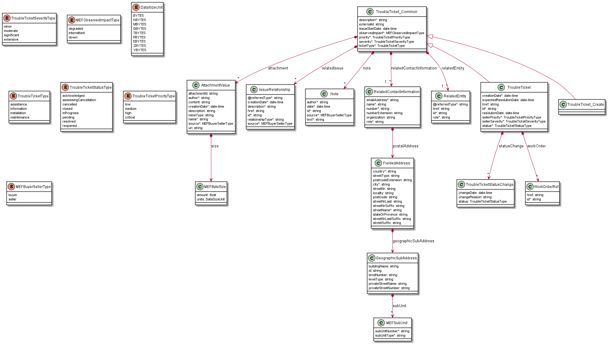
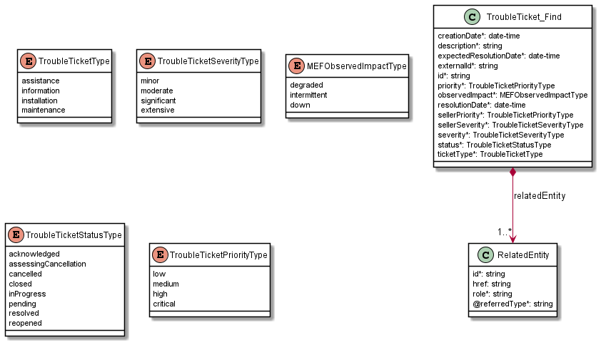
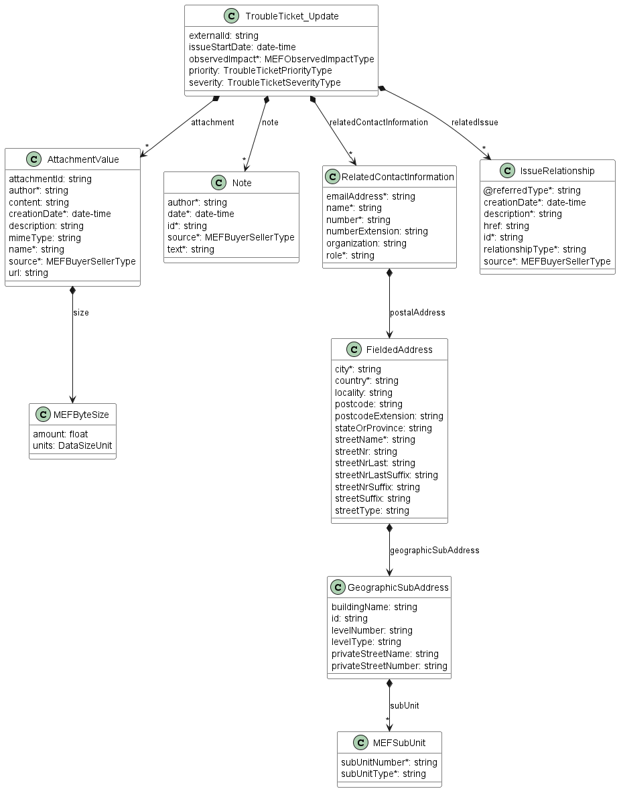
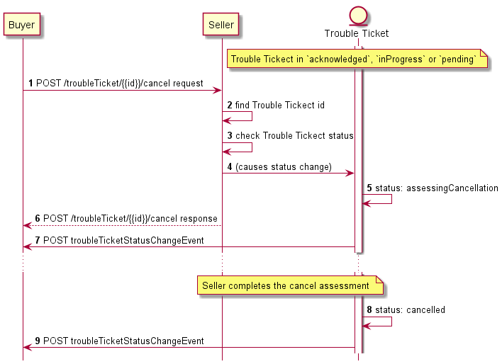
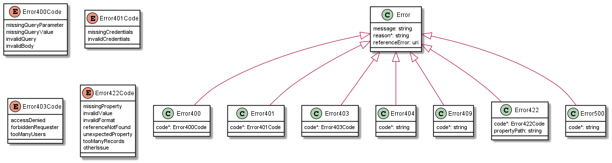
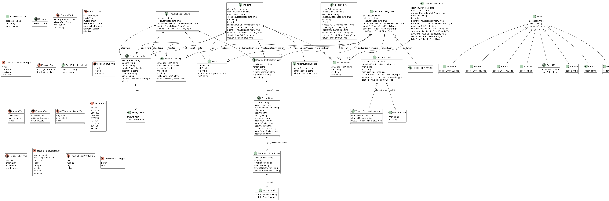

# Working Draft MEF W124 v0.1<!-- omit in toc -->

# **LSO Cantata and LSO Sonata Trouble Ticket Management API - Developer Guide** <!-- omit in toc -->

## **June 2021** <!-- omit in toc -->

<p style="color:red;font-weight:bold; font-size:18pt">This draft represents MEF work in progress and is subject to change.</p>

<div style="page-break-after: always;"></div>

**Disclaimer**

© MEF Forum 2021. All Rights Reserved.

The information in this publication is freely available for reproduction and
use by any recipient and is believed to be accurate as of its publication date.
Such information is subject to change without notice and MEF Forum (MEF) is not
responsible for any errors. MEF does not assume responsibility to update or
correct any information in this publication. No representation or warranty,
expressed or implied, is made by MEF concerning the completeness, accuracy, or
applicability of any information contained herein and no liability of any kind
shall be assumed by MEF as a result of reliance upon such information.

The information contained herein is intended to be used without modification by
the recipient or user of this document. MEF is not responsible or liable for
any modifications to this document made by any other party.

The receipt or any use of this document or its contents does not in any way
create, by implication or otherwise:

- (a) any express or implied license or right to or under any patent,
  copyright, trademark or trade secret rights held or claimed by any MEF member
  which are or may be associated with the ideas, techniques, concepts or
  expressions contained herein; nor

- (b) any warranty or representation that any MEF member will announce any
  product(s) and/or service(s) related thereto, or if such announcements are
  made, that such announced product(s) and/or service(s) embody any or all of
  the ideas, technologies, or concepts contained herein; nor

- (c) any form of relationship between any MEF member and the recipient or user
  of this document.

Implementation or use of specific MEF standards, specifications or
recommendations will be voluntary, and no Member shall be obliged to implement
them by virtue of participation in MEF Forum. MEF is a non-profit international
organization to enable the development and worldwide adoption of agile, assured
and orchestrated network services. MEF does not, expressly or otherwise,
endorse or promote any specific products or services.

**Copyright**

© MEF Forum 2021. Any reproduction of this document, or any portion thereof,
shall contain the following statement: "Reproduced with permission of MEF
Forum." No user of this document is authorized to modify any of the information
contained herein.

<div style="page-break-after: always;"></div>

**Table of Contents**

<!-- code_chunk_output -->

- [List of Contributing Members](#list-of-contributing-members)
- [1. Abstract](#1-abstract)
- [2. Terminology and Abbreviations](#2-terminology-and-abbreviations)
- [3. Compliance Levels](#3-compliance-levels)
- [4. Introduction](#4-introduction)
  - [4.1. Conventions in the Document](#41-conventions-in-the-document)
  - [4.2. Relation to Other Documents](#42-relation-to-other-documents)
  - [4.3. Approach](#43-approach)
  - [4.5. High-Level Flow](#45-high-level-flow)
- [5. API Description](#5-api-description)
  - [5.1. High-level use cases](#51-high-level-use-cases)
  - [5.2. API Endpoint and Operation Description](#52-api-endpoint-and-operation-description)
    - [5.2.1. Seller side API Endpoints](#521-seller-side-api-endpoints)
    - [5.2.2. Buyer side API Endpoints](#522-buyer-side-api-endpoints)
  - [5.3. Specifying the Buyer ID and the Seller ID](#53-specifying-the-buyer-id-and-the-seller-id)
  - [5.4. Model Structural Validation](#54-model-structural-validation)
  - [5.5. Security Considerations](#55-security-considerations)
- [6. API Interactions and Flows](#6-api-interactions-and-flows)
  - [6.1. Use case 1: Create Trouble Ticket](#61-use-case-1-create-trouble-ticket)
    - [6.1.1. Interaction flow](#611-interaction-flow)
    - [6.1.1. Create Trouble Ticket - Request](#611-create-trouble-ticket---request)
    - [6.1.2. Create Trouble Ticket - Response](#612-create-trouble-ticket---response)
    - [6.1.3. Trouble Ticket - Lifecycle](#613-trouble-ticket---lifecycle)
  - [6.2. Use Case 2: Retrieve Ticket List](#62-use-case-2-retrieve-ticket-list)
  - [6.3. Use Case 3: Retrieve Ticket by Ticket Identifier](#63-use-case-3-retrieve-ticket-by-ticket-identifier)
  - [6.4. Use Case 4: Patch Ticket by Ticket Identifier](#64-use-case-4-patch-ticket-by-ticket-identifier)
  - [6.5. Use case 5: Cancel Ticket by Ticket Identifier](#65-use-case-5-cancel-ticket-by-ticket-identifier)
  - [6.6 Use Case 6: Respond to Ticket Clearance Notification](#66-use-case-6-respond-to-ticket-clearance-notification)
  - [6.7. Use case 13: Register for Event Notifications](#67-use-case-13-register-for-event-notifications)
  - [6.14. Use case 14: Send Ticket Notification](#614-use-case-14-send-ticket-notification)
- [7. API Details](#7-api-details)
  - [7.1. API patterns](#71-api-patterns)
    - [7.1.1. Indicating errors](#711-indicating-errors)
    - [7.1.2. Response pagination](#712-response-pagination)
  - [7.2. Management API Data model](#72-management-api-data-model)
    - [7.2.1. TroubleTicket](#721-troubleticket)
    - [7.2.2. Common](#722-common)
    - [7.2.3. Notification registration](#723-notification-registration)
  - [7.3. Notification API Data model](#73-notification-api-data-model)
    - [7.3.1. Type Event](#731-type-event)
    - [7.3.2. Type TroubleTicketEvent](#732-type-troubleticketevent)
    - [7.3.3. `enum` TroubleTicketEventType](#733-enum-troubleticketeventtype)
- [8. References](#8-references)

<!-- /code_chunk_output -->

<div style="page-break-after: always;"></div>

# List of Contributing Members

The following members of the MEF participated in the development of this
document and have requested to be included in this list.

| Member |
| ------ |
|        |
|        |
|        |

**Table 1. Contributing Members**

# 1. Abstract

This standard is intended to assist implementation of the Quote functionality
defined for the LSO Cantata and LSO Sonata Interface Reference Points (IRPs),
for which requirements and use cases are defined in MEF 113 _Trouble Ticketing
Requirements and Use Cases_ [[MEF113](#8-references)]. This standard consists
of this document and complementary API definitions for Trouble Ticket
Management and Trouble Ticket Notification.

This standard normatively incorporates the following files by reference as if
they were part of this document, from the GitHub repository

<https://github.com/MEF-GIT/MEF-LSO-Sonata-SDK>

- `productApi/troubleTicket/troubleTicketManagement.api.yaml`
- `productApi/troubleTicket/troubleTicketNotification.api.yaml`

<https://github.com/MEF-GIT/MEF-LSO-Cantata-SDK>

- `productApi/troubleTicket/troubleTicketManagement.api.yaml`
- `productApi/troubleTicket/troubleTicketNotification.api.yaml`

The Trouble Ticket API is defined using OpenAPI 3.0 [[OAS-V3](#8-references)]

# 2. Terminology and Abbreviations

This section defines the terms used in this document. In many cases, the
normative definitions of terms are found in other documents. In these cases,
the third column is used to provide the reference that is controlling, in other
MEF or external documents.

<table>
<tr>
  <th>Term</th>
  <th>Description</th>
  <th>Reference</th>
</tr>
<tr>
  <td>Application Program Interface (API)</td>
  <td>In the context of LSO, API describes one of the Management Interface Reference Points based on the requirements specified in an Interface Profile, along with a data model, the protocol that defines operations on the data and the encoding format used to encode data according to the data model. In this document, API is used synonymously with REST API.</td>
  <td><a href="#8-references">[MEF55.1]</td>
</tr>
<tr>
  <td>Buyer</td>
  <td>In the context of this document, denotes the organization or individual acting as the customer in a transaction over a Cantata (Customer <-> Service Provider) or Sonata (Service Provider <-> Partner) Interface.</td>
  <td>This document; adapted from <a href="#8-references">[MEF80]</td>
</tr>
<tr>
  <td>Requesting Entity</td>
  <td>The business organization that is acting on behalf of one or more Buyers. In the most common case, the Requesting Entity represents only one Buyer and these terms are then synonymous.</td>
  <td><a href="#8-references">[MEF79]</a></td>
</tr>
<tr>
  <td>Responding Entity</td>
  <td>The business organization that is acting on behalf of one or more Sellers. In the most common case, the Responding Entity represents only one Seller and these terms are then synonymous.</td>
  <td><a href="#8-references">[MEF79]</a></td>
</tr>
<tr>
  <td>REST API</td>
  <td>Representational State Transfer. REST provides a set of architectural constraints that, when applied as a whole, emphasizes scalability of component interactions, generality of interfaces, independent deployment of components, and intermediary components to reduce interaction latency, enforce security, and encapsulate legacy systems.</td>
  <td><a href="#8-references">[REST]</a> </td>
</tr>
<tr>
  <td>Seller</td>
  <td>In the context of this document, denotes the organization acting as the supplier in a transaction over a Cantata (Customer <-> Service Provider) or Sonata (Service Provider <-> Partner) Interface.</td>
  <td>This document; adapted from <a href="#8-references">[MEF80]</td>
</tr>
</table>

# 3. Compliance Levels

The key words **"MUST"**, **"MUST NOT"**, **"REQUIRED"**, **"SHALL"**, **"SHALL
NOT"**, **"SHOULD"**, **"SHOULD NOT"**, **"RECOMMENDED"**, **"NOT
RECOMMENDED"**, **"MAY"**, and **"OPTIONAL"** in this document are to be
interpreted as described in BCP 14 (RFC 2119 [[rfc2119](#8-references)], RFC
8174 [[rfc8174](#8-references)]) when, and only when, they appear in all
capitals, as shown here. All key words must be in bold text.

Items that are **REQUIRED** (contain the words **MUST** or **MUST NOT**) are
labeled as **[Rx]** for required. Items that are **RECOMMENDED** (contain the
words **SHOULD** or **SHOULD NOT**) are labeled as **[Dx]** for desirable.
Items that are **OPTIONAL** (contain the words MAY or OPTIONAL) are labeled as
**[Ox]** for optional.

# 4. Introduction

The Trouble Ticket API allows the Buyer to create, retrieve, and update Trouble
Tickets as well as receive notifications and Trouble Tickets' updates. This
allows managing issues and situations that are not part of normal operations of
the Product provided by the Seller.

This standard specification document describes the Application Programming
Interface (API) for Trouble Ticketing functionality of the LSO Cantata
Interface Reference Point (IRP) and LSO Sonata IRP as defined in the _MEF 55.1
Lifecycle Service Orchestration (LSO): Reference Architecture and Framework_
[[MEF55.1](#8-references)]. The LSO Reference Architecture is shown in Figure 1
with both IRPs highlighted.


**Figure 1. The LSO Reference Architecture**

Cantata and Sonata IRPs define pre-ordering and ordering functionalities that
allow an automated exchange of information between business applications of the
Buyer (Customer or Service Provider) and Seller (Service Provider or Partner)
Domains. Those are:

- Product Catalog
- Address Validation
- Site Retrieval
- Product Offering Qualification
- Product Quote
- Product Inventory
- Product Ordering
- Trouble Ticketing
- Billing

The business requirements and use cases for Trouble Ticketing are defined in
MEF W113 _Trouble Ticketing Requirements and Use Cases_
[[MEF113](#8-references)]. This document refers to the Draft Standard (R1)
version, May 2021. MEF W113 in this version defines use cases that cover
Trouble Ticket, Incident, Appointment and Workorder. This API and Developer
Guide cover only the Trouble Ticket related use cases, basing on the
[[TMF621](#8-references)] Trouble Ticket API.

This document is structured as follows:

- [Chapter 4](#4-introduction) provides an introduction to Trouble Ticketing
  and its description in a broader context of Cantata and Sonata and their
  corresponding SDKs.
- [Chapter 5](#5-api-description) gives an overview of endpoints, resource
  model and design patterns.
- Use cases and flows are presented in
  [Chapter 6](#6-api-interactions-and-flows).
- And finally, [Chapter 7](#7-api-details) complements previous sections with a
  detailed API description.

## 4.1. Conventions in the Document

- Code samples are formatted using code blocks. When notation `<< some text >>`
  is used in the payload sample it indicates that a comment is provided instead
  of an example value and it might not comply with the OpenAPI definition.
- Model definitions are formatted as in-line code (e.g. `TroubleTicket`).
- In UML diagrams the default cardinality of associations is `0..1`. Other
  cardinality markers are compliant with the UML standard.
- In the API details tables and UML diagrams required attributes are marked
  with a `*` next to their names.
- In UML sequence diagrams `{{variable}}` notation is used to indicates a
  variable to be substituted with a correct value.

## 4.2. Relation to Other Documents

This API implements the Trouble Ticket related requirements and use cases that
are defined in MEF 113 [[MEF113](#8-references)]. The API definition builds on
_TMF621 Trouble Ticket API REST Specification R19.0.1_
[[TMF621](#8-references)].

## 4.3. Approach

As presented in Figure 2. both Cantata and Sonata API frameworks consists of
three structural components:

- Generic API framework
- Product-independent information (Function-specific information and
  Function-specific operations)
- Product-specific information (MEF product specification data model)


**Figure 2. Cantata and Sonata API framework**

The essential concept behind the framework is to decouple the common structure,
information and operations from the specific product information content.  
Firstly, the Generic API Framework defines a set of design rules and patterns
that are applied across all Cantata or Sonata APIs.  
Secondly, the product-independent information of the framework focuses on a
model of a particular Cantata or Sonata functionality and is agnostic to any of
the product specifications.  
Finally, the product-specific information part of the framework focuses on MEF
product specifications that define business-relevant attributes and
requirements for trading MEF subscriber and MEF operator services.

The Trouble Ticket is product-agnostic in it's nature and is not intended to
carry any product-specific payloads. It only references product from the
inventory by `id`. It operates using the Generic API Framework and the
Function-specific Information and Operations.

## 4.5. High-Level Flow

Trouble Ticket is part of a broader Cantata and Sonata End-to-End flow.
Figure 3. below shows a high-level diagram to get a good understanding of the
whole process and Trouble Ticket's position within it.


**Figure 3. Cantata and Sonata End-to-End Function Flow**

- Address Validation:
  - Allows the Buyer to retrieve address information from the Seller, including
    exact formats, for addresses known to the Seller.
- Site Retrieval:
  - Allows the Buyer to retrieve Geographic Site information including exact
    formats for Geographic Sites known to the Seller.
- Product Offering Qualification (POQ):
  - Allows the Buyer to check whether the Seller can deliver a product or set
    of products from among their product offerings at the geographic address or
    a Geographic Site specified by the Buyer; or modify a previously purchased
    product.
- Quote:
  - Allows the Buyer to submit a request to find out how much the installation
    of an instance of a Product Offering, an update to an existing Product, or
    a disconnect of an existing Product will cost.
- Product Order:
  - Allows the Buyer to request the Seller to initiate and complete the
    fulfillment process of an installation of a Product Offering, an update to
    an existing Product, or a disconnect of an existing Product at the address
    defined by the Buyer.
- Product Inventory:
  - Allows the Buyer to retrieve the information about existing Product
    instances from Seller's Product Inventory.
- Trouble Ticketing:
  - Allows the Buyer to create, retrieve, and update Trouble Tickets as well as
    receive notifications about Incidents' and Trouble Tickets' updates. This
    allows managing issues and situations that are not part of normal
    operations of the Product provided by the Seller.

# 5. API Description

This section presents the API structure and design patterns. It starts with the
high-level use cases diagram. Then it describes the REST endpoints with use
case mapping. Next, it gives an overview of the API resource model.

## 5.1. High-level use cases

Figure 4 presents a high-level use case diagram as specified in MEF 113
[[MEF113](#8-references)] in section 7. This picture aims to help understand
the endpoint mapping. Use cases are described extensively in
[chapter 6](#6-api-interactions-and-flows).

**_Note:_** As stated earlier this API implements only the Trouble Ticket
related use cases (numbers 1-6, 13, 14). The diagram below lists all use cases
defined in MEF 113 to highlight which of them are implemented. For easier
requirements matching this documents keep the original numbering. The remaining
use cases will be delivered by separate APIs delivered by MEF in future
releases.


**Figure 4: Use cases**

## 5.2. API Endpoint and Operation Description

### 5.2.1. Seller side API Endpoints

**BasePath for Cantata**:
`https://{{server}}:{{port}}{{?/seller_prefix}}/mefApi/cantata/troubleTicket/v1/`

**BasePath for Sonata**:
`https://{{server}}:{{port}}{{?/seller_prefix}}/mefApi/sonata/troubleTicket/v1/`

The following API endpoints are implemented by the Seller and allow the Buyer
to create, retrieve, modify Trouble Tickets and register for Notifications. The
endpoints and corresponding data model are defined in
`productApi/troubleTicket/troubleTicketManagement.api.yaml`.

| API endpoint                                                                | Description                                                                                                                                                                                                                                                                                                                      | MEF 113 Use Case mapping                       |
| --------------------------------------------------------------------------- | -------------------------------------------------------------------------------------------------------------------------------------------------------------------------------------------------------------------------------------------------------------------------------------------------------------------------------- | ---------------------------------------------- |
| `POST /troubleTicket`                                                       | A request initiated by the Buyer to create a Ticket in the Seller's system to report an Issue experienced by the Buyer.                                                                                                                                                                                                          | UC 1: Create Ticket Request                    |
| `GET /troubleTicket`                                                        | The Buyer requests a list of Tickets from the Seller based on a set of specified filter criteria. The Seller returns a summarized list of Tickets.                                                                                                                                                                               | UC 2: Retrieve Ticket List                     |
| `GET /troubleTicket/{{id}}`                                                 | The Buyer requests detailed information about a single Ticket based on a Ticket Identifier.                                                                                                                                                                                                                                      | UC 3: Retrieve Ticket by Ticket Identifier     |
| `PATCH /troubleTicket/{{id}}`                                               | A request by the Buyer to patch/partial up-date a Ticket created by the Buyer in the Seller's system.                                                                                                                                                                                                                            | UC 4: Patch Ticket by Ticket Identifier        |
| `POST /troubleTicket/{{id}}/cancel`                                         | A request by the Buyer to cancel a Ticket created by the Buyer in the Seller's system.                                                                                                                                                                                                                                           | UC 5: Cancel Ticket by Ticket Identifier       |
| `POST /troubleTicket/{{id}}/close`</br> `POST /troubleTicket/{{id}}/reopen` | A request from the Buyer confirming that a Ticket created by the Buyer in the Seller's system can be closed, since the reported Issue is no longer observed. This request is the action taken by a Buyer after receiving a Ticket Notification from the Seller with Ticket Notification Event Type `TroubleTicketResolvedEvent`. | UC 6: Respond to Ticket Clearance Notification |
| `POST /hub`                                                                 | The Buyer requests to subscribe to notifications.                                                                                                                                                                                                                                                                                | UC 13: Register for Event Notifications        |
| `GET /hub/{{id}}`                                                           | A request initiated by the Buyer to retrieve the details of the notification subscription.                                                                                                                                                                                                                                       | UC 13: Register for Event Notifications        |
| `DELETE /hub/{{id}}`                                                        | A request initiated by the Buyer to instruct the Seller to stop sending notifications.                                                                                                                                                                                                                                           | UC 13: Register for Event Notifications        |

**Table 2. Seller side API endpoints**

### 5.2.2. Buyer side API Endpoints

**BasePath for Cantata**:
`https://{{server}}:{{port}}{{?/seller_prefix}}/mefApi/cantata/troubleTicketNotification/v1/`

**BasePath for Sonata**:
`https://{{server}}:{{port}}{{?/seller_prefix}}/mefApi/sonata/troubleTicketNotification/v1/`

The following API Endpoints are used by the Seller to post notifications to
registered listeners. The endpoints and corresponding data model are defined in
`productApi/troubleTicket/troubleTicketNotification.api.yaml`

| API Endpoint                                            | Description                                                                                                                     | MEF 113 Use Case Mapping        |
| ------------------------------------------------------- | ------------------------------------------------------------------------------------------------------------------------------- | ------------------------------- |
| `POST /listener/troubleTicketAttributeValueChangeEvent` | A request initiated by the Seller to notify the Buyer on `TroubleTicket` attribute value change.                                | UC 14: Send Ticket Notification |
| `POST /listener/troubleTicketStatusChangeEvent`         | A request initiated by the Seller to notify the Buyer on `TroubleTicket` state change.                                          | UC 14: Send Ticket Notification |
| `POST /listener/troubleTicketResolvedEvent`             | A request initiated by the Seller to notify the Buyer on `TroubleTicket` reaching the `resolved` state.                         | UC 14: Send Ticket Notification |
| `POST /listener/troubleTicketInformationRequiredEvent`  | A request initiated by the Seller to notify the Buyer that and additional information is required for further Ticket processing | UC 14: Send Ticket Notification |

**Table 3. Buyer side API endpoints**

## 5.3. Specifying the Buyer ID and the Seller ID

A business entity willing to represent multiple Buyers or multiple Sellers must
follow requirements of MEF 79 [[MEF79](#8-references)] chapter 8.8, which
states:

> For requests of all types, there is a business entity that is initiating an
> Operation (called a Requesting Entity) and a business entity that is
> responding to this request (called the Responding Entity). In the simplest
> case, the Requesting Entity is the Buyer and the Responding Entity is the
> Seller. However, in some cases, the Requesting Entity may represent more than
> one Buyer and similarly, the Responding Entity may represent more than one
> Seller.
>
> While it is outside the scope of this specification, it is assumed that the
> Requesting Entity and the Responding Entity are aware of each other and can
> authenticate requests initiated by the other party. It is further assumed
> that both the Buying Entity and the Requesting Entity know:
>
> a) the list of Buyers the Requesting Entity represents when interacting with
> this Responding Entity; and  
> b) the list of Sellers that this Responding Entity represents to this
> Requesting Entity.

In the API the `buyerId` and `sellerId` are represented as query parameters in
each operation defined in `troubleTicketManagement.api.yaml` and as attributes
of events as described in `troubleTicketNotification.api.yaml`.

**[RXXX]** If the Requesting Entity has the authority to represent more than
one Buyer the request **MUST** include `buyerId` query parameter that
identifies the Buyer being represented [MEF79 R80]

**[RXXX]** If the Requesting Entity represents precisely one Buyer with the
Responding Entity, the request **MUST NOT** specify the `buyerId` [MEF79 R81]

**[RXXX]** If the Responding Entity represents more than one Seller to this
Buyer the request **MUST** include `sellerId` query parameter that identifies
the Seller with whom this request is associated [MEF79 R82]

**[RXXX]** If the Responding Entity represents precisely one Seller to this
Buyer, the request **MUST NOT** specify the `sellerId` [MEF79 R83]

**[RXXX]** If `buyerId` or `sellerId` attributes were specified in the request
same attributes **MUST** be used in the notification payload.

## 5.4. Model Structural Validation

The structure of the HTTP payloads exchanged via Trouble Ticket API endpoints
is defined using OpenAPI version 3.0.

**[RXXX]** Implementations **MUST** use payloads that conform to these
definitions.

## 5.5. Security Considerations

There must be an authentication mechanism whereby a Seller can be assured who a
Buyer is and vice-versa. There must also be authorization mechanisms in place
to control what a particular Buyer or Seller is allowed to do and what
information may be obtained. However, the definition of the exact security
mechanism is outside the scope of this document. It is being worked on by a
separate MEF Project and will be applied to the APIs once provided as a
standard.

# 6. API Interactions and Flows

This section provides a detailed insight into the API functionality, use cases,
and flows. It starts with Table 4 presenting a list and short description of
all business use cases then presents the variants of end-to-end interaction
flows, and in following subchapters describes the API usage flow and examples
for each of the use cases.

| Use Case # | Use Case Name                            | Use Case Description                                                                                                                                                                                                                                                                                                             |
| ---------- | ---------------------------------------- | -------------------------------------------------------------------------------------------------------------------------------------------------------------------------------------------------------------------------------------------------------------------------------------------------------------------------------- |
| 1          | Create Ticket Request                    | A request initiated by the Buyer to create a Ticket in the Seller's system to report an Issue experienced by the Buyer.                                                                                                                                                                                                          |
| 2          | Retrieve Ticket List                     | The Buyer requests a list of Tickets from the Seller based on a set of specified filter criteria. The Seller returns a summarized list of Tickets.                                                                                                                                                                               |
| 3          | Retrieve Ticket by Ticket Identifier     | The Buyer requests detailed information about a single Ticket based on a Ticket Identifier.                                                                                                                                                                                                                                      |
| 4          | Patch Ticket by Ticket Identifier        | A request by the Buyer to patch/partial update a Ticket created by the Buyer in the Seller's system.                                                                                                                                                                                                                             |
| 5          | Cancel Ticket by Ticket Identifier       | A request by the Buyer to cancel a Ticket created by the Buyer in the Seller's system.                                                                                                                                                                                                                                           |
| 6          | Respond to Ticket Clearance Notification | A request from the Buyer confirming that a Ticket created by the Buyer in the Seller's system can be closed, since the reported Issue is no longer observed. This request is the action taken by a Buyer after receiving a Ticket Notification from the Seller with Ticket Notification Event Type `TroubleTicketResolvedEvent`. |
| 13         | Register for Event Notifications         | The Buyer requests to subscribe to Ticket Notifications and optionally Incident Notifications.                                                                                                                                                                                                                                   |
| 14         | Send Ticket Notification                 | The Seller sends a notification regarding a Ticket to the Buyer (if registered) indicating one of the following Ticket Notification Event Type has occurred:                                                                                                                                                                     |

The detailed business requirements of each of the use cases are described in
sections 7 and 8 of MEF 113 [[MEF113](#8-references)].

## 6.1. Use case 1: Create Trouble Ticket

This is the initial step for Trouble Ticket processing.

### 6.1.1. Interaction flow

The flow of this use case is very simple and is described in Figure 5.


**Figure 5: Use Case 1 - Trouble Ticket create request flow**

The Buyer sends a request with a `TroubleTicket_Create` type in the body. The
Seller performs request validation, assigns an `id`, and returns
`TroubleTicket` type in the response body, with a `state` set to
`acknowledged`. From this point, the Trouble Ticket is ready for further
processing. The Buyer must track the progress of the process by subscribing for
notifications (see
[chapter 6.7](#67-use-case-13-register-for-event-notifications). The flow
example with use of Notifications is presented on Figure 6


**Figure 6: Trouble Ticket progress tracking - Notifications**

**_Note_**: The context of notifications is not a part of the considered use
case itself. It is presented to show the big picture of end-to-end flow. This
applies also to all further use case flow diagrams with notifications.

### 6.1.1. Create Trouble Ticket - Request

Figure 7 presents the data model of the Trouble Ticket. The model of the
request message (`TroubleTicket_Create`) is a subset of the `TroubleTicket`
model and contains only attributes that can (or must) be set by the Buyer. The
Seller then enriches the entity in the response with additional information.
For visibility of these shared attributes the `TroubleTicket_Common` has been
introduced. Though, it is not to be used directly in the payload.

The full list of attributes is available in [Section 7](#7-api-details) and in
the API specification which is an integral part of this standard.



**Figure 7: Create Trouble Ticket Model**

The snippet below presents an example of the Create Trouble Ticket Request:

**`TroubleTicket` Create**

```json
{
  "description": "Connection is lost",
  "externalId": "BuyerTicket-123",
  "issueStartDate": "2021-06-02T14:21:11.090Z",
  "priority": "critical",
  "severity": "extensive",
  "ticketType": "failure",
  "attachment": [
    {
      "attachmentId": "att-001",
      "author": "John Example",
      "creationDate": "2021-06-02T14:21:11.090Z",
      "description": "Print screen from the assurance system",
      "mimeType": "image/jpeg",
      "name": "Alarm",
      "url": "https://example.com/documents/00000000-0000-1111-2222-000000001111",
      "size": {
        "amount": 5.3,
        "units": "MBYTES"
      },
      "source": "buyer"
    }
  ],
  "note": [
    {
      "id": "note-1",
      "author": "John Example",
      "date": "2021-06-02T14:25:11.090Z",
      "source": "buyer",
      "text": "Couldn't reach the support on phone."
    }
  ],
  "relatedEntity": [ <<A relation to a Product that this Ticket refers to>>
    {
      "id": "01494079-6c79-4a25-83f7-48284196d44d",
      "role": "Issue Source",
      "@referredType": "Product"
    }
  ],
  "relatedContactInformation": [
    {
      "emailAddress": "john.example@example.com",
      "name": "John Example",
      "number": "+12-345-678-90",
      "organization": "Buyer Example Co.",
      "role": "reporterContact"
    }
  ]
}
```

**[RXXX]** The Buyer's Create request **MUST** include the following
attributes: [MEF113 R18]

- `relatedEntity` - (pointer to related Product instance)
- `description`
- `severity`
- `priority`
- `ticketType`
- `relatedContactInformation` items with a `role` set to `reporterContact`

**[RXXX]** If the `attachment` is provided, either the `attachment.url` or
`attachment.content` **MUST** be specified. [MEF113 R19]

**_Note:_** The `relatedEntity` attribute is used to provide the related
product `id`. It is done by setting the additional `@referredType` to
`Product`. This follows the TMF pattern which enables compliance and allows
referring also other potential types in MEF (e.g.`Service`). In this version
the only type that is mentioned in the implemented requirements document is the
`Product` and to ease the request `RelatedEntity.@ReferredType` and the
`relatedEntityType` in the filter criteria have a default value: `Product`.

### 6.1.2. Create Trouble Ticket - Response

The Seller responds with a `TroubleTicket` type, which adds some attribute to
the `TroubleTicket_Create` that was used in the request.

**_Note_**: The term "Seller Response Code" used in the Business Requirements
maps to HTTP response code, where `2xx` indicates _Success_ and `4xx` or `5xx`
indicate _Failure_.

The following snippet presents the Seller's response. It has the same structure
as in the retrieve by identifier operation.

```json
{
  "id": "00000000-4444-5555-6666-000000000987",
  "href": "{{baseUrl}}/troubleTicket/00000000-4444-5555-6666-000000000987",
  "creationDate": "2021-06-02T20:56:08.559Z",
  "expectedResolutionDate": "2021-06-03T20:56:08.559Z",
  "lastUpdate": "2021-06-02T20:56:08.559Z",
  "sellerPriority": "critical",
  "sellerSeverity": "extensive",
  "status": "acknowledged",
  "description": "Connection is lost", << as provided by the Buyer >>
  "externalId": "BuyerTicket-123", << as provided by the Buyer >>
  "issueStartDate": "2021-06-02T14:21:11.090Z", << as provided by the Buyer >>
  "priority": "critical", << as provided by the Buyer >>
  "severity": "extensive", << as provided by the Buyer >>
  "ticketType": "failure", << as provided by the Buyer >>
  "attachment": [
    { << as provided by the Buyer >>
      "attachmentId": "att-001",
      "author": "John Example",
      "creationDate": "2021-06-02T14:21:11.090Z",
      "description": "Print screen from the assurance system",
      "mimeType": "image/jpeg",
      "name": "Alarm",
      "url": "https://example.com/documents/00000000-0000-1111-2222-000000001111",
      "size": {
        "amount": 5.3,
        "units": "MBYTES"
      },
      "source": "buyer"
    }
  ],
  "note": [
    {<< as provided by the Buyer >>
      "id": "note-1",
      "author": "John Example",
      "date": "2021-06-02T14:25:11.090Z",
      "source": "buyer",
      "text": "Couldn't reach the support on phone."
    }
  ],
  "relatedEntity": [ <<A relation to a Product that this Ticket refers to>>
    {<< as provided by the Buyer >>
      "id": "01494079-6c79-4a25-83f7-48284196d44d",
      "role": "Issue Source",
      "@referredType": "Product"
    }
  ],
  "relatedContactInformation": [
    {<< as provided by the Buyer >>
      "emailAddress": "john.example@example.com",
      "name": "John Example",
      "number": "+12-345-678-90",
      "organization": "Buyer Example Co.",
      "role": "reporterContact"
    },
    {<< a new item appended by the Buyer >>
      "emailAddress": "Seller.TicketContact@example.com",
      "name": "Seller Ticket Contact",
      "number": "+98-765-432-10",
      "organization": "Seller Example Co.",
      "role": "sellerTicketContact"
    }
  ],
  "troubleTicketRelationship": [
    {
      "id": "string",
      "href": "string",
      "creationDate": "2021-06-02T20:56:08.559Z",
      "description": "string",
      "relationshipType": "string",
      "source": "buyer"
    }
  ],
  "statusChange": [
    {
      "changeDate": "2021-06-02T20:56:08.560Z",
      "status": "acknowledged"
    }
  ]
}
```

The response to the create request does not contain all possible attributes.
The `resolutionDate` is valid only in the future lifecycle of the
`TroubleTicket`.

**[RXXX]** The Seller's response **MUST** include all and unchanged attributes'
values provided in the request. [MEF113 R22]

These attributes are indicated above with an appropriate comment:
`<< as provided by the Buyer >>`.

**[RXXX]** The Seller **MUST** specify the following attributes in a response:
[MEF113 R24]

- `id`
- `relatedEntity` - (pointer to related Product instance)
- `sellerSeverity`
- `sellerPriority`
- `creationDate`
- `state`
- `relatedContactInformation` items with a `role` set to `sellerTicketContact`

**[RXXX]** The `state` of the Ticket in the Seller's response **MUST** be
`acknowledged`. [MEF113 R23]

### 6.1.3. Trouble Ticket - Lifecycle

Figure 8 presents the Trouble Ticket state machine:


**Figure 8: Trouble Ticket State Machine**

After receiving the request, the Seller performs a validation of the message.
If any problem is found an Error response is provided. If the validation passes
a response is provided with `TroubleTicket` in `acknowledged` state. Then the
Seller starts working on resolving the issue and moves the Ticket to
`inProgress` state. From there an additional information might be required to
proceed and the Ticket moves to `pending` until one is provided. The Ticket is
set as `resolved` when the Seller claims the issue is fixed. From the the Buyer
can either reopen or close the Ticket (use cases described in following
sections). The Buyer may also request for a Ticket to be cancelled, while in
`acknowledged`, `pending`, or `inProgress` state.

Table 4 presents the mapping between the API `state` names (aligned with TMF)
and the MEF 113 naming, together with states' description.

| state                   | MEF 113 name           | Description                                                                                                                                                                                                                                                                                                                                                                                                                                                                                                               |
| ----------------------- | ---------------------- | ------------------------------------------------------------------------------------------------------------------------------------------------------------------------------------------------------------------------------------------------------------------------------------------------------------------------------------------------------------------------------------------------------------------------------------------------------------------------------------------------------------------------- |
| `acknowledged`          | ACKNOWLEDGED           | A request to create a Ticket was received and accepted by the Seller. The Ticket has been validated and created by the Seller and allocated a unique `id`.                                                                                                                                                                                                                                                                                                                                                                |
| `inProgress`            | IN_PROGRESS            | The Ticket is in the process of being handled and investigated for resolution by the Seller.                                                                                                                                                                                                                                                                                                                                                                                                                              |
| `resolved`              | RESOLVED               | The Buyer's Issue described in the Ticket was resolved by the Seller. The Seller is now waiting for the Buyer to confirm that the Issue they reported is no longer observed.                                                                                                                                                                                                                                                                                                                                              |
| `closed`                | CLOSED                 | The Buyer that created the Ticket has confirmed that the Issue they reported is no longer observed, or the pre-defined time frame (agreed upon between Buyer and Seller) for confirming that the Issue has been resolved has passed without a response by the Buyer. This is a terminal state.                                                                                                                                                                                                                            |
| `reopened`              | REOPENED               | The Buyer has confirmed that the Issue described in the Ticket has not been resolved satisfactorily and rejected the Seller's request to close the Ticket. The Ticket has been reopened and is waiting to continue being handled and investigated for resolution by the Seller.                                                                                                                                                                                                                                           |
| `pending`               | PENDING                | The Seller is waiting on additional information in order to continue the handling of the Ticket. This may result in the clock being stopped for the service level agreement until the Buyer has responded to the request.                                                                                                                                                                                                                                                                                                 |
| `assessingCancellation` | ASSESSING_CANCELLATION | A request has been made by the Buyer to cancel the Ticket and is being assessed by the Seller to determine whether to just close the Ticket, or may also choose to resolve the Issue to prevent similar Create Ticket requests from other Buyers. If the Seller chooses to resolve the Issue, the Seller might create an Incident or an internal Ticket for the Issue, but that is outside the scope of this document. After the Seller has completed the assessment, the Seller updates the Ticket State to `cancelled`. |
| `cancelled`             | CANCELLED              | The Ticket has been successfully cancelled by the Buyer. This is a terminal state.                                                                                                                                                                                                                                                                                                                                                                                                                                        |

**Table 5: Trouble Ticket states**

**[RXXX]** The Seller **MUST** support all Ticket States and their associated
state transitions as described of Figure 8 and Table 5. [MEF113 R141]

**[OXXX]** The Seller **MAY** append an item to `relatedContactInformation`,
`note`, `attachment`, or `troubleTicketRelationship` if required [MEF113 O6],
[MEF113 O7], [MEF113 O8], [MEF113 O9].

**[RXXX]** The Seller **MUST NOT** modify or delete any items provided by the
Buyer in following lists: `relatedContactInformation`, `note`, `attachment`, or
`troubleTicketRelationship`. [MEF113 R26], [MEF113 R27], [MEF113 R28].

**[RXXX]** The Seller **MUST NOT** modify or delete any items provided by the
Buyer in following lists: `relatedContactInformation`, `note`, `attachment`, or
`troubleTicketRelationship`. [MEF113 R26], [MEF113 R27].

**[RXXX]** The Seller MUST add a Note as specified in section 8.1.3 when any of
the following Ticket attributes are updated: [MEF113 R25]

- `expectedResolutionDate`
- `troubleTicketRelationship`

## 6.2. Use Case 2: Retrieve Ticket List

The Buyer can retrieve a list of Trouble Tickets by using a
`GET /troubleTicket` operation with desired filtering criteria. The attributes
that are available to be used are: [MEF113 O11]

- `externalId`
- `priority`
- `sellerPriority`
- `severity`
- `sellerSeverity`
- `ticketType`
- `status`
- `relatedEntityId`
- `relatedEntityType`
- `creationDate.gt`
- `creationDate.lt`
- `expectedResolutionDate.gt`
- `expectedResolutionDate.lt`
- `resolutionDate.gt`
- `resolutionDate.lt`

The Buyer may also ask for pagination with the use of the `offset` and `limit`
parameters. The filtering and pagination attributes must be specified in URI
query format [RFC3986](#8-references). Section
[7.1.2.](#712-response-pagination) provides details about the implementation of
pagination mechanism.

```
https://serverRoot/mefApi/sonata/troubleTicket/v1/troubleTicket?state=inProgress&priority=critical
```

The example above shows a Buyer's request to get all Trouble Tickets that are
in the `inProgress` state and with `critical priority`. The correct response
(HTTP code `200`) in the response body contains a list of `TroubleTicket_Find`
objects matching the criteria. To get more details (e.g. the item level
information), the Buyer has to query a specific `TroubleTicket` by `id`.

**[RXXX]** The Seller **MUST** put the following attributes into the
`TroubleTicket_Find` object in the response: [MEF113 R31]:

- `id`
- `externalId`
- `relatedEntity`
- `description`
- `priority`
- `sellerPriority`
- `severity`
- `sellerSeverity`
- `ticketType`
- `status`
- `creationDate`
- `expectedResolutionDate`
- `resolutionDate`

**[RXXX]** In case no items matching the criteria are found, the Seller
**MUST** return a valid response with an empty list. [MEF113 R31]



**Figure 9: Use Case 3: Retrieve Ticket List - Model**

## 6.3. Use Case 3: Retrieve Ticket by Ticket Identifier

The Buyer can get detailed information about the Trouble Ticket from the Seller
by using a `GET /troubleTicket/{{id}}` operation.

**[RXXX]** In case `id` does not allow to find a `TroubleTicket` instance in
Seller's system, an error response `Error404` **MUST** be returned. [MEF113
R34]

**[RXXX]** The Seller **MUST** put the following attributes into the
`TroubleTicket` object in the response: [MEF113 R37]

- `id`
- `relatedEntity`
- `description`
- `priority`
- `sellerPriority`
- `severity`
- `sellerSeverity`
- `ticketType`
- `status`
- `creationDate`

**[RXXX]** The Seller's response to a Retrieve Ticket by Ticket Identifier
request **MUST** include the `resolutionDate` and a `note` by the Seller
describing how the Ticket was resolved if the Ticket State is `closed` or
`resolved`. [MEF113 R39]

## 6.4. Use Case 4: Patch Ticket by Ticket Identifier

The update operation is realized with the use of the REST PATCH operation. For
that purpose a specialized type `TroubleTicket_Update` is provided. It consists
attributes limited to a subset that includes only the Buyer updateable
attributes.

The PATCH usage recommendation follows TMF 621 json/merge
(https://tools.ietf.org/html/rfc7386).

Figure 10 presents the model used in the PATCH request. The Seller responds
with a `TroubleTicket` type.



**Figure 10: Patch request Model**

**[RXXX]** The Buyer **MUST** include at least one of the following attributes
of `TroubleTicketUpdate` in the PATCH request: [MEF113 R41]

- `externalId`
- `priority`
- `severity`
- `issueStartDate`
- `note`
- `relatedContactInformation`
- `troubleTicketRelationship`

**[RXXX]** The Buyer **MUST** add a `note` to a Ticket when any of the
following Ticket attributes is patched: [MEF113 R42]

- `priority`
- `severity`
- `issueStartDate`
- `troubleTicketRelationship`

**[RXXX]** In case `id` does not allow to find a `TroubleTicket` that is to be
updated in Seller's system, an error response `Error404` **MUST** be returned.
[MEF113 R45]

**[RXXX]** The Seller **MUST** return an error if the Ticket State is `closed`,
`assessingCancellation` or `cancelled`.[MEF113 R48]

The example below shows a request to:

- add a new `note` (existing cannot be modify or deleted)
- change details of Buyer's `reporterContact`

```json
{
  "note": [
    {<<previously existing>>
      "id": "note-1",
      "author": "John Example",
      "date": "2021-06-02T14:25:11.090Z",
      "source": "buyer",
      "text": "Couldn't reach the support on phone."
    },
    {<<added new note>>
      "id": "note-2",
      "author": "Kate Example",
      "date": "2021-06-02T19:25:11.090Z",
      "source": "buyer",
      "text": "Support reached after 5 hours"
    }
  ],
  "relatedContactInformation": [
    {<< update details of reporterContact >>
      "emailAddress": "Kate.example@example.com",
      "name": "Kate Example",
      "number": "+12-345-678-91",
      "organization": "Buyer Example Co.",
      "role": "reporterContact"
    },
    {<< provided by Buyer - untouched >>
      "emailAddress": "Seller.TicketContact@example.com",
      "name": "Seller Ticket Contact",
      "number": "+98-765-432-10",
      "organization": "Seller Example Co.",
      "role": "sellerTicketContact"
    }
  ]
}
```

**[RXXX]** A Buyer's PATCH request **MUST** contain one or more of the
`TroubleTicket_Update` updateable attributes. [MEF113 R41]

The Buyer can update a Buyer-related contact by providing a full list of
existing `relatedContactInformation` items, and updating the value of the one
with given `role`. The `role` acts as a key in the contacts list.

**[RXXX]** If the Ticket State is `pending`, the Seller **MUST** update the
Ticket State to `inProgress`. [MEF113 R54]

## 6.5. Use case 5: Cancel Ticket by Ticket Identifier

The Buyer may request to Cancel a Trouble Ticket by using
`POST /troubleTicket/{{id}}/cancel` endpoint. This operation only requires
providing the `id` in the path and has an empty `204` confirmation response.

The sequence diagram below presents this use case in details.



**Figure 11: Cancel Trouble Ticket Flow**

**[RXXX]** The Ticket MUST be in any of the following states: `acknowledged`,
`inProgress` or `pending` in order to be cancelled. [MEF113 R59]

## 6.6 Use Case 6: Respond to Ticket Clearance Notification

As shown on Figure 5, the Seller after resolving the Issue moves the Trouble
Ticket to a `resolved` state. This is the point where the Buyer must verify the
resolution and chose to either close or reopen the Ticket. The Seller sends the
`troubleTicketResolvedEvent` - a dedicated notification type to the Buyer. The
Buyer uses one of the dedicated actions:

- `POST /troubleTicket/{{id}}/close`
- `POST /troubleTicket/{{id}}/reopen`


**Figure 11: Respond to Ticket Clearance Notification Flow**

**[RXXX]** The Buyer **MUST** perform the `reopen` action if the Issue on which
the Ticket was based has not been resolved in a satisfactory manner to the
Buyer. [MEF113 R62]

**[RXXX]** If performing the `reopen` action, the Buyer **MUST** include a
`reason` describing why the Buyer doesn't agree that the Ticket has been
resolved in a satisfactory manner and is requesting the Ticket to be reopened.
[MEF113 R63]

**[RXXX]** The Buyer **MUST** perform the `close` action if the Issue on which
the Ticket was based has been resolved in a satisfactory manner to the Buyer.
[MEF113 R64]

**[RXXX]** If Buyer perform the `reopen` action , the Seller **MUST** change
the Ticket state to `reopened`. [MEF113 R68]

**[RXXX]** If Buyer perform the `close` action , the Seller **MUST** change the
Ticket state to `closed`. [MEF113 R69]

## 6.7. Use case 13: Register for Event Notifications

**[RXXX]** The Seller **MUST** support Ticket Notifications. [MEF113 R122]

**[RXXX]** The Buyer **MUST** support and register for Ticket Notifications.
[MEF113 R123]

To register for notifications the Buyer uses the `registerListener` operation
from the API: `POST /hub`. The request model contains only 2 attributes:

- `callback` - mandatory, to provide the callback address the events will be
  notified to,
- `query` - optional, to provide the required types of event.

The usage of a combination of these attributes fulfills the [ME113 R118],
[ME113 R119], [ME113 R120] requirements.

The Figure below shows all entities involved in the Notification use cases.


**Figure 12. Trouble Ticket Notification Data Model**

By using a simple request:

```json
{
  "callback": "https://buyer.com/listenerEndpoint"
}
```

The Buyer subscribes for notification of all types of events. Those are:

- `troubleTicketAttributeValueChangeEvent`
- `troubleTicketInformationRequiredEvent`
- `troubleTicketResolvedEvent`
- `troubleTicketStatusChangeEvent`

If the Buyer wishes to receive only notification of a certain type, a `query`
must be added:

```json
{
  "callback": "https://buyer.com/listenerEndpoint",
  "query": "eventType=troubleTicketResolvedEvent"
}
```

If the Buyer wishes to subscribe to 2 different types of events, there are 2
possible syntax variants [[TMF630](#8-references)]:

```
eventType=troubleTicketResolvedEvent,troubleTicketStatusChangeEvent
```

or

```
eventType=troubleTicketResolvedEvent&eventType=troubleTicketStatusChangeEvent
```

The `query` formatting complies to RCF3986 [RFC3986](#8-references). According
to it, every attribute defined in the Event model (from notification API) can
be used in the `query`. However, this standard requires only `eventType`
attribute to be supported.

**[RXXX]** `eventType` is the only attribute that the Seller **MUST** support
in the query.

The Seller responds to the subscription request by adding the `id` of the
subscription to the message that must be further used for unsubscribing.

```json
{
  "id": "00000000-0000-0000-0000-000000000678",
  "callback": "https://buyer.com/listenerEndpoint",
  "query": "eventType=troubleTicketResolvedEvent"
}
```

Example of a final address that the Notifications will be sent to (for Sonata,
`troubleTicketResolvedEvent`):

- `https://buyer.com/listenerEndpoint/mefApi/sonata/troubleTicketNotification/v1/listener/troubleTicketResolvedEvent`

## 6.14. Use case 14: Send Ticket Notification

Notifications are used to asynchronously inform the Buyer about the respective
objects and attributes changes. The Seller's synchronous response to a Trouble
Ticket create requests are considered to act as a Create Notification so there
is no explicit respective Create Notification type. The next notification must
be sent when the state changes compared to the previously sent one.

**[RXXX]** The Seller **MUST NOT** send Notifications to Buyers who have not
registered for them. [MEF113 R124]

**[RXXX]** The Seller **MUST** send Notifications to Buyers who have registered
for them. [MEF113 R125].

Following snippet presents example of `troubleTicketResolvedEvent`

```json
{
  "eventId": "event-001",
  "eventType": "troubleTicketResolvedEvent",
  "eventTime": "2021-06-03T15:56:08.559Z",
  "event": {
    "id": "00000000-4444-5555-6666-000000000987"
  }
}
```

**_Note_**: the body of the event carries only source object's `id`. The Buyer
needs to query it later by `id` to get details.

To stop receiving events, the Buyer has to use the `unregisterListener`
operation from the `DELETE /hub/{id}` endpoint. The `id` is the identifier
received from the Seller during the listener registration.

The table below presents the mapping between the API Notification types' names
and the ones in MEF 113. The inconsitencies are caused by using the TMF event
types as tha base for this API.

| API name                                 | MEF 113 name      |
| ---------------------------------------- | ----------------- |
| `TroubleTicketAttributeValueChangeEvent` | UPDATE            |
| `TroubleTicketInformationRequiredEvent`  | INFO_REQUIRED     |
| `TroubleTicketResolvedEvent`             | CLEARANCE_REQUEST |
| `TroubleTicketStatusChangeEvent`         | STATE_CHANGE      |

**Table 6. Notification types mapping**

**[RXXX]** The Seller **MUST** send a `TroubleTicketAttributeValueChangeEvent`
whenever the Seller updates any of the following Ticket attributes: [MEF113
R127]

- `sellerSeverity`
- `sellerPriority`
- `expectedResolutionDate`
- `note`
- `attachment`
- `relatedContactInformation`
- `troubleTicketRelationship`

**[RXXX]** The Seller **MUST** send a `TroubleTicketStatusChangeEvent` whenever
a Ticket `state` change occurs: [MEF113 R128]

**[RXXX]** The Seller **MUST** add a `note` to the Ticket prior to sending the
`TroubleTicketInformationRequiredEvent` to inform the Buyer about what
additional information is required to continue processing the Ticket. [MEF113
R129]

**[RXXX]** The Buyer **MUST** use the Patch Ticket by Ticket Identifier request
to provide the missing information before the Seller is able to continue
processing the Ticket. [MEF113 R131]

**[RXXX]** The Seller **[RXXX]** send a `TroubleTicketResolvedEvent` before
closing an opened Ticket. [MEF113 R132]

# 7. API Details

## 7.1. API patterns

### 7.1.1. Indicating errors

Erroneous situations are indicated by appropriate HTTP responses. An error
response is indicated by HTTP status 4xx (for client errors) or 5xx (for server
errors) and appropriate response payload. The Product Order API uses the error
responses as depicted and described below.

Implementations can use HTTP error codes not specified in this standard in
compliance with rules defined in RFC 7231 [[RFC7231](#8-references)]. In such a
case, the error message body structure might be aligned with the `Error`.



**Figure 13. Data model types to represent an erroneous response**

#### 7.1.1.1. Type Error

**Description:** Standard Class used to describe API response error Not
intended to be used directly. The `code` in the HTTP header is used as a
discriminator for the type of error returned in runtime.

<table id="T_Error">
    <thead style="font-weight:bold;">
        <tr>
            <td>Name</td>
            <td>Type</td>
            <td>Description</td>
        </tr>
    </thead>
    <tbody>
        <tr>
            <td>message</td>
            <td>string</td>
            <td>Text that provides mode details and corrective actions related to the error. This can be shown to a client user.</td>
        </tr><tr>
            <td>reason*</td>
            <td>string</td>
            <td>Text that explains the reason for the error. This can be shown to a client user.</td>
        </tr><tr>
            <td>referenceError</td>
            <td>uri</td>
            <td>URL pointing to documentation describing the error</td>
        </tr>
    </tbody>
</table>

#### 7.1.1.2. Type Error400

**Description:** Bad Request.
(https://tools.ietf.org/html/rfc7231#section-6.5.1)

Inherits from:

- <a href="#T_Error">Error</a>

<table id="T_Error400">
    <thead style="font-weight:bold;">
        <tr>
            <td>Name</td>
            <td>Type</td>
            <td>Description</td>
        </tr>
    </thead>
    <tbody>
        <tr>
            <td>code*</td>
            <td>string</td>
            <td>One of the following error codes:<br>
- missingQueryParameter: The URI is missing a required query-string parameter<br>
- missingQueryValue: The URI is missing a required query-string parameter value<br>
- invalidQuery: The query section of the URI is invalid.<br>
- invalidBody: The request has an invalid body</td>
        </tr>
    </tbody>
</table>

#### 7.1.1.3. Type Error401

**Description:** Unauthorized.
(https://tools.ietf.org/html/rfc7235#section-3.1)

Inherits from:

- <a href="#T_Error">Error</a>

<table id="T_Error401">
    <thead style="font-weight:bold;">
        <tr>
            <td>Name</td>
            <td>Type</td>
            <td>Description</td>
        </tr>
    </thead>
    <tbody>
        <tr>
            <td>code*</td>
            <td>string</td>
            <td>One of the following error codes:<br>
- missingCredentials: No credentials provided.<br>
- invalidCredentials: Provided credentials are invalid or expired</td>
        </tr>
    </tbody>
</table>

#### 7.1.1.4. Type Error403

**Description:** Forbidden. This code indicates that the server understood the
request but refuses to authorize it.
(https://tools.ietf.org/html/rfc7231#section-6.5.3)

Inherits from:

- <a href="#T_Error">Error</a>

<table id="T_Error403">
    <thead style="font-weight:bold;">
        <tr>
            <td>Name</td>
            <td>Type</td>
            <td>Description</td>
        </tr>
    </thead>
    <tbody>
        <tr>
            <td>code*</td>
            <td>string</td>
            <td>This code indicates that the server understood
the request but refuses to authorize it because
of one of the following error codes:<br>
- accessDenied: Access denied<br>
- forbiddenRequester: Forbidden requester<br>
- tooManyUsers: Too many users</td>
        </tr>
    </tbody>
</table>

#### 7.1.1.5. Type Error404

**Description:** Resource for the requested path not found.
(https://tools.ietf.org/html/rfc7231#section-6.5.4)

Inherits from:

- <a href="#T_Error">Error</a>

<table id="T_Error404">
    <thead style="font-weight:bold;">
        <tr>
            <td>Name</td>
            <td>Type</td>
            <td>Description</td>
        </tr>
    </thead>
    <tbody>
        <tr>
            <td>code*</td>
            <td>string</td>
            <td>The following error code:<br>
- notFound: A current representation for the target resource not found</td>
        </tr>
    </tbody>
</table>

#### 7.1.1.6. Type Error409

**Description:** Conflict
(https://datatracker.ietf.org/doc/html/rfc7231#section-6.5.8)

Inherits from:

- <a href="#T_Error">Error</a>

<table id="T_Error409">
    <thead style="font-weight:bold;">
        <tr>
            <td>Name</td>
            <td>Type</td>
            <td>Description</td>
        </tr>
    </thead>
    <tbody>
        <tr>
            <td>code*</td>
            <td>string</td>
            <td>The following error code:
- conflict: The client has provided a value whose semantics are not appropriate for the property.</td>
        </tr>
    </tbody>
</table>

#### 7.1.1.7. Type Error422

The response for HTTP status `422` is a list of elements that are structured
using the `Error422` data type. Each list item describes a business validation
problem. This type introduces the `propertyPath` attribute which points to the
erroneous property of the request, so that the Buyer may fix it easier. It is
highly recommended that this property should be used, yet remains optional
because it might be hard to implement.

**Description:** Unprocessable entity due to a business validation problem.
(https://tools.ietf.org/html/rfc4918#section-11.2)

Inherits from:

- <a href="#T_Error">Error</a>

<table id="T_Error422">
    <thead style="font-weight:bold;">
        <tr>
            <td>Name</td>
            <td>Type</td>
            <td>Description</td>
        </tr>
    </thead>
    <tbody>
        <tr>
            <td>code*</td>
            <td>string</td>
            <td>One of the following error codes:<br>
  - missingProperty: The property the Seller has expected is not present in the payload<br>
  - invalidValue: The property has an incorrect value<br>
  - invalidFormat: The property value does not comply with the expected value format<br>
  - referenceNotFound: The object referenced by the property cannot be identified in the Seller system<br>
  - unexpectedProperty: Additional property, not expected by the Seller has been provided<br>
  - tooManyRecords: the number of records to be provided in the response exceeds the Seller's threshold.<br>
  - otherIssue: Other problem was identified (detailed information provided in a reason)
</td>
        </tr><tr>
            <td>propertyPath</td>
            <td>string</td>
            <td>A pointer to a particular property of the payload that caused the validation issue. It is highly recommended that this property should be used.
Defined using JavaScript Object Notation (JSON) Pointer (https://tools.ietf.org/html/rfc6901).
</td>
        </tr>
    </tbody>
</table>

#### 7.1.1.8. Type Error500

**Description:** Internal Server Error.
(https://tools.ietf.org/html/rfc7231#section-6.6.1)

Inherits from:

- <a href="#T_Error">Error</a>

<table id="T_Error500">
    <thead style="font-weight:bold;">
        <tr>
            <td>Name</td>
            <td>Type</td>
            <td>Description</td>
        </tr>
    </thead>
    <tbody>
        <tr>
            <td>code*</td>
            <td>string</td>
            <td>The following error code:<br>
- internalError: Internal server error - the server encountered an unexpected condition that prevented it from fulfilling the request.</td>
        </tr>
    </tbody>
</table>

### 7.1.2. Response pagination

A response to retrieve a list of results (e.g.
`GET /productOfferingQualification`) can be paginated. The Buyer can specify
following query attributes related to pagination:

- `limit` - number of expected list items
- `offset` - offset of the first element in the result list

The Seller returns a list of elements that comply with the requested `limit`.
If the requested `limit` is higher than the supported list size the smaller
list result is returned. In that case, the size of the result is returned in
the header attribute `X-Result-Count`. The Seller can indicate that there are
additional results available using:

- `X-Total-Count` header attribute with the total number of available results
- `X-Pagination-Throttled` header set to `true`

**[RXXX]** Seller **MUST** use either `X-Total-Count` or
`X-Pagination-Throttled` to indicate that the page was truncated and additional
results are available.

## 7.2. Management API Data model

Figure 14 presents the whole Trouble Ticket Management data model the data
types, requirements related to them and mapping to MEF 113 specifications are
discussed later in this section.



**Figure 14. Trouble Ticket Management Data Model**

### 7.2.1. TroubleTicket

#### 7.2.1.1 Type TroubleTicket_Common

**Description:** A trouble ticket is a record of an issue that is created,
tracked, and managed by a trouble ticket management system Skipped properties:
id,href

<table id="T_TroubleTicket_Common">
    <thead style="font-weight:bold;">
        <tr>
            <td>Name</td>
            <td>Type</td>
            <td>Description</td>
            <td>MEF 113</td>
        </tr>
    </thead>
    <tbody>
        <tr>
            <td>description*</td>
            <td>string</td>
            <td>Description of the trouble or issue</td>
            <td>Description</td>
        </tr><tr>
            <td>externalId</td>
            <td>string</td>
            <td>Identifier provided by the Buyer to allow the Buyer to use as a search attribute in Retrieve Ticket List.</td>
            <td>Buyer Ticket Identifier</td>
        </tr><tr>
            <td>issueStartDate</td>
            <td>date-time</td>
            <td>The date indicating when the Buyer first observed the Issue, to provide the Seller with additional insight.</td>
            <td>Issue Start Date</td>
        </tr><tr>
            <td>priority*</td>
            <td><a href="#T_TroubleTicketPriorityType">TroubleTicketPriorityType</a></td>
            <td>The priority of the trouble ticket and how quickly the issue should be resolved. Example: Critical, High, Medium, Low. The value is set by the ticket management system considering the severity, ticket type etc...</td>
            <td>Priority</td>
        </tr><tr>
            <td>severity*</td>
            <td><a href="#T_TroubleTicketSeverityType">TroubleTicketSeverityType</a></td>
            <td>The severity of the issue. Indicate the implication of the issue on the expected functionality e.g. of a system, application, service etc..</td>
            <td>Severity</td>
        </tr><tr>
            <td>ticketType*</td>
            <td><a href="#T_TroubleTicketType">TroubleTicketType</a></td>
            <td>The presumed cause of the trouble ticket as evaluated by the Buyer.</td>
            <td>Type</td>
        </tr><tr>
            <td>attachment</td>
            <td><a href="#T_AttachmentValue">AttachmentValue</a>[]</td>
            <td>Attachments to the Ticket, such as a file, screen shot or embedded content. Attachments may be added but may not be modified or deleted (for historical reasons).</td>
            <td>Attachments</td>
        </tr><tr>
            <td>note</td>
            <td><a href="#T_Note">Note</a>[]</td>
            <td>The note(s) that are associated to the ticket.</td>
            <td>Notes</td>
        </tr><tr>
            <td>relatedEntity*</td>
            <td><a href="#T_RelatedEntity">RelatedEntity</a>[]</td>
            <td>An entity that is related to the ticket such as a bill, a product, etc. The entity against which the ticket is associated.</td>
            <td>Product Identifier</td>
        </tr><tr>
            <td>relatedContactInformation*</td>
            <td><a href="#T_RelatedContactInformation">RelatedContactInformation</a>[]</td>
            <td>Party playing a role for this Trouble Ticket.
The &#x27;role&#x27; is to specify the type of contact as specified in MEF 113:
Reporter Contact (&#x27;role&#x3D;reporterContact&#x27;) - REQUIRED in the request
Buyer Technical Contacts (&#x27;role&#x3D;buyerTechnicalContact&#x27;) 
Seller Ticket Contact (&#x27;role&#x3D;sellerTicketContact&#x27;) 
Seller Technical Contact (&#x27;role&#x3D;sellerTechnicalContact&#x27;)</td>
            <td>Reporter Contact, Buyer Technical Contacts, Seller Ticket Contact, Seller Technical Contacts</td>
        </tr><tr>
            <td>troubleTicketRelationship</td>
            <td><a href="#T_TroubleTicketRelationship">TroubleTicketRelationship</a>[]</td>
            <td>A list of trouble ticket relationships (TroubleTicketRelationship [*]). Represents a relationship between trouble tickets</td>
            <td>Related Objects</td>
        </tr>
    </tbody>
</table>

#### 7.2.1.2 Type TroubleTicket_Create

**Description:** A trouble ticket is a record of an issue that is created,
tracked, and managed by a trouble ticket management system The modeling pattern
introduces the `Common` supertype to aggregate attributes that are common to
both `TroubleTicket` and `TroubleTicket_Create`. It this case the Create type
has a subset of attributes of the response type and does not introduce any new,
thus the `Create` type has an empty definition.

Inherits from:

- <a href="#T_TroubleTicket_Common">TroubleTicket_Common</a>

<table id="T_TroubleTicket_Create">
    <thead style="font-weight:bold;">
        <tr>
            <td>Name</td>
            <td>Type</td>
            <td>Description</td>
            <td>MEF 113</td>
        </tr>
    </thead>
    <tbody>
            </tbody>
</table>

#### 7.2.1.3 Type TroubleTicket

**Description:** A trouble ticket is a record of an issue that is created,
tracked, and managed by a trouble ticket management system

Inherits from:

- <a href="#T_TroubleTicket_Common">TroubleTicket_Common</a>

<table id="T_TroubleTicket">
    <thead style="font-weight:bold;">
        <tr>
            <td>Name</td>
            <td>Type</td>
            <td>Description</td>
            <td>MEF 113</td>
        </tr>
    </thead>
    <tbody>
        <tr>
            <td>id*</td>
            <td>string</td>
            <td>Unique (within the Seller Ticket domain) identifier for the Ticket.</td>
            <td>Seller Ticket Identifier</td>
        </tr><tr>
            <td>href</td>
            <td>string</td>
            <td>Hyperlink, a reference to the trouble ticket entity</td>
            <td>Not represented in MEF 113</td>
        </tr><tr>
            <td>creationDate*</td>
            <td>date-time</td>
            <td>The date on which the trouble ticket was created</td>
            <td>Ticket Creation Date</td>
        </tr><tr>
            <td>expectedResolutionDate</td>
            <td>date-time</td>
            <td>The date provided by the Seller to indicate when the Ticket is expected to be resolved</td>
            <td>Target Resolved Date</td>
        </tr><tr>
            <td>lastUpdate</td>
            <td>date-time</td>
            <td>The date and time that the trouble ticked was last updated</td>
            <td>Not represented in MEF 113</td>
        </tr><tr>
            <td>resolutionDate</td>
            <td>date-time</td>
            <td>The date the Ticket status was set to resolved by the Seller</td>
            <td>Resolved Date</td>
        </tr><tr>
            <td>sellerPriority*</td>
            <td><a href="#T_TroubleTicketPriorityType">TroubleTicketPriorityType</a></td>
            <td>The priority (ITIL) is based on the assessment of the impact and urgency of how quickly the Ticket should be resolved after evaluation by the Seller of the impact of the Issue on the Buyer.</td>
            <td>Seller Priority</td>
        </tr><tr>
            <td>sellerSeverity*</td>
            <td><a href="#T_TroubleTicketSeverityType">TroubleTicketSeverityType</a></td>
            <td>The severity or impact (ITIL) of the Ticket on the Buyer as evaluated by the Seller.</td>
            <td>Seller Severity</td>
        </tr><tr>
            <td>status*</td>
            <td><a href="#T_TroubleTicketStatusType">TroubleTicketStatusType</a></td>
            <td>The current status of the trouble ticket</td>
            <td>Ticket State</td>
        </tr><tr>
            <td>statusChange</td>
            <td><a href="#T_TroubleTicketStatusChange">TroubleTicketStatusChange</a>[]</td>
            <td>The status change history that are associated to the ticket. Populated by the server</td>
            <td>Not represented in MEF 113</td>
        </tr>
    </tbody>
</table>

#### 7.2.1.4 Type TroubleTicket_Find

**Description:** This class represents a single list item for the response of
`listTroubleTicket` operation.

<table id="T_TroubleTicket_Find">
    <thead style="font-weight:bold;">
        <tr>
            <td>Name</td>
            <td>Type</td>
            <td>Description</td>
            <td>MEF 113</td>
        </tr>
    </thead>
    <tbody>
        <tr>
            <td>id*</td>
            <td>string</td>
            <td>Unique identifier of the trouble ticket</td>
            <td>Seller Ticket Identifier</td>
        </tr><tr>
            <td>creationDate*</td>
            <td>date-time</td>
            <td>The date on which the trouble ticket was created</td>
            <td>Ticket Creation Date</td>
        </tr><tr>
            <td>description*</td>
            <td>string</td>
            <td>Description of the trouble or issue</td>
            <td>Description</td>
        </tr><tr>
            <td>expectedResolutionDate*</td>
            <td>date-time</td>
            <td>The date provided by the Seller to indicate when the Ticket is expected to be resolved</td>
            <td>Target Resolved Date</td>
        </tr><tr>
            <td>externalId*</td>
            <td>string</td>
            <td>Additional identifier coming from an external system</td>
            <td>Buyer Ticket Identifier</td>
        </tr><tr>
            <td>priority*</td>
            <td><a href="#T_TroubleTicketPriorityType">TroubleTicketPriorityType</a></td>
            <td>The priority (ITIL) is based on the assessment of the impact and urgency of how quickly the Ticket should be resolved as evaluated by the Buy-er.   The Priority is used by the Seller to determine the order in which Tickets get resolved across Buyers.</td>
            <td>Priority</td>
        </tr><tr>
            <td>resolutionDate*</td>
            <td>date-time</td>
            <td>The date the Ticket status was set to resolved by the Seller</td>
            <td>Resolved Date</td>
        </tr><tr>
            <td>sellerPriority*</td>
            <td><a href="#T_TroubleTicketPriorityType">TroubleTicketPriorityType</a></td>
            <td>The priority (ITIL) is based on the assessment of the impact and urgency of how quickly the Ticket should be resolved after evaluation by the Seller of the impact of the Issue on the Buyer.</td>
            <td>Seller Priority</td>
        </tr><tr>
            <td>sellerSeverity*</td>
            <td><a href="#T_TroubleTicketSeverityType">TroubleTicketSeverityType</a></td>
            <td>The severity or impact (ITIL) of the Ticket on the Buyer as evaluated by the Seller.</td>
            <td>Seller Severity</td>
        </tr><tr>
            <td>severity*</td>
            <td><a href="#T_TroubleTicketSeverityType">TroubleTicketSeverityType</a></td>
            <td>The severity or impact (ITIL) of the Ticket as evaluated by the Buyer.</td>
            <td>Severity</td>
        </tr><tr>
            <td>ticketType*</td>
            <td><a href="#T_TroubleTicketType">TroubleTicketType</a></td>
            <td>The presumed cause of the trouble ticket as evaluated by the Buyer.</td>
            <td>Type</td>
        </tr><tr>
            <td>relatedEntity*</td>
            <td><a href="#T_RelatedEntity">RelatedEntity</a>[]</td>
            <td>An entity that is related to the ticket such as a bill, a product, etc. The entity against which the ticket is associated.</td>
            <td>Product Identifier</td>
        </tr><tr>
            <td>status*</td>
            <td><a href="#T_TroubleTicketStatusType">TroubleTicketStatusType</a></td>
            <td>The current status of the trouble ticket</td>
            <td>Not represented in MEF 113</td>
        </tr>
    </tbody>
</table>

#### 7.2.1.5 Type TroubleTicket_Update

**Description:** A trouble ticket is a record of an issue that is created,
tracked, and managed by a trouble ticket management system Skipped properties:
id,href,creationDate,lastUpdate,statusChange,statusChangeDate

<table id="T_TroubleTicket_Update">
    <thead style="font-weight:bold;">
        <tr>
            <td>Name</td>
            <td>Type</td>
            <td>Description</td>
            <td>MEF 113</td>
        </tr>
    </thead>
    <tbody>
        <tr>
            <td>externalId</td>
            <td>string</td>
            <td>Additional identifier coming from an external system</td>
            <td>Buyer Ticket Identifier</td>
        </tr><tr>
            <td>issueStartDate</td>
            <td>date-time</td>
            <td>The date indicating when the Buyer first observed the Issue, to provide the Seller with additional insight.</td>
            <td>issueStartDate</td>
        </tr><tr>
            <td>priority</td>
            <td><a href="#T_TroubleTicketPriorityType">TroubleTicketPriorityType</a></td>
            <td>The priority of the trouble ticket and how quickly the issue should be resolved. Example: Critical, High, Medium, Low. The value is set by the ticket management system considering the severity, ticket type etc...</td>
            <td>Priority</td>
        </tr><tr>
            <td>severity</td>
            <td><a href="#T_TroubleTicketSeverityType">TroubleTicketSeverityType</a></td>
            <td>The severity of the issue. Indicate the implication of the issue on the expected functionality e.g. of a system, application, service etc..</td>
            <td>Not represented in MEF 113</td>
        </tr><tr>
            <td>attachment</td>
            <td><a href="#T_AttachmentValue">AttachmentValue</a>[]</td>
            <td>Attachments to the Ticket, such as a file, screen shot or embedded content.</td>
            <td>Attachments</td>
        </tr><tr>
            <td>note</td>
            <td><a href="#T_Note">Note</a>[]</td>
            <td>The note(s) that are associated to the ticket.</td>
            <td>Notes</td>
        </tr><tr>
            <td>relatedContactInformation</td>
            <td><a href="#T_RelatedContactInformation">RelatedContactInformation</a>[]</td>
            <td>Party playing a role for this quote. If &#x60;instantSyncQuote&#x3D;false&#x60; 
then the Buyer MUST specify Buyer Contact Information (&#x27;role&#x3D;buyerContactInformation&#x27;) 
and the Seller MUST specify Seller Contact Information (&#x27;role&#x3D;sellerContactInformation&#x27;)</td>
            <td>Reporter Contact, Buyer Technical Contacts, Seller Ticket Contact, Seller Technical Contacts</td>
        </tr><tr>
            <td>troubleTicketRelationship</td>
            <td><a href="#T_TroubleTicketRelationship">TroubleTicketRelationship</a>[]</td>
            <td>A list of trouble ticket relationships (TroubleTicketRelationship [*]). Represents a relationship between trouble tickets</td>
            <td>Related Objects</td>
        </tr>
    </tbody>
</table>

#### 7.2.1.6 `enum` TroubleTicketPriorityType

**Description:** Possible values for the priority of the trouble ticket

<table id="T_TroubleTicketPriorityType">
    <thead style="font-weight:bold;">
        <tr>
            <td>Value</td>
            <td>MEF 113</td>
        </tr>
    </thead>
    <tbody>
        <tr>
            <td>low</td>
            <td>LOW</td>
        </tr><tr>
            <td>medium</td>
            <td>MEDIUM</td>
        </tr><tr>
            <td>high</td>
            <td>HIGH</td>
        </tr><tr>
            <td>critical</td>
            <td>CRITICAL</td>
        </tr>
    </tbody>
</table>

#### 7.2.1.7 Type TroubleTicketRelationship

**Description:** Represents a relationship between trouble Trouble Tickets

<table id="T_TroubleTicketRelationship">
    <thead style="font-weight:bold;">
        <tr>
            <td>Name</td>
            <td>Type</td>
            <td>Description</td>
            <td>MEF 113</td>
        </tr>
    </thead>
    <tbody>
        <tr>
            <td>id</td>
            <td>string</td>
            <td>Unique identifier of the referenced Trouble Ticket</td>
            <td>Related Object Identifier</td>
        </tr><tr>
            <td>href</td>
            <td>string</td>
            <td>Reference of the referenced Trouble Ticket</td>
            <td>Not represented in MEF 113</td>
        </tr><tr>
            <td>creationDate</td>
            <td>date-time</td>
            <td>The date the Relationship war created</td>
            <td>Relation Date</td>
        </tr><tr>
            <td>description</td>
            <td>string</td>
            <td>A description of the reason for the Relationship</td>
            <td>Relation Description</td>
        </tr><tr>
            <td>relationshipType</td>
            <td>string</td>
            <td>Type of the  Trouble Ticket relationship can be isChiled, dependent etc...</td>
            <td>Not represented in MEF 113</td>
        </tr><tr>
            <td>source</td>
            <td><a href="#T_MEFBuyerSellerType">MEFBuyerSellerType</a></td>
            <td>Indicates if this Related Object was added by the Buyer or Seller.</td>
            <td>Relation Source</td>
        </tr>
    </tbody>
</table>

#### 7.2.1.8 `enum` TroubleTicketSeverityType

**Description:** Possible values for the severity of the trouble ticket

<table id="T_TroubleTicketSeverityType">
    <thead style="font-weight:bold;">
        <tr>
            <td>Value</td>
            <td>MEF 113</td>
        </tr>
    </thead>
    <tbody>
        <tr>
            <td>minor</td>
            <td>MINOR</td>
        </tr><tr>
            <td>moderate</td>
            <td>MODERATE</td>
        </tr><tr>
            <td>significant</td>
            <td>SIGNIFICANT</td>
        </tr><tr>
            <td>extensive</td>
            <td>EXTENSIVE</td>
        </tr>
    </tbody>
</table>

#### 7.2.1.9 Type TroubleTicketStatusChange

**Description:** Holds the status notification reasons and associated date the
status changed, populated by the server

<table id="T_TroubleTicketStatusChange">
    <thead style="font-weight:bold;">
        <tr>
            <td>Name</td>
            <td>Type</td>
            <td>Description</td>
            <td>MEF 113</td>
        </tr>
    </thead>
    <tbody>
        <tr>
            <td>changeDate</td>
            <td>date-time</td>
            <td>The date and time the status changed.</td>
            <td>Not represented in MEF 113</td>
        </tr><tr>
            <td>changeReason</td>
            <td>string</td>
            <td>The reason why the status changed.</td>
            <td>Not represented in MEF 113</td>
        </tr><tr>
            <td>status</td>
            <td><a href="#T_TroubleTicketStatusType">TroubleTicketStatusType</a></td>
            <td>Reached state</td>
            <td>Not represented in MEF 113</td>
        </tr>
    </tbody>
</table>

#### 7.2.1.10 `enum` TroubleTicketStatusType

**Description:** Possible values for the status of the trouble ticket

<table id="T_TroubleTicketStatusType">
    <thead style="font-weight:bold;">
        <tr>
            <td>Value</td>
            <td>MEF 113</td>
        </tr>
    </thead>
    <tbody>
        <tr>
            <td>acknowledged</td>
            <td>ACKNOWLEDGED</td>
            <td></td>
        </tr><tr>
            <td>assessingCancellation</td>
            <td>ASSESSING_CANCELLATION</td>
            <td></td>
        </tr><tr>
            <td>cancelled</td>
            <td>CANCELLED</td>
            <td></td>
        </tr><tr>
            <td>closed</td>
            <td>CLOSED</td>
            <td></td>
        </tr><tr>
            <td>inProgress</td>
            <td>IN_PROGRESS</td>
            <td></td>
        </tr><tr>
            <td>pending</td>
            <td>PENDING</td>
            <td></td>
        </tr><tr>
            <td>resolved</td>
            <td>RESOLVED</td>
            <td></td>
        </tr><tr>
            <td>reopened</td>
            <td>REOPENED</td>
            <td></td>
        </tr>
    </tbody>
</table>

#### 7.2.1.11 `enum` TroubleTicketType

**Description:** Possible values for the type of the trouble ticket:

- installation: Related to installation of Product, provisioning is complete,
  but Product is not operational.
- maintenance: Any scheduled or non-scheduled maintenance related Issue.
- degraded: When the Product is impacted and not meeting the Product
  specifications.
- failure: When the Product is not operational as intended, including backup
  and load-balancing failures.
- assistance: Requesting help for a situation (not a failure) requiring
  attention that is not categorized.

<table id="T_TroubleTicketType">
    <thead style="font-weight:bold;">
        <tr>
            <td>Value</td>
            <td>MEF 113</td>
        </tr>
    </thead>
    <tbody>
        <tr>
            <td>assistance</td>
            <td>ASSISTANCE</td>
        </tr><tr>
            <td>degraded</td>
            <td>DEGRADED</td>
        </tr><tr>
            <td>down</td>
            <td>DOWN</td>
        </tr><tr>
            <td>failure</td>
            <td>FAILURE</td>
        </tr><tr>
            <td>installation</td>
            <td>INSTALLATION</td>
        </tr><tr>
            <td>maintenance</td>
            <td>MAINTENANCE</td>
        </tr>
    </tbody>
</table>

#### 7.2.1.12 Type Reason

**Description:** An object to convey a reason for the operation.

<table id="T_Reason">
    <thead style="font-weight:bold;">
        <tr>
            <td>Name</td>
            <td>Type</td>
            <td>Description</td>
            <td>MEF 113</td>
        </tr>
    </thead>
    <tbody>
        <tr>
            <td>reason*</td>
            <td>string</td>
            <td>A text description of why given operation was requested.</td>
            <td>Closure Rejection Reason</td>
        </tr>
    </tbody>
</table>

### 7.2.2. Common

Types described in this subsection are shared among two or more Cantata and
Sonata APIs.

#### 7.2.2.1. Type AttachmentValue

**Description:** Complements the description of an element (for instance a
product) through video, pictures...

<table id="T_AttachmentValue">
    <thead style="font-weight:bold;">
        <tr>
            <td>Name</td>
            <td>Type</td>
            <td>Description</td>
            <td>MEF 113</td>
        </tr>
    </thead>
    <tbody>
        <tr>
            <td>attachmentId</td>
            <td>string</td>
            <td>locally unique identifier to distinguish items from the Attachment list.</td>
            <td>Not represented in MEF 113</td>
        </tr><tr>
            <td>author</td>
            <td>string</td>
            <td>Author of the Attachment</td>
            <td>Attachment Author</td>
        </tr><tr>
            <td>creationDate</td>
            <td>date-time</td>
            <td>The date the Attachment was added.</td>
            <td>Attachment Date</td>
        </tr><tr>
            <td>content</td>
            <td>string</td>
            <td>The actual contents of the attachment object, if embedded, encoded as base64</td>
            <td>Content</td>
        </tr><tr>
            <td>description</td>
            <td>string</td>
            <td>A narrative text describing the content of the attachment</td>
            <td>Description</td>
        </tr><tr>
            <td>mimeType</td>
            <td>string</td>
            <td>Attachment mime type such as extension file for video, picture and document</td>
            <td>Mime Type</td>
        </tr><tr>
            <td>name</td>
            <td>string</td>
            <td>The name of the attachment</td>
            <td>Attachment Name</td>
        </tr><tr>
            <td>url</td>
            <td>string</td>
            <td>URL where the attachment is located.</td>
            <td>URL</td>
        </tr><tr>
            <td>size</td>
            <td><a href="#T_MEFByteSize">MEFByteSize</a></td>
            <td>The size of the attachment.</td>
            <td>Size</td>
        </tr><tr>
            <td>source</td>
            <td><a href="#T_MEFBuyerSellerType">MEFBuyerSellerType</a></td>
            <td>Indicates if the Attachment was added by the Buyer or Seller.</td>
            <td>Attachment Source</td>
        </tr>
    </tbody>
</table>

#### 7.2.2.2. `enum` DataSizeUnit

**Description:** The unit of measure in the data size.

<table id="T_DataSizeUnit">
    <thead style="font-weight:bold;">
        <tr>
            <td>Value</td>
        </tr>
    </thead>
    <tbody>
        <tr>
            <td>BYTES</td>
        </tr><tr>
            <td>KBYTES</td>
        </tr><tr>
            <td>MBYTES</td>
        </tr><tr>
            <td>GBYTES</td>
        </tr><tr>
            <td>TBYTES</td>
        </tr><tr>
            <td>PBYTES</td>
        </tr><tr>
            <td>EBYTES</td>
        </tr><tr>
            <td>ZBYTES</td>
        </tr><tr>
            <td>YBYTES</td>
        </tr>
    </tbody>
</table>

#### 7.2.2.3. Type FieldedAddress

**Description:** A type of Address that has a discrete field and value for each
type of boundary or identifier down to the lowest level of detail. For example
"street number" is one field, "street name" is another field, etc.

<table id="T_FieldedAddress">
    <thead style="font-weight:bold;">
        <tr>
            <td>Name</td>
            <td>Type</td>
            <td>Description</td>
            <td>MEF 113</td>
        </tr>
    </thead>
    <tbody>
        <tr>
            <td>city*</td>
            <td>string</td>
            <td>The city that the address is in</td>
            <td>City</td>
        </tr><tr>
            <td>country*</td>
            <td>string</td>
            <td>Country that the address is in</td>
            <td>Country</td>
        </tr><tr>
            <td>geographicSubAddress</td>
            <td><a href="#T_GeographicSubAddress">GeographicSubAddress</a></td>
            <td>Additional fields used to specify an address, as detailed as possible.</td>
            <td>Not represented in MEF 57.2</td>
        </tr><tr>
            <td>locality</td>
            <td>string</td>
            <td>The locality that the address is in</td>
            <td>Locality</td>
        </tr><tr>
            <td>postcode</td>
            <td>string</td>
            <td>Descriptor for a postal delivery area, used to speed and simplify the delivery of mail (also known as zip code)</td>
            <td>Postal Code</td>
        </tr><tr>
            <td>postcodeExtension</td>
            <td>string</td>
            <td>An extension of a postal code. E.g. the part following the dash in an american urban property address</td>
            <td>Postal Code Extension</td>
        </tr><tr>
            <td>stateOrProvince</td>
            <td>string</td>
            <td>The State or Province that the address is in</td>
            <td>State Or Province</td>
        </tr><tr>
            <td>streetName*</td>
            <td>string</td>
            <td>Name of the street or other street type</td>
            <td>Street Name</td>
        </tr><tr>
            <td>streetNr</td>
            <td>string</td>
            <td>Number identifying a specific property on a public street. It may be combined with streetNrLast for ranged addresses.</td>
            <td>Street Number</td>
        </tr><tr>
            <td>streetNrLast</td>
            <td>string</td>
            <td>Last number in a range of street numbers allocated to a property</td>
            <td>Street Number Last</td>
        </tr><tr>
            <td>streetNrLastSuffix</td>
            <td>string</td>
            <td>Last street number suffix for a ranged address</td>
            <td>Street Number Suffix Last</td>
        </tr><tr>
            <td>streetNrSuffix</td>
            <td>string</td>
            <td>The first street number suffix</td>
            <td>Street Number Suffix</td>
        </tr><tr>
            <td>streetSuffix</td>
            <td>string</td>
            <td>A modifier denoting a relative direction</td>
            <td>Street Suffix</td>
        </tr><tr>
            <td>streetType</td>
            <td>string</td>
            <td>Alley, avenue, boulevard, brae, crescent, drive, highway, lane, terrace, parade, place, tarn, way, wharf</td>
            <td>Street Type</td>
        </tr>
    </tbody>
</table>

#### 7.2.2.4. Type GeographicSubAddress

**Description:** Additional fields used to specify an address, as detailed as
possible.

<table id="T_GeographicSubAddress">
    <thead style="font-weight:bold;">
        <tr>
            <td>Name</td>
            <td>Type</td>
            <td>Description</td>
            <td>MEF 113</td>
        </tr>
    </thead>
    <tbody>
        <tr>
            <td>buildingName</td>
            <td>string</td>
            <td>Allows for identification of places that require building name  as part of addressing information
</td>
            <td>Building Name</td>
        </tr><tr>
            <td>id</td>
            <td>string</td>
            <td>Unique Identifier of the subAddress</td>
            <td>Not represented in MEF 113</td>
        </tr><tr>
            <td>levelNumber</td>
            <td>string</td>
            <td>Used where a level type may be repeated e.g. BASEMENT 1, BASEMENT 2</td>
            <td>Level Number</td>
        </tr><tr>
            <td>levelType</td>
            <td>string</td>
            <td>Describes level types within a building</td>
            <td>Level Type</td>
        </tr><tr>
            <td>privateStreetName</td>
            <td>string</td>
            <td>&quot;Private streets internal to a property (e.g. a university) may have internal names that are not recorded by the land title office</td>
            <td>Private Street Name</td>
        </tr><tr>
            <td>privateStreetNumber</td>
            <td>string</td>
            <td>Private streets numbers internal to a private street</td>
            <td>Private Street Number</td>
        </tr><tr>
            <td>subUnit</td>
            <td><a href="#T_MEFSubUnit">MEFSubUnit</a>[]</td>
            <td>Representation of a MEFSubUnit It is used for describing subunit within a subaddress  e.g.BERTH, FLAT, PIER, SUITE, SHOP, TOWER, UNIT, WHARF.</td>
            <td>Not represented in MEF 80</td>
        </tr>
    </tbody>
</table>

#### 7.2.2.5. `enum` MEFBuyerSellerType

**Description:** An enumeration with buyer and seller values.

<table id="T_MEFBuyerSellerType">
    <thead style="font-weight:bold;">
        <tr>
            <td>Value</td>
            <td>MEF 113</td>
        </tr>
    </thead>
    <tbody>
        <tr>
            <td>buyer</td>
            <td>BUYER</td>
        </tr><tr>
            <td>seller</td>
            <td>SELLER</td>
        </tr>
    </tbody>
</table>

#### 7.2.2.6. Type MEFByteSize

**Description:** A size represented by value and Byte units

<table id="T_MEFByteSize">
    <thead style="font-weight:bold;">
        <tr>
            <td>Name</td>
            <td>Type</td>
            <td>Description</td>
            <td>MEF 113</td>
        </tr>
    </thead>
    <tbody>
        <tr>
            <td>amount</td>
            <td>float</td>
            <td>Numeric value in a given unit</td>
            <td>Value</td>
        </tr><tr>
            <td>units</td>
            <td><a href="#T_DataSizeUnit">DataSizeUnit</a></td>
            <td>Byte Unit</td>
            <td>Unit</td>
        </tr>
    </tbody>
</table>

#### 7.2.2.7. Type MEFSubUnit

**Description:** Allows for sub unit identification

<table id="T_MEFSubUnit">
    <thead style="font-weight:bold;">
        <tr>
            <td>Name</td>
            <td>Type</td>
            <td>Description</td>
            <td>MEF 113</td>
        </tr>
    </thead>
    <tbody>
        <tr>
            <td>subUnitNumber*</td>
            <td>string</td>
            <td>The discriminator used for the subunit, often just a simple number but may also be a range.</td>
            <td>Sub Unit Name</td>
        </tr><tr>
            <td>subUnitType*</td>
            <td>string</td>
            <td>The type of subunit e.g.BERTH, FLAT, PIER, SUITE, SHOP, TOWER, UNIT, WHARF.</td>
            <td>Sub Unit Type</td>
        </tr>
    </tbody>
</table>

#### 7.2.2.8. Type Note

**Description:** Extra information about a given entity. Only useful in
processes involving human interaction. Not applicable for automated process.

<table id="T_Note">
    <thead style="font-weight:bold;">
        <tr>
            <td>Name</td>
            <td>Type</td>
            <td>Description</td>
            <td>MEF 113</td>
        </tr>
    </thead>
    <tbody>
        <tr>
            <td>id*</td>
            <td>string</td>
            <td>Identifier of the note within its containing entity (may or may not be globally unique, depending on provider implementation)</td>
            <td>Not represented in MEF 113</td>
        </tr><tr>
            <td>author*</td>
            <td>string</td>
            <td>Author of the note</td>
            <td>Note Author</td>
        </tr><tr>
            <td>date*</td>
            <td>date-time</td>
            <td>Date of the note</td>
            <td>Note Date</td>
        </tr><tr>
            <td>source*</td>
            <td><a href="#T_MEFBuyerSellerType">MEFBuyerSellerType</a></td>
            <td>Indicates if this Note was added by the Buyer or Seller.</td>
            <td>Note Source</td>
        </tr><tr>
            <td>text*</td>
            <td>string</td>
            <td>Text of the note</td>
            <td>Note Text</td>
        </tr>
    </tbody>
</table>

#### 7.2.2.9. Type RelatedContactInformation

**Description:** Contact data for a person or organization that is involved in
a given context. It is specified by the Seller (e.g. Seller Contact
Information) or by the Buyer.

<table id="T_RelatedContactInformation">
    <thead style="font-weight:bold;">
        <tr>
            <td>Name</td>
            <td>Type</td>
            <td>Description</td>
            <td>MEF 113</td>
        </tr>
    </thead>
    <tbody>
        <tr>
            <td>emailAddress*</td>
            <td>string</td>
            <td>Email address</td>
            <td>Contact email Address</td>
        </tr><tr>
            <td>name*</td>
            <td>string</td>
            <td>Name of the contact</td>
            <td>Contact Name</td>
        </tr><tr>
            <td>number*</td>
            <td>string</td>
            <td>Phone number</td>
            <td>Contract Phone Number</td>
        </tr><tr>
            <td>numberExtension</td>
            <td>string</td>
            <td>Phone number extension</td>
            <td>Contract Phone Number Extension</td>
        </tr><tr>
            <td>organization</td>
            <td>string</td>
            <td>The organization or company that the contact belongs to</td>
            <td>Contact Organization</td>
        </tr><tr>
            <td>role*</td>
            <td>string</td>
            <td>A role the party plays in a given context.</td>
            <td>Not represented in MEF 80</td>
        </tr><tr>
            <td>postalAddress</td>
            <td><a href="#T_FieldedAddress">FieldedAddress</a></td>
            <td>Identifies the postal address of the person or office to be contacted.</td>
            <td>Contact Postal Address</td>
        </tr>
    </tbody>
</table>

#### 7.2.2.10. Type RelatedEntity

**Description:** A reference to an entity, where the type of the entity is not
known in advance.

<table id="T_RelatedEntity">
    <thead style="font-weight:bold;">
        <tr>
            <td>Name</td>
            <td>Type</td>
            <td>Description</td>
            <td>MEF 113</td>
        </tr>
    </thead>
    <tbody>
        <tr>
            <td>id*</td>
            <td>string</td>
            <td>Unique identifier of a related entity.</td>
            <td>Product Identifier</td>
        </tr><tr>
            <td>href</td>
            <td>string</td>
            <td>Reference of the related entity.</td>
            <td>Not represented in MEF 113</td>
        </tr><tr>
            <td>role*</td>
            <td>string</td>
            <td>The role of an entity.</td>
            <td>Not represented in MEF 113</td>
        </tr><tr>
            <td>@referredType*</td>
            <td>string</td>
            <td>The actual type of the target instance when needed for disambiguation.</td>
            <td>Not represented in MEF 113</td>
        </tr>
    </tbody>
</table>

### 7.2.3. Notification registration

Notification registration and management are done through `/hub` API endpoint.
The below sections describe data models related to this endpoint.

#### 7.2.8.1. Type EventSubscriptionInput

**Description:** This class is used to register for Notifications.

<table id="T_EventSubscriptionInput">
    <thead style="font-weight:bold;">
        <tr>
            <td>Name</td>
            <td>Type</td>
            <td>Description</td>
            <td>MEF 113</td>
        </tr>
    </thead>
    <tbody>
        <tr>
            <td>callback*</td>
            <td>string</td>
            <td>This callback value must be set to *host* property from Buyer Notification API (troubleTicketNotification.api.yaml). This property is appended with the base path and notification resource path specified in that API to construct an URL to which notification is sent. E.g. for &quot;callback&quot;: &quot;http://buyer.co/listenerEndpoint&quot;, the state change event notification will be sent to: &#x60;http://buyer.co/listenerEndpoint/mefApi/sonata/troubleTicketNotification/v1/listener/troubleTicketStatusChangeEvent&#x60;</td>
            <td>Notification Target Information</td>
        </tr><tr>
            <td>query</td>
            <td>string</td>
            <td>This attribute is used to define to which type of events to register to. Example: &quot;query&quot;:&quot;eventType &#x3D; troubleTicketStatusChangeEvent&quot;. To subscribe for more than one event type, put the values separated by comma: &#x60;eventType&#x3D;troubleTicketStatusChangeEvent,troubleTicketResolvedEvent&#x60;. The possible values are enumerated by the &#x27;TroubleTicketEventType&#x27; in troubleTicketNotification.api.yaml. An empty query is treated as specifying no filters - ending in  subscription for all event types.</td>
            <td>List of Notification Event Types, Action</td>
        </tr>
    </tbody>
</table>

#### 7.2.8.2. Type EventSubscription

**Description:** Sets the communication endpoint address the service instance
must use to deliver notification information

<table id="T_EventSubscription">
    <thead style="font-weight:bold;">
        <tr>
            <td>Name</td>
            <td>Type</td>
            <td>Description</td>
            <td>MEF 113</td>
        </tr>
    </thead>
    <tbody>
        <tr>
            <td>id*</td>
            <td>string</td>
            <td>An identifier of the event subscription assigned by the Seller when a resource is created.</td>
            <td>Not represented in MEF 113</td>
        </tr><tr>
            <td>callback*</td>
            <td>string</td>
            <td>The value provided by the Buyer in &#x60;EventSubscriptionInput&#x60; during notification registration</td>
            <td>Notification Target Information</td>
        </tr><tr>
            <td>query</td>
            <td>string</td>
            <td>This attribute is used to define notification registration constraints.</td>
            <td>List of Notification Event Types, Action</td>
        </tr>
    </tbody>
</table>

## 7.3. Notification API Data model

Figure 15 presents the Trouble Ticket Management Notification data model.


**Figure 15. Trouble Ticket Management Notification Data Model**

This data model is used to construct requests and responses of
the API endpoints described in [Section 5.2.2](#522-buyer-side-api-endpoints).

### 7.3.1. Type Event

**Description:** Event class is used to describe information structure used for notification.
<table id="T_Event">
    <thead style="font-weight:bold;">
        <tr>
            <td>Name</td>
            <td>Type</td>
            <td>Description</td>
        </tr>
    </thead>
    <tbody>
        <tr>
            <td>eventId*</td>
            <td>string</td>
            <td>Id of the event</td>
        </tr><tr>
            <td>eventTime*</td>
            <td>date-time</td>
            <td>Datetime when the event occurred</td>
        </tr><tr>
            <td>eventType*</td>
            <td><a href="#T_TroubleTicketEventType">TroubleTicketEventType</a></td>
            <td></td>
        </tr><tr>
            <td>event*</td>
            <td><a href="#T_TroubleTicketEvent">TroubleTicketEvent</a></td>
            <td></td>
        </tr>
    </tbody>
</table>

### 7.3.2. Type TroubleTicketEvent

**Description:** The identifier of the Trouble Ticket being subject of this event.
<table id="T_TroubleTicketEvent">
    <thead style="font-weight:bold;">
        <tr>
            <td>Name</td>
            <td>Type</td>
            <td>Description</td>
        </tr>
    </thead>
    <tbody>
        <tr>
            <td>id*</td>
            <td>string</td>
            <td>ID of the Trouble Ticket attributed by quoting system</td>
        </tr><tr>
            <td>href</td>
            <td>string</td>
            <td>Hyperlink to access the Trouble Ticket</td>
        </tr><tr>
            <td>buyerId</td>
            <td>string</td>
            <td>The unique identifier of the organization that is acting as the a Buyer. MUST be specified in the request only when the responding represents more than one Buyer.</td>
        </tr><tr>
            <td>sellerId</td>
            <td>string</td>
            <td>The unique identifier of the organization that is acting as the Seller. MUST be specified in the request only when requester entity represents more than one Seller.</td>
        </tr>
    </tbody>
</table>

### 7.3.3. `enum` TroubleTicketEventType

**Description:** Type of the Trouble Ticket Event


<table id="T_TroubleTicketEventType">
    <thead style="font-weight:bold;">
        <tr>
            <td>Value</td>
            <td>MEF 113</td>
        </tr>
    </thead>
    <tbody>
        <tr>
            <td>troubleTicketAttributeValueChangeEvent</td>
            <td>UPDATE</td>
        </tr><tr>
            <td>troubleTicketInformationRequiredEvent</td>
            <td>INFO_REQUIRED</td>
        </tr><tr>
            <td>troubleTicketResolvedEvent</td>
            <td>CLEARANCE_REQUEST</td>
        </tr><tr>
            <td>troubleTicketStatusChangeEvent</td>
            <td>STATE_CHANGE</td>
        </tr>
    </tbody>
</table>

# 8. References

- [OAS-v3] [Open API 3.0](http://spec.openapis.org/oas/v3.0.3.html), February
  2020
- [MEF55.1]
  [MEF 55.1](https://www.mef.net/wp-content/uploads/2021/02/MEF-55.1.pdf),
  Lifecycle Service Orchestration (LSO): Reference Architecture and Framework,
  February 2021
- [MEF79]
  [MEF 79](http://www.mef.net/resources/technical-specifications/download?id=129&fileid=file1),
  Address, Service Site, and Product Offering Qualification Management,
  Requirements and Use Cases, November 2019
- [MEF80] [MEF 80](https://www.mef.net/wp-content/uploads/MEF-80-Draft-R6.pdf),
  Quote Management Requirements and Use Cases, Draft (R6), May 2021
- [MEF113]
  [MEF W113 0.15](https://www.mef.net/wp-content/uploads/MEF-113-Draft-R1.pdf)Trouble
  Ticketing Business Requirements and Use Cases, May 2021, Draft Standard (R1)
- [REST]
  [Chapter 5: Representational State Transfer (REST)](http://www.ics.uci.edu/~fielding/pubs/dissertation/rest_arch_style.htm)
  Fielding, Roy Thomas, Architectural Styles and the Design of Network-based
  Software Architectures (Ph.D.).
- [RFC3986] [RFC 3986](https://tools.ietf.org/html/rfc3986#section-3) Uniform
  Resource Identifier (URI): Generic Syntax, January 2005
- [TMF630]
  [TMF 630](https://www.tmforum.org/resources/how-to-guide/tmf630-api-design-guidelines-4-0/)
  TMF630 API Design Guidelines 4.0.1
- [TMF621]
  [TMF 621](https://www.tmforum.org/resources/specification/tmf621-trouble-ticket-management-api-rest-specification-r19-0-0/),
  Trouble Ticket API REST Specification R19.0.1, November 2019
