<style>
img
{
  display:block;
  float:none;
  margin-left:auto;
  margin-right:auto;
}
</style>


<div style="font-weight:bold; font-size:33pt; font-family: sensation;  text-align:center">
MEF Standard
</br>
MEF 137
</br>
</br>
LSO Cantata and LSO Sonata Appointment and Work Order Management API - Developer Guide
</br>
</br>
February 2023
</br>
</br>
</div>

<div class="page"/>

**Disclaimer**

© MEF Forum 2022. All Rights Reserved.

The information in this publication is freely available for reproduction and
use by any recipient and is believed to be accurate as of its publication date.
Such information is subject to change without notice and MEF Forum (MEF) is not
responsible for any errors. MEF does not assume responsibility to update or
correct any information in this publication. No representation or warranty,
expressed or implied, is made by MEF concerning the completeness, accuracy, or
applicability of any information contained herein and no liability of any kind
shall be assumed by MEF as a result of reliance upon such information.

The information contained herein is intended to be used without modification by
the recipient or user of this document. MEF is not responsible or liable for
any modifications to this document made by any other party.

The receipt or any use of this document or its contents does not in any way
create, by implication or otherwise:

- (a) any express or implied license or right to or under any patent,
  copyright, trademark or trade secret rights held or claimed by any MEF member
  which ist or may be associated with the ideas, techniques, concepts or
  expressions contained herein; nor

- (b) any warranty or representation that any MEF member will announce any
  product(s) and/or service(s) related thereto, or if such announcements are
  made, that such announced product(s) and/or service(s) embody any or all of
  the ideas, technologies, or concepts contained herein; nor

- (c) any form of relationship between any MEF member and the recipient or user
  of this document.

Implementation or use of specific MEF standards, specifications or
recommendations will be voluntary, and no Member shall be obliged to implement
them by virtue of participation in MEF Forum. MEF is a non-profit international
organization to enable the development and worldwide adoption of agile, assured
and orchestrated network services. MEF does not, expressly or otherwise,
endorse or promote any specific products or services.

EXPORT CONTROL: This document contains technical data. The download, export,
reexport or disclosure of the technical data contained in this document may be
restricted by applicable U.S. or foreign export laws, regulations and rules
and/or applicable U.S. or foreign sanctions ("Export Control Laws or
Sanctions"). You agree that you are solely responsible for determining whether
any Export Control Laws or Sanctions may apply to your download, export,
reexport or disclosure of this document, and for obtaining (if available) any
required U.S. or foreign export or reexport licenses and/or other required
authorizations.

**Copyright**

© MEF Forum 2022. Any reproduction of this document, or any portion thereof,
shall contain the following statement: "Reproduced with permission of MEF
Forum." No user of this document is authorized to modify any of the information
contained herein.

<div class="page"/>

**Table of Contents**

<!-- code_chunk_output -->

- [List of Contributing Members](#list-of-contributing-members)
- [1. Abstract](#1-abstract)
- [2. Terminology and Abbreviations](#2-terminology-and-abbreviations)
- [3. Compliance Levels](#3-compliance-levels)
- [4. Introduction](#4-introduction)
  - [4.1. Conventions in the Document](#41-conventions-in-the-document)
  - [4.2. Relation to Other Documents](#42-relation-to-other-documents)
  - [4.3. Approach](#43-approach)
  - [4.4. High-Level Flow](#44-high-level-flow)
- [5. API Description](#5-api-description)
  - [5.1. High-level use cases](#51-high-level-use-cases)
  - [5.2. API Endpoint and Operation Description](#52-api-endpoint-and-operation-description)
    - [5.2.1. Appointment API Endpoints](#521-appointment-api-endpoints)
      - [5.2.1.1. Seller side Appointment API Endpoints](#5211-seller-side-appointment-api-endpoints)
      - [5.2.1.1. Buyer side Appointment API Endpoints](#5211-buyer-side-appointment-api-endpoints)
    - [5.2.2. WorkOrder API Endpoints](#522-workorder-api-endpoints)
      - [5.2.2.1. Seller side WorkOrder API Endpoints](#5221-seller-side-workorder-api-endpoints)
      - [5.2.2.2. Buyer side WorkOrder API Endpoints](#5222-buyer-side-workorder-api-endpoints)
  - [5.3. Specifying the Buyer ID and the Seller ID](#53-specifying-the-buyer-id-and-the-seller-id)
  - [5.4. Model Structural Validation](#54-model-structural-validation)
  - [5.5. Security Considerations](#55-security-considerations)
- [6. API Interactions and Flows](#6-api-interactions-and-flows)
  - [6.1. Use Case 7: Search Appointment Timeslot](#61-use-case-7-search-appointment-timeslot)
    - [6.1.1. Interaction flow](#611-interaction-flow)
    - [6.1.1. Create Appointment Timeslot - Request](#611-create-appointment-timeslot---request)
    - [6.1.2. Create Appointment Timeslot - Response](#612-create-appointment-timeslot---response)
  - [6.2. Use Case 8: Create Appointment](#62-use-case-8-create-appointment)
    - [6.2.1. Interaction flow](#621-interaction-flow)
    - [6.2.2. Create Appointment - Request](#622-create-appointment---request)
    - [6.2.3. Create Appointment - Response](#623-create-appointment---response)
    - [6.2.4. Appointment - Lifecycle](#624-appointment---lifecycle)
  - [6.3. Use Case 9: Retrieve Appointment List](#63-use-case-9-retrieve-appointment-list)
  - [6.4. Use Case 10: Retrieve Appointment by Appointment Identifier](#64-use-case-10-retrieve-appointment-by-appointment-identifier)
  - [6.5. Use Case 11: Patch Appointment by Appointment Identifier](#65-use-case-11-patch-appointment-by-appointment-identifier)
  - [6.6. Use Case 12: Cancel Appointment by Appointment Identifier](#66-use-case-12-cancel-appointment-by-appointment-identifier)
  - [6.7. Use Case 13: Retrieve WorkOrder List](#67-use-case-13-retrieve-workorder-list)
  - [6.8. Use Case 14: Retrieve WorkOrder by WorkOrder Identifier](#68-use-case-14-retrieve-workorder-by-workorder-identifier)
  - [6.9. Use Case 19: Register for Appointment Notifications](#69-use-case-19-register-for-appointment-notifications)
  - [6.10. Use Case 20: Send Appointment Notification](#610-use-case-20-send-appointment-notification)
  - [6.11. Use Case 21: Register for WorkOrder Notifications](#611-use-case-21-register-for-workorder-notifications)
  - [6.12. Use Case 22: Send WorkOrder Notification](#612-use-case-22-send-workorder-notification)
- [7. API Details](#7-api-details)
  - [7.1. API patterns](#71-api-patterns)
    - [7.1.1. Indicating errors](#711-indicating-errors)
      - [7.1.1.1. Type Error](#7111-type-error)
      - [7.1.1.2. Type Error400](#7112-type-error400)
      - [7.1.1.3. `enum` Error400Code](#7113-enum-error400code)
      - [7.1.1.4. Type Error401](#7114-type-error401)
      - [7.1.1.5. `enum` Error401Code](#7115-enum-error401code)
      - [7.1.1.6. Type Error403](#7116-type-error403)
      - [7.1.1.7. `enum` Error403Code](#7117-enum-error403code)
      - [7.1.1.8. Type Error404](#7118-type-error404)
      - [7.1.1.9. Type Error409](#7119-type-error409)
      - [7.1.1.10. Type Error422](#71110-type-error422)
      - [7.1.1.11. `enum` Error422Code](#71111-enum-error422code)
      - [7.1.1.12. Type Error500](#71112-type-error500)
    - [7.1.2. Response pagination](#712-response-pagination)
  - [7.2. Management API Data model](#72-management-api-data-model)
    - [7.2.1. Appointment](#721-appointment)
      - [7.2.1.1. Type Appointment](#7211-type-appointment)
      - [7.2.1.2. Type Appointment\_Create](#7212-type-appointment_create)
      - [7.2.1.3. Type Appointment\_Find](#7213-type-appointment_find)
      - [7.2.1.4. Type Appointment\_Update](#7214-type-appointment_update)
      - [7.2.1.5. `enum` AppointmentStatusType](#7215-enum-appointmentstatustype)
      - [7.2.1.6. Type SearchTimeSlot](#7216-type-searchtimeslot)
      - [7.2.1.7. Type SearchTimeSlot\_Create](#7217-type-searchtimeslot_create)
      - [7.2.1.8. Type WorkOrderRef](#7218-type-workorderref)
    - [7.2.2. WorkOrder](#722-workorder)
      - [7.2.2.1. Type WorkOrder](#7221-type-workorder)
      - [7.2.2.2. Type WorkOrder\_Find](#7222-type-workorder_find)
      - [7.2.2.3. `enum` WorkOrderStateType](#7223-enum-workorderstatetype)
      - [7.2.2.4. Type AppointmentRef](#7224-type-appointmentref)
    - [7.2.3. Common](#723-common)
      - [7.2.3.1. Type AttachmentValue](#7231-type-attachmentvalue)
      - [7.2.3.2. `enum` DataSizeUnit](#7232-enum-datasizeunit)
      - [7.2.3.3. Type FieldedAddress](#7233-type-fieldedaddress)
      - [7.2.3.4. Type FormattedAddress](#7234-type-formattedaddress)
      - [7.2.3.5. Type GeographicAddressLabel](#7235-type-geographicaddresslabel)
      - [7.2.3.6. Type GeographicAddressRef](#7236-type-geographicaddressref)
      - [7.2.3.7. Type GeographicSiteRef](#7237-type-geographicsiteref)
      - [7.2.3.8. Type GeographicSubAddress](#7238-type-geographicsubaddress)
      - [7.2.3.9. `enum` MEFBuyerSellerType](#7239-enum-mefbuyersellertype)
      - [7.2.3.10. Type MEFByteSize](#72310-type-mefbytesize)
      - [7.2.3.11. Type MEFGeographicPoint](#72311-type-mefgeographicpoint)
      - [7.2.3.12. Type MEFSubUnit](#72312-type-mefsubunit)
      - [7.2.3.13. Type Note](#72313-type-note)
      - [7.2.3.14. Type RelatedContactInformation](#72314-type-relatedcontactinformation)
      - [7.2.3.15. Type RelatedEntity](#72315-type-relatedentity)
      - [7.2.3.16. Type RelatedPlaceRefOrValue](#72316-type-relatedplacereforvalue)
      - [7.2.3.17. Type TimeDuration](#72317-type-timeduration)
      - [7.2.3.18. `enum` TimeDurationUnits](#72318-enum-timedurationunits)
      - [7.2.3.19. Type TimePeriod](#72319-type-timeperiod)
      - [7.2.3.20. Type TimeSlot](#72320-type-timeslot)
    - [7.2.4. Notification registration](#724-notification-registration)
      - [7.2.4.1. Type EventSubscription](#7241-type-eventsubscription)
      - [7.2.4.2. Type EventSubscriptionInput](#7242-type-eventsubscriptioninput)
  - [7.3. Notification API Data Model](#73-notification-api-data-model)
    - [7.3.1. Common Notification.](#731-common-notification)
      - [7.3.1.1. Type Event](#7311-type-event)
    - [7.3.2. Appointment Notification.](#732-appointment-notification)
      - [7.3.2.1. Type AppointmentEvent](#7321-type-appointmentevent)
      - [7.3.2.2. Type AppointmentEventPayload](#7322-type-appointmenteventpayload)
      - [7.3.2.3. `Enum` AppointmentEventType](#7323-enum-appointmenteventtype)
    - [7.3.3. WorkOrder Notification.](#733-workorder-notification)
      - [7.3.3.1. Type WorkOrderEvent](#7331-type-workorderevent)
      - [7.3.3.2. Type WorkOrderEventPayload](#7332-type-workordereventpayload)
      - [7.3.3.3. `Enum` WorkOrderEventType](#7333-enum-workordereventtype)
- [8. References](#8-references)
- [Appendix A Acknowledgments](#appendix-a-acknowledgments)

<!-- /code_chunk_output -->

<div class="page"/>

# List of Contributing Members

The following members of the MEF participated in the development of this
document and have requested to be included in this list.

| Member   |
| -------- |
| Amartus  |
| Proximus |

**Table 1. Contributing Members**

<div class="page"/>

# 1. Abstract

This standard is intended to assist implementation of the Appointment
functionality defined for the LSO Cantata and LSO Sonata Interface Reference
Points (IRPs), for which requirements and use cases are defined in MEF 113
_Trouble Ticketing Requirements and Use Cases_ [[MEF113](#8-references)]. This
standard consists of this document and complementary API definitions for:

- Appointment Management and Appointment Notification.
- WorkOrder Management and WorkOrder Notification.

This standard normatively incorporates the following files by reference as if
they were part of this document, from the GitHub repository

<https://github.com/MEF-GIT/MEF-LSO-Sonata-SDK>

commit id:
[4e6eb77b6577c3051d94eb345e8a40218c574b2e](https://github.com/MEF-GIT/MEF-LSO-Sonata-SDK/tree/4e6eb77b6577c3051d94eb345e8a40218c574b2e)

- [`productApi/workforce/appointment/appointmentManagement.api.yaml`](https://github.com/MEF-GIT/MEF-LSO-Sonata-SDK/blob/4e6eb77b6577c3051d94eb345e8a40218c574b2e/productApi/workforce/appointment/appointmentManagement.api.yaml)
- [`productApi/workforce/appointment/appointmentNotification.api.yaml`](https://github.com/MEF-GIT/MEF-LSO-Sonata-SDK/blob/4e6eb77b6577c3051d94eb345e8a40218c574b2e/productApi/workforce/appointment/appointmentNotification.api.yaml)
- [`productApi/workforce/appointment/workorderManagement.api.yaml`](https://github.com/MEF-GIT/MEF-LSO-Sonata-SDK/blob/4e6eb77b6577c3051d94eb345e8a40218c574b2e/productApi/workforce/appointment/workorderManagement.api.yaml)
- [`productApi/workforce/appointment/workorderNotification.api.yaml`](https://github.com/MEF-GIT/MEF-LSO-Sonata-SDK/blob/4e6eb77b6577c3051d94eb345e8a40218c574b2e/productApi/workforce/appointment/workorderNotification.api.yaml)

<https://github.com/MEF-GIT/MEF-LSO-Cantata-SDK>

commit id:
[c74382f595a23be653d4eeafffb5204edbf153da](https://github.com/MEF-GIT/MEF-LSO-Cantata-SDK/tree/c74382f595a23be653d4eeafffb5204edbf153da)

- [`productApi/workforce/appointment/appointmentManagement.api.yaml`](https://github.com/MEF-GIT/MEF-LSO-Cantata-SDK/blob/c74382f595a23be653d4eeafffb5204edbf153da/productApi/workforce/appointment/appointmentManagement.api.yaml)
- [`productApi/workforce/appointment/appointmentNotification.api.yaml`](https://github.com/MEF-GIT/MEF-LSO-Cantata-SDK/blob/c74382f595a23be653d4eeafffb5204edbf153da/productApi/workforce/appointment/appointmentNotification.api.yaml)
- [`productApi/workforce/appointment/workorderManagement.api.yaml`](https://github.com/MEF-GIT/MEF-LSO-Cantata-SDK/blob/c74382f595a23be653d4eeafffb5204edbf153da/productApi/workforce/appointment/workorderManagement.api.yaml)
- [`productApi/workforce/appointment/workorderNotification.api.yaml`](https://github.com/MEF-GIT/MEF-LSO-Cantata-SDK/blob/c74382f595a23be653d4eeafffb5204edbf153da/productApi/workforce/appointment/workorderNotification.api.yaml)

The Appointment ans WorkOrder API are defined using OpenAPI 3.0 [[OAS-V3](#8-references)]

<div class="page"/>

# 2. Terminology and Abbreviations

This section defines the terms used in this document. In many cases, the
normative definitions of terms are found in other documents. In these cases,
the third column is used to provide the reference that is controlling, in other
MEF or external documents.

<table>
<tr>
  <th>Term</th>
  <th>Description</th>
  <th>Reference</th>
</tr>
<tr>
  <td>Application Program Interface (API)</td>
  <td>In the context of LSO, API describes one of the Management Interface Reference Points based on the requirements specified in an Interface Profile, along with a data model, the protocol that defines operations on the data and the encoding format used to encode data according to the data model. In this document, API is used synonymously with REST API</td>
  <td><a href="#8-references">[MEF55.1]</td>
</tr>
<tr>
  <td>Appointment</td>
  <td>In the context of this document denotes an arrangement between the Buyer and Seller for a Seller Technician to meet with the Buyer at a specified time and place.</td>
  <td><a href="#9-references">[TMF646]</td>
</tr>
<tr>
  <td>Buyer</td>
  <td>In the context of this document denotes the organization or individual acting as the customer in a transaction over a Cantata (Customer <-> Service Provider) or Sonata (Service Provider <-> Partner) Interface</td>
  <td>This document; adapted from <a href="#8-references">[MEF80]</td>
</tr>
<tr>
  <td>Incident</td>
  <td>An entry within a Seller's tracking system created by the context of this document, denotes a situation that is not part of normal operationSeller, which contains information about a Situation in the Seller's network that has a possible negative impact on the operability of the network on a Product for one or more Buyers</td>
  <td><a href="#8-references">[MEF113]</a></td>
</tr>
<tr>
  <td>Issue</td>
  <td>In the context of this document denotes a problem with a Product as experienced by the Buyer that is not part of normal operation.</td>
  <td><a href="#8-references">[MEF113]</a></td>
</tr>
<tr>
  <td>Notification</td>
  <td>A message sent from the Seller to the Buyer to inform about an event that has occurred regarding to a specific instance of a Ticket or an Incident</td>
  <td><a href="#8-references">[MEF113]</a></td>
</tr>
<tr>
  <td>Requesting Entity</td>
  <td>The business organization that is acting on behalf of one or more Buyers. In the most common case, the Requesting Entity represents only one Buyer and these terms are then synonymous</td>
  <td><a href="#8-references">[MEF79]</a></td>
</tr>
<tr>
  <td>Responding Entity</td>
  <td>The business organization that is acting on behalf of one or more Sellers. In the most common case, the Responding Entity represents only one Seller and these terms are then synonymous</td>
  <td><a href="#8-references">[MEF79]</a></td>
</tr>
<tr>
  <td>REST API</td>
  <td>Representational State Transfer. REST provides a set of architectural constraints that, when applied as a whole, emphasizes scalability of component interactions, the generality of interfaces, independent deployment of components, and intermediary components to reduce interaction latency, enforce security, and encapsulate legacy systems.</td>
  <td><a href="#8-references">[REST]</a> </td>
</tr>
<tr>
  <td>Seller</td>
  <td>In the context of this document denotes the organization acting as the supplier in a transaction over a Cantata (Customer <-> Service Provider) or Sonata (Service Provider <-> Partner) Interface</td>
  <td>This document; adapted from <a href="#8-references">[MEF80]</td>
</tr>
<tr>
  <td>Search Time Slot</td>
  <td>This task resource is used to retrieve available time slots. One of these available time slots is after used to create or reschedule an appointment.</td>
  <td><a href="#9-references">[TMF646]</a></td>
</tr>
<tr>
  <td>Situation</td>
  <td>In the context of this document denotes a problem that is not part of normal operation in the Seller's network that has a possible negative impact on the operability of a Product for one or more Buyers</td>
  <td><a href="#8-references">[MEF113]</a></td>
</tr>
<tr>
  <td>Ticket</td>
  <td>An entry within a Seller's tracking system created by the Buyer (or a third party on behalf of the Buyer), which contains information about an Issue impacting the normal operation of a Product, along with support interventions made by technical support staff, or third parties</td>
  <td><a href="#8-references">[MEF113]</a></td>
</tr>
<tr>
  <td>WorkOrder</td>
  <td>In the context of this document denotes a set of tasks to be confirmed and performed under the responsibility of a Technician at a given location</td>
  <td><a href="#8-references">[MEF113]</a></td>
</tr>
</table>

**Table 2. Terminology**

<table>
<tr>
  <th>Term</th>
  <th>Description</th>
  <th>Reference</th>
</tr>
<tr>
  <td>API</td>
  <td>Application Program Interface</td>
  <td><a href="#8-references">[MEF55.1]</td>
</tr>
<tr>
  <td>REST API</td>
  <td>Representational State Transfer API</td>
  <td><a href="#8-references">[REST]</a> </td>
</tr>
</table>

**Table 3. Abbreviations**

<div class="page"/>

# 3. Compliance Levels

The keywords **"MUST"**, **"MUST NOT"**, **"REQUIRED"**, **"SHALL"**, **"SHALL
NOT"**, **"SHOULD"**, **"SHOULD NOT"**, **"RECOMMENDED"**, **"NOT
RECOMMENDED"**, **"MAY"**, and **"OPTIONAL"** in this document are to be
interpreted as described in BCP 14 (RFC 2119 [[RFC2119](#8-references)], RFC
8174 [[RFC8174](#8-references)]) when, and only when, they appear in all
capitals, as shown here. All key words must be in bold text.

Items that are **REQUIRED** (contain the words **MUST** or **MUST NOT**) are
labeled as **[Rx]** for required. Items that are **RECOMMENDED** (contain the
words **SHOULD** or **SHOULD NOT**) are labeled as **[Dx]** for desirable.
Items that are **OPTIONAL** (contain the words MAY or OPTIONAL) are labeled as
**[Ox]** for optional.

A paragraph preceded by **[CRa]<** specifies a conditional mandatory
requirement that **MUST** be followed if the condition(s) following the "<"
have been met. For example, **"[CR1]<[D38]"** indicates that Conditional
Mandatory Requirement 1 must be followed if Desirable Requirement 38 has been
met. A paragraph preceded by **[CDb]<** specifies a Conditional Desirable
Requirement that **SHOULD** be followed if the condition(s) following the "<"
have been met. A paragraph preceded by **[COc]<**specifies a Conditional
Optional Requirement that **MAY** be followed if the condition(s) following the
"<" have been met.

<div class="page"/>

# 4. Introduction

The Appointment and WorkOrder API allow the Buyer to create, retrieve, and
update Appointment and WorkOrder as well as receive notifications and updates.
This allows to manage issues and situations that are not part of the normal
operations of the Product provided by the Seller.

This standard specification document describes the Application Programming
Interface (API) for Appointment and WorkOrder functionality of the LSO Cantata
Interface Reference Point (IRP) and LSO Sonata IRP as defined in the _MEF 55.1
Lifecycle Service Orchestration (LSO): Reference Architecture and Framework_
[[MEF55.1](#8-references)]. The LSO Reference Architecture is shown in Figure 1
with both IRPs highlighted.


**Figure 1. The LSO Reference Architecture**

Cantata and Sonata IRPs define pre-ordering and ordering functionalities that
allow an automated exchange of information between business applications of the
Buyer (Customer or Service Provider) and Seller (Service Provider or Partner)
Domains. Those are:

- Product Catalog
- Address Validation
- Site Retrieval
- Product Offering Qualification
- Product Quote
- Product Inventory
- Product Ordering
- Trouble Ticketing
- Appointment
- WorkOrder
- Billing

The business requirements and use cases for Appointment and WorkOrder are
defined in MEF W113 _Trouble Ticketing Requirements and Use Cases_
[[MEF113](#8-references)]. MEF W113 defines use cases that cover Trouble
Ticket, Incident, Appointment and WorkOrder. This API and Developer Guide
covers the Appointment and WorkOrder related use cases. The Trouble Ticket and
Incident use cases are covered by [MEF124](#8-references) LSO Cantata and LSO
Sonata Trouble Ticket Management API - Developer Guide.

This document is structured as follows:

- [Chapter 4](#4-introduction) provides an introduction to Appointment and
  WorkOrder and its description in a broader context of Cantata and Sonata and
  their corresponding SDKs.
- [Chapter 5](#5-api-description) gives an overview of endpoints, resource
  models and design patterns.
- Use cases and flows are presented in
  [Chapter 6](#6-api-interactions-and-flows).
- And finally, [Chapter 7](#7-api-details) complements previous sections with a
  detailed API description.

## 4.1. Conventions in the Document

- Code samples are formatted using code blocks. When notation `<< some text >>`
  is used in the payload sample it indicates that a comment is provided instead
  of an example value and it might not comply with the OpenAPI definition.
- Model definitions are formatted as in-line code (e.g. `Appointment`).
- In UML diagrams the default cardinality of associations is `0..1`. Other
  cardinality markers are compliant with the UML standard.
- In the API details tables and UML diagrams required attributes are marked
  with a `*` next to their names.
- In UML sequence diagrams `{{variable}}` notation is used to indicate a
  variable to be substituted with a correct value.

## 4.2. Relation to Other Documents

This API implements the Appointment and WorkOrder related requirements and use
cases that are defined in [[MEF113](#8-references)]. The API definition builds
on _TMF646 Appointment Management API REST Specification R19.0.1_
[[TMF646](#8-references)] and _TMF697 Work Order Management API_
[[TMF697](#8-references)]. It is also related to _Cantata and LSO Sonata
Trouble Ticket Management API - Developer Guide_ [[MEF124](#8-references)],
which covers outstanding Trouble Ticket use cases are described in MEF 113.

## 4.3. Approach

As presented in Figure 2. both Cantata and Sonata API frameworks consists of
three structural components:

- Generic API framework
- Product-independent information (Function-specific information and
  Function-specific operations)
- Product-specific information (MEF product specification data model)


**Figure 2. Cantata and Sonata API framework**

The essential concept behind the framework is to decouple the common structure,
information and operations from the specific product information content.  
Firstly, the Generic API Framework defines a set of design rules and patterns
that are applied across all Cantata or Sonata APIs.  
Secondly, the product-independent information of the framework focuses on a
model of a particular Cantata or Sonata functionality and is agnostic to any of
the product specifications.  
Finally, the product-specific information part of the framework focuses on MEF
product specifications that define business-relevant attributes and
requirements for trading MEF subscriber and MEF operator services.

The Appointment and WorkOrder are product-agnostic in their nature and are not
intended to carry any product-specific payloads. They only reference product
from the inventory by `id`. It operates using the Generic API Framework and the
Function-specific Information and Operations.

## 4.4. High-Level Flow

The Appointment and WorkOrder are part of a broader Cantata and Sonata
End-to-End flow. Figure 3. below shows a high-level diagram to get a good
understanding of the whole process and the Appointment and WorkOrder position
within it.


**Figure 3. Cantata and Sonata End-to-End Function Flow**

- Address Validation:
  - Allows the Buyer to retrieve address information from the Seller, including
    exact formats, for addresses known to the Seller.
- Site Retrieval:
  - Allows the Buyer to retrieve Geographic Site information including exact
    formats for Geographic Sites known to the Seller.
- Product Offering Qualification (POQ):
  - Allows the Buyer to check whether the Seller can deliver a product or set
    of products from among their product offerings at the geographic address or
    a Geographic Site specified by the Buyer; or modify a previously purchased
    product.
- Quote:
  - Allows the Buyer to submit a request to find out how much the installation
    of an instance of a Product Offering, an update to an existing Product, or
    a disconnect of an existing Product will cost.
- Product Order:
  - Allows the Buyer to request the Seller to initiate and complete the
    fulfillment process of an installation of a Product Offering, an update to
    an existing Product, or a disconnect of an existing Product at the address
    defined by the Buyer.
- Product Inventory:
  - Allows the Buyer to retrieve information about existing Product instances
    from Seller's Product Inventory.
- The Appointment and WorkOrder:
  - Allows the Buyer to create, retrieve, and update Appointment and WorkOrder
    as well as receive notifications about Appointment and WorkOrder' updates.
    This allows for managing issues and situations that are not part of normal
    operations of the Product provided by the Seller. It also allows for
    WorkOrder and appointment management.

<div class="page"/>

# 5. API Description

This section presents the API structure and design patterns. It starts with the
high-level use cases diagram. Then it describes the REST endpoints with use
case mapping. Next, it gives an overview of the API resource model.

## 5.1. High-level use cases

Figure 4 presents a high-level use case diagram as specified in MEF 113
[[MEF113](#8-references)] in section 7. This picture aims to help understand
endpoint mapping. Use cases are described extensively in
[chapter 6](#6-api-interactions-and-flows).

**_Note:_** As stated earlier, the scope of this API does not cover the Trouble
Ticket related use cases. The diagram below lists only use cases that are part
of the scope of this document. For easier requirements matching this document
keeps the original MEF 113 numbering. The remaining use cases are covered by
_LSO Cantata and LSO Sonata Trouble Ticket API Developer Guide_
[[MEF124](#8-references)].

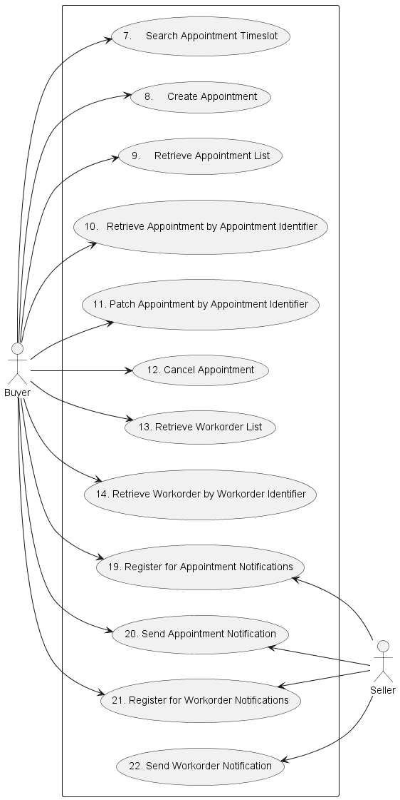

**Figure 4. Use Cases**

## 5.2. API Endpoint and Operation Description

### 5.2.1. Appointment API Endpoints

#### 5.2.1.1. Seller side Appointment API Endpoints

Base URL for Cantata:
`https://{{serverBase}}:{{port}}{{?/seller_prefix}}/mefApi/cantata/appointment/v2/`

Base URL for Sonata:
`https://{{serverBase}}:{{port}}{{?/seller_prefix}}/mefApi/sonata/appointment/v2/`

The following API endpoints are implemented by the Seller and allow the Buyer
to create, retrieve, modify an Appointment and register for Notifications. The
endpoints and corresponding data model are defined in:

`/productApi/workforce/appointment/appointmentManagement.api.yaml`.

Appointment Use cases:

| API endpoint                      | Description                                                                                                                                                  | MEF 113 Use Case mapping                              |
| --------------------------------- | ------------------------------------------------------------------------------------------------------------------------------------------------------------ | ----------------------------------------------------- |
| `POST /searchTimeSlot`            | A request by the Buyer to find a set of available time slots for scheduling or rescheduling an Appointment for a WorkOrder with a Seller Technician.         | UC 7: Search Appointment Timeslot                     |
| `POST /appointment`               | A request by the Buyer to create an Appointment for a WorkOrder with a Seller Technician.                                                                    | UC 8: Create an Appointment                           |
| `GET /appointment`                | The Buyer requests a list of Appointments from the Seller based on a set of specified filter criteria. The Seller returns a summarized list of Appointments. | UC 9: Retrieve na Appointment List                    |
| `GET /appointment/{{id}}`         | The Buyer requests detailed information about a single Appointment based on an Appointment Identifier.                                                       | UC 10: Retrieve Appointment by Appointment Identifier |
| `PATCH /appointment/{{id}}`       | A request by the Buyer to patch or reschedule an Appointment for a WorkOrder with a Seller Technician.                                                       | UC 11: Patch Appointment by Appointment Identifier    |
| `POST /appointment/{{id}}/cancel` | A request by the Buyer to cancel an Appointment for a WorkOrder with a Seller Technician.                                                                    | UC 12: Cancel Appointment by Appointment Identifier   |
| `POST /hub`                       | The Buyer requests to subscribe to notifications.                                                                                                            | UC 19: Register for Appointment Notifications         |
| `GET /hub/{{id}}`                 | A request initiated by the Buyer to retrieve the details of the notification subscription.                                                                   | UC 19: Register for Appointment Notifications         |
| `DELETE /hub/{{id}}`              | A request initiated by the Buyer to instruct the Seller to stop sending notifications.                                                                       | UC 19. Register for Appointment Notifications         |

**Table 4. Seller side mandatory Appointment API endpoints**

**[R1]** The Seller **MUST** support Appointment API endpoints listed in
Table 4. [MEF113 R3]

#### 5.2.1.1. Buyer side Appointment API Endpoints

Base URL for Cantata:
`https://{{serverBase}}:{{port}}{{?/buyer_prefix}}/mefApi/cantata/appointmentNotification/v2/`

Base URL for Sonata:
`https://{{serverBase}}:{{port}}{{?/buyer_prefix}}/mefApi/sonata/appointmentNotification/v2/`

The following API Endpoints are used by the Seller to post notifications to
registered listeners. The endpoints and corresponding data model are defined in

`/productApi/workforce/appointment/appointmentNotification.api.yaml`.

Appointment Use cases

| API endpoint                                          | Description                                                                                                                                                                                | MEF 113 Use Case mapping             |
| ----------------------------------------------------- | ------------------------------------------------------------------------------------------------------------------------------------------------------------------------------------------ | ------------------------------------ |
| `POST /listener/appointmentStatusChangeEvent`         | The Seller sends a notification regarding an Appointment to the Buyer indicating one of the following Appointment Notification Types have occurred: `AppointmentStatusChangeEvent`         | UC 20. Send Appointment Notification |
| `POST /listener/appointmentAttributeValueChangeEvent` | The Seller sends a notification regarding an Appointment to the Buyer indicating one of the following Appointment Notification Types have occurred: `AppointmentAttributeValueChangeEvent` | UC 20. Send Appointment Notification |

**Table 5. Buyer side mandatory Appointment API endpoints**

**[R2]** The Buyer **MUST** support Appointment API endpoints listed in
Table 5. [MEF113 R3]

### 5.2.2. WorkOrder API Endpoints

#### 5.2.2.1. Seller side WorkOrder API Endpoints

Base URL for Cantata:
`https://{{serverBase}}:{{port}}{{?/seller_prefix}}/mefApi/cantata/workOrderManagement/v2/`

Base URL for Sonata:
`https://{{serverBase}}:{{port}}{{?/seller_prefix}}/mefApi/sonata/workOrderManagement/v2/`

The following API endpoints are implemented by the Seller and allow the Buyer
to retrieve WorkOrders and register for Notifications. The endpoints and
corresponding data model are defined in:

`/productApi/workforce/workorder/workorderManagement.api.yaml`.

WorkOrder API Use cases:

| API endpoint            | Description                                                                                                                                              | MEF 113 Use Case mapping                          |
| ----------------------- | -------------------------------------------------------------------------------------------------------------------------------------------------------- | ------------------------------------------------- |
| `GET /workOrder`        | The Buyer requests a list of WorkOrders from the Seller based on a set of specified filter criteria. The Seller returns a summarized list of WorkOrders. | UC 13. Retrieve WorkOrder List                    |
| `GET /workOrder/{{id}}` | The Buyer requests detailed information about a WorkOrder based on a WorkOrder Identifier.                                                               | UC 14. Retrieve WorkOrder by WorkOrder Identifier |
| `POST /hub`             | The Buyer requests to subscribe to notifications.                                                                                                        | UC 21: Register for WorkOrder Notifications       |
| `GET /hub/{{id}}`       | A request initiated by the Buyer to retrieve the details of the notification subscription.                                                               | UC 21: Register for WorkOrder Notifications       |
| `DELETE /hub/{{id}}`    | A request initiated by the Buyer to instruct the Seller to stop sending notifications.                                                                   | UC 21. Register for WorkOrder Notifications       |

**Table 6. Seller side mandatory WorkOrder API endpoints**

**[R3]** The Seller **MUST** support WorkOrder API endpoints listed in Table 6.
[MEF113 R4]

#### 5.2.2.2. Buyer side WorkOrder API Endpoints

Base URL for Cantata:
`https://{{serverBase}}:{{port}}{{?/buyer_prefix}}/mefApi/cantata/workOrderNotification/v2/`

Base URL for Sonata:
`https://{{serverBase}}:{{port}}{{?/buyer_prefix}}/mefApi/sonata/workOrderNotification/v2/`

The following API endpoints are implemented by the Seller and allow the Buyer
to register and send WorkOrder Notifications. The endpoints and corresponding
data model are defined in:

`/productApi/workforce/appointment/workOrderNotification.api.yaml`.

WorkOrder API Use cases

| API endpoint                                        | Description                                                                                                                                                                          | MEF 113 Use Case mapping           |
| --------------------------------------------------- | ------------------------------------------------------------------------------------------------------------------------------------------------------------------------------------ | ---------------------------------- |
| `POST /listener/workOrderCreateEvent`               | The Seller sends a notification regarding an Appointment to the Buyer indicating one of the following WorkOrder Notification Types has occurred: `workOrderCreateEvent`              | UC 22. Send WorkOrder Notification |
| `POST /listener/workOrderAttributeValueChangeEvent` | The Seller sends a notification regarding an Appointment to the Buyer indicating one of the following WorkOrder Notification Types has occurred: `workOrderStateChangeEvent`         | UC 22. Send WorkOrder Notification |
| `POST /listener/workOrderAppointmentRequiredEvent`  | The Seller sends a notification regarding an Appointment to the Buyer indicating one of the following WorkOrder Notification Types has occurred: `workOrderAppointmentRequiredEvent` | UC 22. Send WorkOrder Notification |

**Table 7. Buyer side mandatory WorkOrder API endpoints**

**[R4]** The Buyer **MUST** support WorkOrder API endpoints listed in Table 7.
[MEF113 R4]

## 5.3. Specifying the Buyer ID and the Seller ID

A business entity willing to represent multiple Buyers or multiple Sellers must
follow the requirements of MEF 79 [[MEF79](#8-references)] chapter 8.8, which
states:

> For requests of all types, there is a business entity that is initiating an
> Operation (called a Requesting Entity) and a business entity that is
> responding to this request (called the Responding Entity). In the simplest
> case, the Requesting Entity is the Buyer and the Responding Entity is the
> Seller. However, in some cases, the Requesting Entity may represent more than
> one Buyer and similarly, the Responding Entity may represent more than one
> Seller.
>
> While it is outside the scope of this specification, it is assumed that the
> Requesting Entity and the Responding Entity are aware of each other and can
> authenticate requests initiated by the other party. It is further assumed
> that both the Buying Entity and the Requesting Entity know:
>
> a) the list of Buyers the Requesting Entity represents when interacting with
> this Responding Entity; and  
> b) the list of Sellers that this Responding Entity represents to this
> Requesting Entity.

In the API the `buyerId` and `sellerId` are represented as query parameters in
each operation defined in `appointmentManagement.api.yaml` and as attributes of
events as described in `appointmentNotification.api.yaml`.

**[R5]** If the Requesting Entity has the authority to represent more than one
Buyer the request **MUST** include `buyerId` query parameter that identifies
the Buyer being represented. [MEF79 R80]

**[R6]** If the Requesting Entity represents precisely one Buyer with the
Responding Entity, the request **MUST NOT** specify the `buyerId`. [MEF79 R81]

**[R7]** If the Responding Entity represents more than one Seller to this Buyer
the request **MUST** include `sellerId` query parameter that identifies the
Seller with whom this request is associated. [MEF79 R82]

**[R8]** If the Responding Entity represents precisely one Seller to this
Buyer, the request **MUST NOT** specify the `sellerId`. [MEF79 R83]

**[R9]** If `buyerId` or `sellerId` attributes were specified in the request
same attributes **MUST** be used in the notification payload.

## 5.4. Model Structural Validation

The structure of the HTTP payloads exchanged via The Appointment and WorkOrder
API endpoints are defined using OpenAPI version 3.0.

**[R10]** Implementations **MUST** use payloads that conform to these
definitions.

## 5.5. Security Considerations

There must be an authentication mechanism whereby a Seller can be assured who a
Buyer is and vice-versa. There must also be authorization mechanisms in place
to control what a particular Buyer or Seller is allowed to do and what
information may be obtained. However, the definition of the exact security
mechanism and configuration is outside the scope of this document. It is being
worked on by a separate MEF Project (MEF 128 [[MEF128](#8-references)]).

<div class="page"/>

# 6. API Interactions and Flows

This section provides a detailed insight into the API functionality, use cases,
and flows. It starts with Figure 5 and Table 6, presenting a list and short
description of all business use cases then presents the variants of end-to-end
interaction flows, and in the following subchapters describes the API usage
flow and examples for each of the use cases.

MEF 113 defines use cases related to three domains:

- Trouble Ticket
- WorkOrder
- Appointment

Figure 5 presents an example of an end-to-end flow that shows dependencies
between all the domains:

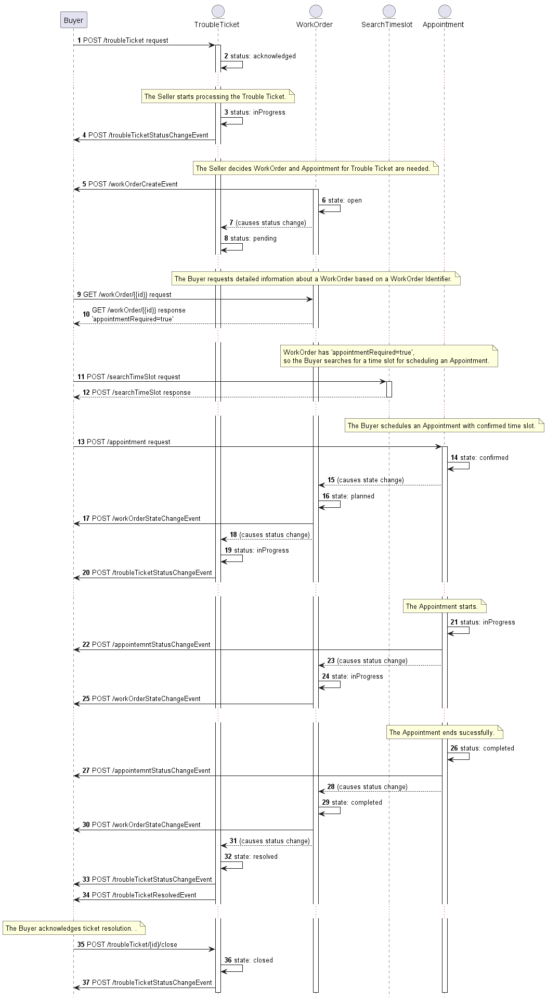

**Figure 5. End-to-End API Flows**

- (1) The Buyer experiences the issue in the network and creates the Trouble Ticket.
- (2) The Seller creates the Trouble Ticket and sets the status: `acknowledged`.
- (3) Trouble Ticket status changes to `inProgress`
- (4) The Buyer gets information about Trouble Ticket status change.
- (5-6)The Seller decides that a WorkOrder with an Appointment is needed to resolve
the issue. The Seller creates a WorkOrder in state `open`  and sends a `workOrderCreateEvent`.
- (7-8)Workorder state changes if an Appointment is needed (WorkOrder has `appointmentRequired=true`) causing the Trouble Ticket status to change to `pending`
- (9) The Buyer requests detailed information about the WorkOrder.
- (10) The Buyer proposes time slots for scheduling an Appointment if the
WorkOrder requires an Appointment (if the parameter is set to
`appointmentRequired=true`)
- (11) The Buyer requests detailed information about the available time slot.
- (12) The Seller responds with the list of available time slots.
- (13) The Buyer schedules an Appointment with the agreed time slot.
- (14) The Seller sets the Appointment status to `confirmed`.
- (15-16) Appointment creation causes the WorkOrder state change to `planned`
- (17) The Buyer gets information about WorkOrder state change.
- (18-19) WorkOrder state change causes the Trouble Ticket status change to
  `inProgress`
- (20) The Buyer gets information about Trouble Ticket status change.
- (21) Appointment status changes to `inProgress`
- (22) The Buyer gets information about Appointment status change.
- (23-24) Appointment status change causes the WorkOrder state change back to
  `inProgress`
- (25) The Buyer gets information about WorkOrder state change.
- (26) Appointment status goes to `completed`.
- (27) The Buyer gets information about Appointment status change.
- (28-29) Appointment status change causes the WorkOrder state change to
  `completed`.
- (30) The Buyer gets information about WorkOrder state change.
- (31-32) If there are no additional open WorkOrders for a Trouble Ticket, then the WorkOrder state change causes the Trouble Ticket status change back
  to `resolved`.
- (33) The Buyer gets information about Trouble Ticket status change.
- (34) The Buyer gets information about resolving Trouble Ticket.
- (35) The Buyer acknowledges ticket resolution. 
- (36) Trouble Ticket status changes to `closed`
- (37) The Buyer gets information about the Trouble Ticket status change.

**_Note:_** (...) This symbol on the diagram means that the next operation isn't
automated.

| Use Case # | Use Case Name                                  | Use Case Description                                                                                                                                                                                                                      |
| ---------- | ---------------------------------------------- | ----------------------------------------------------------------------------------------------------------------------------------------------------------------------------------------------------------------------------------------- |
| 7          | Search Appointment Timeslot                    | A request by the Buyer to find a set of available time slots for scheduling or rescheduling an Appointment for a WorkOrder with a Seller Technician.                                                                                      |
| 8          | Create Appointment List                        | A request by the Buyer to create an Appointment for a WorkOrder with a Seller Technician.                                                                                                                                                 |
| 9          | Retrieve Appointment List                      | The Buyer requests a list of Appointments from the Seller based on a set of specified filter criteria. The Seller returns a summarized list of Appointments.                                                                              |
| 10         | Retrieve Appointment by Appointment Identifier | The Buyer requests detailed information about a single Appointment based on an Appointment Identifier.                                                                                                                                    |
| 11         | Patch Appointment by Appointment Identifier    | A request by the Buyer to patch or reschedule an Appointment for a WorkOrder with a Seller Technician.                                                                                                                                    |
| 12         | Cancel Appointment by Appointment Identifier   | A request by the Buyer to cancel an Appointment for a WorkOrder with a Seller Technician.                                                                                                                                                 |
| 13         | Retrieve WorkOrder List                        | The Buyer requests a list of Work orders from the Seller based on a set of specified filter criteria. The Seller returns a summarized list of Work orders.                                                                                |
| 14         | Retrieve WorkOrder by WorkOrder Identifier     | The Buyer requests detailed information about a WorkOrder based on a WorkOrder Identifier.                                                                                                                                                |
| 19         | Register for Appointment Notifications         | The Buyer requests to subscribe to Appointment Notifications.                                                                                                                                                                             |
| 20         | Send Appointment Notification                  | The Seller sends a notification regarding an Appointment to the Buyer indicating one of the following Appointment Notification Types has occurred: `appointmentAttributeValueChangeEvent`, `appointmentStatusChangeEvent`                 |
| 21         | Register for WorkOrder Notifications           | The Buyer requests to subscribe to WorkOrder Notifications.                                                                                                                                                                               |
| 22         | Send WorkOrder Notification Identifier         | The Seller sends a notification regarding an Appointment to the Buyer indicating one of the following WorkOrder Notification Types has occurred: `workOrderCreateEvent`, `workOrderStateChangeEvent`, `workOrderAppointmentRequiredEvent` |

**Table 8. Use Cases description**

The detailed business requirements of each of the use cases are described in
sections 7 and 8 of MEF 113 [[MEF113](#8-references)].

## 6.1. Use Case 7: Search Appointment Timeslot

This is the initial step for Appointment processing.

### 6.1.1. Interaction flow

The flow of this use case is very simple and is described in Figure 6.

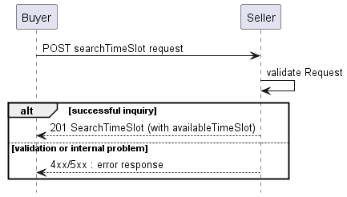

**Figure 6. Use Case 7: Appointment Timeslot create request flow**

The Buyer sends a request with a `SearchTimeSlot_Create` type in the body.

### 6.1.1. Create Appointment Timeslot - Request

Figure 7 presents the data model of the Appointment Timeslot. The model of the
request message (`SearchTimeSlot_Create`) is a subset of the `SearchTimeSlot`
model and contains only attributes that can (or must) be set by the Buyer. The
Seller then enriches the entity in the response with additional information.

The full list of attributes is available in [Section 7](#7-api-details) and in
the API specification which is an integral part of this standard.


**Figure 7. Create Appointment Timeslot Model**

The snippet below presents an example of the Create Appointment Timeslot
Request:

**`SearchTimeSlot` Create**

```json
{
  "requestedTimeSlot": [
    {
      "validFor": {
        "startDateTime": "2022-05-19T08:00:00.170Z",
        "endDateTime": "2022-05-21T16:00:00.170Z"
      }
    }
  ],
  "workOrder": {
    "id": "01494079-6c79-4a25-83f7-48284196d44d"
  }
}
```

**[R11]** The Buyer's request **MUST** include the following attributes:
[MEF113 R71]

- `workOrder`
- `requestedTimeSlot`

### 6.1.2. Create Appointment Timeslot - Response

The Seller responds with a `SearchTimeSlot` type, which adds some attributes to
the `SearchTimeSlot_Create` that was used in the Buyer's request.

**_Note_**: The term "Seller Response Code" used in the Business Requirements
maps to HTTP response code, where `2xx` indicates _Success_ and `4xx` or `5xx`
indicate _Failure_.

The following snippet presents the Seller's response. It has the same structure
as in the retrieve by identifier operation.

```json
{
  "availableTimeSlot": [
    {
      "validFor": {
        "startDateTime": "2022-05-21T08:00:00.125Z",
        "endDateTime": "2022-05-21T16:00:00.125Z"
      }
    }
  ],
  "requestedTimeSlot": [
    {
    << as provided by the Buyer >>
      "validFor": {
        "startDateTime": "2022-05-19T08:00:00.170Z",
        "endDateTime": "2022-05-21T16:00:00.170Z"
      }
    }
  ] ,
  "workOrder": {
    << as provided by the Buyer >>
      "id": "01494081-6c79-4a25-42f7-48284196d55d"
    }
}
```

**[R12]** The Seller **MUST** return an error `Error422` if any of the included
attributes in the Buyer's request are invalid. [MEF113 R73]

**[R13]** The Seller's response **MUST** return an empty list of
`availableTimeSlot` if no Seller resources are available for an appointment
that falls within any of the `requestedTimeSlot`. [MEF113 R74]

**[R14]** The Seller's response **MUST** include one or more
`availableTimeSlot`, if Seller resources are available for an appointment that
falls within the `requestedTimeSlot`. [MEF113 R77]

## 6.2. Use Case 8: Create Appointment

This is the initial step for Appointment processing.

### 6.2.1. Interaction flow

The flow of this use case is very simple and is described in Figure 8.

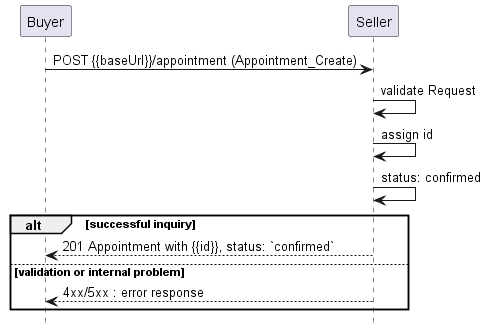

**Figure 8. Use Case 8: Appointment create request flow**

The Buyer sends a request with an `Appointment_Create` type in the body. The
Seller performs request validation, assigns an `id`, and returns an
`Appointment` type in the response body, with a `status` set to `confirmed`.
From this point, the Appointment is ready for further processing. The Buyer
must track the progress of the process by subscribing for notifications (see
[chapter 6.9](#69-use-case-19-register-for-appointment-notifications)). The
flow example with the use of Notifications is presented in Figure 9.


**Figure 9. Appointment progress tracking - Notifications**

**_Note_**: The context of notifications is not a part of the considered use
case itself. It is presented to show the big picture of end-to-end flow. This
applies also to all further use case flow diagrams with notifications.

### 6.2.2. Create Appointment - Request

Figure 10 presents the data model of the Appointment. The model of the request
message (`Appointment_Create`) is a subset of the `Appointment` model and
contains only attributes that can (or must) be set by the Buyer. The Seller
then enriches the entity in the response with additional information.

The full list of attributes is available in [Section 7](#7-api-details) and in
the API specification which is an integral part of this standard.

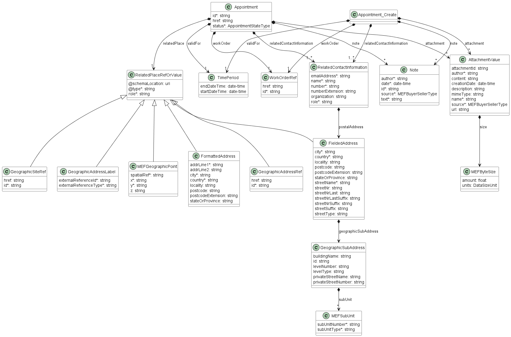

**Figure 10. Create Appointment Model**

The snippet below presents an example of the Create Appointment Request:

**`Appointment` Create**

```json
{
  "attachment": [
    {
      "author": "John Example",
      "creationDate": "2022-05-19T10:04:18.812Z",
      "description": "Print screen from the assurance system",
      "mimeType": "image/jpeg",
      "name": "Alarm",
      "size": {
        "amount": 5.3,
        "units": "MBYTES"
      },
      "source": "buyer",
      "url": "https://example.com/documents/00000000-0000-1111-2222-000000001111"
    }
  ],
  "relatedContactInformation": [
    {
      "emailAddress": "john.example@example.com",
      "name": "John Example",
      "number": "+12-345-678-90",
      "organization": "Buyer Example Co.",
      "role": "buyerAppointmentContact"
    }
  ],
  "validFor": [
    {<< as provided in availableTimeSlot  >>
      "startDateTime": "2022-05-21T08:00:00.125Z",
      "endDateTime": "2022-05-21T16:00:00.125Z"
    }
  ],
  "workOrder": {
    "id": "01494081-6c79-4a25-42f7-48284196d55d"
  },
  "note": [
    {
      "id": "note-1",
      "author": "John Example",
      "date": "2021-06-02T14:25:11.090Z",
      "source": "buyer",
      "text": "Couldn't reach the support on phone."
    }
  ]
}
```

**[R15]** The Buyer's request **MUST** include the following attributes:
[MEF113 R78]

- `relatedContactInformation` - item with `role=buyerAppointmentContact`
- `relatedContactInformation` - item with `role=appointmentPlaceContact`
- `workOrder`
- `validfor`

**[O1]** The Buyer's request **MAY** include the `note` and `attachment`
attributes: [MEF113 O14]

### 6.2.3. Create Appointment - Response

The Seller responds with an `Appointment` type, which adds some attributes to
the `Appointment_Create` that was used in the Buyer's request.

```json
{
  "id": "00000000-4444-5555-6666-000000000987",
  "status": "confirmed",
  "attachment": [
    {<< as provided by the Buyer >>
      "author": "John Example",
      "creationDate": "2022-05-19T10:04:18.812Z",
      "description": "Print screen from the assurance system",
      "mimeType": "image/jpeg",
      "name": "Alarm",
      "size": {
        "amount": 5.3,
        "units": "MBYTES"
      },
      "source": "buyer",
      "url": "https://example.com/documents/00000000-0000-1111-2222-000000001111"
    }
  ],
  "note": [
    {<< as provided by the Buyer >>
      "id": "note-1",
      "author": "John Example",
      "date": "2021-06-02T14:25:11.090Z",
      "source": "buyer",
      "text": "Couldn't reach the support on phone."
    }
  ],
  "workOrder": {<< as provided by the Buyer >>
    "id": "01494081-6c79-4a25-42f7-48284196d55d"
  },
  "relatedPlace": {
    "@type": "GeographicAddressRef",
    "id": "00000000-0000-0030-0305-873500002010",
    "role": "APPOINTMENT_LOCATION"
  },
  "validFor": {
    "startDateTime": "2022-05-21T08:00:00.125Z",
    "endDateTime": "2022-05-21T16:00:00.125Z"
  },
  "relatedContactInformation": [
    {<< as provided by the Buyer >>
      "emailAddress": "john.example@example.com",
      "name": "John Example",
      "number": "+12-345-678-90",
      "organization": "Buyer Example Co.",
      "role": "buyerAppointmentContact"
    }
  ]
}
```

The response to the create request does not contain all possible attributes.

**[R16]** The Seller **MUST** return an error `Error422` if the `validFor` is
not valid. [MEF113 R81]

**[R17]** The Seller **MUST** return an error `Error422` if a Seller technician
is not available for an appointment at the `relatedPlace` for the specified
`requestedTimeSlot`. [MEF113 R82]

**[R18]** The Seller's response **MUST** include the Buyer following
attributes. [MEF113 R83-R84]

- `id`
- `relatedContactInformation` - item with `role=buyerAppointmentContact`
- `relatedContactInformation` - item with `role=appointmentPlaceContact`
- `relatedContactInformation` - item with `role=sellerAppointmentContact`
- `relatedPlace`
- `status`
- `workOrder`
- `validFOr`

**[O2]** The Seller's response **MAY** add the `note` and `attachment`
attributes. [MEF113 O15]

**[R19]** The Seller **MUST** set the appointment `status` to `confirmed`.
[MEF113 R85]

**[R20]** The Seller **MUST** return an error `Error422` if the `workOrder`
references a workOrder that contains a reference to an appointment with
`status` of `confirmed` or `inProgress`. [MEF113 R86]

**[R21]** The Seller **MUST** return an error `Error422` if the related
workOrder `state` is not `open`. [MEF113 R87]

**[R22]** After creating the Appointment instance, the Seller **MUST** add the
`appointment.id` to the `appointment` attribute of the related WorkOrder.
[MEF113 R88]

**[R23]** The Seller **MUST** set the `appointmentRequired` attribute to
`false` in the related WorkOrder. [MEF113 R89]

**[R24]** The Seller **MUST** set the related WorkOrder `state` to `planned`.
[MEF113 R90]

**[R25]** The Seller **MUST** update the `status` of the Trouble Ticket, for
which this Appointment was created to `inProgress`. [MEF113 R91]

### 6.2.4. Appointment - Lifecycle

Figure 11 presents the Appointment state machine:

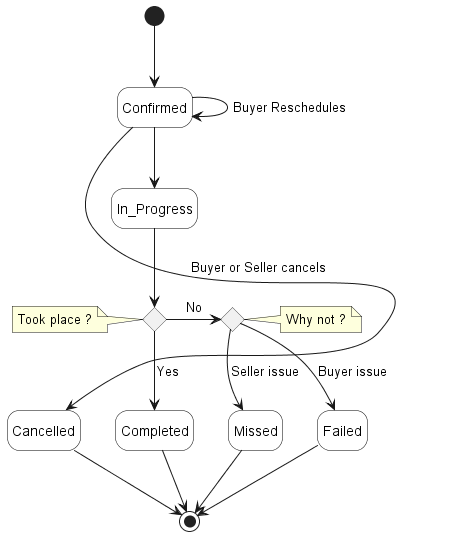

**Figure 11. Appointment State Machine**

After receiving the request, the Seller performs a validation of the message.
If any problem is found an Error response is provided. If the validation passes
a response is provided with `Appointment` in `confirmed` status. When
`Appointment` has `inProgress` status, it can no longer be cancelled (point of
no return), this is up to the Seller’s discretion. Then the Seller starts
working on resolving the issue and moves the Appointment to `completed` state.
The Appointment changes a status to `missed` when it didn't take place because
of the Seller issue or to `failed` if caused the Buyer issue. Buyer or Seller
can `cancel` the Appointment.

Table 5 presents the mapping between the API `status` names (aligned with TMF)
and the MEF 113 naming, together with statuses' description.

| status       | MEF 113 name | Description                                                                                                                                                                                                                                     |
| ------------ | ------------ | ----------------------------------------------------------------------------------------------------------------------------------------------------------------------------------------------------------------------------------------------- |
| `confirmed`  | SCHEDULED    | The Buyer has negotiated and confirmed the Appointment with the Seller (scheduled).                                                                                                                                                             |
| `inProgress` | IN_PROGRESS  | The Appointment can no longer be cancelled (point of no return), this is up to the Seller’s discretion.                                                                                                                                         |
| `cancelled`  | CANCELLED    | The Appointment was cancelled by the Buyer or the Seller determined that an Appointment was not required. This is a terminal state.                                                                                                             |
| `missed`     | MISSED       | The Appointment did not take place, because of a Seller related issue. For example, no Seller Technician was available on the date of the appointment. .                                                                                        |
| `failed`     | FAILED       | The Appointment did not take place, because of an issue with the Buyer. For example, Seller Technician was unable to get to the Appointment due to an incorrect location or unable to get access to the Buyer's site. This is a terminal state. |
| `completed`  | COMPLETED    | The Appointment took place as confirmed. This is a terminal state.                                                                                                                                                                              |

**Table 9. Appointment statuses**

**[R26]** The Seller **MUST** support all Appointment `status` and associated
transitions. [MEF113 R173]

**[R27]** If the Seller wants to reschedule an `Appointment`, the **MUST**
update the Appointment `status` to `cancelled` and request the Buyer to
schedule a new `Appointment` by setting `validFor` to TRUE in the related
`WorkOrder`. [MEF113 R174]

**[R28]** The Seller **MUST** send an `AppointmentStatusChangeEvent` whenever
an Appointment `status` change has occurred. [MEF113 R175]

**[R29]** The Seller **MUST** send an `AppointmentAttributeValueChangeEvent`
whenever the Seller has updated any of the following attributes: [MEF113 R176]

- `attachment`
- `note`
- `relatedContactInformation` - item with `role=sellerAppointmentContact`

## 6.3. Use Case 9: Retrieve Appointment List

**[O3]** The Buyer **MAY** use `GET /appointment` operation with the following
filter criteria : [MEF113 O16]

- `geographicSiteId`
- `geographicAddressId`
- `workOrder`
- `status`
- `validFor.gt`
- `validFor.lt`

The Buyer may also ask for pagination with the use of the `offset` and `limit`
parameters. The filtering and pagination attributes must be specified in URI
query format [RFC3986](#8-references). Section
[7.1.2.](#712-response-pagination) provides details about the implementation of
pagination mechanism.

```
https://serverRoot/mefApi/sonata/appointment/v2/appointment?status=confirmed&limit=10&offset=0
```

The example above shows a Buyer's request to get all Appointments that are in
the `confirmed` status. Additionally, the Buyer asks only for a first
(`offset=0`) pack of 10 results (`limit=10`) to be returned. The correct
response (HTTP code `200`) in the response body contains a list of
`Appointment_Find` objects matching the criteria. To get more details (e.g. the
item level information), the Buyer has to query a specific `Appointment` by
`id`.

**[R30]** The Seller **MUST** return the following attributes: [MEF113 R93]

- `id`
- `href`
- `workOrder`
- `relatedPlace`
- `status`
- `validFor`

**[R31]** The Seller response **MUST** include all Appointments with an
`validFor` that partially or completely overlaps with the `validFor.gt` and
`validFor.lt` filter criteria. [MEF113 R94]

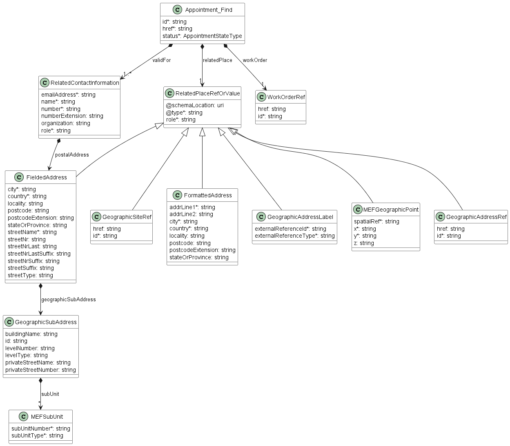

**Figure 12. Use Case 9: Retrieve Appointment List - Model**

## 6.4. Use Case 10: Retrieve Appointment by Appointment Identifier

The Buyer can get detailed information about the Appointment from the Seller by
using a `GET /appointment/{{id}}` operation.

**[R32]** The Buyer **MUST** include the `id`. [MEF113 R105]

**[R33]** In case `id` does not allow to find a `Appointment` instance in
Seller's system, an error `Error404` **MUST** be returned. [MEF113 R96]

**[R34]** The Seller's response **MUST** include the following attributes:
[MEF113 R98]

- `id`
- `href`
- `relatedPlace`
- `status`
- `validfor`
- `workOrder`
- `relatedContactInformation` - item with `role=appointmentPlaceContact`
- `relatedContactInformation` - item with `role=buyerAppointmentContact`
- `relatedContactInformation` - item with `role=sellerAppointmentContact`

**[R35]** The Seller's response **MUST** include all of the following optional
attributes, if they were set by the Buyer or the Seller: [MEF113 R99]

- `attachment`
- `note`

## 6.5. Use Case 11: Patch Appointment by Appointment Identifier

The update operation is realized with the use of the REST PATCH operation. For
that purpose, a specialized type `Appointment_Update` is provided. It consists
of attributes limited to a subset that includes only the Buyer updatable
attributes.

The PATCH usage recommendation follows TMF 621 json/merge
(https://tools.ietf.org/html/rfc7386).

Figure 13 presents the model used in the PATCH request. The Seller responds
with a `Appointment` type.

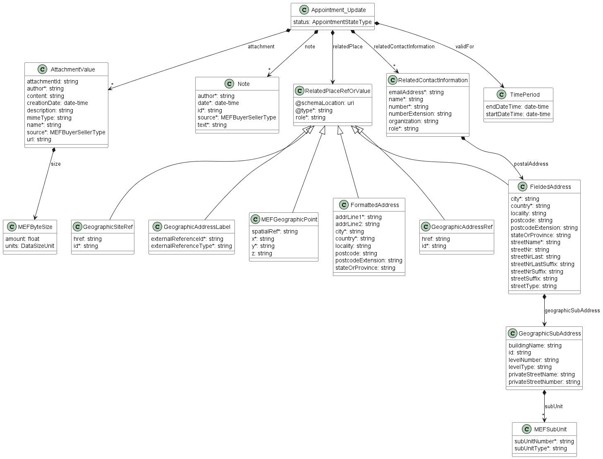

**Figure 13. Patch request Model**

**[R36]** The Buyer **MUST** include at least one of the following attributes:
[MEF113 R101]

- `attachment`
- `note`
- `relatedContactInformation` - item with `role=buyerAppointmentContact`
- `relatedContactInformation` - item with `role=appointmentPlaceContact`
- `validfor`

**[R37]** The Buyer **MUST NOT** change any of the following attributes:
[MEF113 R102]

- `attachment`
- `note`
- `relatedContactInformation` - item with `role=buyerAppointmentContact`
- `relatedContactInformation` - item with `role=appointmentPlaceContact`
- `validfor`

**[R38]** The Buyer **MUST NOT** change the `relatedContactInformation`
attribute. [MEF113 R103]

**[R39]** The Seller **MUST** return an error `Error404` if the Appointment
with the `id` is not found. [MEF113 R104]

**[R40]** The Seller **MUST** return an error `Error422` if the `status` of the
Appointment to be updated is not `confirmed`. [MEF113 R105]

**[R41]** If `validfor` was included by the Buyer, the Seller **MUST** return
an error `Error422` if the `validfor` is not valid. [MEF113 R106]

**[R42]** If an `validfor` was included by the Buyer, the Seller **MUST**
return an error `Error422` if a Seller technician is not available for an
appointment at the `relatedPlace` for the specified `availableTimeSlot`.
[MEF113 R107]

**[R43]** To add a new `note` the Buyer **MUST** append it to the existing
`note` list. [MEF113 R108]

**[R44]** To add a new `attachment` the Buyer **MUST** append it to the
existing `attachment` list. [MEF113 R109]

The example below shows a request to add a new `note` (an existing cannot be
modified or deleted):

```json
{
  "note": [
    {<<previously existing>>
      "id": "note-1",
      "author": "John Example",
      "date": "2021-06-02T14:25:11.090Z",
      "source": "buyer",
      "text": "Couldn't reach the support on phone."
    },
    {<<added new note>>
      "id": "note-2",
      "author": "Kate Example",
      "date": "2021-06-02T19:25:11.090Z",
      "source": "buyer",
      "text": "Support reached after 5 hours"
    }
  ]
}
```

## 6.6. Use Case 12: Cancel Appointment by Appointment Identifier

The Buyer may request to Cancel an Appointment by using
`POST /appointment/{{id}}/cancel` endpoint. This operation only requires
providing the `id` in the path and has an empty `204` confirmation response.

The sequence diagram below presents this use case in detail.


**Figure 14. Cancel Appointment Flow**

The Seller verifies the request, then searches for an Appointment to be
cancelled by the given `id`. If found, the status is verified and `confirmed`.
If everything is verified correctly, the Seller moves the appointment to the
`assessingCancellation` status, sends a successful response to a cancellation
request, and starts assessing the cancellation process for the appointment.

**[R45]** The Seller **MUST** return an error `Error404` if the Appointment
`id` is not found. [MEF113 R112]

**[R46]** The Seller **MUST** return an error `Error422` if the Appointment
`status` is not `confirmed`. [MEF113 R113]

**[R47]** The Seller **MUST** return an error `Error422` if the related
WorkOrder `state` is not `planned`. [MEF113 R114]

**[R48]** The Seller **MUST** set the `appointmentRequired` attribute to `true`
in the related WorkOrder. [MEF113 R115]

**[R49]** The Seller **MUST** set the related WorkOrder `state` to `open`.
[MEF113 R116]

**[R50]** The Seller **MUST** set the Appointment `status` to `cancelled`.
[MEF113 R117]

## 6.7. Use Case 13: Retrieve WorkOrder List

**[O4]** The Buyer **MAY** use `GET /workOrder` operation with desired
filtering criteria: [MEF113 O18]

- `appointmentRequired`
- `geographicalSiteId`
- `geographicalAddressId`
- `relatedEntity`
- `state`

The Buyer may also ask for the pagination with the use of the `offset` and
`limit` parameters. The filtering and the pagination attributes must be
specified in URI query format [RFC3986](#8-references). Section
[7.1.2.](#712-response-pagination) provides details about the implementation of
the pagination mechanism.

```
https://serverRoot/mefApi/sonata/appointment/v2/appointment?status=inProgress&priority=critical&limit=10&offset=0
```

The example above shows a Buyer's request to get all WorkOrder that are in the
`inProgress`. Additionally, the Buyer asks only for a first (`offset=0`) pack
of 10 results (`limit=10`) to be returned. The correct response (HTTP code
`200`) in the response body contains a list of `WorkOrder_Find` objects
matching the criteria. To get more details (e.g. the item level information),
the Buyer has to query a specific `WorkOrder` by `id`.

**[R51]** The Seller **MUST** respond to a `WorkOrder_Find` containing the
workOrder attributes that match the Buyer's filter criteria: [MEF113 R119]

- `appointmentRequired`
- `id`
- `place`
- `relatedEntity`
- `state`


**Figure 15. Use Case 13: Retrieve WorkOrder List - Model**

## 6.8. Use Case 14: Retrieve WorkOrder by WorkOrder Identifier

The Buyer can retrieve detailed information about the WorkOrder from the Seller
by using a `GET /workOrder/{{id}}` operation.

**[R52]** In case `id` does not allow to finding a `WorkOrder` instance, an
error `Error404` **MUST** be returned. [MEF113 R121]

**[R53]** The Seller's response **MUST** include the following WorkOrder
attributes. [MEF113 R123]

- `appointmentRequired`
- `id`
- `place`
- `relatedContactInformation` - item with `role=technician`
- `relatedEntity`
- `state`
- `task`

**[R54]** The Seller **MUST** include all of the optional WorkOrder attributes
if they were set by the Buyer or Seller: [MEF113 R124]

- `appointment`
- `note`
- `plannedExecutionDate`
- `relatedContactInformation` - item with `role=technicalContact`

The following Figure presents the model of the WorkOrder.


**Figure 16. Use Case 14: WorkOrder - Model**

Table 8 presents the mapping between the API `state` names and the MEF 113
naming, together with their description.

| state              | MEF 113 name       | Description                                                                                                                                                                                                                                                 |
| ------------------ | ------------------ | ----------------------------------------------------------------------------------------------------------------------------------------------------------------------------------------------------------------------------------------------------------- |
| `completed`        | COMPLETED          | Technician responsible for the WorkOrder has successfully completed all the assigned Tasks.                                                                                                                                                                 |
| `cancelled`        | CANCELLED          | The WorkOrder has been cancelled by the Seller or due to the Buyer requesting to cancel the Ticket.                                                                                                                                                         |
| `inProgress`       | IN_PROGRESS        | Technician responsible for the WorkOrder has been assigned and started one or more of the assigned Tasks.                                                                                                                                                   |
| `open`             | OPEN               | A workOrder was initiated by the Seller to be assigned to a Technician responsible for resolving the Ticket.                                                                                                                                                |
| `planned`          | PLANNED            | The WorkOrder has been given an execution date for resolving one or more Tasks.                                                                                                                                                                             |
| `unableToComplete` | UNABLE_TO_COMPLETE | The Technician responsible for the workOrder was unable to complete one or more of the assigned Tasks, because of additional skills or information is required. Additional tasks are required to resolve the ticket and a new workOrder needs to be opened. |

**Table 10. WorkOrder states**

Figure 17 presents the WorkOrder state machine:


**Figure 17. WorkOrder State Machine**

**[R55]** The Seller **MUST** support all `state` values and their associated
transitions. [MEF113 R162]

Below you can find a snippet with a WorkOrder example:

```json
{
  "id": "98765432-9876-5432-0000-000000000055",
  "appointmentRequired": false,
  "relatedContactInformation": [
    {
      "emailAddress": "technical.contact@example.com",
      "name": "Technical Contact",
      "number": "+12-345-678-91",
      "organization": "Seller Example Co.",
      "role": "technicalContact"
    }
  ],
  "relatedEntity": [
    {
      "id": "01494064-6c79-4a32-83f7-53284196d35d",
      "role": "parentTroubleTicket",
      "@referredType": "TroubleTicket"
    }
  ],
  "state": "open",
  "plannedExecutionDate": "2022-05-20T10:04:18.812Z",
  "task": ["Replace the broken SFP", "Perform OTDR"]
}
```

**[R56]** The Seller **MUST** send a `workOrderCreateEvent` whenever a new
WorkOrder has been created. [MEF113 R163]

**[R57]** The Seller **MUST** send a `workOrderStateChangeEvent` whenever a
WorkOrder `state` change has occurred. [MEF113 R164]

**[R58]** The Seller **MUST** send a `workOrderAppointmentRequiredEvent` when
the Seller sets the `appointmentRequired` attribute in the WorkOrder to `true`.
[MEF113 R165]

**[R59]** If the `appointmentRequired` attribute in a WorkOrder is `true`, the
Buyer **MUST** schedule an Appointment using a Search Appointment request
followed by a Create Appointment request before the Seller can continue
processing the associated Ticket. [MEF113 R166]

## 6.9. Use Case 19: Register for Appointment Notifications

To register for notifications the Buyer uses the `registerListener` operation
from the API: `POST /hub`. The request model contains only 2 attributes:

- `callback` - mandatory, to provide the callback address to the events that
  will be notified to,
- `query` - optional, to provide the required types of event.

The usage of a combination of these attributes fulfills the [ME113 R125],
[ME113 R126], [ME113 R127] requirements.

By using a simple request:

```json
{
  "callback": "https://buyer.com/listenerEndpoint"
}
```

The Buyer subscribes for notification of all types of events. Those are:

- `appointmentAttributeValueChangeEvent`
- `appointmentStatusChangeEvent`

If the Buyer wishes to subscribe to 2 different types of events, there are 2
possible syntax variants [[TMF630](#8-references)]:

```
eventType=appointmentAttributeValueChangeEvent,appointmentStatusChangeEvent
```

or

```
eventType=appointmentAttributeValueChangeEvent&eventType=appointmentStatusChangeEvent
```

The `query` formatting complies to RFC3986 [RFC3986](#8-references). According
to it, every attribute defined in the Event model (from notification API) can
be used in the `query`. However, this standard requires only `eventType`
attribute to be supported.

## 6.10. Use Case 20: Send Appointment Notification

Notifications are used to asynchronously inform the Buyer about the respective
objects and attribute changes. The Seller's synchronous responses to an
Appointment create requests are considered to act as a Create Notification so
there is no explicit respective Create Notification type. The next notification
must be sent when the state changes compared to the previously sent one.

**[R60]** The Seller **MUST NOT** send Appointment Notifications for an
Appointment Notification Type to a Buyer who has not registered for the
Appointment Notification Type. [MEF113 R146]

**[R61]** The Seller **MUST** send Appointment Notifications to a Buyer who has
registered for the Appointment Notification Type. [MEF113 R147]

The Figure below shows all entities involved in the Notification use cases.


**Figure 18. Use Case 20. Appointment Notification Data Model**

**_Note_**: the body of the event carries only the source object's `id`. The
Buyer needs to query it later by `id` to get details.

To stop receiving events, the Buyer has to use the `unregisterListener`
operation from the `DELETE /hub/{id}` endpoint. The `id` is the identifier
received from the Seller during the listener registration.

The table below presents the mapping between the API Notification types' names
and the ones in MEF 113. The inconsistencies are caused by using the TMF event
types as the base for this API.

| API name                               | MEF 113 name              |
| -------------------------------------- | ------------------------- |
| `appointmentAttributeValueChangeEvent` | APPOINTMENT_UPDATE        |
| `appointmentStatusChangeEvent`         | APPOINTMENT_STATUS_CHANGE |

**Table 11. Appointment Notification types mapping**

## 6.11. Use Case 21: Register for WorkOrder Notifications

To register for notifications the Buyer uses the `registerListener` operation
from the API: `POST /hub`. The request model contains only 2 attributes:

- `callback` - mandatory, to provide the callback address the to events that
  will be notified to,
- `query` - optional, to provide the required types of event.

The usage of a combination of these attributes fulfills the [ME113 R125],
[ME113 R126], [ME113 R127] requirements.

By using a simple request:

```json
{
  "callback": "https://buyer.com/listenerEndpoint"
}
```

The Buyer subscribes for notification of all types of events. Those are:

- `workOrderCreateEvent`
- `workOrderStateChangeEvent`
- `workOrderAppointmentRequiredEvent`

If the Buyer wishes to subscribe to 3 different types of events, there are 3
possible syntax variants [[TMF630](#8-references)]:

```
eventType=workOrderCreateEvent,workOrderStateChangeEvent,workOrderAppointmentRequiredEvent
```

or

```
eventType=workOrderCreateEvent&eventType=workOrderStateChangeEvent&eventType=workOrderAppointmentRequiredEvent

```

The `query` formatting complies to RFC3986 [RFC3986](#8-references). According
to it, every attribute defined in the Event model (from notification API) can
be used in the `query`. However, this standard requires only `eventType`
attribute to be supported.

## 6.12. Use Case 22: Send WorkOrder Notification

Notifications are used to asynchronously inform the Buyer about the respective
objects and attribute changes. The Seller's synchronous response to a WorkOrder
creates requests are considered to act as a Create Notification so there is no
explicit respective Create Notification type. The next notification must be
sent when the state changes compared to the previously sent one.

**[R62]** The Seller **MUST NOT** send WorkOrder Notifications for a WorkOrder
Notification Type to a Buyer who has not registered for the WorkOrder
Notification Type. [MEF R152]

**[R63]** The Seller **MUST** send WorkOrder Notifications to a Buyer who has
registered for the WorkOrder Notification Type. [MEF R153]

- `workOrderCreateEvent`
- `workOrderStateChangeEvent`
- `workOrderAppointmentRequiredEvent`

The Figure below shows all entities involved in the Notification use cases.

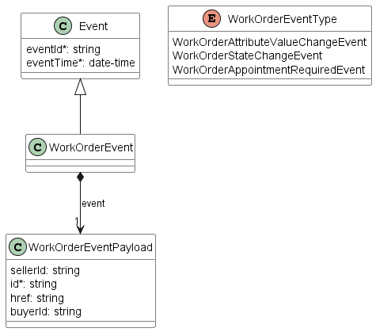

**Figure 19. Use Case 22. WorkOrder Notification Data Model**

**_Note_**: the body of the event carries only the source object's `id`. The
Buyer needs to query it later by `id` to get details.

To stop receiving events, the Buyer has to use the `unregisterListener`
operation from the `DELETE /hub/{id}` endpoint. The `id` is the identifier
received from the Seller during the listener registration.

The table below presents the mapping between the API Notification types' names
and the ones in MEF 113. The inconsistencies are caused by using the TMF event
types as the base for this API.

| API name                            | MEF 113 name                   |
| ----------------------------------- | ------------------------------ |
| `workOrderCreateEvent`              | WORKORDER_CREATE               |
| `workOrderStateChangeEvent`         | WORKORDER_STATE_CHANGE         |
| `workOrderAppointmentRequiredEvent` | WORKORDER_APPOINTMENT_REQUIRED |

**Table 12. WorkOrder Notification types mapping**

<div class="page"/>

# 7. API Details

## 7.1. API patterns

### 7.1.1. Indicating errors

Erroneous situations are indicated by appropriate HTTP responses. An error
response is indicated by HTTP status 4xx (for client errors) or 5xx (for server
errors) and appropriate response payload. The Product Order API uses the error
responses as depicted and described below.

Implementations can use HTTP error codes not specified in this standard in
compliance with rules defined in RFC 7231 [[RFC7231](#8-references)]. In such a
case, the error message body structure might be aligned with the `Error`.

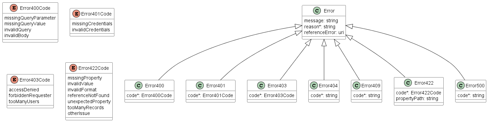

**Figure 20. Data model types to represent an erroneous response**

#### 7.1.1.1. Type Error

**Description:** Standard Class used to describe API response error Not intended to be use directly only via specialization which defines a code

<table id="T_Error">
    <thead style="font-weight:bold;">
        <tr>
            <td>Name</td>
            <td>Type</td>
            <td>Description</td>
        </tr>
    </thead>
    <tbody>
        <tr>
            <td>message</td>
            <td>string</td>
            <td>Text that provides mode details and corrective actions related to the error. This can be shown to a client user.</td>
        </tr><tr>
            <td>reason*</td>
            <td>string</td>
            <td>Text that explains the reason for the error. This can be shown to a client user.</td>
        </tr><tr>
            <td>referenceError</td>
            <td>uri</td>
            <td>URL pointing to documentation describing the error</td>
        </tr>
    </tbody>
</table>

#### 7.1.1.2. Type Error400

**Description:** Bad Request.
(https://tools.ietf.org/html/rfc7231#section-6.5.1)

Inherits from:

- <a href="#T_Error">Error</a>

<table id="T_Error400">
    <thead style="font-weight:bold;">
        <tr>
            <td>Name</td>
            <td>Type</td>
            <td>Description</td>
        </tr>
    </thead>
    <tbody>
        <tr>
            <td>code*</td>
            <td><a href="#T_Error400Code">Error400Code</a></td>
            <td>One of the following error codes:</br>
- missingQueryParameter: The URI is missing a required query-string parameter</br>
- missingQueryValue: The URI is missing a required query-string parameter value</br>
- invalidQuery: The query section of the URI is invalid.</br>
- invalidBody: The request has an invalid body</td>
        </tr>
    </tbody>
</table>

#### 7.1.1.3. `enum` Error400Code

**Description:** One of the following error codes:

- missingQueryParameter: The URI is missing a required query-string parameter
- missingQueryValue: The URI is missing a required query-string parameter value
- invalidQuery: The query section of the URI is invalid.
- invalidBody: The request has an invalid body

#### 7.1.1.4. Type Error401

**Description:** Unauthorized.
(https://tools.ietf.org/html/rfc7235#section-3.1)

Inherits from:

- <a href="#T_Error">Error</a>

<table id="T_Error401">
    <thead style="font-weight:bold;">
        <tr>
            <td>Name</td>
            <td>Type</td>
            <td>Description</td>
        </tr>
    </thead>
    <tbody>
        <tr>
            <td>code*</td>
            <td><a href="#T_Error401Code">Error401Code</a></td>
            <td>One of the following error codes:</br>
- missingCredentials: No credentials provided.</br>
- invalidCredentials: Provided credentials are invalid or expired</td>
        </tr>
    </tbody>
</table>

#### 7.1.1.5. `enum` Error401Code

**Description:** One of the following error codes:

- missingCredentials: No credentials provided.
- invalidCredentials: Provided credentials are invalid or expired

#### 7.1.1.6. Type Error403

**Description:** Forbidden. This code indicates that the server understood the
request but refuses to authorize it.
(https://tools.ietf.org/html/rfc7231#section-6.5.3)

Inherits from:

- <a href="#T_Error">Error</a>

<table id="T_Error403">
    <thead style="font-weight:bold;">
        <tr>
            <td>Name</td>
            <td>Type</td>
            <td>Description</td>
        </tr>
    </thead>
    <tbody>
        <tr>
            <td>code*</td>
            <td><a href="#T_Error403Code">Error403Code</a></td>
            <td>This code indicates that the server understood
the request but refuses to authorize it because
of one of the following error codes:</br>
- accessDenied: Access denied</br>
- forbiddenRequester: Forbidden requester</br>
- tooManyUsers: Too many users</td>
        </tr>
    </tbody>
</table>

#### 7.1.1.7. `enum` Error403Code

**Description:** This code indicates that the server understood the request but
refuses to authorize it because of one of the following error codes:

- accessDenied: Access denied
- forbiddenRequester: Forbidden requester
- tooManyUsers: Too many users

#### 7.1.1.8. Type Error404

**Description:** Resource for the requested path not found.
(https://tools.ietf.org/html/rfc7231#section-6.5.4)

Inherits from:

- <a href="#T_Error">Error</a>

<table id="T_Error404">
    <thead style="font-weight:bold;">
        <tr>
            <td>Name</td>
            <td>Type</td>
            <td>Description</td>
        </tr>
    </thead>
    <tbody>
        <tr>
            <td>code*</td>
            <td>string</td>
            <td>The following error code:<br/>
- notFound: A current representation of the target resource not found</td>
        </tr>
    </tbody>
</table>

#### 7.1.1.9. Type Error409

**Description:** Conflict
(https://datatracker.ietf.org/doc/html/rfc7231#section-6.5.8)

Inherits from:

- <a href="#T_Error">Error</a>

<table id="T_Error409">
    <thead style="font-weight:bold;">
        <tr>
            <td>Name</td>
            <td>Type</td>
            <td>Description</td>
        </tr>
    </thead>
    <tbody>
        <tr>
            <td>code*</td>
            <td>string</td>
            <td>The following error code:
- conflict: The client has provided a value whose semantics are not appropriate for the property.</td>
        </tr>
    </tbody>
</table>

#### 7.1.1.10. Type Error422

The response for HTTP status `422` is a list of elements that are structured
using the `Error422` data type. Each list item describes a business validation
problem. This type introduces the `propertyPath` attribute which points to the
erroneous property of the request, so that the Buyer may fix it easier. It is
highly recommended that this property should be used, yet remains optional
because it might be hard to implement.

**Description:** Unprocessable entity due to a business validation problem.
(https://tools.ietf.org/html/rfc4918#section-11.2)

Inherits from:

- <a href="#T_Error">Error</a>

<table id="T_Error422">
    <thead style="font-weight:bold;">
        <tr>
            <td>Name</td>
            <td>Type</td>
            <td>Description</td>
        </tr>
    </thead>
    <tbody>
        <tr>
            <td>code*</td>
            <td><a href="#T_Error422Code">Error422Code</a></td>
            <td>One of the following error codes:</br>
  - missingProperty: The property the Seller has expected is not present in the payload</br>
  - invalidValue: The property has an incorrect value</br>
  - invalidFormat: The property value does not comply with the expected value format</br>
  - referenceNotFound: The object referenced by the property cannot be identified in the Seller system</br>
  - unexpectedProperty: Additional property, not expected by the Seller has been provided</br>
  - tooManyRecords: the number of records to be provided in the response exceeds the Seller's threshold.</br>
  - otherIssue: Other problem was identified (detailed information provided in a reason)
</td>
        </tr><tr>
            <td>propertyPath</td>
            <td>string</td>
            <td>A pointer to a particular property of the payload that caused the validation issue. It is highly recommended that this property should be used.
Defined using JavaScript Object Notation (JSON) Pointer (https://tools.ietf.org/html/rfc6901).
</td>
        </tr>
    </tbody>
</table>

#### 7.1.1.11. `enum` Error422Code

**Description:** One of the following error codes:

- missingProperty: The property the Seller has expected is not present in the
  payload
- invalidValue: The property has an incorrect value
- invalidFormat: The property value does not comply with the expected value
  format
- referenceNotFound: The object referenced by the property cannot be identified
  in the Seller system
- unexpectedProperty: Additional property, not expected by the Seller has been
  provided
- tooManyRecords: the number of records to be provided in the response exceeds
  the Seller's threshold.
- otherIssue: Other problem was identified (detailed information provided in a
  reason)

#### 7.1.1.12. Type Error500

**Description:** Internal Server Error.
(https://tools.ietf.org/html/rfc7231#section-6.6.1)

Inherits from:

- <a href="#T_Error">Error</a>

<table id="T_Error500">
    <thead style="font-weight:bold;">
        <tr>
            <td>Name</td>
            <td>Type</td>
            <td>Description</td>
        </tr>
    </thead>
    <tbody>
        <tr>
            <td>code*</td>
            <td>string</td>
            <td>The following error code:<br/>
- internalError: Internal server error - the server encountered an unexpected condition that prevented it from fulfilling the request.</td>
        </tr>
    </tbody>
</table>

### 7.1.2. Response pagination

A response to retrieve a list of results (e.g.
`GET /productOfferingQualification`) can be paginated. The Buyer can specify
following query attributes related to pagination:

- `limit` - number of expected list items
- `offset` - offset of the first element in the result list

The Seller returns a list of elements that comply with the requested `limit`.
If the requested `limit` is higher than the supported list size the smaller
list result is returned. In that case, the size of the result is returned in
the header attribute `X-Result-Count`. The Seller can indicate that there are
additional results available using:

- `X-Total-Count` header attribute with the total number of available results
- `X-Pagination-Throttled` header set to `true`

**[R64]** Seller **MUST** use either `X-Total-Count` or
`X-Pagination-Throttled` to indicate that the page was truncated and additional
results are available.

## 7.2. Management API Data model

### 7.2.1. Appointment

Figure 18 presents the whole Appointment Management data model the data types,
requirements related to them and mapping to MEF 113 specifications are
discussed later in this section.

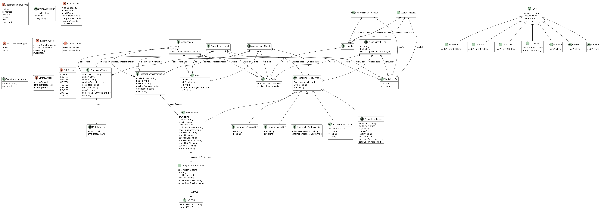
**Figure 21. Appointment Management Data Model**

#### 7.2.1.1. Type Appointment

**Description:** In the context of MEF 113 document, denotes an arrangement between the Buyer and Seller for a Seller Technician to meet with the Buyer at a specified time and place.

<table id="T_Appointment">
    <thead style="font-weight:bold;">
        <tr>
            <td>Name</td>
            <td>Type</td>
            <td>Description</td>
            <td>MEF 113</td>
        </tr>
    </thead>
    <tbody>
        <tr>
            <td>id*</td>
            <td>string</td>
            <td>Unique identifier of the appointment</td>
            <td>Appointment Identifier</td>
        </tr><tr>
            <td>href</td>
            <td>string</td>
            <td>Unique URI used to access to the appointment resource</td>
            <td>Not represented in MEF 113</td>
        </tr><tr>
            <td>attachment</td>
            <td><a href="#T_AttachmentValue">AttachmentValue</a>[]</td>
            <td>Attachments to the Appointment, such as a file, screen-shot or embedded content</td>
            <td>Appointment Attachments</td>
        </tr><tr>
            <td>note</td>
            <td><a href="#T_Note">Note</a>[]</td>
            <td>Notes describing the purpose of and the results of the Appointment</td>
            <td>Appointment Notes</td>
        </tr><tr>
            <td>relatedContactInformation*</td>
            <td><a href="#T_RelatedContactInformation">RelatedContactInformation</a>[]</td>
            <td>Party playing a role in this Appointment. The &#x27;role&#x27; is to specify the type of contact as specified in MEF 113:
Appointment Place Contact (role&#x3D;appointmentPlaceContact) - The site contact(s) that the Seller Technician may need to contact in order to get access to the Appointment Place during the Appointment. This could be an end-user, security personnel or any authorized person 
Buyer Appointment Contact (role&#x3D;buyerAppointmentContact)- The Buyer contact(s) assigned to and responsible for the Appointment.
Seller Appointment Contact (role&#x3D;sellerAppointmentContact) - The Seller contact(s) assigned to and responsible for the Appointment.</td>
            <td>Appointment Place Contacts, Buyer Appointment Contact, Seller Appointment Contact</td>
        </tr><tr>
            <td>relatedPlace*</td>
            <td><a href="#T_RelatedPlaceRefOrValue">RelatedPlaceRefOrValue</a></td>
            <td>The location of the Appointment.</td>
            <td>Appointment Place</td>
        </tr><tr>
            <td>status*</td>
            <td><a href="#T_AppointmentStatusType">AppointmentStatusType</a></td>
            <td>The state of the Appointment</td>
            <td>Appointment State</td>
        </tr><tr>
            <td>validFor*</td>
            <td><a href="#T_TimePeriod">TimePeriod</a></td>
            <td>The Date and Time interval  the Seller Technician is scheduled to arrive at the Appointment.</td>
            <td>Appointment Timeslot</td>
            </tr><tr>
            <td>workOrder*</td>
            <td><a href="#T_WorkOrderRef">WorkOrderRef</a></td>
            <td>A reference to a WorkOrder for which the Appointment is created</td>
            <td>WorkOrder</td>
        </tr>
    </tbody>
</table>

#### 7.2.1.2. Type Appointment_Create

**Description:** In the context of MEF 113 document, denotes an arrangement between the Buyer and Seller for a Seller Technician to meet with the Buyer at a specified time and place.

<table id="T_Appointment_Create">
    <thead style="font-weight:bold;">
        <tr>
            <td>Name</td>
            <td>Type</td>
            <td>Description</td>
            <td>MEF 113</td>
        </tr>
    </thead>
    <tbody>
    </tr><tr>
            <td>attachment</td>
            <td><a href="#T_AttachmentValue">AttachmentValue</a>[]</td>
            <td>Attachments to the Appointment, such as a file, screen shot or embedded content</td>
            <td>Appointment Attachments</td>
        </tr><tr>
            <td>note</td>
            <td><a href="#T_Note">Note</a>[]</td>
            <td>Notes describing the purpose of and the results of the Appointment</td>
            <td>Appointment Notes</td>
         </tr><tr>
            <td>relatedContactInformation*</td>
            <td><a href="#T_RelatedContactInformation">RelatedContactInformation</a>[]</td>
            <td>Party playing a role in this Appointment. The &#x27;role&#x27; is to specify the type of contact as specified in MEF 113:
Appointment Place Contact (role&#x3D;appointmentPlaceContact) - The site contact(s) that the Seller Technician may need to contact in order to get access to the Appointment Place during the Appointment. This could be an end-user, security personnel or any authorized person 
Buyer Appointment Contact (role&#x3D;buyerAppointmentContact)- The Buyer contact(s) assigned to and responsible for the Appointment.
Seller Appointment Contact (role&#x3D;sellerAppointmentContact) - The Seller contact(s) assigned to and responsible for the Appointment.</td>
            <td>Appointment Place Contacts, Buyer Appointment Contact, Seller Appointment Contact</td>
</tr><tr>
        <tr>
            <td>validFor*</td>
            <td><a href="#T_TimePeriod">TimePeriod</a></td>
            <td>The Date and Time interval  the Seller Technician is scheduled to arrive at the Appointment.</td>
            <td>Appointment Timeslot</td>
            </tr><tr>
            <td>workOrder*</td>
            <td><a href="#T_WorkOrderRef">WorkOrderRef</a></td>
            <td>A reference to a WorkOrder for which the Appointment is created</td>
            <td>WorkOrder</td>
        </tr>
    </tbody>
</table>

#### 7.2.1.3. Type Appointment_Find

**Description:** In the context of MEF 113 document, denotes an arrangement between the Buyer and Seller for a Seller Technician to meet with the Buyer at a specified time and place.

<table id="T_Appointment_Find">
    <thead style="font-weight:bold;">
        <tr>
            <td>Name</td>
            <td>Type</td>
            <td>Description</td>
            <td>MEF 113</td>
        </tr>
    </thead>
    <tbody>
        <tr>
            <td>id*</td>
            <td>string</td>
            <td>Unique identifier of the appointment</td>
            <td>Appointment Identifier</td>
        </tr><tr>
            <td>href</td>
            <td>string</td>
            <td>Unique URI used to access to the appointment resource</td>
            <td>Not represented in MEF 113</td>
        </tr><tr>
            <td>relatedPlace*</td>
            <td><a href="#T_RelatedPlaceRefOrValue">RelatedPlaceRefOrValue</a></td>
            <td>The location of the Appointment.</td>
            <td>Appointment Place</td>
        </tr><tr>
            <td>status*</td>
            <td><a href="#T_AppointmentStatusType">AppointmentStatusType</a></td>
            <td>The state of the Appointment.</td>
            <td>Appointment State</td>
        </tr><tr>
            <td>validFor*</td>
            <td><a href="#T_TimePeriod">TimePeriod</a</a>[]</td>
            <td>The Date and Time interval  the Seller Technician is scheduled to arrive at the Appointment</td>
            <td>Appointment Timeslot</td>
        </tr><tr>
            <td>workOrder*</td>
            <td><a href="#T_WorkOrderRef">WorkOrderRef</a></td>
            <td>A reference to a WorkOrder for which the Appointment is created.</td>
            <td>WorkOrder</td>
        </tr>
    </tbody>
</table>

#### 7.2.1.4. Type Appointment_Update

**Description:** In the context of MEF 113 document, denotes an arrangement between the Buyer and Seller for a Seller Technician to meet with the Buyer at a specified time and place.

<table id="T_Appointment_Update">
    <thead style="font-weight:bold;">
        <tr>
            <td>Name</td>
            <td>Type</td>
            <td>Description</td>
            <td>MEF 113</td>
        </tr>
    </thead>
    <tbody>
        <tr>
            <td>attachment</td>
            <td><a href="#T_AttachmentValue">AttachmentValue</a>[]</td>
            <td>Attachments to the Appointment, such as a file, screen shot or embedded content.</td>
            <td>Appointment Attachments</td>
        </tr><tr>
            <td>note</td>
            <td><a href="#T_Note">Note</a>[]</td>
            <td>Notes describing the purpose of and the results of the Appointment.</td>
            <td>Appointment Notes</td>
        </tr><tr>
            <td>relatedContactInformation</td>
            <td><a href="#T_RelatedContactInformation">RelatedContactInformation</a>[]</td>
            <td>Party playing a role in this Appointment. The &#x27;role&#x27; is to specify the type of contact as specified in MEF 113:
Appointment Place Contact (role&#x3D;appointmentPlaceContact) - The site contact(s) that the Seller Technician may need to contact in order to get access to the Appointment Place during the Appointment. This could be an end-user, security personnel or any authorized person 
Buyer Appointment Contact (role&#x3D;buyerAppointmentContact)- The Buyer contact(s) assigned to and responsible for the Appointment.
Seller Appointment Contact (role&#x3D;sellerAppointmentContact) - The Seller contact(s) assigned to and responsible for the Appointment.</td>
            <td>Appointment Place Contacts, Buyer Appointment Contact, Seller Appointment Contact</td>
            </tr><tr>
            <td>relatedPlace</td>
            <td><a href="#T_RelatedPlaceRefOrValue">RelatedPlaceRefOrValue</a></td>
            <td>The location of the Appointment.</td>
            <td>Appointment Place</td>
            </tr><tr>
            <td>validFor</td>
            <td><a href="#T_TimePeriod">TimePeriod</a></td>
            <td>The Date and Time interval  the Seller Technician is scheduled to arrive at the Appointment</td>
            <td>Appointment Timeslot</td>
        </tr>
    </tbody>
</table>

#### 7.2.1.5. `enum` AppointmentStatusType

**Description:** Valid values for the lifecycle status of the appointment

<table id="T_AppointmentStatusType">
    <thead style="font-weight:bold;">
        <tr>
            <td>Value</td>
            <td>MEF 113</td>
            <td>Description</td>
        </tr>
    </thead>
    <tbody>
        <tr>
            <td>confirmed</td>
            <td>SCHEDULED</td>
            <td>The Buyer has negotiated and scheduled the Appointment with the Seller.</td>           
        </tr><tr>
        <tr>
            <td>inProgress</td>
            <td>IN_PROGRESS</td>
            <td>The Appointment can no longer be cancelled (point of no return), this is up to the Seller’s discretion.</td>           
        </tr><tr>
            <td>cancelled</td>
            <td>CANCELLED</td>
            <td>The Appointment was cancelled by the Buyer or the Seller determined that an Appointment was not required.  This is a terminal state.</td>
        </tr><tr>
            <td>missed</td>
            <td>MISSED</td>
            <td>The Appointment did not take place, because of a Seller related issue. For example, no Seller Technician was available on the date of the appointment. </td>
        </tr><tr>
            <td>failed</td>
            <td>FAILED</td>
            <td>The Appointment did not take place, because of an issue with the Buyer. For example, Seller Technician was unable to get to the Appointment due to an incorrect location or unable to get access to the Buyer`s site. This is a terminal state.</td>
        </tr><tr>
            <td>completed</td>
            <td>COMPLETED</td> 
            <td>The Appointment took place as scheduled. This is a terminal state.</td>       
        </tr>
    </tbody>
</table>

#### 7.2.1.6. Type SearchTimeSlot

**Description:** This task resource is used to retrieve available time slots. One of
this available time slot is after used to create or reschedule an appointment
<table id="T_SearchTimeSlot">
    <thead style="font-weight:bold;">
        <tr>
            <td>Name</td>
            <td>Type</td>
            <td>Description</td>
            <td>MEF 113</td>
        </tr>
    </thead>
    <tbody>
        <tr>
            <td>availableTimeSlot*</td>
            <td><a href="#T_TimeSlot">TimeSlot</a>[]</td>
           <td>A set of time slots with the availability of a Seller Technician
            returned by the Seller, which the Buyer may select for creating or
            rescheduling an Appointment.</td>
            <td>Available Timeslots</td>
        </tr><tr>
            <td>requestedTimeSlot*</td>
            <td><a href="#T_TimeSlot">TimeSlot</a>[]</td>
            <td>A set of preferred time slots the Buyer is requesting the Seller to
            verify for availability by a Sellers Technician at the Place
            referenced in the Appointment Related Entity. For example Monday
            thru Friday, or a set of specific time slots.</td>
            <td>Requested Timeslots</td>
        </tr><tr>
            <td>workOrder*</td>
            <td><a href="#T_WorkOrderRef">WorkOrderRef</a></td>
            <td>A reference to a WorkOrder for which the Appointment is created.</td>
            <td>WorkOrder</td>
        </tr>
    </tbody>
</table>

#### 7.2.1.7. Type SearchTimeSlot_Create

**Description:** This task resource is used to retrieve available time slots.
One of this available time slot is after used to create or reschedule an
appointment

<table id="T_SearchTimeSlot_Create">
    <thead style="font-weight:bold;">
        <tr>
            <td>Name</td>
            <td>Type</td>
            <td>Description</td>
            <td>MEF 113</td>
        </tr>
    </thead>
    <tbody>
        <tr>
            <td>requestedTimeSlot*</td>
            <td><a href="#T_TimeSlot">TimeSlot</a>[]</td>
            <td>A set of preferred time slots the Buyer is requesting the Seller to
            verify for availability by a Sellers Technician at the Place
            referenced in the Appointment Related Entity. For example Monday
            thru Friday, or a set of specific time slots.</td>
            <td>Requested Timeslots</td>
        </tr><tr>
            <td>workOrder*</td>
            <td><a href="#T_WorkOrderRef">WorkOrderRef</a></td>
            <td>A reference to a WorkOrder for which the Appointment is created.</td>
            <td>WorkOrder</td>
        </tr>
    </tbody>
</table>

#### 7.2.1.8. Type WorkOrderRef

**Description:** A reference to an WorkOrder resource.

<table id="T_WorkOrderRef">
    <thead style="font-weight:bold;">
        <tr>
            <td>Name</td>
            <td>Type</td>
            <td>Description</td>
            <td>MEF 113</td>
        </tr>
    </thead>
    <tbody>
        <tr>
            <td>href</td>
            <td>string</td>
            <td>Hyperlink to the referenced WorkOrder.
</td>
            <td>Not represented in MEF 113</td>
        </tr><tr>
            <td>id*</td>
            <td>string</td>
            <td>Identifier of the referenced WorkOrder.</td>
            <td>WorkOrder Identifier</td>
        </tr>
    </tbody>
</table>

### 7.2.2. WorkOrder

Figure 22 presents the whole WorkOrder Management data model the data types,
requirements related to them and mapping to MEF 113 specifications are
discussed later in this section.


**Figure 22. WorkOrder Management Data Model**

#### 7.2.2.1. Type WorkOrder

**Description:** A set of tasks to be scheduled and performed under the
responsibility of a Seller Technician(s)

<table id="T_WorkOrder">
    <thead style="font-weight:bold;">
        <tr>
            <td>Name</td>
            <td>Type</td>
            <td>Description</td>
            <td>MEF 113</td>
        </tr>
    </thead>
    <tbody>
        <tr>
            <td>id*</td>
            <td>string</td>
            <td>Unique (within the Seller domain) identifier for the WorkOrder.</td>
            <td>WorkOrder Identifier</td>
        </tr><tr>
            <td>href</td>
            <td>string</td>
            <td>Hyperlink, a reference to the WorkOrder entity</td>
            <td>Not represented in MEF 113</td>
        </tr><tr>
            <td>appointmentRequired*</td>
            <td>boolean</td>
            <td>The Seller requires the Buyer to schedule an Appointment. If set to true, the Seller is Requesting the Buyer to schedule an Appointment.</td>
            <td>Appointment Required</td>
        </tr><tr>
            <td>appointment</td>
            <td><a href="#T_AppointmentRef">AppointmentRef</a>[]</td>
            <td>A reference to a set of Appointments for the WorkOrder. A WorkOrder may contain only one open Appointment at a time (e.g. with the state of &#x27;scheduled&#x27;).</td>
            <td>WorkOrder Appointments</td>
        </tr><tr>
            <td>duration*</td>
            <td><a href="#T_TimeDuration">TimeDuration</a></td>
            <td>The anticipated amount of time the Seller Technician will be onsite.</td>
            <td>WorkOrder Duration</td>
        </tr><tr>
            <td>note</td>
            <td><a href="#T_Note">Note</a>[]</td>
            <td>A set of unstructured comments or information associated to the WorkOrder</td>
            <td>WorkOrder Notes</td>
        </tr><tr>
            <td>place*</td>
            <td><a href="#T_RelatedPlaceRefOrValue">RelatedPlaceRefOrValue</a>[]</td>
            <td>The location where the WorkOrder Tasks are to be performed. If an appointment is needed, this will also be the location where the Appointment takes place and includes the site contact which the Seller technician may need to get access to the Buyer&#x27;s site during the Appointment. This could be an end-user, security personnel or any authorized person</td>
            <td>WorkOrder Place</td>
        </tr><tr>
            <td>plannedExecutionDate</td>
            <td><a href="#T_DateTime">DateTime</a></td>
            <td>The date provided by the Seller to indicate when the Workorder is expected to be started.</td>
            <td>Planned Execution Date</td>
        </tr><tr>
            <td>relatedContactInformation*</td>
            <td><a href="#T_RelatedContactInformation">RelatedContactInformation</a>[]</td>
            <td>Party playing a role in this WorkOrder. The &#x27;role&#x27; is to specify the type of contact as specified in MEF 113: Technical Contact (&#x27;role&#x3D;technicalContact&#x27;) - REQUIRED to be set by the Seller. The Seller technical contact responsible for the WorkOrder. Technician (&#x27;role&#x3D;technician&#x27;) - The Seller technician assigned to the WorkOrder and responsible for performing a set of tasks. In certain instances this could be a Buyer technician that works on behalf of the Seller.</td>
            <td>WorkOrder Contact</td>
        </tr><tr>
            <td>relatedEntity*</td>
            <td><a href="#T_RelatedEntity">RelatedEntity</a>[]</td>
            <td>An entity that is related to the WorkOrder such as a service, a product, etc. The entity which the WorkOrder is associated with.</td>
            <td>WorkOrder Related Entity</td>
        </tr><tr>
            <td>state*</td>
            <td><a href="#T_WorkOrderStateType">WorkOrderStateType</a></td>
            <td>The state of the WorkOrder.</td>
            <td>WorkOrder State</td>
        </tr><tr>
            <td>task*</td>
            <td>string[]</td>
            <td>A set of tasks to be performed under the responsibility of the Technician to fulfil the WorkOrder. Each item is a description of a specific task to be performed under the responsibility of the Technician.</td>
            <td>Tasks</td>
        </tr>
    </tbody>
</table>

#### 7.2.2.2. Type WorkOrder_Find

**Description:** A set of tasks to be scheduled and performed under the
responsibility of a Seller Technician(s)

<table id="T_WorkOrder_Find">
    <thead style="font-weight:bold;">
        <tr>
            <td>Name</td>
            <td>Type</td>
            <td>Description</td>
            <td>MEF 113</td>
        </tr>
    </thead>
    <tbody>
        <tr>
            <td>appointmentRequired*</td>
            <td>boolean</td>
            <td>The Seller requires the Buyer to schedule an Appointment. If set to true, the Seller is Requesting the Buyer to schedule an Appointment.</td>
            <td>Appointment Required</td>
        </tr><tr>
            <td>id*</td>
            <td>string</td>
            <td>Unique (within the Seller domain) identifier for the WorkOrder.</td>
            <td>WorkOrder Identifier</td>
        </tr><tr>
            <td>relatedEntity*</td>
            <td><a href="#T_RelatedEntity">RelatedEntity</a>[]</td>
            <td>An entity that is related to the WorkOrder such as a service, a product, etc. The entity which the WorkOrder is associated with.</td>
            <td>WorkOrder Related Entity</td>
        </tr><tr>
            <td>place*</td>
            <td><a href="#T_RelatedPlaceRefOrValue">RelatedPlaceRefOrValue</a>[]</td>
            <td>The location where the WorkOrder Tasks are to be performed. If an appointment is needed, this will also be the location where the Appointment takes place and includes the site contact which the Seller technician may need to get access to the Buyer&#x27;s site during the Appointment. This could be an end-user, security personnel or any authorized person</td>
            <td>WorkOrder Place</td>
        </tr><tr>
            <td>state*</td>
            <td><a href="#T_WorkOrderStateType">WorkOrderStateType</a></td>
            <td>The state of the WorkOrder</td>
            <td>WorkOrder State</td>
        </tr>
    </tbody>
</table>

#### 7.2.2.3. `enum` WorkOrderStateType

**Description:** Possible values for the state of the WorkOrder

| state            | MEF 113 name       | Description                                                                                                                                                                                                                                                        |
| ---------------- | ------------------ | ------------------------------------------------------------------------------------------------------------------------------------------------------------------------------------------------------------------------------------------------------------------ |
| completed        | COMPLETED          | The Seller Technician responsible for the WorkOrder has successfully completed all the assigned Tasks.                                                                                                                                                             |
| cancelled        | CANCELLED          | The WorkOrder has been cancelled by the Seller or due to the Buyer requesting to cancel the WorkOrder.                                                                                                                                                             |
| inProgress       | IN_PROGRESS        | The Seller Technician responsible for the WorkOrder has been assigned and started one or more of the assigned Tasks.                                                                                                                                               |
| open             | OPEN               | A WorkOrder was initiated by the Seller to be assigned to a Technician responsible for resolving the WorkOrder.                                                                                                                                                    |
| planned          | PLANNED            | The WorkOrder has been given an execution date for resolving one or more Tasks.                                                                                                                                                                                    |
| unableToComplete | UNABLE_TO_COMPLETE | The Seller Technician responsible for the WorkOrder was unable to complete one or more of the assigned Tasks, because additional skills or information is required. Additional tasks are required to resolve the WorkOrder and a new WorkOrder needs to be opened. |

#### 7.2.2.4. Type AppointmentRef

**Description:** A reference to an Appointment resource available through
Appointment API.

<table id="T_AppointmentRef">
    <thead style="font-weight:bold;">
        <tr>
            <td>Name</td>
            <td>Type</td>
            <td>Description</td>
            <td>MEF 113</td>
        </tr>
    </thead>
    <tbody>
        <tr>
            <td>href</td>
            <td>string</td>
            <td>Hyperlink to the referenced Appointment. Hyperlink MAY be used by the Seller in responses. Hyperlink MUST be ignored by the Seller in case it is provided by the Buyer in a request
</td>
            <td>Not represented in MEF 113</td>
        </tr><tr>
            <td>id*</td>
            <td>string</td>
            <td>Identifier of the referenced Appointment.</td>
            <td>Appointment Identifier</td>
        </tr>
    </tbody>
</table>

### 7.2.3. Common

Types described in this subsection are shared among two or more Cantata and
Sonata APIs.

#### 7.2.3.1. Type AttachmentValue

**Description:** Complements the description of an element (for instance a
product) through video, pictures...

<table id="T_AttachmentValue">
    <thead style="font-weight:bold;">
        <tr>
            <td>Name</td>
            <td>Type</td>
            <td>Description</td>
            <td>MEF 113</td>
        </tr>
    </thead>
    <tbody>
        <tr>
            <td>attachmentId</td>
            <td>string</td>
            <td>locally unique identifier to distinguish items from the Attachment list.</td>
            <td>Not represented in MEF 113</td>
        </tr><tr>
            <td>author*</td>
            <td>string</td>
            <td>Author of the Attachment</td>
            <td>Attachment Author</td>
        </tr><tr>
            <td>content</td>
            <td>string</td>
            <td>The actual contents of the attachment object, if embedded, encoded as base64. Either url or (content and mimeType) attributes MUST be provided during creation.</td>
            <td>Content</td>
        </tr><tr>
            <td>creationDate</td>
            <td>date-time</td>
            <td>The date the Attachment was added.</td>
            <td>Attachment Date</td>
        </tr><tr>
            <td>description</td>
            <td>string</td>
            <td>A narrative text describing the content of the attachment</td>
            <td>Description</td>
        </tr><tr>
            <td>mimeType</td>
            <td>string</td>
            <td>Attachment mime type such as extension file for video, picture and document</td>
            <td>Mime Type</td>
        </tr><tr>
            <td>name*</td>
            <td>string</td>
            <td>The name of the attachment</td>
            <td>Attachment Name</td>
        </tr><tr>
            <td>size</td>
            <td><a href="#T_MEFByteSize">MEFByteSize</a></td>
            <td>The size of the attachment.</td>
            <td>MEFByteSize</td>
        </tr><tr>
            <td>source*</td>
            <td><a href="#T_MEFBuyerSellerType">MEFBuyerSellerType</a></td>
            <td>Indicates if the attachment was added by the Buyer or the Seller.</td>
            <td>Attachment Source</td>
        </tr><tr>
            <td>url</td>
            <td>string</td>
            <td>URL where the attachment is located. Either url or (content and mimeType) attributes MUST be provided during creation.</td>
            <td>URL</td>
        </tr>
    </tbody>
</table>

#### 7.2.3.2. `enum` DataSizeUnit

**Description:** The unit of measure in the data size.

<table id="T_DataSizeUnit">
    <thead style="font-weight:bold;">
        <tr>
            <td>Value</td>     
        </tr>
    </thead>
    <tbody>
        <tr>
            <td>BYTES</td>
        </tr><tr>
            <td>KBYTES</td>
        </tr><tr>
            <td>GBYTES</td>
        </tr><tr>
            <td>TBYTES</td>
        </tr><tr>
            <td>PBYTES</td>
        </tr><tr>
            <td>EBYTES</td>  
        </tr><tr>
            <td>ZBYTES</td> 
        </tr><tr>
            <td>YBYTES</td>
        </tr>
    </tbody>
</table>

#### 7.2.3.3. Type FieldedAddress

**Description:** A type of Address that has a discrete field and value for each type of boundary or an identifier down to the lowest level of detail. For example "street number" is one field, "street name" is another field, etc.
Reference: MEF 79 (Sn 8.9.2)

Inherits from:

- <a href="#T_RelatedPlaceRefOrValue">RelatedPlaceRefOrValue</a>

<table id="T_FieldedAddress">
    <thead style="font-weight:bold;">
        <tr>
            <td>Name</td>
            <td>Type</td>
            <td>Description</td>
            <td>MEF 113</td>
        </tr>
    </thead>
    <tbody>
        <tr>
            <td>city*</td>
            <td>string</td>
            <td>The city that the address is in</td>
            <td>City</td>
        </tr><tr>
            <td>country*</td>
            <td>string</td>
            <td>The country that the address is in</td>
            <td>Country</td>
        </tr><tr>
            <td>geographicSubAddress</td>
            <td><a href="#T_GeographicSubAddress">GeographicSubAddress</a></td>
            <td>Additional fields used to specify an address, as detailed as possible.</td>
            <td>Not represented in MEF 113</td>
        </tr><tr>
            <td>locality</td>
            <td>string</td>
            <td>The locality that the address is in</td>
            <td>Locality</td>
        </tr><tr>
            <td>postcode</td>
            <td>string</td>
            <td>The descriptor for a postal delivery area, used to speed and simplify the delivery of mail (also known as zip code)</td>
            <td>Postal Code</td>
        </tr><tr>
            <td>postcodeExtension</td>
            <td>string</td>
            <td>An extension of a postal code. E.g. the part following the dash in a US urban property address</td>
            <td>Postal Code Extension</td>
        </tr><tr>
            <td>stateOrProvince</td>
            <td>string</td>
            <td>The State or Province that the address is in</td>
            <td>State Or Province</td>
        </tr><tr>
            <td>streetName*</td>
            <td>string</td>
            <td>Name of the street or other street type</td>
            <td>Street Name</td>
        </tr><tr>
            <td>streetNr</td>
            <td>string</td>
            <td>Number identifying a specific property on a public street. It may be combined with streetNrLast for ranged addresses. MEF 79 defines it as required however in certain countries it is not used we make it optional in API.</td>
            <td>Street Number</td>
        </tr><tr>
            <td>streetNrLast</td>
            <td>string</td>
            <td>Last number in a range of street numbers allocated to a property</td>
            <td>Street Number Last</td>
        </tr><tr>
            <td>streetNrLastSuffix</td>
            <td>string</td>
            <td>Last street number suffix for a ranged address</td>
            <td>Street Number Suffix Last</td>
        </tr><tr>
            <td>streetNrSuffix</td>
            <td>string</td>
            <td>The first street number suffix</td>
            <td>Street Number Suffix</td>
        </tr><tr>
            <td>streetSuffix</td>
            <td>string</td>
            <td>A modifier denoting a relative direction</td>
            <td>Street Suffix</td>
        </tr><tr>
            <td>streetType</td>
            <td>string</td>
            <td>The type of street (e.g., alley, avenue, boulevard, brae, crescent, drive, highway, lane, terrace, parade, place, tarn, way, wharf)</td>
            <td>Street Type</td>
        </tr>
    </tbody>
</table>

#### 7.2.3.4. Type FormattedAddress

**Description:**  A type of Address that has discrete fields for each type of boundary or an identifier with the exception of the street and more specific location details, which are combined into a maximum of two strings
based on local postal addressing conventions. Reference: MEF 79 (Sn 8.9.3)

Inherits from:

- <a href="#T_RelatedPlaceRefOrValue">RelatedPlaceRefOrValue</a>

<table id="T_FormattedAddress">
    <thead style="font-weight:bold;">
        <tr>
            <td>Name</td>
            <td>Type</td>
            <td>Description</td>
            <td>MEF 113</td>
        </tr>
    </thead>
    <tbody>
        <tr>
            <td>addrLine1*</td>
            <td>string</td>
            <td>The first address line in a formatted address</td>
            <td>Address Line 1</td>
        </tr><tr>
            <td>addrLine2</td>
            <td>string</td>
            <td>The second address line in a formatted address</td>
            <td>Address Line 2</td>
        </tr><tr>
            <td>city*</td>
            <td>string</td>
            <td>The city that the address is in</td>
            <td>City</td>
        </tr><tr>
            <td>country*</td>
            <td>string</td>
            <td>The country that the address is in</td>
            <td>Country</td>
        </tr><tr>
            <td>locality</td>
            <td>string</td>
            <td>An area of defined or undefined boundaries within a local
            authority or another legislatively defined area, usually rural
            or semi-rural in nature</td>
            <td>Locality</td>
        </tr><tr>
            <td>postcode</td>
            <td>string</td>
            <td>The descriptor for a postal delivery area, used to speed and simplify the delivery of mail (also known as ZIP code)</td>
            <td>Postal Code</td>
        </tr><tr>
            <td>postcodeExtension</td>
            <td>string</td>
            <td>An extension of a postal code. E.g. the part following the dash in an US urban property address</td>
            <td>Postal Code Extension</td>
        </tr><tr>
            <td>stateOrProvince</td>
            <td>string</td>
            <td>The State or Province that the address is in</td>
            <td>State Or Province</td>
        </tr>
    </tbody>
</table>

#### 7.2.3.5. Type GeographicAddressLabel

**Description:** A unique identifier controlled by a generally accepted
independent administrative authority that specifies a fixed geographical
location. Reference: MEF 79 (Sn 8.9.4)

Inherits from:

- <a href="#T_RelatedPlaceRefOrValue">RelatedPlaceRefOrValue</a>

<table id="T_GeographicAddressLabel">
    <thead style="font-weight:bold;">
        <tr>
            <td>Name</td>
            <td>Type</td>
            <td>Description</td>
            <td>MEF 113</td>
        </tr>
    </thead>
    <tbody>
        <tr>
            <td>externalReferenceId*</td>
            <td>string</td>
            <td>A reference to an address by id</td>
            <td>Administrative Authority Address Label</td>
        </tr><tr>
            <td>externalReferenceType*</td>
            <td>string</td>
            <td>Uniquely identifies the authority that specifies the addresses reference and/or its type (if the authority specifies more than one type of address). The value(s) to be used are to be agreed during the onboarding. For North American providers this would normally be CLLI (Common Language Location Identifier) code.</td>
            <td>Administrative Authority</td>
        </tr>
    </tbody>
</table>

#### 7.2.3.6. Type GeographicAddressRef

**Description:** A reference to a Geographic Address resource available through
Address Validation API.

Inherits from:

- <a href="#T_RelatedPlaceRefOrValue">RelatedPlaceRefOrValue</a>

<table id="T_GeographicAddressRef">
    <thead style="font-weight:bold;">
        <tr>
            <td>Name</td>
            <td>Type</td>
            <td>Description</td>
            <td>MEF 113</td>
        </tr>
    </thead>
    <tbody>
        <tr>
            <td>href</td>
            <td>string</td>
            <td>Hyperlink to the referenced GeographicAddress. Hyperlink MAY be used by the Seller in responses. Hyperlink MUST be ignored by the Seller in case it is provided by the Buyer in a request
</td>
            <td>Not represented in MEF 113</td>
        </tr><tr>
            <td>id*</td>
            <td>string</td>
            <td>Identifier of the referenced Geographic Address. This identifier is assigned during a successful address validation request (Geographic Address Validation API)</td>
            <td>Not represented in MEF 113</td>
        </tr>
    </tbody>
</table>

#### 7.2.3.7. Type GeographicSiteRef

**Description:** A reference to a Geographic Site resource available through
Service Site API

Inherits from:

- <a href="#T_RelatedPlaceRefOrValue">RelatedPlaceRefOrValue</a>

<table id="T_GeographicSiteRef">
    <thead style="font-weight:bold;">
        <tr>
            <td>Name</td>
            <td>Type</td>
            <td>Description</td>
            <td>MEF 113</td>
        </tr>
    </thead>
    <tbody>
        <tr>
            <td>href</td>
            <td>string</td>
            <td>Hyperlink to the referenced GeographicSite. Hyperlink MAY be used by the Seller in responses. Hyperlink MUST be ignored by the Seller in case it is provided by the Buyer in a request
</td>
            <td>Not represented in MEF 113</td>
        </tr><tr>
            <td>id*</td>
            <td>string</td>
            <td>Identifier of the referenced Geographic Site.</td>
            <td>Not represented in MEF 113</td>
        </tr>
    </tbody>
</table>

#### 7.2.3.8. Type GeographicSubAddress

**Description:** Additional fields used to specify an address, as detailed as possible.

<table id="T_GeographicSubAddress">
    <thead style="font-weight:bold;">
        <tr>
            <td>Name</td>
            <td>Type</td>
            <td>Description</td>
            <td>MEF 113</td>
        </tr>
    </thead>
    <tbody>
        <tr>
            <td>buildingName</td>
            <td>string</td>
            <td>Allows for identification of places that require building name  as part of addressing information </td>
            <td>Building Name</td>
        </tr><tr>
            <td>id</td>
            <td>string</td>
            <td>Unique Identifier of the subAddress</td>
            <td>Not represented in MEF 113</td>
        </tr><tr>
            <td>levelNumber</td>
            <td>string</td>
            <td>Used where a level type may be repeated e.g. BASEMENT 1, BASEMENT 2</td>
            <td>Level Number</td>
        </tr><tr>
            <td>levelType</td>
            <td>string</td>
            <td>Describes level types within a building</td>
            <td>Level Type</td>
        </tr><tr>
            <td>privateStreetName</td>
            <td>string</td>
            <td>&quot;Private streets internal to a property (e.g. a university) may have internal names that are not recorded by the land title office</td>
            <td>Private Street Name</td>
        </tr><tr>
            <td>privateStreetNumber</td>
            <td>string</td>
            <td>Private streets numbers internal to a private street</td>
            <td>Private Street Number</td>
        </tr><tr>
            <td>subUnit</td>
            <td><a href="#T_MEFSubUnit">MEFSubUnit</a>[]</td>
            <td>Representation of a MEFSubUnit It is used for describing subunit within a subaddress  e.g.BERTH, FLAT, PIER, SUITE, SHOP, TOWER, UNIT, WHARF.</td>
            <td>Not represented in MEF 113</td>
        </tr>
    </tbody>
</table>

#### 7.2.3.9. `enum` MEFBuyerSellerType

**Description:** An enumeration of buyer and seller values.

<table id="T_MEFBuyerSellerType">
    <thead style="font-weight:bold;">
        <tr>
            <td>Value</td>
            <td>MEF 113</td>
        </tr>
    </thead>
    <tbody>
        <tr>
            <td>buyer</td>
            <td>BUYER</td>
        </tr><tr>
            <td>seller</td>
            <td>SELLER</td>
        </tr>
    </tbody>
</table>

#### 7.2.3.10. Type MEFByteSize

**Description:** A size represented by value and Byte units

<table id="T_MEFByteSize">
    <thead style="font-weight:bold;">
        <tr>
            <td>Name</td>
            <td>Type</td>
            <td>Description</td>
            <td>MEF 113</td>
        </tr>
    </thead>
    <tbody>
        <tr>
            <td>amount</td>
            <td>float</td>
            <td>Numeric value in a given unit</td>
            <td>Value</td>
        </tr><tr>
            <td>units</td>
            <td><a href="#T_DataSizeUnit">DataSizeUnit</a></td>
            <td>Byte Unit</td>
            <td>Unit</td>
        </tr>
    </tbody>
</table>

#### 7.2.3.11. Type MEFGeographicPoint

**Description:** A MEFGeographicPoint defines a geographic point through
coordinates. Reference: MEF 79 (Sn 8.9.5)

Inherits from:

- <a href="#T_RelatedPlaceRefOrValue">RelatedPlaceRefOrValue</a>

<table id="T_MEFGeographicPoint">
    <thead style="font-weight:bold;">
        <tr>
            <td>Name</td>
            <td>Type</td>
            <td>Description</td>
            <td>MEF 113</td>
        </tr>
    </thead>
    <tbody>
        <tr>
            <td>spatialRef*</td>
            <td>string</td>
            <td>The spatial reference system used to determine the coordinates (e.g. &quot;WGS84&quot;). The system used and the value of this field are to be agreed upon during the onboarding process.</td>
            <td>Spatial Reference</td>
        </tr><tr>
            <td>x*</td>
            <td>string</td>
            <td>The latitude expressed in the format specified by the &#x60;spacialRef&#x60;</td>
            <td>Latitude</td>
        </tr><tr>
            <td>y*</td>
            <td>string</td>
            <td>The longitude expressed in the format specified by the &#x60;spacialRef&#x60;</td>
            <td>Longitude</td>
        </tr><tr>
            <td>z</td>
            <td>string</td>
            <td>The elevation expressed in the format specified by the &#x60;spacialRef&#x60;</td>
            <td>Elevation</td>
        </tr>
    </tbody>
</table>

#### 7.2.3.12. Type MEFSubUnit

**Description:** Allows for subunit identification

<table id="T_MEFSubUnit">
    <thead style="font-weight:bold;">
        <tr>
            <td>Name</td>
            <td>Type</td>
            <td>Description</td>
            <td>MEF 113</td>
        </tr>
    </thead>
    <tbody>
        <tr>
            <td>subUnitNumber*</td>
            <td>string</td>
            <td>The discriminator used for the subunit, often just a simple number but may also be a range.</td>
            <td>SubUnit Name</td>
        </tr><tr>
            <td>subUnitType*</td>
            <td>string</td>
            <td>The type of subunit e.g.BERTH, FLAT, PIER, SUITE, SHOP, TOWER, UNIT, WHARF.</td>
            <td>SubUnit Type</td>
        </tr>
    </tbody>
</table>

#### 7.2.3.13. Type Note

**Description:** Extra information about a given entity. Only useful in
processes involving human interaction. Not applicable to an automated process.

<table id="T_Note">
    <thead style="font-weight:bold;">
        <tr>
            <td>Name</td>
            <td>Type</td>
            <td>Description</td>
            <td>MEF 113</td>
        </tr>
    </thead>
    <tbody>
        <tr>
            <td>author*</td>
            <td>string</td>
            <td>Author of the note</td>
            <td>Author</td>
        </tr><tr>
            <td>date*</td>
            <td>date-time</td>
            <td>Date of the note</td>
            <td>Note Date</td>
        </tr><tr>
            <td>id*</td>
            <td>string</td>
            <td>Identifier of the note within its containing entity (may or may not be globally unique, depending on provider implementation)</td>
            <td>Not represented in MEF 113</td>
        </tr><tr>
            <td>source*</td>
            <td><a href="#T_MEFBuyerSellerType">MEFBuyerSellerType</a></td>
            <td>Indicates if this Note was added by the Buyer or Seller.</td>
            <td>Note Source</td>
        </tr><tr>
            <td>text*</td>
            <td>string</td>
            <td>Text of the note</td>
            <td>Note Text</td>
        </tr>
    </tbody>
</table>

#### 7.2.3.14. Type RelatedContactInformation

**Description:** Contact data for a person or organization that is involved in
a given context. It is specified by the Seller (e.g. Seller Contact
Information) or by the Buyer.

<table id="T_RelatedContactInformation">
    <thead style="font-weight:bold;">
        <tr>
            <td>Name</td>
            <td>Type</td>
            <td>Description</td>
            <td>MEF 113</td>
        </tr>
    </thead>
    <tbody>
        <tr>
            <td>emailAddress*</td>
            <td>string</td>
            <td>Email address</td>
            <td>Contact email Address</td>
        </tr><tr>
            <td>name*</td>
            <td>string</td>
            <td>Name of the contact</td>
            <td>Contact Name</td>
        </tr><tr>
            <td>number*</td>
            <td>string</td>
            <td>Phone number</td>
            <td>Contract Phone Number</td>
        </tr><tr>
            <td>numberExtension</td>
            <td>string</td>
            <td>Phone number extension</td>
            <td>Contract Phone Number Extension"</td>
        </tr><tr>
            <td>organization</td>
            <td>string</td>
            <td>The organization or company that the contact belongs to</td>
            <td>Contact Organization</td>
        </tr><tr>
            <td>postalAddress</td>
            <td><a href="#T_FieldedAddress">FieldedAddress</a></td>
            <td>Identifies the postal address of the person or office to be contacted.</td>
            <td>Contact Postal Address</td>
        </tr><tr>
            <td>role*</td>
            <td>string</td>
            <td>A role the party plays in a given context.</td>
            <td>Not represented in MEF 113</td>
        </tr>
    </tbody>
</table>

#### 7.2.3.15. Type RelatedEntity

**Description:** A reference to an entity, where the type of the entity is not
known in advance.

<table id="T_RelatedEntity">
    <thead style="font-weight:bold;">
        <tr>
            <td>Name</td>
            <td>Type</td>
            <td>Description</td>
            <td>MEF 113</td>
        </tr>
    </thead>
    <tbody>
        <tr>
            <td>@referredType*</td>
            <td>string</td>
            <td>The actual type of the target instance when needed for disambiguation.</td>
            <td>Not represented in MEF 113</td>
        </tr><tr>
            <td>href</td>
            <td>string</td>
            <td>Reference of the related entity.</td>
            <td>Not represented in MEF 113</td>
        </tr><tr>
            <td>id*</td>
            <td>string</td>
            <td>Unique identifier of a related entity.</td>
            <td>Product Identifier</td>
        </tr><tr>
            <td>role*</td>
            <td>string</td>
            <td>The role of an entity.</td>
            <td>Not represented in MEF 113</td>
        </tr>
    </tbody>
</table>

#### 7.2.3.16. Type RelatedPlaceRefOrValue

**Description:** Defines the Place (Address or Site) by reference or by value.

<table id="T_RelatedPlaceRefOrValue">
    <thead style="font-weight:bold;">
        <tr>
            <td>Name</td>
            <td>Type</td>
            <td>Description</td>
            <td>MEF 113</td>
        </tr>
    </thead>
    <tbody>
        <tr>
            <td>@schemaLocation</td>
            <td>uri</td>
            <td>A URI to a JSON-Schema file that defines additional attributes and relationships. May be used to define additional related place types. Usage of this attribute must be agreed upon between Buyer and Seller.</td>
            <td>Not represented in MEF 113</td>
        </tr><tr>
            <td>@type*</td>
            <td>string</td>
            <td>This field is used as a discriminator and is used between different place representations. This type might discriminate for additional related place as defined in &#x27;@schemaLocation&#x27;.
</td>
            <td>Not represented in MEF 113</td>
        </tr><tr>
            <td>role*</td>
            <td>string</td>
            <td>Role of this place</td>
            <td>RelatedPlaceRefOrValue</td>
        </tr>
    </tbody>
</table>

#### 7.2.3.17. Type TimeDuration

**Description:** This class is used to describe durations expressed as a 2-tuple, (value, units). The units from nanoseconds to years.

<table id="T_TimeDuration">
    <thead style="font-weight:bold;">
        <tr>
            <td>Name</td>
            <td>Type</td>
            <td>Description</td>
            <td>MEF 113</td>
        </tr>
    </thead>
    <tbody>
        <tr>
            <td>timeDurationValue*</td>
            <td>integer</td>
            <td>The value of the duration. For example, if the duration is 20 ms, this element is 20</td>
            <td>Not represented in MEF 113</td>
        </tr><tr>
            <td>timeDurationUnits*</td>
            <td><a href="#T_TimeDurationUnits">TimeDurationUnits</td>
            <td>The unit of measure in the duration. For example, if an interval is 2ms, this element is MS.</td>
            <td>Not represented in MEF 113</td>
        </tr>
    </tbody>
</table>

#### 7.2.3.18. `enum` TimeDurationUnits

**Description:** The unit of measure in the duration. For example, if an
interval is 2ms, this element is MS.

<table id="T_TimeDurationUnits">
    <thead style="font-weight:bold;">
        <tr>
            <td>Value</td>
        </tr>
    </thead>
    <tbody>
        <tr>
            <td>NS</td>
        </tr><tr>
            <td>US</td>
        </tr><tr>
            <td>MS</td>
        </tr><tr>
            <td>SEC</td>
        </tr><tr>
            <td>MIN</td>
        </tr><tr>
            <td>HOUR</td>
        </tr><tr>
            <td>DAY</td>
        </tr><tr>
            <td>WEEK</td>
        </tr><tr>
            <td>MONTH</td>
        </tr><tr>
            <td>YEAR</td>
        </tr>
    </tbody>
</table>

#### 7.2.3.19. Type TimePeriod

**Description:** A period of time, either as a deadline (endDateTime only) a
startDateTime only, or both

<table id="T_TimePeriod">
    <thead style="font-weight:bold;">
        <tr>
            <td>Name</td>
            <td>Type</td>
            <td>Description</td>
            <td>MEF 113</td>
        </tr>
    </thead>
    <tbody>
        <tr>
            <td>endDateTime*</td>
            <td>date-time</td>
            <td>End of the time period, using IETC-RFC-3339 format</td>
            <td>Not represented in MEF 113</td>
        </tr><tr>
            <td>startDateTime*</td>
            <td>date-time</td>
            <td>Start of the time period, using IETC-RFC-3339 format. If you define a start, you must also define an end</td>
            <td>Not represented in MEF 113</td>
        </tr>
    </tbody>
</table>

#### 7.2.3.20. Type TimeSlot

**Description:**

<table id="T_TimeSlot">
    <thead style="font-weight:bold;">
        <tr>
            <td>Name</td>
            <td>Type</td>
            <td>Description</td>
            <td>MEF 113</td>
        </tr>
    </thead>
    <tbody>
        <tr>
            <td>validFor*</td>
            <td><a href="#T_TimePeriod">TimePeriod</a></td>
            <td>The Date and Time interval  the Seller Technician is scheduled to arrive at the Appointment.</td>
            <td>Appointment Timeslot</td>
        </tr>
    </tbody>
</table>

### 7.2.4. Notification registration

Notification registration and management are done through `/hub` API endpoint.
The below sections describe data models related to this endpoint.

#### 7.2.4.1. Type EventSubscription

**Description:** Sets the communication endpoint address the service instance
must use to deliver notification information

<table id="T_EventSubscription">
    <thead style="font-weight:bold;">
        <tr>
            <td>Name</td>
            <td>Type</td>
            <td>Description</td>
            <td>MEF 113</td>
        </tr>
    </thead>
    <tbody>
        <tr>
            <td>callback*</td>
            <td>string</td>
            <td>The value provided by the Buyer in &#x60;EventSubscriptionInput&#x60; during notification registration</td>
            <td>Notification Target Information</td>
        </tr><tr>
            <td>id*</td>
            <td>string</td>
            <td> An identifier of the event subscription assigned by the Seller when a resource is created.</td>
            <td>Not represented in MEF 113</td>
        </tr><tr>
            <td>query</td>
            <td>string</td>
            <td>This attribute is used to define notification registration constraints.</td>
            <td>List of Notification Event Types, Action</td>
        </tr>
    </tbody>
</table>

#### 7.2.4.2. Type EventSubscriptionInput

**Description:** This class is used to register for Notifications.

<table id="T_EventSubscriptionInput">
    <thead style="font-weight:bold;">
        <tr>
            <td>Name</td>
            <td>Type</td>
            <td>Description</td>
            <td>MEF 113</td>
        </tr>
    </thead>
    <tbody>
        <tr>
            <td>callback*</td>
            <td>string</td>
            <td>This callback value must be set to *host* property from Buyer Notification API (appointmentNotification.api.yaml). This property is appended with the base path and notification resource path specified in that API to construct an URL to which notification is sent. E.g. for &quot;callback&quot;: &quot;http://buyer.com/listenerEndpoint&quot;, the status change event notification will be sent to: &#x60;http://buyer.com/listenerEndpoint/mefApi/sonata/appointmentNotification/v2/listener/appointmentStatusChangeEvent&#x60;</td>
            <td>Notification Target Information</td>
        </tr><tr>
            <td>query</td>
            <td>string</td>
            <td>This attribute is used to define to which type of events to register to. Example: &quot;query&quot;:&quot;eventType &#x3D; AppointmentStatusChangeEvent&quot;. To subscribe for more than one event type, put the values separated by comma: &#x60;eventType&#x3D;AppointmentStatusChangeEvent,AppointmentResolvedEvent&#x60;. The possible values are enumerated by the &#x27;AppointmentEventType&#x27; in AppointmentNotification.api.yaml. An empty query is treated as specifying no filters - ending in  subscription for all event types.</td>
            <td>List of Notification Event Types, Action</td>
        </tr>
    </tbody>
</table>

## 7.3. Notification API Data Model

### 7.3.1. Common Notification.

#### 7.3.1.1. Type Event

**Description:** Event class is used to describe the information structure used
for notification.

<table id="T_Event">
    <thead style="font-weight:bold;">
        <tr>
            <td>Name</td>
            <td>Type</td>
            <td>Description</td>
            <td>MEF 113</td>
        </tr>
    </thead>
    <tbody>
        <tr>
            <td>eventId*</td>
            <td>string</td>
            <td>Id of the event</td>
            <td>Not represented in MEF 113</td>
        </tr><tr>
            <td>eventTime*</td>
            <td>date-time</td>
            <td>Date time when the event occurred</td>
            <td>Not represented in MEF 113</td>
        </tr>
    </tbody>
</table>

### 7.3.2. Appointment Notification.

Figure 19 presents the whole WorkOrder Management data model the data types,
requirements related to them and mapping to MEF 113 specifications are
discussed later in this section.


**Figure 23. Appointment Notification Data Model**

#### 7.3.2.1. Type AppointmentEvent

**Description:**

Inherits from:

- <a href="#T_Event">Event</a>

<table id="T_AppointmentEvent">
    <thead style="font-weight:bold;">
        <tr>
            <td>Name</td>
            <td>Type</td>
            <td>Description</td>
            <td>MEF 113</td>
        </tr>
    </thead>
    <tbody>
        <tr>
            <td>eventType*</td>
            <td><a href="#T_AppointmentEventType">AppointmentEventType</a></td>
            <td>Indicates the type of the event.</td>
            <td>Notification Type</td>
        </tr><tr>
            <td>event*</td>
            <td><a href="#T_AppointmentEventPayload">AppointmentEventPayload</a></td>
            <td>A reference to the object that is the source of the notification.</td>
            <td>Not represented in MEF 113</td>
        </tr>
    </tbody>
</table>

#### 7.3.2.2. Type AppointmentEventPayload

**Description:** The identifier of the Appointment is subject of this event.

<table id="T_AppointmentEventPayload">
    <thead style="font-weight:bold;">
        <tr>
            <td>Name</td>
            <td>Type</td>
            <td>Description</td>
            <td>MEF 113</td>
        </tr>
    </thead>
    <tbody>
        <tr>
            <td>sellerId</td>
            <td>string</td>
            <td>The unique identifier of the organization that is acting as the Seller. MUST be specified in the request only when the requester entity represents more than one Seller.</td>
            <td>Not represented in MEF 113</td>
        </tr><tr>
            <td>id*</td>
            <td>string</td>
            <td>ID of the Appointment attributed by quoting system</td>
            <td>Not represented in MEF 113</td>
        </tr><tr>
            <td>href</td>
            <td>string</td>
            <td>Hyperlink to access the Appointment</td>
            <td>Not represented in MEF 113</td>
        </tr><tr>
            <td>buyerId</td>
            <td>string</td>
            <td>The unique identifier of the organization that is acting as the a Buyer. MUST be specified in the request only when the responding represents more than one Buyer.</td>
            <td>Not represented in MEF 113</td>
        </tr>
    </tbody>
</table>

#### 7.3.2.3. `Enum` AppointmentEventType

**Description:** Type of the Appointment Event

<table id="T_AppointmentEventType">
    <thead style="font-weight:bold;">
        <tr>
            <td>Value</td>
            <td>MEF 113</td>
        </tr>
    </thead>
    <tbody>
        <tr>
            <td>appointmentAttributeValueChangeEvent</td>
            <td>APPOINTMENT_UPDATE</td>
        </tr><tr>
            <td>appointmentStatusChangeEvent</td>
            <td>APPOINTMENT_STATUS_CHANGE</td>
        </tr>
    </tbody>
</table>

### 7.3.3. WorkOrder Notification.

Figure 18 presents the whole WorkOrder Management data model the data types,
requirements related to them and mapping to MEF 113 specifications are
discussed later in this section.


**Figure 24. WorkOrder Notification Data Model**

#### 7.3.3.1. Type WorkOrderEvent

**Description:**

Inherits from:

- <a href="#T_Event">Event</a>

<table id="T_WorkOrderEvent">
    <thead style="font-weight:bold;">
        <tr>
            <td>Name</td>
            <td>Type</td>
            <td>Description</td>
            <td>MEF 113</td>
        </tr>
    </thead>
    <tbody>
        <tr>
            <td>eventType*</td>
            <td><a href="#T_WorkOrderEventType">WorkOrderEventType</a></td>
            <td>Indicates the type of the event.</td>
            <td>Notification Type</td>
        </tr><tr>
            <td>event*</td>
            <td><a href="#T_WorkOrderEventPayload">WorkOrderEventPayload</a></td>
            <td>A reference to the object that is source of the notification.</td>
            <td>Not represented in MEF 113</td>
        </tr>
    </tbody>
</table>

#### 7.3.3.2. Type WorkOrderEventPayload

**Description:** The identifier of the WorkOrder is subject of this event.

<table id="T_WorkOrderEventPayload">
    <thead style="font-weight:bold;">
        <tr>
            <td>Name</td>
            <td>Type</td>
            <td>Description</td>
            <td>MEF 113</td>
        </tr>
    </thead>
    <tbody>
        <tr>
            <td>sellerId</td>
            <td>string</td>
            <td>The unique identifier of the organization that is acting as the Seller. MUST be specified in the request only when the requester entity represents more than one Seller.</td>
            <td>Not represented in MEF 113</td>
        </tr><tr>
            <td>id*</td>
            <td>string</td>
            <td>ID of the WorkOrder attributed by quoting system</td>
            <td>Not represented in MEF 113</td>
        </tr><tr>
            <td>href</td>
            <td>string</td>
            <td>Hyperlink to access the WorkOrder</td>
            <td>Not represented in MEF 113</td>
        </tr><tr>
            <td>buyerId</td>
            <td>string</td>
            <td>The unique identifier of the organization that is acting as the a Buyer. MUST be specified in the request only when the responding represents more than one Buyer.</td>
            <td>Not represented in MEF 113</td>
        </tr>
    </tbody>
</table>

#### 7.3.3.3. `Enum` WorkOrderEventType

**Description:** Type of the WorkOrder Event

<table id="T_WorkOrderEventType">
    <thead style="font-weight:bold;">
        <tr>
            <td>Value</td>
            <td>MEF 113</td>
        </tr>
    </thead>
    <tbody>
        <tr>
            <td>workOrderCreateEvent</td>
            <td>WORKORDER_CREATE</td>
        </tr><tr>
            <td>workOrderStateChangeEvent</td>
            <td>WORKORDER_STATE_CHANGE</td>
        </tr><tr>
            <td>workOrderAppointmentRequiredEvent</td>
            <td>WORKORDER_APPOINTMENT_REQUIRED</td>
        </tr>
    </tbody>
</table>

# 8. References

- [OAS-v3] [Open API 3.0](http://spec.openapis.org/oas/v3.0.3.html), February
  2020
- [MEF55.1]
  [MEF 55.1](https://www.mef.net/wp-content/uploads/2021/02/MEF-55.1.pdf),
  Lifecycle Service Orchestration (LSO): Reference Architecture and Framework,
  February 2021
- [MEF79]
  [MEF 79](http://www.mef.net/resources/technical-specifications/download?id=129&fileid=file1),
  Address, Service Site, and Product Offering Qualification Management,
  Requirements and Use Cases, November 2019
- [MEF80] [MEF 80](https://www.mef.net/wp-content/uploads/MEF-80.pdf), Quote
  Management Requirements and Use Cases, July 2021
- [MEF113] [MEF 113](https://www.mef.net/wp-content/uploads/MEF-113.pdf),
  Trouble Ticketing Business Requirements and Use Cases, July 2022
- [MEF124]
  [MEF W124](https://www.mef.net/wp-content/uploads/MEF-113.pdf), LSO Cantata and LSO Sonata Trouble Ticket and Incident Management API - Developer Guide, October 2022
- [MEF128] [MEF 128](https://www.mef.net/wp-content/uploads/MEF-128.pdf), LSO
  LSO Cantata and LSO Sonata Trouble Ticket Management API - Developer Guide,
  June 2022
- [REST]
  [Chapter 5: Representational State Transfer (REST)](http://www.ics.uci.edu/~fielding/pubs/dissertation/rest_arch_style.htm),
  Fielding, Roy Thomas, Architectural Styles and the Design of Network-based
  Software Architectures (Ph.D.).
- [RFC2119] [RFC 2119](https://tools.ietf.org/html/rfc2119), Key words for use
  in RFCs to Indicate Requirement Levels, by S. Bradner, March 1997
- [RFC3986] [RFC 3986](https://tools.ietf.org/html/rfc3986#section-3) Uniform
  Resource Identifier (URI): Generic Syntax, January 2005
- [RFC8174] [RFC 8174](https://tools.ietf.org/html/rfc8174), Ambiguity of
  Uppercase vs Lowercase in RFC 2119 Key Words, by B. Leiba, May 2017,
  Copyright (c) 2017 IETF Trust and the persons identified as the document
  authors. All rights reserved.
- [TMF630]
  [TMF 630](https://www.tmforum.org/resources/specification/tmf630-rest-api-design-guidelines-4-2-0/),
  TMF630 API Design Guidelines 4.2.0
- [TMF646]
  [TMF 646](https://www.tmforum.org/resources/standard/tmf646-appointment-management-api-rest-specification-r19-0-0/),
  TMF646 Appointment Management API REST Specification R19.0.1
- [TMF697]
  [TMF 697](https://github.com/tmforum-apis/TMF697_Work_Order/blob/main/TMF697-WorkOrder-v4.0.0.swagger.json),
  TMF697 Work Order Management API REST Specification v4.0.0

# Appendix A Acknowledgments

Michał **ŁĄCZYŃSKI**

Marcin **NATURALNY**

Patrick **ROOSEN**
